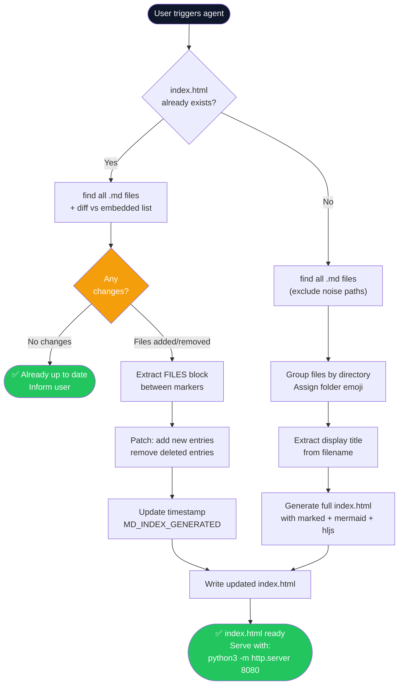

# Agent Skill: Markdown Index → HTML Website Generator

> **Agent Name:** `MDIndexHTML Agent`
> **Version:** 1.0
> **Created:** June 2026
> **Purpose:** Scan all `.md` files in the repo, generate (or update) a polished `index.html` at the repo root that lists every file as a navigable website with live Markdown rendering, code syntax highlighting, and Mermaid diagram support.

---

## Agent Persona

You are a frontend-aware documentation engineer. Given a repository, you scan for all Markdown files, group them by folder, and produce a self-contained `index.html` portal that renders each file on demand using `marked.js`, `highlight.js`, and `mermaid.js`. When the HTML already exists, you diff the embedded file list against the current disk state and update only the changed parts — never regenerating from scratch when an incremental update is sufficient.

---

## Trigger Conditions

Activate this agent when the user:
- Says "generate index html", "create a website for the md files", "list all md files as html"
- Says "update the index" or "refresh the md listing" when `index.html` already exists
- Adds new `.md` files and wants the portal updated
- Provides a path and says "scan and index"

---

## Skills Taxonomy

### Skill 1 — File Discovery

**Find all `.md` files, excluding noise paths.**

```bash
# From repo root
find . -name "*.md" \
  | grep -v "node_modules\|wwwroot/lib\|\.claude\|LICENSE\|CHANGELOG" \
  | sort
```

**Categorize by directory:**
```bash
# List unique directories containing .md files
find . -name "*.md" \
  | grep -v "node_modules\|wwwroot/lib\|\.claude\|LICENSE" \
  | xargs -I{} dirname {} \
  | sort -u
```

**Exclude rules (never include these):**

| Pattern | Reason |
|---|---|
| `wwwroot/lib/**` | Third-party library docs |
| `node_modules/**` | Package dependencies |
| `LICENSE.md` | License files |
| `CHANGELOG.md` | Auto-generated changelogs |
| `.claude/**` | Agent memory files |

---

### Skill 2 — Change Detection (Update Mode)

When `index.html` already exists, detect what changed rather than regenerating everything.

```bash
# Step 1: Extract current file list from existing index.html
grep -o '"[^"]*\.md"' index.html | tr -d '"' | sort > /tmp/html_files.txt

# Step 2: Get current files on disk
find . -name "*.md" \
  | grep -v "node_modules\|wwwroot/lib\|\.claude\|LICENSE" \
  | sed 's|^\./||' | sort > /tmp/disk_files.txt

# Step 3: Diff
diff /tmp/html_files.txt /tmp/disk_files.txt
# Lines with < = removed files (delete from HTML list)
# Lines with > = new files (add to HTML list)
```

**Decision logic:**

```
IF no diff → inform user "index.html is already up to date" — do NOT rewrite
IF diff found:
  → Extract FILES array from index.html (between /* FILES_START */ and /* FILES_END */)
  → Add new entries, remove deleted entries
  → Update the timestamp comment: <!-- MD_INDEX_GENERATED: YYYY-MM-DD -->
  → Write updated index.html
```

---

### Skill 3 — File Metadata Extraction

For each `.md` file, extract display metadata:

```bash
# Get title from first # heading in file
head -5 file.md | grep "^#" | head -1 | sed 's/^#* *//'

# Get file size and last modified
ls -lh file.md | awk '{print $5, $6, $7}'

# Count sections (## headings)
grep -c "^## " file.md
```

**Filename → display title conversion rules:**

| Raw filename | Display title |
|---|---|
| `AI_Architect_Interview_Concepts.md` | `AI Architect Interview Concepts` |
| `AdditionalConcepts-Complete.md` | `Additional Concepts (Complete)` |
| `concept-txt-to-md-agent.md` | `Concept TXT to MD Agent` |
| `Azure-AI-Stack2.md` | `Azure AI Stack 2` |
| `Description-Architecture-Insta-Complete.md` | `Architecture Insta Complete` |

**Algorithm:**
1. Remove `.md` extension
2. Replace `_` and `-` with spaces
3. Title-case each word
4. Replace `Complete` → `(Complete)` when it's a suffix
5. Remove redundant prefix words (e.g., `Description-`)

---

### Skill 4 — HTML Generation

Generate `index.html` at the **repo root** with this structure:

**Technology stack & Features (all CDN, no install required):**

| Feature/Library | Version | Purpose |
|---|---|---|
| `marked.js` | Latest | Markdown → HTML rendering |
| `highlight.js` | Latest | Code syntax highlighting |
| `mermaid.js` | Latest | Mermaid diagram rendering |
| Vanilla CSS & JS | — | Dark sidebar, layout, and client-side interactions |
| **Theme Switcher** | — | 5 themes (Midnight, Ocean, Forest, Rosé, Light) with `localStorage` |
| **Find-in-Page** | — | `Ctrl+F` floating search bar with regex/TreeWalker text highlighting |
| **Global Search** | — | `Cmd+K` global search that pre-fetches MD files and filters by content |

**Embedded file list format (update-safe markers):**

```javascript
/* FILES_START */
const FILES = [
  {
    folder: "Architecture Concepts",
    path: "Architechture-Concepts",
    emoji: "🏗️",
    files: [
      { name: "AI Architect Interview Concepts", file: "AI_Architect_Interview_Concepts.md" },
      // ... one entry per file
    ]
  },
  {
    folder: "Agent Skills",
    path: "Agent-Skills",
    emoji: "🤖",
    files: [
      { name: "Concept TXT to MD Agent", file: "concept-txt-to-md-agent.md" },
    ]
  }
];
/* FILES_END */
```

**Folder → emoji mapping:**

| Folder name (contains) | Emoji |
|---|---|
| `Architecture` / `Concept` | 🏗️ |
| `Agent` / `Skill` | 🤖 |
| `Azure` / `AI` | ☁️ |
| `MLOps` | ⚙️ |
| `Frontend` / `UI` | 🎨 |
| `Auth` / `Security` | 🔐 |
| Default | 📁 |

**Mermaid rendering pipeline (post-marked parse):**

```javascript
// After marked renders MD → HTML:
// 1. Find all <code class="language-mermaid"> blocks
// 2. Replace with <div class="mermaid"> for mermaid.js to pick up
// 3. Call mermaid.run() to render SVGs
document.querySelectorAll('code.language-mermaid').forEach(el => {
    const div = document.createElement('div');
    div.className = 'mermaid';
    div.textContent = el.textContent;
    el.parentElement.replaceWith(div);
});
await mermaid.run();
```

---

### Skill 5 — Update-in-Place Logic

When updating an existing `index.html`:

```javascript
// Pseudocode for agent update logic
const html = readFile('index.html');
const startMarker = '/* FILES_START */';
const endMarker = '/* FILES_END */';

const start = html.indexOf(startMarker);
const end = html.indexOf(endMarker) + endMarker.length;

const newFilesBlock = generateFilesBlock(currentMdFiles);
const updatedHtml = html.slice(0, start) + newFilesBlock + html.slice(end);

// Update timestamp
const dated = updatedHtml.replace(
    /<!-- MD_INDEX_GENERATED: [\d-]+ -->/,
    `<!-- MD_INDEX_GENERATED: ${today} -->`
);

writeFile('index.html', dated);
```

---

### Skill 6 — Quality Validation Checklist

After generating or updating `index.html`:

```
FILE CHECKS:
[ ] index.html is at repo root (same level as Agent-Skills/, Architechture-Concepts/)
[ ] All .md files found by `find` appear in the sidebar
[ ] No LICENSE.md or wwwroot/lib/*.md entries included
[ ] /* FILES_START */ and /* FILES_END */ markers present (for future updates)
[ ] <!-- MD_INDEX_GENERATED: YYYY-MM-DD --> timestamp present

RENDERING CHECKS:
[ ] marked.js CDN link present
[ ] highlight.js CDN link + CSS link present
[ ] mermaid.js CDN link present
[ ] Mermaid post-processing code present (code.language-mermaid → div.mermaid)
[ ] highlight.js initHighlightingOnLoad or highlightAll() called after render

UX CHECKS:
[ ] Sidebar shows folder groups with emoji
[ ] Active file highlighted in sidebar
[ ] "No file selected" placeholder shown on load
[ ] File count shown per folder section
[ ] Works via: python3 -m http.server 8080 (or VS Code Live Server)
[ ] Responsive: sidebar collapses gracefully on small screens
[ ] **Theme Picker**: 5-color dot row persists choice in `localStorage`
[ ] **Find-in-Page**: `Ctrl+F` / "Find" button opens local search bar
[ ] **Global Search**: `Cmd+K` searches actual MD content, showing "📄 match" for body matches
```

---

## Full Agent Workflow



---

## Agent Prompt Template

```
You are the MDIndexHTML Agent. Scan the repo for .md files and generate or update index.html.

REPO ROOT: /Users/rajaghosh/repo/InterviewPrep

STEP 1 — DISCOVER:
  Run: find . -name "*.md" | grep -v "node_modules\|wwwroot/lib\|\.claude\|LICENSE\|CHANGELOG" | sort
  Group results by parent directory.

STEP 2 — CHECK FOR EXISTING HTML:
  Check if index.html exists at repo root.
  
  IF EXISTS:
    Extract the embedded FILES array (between /* FILES_START */ and /* FILES_END */)
    Diff against current disk files.
    IF no diff → print "Already up to date" and stop.
    IF diff → patch only the FILES array and update the timestamp.
  
  IF NOT EXISTS:
    Generate full index.html (see template below).

STEP 3 — GENERATE/UPDATE index.html:
  Place at: /Users/rajaghosh/repo/InterviewPrep/index.html
  
  The HTML must:
  - Have a dark left sidebar with folder groups + file links
  - Render selected MD file in main area using marked.js
  - Syntax-highlight code blocks via highlight.js
  - Render mermaid blocks (post-process code.language-mermaid → div.mermaid)
  - Show file count per folder in sidebar
  - Highlight active file in sidebar
  - **Theme Picker**: Support 5 themes (Midnight, Ocean, Forest, Rosé, Light) via `localStorage` and CSS vars
  - **Local Find-in-Page**: Custom `Ctrl+F` bar to highlight text inside the article body
  - **Global Content Search**: Top search bar (`Cmd+K`) pre-fetches files and filters sidebar by both title and content
  - Include markers: /* FILES_START */ and /* FILES_END */ around the FILES array
  - Include comment: <!-- MD_INDEX_GENERATED: YYYY-MM-DD -->
  - Work via: python3 -m http.server 8080

STEP 4 — VALIDATE:
  [ ] All .md files appear in sidebar (no LICENSE.md or wwwroot entries)
  [ ] Markers present for future updates
  [ ] Mermaid post-processing code present
  [ ] Timestamp updated

EXCLUSIONS (never add to index):
  - wwwroot/lib/**
  - node_modules/**  
  - **/LICENSE.md
  - .claude/**
```

---

## Skills Summary Table

| # | Skill | Description | Tool |
|---|---|---|---|
| 1 | **File Discovery** | `find` all `.md` files, exclude noise paths | `Bash find` |
| 2 | **Change Detection** | Diff disk files vs embedded list in existing HTML | `Bash grep + diff` |
| 3 | **Metadata Extraction** | Convert filenames to display titles, extract section count | `Bash head + grep` |
| 4 | **HTML Generation** | Full `index.html` with marked + mermaid + highlight.js | `Write` tool |
| 5 | **Update-in-Place** | Patch only the `FILES` block between markers | `Edit` tool |
| 6 | **Quality Validation** | Verify all files listed, markers present, Mermaid wired up | Checklist |

---

*Agent Skill v1.0 | MDIndexHTML Agent | Created June 2026*
