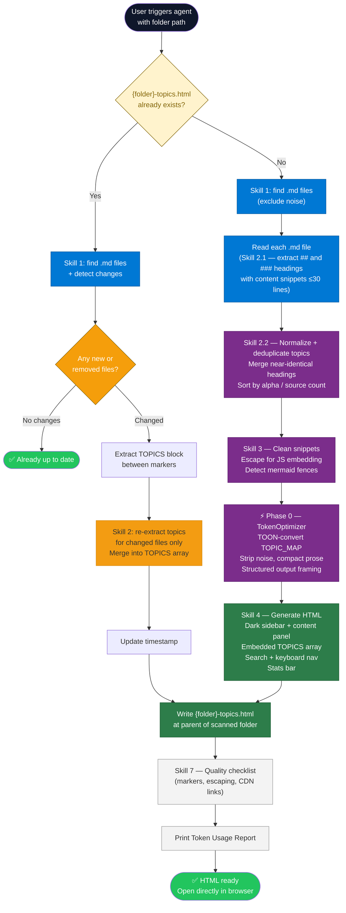
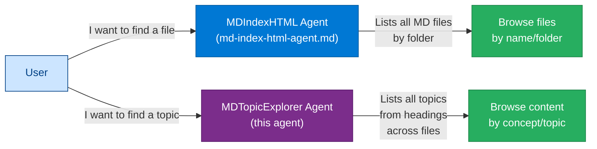

# Agent Skill: Markdown Topic Explorer — HTML Generator

> **Agent Name:** `MDTopicExplorer Agent`
> **Version:** 1.0
> **Created:** July 2026
> **Purpose:** Scan a target folder of `.md` files, extract unique topics from headings (`##`, `###`), deduplicate them across files, and generate a self-contained `{folder}-topics.html` file. Clicking a topic in the HTML shows all content sections from every file that covers that topic, rendered inline with Markdown support.

---

## Agent Persona

You are a knowledge-indexing engineer. Given a folder of Markdown files, you identify every distinct topic covered across all files, deduplicate near-identical headings, and produce a single-file HTML explorer where each topic links to its content from the source documents. You embed all content directly in the HTML so it works as a standalone file without a server.

---

## Trigger Conditions

Activate this agent when the user:
- Says "create a topic explorer for `<folder>`", "scan `<folder>` and list topics", "topic index html for `<folder>`"
- Says "show me what topics are covered in `<folder>`"
- Says "generate an html from the topics in `<folder>`"
- Provides a folder path and says "list unique topics as html" or "topic viewer"

---

## Token Optimization Protocol

> **Calls:** `TokenOptimizer Agent` — see `Agent-Skills/token-optimizer-agent.md`

After file discovery (Skill 1) and topic extraction (Skill 2), pass the collected topic-to-content map through the TokenOptimizer before generating HTML.

### Invocation Pattern

```
═══════════════════════════════════════════════════════════
PHASE 0 — TOKEN OPTIMIZATION (TokenOptimizer Agent)
═══════════════════════════════════════════════════════════
content      : [topic list with source paths and section snippets — structured data]
task_context : "Generate HTML topic explorer for {FOLDER} Markdown files"
source_type  : "structured_data"

→ Run TokenOptimizer Skills 1–8:
   • TOON-convert the topic→file mapping array (uniform: topic, files[], snippet)
   • Semantic-deduplicate near-identical topic names before embedding
   • Strip navigation/footer boilerplate from extracted section content
   • Compact-engineer verbose topic intro paragraphs (preserve code/tables)
   • Structured output framing: request TOPICS array in JSON schema format
→ Store OPTIMIZED_CONTENT (use for TOPICS array in HTML generation)
→ Store TOKEN_REPORT (display after HTML is written)
═══════════════════════════════════════════════════════════
```

**TOON example for topic map:**

Before (verbose per-topic JSON):
```json
[
  {"topic":"RAG Architecture","files":["Azure-AI-Foundry-RAG.md","Agentic-RAG.md"],"snippet":"RAG combines..."},
  {"topic":"Vector Search","files":["Azure-AI-Search.md"],"snippet":"Vector search enables..."}
]
```

After (TOON — compact for generation prompt):
```
topics[N]{topic,files,snippet}:
  RAG Architecture,"Azure-AI-Foundry-RAG.md|Agentic-RAG.md",RAG combines retrieval with generation...
  Vector Search,Azure-AI-Search.md,Vector search enables similarity-based lookup...
```

### Token Usage Report (append after HTML is written)

```
═══════════════════════════════════════════════════════════
Token Usage Report
═══════════════════════════════════════════════════════════
Estimated without optimization:  ~{original_tokens_estimate} tokens
Actual (with optimization):      ~{optimized_tokens_estimate} tokens
Savings:                         ~{savings_tokens} tokens ({savings_percent}%)
Techniques applied:              {techniques_applied}
Files scanned:                   {N}
Unique topics extracted:         {T}
═══════════════════════════════════════════════════════════
* Estimates: prose chars ÷ 4, code chars ÷ 3. Actual API usage varies by model.
```

---

## Skills Taxonomy

### Skill 1 — File Discovery

**Find all `.md` files in the target folder (non-recursive by default; recursive if user specifies).**

```bash
# Non-recursive (default) — direct children only
find "{FOLDER_PATH}" -maxdepth 1 -name "*.md" | sort

# Recursive — all descendants
find "{FOLDER_PATH}" -name "*.md" \
  | grep -v "node_modules\|\.claude\|LICENSE\|CHANGELOG" \
  | sort
```

**Output:** `FILE_LIST` — sorted list of absolute paths.

**Exclusion rules:**

| Pattern | Reason |
|---|---|
| `**/LICENSE.md` | License boilerplate, not topical content |
| `**/CHANGELOG.md` | Changelog noise |
| `.claude/**` | Agent memory, not content |
| `node_modules/**` | Dependency docs |

---

### Skill 2 — Topic Extraction

For each file in `FILE_LIST`, extract all headings at `##` and `###` level along with the content block under each heading.

#### 2.1 Heading Extraction Algorithm

```
FOR each file in FILE_LIST:
  1. Read the file
  2. Split into lines
  3. FOR each line:
     IF line matches /^#{2,3}\s+(.+)/:
       topic_text  = captured group (strip leading #s and whitespace)
       topic_level = count of leading # characters (2 or 3)
       start_line  = current line index
     COLLECT all lines between start_line+1 and the next ##/### heading
       as snippet_lines (trim to first 30 lines for token efficiency)
  4. Build list of {topic_text, topic_level, source_file, snippet_lines}
```

**Snippet truncation rule:** Keep up to 30 lines of content per section. If section is longer, append `<!-- …truncated -->` marker. This keeps the embedded HTML file manageable.

#### 2.2 Topic Deduplication

After collecting all `{topic_text, source_file, snippet_lines}` triples across all files:

```
1. Normalize each topic_text:
   - Lowercase
   - Strip punctuation: :, (, ), /, \, -, —
   - Strip common suffixes: "overview", "introduction", "intro", "summary"
   - Collapse multiple spaces

2. Build CANONICAL_TOPIC_MAP:
   key   = normalized topic_text
   value = {
     canonical_name : most common original form (capitalize each word),
     sources        : [{file, snippet_lines, original_heading}]
   }

3. Merge rule:
   IF normalized forms match exactly → merge under one canonical_name
   IF edit-distance ≤ 2 AND length > 5 chars → consider duplicate; use longer original form
   IF topics share 80%+ of the same words → group as related (NOT merged — list together)

4. Sort final topics:
   Primary:   alphabetical by canonical_name
   Secondary: topics with more sources listed first (cross-file topics are more significant)
```

**Deduplication examples:**

| Raw headings (across files) | Canonical topic |
|---|---|
| `## RAG Architecture`, `## RAG Architecture Overview` | `RAG Architecture` |
| `## Azure AI Search`, `## Azure AI Search Overview` | `Azure AI Search` |
| `### What is a Vector Store?`, `### Vector Store` | `Vector Store` |
| `## Introduction`, `## Introduction to Agents` | kept separate (too different after normalization) |

#### 2.3 Output — TOPIC_MAP

```
TOPIC_MAP = [
  {
    canonical_name  : "RAG Architecture",
    topic_level     : 2,
    source_count    : 3,
    sources: [
      {
        file      : "Azure-AI-Foundry-RAG-Complete-Guide.md",
        original  : "## RAG Architecture",
        snippet   : "<first 30 lines of section content>",
        line_no   : 42
      },
      ...
    ]
  },
  ...
]
```

---

### Skill 3 — Content Preparation

Before embedding in HTML, clean each snippet:

#### 3.1 Strip Noise from Snippets

| Pattern | Action |
|---|---|
| Lines matching `^>.*\bGenerated\b` or `^>.*\bCreated\b` | Remove (metadata, not content) |
| Repeated horizontal rules `---` at start of snippet | Remove |
| Empty lines at start/end of snippet | Trim |
| `<!-- … -->` HTML comments at top of snippet | Remove |

#### 3.2 Escape for JavaScript Embedding

When embedding snippets in the HTML `<script>` block:
- Escape backticks: `` ` `` → `` \` ``
- Escape `${` → `\${` (prevents template literal interpolation)
- Escape `\` → `\\`
- Preserve newlines as `\n` in string literals

#### 3.3 Filename → Display Name Conversion

Apply the same rules as `MDIndexHTML Agent` Skill 3:
1. Remove `.md` extension
2. Replace `_` and `-` with spaces
3. Title-case each word
4. Remove trailing `(Complete)` from display but keep in path

---

### Skill 4 — HTML Generation

Generate `{FOLDER_BASENAME}-topics.html` in the **parent directory of the scanned folder** (or repo root if folder is at root level).

**File name rule:** `{lowercase-folder-name}-topics.html`
Example: scanning `Architechture-Concepts/` → `architechture-concepts-topics.html`

#### 4.1 Technology Stack (all CDN, no install)

| Library | Purpose |
|---|---|
| `marked.js` (latest) | Render Markdown snippet content |
| `highlight.js` (latest) | Syntax-highlight code blocks |
| Vanilla CSS + JS | Layout, search, interactions |

#### 4.2 HTML Layout

```
┌─────────────────────────────────────────────────────┐
│  HEADER: "{FOLDER_NAME} — Topic Explorer"           │
│  [Search topics... 🔍]              [N topics found] │
├──────────────────────┬──────────────────────────────┤
│  TOPIC LIST          │  CONTENT PANEL               │
│  (scrollable)        │  (main area)                 │
│                      │                              │
│  ● RAG Architecture  │  # RAG Architecture          │
│    3 files           │                              │
│  ● Azure AI Search   │  📄 Azure-AI-Foundry-RAG.md  │
│    1 file            │  ─────────────────────────── │
│  ● Vector Store      │  <rendered markdown snippet> │
│    2 files           │                              │
│  …                   │  📄 Agentic-RAG.md           │
│                      │  ─────────────────────────── │
│                      │  <rendered markdown snippet> │
│                      │                              │
│                      │  [← No topic selected]       │
└──────────────────────┴──────────────────────────────┘
```

#### 4.3 Embedded Data Format (update-safe markers)

```javascript
/* TOPICS_START */
const TOPICS = [
  {
    name: "RAG Architecture",
    count: 3,
    sources: [
      {
        file: "Azure-AI-Foundry-RAG-Complete-Guide.md",
        displayName: "Azure AI Foundry RAG Complete Guide",
        heading: "## RAG Architecture",
        content: `<escaped markdown snippet>`
      },
      // ... one entry per source file for this topic
    ]
  },
  // ... one entry per unique topic
];
/* TOPICS_END */
```

#### 4.4 Interaction Behaviour

- **On load:** Show placeholder "Select a topic from the list" in content panel
- **Topic click:** Render all source snippets for that topic using `marked.js`; highlight active topic in list
- **Search bar:** Filter topic list in real-time as user types (case-insensitive, matches topic name OR file names)
- **Source badge:** Each source section shows `📄 {displayName}` as a header before the snippet
- **File count badge:** Each topic in the list shows `{N} file(s)` in grey text beneath the topic name
- **Cross-file highlight:** Topics appearing in 3+ files get a `⭐` badge (high-coverage indicator)
- **Keyboard:** Arrow Up/Down navigates topic list; Enter selects; Escape clears search

#### 4.5 CSS Design

```css
/* Dark theme (default) — core variables */
:root {
  --bg-main: #0f172a;
  --bg-sidebar: #1e293b;
  --bg-card: #1e293b;
  --border: #334155;
  --text-primary: #f1f5f9;
  --text-secondary: #94a3b8;
  --accent: #3b82f6;
  --accent-hover: #60a5fa;
  --badge-bg: #1d4ed8;
  --star-color: #f59e0b;
  --source-header-bg: #0f172a;
  --source-header-border: #3b82f6;
}
```

**Sidebar topic item anatomy:**
```
┌──────────────────────────────┐
│ ● RAG Architecture      ⭐   │  ← topic name + star badge
│   3 files  •  Azure, Agentic │  ← file count + abbreviated source names
└──────────────────────────────┘
```

Active item: left border `4px solid var(--accent)` + background `rgba(59,130,246,0.15)`

#### 4.6 Mermaid Support (Optional)

If any snippet contains a ` ```mermaid ` block, post-process after `marked.js` renders:

```javascript
document.querySelectorAll('code.language-mermaid').forEach(el => {
    const div = document.createElement('div');
    div.className = 'mermaid';
    div.textContent = el.textContent;
    el.parentElement.replaceWith(div);
});
if (typeof mermaid !== 'undefined') mermaid.run();
```

Include `mermaid.js` CDN **only** if at least one snippet contains a mermaid fence. Check with:
```bash
grep -rl '```mermaid' "{FOLDER_PATH}" | head -1
```
If output is non-empty → include mermaid CDN link; else skip it.

---

### Skill 5 — Statistics Panel

Include a small stats row at the top of the content panel (visible before any topic is selected):

```html
<div class="stats-bar">
  <span>📁 {N} files scanned</span>
  <span>🏷️ {T} unique topics</span>
  <span>⭐ {S} cross-file topics</span>
  <span>📅 Generated {DATE}</span>
</div>
```

---

### Skill 6 — Update-in-Place Logic

When `{folder}-topics.html` already exists:

```
1. Extract TOPICS array between /* TOPICS_START */ and /* TOPICS_END */
2. Run Skill 1 file discovery again
3. IF file list unchanged AND TOPICS count unchanged → inform user "already up to date"
4. IF changed:
   a. Re-run Skills 2–3 only for new/changed files
   b. Merge new topics into existing TOPICS array
   c. Write updated TOPICS block between markers
   d. Update the <!-- GENERATED: YYYY-MM-DD --> timestamp
```

---

### Skill 7 — Quality Validation Checklist

After generating the HTML:

```
FILE CHECKS:
[ ] HTML file saved at correct path ({parent}/{folder}-topics.html)
[ ] /* TOPICS_START */ and /* TOPICS_END */ markers present
[ ] <!-- GENERATED: YYYY-MM-DD --> timestamp comment present
[ ] TOPICS array is valid JavaScript (no trailing commas in IE-unsafe positions)

CONTENT CHECKS:
[ ] Every .md file in folder contributes at least one topic
[ ] No LICENSE.md / .claude/** content included
[ ] All backticks in snippets are escaped (\`)
[ ] All ${...} patterns in snippets are escaped (\${)

UX CHECKS:
[ ] marked.js CDN link present and version-pinned
[ ] highlight.js CDN + CSS present
[ ] mermaid.js included only if mermaid fences detected
[ ] Search bar filters by both topic name and file name
[ ] Arrow-key navigation works (verified in script logic)
[ ] File count badge shown per topic
[ ] ⭐ shown for topics in 3+ files
[ ] Stats bar shows correct counts
[ ] Works when opened as file:// (no server required for non-mermaid content)
```

---

## Full Agent Workflow



---

## Agent Prompt Template

```
You are the MDTopicExplorer Agent. Scan the target folder's .md files,
extract unique topics from ## and ### headings, and generate a self-contained
HTML explorer.

TARGET FOLDER: {FOLDER_PATH}
OUTPUT FILE:   {PARENT_PATH}/{folder-basename}-topics.html

STEP 1 — DISCOVER FILES:
  find "{FOLDER_PATH}" -maxdepth 1 -name "*.md" \
    | grep -v "LICENSE\|CHANGELOG" | sort
  (Add -maxdepth flag only when scanning non-recursively; drop it for recursive.)

STEP 2 — EXTRACT TOPICS:
  For each .md file:
    - Read the full file
    - Identify all ## and ### headings
    - Collect up to 30 lines of content under each heading
    - Record: {topic_text, source_file, snippet}

STEP 3 — DEDUPLICATE TOPICS:
  - Normalize all topic names (lowercase, strip punctuation, strip suffix words)
  - Merge exact-normalized-match topics under one canonical name
  - Flag topics appearing in 3+ files with ⭐

STEP 4 — PHASE 0 TOKEN OPTIMIZATION:
  Pass TOPIC_MAP through TokenOptimizer Agent (see token-optimizer-agent.md)

STEP 5 — CHECK FOR EXISTING HTML:
  IF {folder}-topics.html exists:
    - Diff current file list vs embedded list
    - IF no change: print "Already up to date" and stop
    - IF changed: patch only the TOPICS block + timestamp

  IF NOT EXISTS:
    - Generate full HTML (see structure below)

STEP 6 — GENERATE HTML:
  Place at: {PARENT_PATH}/{folder-basename}-topics.html

  The HTML must:
  - Have a dark left sidebar listing all unique topics
  - Show file count badge per topic (e.g. "3 files")
  - Show ⭐ for topics in 3+ files
  - Show stats bar: files scanned, unique topics, cross-file topics, date
  - Render clicked topic's content sections using marked.js
  - Show source file name (📄 Display Name) before each snippet
  - Support real-time search filtering both topic name and file names
  - Support arrow-key navigation in topic list
  - Include /* TOPICS_START */ and /* TOPICS_END */ markers
  - Include <!-- GENERATED: YYYY-MM-DD --> comment
  - Work when opened directly as a local file (file:// protocol)
  - Include mermaid.js CDN only if mermaid fences detected in source files

STEP 7 — VALIDATE:
  Run through the Skill 7 quality checklist before reporting done.

EXCLUSIONS (never include):
  - LICENSE.md, CHANGELOG.md
  - .claude/** files
  - node_modules/**
  - The generated HTML file itself
```

---

## Topic Normalization Reference

| Raw heading | Normalized key | Canonical display name |
|---|---|---|
| `## RAG Architecture Overview` | `rag architecture` | `RAG Architecture` |
| `## RAG Architecture` | `rag architecture` | `RAG Architecture` |
| `### What is Vector Search?` | `vector search` | `Vector Search` |
| `## Vector Search` | `vector search` | `Vector Search` |
| `## Azure AI Search — Overview` | `azure ai search` | `Azure AI Search` |
| `## Azure AI Search` | `azure ai search` | `Azure AI Search` |
| `## Introduction` | `introduction` | `Introduction` *(kept if unique)* |
| `## Introduction to Agents` | `introduction to agents` | `Introduction to Agents` *(kept separate)* |

**Normalization steps (apply in order):**
1. Lowercase entire string
2. Remove leading `what is `, `overview of `, `introduction to `
3. Strip trailing ` overview`, ` introduction`, ` intro`, ` summary`, ` complete`
4. Remove characters: `:`, `?`, `!`, `(`, `)`, `/`, `\`, `—`, `–`
5. Collapse multiple spaces to single space
6. Trim leading and trailing whitespace

---

## Error Handling

| Situation | Action |
|---|---|
| Folder path not found | Ask user for the correct path. Do not guess. |
| Folder contains 0 `.md` files | Report "No .md files found in {FOLDER}". Suggest checking the path. |
| File is empty | Skip it. Note in output: "{file} was empty — skipped." |
| File has no `##` or `###` headings | Include it but flag: topics derived from `#` title only. |
| Snippet contains unterminated code fence | Close it before embedding: append ` ``` ` at end of snippet. |
| Deduplicated topic list is very large (>200 topics) | Paginate: show first 50 in sidebar, "Load more →" button for rest. |
| Same topic name 100% identical across 5+ files | Merge all snippets under one topic; sort sources alphabetically. |

---

## Relationship to MDIndexHTML Agent



**Use `MDIndexHTML Agent`** when you want to navigate by file.
**Use `MDTopicExplorer Agent`** (this agent) when you want to navigate by concept/topic — the same topic may appear across many files.

---

## Skills Summary Table

| # | Skill | Description | Tool |
|---|---|---|---|
| 1 | **File Discovery** | `find` .md files in target folder; exclude noise | `Bash find` |
| 2 | **Topic Extraction** | Extract `##`/`###` headings + content snippets (≤30 lines) | `Read` tool |
| 2.2 | **Deduplication** | Normalize heading text; merge near-identical topics; sort | Logic |
| 3 | **Content Preparation** | Clean snippets; escape for JS; detect mermaid fences | `Bash grep` |
| 4 | **HTML Generation** | Self-contained HTML with sidebar, search, keyboard nav | `Write` tool |
| 5 | **Stats Panel** | Show file count, topic count, cross-file count, date | Inline HTML |
| 6 | **Update-in-Place** | Patch TOPICS block between markers; update timestamp | `Edit` tool |
| 7 | **Quality Validation** | Verify markers, escaping, CDN links, counts | Checklist |

---

*Agent Skill v1.0 | MDTopicExplorer Agent | Created July 2026*
