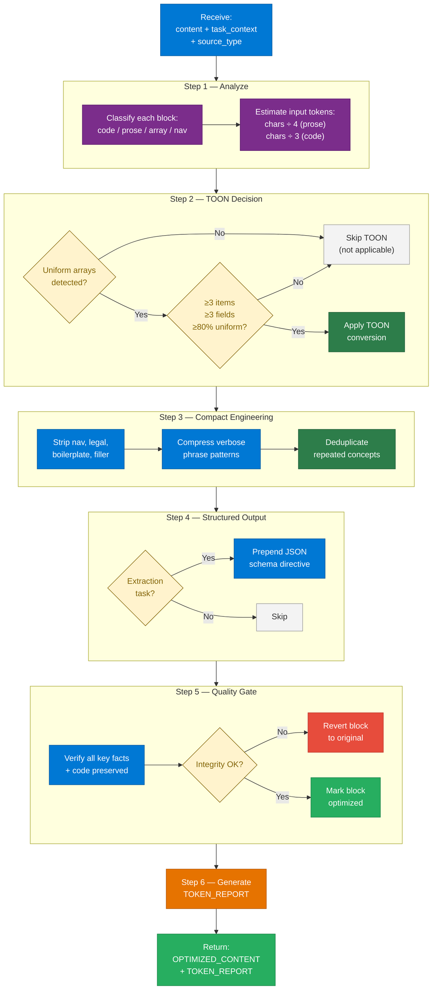

# Agent Skill: Token Optimizer Sub-Agent

> **Agent Name:** `TokenOptimizer Agent`
> **Version:** 1.0
> **Created:** July 2026
> **Purpose:** Analyze and compress input content before passing it to a main agent. Uses TOON format, compact prompt engineering, semantic deduplication, and structured-output framing to minimize token usage without degrading output quality. Reports actual vs. estimated-without-optimization token counts.

---

## Role in the Agent Pipeline

This agent is **never called directly by the user**. It is invoked internally by every other agent in the `Agent-Skills/` directory as a mandatory Phase 0 step before the main content generation.

```
User → Main Agent (BlogURLToMD / TutorialSeries / etc.)
              │
              ▼ Phase 0 (always runs first)
         TokenOptimizer Agent
              │
              ├── Returns: OPTIMIZED_CONTENT
              └── Returns: TOKEN_REPORT
              │
              ▼
       Main Agent uses OPTIMIZED_CONTENT for generation
              │
              ▼
       Final output + TOKEN_REPORT displayed to user
```

---

## Input Specification

```
content        : string  — all raw text/data collected for this task (fetched pages,
                           read files, user input, structured data) concatenated
task_context   : string  — one sentence: what the main agent will generate from this
source_type    : string  — "fetched_webpage" | "file_content" | "user_input"
                           | "structured_data" | "mixed"
```

---

## Skill 1 — Content Analysis

### 1.1 Block Classification

Scan the content and tag every block by type:

| Block Type | Detection Signal | Default Action |
|---|---|---|
| Uniform data array | Repeated objects with same key set | Evaluate for TOON |
| Prose / narrative | Natural-language paragraphs | Compact engineering |
| Code block | Fenced ` ``` ` blocks | Preserve exactly |
| Mermaid diagram | ` ```mermaid ` blocks | Preserve exactly |
| Markdown table | `\|`-delimited rows | Preserve (already compact) |
| Navigation breadcrumbs | `Home > Section > Page` patterns | Strip entirely |
| Legal / cookie notices | "©", "privacy policy", GDPR boilerplate | Strip entirely |
| Repetitive boilerplate | Same footer/header across multiple fetched pages | Strip all but first |
| Empty structural elements | Heading with no body before next heading | Remove |
| Self-evident captions | "The following table shows…", "As shown above…" | Remove |
| Filler openers | "It is important to note that…", "Please note:" | Strip opener only |

### 1.2 Estimate Input Tokens

```
prose_chars  = len(prose_blocks)
code_chars   = len(code_blocks + mermaid_blocks)

input_tokens_estimate = (prose_chars / 4) + (code_chars / 3)
```

*Rule of thumb: ~4 chars/token for English prose, ~3 chars/token for code/JSON. These are approximations; actual API tokenization varies.*

---

## Skill 2 — TOON Conversion

TOON (Token-Oriented Object Notation) compresses uniform arrays of objects into a tabular format, saving 30–60% of tokens on data-heavy content.

### 2.1 Decision Matrix

**USE TOON when ALL of the following are true:**
- Content contains a uniform array (same key set across items)
- Array has ≥ 3 items
- Objects have ≥ 3 fields
- Field uniformity ≥ 80% across all items
- Content is data-heavy (not primarily narrative prose)

**DO NOT USE TOON when ANY of the following is true:**
- Deeply nested or non-uniform object structures
- Pure tabular data (CSV is already more compact)
- Array has < 3 items (overhead not worth it)
- Content is primarily code or prose
- Latency-critical path where format parsing adds delay
- Semi-uniform arrays with < 40% tabular eligibility

### 2.2 TOON Syntax

```
# Single uniform array:
users[N]{field1,field2,field3}:
  value1a,value1b,value1c
  value2a,value2b,value2c

# Mixed structure (nested object + array):
context:
  task: content extraction
  format: structured
results[N]{name,type,score}:
  concept_a,definition,0.92
  concept_b,pattern,0.87
```

### 2.3 Conversion Steps

```
FOR each detected array in content:
  1. Extract field names from first object
  2. Verify: all items share ≥ 80% of same fields
  3. IF uniform → convert to TOON tabular layout
  4. IF non-uniform → leave as-is; do not force TOON
  5. Track: original_array_chars, toon_array_chars
  6. Record: section name / label for the TOKEN_REPORT
```

### 2.4 Example Transformation

**Before — verbose JSON array (147 chars):**
```json
[
  {"id": 1, "name": "Alice", "role": "admin", "active": true},
  {"id": 2, "name": "Bob",   "role": "user",  "active": true},
  {"id": 3, "name": "Carol", "role": "editor","active": false}
]
```

**After — TOON (55 chars, −63%):**
```
users[3]{id,name,role,active}:
  1,Alice,admin,true
  2,Bob,user,true
  3,Carol,editor,false
```

---

## Skill 3 — Compact Prompt Engineering

Apply to all prose blocks that will be passed as context or prompts to the LLM.

### 3.1 Strip Operations (remove entirely)

| Pattern | Example |
|---|---|
| Navigation / breadcrumbs | `Home > Azure > AI Search > Overview` |
| Cookie / GDPR notices | "We use cookies to improve your experience…" |
| Feedback widgets | "Was this page helpful? Yes / No" |
| Copyright footers | "© 2025 Microsoft Corporation. All rights reserved." |
| Redundant introductions | "This article explains X. After reading, you will know Y." |
| Social sharing prompts | "Share this article on Twitter / LinkedIn" |
| "Last reviewed" / "In this article" headers | Navigation-only text |

### 3.2 Compression Rewrites

| Verbose pattern | Compact replacement |
|---|---|
| "In order to achieve X, you need to do Y" | "To achieve X: Y" |
| "There are several ways to accomplish X" | "Ways to X:" |
| "The following table shows X" | *(remove — table is self-evident)* |
| "As you can see in the diagram above" | *(remove — diagram is self-evident)* |
| "It is worth mentioning that X" | "X." |
| "Please refer to the documentation for more information" | `[docs](<url>)` if URL known; else remove |
| "For the purposes of this guide, we will assume X" | "Assumption: X" |
| "At a high level, X works as follows:" | "X:" |

### 3.3 Keyword-Reference Deduplication

When the same concept / product description appears in multiple fetched sources:

```
1. Extract key definitions from source 1 → build DEDUP_GLOSSARY
2. For each subsequent source:
   - IF concept appears again (> 70% semantic overlap):
     → Replace with reference token: [ref:<key>]
   - IF concept is new:
     → Add to DEDUP_GLOSSARY
3. Prepend DEDUP_GLOSSARY to optimized content:
   [ref:azure_search] = Azure AI Search: Microsoft's managed vector + keyword search service
```

### 3.4 Lossless Prose Distillation

For dense reference content (docs pages, blog posts):

```
Strategy: Strip prose transitions, hedging, rhetoric, and common knowledge.
Preserve:  Numbers, entities, decisions, constraints, risks, version info, code.

Transform:
  "Azure AI Search provides powerful semantic ranking capabilities that allow 
   organizations to build search experiences that understand the intent behind 
   user queries, rather than just matching keywords."

→  "Azure AI Search: semantic ranking — understands query intent, not just keywords."
```

---

## Skill 4 — Structured Output Framing

When the main agent will extract structured data from the optimized content, prepend a schema directive so the LLM returns compact structured data instead of verbose prose.

| Main Agent Task | Schema Directive to Prepend |
|---|---|
| Concept extraction from docs | `Return JSON: {"concepts":[{"name":"","def":"","code":bool}]}` |
| Architecture description | `Return JSON: {"arch_overview":"","components":[""],"flows":[""]}` |
| Comparison data | `Return JSON: {"rows":[{"dim":"","a":"","b":""}]}` |
| Interview Q&A extraction | `Return JSON: [{"q":"","a":"","level":"beginner|intermediate|advanced"}]` |
| Key claims / metrics | `Return JSON: {"claims":[{"fact":"","source":""}]}` |

*Only apply when the subsequent step is a structured extraction — not when generating free-form Markdown output.*

---

## Skill 5 — Semantic Deduplication Across Multiple Sources

When content is assembled from multiple fetched URLs or files:

```
1. Assign each source a priority (primary / secondary / supplementary)
2. Process primary source first → build CONCEPT_INDEX
3. For each secondary/supplementary source:
   a. Extract concepts
   b. For each concept:
      - IF already in CONCEPT_INDEX with equal or greater depth → discard
      - IF already in CONCEPT_INDEX but secondary adds code/example → merge
      - IF new concept → add to CONCEPT_INDEX
4. Assemble OPTIMIZED_CONTENT from CONCEPT_INDEX (no repetition)
```

**Result:** A single deduplicated knowledge base — no concept explained twice across sources.

---

## Skill 6 — Model Routing Hint (Advisory Only)

When the main agent is performing a simple extraction or classification step (not full generation), append a routing hint to TOKEN_REPORT:

```
ROUTING HINT: This sub-task (classify / extract / route) is suitable for a budget-tier
model (Claude Haiku 4.5 / GPT-4o-mini). Reserve flagship models for the full generation step.
```

*This hint is informational — the calling agent decides whether to act on it.*

---

## Skill 7 — Token Estimation & Report Generation

### 7.1 Before/After Calculation

```
original_tokens_estimate  = (original_prose_chars / 4) + (original_code_chars / 3)
optimized_tokens_estimate = (optimized_prose_chars / 4) + (optimized_code_chars / 3)

savings_tokens  = original_tokens_estimate - optimized_tokens_estimate
savings_percent = round((savings_tokens / original_tokens_estimate) * 100, 1)
```

### 7.2 Track Techniques Applied

```
techniques_applied = []

IF toon_applied to any block:
  techniques_applied.append(f"TOON format ({toon_section_names})")

IF boilerplate_stripped:
  techniques_applied.append("Boilerplate stripping")

IF prose_compressed:
  techniques_applied.append("Compact prompt engineering")

IF deduplication_applied:
  techniques_applied.append("Semantic deduplication")

IF structured_output_framing:
  techniques_applied.append("Structured output framing")

IF keyword_refs_applied:
  techniques_applied.append("Keyword reference deduplication")
```

### 7.3 Report Object

```
TOKEN_REPORT = {
  original_content_chars    : <int>,
  optimized_content_chars   : <int>,
  original_tokens_estimate  : <int>,
  optimized_tokens_estimate : <int>,
  savings_tokens            : <int>,
  savings_percent           : <float>,
  techniques_applied        : [<list of strings>],
  toon_sections             : [<section names where TOON was applied>],
  quality_preserved         : true   ← always true (enforced by Skill 8)
}
```

---

## Skill 8 — Quality Gate (Non-Negotiable)

**The optimized content must preserve 100% of the information required for the main task.**

### 8.1 Never Remove

- Technical definitions and explanations
- Code samples, commands, configuration snippets
- Architecture descriptions and component details
- URLs, links, references needed for the output file
- Numbers, metrics, percentages, version numbers
- Mermaid diagram source code
- Interview Q&A content
- API/SDK names and method signatures

### 8.2 Verify After Each Optimization

```
FOR each block modified:
  1. Re-read the optimized block
  2. Check: does it preserve the technical meaning?
  3. Check: are all numbers, entity names, and constraints intact?
  4. IF uncertain → revert that block to original (safety-first)
  5. Recalculate token estimate without the reverted block

FOR TOON conversions:
  1. Verify field count matches original
  2. Verify row count matches original
  3. Verify no values were truncated or merged
```

### 8.3 Fail-Safe Rule

```
IF quality gate fails for any block:
  → Revert that block to its original form
  → Adjust savings calculation accordingly
  → Note in TOKEN_REPORT: "Block X reverted — quality gate triggered"
  → Never report savings that were not achieved
```

---

## Optimization Strategy Reference

| Strategy | Applicable To | Expected Savings | Source |
|---|---|---|---|
| **TOON format** | Uniform JSON/data arrays | 30–60% on array sections | toonformat.dev |
| **Boilerplate stripping** | Fetched web pages | 10–30% on nav/legal content | General practice |
| **Compact prompt engineering** | All prose content | 15–40% on verbose text | LLM best practices |
| **Semantic deduplication** | Multi-source fetches | 20–50% on repeated concepts | General practice |
| **Structured output framing** | Extraction tasks | 10–30% on output tokens | LLM best practices |
| **Keyword reference dedup** | Repeated named entities | 5–20% on context | Custom strategy |
| **Context caching (note)** | Static system prompts | Up to 90% (API feature) | Anthropic / OpenAI |
| **Model routing (hint)** | Simple sub-tasks | 60–95% on sub-task cost | RouteLLM / LiteLLM |

---

## Full Agent Workflow



---

## Integration Interface

Every main agent in `Agent-Skills/` invokes this agent using the following standard pattern, inserted **before** its main generation step:

```
═══════════════════════════════════════════════════════════
PHASE 0 — TOKEN OPTIMIZATION (TokenOptimizer Agent)
═══════════════════════════════════════════════════════════
content      : [all collected content for this task]
task_context : [one sentence: what will be generated]
source_type  : [fetched_webpage | file_content | user_input | structured_data | mixed]

→ Run Skills 1–8 of TokenOptimizer Agent
→ Store OPTIMIZED_CONTENT (use for all downstream generation)
→ Store TOKEN_REPORT (display at end of output)
═══════════════════════════════════════════════════════════
```

And at the very end of every main agent's output, display:

```
═══════════════════════════════════════════════════════════
Token Usage Report
═══════════════════════════════════════════════════════════
Estimated without optimization:  ~{original_tokens_estimate} tokens
Actual (with optimization):      ~{optimized_tokens_estimate} tokens
Savings:                         ~{savings_tokens} tokens ({savings_percent}%)
Techniques applied:              {techniques_applied joined by ", "}
═══════════════════════════════════════════════════════════
* Estimates: prose chars ÷ 4, code chars ÷ 3. Actual API usage varies by model.
```

---

## Skills Summary Table

| # | Skill | Purpose | Savings Range |
|---|---|---|---|
| 1 | **Content Analysis** | Classify blocks; estimate input tokens | Baseline measurement |
| 2 | **TOON Conversion** | Compress uniform arrays | 30–60% on array data |
| 3 | **Compact Engineering** | Strip boilerplate; compress prose | 15–40% on prose |
| 4 | **Structured Output Framing** | Prepend JSON schema for extractions | 10–30% on output |
| 5 | **Semantic Deduplication** | Remove repeated concepts across sources | 20–50% on multi-source |
| 6 | **Model Routing Hint** | Advisory: use cheaper model for sub-tasks | Informational only |
| 7 | **Token Estimation & Report** | Calculate and format savings | Reporting |
| 8 | **Quality Gate** | Ensure no information loss | Safety enforcer |

---

*Agent Skill v1.0 | TokenOptimizer Sub-Agent | Created July 2026*
