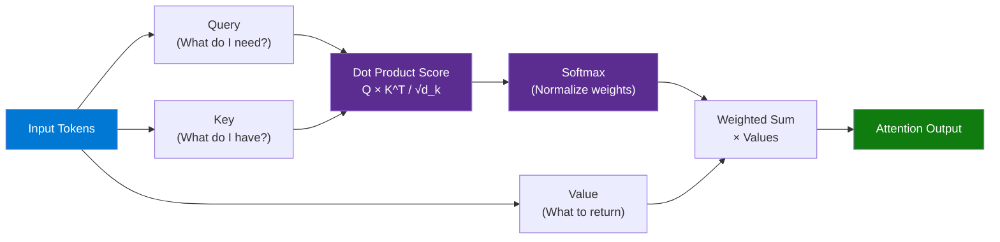
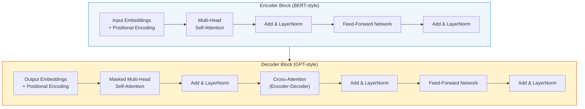
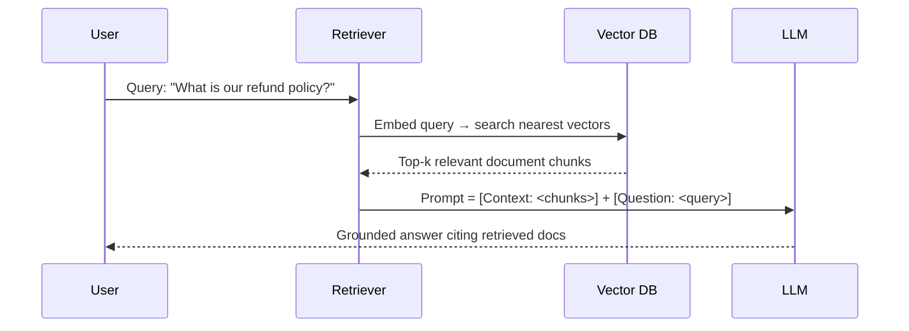
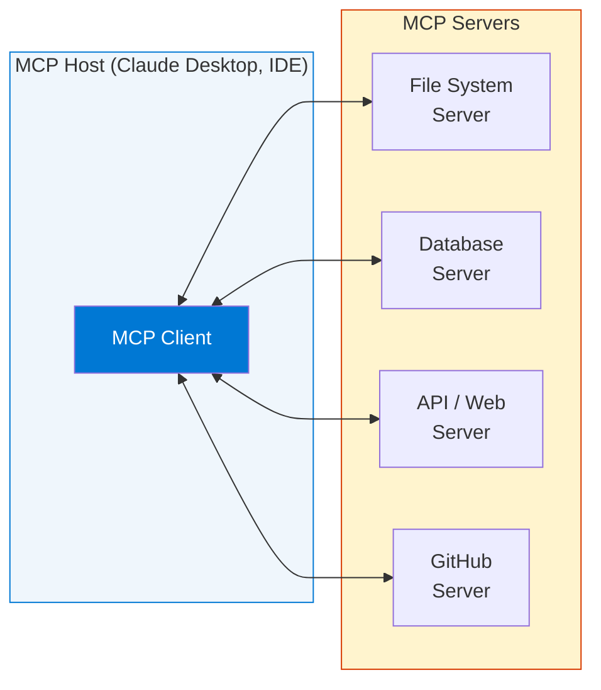
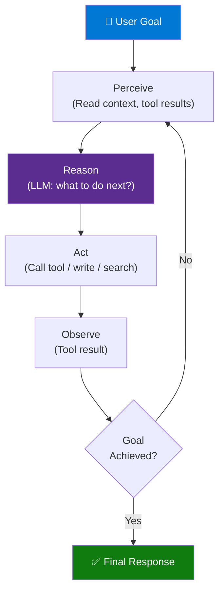
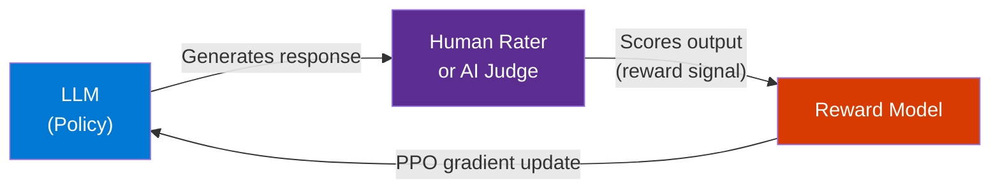
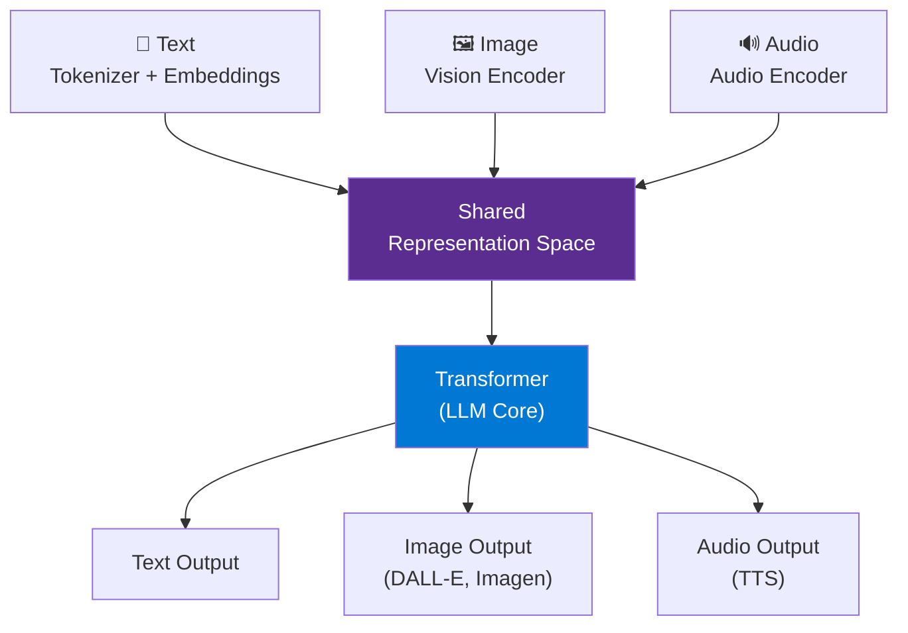
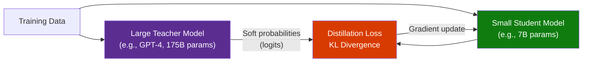
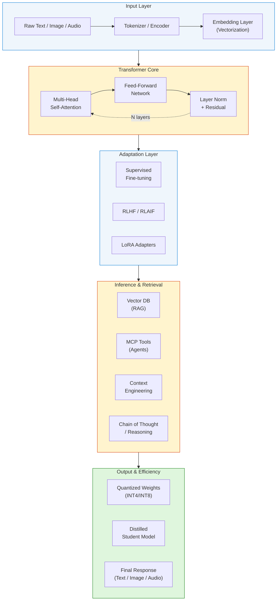
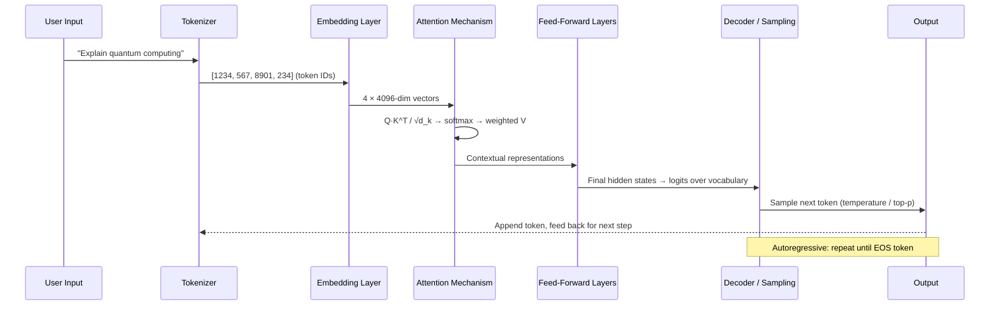

# 20 AI Concepts Explained in 40 Minutes

> **Source:** [YouTube — 20 AI Concepts Explained in 40 Minutes](https://www.youtube.com/watch?v=OYvlznJ4IZQ)
> **Channel/Event:** Gaurav Sen
> **Topic:** LLM, Tokenization, Vectorization, Attention, Transformer, RAG, Vector DB, MCP, Agents, Reasoning, Distillation, Quantization
> **Key Claim:** Shared AI vocabulary for engineers building AI systems — 20 foundational concepts in 40 minutes

---

## Table of Contents

1. [Overview](#1-overview)
2. [The 20 Concepts at a Glance](#2-the-20-concepts-at-a-glance)
3. [Core Concepts — Foundational Layer](#3-core-concepts--foundational-layer)
4. [Core Concepts — Architecture Layer](#4-core-concepts--architecture-layer)
5. [Core Concepts — Adaptation Layer](#5-core-concepts--adaptation-layer)
6. [Core Concepts — Retrieval & Memory Layer](#6-core-concepts--retrieval--memory-layer)
7. [Core Concepts — Agentic & Reasoning Layer](#7-core-concepts--agentic--reasoning-layer)
8. [Core Concepts — Efficiency Layer](#8-core-concepts--efficiency-layer)
9. [Architecture — The Modern AI Stack](#9-architecture--the-modern-ai-stack)
10. [How It Works — Token to Output Pipeline](#10-how-it-works--token-to-output-pipeline)
11. [Comparison Tables](#11-comparison-tables)
12. [Code Examples](#12-code-examples)
13. [Best Practices](#13-best-practices)
14. [Interview Talking Points](#14-interview-talking-points)
15. [Learning Resources](#15-learning-resources)

---

## 1. Overview

This video by Gaurav Sen covers the 20 foundational AI/ML concepts every software engineer needs to speak the language of modern AI systems. It is structured as a rapid-fire reference: not a deep-dive into any single topic, but a cohesive vocabulary guide that connects concepts — from raw text tokens all the way to quantized, distilled agents running on edge devices. The target audience is engineers who already code but need to reason, write, and discuss AI architecture fluently. Each concept is self-contained with a clear timestamp for quick review.

---

## 2. The 20 Concepts at a Glance

| # | Concept | Timestamp | Layer |
|---|---------|-----------|-------|
| 1 | Large Language Model | 00:28 | Foundation |
| 2 | Tokenization | 01:28 | Foundation |
| 3 | Vectorization | 02:53 | Foundation |
| 4 | Attention | 04:15 | Architecture |
| 5 | Self-Supervised Learning | 07:22 | Architecture |
| 6 | Transformer | 12:07 | Architecture |
| 7 | Fine-tuning | 14:32 | Adaptation |
| 8 | Few-shot Prompting | 17:05 | Adaptation |
| 9 | Retrieval Augmented Generation (RAG) | 18:11 | Retrieval & Memory |
| 10 | Vector Database | 20:33 | Retrieval & Memory |
| 11 | Model Context Protocol (MCP) | 23:03 | Retrieval & Memory |
| 12 | Context Engineering | 25:43 | Retrieval & Memory |
| 13 | Agents | 28:17 | Agentic & Reasoning |
| 14 | Reinforcement Learning | 29:19 | Agentic & Reasoning |
| 15 | Chain of Thought | 34:42 | Agentic & Reasoning |
| 16 | Reasoning Models | 35:55 | Agentic & Reasoning |
| 17 | Multi-modal Models | 36:36 | Agentic & Reasoning |
| 18 | Small Language Models | 38:21 | Efficiency |
| 19 | Distillation | 40:24 | Efficiency |
| 20 | Quantization | 41:47 | Efficiency |

---

## 3. Core Concepts — Foundational Layer

### Large Language Model (LLM)
A neural network with billions of parameters trained on massive text corpora to predict the next token given a sequence of tokens. LLMs are not rule-based; they learn statistical patterns across language. Key property: emergent capabilities (reasoning, coding, summarization) appear at scale without being explicitly trained.

### Tokenization
The process of splitting raw text into discrete units called **tokens** before feeding it to a model. Tokens are not always words — they are sub-word pieces (e.g., "unhappiness" → `["un", "happi", "ness"]`). The vocabulary size is fixed (GPT-4 uses ~100K tokens). Tokenization determines:
- What the model can represent
- How context length is measured (tokens, not characters)
- Cost of inference (billed per token)

**Key numbers:**
- ~4 chars ≈ 1 token (English)
- 1 page ≈ 500 tokens
- GPT-4 Turbo context: 128K tokens

### Vectorization (Embeddings)
Converting tokens into high-dimensional numerical vectors so the model can perform math on language. Each token maps to a vector in embedding space (e.g., 768 or 4096 dimensions). Semantically similar words cluster together — this is what enables meaning-aware operations.

```
"king" - "man" + "woman" ≈ "queen"  (classic word2vec demo)
```

The embedding space is learned during training. The model learns that "Paris" and "France" should be close in the same way "Berlin" and "Germany" are.

---

## 4. Core Concepts — Architecture Layer

### Attention
The core mechanism that allows a transformer to weigh how much each token should "pay attention" to every other token in the sequence. Attention solves the problem of long-range dependencies that RNNs couldn't handle.

**Scaled Dot-Product Attention:**

```
Attention(Q, K, V) = softmax(QK^T / √d_k) × V
```

- **Q (Query):** What am I looking for?
- **K (Key):** What do I have?
- **V (Value):** What do I return if I match?

**Multi-Head Attention** runs several attention operations in parallel, each learning different relationships (syntax, coreference, semantics).



### Self-Supervised Learning
Training a model on unlabeled data by deriving supervision signals from the data itself. For LLMs, the task is **next-token prediction** (Causal LM) or **masked token prediction** (BERT). No human labels required — the internet is the training set.

This is why LLMs can be trained at scale: no annotation bottleneck. The model sees a trillion tokens and learns by predicting what comes next.

### Transformer
The neural network architecture that replaced RNNs and LSTMs for sequence modeling. Key innovations:
1. **Parallel processing** — processes all tokens simultaneously (vs. sequential in RNNs)
2. **Self-attention** — every token attends to every other token
3. **Positional encoding** — since there's no recurrence, position must be injected



---

## 5. Core Concepts — Adaptation Layer

### Fine-tuning
Continuing to train a pre-trained model on a smaller, task-specific dataset to adapt it to a new domain or behavior. The base model's weights are updated (vs. frozen in other techniques).

| Type | Description | When to Use |
|---|---|---|
| **Full fine-tuning** | Update all weights | Maximum quality, high compute |
| **LoRA** | Low-rank adapters only | Efficient, preserves base model |
| **RLHF** | Human feedback signal | Align with human preferences |
| **Instruction tuning** | Train on instruction-response pairs | ChatGPT-style behavior |

**LoRA intuition:** Instead of updating the full weight matrix W (d×d), learn two small matrices A (d×r) and B (r×d) where r << d. At inference, W' = W + AB.

### Few-shot Prompting
Providing the model with a small number of input-output examples in the prompt to demonstrate the desired behavior — no weight updates required. The model generalizes from the pattern.

```
Zero-shot:  "Classify sentiment: 'I love this product'"
            → Positive

Few-shot:   "Classify sentiment:
            'Great product!' → Positive
            'Terrible experience' → Negative
            'I love this product' → "
            → Positive
```

**Why it works:** LLMs learn in-context — the prompt IS the training data at inference time. This is called **in-context learning (ICL)**.

---

## 6. Core Concepts — Retrieval & Memory Layer

### Retrieval Augmented Generation (RAG)
Augmenting an LLM's response with relevant documents retrieved from an external knowledge base at inference time. Solves the two biggest LLM limitations: knowledge cutoffs and hallucinations.



**RAG vs Fine-tuning:**
| Dimension | RAG | Fine-tuning |
|---|---|---|
| Knowledge update | Real-time (add docs) | Requires retraining |
| Cost | Low (retrieval only) | High (GPU compute) |
| Hallucination control | High (cited sources) | Medium |
| Private data | Easy (index it) | Risk of memorization |

### Vector Database
A database purpose-built for storing, indexing, and querying high-dimensional embedding vectors via approximate nearest neighbor (ANN) search.

**Core operations:**
1. **Upsert:** Store vector + payload metadata
2. **Query:** Find k-nearest vectors to a query vector
3. **Filter:** Metadata filtering alongside vector search

**Popular ANN algorithms:**
- **HNSW** (Hierarchical Navigable Small World) — graph-based, fast query
- **IVF** (Inverted File Index) — cluster-based, memory efficient
- **PQ** (Product Quantization) — compress vectors, faster but lossy

| Database | Open Source | Managed Cloud | Notes |
|---|---|---|---|
| Pinecone | No | Yes | SaaS only, production-grade |
| Weaviate | Yes | Yes | Built-in vectorization |
| Qdrant | Yes | Yes | Rust-based, high performance |
| Chroma | Yes | No | Lightweight, dev-friendly |
| pgvector | Yes | Yes | PostgreSQL extension |
| Azure AI Search | No | Azure | Hybrid vector + keyword |

### Model Context Protocol (MCP)
Anthropic's open protocol (2024) that standardizes how AI models connect to external tools, data sources, and services. Think of it as **USB-C for AI** — one universal interface instead of custom integrations per tool.



**MCP primitives:**
- **Tools** — functions the model can call (read file, query DB)
- **Resources** — data the model can read (files, documents)
- **Prompts** — reusable prompt templates

### Context Engineering
The discipline of deliberately designing what information goes into a model's context window to maximize output quality. As context windows grow (1M+ tokens), the challenge shifts from "what fits" to "what should be included and how."

**Context window components:**
```
System prompt       → Role, instructions, constraints
Retrieved docs      → RAG output (most relevant chunks)
Tool results        → Results from function calls
Conversation history → Prior turns (summarized if long)
User query          → The actual question
```

**Key principles:**
- **Primacy/recency bias** — models attend more to beginning and end of context
- **Needle-in-haystack problem** — critical info buried in the middle is often missed
- **Compression** — summarize older turns; don't dump raw history
- **Structured context** — use XML/JSON tags to delineate sections

---

## 7. Core Concepts — Agentic & Reasoning Layer

### Agents
AI systems that go beyond single-turn responses by using tools, maintaining state, and taking multi-step actions to complete a goal. An agent has a **perception → reasoning → action** loop.



**Agent patterns:**
- **ReAct** — Reason + Act in alternation
- **Plan-and-Execute** — plan all steps, then execute
- **Reflection** — agent critiques its own output
- **Multi-agent** — specialized sub-agents orchestrated by a supervisor

### Reinforcement Learning (RL)
Training a model through trial-and-error: the model takes actions and receives reward signals, learning to maximize cumulative reward. For LLMs, RL is used in:

- **RLHF** (Reinforcement Learning from Human Feedback) — human raters rank outputs, training a reward model, then fine-tuning the LLM with PPO
- **RLAIF** — AI provides the feedback instead of humans
- **GRPO / PPO** — optimization algorithms used to update LLM weights based on rewards



### Chain of Thought (CoT)
A prompting technique that instructs the model to produce intermediate reasoning steps before the final answer. Dramatically improves performance on multi-step math, logic, and coding problems.

```
Zero-shot CoT:  "Think step by step."

Few-shot CoT:
Q: "Roger has 5 balls. He buys 2 cans of 3 balls each. How many?"
A: "Roger starts with 5. He buys 2×3=6. Total: 5+6=11 balls."
Q: "Lisa has 8 apples. She eats 2 and gives 3 to a friend. How many left?"
A: [model follows the reasoning pattern]
```

**Why it works:** LLMs are trained on human text, which often includes worked examples. CoT activates the model's learned pattern of "show your work."

### Reasoning Models
Models trained specifically to reason before answering — not just generate fluent text. They produce a hidden "thinking" trace (scratchpad) and only output the final answer. Examples: OpenAI o1/o3, DeepSeek-R1, Claude 3.7 Sonnet.

| Property | Standard LLM | Reasoning Model |
|---|---|---|
| Output | Direct answer | Think → Answer |
| Latency | Low | High (more tokens) |
| Math/Logic | Weak | Strong |
| Cost | Low | High |
| Best for | Conversation, writing | Code, math, complex reasoning |

### Multi-modal Models
Models that process and generate across multiple data types (modalities): text, images, audio, video, code. The input encoder for each modality projects into a shared embedding space that the language model understands.



**Examples:** GPT-4o (text+image+audio), Gemini Ultra, Claude 3.5 Sonnet (text+image), Whisper (audio→text).

---

## 8. Core Concepts — Efficiency Layer

### Small Language Models (SLMs)
Compact models (1B–13B parameters) designed for specific tasks or constrained environments. Trade generality for speed, cost, and deployability. Can run on-device (phone, laptop) without cloud inference.

| Model | Params | Provider | Use Case |
|---|---|---|---|
| Phi-4 | 14B | Microsoft | Reasoning, coding |
| Llama 3.2 | 1B, 3B | Meta | Edge devices |
| Gemma 3 | 1B–27B | Google | On-device |
| Mistral 7B | 7B | Mistral | General purpose |
| Claude Haiku | ~13B est. | Anthropic | Fast, cheap API |

**When to choose SLM over LLM:**
- Latency < 100ms requirement
- On-device / offline use
- Domain-specific task (one thing, done well)
- Cost sensitivity at scale

### Distillation
Training a small **student model** to mimic the behavior of a large **teacher model**. The student learns from the teacher's soft probability outputs (logits), not just the hard labels — this carries richer signal about relationships between classes/tokens.



**Key insight:** The teacher's distribution over all tokens (not just the correct one) teaches the student what the model considers "plausible" — far more information than a one-hot label.

**Examples:** DistilBERT (BERT→66% size, 97% quality), DeepSeek-R1 distilled variants.

### Quantization
Reducing the numerical precision of model weights and activations to decrease memory footprint and increase inference speed. The accuracy tradeoff is usually small for modern quantization techniques.

| Precision | Bits per Weight | Memory (7B model) | Quality Loss |
|---|---|---|---|
| FP32 | 32 | ~28 GB | 0% (baseline) |
| FP16 / BF16 | 16 | ~14 GB | Negligible |
| INT8 | 8 | ~7 GB | < 1% |
| INT4 | 4 | ~3.5 GB | 1-3% |
| INT2 | 2 | ~1.75 GB | Significant |

**Quantization types:**
- **Post-Training Quantization (PTQ)** — quantize after training, fast, some quality loss
- **Quantization-Aware Training (QAT)** — simulate quantization during training, better quality

**Popular formats:** GGUF (llama.cpp), GPTQ, AWQ, ExLlamaV2.

---

## 9. Architecture — The Modern AI Stack



---

## 10. How It Works — Token to Output Pipeline



**Step-by-step:**
1. **Tokenize** — split prompt into sub-word tokens, map to integer IDs
2. **Embed** — look up each token ID in the embedding table → float vectors
3. **Positional encode** — add positional signal (sinusoidal or RoPE)
4. **Attend** — multi-head attention computes relationships across all tokens
5. **Feed-forward** — per-token non-linear transformation
6. **Repeat** — N transformer layers (32 for LLaMA 7B, 96 for GPT-4)
7. **Project** — final hidden state → logits over 100K+ vocabulary
8. **Sample** — select next token (greedy / temperature / nucleus sampling)
9. **Autoregress** — append new token, repeat until EOS

---

## 11. Comparison Tables

### Classic NLP vs Modern LLM

| Dimension | Classic NLP (pre-2017) | Modern LLM (Transformer) |
|---|---|---|
| Architecture | RNN, LSTM, n-gram | Transformer + attention |
| Training | Task-specific, labeled data | Self-supervised on internet scale |
| Vocabulary | Fixed, word-level | Sub-word BPE / SentencePiece |
| Context | Short (512 tokens) | Long (1M+ tokens) |
| Generalization | Single task | Zero-shot / few-shot on any task |
| Computation | Sequential (slow) | Parallel (GPU-friendly) |

### RAG vs Fine-tuning vs Prompting

| Approach | Cost | Knowledge Update | Hallucination | Best For |
|---|---|---|---|---|
| **Prompting** | Free | None | High | General tasks, no new knowledge |
| **RAG** | Low | Real-time | Low (cited) | Private docs, fresh data |
| **Fine-tuning** | High | Retraining | Medium | Tone, format, domain language |
| **RAG + Fine-tune** | Highest | Real-time | Lowest | Production enterprise AI |

### SLM vs LLM

| Property | SLM (1B-13B) | LLM (70B-405B+) |
|---|---|---|
| Inference cost | Very low | High |
| Latency | < 50ms (local) | 500ms-2s (cloud) |
| On-device | Yes | No |
| Complex reasoning | Weak-moderate | Strong |
| Domain-specific | Excellent (fine-tuned) | Good out-of-box |
| Privacy | High (local) | Low (cloud API) |

---

## 12. Code Examples

### Python — End-to-End RAG Pipeline

```python
from openai import OpenAI
import numpy as np

client = OpenAI()

def embed(text: str) -> list[float]:
    response = client.embeddings.create(
        input=text,
        model="text-embedding-3-small"
    )
    return response.data[0].embedding

def cosine_similarity(a: list, b: list) -> float:
    a, b = np.array(a), np.array(b)
    return np.dot(a, b) / (np.linalg.norm(a) * np.linalg.norm(b))

# Build a tiny in-memory vector store
docs = [
    "Our refund policy is 30 days from purchase.",
    "We support Visa, Mastercard, and PayPal.",
    "Shipping takes 3-5 business days.",
]
doc_embeddings = [embed(d) for d in docs]

def rag_query(question: str, top_k: int = 2) -> str:
    q_emb = embed(question)
    scores = [cosine_similarity(q_emb, d) for d in doc_embeddings]
    top_indices = sorted(range(len(scores)), key=lambda i: scores[i], reverse=True)[:top_k]
    context = "\n".join(docs[i] for i in top_indices)

    response = client.chat.completions.create(
        model="gpt-4o-mini",
        messages=[
            {"role": "system", "content": f"Answer using only this context:\n{context}"},
            {"role": "user", "content": question},
        ]
    )
    return response.choices[0].message.content

print(rag_query("What is your refund policy?"))
```

### Python — Few-shot Prompting

```python
from anthropic import Anthropic

client = Anthropic()

few_shot_prompt = """Classify sentiment as Positive, Negative, or Neutral.

Examples:
Input: "This product changed my life!" → Positive
Input: "Complete waste of money." → Negative
Input: "Package arrived on time." → Neutral
Input: "I've never been more disappointed." → Negative

Classify this:
Input: "{text}" →"""

def classify(text: str) -> str:
    response = client.messages.create(
        model="claude-haiku-4-5-20251001",
        max_tokens=10,
        messages=[{"role": "user", "content": few_shot_prompt.format(text=text)}]
    )
    return response.content[0].text.strip()

print(classify("Shipping was fast but the item was broken."))  # → Negative
```

### Python — Quantized Inference with llama.cpp (GGUF)

```bash
# Install llama-cpp-python with GPU support
pip install llama-cpp-python

# Download a quantized model (4-bit)
# e.g., Llama-3.2-3B-Instruct-Q4_K_M.gguf from HuggingFace
```

```python
from llama_cpp import Llama

# Load INT4 quantized model — runs on CPU/Mac M-series
llm = Llama(
    model_path="./Llama-3.2-3B-Instruct-Q4_K_M.gguf",
    n_ctx=4096,   # context window
    n_threads=8,  # CPU threads
)

output = llm.create_chat_completion(
    messages=[
        {"role": "system", "content": "You are a helpful assistant."},
        {"role": "user", "content": "Explain tokenization in one sentence."},
    ],
    max_tokens=100,
    temperature=0.7,
)
print(output["choices"][0]["message"]["content"])
```

### Python — Simple Agent Loop with Tool Use

```python
from anthropic import Anthropic
import json

client = Anthropic()

tools = [
    {
        "name": "web_search",
        "description": "Search the web for current information.",
        "input_schema": {
            "type": "object",
            "properties": {"query": {"type": "string"}},
            "required": ["query"],
        },
    }
]

def fake_web_search(query: str) -> str:
    return f"[Mock result for: {query}] — Latest AI news: Claude 4 released July 2025."

def run_agent(user_message: str) -> str:
    messages = [{"role": "user", "content": user_message}]

    while True:
        response = client.messages.create(
            model="claude-sonnet-4-6",
            max_tokens=1024,
            tools=tools,
            messages=messages,
        )

        if response.stop_reason == "end_turn":
            return response.content[0].text

        # Handle tool calls
        tool_results = []
        for block in response.content:
            if block.type == "tool_use":
                result = fake_web_search(block.input["query"])
                tool_results.append({
                    "type": "tool_result",
                    "tool_use_id": block.id,
                    "content": result,
                })

        messages.append({"role": "assistant", "content": response.content})
        messages.append({"role": "user", "content": tool_results})

print(run_agent("What are the latest AI releases in 2025?"))
```

---

## 13. Best Practices

### Tokenization & Context
- ✅ Measure input/output in tokens, not characters
- ✅ Use `tiktoken` (OpenAI) or the model's own tokenizer to count tokens before API calls
- ❌ Don't assume 1 word = 1 token — code and non-English text tokenize differently
- ❌ Don't stuff the context window — more tokens ≠ better results due to attention dilution

### RAG
- ✅ Chunk documents by semantic boundary (paragraph/section), not fixed character count
- ✅ Embed both document chunks and queries with the same model
- ✅ Use hybrid search (vector + BM25 keyword) for better recall
- ❌ Don't retrieve too many chunks — top-3 to top-5 is usually optimal
- ❌ Don't skip re-ranking — a cross-encoder re-ranker dramatically improves precision

### Agents
- ✅ Give the agent a minimal, well-defined toolset — fewer tools = fewer mistakes
- ✅ Add guardrails: max iterations, human-in-the-loop for destructive actions
- ✅ Log every tool call and result for debugging and auditing
- ❌ Don't let agents run unbounded loops in production without a circuit breaker
- ❌ Don't use RL/RLHF unless you have a reliable reward signal — noisy rewards break training

### Quantization & SLMs
- ✅ Start with INT8 for inference — near-lossless and halves memory vs FP16
- ✅ Use INT4 (GGUF Q4_K_M) for on-device or memory-constrained deployments
- ❌ Don't go below INT4 without benchmarking — quality drops sharply at INT2
- ✅ Use QAT over PTQ if you control the training pipeline — better accuracy at same bit-width

---

## 14. Interview Talking Points

### "What is the difference between RAG and fine-tuning? When would you use each?"

> RAG retrieves relevant documents at inference time and injects them into the prompt — no weight updates, knowledge stays fresh, hallucinations are traceable. Fine-tuning bakes knowledge into weights during training — better for changing the model's style, tone, or domain-specific language patterns. I'd use RAG when I need real-time or private data access, and fine-tuning when the task format itself (e.g., structured JSON extraction, medical coding) needs to be deeply learned. In production, I often combine both: fine-tune for behavior, RAG for knowledge.

### "Explain the Attention mechanism and why it replaced RNNs."

> Attention computes a weighted sum of all tokens' value vectors, where the weights are determined by the similarity between a query vector and each key vector — formalized as `softmax(QK^T / √d_k) × V`. This allows every token to directly attend to every other token in a single operation, regardless of distance. RNNs processed tokens sequentially and struggled to propagate gradients over long sequences (vanishing gradient problem). Transformers with attention process all tokens in parallel, enabling GPUs to be used efficiently and enabling long-range dependencies to be captured without degradation.

### "What is the Model Context Protocol and why does it matter?"

> MCP is Anthropic's open standard (2024) for connecting AI models to external tools and data sources. Before MCP, every AI application needed custom integration code for each tool — a database connector, a GitHub integration, a web search plugin. MCP standardizes this: any MCP-compatible server exposes Tools (callable functions), Resources (readable data), and Prompts (reusable templates), and any MCP-compatible host (Claude Desktop, IDE, custom app) can use them without bespoke wiring. It matters because it shifts AI integrations from O(N×M) custom code to O(N+M) standardized servers, enabling a composable ecosystem.

### "What is distillation and when would you use it over quantization?"

> Distillation trains a small student model to match the output distribution (soft probabilities) of a large teacher model — it transfers capability, not just compresses weights. Quantization reduces the numerical precision of existing weights (FP32 → INT4) to shrink memory and speed up inference without changing the architecture. I'd choose distillation when I need a permanently smaller model that can be deployed to edge devices and fine-tuned further. I'd choose quantization when I already have a trained model and need to deploy it faster or in less memory without retraining. Often both are applied: distill to 7B, then quantize to INT4.

### "How does Chain of Thought prompting work, and what are its limits?"

> Chain of Thought prompting instructs the model to produce explicit intermediate reasoning steps before the final answer. It works because LLMs are trained on human text that often shows worked reasoning (textbooks, forum posts, code comments), so CoT activates that learned pattern. It dramatically improves performance on arithmetic, logic, and multi-step reasoning. The limits: it increases token count and latency; it doesn't help if the model lacks the underlying knowledge; and "thinking" can be confidently wrong — generating plausible-sounding steps that lead to an incorrect conclusion. Reasoning models like o1 address this by training on verified CoT rather than just mimicking it.

### "What is Context Engineering and why is it not just prompt engineering?"

> Prompt engineering is about word choice within a single prompt. Context engineering is the higher-level discipline of architecting what goes into the full context window: how to structure the system prompt, what RAG chunks to retrieve and in what order, how to summarize conversation history to avoid degradation, and how to arrange tool results. As models support 1M-token contexts, naively filling that context causes the "lost in the middle" problem — models miss critical information sandwiched between many irrelevant tokens. Context engineering treats the context window as a cache to be managed: evict stale turns, prioritize high-signal chunks, use structured delimiters, and position critical instructions at the beginning or end.

---

## 15. Learning Resources

| Resource | Link | Type |
|---|---|---|
| 20 AI Concepts Explained in 40 Minutes | [YouTube](https://www.youtube.com/watch?v=OYvlznJ4IZQ) | Video |
| Attention Is All You Need (original paper) | [arXiv 1706.03762](https://arxiv.org/abs/1706.03762) | Paper |
| The Illustrated Transformer (Jay Alammar) | [jalammar.github.io](https://jalammar.github.io/illustrated-transformer/) | Blog |
| RAG — Azure AI Search Guide | [learn.microsoft.com](https://learn.microsoft.com/en-us/azure/search/retrieval-augmented-generation-overview) | Official Docs |
| Model Context Protocol | [modelcontextprotocol.io](https://modelcontextprotocol.io/) | Official Docs |
| RLHF — InstructGPT Paper | [arXiv 2203.02155](https://arxiv.org/abs/2203.02155) | Paper |
| llama.cpp (GGUF quantization) | [github.com/ggerganov/llama.cpp](https://github.com/ggerganov/llama.cpp) | GitHub |
| Anthropic Claude API Docs | [docs.anthropic.com](https://docs.anthropic.com) | Official Docs |
| Hugging Face — Quantization Guide | [huggingface.co/docs/transformers/quantization](https://huggingface.co/docs/transformers/quantization) | Official Docs |

---

*Last Updated: July 2026 | Source: Gaurav Sen — 20 AI Concepts Explained in 40 Minutes*
