# 50 Advanced System Design Concepts

> Covers: Foundations → Scale (1M calls/min) → Data Consistency → Resiliency & Fault Tolerance

---

## Table of Contents

| Day | Title |
|-----|-------|
| 1 | Why System Design Matters |
| 2 | Key Characteristics of Great Systems (SCALED) |
| 3 | Functional vs Non-Functional Requirements |
| 4 | Client-Server Architecture |
| 5 | Capacity Estimation: Think Like an Architect |
| 6 | Design for Failure: The Architect's Mindset |
| 7 | Databases: Developer vs Architect Thinking |
| 8 | Load Balancing: Traffic Orchestration |
| 9 | Bloom Filters: Preventing Cache Penetration |
| 10 | Request Coalescing: When 50,000 Became 1 |
| 11-20 | *(screenshots not captured)* |
| 21 | Optimistic vs Pessimistic Locking: Amazon vs BookMyShow |
| 22 | The 7 Layers of Every High-Level Design: A Complete Architecture Blueprint |
| 23 | Database Selection for System Design: The Architect's Complete Guide |
| 24 | API Protocol Decision Framework: gRPC, GraphQL, REST & WebSocket |
| 25 | Deployment Strategies Decoded: The Architect's Complete Guide |
| 26 | Docker Production Commands: The Architect's Essential Guide |
| 27 | Two-Phase Commit (2PC): The Distributed Transaction Protocol |
| 28 | Consistent Hashing: The Resharding Strategy That Powers Amazon, Discord & Netflix |
| 29 | Forward Proxy vs Reverse Proxy: The Gatekeepers of Modern Internet Architecture |
| 30 | Database Replication: The Power That Transforms Fragile Systems into Resilient Ones |
| 31 | Kafka Schema Evolution: The "New Topic" Strategy for Breaking Changes |
| 32 | Scheduled Locks: Distributed Lock for Cron Jobs — Step-by-Step Workflow |
| 33 | Distributed Tracing IDs: The Complete Guide |
| 34 | Kafka Partition Assignment & Rebalancing: The Complete Guide |
| 35 | What Can Go Wrong: Distributed Systems & How to Survive Them |
| 36 | RabbitMQ vs Kafka: The Architect's Decision Guide |
| 37 | Optimizing Cache for High Hit Rate in Distributed Systems |
| 38 | Primary Key Strategies: SQL vs NoSQL |
| 39 | Outbox Pattern: Reliable Messaging Without Distributed Transactions |
| 40 | Modular Monolith Architecture: The Best of Both Worlds |
| 41 | ACID vs BASE: Instagram, CAP (AP), and BASE in the Real App |
| 42 | Blue-Green Deployment: Achieving Zero Downtime |
| 43 | Bloom Filter: Instagram Username Availability (No False Negatives) |
| 44 | Capacity Estimation for Black Friday: How Amazon Prepares for the Madness |
| 45 | Why ACID Breaks in Microservices & How the Saga Pattern Fixes It |
| 46 | Kafka Message Ordering: What Juniors Get Wrong & Architects Know |
| 47 | Database Connection Pools: The Biggest Blunder in Distributed Systems |
| 48 | The Idempotency Key That Lied: Two-Phase PENDING/COMPLETED Pattern |
| 49 | The Kafka OOM Crash That Charged 1000 Customers Twice |
| 50 | One Request. A Thousand Logs. Zero Answers. — Distributed Tracing |

---

## Day 1 — Why System Design Matters

**Q: Why is system design a critical skill for senior engineers and architects?**

**A:** System design bridges business requirements and technical implementation. A poorly designed system doesn't fail at launch — it fails at 10x scale, under load spikes, or during network partitions. System design skills let you anticipate failures before they happen.

Key reasons it matters:
- **Scalability:** Code that works for 1,000 users often breaks at 1,000,000
- **Reliability:** Distributed systems fail in non-obvious ways
- **Cost:** Wrong architecture = 10x infra cost
- **Hiring:** Senior interviews are almost entirely system design

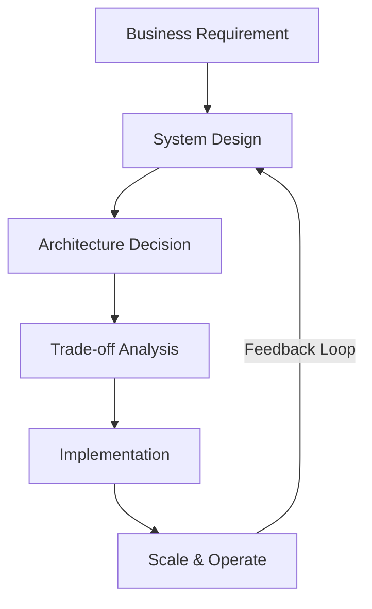
```mermaid
graph TD
  A[Business Requirement] --> B[System Design]
  B --> C[Architecture Decision]
  C --> D[Trade-off Analysis]
  D --> E[Implementation]
  E --> F[Scale & Operate]
  F -->|Feedback Loop| B
```

---

## Day 2 — Key Characteristics of Great Systems (SCALED)

**Q: What are the core characteristics every well-designed system must have?**

**A:** The acronym **SCALED** covers it:

| Letter | Characteristic | Meaning |
|--------|---------------|---------|
| **S** | Scalability | Handle growing load without redesign |
| **C** | Consistency | Data is correct across all nodes |
| **A** | Availability | System responds even during failures |
| **L** | Latency | Responses are fast enough for UX |
| **E** | Extensibility | Easy to add features without breaking others |
| **D** | Durability | Data survives crashes and restarts |

**Trade-off:** CAP theorem says you cannot have perfect Consistency + Availability simultaneously in a distributed system. You must choose.

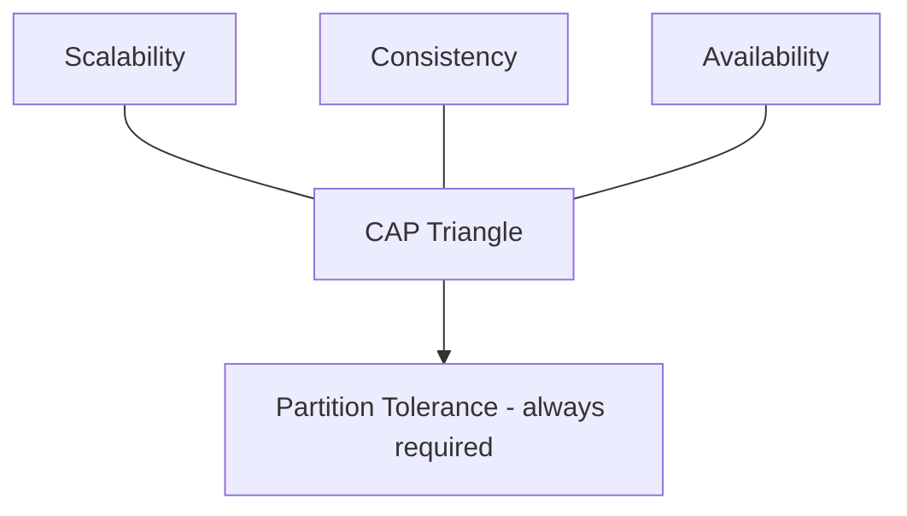
```mermaid
graph TD
  S[Scalability] --- CAP
  CAP[CAP Triangle]
  C[Consistency] --- CAP
  A[Availability] --- CAP
  CAP --> P[Partition Tolerance - always required]
```

---

## Day 3 — Functional vs Non-Functional Requirements

**Q: What is the difference between functional and non-functional requirements, and why do architects care more about non-functional?**

**A:**

| Type | Definition | Examples |
|------|-----------|---------|
| **Functional** | What the system does | User can post a tweet, search products, send payment |
| **Non-Functional** | How well the system does it | 99.99% uptime, <200ms latency, 1M concurrent users |

Architects prioritize non-functional requirements because they drive architecture decisions — database choice, caching strategy, replication model, and deployment topology.

**Framework for capturing NFRs:**
- **Performance:** Latency (p50, p99), throughput (RPS)
- **Availability:** SLA (99.9% = 8.7 hrs downtime/year)
- **Scalability:** Peak load, growth rate
- **Security:** Auth, encryption, audit
- **Consistency:** Strong vs eventual

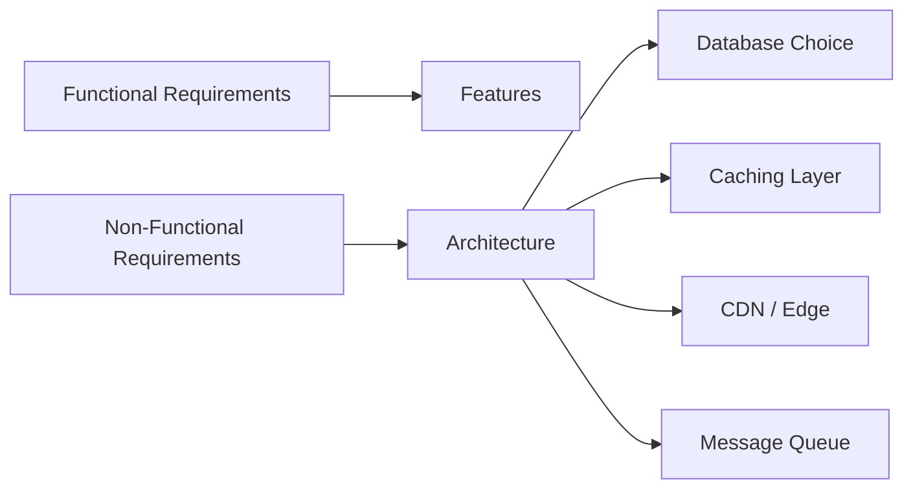
```mermaid
flowchart LR
  FR[Functional Requirements] --> Features
  NFR[Non-Functional Requirements] --> Architecture
  Architecture --> DB[Database Choice]
  Architecture --> Cache[Caching Layer]
  Architecture --> CDN[CDN / Edge]
  Architecture --> Queue[Message Queue]
```

---

## Day 4 — Client-Server Architecture

**Q: Explain the client-server model and where it breaks down at scale.**

**A:** The client-server model is the foundation of the web. A client makes requests; a server processes and responds.

**Three-tier evolution:**

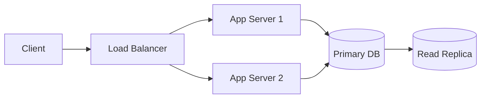
```mermaid
graph LR
  Client --> LB[Load Balancer]
  LB --> App1[App Server 1]
  LB --> App2[App Server 2]
  App1 --> DB[(Primary DB)]
  App2 --> DB
  DB --> Replica[(Read Replica)]
```

**Where it breaks down:**
- Single server = single point of failure
- Stateful servers = can't horizontally scale
- Shared DB = bottleneck under write-heavy load
- No caching = repeated expensive queries

**Fixes:**
- Stateless app servers + session store (Redis)
- Read replicas for read-heavy workloads
- CDN for static assets
- Sharding for write-heavy DB workloads

---

## Day 5 — Capacity Estimation: Think Like an Architect

**Q: How do you estimate capacity requirements for a system like Twitter?**

**A:** Use back-of-envelope math. Start with DAU (Daily Active Users), derive RPS, storage, and bandwidth.

**Example — Twitter:**
- 300M DAU, 50% post daily = 150M tweets/day
- 150M / 86,400s = ~1,700 writes/sec
- Each tweet = 300 bytes → 1,700 × 300 = ~500 KB/s write throughput
- With 10:1 read ratio → ~5 MB/s read throughput
- Storage: 150M × 300 bytes = 45 GB/day → ~16 TB/year

**Framework:**
```
1. Start with DAU
2. Derive events/day (% of DAU that trigger the action)
3. Convert to RPS (divide by 86,400)
4. Estimate read:write ratio (usually 10:1 to 100:1)
5. Calculate storage per event × events/day × retention period
6. Add 20% buffer
```

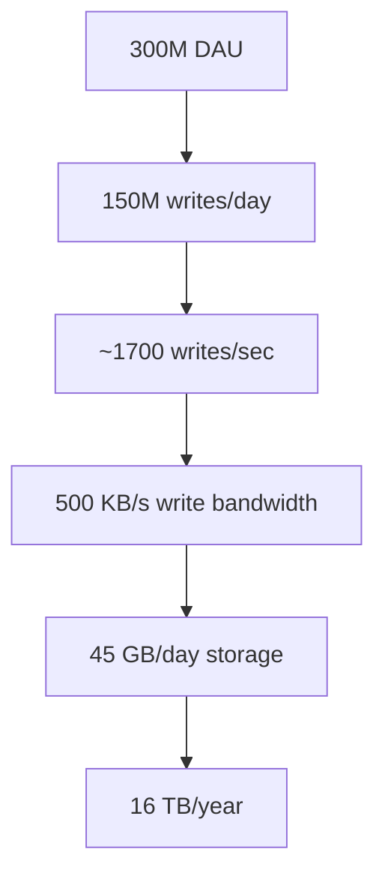
```mermaid
flowchart TD
  DAU[300M DAU] --> W[150M writes/day]
  W --> RPS[~1700 writes/sec]
  RPS --> BW[500 KB/s write bandwidth]
  BW --> Storage[45 GB/day storage]
  Storage --> Annual[16 TB/year]
```

---

## Day 6 — Design for Failure: The Architect's Mindset

**Q: What does "design for failure" mean, and what patterns implement it?**

**A:** In distributed systems, failure is not an exception — it is the normal operating condition. Networks partition, disks fail, processes crash. Architects design systems that degrade gracefully rather than fail catastrophically.

**Key patterns:**

| Pattern | Purpose |
|---------|---------|
| Circuit Breaker | Stop cascading failures by short-circuiting failing dependencies |
| Bulkhead | Isolate failures to one compartment; protect the rest |
| Retry with Backoff | Retry transient failures with exponential delay |
| Timeout | Don't wait forever for a slow dependency |
| Fallback | Return cached/default response when primary fails |
| Health Check | Proactively detect failing instances |

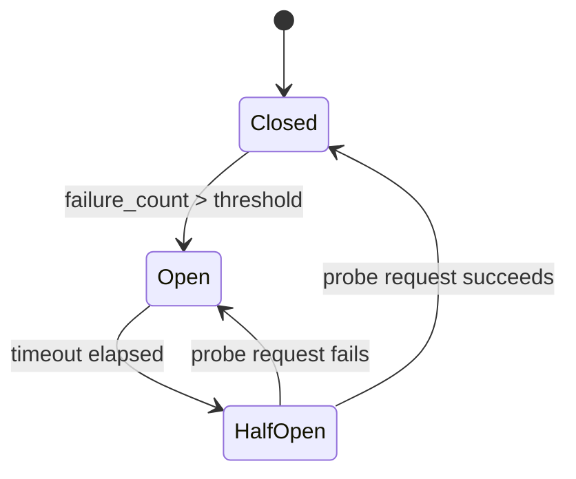
```mermaid
stateDiagram-v2
  [*] --> Closed
  Closed --> Open: failure_count > threshold
  Open --> HalfOpen: timeout elapsed
  HalfOpen --> Closed: probe request succeeds
  HalfOpen --> Open: probe request fails
```

---

## Day 7 — Databases: Developer vs Architect Thinking

**Q: How does an architect think about databases differently from a developer?**

**A:**

| Dimension | Developer Thinking | Architect Thinking |
|-----------|------------------|-------------------|
| Query | "Will this SELECT work?" | "What's the p99 latency at 10K RPS?" |
| Schema | "Normalize to 3NF" | "Will this schema survive sharding?" |
| Index | "Add index on user_id" | "How many indexes before write throughput degrades?" |
| Consistency | "ACID transactions" | "Do we need strong consistency or can we use eventual?" |
| Scale | "Vertical scale the DB" | "At what point do we shard or switch to NoSQL?" |

**Decision framework:**
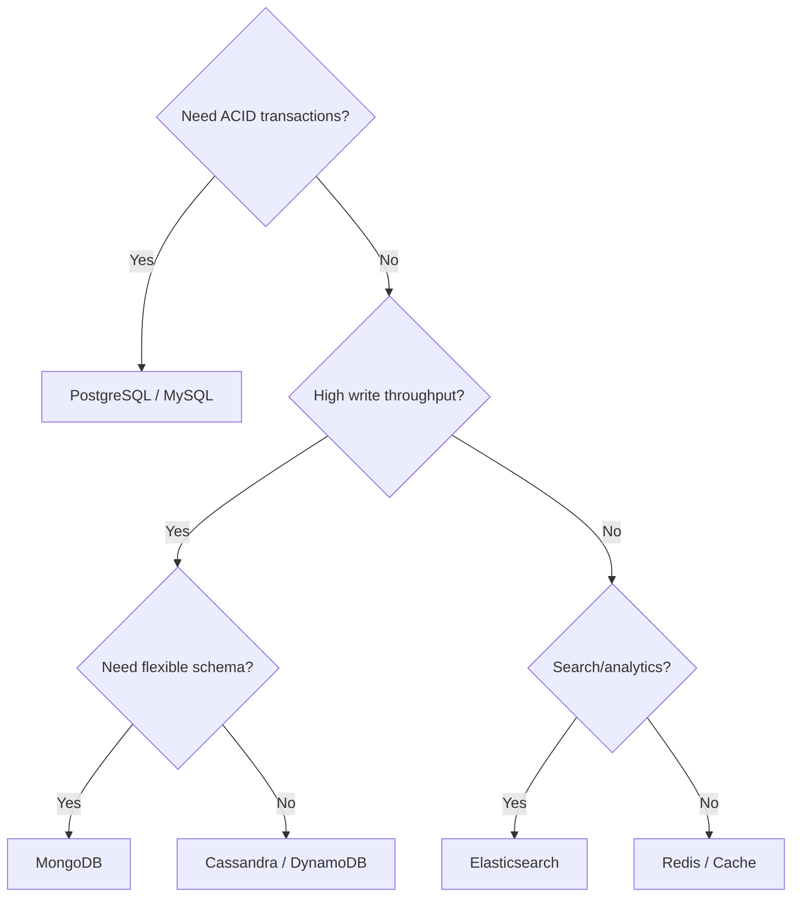
```mermaid
flowchart TD
  Q1{Need ACID transactions?} -->|Yes| SQL[PostgreSQL / MySQL]
  Q1 -->|No| Q2{High write throughput?}
  Q2 -->|Yes| Q3{Need flexible schema?}
  Q3 -->|Yes| Mongo[MongoDB]
  Q3 -->|No| Cassandra[Cassandra / DynamoDB]
  Q2 -->|No| Q4{Search/analytics?}
  Q4 -->|Yes| ES[Elasticsearch]
  Q4 -->|No| Redis[Redis / Cache]
```

---

## Day 8 — Load Balancing: Traffic Orchestration

**Q: What are the different load balancing algorithms and when do you choose each?**

**A:**

| Algorithm | How It Works | Best For |
|-----------|-------------|---------|
| Round Robin | Rotate through servers in order | Stateless, uniform request cost |
| Weighted Round Robin | Servers get proportional traffic by weight | Heterogeneous hardware |
| Least Connections | Route to server with fewest active connections | Long-lived connections (WebSocket) |
| IP Hash | Hash client IP to always route to same server | Session affinity (sticky sessions) |
| Random | Pick a random server | Simple, low overhead |

**Layer 4 vs Layer 7:**
- **L4 (TCP):** Faster, no HTTP inspection, can't route by URL path
- **L7 (HTTP):** Can route by path, headers, cookies — used for A/B testing, canary deploys

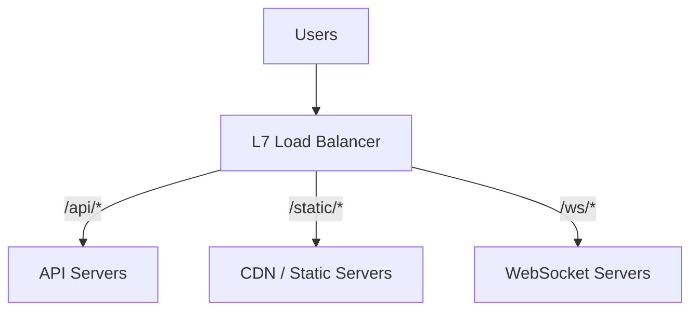
```mermaid
graph TD
  Users --> LB[L7 Load Balancer]
  LB -->|/api/*| API[API Servers]
  LB -->|/static/*| CDN[CDN / Static Servers]
  LB -->|/ws/*| WS[WebSocket Servers]
```

---

## Day 9 — Bloom Filters: Preventing Cache Penetration

**Q: What is a Bloom filter and how does it prevent cache penetration?**

**A:** A Bloom filter is a probabilistic data structure that answers: "Is this element definitely NOT in the set?" It has **false positives** but **no false negatives**.

**Cache penetration problem:** A user queries for a key that doesn't exist in cache OR database. Every request hits the DB.

**Bloom filter solution:**
1. Load all existing keys into Bloom filter at startup
2. On every cache miss, check Bloom filter
3. If filter says "definitely not exists" → return 404 immediately, skip DB
4. If filter says "might exist" → query DB

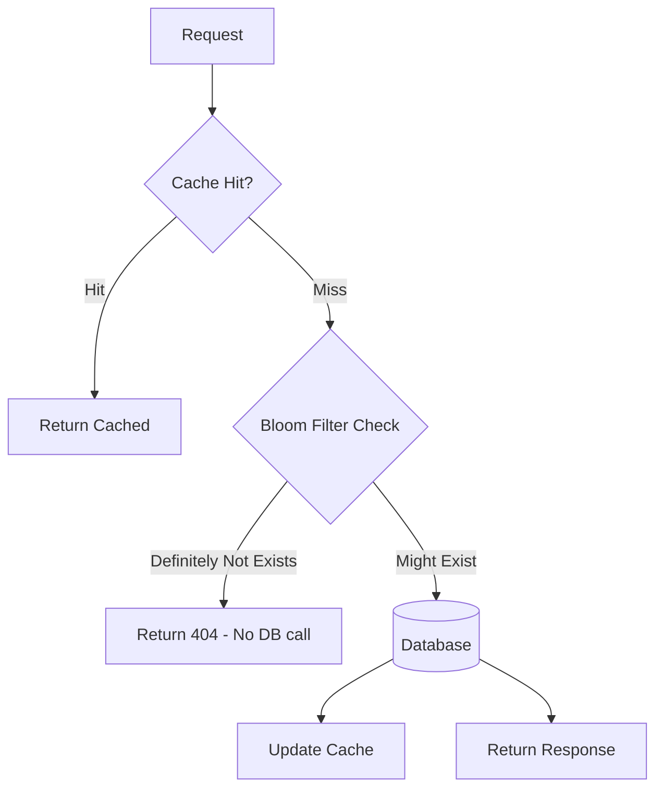
```mermaid
flowchart TD
  Request --> Cache{Cache Hit?}
  Cache -->|Hit| Response[Return Cached]
  Cache -->|Miss| Bloom{Bloom Filter Check}
  Bloom -->|Definitely Not Exists| Return404[Return 404 - No DB call]
  Bloom -->|Might Exist| DB[(Database)]
  DB --> UpdateCache[Update Cache]
  DB --> Response2[Return Response]
```

**Properties:**
- Space efficient: 10 billion items → ~10 GB with 1% false positive rate
- O(1) lookup
- Cannot delete elements (use Counting Bloom Filter for deletes)

---

## Day 10 — Request Coalescing: When 50,000 Became 1

**Q: What is request coalescing and when does it save your system?**

**A:** Request coalescing (also called request collapsing) is a technique where multiple identical in-flight requests for the same resource are merged into a single upstream request. All waiting clients share the single response.

**Problem scenario:** Cache expires for a hot item. 50,000 users hit the endpoint simultaneously. All 50,000 requests go to the database → thundering herd.

**With coalescing:** First request goes to DB. Next 49,999 requests wait. When DB responds, all 50,000 clients receive the result.

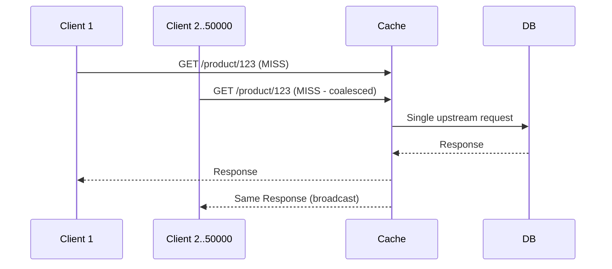
```mermaid
sequenceDiagram
  participant C1 as Client 1
  participant C2 as Client 2..50000
  participant Cache
  participant DB

  C1->>Cache: GET /product/123 (MISS)
  C2->>Cache: GET /product/123 (MISS - coalesced)
  Cache->>DB: Single upstream request
  DB-->>Cache: Response
  Cache-->>C1: Response
  Cache-->>C2: Same Response (broadcast)
```

**Where it's implemented:**
- Nginx `proxy_cache_lock on`
- Varnish ESI
- CDNs (Cloudflare, Fastly) built-in
- Application-level: use a singleflight pattern (Go's `singleflight` package)

---

## Days 11–20 — *(Screenshots not captured)*

*Topics in this range likely cover: Caching Strategies, CDN Architecture, API Gateway, Rate Limiting, Message Queues, Microservices Decomposition, Service Discovery, Data Sharding, Event-Driven Architecture, WebSockets.*

---

## Day 21 — Optimistic vs Pessimistic Locking: Amazon vs BookMyShow

**Q: When do you choose optimistic locking over pessimistic locking?**

**A:**

| | Pessimistic Locking | Optimistic Locking |
|-|--------------------|--------------------|
| **Mechanism** | Lock row at read time, hold until commit | Read without lock; check version at write time |
| **Conflict handling** | Prevented upfront | Detected at commit; retry on conflict |
| **Throughput** | Low (serialized) | High (parallel reads) |
| **Best for** | High contention, short transactions | Low contention, read-heavy |
| **Example** | BookMyShow seat booking | Amazon product inventory update |

**Optimistic locking with version column:**
```sql
-- Read
SELECT id, stock, version FROM products WHERE id = 1;

-- Update (fails if version changed)
UPDATE products
SET stock = stock - 1, version = version + 1
WHERE id = 1 AND version = <read_version>;
-- If 0 rows affected → conflict, retry
```

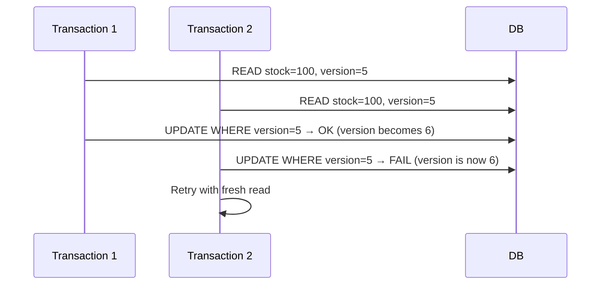
```mermaid
sequenceDiagram
  participant T1 as Transaction 1
  participant T2 as Transaction 2
  participant DB

  T1->>DB: READ stock=100, version=5
  T2->>DB: READ stock=100, version=5
  T1->>DB: UPDATE WHERE version=5 → OK (version becomes 6)
  T2->>DB: UPDATE WHERE version=5 → FAIL (version is now 6)
  T2->>T2: Retry with fresh read
```

---

## Day 22 — The 7 Layers of Every High-Level Design

**Q: What are the 7 architectural layers present in every large-scale system?**

**A:**

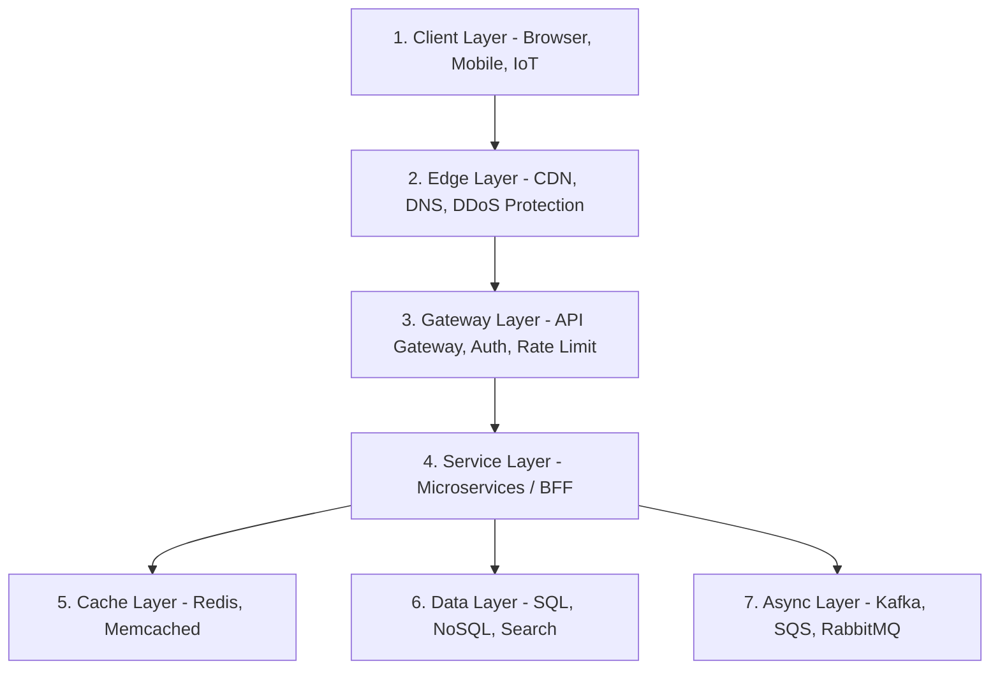
```mermaid
graph TD
  L1[1. Client Layer - Browser, Mobile, IoT]
  L2[2. Edge Layer - CDN, DNS, DDoS Protection]
  L3[3. Gateway Layer - API Gateway, Auth, Rate Limit]
  L4[4. Service Layer - Microservices / BFF]
  L5[5. Cache Layer - Redis, Memcached]
  L6[6. Data Layer - SQL, NoSQL, Search]
  L7[7. Async Layer - Kafka, SQS, RabbitMQ]

  L1 --> L2 --> L3 --> L4
  L4 --> L5
  L4 --> L6
  L4 --> L7
```

| Layer | Responsibility |
|-------|---------------|
| Client | User interaction, thin logic |
| Edge | Latency reduction, DDoS protection, SSL termination |
| Gateway | Single entry point, auth, routing, rate limiting |
| Service | Business logic, domain-driven decomposition |
| Cache | Reduce DB load, fast reads |
| Data | Persistent storage, queries |
| Async | Decouple producers/consumers, handle spikes |

---

## Day 23 — Database Selection for System Design

**Q: How do you select the right database for a given system design problem?**

**A:**

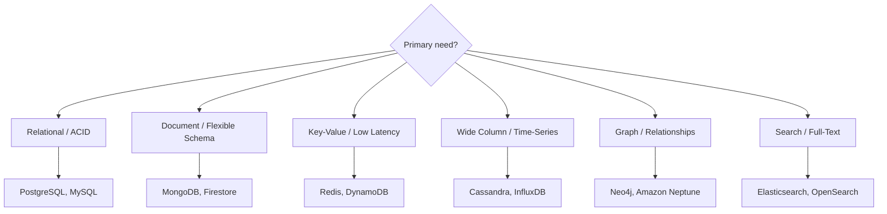
```mermaid
flowchart TD
  A{Primary need?} --> B[Relational / ACID]
  A --> C[Document / Flexible Schema]
  A --> D[Key-Value / Low Latency]
  A --> E[Wide Column / Time-Series]
  A --> F[Graph / Relationships]
  A --> G[Search / Full-Text]

  B --> B1[PostgreSQL, MySQL]
  C --> C1[MongoDB, Firestore]
  D --> D1[Redis, DynamoDB]
  E --> E1[Cassandra, InfluxDB]
  F --> F1[Neo4j, Amazon Neptune]
  G --> G1[Elasticsearch, OpenSearch]
```

**Decision factors:**
1. **Consistency requirement:** Strong → SQL; Eventual → NoSQL
2. **Query pattern:** Flexible queries → SQL; Known access patterns → NoSQL
3. **Scale:** Vertical → SQL; Horizontal write scale → Cassandra/DynamoDB
4. **Data model:** Relational → SQL; Hierarchical → Document; Graph → Neo4j

---

## Day 24 — API Protocol Decision Framework: gRPC, GraphQL, REST & WebSocket

**Q: How do you choose between REST, gRPC, GraphQL, and WebSocket?**

**A:**

| Protocol | Transport | Best For | Avoid When |
|----------|-----------|---------|------------|
| **REST** | HTTP/1.1 | Public APIs, CRUD, browser clients | Real-time, over-fetching |
| **gRPC** | HTTP/2 + Protobuf | Internal microservices, streaming, performance | Browser-facing (limited support) |
| **GraphQL** | HTTP | Complex client data needs, multiple clients, BFF | Simple CRUD, caching hard |
| **WebSocket** | TCP persistent | Real-time: chat, live feeds, gaming | Stateless request-response |

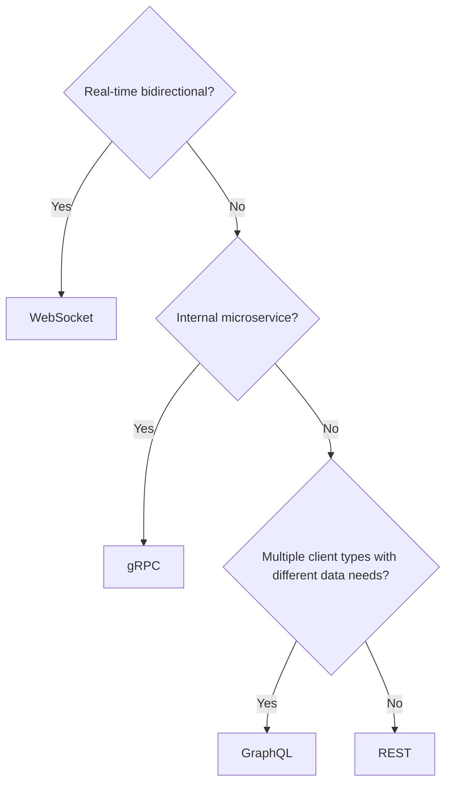
```mermaid
flowchart TD
  Q1{Real-time bidirectional?} -->|Yes| WS[WebSocket]
  Q1 -->|No| Q2{Internal microservice?}
  Q2 -->|Yes| gRPC[gRPC]
  Q2 -->|No| Q3{Multiple client types with different data needs?}
  Q3 -->|Yes| GQL[GraphQL]
  Q3 -->|No| REST[REST]
```

---

## Day 25 — Deployment Strategies Decoded

**Q: What are the main deployment strategies and their trade-offs?**

**A:**

| Strategy | Description | Downtime | Risk | Rollback |
|----------|-------------|---------|------|---------|
| **Recreate** | Shut old, start new | Yes | High | Redeploy old |
| **Rolling** | Replace instances one by one | No | Medium | Roll back % |
| **Blue-Green** | Run two environments, switch traffic | No | Low | Flip DNS back |
| **Canary** | Route small % to new version | No | Very Low | Route 0% to new |
| **Feature Flag** | Code deployed; toggled per user | No | Minimal | Toggle off |

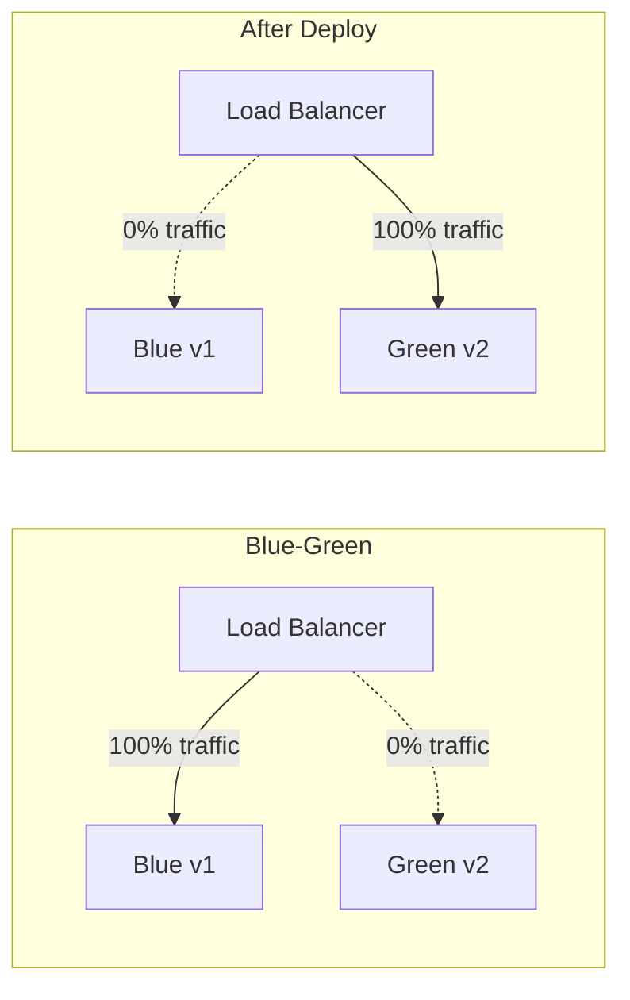
```mermaid
graph LR
  subgraph Blue-Green
    LB[Load Balancer] -->|100% traffic| Blue[Blue v1]
    LB -.->|0% traffic| Green[Green v2]
  end
  subgraph After Deploy
    LB2[Load Balancer] -.->|0% traffic| Blue2[Blue v1]
    LB2 -->|100% traffic| Green2[Green v2]
  end
```

---

## Day 26 — Docker Production Commands: The Architect's Essential Guide

**Q: What Docker commands and patterns matter most in production?**

**A:** Architects care about multi-stage builds, resource limits, health checks, and image security.

**Key production patterns:**

```bash
# Multi-stage build (minimize image size)
FROM node:20 AS builder
WORKDIR /app
COPY . .
RUN npm ci && npm run build

FROM node:20-slim AS runtime
COPY --from=builder /app/dist ./dist
CMD ["node", "dist/index.js"]

# Resource limits (prevent noisy neighbor)
docker run --memory="512m" --cpus="1.0" myapp

# Health check
HEALTHCHECK --interval=30s --timeout=5s --retries=3 \
  CMD curl -f http://localhost:8080/health || exit 1
```

**Production checklist:**
- Non-root user in container
- Read-only filesystem where possible
- Resource limits always set
- Health checks defined
- No secrets in image layers (use secrets manager)

---

## Day 27 — Two-Phase Commit (2PC): The Distributed Transaction Protocol

**Q: How does Two-Phase Commit work and why is it rarely used in modern systems?**

**A:** 2PC ensures atomicity across multiple distributed nodes by coordinating through a coordinator.

**Phase 1 — Prepare:**
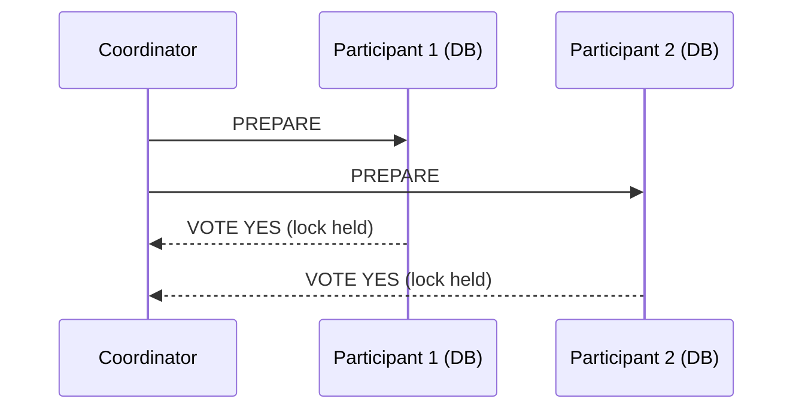
```mermaid
sequenceDiagram
  participant C as Coordinator
  participant P1 as Participant 1 (DB)
  participant P2 as Participant 2 (DB)

  C->>P1: PREPARE
  C->>P2: PREPARE
  P1-->>C: VOTE YES (lock held)
  P2-->>C: VOTE YES (lock held)
```

**Phase 2 — Commit:**
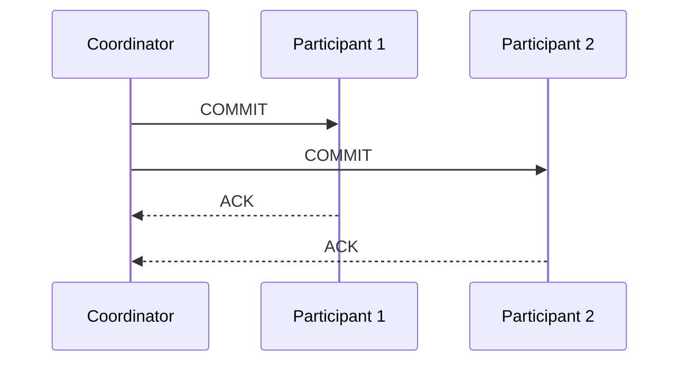
```mermaid
sequenceDiagram
  participant C as Coordinator
  participant P1 as Participant 1
  participant P2 as Participant 2

  C->>P1: COMMIT
  C->>P2: COMMIT
  P1-->>C: ACK
  P2-->>C: ACK
```

**Problems with 2PC:**
- **Blocking:** Participants hold locks during both phases
- **Coordinator failure:** If coordinator crashes after Phase 1, participants are stuck
- **Latency:** 4 network round-trips minimum
- **Not scalable:** Every transaction needs coordinator

**Modern alternative:** Saga pattern (choreography or orchestration) with compensating transactions.

---

## Day 28 — Consistent Hashing: The Resharding Strategy That Powers Amazon, Discord & Netflix

**Q: What is consistent hashing and why does it minimize data movement during resharding?**

**A:** In naive modulo hashing (`key % N`), adding/removing a node remaps nearly all keys. Consistent hashing places both keys and nodes on a ring — adding a node only moves keys from its immediate successor.

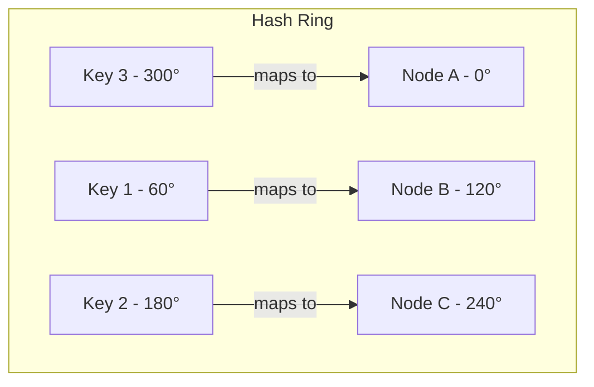
```mermaid
graph TD
  subgraph Hash Ring
    A[Node A - 0°] 
    B[Node B - 120°]
    C[Node C - 240°]
    K1[Key 1 - 60°] -->|maps to| B
    K2[Key 2 - 180°] -->|maps to| C
    K3[Key 3 - 300°] -->|maps to| A
  end
```

**With virtual nodes (vnodes):**
- Each physical node gets multiple positions on the ring
- Distributes load more evenly
- Reduces hotspots

**Used by:** Amazon DynamoDB, Apache Cassandra, Redis Cluster, Discord's message routing

**Data movement comparison:**
- Modulo hashing with N→N+1: ~N/(N+1) of all keys move
- Consistent hashing with N→N+1: only ~1/N of keys move

---

## Day 29 — Forward Proxy vs Reverse Proxy

**Q: What is the difference between a forward proxy and a reverse proxy?**

**A:**

| | Forward Proxy | Reverse Proxy |
|-|--------------|---------------|
| **Sits in front of** | Clients | Servers |
| **Hides** | Client identity from server | Server identity from client |
| **Used for** | Corporate filtering, anonymity, caching | Load balancing, SSL termination, WAF |
| **Examples** | Squid, VPN | Nginx, Cloudflare, AWS ALB |

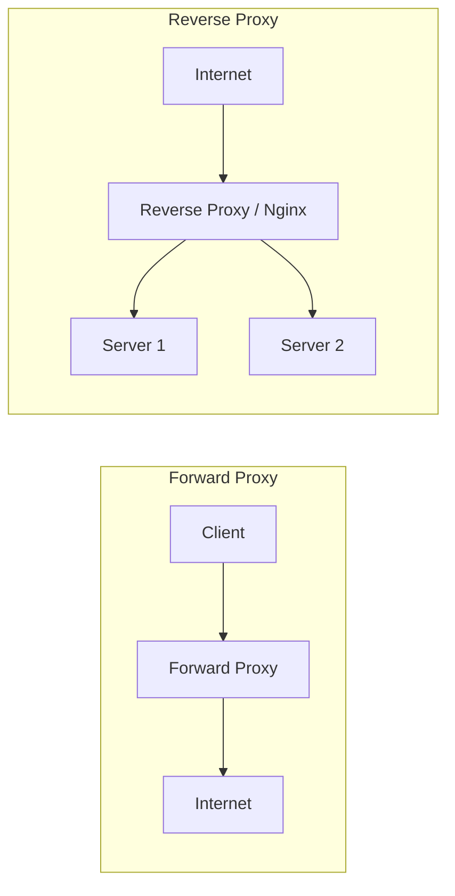
```mermaid
graph LR
  subgraph Forward Proxy
    C[Client] --> FP[Forward Proxy]
    FP --> Internet
  end

  subgraph Reverse Proxy
    Internet2[Internet] --> RP[Reverse Proxy / Nginx]
    RP --> S1[Server 1]
    RP --> S2[Server 2]
  end
```

**Reverse proxy responsibilities:**
- SSL/TLS termination
- Load balancing
- Caching static content
- WAF (Web Application Firewall)
- Rate limiting
- Compression (gzip)

---

## Day 30 — Database Replication: From Fragile to Resilient

**Q: What are the database replication topologies and their trade-offs?**

**A:**

| Topology | Writes | Reads | Consistency | Availability |
|----------|--------|-------|------------|--------------|
| **Single Primary** | Primary only | Primary + Replicas | Strong on primary | Low (primary SPOF) |
| **Multi-Primary** | Any node | Any node | Eventual (conflict risk) | High |
| **Chain Replication** | Head | Tail | Strong | Medium |

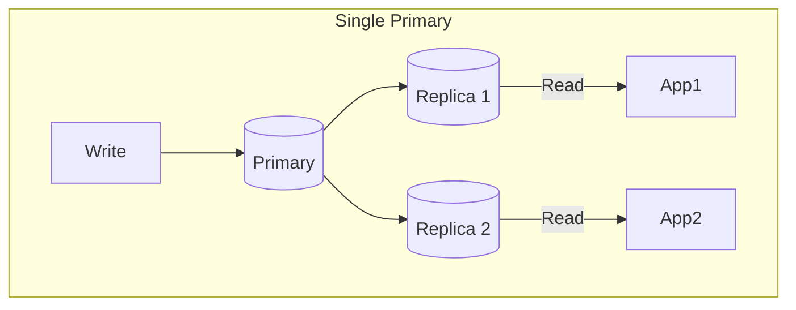
```mermaid
graph TD
  subgraph Single Primary
    W[Write] --> Primary[(Primary)]
    Primary --> R1[(Replica 1)]
    Primary --> R2[(Replica 2)]
    R1 -->|Read| App1
    R2 -->|Read| App2
  end
```

**Replication lag:** Asynchronous replication means replicas may be milliseconds to seconds behind. Reading your own writes from a replica can return stale data.

**Solutions to replication lag:**
- Read from primary immediately after write (for the writing user)
- Session tokens that enforce reading from primary for N seconds post-write
- Synchronous replication (higher latency, stronger guarantee)

---

## Day 31 — Kafka Schema Evolution: The "New Topic" Strategy

**Q: How do you handle breaking schema changes in Kafka without downtime?**

**A:** Schema changes in Kafka are dangerous because producers and consumers are decoupled and may run different versions simultaneously.

**Safe evolution strategies:**

| Strategy | When to Use |
|----------|-------------|
| Backward compatible (add optional fields) | Minor changes |
| Forward compatible (remove fields consumers ignore) | Field deprecation |
| **New Topic strategy** | Breaking changes |

**New Topic strategy workflow:**
```mermaid
flowchart TD
  P1[Producer v1] -->|writes| T1[Topic: orders-v1]
  P2[Producer v2] -->|writes| T2[Topic: orders-v2]
  T1 --> C1[Consumer v1]
  T2 --> C2[Consumer v2]
  T1 -->|migration job| T2
```

1. Create `orders-v2` topic with new schema
2. Deploy consumer v2 reading from `orders-v2`
3. Deploy migration job that reads v1, transforms, writes to v2
4. Switch producer to write to v2
5. Drain v1 → decommission

**Schema Registry (Confluent):** Enforces compatibility rules at publish time — rejects incompatible schemas before they reach the topic.

---

## Day 32 — Scheduled Locks: Distributed Lock for Cron Jobs

**Q: How do you ensure a cron job runs exactly once across multiple instances?**

**A:** In a horizontally scaled system, multiple instances run the same cron. Without a lock, jobs execute multiple times causing double-processing, double-charges, or duplicate emails.

**Solution: Distributed lock with TTL**

```mermaid
sequenceDiagram
  participant I1 as Instance 1
  participant I2 as Instance 2
  participant Redis

  I1->>Redis: SET lock:job-name I1 NX EX 300
  Redis-->>I1: OK (lock acquired)
  I2->>Redis: SET lock:job-name I2 NX EX 300
  Redis-->>I2: nil (lock NOT acquired)
  I1->>I1: Execute job
  I1->>Redis: DEL lock:job-name
```

**Redis command:**
```bash
SET lock:daily-report <instance-id> NX EX 300
# NX = only set if not exists
# EX 300 = expire in 300 seconds (safety net if instance crashes)
```

**Edge cases:**
- Always use TTL as safety net (instance crash won't hold lock forever)
- Use instance ID as value — only the owner can release the lock
- Lua script for atomic check-and-delete on release

---

## Day 33 — Distributed Tracing IDs: The Complete Guide

**Q: How do distributed trace IDs work and what problem do they solve?**

**A:** In microservices, a single user request fans out across 10+ services. When it fails, you need to correlate logs across all services for that specific request.

**Trace ID structure:**
- **Trace ID:** Unique identifier for the entire request journey (generated at entry point)
- **Span ID:** Unique identifier for work within one service
- **Parent Span ID:** Links child span to parent

```mermaid
gantt
  title Request Trace Timeline
  dateFormat X
  axisFormat %Lms

  section API Gateway
  Receive Request    :0, 5
  section Auth Service
  Validate Token     :5, 15
  section Order Service
  Create Order       :15, 40
  section Inventory Service
  Reserve Stock      :20, 35
  section Payment Service
  Charge Card        :40, 80
```

**Implementation:**
1. API Gateway generates `X-Trace-ID` header
2. Every downstream service reads and forwards it
3. Every log line includes `traceId`, `spanId`, `parentSpanId`
4. Tracing backend (Jaeger, Zipkin, AWS X-Ray) reconstructs the tree

---

## Day 34 — Kafka Partition Assignment & Rebalancing

**Q: How does Kafka assign partitions to consumers and what triggers a rebalance?**

**A:** Each partition is consumed by exactly one consumer within a consumer group. Kafka's Group Coordinator assigns partitions using a partition assignor strategy.

**Assignment strategies:**

| Strategy | How | Use Case |
|----------|-----|---------|
| RangeAssignor | Sorted partitions, divided by sorted consumers | Default |
| RoundRobinAssignor | Round-robin across all partitions/consumers | Even distribution |
| StickyAssignor | Minimizes partition movement on rebalance | Stateful consumers |
| CooperativeStickyAssignor | Incremental rebalance (no stop-the-world) | Low-latency production |

**Rebalance triggers:**
- Consumer joins group
- Consumer leaves group (crash or graceful shutdown)
- Partition count changes
- Session timeout exceeded (consumer too slow to heartbeat)

```mermaid
sequenceDiagram
  participant C1 as Consumer 1
  participant C2 as Consumer 2
  participant GC as Group Coordinator

  C1->>GC: JoinGroup
  C2->>GC: JoinGroup
  GC-->>C1: SyncGroup (leader)
  C1->>GC: SyncGroup (assignment: C1=P0,P1 C2=P2,P3)
  GC-->>C1: Assigned P0, P1
  GC-->>C2: Assigned P2, P3
```

**Avoid rebalances:** Use `CooperativeStickyAssignor` + tune `session.timeout.ms` and `heartbeat.interval.ms`.

---

## Day 35 — What Can Go Wrong: Distributed Systems & How to Survive Them

**Q: What are the most common failure modes in distributed systems?**

**A:**

| Failure | Cause | Defense |
|---------|-------|---------|
| **Cascading failure** | Slow dependency causes thread pool exhaustion upstream | Circuit breaker, bulkhead isolation |
| **Split-brain** | Network partition causes two nodes to think they're primary | Quorum-based consensus (Raft/Paxos) |
| **Thundering herd** | Cache expiry → all traffic hits DB | Staggered TTL, request coalescing |
| **Clock skew** | Different system times cause ordering bugs | Logical clocks (Lamport, vector clocks) |
| **Head-of-line blocking** | Slow request blocks queue | Separate fast/slow queues |
| **Data corruption** | Silent disk/network errors | Checksums, write-ahead logs |

```mermaid
graph TD
  SlowDB[Slow Database] --> ThreadExhaustion[Thread Pool Exhausted in Service A]
  ThreadExhaustion --> ServiceADown[Service A Unavailable]
  ServiceADown --> ServiceBDown[Service B Fails - depends on A]
  ServiceBDown --> CascadeFailure[System-wide Outage]

  CB[Circuit Breaker] -.->|prevents| ThreadExhaustion
```

---

## Day 36 — RabbitMQ vs Kafka: The Architect's Decision Guide

**Q: When do you choose Kafka over RabbitMQ?**

**A:**

| Dimension | RabbitMQ | Kafka |
|-----------|---------|-------|
| **Model** | Push (broker pushes to consumer) | Pull (consumer polls) |
| **Message retention** | Deleted after ACK | Retained for configurable period |
| **Replay** | No | Yes (consumers can rewind) |
| **Ordering** | Per-queue | Per-partition |
| **Throughput** | ~50K msg/s | ~1M+ msg/s |
| **Routing** | Flexible (exchanges, bindings) | Topic + partition key |
| **Best for** | Task queues, RPC, complex routing | Event streaming, audit log, analytics |

```mermaid
flowchart LR
  subgraph Choose RabbitMQ
    R1[Task distribution]
    R2[Work queues]
    R3[Complex routing rules]
    R4[Short-lived messages]
  end
  subgraph Choose Kafka
    K1[Event streaming]
    K2[Audit / Replay]
    K3[High throughput pipeline]
    K4[Multiple consumers same data]
  end
```

---

## Day 37 — Optimizing Cache for High Hit Rate in Distributed Systems

**Q: What strategies maximize cache hit rate in a distributed system?**

**A:**

**Cache strategies:**

| Strategy | On Read Miss | On Write | Consistency |
|----------|-------------|---------|-------------|
| Cache-Aside | App loads into cache | App invalidates cache | Eventual |
| Write-Through | App reads cache | Write to cache + DB together | Strong |
| Write-Behind | App reads cache | Write to cache; async flush to DB | Eventual (lag) |
| Read-Through | Cache loads from DB | App writes to cache | Eventual |

**Hit rate optimizers:**
1. **Appropriate TTL:** Too short → misses. Too long → stale data.
2. **Cache warming:** Pre-populate on startup/deploy
3. **Consistent hashing:** Stable shard assignment prevents redistribution misses
4. **Negative caching:** Cache "not found" results to block penetration attacks
5. **Layered cache:** L1 (in-process) → L2 (Redis) → DB

```mermaid
flowchart LR
  Request --> L1[In-Process Cache]
  L1 -->|Miss| L2[Redis Cluster]
  L2 -->|Miss| DB[(Database)]
  DB --> L2
  L2 --> L1
  L1 --> Response
```

---

## Day 38 — Primary Key Strategies: SQL vs NoSQL

**Q: How do primary key strategies differ between SQL and NoSQL, and what are the trade-offs?**

**A:**

| Strategy | Used In | Pros | Cons |
|----------|---------|------|------|
| Auto-increment INT | MySQL, PostgreSQL | Simple, ordered, human-readable | SPOF for generation; reveals record count |
| UUID v4 | Both | Globally unique, no coordination | Non-sequential → index fragmentation |
| UUID v7 | Both | Globally unique + time-ordered | Newer, less tooling |
| ULID | Both | Time-ordered, URL safe, 128-bit | Less known |
| Snowflake ID | Twitter, Discord | Time-ordered, distributed generation, 64-bit | Requires worker ID coordination |
| Composite key | Cassandra, DynamoDB | Partition + sort = built-in query optimization | Must know access patterns upfront |

**For distributed systems, prefer time-ordered IDs (UUIDv7, ULID, Snowflake):**
- Sequential inserts avoid B-tree page splits
- Sortable by creation time without separate `created_at` index

```mermaid
flowchart TD
  Q1{Distributed system?} -->|No| AutoInc[Auto-increment]
  Q1 -->|Yes| Q2{Need time ordering?}
  Q2 -->|No| UUID4[UUID v4]
  Q2 -->|Yes| Q3{64-bit OK?}
  Q3 -->|Yes| Snowflake[Snowflake ID]
  Q3 -->|No| ULID[ULID / UUID v7]
```

---

## Day 39 — Outbox Pattern: Reliable Messaging Without Distributed Transactions

**Q: How does the Outbox pattern ensure messages are reliably published after a database write?**

**A:** The dual-write problem: writing to DB and publishing to Kafka/RabbitMQ are two operations. Either can fail independently, causing data loss or phantom events.

**Outbox pattern:**
1. Write business data + outbox message in the **same DB transaction**
2. A separate relay process reads from outbox table and publishes to broker
3. Mark message as published after successful broker ACK

```mermaid
sequenceDiagram
  participant App
  participant DB
  participant Relay as Outbox Relay
  participant Kafka

  App->>DB: BEGIN TRANSACTION
  App->>DB: INSERT INTO orders ...
  App->>DB: INSERT INTO outbox (event, payload)
  App->>DB: COMMIT

  Relay->>DB: SELECT unpublished FROM outbox
  Relay->>Kafka: PUBLISH event
  Kafka-->>Relay: ACK
  Relay->>DB: UPDATE outbox SET published=true
```

**Why it works:** The outbox row is part of the same ACID transaction as the business write. If the transaction commits, the message will eventually be published (at-least-once delivery).

**Relay options:**
- Polling (simple, adds latency)
- Debezium CDC (reads DB WAL, near real-time)

---

## Day 40 — Modular Monolith Architecture: The Best of Both Worlds

**Q: What is a modular monolith and when should you choose it over microservices?**

**A:** A modular monolith enforces hard module boundaries within a single deployable unit. Each module owns its schema, its API surface, and communicates via well-defined interfaces — not via shared database tables.

```mermaid
graph TD
  subgraph Modular Monolith
    API[API Layer]
    API --> OrderModule[Order Module]
    API --> UserModule[User Module]
    API --> PaymentModule[Payment Module]
    OrderModule -->|Interface only| UserModule
    OrderModule -->|Interface only| PaymentModule
    OrderModule --> OrderDB[(Order Schema)]
    UserModule --> UserDB[(User Schema)]
    PaymentModule --> PaymentDB[(Payment Schema)]
  end
```

**Choose modular monolith when:**
- Team < 20 engineers
- Domain boundaries not yet well understood
- Operational complexity of microservices not justified
- Need transactional consistency across modules

**Migration path:** Modular monolith → identify high-scale modules → extract to microservices incrementally (strangler fig pattern)

---

## Day 41 — ACID vs BASE: Instagram, CAP (AP), and BASE in the Real App

**Q: What is the difference between ACID and BASE, and where does Instagram use BASE?**

**A:**

| | ACID | BASE |
|-|------|------|
| **Stands for** | Atomicity, Consistency, Isolation, Durability | Basically Available, Soft-state, Eventually consistent |
| **Consistency** | Strong (read-your-writes guaranteed) | Eventual (stale reads possible) |
| **Availability** | Lower (locks, coordination) | Higher (no global locks) |
| **Used by** | PostgreSQL, MySQL, Oracle | Cassandra, DynamoDB, Riak |

**Instagram example:**
- **Likes counter:** BASE — Cassandra stores likes. You may see 999 likes while another user sees 1000. Acceptable.
- **Payment:** ACID — Must be exact. No eventual consistency for money.

```mermaid
graph TD
  CAP[CAP Theorem]
  CAP --> CP[CP Systems: Strong Consistency + Partition Tolerance]
  CAP --> AP[AP Systems: Availability + Partition Tolerance]
  CP --> Examples1[HBase, Zookeeper, etcd]
  AP --> Examples2[Cassandra, DynamoDB, CouchDB]
```

---

## Day 42 — Blue-Green Deployment: Achieving Zero Downtime

**Q: How does blue-green deployment achieve zero-downtime releases?**

**A:** Two identical production environments run simultaneously. Traffic is routed to one (Blue = current). The new version is deployed to the other (Green = next). After validation, traffic is switched instantly.

```mermaid
sequenceDiagram
  participant LB as Load Balancer
  participant Blue as Blue (v1 - live)
  participant Green as Green (v2 - staging)

  Note over LB,Blue: Normal operation
  LB->>Blue: 100% traffic

  Note over Green: Deploy v2 to Green
  Note over Green: Run smoke tests
  Note over Green: Validate metrics

  Note over LB: Switch
  LB->>Green: 100% traffic
  LB--xBlue: 0% traffic

  Note over Blue: Keep Blue warm for rollback
```

**Rollback:** Switch load balancer back to Blue — seconds, not minutes.

**Requirements:**
- Database schema must be backward compatible (Blue and Green share DB during transition)
- Session handling: drain Blue sessions or use sticky sessions during cutover
- Cost: 2x infrastructure during deployment window

---

## Day 43 — Bloom Filter: Instagram Username Availability

**Q: How does Instagram use a Bloom filter to check username availability without hitting the database?**

**A:** At registration, "is username taken?" must be answered fast. Querying the database for every keystroke would be too expensive at Instagram's scale (500M usernames).

**Bloom filter approach:**
- Load all existing usernames into Bloom filter on startup
- On availability check: query Bloom filter first
- **"Definitely available"** (filter says not present) → return available immediately (no DB call)
- **"Might be taken"** (filter says present) → verify against DB

**No false negatives = perfect for this use case:**
- A username that IS taken will ALWAYS be caught by the filter
- A small % of available usernames will be sent to DB for verification (false positive) — acceptable

```mermaid
flowchart TD
  Input[Username Input] --> BF{Bloom Filter}
  BF -->|Definitely NOT in set| Available[Show: Available ✓]
  BF -->|Might be in set| DB[(Database Query)]
  DB -->|Exists| Taken[Show: Taken ✗]
  DB -->|Does not exist| Available2[Show: Available ✓]
```

**Space efficiency:** 500M usernames at 10 bits/element = ~625 MB with ~1% false positive rate.

---

## Day 44 — Capacity Estimation for Black Friday: How Amazon Prepares

**Q: How do you capacity plan for a 10x traffic spike like Black Friday?**

**A:** Black Friday is not a surprise — it is a predictable, planned load event. Amazon uses a multi-layered capacity planning approach.

**Framework:**
1. **Baseline:** Measure normal peak RPS (requests per second)
2. **Spike multiplier:** Historically 8-12x for Black Friday
3. **Capacity target:** Plan for 15x (with safety margin)
4. **Time dimension:** Spike is not instant — ramp up starts at midnight

**What Amazon does:**
- **Pre-scale:** Provision capacity 2 weeks before (EC2 reserved + on-demand)
- **Load tests:** Full-scale rehearsal in staging with synthetic traffic
- **Gradual rollout:** New features frozen 2 weeks before event
- **Circuit breakers pre-tuned:** Lower thresholds during the event window
- **Cell-based architecture:** Traffic sharded into cells; failure in one cell doesn't cascade

```mermaid
graph TD
  Normal[Normal: 100K RPS] --> BlackFriday[Black Friday: 1M RPS]
  BlackFriday --> AutoScale[Auto-scaling Groups]
  BlackFriday --> PreWarmed[Pre-warmed Caches]
  BlackFriday --> DegradedMode[Graceful Degradation Plan]
  DegradedMode --> D1[Disable non-critical features]
  DegradedMode --> D2[Increase cache TTLs]
  DegradedMode --> D3[Queue non-urgent writes]
```

---

## Day 45 — Why ACID Breaks in Microservices & How the Saga Pattern Fixes It

**Q: Why can't you use database transactions across microservices, and how does Saga solve this?**

**A:** Each microservice owns its own database. You cannot run a `BEGIN TRANSACTION` across two separate databases. The Saga pattern breaks a distributed transaction into a sequence of local transactions, each publishing an event or calling the next step.

**Two Saga styles:**

**Choreography (event-driven):**
```mermaid
sequenceDiagram
  participant OS as Order Service
  participant PS as Payment Service
  participant IS as Inventory Service

  OS->>OS: Create Order (PENDING)
  OS->>PS: Event: OrderCreated
  PS->>PS: Charge Card
  PS->>IS: Event: PaymentCompleted
  IS->>IS: Reserve Stock
  IS->>OS: Event: StockReserved
  OS->>OS: Update Order (CONFIRMED)
```

**Orchestration (centralized):**
```mermaid
sequenceDiagram
  participant Orch as Saga Orchestrator
  participant PS as Payment Service
  participant IS as Inventory Service

  Orch->>PS: chargeCard()
  PS-->>Orch: OK
  Orch->>IS: reserveStock()
  IS-->>Orch: FAIL
  Orch->>PS: refundCard() [compensating transaction]
```

**Key rule:** Every step must have a **compensating transaction** to undo it if a later step fails.

---

## Day 46 — Kafka Message Ordering: What Juniors Get Wrong

**Q: How does Kafka guarantee message ordering and what mistakes break it?**

**A:** Kafka guarantees ordering **within a partition**, not across partitions. A topic with N partitions has N independent ordered logs.

**What juniors get wrong:**
```
Topic: orders (6 partitions)
OrderCreated for order-123 → Partition 2
OrderCancelled for order-123 → Partition 5 (different partition!)
Consumer may process Cancelled BEFORE Created → corrupt state
```

**Fix: Use order ID as partition key**
```java
producer.send(new ProducerRecord<>(
  "orders",
  orderId,  // partition key — same orderId always → same partition
  payload
));
```

```mermaid
graph LR
  P[Producer] -->|key=order-123| Part2[Partition 2]
  Part2 --> C[Consumer]
  C --> OrderCreated[Process: OrderCreated]
  C --> OrderCancelled[Process: OrderCancelled - correct order]
```

**Other ordering pitfalls:**
- `retries > 0` + `max.in.flight.requests.per.connection > 1` → reordering on retry → set `enable.idempotence=true`
- Multiple consumer threads processing same partition → set thread count = partition count

---

## Day 47 — Database Connection Pools: The Biggest Blunder in Distributed Systems

**Q: Why are database connection pools critical and what happens when they're misconfigured?**

**A:** Each database connection consumes ~5-10 MB of RAM on the DB server and a file descriptor. PostgreSQL defaults to 100 max connections. With 20 app instances × 50 connections each = 1,000 connections → DB crash.

**Without a connection pool:**
```
Every request → new DB connection → ~5-10ms overhead → 100K RPS = 100K connections
```

**With a connection pool:**
```
App starts → open 10 connections (warm) → requests borrow/return connections
```

**Pool sizing formula (Little's Law):**
```
Pool size = (DB_cores × 2) + effective_spindle_count
PostgreSQL recommendation: start with (num_cores * 2) + 1
```

```mermaid
sequenceDiagram
  participant App as App Instance
  participant Pool as Connection Pool
  participant DB as PostgreSQL

  App->>Pool: acquire()
  Pool-->>App: connection (from pool)
  App->>DB: SELECT ...
  DB-->>App: result
  App->>Pool: release()
  Pool->>Pool: return to pool
```

**PgBouncer:** Use as a sidecar proxy. It pools thousands of app connections into a small number of DB connections (transaction-mode pooling).

---

## Day 48 — The Idempotency Key That Lied: Two-Phase PENDING/COMPLETED Pattern

**Q: How do you safely handle duplicate payment requests using idempotency keys?**

**A:** Payment APIs must be idempotent — retrying the same request must not charge twice. Simple idempotency key caching has a race condition: two identical concurrent requests both find "key not in cache" and both execute.

**Two-phase PENDING/COMPLETED pattern:**

```mermaid
sequenceDiagram
  participant C1 as Client Retry 1
  participant C2 as Client Retry 2
  participant API
  participant DB

  C1->>API: POST /charge {idempotencyKey: "abc"}
  API->>DB: INSERT idempotency_keys(key="abc", status=PENDING)
  DB-->>API: OK

  C2->>API: POST /charge {idempotencyKey: "abc"}
  API->>DB: INSERT idempotency_keys(key="abc", status=PENDING)
  DB-->>API: DUPLICATE KEY ERROR
  API-->>C2: 409 Conflict - request in progress

  API->>PaymentProvider: Charge card
  PaymentProvider-->>API: Success
  API->>DB: UPDATE idempotency_keys SET status=COMPLETED, response=...
  API-->>C1: 200 OK

  Note over C2: Client retries after 409
  C2->>API: POST /charge {idempotencyKey: "abc"}
  API->>DB: SELECT WHERE key="abc"
  DB-->>API: status=COMPLETED, response=...
  API-->>C2: 200 OK (cached response)
```

**Key insight:** The PENDING insert uses a unique constraint on the key. The first request wins; concurrent duplicates get a DB conflict error immediately.

---

## Day 49 — The Kafka OOM Crash That Charged 1000 Customers Twice

**Q: What is the classic Kafka consumer at-least-once delivery bug that causes duplicate processing?**

**A:** Kafka consumers commit offsets to mark messages as processed. The bug: process message → crash before committing offset → restart → reprocess → duplicate action.

**The double-charge scenario:**
```
1. Consumer reads: "Charge customer-456 $99"
2. Consumer calls Stripe API → charge succeeds
3. Consumer crashes (OOM) before committing offset
4. Consumer restarts, reads same message again
5. Consumer calls Stripe API again → second charge of $99
```

**Fix: Idempotent processing**
```mermaid
flowchart TD
  ConsumeMsg[Consume Message] --> CheckProcessed{Already processed?\nCheck DB for message ID}
  CheckProcessed -->|Yes| CommitOffset[Commit Offset - skip]
  CheckProcessed -->|No| Process[Execute Action]
  Process --> MarkProcessed[Mark message ID as processed in DB]
  MarkProcessed --> CommitOffset2[Commit Offset]
```

**Additional safeguards:**
- Use `enable.auto.commit=false` — commit manually after processing
- Commit only after both action AND idempotency record are written
- Use Kafka Transactions for exactly-once semantics (Kafka → Kafka)
- For Kafka → external system: rely on idempotency keys at the target API

---

## Day 50 — One Request. A Thousand Logs. Zero Answers. — Distributed Tracing

**Q: How does distributed tracing solve the problem of debugging microservices failures?**

**A:** In a monolith, a stack trace shows the full call chain. In microservices with 15 services, a single request generates logs across 15 systems. Without correlation, finding the failing step is guesswork.

**Distributed tracing gives you:**
1. **Trace ID:** One ID that follows the request across all services
2. **Flame graph:** Visual timeline showing where time was spent
3. **Span tags:** Metadata (DB query, HTTP status, error message) per operation
4. **Causal ordering:** Which service called which, in what order

```mermaid
gantt
  title Distributed Trace: /checkout endpoint (total: 340ms)
  dateFormat X
  axisFormat %Lms

  section API Gateway
  Auth check         :0, 20
  section Cart Service
  Get cart items     :20, 60
  section Inventory Service
  Check stock        :60, 100
  section Pricing Service
  Calculate price    :60, 90
  section Payment Service
  Charge card        :100, 280
  section Order Service
  Create order       :280, 320
  section Notification
  Send email         :320, 340
```

**Tools:**
- **Open source:** Jaeger, Zipkin
- **Cloud:** AWS X-Ray, Google Cloud Trace, Azure Monitor
- **Commercial:** Datadog APM, New Relic, Honeycomb

**Implementation (OpenTelemetry standard):**
```python
from opentelemetry import trace

tracer = trace.get_tracer(__name__)

with tracer.start_as_current_span("charge_customer") as span:
    span.set_attribute("customer.id", customer_id)
    span.set_attribute("amount", amount)
    result = payment_client.charge(customer_id, amount)
    span.set_attribute("payment.status", result.status)
```

**Key principle:** Instrument once with OpenTelemetry; swap backends without code changes.

---

*End of 50 Advanced System Design Concepts*
