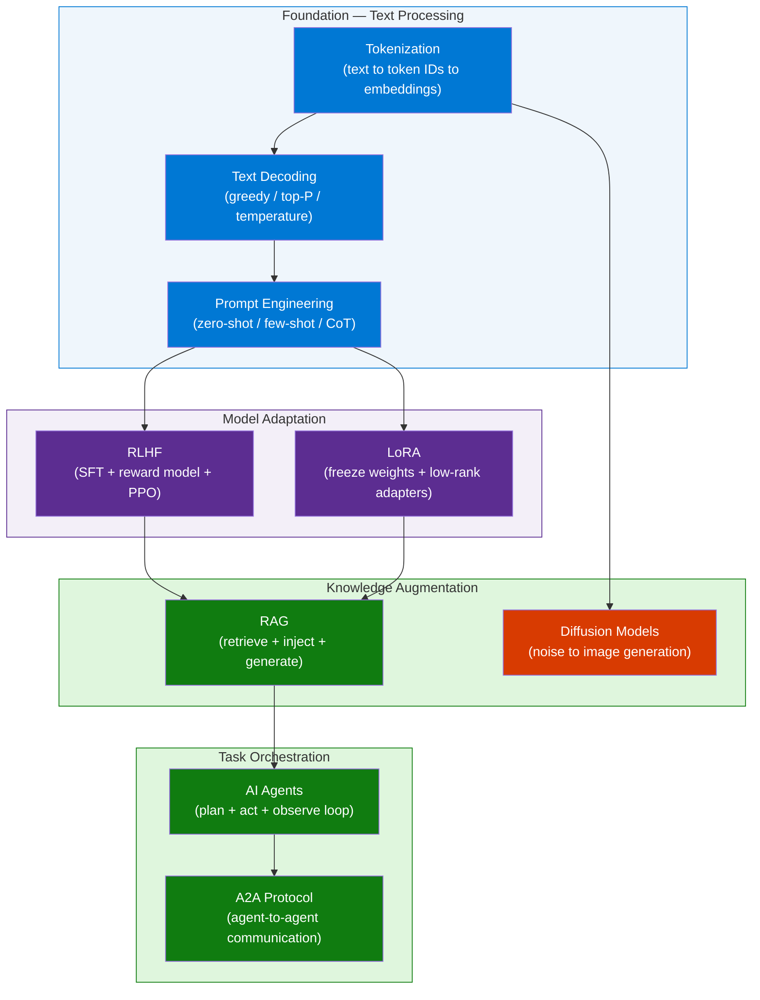
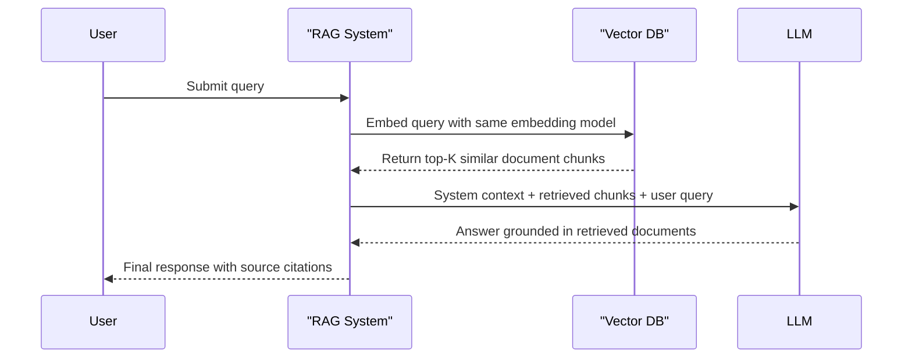
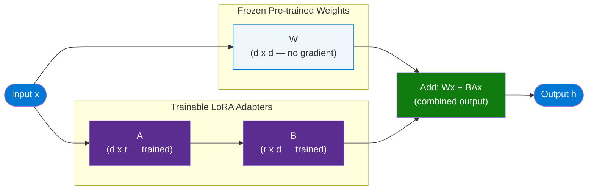
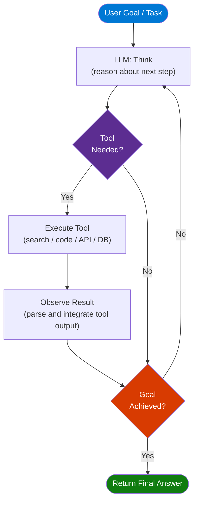
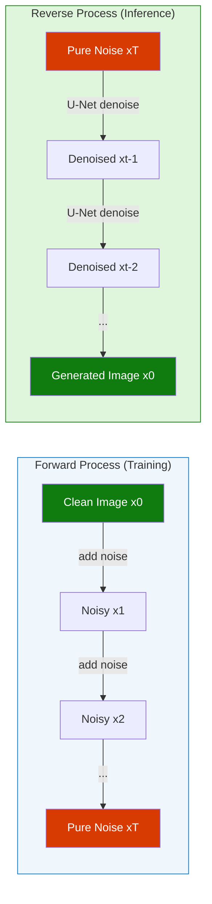

# 9 AI Concepts Explained — ByteByteGo Quick Reference

> **Source:** [YouTube — 9 AI Concepts Explained in 7 minutes: AI Agents, RAGs, Tokenization, RLHF, Diffusion, LoRA...](https://www.youtube.com/watch?v=nVnxG10D5W0)  
> **Channel/Event:** ByteByteGo  
> **Topic:** Tokenization, Text Decoding, Prompt Engineering, AI Agents, RAG, RLHF, Diffusion Models, LoRA, A2A Protocol  
> **Key Claim:** 9 foundational AI/LLM concepts every AI engineer must know — from raw text to autonomous multi-agent systems

---

## Table of Contents

1. [Overview](#1-overview)
2. [Problem Statement](#2-problem-statement)
3. [Core Concepts — All 9 Defined](#3-core-concepts--all-9-defined)
4. [Architecture — The Modern AI Stack](#4-architecture--the-modern-ai-stack)
5. [Key Components](#5-key-components)
6. [How It Works — Concept Interactions](#6-how-it-works--concept-interactions)
7. [Comparison Tables](#7-comparison-tables)
8. [Code Examples](#8-code-examples)
9. [Best Practices](#9-best-practices)
10. [Interview Talking Points](#10-interview-talking-points)
11. [Learning Resources](#11-learning-resources)

---

## 1. Overview

This ByteByteGo reference covers the 9 most essential AI/LLM concepts for engineers building production AI systems. The concepts span the entire AI stack: from how text is converted into tokens a model can process (Tokenization), through alignment techniques that make models safe and useful (RLHF), efficient adaptation methods (LoRA), grounding techniques that reduce hallucination (RAG), generative models for images (Diffusion), and finally autonomous orchestration systems (AI Agents + A2A). Understanding these 9 concepts unlocks the ability to design, evaluate, and optimize end-to-end AI systems. Each concept addresses a specific gap between raw transformer capability and production-grade AI behavior. Together they form a complete mental model of the modern AI engineering stack.

---

## 2. Problem Statement

Raw transformer models trained on next-token prediction are powerful but insufficient for production use:

### Core Engineering Gaps

| Problem | Root Cause | Solution Concept |
|---|---|---|
| Models can't read text directly | Neural nets require numerical input | **Tokenization** |
| Deterministic outputs lack diversity | Greedy decoding picks most likely token | **Text Decoding strategies** |
| Generic prompts yield generic results | No task-specific guidance structure | **Prompt Engineering** |
| Models hallucinate facts | Knowledge frozen at training cutoff | **RAG** |
| Base models ignore instructions | Pure next-token prediction objective | **RLHF** |
| Full fine-tuning is prohibitively expensive | Updating billions of parameters | **LoRA** |
| LLMs can only generate text | No ability to act on the world | **AI Agents** |
| Agents cannot coordinate at scale | No standard communication protocol | **A2A Protocol** |
| Text-only architecture for multimodal tasks | Transformer outputs discrete tokens | **Diffusion Models** |

> **Key Insight:** "Without RLHF, an LLM would continue text in whatever direction seems statistically plausible, even when that direction is unhelpful or unsafe."

---

## 3. Core Concepts — All 9 Defined

### 1. Tokenization

Text is split into subword chunks (tokens) and mapped to integer IDs. A token is roughly 3/4 of a word in English. The model never sees raw text — it sees sequences of integers, which are then converted to dense vector embeddings before entering the transformer. Common algorithms: **BPE** (GPT family), **WordPiece** (BERT), **SentencePiece** (Llama/T5).

```
"Hello world" → ["Hello", " world"] → [9906, 1917] → [emb_9906, emb_1917]
```

Key implication: token count = API cost = context window consumption. Code and non-Latin scripts tokenize less efficiently than English prose.

### 2. Text Decoding

After the model computes logits (a score per vocabulary token), a decoding strategy selects the next token:

| Strategy | Method | Deterministic | Use Case |
|---|---|---|---|
| Greedy | Pick argmax token | Yes | Factual Q&A |
| Top-K sampling | Sample from K most likely | No | Creative writing |
| Top-P (nucleus) | Sample from tokens summing to P | No | Balanced tasks |
| Beam search | Explore B paths simultaneously | Yes | Translation |
| Temperature | Scale logits (low=sharp, high=flat) | Depends | Universal modifier |

### 3. Prompt Engineering

The art of structuring input to elicit desired model behavior without changing weights:

- **Zero-shot** — task described, no examples; relies on pretraining generalization.
- **Few-shot** — 2–5 examples embedded in the prompt demonstrate input-output format.
- **Chain-of-Thought (CoT)** — "Let's think step by step" forces intermediate reasoning; dramatically improves accuracy on math, logic, and multi-step tasks.
- **ReAct** — interleaves reasoning and tool-use traces; standard template for agent prompting.

### 4. AI Agents

Systems where an LLM acts as a reasoning engine that plans, calls tools, observes results, and iterates toward a goal. The core loop:

```
Perceive (input) → Think (reason) → Act (tool call) → Observe (result) → repeat
```

Tools can include: web search, code executors, database queries, API calls, file I/O. Memory types: in-context (conversation history), external (vector DB), episodic (past sessions).

### 5. RAG (Retrieval-Augmented Generation)

Before generating a response, the system retrieves relevant documents from an external knowledge base (vector DB) and injects them into the prompt as context. The model answers using retrieved facts rather than training memory alone — dramatically reducing hallucination on domain-specific, time-sensitive, or proprietary data.

Three retrieval modes:
- **Sparse** (keyword BM25): fast, exact term matching
- **Dense** (vector similarity): semantic matching via embeddings
- **Hybrid**: weighted combination of both; best recall in practice

### 6. RLHF (Reinforcement Learning from Human Feedback)

A post-training alignment technique using three sequential stages:

1. **Supervised Fine-Tuning (SFT)** — fine-tune on human-written demonstrations of ideal responses.
2. **Reward Model Training** — train a separate model to score outputs by learning from human preference pairs (A preferred over B).
3. **RL Optimization (PPO)** — use the reward model as a signal to further optimize the LLM via Proximal Policy Optimization, penalizing KL divergence from the SFT model to prevent mode collapse.

Result: models that follow instructions, refuse harmful requests, and maintain helpful, harmless tone.

### 7. Diffusion Models

Generative models that learn to reverse a noise-addition process:

- **Forward process (training)**: progressively add Gaussian noise to real data over T timesteps until data becomes pure noise. Model learns to predict the noise added at each step.
- **Reverse process (inference)**: start from pure Gaussian noise; the trained network (U-Net for images, DiT for latent diffusion) iteratively removes noise over T steps to produce a clean sample.
- **Conditioning**: text-to-image models inject text embeddings (CLIP) at each denoising step to guide generation.

Used in: Stable Diffusion, DALL-E 3, Midjourney, Sora (video).

### 8. LoRA (Low-Rank Adaptation)

A Parameter-Efficient Fine-Tuning (PEFT) technique. Key insight: weight changes during fine-tuning are intrinsically **low-rank** — they can be approximated by the product of two small matrices without losing significant quality.

**Mechanism**: freeze original weight matrix `W ∈ ℝ^(d×d)`, inject trainable decomposition `ΔW = B × A` where `B ∈ ℝ^(d×r)` and `A ∈ ℝ^(r×d)`, with rank `r << d`. Only A and B are trained.

- Typical ranks: r = 4, 8, 16 (lower = fewer params = more regularization)
- Parameter savings: 0.1%–1% of total model parameters
- At inference: merge adapters into base weights (zero overhead) or keep separate (swappable per task)

### 9. Agent-to-Agent (A2A) Protocol

A standardized open protocol (Google, 2025) enabling specialized AI agents to communicate, delegate subtasks, and coordinate asynchronously — without sharing internal state or model weights.

Key concepts:
- **Agent Card** (JSON manifest): declares agent capabilities, input/output types, authentication
- **Task lifecycle**: `submitted → working → completed/failed`
- **Streaming support**: agents can stream intermediate results back to orchestrators
- **Push notifications**: long-running tasks notify via webhook when complete

Enables: research agent + coding agent + review agent running in parallel, orchestrated by a planner agent.

---

## 4. Architecture — The Modern AI Stack



---

## 5. Key Components

| Concept | Category | Core Mechanism | Primary Trade-off |
|---|---|---|---|
| Tokenization | Pre-processing | BPE / WordPiece subword splitting | Vocabulary size vs OOV handling |
| Text Decoding | Inference | Logit scoring + sampling strategy | Determinism vs diversity |
| Prompt Engineering | Inference | Structured input templates + examples | Prompt length vs model capacity |
| RLHF | Post-training | SFT + reward model + PPO loop | Alignment quality vs reward hacking |
| LoRA | Fine-tuning | Low-rank weight decomposition | Rank vs parameter efficiency |
| RAG | Augmentation | Vector search + context injection | Retrieval recall vs context length |
| Diffusion Models | Generation | Iterative denoising via neural network | Steps vs quality vs speed |
| AI Agents | Orchestration | LLM + tool use + observe-iterate loop | Autonomy vs cost vs safety |
| A2A Protocol | Multi-agent | Agent Card discovery + task delegation | Specialization vs coordination overhead |

---

## 6. How It Works — Concept Interactions

### RAG Pipeline — End to End



### LoRA Fine-Tuning — Weight Decomposition



### AI Agent Execution Loop



### Diffusion Model — Forward and Reverse



---

## 7. Comparison Tables

### Fine-Tuning: Full vs LoRA

| Dimension | Full Fine-Tuning | LoRA |
|---|---|---|
| Parameters updated | 100% of weights | 0.1%–1% (adapters only) |
| GPU memory required | Very high (70B → 8× A100) | Low (fits single consumer GPU) |
| Training time | Days to weeks | Hours to days |
| Storage per task variant | Full model copy (50–140GB) | Small adapter file (5–50MB) |
| Output quality | Highest possible | Near full fine-tune quality |
| Multi-task support | Requires separate models | Swap adapter files at runtime |
| Merge at inference | N/A | Yes — merge for zero overhead |

### LLM Without RAG vs With RAG

| Dimension | Vanilla LLM | RAG-augmented LLM |
|---|---|---|
| Knowledge freshness | Frozen at training cutoff | Real-time via vector DB |
| Hallucination rate | High on domain-specific facts | Low — grounded in retrieved docs |
| Context utilization | Static context window | Scales with retrieval corpus |
| Latency | Generation only | Retrieval + generation |
| Data privacy | Training data exposure risk | Data stays in private vector DB |
| Best for | General world knowledge | Enterprise / proprietary / live data |

### RLHF Stages vs Objective

| Stage | Technique | What It Optimizes | Risk |
|---|---|---|---|
| SFT | Supervised learning | Instruction format adherence | Distribution shift from base model |
| Reward Model | Preference learning | Human preference score | Reward misspecification |
| PPO | Reinforcement learning | Expected reward signal | Reward hacking / mode collapse |

### Decoding Strategy Trade-offs

| Strategy | Determinism | Diversity | Best For |
|---|---|---|---|
| Greedy | Fully deterministic | None | Factual Q&A, classification |
| Top-K sampling | Non-deterministic | High | Creative writing |
| Top-P (nucleus) | Non-deterministic | Controlled | Balanced tasks |
| Beam search | Deterministic | Low | Translation, summarization |
| Temperature scaling | Adjustable | Adjustable | Universal modifier |

---

## 8. Code Examples

### Python — Tokenization with tiktoken

```python
import tiktoken

enc = tiktoken.encoding_for_model("gpt-4o")
text = "Hello, how are you today?"

tokens = enc.encode(text)
print(f"Token IDs:    {tokens}")         # [9906, 11, 1268, 527, 499, 3432, 30]
print(f"Token count:  {len(tokens)}")    # 7
print(f"Decoded:      {enc.decode(tokens)}")

# Count before API call to avoid surprises
MAX_TOKENS = 128_000
if len(tokens) > MAX_TOKENS:
    raise ValueError(f"Input too long: {len(tokens)} tokens")
```

### Python — Minimal RAG Pipeline

```python
from openai import OpenAI
import numpy as np

client = OpenAI()

def embed(text: str) -> list[float]:
    return client.embeddings.create(
        model="text-embedding-3-small", input=text
    ).data[0].embedding

def cosine_similarity(a, b):
    return np.dot(a, b) / (np.linalg.norm(a) * np.linalg.norm(b))

# Knowledge base (would be pre-indexed in production)
docs = [
    "Azure AI Search supports vector, keyword, and hybrid search.",
    "LoRA inserts low-rank adapters into transformer attention projection layers.",
    "RLHF uses a reward model trained on human preference comparison pairs.",
]
doc_embeddings = [embed(d) for d in docs]

def rag_query(question: str, top_k: int = 2) -> str:
    q_emb = embed(question)
    scores = [cosine_similarity(q_emb, d) for d in doc_embeddings]
    top_docs = [docs[i] for i in np.argsort(scores)[-top_k:][::-1]]

    context = "\n".join(f"- {d}" for d in top_docs)
    response = client.chat.completions.create(
        model="gpt-4o",
        messages=[
            {"role": "system", "content": f"Answer using ONLY this context:\n{context}"},
            {"role": "user", "content": question},
        ]
    )
    return response.choices[0].message.content

print(rag_query("What is LoRA?"))
```

### Python — LoRA Fine-Tuning Setup with PEFT

```python
from transformers import AutoModelForCausalLM, AutoTokenizer
from peft import LoraConfig, get_peft_model, TaskType

base_model = "meta-llama/Llama-3.2-3B"
model = AutoModelForCausalLM.from_pretrained(base_model)

lora_config = LoraConfig(
    task_type=TaskType.CAUSAL_LM,
    r=16,                                       # rank — lower = fewer params
    lora_alpha=32,                              # scaling factor (alpha/r = 2)
    target_modules=["q_proj", "v_proj"],        # attention projection layers
    lora_dropout=0.05,
    bias="none",
)

peft_model = get_peft_model(model, lora_config)
peft_model.print_trainable_parameters()
# trainable params: 4,194,304 || all params: 3,216,187,392 || trainable%: 0.13%

# Save adapter only (not full model)
peft_model.save_pretrained("./my-lora-adapter")

# Merge adapter into base at inference time (zero overhead)
merged = peft_model.merge_and_unload()
```

### Python — AI Agent with Tool Use (Anthropic SDK)

```python
from anthropic import Anthropic

client = Anthropic()

tools = [
    {
        "name": "web_search",
        "description": "Search the web for current information on a topic",
        "input_schema": {
            "type": "object",
            "properties": {
                "query": {"type": "string", "description": "Search query"}
            },
            "required": ["query"],
        },
    }
]

def execute_tool(name: str, inputs: dict) -> str:
    if name == "web_search":
        return f"[Search results for: {inputs['query']}]"
    return "Unknown tool"

def run_agent(task: str, max_iterations: int = 10) -> str:
    messages = [{"role": "user", "content": task}]

    for _ in range(max_iterations):
        response = client.messages.create(
            model="claude-sonnet-4-6",
            max_tokens=1024,
            tools=tools,
            messages=messages,
        )

        if response.stop_reason == "end_turn":
            return next(b.text for b in response.content if hasattr(b, "text"))

        tool_use = next(b for b in response.content if b.type == "tool_use")
        tool_result = execute_tool(tool_use.name, tool_use.input)

        messages.extend([
            {"role": "assistant", "content": response.content},
            {"role": "user", "content": [{
                "type": "tool_result",
                "tool_use_id": tool_use.id,
                "content": tool_result,
            }]},
        ])

    return "Max iterations reached"

print(run_agent("What are the latest developments in LoRA fine-tuning?"))
```

### Install / Setup

```bash
# Tokenization
pip install tiktoken

# RAG with OpenAI
pip install openai numpy

# LoRA / PEFT fine-tuning
pip install transformers peft accelerate bitsandbytes

# AI Agents (Anthropic SDK)
pip install anthropic

# Diffusion models
pip install diffusers transformers torch accelerate
```

---

## 9. Best Practices

### Tokenization
- ✅ Count tokens before API calls to avoid truncation surprises
- ✅ Use the same tokenizer for embedding model and LLM in a RAG pipeline
- ✅ Budget ~1.3 tokens/word for English; 2-4× more for code or non-Latin scripts
- ❌ Assume 1 token = 1 word — this breaks cost and context estimates

### RAG
- ✅ Chunk documents at semantic boundaries (paragraphs, not fixed character counts)
- ✅ Use hybrid search (vector + BM25 keyword) — better recall than dense alone
- ✅ Include source citations in retrieved context to enable attribution
- ✅ Re-rank top-K results with a cross-encoder before injection
- ❌ Embed full pages — long chunks dilute similarity scores
- ❌ Skip evaluation — measure recall@K and answer faithfulness separately

### LoRA
- ✅ Target attention projection layers (`q_proj`, `v_proj`) first; add `k_proj`/`o_proj` if underfitting
- ✅ Keep rank r ≤ 64; rank 8–16 is sufficient for most domain adaptation tasks
- ✅ Merge adapters into base model before deployment for zero inference overhead
- ✅ Use multiple task-specific adapters with the same frozen base (efficient multi-task)
- ❌ Use LoRA as a substitute for quality data — data quality dominates all adapter choices

### AI Agents
- ✅ Define strict JSON schemas for tools — models use exactly what they're given
- ✅ Cap the agent loop with a max-iterations guard to prevent runaway API costs
- ✅ Log every think/act/observe cycle for post-hoc debugging and evaluation
- ✅ Use structured output for agent decisions (JSON mode or tool forcing)
- ❌ Give agents irreversible tools (delete, send, publish) without human-in-the-loop confirmation

### Prompt Engineering
- ✅ Use chain-of-thought for any task requiring multi-step reasoning
- ✅ Few-shot examples should cover edge cases, not just the happy path
- ✅ Test prompts with adversarial inputs before production
- ❌ Add more instructions expecting better results — reduce and clarify instead

### RLHF
- ✅ Collect preference pairs from diverse annotators to reduce labeler bias
- ✅ Monitor KL divergence from SFT model during PPO — sharp spikes = instability
- ❌ Optimize reward score as an end goal — reward hacking degrades real quality

---

## 10. Interview Talking Points

### "What is tokenization and why does it matter for LLM performance?"

> Tokenization converts raw text into integer IDs the model can process — the model never sees characters or words directly. The tokenizer's vocabulary (built via BPE or WordPiece) determines encoding efficiency: English averages ~1.3 tokens per word, but code and non-Latin scripts can be 2–4× less efficient. Token count directly controls API cost, context window consumption, and latency. A critical production detail: the embedding model used in a RAG pipeline must share the same tokenizer as the LLM, or retrieved chunk boundaries won't align with model expectations.

---

### "When would you choose RAG over fine-tuning, and when would you combine both?"

> RAG is the right choice when the knowledge base changes frequently (product catalogues, policies, prices) or is proprietary and can't be included in training data — it externalizes facts to a searchable store the model queries at inference time. Fine-tuning is better for adopting a specific reasoning style, output format, or domain-specific vocabulary pattern: behaviors that can't be solved by injecting context. The best production systems combine both — a LoRA-fine-tuned model (for style, tone, and format adherence) layered with RAG (for fresh, grounded facts). Think of fine-tuning as teaching how to think; RAG as providing what to think about.

---

### "Explain LoRA as if you're interviewing for a senior ML engineering role."

> LoRA exploits an empirical observation: weight updates during fine-tuning are intrinsically low-rank, meaning the update matrix ΔW ∈ ℝ^(d×d) can be closely approximated by the product B×A where B ∈ ℝ^(d×r) and A ∈ ℝ^(r×d), with r << d. The original weights are frozen — only the two small adapter matrices are trained, reducing trainable parameters from 100% to 0.1%–1% of the model. A 7B model with rank-16 LoRA might train 4M parameters instead of 7B, making fine-tuning feasible on a single consumer GPU. At inference, adapters can be merged into the base weights for zero latency overhead, or kept separate for per-task hot-swapping.

---

### "What is RLHF and what specific problem does it solve that SFT alone cannot?"

> RLHF solves the alignment gap between statistical plausibility and human preference. SFT teaches the model to imitate human-written responses — it improves format adherence but can still produce confident-sounding harmful or unhelpful outputs. RLHF adds two additional stages: a reward model trained on human preference comparisons (A is better than B) learns to score outputs as humans would; then PPO optimizes the LLM against this reward signal while penalizing KL divergence from the SFT baseline to prevent mode collapse. The result is a model that reliably follows instructions, refuses unsafe requests, and maintains helpful tone — behaviors that next-token prediction alone cannot produce because they require modeling human intent, not just text distributions.

---

### "How do AI Agents differ from a simple LLM API call, and what role does A2A play?"

> A single LLM API call produces text from static input — it's a one-shot function. An AI Agent is a system where the LLM operates as a reasoning engine inside a continuous sense-plan-act loop: receive a goal, decide which tool to invoke, execute the tool (web search, code executor, database), observe the result, then decide whether to continue iterating or return a final answer. This loop enables multi-step task decomposition that no single prompt can handle. A2A extends this into multi-agent collaboration: each agent publishes an Agent Card (a JSON manifest declaring capabilities, I/O schema, and auth), allowing an orchestrator to discover specialized agents and delegate subtasks to them in parallel — a research agent, coding agent, and review agent can work concurrently without sharing model weights or internal state.

---

## 11. Learning Resources

| Resource | Link | Type |
|---|---|---|
| ByteByteGo — 9 AI Concepts | [YouTube](https://www.youtube.com/watch?v=nVnxG10D5W0) | Video |
| Hugging Face PEFT / LoRA Docs | [huggingface.co/docs/peft](https://huggingface.co/docs/peft) | Official Docs |
| Microsoft Learn — RAG Overview | [learn.microsoft.com](https://learn.microsoft.com/en-us/azure/search/retrieval-augmented-generation-overview) | Official Docs |
| Hugging Face Diffusers | [huggingface.co/docs/diffusers](https://huggingface.co/docs/diffusers) | Official Docs |
| Anthropic Tool Use Guide | [docs.anthropic.com](https://docs.anthropic.com/en/docs/build-with-claude/tool-use) | Official Docs |
| Google A2A Protocol Spec | [google.github.io/A2A](https://google.github.io/A2A) | Spec |
| OpenAI Tokenizer (interactive) | [platform.openai.com/tokenizer](https://platform.openai.com/tokenizer) | Tool |
| InstructGPT Paper (RLHF) | [arxiv.org/abs/2203.02155](https://arxiv.org/abs/2203.02155) | Research Paper |
| LoRA Paper (Hu et al., 2021) | [arxiv.org/abs/2106.09685](https://arxiv.org/abs/2106.09685) | Research Paper |

---

*Last Updated: June 2026 | Source: ByteByteGo — 9 AI Concepts Explained in 7 Minutes*
