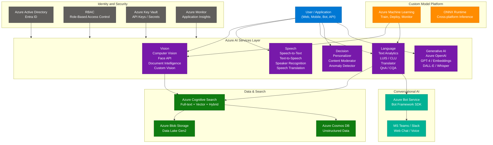
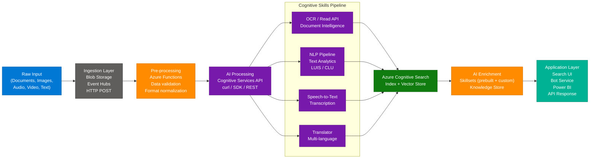
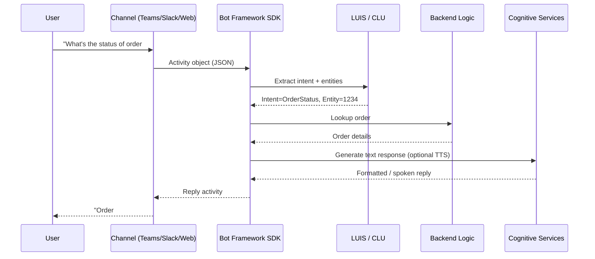
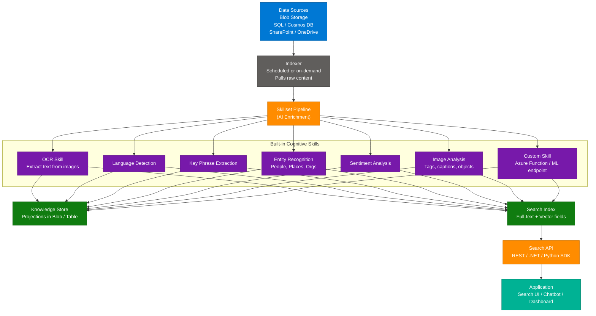

# AI-102: Designing and Implementing Azure AI Solutions — Complete Interview Guide

> **Source:** [Top 25 Interview Questions for AI-102T00](https://iq.iteanz.com/top-25-interview-questions-with-answers-for-ai-102t00-develop-ai-solutions-in-azure-training)
> **Last Updated:** July 2026

---

## Table of Contents

1. [What is AI-102?](#1-what-is-ai-102)
2. [Core Azure AI Services Architecture](#2-core-azure-ai-services-architecture)
3. [Key Components and Services](#3-key-components-and-services)
4. [How It Works — Technical Deep Dive](#4-how-it-works--technical-deep-dive)
5. [Classic vs New: Cognitive Services vs Azure AI Services](#5-classic-vs-new-cognitive-services-vs-azure-ai-services)
6. [Azure Cognitive Search and AI Enrichment](#6-azure-cognitive-search-and-ai-enrichment)
7. [Security and Governance](#7-security-and-governance)
8. [Getting Started — Quickstart Guide](#8-getting-started--quickstart-guide)
9. [Top 25 Interview Q&A — Source + Enriched Answers](#9-top-25-interview-qa--source--enriched-answers)

---

## 1. What is AI-102?

The **AI-102: Designing and Implementing an Azure AI Solution** certification validates the skills of **AI Engineers** who build, manage, and deploy AI-powered solutions on Azure. It replaced and supersedes older Azure AI and Cognitive Services tracks, and is tightly aligned with the modern Azure AI Services portfolio.

**Target Audience:**
- AI Engineers / Applied AI Engineers
- Data Scientists extending into production deployment
- .NET / Python developers building intelligent apps
- Solution Architects designing AI-enriched data pipelines

**Exam Focus Areas:**

| Domain | Weight |
|---|---|
| Plan and manage an Azure AI solution | ~15–20% |
| Implement content moderation solutions | ~10–15% |
| Implement computer vision solutions | ~15–20% |
| Implement natural language processing solutions | ~30% |
| Implement knowledge mining and document intelligence solutions | ~10–15% |
| Implement generative AI solutions | ~10–15% |

**Key Value Propositions:**

| Capability | What It Proves |
|---|---|
| Prebuilt AI APIs | Can consume Azure Cognitive / AI Services via SDK and REST |
| Custom models | Knows when to use Custom Vision, Custom Speech, CLU |
| MLOps integration | Can connect Azure ML pipelines to AI apps |
| Responsible AI | Understands content filters, bias detection, fairness |
| Search + enrichment | Can build AI-enriched cognitive search solutions |
| Generative AI | Can build RAG solutions using Azure OpenAI |

---

## 2. Core Azure AI Services Architecture



---

## 3. Key Components and Services

### 3.1 Azure AI Services (formerly Cognitive Services)

| Category | Service | Key Capability |
|---|---|---|
| **Vision** | Computer Vision | OCR, image description, object detection |
| **Vision** | Face API | Face detection, verification, emotion (access-gated) |
| **Vision** | Document Intelligence | Form extraction, invoice parsing, custom layouts |
| **Vision** | Custom Vision | Train custom image classifiers with your own data |
| **Speech** | Speech-to-Text (STT) | Real-time + batch transcription, 100+ languages |
| **Speech** | Text-to-Speech (TTS) | Neural voices, SSML, custom voice |
| **Speech** | Speech Translation | Real-time audio translation |
| **Speech** | Speaker Recognition | Verify or identify speakers by voice |
| **Language** | Text Analytics | Sentiment, key phrases, NER, opinion mining |
| **Language** | LUIS / CLU | Intent + entity extraction for NLU |
| **Language** | Azure Translator | 90+ language translation, transliteration, detection |
| **Language** | QnA Maker / CQA | FAQ knowledge base for bots |
| **Decision** | Personalizer | Real-time content ranking via reinforcement learning |
| **Decision** | Content Moderator | Text, image, video content moderation |
| **Decision** | Anomaly Detector | Time-series anomaly detection |

### 3.2 Supporting Services

| Service | Role in AI Solutions |
|---|---|
| Azure Machine Learning | Build and train custom models; MLOps pipelines |
| Azure Cognitive Search | Ingest, index, and query documents with AI enrichment |
| Azure Bot Service | Build and host conversational AI agents |
| Azure OpenAI Service | GPT-4, embeddings, DALL-E, Whisper via API |
| Azure Functions | Serverless event-driven AI processing |
| Azure Logic Apps | Orchestrate AI services in low-code workflows |

---

## 4. How It Works — Technical Deep Dive

### 4.1 AI-102 Solution Architecture — Data to Insight Pipeline



### 4.2 Azure Bot Service — Conversational Flow



### 4.3 Computer Vision — Read API Workflow

The **Read API** (now part of Azure AI Vision) handles large-scale OCR asynchronously:

1. **POST** request to `/vision/v3.2/read/analyze` with image URL or binary
2. Response returns `Operation-Location` header with operation ID
3. **GET** poll on `Operation-Location` until status = `succeeded`
4. Parse result: `readResult.pages[].lines[].words[]` with bounding boxes

```python
import requests, time

endpoint = "https://<region>.api.cognitive.microsoft.com/"
key = "<your_key>"
image_url = "https://example.com/document.jpg"

# Step 1: Submit
r = requests.post(
    f"{endpoint}vision/v3.2/read/analyze",
    headers={"Ocp-Apim-Subscription-Key": key, "Content-Type": "application/json"},
    json={"url": image_url}
)
operation_url = r.headers["Operation-Location"]

# Step 2: Poll
while True:
    result = requests.get(operation_url, headers={"Ocp-Apim-Subscription-Key": key})
    data = result.json()
    if data["status"] == "succeeded":
        break
    time.sleep(1)

# Step 3: Parse
for page in data["analyzeResult"]["readResults"]:
    for line in page["lines"]:
        print(line["text"])
```

---

## 5. Classic vs New: Cognitive Services vs Azure AI Services

Microsoft rebranded and modernized Cognitive Services into **Azure AI Services** in 2023–2024. The transition matters for exam scenarios.

| Dimension | Classic Cognitive Services | Azure AI Services (Current) |
|---|---|---|
| **Brand name** | Azure Cognitive Services | Azure AI Services |
| **Endpoint pattern** | `*.cognitiveservices.azure.com` | Same (backward compatible) |
| **API version** | Mixed (v2, v3.0, v3.1) | v3.2+ with continuous updates |
| **Multi-service resource** | Supported (all-in-one key) | Still supported; recommended |
| **LUIS** | Active, standalone | Deprecated — replaced by CLU (Conversational Language Understanding) |
| **QnA Maker** | Standalone portal | Replaced by Custom Question Answering (CQA) in Language Studio |
| **Form Recognizer** | Separate resource | Renamed to Azure AI Document Intelligence |
| **Language Studio** | Available but limited | Unified authoring hub for all NLP tasks |
| **Content Safety** | Content Moderator only | Dedicated Azure AI Content Safety with prompt shields |
| **Pricing model** | Per-service pricing | Consolidated multi-service pricing |
| **Responsible AI** | Limited built-in | RAI dashboard, Content Filters, Transparency notes |

**Use the new model when:** Building new solutions — all new tooling, tutorials, and SDK samples target Azure AI Services.

**Use Classic Cognitive Services references when:** Maintaining legacy solutions or studying older AI-102 exam versions where LUIS and QnA Maker are still covered.

---

## 6. Azure Cognitive Search and AI Enrichment

### 6.1 Architecture



### 6.2 Core Concepts

| Concept | Description |
|---|---|
| **Index** | Schema-defined container for searchable documents |
| **Indexer** | Crawler that pulls content from a data source and feeds the pipeline |
| **Data Source** | Connection definition (Blob, SQL, Cosmos DB, etc.) |
| **Skillset** | Ordered list of cognitive enrichment skills applied during indexing |
| **Knowledge Store** | Persistent storage of enriched data as blobs or tables for downstream use |
| **Projections** | Defines how enriched data is structured in the Knowledge Store |
| **Semantic Ranking** | L2 re-ranking using language models to surface best matches |
| **Vector Search** | Embedding-based similarity search for semantic retrieval |
| **Hybrid Search** | Combines keyword (BM25) + vector (ANN) scoring via RRF fusion |

### 6.3 Challenge → Solution Table

| Challenge | How Cognitive Search Solves It |
|---|---|
| PDFs contain scanned images, not text | OCR skill extracts text from images during indexing |
| Documents in multiple languages | Language Detection → Translator skill chain |
| Need to find "meaning," not keywords | Vector Search on Azure OpenAI embeddings |
| Legal docs with entity extraction need | Named Entity Recognition skill tags people/orgs/places |
| Sales team needs ranked semantic results | Semantic Ranker with semantic configuration |
| Raw enriched data needed by analytics | Knowledge Store projections to Blob/Table |

---

## 7. Security and Governance

### 7.1 Authentication and Access Control

| Control | Details |
|---|---|
| **API Keys** | Two subscription keys per resource; rotate without downtime |
| **Azure Active Directory (Entra ID)** | Token-based auth via service principals or managed identities; preferred over keys |
| **Managed Identity** | System or user-assigned identity; no credential management needed |
| **RBAC Roles** | `Cognitive Services User`, `Cognitive Services Contributor`, `Reader` |
| **Private Endpoints** | Expose services only on VNET — no public internet access |
| **Network ACLs** | IP allowlists or VNET service endpoints to restrict traffic |
| **Azure Key Vault** | Store and rotate API keys, connection strings; reference in apps without hardcoding |

### 7.2 Responsible AI Framework

| Principle | Implementation in Azure AI |
|---|---|
| **Fairness** | Responsible AI dashboard in Azure ML; bias metrics |
| **Reliability** | Availability SLAs, health monitoring, redundant deployments |
| **Privacy** | Customer-managed keys (CMK), no data retention by default in most services |
| **Inclusiveness** | Accessibility features, multi-language support, alt-text via Vision |
| **Transparency** | Model cards, transparency notes published per service |
| **Accountability** | Azure Policy, audit logs via Azure Monitor / Log Analytics |

### 7.3 Content Safety and Moderation

| Service | Use Case |
|---|---|
| **Azure AI Content Safety** | Detect harmful content (hate, violence, sexual, self-harm) in text/images |
| **Content Moderator** | Legacy; being superseded by Content Safety |
| **Prompt Shields** | Protect against prompt injection attacks in GenAI apps |
| **Groundedness Detection** | Detect hallucinations in RAG responses |
| **Face API Access Gate** | Face Recognition requires approved use case (law enforcement restrictions) |

### 7.4 Compliance Standards Supported

- ISO 27001, ISO 27018
- SOC 1, SOC 2, SOC 3
- GDPR (EU data residency options)
- HIPAA BAA available
- FedRAMP (select regions)

---

## 8. Getting Started — Quickstart Guide

### Option 1: Azure Portal

1. Navigate to **Azure AI Services** → Create resource
2. Select service type (Language, Vision, Speech, or Multi-service)
3. Choose region, pricing tier (Free F0 for dev, Standard S0 for prod)
4. After deployment, go to **Keys and Endpoint**
5. Copy `KEY1` and `Endpoint URL`

### Option 2: Python SDK (Text Analytics)

```python
from azure.ai.textanalytics import TextAnalyticsClient
from azure.core.credentials import AzureKeyCredential

endpoint = "https://<your-resource>.cognitiveservices.azure.com/"
key = "<your_key>"

client = TextAnalyticsClient(endpoint=endpoint, credential=AzureKeyCredential(key))

documents = [
    "Azure Cognitive Services is amazing for AI development.",
    "This product has terrible support and crashes constantly."
]

# Sentiment Analysis
response = client.analyze_sentiment(documents)
for doc in response:
    print(f"Sentiment: {doc.sentiment}, Confidence: {doc.confidence_scores}")

# Key Phrase Extraction
kp_response = client.extract_key_phrases(documents)
for doc in kp_response:
    print(f"Key phrases: {doc.key_phrases}")

# Named Entity Recognition
ner_response = client.recognize_entities(documents)
for doc in ner_response:
    for entity in doc.entities:
        print(f"Entity: {entity.text}, Category: {entity.category}, Score: {entity.confidence_score:.2f}")
```

### Option 3: CLI Deployment

```bash
# Create a resource group
az group create --name rg-ai102 --location eastus

# Create multi-service Azure AI resource
az cognitiveservices account create \
  --name ai102-demo \
  --resource-group rg-ai102 \
  --kind CognitiveServices \
  --sku S0 \
  --location eastus \
  --yes

# Get the endpoint and keys
az cognitiveservices account show \
  --name ai102-demo \
  --resource-group rg-ai102 \
  --query "properties.endpoint"

az cognitiveservices account keys list \
  --name ai102-demo \
  --resource-group rg-ai102
```

### Option 4: LUIS / CLU Quickstart (Python)

```python
from azure.ai.language.conversations import ConversationAnalysisClient
from azure.core.credentials import AzureKeyCredential

client = ConversationAnalysisClient(
    endpoint="https://<your-resource>.cognitiveservices.azure.com/",
    credential=AzureKeyCredential("<key>")
)

with client:
    result = client.analyze_conversation(
        task={
            "kind": "Conversation",
            "analysisInput": {
                "conversationItem": {
                    "participantId": "user1",
                    "id": "1",
                    "modality": "text",
                    "language": "en-us",
                    "text": "Book me a flight to Seattle tomorrow"
                }
            },
            "parameters": {
                "projectName": "my-travel-project",
                "deploymentName": "production",
                "verbose": True
            }
        }
    )

intent = result["result"]["prediction"]["topIntent"]
entities = result["result"]["prediction"]["entities"]
print(f"Intent: {intent}")
for entity in entities:
    print(f"Entity: {entity['category']} = {entity['text']}")
```

### Learning Resources

| Type | Resource |
|---|---|
| **Docs** | [Azure AI Services documentation](https://learn.microsoft.com/en-us/azure/ai-services/) |
| **Exam** | [AI-102 Exam Study Guide](https://learn.microsoft.com/en-us/credentials/certifications/exams/ai-102/) |
| **Learning Path** | [Microsoft Learn: Azure AI Engineer](https://learn.microsoft.com/en-us/training/paths/prepare-for-ai-engineering/) |
| **Code Samples** | [Azure-Samples on GitHub](https://github.com/Azure-Samples) |
| **Language Studio** | [language.cognitive.azure.com](https://language.cognitive.azure.com) |
| **Vision Studio** | [vision.cognitive.azure.com](https://vision.cognitive.azure.com) |
| **Speech Studio** | [speech.microsoft.com](https://speech.microsoft.com) |

---

## 9. Top 25 Interview Q&A — Source + Enriched Answers

**Q1: What is the AI-102 certification, and who is it for?**
> The **AI-102: Designing and Implementing an Azure AI Solution** certification validates skills in building production-grade AI applications using Azure services. It is designed for AI Engineers, data scientists, and developers responsible for consuming Azure Cognitive / AI Services, training custom models, building conversational agents with Bot Framework, and creating intelligent search solutions. Unlike the data-focused DP-100, AI-102 focuses on the application layer — integrating prebuilt AI APIs, securing them, and optimizing them for real workloads.

**Q2: Which Azure services are most commonly used in AI solutions?**
> - **Azure AI Services**: Prebuilt APIs for Vision, Speech, Language, and Decision capabilities
> - **Azure Machine Learning**: For training and deploying custom ML models with MLOps
> - **Azure Bot Service**: For building and hosting conversational agents across channels
> - **Azure Cognitive Search**: AI-powered full-text and vector search with enrichment pipelines
> - **Azure OpenAI Service**: For GPT-4, embeddings, DALL-E — critical for GenAI applications
> - **Azure Data Lake / Blob Storage**: Raw data storage for batch AI processing
> - **Azure Functions / Logic Apps**: Serverless orchestration of AI workflows

**Q3: What is Azure Cognitive Services?**
> Azure Cognitive Services (now rebranded as **Azure AI Services**) is a portfolio of prebuilt AI REST APIs and SDKs that let developers add intelligent features to applications without training models from scratch. The four pillars are: **Vision** (OCR, image analysis, face detection), **Speech** (STT, TTS, translation, speaker recognition), **Language** (sentiment, NER, translation, intent understanding), and **Decision** (personalizer, anomaly detector, content moderator). All services share a unified endpoint pattern and support both per-service and multi-service resource deployments.

**Q4: What are the components of Azure Cognitive Services?**
> Grouped into four major categories:
> - **Vision**: Computer Vision (OCR, tags, captions), Face API (detection, verification), Azure AI Document Intelligence (Form Recognizer), Custom Vision (custom classifiers/detectors)
> - **Speech**: Speech-to-Text (batch/real-time), Text-to-Speech (neural voices), Speech Translation (real-time), Speaker Recognition (identification/verification)
> - **Language**: Text Analytics (sentiment, NER, key phrases), LUIS/CLU (intent + entity for NLU), Translator (90+ languages), Custom Question Answering (FAQ bots)
> - **Decision**: Personalizer (RL-based content ranking), Content Moderator (text/image/video safety), Anomaly Detector (time-series outlier detection)

**Q5: What is Azure Bot Service and where is it used?**
> Azure Bot Service provides a managed cloud hosting environment for conversational agents built with the **Bot Framework SDK** (C#, Python, JavaScript). It supports integration with 10+ channels — Microsoft Teams, Slack, WhatsApp, Facebook Messenger, Twilio, and web chat. Internally, a bot processes **Activities** (message, conversationUpdate, event) and uses **Dialogs** for multi-turn conversation flows. LUIS or CLU provides NLU (intent + entity extraction), while QnA Maker / CQA handles FAQ responses. Azure Bot Service handles authentication, scaling, and channel routing automatically.

**Q6: What is the purpose of the AI-102 certification in the Azure ecosystem?**
> AI-102 certifies that a professional can build end-to-end AI solutions on Azure — from consuming prebuilt Cognitive/AI Service APIs to deploying custom ML models, securing resources with Entra ID and RBAC, and building search and conversational solutions. It positions holders as bridge engineers between data scientists (who build models) and software engineers (who build apps), ensuring they can deploy AI responsibly, cost-effectively, and at scale. In the GenAI era, AI-102 now also covers Azure OpenAI, RAG patterns, and responsible AI controls.

**Q7: How does Azure Form Recognizer (Document Intelligence) help automate document processing?**
> Azure AI Document Intelligence (formerly Form Recognizer) uses computer vision and NLP to extract structured data from unstructured documents. **Prebuilt models** handle invoices, receipts, ID documents, W-2 forms, and business cards out of the box. **Custom models** can be trained on 5–50 labelled examples using Document Intelligence Studio. **Composed models** combine multiple custom models to handle varied document types. Output includes: key-value pairs, tables, bounding boxes, confidence scores, and selection marks (checkboxes). Integration via REST API or `azure-ai-formrecognizer` Python SDK.

**Q8: What is the difference between Azure Cognitive Services and Azure Machine Learning?**

| Feature | Azure Cognitive / AI Services | Azure Machine Learning |
|---|---|---|
| **Purpose** | Consume prebuilt AI capabilities | Build, train, and deploy custom models |
| **Technical Skill** | Low — REST calls and SDKs | High — Python, ML frameworks (PyTorch, TF) |
| **Training Required** | None (or minimal for custom variants) | Yes — data prep, feature engineering, training |
| **Latency** | ~100–500ms per API call | Varies — real-time inference or batch |
| **Cost Model** | Per-transaction pricing | Compute + storage costs |
| **Use Case** | Rapid integration of AI features | Unique domain-specific prediction tasks |
| **Customization** | Limited (Custom Vision, Custom Speech) | Full control over architecture and data |

**Q9: What is LUIS and how has it evolved?**
> **LUIS (Language Understanding Intelligent Service)** was Azure's standalone NLU service for identifying **intents** (what the user wants) and **entities** (key data in the utterance). Developers trained it by providing utterance examples per intent. It is now **deprecated** in favor of **CLU (Conversational Language Understanding)** in Azure AI Language, which offers: improved multi-lingual support, entity overlap handling, none-intent improvements, and unified authoring via Language Studio. For new projects, always use CLU. LUIS authoring portals are being retired.

**Q10: What is CLU (Conversational Language Understanding) and why is it important?**
> CLU is the modern successor to LUIS within **Azure AI Language**. It enables applications to understand natural-language user input by predicting the top **intent** and extracting typed **entities**. Key improvements over LUIS: supports learned and list entities with overlap, handles language auto-detection, integrates with orchestration workflows, and is built on transformer-based models. CLU projects are managed in Language Studio and deployed via the Conversations API — same endpoint as other Azure AI Language tasks.

**Q11: What are the benefits of using Azure AI Services in AI development?**
> 1. **Speed to market**: Prebuilt models eliminate months of training for common AI tasks
> 2. **No ML expertise required**: REST API and SDK wrappers mean any developer can add AI
> 3. **Global scale**: Microsoft's global infrastructure ensures low-latency responses in 50+ regions
> 4. **Continuous improvement**: Models are updated by Microsoft without breaking existing API contracts
> 5. **Security-first**: Entra ID, RBAC, private endpoints, CMK, and compliance certifications built in
> 6. **Unified billing**: Multi-service resources consolidate spend across Vision, Speech, and Language
> 7. **Responsible AI**: Content Safety, transparency notes, and fairness tooling included

**Q12: How does Azure Bot Service enhance conversational AI?**
> Azure Bot Service abstracts the channel complexity out of bot development. A single bot codebase can serve Teams, Slack, WhatsApp, web, and voice with no code changes — the service handles channel adapters. It integrates natively with **CLU** for intent understanding, **CQA** for FAQ responses, **Speech Services** for voice bots, and **Azure OpenAI** for generative responses. The Bot Framework SDK provides Dialogs (waterfall, component, adaptive), state management (user/conversation state in Cosmos DB or Blob), and middleware for logging and tracing. **Copilot Studio** (Power Virtual Agents) offers a low-code alternative built on the same infrastructure.

**Q13: Explain the steps to use the Computer Vision Read API.**
> The Read API performs asynchronous OCR on images and PDFs:
> 1. **POST** to `/computervision/imageanalysis:analyze?api-version=2023-02-01-preview&features=read` (v4) or `/vision/v3.2/read/analyze` (v3.2)
> 2. Response: HTTP 202 with `Operation-Location` header containing the operation polling URL
> 3. **GET** the operation URL every 1–2 seconds until `status == "succeeded"` or `"failed"`
> 4. Parse `analyzeResult.readResults[].lines[].words[]` for words with bounding polygons
> 5. Use the bounding box data to reconstruct table structures or paragraph layouts

**Q14: What is Azure Translator and how does it work?**
> Azure Translator is a neural machine translation service supporting **90+ language pairs**. It works via a REST API — submit text as JSON and receive translated output, with optional auto language detection, transliteration, and dictionary lookup. It uses **transformer-based NMT models** fine-tuned on billions of document pairs. The **Custom Translator** feature allows fine-tuning on domain-specific terminology (legal, medical, technical) using aligned parallel corpora. Common use cases: multilingual chatbots, document translation portals, real-time subtitle generation, localization pipelines.

**Q15: What is the difference between Text Analytics and LUIS?**

| Feature | Text Analytics (Azure AI Language) | LUIS / CLU |
|---|---|---|
| **Goal** | Mine insight from text (sentiment, NER, key phrases) | Understand user intent and extract entities for NLU |
| **Training** | No training — prebuilt models | Requires training on your intent/utterance examples |
| **Customization** | Custom NER (fine-tune entity extraction) | Full custom model — intents, entities, ML |
| **Output** | Sentiment score, categories, entities, key phrases | Top intent + confidence + entity list |
| **Use Case** | Analyze support tickets, feedback, documents | Build chatbots, voice assistants, command interfaces |
| **Authoring** | Language Studio (analyze tab) | Language Studio (CLU / conversations tab) |

**Q16: What is the Speech Service in Azure and what does it offer?**
> Azure AI Speech provides four core capabilities:
> - **Speech-to-Text (STT)**: Real-time streaming transcription and batch offline transcription. Supports 100+ locales, custom acoustic/language models via Custom Speech.
> - **Text-to-Speech (TTS)**: Neural voice synthesis with SSML control over rate, pitch, pauses, and prosody. Supports 400+ voices across 140+ languages. Custom Neural Voice for branded voices.
> - **Speech Translation**: Real-time audio translation pipeline (STT → MT → TTS in one API call).
> - **Speaker Recognition**: Identifies or verifies a speaker from audio using voice biometrics (requires enrollment).

**Q17: What is the role of Azure Cognitive Search in AI solutions?**
> Azure Cognitive Search serves as the **intelligent retrieval layer** in AI solutions. It indexes content from diverse sources, applies AI enrichment during indexing (via Skillsets), and provides querying capabilities including full-text search (BM25), faceted navigation, geo-filtering, semantic ranking, and vector search. In RAG (Retrieval-Augmented Generation) architectures, Cognitive Search retrieves context chunks that are injected into GPT-4 prompts. Hybrid search (keyword + vector) with Reciprocal Rank Fusion (RRF) typically outperforms either alone.

**Q18: What is the difference between Speech-to-Text and Text-to-Speech?**
> - **Speech-to-Text (ASR — Automatic Speech Recognition)**: Converts spoken audio (microphone, file) into written text. Use cases: meeting transcription, voice command interfaces, call center analytics, live captioning. Supports real-time streaming and batch modes.
> - **Text-to-Speech (TTS — Speech Synthesis)**: Converts written text into audio waveforms using neural voices. SSML (Speech Synthesis Markup Language) controls prosody, emphasis, pauses, and voice selection. Use cases: accessibility tools, voice assistants, audiobook generation, IVR systems.
> Both services are part of Azure AI Speech and share the same SDK (`azure-cognitiveservices-speech`).

**Q19: What are Skillsets in Azure Cognitive Search?**
> A **Skillset** is an ordered pipeline of AI skills applied to content during indexing. Each skill consumes input fields and produces enriched output fields that flow into the search index or Knowledge Store. Types of skills:
> - **Built-in cognitive skills**: OCR, Language Detection, Key Phrase Extraction, Entity Recognition, Sentiment Analysis, Image Analysis, Translation, PII Detection
> - **Custom skills**: Azure Function or REST endpoint — allows any custom processing (ML model inference, regex, lookup tables)
> - **Azure ML skills**: Invoke an Azure ML endpoint directly from the skillset
> Skills chain together — OCR output (text) flows into Language Detection, which feeds Key Phrase Extraction.

**Q20: What is the difference between Custom Vision and Computer Vision APIs?**

| Feature | Custom Vision | Computer Vision (Azure AI Vision) |
|---|---|---|
| **Training** | Train on your own labelled images | Prebuilt — no training needed |
| **Use Case** | Brand logo detection, defect classification, specialized objects | General OCR, image description, object detection, face attributes |
| **Minimum Data** | 15–50 images per class | None |
| **Output** | Class label + confidence | Rich JSON: tags, captions, text, objects, colors |
| **Customizable** | Yes — iterative retraining | No (except via Azure ML) |
| **Deployment** | Export to ONNX, TensorFlow Lite, CoreML | Always cloud-hosted API |
| **Latency** | Standard or compact (edge) | Cloud API latency |

**Q21: How do you secure AI services in Azure?**
> **Identity layer**: Use Managed Identity or service principal (Entra ID) for zero-credential access. Avoid embedding API keys in code — store in Azure Key Vault.
> **Network layer**: Enable Private Endpoints to restrict service access to a VNET. Use Network ACLs to allowlist specific IP ranges or subnets.
> **Access layer**: Assign least-privilege RBAC roles — `Cognitive Services User` for inference calls, `Cognitive Services Contributor` for management operations.
> **Audit layer**: Enable Diagnostic Logs via Azure Monitor → Log Analytics. Set up alerts on unusual API call volumes or authentication failures.
> **Compliance layer**: Enable Customer-Managed Keys (CMK) for data at rest. Verify service compliance notes for GDPR, HIPAA, and regional data residency requirements.

**Q22: What is the use of Azure Machine Learning in AI-102 scenarios?**
> Azure ML is used when prebuilt AI Services don't meet business needs — e.g., training a domain-specific text classifier on proprietary data, or fine-tuning an image detection model. In AI-102 context: **AML pipelines** preprocess data and feed outputs to Cognitive Services indexers; **AML endpoints** serve custom models called as **Custom Skills** from Cognitive Search Skillsets; **AML for MLOps** handles model versioning, A/B deployments, and monitoring. The distinction: Cognitive Services = prebuilt consumption; AML = custom model lifecycle.

**Q23: What security features protect Azure AI services?**
> - **Authentication**: API keys (primary/secondary), Entra ID tokens, Managed Identity
> - **Authorization**: RBAC with fine-grained roles; `Cognitive Services User` vs `Contributor` vs `Owner`
> - **Network**: Private Endpoints, Service Endpoints, IP firewall rules, Trusted Services bypass
> - **Data**: No training data retained by default; CMK for encryption at rest; TLS 1.2+ in transit
> - **Content**: Azure AI Content Safety for prompt/response filtering; Prompt Shields for injection protection
> - **Compliance**: GDPR, ISO 27001/27018, SOC 2, HIPAA BAA, FedRAMP Moderate (select services/regions)
> - **Audit**: Azure Monitor, Log Analytics, Azure Policy for governance guardrails

**Q24: How does Azure AI ensure scalability and reliability?**
> - **Multi-region deployment**: Services available in 50+ Azure regions; deploy resources close to users to minimize latency
> - **SLA**: 99.9% uptime SLA for Standard tier; higher with paired regions and zone-redundant deployments
> - **Load balancing**: Azure Traffic Manager or API Management distributes requests across regional endpoints
> - **Autoscaling**: Azure Functions / Logic Apps + Event Hubs for event-driven, elastic AI pipelines
> - **Throttling and quotas**: Adjustable TPS (transactions per second) limits per tier; burst handling with retry-after headers
> - **AKS hosting**: Custom model containers hosted on AKS with HPA (Horizontal Pod Autoscaler) for throughput spikes
> - **Circuit breakers**: Implement with Polly (C#) or Tenacity (Python) to handle transient faults gracefully

**Q25: What is AI enrichment in Azure Cognitive Search and how does it work?**
> AI enrichment is the process of using **cognitive skills** to transform raw, unstructured content into structured, searchable metadata during the indexing pipeline. When an indexer runs, it passes each document through the Skillset. Skills analyze text and images — extracting entities, detecting language, running OCR on embedded images, and calling custom ML endpoints. The enriched fields are projected into two targets: the **Search Index** (for queryable fields like extracted names, sentiment, key phrases) and the **Knowledge Store** (persisted enriched data in Blob or Table Storage for analytics and downstream apps). AI enrichment powers scenarios like enterprise search over PDFs, compliance document mining, and hybrid RAG retrieval.

---

*Sources: [iq.iteanz.com — Top 25 AI-102 Interview Questions](https://iq.iteanz.com/top-25-interview-questions-with-answers-for-ai-102t00-develop-ai-solutions-in-azure-training) | Enriched with Azure AI Services documentation, official exam guide, and domain knowledge. Last Updated: July 2026*
