# AI & ML Interview Q&A Complete Guide

---

## 1/ LLM (Large Language Models)

### Q1. What is a large language model?

A Large Language Model (LLM) is a neural network trained on massive text corpora to understand and generate human language. It uses the Transformer architecture with billions of parameters to learn statistical patterns in language.

**Key characteristics:**
- Trained on internet-scale text data (hundreds of billions of tokens)
- Uses self-attention mechanisms to understand context
- Capable of generalization across tasks without task-specific training

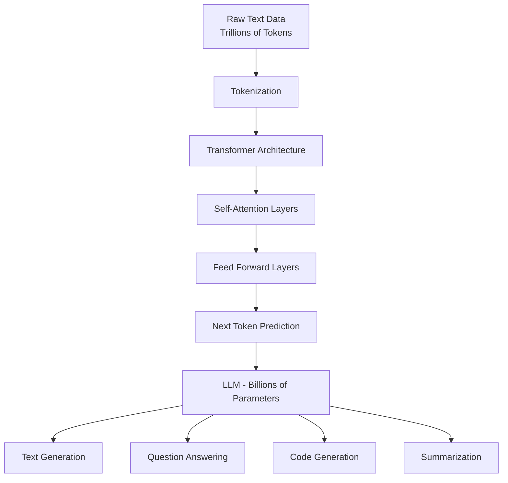

---

### Q2. How are LLMs trained?

LLM training happens in multiple stages:

1. **Pre-training** — Self-supervised learning on massive unlabeled text using next-token prediction (causal LM) or masked token prediction (BERT-style)
2. **Supervised Fine-Tuning (SFT)** — Trained on curated instruction-response pairs
3. **RLHF** — Reinforcement Learning from Human Feedback to align with human preferences

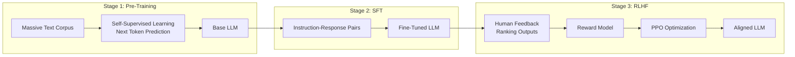

**Compute requirements:** GPT-4 class models require thousands of A100/H100 GPUs for weeks to months.

---

### Q3. What is prompt engineering?

Prompt engineering is the practice of designing input prompts to elicit accurate, relevant, and high-quality responses from LLMs without modifying model weights.

**Core techniques:**

| Technique | Description | Example |
|-----------|-------------|---------|
| Zero-shot | Direct question with no examples | "Summarize this article:" |
| Few-shot | Provide examples in the prompt | 2–5 input/output pairs before the task |
| Chain-of-thought | Ask model to reason step by step | "Think step by step..." |
| Role prompting | Assign a persona | "You are a senior architect..." |
| ReAct | Reason + Act in loops | Thought → Action → Observation |

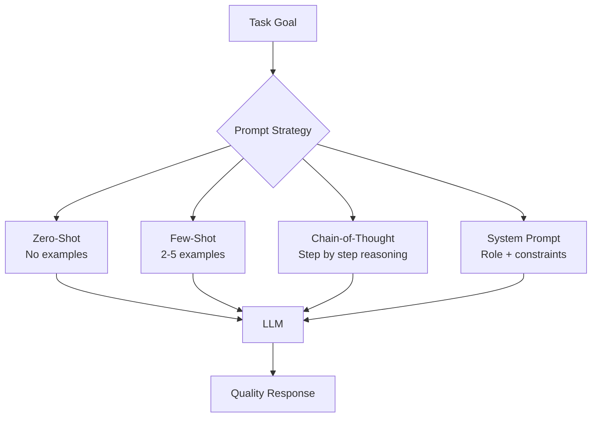

---

### Q4. What is few-shot vs zero-shot prompting?

**Zero-shot prompting:** The model receives only the task description, no examples. Relies entirely on pre-trained knowledge.

```
Prompt: Classify the sentiment of this review: "The movie was terrible."
Output: Negative
```

**Few-shot prompting:** The prompt includes 2–5 labeled examples before the actual task. The model learns the pattern in-context (in-context learning).

```
Prompt:
Review: "Amazing experience!" → Positive
Review: "Waste of money." → Negative
Review: "It was okay." → Neutral
Review: "Absolutely loved it!" → ?
Output: Positive
```

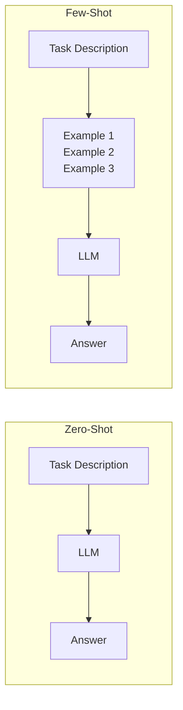

**When to use:**
- Zero-shot: Simple, well-understood tasks; when examples are unavailable
- Few-shot: Complex tasks; when output format must match a specific pattern

---

### Q5. What is temperature in LLM generation?

Temperature controls the randomness of the model's token sampling during generation. It scales the logits (raw probability scores) before applying softmax.

- **Low temperature (0–0.3):** More deterministic; model picks the highest-probability token. Good for factual Q&A, code generation.
- **Medium temperature (0.5–0.7):** Balanced creativity and coherence. Good for general chat.
- **High temperature (0.8–1.5):** More creative and diverse outputs. Good for creative writing, brainstorming.

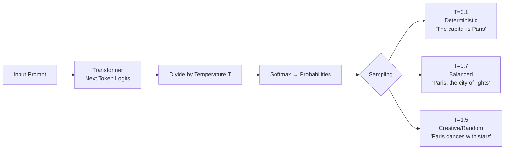

**Formula:** `P(token) = softmax(logits / T)`

---

### Q6. What is hallucination in LLMs?

Hallucination is when an LLM generates factually incorrect, fabricated, or nonsensical content with high confidence. It occurs because LLMs predict statistically plausible token sequences, not factually verified statements.

**Types:**
- **Factual hallucination:** Wrong facts ("Einstein was born in France")
- **Source hallucination:** Cites non-existent papers or URLs
- **Reasoning hallucination:** Logical errors in multi-step reasoning
- **Entity hallucination:** Invents names, dates, statistics

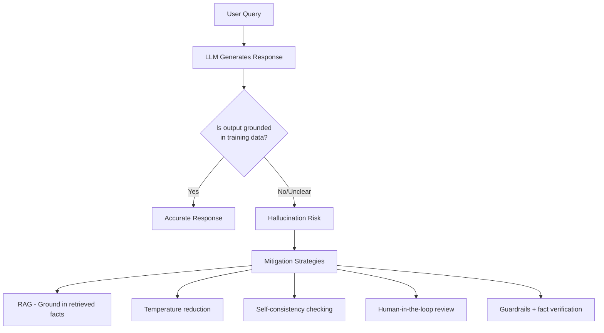

**Mitigation strategies:** RAG (grounding in real documents), lower temperature, self-consistency, Constitutional AI, external fact-checking tools.

---

### Q7. What is instruction tuning?

Instruction tuning (also called supervised fine-tuning / SFT) is the process of fine-tuning a pre-trained base LLM on a dataset of `(instruction, response)` pairs so it learns to follow natural language instructions.

**Why it matters:** Base LLMs can complete text but not follow instructions reliably. Instruction tuning transforms a base model (e.g., GPT base) into an assistant (e.g., ChatGPT).

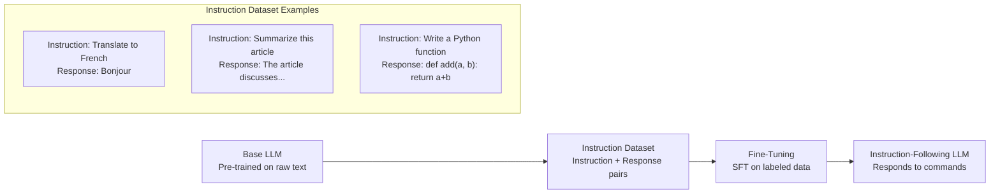

**Examples of instruction-tuned models:** GPT-3.5-turbo, Claude, Gemini Pro, LLaMA-3-Instruct

---

### Q8. What is RLHF?

RLHF (Reinforcement Learning from Human Feedback) is a training technique that uses human preferences to align LLM outputs with human values, safety, and helpfulness.

**Steps:**
1. **SFT:** Fine-tune base model on demonstrations
2. **Reward Model:** Train a separate model to score outputs based on human rankings
3. **RL Optimization:** Use PPO (Proximal Policy Optimization) to maximize reward while staying close to the SFT model

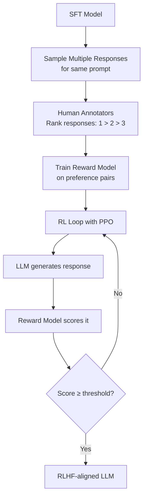

**KL divergence penalty** is used to prevent the model from drifting too far from the SFT baseline during PPO optimization.

---

### Q9. What are context windows in LLMs?

A context window is the maximum number of tokens (words/subwords) an LLM can process in a single forward pass — both input and output combined. It defines the "working memory" of the model.

| Model | Context Window |
|-------|----------------|
| GPT-3 | 4K tokens |
| GPT-4 Turbo | 128K tokens |
| Claude 3.5 Sonnet | 200K tokens |
| Gemini 1.5 Pro | 1M tokens |

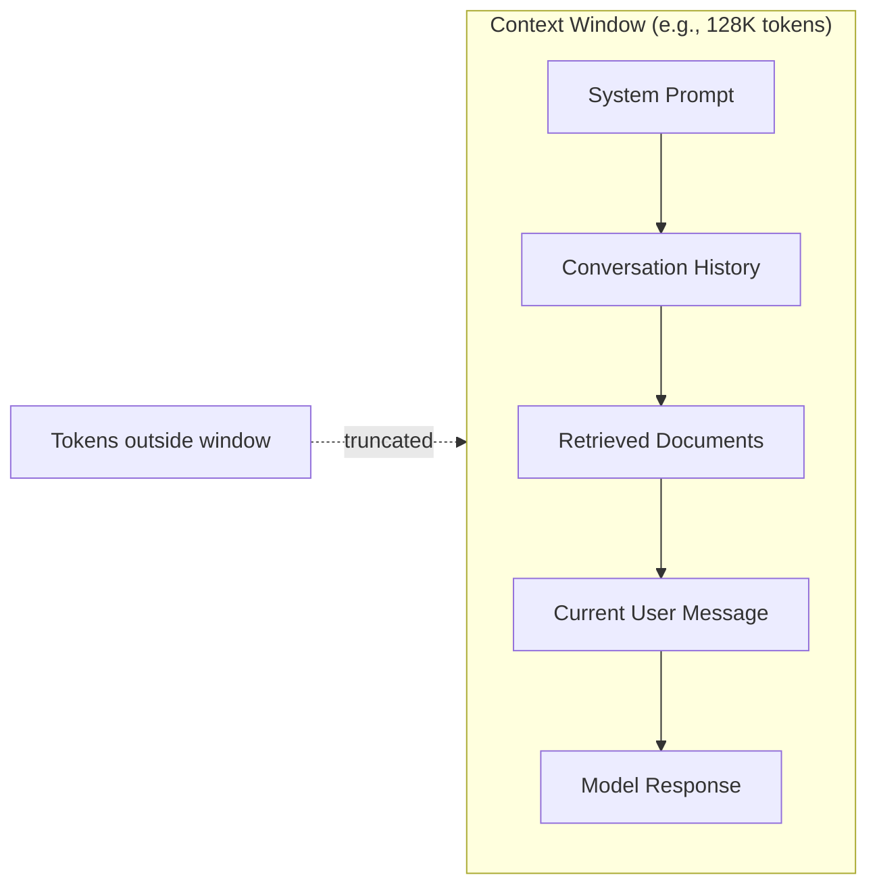

**Challenges with large contexts:**
- Quadratic attention complexity O(n²)
- "Lost in the middle" problem — model pays less attention to content in the middle
- Higher latency and cost per call

---

### Q10. What are embeddings and why are they used with LLMs?

Embeddings are dense numerical vector representations of text (words, sentences, documents) that capture semantic meaning. Similar texts produce similar vectors (measured by cosine similarity).

**Why used with LLMs:**
- LLMs cannot efficiently search or compare raw text — embeddings enable semantic search
- Enable RAG: retrieve relevant documents using vector similarity before feeding to LLM
- Power recommendation, clustering, deduplication, anomaly detection

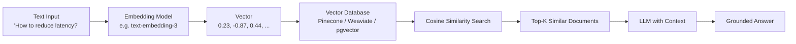

**Embedding models:** OpenAI text-embedding-3, Cohere Embed, Google textembedding-gecko, sentence-transformers (open source)

---

## 2/ RAG (Retrieval Augmented Generation)

### Q1. What is RAG and why is it used?

RAG (Retrieval Augmented Generation) is an architecture pattern that enhances LLM responses by retrieving relevant external knowledge before generating an answer. It combines the generative power of LLMs with the precision of information retrieval.

**Why it's used:**
- LLMs have static knowledge cut-off dates — RAG provides real-time knowledge
- Reduces hallucination by grounding responses in actual documents
- Enables domain-specific knowledge without expensive fine-tuning
- Provides source attribution and traceability

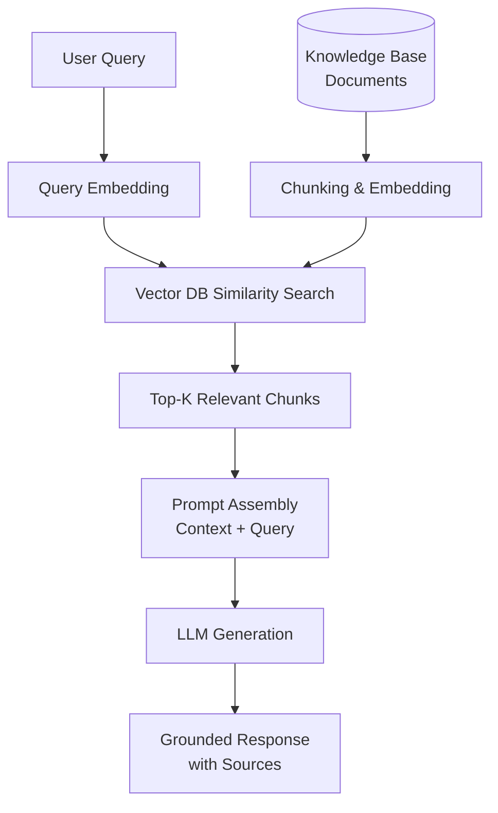

---

### Q2. What problem does RAG solve in LLM systems?

| Problem | Without RAG | With RAG |
|---------|-------------|----------|
| Knowledge cutoff | Model stuck at training date | Real-time knowledge injection |
| Hallucination | Model fabricates facts | Grounded in retrieved documents |
| Domain knowledge | Generic answers | Domain-specific, accurate answers |
| Cost | Expensive fine-tuning | Cheaper knowledge updates |
| Transparency | Black box | Source citations provided |
| Privacy | Data must be in training set | Documents stay in your infra |

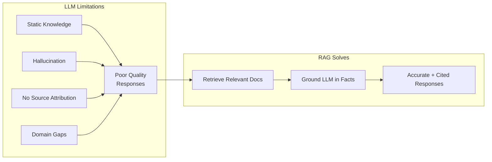

---

### Q3. What are embeddings in RAG pipelines?

In RAG, embeddings are the bridge between queries and documents. Both the user query and the knowledge documents are converted to vectors using the same embedding model so they exist in the same semantic space.

**Embedding pipeline in RAG:**
1. **Ingestion:** Documents are chunked and embedded → stored in vector DB
2. **Query time:** User query is embedded using the same model
3. **Retrieval:** Cosine/dot-product similarity finds nearest document vectors

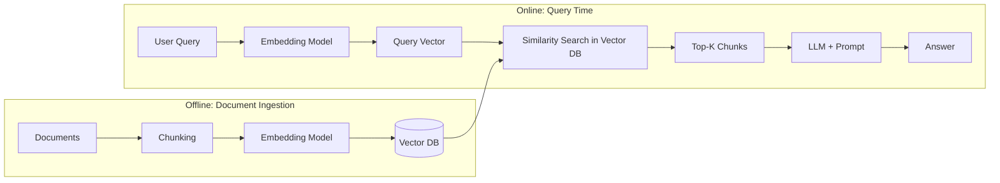

**Critical constraint:** The same embedding model must be used at ingestion and query time.

---

### Q4. What is a vector database?

A vector database is a specialized database designed to store, index, and efficiently search high-dimensional numerical vectors (embeddings). It supports approximate nearest neighbor (ANN) search at scale.

**Core capabilities:**
- Store millions/billions of vectors
- Fast similarity search using algorithms: HNSW, IVF, PQ
- Filter by metadata alongside vector search (hybrid search)
- Real-time updates and deletions

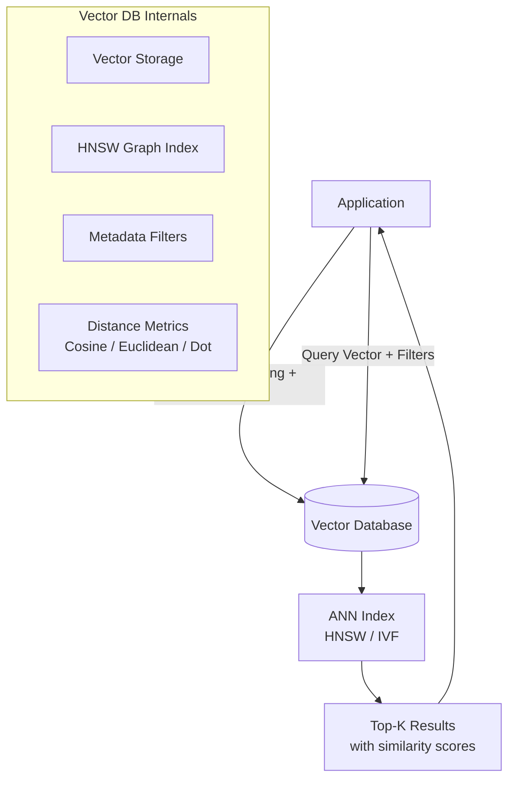

---

### Q5. What are popular vector databases?

| Database | Type | Strengths | Best For |
|----------|------|-----------|----------|
| **Pinecone** | Managed cloud | Fully managed, easy scaling | Production SaaS RAG |
| **Weaviate** | Open source | Hybrid search, GraphQL | Enterprise search |
| **Qdrant** | Open source | High performance, Rust-based | High-throughput inference |
| **Chroma** | Open source | Developer-friendly | Local dev & prototyping |
| **pgvector** | PostgreSQL extension | SQL + vector in one DB | When already using Postgres |
| **Azure AI Search** | Managed cloud | Azure native, hybrid search | Azure-based solutions |
| **FAISS** | Library (Meta) | Fastest pure ANN search | Research & offline batch |
| **Milvus** | Open source | Billion-scale vectors | Very large datasets |

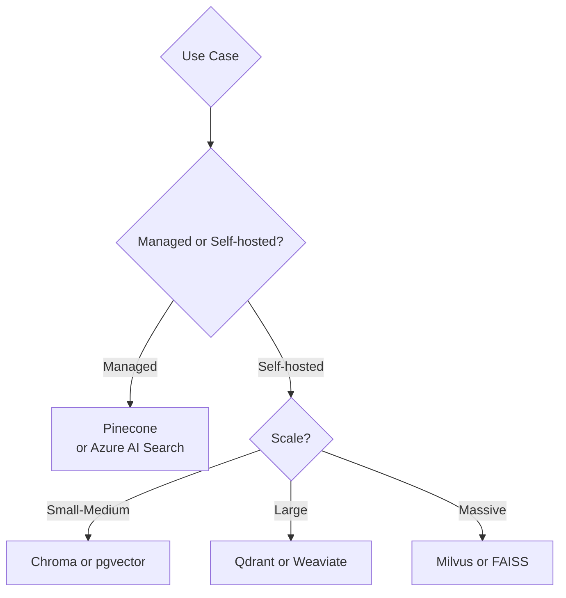

---

### Q6. What is chunking in RAG pipelines?

Chunking is the process of splitting large documents into smaller segments before embedding and storing in a vector database. It's critical because embedding models have token limits and retrieving a full document is inefficient and noisy.

**Chunking strategies:**

| Strategy | Description | Use Case |
|----------|-------------|----------|
| **Fixed-size** | Split every N tokens | Simple, fast baseline |
| **Sentence-based** | Split on sentence boundaries | Preserves semantic units |
| **Recursive character** | Split on `\n\n`, `\n`, ` ` hierarchically | General documents |
| **Semantic** | Embed then split where similarity drops | Best accuracy, slower |
| **Document structure** | Split by section, heading, paragraph | PDFs, Word docs |
| **Sliding window** | Overlapping chunks (e.g., 512 tokens, 50 overlap) | Avoids boundary information loss |

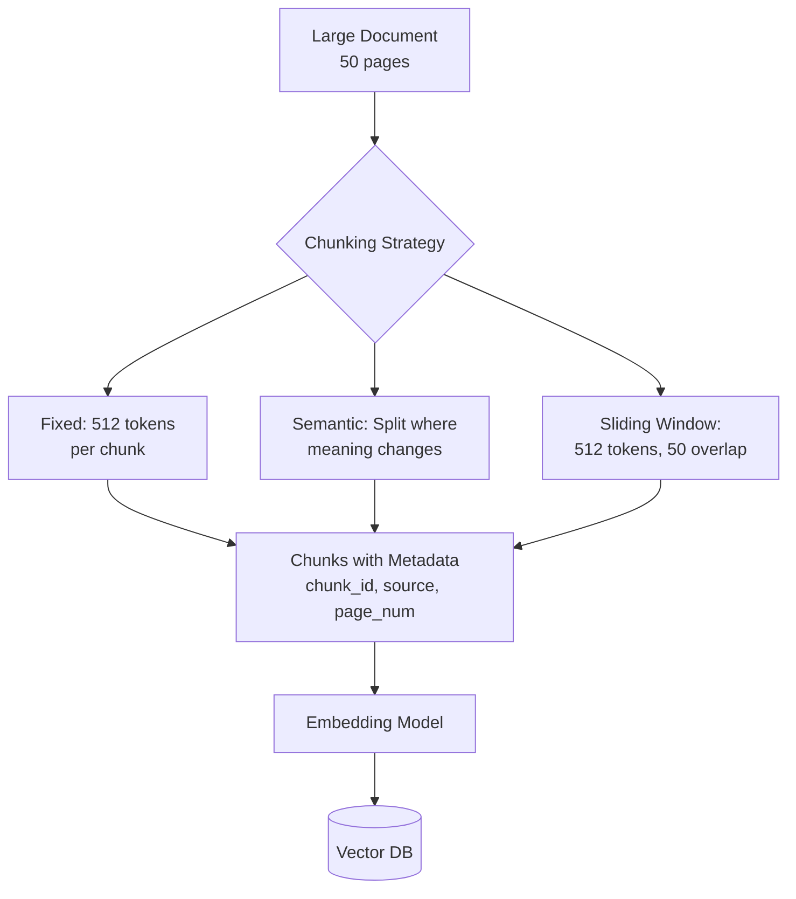

**Chunk size tradeoff:** Small chunks = precise retrieval but lose context. Large chunks = more context but less precise and may hit embedding model token limits.

---

### Q7. What is semantic search?

Semantic search retrieves results based on the meaning and intent of a query rather than exact keyword matching. It uses embedding vectors and similarity metrics to find conceptually related content even if exact words differ.

**Keyword search vs Semantic search:**

| | Keyword Search | Semantic Search |
|-|----------------|-----------------|
| Method | TF-IDF / BM25 / inverted index | Vector cosine similarity |
| Matches | Exact terms | Conceptual meaning |
| Example query | "ML model latency" | Returns "inference optimization", "AI response time" |
| Fails on | Synonyms, paraphrases | Rare proper nouns, typos |
| Speed | Very fast | Requires ANN index |

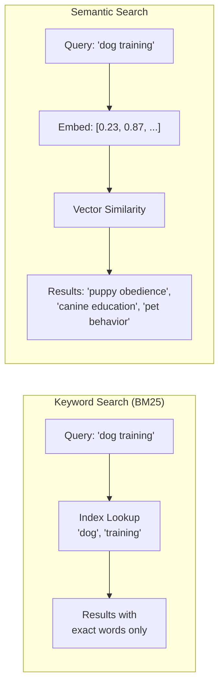

**Hybrid search** combines BM25 + semantic search (e.g., Azure AI Search, Weaviate) for best results — keyword precision + semantic recall.

---

### Q8. How does retrieval work in RAG?

Retrieval is the process of finding the most relevant document chunks from the vector database given a user query. It typically uses Approximate Nearest Neighbor (ANN) search.

**Retrieval pipeline:**

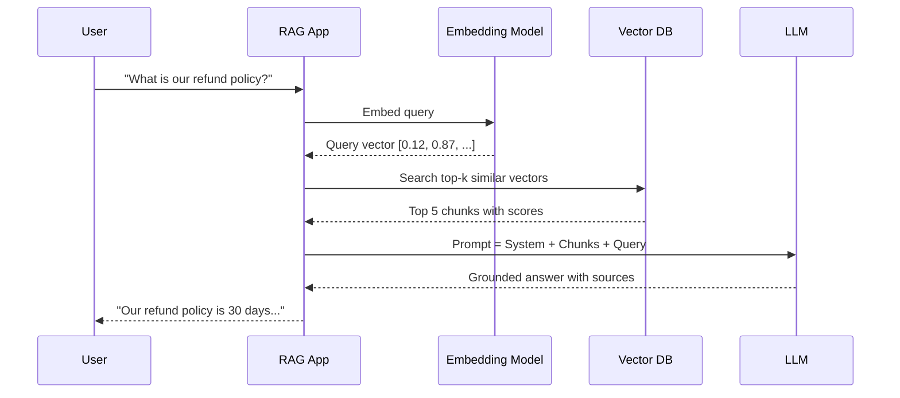

**Retrieval techniques:**
- **Naive retrieval:** Direct top-k vector search
- **HyDE (Hypothetical Document Embeddings):** Generate a hypothetical answer, embed it, then search
- **Multi-query retrieval:** Generate multiple query variations, retrieve for each, deduplicate
- **Contextual compression:** Re-rank and compress retrieved chunks before sending to LLM
- **Parent-child retrieval:** Retrieve small child chunks but return their larger parent for more context

---

### Q9. How do you improve RAG accuracy?

RAG accuracy can be improved across three phases: indexing, retrieval, and generation.

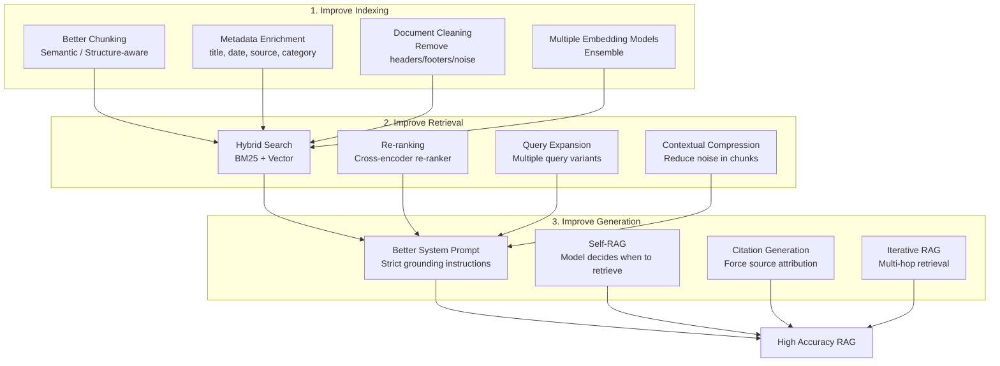

**Quick wins:** Add a cross-encoder re-ranker (e.g., Cohere Rerank), use hybrid search, tune chunk size, and add metadata filtering.

---

## 3/ System Design & Production AI

### Q1. How would you design a scalable AI system?

A scalable AI system must handle variable load, minimize latency, ensure reliability, and support continuous model improvement.

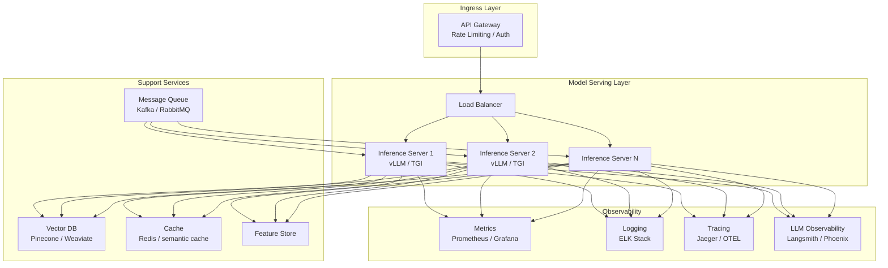

**Key design decisions:**
- Use async/batch processing for non-latency-sensitive workloads
- Deploy inference servers with GPU auto-scaling (e.g., Kubernetes + KEDA)
- Implement semantic caching to avoid redundant LLM calls
- Use circuit breakers and fallbacks for model unavailability

---

### Q2. How do you deploy machine learning models?

Model deployment patterns range from simple REST APIs to complex multi-model pipelines.

```mermaid
flowchart LR
    subgraph Packaging["1. Package"]
        A[Trained Model] --> B[Serialize\nPickle / ONNX / TorchScript]
        B --> C[Container\nDocker Image]
    end
    subgraph Serving["2. Serve"]
        C --> D{Serving Pattern}
        D --> E[REST API\nFastAPI / Flask]
        D --> F[gRPC\nHigh-throughput]
        D --> G[Batch Inference\nSpark / Ray]
        D --> H[Managed Endpoint\nAzure ML / SageMaker]
    end
    subgraph Orchestration["3. Orchestrate"]
        E & F & G & H --> I[Kubernetes\nor Serverless]
        I --> J[Auto-scaling\nbased on load]
    end
```

**Deployment strategies:**
- **Blue-Green:** Run new version in parallel, switch traffic instantly
- **Canary:** Route small % of traffic to new model, gradually increase
- **Shadow:** Mirror production traffic to new model, compare outputs without serving them
- **A/B Testing:** Split traffic to compare model versions

---

### Q3. What is model monitoring in production?

Model monitoring tracks model health and performance in production to detect degradation, drift, and failures before they impact users.

```mermaid
flowchart TD
    A[Production Model] --> B{Monitor}
    B --> C[Data Quality\nMissing values, schema drift]
    B --> D[Data Drift\nInput distribution shift]
    B --> E[Prediction Drift\nOutput distribution change]
    B --> F[Model Performance\nAccuracy, latency, error rate]
    B --> G[Business Metrics\nCTR, conversion, revenue]

    C & D & E --> H{Alert Triggered?}
    F & G --> H
    H -->|Yes| I[Alert: PagerDuty / Slack]
    I --> J[Investigate]
    J --> K{Root Cause}
    K --> L[Retrain Model]
    K --> M[Fix Data Pipeline]
    K --> N[Rollback to Previous Version]
```

**Tools:** Evidently AI, WhyLabs, Arize, Azure ML Monitor, MLflow

---

### Q4. What is model drift and data drift?

**Data drift** (covariate shift): The statistical distribution of input features changes over time compared to training data. The model's assumptions no longer match the real-world data it receives.

**Model drift** (concept drift): The relationship between inputs and outputs changes — the underlying pattern the model learned no longer holds true in the real world.

```mermaid
graph TD
    subgraph DataDrift["Data Drift - Input Changes"]
        A[Training Data 2022\nAvg age: 35, Mobile: 40%] -.vs.- B[Production Data 2024\nAvg age: 28, Mobile: 75%]
        B --> C[Model receives unfamiliar\ninput distributions]
    end
    subgraph ConceptDrift["Concept Drift - Pattern Changes"]
        D[2020: 'corona' = beer brand] -.vs.- E[2021: 'corona' = pandemic]
        E --> F[Model predicts wrongly\ndespite same input]
    end

    C & F --> G[Performance Degradation]
    G --> H[Solutions]
    H --> I[Periodic Retraining]
    H --> J[Continuous Learning]
    H --> K[Drift Detection Alerts]
```

**Detection methods:** PSI (Population Stability Index), KS test, Jensen-Shannon divergence, Wasserstein distance

---

### Q5. How do you handle large-scale inference?

Large-scale inference requires architectural optimizations at model, hardware, and system levels.

```mermaid
graph TD
    subgraph ModelOpt["Model-Level Optimizations"]
        A[Quantization\nFP16 / INT8 / INT4]
        B[Pruning\nRemove low-weight connections]
        C[Knowledge Distillation\nSmall student mimics large teacher]
        D[ONNX Runtime\nHardware-agnostic optimization]
    end
    subgraph SystemOpt["System-Level Optimizations"]
        E[Batching\nGroup requests together]
        F[Continuous Batching\nvLLM-style token batching]
        G[Caching\nKV-cache, semantic cache]
        H[Request Queuing\nAsync processing]
    end
    subgraph InfraOpt["Infrastructure Optimizations"]
        I[GPU Clusters\nH100 / A100]
        J[Model Parallelism\nTensor / Pipeline parallel]
        K[Edge Inference\nMobile / IoT deployment]
        L[CDN + Caching\nGlobal distribution]
    end

    A & B & C & D --> E
    E & F & G & H --> I
    I & J & K & L --> M[Scalable Inference]
```

**Key tools:** vLLM (continuous batching), TensorRT, ONNX Runtime, DeepSpeed, Triton Inference Server

---

### Q6. What is model versioning?

Model versioning is the practice of tracking, storing, and managing multiple versions of ML models throughout their lifecycle — enabling reproducibility, rollback, comparison, and auditability.

```mermaid
flowchart LR
    subgraph Registry["Model Registry"]
        A[v1.0 - Baseline\nAcc: 82%]
        B[v1.1 - Retrained\nAcc: 85%]
        C[v2.0 - Architecture change\nAcc: 91%]
    end
    subgraph Stages["Stages"]
        D[Staging - v2.0\nTesting in progress]
        E[Production - v1.1\nCurrently serving]
        F[Archived - v1.0\nSunset]
    end
    subgraph Metadata["Each Version Tracks"]
        G[Training data hash]
        H[Hyperparameters]
        I[Metrics: accuracy, F1, latency]
        J[Git commit SHA]
        K[Dependencies / environment]
    end

    A & B & C --> D & E & F
    D & E & F --> G & H & I & J & K
```

**Tools:** MLflow Model Registry, Azure ML Model Registry, DVC, Weights & Biases, Hugging Face Hub

---

### Q7. What are A/B tests for ML models?

A/B testing for ML models involves routing a portion of production traffic to a new model version and comparing key metrics against the control (existing) model to make data-driven promotion decisions.

```mermaid
sequenceDiagram
    participant U as Users
    participant LB as Load Balancer
    participant A as Model A (Control)\n90% traffic
    participant B as Model B (Challenger)\n10% traffic
    participant M as Metrics Collector

    U->>LB: Request
    LB->>A: 90% of requests
    LB->>B: 10% of requests
    A-->>M: Predictions + metrics
    B-->>M: Predictions + metrics
    M->>M: Statistical significance test\nafter N samples
    M-->>LB: Decision: promote B if better
```

**Key considerations:**
- Define the primary metric (accuracy, CTR, latency, revenue) before the test
- Ensure statistical significance before declaring a winner (p < 0.05)
- Watch for network effects / novelty effects
- Run for full business cycles to capture temporal patterns

---

### Q8. How do you optimize latency in AI systems?

Latency optimization requires reducing time at every layer: model, serving, network, and data access.

```mermaid
graph TD
    subgraph Layers["Latency Sources & Fixes"]
        A[Model Inference\nLargest contributor] --> A1[Quantization INT8/INT4\nSmaller faster model\nKV cache optimization]
        B[Network Roundtrip] --> B1[Edge deployment\nStreaming responses\nCDN for static assets]
        C[Data Retrieval\nDB / Vector search] --> C1[Redis caching\nANN index tuning\nPre-computed embeddings]
        D[Queue Wait Time] --> D1[Horizontal scaling\nPriority queues\nLoad balancing]
        E[Cold Start] --> E1[Pre-warm instances\nServerless warm pools\nModel pre-loading]
    end
```

**Latency budget example for a RAG system:**

| Step | Target Latency |
|------|---------------|
| Embedding query | < 50ms |
| Vector search (top-5) | < 30ms |
| Prompt assembly | < 5ms |
| LLM generation (200 tokens) | < 2000ms |
| Response streaming to user | Progressive |
| **Total P95** | **< 3000ms** |

---

### Q9. How would you build a real-time AI service?

A real-time AI service requires sub-second response, high availability, fault tolerance, and streaming output for good user experience.

```mermaid
flowchart TD
    A[Client] -->|WebSocket / SSE| B[API Gateway\nRate Limit / Auth]
    B --> C[Request Router\nContext-aware routing]
    C --> D{Request Type}
    D -->|Simple / Cached| E[Cache Layer\nRedis / Semantic Cache]
    D -->|Complex| F[LLM Inference Cluster\nvLLM with GPU autoscale]
    E & F --> G[Response Streaming\nServer-Sent Events]
    G --> A

    subgraph Reliability["Reliability Layer"]
        H[Circuit Breaker]
        I[Fallback Model\nSmaller / faster]
        J[Retry with Backoff]
    end

    F --> H --> I --> J
```

**Key design patterns:**
- **Streaming responses:** Use SSE/WebSockets to stream tokens as they're generated
- **Semantic caching:** Cache embeddings of previous queries; return cached response for semantically similar queries
- **Circuit breaker:** Automatically fall back to smaller model or cached response on failures
- **Async processing:** Offload heavy pre/post-processing to async workers

---

### Q10. How do you ensure reliability of AI systems in production?

Reliability in AI systems extends traditional SRE principles with AI-specific concerns like model degradation, LLM non-determinism, and inference failures.

```mermaid
graph TD
    subgraph Traditional["Traditional Reliability"]
        A[High Availability\nMulti-AZ deployment]
        B[Load Balancing\nDistribute inference load]
        C[Health Checks\nLiveness & readiness probes]
        D[Auto-scaling\nKEDA / HPA based on queue depth]
    end
    subgraph AISpecific["AI-Specific Reliability"]
        E[Model Fallbacks\nFast small model if primary fails]
        F[Guardrails\nInput/output validation]
        G[Graceful Degradation\nReturn cached response if model unavailable]
        H[LLM Observability\nTrace every inference call]
    end
    subgraph Process["Process Reliability"]
        I[Canary Deployments\nGradual model rollout]
        J[Automated Rollback\non metric threshold breach]
        K[Chaos Engineering\nTest failure scenarios]
        L[Runbooks\nIncident response for AI failures]
    end

    A & B & C & D --> E
    E & F & G & H --> I
    I & J & K & L --> M[Reliable AI System\nSLO: 99.9% uptime, P95 < 3s]
```

**SLO targets for AI services:**
- Availability: 99.9% (43 min/month downtime)
- P95 latency: < 3 seconds for LLM responses
- Error rate: < 0.1%
- Guardrail block rate: Track separately from errors

---

## 4/ ML & Deep Learning Fundamentals

### Q1. What is the difference between supervised, unsupervised, and reinforcement learning?

```mermaid
graph TD
    A[Machine Learning] --> B[Supervised Learning]
    A --> C[Unsupervised Learning]
    A --> D[Reinforcement Learning]

    B --> B1[Labeled data\nInput → Known Output]
    B1 --> B2[Classification: Spam/Not spam\nRegression: House price prediction]

    C --> C1[Unlabeled data\nFind hidden patterns]
    C1 --> C2[Clustering: Customer segmentation\nDimensionality reduction: PCA\nAnomaly detection]

    D --> D1[Agent learns via\ntrial & error + rewards]
    D1 --> D2[Game playing: AlphaGo\nRobotics: Robot locomotion\nLLM alignment: RLHF]
```

| Aspect | Supervised | Unsupervised | Reinforcement |
|--------|-----------|--------------|---------------|
| **Data** | Labeled | Unlabeled | Environment feedback |
| **Goal** | Predict output | Discover structure | Maximize reward |
| **Feedback** | Ground truth labels | None | Reward signal |
| **Examples** | Classification, Regression | Clustering, PCA | Game AI, Robotics, RLHF |
| **Algorithms** | Linear Regression, SVM, XGBoost | K-Means, DBSCAN, Autoencoders | Q-Learning, PPO, A3C |

---

### Q2. What are overfitting and underfitting, and how do you prevent them?

**Underfitting:** Model is too simple to capture the underlying data patterns. High training error AND high validation error.

**Overfitting:** Model memorizes training data too well, including noise. Low training error but high validation error.

```mermaid
graph LR
    subgraph Underfitting["Underfitting\n(High Bias)"]
        A[Simple Model\ne.g., linear fit to\ncurved data]
        A --> A1[High Train Error\nHigh Val Error]
    end
    subgraph JustRight["Just Right"]
        B[Appropriate Model\nCaptures true pattern]
        B --> B1[Low Train Error\nLow Val Error]
    end
    subgraph Overfitting["Overfitting\n(High Variance)"]
        C[Complex Model\nMemorizes training data\nand noise]
        C --> C1[Low Train Error\nHigh Val Error]
    end
```

**Prevention strategies:**

| Problem | Prevention |
|---------|-----------|
| Underfitting | Increase model complexity; add more features; train longer; use a more powerful model |
| Overfitting | Regularization (L1/L2); Dropout; Early stopping; Data augmentation; Cross-validation; Reduce model complexity; Get more data |

---

### Q3. What is bias vs variance tradeoff?

Bias and variance are two sources of prediction error that pull in opposite directions when tuning model complexity.

- **Bias:** Error from overly simplistic assumptions. High bias → underfitting. Model consistently misses the true pattern.
- **Variance:** Error from sensitivity to small fluctuations in training data. High variance → overfitting. Model learns noise as if it were signal.

**Total Error = Bias² + Variance + Irreducible Noise**

```mermaid
graph TD
    subgraph BiasVariance["Bias-Variance Tradeoff"]
        A[Simple Model] --> B[High Bias\nLow Variance]
        C[Complex Model] --> D[Low Bias\nHigh Variance]
        E[Optimal Model] --> F[Balanced Bias & Variance\nMinimum Total Error]
    end

    B --> G[Underfitting]
    D --> H[Overfitting]
    F --> I[Good Generalization]
```

**Intuition:**
- Imagine throwing darts: Bias = consistently off-center. Variance = scattered randomly.
- Goal: Darts clustered at the bullseye (low bias + low variance)

**Techniques to balance:**
- Ensemble methods (bagging reduces variance, boosting reduces bias)
- Cross-validation to tune complexity
- Regularization (reduces variance without increasing bias too much)

---

### Q4. What are training, validation, and test datasets?

These three dataset splits serve distinct purposes and must remain isolated to produce honest model evaluations.

```mermaid
flowchart LR
    A[Full Dataset\n100%] --> B[Training Set\n70-80%]
    A --> C[Validation Set\n10-15%]
    A --> D[Test Set\n10-15%]

    B --> E[Train Model\nLearn parameters]
    C --> F[Tune Hyperparameters\nModel selection]
    D --> G[Final Evaluation\nReported performance]

    E --> F
    F --> G

    subgraph Rule["Critical Rules"]
        H[Test set NEVER seen during training or tuning]
        I[Validation set used to select best model]
        J[Training set used ONLY for gradient updates]
    end
```

| Split | Purpose | Who Sees It |
|-------|---------|-------------|
| **Training** | Model learns from it; weights updated via backprop | Model only |
| **Validation** | Evaluate during training; tune hyperparameters; select model | Model + Developer |
| **Test** | Final unbiased performance estimate; never used for decisions | Reported once |

**K-Fold Cross-Validation:** When data is limited, rotate the validation fold across k splits for more robust estimates.

---

### Q5. What is gradient descent and its variants?

Gradient descent is the optimization algorithm used to minimize the loss function by iteratively adjusting model parameters in the direction opposite to the gradient.

**Core idea:** Move down the "hill" of the loss surface in the direction of steepest descent.

`θ = θ - α × ∇L(θ)`

where α = learning rate, ∇L(θ) = gradient of loss

```mermaid
graph TD
    subgraph GD["Gradient Descent Variants"]
        A[Batch GD\nUse ALL training examples\nper update] --> A1[Slow per step\nStable convergence\nNot scalable]
        B[Stochastic GD - SGD\nUse ONE example per update] --> B1[Fast updates\nNoisy convergence\nCan escape local minima]
        C[Mini-batch GD\nUse small batch e.g. 32-256] --> C1[Best of both\nGPU-efficient\nIndustry standard]
    end
    subgraph Advanced["Advanced Optimizers"]
        D[Momentum\nAccumulate velocity] --> D1[Faster convergence\nDampens oscillations]
        E[Adam\nAdaptive learning rates] --> E1[Most popular\nAuto-tunes per parameter]
        F[AdaGrad\nDecay LR for frequent features] --> F1[Good for sparse data\nLR decays too fast]
        G[RMSProp\nSmooth AdaGrad] --> G1[Good for RNNs\nFixes AdaGrad decay]
    end
```

**Adam** (Adaptive Moment Estimation) is the default choice for most deep learning tasks: combines momentum and adaptive learning rates.

---

### Q6. What is backpropagation and how does it work?

Backpropagation (backprop) is the algorithm used to compute gradients of the loss function with respect to every weight in a neural network, enabling gradient descent to update weights.

**How it works:**
1. **Forward pass:** Input flows through the network layer by layer, computing activations and the final loss
2. **Backward pass:** Using the chain rule of calculus, gradients flow backward from the output layer to the input layer
3. **Weight update:** Each weight is updated using its computed gradient

```mermaid
flowchart LR
    subgraph Forward["Forward Pass"]
        A[Input X] --> B[Layer 1\nz=Wx+b\na=ReLU z] --> C[Layer 2] --> D[Output ŷ] --> E[Loss L\ne.g. MSE, CrossEntropy]
    end
    subgraph Backward["Backward Pass - Backpropagation"]
        E --> F[∂L/∂ŷ] --> G[∂L/∂W₂\nvia chain rule] --> H[∂L/∂W₁\nvia chain rule]
    end
    subgraph Update["Weight Update"]
        H --> I[W₁ = W₁ - α × ∂L/∂W₁]
        G --> J[W₂ = W₂ - α × ∂L/∂W₂]
    end
```

**Chain rule:** `∂L/∂W₁ = (∂L/∂ŷ) × (∂ŷ/∂a₂) × (∂a₂/∂z₂) × (∂z₂/∂a₁) × (∂a₁/∂W₁)`

**Vanishing gradient problem:** In deep networks, gradients can become very small as they propagate backward (especially with sigmoid/tanh), making early layers learn very slowly. **Solutions:** ReLU activations, batch normalization, residual connections (ResNet).

---

## Quick Reference Summary

```mermaid
mindmap
  root((AI/ML Interview Topics))
    LLMs
      Architecture: Transformer + Attention
      Training: Pre-train → SFT → RLHF
      Key concepts: Temperature, Hallucination, Context Window
      Prompting: Zero-shot, Few-shot, CoT
    RAG
      Pipeline: Chunk → Embed → Store → Retrieve → Generate
      Vector DBs: Pinecone, Weaviate, Qdrant, pgvector
      Improve accuracy: Hybrid search + Reranking
    System Design
      Scale: Kubernetes + GPU autoscaling
      Deploy: Blue-Green, Canary, Shadow
      Monitor: Data drift, Model drift, Business metrics
      Reliability: Fallbacks, Circuit breakers, Guardrails
    ML Fundamentals
      Learning types: Supervised, Unsupervised, RL
      Model fit: Bias-Variance tradeoff
      Optimization: Gradient descent + Backpropagation
      Data splits: Train / Validation / Test
```
