# AI Architect – Complete Interview Concepts Guide

> Derived from JD Analysis for AI Architect / Azure GenAI Architect roles.
> Covers every technical domain, expected depth, and key interview questions with architectural diagrams.

---

## Table of Contents

1. [Azure Cloud Architecture](#1-azure-cloud-architecture)
2. [Azure OpenAI & GenAI Platform](#2-azure-openai--genai-platform)
3. [Large Language Models (LLMs)](#3-large-language-models-llms)
4. [Prompt Engineering](#4-prompt-engineering)
5. [Retrieval-Augmented Generation (RAG)](#5-retrieval-augmented-generation-rag)
6. [Fine-Tuning](#6-fine-tuning)
7. [AI Agents & Multi-Agent Systems](#7-ai-agents--multi-agent-systems)
8. [LangChain, LangGraph & CrewAI](#8-langchain-langgraph--crewai)
9. [Vector Databases & Embeddings](#9-vector-databases--embeddings)
10. [Enterprise AI Architecture](#10-enterprise-ai-architecture)
11. [MLOps & LLMOps](#11-mlops--llmops)
12. [AI Pipelines (MLflow, Kubeflow, Airflow)](#12-ai-pipelines-mlflow-kubeflow-airflow)
13. [Microservices & Containerization](#13-microservices--containerization)
14. [Security – OAuth, JWT, IAM](#14-security--oauth-jwt-iam)
15. [Observability – ELK & OpenTelemetry](#15-observability--elk--opentelemetry)
16. [Data Engineering – PySpark & Azure Data](#16-data-engineering--pyspark--azure-data)
17. [Azure AI Services](#17-azure-ai-services)
18. [AI Governance & Responsible AI](#18-ai-governance--responsible-ai)
19. [System Design – End-to-End Scenarios](#19-system-design--end-to-end-scenarios)
20. [Behavioral & Leadership Questions](#20-behavioral--leadership-questions)

---

## 1. Azure Cloud Architecture

### Core Concepts
- **Azure Regions & Availability Zones** – geographic redundancy, zone-redundant storage
- **Azure Resource Manager (ARM)** – declarative IaC with ARM templates / Bicep / Terraform
- **Azure Networking** – VNet, Subnet, NSG, Private Endpoint, ExpressRoute, VPN Gateway
- **Azure PaaS vs IaaS vs SaaS** tradeoffs for AI workloads
- **Hybrid Cloud** – Azure Arc, on-premises integration, Azure Stack

### Azure Architecture Pillars (WAF)

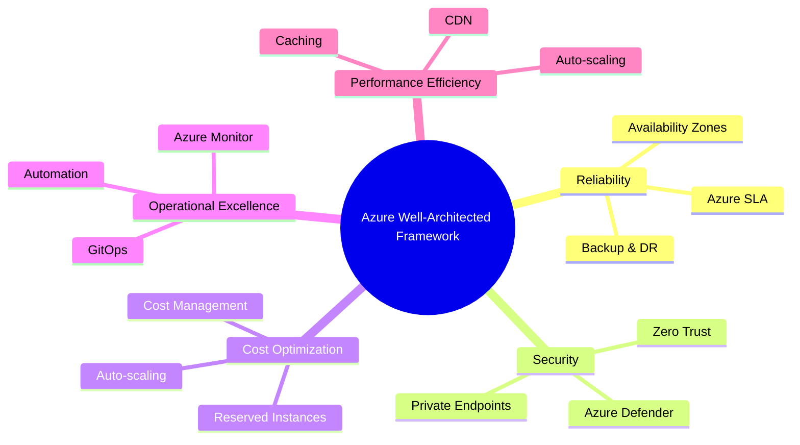

### Key Interview Questions
- How would you architect a **zero-downtime deployment** on Azure?
- Explain the difference between **Private Endpoint** and **Service Endpoint**.
- How do you enforce **governance** across multiple Azure subscriptions (Management Groups, Policies)?
- What is **Azure Landing Zone** and why is it important for enterprise?

---

## 2. Azure OpenAI & GenAI Platform

### Azure OpenAI Service Architecture

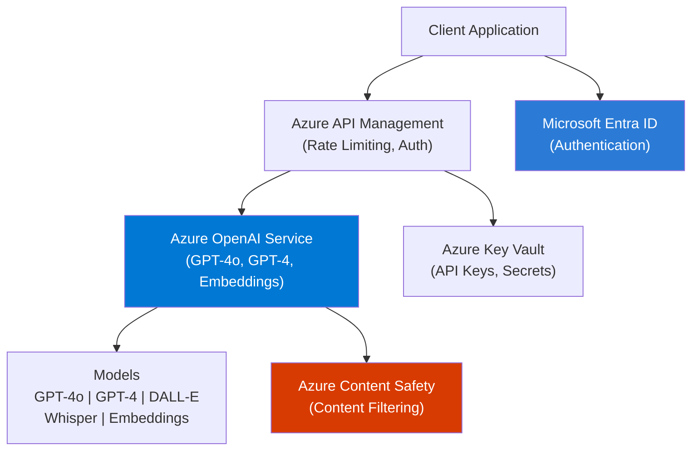

### Core Concepts
- **Deployment Types** – Standard, Provisioned Throughput Units (PTU)
- **Token limits** – context window, prompt tokens, completion tokens
- **Model versioning & lifecycle** – deprecation, model updates
- **Azure OpenAI on Your Data** – connect to Azure AI Search for RAG
- **Responsible AI filters** – content filters, jailbreak detection
- **Private deployment** – Private Link, network isolation

### Key Interview Questions
- What is the difference between **Standard** and **PTU (Provisioned Throughput)** in Azure OpenAI?
- How do you handle **rate limiting** and **token quota** in production?
- Explain **Azure OpenAI On Your Data** vs building a custom RAG pipeline.
- How would you **secure** Azure OpenAI endpoints in an enterprise setting?
- What **content safety** mechanisms does Azure OpenAI provide?

---

## 3. Large Language Models (LLMs)

### LLM Taxonomy

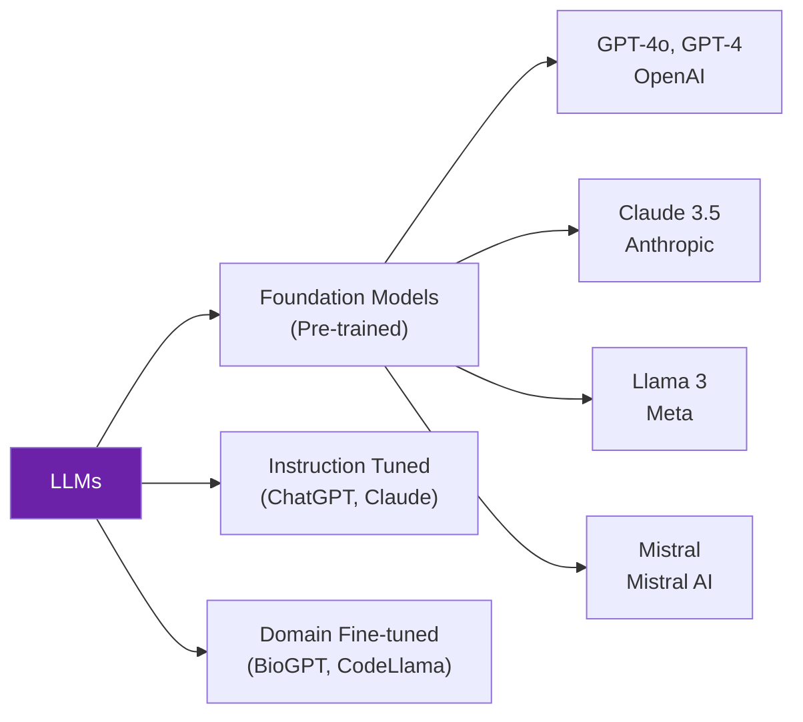

### Core Concepts
- **Transformer Architecture** – attention mechanism, self-attention, positional encoding
- **Tokenization** – BPE, WordPiece; token count vs word count
- **Temperature, Top-P, Top-K** – controlling randomness in outputs
- **Context Window** – 8K, 32K, 128K tokens; long-context challenges
- **Hallucination** – causes, mitigation strategies (RAG, grounding, citations)
- **Model Comparison** – GPT-4o vs Claude vs Llama vs Mistral (cost, latency, accuracy)
- **Embedding Models** – text-embedding-ada-002, text-embedding-3-large

### Key Interview Questions
- Explain the **transformer architecture** at a high level. What is self-attention?
- What causes **hallucinations** and how do you mitigate them in production?
- How would you choose between **GPT-4o vs Llama 3** for an enterprise application?
- What is the significance of **context window size** in RAG architectures?
- Explain **semantic similarity** using embeddings.

---

## 4. Prompt Engineering

### Prompt Engineering Techniques

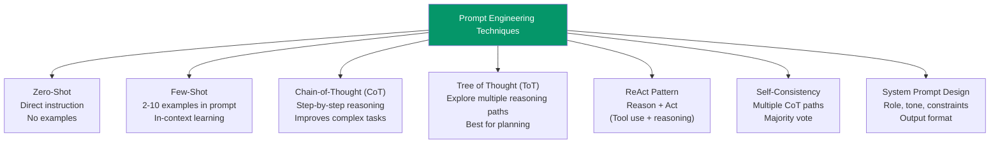

### Core Concepts
- **System vs User vs Assistant** messages – roles in chat completion API
- **Prompt templates** – parameterized prompts, Jinja2, PromptTemplate (LangChain)
- **Output parsers** – JSON mode, structured outputs, Pydantic validation
- **Prompt injection** – attack vectors and defenses
- **Meta-prompting** – using LLMs to improve prompts
- **Token efficiency** – reducing cost while maintaining quality
- **Prompt versioning** – LangSmith, PromptFlow, MLflow

### Key Interview Questions
- What is **Chain-of-Thought prompting** and when do you use it?
- How do you prevent **prompt injection attacks** in a production system?
- Explain the difference between **Zero-shot, Few-shot, and Fine-tuning**.
- How do you ensure **consistent structured output** from an LLM?
- What is the **ReAct pattern** and how does it power AI agents?

---

## 5. Retrieval-Augmented Generation (RAG)

### RAG Architecture

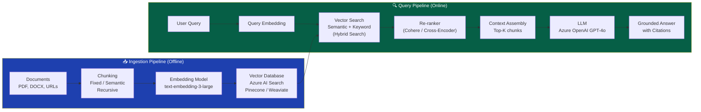

### Advanced RAG Patterns

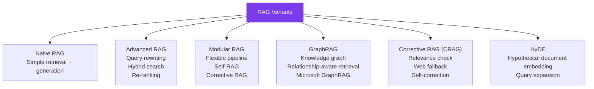

### Core Concepts
- **Chunking strategies** – fixed-size, recursive, semantic, document-aware
- **Embedding models** – dense vs sparse; bi-encoder vs cross-encoder
- **Hybrid Search** – combining vector search + BM25/keyword search
- **Re-ranking** – Cohere Rerank, cross-encoder models
- **Metadata filtering** – pre-filtering before vector search
- **Evaluation metrics** – RAGAS (faithfulness, answer relevancy, context precision, recall)
- **Chunking overlap** – avoiding information loss at boundaries

### Key Interview Questions
- Walk me through a **complete RAG pipeline** from document ingestion to response.
- What is **Hybrid Search** and why is it better than pure vector search?
- How do you **evaluate RAG quality**? What metrics do you use?
- Explain **GraphRAG** and when would you use it over standard RAG?
- How do you handle **large documents** that exceed context window limits?
- What is **HyDE (Hypothetical Document Embeddings)**?

---

## 6. Fine-Tuning

### Fine-Tuning Decision Framework

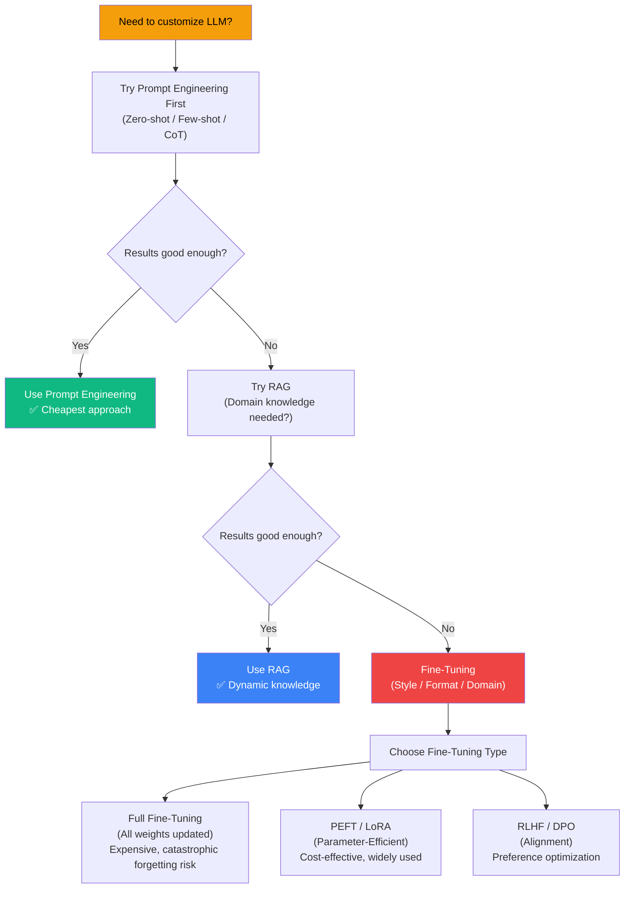

### Core Concepts
- **LoRA (Low-Rank Adaptation)** – adapter matrices, rank selection, merging adapters
- **QLoRA** – quantized LoRA for memory efficiency (4-bit quantization)
- **RLHF** – Reinforcement Learning from Human Feedback (reward model, PPO)
- **DPO (Direct Preference Optimization)** – simpler alternative to RLHF
- **Catastrophic forgetting** – challenge of fine-tuning, mitigations
- **Instruction tuning** – FLAN-style, Alpaca-style datasets
- **Azure OpenAI Fine-tuning** – supported models (GPT-3.5-turbo), JSONL format, Azure ML jobs

### Key Interview Questions
- When would you choose **fine-tuning over RAG**?
- Explain **LoRA** – why is it parameter-efficient?
- What is **QLoRA** and what problem does it solve?
- How do you prepare a **fine-tuning dataset** for Azure OpenAI?
- What is **catastrophic forgetting** and how do you mitigate it?

---

## 7. AI Agents & Multi-Agent Systems

### Single Agent Architecture

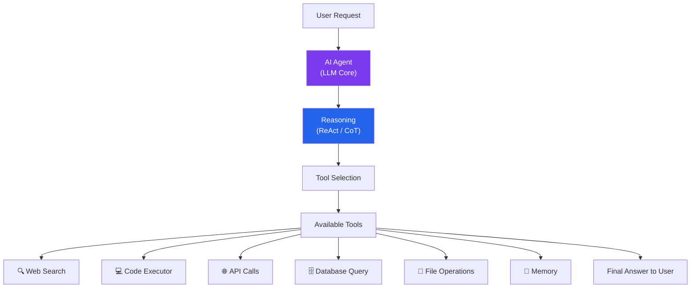

### Multi-Agent System Architecture

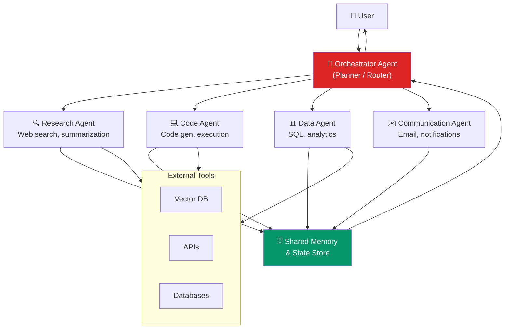

### Agentic Patterns

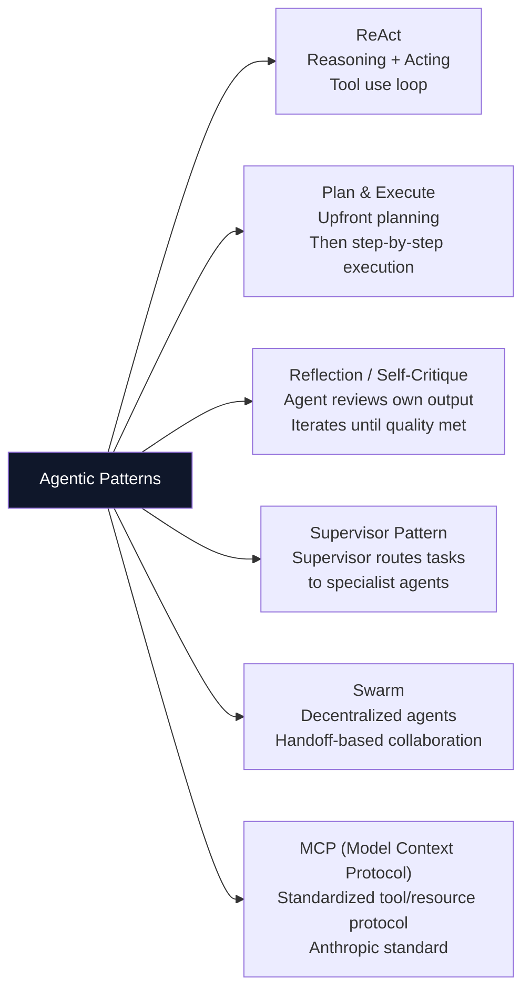

### Core Concepts
- **Tool calling / Function calling** – structured output for tool invocation
- **Memory types** – short-term (in-context), long-term (vector store), episodic, semantic
- **Agent loops** – observation, thought, action cycles
- **Handoffs** – transferring control between agents
- **MCP (Model Context Protocol)** – standardized protocol for LLM tool/resource access
- **Human-in-the-loop** – approval gates, interrupt mechanisms

### Key Interview Questions
- Design a **multi-agent system** for enterprise document processing.
- What is **Model Context Protocol (MCP)**? How does it differ from function calling?
- How do you handle **agent failures** and prevent infinite loops?
- Explain the **Supervisor vs Swarm** pattern for multi-agent systems.
- How do you implement **memory** in long-running agent tasks?

---

## 8. LangChain, LangGraph & CrewAI

### LangChain Architecture

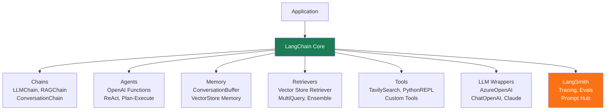

### LangGraph State Machine

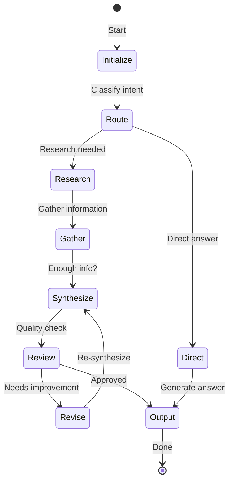

### Framework Comparison

| Feature | LangChain | LangGraph | CrewAI |
|---|---|---|---|
| **Paradigm** | Chain / LCEL | State graph | Role-based agents |
| **Best for** | RAG, simple chains | Complex workflows, cycles | Collaborative multi-agent |
| **State management** | Limited | Full graph state | Crew-level shared state |
| **Cycles/Loops** | ❌ | ✅ | Partial |
| **Human-in-loop** | Basic | ✅ Checkpoints | ✅ |
| **Visual debugging** | LangSmith | LangSmith | Built-in |
| **Learning curve** | Medium | High | Low |

### Core Concepts
- **LCEL (LangChain Expression Language)** – `|` pipe operator, composable chains
- **Runnables** – universal interface in LangChain v0.2+
- **LangGraph nodes and edges** – StateGraph, conditional edges, checkpointers
- **CrewAI** – Crew, Agent, Task, Process (sequential, hierarchical, parallel)
- **LangSmith** – tracing, evaluation, prompt versioning

### Key Interview Questions
- Explain **LCEL** and how you compose chains using the pipe operator.
- When would you use **LangGraph over LangChain**?
- How does **CrewAI's hierarchical process** work?
- How do you implement **human-in-the-loop** checkpoints in LangGraph?
- How do you trace and debug **LangChain applications** in production?

---

## 9. Vector Databases & Embeddings

### Vector Database Architecture

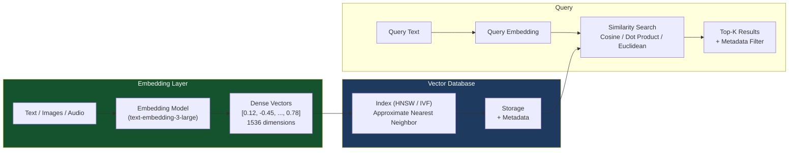

### Vector DB Comparison

| Feature | Azure AI Search | Pinecone | Weaviate | Qdrant | Chroma |
|---|---|---|---|---|---|
| **Hybrid Search** | ✅ (BM25+Vector) | ✅ | ✅ | ✅ | ❌ |
| **Managed** | ✅ Azure | ✅ Cloud | Self/Cloud | Self/Cloud | Local/Self |
| **Filtering** | ✅ | ✅ | ✅ | ✅ | Basic |
| **Scale** | Enterprise | Very High | High | High | Dev/Prototype |
| **Azure Native** | ✅ | ❌ | ❌ | ❌ | ❌ |
| **Graph support** | ❌ | ❌ | ✅ | ❌ | ❌ |

### Core Concepts
- **ANN algorithms** – HNSW (Hierarchical Navigable Small World), IVF, Product Quantization
- **Similarity metrics** – Cosine similarity, Dot product, Euclidean distance
- **Indexing strategies** – HNSW parameters (ef, M), index vs query time tradeoff
- **Metadata filtering** – pre-filtering vs post-filtering performance impact
- **Sparse + Dense (Hybrid)** – BM25 for keyword, HNSW for semantic; RRF fusion
- **Namespace/Collection isolation** – multi-tenancy in vector DBs

### Key Interview Questions
- Explain **HNSW** and why it's preferred for vector search at scale.
- What is **Hybrid Search** and how does **Reciprocal Rank Fusion (RRF)** work?
- How do you handle **multi-tenancy** in a vector database?
- Why is **cosine similarity** commonly used for text embeddings?
- How do you choose the right **chunk size** and **embedding model**?

---

## 10. Enterprise AI Architecture

### Enterprise GenAI Reference Architecture

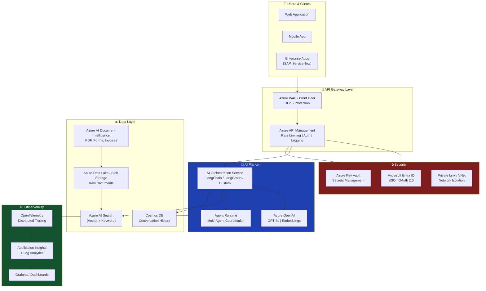

### Core Concepts
- **AI Platform vs AI Application** – platform as reusable infra, applications on top
- **Centralized vs federated AI** – governance model for enterprise
- **AI Gateway pattern** – centralized policy, token metering, audit logging
- **Data residency** – compliance requirements (GDPR, HIPAA) for AI workloads
- **Shared AI infrastructure** – model endpoint sharing across teams
- **Enterprise integration** – SharePoint, ServiceNow, SAP connectors

### Key Interview Questions
- Design an **enterprise RAG platform** for 10 teams with different data sources.
- How do you implement **cost governance** for Azure OpenAI across teams?
- How would you architect **multi-region AI deployment** for high availability?
- What is the **AI Gateway pattern** and what problems does it solve?
- How do you handle **data privacy** when sending enterprise data to LLMs?

---

## 11. MLOps & LLMOps

### MLOps vs LLMOps

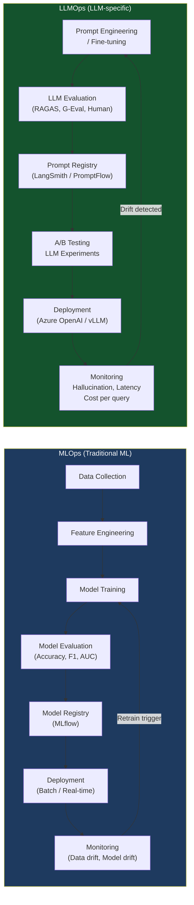

### Core Concepts
- **CI/CD for ML** – automated training, evaluation, and deployment pipelines
- **Model Registry** – MLflow model registry, Azure ML model registry
- **Feature Store** – centralized feature management (Feast, Azure ML Feature Store)
- **Data versioning** – DVC (Data Version Control)
- **LLM evaluation** – RAGAS, G-Eval, human eval, automated eval pipelines
- **LLM monitoring** – token usage, latency P99, hallucination rate, cost tracking
- **Prompt versioning** – LangSmith, Azure PromptFlow, MLflow

### Key Interview Questions
- What is the difference between **MLOps and LLMOps**?
- How do you set up a **CI/CD pipeline for LLM applications**?
- What metrics do you monitor for **LLMs in production**?
- How do you **version prompts** and manage prompt drift?
- Explain **A/B testing** for LLM applications.

---

## 12. AI Pipelines (MLflow, Kubeflow, Airflow)

### Pipeline Tool Comparison

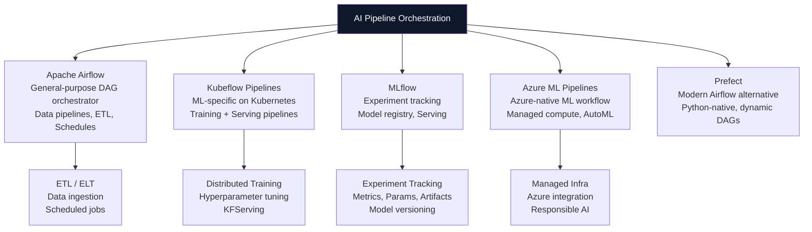

### Core Concepts
- **MLflow** – tracking (experiments, runs, params, metrics), model registry, serving
- **Kubeflow Pipelines** – containerized ML steps, Argo Workflows underneath
- **Airflow DAGs** – directed acyclic graphs, operators, hooks, XComs
- **Azure ML Pipelines** – PipelineJob, component-based design
- **Pipeline triggers** – schedule, event-driven (new data), API trigger

### Key Interview Questions
- How would you set up an **end-to-end ML pipeline** using Azure ML?
- Explain **MLflow tracking** – what do you log and why?
- When would you choose **Kubeflow over Airflow**?
- How do you implement **retraining triggers** in a production ML system?
- How do you manage **pipeline dependencies** and artifacts across steps?

---

## 13. Microservices & Containerization

### AI Microservices Architecture

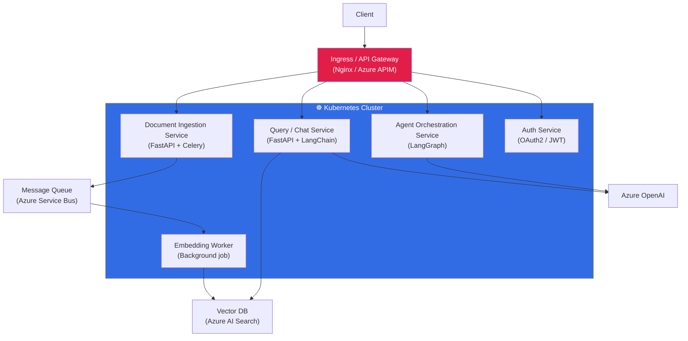

### Core Concepts
- **Docker** – Dockerfile best practices, multi-stage builds, layer caching
- **Kubernetes** – Deployments, Services, Ingress, ConfigMaps, Secrets, HPA
- **Helm charts** – templating K8s manifests, release management
- **Service mesh** – Istio, Linkerd for mTLS, observability, traffic management
- **Sidecar pattern** – logging, tracing, auth proxy alongside app containers
- **Azure Kubernetes Service (AKS)** – managed K8s, KEDA for event-driven scaling
- **Resource requests/limits** – CPU/GPU scheduling for AI workloads

### Key Interview Questions
- How do you **containerize an AI application** using Docker best practices?
- Explain **Kubernetes HPA** vs **KEDA** for scaling AI workloads.
- How do you manage **GPU resources** in a Kubernetes cluster for LLM inference?
- What is a **service mesh** and when would you add one to an AI platform?
- How do you implement **blue-green deployment** for an LLM service?

---

## 14. Security – OAuth, JWT, IAM

### OAuth 2.0 / OIDC Flow for AI APIs

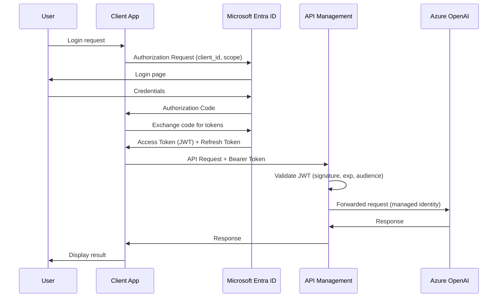

### Core Concepts
- **OAuth 2.0 grant types** – Authorization Code, Client Credentials, Device Flow
- **JWT structure** – Header (alg), Payload (claims: sub, exp, aud, iss), Signature
- **RBAC vs ABAC** – Role-based vs Attribute-based access control
- **Azure Managed Identity** – system-assigned vs user-assigned; no secrets management
- **Azure RBAC** – built-in roles (Owner, Contributor, Reader), custom roles
- **API Key management** – rotation, vault storage, never in code
- **Zero Trust** – verify explicitly, least privilege, assume breach

### Key Interview Questions
- Explain the **OAuth 2.0 Authorization Code flow** step by step.
- What is inside a **JWT token**? How do you validate it?
- What is **Azure Managed Identity** and why is it preferred over API keys?
- How do you implement **RBAC** for an AI platform with multiple tenants?
- What is the difference between **authentication and authorization**?

---

## 15. Observability – ELK & OpenTelemetry

### Observability Stack for AI Systems

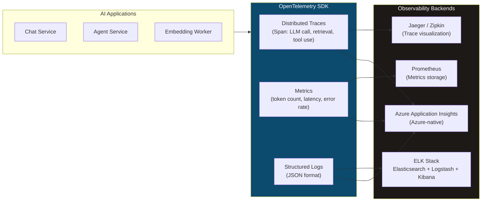

### LLM-Specific Observability Metrics

| Category | Metric | Why It Matters |
|---|---|---|
| **Performance** | P50/P99 latency | User experience SLA |
| **Cost** | Tokens per request | Budget control |
| **Quality** | Hallucination rate | Trust and safety |
| **Reliability** | Error rate, timeouts | Uptime |
| **Usage** | Requests per model | Capacity planning |
| **RAG** | Retrieval precision/recall | RAG quality |

### Core Concepts
- **Three pillars of observability** – Logs, Metrics, Traces
- **OpenTelemetry** – vendor-neutral OTLP protocol, auto-instrumentation
- **Distributed tracing** – trace ID, span ID, parent-child relationships
- **ELK Stack** – Elasticsearch (search/store), Logstash (ingest/transform), Kibana (visualize)
- **Azure Monitor + Application Insights** – Azure-native observability
- **Alerting** – threshold-based, anomaly detection, SLO-based alerts

### Key Interview Questions
- What are the **three pillars of observability** and how do they apply to AI systems?
- How do you trace an **LLM call end-to-end** using OpenTelemetry?
- What **LLM-specific metrics** would you add to a standard observability stack?
- How does the **ELK stack** differ from Azure Monitor for log management?
- How do you set up **alerts** for hallucination rate or high token cost?

---

## 16. Data Engineering – PySpark & Azure Data

### Azure Data Architecture for AI

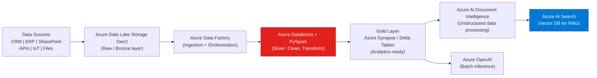

### Core Concepts
- **Medallion architecture** – Bronze (raw), Silver (cleaned), Gold (aggregated/analytics)
- **PySpark fundamentals** – RDD vs DataFrame vs Dataset, lazy evaluation, DAG
- **Delta Lake** – ACID transactions, time travel, schema evolution on data lakes
- **Azure Data Factory** – pipelines, linked services, data flows, triggers
- **Azure Databricks** – clusters, notebooks, MLflow integration, Unity Catalog
- **Data partitioning** – partition pruning, broadcast joins in Spark
- **Streaming vs batch** – structured streaming, Event Hubs, Kafka

### Key Interview Questions
- Explain the **Medallion architecture** and how it supports AI workloads.
- What is the difference between **RDD and DataFrame** in Spark?
- How does **Delta Lake** add ACID compliance to a data lake?
- How would you process **10TB of PDFs** for RAG ingestion using PySpark?
- How do you optimize a **slow PySpark job**?

---

## 17. Azure AI Services

### Azure AI Services Landscape

```mermaid
mindmap
  root((Azure AI Services))
    Azure OpenAI
      GPT-4o
      Embeddings
      DALL-E
      Whisper
    Azure AI Search
      Vector Search
      Semantic Ranking
      Hybrid Search
      Integrated Vectorization
    Azure AI Document Intelligence
      Layout analysis
      Form / Invoice extraction
      Custom models
    Azure AI Vision
      OCR
      Object detection
      Image analysis
    Azure AI Speech
      Speech-to-Text
      Text-to-Speech
      Real-time transcription
    Azure AI Language
      Sentiment analysis
      NER
      Question answering
    Azure AI Content Safety
      Text moderation
      Image moderation
      Jailbreak detection
```

### Core Concepts
- **Azure AI Document Intelligence** – layout, general document, prebuilt models (invoice, receipt), custom model training
- **Azure AI Search** – index schema, skillsets (AI enrichment), semantic ranker, integrated vectorization
- **Integrated vectorization** – auto-chunking and embedding during indexing via skillsets
- **Azure AI Content Safety** – content filtering categories (hate, violence, self-harm, sexual)

### Key Interview Questions
- How does **Azure AI Document Intelligence** process a complex PDF with tables?
- Explain **Azure AI Search's integrated vectorization** feature.
- What is **semantic ranker** in Azure AI Search and how does it differ from vector search?
- How would you build a **multi-modal RAG** using Azure AI Vision + Azure AI Search?

---

## 18. AI Governance & Responsible AI

### Responsible AI Framework

```mermaid
graph TD
    RAI["Microsoft Responsible AI Principles"] --> Fair["Fairness\nBias detection\nDemographic parity"]
    RAI --> Reliable["Reliability & Safety\nRobustness testing\nFailsafe mechanisms"]
    RAI --> Privacy["Privacy & Security\nData minimization\nDifferential privacy"]
    RAI --> Inclusive["Inclusiveness\nAccessibility\nMultilingual support"]
    RAI --> Transparent["Transparency\nExplainability\nModel cards"]
    RAI --> Accountable["Accountability\nHuman oversight\nAudit trails"]

    style RAI fill:#0078D4,color:#fff
```

### Core Concepts
- **AI Governance** – policies, standards, model inventories, risk classification
- **Model cards** – documentation of model capabilities, limitations, intended use
- **Bias & fairness** – demographic parity, equal opportunity, disparate impact
- **Explainability** – SHAP, LIME for traditional ML; chain-of-thought for LLMs
- **Red teaming** – adversarial testing, jailbreak attempts, prompt injection
- **Data privacy** – PII detection, data masking before sending to LLMs
- **AI Act (EU)** – risk categories (unacceptable, high, limited, minimal risk)

### Key Interview Questions
- What are Microsoft's **Responsible AI principles**? Give examples of each.
- How do you implement **PII detection** before sending data to Azure OpenAI?
- What is **AI red teaming** and how do you set it up?
- How would you classify an AI system under **EU AI Act risk categories**?
- How do you create and maintain a **model card**?

---

## 19. System Design – End-to-End Scenarios

### Scenario 1: Enterprise Document Q&A System

```mermaid
graph TB
    Upload["📤 Document Upload\n(SharePoint / API)"] --> DocIntel3["Azure AI Document Intelligence\n(Extract text, tables, structure)"]
    DocIntel3 --> Chunker["Intelligent Chunker\n(Semantic chunking)"]
    Chunker --> EmbedService["Embedding Service\n(text-embedding-3-large)"]
    EmbedService --> AISearch["Azure AI Search\n(Hybrid Index)"]

    User2["👤 User Query"] --> QueryProc["Query Processing\n(Rewriting, HyDE)"]
    QueryProc --> AISearch
    AISearch --> Reranker["Re-ranker\n(Semantic + Cohere)"]
    Reranker --> LLM3["Azure OpenAI GPT-4o\n(Answer generation)"]
    LLM3 --> CitationEngine["Citation Engine\n(Source attribution)"]
    CitationEngine --> Response["Grounded Response\n+ References"]

    style AISearch fill:#0078D4,color:#fff
    style LLM3 fill:#10b981,color:#fff
```

### Scenario 2: Autonomous AI Agent for IT Operations

```mermaid
graph TD
    Alert["🚨 Incident Alert\n(ServiceNow / PagerDuty)"] --> IncidentAgent["Incident Triage Agent\n(GPT-4o + LangGraph)"]

    IncidentAgent --> LogTool["🔍 Log Analysis Tool\n(Elasticsearch query)"]
    IncidentAgent --> MetricTool["📊 Metric Analysis Tool\n(Prometheus API)"]
    IncidentAgent --> KBTool["📚 Knowledge Base Tool\n(RAG on runbooks)"]
    IncidentAgent --> RemTool["🔧 Remediation Tool\n(Kubernetes / Azure API)"]

    LogTool --> IncidentAgent
    MetricTool --> IncidentAgent
    KBTool --> IncidentAgent

    IncidentAgent --> Decision{Confidence > 80%?}
    Decision -->|Yes| AutoRemediate["Auto-Remediate\n(restart pod, scale up)"]
    Decision -->|No| HumanApproval["Human Approval\n(Teams notification)"]
    HumanApproval --> ManualAction["Manual Action\nby engineer"]

    style IncidentAgent fill:#7c3aed,color:#fff
    style Decision fill:#f59e0b,color:#000
```

### Design Interview Framework

```mermaid
graph LR
    SDI["System Design\nInterview Framework"] --> Req["1. Requirements\nFunctional + Non-functional\nScale, Latency, Consistency"]
    SDI --> HL["2. High-Level Design\nMain components\nData flow diagram"]
    SDI --> DD["3. Deep Dive\nCritical components\nTradeoffs"]
    SDI --> Scale["4. Scale & Reliability\nHorizontal scaling\nCaching, CDN, replication"]
    SDI --> Ops["5. Operations\nMonitoring, alerting\nDeployment strategy"]

    style SDI fill:#0f172a,color:#fff
```

---

## 20. Behavioral & Leadership Questions

### STAR Method for Technical Leadership

| Component | What to Include |
|---|---|
| **S**ituation | Context, team size, constraints |
| **T**ask | Your specific responsibility |
| **A**ction | Technical decisions you made, tradeoffs |
| **R**esult | Quantified outcome (latency, cost, adoption) |

### Common Behavioral Topics

1. **Technical Leadership**
   - "Tell me about a time you led a complex AI architecture decision"
   - "How did you handle disagreement with stakeholders on a technical approach?"

2. **Customer Engagement**
   - "Describe a customer workshop you ran on AI/GenAI"
   - "How do you explain complex AI concepts to non-technical stakeholders?"

3. **Problem Solving**
   - "Describe a production AI incident and how you resolved it"
   - "How did you optimize a RAG pipeline that had poor retrieval quality?"

4. **Innovation**
   - "What GenAI trend do you think is most impactful for enterprise in the next 2 years?"
   - "How do you stay current with rapidly evolving AI technologies?"

5. **Governance & Ethics**
   - "How have you ensured responsible AI practices in a project?"
   - "How would you handle a request to use AI in a way you consider risky?"

---

## Quick Reference: Key Numbers to Know

| Topic | Key Numbers |
|---|---|
| GPT-4o context window | 128K tokens |
| text-embedding-3-large dimensions | 3072 (default) / reducible |
| Cosine similarity range | -1 to +1 (1 = identical) |
| HNSW construction param M | Typical: 16-64 |
| Azure OpenAI rate limits | Tokens per minute (TPM) & Requests per minute (RPM) |
| RAG Top-K typical range | 3-10 chunks |
| LoRA rank (r) typical values | 4, 8, 16, 32 |
| JWT expiry best practice | Access: 15min-1hr, Refresh: 7-30 days |

---

## Study Priority Roadmap

```mermaid
graph LR
    Week1["Week 1\n🔴 CRITICAL"] --> W1["Azure Cloud Architecture\nAzure OpenAI\nRAG Architecture\nPrompt Engineering"]
    Week2["Week 2\n🟠 HIGH"] --> W2["LangChain / LangGraph\nVector Databases\nAI Agents & MCP\nFine-Tuning"]
    Week3["Week 3\n🟡 MEDIUM"] --> W3["MLOps / LLMOps\nDocker / Kubernetes\nSecurity (OAuth, JWT)\nObservability"]
    Week4["Week 4\n🟢 POLISH"] --> W4["System Design Practice\nBehavioral Questions\nAI Governance\nEnterprise Scenarios"]

    style Week1 fill:#dc2626,color:#fff
    style Week2 fill:#ea580c,color:#fff
    style Week3 fill:#ca8a04,color:#fff
    style Week4 fill:#16a34a,color:#fff
```

---

*Last updated: June 2026 | Based on AI Architect / Azure GenAI Architect JD Analysis*
