# Additional Architecture Concepts — Complete Reference (.NET)

---

## Table of Contents

1. [Robust Retry Mechanism for Failed Jobs (.NET)](#1-robust-retry-mechanism-for-failed-jobs-net)
2. [Service Health Guard, Circuit Breaker & Feature Toggle](#2-service-health-guard-circuit-breaker--feature-toggle)
3. [URL Shortener System Design at Scale](#3-url-shortener-system-design-at-scale)
4. [E-Commerce Platform Architecture (Flipkart-style)](#4-e-commerce-platform-architecture-flipkart-style)
5. [Kubernetes Secrets Management](#5-kubernetes-secrets-management)

---

## 1. Robust Retry Mechanism for Failed Jobs (.NET)

### Overview

A production-grade retry mechanism ensures transient failures (network blips, SMTP timeouts, downstream unavailability) don't result in permanent data loss. Jobs move through a lifecycle: **enqueue → process → fail → retry → DLQ → manual trigger**.

### Architecture Diagram

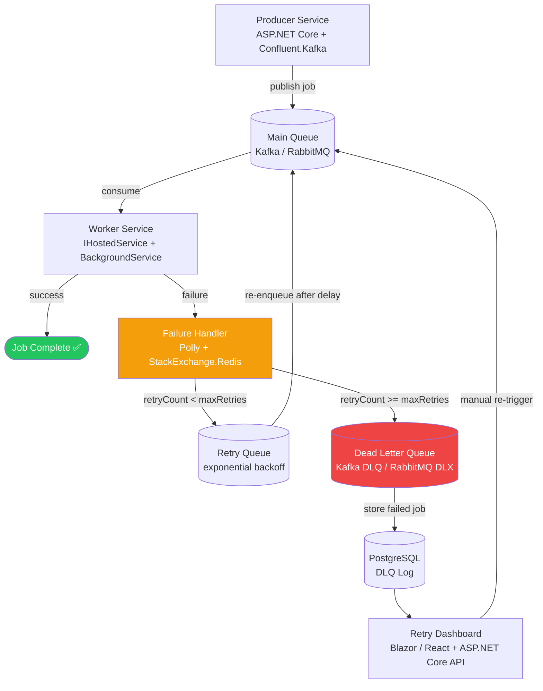

### Exponential Backoff Strategy

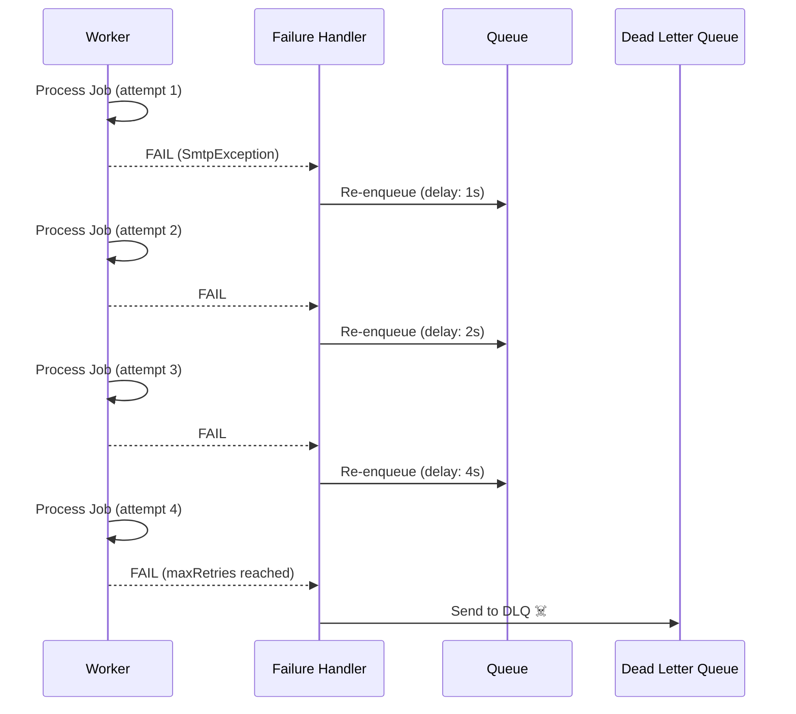

Formula: `delay = baseDelay × 2^(attempt - 1) + jitter (ms)`

---

### Service 1 — Job Producer

**Tech Stack:** ASP.NET Core + Confluent.Kafka

```csharp
// OrderEmailJob.cs
public record OrderEmailJob(
    string JobId,
    string OrderId,
    string CustomerEmail,
    DateTimeOffset CreatedAt,
    int RetryCount = 0
);

// OrderJobProducer.cs
public class OrderJobProducer
{
    private readonly IProducer<string, OrderEmailJob> _producer;
    private const string Topic = "order-email-jobs";

    public OrderJobProducer(IProducer<string, OrderEmailJob> producer)
        => _producer = producer;

    public async Task PublishEmailJobAsync(Order order)
    {
        var job = new OrderEmailJob(
            JobId: Guid.NewGuid().ToString(),
            OrderId: order.Id,
            CustomerEmail: order.Email,
            CreatedAt: DateTimeOffset.UtcNow
        );

        await _producer.ProduceAsync(Topic, new Message<string, OrderEmailJob>
        {
            Key = job.JobId,   // same partition for ordering
            Value = job
        });
    }
}

// Program.cs — DI registration
builder.Services.AddSingleton<IProducer<string, OrderEmailJob>>(_ =>
    new ProducerBuilder<string, OrderEmailJob>(
        new ProducerConfig { BootstrapServers = "localhost:9092" })
    .SetValueSerializer(new JsonSerializer<OrderEmailJob>())
    .Build());
```

---

### Service 2 — Worker Service

**Tech Stack:** ASP.NET Core `BackgroundService` + Confluent.Kafka

```csharp
public class EmailWorkerService : BackgroundService
{
    private readonly IConsumer<string, OrderEmailJob> _consumer;
    private readonly IEmailService _emailService;
    private readonly IFailureHandlerService _failureHandler;

    protected override async Task ExecuteAsync(CancellationToken ct)
    {
        _consumer.Subscribe("order-email-jobs");

        while (!ct.IsCancellationRequested)
        {
            var result = _consumer.Consume(ct);
            var job = result.Message.Value;

            try
            {
                await _emailService.SendConfirmationAsync(job.CustomerEmail, job.OrderId);
                _consumer.Commit(result);   // manual commit — only on success
            }
            catch (SmtpException ex)
            {
                // Do NOT commit — route to failure handler
                await _failureHandler.HandleAsync(job, ex);
            }
        }
    }
}
```

**Key Design Decisions:**
- `enable.auto.commit=false` → manual commit prevents losing jobs on crash
- Never swallow exceptions silently
- `IFailureHandlerService` injected for single responsibility

---

### Service 3 — Failure Handler (Polly)

**Tech Stack:** Polly + StackExchange.Redis + Confluent.Kafka

```csharp
public class FailureHandlerService : IFailureHandlerService
{
    private readonly IDatabase _redis;
    private readonly IProducer<string, OrderEmailJob> _producer;
    private readonly IDlqRepository _dlqRepo;
    private const int MaxRetries = 3;

    public async Task HandleAsync(OrderEmailJob job, Exception cause)
    {
        int attempt = job.RetryCount + 1;

        if (attempt >= MaxRetries)
        {
            await SendToDlqAsync(job, cause.Message);
            return;
        }

        long backoffMs = (long)Math.Pow(2, attempt) * 1000;
        var updatedJob = job with { RetryCount = attempt };

        // Persist retry state with TTL
        await _redis.StringSetAsync(
            $"retry:{job.JobId}",
            JsonSerializer.Serialize(new { attempt, error = cause.Message }),
            TimeSpan.FromHours(24));

        // Delayed re-enqueue using Task.Delay
        _ = Task.Run(async () =>
        {
            await Task.Delay((int)backoffMs);
            await _producer.ProduceAsync("order-email-jobs", new Message<string, OrderEmailJob>
            {
                Key = updatedJob.JobId,
                Value = updatedJob
            });
        });
    }

    private async Task SendToDlqAsync(OrderEmailJob job, string reason)
    {
        await _producer.ProduceAsync("order-email-dlq", new Message<string, OrderEmailJob>
        {
            Key = job.JobId,
            Value = job
        });
        await _dlqRepo.SaveAsync(new DlqEntry(job.JobId, job, reason, DateTimeOffset.UtcNow));
    }
}
```

**Polly Retry Pipeline (alternative — declarative):**

```csharp
// Program.cs
builder.Services
    .AddHttpClient<IEmailGateway, SmtpEmailGateway>()
    .AddResilienceHandler("email-retry", pipeline =>
    {
        pipeline.AddRetry(new RetryStrategyOptions
        {
            MaxRetryAttempts = 3,
            Delay = TimeSpan.FromSeconds(1),
            BackoffType = DelayBackoffType.Exponential,
            UseJitter = true,
            ShouldHandle = new PredicateBuilder().Handle<SmtpException>()
        });
    });
```

---

### Service 4 — Dead Letter Queue (DLQ)

```csharp
// DLQ Consumer — monitoring & alerting
public class DlqMonitorService : BackgroundService
{
    private readonly IConsumer<string, OrderEmailJob> _consumer;
    private readonly IDlqRepository _repo;
    private readonly ISlackNotifier _slack;

    protected override async Task ExecuteAsync(CancellationToken ct)
    {
        _consumer.Subscribe("order-email-dlq");

        while (!ct.IsCancellationRequested)
        {
            var result = _consumer.Consume(ct);
            var job = result.Message.Value;

            var entry = new DlqEntry(job.JobId, job, "Max retries exceeded", DateTimeOffset.UtcNow)
            {
                Status = DlqStatus.PendingReview
            };

            await _repo.SaveAsync(entry);
            await _slack.NotifyAsync($"DLQ alert: Job {job.JobId} (email: {job.CustomerEmail}) needs attention!");

            _consumer.Commit(result);
        }
    }
}
```

---

### Service 5 — Retry Dashboard API

**Tech Stack:** ASP.NET Core Minimal API + EF Core + PostgreSQL

```csharp
// DlqEndpoints.cs — Minimal API
app.MapGroup("/api/dlq")
    .MapGet("/jobs", async (IDlqRepository repo, int page = 1, int size = 20) =>
    {
        var jobs = await repo.GetPendingAsync(page, size);
        return Results.Ok(jobs);
    })
    .MapPost("/jobs/{jobId}/retry", async (
        string jobId,
        IDlqRepository repo,
        IProducer<string, OrderEmailJob> producer) =>
    {
        var entry = await repo.FindByIdAsync(jobId);
        if (entry is null) return Results.NotFound();

        // Reset retry count before re-queuing
        var resetJob = entry.Payload with { RetryCount = 0 };

        await producer.ProduceAsync("order-email-jobs", new Message<string, OrderEmailJob>
        {
            Key = jobId,
            Value = resetJob
        });

        entry.Status = DlqStatus.Requeued;
        await repo.UpdateAsync(entry);

        return Results.Ok(new { message = $"Job {jobId} re-queued successfully" });
    });
```

### Interview Talking Points

| Concept | Answer |
|---|---|
| Why exponential backoff? | Avoid hammering a degraded downstream; gives it time to recover |
| Why Redis for retry state? | Fast reads, TTL-based auto-expiry, atomic increment for `RetryCount` |
| DLQ vs just logging? | DLQ preserves the full job payload for replay; logs are for observability only |
| Idempotency in retry? | Use `JobId` as idempotency key; check Redis before processing to prevent duplicates |
| Polly vs manual retry? | Polly for HTTP clients; manual handling for Kafka where offset control matters |

---

## 2. Service Health Guard, Circuit Breaker & Feature Toggle

### Overview

When a microservice fails, the goal is: **detect fast → isolate → buffer → fix safely → recover**.

### Full Incident Response Architecture

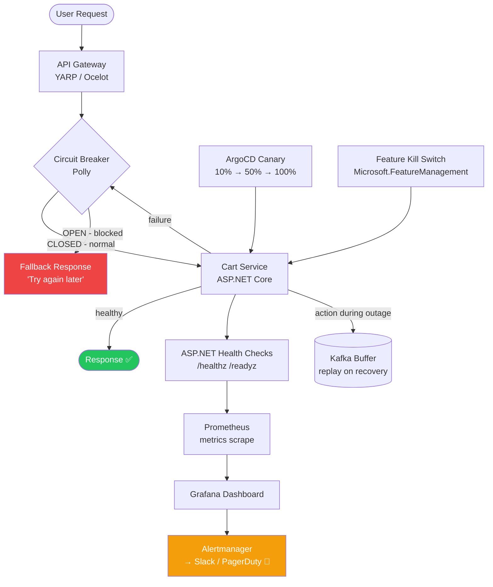

---

### Circuit Breaker State Machine

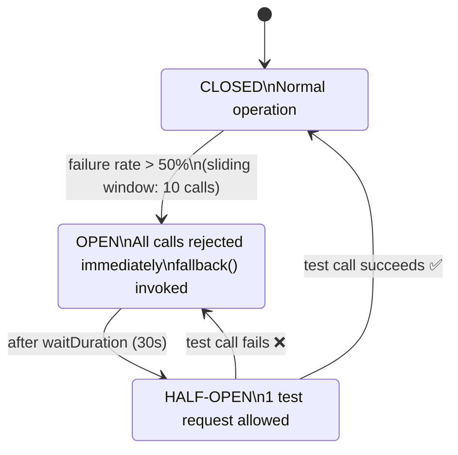

---

### Component 1 — Health Checks (ASP.NET Core)

```csharp
// Program.cs
builder.Services
    .AddHealthChecks()
    .AddNpgSql(connectionString, name: "postgres", tags: ["db"])
    .AddRedis(redisConnectionString, name: "redis", tags: ["cache"])
    .AddKafka(kafkaConfig, name: "kafka", tags: ["messaging"])
    .AddCheck<CartServiceHealthCheck>("cart-business-logic");

app.MapHealthChecks("/healthz/live", new HealthCheckOptions
{
    Predicate = _ => false   // liveness: process is alive
});

app.MapHealthChecks("/healthz/ready", new HealthCheckOptions
{
    Predicate = hc => hc.Tags.Contains("db") || hc.Tags.Contains("cache"),
    ResponseWriter = UIResponseWriter.WriteHealthCheckUIResponse
});
```

```csharp
// CartServiceHealthCheck.cs
public class CartServiceHealthCheck : IHealthCheck
{
    private readonly ICartRepository _repo;

    public async Task<HealthCheckResult> CheckHealthAsync(
        HealthCheckContext context, CancellationToken ct)
    {
        try
        {
            await _repo.PingAsync(ct);
            return HealthCheckResult.Healthy("Cart DB reachable");
        }
        catch (Exception ex)
        {
            return HealthCheckResult.Unhealthy("Cart DB unreachable", ex);
        }
    }
}
```

**Prometheus Alert Rule:**
```yaml
groups:
  - name: dotnet-service-alerts
    rules:
      - alert: CartServiceDown
        expr: up{job="cart-service"} == 0
        for: 1m
        labels:
          severity: critical
        annotations:
          summary: "Cart Service is DOWN"
```

---

### Component 2 — Circuit Breaker (Polly v8)

```csharp
// Program.cs — Polly Resilience Pipeline
builder.Services
    .AddHttpClient<ICartClient, HttpCartClient>()
    .AddResilienceHandler("cart-pipeline", pipeline =>
    {
        // Layer 1: Retry (transient errors)
        pipeline.AddRetry(new RetryStrategyOptions<HttpResponseMessage>
        {
            MaxRetryAttempts = 3,
            Delay = TimeSpan.FromMilliseconds(200),
            BackoffType = DelayBackoffType.Exponential,
            UseJitter = true
        });

        // Layer 2: Circuit Breaker (systemic failures)
        pipeline.AddCircuitBreaker(new CircuitBreakerStrategyOptions<HttpResponseMessage>
        {
            SamplingDuration = TimeSpan.FromSeconds(30),
            FailureRatio = 0.5,           // open at 50% failure rate
            MinimumThroughput = 10,
            BreakDuration = TimeSpan.FromSeconds(30),
            OnOpened = args =>
            {
                logger.LogWarning("Circuit OPEN for cart service: {reason}", args.Outcome.Exception?.Message);
                return ValueTask.CompletedTask;
            }
        });

        // Layer 3: Timeout per call
        pipeline.AddTimeout(TimeSpan.FromSeconds(2));
    });
```

```csharp
// CartService.cs — with fallback
public class CartService : ICartService
{
    private readonly ICartClient _client;

    public async Task<CartResponse> GetCartAsync(string userId)
    {
        try
        {
            return await _client.GetAsync(userId);
        }
        catch (BrokenCircuitException ex)
        {
            _logger.LogWarning("Circuit open — returning fallback for user {UserId}", userId);
            return CartResponse.Empty("Cart temporarily unavailable. Please try again shortly.");
        }
    }
}
```

---

### Component 3 — Request Buffer (Kafka)

```csharp
// Buffer user actions during cart service outage
public class CartActionBufferService : ICartActionBufferService
{
    private readonly IProducer<string, CartAction> _producer;

    public async Task BufferAsync(CartAction action)
        => await _producer.ProduceAsync("cart-actions-buffer",
            new Message<string, CartAction> { Key = action.UserId, Value = action });
}

// Replay consumer — activated when service recovers
public class CartActionReplayService : BackgroundService
{
    private readonly IConsumer<string, CartAction> _consumer;
    private readonly ICartService _cart;
    private readonly ICircuitBreakerStateProvider _state;

    protected override async Task ExecuteAsync(CancellationToken ct)
    {
        _consumer.Subscribe("cart-actions-buffer");
        while (!ct.IsCancellationRequested)
        {
            if (_state.CircuitState == CircuitState.Closed)  // only replay when healthy
            {
                var result = _consumer.Consume(TimeSpan.FromSeconds(1));
                if (result is not null)
                {
                    await _cart.ApplyAsync(result.Message.Value);
                    _consumer.Commit(result);
                }
            }
            await Task.Delay(500, ct);
        }
    }
}
```

---

### Component 4 — Canary Deployment (ArgoCD)

```yaml
apiVersion: argoproj.io/v1alpha1
kind: Rollout
metadata:
  name: cart-service-dotnet
spec:
  replicas: 10
  strategy:
    canary:
      steps:
        - setWeight: 10       # 10% traffic to new version
        - pause: {duration: 5m}
        - analysis:
            templates:
              - templateName: success-rate-check
        - setWeight: 50
        - pause: {duration: 5m}
        - setWeight: 100
      analysis:
        templates:
          - templateName: error-rate
        args:
          - name: service-name
            value: cart-service
```

---

### Component 5 — Feature Kill Switch (Microsoft.FeatureManagement)

```csharp
// Program.cs
builder.Services.AddFeatureManagement()
    .AddFeatureFilter<PercentageFilter>()
    .AddFeatureFilter<TargetingFilter>();

// appsettings.json (or Azure App Configuration)
{
  "FeatureManagement": {
    "CouponFeature": false,
    "ReviewFeature": {
      "EnabledFor": [{ "Name": "Percentage", "Parameters": { "Value": 20 } }]
    }
  }
}
```

```csharp
// CheckoutController.cs
[ApiController, Route("api/checkout")]
public class CheckoutController : ControllerBase
{
    private readonly IFeatureManager _features;
    private readonly ICheckoutService _checkout;

    [HttpPost]
    public async Task<IActionResult> Checkout(CartRequest request)
    {
        if (await _features.IsEnabledAsync("CouponFeature"))
            await _checkout.ApplyCouponAsync(request);

        return Ok(await _checkout.ProcessPaymentAsync(request));
    }
}
```

```bash
# Instant disable via Azure App Configuration (no redeploy)
az appconfig kv set --name myconfig \
  --key "FeatureManagement:CouponFeature" --value "false"

# Sentinel key triggers config refresh across all pods
az appconfig kv set --name myconfig --key "Sentinel" --value "2"
```

### Interview Talking Points

| Scenario | Answer |
|---|---|
| How do you detect failures fast? | `/healthz` + Prometheus scrape + Alertmanager → Slack in under 1 min |
| Circuit breaker vs retry? | Retry for transient errors; circuit breaker for systemic failures — stops cascading |
| Safe deployment? | Canary via ArgoCD — 10% → analyse error rate → 100% or auto-rollback |
| Kill switch vs feature flag? | Kill switch is binary; feature flags support % rollout / user-segment targeting |
| What buffers user actions? | Kafka — durable, replayable, fully decoupled from the failing service |

---

## 3. URL Shortener System Design at Scale

### Overview

Design a system handling **1M+ RPS** for URL shortening and redirection, with analytics, rate limiting, and geographic distribution.

### High-Level Architecture

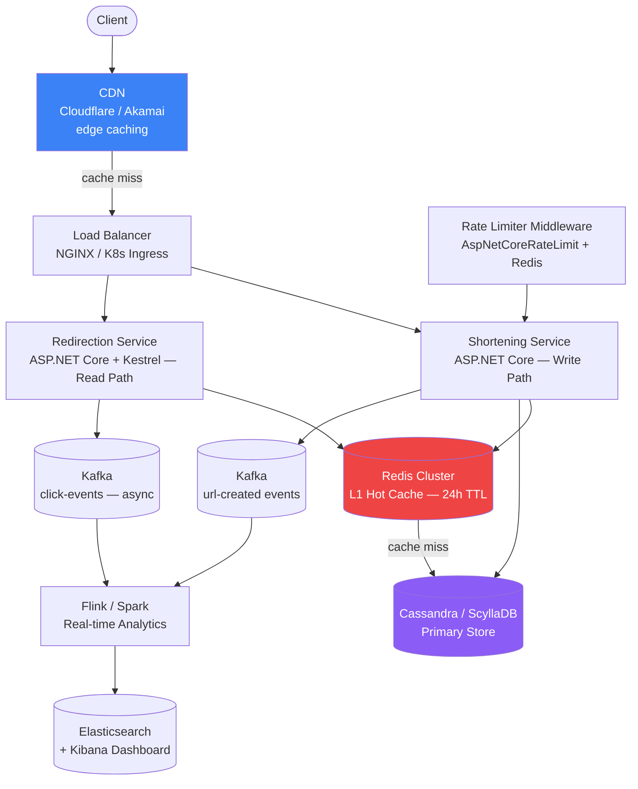

### Request Flow (Redirection — Happy Path)

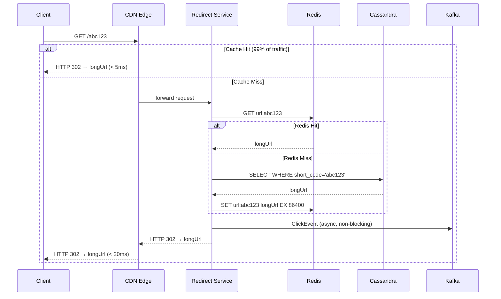

---

### Short Code Generation

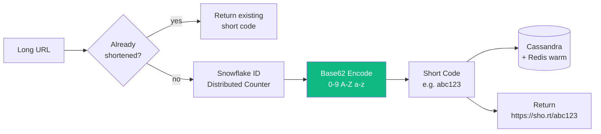

```csharp
// UrlShortenerService.cs
public class UrlShortenerService : IUrlShortenerService
{
    private const string Base62 = "0123456789ABCDEFGHIJKLMNOPQRSTUVWXYZabcdefghijklmnopqrstuvwxyz";
    private readonly IUrlRepository _repo;
    private readonly IDatabase _redis;
    private readonly ISnowflakeIdGenerator _idGen;
    private readonly IProducer<string, UrlEvent> _producer;

    public async Task<string> ShortenAsync(string longUrl, string userId)
    {
        // Idempotency: return existing short code if already stored
        var existing = await _repo.FindByLongUrlAsync(longUrl);
        if (existing is not null) return $"https://sho.rt/{existing.ShortCode}";

        long id = _idGen.NextId();
        string shortCode = ToBase62(id);

        var mapping = new UrlMapping(shortCode, longUrl, userId, DateTimeOffset.UtcNow);
        await _repo.SaveAsync(mapping);

        // Warm Redis cache immediately
        await _redis.StringSetAsync($"url:{shortCode}", longUrl, TimeSpan.FromHours(24));

        await _producer.ProduceAsync("url-events", new Message<string, UrlEvent>
        {
            Key = shortCode,
            Value = new UrlEvent(UrlEventType.Created, shortCode, userId)
        });

        return $"https://sho.rt/{shortCode}";
    }

    private static string ToBase62(long num)
    {
        var sb = new StringBuilder();
        while (num > 0)
        {
            sb.Insert(0, Base62[(int)(num % 62)]);
            num /= 62;
        }
        return sb.ToString();
    }
}
```

---

### Redirection Service

```csharp
// RedirectEndpoints.cs — Minimal API, optimised for throughput
app.MapGet("/{shortCode}", async (
    string shortCode,
    IDatabase redis,
    IUrlRepository repo,
    IProducer<string, ClickEvent> producer,
    HttpContext ctx) =>
{
    // L1: Redis
    var longUrl = (string?)await redis.StringGetAsync($"url:{shortCode}");

    if (longUrl is null)
    {
        // L2: Cassandra
        var mapping = await repo.FindByShortCodeAsync(shortCode);
        if (mapping is null) return Results.NotFound();

        longUrl = mapping.LongUrl;
        await redis.StringSetAsync($"url:{shortCode}", longUrl, TimeSpan.FromHours(24));
    }

    // Fire-and-forget analytics — don't block redirect
    _ = producer.ProduceAsync("click-events", new Message<string, ClickEvent>
    {
        Key = shortCode,
        Value = new ClickEvent(shortCode, ctx.Connection.RemoteIpAddress?.ToString(), DateTimeOffset.UtcNow)
    });

    return Results.Redirect(longUrl, permanent: false);  // 302 — not 301, preserves analytics
});
```

---

### Rate Limiting (.NET 7+ Built-in + Redis)

```csharp
// Program.cs — sliding window rate limiter backed by Redis
builder.Services.AddRateLimiter(options =>
{
    options.AddPolicy("url-shortener-limit", ctx =>
        RateLimitPartition.GetSlidingWindowLimiter(
            partitionKey: ctx.Connection.RemoteIpAddress?.ToString() ?? "anon",
            factory: _ => new SlidingWindowRateLimiterOptions
            {
                PermitLimit = 10,
                Window = TimeSpan.FromMinutes(1),
                SegmentsPerWindow = 6,
                QueueProcessingOrder = QueueProcessingOrder.OldestFirst,
                QueueLimit = 0
            }));

    options.OnRejected = async (ctx, ct) =>
    {
        ctx.HttpContext.Response.StatusCode = 429;
        await ctx.HttpContext.Response.WriteAsync("Rate limit exceeded. Max 10 requests/min.", ct);
    };
});

app.UseRateLimiter();
```

---

### Analytics Pipeline

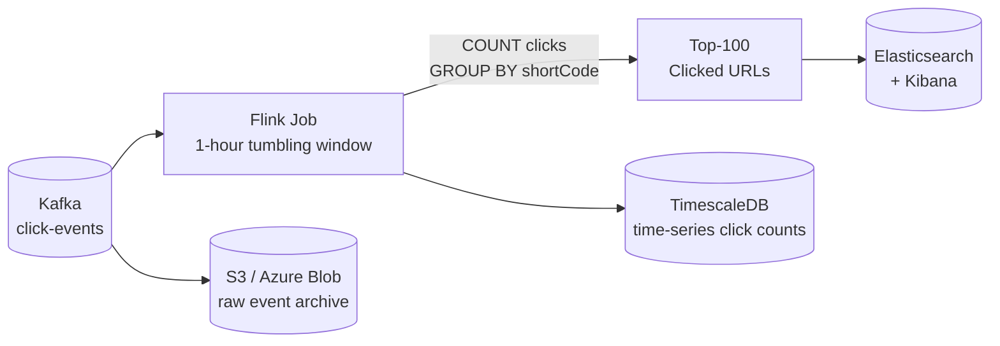

### Capacity Estimation

| Metric | Estimate |
|---|---|
| Daily writes (new URLs) | 10M/day ≈ 115 RPS |
| Daily reads (redirects) | 1B/day ≈ 11,600 RPS |
| Read/Write ratio | ~100:1 (read-heavy) |
| Storage per URL | ~500 bytes |
| 5-year storage | 10M × 365 × 5 × 500B ≈ 9 TB |
| Redis hot cache (top 20%) | Top 20% URLs = 80% traffic → ~5 GB |

### Interview Talking Points

| Question | Answer |
|---|---|
| Why Cassandra over SQL Server? | Linear scale, no joins needed, optimised for key-value lookups at massive scale |
| 301 vs 302 redirect? | 302 — browsers don't cache it, so every click reaches the analytics pipeline |
| Why Base62 over MD5? | Shorter output, URL-safe characters, counter-based so zero collision risk |
| How to handle viral URLs? | CDN caches at edge — 99% of redirects never reach the origin server |
| Expiring short URLs? | Cassandra TTL + Redis TTL + background .NET `IHostedService` for cleanup |

---

## 4. E-Commerce Platform Architecture (Flipkart-style)

### Overview

A large-scale e-commerce platform handling millions of concurrent users during flash sales requires domain separation, aggressive caching, and async event-driven processing.

### Full System Architecture

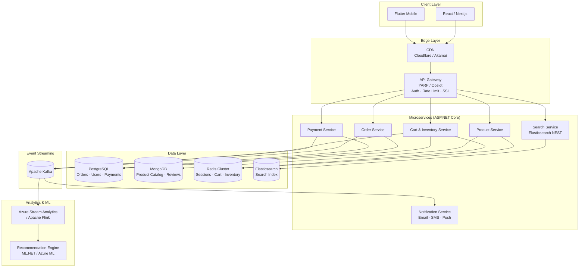

---

### Flash Sale — Inventory Reservation

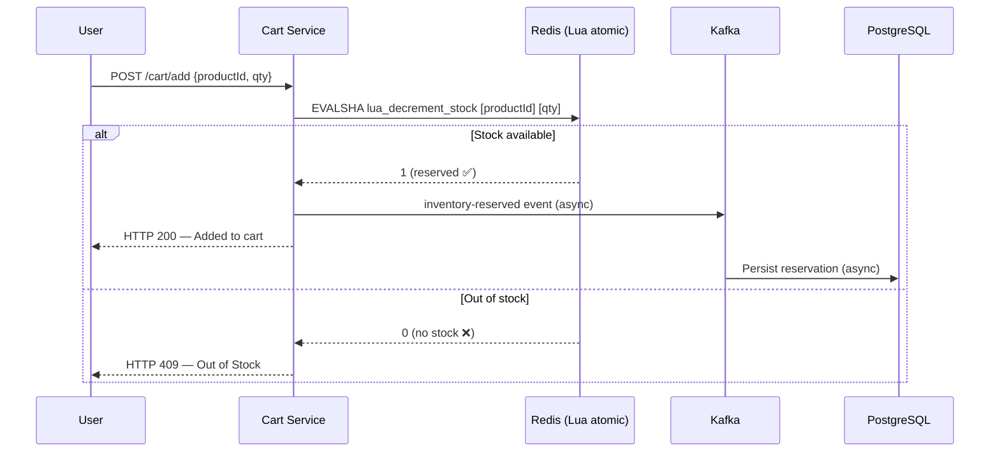

```csharp
// InventoryService.cs — atomic Redis Lua for oversell prevention
public class InventoryService : IInventoryService
{
    private readonly IDatabase _redis;
    private readonly IProducer<string, InventoryEvent> _producer;

    private const string DecrementScript = """
        local current = tonumber(redis.call('GET', KEYS[1]))
        if current == nil or current < tonumber(ARGV[1]) then
            return 0
        end
        redis.call('DECRBY', KEYS[1], ARGV[1])
        return 1
        """;

    public async Task<bool> ReserveStockAsync(string productId, int quantity)
    {
        var result = (int)await _redis.ScriptEvaluateAsync(
            DecrementScript,
            keys: [new RedisKey($"stock:{productId}")],
            values: [new RedisValue(quantity.ToString())]);

        if (result == 1)
        {
            await _producer.ProduceAsync("inventory-reserved",
                new Message<string, InventoryEvent>
                {
                    Key = productId,
                    Value = new InventoryEvent(productId, quantity, DateTimeOffset.UtcNow)
                });
        }

        return result == 1;
    }
}
```

---

### Order Processing — Saga Pattern

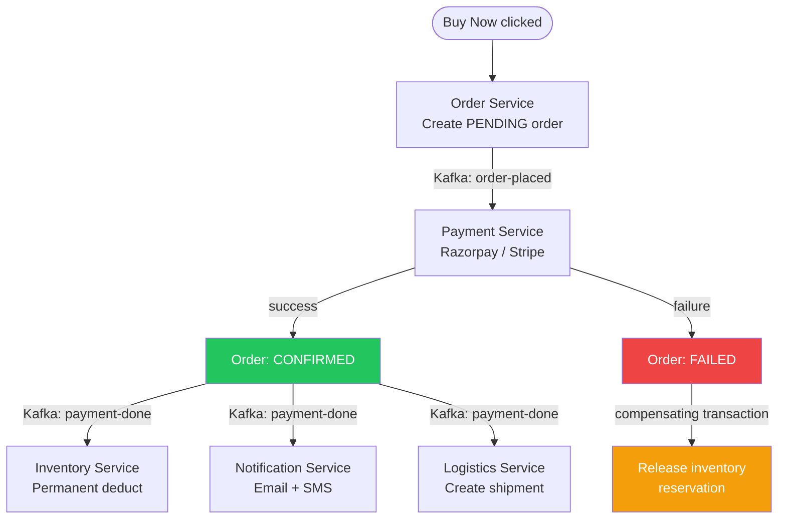

```csharp
// OrderSagaOrchestrator.cs
public class OrderSagaOrchestrator : IOrderSagaOrchestrator
{
    public async Task HandlePaymentResultAsync(PaymentResultEvent evt)
    {
        if (evt.Success)
        {
            await _orderRepo.UpdateStatusAsync(evt.OrderId, OrderStatus.Confirmed);

            // Fan-out to downstream services via Kafka
            await _producer.ProduceAsync("payment-done", new Message<string, PaymentDoneEvent>
            {
                Key = evt.OrderId,
                Value = new PaymentDoneEvent(evt.OrderId, evt.UserId, DateTimeOffset.UtcNow)
            });
        }
        else
        {
            await _orderRepo.UpdateStatusAsync(evt.OrderId, OrderStatus.Failed);

            // Compensating transaction — release reserved stock
            await _producer.ProduceAsync("inventory-release", new Message<string, InventoryReleaseEvent>
            {
                Key = evt.OrderId,
                Value = new InventoryReleaseEvent(evt.OrderId, evt.Items)
            });
        }
    }
}
```

---

### Search Service (Elastic .NET Client)

```csharp
// ProductSearchService.cs
public class ProductSearchService : IProductSearchService
{
    private readonly ElasticsearchClient _client;

    public async Task<IReadOnlyCollection<Product>> SearchAsync(
        string query, decimal? minPrice = null, decimal? maxPrice = null)
    {
        var response = await _client.SearchAsync<Product>(s => s
            .Index("products")
            .Query(q => q
                .Bool(b => b
                    .Must(m => m
                        .MultiMatch(mm => mm
                            .Fields(f => f
                                .Field(p => p.Name, boost: 3)
                                .Field(p => p.Description)
                                .Field(p => p.Brand, boost: 2))
                            .Query(query)
                            .Fuzziness(new Fuzziness("AUTO"))))
                    .Filter(f =>
                    {
                        if (minPrice.HasValue || maxPrice.HasValue)
                            return f.Range(r => r.NumberRange(nr => nr
                                .Field(p => p.Price)
                                .Gte((double?)minPrice)
                                .Lte((double?)maxPrice)));
                        return f;
                    })))
            .Size(20));

        return response.Documents;
    }
}
```

### Database Sharding Strategy

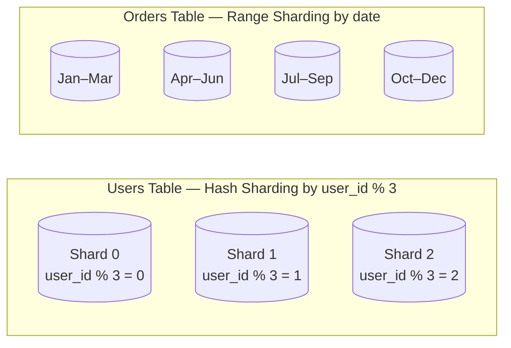

### Interview Talking Points

| Scenario | Answer |
|---|---|
| Prevent overselling | Redis Lua atomic DECR — single-threaded Redis eliminates race conditions |
| Payment failure handling | Saga pattern — compensating transaction to release inventory reservation |
| Real-time price updates | SignalR (WebSockets) or SSE — avoid polling |
| Search relevance | Elasticsearch BM25 + click-through rate boosting popular items |
| Delivery ETA prediction | ML.NET / Azure ML model trained on historical delivery + GPS data |

---

## 5. Kubernetes Secrets Management

### Overview

Kubernetes Secrets store sensitive configuration (passwords, tokens, certificates). Raw K8s Secrets are only Base64-encoded — not encrypted by default. Production systems integrate external secret managers.

### Secret Lifecycle Architecture

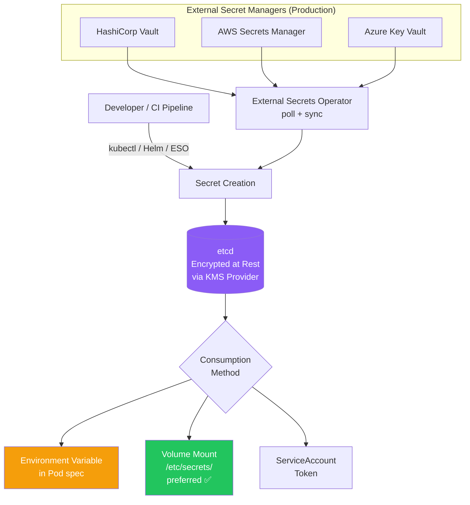

---

### Secret Types Reference

| Type | Use Case | Example |
|---|---|---|
| `Opaque` | Generic key-value secrets | DB passwords, API keys |
| `kubernetes.io/dockerconfigjson` | Private container registry auth | Pull images from ACR / ECR |
| `kubernetes.io/tls` | TLS certificates | HTTPS in Ingress |
| `kubernetes.io/service-account-token` | Pod identity tokens | RBAC for pod-to-API access |
| `kubernetes.io/basic-auth` | Username / password pairs | Legacy system auth |

---

### Creating Secrets

**Method 1 — kubectl:**
```bash
kubectl create secret generic db-secret \
  --from-literal=username=admin \
  --from-literal=password=SuperSecret123 \
  --namespace=production
```

**Method 2 — YAML manifest:**
```yaml
apiVersion: v1
kind: Secret
metadata:
  name: db-secret
  namespace: production
type: Opaque
data:
  username: YWRtaW4=              # echo -n "admin" | base64
  password: U3VwZXJTZWNyZXQxMjM=
```

**Method 3 — External Secrets Operator (recommended for production):**
```yaml
apiVersion: external-secrets.io/v1beta1
kind: ExternalSecret
metadata:
  name: db-secret
  namespace: production
spec:
  refreshInterval: 1h
  secretStoreRef:
    name: azure-key-vault-store    # or vault-backend / aws-sm-store
    kind: SecretStore
  target:
    name: db-secret                # name of K8s Secret to create/update
  data:
    - secretKey: username
      remoteRef:
        key: prod-database-username
    - secretKey: password
      remoteRef:
        key: prod-database-password
```

---

### Consuming Secrets in .NET Pods

**As Environment Variables (simple but leaks to child processes):**
```yaml
spec:
  containers:
    - name: api
      image: myapp:latest
      env:
        - name: ConnectionStrings__DefaultConnection
          valueFrom:
            secretKeyRef:
              name: db-secret
              key: connectionstring
```

**As Volume Mount (preferred — file permissions, no env leak):**
```yaml
spec:
  volumes:
    - name: db-creds
      secret:
        secretName: db-secret
        defaultMode: 0400      # read-only for owner
  containers:
    - name: api
      volumeMounts:
        - name: db-creds
          mountPath: /etc/secrets
          readOnly: true
```

```csharp
// Program.cs — read secrets from mounted files
builder.Configuration
    .AddJsonFile("appsettings.json")
    .AddKeyPerFile(directoryPath: "/etc/secrets", optional: true)  // reads each file as a config key
    .AddEnvironmentVariables();

// Or read directly
var dbPassword = File.ReadAllText("/etc/secrets/password").Trim();
```

**Azure Key Vault integration in .NET:**
```csharp
// Program.cs — pull secrets directly from Azure Key Vault
builder.Configuration.AddAzureKeyVault(
    new Uri($"https://{keyVaultName}.vault.azure.net/"),
    new DefaultAzureCredential());   // uses Managed Identity in AKS — no creds needed
```

---

### Encryption at Rest

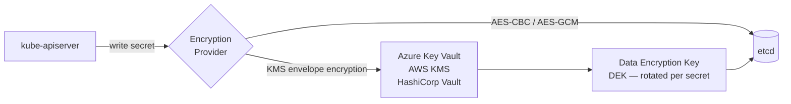

```yaml
# /etc/kubernetes/encryption-config.yaml
apiVersion: apiserver.config.k8s.io/v1
kind: EncryptionConfiguration
resources:
  - resources: [secrets]
    providers:
      - kms:
          name: azurekmsprovider
          endpoint: unix:///opt/azurekms/socket.sock
          cachesize: 1000
          timeout: 3s
      - identity: {}       # fallback for pre-existing unencrypted secrets
```

---

### RBAC for Secret Access

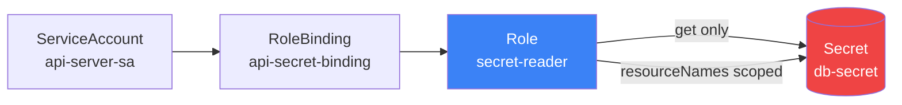

```yaml
# Role — least privilege: only GET on a named secret
apiVersion: rbac.authorization.k8s.io/v1
kind: Role
metadata:
  name: secret-reader
  namespace: production
rules:
  - apiGroups: [""]
    resources: ["secrets"]
    resourceNames: ["db-secret"]   # scope to specific secret — not all secrets
    verbs: ["get"]
---
apiVersion: rbac.authorization.k8s.io/v1
kind: RoleBinding
metadata:
  name: api-secret-binding
  namespace: production
subjects:
  - kind: ServiceAccount
    name: api-server-sa
    namespace: production
roleRef:
  kind: Role
  name: secret-reader
  apiGroup: rbac.authorization.k8s.io
```

---

### Secret Rotation Strategy

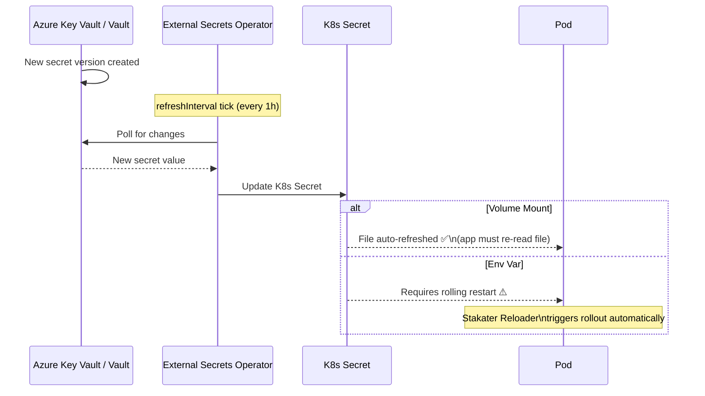

**Auto-restart on secret change (Stakater Reloader):**
```yaml
# Deployment annotation — auto rolling-restart when db-secret changes
metadata:
  annotations:
    secret.reloader.stakater.com/reload: "db-secret"
```

---

### HashiCorp Vault + AKS Workload Identity

```mermaid
flowchart TD
    POD[Pod starts] --> SA[K8s ServiceAccount\nJWT token]
    SA --> VAGENT[Vault Agent Sidecar\ninjected by webhook]
    VAGENT -->|authenticate with JWT| VAULT[HashiCorp Vault]
    VAULT -->|validate via K8s API| K8SAPI[K8s API Server]
    K8SAPI -->|identity confirmed| VAULT
    VAULT -->|return secret| VAGENT
    VAGENT -->|write to shared volume| FILE[/vault/secrets/db-password]
    FILE --> APP[App Container reads file]

    style VAGENT fill:#8b5cf6,color:#fff
    style APP fill:#22c55e,color:#fff
```

```yaml
# Pod annotation — inject Vault Agent sidecar automatically
annotations:
  vault.hashicorp.com/agent-inject: "true"
  vault.hashicorp.com/role: "api-server"
  vault.hashicorp.com/agent-inject-secret-db-password: "secret/prod/database"
  vault.hashicorp.com/agent-inject-template-db-password: |
    {{- with secret "secret/prod/database" -}}
    {{ .Data.data.password }}
    {{- end }}
```

### Best Practices Summary

| Practice | Why | How |
|---|---|---|
| Never commit secrets to Git | Leaked credentials are permanent | `.gitignore`, `git-secrets` pre-commit hook |
| Use External Secret Managers | Rotation, audit logs, fine-grained access control | ESO + Azure Key Vault / Vault |
| Encryption at Rest | Base64 ≠ encryption | KMS encryption provider on etcd |
| RBAC with least privilege | Limit blast radius on breach | `resourceNames` to scope to specific secret |
| Volume mount over env vars | Env vars leak to child processes and crash dumps | Mount as files with `0400` permissions |
| Rotate regularly | Limit exposure window if leaked | ESO with short `refreshInterval` (1h) |
| Audit secret access | Detect anomalous reads | K8s Audit Logs + Microsoft Sentinel / Splunk |

### Interview Talking Points

| Question | Answer |
|---|---|
| Why not ConfigMaps for secrets? | ConfigMaps are stored in plaintext in etcd; Secrets get encryption-at-rest treatment |
| Base64 in Secrets — is that secure? | No. It's encoding, not encryption. Always enable KMS encryption at rest |
| Env vars vs volume mounts? | Volume mounts preferred — env vars leak via `/proc`, child processes, and crash dumps |
| Zero-downtime secret rotation? | Old + new both valid during rotation window; Stakater Reloader triggers graceful rollout |
| How to audit who accessed a secret? | K8s audit logs (`audit-policy.yaml`) + Vault audit backend → SIEM |

---

## Cross-Cutting Themes

### Pattern Selection Guide

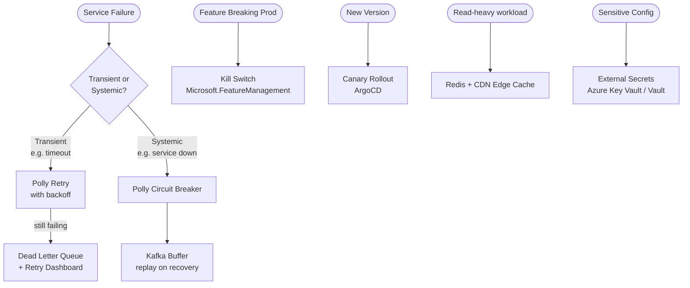

### Common Interview Red Flags to Avoid

| Red Flag | Why It's Wrong | Correct Answer |
|---|---|---|
| "We retry in a tight loop" | Thundering herd — hammers a recovering service | Exponential backoff with jitter |
| "Secrets in Dockerfile ENV" | Leaked in image layers, `docker inspect`, CI logs | Azure Key Vault + Managed Identity |
| "301 redirect for short URLs" | Browser caches permanently — breaks click analytics | 302 redirect |
| "Synchronous payment call from order service" | Tight coupling → cascading failures | Async Kafka event + Saga pattern |
| "SQL handles all flash sale inventory" | Race conditions → overselling | Redis atomic Lua DECR |
| "`ConfigMap` for DB passwords" | Plaintext in etcd | K8s Secret + KMS encryption at rest |
