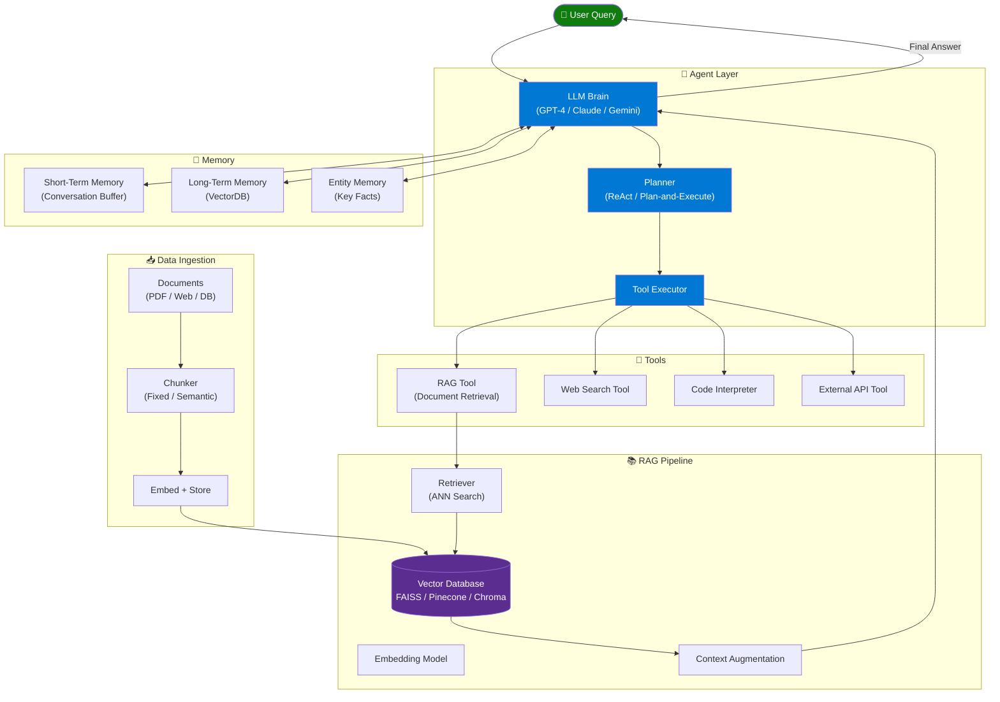
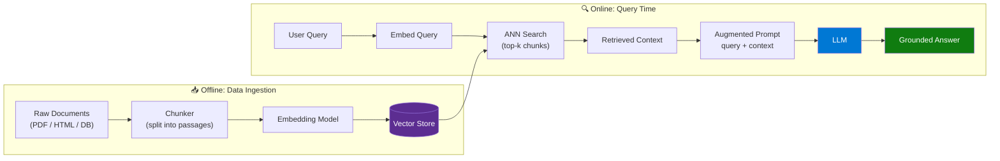
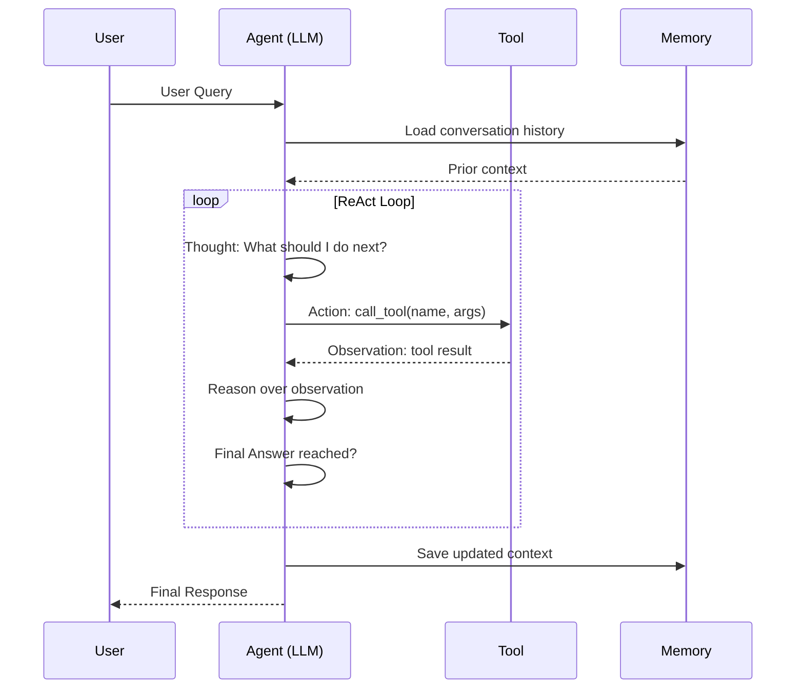
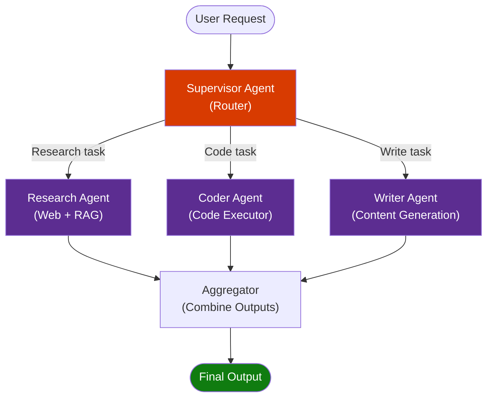

# Complete Agentic AI — Agents, RAG, Embeddings, Architectures, Frameworks, VectorDB & Memory

> **Source:** [YouTube — Complete Agentic AI Course](https://www.youtube.com/watch?v=Pn95eOlw5qk)
> **Channel/Event:** Free YouTube Course
> **Topic:** Agentic AI, RAG, Embeddings, Vector Databases, LangChain, LangGraph, CrewAI, AutoGen, Memory, AI Architectures
> **Key Claim:** A single course covering the complete Agentic AI stack — from embeddings and VectorDBs to multi-agent orchestration frameworks

---

## Table of Contents

1. [Overview](#1-overview)
2. [Problem Statement](#2-problem-statement)
3. [Core Concepts](#3-core-concepts)
4. [Architecture](#4-architecture)
5. [Key Components](#5-key-components)
6. [How It Works — Step by Step](#6-how-it-works--step-by-step)
7. [Comparison Table](#7-comparison-table)
8. [Code Examples](#8-code-examples)
9. [Configuration Reference](#9-configuration-reference)
10. [Best Practices](#10-best-practices)
11. [Interview Talking Points](#11-interview-talking-points)
12. [Learning Resources](#12-learning-resources)

---

## 1. Overview

Agentic AI represents the shift from single-shot LLM calls to autonomous systems that reason, plan, retrieve information, use tools, and loop until a goal is achieved. This course covers the complete stack: Retrieval-Augmented Generation (RAG) for grounding LLMs in external knowledge, embeddings for semantic search, vector databases for storage, and orchestration frameworks (LangChain, LangGraph, CrewAI, AutoGen) for building multi-agent pipelines. The key insight is that production AI applications require agents — not just prompts — because real tasks are multi-step, require external data, and need persistent memory across turns.

---

## 2. Problem Statement

### Why Plain LLMs Are Not Enough

| Problem | Impact |
|---|---|
| Knowledge cutoff — LLM trained data is static | Hallucinations on recent or private data |
| No tool use — LLM can't query databases or APIs | Cannot act on the real world |
| Stateless — no memory across sessions | Users must re-explain context every turn |
| Single-step — one prompt, one response | Complex multi-step tasks fail |
| No self-correction — errors propagate | Low reliability in production pipelines |

> **Key Insight:** "An agent is an LLM that decides its own next steps, uses tools to take action, and loops until the task is complete — it's the difference between a chatbot and a coworker."

---

## 3. Core Concepts

### AI Agent
An autonomous system built on an LLM that perceives inputs, reasons about what to do next, takes actions via tools, observes results, and loops until the goal is achieved. The LLM acts as the "brain" while tools, memory, and planning scaffolding form the rest of the system.

### RAG (Retrieval-Augmented Generation)
A pattern that grounds LLM responses in external knowledge by retrieving relevant documents at query time and injecting them into the prompt context. Solves hallucination and knowledge-cutoff problems without retraining the model.

### Embeddings
Dense numerical vector representations of text that capture semantic meaning. Similar texts produce similar vectors. Used for semantic search: embed a query, find nearest vectors in a database, retrieve their source documents.

### Vector Database
A specialized database that stores and indexes embedding vectors, enabling fast Approximate Nearest Neighbor (ANN) search at scale. Core infrastructure for RAG and agent long-term memory.

### Agent Memory
The mechanism by which agents retain information across steps or sessions:
- **Short-term (in-context):** Conversation history within the current context window
- **Working memory:** Intermediate reasoning and scratchpad within a single agent run
- **Long-term (external):** VectorDB-backed semantic memory persisted across sessions

### Agentic Framework
Libraries that provide scaffolding for building agents: tool routing, chain orchestration, multi-agent communication, state management, and observability. Examples: LangChain, LangGraph, CrewAI, AutoGen, LlamaIndex.

---

## 4. Architecture

### Complete Agentic AI System Architecture



---

## 5. Key Components

| Component | Technology Options | Role |
|---|---|---|
| **LLM Brain** | GPT-4o, Claude 3.5, Gemini 1.5, Llama 3 | Reasoning, planning, generating responses |
| **Embedding Model** | text-embedding-3-large, ada-002, BGE, E5 | Convert text to dense vectors for search |
| **Vector Database** | FAISS, Chroma, Pinecone, Weaviate, Milvus, Qdrant | Store & search embeddings at scale |
| **Retriever** | Similarity search, MMR, hybrid BM25+dense | Fetch top-k relevant documents for a query |
| **Agent Framework** | LangChain, LangGraph, CrewAI, AutoGen | Orchestrate agent loops, tools, memory |
| **Tools** | Web search, code executor, DB query, APIs | Let the agent take real-world actions |
| **Memory Store** | Redis, Postgres, VectorDB, in-context buffer | Persist state across steps and sessions |
| **Chunker** | RecursiveCharacterTextSplitter, semantic | Split documents into indexable chunks |

### Embedding Models

| Model | Provider | Dimensions | Best For |
|---|---|---|---|
| `text-embedding-3-large` | OpenAI | 3072 | Highest accuracy, production RAG |
| `text-embedding-3-small` | OpenAI | 1536 | Cost-efficient, good accuracy |
| `text-embedding-ada-002` | OpenAI | 1536 | Legacy, widely used |
| `BAAI/bge-large-en-v1.5` | HuggingFace | 1024 | Open-source, self-hosted |
| `sentence-transformers/all-MiniLM-L6-v2` | HuggingFace | 384 | Lightweight, fast, local dev |

### Vector Databases

| DB | Deployment | Strengths |
|---|---|---|
| **FAISS** | Local / in-memory | Fastest for prototyping, Meta-developed |
| **ChromaDB** | Local / server | Easy setup, Python-native, persistent |
| **Pinecone** | Managed cloud | Serverless, production-grade, managed index |
| **Weaviate** | Self-hosted / cloud | Hybrid search built-in, GraphQL API |
| **Milvus** | Self-hosted / cloud | Enterprise scale, GPU acceleration |
| **Qdrant** | Self-hosted / cloud | Rust-based, fast, filtering support |

### Agent Frameworks

| Framework | Paradigm | Best For |
|---|---|---|
| **LangChain** | Chain/LCEL + Agents | General-purpose, huge ecosystem |
| **LangGraph** | Graph-based stateful | Multi-agent workflows, loops, human-in-loop |
| **CrewAI** | Role-based crews | Structured teams of specialized agents |
| **AutoGen** | Conversational multi-agent | Microsoft's debate/collaboration pattern |
| **LlamaIndex** | Data-centric | Complex RAG pipelines, document indexing |

---

## 6. How It Works — Step by Step

### RAG Pipeline



### Agent ReAct Loop



**ReAct Loop Steps:**
1. **Thought** — LLM reasons about what information or action is needed
2. **Action** — LLM selects a tool and generates arguments
3. **Observation** — Tool executes and returns result to the LLM
4. **Repeat** — LLM re-reasons with new observation until goal is met
5. **Final Answer** — LLM returns answer to user when loop terminates

### Multi-Agent Supervisor Pattern



---

## 7. Comparison Table

| Dimension | Traditional LLM Call | Agentic AI System |
|---|---|---|
| **Knowledge** | Static training data, cutoff date | Dynamic — retrieves real-time external docs |
| **Actions** | Text output only | Executes tools: search, code, APIs, DB |
| **Steps** | Single prompt → single response | Multi-step loops with self-correction |
| **Memory** | Stateless (no cross-session context) | Short + long-term memory with persistence |
| **Error handling** | None — errors in output silently | Observation loop enables self-correction |
| **Scalability** | Single model handles everything | Specialist agents handle sub-tasks in parallel |
| **Grounding** | Prone to hallucination | RAG grounds responses in real documents |
| **Cost** | Low (single call) | Higher (multiple calls, retrieval overhead) |

### RAG vs Fine-Tuning

| Dimension | RAG | Fine-Tuning |
|---|---|---|
| **Knowledge update** | Instant — update vector store | Slow — retrain model |
| **Cost** | Low inference cost | High training cost |
| **Hallucination** | Grounded in retrieved docs | Still hallucinates outside training scope |
| **Private data** | Yes — keep docs external | Yes — baked into weights |
| **Transparency** | Source citations possible | Black box |
| **Best for** | Dynamic, frequently-changing knowledge | Tone/style/format specialization |

---

## 8. Code Examples

### Python — Basic RAG Pipeline with LangChain + ChromaDB

```python
from langchain.document_loaders import PyPDFLoader
from langchain.text_splitter import RecursiveCharacterTextSplitter
from langchain_openai import OpenAIEmbeddings, ChatOpenAI
from langchain_community.vectorstores import Chroma
from langchain.chains import RetrievalQA

# 1. Load and chunk documents
loader = PyPDFLoader("company_docs.pdf")
docs = loader.load()

splitter = RecursiveCharacterTextSplitter(
    chunk_size=1000,
    chunk_overlap=200
)
chunks = splitter.split_documents(docs)

# 2. Embed and store in vector database
embeddings = OpenAIEmbeddings(model="text-embedding-3-small")
vectorstore = Chroma.from_documents(
    documents=chunks,
    embedding=embeddings,
    persist_directory="./chroma_db"
)

# 3. Build RAG chain
retriever = vectorstore.as_retriever(search_kwargs={"k": 5})
llm = ChatOpenAI(model="gpt-4o", temperature=0)

rag_chain = RetrievalQA.from_chain_type(
    llm=llm,
    retriever=retriever,
    return_source_documents=True
)

# 4. Query
result = rag_chain.invoke({"query": "What is the refund policy?"})
print(result["result"])
print("Sources:", [doc.metadata["source"] for doc in result["source_documents"]])
```

### Python — ReAct Agent with Tools (LangChain)

```python
from langchain_openai import ChatOpenAI
from langchain.agents import create_react_agent, AgentExecutor
from langchain.tools import Tool
from langchain_community.tools import DuckDuckGoSearchRun
from langchain.prompts import PromptTemplate

llm = ChatOpenAI(model="gpt-4o", temperature=0)

# Define tools
search = DuckDuckGoSearchRun()
tools = [
    Tool(
        name="web_search",
        func=search.run,
        description="Search the web for current information. Input: search query string."
    ),
    Tool(
        name="calculator",
        func=lambda x: str(eval(x)),
        description="Evaluate math expressions. Input: valid Python math expression."
    )
]

# ReAct prompt (Thought / Action / Observation loop)
template = """Answer the following question using the tools available.

Tools:
{tools}

Tool names: {tool_names}

Format:
Thought: [your reasoning]
Action: [tool name]
Action Input: [tool input]
Observation: [tool result]
... (repeat as needed)
Final Answer: [your answer]

Question: {input}
{agent_scratchpad}"""

prompt = PromptTemplate.from_template(template)
agent = create_react_agent(llm, tools, prompt)
executor = AgentExecutor(agent=agent, tools=tools, verbose=True, max_iterations=5)

result = executor.invoke({"input": "What is the current price of Bitcoin in USD?"})
print(result["output"])
```

### Python — Multi-Agent with CrewAI

```python
from crewai import Agent, Task, Crew, Process

# Define specialist agents
researcher = Agent(
    role="Research Analyst",
    goal="Find accurate and up-to-date information on any topic",
    backstory="Expert researcher with access to web search and document analysis",
    verbose=True,
    tools=[search_tool]
)

writer = Agent(
    role="Technical Writer",
    goal="Transform research into clear, structured documentation",
    backstory="Experienced technical writer who creates concise summaries",
    verbose=True
)

# Define tasks
research_task = Task(
    description="Research the latest trends in agentic AI for 2026",
    expected_output="A bullet-point summary of 5 key trends with sources",
    agent=researcher
)

write_task = Task(
    description="Create a professional report based on the research findings",
    expected_output="A 500-word structured report in markdown format",
    agent=writer,
    context=[research_task]
)

# Assemble crew and run
crew = Crew(
    agents=[researcher, writer],
    tasks=[research_task, write_task],
    process=Process.sequential
)

result = crew.kickoff()
print(result)
```

### Python — Embeddings and Semantic Search

```python
from openai import OpenAI
import numpy as np

client = OpenAI()

def embed(text: str) -> list[float]:
    response = client.embeddings.create(
        input=text,
        model="text-embedding-3-small"
    )
    return response.data[0].embedding

def cosine_similarity(a: list[float], b: list[float]) -> float:
    a, b = np.array(a), np.array(b)
    return float(np.dot(a, b) / (np.linalg.norm(a) * np.linalg.norm(b)))

# Index documents
documents = [
    "Azure AI Search provides vector search capabilities",
    "LangChain is a framework for building LLM applications",
    "ChromaDB is an open-source vector database"
]
doc_embeddings = [embed(doc) for doc in documents]

# Query
query = "Which tool helps with vector search in cloud?"
query_embedding = embed(query)

# Rank by similarity
scores = [(cosine_similarity(query_embedding, de), doc)
          for de, doc in zip(doc_embeddings, documents)]
scores.sort(reverse=True)

for score, doc in scores:
    print(f"{score:.3f} | {doc}")
```

### Install / Setup

```bash
# Core dependencies
pip install langchain langchain-openai langchain-community
pip install chromadb          # Local vector store
pip install openai            # OpenAI embeddings + LLMs
pip install pypdf             # PDF loading

# Multi-agent frameworks
pip install crewai            # CrewAI
pip install pyautogen         # AutoGen (Microsoft)
pip install langgraph         # LangGraph (stateful multi-agent)
pip install llama-index       # LlamaIndex (data-centric RAG)

# Production vector stores
pip install pinecone-client   # Pinecone
pip install weaviate-client   # Weaviate
pip install qdrant-client     # Qdrant

# Observability
pip install langsmith          # LangChain tracing + eval
```

---

## 9. Configuration Reference

### Chunking Parameters

| Parameter | Type | Typical Value | Description |
|---|---|---|---|
| `chunk_size` | int | 500–1500 | Max characters per chunk |
| `chunk_overlap` | int | 50–200 | Overlap between consecutive chunks to preserve context |
| `separators` | list | `["\n\n", "\n", " "]` | Priority order for split points |

### Retriever Parameters

| Parameter | Type | Default | Description |
|---|---|---|---|
| `k` | int | 4 | Number of top documents to retrieve |
| `score_threshold` | float | 0.7 | Minimum similarity score to include a result |
| `search_type` | str | `"similarity"` | `"similarity"`, `"mmr"`, `"similarity_score_threshold"` |
| `lambda_mult` | float | 0.5 | MMR diversity vs relevance tradeoff (0=max diversity) |

### Agent Parameters

| Parameter | Type | Default | Description |
|---|---|---|---|
| `max_iterations` | int | 10 | Max ReAct loop iterations before stopping |
| `max_execution_time` | float | None | Timeout in seconds for agent execution |
| `early_stopping_method` | str | `"force"` | `"force"` or `"generate"` — how to stop at limit |
| `handle_parsing_errors` | bool | False | Retry on malformed tool call outputs |

---

## 10. Best Practices

### RAG Design

- ✅ Use semantic chunking (split at paragraph/sentence boundaries, not fixed char counts)
- ✅ Store metadata (source, page, date) alongside embeddings — enables filtered retrieval
- ✅ Use hybrid search (dense + BM25 keyword) for better recall on exact-match queries
- ✅ Evaluate retrieval quality separately from generation quality (context precision/recall)
- ❌ Don't use chunks larger than 1500 chars — context pollution degrades LLM answer quality
- ❌ Don't skip re-ranking — raw ANN top-k often includes irrelevant results

### Agent Design

- ✅ Give each tool a precise `description` — the LLM reads descriptions to decide which tool to call
- ✅ Set `max_iterations` — unbounded agents will loop forever on ambiguous tasks
- ✅ Use `verbose=True` during development to see the full Thought/Action/Observation trace
- ✅ Add a human-in-the-loop checkpoint before irreversible actions (send email, delete record)
- ❌ Don't give agents too many tools (>10) — LLM struggles to choose correctly
- ❌ Don't let agents call external APIs without input validation — prompt injection is a real risk

### Embeddings & VectorDB

- ✅ Use the same embedding model at index time and query time — mismatch breaks search
- ✅ Normalize vectors before storing if using cosine similarity
- ✅ Use metadata filtering to pre-filter before ANN search — reduces noise, speeds retrieval
- ❌ Don't store raw LLM outputs in vector stores — embed the source documents, not summaries

### Multi-Agent Systems

- ✅ Assign clear, narrow roles to each agent — avoid agents that do "everything"
- ✅ Use a supervisor agent for routing — prevents circular delegation
- ✅ Share context between agents via structured output (JSON), not free-form text
- ❌ Don't trust agent-to-agent messages without validation — agents can hallucinate tool results

---

## 11. Interview Talking Points

### "What is an AI agent and how is it different from a regular LLM call?"

> An AI agent is a system that wraps an LLM with tools, memory, and a reasoning loop — it can decide what action to take next, execute that action via a tool, observe the result, and iterate until the task is done. A regular LLM call is stateless and single-step: one prompt in, one response out. Agents enable multi-step problem solving, real-world action, and self-correction — the difference is like asking someone a question versus assigning them a task.

---

### "Explain the RAG architecture and when you would use it vs fine-tuning."

> RAG works in two phases: offline ingestion (chunk documents, embed them, store in a vector database) and online retrieval (embed the query, fetch the top-k similar chunks via ANN search, inject those chunks into the LLM prompt as context). I'd choose RAG when the knowledge changes frequently, when I need source citations, or when I need to keep data private without baking it into model weights. Fine-tuning is better for changing the model's behavior, tone, or output format — not for injecting new factual knowledge, since fine-tuned models still hallucinate outside their training distribution.

---

### "What are the main agentic AI frameworks and how do they differ?"

> LangChain provides the broadest ecosystem — chains, LCEL, tool integrations, and a pluggable agent abstraction. LangGraph is built on top of LangChain but uses a directed graph model for stateful, cyclical workflows, making it the best choice for complex multi-agent pipelines with conditional branching and human-in-the-loop steps. CrewAI uses a role-based metaphor — you define agents as crew members with explicit roles and tasks, which makes it intuitive for sequential or hierarchical agent teams. AutoGen (Microsoft) is conversation-driven — agents communicate by passing messages, enabling emergent collaboration and debate patterns. LlamaIndex focuses on the data layer, making it ideal when the primary challenge is complex document ingestion and retrieval rather than agent orchestration.

---

### "How does a vector database work and why can't you just use a traditional database for RAG?"

> A vector database stores numerical embedding vectors and enables fast Approximate Nearest Neighbor (ANN) search using algorithms like HNSW or IVF. Traditional databases search by exact match or range on structured fields — they can't compute cosine similarity across millions of high-dimensional vectors efficiently. A SQL `WHERE` clause comparing a 1536-dimensional float array is O(n) and impractically slow. VectorDBs index the embedding space so that semantically similar queries return relevant results in milliseconds, even at millions-of-document scale. You'd use a traditional DB alongside a vector DB — relational for structured metadata and filtering, vector DB for semantic retrieval.

---

### "What is the ReAct pattern and why is it important for agents?"

> ReAct (Reason + Act) is an agent prompting pattern where the LLM alternates between a Thought step (explicit reasoning about what to do) and an Action step (calling a tool), followed by an Observation (the tool's output). This loop continues until the LLM produces a Final Answer. It's important because it makes the agent's reasoning transparent and debuggable — you can read the trace and see exactly why the agent chose each tool. It also enables self-correction: if a tool returns an unexpected result, the next Thought step can reason about it and try a different approach, rather than failing silently as a single-shot prompt would.

---

### "What types of memory do AI agents use?"

> Agent memory falls into three tiers. Short-term memory is the conversation buffer — the raw message history kept in the context window; it's fast but limited by token length. Working memory is the scratchpad within a single agent run — the Thought/Observation trace that lets the agent reason across multiple tool calls. Long-term memory is external storage, typically a vector database, that persists facts and user preferences across sessions; the agent embeds information before storing and retrieves by semantic similarity when needed. Production agents often layer all three: a rolling window for short-term, structured scratchpad for working memory, and VectorDB-backed semantic memory for long-term recall.

---

## 12. Learning Resources

| Resource | Link | Type |
|---|---|---|
| Complete Agentic AI Course | [YouTube](https://www.youtube.com/watch?v=Pn95eOlw5qk) | Video Course |
| LangChain Documentation | [docs.langchain.com](https://docs.langchain.com) | Official Docs |
| LangGraph Docs | [langchain-ai.github.io/langgraph](https://langchain-ai.github.io/langgraph/) | Official Docs |
| CrewAI Documentation | [docs.crewai.com](https://docs.crewai.com) | Official Docs |
| AutoGen (Microsoft) | [microsoft.github.io/autogen](https://microsoft.github.io/autogen/stable/) | Official Docs |
| LlamaIndex Docs | [docs.llamaindex.ai](https://docs.llamaindex.ai) | Official Docs |
| OpenAI Embeddings Guide | [platform.openai.com/docs/guides/embeddings](https://platform.openai.com/docs/guides/embeddings) | Official Docs |
| Pinecone Learning Center | [pinecone.io/learn](https://www.pinecone.io/learn/) | Learning Resource |
| RAGAS — RAG Evaluation | [docs.ragas.io](https://docs.ragas.io) | Evaluation Framework |

---

*Last Updated: June 2026 | Source: YouTube — Complete Agentic AI Course (Pn95eOlw5qk)*
