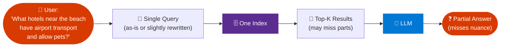
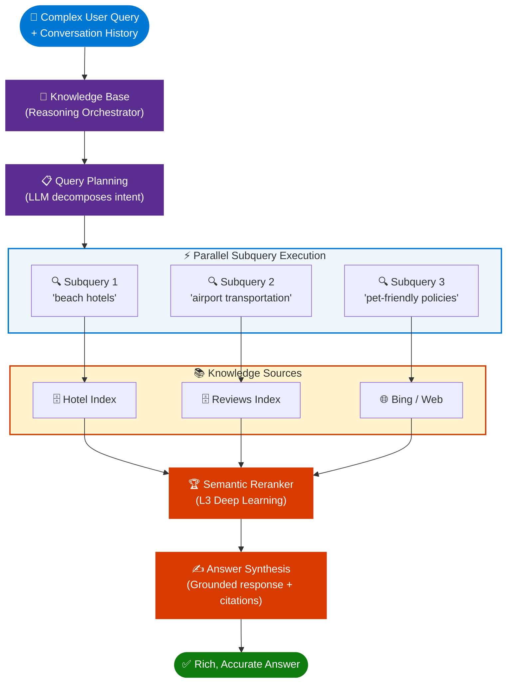
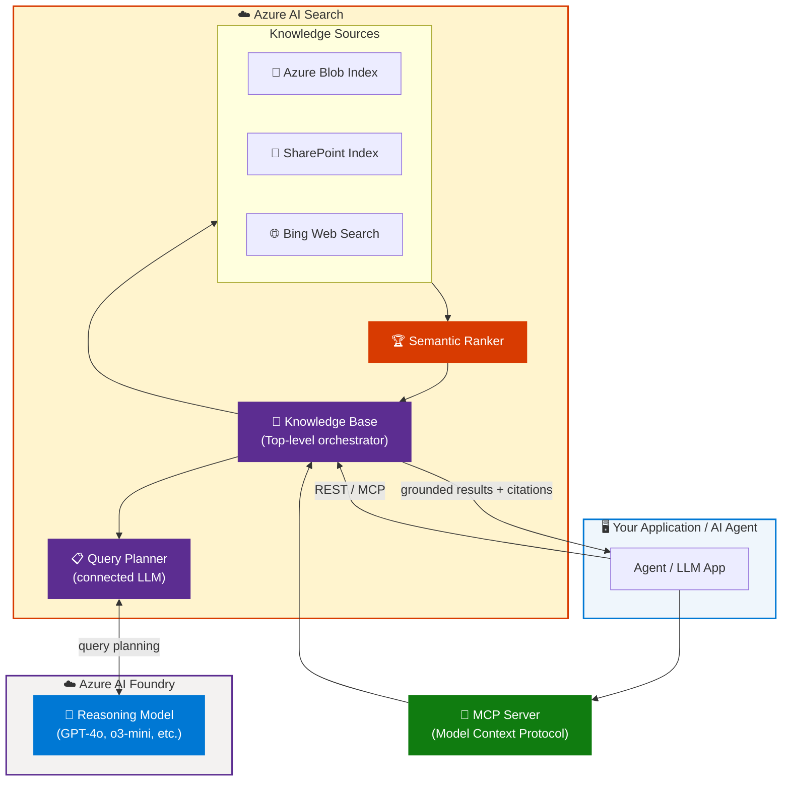
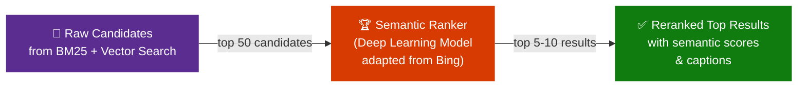
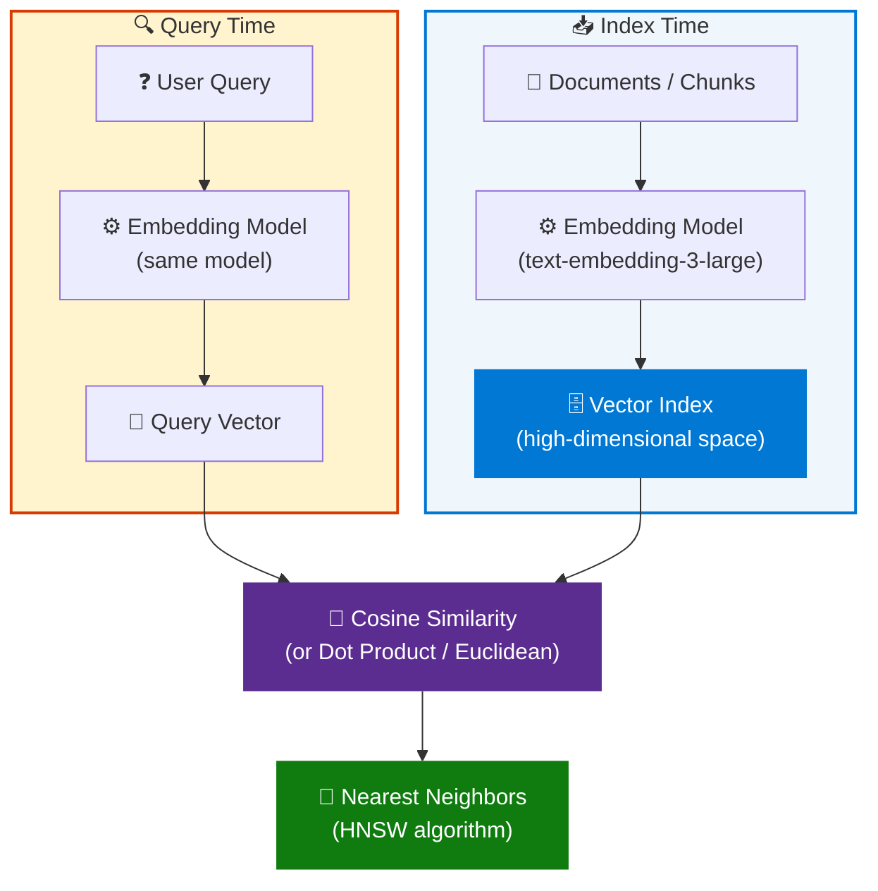
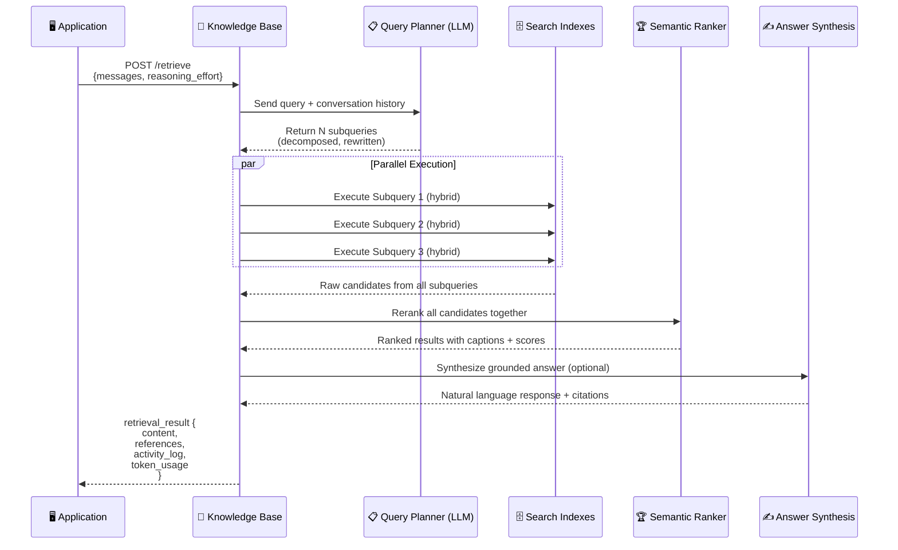
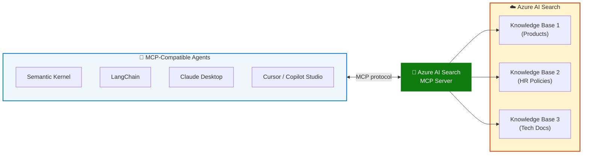
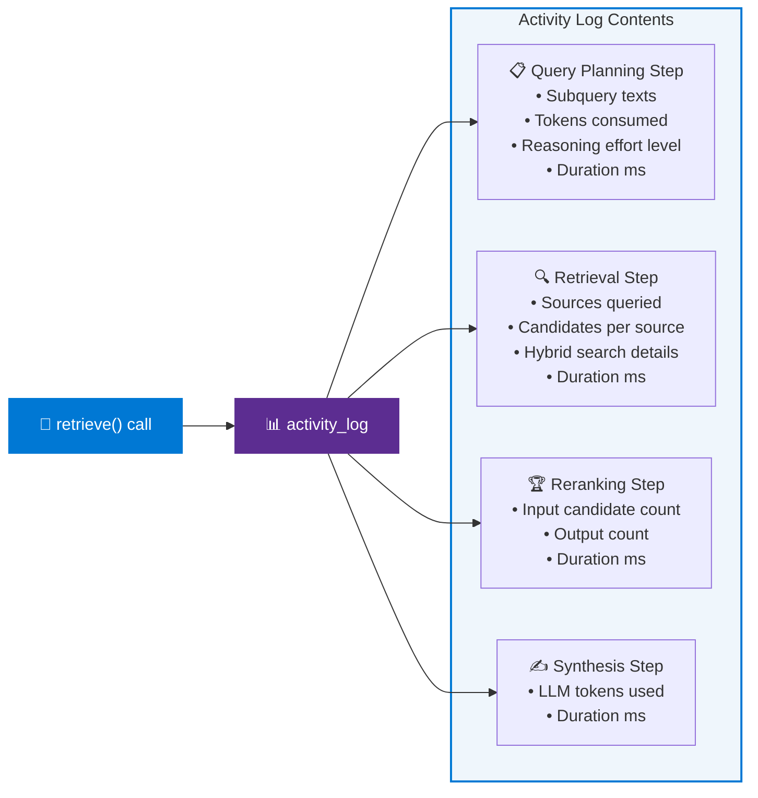
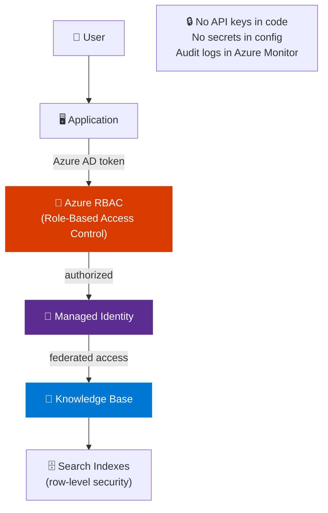

# Agentic RAG: Build a Reasoning Retrieval Engine with Azure AI Search

> **Source:** [YouTube – Agentic RAG: build a reasoning retrieval engine with Azure AI Search | BRK142](https://www.youtube.com/watch?v=PeTmOidqHM8&t=5s)  
> **Event:** Microsoft Build 2025 · Session BRK142  
> **Topic:** Agentic Retrieval, Knowledge Base, Vector Search, Reasoning RAG  
> **Relevance:** ~40% improvement in answer relevance over classic RAG for complex queries

---

## 📋 Table of Contents

1. [Overview & Session Context](#overview--session-context)
2. [The Problem with Classic RAG](#the-problem-with-classic-rag)
3. [What Is Agentic Retrieval?](#what-is-agentic-retrieval)
4. [Core Architecture](#core-architecture)
5. [Key Components](#key-components)
   - [Knowledge Base](#1-knowledge-base-formerly-knowledge-agent)
   - [Query Planning Engine](#2-query-planning-engine)
   - [Knowledge Sources](#3-knowledge-sources)
   - [Semantic Ranker](#4-semantic-ranker)
   - [Answer Synthesis](#5-answer-synthesis)
6. [Vector Search & Embeddings Foundations](#vector-search--embeddings-foundations)
7. [Agentic Retrieval Flow — Step by Step](#agentic-retrieval-flow--step-by-step)
8. [Classic RAG vs Agentic RAG Comparison](#classic-rag-vs-agentic-rag-comparison)
9. [MCP Integration](#mcp-model-context-protocol-integration)
10. [API Reference](#api-reference)
11. [Code Examples](#code-examples)
12. [Observability & Debugging](#observability--debugging)
13. [Enterprise Features](#enterprise-features)
14. [Best Practices](#best-practices)
15. [Learning Resources](#learning-resources)
16. [Interview Talking Points](#interview-talking-points)

---

## Overview & Session Context

**BRK142** is a Microsoft Build 2025 breakout session that introduces **Agentic Retrieval** — a fundamental shift in how Azure AI Search works for AI-powered applications. The session covers the transition from simple, single-shot RAG patterns to a sophisticated **reasoning retrieval engine** that uses LLMs to autonomously plan, decompose, and execute multi-step search strategies.

### What This Session Announced
- General availability of **Agentic Retrieval** in Azure AI Search
- Introduction of the **Knowledge Base** object (formerly Knowledge Agent)
- Native **MCP (Model Context Protocol)** server support for Azure AI Search
- Up to **~40% improvement** in answer relevance for complex, multi-part queries
- Integration with **Azure AI Foundry** ecosystem for end-to-end agent pipelines

---

## The Problem with Classic RAG

Traditional RAG (Retrieval-Augmented Generation) has a fundamental limitation: it relies on a **single, static query** against a single search index.



### Pain Points of Classic RAG

| Problem | Impact |
|---|---|
| **Single query** — can't decompose complex questions | Misses information hidden under different keywords |
| **Single index** — no multi-source orchestration | Can't combine hotel data + travel guides + reviews |
| **Stateless** — ignores conversation history | Follow-up questions lose context |
| **Manual query formulation** — developer must craft the perfect query | Brittle, fails at edge cases |
| **No reasoning** — LLM used only at the end | Retrieval quality is the bottleneck |

> **Key insight from the session:** *"The bottleneck is no longer the language model — it's the retrieval."*

---

## What Is Agentic Retrieval?

**Agentic Retrieval** turns Azure AI Search into an autonomous **reasoning retrieval engine**. Instead of executing one query against one index, it uses an LLM (configured with a reasoning model) to:

1. Analyze the **conversation history and user intent**
2. **Decompose** complex questions into multiple targeted subqueries
3. Execute subqueries **in parallel** across multiple sources
4. **Rerank and interleave** results from all subqueries
5. **Synthesize** a final grounded response with citations



---

## Core Architecture



---

## Key Components

### 1. Knowledge Base _(formerly Knowledge Agent)_

The **Knowledge Base** is the central orchestration object in Azure AI Search for agentic retrieval. It was introduced as "Knowledge Agent" at Build 2025 and renamed to **Knowledge Base** in later previews (`2025-11-01-preview` onward).

**Responsibilities:**
- Holds **retrieval instructions** (natural language guidance for the LLM)
- Connects to one or more **knowledge sources** (indexes, Bing, storage)
- Configures the **LLM connection** used for query planning
- Manages **reasoning effort** level
- Exposes the `retrieve` API endpoint

```json
// Knowledge Base definition (REST API)
{
  "name": "hotels-kb",
  "description": "Knowledge base for hotel search and recommendations",
  "defaultReasoningEffort": "medium",
  "defaultOutputSize": 10,
  "models": [
    {
      "name": "query-plan-model",
      "kind": "azureOpenAI",
      "azureOpenAIParameters": {
        "resourceUri": "https://<your-resource>.openai.azure.com",
        "deploymentId": "gpt-4o",
        "apiKey": "<key>"
      }
    }
  ],
  "knowledgeSources": [
    {
      "name": "hotels-index",
      "type": "azureSearchIndex",
      "indexName": "hotels",
      "referenceFieldName": "hotel_id"
    }
  ]
}
```

---

### 2. Query Planning Engine

The Query Planner is the **intelligence layer** of agentic retrieval. It is powered by an LLM (typically GPT-4o or a reasoning model like `o3-mini`) and performs:

- **Intent extraction** from user query + conversation history
- **Query decomposition** — breaks complex questions into focused atomic subqueries
- **Query rewriting** — transforms natural language into search-optimized terms
- **Source routing** — determines which knowledge sources to query for each subquery

#### Reasoning Effort Levels

| Level | Behavior | Use Case |
|---|---|---|
| `minimal` | Minimal LLM involvement — near-classic RAG | Simple, single-topic queries |
| `low` | Light query planning | Moderate complexity queries |
| `medium` | Full query decomposition + parallel execution | Complex, multi-part questions |

---

### 3. Knowledge Sources

Knowledge Sources are the **data connections** the Knowledge Base can query. Each source can be searched independently or in combination.

| Source Type | Description | Best For |
|---|---|---|
| **Azure Search Index** | Your own indexed content | Proprietary enterprise data |
| **Azure Blob Storage** | Files (PDF, DOCX, etc.) via integrated vectorization | Document libraries |
| **SharePoint** | Microsoft 365 content | Internal knowledge bases |
| **Bing Web Search** | Real-time public web content | Up-to-date external information |
| **Custom MCP Tools** | Any MCP-compatible data service | Custom APIs and databases |

---

### 4. Semantic Ranker

The **Semantic Ranker** is Azure AI Search's deep learning reranker — often called an **"L3 reranker"** (third layer of ranking, after BM25 and vector similarity).



**What makes it powerful:**
- Understands **semantic meaning**, not just keyword overlap
- Handles **negation** — distinguishes "no pets allowed" from "pets allowed"
- Captures **complex relationships** between query and document
- Generates **semantic captions** (highlighted relevant passages)
- Works across all subquery results, interleaving them by relevance

---

### 5. Answer Synthesis

Beyond returning ranked search results, the agentic retrieval pipeline can optionally include **Answer Synthesis** — an LLM step that:

- Takes all reranked chunks from all subqueries
- Generates a **natural language answer** grounded in the retrieved content
- Provides **inline citations** pointing back to source documents
- Produces a **structured metadata payload** (token counts, subquery details, timing)

---

## Vector Search & Embeddings Foundations

The session recaps the **vector similarity foundation** that underpins agentic retrieval:

### How Vector Search Works



### Hybrid Search (Best of Both Worlds)

Azure AI Search supports **Hybrid Search** — combining BM25 (keyword) with vector search for maximum recall:

| Search Type | Strength | Weakness |
|---|---|---|
| **BM25 (Keyword)** | Exact term matching, fast | Misses synonyms, paraphrases |
| **Vector (Semantic)** | Understands meaning, handles paraphrases | Can miss exact terms |
| **Hybrid (BM25 + Vector)** | Best recall + best precision | Requires score fusion (RRF) |

**Reciprocal Rank Fusion (RRF)** is used to merge keyword and vector results before passing to the Semantic Ranker.

---

## Agentic Retrieval Flow — Step by Step



---

## Classic RAG vs Agentic RAG Comparison

| Dimension | Classic RAG | Agentic RAG |
|---|---|---|
| **Query Strategy** | Single query, as-is | LLM decomposes into N subqueries |
| **Execution** | Sequential, one index | Parallel, multi-source |
| **Context Awareness** | Stateless per query | Uses full conversation history |
| **Query Formulation** | Developer-crafted | Autonomous LLM query planning |
| **Relevance** | Limited to single-query recall | ~40% improvement on complex queries |
| **Sources** | One index | Multiple indexes + Bing + files |
| **Reranking** | Optional semantic ranker | Built-in L3 semantic reranker |
| **Response** | Raw search results | Grounded answer + citations (optional) |
| **Observability** | Basic | Full activity log with token counts, timing, subqueries |
| **Interface** | Standard Search REST API | Knowledge Base API + MCP |
| **Developer Effort** | High — manual query crafting | Low — natural language instructions |

---

## MCP (Model Context Protocol) Integration

Azure AI Search now ships a **native MCP server**, making it a first-class data provider for any MCP-compatible agent framework.

### What MCP Enables



### MCP Tool Exposed

The MCP server exposes a `knowledge_base_retrieve` tool that any agent can call:

```python
# Conceptual: Agent using MCP to call Azure AI Search Knowledge Base
from mcp import ClientSession

async def search_enterprise_data(query: str, conversation_history: list):
    results = await session.call_tool(
        "knowledge_base_retrieve",
        arguments={
            "query": query,
            "messages": conversation_history,  # full conversation context
            "reasoning_effort": "medium"        # LLM-based query planning
        }
    )
    return results
```

---

## API Reference

### Create a Knowledge Base (REST)

```http
PUT https://<search-service>.search.windows.net/knowledgebases/hotels-kb
  ?api-version=2026-04-01
Content-Type: application/json
Authorization: Bearer <token>
```

```json
{
  "name": "hotels-kb",
  "defaultReasoningEffort": "medium",
  "defaultOutputSize": 10,
  "models": [
    {
      "name": "gpt4o-query-planner",
      "kind": "azureOpenAI",
      "azureOpenAIParameters": {
        "resourceUri": "https://<openai-resource>.openai.azure.com",
        "deploymentId": "gpt-4o"
      }
    }
  ],
  "knowledgeSources": [
    {
      "name": "hotels-index",
      "type": "azureSearchIndex",
      "indexName": "hotels",
      "referenceFieldName": "hotel_id"
    },
    {
      "name": "reviews-index",
      "type": "azureSearchIndex",
      "indexName": "hotel-reviews",
      "referenceFieldName": "review_id"
    }
  ]
}
```

### Perform Agentic Retrieval (REST)

```http
POST https://<search-service>.search.windows.net/knowledgebases/hotels-kb/retrieve
  ?api-version=2026-04-01
Content-Type: application/json
```

```json
{
  "messages": [
    {
      "role": "user",
      "content": "What beach hotels have airport transportation and allow pets?"
    }
  ],
  "reasoning_effort": "medium",
  "output_size": 5,
  "include_references": true
}
```

### Retrieve Response Structure

```json
{
  "retrieval_result": {
    "content": [
      {
        "chunk_id": "hotel-123-chunk-2",
        "content": "Azure Beach Resort offers complimentary airport shuttle...",
        "semantic_score": 0.94,
        "caption": "...airport shuttle service and pet-friendly rooms from $150/night..."
      }
    ],
    "references": [
      {
        "id": "hotel-123",
        "title": "Azure Beach Resort",
        "source_url": "https://...",
        "hotel_id": "BH-123"
      }
    ],
    "activity_log": [
      {
        "step": "query_planning",
        "subqueries": [
          "beach hotels with airport transportation",
          "pet-friendly hotel policies",
          "beach resort shuttle service"
        ],
        "tokens_used": 342,
        "duration_ms": 1240
      },
      {
        "step": "retrieval",
        "sources_queried": ["hotels-index", "reviews-index"],
        "candidates_retrieved": 48,
        "duration_ms": 380
      },
      {
        "step": "reranking",
        "input_count": 48,
        "output_count": 5,
        "duration_ms": 220
      }
    ],
    "token_usage": {
      "query_planning_tokens": 342,
      "total_tokens": 342
    }
  }
}
```

---

## Code Examples

### Python — Full Agentic Retrieval Pipeline

```python
import os
from azure.identity import DefaultAzureCredential
from azure.search.documents.knowledgebases import KnowledgeBaseRetrievalClient

# Initialize the client
client = KnowledgeBaseRetrievalClient(
    endpoint=os.environ["AZURE_SEARCH_ENDPOINT"],
    credential=DefaultAzureCredential()
)

# Conversation history (enables context-aware retrieval)
conversation_history = [
    {"role": "user", "content": "I'm planning a beach vacation with my dog."},
    {"role": "assistant", "content": "I'd be happy to help! What's your budget?"},
    {"role": "user", "content": "Around $200/night. Also need airport transportation."}
]

# Perform agentic retrieval
response = client.retrieve(
    knowledge_base_name="hotels-kb",
    messages=conversation_history,
    reasoning_effort="medium"   # LLM plans and decomposes the query
)

# Process results
for chunk in response.retrieval_result.content:
    print(f"[Score: {chunk.semantic_score:.2f}] {chunk.caption}")
    print(f"  → Source: {chunk.chunk_id}\n")

# Inspect the query planner's decisions
for step in response.retrieval_result.activity_log:
    if step["step"] == "query_planning":
        print(f"Generated subqueries: {step['subqueries']}")
        print(f"Tokens used for planning: {step['tokens_used']}")
```

### Python — With Answer Synthesis

```python
# Enable full answer synthesis (LLM generates a grounded response)
response = client.retrieve(
    knowledge_base_name="hotels-kb",
    messages=conversation_history,
    reasoning_effort="medium",
    generate_answer=True   # triggers the answer synthesis step
)

# Full grounded natural language answer with citations
print(response.retrieval_result.answer.content)
# → "Based on your budget of $200/night and requirement for airport 
#    transportation with a pet-friendly policy, I found 3 hotels:
#    1. Azure Beach Resort [1] offers pet-friendly rooms from $175/night
#       with a complimentary airport shuttle..."

# Citations
for ref in response.retrieval_result.references:
    print(f"[{ref['id']}] {ref['title']} — {ref['source_url']}")
```

### Semantic Kernel Integration

```python
from semantic_kernel.connectors.search import AzureAISearchConnector
from semantic_kernel.agents import AzureAIAgent

# Register Azure AI Search Knowledge Base as a plugin
search_connector = AzureAISearchConnector(
    endpoint=os.environ["AZURE_SEARCH_ENDPOINT"],
    knowledge_base_name="hotels-kb",
    credential=DefaultAzureCredential(),
    reasoning_effort="medium"
)

# The agent can now autonomously call the knowledge base
agent = AzureAIAgent(
    kernel=kernel,
    name="TravelAssistant",
    instructions="Help users find hotels. Use the search tool to find relevant options."
)
# Agent will automatically invoke agentic retrieval when needed
```

### Install Required Packages

```bash
# Python SDK (preview for latest agentic retrieval features)
pip install azure-search-documents --pre
pip install azure-identity
pip install semantic-kernel

# For MCP integration
pip install mcp
```

---

## Observability & Debugging

One of the key features highlighted in the session is the **full activity log** returned with every agentic retrieval response.



### What You Can Debug

- **Why did it generate these subqueries?** → Check `query_planning` step
- **Which sources were queried?** → Check `retrieval` step `sources_queried`
- **How many candidates were reranked?** → Check `reranking` step
- **What did each subquery cost in tokens?** → Check `tokens_used` per step
- **Where is the latency?** → Check `duration_ms` per step

---

## Enterprise Features

### Security & Access Control



- **Managed Identity** — no secrets or API keys in application code
- **Row-level security** — search index filters respect user permissions
- **Azure Monitor integration** — all retrieve calls logged for audit
- **Private endpoints** — keep traffic inside your VNet
- **Customer-managed keys** — encrypt index data with your own keys

### Data Residency & Compliance
- Knowledge Base and indexes remain **within your Azure region**
- **No data leaves your tenant** during query planning (LLM is also in your subscription)
- Compliant with **GDPR, HIPAA, SOC 2** (inherits Azure AI Search certifications)

---

## Best Practices

### Knowledge Base Design
- ✅ Write **clear, descriptive retrieval instructions** in natural language — the LLM reads them
- ✅ Use **`medium` reasoning effort** for complex queries; `low` for simple lookup tasks
- ✅ Configure `output_size` to match what your LLM's context window can handle (avoid over-fetching)
- ✅ Use **separate indexes** for different content types (don't mix hotel data with travel guides)
- ❌ Don't put everything in one massive knowledge source — use smart routing across sources

### Index Design for Agentic Retrieval
- ✅ Enable **integrated vectorization** — let Azure AI Search auto-embed your content
- ✅ Add **semantic configuration** to your index to enable the L3 reranker
- ✅ Include a **`reference_field`** (stable ID) so citations in responses are accurate
- ✅ Chunk documents at **512–1024 tokens** — smaller chunks = more precise retrieval
- ✅ Use **hybrid search** (BM25 + vector) — higher recall than either alone

### Cost Optimization
- ✅ Use `reasoning_effort: "low"` for simple, single-topic queries — save LLM tokens
- ✅ Set `output_size` conservatively — you pay for reranking computation on all candidates
- ✅ Cache Knowledge Base definitions — they don't change per query
- ✅ Monitor `token_usage` in activity logs — identify expensive query patterns
- ❌ Don't enable `generate_answer` for every query — only when a full response is needed

### Integration Patterns
- ✅ Use **MCP server** to expose your Knowledge Base to multiple agents without code duplication
- ✅ Pass **full conversation history** in `messages` — context-aware retrieval dramatically improves relevance
- ✅ Log the **activity log** to Application Insights for production monitoring
- ✅ Use **Azure AI Foundry** as the orchestration platform — native integration with Knowledge Base

---

## Learning Resources

| Resource | Link | Type |
|---|---|---|
| Azure AI Search Agentic Retrieval Docs | [learn.microsoft.com/azure/search/agentic-retrieval](https://learn.microsoft.com/en-us/azure/search/search-agentic-retrieval-overview) | Official Docs |
| Knowledge Base API Reference | [learn.microsoft.com/rest/api/searchservice](https://learn.microsoft.com/en-us/rest/api/searchservice/) | API Docs |
| Azure AI Search Python Samples | [github.com/Azure-Samples/azure-search-python-samples](https://github.com/Azure-Samples/azure-search-python-samples) | Code Samples |
| MCP Server for Azure AI Search | [learn.microsoft.com/azure/search/search-get-started-mcp](https://learn.microsoft.com/en-us/azure/search/search-get-started-mcp) | Tutorial |
| Semantic Ranker Overview | [learn.microsoft.com/azure/search/semantic-search-overview](https://learn.microsoft.com/en-us/azure/search/semantic-search-overview) | Docs |
| Azure AI Foundry | [ai.azure.com](https://ai.azure.com) | Platform |
| Build 2025 Session BRK142 | [youtube.com/watch?v=PeTmOidqHM8](https://www.youtube.com/watch?v=PeTmOidqHM8) | Video |

---

## Interview Talking Points

### "What is Agentic RAG and how is it different from classic RAG?"

> Classic RAG performs a single search query against a single index and feeds the top-K results to an LLM to generate an answer. Agentic RAG — as implemented in Azure AI Search — introduces a reasoning layer where an LLM analyzes the user's intent and conversation history to autonomously decompose complex questions into multiple subqueries, execute them in parallel across multiple data sources, and synthesize a grounded response. This results in roughly 40% better relevance for complex, multi-part questions.

### "What is a Knowledge Base in Azure AI Search?"

> A Knowledge Base (formerly Knowledge Agent, introduced at Build 2025) is the top-level orchestration object in Azure AI Search that manages agentic retrieval. It holds retrieval instructions in natural language, connects to one or more knowledge sources (indexed content, SharePoint, Bing), configures the LLM used for query planning, and exposes a `retrieve` endpoint. Instead of calling a raw search API, your agent or app calls the Knowledge Base, which handles all the intelligence internally.

### "How does the Semantic Ranker work?"

> The Semantic Ranker is an L3 reranker — it runs after initial BM25 and vector search retrieval. It uses a deep learning model (adapted from Bing's ranking technology) to re-score the top candidate documents based on semantic meaning rather than just term overlap or vector distance. It understands complex relationships, negation, and context. It also generates semantic captions — highlighted excerpts that explain why a document is relevant. In agentic retrieval, it reranks results across all subqueries together, interleaving them by relevance.

### "What is the MCP integration in Azure AI Search?"

> Azure AI Search ships a native MCP (Model Context Protocol) server that exposes your Knowledge Bases as tools any MCP-compatible agent can call. This means agents built in Semantic Kernel, LangChain, Claude Desktop, or Cursor can discover and use your Azure AI Search knowledge bases without any custom integration code. The `knowledge_base_retrieve` tool accepts the query and conversation history and returns grounded results with citations.

### "What does the reasoning_effort parameter control?"

> `reasoning_effort` controls how much LLM participation happens during query planning. At `minimal`, the system behaves close to classic RAG with minimal LLM involvement. At `medium`, the LLM fully decomposes the user query into multiple targeted subqueries, determines which knowledge sources to query for each, and may rewrite queries to improve retrieval. Higher effort = better relevance for complex queries, but also higher latency and LLM token cost. The activity log shows exactly how many tokens were consumed at each step.

---

*Last Updated: June 2026 | Source: Microsoft Build 2025 · BRK142 — Agentic RAG: Build a Reasoning Retrieval Engine with Azure AI Search*
