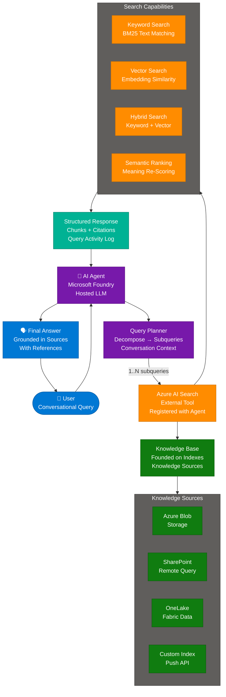
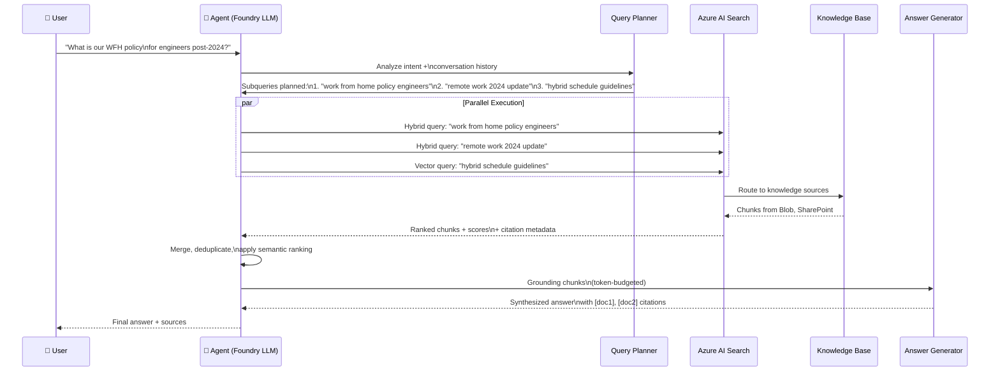
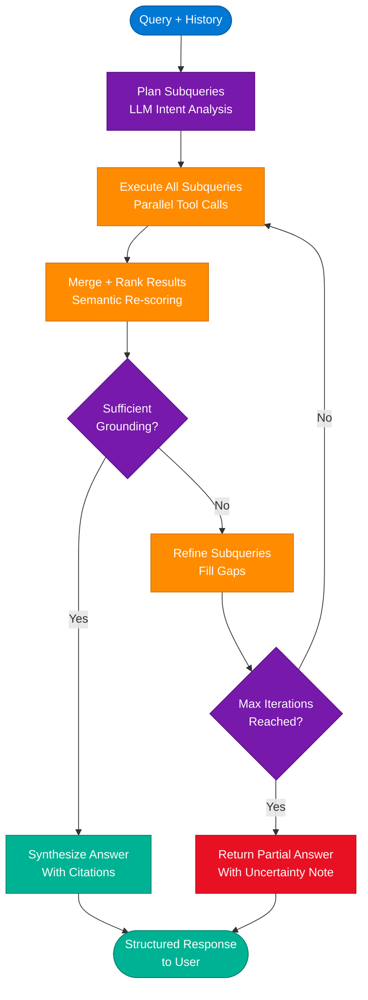
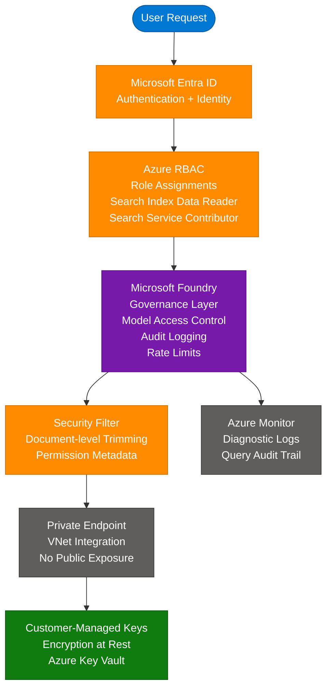

# Agentic Search with Azure AI Search, .NET, and Microsoft Foundry

> **Sources:** [Microsoft Foundry Discussion #254](https://github.com/orgs/microsoft-foundry/discussions/254), [Azure AI Search RAG Overview](https://learn.microsoft.com/en-us/azure/search/retrieval-augmented-generation-overview)
> **Author:** Talles Valiatti (Series Part 3)
> **Last Updated:** July 2026

---

## Table of Contents

1. [What is Agentic Search?](#1-what-is-agentic-search)
2. [Core Architecture](#2-core-architecture)
3. [Key Components and Services](#3-key-components-and-services)
4. [How It Works — Technical Deep Dive](#4-how-it-works--technical-deep-dive)
5. [Classic RAG vs Agentic Retrieval Comparison](#5-classic-rag-vs-agentic-retrieval-comparison)
6. [Content and Data Preparation](#6-content-and-data-preparation)
7. [Security and Governance](#7-security-and-governance)
8. [Getting Started with C# / .NET](#8-getting-started-with-c--net)
9. [Interview Q&A Cheatsheet](#9-interview-qa-cheatsheet)

---

## 1. What is Agentic Search?

Agentic Search is the evolution of traditional Retrieval-Augmented Generation (RAG) where an AI agent — rather than static application code — orchestrates the entire search, reasoning, and decision-making lifecycle. Instead of issuing a single query and returning results, an agent dynamically decides **how, when, and how many times** to query Azure AI Search, treating it as an external tool it can invoke repeatedly until sufficient context is gathered to answer the user's question.

In the context of the Microsoft Foundry + Azure AI Search + .NET stack, agentic search means:

- **Microsoft Foundry** hosts and governs the LLM that acts as the orchestrating brain
- **Azure AI Search** acts as the external search tool the agent calls
- **.NET (C# SDK)** binds the two together via `Azure.Search.Documents` and Microsoft Foundry SDKs

The result is a retrieval system that can decompose complex conversational queries into focused subqueries, execute them in parallel, rank and synthesize results, and provide structured responses with citations — all autonomously.

### Key Value Propositions

| Feature | Description |
|---|---|
| **LLM-driven query planning** | The agent analyzes user intent and generates multiple targeted subqueries automatically |
| **Parallel subquery execution** | Multiple queries run concurrently instead of sequentially, reducing latency |
| **Multi-source knowledge** | Unified query across SharePoint, Blob Storage, databases, and indexed content |
| **Structured responses with citations** | Responses include grounding data, source references, and query activity logs |
| **Conversation context awareness** | Uses dialogue history to resolve ambiguous pronouns and implicit references |
| **Adjustable reasoning effort** | Balance accuracy vs. latency: `minimal` / `low` / `medium` reasoning effort levels |
| **Observable orchestration** | Agent logic is explicit and auditable — not a black box |
| **Foundry IQ integration** | Single knowledge layer endpoint for all agents in the Microsoft Foundry portal |

---

## 2. Core Architecture



### Architecture Pillars

**Pillar 1: Agent Orchestration (Microsoft Foundry)**
- **Foundry-hosted model**: LLM running with enterprise governance (RBAC, audit logging, rate limits)
- **Tool registration**: Azure AI Search registered as a callable tool in the agent's tool manifest
- **Decision loop**: Agent invokes search tool iteratively until stopping criteria are met (confidence threshold, max iterations)
- **Prompt management**: Structured system prompts define agent responsibilities and search decision rules

**Pillar 2: Intelligent Query Planning**
- **Intent decomposition**: Complex questions like "What's our PTO policy for remote workers hired after 2023?" → multiple targeted subqueries
- **Context injection**: Prior conversation turns injected as context so the LLM resolves pronouns ("it", "that policy")
- **Subquery types**: Keyword queries, vector queries, hybrid queries — chosen per subquery based on nature of the fragment

**Pillar 3: Azure AI Search as External Tool**
- **Tool contract**: Agent receives a search function signature, calls it with `query`, `searchType`, `top`, `filter` parameters
- **Result schema**: Returns JSON with `value[]` (chunks), `@search.score`, `@search.rerankerScore`, citation metadata
- **Transparency**: `queryActivityLog` field shows exactly what was searched and why

**Pillar 4: Structured Response Assembly**
- Relevant chunks from parallel subqueries merged and deduplicated
- Semantic re-ranking applied across merged result set
- Grounding payload sent to LLM with token-budget awareness
- Final answer formulated with inline citations `[doc1]`, `[doc2]`

---

## 3. Key Components and Services

| Component | Azure Service | Role |
|---|---|---|
| **AI Agent Runtime** | Microsoft Foundry (AI Foundry portal) | Hosts LLM, manages tool calls, enforces governance |
| **Foundry IQ** | Managed knowledge layer in Foundry | Single endpoint exposing knowledge base to all agents |
| **Search Index** | Azure AI Search | Stores chunked + vectorized content; serves queries |
| **Knowledge Base** | Azure AI Search (preview) | Logical container over one or more knowledge sources |
| **Knowledge Source** | Azure AI Search (preview) | Connector to Blob, SharePoint, OneLake, or custom push |
| **Vectorizer** | Azure OpenAI / Azure AI Vision in Foundry | Converts text/images to embeddings at index and query time |
| **Semantic Ranker** | Azure AI Search built-in | Scores results by semantic meaning using a cross-encoder model |
| **Orchestration SDK** | .NET `Azure.AI.Projects` / `Azure.Search.Documents` | Binds agent ↔ search; manages auth, retries, paging |
| **Embedding Model** | Azure OpenAI `text-embedding-ada-002` or `text-embedding-3-*` | Generates vector representations of chunks and queries |
| **Chunking Pipeline** | Azure AI Search skillsets or built-in | Splits large docs into 512–2048 token chunks with overlap |

### Search Capability Matrix

| Search Type | Algorithm | Best For | Limitation |
|---|---|---|---|
| **Keyword (BM25)** | Term frequency + inverse document frequency | Exact terminology, IDs, product codes | Fails on synonym/paraphrase |
| **Vector** | Approximate Nearest Neighbor (HNSW) | Semantic similarity, multilingual | Misses exact keyword matches |
| **Hybrid** | RRF fusion of BM25 + vector | Most queries — combines recall types | Slightly higher latency |
| **Semantic Ranking** | Cross-encoder re-ranking over top-50 | Re-ordering for relevance over initial recall | Not a retrieval method; post-processing only |
| **Agentic Retrieval** | LLM plans N subqueries → parallel hybrid → semantic | Complex conversational queries, multi-hop reasoning | Requires Foundry or LLM + preview features |

---

## 4. How It Works — Technical Deep Dive

### Agentic Retrieval Pipeline



### Step-by-Step Execution

1. **User query arrives** — The agent receives the natural language query along with conversation history (last N turns).

2. **Query planning** — The LLM (hosted in Microsoft Foundry) reads the query, extracts intent, and decomposes it into 1–5 targeted subqueries. Each subquery has an assigned search type (keyword, vector, or hybrid) based on the nature of the fragment.

3. **Parallel tool invocation** — All subqueries are dispatched concurrently to Azure AI Search via the registered tool. No sequential waterfall.

4. **Knowledge source routing** — Azure AI Search routes each query across indexed content (Blob, OneLake) and remote sources (SharePoint, Bing) based on knowledge source configuration.

5. **Per-subquery ranking** — Each result set undergoes BM25 scoring, vector similarity scoring, and optional semantic re-ranking. Results include `@search.score` (BM25) and `@search.rerankerScore` (semantic).

6. **Merge and deduplicate** — The agent merges all result sets, removes duplicate chunks (same document ID), and applies a final relevance threshold filter.

7. **Token budget enforcement** — The grounding payload is trimmed to fit within the LLM's context window, prioritizing highest-scoring chunks.

8. **Answer synthesis** — The LLM formulates a final answer grounded in the provided chunks. Citations (`[1]`, `[2]`) map to the source documents.

9. **Stopping criteria check** — Agent evaluates whether the answer is complete. If not (confidence below threshold or explicit "I don't know"), it re-queries with refined subqueries (max 3 iterations).

### Agent Decision Loop



---

## 5. Classic RAG vs Agentic Retrieval Comparison

| Dimension | Classic RAG | Agentic Retrieval |
|---|---|---|
| **Query strategy** | Single query per user turn | LLM plans 1–5 subqueries per turn |
| **Query execution** | Sequential, single call | Parallel, concurrent calls |
| **Query type** | Hybrid (keyword + vector) | Hybrid per subquery, per intent fragment |
| **Orchestration** | Application code hardcoded | LLM-driven, dynamic |
| **Conversation context** | Manual injection | Native awareness via history parameter |
| **Multi-source access** | Indexers pull from data sources | Knowledge sources + remote SharePoint/Bing |
| **Response format** | Flat JSON result array | Structured with citations + query activity log |
| **Semantic ranking** | Optional, one call | Built-in, applied per merged result set |
| **Latency** | Lower (single call, ~50–200ms) | Higher (LLM planning + parallel calls, ~1–3s) |
| **Complexity** | Lower — fewer components | Higher — requires Foundry/LLM + preview features |
| **Token cost** | Lower (no planning LLM call) | Higher (planning + synthesis LLM calls) |
| **Best for** | Simple factual lookup, existing GA deployments | Complex conversational queries, multi-hop reasoning |
| **GA status** | Generally Available | Preview (as of 2025–2026) |
| **Foundry IQ** | Not integrated | Native endpoint |
| **C# SDK** | `SearchClient.Search<T>()` | `KnowledgeBase.RetrieveAsync()` + agent loop |

**Use Agentic Retrieval when:**
- Building a new chatbot or copilot where accuracy matters more than raw speed
- Queries are conversational, ambiguous, or require multi-hop reasoning
- You need citations and grounding provenance for compliance
- Your knowledge spans multiple sources (SharePoint, Blob, OneLake)

**Use Classic RAG when:**
- Migrating an existing solution — classic RAG is proven and GA
- You need sub-200ms response times and control all query logic
- Simple factual lookups where a single focused query suffices
- Your team needs fine-grained control over ranking and scoring

---

## 6. Content and Data Preparation

### Chunking Strategy

| Document Type | Recommended Chunk Size | Overlap | Reason |
|---|---|---|---|
| Policy documents / HR | 512 tokens | 10% | Preserve complete policy statements |
| Technical docs / READMEs | 1024 tokens | 15% | Allow context around code blocks |
| Legal contracts | 256 tokens | 5% | Precise clause retrieval |
| FAQ pages | Per Q&A pair | None | Each Q&A is a self-contained unit |
| Product pages | 512 tokens | 20% | High sentence boundary variation |

### Content Preparation Pipeline

| Challenge | How Azure AI Search Helps |
|---|---|
| **Large documents** | Auto-chunking via built-in skillset or custom Text Split skill |
| **Multiple languages** | 50+ language analyzers; multilingual vector models |
| **Images and PDFs** | OCR skill, image verbalization, document extraction |
| **Semantic similarity need** | Integrated vectorization (Azure OpenAI, custom endpoint) |
| **Terminology mismatches** | Synonym maps, custom analyzers, semantic ranking |
| **Stale content** | Incremental indexing — change detection on Blob, SharePoint |

### Vectorization Options

```
Azure OpenAI text-embedding-ada-002    → 1536 dimensions, mature, cost-effective
Azure OpenAI text-embedding-3-small    → 1536 dims, better quality, newer
Azure OpenAI text-embedding-3-large    → 3072 dims, best quality, higher cost
Azure AI Vision (multimodal)           → Image + text in unified vector space
Custom endpoint (ONNX, HuggingFace)   → Bring-your-own model for specialized domains
```

---

## 7. Security and Governance

### Security Architecture



### Responsible AI Controls

| Control | Description |
|---|---|
| **Content filtering** | Azure AI Foundry content filters block harmful prompts/responses |
| **Grounding enforcement** | Agent instructed via system prompt to only answer from retrieved context |
| **Citation requirement** | Responses must include source references — prevents hallucination |
| **Confidence threshold** | Agent withholds answer if retrieved grounding confidence is below threshold |
| **Iteration limit** | Max 3 query refinement loops — prevents runaway agent behavior |

### Data Security

- **Document-level security trimming**: Filter parameters encode user identity → only authorized documents returned
- **SharePoint remote queries**: Inherit SharePoint permissions natively — no data copying required
- **Indexed Blob/OneLake content**: Entra ID permission metadata stored at index time → enforced at query time
- **Transport**: All API calls TLS 1.2+; management plane via Azure Resource Manager
- **Customer-Managed Keys (CMK)**: Index data encrypted at rest with keys in Azure Key Vault
- **Private endpoints**: Search service and Foundry accessible only from within VNet — no public internet exposure

### Compliance

- Azure AI Search is SOC 2, ISO 27001, HIPAA BAA, FedRAMP High compliant
- Microsoft Foundry inherits Azure compliance certifications
- GDPR: PII redaction skill available in skillsets; field-level filtering controls PII exposure to LLM

---

## 8. Getting Started with C# / .NET

### Prerequisites

```bash
# Azure resources needed
az group create --name rg-agentic-search --location eastus
az search service create --name my-search-svc --resource-group rg-agentic-search \
    --sku standard --partition-count 1 --replica-count 1
# Microsoft Foundry project via Azure AI Foundry portal (ai.azure.com)
```

### NuGet Packages

```bash
dotnet add package Azure.Search.Documents
dotnet add package Azure.AI.Projects        # Microsoft Foundry SDK
dotnet add package Azure.Identity
dotnet add package Azure.AI.OpenAI          # for vectorization
```

### Option 1 — Classic RAG (Hybrid Search in C#)

```csharp
using Azure;
using Azure.Search.Documents;
using Azure.Search.Documents.Models;
using Azure.Identity;

var searchEndpoint = new Uri("https://<your-service>.search.windows.net");
var credential = new DefaultAzureCredential();
var searchClient = new SearchClient(searchEndpoint, "my-index", credential);

// Hybrid search: keyword + vector
var userQuery = "WFH policy for engineers hired after 2024";
var queryEmbedding = await GetEmbeddingAsync(userQuery); // call Azure OpenAI

var options = new SearchOptions
{
    QueryType = SearchQueryType.Semantic,
    SemanticSearch = new SemanticSearchOptions
    {
        SemanticConfigurationName = "my-semantic-config",
        QueryCaption = new QueryCaption(QueryCaptionType.Extractive),
        QueryAnswer = new QueryAnswer(QueryAnswerType.Extractive)
    },
    VectorSearch = new VectorSearchOptions
    {
        Queries =
        {
            new VectorizedQuery(queryEmbedding)
            {
                KNearestNeighborsCount = 50,
                Fields = { "contentVector" }
            }
        }
    },
    Size = 5,
    Select = { "content", "sourcefile", "title" }
};

SearchResults<SearchDocument> results = 
    await searchClient.SearchAsync<SearchDocument>(userQuery, options);

await foreach (SearchResult<SearchDocument> result in results.GetResultsAsync())
{
    Console.WriteLine($"Score: {result.Score}  |  File: {result.Document["sourcefile"]}");
    Console.WriteLine(result.Document["content"]);
}
```

### Option 2 — Agentic Search with Microsoft Foundry

```csharp
using Azure.AI.Projects;
using Azure.Identity;

// Initialize Foundry project client
var projectEndpoint = new Uri("https://<foundry-endpoint>.services.ai.azure.com/api/projects/<project-id>");
var client = new AIProjectClient(projectEndpoint, new DefaultAzureCredential());

// Create an agent with Azure AI Search tool
var agentsClient = client.GetAgentsClient();

// Define the Azure AI Search connection tool
var searchTool = new AzureAISearchToolDefinition(); // registers search as callable tool

var agent = await agentsClient.CreateAgentAsync(
    model: "gpt-4o",
    name: "Agentic Search Agent",
    instructions: """
        You are an enterprise knowledge assistant. Use the Azure AI Search tool to find 
        answers. Always cite your sources. If you cannot find sufficient information 
        after 3 search attempts, acknowledge the limitation clearly.
        Treat Azure AI Search as an external tool — never answer from memory alone.
        """,
    tools: new List<ToolDefinition> { searchTool }
);

// Create a thread and run the agent
var thread = await agentsClient.CreateThreadAsync();
await agentsClient.CreateMessageAsync(
    thread.Value.Id,
    MessageRole.User,
    "What is our WFH policy for engineers hired after 2024?"
);

var run = await agentsClient.CreateRunAsync(thread.Value.Id, agent.Value.Id);

// Poll until complete
do
{
    await Task.Delay(1000);
    run = await agentsClient.GetRunAsync(thread.Value.Id, run.Value.Id);
} while (run.Value.Status == RunStatus.Queued || run.Value.Status == RunStatus.InProgress);

// Retrieve messages
var messages = agentsClient.GetMessagesAsync(thread.Value.Id);
await foreach (var message in messages)
{
    if (message.Role == MessageRole.Assistant)
    {
        foreach (var content in message.ContentItems)
        {
            if (content is MessageTextContent textContent)
                Console.WriteLine(textContent.Text);
        }
    }
}
```

### Option 3 — Agentic Retrieval via Knowledge Base API

```csharp
// Using the new Knowledge Base API (agentic retrieval preview)
using Azure.Search.Documents.Agents;  // preview namespace

var knowledgeBaseClient = new KnowledgeBaseClient(
    new Uri("https://<search-service>.search.windows.net"),
    "my-knowledge-base",
    new DefaultAzureCredential()
);

var retrieveOptions = new RetrieveOptions
{
    ReasoningEffort = ReasoningEffort.Medium,  // minimal / low / medium
    Messages = new List<ConversationMessage>
    {
        new ConversationMessage(MessageRole.User, "What is our PTO policy?"),
        new ConversationMessage(MessageRole.Assistant, "Our PTO policy allows..."),
        new ConversationMessage(MessageRole.User, "Does it apply to contractors too?")
    }
};

RetrieveResult result = await knowledgeBaseClient.RetrieveAsync(retrieveOptions);

foreach (var reference in result.References)
{
    Console.WriteLine($"Source: {reference.SourceId}");
    Console.WriteLine($"Content: {reference.Content}");
}

Console.WriteLine($"\nQuery Activity: {result.QueryActivityLog}");
```

### Learning Resources

| Type | Resource |
|---|---|
| **Docs** | [Azure AI Search RAG Overview](https://learn.microsoft.com/en-us/azure/search/retrieval-augmented-generation-overview) |
| **Docs** | [Agentic Retrieval Quickstart](https://learn.microsoft.com/en-us/azure/search/search-get-started-agentic-retrieval) |
| **Docs** | [Foundry IQ — Knowledge Layer for Agents](https://learn.microsoft.com/en-us/azure/foundry/agents/concepts/what-is-foundry-iq) |
| **Video** | [Foundry IQ: Future of RAG with Azure AI Search](https://www.youtube.com/watch?v=slDdNIQCJBQ) |
| **Video** | [Build Agents with Knowledge and Agentic RAG](https://www.youtube.com/watch?v=lW47o2ss3Yg) |
| **Code** | [RAG Chat App — Python + Azure Search (updated for agentic)](https://github.com/Azure-Samples/azure-search-openai-demo) |
| **Code** | [Classic RAG — .NET, Python, Java, JS](https://github.com/Azure-Samples/azure-search-classic-rag) |
| **Code** | [Azure Search Vector Samples](https://github.com/Azure/azure-search-vector-samples) |
| **Template** | [Enterprise Chat App — .NET](https://aka.ms/azai/net) |
| **Series** | [Original Discussion — Microsoft Foundry #254](https://github.com/orgs/microsoft-foundry/discussions/254) |

---

## 9. Interview Q&A Cheatsheet

**Q: What is the fundamental difference between Classic RAG and Agentic Retrieval in Azure AI Search?**
> Classic RAG executes a single hybrid search query per user turn and returns a flat result set that application code stitches together with an LLM separately. Agentic Retrieval hands query planning over to the LLM itself — it decomposes the user's intent into 1–5 targeted subqueries, executes them in parallel, merges and semantically re-ranks the results, and returns a structured response with citations and a query activity log. The key shift is from hardcoded orchestration to LLM-driven orchestration.

---

**Q: Why treat Azure AI Search as an "external tool" for the agent rather than embedding the search logic inside the agent's instructions?**
> Treating Azure AI Search as a registered tool in the agent's tool manifest creates a clear, auditable interface: the agent can call search with explicit parameters (`query`, `searchType`, `top`, `filter`) and receive structured JSON back. This makes agent behavior observable and testable — you can inspect exactly what was searched and why via the `queryActivityLog`. Embedding search logic in the instructions would make it opaque and harder to debug or update the retrieval strategy independently of the agent's reasoning behavior.

---

**Q: What is Foundry IQ and how does it relate to Azure AI Search?**
> Foundry IQ is the managed knowledge layer in Microsoft Foundry (Azure AI Foundry portal) that exposes Azure AI Search knowledge bases as a single endpoint for all agents. Instead of each agent independently configuring search connections, Foundry IQ provides a unified, permission-aware knowledge access point. Under the hood it uses agentic retrieval from Azure AI Search, so it inherits LLM-driven query planning, parallel execution, semantic ranking, and citation tracking — but abstracts the wiring away from individual agent implementations.

---

**Q: How does Azure AI Search handle security in a multi-tenant RAG scenario where different users should see different documents?**
> Azure AI Search enforces document-level security at query time using filter parameters that encode the user's identity or group membership. When indexing, permission metadata (from Azure Storage Entra ID permissions or SharePoint access control lists) is stored alongside document content. At query time, a security filter is appended that limits results to documents the requesting user is authorized to access. For SharePoint remote queries, permissions are inherited natively without data copying. This means a single shared index can serve multiple users with different authorization levels safely.

---

**Q: Explain the role of Semantic Ranking in the Agentic Retrieval pipeline. Is it a retrieval method?**
> Semantic Ranking is a **re-ranking** step, not a retrieval method. After Azure AI Search retrieves the initial candidate set (up to 50 results) via BM25 keyword matching and/or vector ANN search, a cross-encoder model re-scores each result by comparing the full query and document passage together — rather than just matching embedding proximity. In the agentic retrieval pipeline, semantic ranking is built-in and applied automatically across the merged result set from all parallel subqueries, giving it more candidates to work with than a single-query classic RAG approach.

---

**Q: How does the agent decide when to stop querying and formulate an answer?**
> The agent applies stopping criteria defined in the system prompt: (1) a confidence threshold — if the retrieved chunks clearly answer the question, it proceeds to synthesis; (2) a maximum iteration count — typically 3 refinement rounds; (3) a coverage check — if all major intent fragments from the decomposed subqueries have matching results. If none are satisfied, the agent returns a partial answer with an explicit uncertainty acknowledgment. Implementing explicit stopping criteria in the system prompt is a critical production practice — without it, agents can loop indefinitely.

---

**Q: What are the tradeoffs between `minimal`, `low`, and `medium` reasoning effort in Agentic Retrieval?**
> The `reasoningEffort` parameter controls how much LLM compute is applied to query planning. `minimal` generates 1–2 subqueries with simple decomposition — fastest and cheapest but may miss nuance. `low` generates 2–3 subqueries with basic intent decomposition. `medium` generates up to 5 subqueries with full intent analysis including conversation context disambiguation — highest quality but most tokens consumed and highest latency. For production chatbots, `low` is a good default; use `medium` for document-heavy or compliance-critical scenarios where retrieval accuracy is paramount.

---

**Q: In the C# .NET stack, which SDK packages are needed and what does each handle?**
> Four packages cover the full stack: `Azure.Search.Documents` handles all Azure AI Search interactions — classic search, vector queries, index management; `Azure.AI.Projects` is the Microsoft Foundry SDK that manages agent lifecycle, thread management, tool registration, and run polling; `Azure.AI.OpenAI` provides the vectorization client for generating embeddings (used for indexing and at query time); and `Azure.Identity` provides `DefaultAzureCredential` which automatically selects the right auth mechanism (managed identity in production, developer token locally) without hardcoding credentials.

---

*Sources: [Microsoft Foundry Discussion #254](https://github.com/orgs/microsoft-foundry/discussions/254) by Talles Valiatti | [Azure AI Search RAG & Agentic Retrieval Docs](https://learn.microsoft.com/en-us/azure/search/retrieval-augmented-generation-overview) | Domain knowledge synthesis | Last Updated: July 2026*
