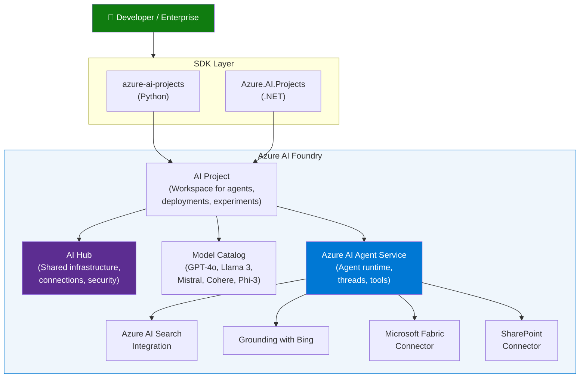
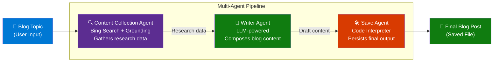
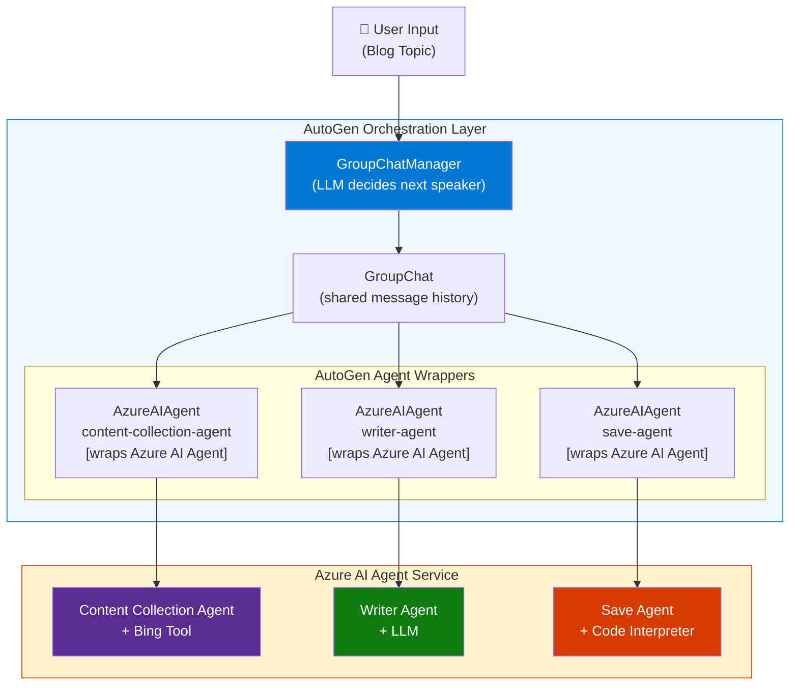
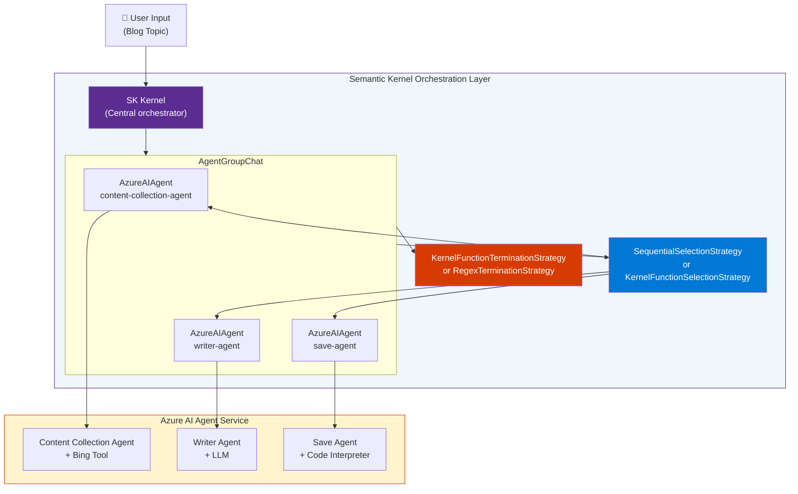
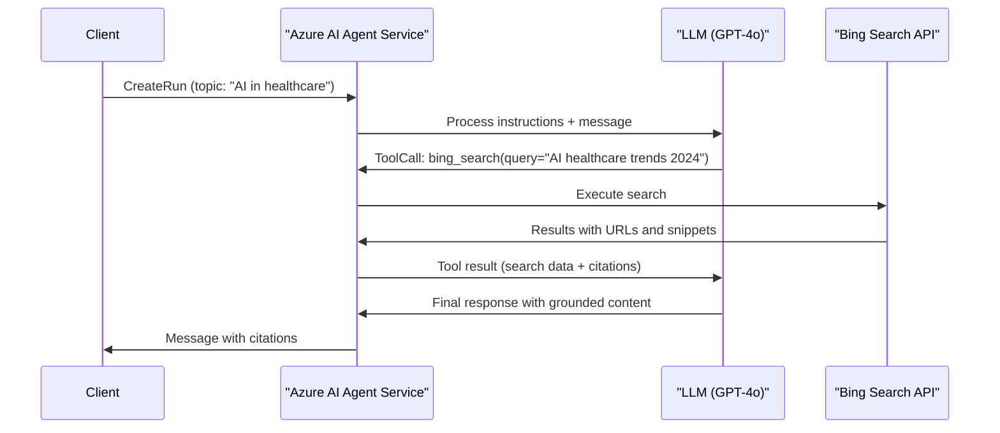
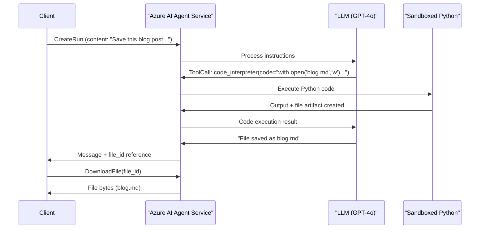
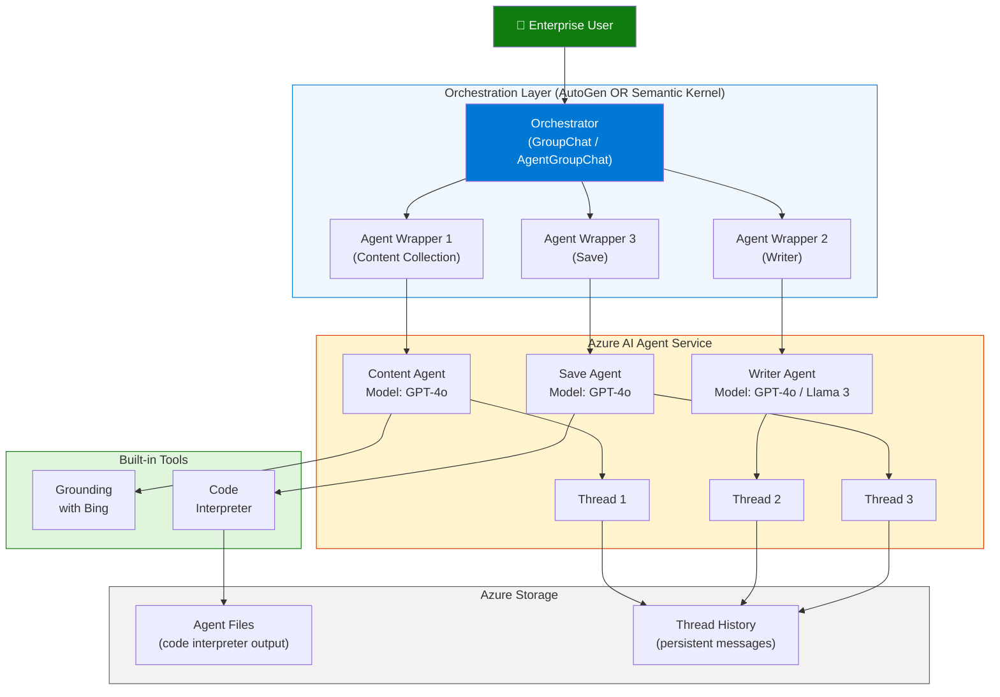

# Azure AI Agent Service with AutoGen & Semantic Kernel — Multi-Agent Solution

> **Source:** [Microsoft Tech Community — Educator Developer Blog](https://techcommunity.microsoft.com/blog/educatordeveloperblog/using-azure-ai-agent-service-with-autogen--semantic-kernel-to-build-a-multi-agen/4363121)
> **Published:** January 7, 2025 (Updated)
> **Topic:** Azure AI Agent Service, AutoGen, Semantic Kernel, Multi-Agent Orchestration
> **Key Claim:** Enterprises can orchestrate multiple Azure AI Agents using AutoGen or Semantic Kernel to automate complex multi-step workflows end-to-end.

---

## Table of Contents

1. [Overview](#1-overview)
2. [What is Azure AI Agent Service?](#2-what-is-azure-ai-agent-service)
3. [Azure AI Agent Service vs Azure OpenAI Assistants API](#3-azure-ai-agent-service-vs-azure-openai-assistants-api)
4. [Azure AI Foundry — The Platform](#4-azure-ai-foundry--the-platform)
5. [Getting Started — SDK Setup](#5-getting-started--sdk-setup)
6. [Use Case: Blog Writing Multi-Agent System](#6-use-case-blog-writing-multi-agent-system)
7. [Single Agent Definitions](#7-single-agent-definitions)
8. [Multi-Agent Orchestration with AutoGen](#8-multi-agent-orchestration-with-autogen)
9. [Multi-Agent Orchestration with Semantic Kernel](#9-multi-agent-orchestration-with-semantic-kernel)
10. [AutoGen vs Semantic Kernel — Comparison](#10-autogen-vs-semantic-kernel--comparison)
11. [Agent Tools Deep Dive](#11-agent-tools-deep-dive)
12. [Architecture Diagrams](#12-architecture-diagrams)
13. [Code Examples](#13-code-examples)
14. [Best Practices](#14-best-practices)
15. [Interview Talking Points](#15-interview-talking-points)
16. [Learning Resources](#16-learning-resources)

---

## 1. Overview

At **Microsoft Ignite 2024**, Microsoft released **Azure AI Agent Service** as a Public Preview capability within **Azure AI Foundry**. This service allows enterprises to build production-grade AI agents backed by flexible LLM models (GPT-4o, Llama 3, Mistral, Cohere), enterprise data connectors (SharePoint, Fabric, Bing, AI Search), and enterprise-grade security with managed data storage.

The key challenge this solves: individual agents are useful, but real business workflows require **multiple specialized agents collaborating** — one searching the web, another generating content, another saving the output. Azure AI Agent Service provides the single-agent building block; **AutoGen** and **Semantic Kernel** provide the multi-agent orchestration layer on top.

The blog post demonstrates this with a practical **blog writing scenario**: a Content Collection agent finds research, a Writer agent composes the blog, and a Save agent persists the output — all orchestrated automatically.

---

## 2. What is Azure AI Agent Service?

### Definition

Azure AI Agent Service is a **fully managed, serverless agent runtime** hosted within Azure AI Foundry. It provides:

- **Persistent threads**: Conversation history is stored server-side (no need to send full context each call)
- **Built-in tools**: Code interpreter, File search, Grounding with Bing, Function calling, Azure AI Search, Microsoft Fabric, SharePoint
- **Flexible models**: Not locked to OpenAI — supports Llama 3, Mistral, Cohere via model catalog
- **Enterprise security**: Data stays within your Azure tenant (no OpenAI-side storage)
- **Managed infrastructure**: No need to provision compute, manage threads, or handle tool execution yourself

### Core Concepts

| Concept | Description |
|---|---|
| **Agent** | A configured AI entity with a model, instructions, and tools attached |
| **Thread** | A persistent conversation session that stores message history server-side |
| **Message** | A single turn in a thread (user message or assistant response) |
| **Run** | The execution of an agent against a thread (processes messages, calls tools) |
| **Tool** | A capability the agent can invoke during a Run (code interpreter, Bing, functions) |
| **File** | Uploaded content the agent can read/search during execution |
| **Vector Store** | An indexed file collection enabling semantic search within the agent |

### How a Run Works (internally)

```
1. User adds a Message to a Thread
2. Client calls CreateRun (attaches agent to thread)
3. Agent service receives instructions + thread history
4. LLM decides: respond directly OR call a tool
5. If tool call: agent executes tool, appends result to thread
6. LLM generates final response from tool output
7. Run completes → client reads response from thread
```

---

## 3. Azure AI Agent Service vs Azure OpenAI Assistants API

Both services use the same conceptual model (Agents, Threads, Runs, Tools), but they differ in critical enterprise dimensions:

| Dimension | Azure OpenAI Assistants API | Azure AI Agent Service |
|---|---|---|
| **LLM Models** | OpenAI models only (GPT-4o, GPT-4 Turbo) | GPT-4o + Llama 3.1-70B, Mistral-large, Cohere R+ |
| **Data Storage** | Stored in OpenAI's infrastructure | Stored in your Azure Storage Account |
| **Enterprise Connectors** | Limited (code interpreter, file search) | Bing, SharePoint, Microsoft Fabric, Azure AI Search |
| **Security** | OpenAI data residency policies | Azure RBAC, Private Endpoints, Customer-Managed Keys |
| **Compliance** | OpenAI compliance certifications | Azure compliance (ISO, SOC2, HIPAA, FedRAMP) |
| **Pricing Model** | Token-based (OpenAI pricing) | Azure consumption pricing |
| **Orchestration** | Manual / Assistants API only | Native AutoGen + Semantic Kernel integration |
| **Deployment Region** | OpenAI's data centers | Your chosen Azure region |
| **Private Network** | Not supported | Supported via VNet integration |

> **Key Insight:** For enterprises with strict data sovereignty, compliance requirements, or need for open-source LLMs, Azure AI Agent Service is the production-ready path. Azure OpenAI Assistants API is better for rapid prototyping with GPT models only.

---

## 4. Azure AI Foundry — The Platform

Azure AI Agent Service lives inside **Azure AI Foundry** (previously Azure AI Studio). Understanding the platform is essential.

### Azure AI Foundry Architecture



### Supported Models in Azure AI Foundry Model Catalog

| Model | Provider | Use Case |
|---|---|---|
| GPT-4o | OpenAI | General purpose, multimodal |
| GPT-4 Turbo | OpenAI | Long context, complex reasoning |
| Llama 3.1-70B-Instruct | Meta | Open source, cost-effective |
| Mistral-large-2407 | Mistral AI | Multilingual, instruction following |
| Cohere Command R+ | Cohere | RAG-optimized, enterprise search |
| Phi-3-mini | Microsoft | Edge/lightweight scenarios |

### Supported Regions (Public Preview)

Azure AI Agent Service in Public Preview is available in specific Azure regions. Always check the latest Azure documentation for current region availability, as this expands over time. Typical early regions include East US, West US, West Europe, and North Europe.

---

## 5. Getting Started — SDK Setup

### Prerequisites

1. Azure subscription with Azure AI Foundry Hub + Project created
2. Azure AI Agent Service enabled in your project
3. A model deployed (GPT-4o recommended for getting started)
4. Python 3.8+ or .NET 8+

### Recommended: Use the Azure Quickstart Template

Deploy the full infrastructure (Hub, Project, Storage, AI Services) using the official ARM template:

```
https://portal.azure.com/#create/Microsoft.Template/uri/https%3A%2F%2Fraw.githubusercontent.com%2FAzure%2Fazure-quickstart-templates%2Frefs%2Fheads%2Fmaster%2Fquickstarts%2Fmicrosoft.azure-ai-agent-service%2Fstandard-agent%2Fazuredeploy.json
```

This template provisions:
- Azure AI Hub
- Azure AI Project
- Azure Storage Account (for thread/file storage)
- Azure AI Services resource
- Managed identity + RBAC assignments

### Python SDK Installation

```bash
pip install azure-ai-projects
pip install azure-identity
```

### .NET SDK Installation

```bash
dotnet add package Azure.AI.Projects --version 1.0.0-beta.1
```

### Authentication Setup (Python)

```python
from azure.ai.projects import AIProjectClient
from azure.identity import DefaultAzureCredential

# Use DefaultAzureCredential for managed identity / local dev
client = AIProjectClient.from_connection_string(
    credential=DefaultAzureCredential(),
    conn_str="<your-project-connection-string>"  # From AI Foundry portal
)
```

### Connection String

Find your project connection string in Azure AI Foundry portal:
`Settings → Project details → Connection string`

Format: `<region>.api.azureml.ms;<subscription-id>;<resource-group>;<project-name>`

---

## 6. Use Case: Blog Writing Multi-Agent System

The blog demonstrates a **3-agent pipeline** for automated blog post creation:



### Why This Pattern?

Each agent has a **single responsibility** (SRP applied to AI agents):
- **Content Collection**: Specializes in web search/retrieval — doesn't write, just gathers
- **Writer**: Specializes in synthesis/composition — doesn't search or save, just writes
- **Save**: Specializes in persistence — doesn't write content, just handles I/O

This separation makes each agent easier to test, replace, and scale independently.

---

## 7. Single Agent Definitions

### 🔍 Content Collection Agent

**Purpose:** Search the web for content related to a given blog outline/topic, returning structured research data.

**Tool used:** [Grounding with Bing](https://learn.microsoft.com/en-us/azure/ai-services/agents/how-to/tools/bing-grounding) — a built-in Azure AI Agent Service tool that connects the agent to real-time Bing search results.

**How Grounding with Bing works:**
1. Agent receives a topic/outline
2. Agent service sends search query to Bing Search API (managed by Azure)
3. Bing returns ranked web results with citations
4. LLM synthesizes the search results into structured content
5. Response includes source citations for verification

**Why Grounding with Bing vs raw Bing API?**
- No API key management — connection managed by Azure AI Agent Service
- Citations automatically included in response
- Search results are grounded to the model's response (reduces hallucination)
- Respects Bing's SafeSearch and content policies

**Sample notebooks:**
- Python: `github.com/kinfey/MultiAIAgent/blob/main/03.AzureAIAgentWithAutoGen01.ipynb`
- C#: `github.com/kinfey/MultiAIAgent/blob/main/08.AzureAIAgentWithSK01.ipynb`

**Defining the Content Collection Agent (Python):**

```python
from azure.ai.projects.models import BingGroundingTool

# Create Bing connection
bing_connection = client.connections.get(connection_name="<bing-connection-name>")
bing_tool = BingGroundingTool(connection_id=bing_connection.id)

# Create the Content Collection Agent
content_agent = client.agents.create_agent(
    model="gpt-4o",
    name="content-collection-agent",
    instructions="""You are a research assistant. Given a blog topic or outline,
    search the web to find relevant, accurate, and recent information.
    Return structured research notes with key facts and source citations.""",
    tools=bing_tool.definitions,
    tool_resources=bing_tool.resources,
)
```

---

### 📖 Writer Agent

**Purpose:** Take the research data from the Content Collection Agent and compose a well-structured, engaging blog post.

**Tool used:** LLM capabilities only — no external tools needed. The Writer Agent's value is in its **instruction tuning** and **prompt engineering**.

**Key design decisions for the Writer Agent:**
- Receives structured research as input (from Content Collection Agent output)
- Has strong writing-style instructions (tone, structure, length)
- Outputs Markdown-formatted content for easy storage and rendering
- Can be given a specific persona (technical blogger, beginner-friendly explainer, etc.)

**Defining the Writer Agent (Python):**

```python
# Create the Writer Agent (no external tools — LLM only)
writer_agent = client.agents.create_agent(
    model="gpt-4o",
    name="writer-agent",
    instructions="""You are a professional technical blog writer. 
    Given research notes, write a comprehensive, engaging blog post with:
    - Clear introduction with a hook
    - Well-structured sections with headings
    - Code examples where appropriate
    - Conclusion with key takeaways
    Format your output in Markdown.""",
)
```

---

### 🛠️ Save Agent

**Purpose:** Take the final blog post content and persist it to a file using the Code Interpreter tool.

**Tool used:** [Code Interpreter](https://learn.microsoft.com/en-us/azure/ai-services/agents/how-to/tools/code-interpreter) — the agent executes Python code in a sandboxed environment to write files.

**How Code Interpreter works:**
1. Agent generates Python code to perform the file operation
2. Code runs in a secure, sandboxed container managed by Azure
3. Output files are stored as agent artifacts (accessible via the Files API)
4. Files can be downloaded by the client application

**Important:** Code Interpreter files are stored within the agent's session context. The client application must explicitly download them using the Files API to persist them outside the agent service.

**Sample notebooks:**
- Python: `github.com/kinfey/MultiAIAgent/blob/main/01.AzureAIAgentCode.ipynb`
- C#: `github.com/kinfey/MultiAIAgent/blob/main/05.AzureAIAgentCodedotNET.ipynb`

**Defining the Save Agent (Python):**

```python
from azure.ai.projects.models import CodeInterpreterTool

code_tool = CodeInterpreterTool()

# Create the Save Agent
save_agent = client.agents.create_agent(
    model="gpt-4o",
    name="save-agent",
    instructions="""You are a file management agent. 
    Given content, save it to a file with an appropriate name.
    Use Python's file I/O to write the content to a .md file.
    Return the filename and confirm the save was successful.""",
    tools=code_tool.definitions,
    tool_resources=code_tool.resources,
)
```

---

## 8. Multi-Agent Orchestration with AutoGen

### What is AutoGen?

[AutoGen](https://microsoft.github.io/autogen/dev/) is Microsoft's open-source framework for building **multi-agent conversational systems**. It enables multiple agents to collaborate through structured conversations, with a human-in-the-loop optional at any step.

AutoGen core concepts:
- **ConversableAgent**: Base class — any agent that can send/receive messages
- **AssistantAgent**: An AI-powered agent (backed by LLM)
- **UserProxyAgent**: Represents a human or executes code on their behalf
- **GroupChat**: Manages multi-agent conversations with turn-taking strategies
- **GroupChatManager**: The LLM-based orchestrator that decides which agent speaks next

### How AutoGen Wraps Azure AI Agent Service

AutoGen integrates with Azure AI Agent Service through **AzureAIAgent** — a specialized AutoGen agent class that wraps an Azure AI Agent Service agent. This allows:
1. Each Azure AI Agent Service agent (with its tools) to become an AutoGen agent
2. AutoGen's GroupChat to orchestrate the conversation between them
3. Tool execution happening within Azure AI Agent Service (managed, secure)
4. AutoGen handling the turn-taking and message routing logic

### AutoGen Multi-Agent Architecture



### AutoGen Orchestration Code Pattern (Python)

```python
import asyncio
from autogen_ext.agents.azure import AzureAIAgent
from autogen_agentchat.agents import AssistantAgent
from autogen_agentchat.teams import RoundRobinGroupChat
from autogen_agentchat.conditions import TextMentionTermination

async def run_blog_pipeline(topic: str):
    # Wrap Azure AI Agent Service agents as AutoGen agents
    content_autogen_agent = AzureAIAgent(
        name="ContentCollectionAgent",
        description="Searches the web for research on a given blog topic",
        project_client=client,
        agent_id=content_agent.id,
    )
    
    writer_autogen_agent = AzureAIAgent(
        name="WriterAgent",
        description="Writes a blog post from research notes",
        project_client=client,
        agent_id=writer_agent.id,
    )
    
    save_autogen_agent = AzureAIAgent(
        name="SaveAgent",
        description="Saves the final blog post content to a file",
        project_client=client,
        agent_id=save_agent.id,
    )
    
    # Define termination condition
    termination = TextMentionTermination("BLOG_SAVED")
    
    # Create a round-robin group chat (sequential execution)
    team = RoundRobinGroupChat(
        participants=[content_autogen_agent, writer_autogen_agent, save_autogen_agent],
        termination_condition=termination
    )
    
    # Run the pipeline
    result = await team.run(task=f"Create a blog post about: {topic}")
    return result

# Execute
asyncio.run(run_blog_pipeline("Azure AI Agent Service Multi-Agent Architecture"))
```

### AutoGen Turn-Taking Strategies

| Strategy | Class | When to Use |
|---|---|---|
| **Round Robin** | `RoundRobinGroupChat` | Sequential pipelines (A → B → C) |
| **Selector** | `SelectorGroupChat` | LLM decides next speaker dynamically |
| **Swarm** | `Swarm` | Each agent hands off to the next explicitly |
| **Magentic-One** | `MagenticOneGroupChat` | Complex planning + execution scenarios |

### Sample Notebook

Full working example: `github.com/kinfey/MultiAIAgent/blob/main/04.AzureAIAgentWithAutoGen02.ipynb`

---

## 9. Multi-Agent Orchestration with Semantic Kernel

### What is Semantic Kernel?

[Semantic Kernel](https://github.com/microsoft/semantic-kernel) is Microsoft's open-source SDK for integrating LLMs into applications. It provides:
- **Kernel**: The central orchestrator that manages plugins, services, and memory
- **Plugin**: A collection of functions the AI can invoke (like tools, but organized)
- **KernelFunction**: A single callable function (Python function or prompt template)
- **Planner**: Automatic plan generation and execution from a high-level goal
- **AgentGroupChat**: Multi-agent conversation management

### How Semantic Kernel Wraps Azure AI Agent Service

Semantic Kernel uses **AzureAIAgent** (SK version) to wrap Azure AI Agent Service agents as SK agents. Orchestration is done via:
- **KernelFunction / Plugin**: Azure AI Agent invocation exposed as an SK function
- **AgentGroupChat**: SK's built-in group chat that manages agent turns
- **SelectionStrategy**: Determines which agent speaks next (sequential, LLM-based, custom)

### Semantic Kernel Multi-Agent Architecture



### Semantic Kernel Orchestration Code Pattern (Python)

```python
from semantic_kernel import Kernel
from semantic_kernel.agents import AzureAIAgent, AgentGroupChat
from semantic_kernel.agents.strategies import SequentialSelectionStrategy, RegexTerminationStrategy

async def run_blog_pipeline_sk(topic: str):
    kernel = Kernel()
    
    # Create SK wrappers around Azure AI Agent Service agents
    sk_content_agent = AzureAIAgent(
        client=client,
        definition=content_agent,  # Azure AI Agent Service agent definition
    )
    
    sk_writer_agent = AzureAIAgent(
        client=client,
        definition=writer_agent,
    )
    
    sk_save_agent = AzureAIAgent(
        client=client,
        definition=save_agent,
    )
    
    # Create group chat with sequential selection
    group_chat = AgentGroupChat(
        agents=[sk_content_agent, sk_writer_agent, sk_save_agent],
        selection_strategy=SequentialSelectionStrategy(),  # Content → Writer → Save
        termination_strategy=RegexTerminationStrategy(
            pattern="BLOG_SAVED",
            agents=[sk_save_agent],
            maximum_iterations=10
        )
    )
    
    # Add the user message and run
    await group_chat.add_chat_message(
        message=f"Create a blog post about: {topic}"
    )
    
    async for response in group_chat.invoke():
        print(f"[{response.name}]: {response.content}")

# .NET version pattern
# var kernel = Kernel.CreateBuilder().Build();
# var contentAgent = await AzureAIAgent.CreateAsync(client, contentAgentDef, kernel);
# var groupChat = new AgentGroupChat(contentAgent, writerAgent, saveAgent);
```

### Sample Notebook

Full working example: `github.com/kinfey/MultiAIAgent/blob/main/09.AzureAIAgentWithSK02.ipynb`

---

## 10. AutoGen vs Semantic Kernel — Comparison

| Dimension | AutoGen | Semantic Kernel |
|---|---|---|
| **Primary Focus** | Multi-agent conversations & coordination | LLM orchestration + plugin ecosystem |
| **Learning Curve** | Moderate — agent-centric mental model | Steeper — kernel, plugins, planners, memory |
| **Multi-Agent API** | `GroupChat`, `RoundRobin`, `Swarm`, `Magentic-One` | `AgentGroupChat` + selection/termination strategies |
| **Planning** | Human-defined turn-taking or LLM-selected | Built-in `FunctionChoiceBehavior`, Stepwise Planner |
| **Plugin/Tool System** | Function calling via agent tools | `KernelPlugin` + `KernelFunction` decorators |
| **Memory** | External (bring your own) | Built-in memory connectors (volatile, Redis, etc.) |
| **Language Support** | Python (primary), .NET (preview) | Python + .NET (equal support) |
| **Best For** | Research, complex agentic workflows | Enterprise app integration, RAG pipelines |
| **Azure AI Agent Integration** | `AzureAIAgent` in `autogen_ext.agents.azure` | `AzureAIAgent` in `semantic_kernel.agents` |
| **Human-in-the-Loop** | Native `UserProxyAgent` support | Via custom termination strategy |
| **Code Execution** | Built-in Docker/local executor | Delegates to Azure AI Agent Code Interpreter |

### When to Choose AutoGen

- You need **dynamic agent-to-agent conversations** (not just sequential pipelines)
- You're building **research agents** that need to explore and backtrack
- You want **human-in-the-loop** at natural checkpoints
- Your team prefers a **conversation-first** mental model

### When to Choose Semantic Kernel

- You're integrating agents into an **existing .NET enterprise application**
- You need rich **plugin ecosystem** (auth, email, calendar, databases)
- You want **automatic planning** from natural language goals
- You're building **RAG pipelines** alongside agents

---

## 11. Agent Tools Deep Dive

### Grounding with Bing



**Setup:**
1. Create a Bing Search resource in Azure
2. Add the Bing connection in Azure AI Foundry (Settings → Connections)
3. Reference the connection name when creating the agent

### Code Interpreter



### Function Calling (Custom Tools)

Function calling allows agents to call your own business logic:

```python
from azure.ai.projects.models import FunctionTool

# Define your custom function
def get_company_data(company_name: str) -> str:
    """Fetch internal company data from CRM"""
    # Your business logic here
    return f"Revenue: $10M, Employees: 500, Founded: 2015"

# Register it as a tool
function_tool = FunctionTool(functions={get_company_data})

agent = client.agents.create_agent(
    model="gpt-4o",
    name="data-agent",
    instructions="Fetch and analyze company data when asked.",
    tools=function_tool.definitions,
)
```

### Azure AI Search Integration

```python
from azure.ai.projects.models import AzureAISearchTool

# Connect to your AI Search index
search_tool = AzureAISearchTool(
    index_connection_id="<ai-search-connection-id>",
    index_name="your-knowledge-base-index"
)

agent = client.agents.create_agent(
    model="gpt-4o",
    name="knowledge-agent",
    instructions="Answer questions using the knowledge base.",
    tools=search_tool.definitions,
    tool_resources=search_tool.resources,
)
```

---

## 12. Architecture Diagrams

### Complete Multi-Agent System Architecture



---

## 13. Code Examples

### Complete Agent Lifecycle (Python)

```python
import time
from azure.ai.projects import AIProjectClient
from azure.identity import DefaultAzureCredential
from azure.ai.projects.models import (
    BingGroundingTool,
    CodeInterpreterTool,
    RunStatus
)

# Initialize client
client = AIProjectClient.from_connection_string(
    credential=DefaultAzureCredential(),
    conn_str="<connection-string>"
)

# ──────────────────────────────────────
# Step 1: Create agents
# ──────────────────────────────────────

# Content Collection Agent
bing_connection = client.connections.get(connection_name="bing-search")
bing_tool = BingGroundingTool(connection_id=bing_connection.id)

content_agent = client.agents.create_agent(
    model="gpt-4o",
    name="content-collection-agent",
    instructions="Search the web and return research for the given blog topic.",
    tools=bing_tool.definitions,
    tool_resources=bing_tool.resources,
)

# Writer Agent
writer_agent = client.agents.create_agent(
    model="gpt-4o",
    name="writer-agent",
    instructions="Write a structured Markdown blog post from the given research.",
)

# Save Agent
code_tool = CodeInterpreterTool()
save_agent = client.agents.create_agent(
    model="gpt-4o",
    name="save-agent",
    instructions="Save the provided blog content to a .md file using Python.",
    tools=code_tool.definitions,
    tool_resources=code_tool.resources,
)

# ──────────────────────────────────────
# Step 2: Run each agent sequentially
# ──────────────────────────────────────

def run_agent(agent, user_message: str) -> str:
    """Create a thread, add a message, run the agent, return the response."""
    thread = client.agents.create_thread()
    
    client.agents.create_message(
        thread_id=thread.id,
        role="user",
        content=user_message
    )
    
    run = client.agents.create_run(
        thread_id=thread.id,
        agent_id=agent.id
    )
    
    # Poll until complete
    while run.status in [RunStatus.QUEUED, RunStatus.IN_PROGRESS, RunStatus.REQUIRES_ACTION]:
        time.sleep(2)
        run = client.agents.get_run(thread_id=thread.id, run_id=run.id)
    
    if run.status == RunStatus.FAILED:
        raise Exception(f"Run failed: {run.last_error}")
    
    # Get the last assistant message
    messages = client.agents.list_messages(thread_id=thread.id)
    for msg in messages.data:
        if msg.role == "assistant":
            return msg.content[0].text.value
    
    return ""

# Execute pipeline
topic = "Building Multi-Agent Systems with Azure AI"

print("Step 1: Collecting research...")
research = run_agent(content_agent, f"Research this blog topic: {topic}")

print("Step 2: Writing blog post...")
blog_content = run_agent(writer_agent, f"Write a blog post using this research:\n{research}")

print("Step 3: Saving blog post...")
save_result = run_agent(save_agent, f"Save this blog post:\n{blog_content}")

print(f"Done! {save_result}")

# ──────────────────────────────────────
# Step 3: Cleanup (optional)
# ──────────────────────────────────────
client.agents.delete_agent(content_agent.id)
client.agents.delete_agent(writer_agent.id)
client.agents.delete_agent(save_agent.id)
```

### .NET Version (C#)

```csharp
using Azure.AI.Projects;
using Azure.Identity;

// Initialize client
var connectionString = "<connection-string>";
var client = new AIProjectClient(connectionString, new DefaultAzureCredential());
var agentsClient = client.GetAgentsClient();

// Create agent
var agentResponse = await agentsClient.CreateAgentAsync(
    model: "gpt-4o",
    name: "writer-agent",
    instructions: "Write comprehensive blog posts in Markdown format."
);
var agent = agentResponse.Value;

// Create thread and run
var threadResponse = await agentsClient.CreateThreadAsync();
var thread = threadResponse.Value;

await agentsClient.CreateMessageAsync(
    thread.Id,
    MessageRole.User,
    "Write a blog post about Azure AI Agent Service."
);

var runResponse = await agentsClient.CreateRunAsync(thread.Id, agent.Id);
var run = runResponse.Value;

// Poll for completion
do {
    await Task.Delay(TimeSpan.FromSeconds(2));
    runResponse = await agentsClient.GetRunAsync(thread.Id, run.Id);
    run = runResponse.Value;
} while (run.Status == RunStatus.Queued || run.Status == RunStatus.InProgress);

// Get response
var messages = agentsClient.GetMessages(thread.Id);
await foreach (var message in messages) {
    if (message.Role == MessageRole.Agent) {
        Console.WriteLine(message.ContentItems[0].As<MessageTextContent>().Text);
        break;
    }
}
```

---

## 14. Best Practices

### Agent Design

- ✅ **Single Responsibility**: Each agent should do one thing well — don't overload agents with multiple concerns
- ✅ **Clear instructions**: Write precise system prompts with expected input/output formats
- ✅ **Explicit output format**: Tell the agent exactly how to format its response (Markdown, JSON, plain text)
- ❌ **Avoid mega-agents**: One agent trying to search, write, AND save creates unpredictable behavior
- ❌ **Don't skip tool setup**: Verify connections (Bing, AI Search) are correctly configured before deploying

### Thread Management

- ✅ **Reuse threads** for ongoing conversations with the same user/session
- ✅ **New thread per pipeline run** for isolated, reproducible workflows
- ✅ **Clean up threads** after use to avoid storage accumulation
- ❌ **Don't share threads** across different agent pipelines — messages from one run can confuse subsequent runs

### Orchestration

- ✅ **Sequential for pipelines**: Use `RoundRobinGroupChat` (AutoGen) or `SequentialSelectionStrategy` (SK) for deterministic A→B→C flows
- ✅ **LLM-based selection for dynamic tasks**: Let the orchestrator's LLM decide which agent runs next when task flow is unpredictable
- ✅ **Define clear termination conditions**: Always set a termination condition to prevent infinite loops
- ❌ **Don't rely on message length** as a termination signal — use explicit keywords or structured output flags

### Model Selection

- ✅ Use **GPT-4o** for complex reasoning, writing, and multi-step planning
- ✅ Use **Llama 3.1-70B** for cost-sensitive scenarios with good instruction following
- ✅ Use **Cohere Command R+** for RAG-heavy workflows (optimized for retrieval)
- ❌ Don't use lightweight models (Phi-3-mini) for complex orchestration — they struggle with precise tool calling

### Security

- ✅ Use **Managed Identity** (`DefaultAzureCredential`) instead of API keys
- ✅ Store the connection string in **Azure Key Vault** or environment variables, never in code
- ✅ Apply **RBAC** — give agents only the permissions they need (principle of least privilege)
- ❌ Never hard-code credentials in notebooks or source files

---

## 15. Interview Talking Points

### "What is Azure AI Agent Service and how does it differ from the Assistants API?"

> Azure AI Agent Service is Microsoft's managed agent runtime within Azure AI Foundry. It follows the same Assistants API pattern (Agents, Threads, Runs, Tools) but adds enterprise-critical capabilities: support for open-source LLMs like Llama 3 and Mistral, enterprise connectors to SharePoint and Microsoft Fabric, data storage within your own Azure tenant (not OpenAI's), and Azure-native security with RBAC and private endpoints. The Assistants API is faster to start with but limited to OpenAI models and infrastructure.

### "How do AutoGen and Semantic Kernel complement Azure AI Agent Service?"

> Azure AI Agent Service defines and executes individual agents with tools. AutoGen and Semantic Kernel operate at a higher level — they orchestrate multiple agents into collaborative workflows. AutoGen wraps Azure AI agents as `AzureAIAgent` instances in a `GroupChat`, managing turn-taking and agent-to-agent communication. Semantic Kernel does the same via `AgentGroupChat` with pluggable selection strategies. Neither replaces the other; Azure AI Agent Service is the execution layer, AutoGen/SK is the coordination layer.

### "Walk me through the blog writing multi-agent pipeline."

> Three agents are defined in Azure AI Agent Service: a Content Collection agent with Grounding with Bing (real-time web search), a Writer agent powered purely by LLM, and a Save agent with Code Interpreter. AutoGen or Semantic Kernel wraps these as orchestrated agents. When given a topic, the Content agent searches the web and returns research, the Writer agent synthesizes a blog post from that research, and the Save agent uses Python's file I/O (via Code Interpreter) to persist the Markdown file. Each agent has a single responsibility, making the system modular and testable.

### "What is Grounding with Bing and why does it matter for agents?"

> Grounding with Bing is a built-in Azure AI Agent Service tool that connects agents to real-time Bing search results. It matters because LLMs have a knowledge cutoff and cannot access current information. With Grounding with Bing, an agent can search the web mid-conversation, retrieve current facts and citations, and include them in responses. This dramatically reduces hallucination on time-sensitive topics. The connection is managed by Azure — no separate Bing API key is needed in the agent code.

### "When would you choose AutoGen over Semantic Kernel for multi-agent orchestration?"

> Choose AutoGen when your workflow is conversation-driven, requires dynamic agent-to-agent negotiation, or benefits from human-in-the-loop at checkpoints. AutoGen's mental model (agents conversing) is natural for research and planning tasks. Choose Semantic Kernel when integrating agents into an existing enterprise .NET application, when you need the rich plugin ecosystem (databases, calendars, email), or when you want automatic planning from high-level goals. Semantic Kernel's equal Python and .NET support is also a major advantage in .NET shops.

### "How does Code Interpreter work within an agent?"

> Code Interpreter is a built-in Azure AI Agent Service tool that gives an agent access to a sandboxed Python runtime. When the agent needs to process data, generate visualizations, or save files, it writes Python code, and the agent service executes it in an isolated container. The output — including generated files — is stored as agent artifacts and retrieved by the client via the Files API. It's particularly useful for the Save Agent pattern: instead of building custom file persistence logic, the agent simply writes Python `open()` calls, and Code Interpreter handles the execution.

---

## 16. Learning Resources

| Resource | URL | Type |
|---|---|---|
| Azure AI Agent Service Quickstart | https://learn.microsoft.com/en-us/azure/ai-services/agents/quickstart | Official Docs |
| Azure AI Agent Service Overview | https://learn.microsoft.com/en-us/azure/ai-services/agents/ | Official Docs |
| Microsoft AutoGen Documentation | https://microsoft.github.io/autogen/dev/ | Official Docs |
| Semantic Kernel GitHub | https://github.com/microsoft/semantic-kernel | GitHub |
| Grounding with Bing Guide | https://learn.microsoft.com/en-us/azure/ai-services/agents/how-to/tools/bing-grounding | Official Docs |
| Code Interpreter Guide | https://learn.microsoft.com/en-us/azure/ai-services/agents/how-to/tools/code-interpreter | Official Docs |
| MultiAIAgent Sample Repo | https://github.com/kinfey/MultiAIAgent | GitHub Samples |
| AutoGen + Azure AI (Python) | https://github.com/kinfey/MultiAIAgent/blob/main/04.AzureAIAgentWithAutoGen02.ipynb | Notebook |
| Semantic Kernel + Azure AI (Python) | https://github.com/kinfey/MultiAIAgent/blob/main/09.AzureAIAgentWithSK02.ipynb | Notebook |
| Azure AI Foundry Portal | https://ai.azure.com | Portal |
| Quickstart ARM Template | https://portal.azure.com/#create/Microsoft.Template/uri/... | ARM Template |

---

*Last Updated: June 2026 | Source: Microsoft Tech Community — Educator Developer Blog*
