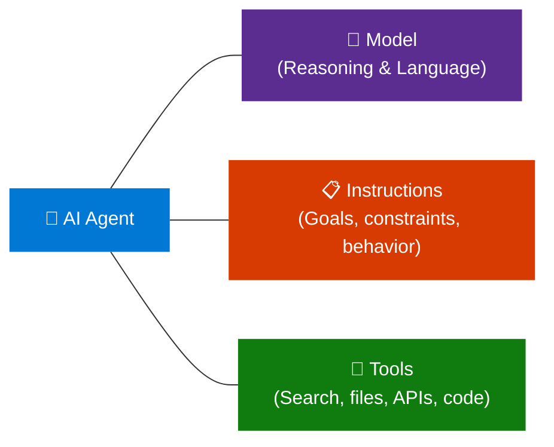
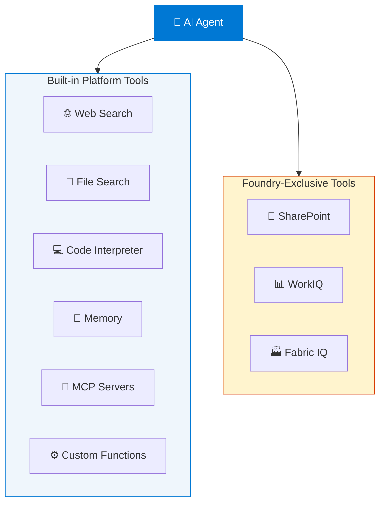
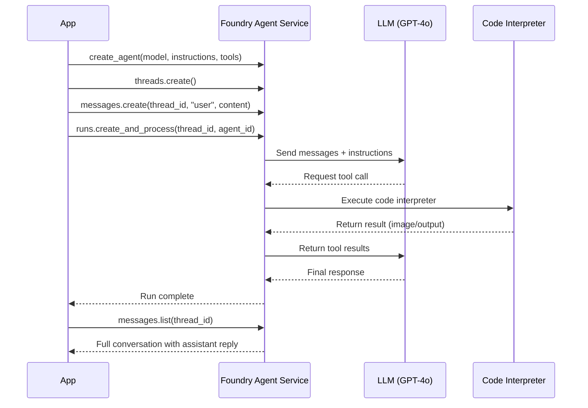
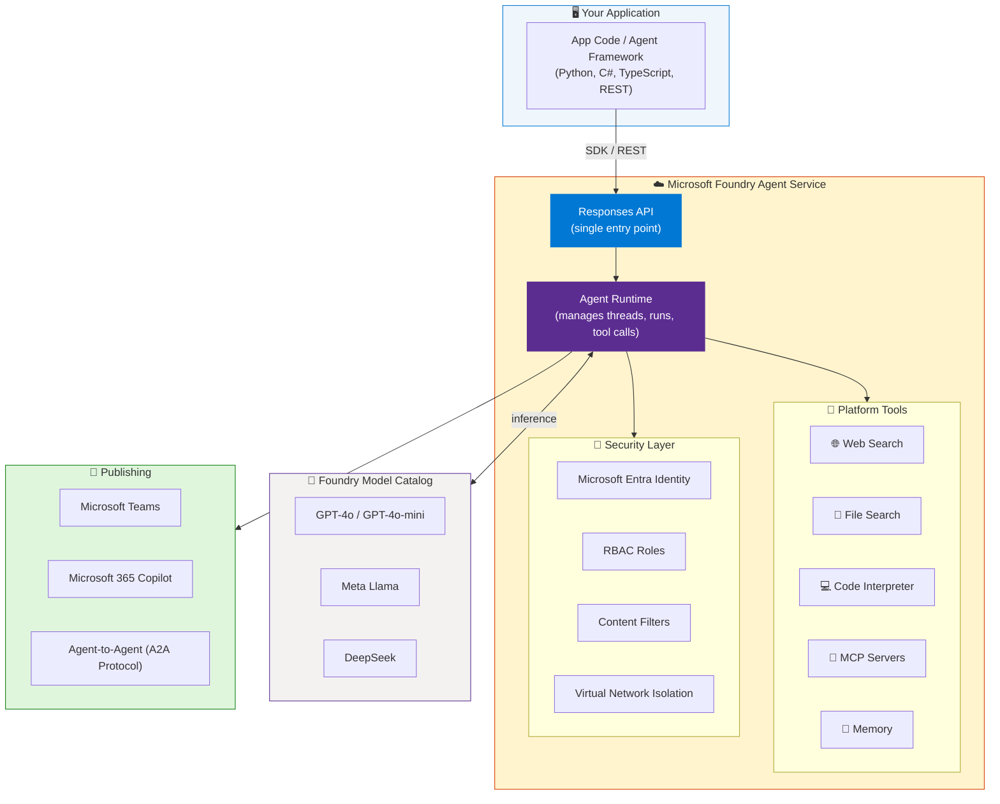
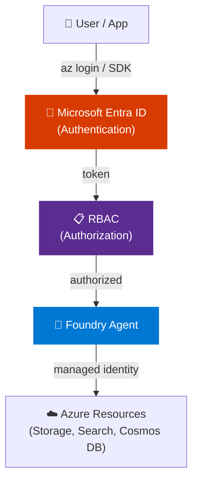

# Build AI Agents Using Azure AI Foundry — Hands-On Tutorial

> **Source:** [YouTube — Build AI Agents Using Azure AI Foundry | Azure AI Foundry Hands-On Tutorial | K21Academy](https://www.youtube.com/watch?v=iFKFfOQVxF8)  
> **Channel:** K21Academy  
> **Topic:** Azure AI Foundry Agent Service — concepts, architecture, and hands-on code  
> **Related Certification:** AI-103: Design and Implement a Microsoft Azure AI Solution

---

## Table of Contents

1. [What Is an AI Agent?](#1-what-is-an-ai-agent)
2. [What Is Microsoft Foundry Agent Service?](#2-what-is-microsoft-foundry-agent-service)
3. [Agent Types](#3-agent-types)
4. [Core Components of an Agent](#4-core-components-of-an-agent)
5. [Agent Service at a Glance](#5-agent-service-at-a-glance)
6. [Tools Available to Agents](#6-tools-available-to-agents)
7. [Agent Development Lifecycle](#7-agent-development-lifecycle)
8. [Hands-On: Create an Agent via Portal](#8-hands-on-create-an-agent-via-portal)
9. [Hands-On: Create an Agent via Python SDK](#9-hands-on-create-an-agent-via-python-sdk)
10. [Hands-On: Create an Agent via C# SDK](#10-hands-on-create-an-agent-via-c-sdk)
11. [Hands-On: Create an Agent via TypeScript SDK](#11-hands-on-create-an-agent-via-typescript-sdk)
12. [Hands-On: Create an Agent via REST API](#12-hands-on-create-an-agent-via-rest-api)
13. [Architecture Diagram](#13-architecture-diagram)
14. [Enterprise Capabilities](#14-enterprise-capabilities)
15. [Security & Identity](#15-security--identity)
16. [Publishing & Sharing Agents](#16-publishing--sharing-agents)
17. [Interview Talking Points](#17-interview-talking-points)
18. [Learning Resources](#18-learning-resources)

---

## 1. What Is an AI Agent?

An **AI agent** is an AI application that uses a model from the Foundry model catalog to **reason about user requests and take autonomous actions** to fulfill them.

Unlike a simple chatbot that only generates text, an agent can:
- **Call tools** (web search, code execution, file access)
- **Access external data** (SharePoint, Blob Storage, databases)
- **Make decisions across multiple steps** to complete a task
- **Act without a chat interface** — working autonomously in the background, triggered by system events

### The Three Core Components of Every Agent



---

## 2. What Is Microsoft Foundry Agent Service?

**Foundry Agent Service** is a managed platform for **building, deploying, and scaling AI agents**. It supports any framework, any model from the Foundry model catalog, and uses the **Responses API** as a single entry point.

### Key Value Proposition

| You Choose | What You Get |
|---|---|
| **Prompt agents** | No code to maintain, no compute to pay for — Foundry runs it for you |
| **Hosted agents** | Bring your own code/container; Foundry adds managed endpoint, scaling, identity, observability |
| **Responses API only** | Call from existing code — get Foundry models and tools without migrating |

> **Portal:** [ai.azure.com](https://ai.azure.com)  
> **Endpoint format:** `https://<AIFoundryResourceName>.services.ai.azure.com/api/projects/<ProjectName>`

---

## 3. Agent Types

### Prompt Agents
Defined entirely through **configuration** — instructions, model selection, and tools. No application code to maintain.

- Author in **Foundry portal** (portal-first) or via **SDK/REST** (code-first)
- Foundry handles runtime, scaling, monitoring
- Best for: fast start, internal tools, production agents without custom orchestration

### Hosted Agents _(Preview)_
**Code-based agents** packaged as a container or zip of source code, run by Foundry with:
- Managed endpoint + autoscaling
- Dedicated Microsoft Entra identity per agent
- Session-level state persistence
- End-to-end observability

Supported frameworks:
- Agent Framework
- LangGraph
- OpenAI Agents SDK
- Anthropic Agent SDK
- GitHub Copilot SDK
- Custom code

Best for: agents that call into custom code; custom orchestration logic; multi-agent systems.

### Comparison

| Dimension | Prompt Agents | Hosted Agents (Preview) |
|---|---|---|
| **Authoring** | Portal, SDK, or REST | Agent Framework, LangGraph, OpenAI SDK, custom code |
| **Runtime code** | None — fully managed | Yes — your agent logic |
| **Compute** | None — Foundry-managed | Container compute, Foundry-managed |
| **Managed endpoint** | Yes | Yes |
| **Autoscale** | Automatic | Automatic (per session + request volume) |
| **Agent identity (Entra)** | Yes | Automatic, dedicated per agent |
| **Best for** | Fast start, production agents | Custom orchestration, multi-agent systems |

---

## 4. Core Components of an Agent

Every agent in Foundry Agent Service consists of:

| Component | Description |
|---|---|
| **Model** | A model from the Foundry catalog (GPT-4o, Llama, DeepSeek, etc.) providing reasoning |
| **Instructions** | Natural language goals, constraints, behavior definition (the system prompt) |
| **Tools** | Capabilities the agent can invoke — search, code interpreter, file access, custom APIs |
| **Thread** | A conversation session between the agent and a user (maintains context) |
| **Run** | A single execution of the agent against a thread — processes messages and executes tools |
| **Messages** | The conversation history within a thread (user + assistant turns) |

---

## 5. Agent Service at a Glance

| Component | What It Does |
|---|---|
| **Responses API** | Single entry point for every agent type. Gives any framework access to Foundry models + platform tools |
| **Agent Runtime** | Hosts and scales prompt agents and hosted agents. Manages conversations, tool calls, and lifecycle |
| **Tools** | Built-in: web search, file search, memory, code interpreter, MCP servers, custom functions |
| **Models** | Works with GPT-4o, Llama, DeepSeek, and more from the Foundry model catalog |
| **Observability** | End-to-end tracing, metrics, Application Insights integration |
| **Identity & Security** | Microsoft Entra, RBAC, content filters, virtual network isolation |
| **Publishing** | Version agents, stable endpoints, share via Teams, Microsoft 365 Copilot, Entra Agent Registry |

---

## 6. Tools Available to Agents



### Tool Descriptions

| Tool | Purpose |
|---|---|
| **Web Search** | Search the internet for real-time information |
| **File Search** | Search uploaded documents and files (PDFs, DOCX, etc.) |
| **Code Interpreter** | Write and execute Python code, generate charts, do math |
| **Memory** | Persist information across sessions for personalization |
| **MCP Servers** | Connect to any MCP-compatible data service or API |
| **Custom Functions** | Call your own APIs and business logic |
| **SharePoint** | Access Microsoft 365 / SharePoint content |
| **WorkIQ / Fabric IQ** | Access Microsoft Fabric data and analytics |

### MCP (Model Context Protocol) Support

Foundry supports **remote MCP servers** directly from the **Add Tools** catalog in the portal. Supported authentication:
- Key-based access
- Microsoft Entra (managed identity or project identity)
- OAuth identity passthrough (On-Behalf-Of)

### Toolbox _(Preview)_

**Toolbox** lets you define a curated set of tools once, manage them centrally, and expose them through a single MCP-compatible endpoint. Supports versioning — create, test, and promote new versions without breaking existing agents.

---

## 7. Agent Development Lifecycle

```mermaid
flowchart LR
    C["1️⃣ Create\nPortal or SDK"] -->
    T["2️⃣ Test\nAgent Playground"] -->
    TR["3️⃣ Trace\nModel + tool calls"] -->
    E["4️⃣ Evaluate\nQuality + regressions"] -->
    O["5️⃣ Optimize\nAgent optimizer"] -->
    P["6️⃣ Publish\nManaged endpoint"] -->
    M["7️⃣ Monitor\nMetrics + dashboards"]

    style C fill:#0078D4,color:#fff,stroke:none
    style T fill:#5C2D91,color:#fff,stroke:none
    style TR fill:#D83B01,color:#fff,stroke:none
    style E fill:#107C10,color:#fff,stroke:none
    style O fill:#D83B01,color:#fff,stroke:none
    style P fill:#0078D4,color:#fff,stroke:none
    style M fill:#5C2D91,color:#fff,stroke:none
```



| Stage | What Happens |
|---|---|
| **Create** | Define a prompt agent in portal or SDK; or write a hosted agent calling the Responses API |
| **Test** | Chat with your agent in the agents playground or run locally |
| **Trace** | Inspect every model call, tool invocation, and decision with agent tracing |
| **Evaluate** | Run evaluations to measure quality and catch regressions |
| **Optimize** | Automatically improve hosted agent instructions using the agent optimizer |
| **Publish** | Promote to a managed resource with a stable endpoint |
| **Monitor** | Track performance and reliability with service metrics and dashboards |

---

## 8. Hands-On: Create an Agent via Portal

### Prerequisites
- Azure subscription ([create free](https://azure.microsoft.com/pricing/purchase-options/azure-account))
- **Foundry Account Owner** role at subscription scope (to create projects)
- **Foundry User** role at project scope (to create agents)

### Steps

1. Navigate to [ai.azure.com](https://ai.azure.com)
2. Click **Create an agent** on the home page
3. Enter a project name → optionally configure **Advanced options**
4. Click **Create** and wait for resources to provision:
   - A Foundry account + project are created
   - `gpt-4o` model is auto-deployed
   - A default agent is created
5. You land in the **Agent Playground** — give your agent instructions:

   ```
   You are a helpful agent that can answer questions about geography.
   ```

6. Start chatting with your agent immediately

> **Tip:** To find models, go to **Models + Endpoints** in the left navigation. The endpoint string is under **Libraries > Foundry** in the project overview.

---

## 9. Hands-On: Create an Agent via Python SDK

### Install Packages

```bash
pip install azure-ai-projects
pip install azure-identity
az login
```

### Environment Variables

```bash
export PROJECT_ENDPOINT="https://<AIFoundryResourceName>.services.ai.azure.com/api/projects/<ProjectName>"
export MODEL_DEPLOYMENT_NAME="gpt-4o"
```

### Create and Run an Agent

```python
import os
from pathlib import Path
from azure.ai.projects import AIProjectClient
from azure.identity import DefaultAzureCredential
from azure.ai.agents.models import CodeInterpreterTool

project_client = AIProjectClient(
    endpoint=os.getenv("PROJECT_ENDPOINT"),
    credential=DefaultAzureCredential(),
)

with project_client:
    code_interpreter = CodeInterpreterTool()

    # 1. Create the agent
    agent = project_client.agents.create_agent(
        model=os.getenv("MODEL_DEPLOYMENT_NAME"),
        name="my-agent",
        instructions="You politely help with math questions. Use the Code Interpreter tool when asked to visualize numbers.",
        tools=code_interpreter.definitions,
        tool_resources=code_interpreter.resources,
    )
    print(f"Created agent, ID: {agent.id}")

    # 2. Create a conversation thread
    thread = project_client.agents.threads.create()
    print(f"Created thread, ID: {thread.id}")

    # 3. Add a user message
    message = project_client.agents.messages.create(
        thread_id=thread.id,
        role="user",
        content="Draw a graph for a line with a slope of 4 and y-intercept of 9.",
    )

    # 4. Run the agent (polls until complete)
    run = project_client.agents.runs.create_and_process(
        thread_id=thread.id,
        agent_id=agent.id,
        additional_instructions="Please address the user as Jane Doe. The user has a premium account.",
    )

    print(f"Run status: {run.status}")

    # 5. Retrieve messages
    messages = project_client.agents.messages.list(thread_id=thread.id)
    for message in messages:
        print(f"Role: {message.role}")
        for content in message.content:
            print(f"  Content: {content}")

    # Cleanup (optional)
    # project_client.agents.delete_agent(agent.id)
```

### Thread + Run Lifecycle



---

## 10. Hands-On: Create an Agent via C# SDK

### Install Packages

```bash
dotnet new console
dotnet add package Azure.AI.Agents.Persistent
dotnet add package Azure.Identity
az login
```

### Environment Variables

```bash
export ProjectEndpoint="https://<AIFoundryResourceName>.services.ai.azure.com/api/projects/<ProjectName>"
export ModelDeploymentName="gpt-4o"
```

### C# Code

```csharp
using Azure.AI.Agents.Persistent;
using Azure.Identity;

var projectEndpoint = Environment.GetEnvironmentVariable("ProjectEndpoint");
var modelDeploymentName = Environment.GetEnvironmentVariable("ModelDeploymentName");

// 1. Initialize client
PersistentAgentsClient client = new(projectEndpoint, new DefaultAzureCredential());

// 2. Create agent with Code Interpreter tool
PersistentAgent agent = client.Administration.CreateAgent(
    model: modelDeploymentName,
    name: "My Test Agent",
    instructions: "You politely help with math questions. Use the code interpreter tool when asked to visualize numbers.",
    tools: [new CodeInterpreterToolDefinition()]
);

// 3. Create thread and send message
PersistentAgentThread thread = client.Threads.CreateThread();
client.Messages.CreateMessage(
    thread.Id,
    MessageRole.User,
    "Draw a graph for a line with a slope of 4 and y-intercept of 9."
);

// 4. Create and poll run
ThreadRun run = client.Runs.CreateRun(
    thread.Id,
    agent.Id,
    additionalInstructions: "Please address the user as Jane Doe. The user has a premium account."
);

do {
    Thread.Sleep(500);
    run = client.Runs.GetRun(thread.Id, run.Id);
} while (run.Status == RunStatus.Queued || run.Status == RunStatus.InProgress);

// 5. Read messages
foreach (var message in client.Messages.GetMessages(thread.Id, order: ListSortOrder.Ascending))
{
    foreach (var content in message.ContentItems)
    {
        if (content is MessageTextContent text)
            Console.WriteLine($"[{message.Role}]: {text.Text}");
    }
}

// Cleanup
// client.Threads.DeleteThread(thread.Id);
// client.Administration.DeleteAgent(agent.Id);
```

---

## 11. Hands-On: Create an Agent via TypeScript SDK

### Install Packages

```bash
npm init -y
npm pkg set type="module"
npm install @azure/ai-agents @azure/identity
npm install @types/node typescript --save-dev
az login
```

### TypeScript Code

```typescript
import { AgentsClient } from "@azure/ai-agents";
import { DefaultAzureCredential } from "@azure/identity";

const projectEndpoint = process.env["PROJECT_ENDPOINT"]!;
const modelDeploymentName = process.env["MODEL_DEPLOYMENT_NAME"] ?? "gpt-4o";

const client = new AgentsClient(projectEndpoint, new DefaultAzureCredential());

// 1. Create agent
const agent = await client.createAgent(modelDeploymentName, {
  name: "my-agent",
  instructions: "You are a helpful agent specialized in math.",
});

// 2. Create thread and message
const thread = await client.threads.create();
await client.messages.create(thread.id, "user",
  "I need to solve the equation `3x + 11 = 14`. Can you help me?"
);

// 3. Run (with polling)
const run = await client.runs.createAndPoll(thread.id, agent.id, {
  pollingOptions: { intervalInMs: 2000 },
});
console.log(`Run status: ${run.status}`);

// 4. Display conversation
const messages = [];
for await (const m of client.messages.list(thread.id)) {
  messages.push(m);
}
messages.reverse();

for (const m of messages) {
  const text = Array.isArray(m.content) && m.content[0]?.type === "text"
    ? (m.content[0] as any).text.value
    : JSON.stringify(m.content);
  console.log(`[${m.role.toUpperCase()}]: ${text}`);
}

// Cleanup
await client.threads.delete(thread.id);
await client.deleteAgent(agent.id);
```

---

## 12. Hands-On: Create an Agent via REST API

### Setup

```bash
az login

# Get bearer token
export AGENT_TOKEN=$(az account get-access-token --resource 'https://ai.azure.com' | jq -r .accessToken)
export AZURE_AI_FOUNDRY_PROJECT_ENDPOINT="https://<service>.services.ai.azure.com/api/projects/<project>"
export API_VERSION="2025-05-01"
```

### Step 1 — Create Agent

```bash
curl --request POST \
  --url "$AZURE_AI_FOUNDRY_PROJECT_ENDPOINT/assistants?api-version=$API_VERSION" \
  -H "Authorization: Bearer $AGENT_TOKEN" \
  -H "Content-Type: application/json" \
  -d '{
    "instructions": "You are a helpful agent.",
    "name": "my-agent",
    "tools": [{"type": "code_interpreter"}],
    "model": "gpt-4o-mini"
  }'
```

### Step 2 — Create Thread

```bash
curl --request POST \
  --url "$AZURE_AI_FOUNDRY_PROJECT_ENDPOINT/threads?api-version=$API_VERSION" \
  -H "Authorization: Bearer $AGENT_TOKEN" \
  -H "Content-Type: application/json" \
  -d ''
```

### Step 3 — Add User Message

```bash
curl --request POST \
  --url "$AZURE_AI_FOUNDRY_PROJECT_ENDPOINT/threads/{thread_id}/messages?api-version=$API_VERSION" \
  -H "Authorization: Bearer $AGENT_TOKEN" \
  -H "Content-Type: application/json" \
  -d '{
    "role": "user",
    "content": "I need to solve the equation 3x + 11 = 14. Can you help me?"
  }'
```

### Step 4 — Run the Thread

```bash
curl --request POST \
  --url "$AZURE_AI_FOUNDRY_PROJECT_ENDPOINT/threads/{thread_id}/runs?api-version=$API_VERSION" \
  -H "Authorization: Bearer $AGENT_TOKEN" \
  -H "Content-Type: application/json" \
  -d '{"assistant_id": "{agent_id}"}'
```

### Step 5 — Poll Run Status

```bash
curl --request GET \
  --url "$AZURE_AI_FOUNDRY_PROJECT_ENDPOINT/threads/{thread_id}/runs/{run_id}?api-version=$API_VERSION" \
  -H "Authorization: Bearer $AGENT_TOKEN"
```

### Step 6 — Retrieve Response

```bash
curl --request GET \
  --url "$AZURE_AI_FOUNDRY_PROJECT_ENDPOINT/threads/{thread_id}/messages?api-version=$API_VERSION" \
  -H "Authorization: Bearer $AGENT_TOKEN"
```

---

## 13. Architecture Diagram



---

## 14. Enterprise Capabilities

### Identity

Each hosted agent gets a **dedicated Microsoft Entra identity**, enabling:
- Scoped access to resources and APIs without sharing credentials
- Authentication to external MCP servers
- OAuth On-Behalf-Of (OBO) passthrough when configured

### Private Networking

- **Prompt agents** — run within your Azure virtual network
- **Hosted agents** — support BYO VNet; each session runs in a VM-isolated sandbox connected to your VNet

### RBAC Roles

| Role | Scope | Capabilities |
|---|---|---|
| **Foundry Account Owner** | Subscription | Create accounts and projects |
| **Foundry Owner** | Project | Full control of project resources |
| **Foundry User** | Project | Create and invoke agents (`agents/*/read`, `agents/*/action`, `agents/*/delete`) |
| **Foundry Project Manager** | Project | Manage project settings and team |

> **Note:** These roles were previously named Azure AI User/Owner/Account Owner/Project Manager. Role IDs and permissions are unchanged.

### Content Safety

Integrated **content filters** help:
- Mitigate prompt injection risks (including cross-prompt injection attacks / XPIA)
- Prevent unsafe outputs
- Enforce responsible AI policies

---

## 15. Security & Identity



### Best Practices

- Use `DefaultAzureCredential()` — supports local (`az login`) and production (Managed Identity) without code changes
- Never hardcode API keys — use environment variables or Azure Key Vault
- Never commit `.env` files — add to `.gitignore`
- Use **private endpoints** to keep traffic inside your VNet
- Enable **Application Insights** for end-to-end tracing in production

---

## 16. Publishing & Sharing Agents

### Versioning

- As you iterate, Foundry **automatically snapshots versions**
- Roll back to any previous version or compare changes

### Publishing Channels

| Channel | Protocol |
|---|---|
| **Microsoft 365 Copilot & Teams** | OpenResponses + Activity Protocols |
| **Custom Apps** | Invocations protocol |
| **Agent-to-Agent (A2A)** | A2A Protocol (Preview) |
| **Entra Agent Registry** | Register and discover agents across your org |

### Bring Your Own Resources

You can use your own Azure resources for compliance:
- Azure Blob Storage (files)
- Azure AI Search (knowledge)
- Azure Cosmos DB (conversation state)

---

## 17. Interview Talking Points

### "What is the difference between a Prompt Agent and a Hosted Agent in Azure AI Foundry?"

> A Prompt Agent is defined entirely through configuration — instructions, model, and tools — and Foundry runs it without any application code to write or maintain. A Hosted Agent is code you write (using LangGraph, OpenAI Agents SDK, or your own framework), packaged as a container, and run by Foundry with a managed endpoint, autoscaling, and dedicated Entra identity. You choose Prompt Agents for fast starts and production agents without custom logic; Hosted Agents when you need full control over orchestration or need to call your own custom code.

### "What are Threads and Runs in Foundry Agent Service?"

> A Thread represents a conversation session between an agent and a user — it holds the message history. A Run is a single execution of the agent against a thread: the agent reads the messages, reasons about them, optionally calls tools (like Code Interpreter or Web Search), and produces a reply. Runs go through states: queued → in_progress → completed (or failed). You poll for completion, then retrieve the messages to get the agent's response.

### "How does authentication work for Foundry agents?"

> The recommended approach is `DefaultAzureCredential()` from the Azure Identity SDK. Locally, it picks up `az login` credentials; in production, it automatically uses Managed Identity — no code changes required. Each Hosted Agent gets a dedicated Microsoft Entra identity, so it can access Azure resources (Storage, Search, Cosmos DB) without sharing credentials. RBAC roles control who can create and invoke agents at the project level.

### "What tools can an Azure AI Foundry agent use?"

> Agents have access to built-in platform tools including Web Search (real-time internet), File Search (uploaded documents), Code Interpreter (executes Python, generates charts), Memory (cross-session persistence), and MCP Servers (any MCP-compatible API). Foundry-exclusive tools include SharePoint, WorkIQ, and Fabric IQ. You can also register custom functions (your own APIs) or connect remote MCP servers authenticated via Entra managed identity or OAuth OBO.

### "What is the Responses API?"

> The Responses API is the single entry point behind every agent type in Foundry. It gives any framework — whether a Prompt Agent, Hosted Agent, or external application — access to Foundry models and platform tools. You can call it directly from existing code without creating a Foundry agent resource, making it easy to add Foundry capabilities incrementally. It replaces the older connection-string based approach (changed in May 2025 to project endpoint format).

---

## 18. Learning Resources

| Resource | Link | Type |
|---|---|---|
| Foundry Agent Service Overview | [learn.microsoft.com/azure/ai-foundry/agents/overview](https://learn.microsoft.com/en-us/azure/ai-foundry/agents/overview) | Official Docs |
| Quickstart — Create an Agent | [learn.microsoft.com/azure/ai-foundry/agents/quickstart](https://learn.microsoft.com/en-us/azure/ai-foundry/agents/quickstart) | Tutorial |
| Develop AI Agents on Azure (Learning Path) | [learn.microsoft.com/training/paths/develop-ai-agents-azure](https://learn.microsoft.com/en-us/training/paths/develop-ai-agents-azure/) | Microsoft Learn |
| Agent Framework (GitHub) | [github.com/microsoft/agent-framework](https://github.com/microsoft/agent-framework) | Code |
| AI Agents for Beginners (12 Lessons) | [github.com/microsoft/ai-agents-for-beginners](https://github.com/microsoft/ai-agents-for-beginners) | Course |
| Python SDK Samples | [github.com/Azure-Samples/azure-search-python-samples](https://github.com/Azure-Samples/azure-search-python-samples) | Code Samples |
| K21Academy AI-103 Labs Guide | [k21academy.com/azure-aiml/ai-103-labs](https://k21academy.com/azure-aiml/ai-103-labs-build-ai-apps-agents/) | Labs |
| Azure AI Foundry Portal | [ai.azure.com](https://ai.azure.com) | Platform |
| YouTube Tutorial (this video) | [youtube.com/watch?v=iFKFfOQVxF8](https://www.youtube.com/watch?v=iFKFfOQVxF8) | Video |

---

*Last Updated: June 2026 | Source: K21Academy — Build AI Agents Using Azure AI Foundry Hands-On Tutorial*
