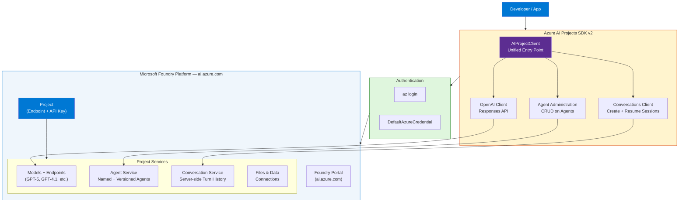
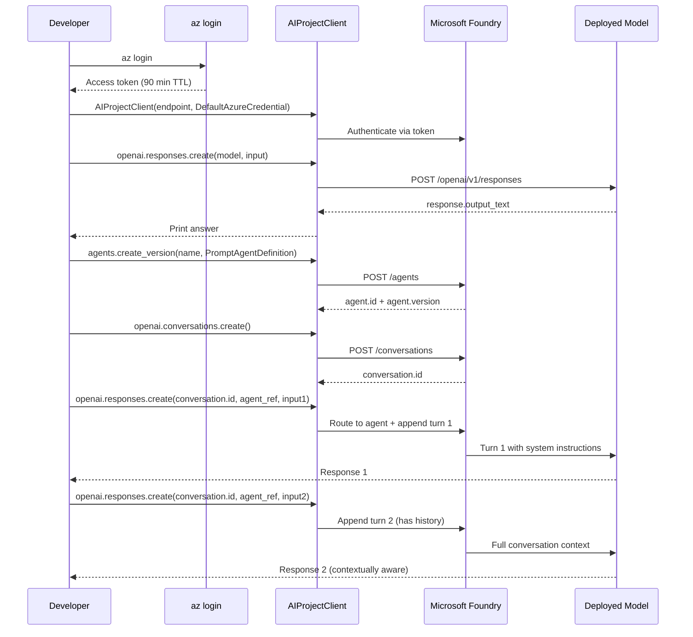

# How Do I Get Started in Azure AI Foundry?

> **Source:** [YouTube — How do I get started in Azure AI Foundry?](https://www.youtube.com/watch?v=yZgC1KhfSxo)
> **Instagram Post:** [azuredevelopers — @azuredevelopers](https://www.instagram.com/p/DTYHeZmlmuN/)
> **Channel/Series:** Azure Developers · One Dev Question
> **Topic:** Azure AI Foundry, Microsoft Foundry SDK, AI Agents, Model Deployment, Getting Started
> **Key Claim:** "From picking your first model to building agents you can actually talk to, the path is shorter than you think."

---

## Table of Contents

1. [Overview](#1-overview)
2. [Problem Statement](#2-problem-statement)
3. [Core Concepts](#3-core-concepts)
4. [Architecture](#4-architecture)
5. [Key Components](#5-key-components)
6. [How It Works — Step by Step](#6-how-it-works--step-by-step)
7. [Comparison Table](#7-comparison-table)
8. [Code Examples](#8-code-examples)
9. [Configuration Reference](#9-configuration-reference)
10. [Best Practices](#10-best-practices)
11. [Interview Talking Points](#11-interview-talking-points)
12. [Learning Resources](#12-learning-resources)

---

## 1. Overview

Azure AI Foundry (rebranded as **Microsoft Foundry** in 2025) is Microsoft's unified platform for building, customizing, and deploying generative AI applications. It consolidates model access, agent orchestration, deployment infrastructure, and responsible AI tooling into a single project-based workspace. The *One Dev Question* episode answers the single most-asked question from developers new to the platform: where do you even begin? The answer is three steps — deploy a model, create an agent with instructions, and hold a stateful multi-turn conversation — all achievable in under 30 minutes.

---

## 2. Problem Statement

Before Foundry, building an AI application on Azure required stitching together Azure OpenAI Service, Azure Cognitive Services, Azure ML, and separate deployment pipelines — each with its own SDK, auth model, and quota system.

### Classic Approach Pain Points

| Problem | Impact |
|---|---|
| Multiple disconnected SDKs per service | High boilerplate; brittle integration code |
| No unified agent concept | Developers reinvented stateful conversation loops manually |
| Separate auth per resource | Credential management sprawl across the app |
| No built-in conversation history | Multi-turn chat required custom state management |
| Fragmented observability | Logs scattered across Azure Monitor, App Insights, and OpenAI dashboards |

> **Key Insight:** "Azure AI Foundry is a unified platform for developers to build, customize, and manage generative AI applications — it simplifies workflows across model deployment, agent orchestration, and observability."

---

## 3. Core Concepts

### Microsoft Foundry (Azure AI Foundry)
The umbrella platform at `https://ai.azure.com`. Wraps models, agents, data, evaluations, and deployment under one roof. A project-centric mental model: every resource lives inside a **Project**.

### Project
The top-level organizational unit. Contains your deployed models, agents, files, and data connections. Exposes a single **Project Endpoint** (`https://<resource>.ai.azure.com/api/projects/<project>`). Think of it as a namespaced workspace.

### Agent
A named, versioned entity that encapsulates a model + system instructions. Once created, it enforces consistent behavior across all conversations without repeating the system prompt on every call.

### Conversation
A server-side session object that stores turn history. Passing the `conversation.id` across calls gives the agent memory of prior exchanges — no client-side history tracking needed.

### Instant Models (Preview)
Pre-deployed model instances (e.g., in West US 3) that skip the deployment step entirely. Ideal for prototyping. Available as a drop-in replacement for self-deployed models in code.

### Azure AI Projects SDK v2
The `azure-ai-projects >= 2.0.0` library. **Breaking change from v1** — uses the new Foundry projects API. v1 (`azure-ai-projects == 1.0.0`) targets the classic portal and is incompatible.

---

## 4. Architecture



---

## 5. Key Components

| Component | Service / Tool | Role |
|---|---|---|
| Foundry Portal | `ai.azure.com` | Browser-based IDE for model exploration, agent creation, playground |
| AIProjectClient | `azure-ai-projects >= 2.0.0` | Single client connecting to the project endpoint |
| Responses API | OpenAI-compatible | Send prompts, get model completions (stateless or via conversation ID) |
| Agent Service | Foundry Agents API | Create/version/delete agents with model + system instructions |
| Conversation Service | Foundry Conversations API | Server-managed turn history — enables multi-turn without client state |
| DefaultAzureCredential | `azure-identity` | Picks up `az login` credentials locally; MSI/workload identity in prod |
| Model Deployment | Models + Endpoints | Hosts the base LLM (GPT-5-mini, GPT-4.1, etc.) under a deployment name |
| Instant Models | West US 3 (Preview) | Skip deployment step — use pre-hosted models directly |

### AIProjectClient — Entry Point

The single object that bootstraps all SDK calls:

```python
project = AIProjectClient(
    endpoint="https://<resource>.ai.azure.com/api/projects/<project>",
    credential=DefaultAzureCredential(),
)
openai  = project.get_openai_client()        # responses + conversations
agents  = project.agents                     # agent CRUD
```

### Agent Service

Agents are versioned resources. `create_version` returns an `(id, name, version)` tuple. You can update instructions by creating a new version — old versions are immutable.

### Conversation Service

A conversation is a lightweight session handle. Passing its `id` to the Responses API makes the model aware of all prior turns automatically.

---

## 6. How It Works — Step by Step



**Step-by-step breakdown:**

1. **Authenticate** — `az login` locally; `DefaultAzureCredential` picks it up automatically. No API keys in code.
2. **Create client** — `AIProjectClient(endpoint, credential)` — endpoint from the Foundry portal Overview page.
3. **Chat with model** — `openai.responses.create(model, input)` — stateless single-turn call. Confirms connectivity.
4. **Create agent** — `agents.create_version(name, PromptAgentDefinition(model, instructions))` — bakes system prompt into a reusable, versioned resource.
5. **Create conversation** — `openai.conversations.create()` — server allocates a session ID.
6. **Multi-turn chat** — pass `conversation.id` + `agent_reference` in each `responses.create()` call. Server maintains history automatically.
7. **Follow-up** — second call uses same conversation ID. Agent "remembers" the first question without any client-side state.

---

## 7. Comparison Table

| Dimension | Classic Azure OpenAI / AI Projects v1 | Microsoft Foundry SDK v2 |
|---|---|---|
| Entry point | Separate clients per service | Single `AIProjectClient` |
| Agent concept | None (manual system-prompt injection) | First-class versioned `Agent` resource |
| Conversation history | Client must manage full message array | Server-side `Conversation` object |
| Auth | API key or per-resource MSI | `DefaultAzureCredential` across all services |
| Package | `azure-ai-projects==1.0.0` | `azure-ai-projects>=2.0.0` |
| API version | Classic / legacy endpoints | Foundry projects (new) API |
| Portal | Azure AI Studio (classic) | Microsoft Foundry (`ai.azure.com`) |
| Instant models | Not available | Available in West US 3 (preview) |
| Multi-language support | Python + REST | Python, C#, TypeScript, Java, REST |

---

## 8. Code Examples

### Python — Chat with a Model (stateless)

```python
from azure.identity import DefaultAzureCredential
from azure.ai.projects import AIProjectClient

PROJECT_ENDPOINT = "https://<resource>.ai.azure.com/api/projects/<project>"

project = AIProjectClient(
    endpoint=PROJECT_ENDPOINT,
    credential=DefaultAzureCredential(),
)
openai = project.get_openai_client()

response = openai.responses.create(
    model="gpt-5-mini",
    input="What is the size of France in square miles?",
)
print(response.output_text)
```

### Python — Create an Agent

```python
from azure.ai.projects.models import PromptAgentDefinition

agent = project.agents.create_version(
    agent_name="MyAgent",
    definition=PromptAgentDefinition(
        model="gpt-5-mini",
        instructions="You are a helpful assistant that answers general questions",
    ),
)
print(f"Agent created — id: {agent.id}, version: {agent.version}")
```

### Python — Multi-Turn Conversation with Agent

```python
openai = project.get_openai_client()

# Server allocates session — stores all turns
conversation = openai.conversations.create()

def ask(question):
    return openai.responses.create(
        conversation=conversation.id,
        extra_body={"agent_reference": {"name": "MyAgent", "type": "agent_reference"}},
        input=question,
    ).output_text

print(ask("What is the size of France in square miles?"))
print(ask("And what is the capital city?"))  # agent remembers France context
```

### REST API — Chat with Agent

```bash
curl -X POST https://<resource>.services.ai.azure.com/api/projects/<project>/openai/v1/responses \
  -H "Content-Type: application/json" \
  -H "Authorization: Bearer $AZURE_AI_AUTH_TOKEN" \
  -d '{
    "agent_reference": {"type": "agent_reference", "name": "MyAgent"},
    "input": [{"role": "user", "content": "What is the capital of France?"}]
  }'
```

### Install & Setup

```bash
# Install SDK (v2 — Foundry new API)
pip install azure-ai-projects>=2.0.0 azure-identity

# C#
dotnet add package Azure.AI.Projects
dotnet add package Azure.AI.Projects.Agents
dotnet add package Azure.AI.Extensions.OpenAI
dotnet add package Azure.Identity

# TypeScript
npm install @azure/ai-projects

# Authenticate (all languages — local dev)
az login

# Get bearer token for REST calls (expires in 60-90 min)
az account get-access-token --scope https://ai.azure.com/.default
```

---

## 9. Configuration Reference

| Variable | Where to Get | Required | Description |
|---|---|---|---|
| `PROJECT_ENDPOINT` | Foundry Portal → Project Overview → Libraries → Foundry | Yes | Format: `https://<resource>.ai.azure.com/api/projects/<project>` |
| `MODEL_DEPLOYMENT_NAME` | Foundry Portal → Models + Endpoints | Yes | Name of your deployed model (e.g., `gpt-5-mini`) |
| `AGENT_NAME` | User-defined at `create_version()` time | Yes | Human-readable name; used to reference agent in API calls |
| `AZURE_AI_AUTH_TOKEN` | `az account get-access-token --scope https://ai.azure.com/.default` | REST only | Short-lived bearer token; refresh every 60-90 min |

---

## 10. Best Practices

### Authentication

- ✅ Use `DefaultAzureCredential` — works locally (`az login`) and in production (Managed Identity) without code changes
- ❌ Don't hardcode API keys — they're a secret sprawl risk and don't rotate automatically
- ✅ In CI/CD, assign the service principal the `Azure AI Owner` role on the Foundry resource

### Model Selection

- ✅ Start with `gpt-5-mini` (or an Instant Model in West US 3) for fast prototyping — lower cost, faster response
- ✅ Use `gpt-5.1` / `gpt-4.1` only when quality requirements justify the cost
- ❌ Don't commit to reserved capacity until you've measured real usage patterns with pay-as-you-go

### Agent Design

- ✅ Keep system instructions focused — one agent, one job
- ✅ Version agents explicitly: create a new version when changing instructions; old version remains stable
- ❌ Don't put per-user context in system instructions — pass it in user turns or via conversation history
- ✅ Use the portal playground to iterate on instructions before committing to code

### SDK Version

- ✅ Always pin `azure-ai-projects>=2.0.0` — v2 is the new Foundry API
- ❌ Don't mix v1 and v2 in the same project — APIs are incompatible
- ✅ Refer to Foundry Classic docs (`/azure/foundry-classic/`) if you're maintaining a legacy v1 app

### Cost & Billing

- ✅ Monitor token usage per agent/conversation in Foundry portal observability dashboards
- ❌ Don't forget: tokens add up at scale — set budget alerts in Azure Cost Management
- ✅ Delete unused agent versions and conversations to avoid orphaned resources

---

## 11. Interview Talking Points

### "What is Microsoft Foundry and how does it differ from Azure OpenAI Service?"

> Microsoft Foundry is a unified platform that combines model hosting, agent orchestration, conversation management, and deployment tooling in a single project-centric workspace. Azure OpenAI Service is purely a model API — it gives you completions but no first-class concept of agents, versioned instructions, or server-side conversation history. Foundry sits on top of Azure OpenAI and extends it with those higher-level primitives, accessed through a single `AIProjectClient` rather than disparate service clients.

### "What is an Agent in Azure AI Foundry and why use one instead of just passing a system prompt?"

> An Agent in Foundry is a named, versioned server-side resource that packages a model and a system prompt together. The advantage over inline system prompts is reuse and governance: you define the agent once, reference it by name in every API call, and can update instructions by publishing a new version without changing client code. Old versions remain immutable, so you get auditability. This is especially valuable in teams where instructions need to be reviewed and approved before deployment.

### "How does multi-turn conversation work in Foundry SDK v2?"

> Foundry's Conversation Service manages turn history on the server. You call `openai.conversations.create()` once to get a `conversation.id`, then pass that ID in every subsequent `responses.create()` call. The server automatically appends each turn and feeds the full history to the model. The client never needs to maintain a message array — this eliminates a whole class of bugs where client-side history gets truncated, corrupted, or lost on page reload.

### "What breaking change should you watch for when upgrading from Azure AI Projects v1 to v2?"

> The v1 package (`azure-ai-projects==1.0.0`) targets the classic Azure AI Studio / Foundry (classic) API — it's incompatible with the new Foundry projects API. v2 (`azure-ai-projects>=2.0.0`) introduces a unified `AIProjectClient`, a new project endpoint format, first-class Agent and Conversation resources, and drops the old thread-based assistant model. Mixing both versions in a single project will cause runtime errors because the endpoints and authentication scopes are different.

### "How would you authenticate a Foundry application in production vs. local development?"

> For local development, `DefaultAzureCredential` picks up credentials from `az login` automatically — no code change needed. In production on Azure (App Service, AKS, Azure Functions), assign a **Managed Identity** to the compute resource and grant it the `Azure AI Owner` or `Azure AI Developer` role on the Foundry resource. `DefaultAzureCredential` then picks up the managed identity token transparently. For REST calls in CI pipelines, use `az account get-access-token --scope https://ai.azure.com/.default` to obtain a short-lived bearer token — refresh it every 60-90 minutes.

---

## 12. Learning Resources

| Resource | Link | Type |
|---|---|---|
| Microsoft Foundry Quickstart (SDK) | [learn.microsoft.com/azure/foundry/quickstarts/get-started-code](https://learn.microsoft.com/en-us/azure/foundry/quickstarts/get-started-code) | Official Docs |
| Microsoft Foundry Documentation Hub | [learn.microsoft.com/azure/foundry](https://learn.microsoft.com/en-us/azure/foundry/) | Official Docs |
| Agent Service Quickstart | [learn.microsoft.com/azure/ai-foundry/agents/quickstart](https://learn.microsoft.com/en-us/azure/ai-foundry/agents/quickstart) | Official Docs |
| Training & Learning Paths | [learn.microsoft.com/training/azure/ai-foundry](https://learn.microsoft.com/en-us/training/azure/ai-foundry) | Training |
| How do I get started in Azure AI Foundry? | [youtube.com/watch?v=yZgC1KhfSxo](https://www.youtube.com/watch?v=yZgC1KhfSxo) | Video |
| Instagram post (azuredevelopers) | [instagram.com/p/DTYHeZmlmuN](https://www.instagram.com/p/DTYHeZmlmuN/) | Social |
| Set up development environment | [learn.microsoft.com/azure/foundry/how-to/develop/install-cli-sdk](https://learn.microsoft.com/en-us/azure/foundry/how-to/develop/install-cli-sdk) | Official Docs |
| Foundry Portal | [ai.azure.com](https://ai.azure.com) | Tool |

---

*Last Updated: July 2026 | Source: Azure Developers (One Dev Question) — How do I get started in Azure AI Foundry?*
