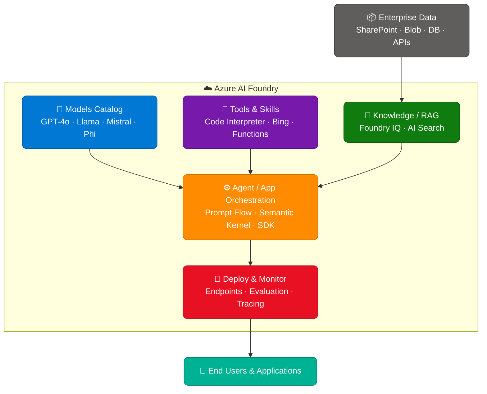
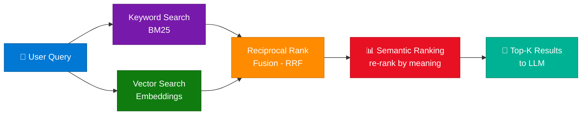
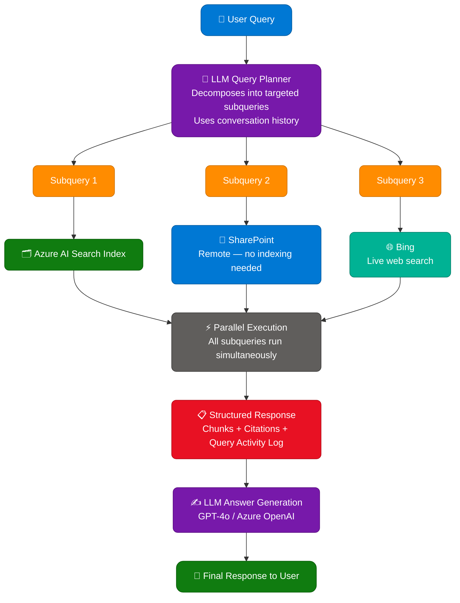
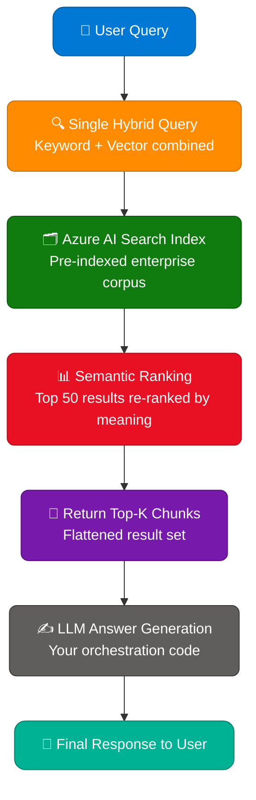

# Azure AI Foundry: Your AI App and Agent Factory — Complete Guide

> **Sources:** Azure AI Foundry Blog + Microsoft Learn RAG Overview (Azure AI Search)
> **Last Updated:** June 2026

---

## Table of Contents

1. [What is Azure AI Foundry?](#1-what-is-azure-ai-foundry)
2. [Core Pillars of Azure AI Foundry](#2-core-pillars-of-azure-ai-foundry)
3. [Azure AI Foundry as an App and Agent Factory](#3-azure-ai-foundry-as-an-app-and-agent-factory)
4. [Key Components and Services](#4-key-components-and-services)
5. [RAG and Generative AI with Azure AI Search](#5-rag-and-generative-ai-with-azure-ai-search)
6. [Agentic Retrieval vs Classic RAG](#6-agentic-retrieval-vs-classic-rag)
7. [Content Preparation for RAG](#7-content-preparation-for-rag)
8. [Security and Governance](#8-security-and-governance)
9. [Getting Started](#9-getting-started)
10. [Interview Q&A Cheatsheet](#10-interview-qa-cheatsheet)

---

## 1. What is Azure AI Foundry?

**Azure AI Foundry** is Microsoft's unified platform for building, deploying, and managing AI applications and agents at enterprise scale. It acts as a factory — providing the tools, models, infrastructure, and governance required to go from prototype to production-grade AI systems.

### Key Value Propositions

| Feature | Description |
|---|---|
| **Unified Portal** | Single interface for model selection, deployment, evaluation, and monitoring |
| **Model Catalog** | Access to 1,700+ models including OpenAI GPT-4o, Meta Llama, Mistral, and Azure-curated models |
| **Agent Factory** | Built-in tools to create multi-agent systems with tool use, memory, and orchestration |
| **Enterprise Readiness** | Built-in responsible AI, security, compliance, and governance controls |
| **Foundry IQ** | Knowledge layer that grounds agents with your enterprise data |

---

## 2. Core Pillars of Azure AI Foundry

### Pillar 1: Explore and Select Models
- **Model Catalog**: Browse and compare models from OpenAI, Meta, Mistral, Cohere, and Microsoft
- **Benchmarks & Evaluations**: Side-by-side model comparisons based on accuracy, latency, cost
- **Fine-tuning**: Customize base models with your proprietary data using supervised fine-tuning (SFT)
- **Distillation**: Create smaller, efficient models from larger frontier models

### Pillar 2: Build AI Applications
- **Azure AI Studio**: Low-code/pro-code IDE for building and testing AI apps
- **Prompt Flow**: Visual workflow builder for LLM orchestration pipelines
- **Code-first SDKs**: Python, .NET, Java, JavaScript SDKs for programmatic control
- **Azure AI Inference API**: Unified endpoint to call any deployed model

### Pillar 3: Build AI Agents
- **Azure AI Agent Service**: Managed service to create autonomous agents with tool access
- **Multi-Agent Orchestration**: Agents that delegate tasks to specialized sub-agents
- **Built-in Tools**: Code interpreter, Bing grounding, Azure AI Search, file search
- **Semantic Kernel Integration**: .NET/Python SDK for structured agent development

### Pillar 4: Evaluate and Monitor
- **Built-in Evaluators**: Groundedness, coherence, fluency, relevance, safety metrics
- **Custom Evaluators**: Define domain-specific evaluation criteria
- **Tracing and Observability**: End-to-end request tracing for debugging and optimization
- **Online Evaluation**: Continuous monitoring of deployed models in production

### Pillar 5: Deploy and Scale
- **Managed Online Endpoints**: Fully managed REST API endpoints with autoscaling
- **Serverless API (Pay-per-token)**: No infrastructure management, billed per token
- **Provisioned Throughput**: Reserved capacity for predictable performance SLAs
- **Global Deployment**: Multi-region deployments for low latency and high availability

---

## 3. Azure AI Foundry as an App and Agent Factory

The "factory" metaphor captures how Foundry industrializes AI development — moving from one-off experiments to repeatable, reliable AI production.

### The Factory Model



### What Makes It a "Factory"?

1. **Standardized Inputs**: Connectors to enterprise data (SharePoint, Blob, databases, APIs)
2. **Assembly Line**:

```mermaid
flowchart LR
    IN["📥 Ingest"] --> CH["✂️ Chunk"]
    CH --> EM["🔢 Embed"]
    EM --> IX["🗂️ Index"]
    IX --> RT["🔍 Retrieve"]
    RT --> GN["✍️ Generate"]
    GN --> EV["✅ Evaluate"]

    classDef ingest  fill:#0078D4,stroke:#005A9E,color:#fff
    classDef chunk   fill:#7719AA,stroke:#5A0E80,color:#fff
    classDef embed   fill:#107C10,stroke:#0A5C0A,color:#fff
    classDef index   fill:#FF8C00,stroke:#CC7000,color:#fff
    classDef retrieve fill:#E81123,stroke:#B30D1A,color:#fff
    classDef generate fill:#00B294,stroke:#007D68,color:#fff
    classDef evaluate fill:#605E5C,stroke:#3B3A39,color:#fff

    class IN ingest
    class CH chunk
    class EM embed
    class IX index
    class RT retrieve
    class GN generate
    class EV evaluate
```


3. **Quality Control**: Automated evaluation, safety filters, content moderation
4. **Mass Customization**: Fine-tuning and distillation for domain-specific models
5. **Continuous Delivery**: CI/CD pipelines for model and app updates (MLOps/LLMOps)

---

## 4. Key Components and Services

### Azure AI Foundry Hub and Projects

| Concept | Description |
|---|---|
| **Hub** | Top-level resource shared across teams; governs shared connections, compute, and compliance |
| **Project** | Workspace scoped to a specific app or team; inherits hub settings |
| **Connections** | Pre-configured credentials to Azure OpenAI, AI Search, Storage, custom endpoints |

### Foundry IQ — The Knowledge Layer

**Foundry IQ** is Azure AI Foundry's unified knowledge layer that connects agents to enterprise data. It uses **Agentic Retrieval** from Azure AI Search to:
- Understand complex, conversational queries
- Query multiple knowledge sources simultaneously
- Return structured, cited responses optimized for LLM consumption
- Enforce document-level security and governance

### Azure AI Agent Service

- **Stateful Agents**: Automatically manages conversation threads and memory
- **Tool Calling**: Agents can call external functions, APIs, and built-in tools
- **Built-in Tools Available**:
  - File Search (vector store)
  - Code Interpreter (sandboxed Python execution)
  - Bing Grounding (real-time web search)
  - Azure AI Search (enterprise knowledge)
  - Azure Functions (custom business logic)
- **Streaming**: Real-time token streaming for responsive UX

### Semantic Kernel (SK)

Microsoft's open-source SDK for building AI agents and orchestration pipelines.

```python
# Example: Creating an agent with Semantic Kernel
from semantic_kernel import Kernel
from semantic_kernel.connectors.ai.open_ai import AzureChatCompletion

kernel = Kernel()
kernel.add_service(AzureChatCompletion(
    deployment_name="gpt-4o",
    endpoint=os.environ["AZURE_OPENAI_ENDPOINT"],
    api_key=os.environ["AZURE_OPENAI_API_KEY"]
))
```

---

## 5. RAG and Generative AI with Azure AI Search

*Source: [Microsoft Learn — RAG and Generative AI](https://learn.microsoft.com/en-us/azure/search/retrieval-augmented-generation-overview)*

**Retrieval-Augmented Generation (RAG)** is a pattern that extends LLM capabilities by grounding responses in your proprietary content. While conceptually simple, RAG implementations face significant engineering challenges.

### The Challenges of RAG

| Challenge | Description |
|---|---|
| **Query Understanding** | Users ask complex, conversational, or vague questions. Traditional keyword search fails when queries don't match document terminology. The system must understand *intent*, not just match words. |
| **Multi-Source Data Access** | Enterprise content spans SharePoint, databases, blob storage, and other platforms. A unified search corpus without disrupting data operations is essential. |
| **Token Constraints** | LLMs accept limited token inputs. The retrieval system must return highly relevant, concise results — not exhaustive document dumps. GPT-4o has ~128k token context window. |
| **Response Time Expectations** | Users expect AI-powered answers in seconds. The retrieval system must balance thoroughness with speed. |
| **Security and Governance** | Opening private content to LLMs requires granular access control. Users and agents must only retrieve authorized content. |

### How Azure AI Search Meets RAG Challenges

Azure AI Search provides two approaches:

1. **Agentic Retrieval (Preview)**: A complete RAG pipeline with LLM-assisted query planning, multi-source access, and structured responses optimized for agent consumption.
2. **Classic RAG Pattern**: The proven approach using hybrid search and semantic ranking, ideal for simpler requirements or when GA features are required.

---

## 6. Agentic Retrieval vs Classic RAG

### Challenge-by-Challenge Comparison

#### Query Understanding

**Problem:** User asks "What's our PTO policy for remote workers hired after 2023?" but documents say "time off," "telecommute," and "recent hires."

| | Agentic Retrieval | Classic RAG |
|---|---|---|
| **Approach** | LLM generates multiple targeted subqueries; decomposes complex questions; uses conversation history | Hybrid queries (keyword + vector); semantic ranking re-scores by meaning |
| **Best for** | Conversational, multi-part questions | Direct lookup and structured queries |

#### Multi-Source Data Access

**Problem:** HR policies in SharePoint, benefits in databases, company news on web pages.

| | Agentic Retrieval | Classic RAG |
|---|---|---|
| **Approach** | Knowledge bases unify multiple sources; direct query against SharePoint and Bing without indexing; single query interface | Indexers pull from 10+ Azure data sources; custom skills pipeline for chunking and vectorization |
| **Best for** | Federated data across many live sources | Controlled, pre-indexed corpus |

#### Token Constraint Management

**Problem:** GPT-4 accepts ~128k tokens, but you have 10,000 pages of documentation.

| | Agentic Retrieval | Classic RAG |
|---|---|---|
| **Approach** | Returns structured response with only the most relevant chunks; built-in citation tracking; optional answer synthesis | Semantic ranking for top-50 results; configurable top-k/top-n limits; scoring profiles |

#### Response Time

**Problem:** Users expect answers in 3-5 seconds.

| | Agentic Retrieval | Classic RAG |
|---|---|---|
| **Approach** | Parallel subquery execution; adjustable reasoning effort (minimal/low/medium) | Millisecond query response; simpler architecture with fewer failure points |

#### Security

**Problem:** Finance data accessible only to finance team, even when executive asks the chatbot.

| | Agentic Retrieval | Classic RAG |
|---|---|---|
| **Approach** | Knowledge source-level access control; inherits SharePoint permissions; Microsoft Entra ID metadata | Document-level security trimming; filter-based security at query time; network isolation via private endpoints |

### When to Use Which

**Use Agentic Retrieval when:**
- Your client is an agent or chatbot
- You need the highest possible relevance and accuracy
- Queries are complex or conversational
- You want structured responses with citations and query details
- You're building new RAG implementations

**Use Classic RAG when:**
- You need generally available (GA) features only
- Simplicity and speed are priorities over advanced relevance
- You have existing orchestration code to preserve
- You need fine-grained control over the query pipeline

---

## 7. Content Preparation for RAG

RAG quality depends heavily on how you prepare content for retrieval.

### Content Challenges and Solutions

| Content Challenge | How Azure AI Search Helps |
|---|---|
| **Large Documents** | Automatic chunking (built-in or via skills) |
| **Multiple Languages** | 50+ language analyzers for text; multilingual vectors |
| **Images and PDFs** | OCR, image analysis, image verbalization, document extraction skills |
| **Semantic Similarity Search** | Integrated vectorization (Azure OpenAI, Azure Vision in Foundry Tools, custom) |
| **Terminology Mismatches** | Synonym maps, semantic ranking |

### Maximizing Relevance and Recall

**During Indexing:**
1. **Chunking** — Subdivide large documents so portions can be matched independently
2. **Vectorization** — Create embeddings for vector similarity search
3. **Metadata Enrichment** — Add document metadata for filtering and boosting

**During Querying:**



- **Hybrid queries**: Combine keyword (non-vector) and vector search for maximum recall
- **Semantic ranking**: Built into agentic retrieval; optional for classic RAG
- **Scoring profiles**: Boost specific fields or criteria
- **Vector weighting**: Fine-tune balance between keyword and semantic signals
- **Minimum thresholds**: Exclude low-confidence results

### Agentic Retrieval Pipeline (New Architecture)



### Classic RAG Pipeline (Proven Architecture)



---

## 8. Security and Governance

### Responsible AI in Azure AI Foundry

| Control | Description |
|---|---|
| **Content Safety** | Azure AI Content Safety filters harmful, violent, sexual, or hate content |
| **Groundedness Detection** | Detects hallucinations — responses not supported by retrieved context |
| **Protected Material Detection** | Identifies copyrighted material in model outputs |
| **Prompt Shield** | Defends against jailbreak and prompt injection attacks |
| **Custom Blocklists** | Define domain-specific prohibited terms and topics |

### Data Security

- **Private Endpoints**: All traffic stays within Azure VNet — no public internet exposure
- **Managed Identities**: Passwordless authentication between Azure services
- **Customer-Managed Keys (CMK)**: Bring your own encryption keys via Azure Key Vault
- **Microsoft Entra ID Integration**: Role-Based Access Control (RBAC) for all resources
- **Document-Level Security Trimming**: Users only see search results they're authorized to access

### Compliance
- SOC 2, ISO 27001, HIPAA, FedRAMP (varies by region and SKU)
- Data residency controls for regulated industries
- Audit logging via Azure Monitor and Microsoft Defender for Cloud

---

## 9. Getting Started

### Quick Start Options

#### Option 1: Azure AI Foundry Portal
1. Go to [ai.azure.com](https://ai.azure.com)
2. Create a Hub and Project
3. Deploy a model from the catalog (e.g., GPT-4o via serverless API)
4. Use Prompt Flow to build your first RAG pipeline

#### Option 2: Agentic Retrieval (Code-First)
```python
# Quickstart: Agentic Retrieval with Azure AI Search
from azure.search.documents import SearchClient
from azure.search.documents.agent import KnowledgeAgentRetrievalClient

client = KnowledgeAgentRetrievalClient(
    endpoint=os.environ["AZURE_SEARCH_ENDPOINT"],
    knowledge_base_name="my-kb",
    credential=DefaultAzureCredential()
)

response = client.retrieve(
    messages=[{"role": "user", "content": "What is our remote work PTO policy?"}]
)
```

#### Option 3: Enterprise Chat App Template (15-minute deploy)
```bash
# Deploy full RAG chat app with sample data
azd up  # from azure-search-openai-demo template
```
Available in: Python, .NET, JavaScript, Java

### Learning Resources

| Type | Resource |
|---|---|
| **Video** | Foundry IQ: The future of RAG with knowledge retrieval and Azure AI Search |
| **Video** | Build agents with knowledge, agentic RAG, and Azure AI Search |
| **Docs** | Agentic Retrieval Quickstart (Microsoft Learn) |
| **Code** | azure-search-openai-demo (GitHub) — updated for agentic retrieval |
| **Code** | azure-search-classic-rag (GitHub) — REST, Python, Java, .NET, JS, TS |
| **Code** | azure-search-vector-samples (GitHub) |

---

## 10. Interview Q&A Cheatsheet

**Q: What is Azure AI Foundry and how does it differ from Azure OpenAI Service?**
> Azure AI Foundry is a full-stack AI development platform that includes model catalog, agent building, evaluation, deployment, and governance. Azure OpenAI Service is the underlying model API. Foundry orchestrates all components; OpenAI Service is one component within it.

**Q: Explain RAG and why it matters.**
> RAG (Retrieval-Augmented Generation) grounds LLM responses in specific, up-to-date documents rather than relying on the model's training data. This prevents hallucinations, enables use of private enterprise knowledge, and produces verifiable, citeable answers.

**Q: What is Agentic Retrieval and how does it improve on classic RAG?**
> Agentic Retrieval uses an LLM to decompose complex user queries into multiple targeted subqueries, executes them in parallel across knowledge sources, and returns a structured response with citations. Classic RAG sends a single query and returns a flat list. Agentic retrieval is better for conversational, multi-part questions and federated data.

**Q: How does Azure AI Search handle security trimming in RAG?**
> It uses document-level security filters applied at query time. The search index stores permission metadata (from Microsoft Entra ID or SharePoint). At query time, user identity claims are matched against document permissions, and unauthorized results are excluded from the response before they reach the LLM.

**Q: What is hybrid search and why use it in RAG?**
> Hybrid search combines traditional BM25 keyword search with dense vector similarity search using Reciprocal Rank Fusion (RRF) to merge result sets. This maximizes recall: keyword search catches exact matches; vector search catches semantic matches. Together they outperform either alone.

**Q: What is Foundry IQ?**
> Foundry IQ is Azure AI Foundry's unified knowledge layer — a single endpoint for agents to retrieve grounding data from enterprise knowledge sources. It uses agentic retrieval under the hood, routing queries to Azure AI Search, SharePoint, Bing, and custom sources based on query intent.

**Q: When would you choose Classic RAG over Agentic Retrieval?**
> When you need GA (generally available) features only, require sub-second response times without LLM query planning overhead, have existing orchestration code, or need maximum control over the query pipeline.

**Q: How do you prevent hallucinations in a RAG system?**
> (1) Use Azure AI Content Safety's groundedness detector to flag responses not supported by retrieved context. (2) Enforce strict prompting: "Answer only from the provided context." (3) Include citations with every answer. (4) Monitor production responses with online evaluation.

---

*This guide combines content from the Azure AI Foundry blog post, Microsoft Learn RAG documentation, and Azure AI Search architecture documentation.*
