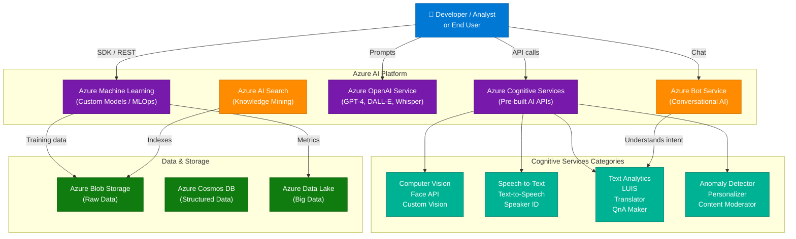
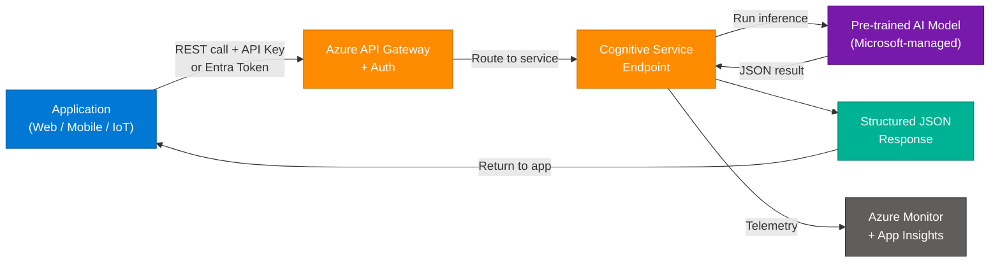
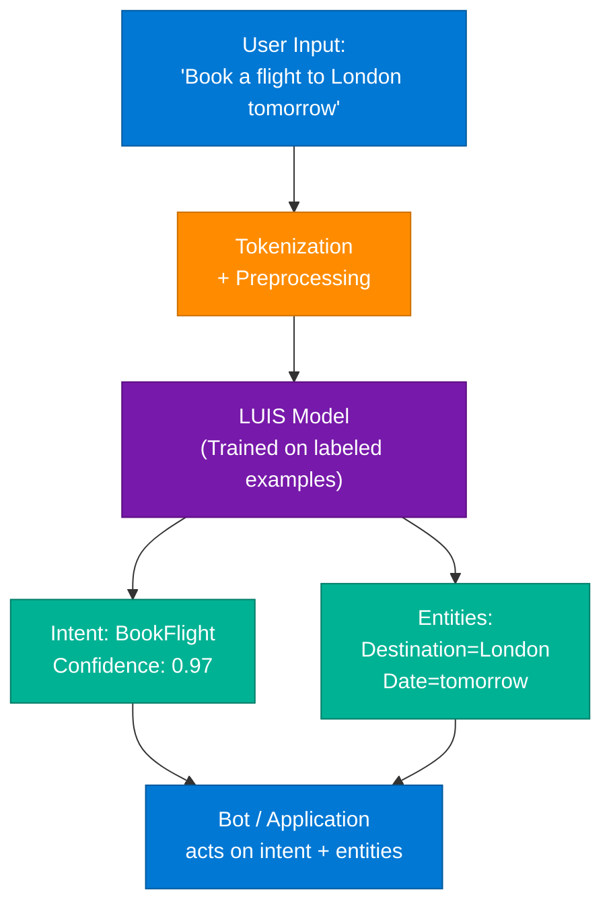
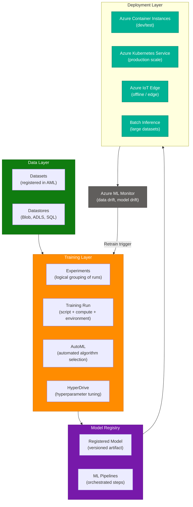
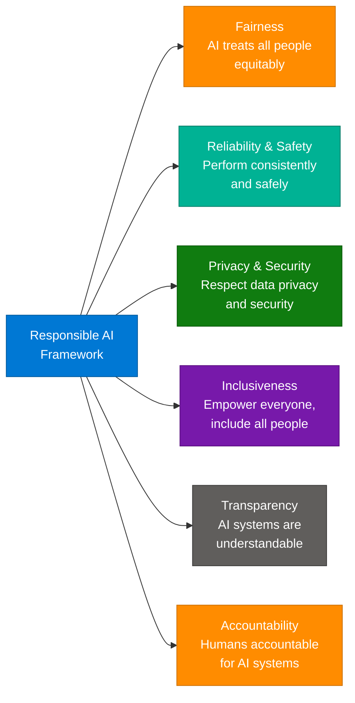

# Azure AI Fundamentals (AI-900) — Complete Interview Guide

> **Source:** [Microsoft Azure AI Fundamentals Interview Questions & Answers](https://www.multisoftsystems.com/interview-questions/microsoft-azure-ai-fundamentals-interview-questions-answers)
> **Last Updated:** July 2026

---

## Table of Contents

1. [What is Azure AI Fundamentals (AI-900)?](#1-what-is-azure-ai-fundamentals-ai-900)
2. [Core Azure AI Service Architecture](#2-core-azure-ai-service-architecture)
3. [Key Azure AI Services Deep Dive](#3-key-azure-ai-services-deep-dive)
4. [Machine Learning on Azure — Technical Deep Dive](#4-machine-learning-on-azure--technical-deep-dive)
5. [Classic ML vs Modern AI Approaches](#5-classic-ml-vs-modern-ai-approaches)
6. [Responsible AI and Governance](#6-responsible-ai-and-governance)
7. [Getting Started — Quickstart Guide](#7-getting-started--quickstart-guide)
8. [Intermediate Interview Q&A — All 20 Questions](#8-intermediate-interview-qa--all-20-questions)
9. [Advanced Interview Q&A — All 10 Questions](#9-advanced-interview-qa--all-10-questions)
10. [Cheatsheet — Key Definitions at a Glance](#10-cheatsheet--key-definitions-at-a-glance)

---

## 1. What is Azure AI Fundamentals (AI-900)?

**Azure AI Fundamentals (AI-900)** is Microsoft's entry-level certification that validates foundational knowledge of AI concepts and how they are implemented within Microsoft Azure. It covers five main AI workloads: machine learning, computer vision, natural language processing (NLP), conversational AI, and responsible AI principles.

The certification is ideal for:
- Non-technical stakeholders who work alongside AI teams
- Developers beginning their AI journey on Azure
- Business analysts evaluating AI solutions
- Anyone preparing for higher-level Azure AI certifications (AI-102, DP-100)

### Key Value Propositions of Azure AI Platform

| Feature | Description |
|---|---|
| **Cognitive Services** | Pre-built AI APIs for vision, speech, language, and decision — zero ML training required |
| **Azure Machine Learning** | End-to-end MLOps platform for custom model training, tracking, and deployment |
| **Azure OpenAI Service** | Enterprise-grade access to GPT-4, DALL-E, Whisper via Azure's security & compliance layer |
| **Azure Bot Service** | Managed platform for building multi-channel conversational bots |
| **Azure AI Search** | Cloud-based AI-powered search with knowledge mining and semantic ranking |
| **Responsible AI** | Built-in fairness, explainability, privacy, and safety frameworks |

---

## 2. Core Azure AI Service Architecture

### 2.1 High-Level Azure AI Ecosystem



### 2.2 Azure AI Workload Categories (AI-900 Exam Domains)

| Domain | Weight | Key Services | What You Need to Know |
|---|---|---|---|
| **AI Workloads & Considerations** | 15-20% | All Azure AI | Types of AI, responsible AI principles |
| **Machine Learning** | 20-25% | Azure ML, AutoML | Supervised/Unsupervised, regression/classification |
| **Computer Vision** | 15-20% | Computer Vision, Custom Vision, Face | OCR, object detection, spatial analysis |
| **NLP** | 15-20% | LUIS, Text Analytics, QnA Maker, Translator | Sentiment, key phrases, NER, intent |
| **Conversational AI** | 15-20% | Bot Service, LUIS, QnA Maker | Bot lifecycle, channels, Cognitive Search integration |
| **Responsible AI** | 10-15% | Fairness, Explainability | 6 Microsoft AI principles |

---

## 3. Key Azure AI Services Deep Dive

### 3.1 Azure Cognitive Services — Service Map

| Service | Category | Primary Use Case | API Type |
|---|---|---|---|
| **Computer Vision** | Vision | Analyze images, detect objects, read text (OCR) | REST / SDK |
| **Custom Vision** | Vision | Train custom image classifiers with your own data | REST / SDK |
| **Face API** | Vision | Detect, identify, verify human faces | REST |
| **Speech-to-Text** | Speech | Transcribe audio to text in real-time or batch | REST / SDK / WebSocket |
| **Text-to-Speech** | Speech | Generate human-like audio from text | REST / SDK |
| **LUIS** | Language | Understand natural language intent and entities | REST |
| **Text Analytics** | Language | Sentiment, key phrases, NER, language detection | REST / SDK |
| **QnA Maker** | Language | Build FAQ bots from existing documents | REST / SDK |
| **Translator** | Language | Translate text across 100+ languages | REST |
| **Anomaly Detector** | Decision | Detect anomalies in time series data | REST |
| **Personalizer** | Decision | Reinforcement learning-based personalization | REST |
| **Content Moderator** | Decision | Moderate text, images, and video | REST |

### 3.2 Azure Cognitive Services Request Pipeline



### 3.3 LUIS — Language Understanding Architecture

**LUIS (Language Understanding Intelligent Service)** maps natural language utterances to structured intents and entities. It is now integrated into **Azure AI Language** (CLU — Conversational Language Understanding).

| Concept | Definition | Example |
|---|---|---|
| **Utterance** | A sentence the user types | "Book a flight to London tomorrow" |
| **Intent** | The user's goal | `BookFlight` |
| **Entity** | Extracted data from utterance | `London` (Destination), `tomorrow` (Date) |
| **Confidence Score** | Model's certainty (0.0–1.0) | 0.97 |



---

## 4. Machine Learning on Azure — Technical Deep Dive

### 4.1 Azure Machine Learning Architecture

**Azure Machine Learning (AML)** is a fully managed cloud platform for the full ML lifecycle: data preparation, training, hyperparameter tuning, deployment, and monitoring.



### 4.2 Supervised vs. Unsupervised vs. Reinforcement Learning

| Dimension | Supervised Learning | Unsupervised Learning | Reinforcement Learning |
|---|---|---|---|
| **Training Data** | Labeled (input + correct output) | Unlabeled (input only) | Environment feedback (reward/penalty) |
| **Goal** | Predict output for new input | Discover hidden patterns | Maximize cumulative reward |
| **Azure Service** | Azure ML (Classification, Regression) | Azure ML (Clustering, PCA) | Azure Personalizer |
| **Example Task** | Email spam detection | Customer segmentation | Content recommendation |
| **Algorithm Examples** | Linear Regression, SVM, Random Forest | K-Means, DBSCAN, PCA | Q-Learning, DQN, PPO |
| **Output Type** | Label or continuous value | Cluster assignment or latent structure | Policy (action → reward mapping) |
| **When to Use** | You have labeled training data | No labels available, exploratory analysis | Sequential decision-making with feedback |

### 4.3 ML Deployment Targets Comparison

| Target | Latency | Scale | Cost | Use Case |
|---|---|---|---|---|
| **Azure Container Instances (ACI)** | Medium | Low | Low | Dev/test, proof of concept |
| **Azure Kubernetes Service (AKS)** | Low | High | Medium | Production, high-throughput |
| **Azure IoT Edge** | Very Low | Limited | Low | Offline, edge scenarios, manufacturing |
| **Batch Inference** | N/A (async) | Very High | Low per unit | Nightly scoring of large datasets |
| **Azure Functions** | Low | Auto-scale | Very Low | Event-driven, lightweight models |

### 4.4 Advanced Deep Learning Concepts

#### Transfer Learning

Transfer learning reuses weights from a model trained on a large dataset (e.g., ImageNet for vision, BERT for NLP) and fine-tunes on a smaller task-specific dataset. This works because:

1. **Early layers** learn universal features (edges, curves, syntax patterns)
2. **Later layers** learn task-specific features
3. Fine-tuning updates only the final layers (or all layers with a very low learning rate)

**In Azure:** Custom Vision and Azure ML Designer both support transfer learning out of the box.

#### Transformer Architecture vs. RNN/LSTM

| Dimension | RNN / LSTM | Transformer |
|---|---|---|
| **Processing** | Sequential (token by token) | Parallel (all tokens simultaneously) |
| **Long-range dependencies** | Struggles (vanishing gradient) | Excellent (self-attention) |
| **Training speed** | Slow | Fast (parallelizable) |
| **Memory** | Fixed-size hidden state | Full context via attention matrix |
| **Azure Example** | Legacy LUIS models | Azure OpenAI GPT-4, BERT-based CLU |
| **Positional information** | Inherent in sequence | Added via positional encoding |

#### GANs (Generative Adversarial Networks)

GANs use a two-player minimax game:
- **Generator (G)**: Takes noise → produces fake data
- **Discriminator (D)**: Takes real or fake data → outputs P(real)

Training objective: `min_G max_D [log D(x) + log(1 - D(G(z)))]`

Applications in Azure: Image synthesis (Azure AI Vision), data augmentation for training sets, anomaly detection via reconstruction error.

---

## 5. Classic ML vs. Modern AI Approaches

| Dimension | Classic ML Approach | Modern Azure AI Approach |
|---|---|---|
| **Model creation** | Hand-craft features, train from scratch | Pre-built APIs (Cognitive Services) or AutoML |
| **Data requirements** | Large labeled datasets required | Small or zero labeled data (pre-trained) |
| **Infrastructure** | Manage own compute | Serverless compute clusters, managed endpoints |
| **Deployment** | Custom Flask/FastAPI server | Azure ML managed endpoints, ACI/AKS one-click |
| **Monitoring** | Manual log scraping | Azure ML Monitor, data drift detection |
| **NLP pipeline** | TF-IDF + SVM | BERT/GPT via Azure OpenAI or AI Language |
| **Vision pipeline** | HOG + Random Forest | Computer Vision API, Custom Vision |
| **Hyperparameter tuning** | Grid search (manual) | HyperDrive (Bayesian, bandit, random sweep) |
| **Cost model** | Fixed compute (VMs always on) | Pay-per-prediction (Cognitive Services), scale-to-zero |
| **Explainability** | Manual SHAP/LIME | Azure ML Responsible AI dashboard |

**Use Modern Azure AI when:**
- You need fast time-to-value
- Your domain is well-served by pre-trained models (vision, speech, text)
- You want managed infrastructure with SLAs

**Use Classic ML when:**
- Your domain requires highly custom feature engineering
- You need full control over the training pipeline
- Data privacy constraints prevent sending data to cloud APIs

---

## 6. Responsible AI and Governance

### Microsoft's 6 Responsible AI Principles



### Security Controls for Azure AI

| Control | Description | Azure Tool |
|---|---|---|
| **Authentication** | API Key or Microsoft Entra ID (AAD) token | Azure Key Vault for key storage |
| **Network Isolation** | Private endpoints, VNet integration | Azure Private Link |
| **Data Encryption** | TLS in transit, AES-256 at rest | Customer-Managed Keys (CMK) via Key Vault |
| **RBAC** | Role-based access to AML workspace and cognitive resources | Azure IAM |
| **Audit Logging** | All API calls logged | Azure Monitor + Log Analytics |
| **Content Safety** | Block harmful inputs/outputs | Azure AI Content Safety service |
| **Data Residency** | Keep data in specific region | Resource region selection + geo-fencing |

### Azure AI Content Safety

Azure AI Content Safety detects harmful content in text and images across 4 categories:

| Category | Severity (0–7) | Examples |
|---|---|---|
| **Hate** | 0–7 | Discriminatory language based on identity |
| **Violence** | 0–7 | Physical harm descriptions |
| **Sexual** | 0–7 | Explicit content |
| **Self-harm** | 0–7 | Suicide / self-harm related content |

---

## 7. Getting Started — Quickstart Guide

### Option 1: Azure Portal (No Code)

1. Go to **portal.azure.com** → Create Resource → "Cognitive Services" or specific service
2. Select subscription, resource group, region, pricing tier (F0 = free)
3. After deployment → go to "Keys and Endpoint" to get API key + endpoint URL
4. Test via Azure Portal's built-in test console

### Option 2: Python SDK — Text Analytics Quickstart

```python
from azure.ai.textanalytics import TextAnalyticsClient
from azure.core.credentials import AzureKeyCredential

endpoint = "https://<your-resource>.cognitiveservices.azure.com/"
key = "<your-api-key>"

client = TextAnalyticsClient(endpoint=endpoint, credential=AzureKeyCredential(key))

documents = [
    "Azure Machine Learning is an amazing platform for building AI models.",
    "I had a terrible experience with the service today.",
    "The product is okay, nothing special."
]

# Sentiment Analysis
result = client.analyze_sentiment(documents=documents)
for idx, doc in enumerate(result):
    print(f"Document {idx+1}: Sentiment={doc.sentiment}, "
          f"Confidence={doc.confidence_scores}")

# Key Phrase Extraction
kp_result = client.extract_key_phrases(documents=documents)
for idx, doc in enumerate(kp_result):
    print(f"Document {idx+1} Key Phrases: {doc.key_phrases}")

# Named Entity Recognition
ner_result = client.recognize_entities(documents=documents)
for idx, doc in enumerate(ner_result):
    for entity in doc.entities:
        print(f"  Entity: {entity.text}, Category: {entity.category}, "
              f"Confidence: {entity.confidence_score:.2f}")
```

### Option 3: Azure ML Python SDK — Training a Custom Model

```python
from azure.ai.ml import MLClient, command
from azure.ai.ml.entities import Environment, AmlCompute
from azure.identity import DefaultAzureCredential

# Connect to AML workspace
ml_client = MLClient(
    credential=DefaultAzureCredential(),
    subscription_id="<subscription-id>",
    resource_group_name="<rg-name>",
    workspace_name="<workspace-name>"
)

# Create or get compute cluster
compute_config = AmlCompute(
    name="cpu-cluster",
    size="Standard_DS3_v2",
    min_instances=0,
    max_instances=4
)
ml_client.compute.begin_create_or_update(compute_config).result()

# Define and submit training job
job = command(
    code="./src",
    command="python train.py --learning-rate ${{inputs.learning_rate}} --epochs ${{inputs.epochs}}",
    inputs={"learning_rate": 0.01, "epochs": 10},
    environment="AzureML-sklearn-1.0-ubuntu20.04-py38-cpu@latest",
    compute="cpu-cluster",
    display_name="my-training-run"
)

returned_job = ml_client.jobs.create_or_update(job)
print(f"Job submitted: {returned_job.name}")
```

### Option 4: Azure CLI Quickstart

```bash
# Install Azure CLI + ML extension
az extension add -n ml

# Login
az login

# Create AML workspace
az ml workspace create \
  --name my-ml-workspace \
  --resource-group my-rg \
  --location eastus

# Create Cognitive Services resource
az cognitiveservices account create \
  --name my-text-analytics \
  --resource-group my-rg \
  --kind TextAnalytics \
  --sku S \
  --location eastus

# Get API keys
az cognitiveservices account keys list \
  --name my-text-analytics \
  --resource-group my-rg
```

### Learning Resources

| Type | Resource |
|---|---|
| **Official Docs** | [learn.microsoft.com/azure/cognitive-services](https://learn.microsoft.com/azure/cognitive-services) |
| **AI-900 Exam Guide** | [learn.microsoft.com/credentials/certifications/azure-ai-fundamentals](https://learn.microsoft.com/credentials/certifications/azure-ai-fundamentals) |
| **Microsoft Learn Path** | "Get started with artificial intelligence on Azure" (free) |
| **Azure ML SDK Docs** | [learn.microsoft.com/azure/machine-learning/concept-v2](https://learn.microsoft.com/azure/machine-learning/concept-v2) |
| **GitHub Samples** | [github.com/Azure-Samples/cognitive-services-quickstart-code](https://github.com/Azure-Samples/cognitive-services-quickstart-code) |

---

## 8. Intermediate Interview Q&A — All 20 Questions

**Q1: What is Artificial Intelligence (AI)?**
> AI is the simulation of human intelligence processes by machines, especially computer systems. These processes include learning (acquiring information), reasoning (using rules to reach approximate or definite conclusions), and self-correction. AI spans narrow AI (task-specific, e.g., image classification), general AI (hypothetical human-level), and super AI (theoretical beyond-human capability).

**Q2: What is Azure AI?**
> Azure AI is Microsoft's collection of cloud-based AI services and technologies that allow developers to build intelligent applications without needing deep ML expertise. It spans four pillars: Cognitive Services (pre-built APIs), Azure Machine Learning (custom model platform), Azure OpenAI Service (large language models), and Azure AI Search (knowledge mining). All services integrate with Azure's security, compliance, and DevOps ecosystem.

**Q3: What are Azure Cognitive Services?**
> Azure Cognitive Services are a family of REST APIs and SDKs that bring AI capabilities (vision, speech, language, decision) into applications without requiring ML expertise. They use Microsoft's pre-trained models, abstract the infrastructure, and expose capabilities via simple HTTPS calls authenticated with an API key or Entra ID token. As of 2024, Cognitive Services are being consolidated under the **Azure AI Services** umbrella brand.

**Q4: Can you name a few Azure Cognitive Services?**
> Key services include: **Computer Vision** (image analysis, OCR), **Face API** (detection, recognition, emotion), **Speech-to-Text / Text-to-Speech** (speech transcription and synthesis), **LUIS** (intent and entity extraction from natural language), **Text Analytics** (sentiment, key phrases, NER, language detection), **QnA Maker** (FAQ bot construction), **Translator** (100+ language translation), **Anomaly Detector** (time series anomaly detection), and **Personalizer** (reinforcement learning-based content ranking).

**Q5: What is Azure Machine Learning?**
> Azure Machine Learning (AML) is a cloud-based MLOps platform for the full machine learning lifecycle — data preparation, training, hyperparameter tuning (HyperDrive), model versioning, deployment (ACI/AKS/Edge), and monitoring (data drift). It supports frameworks including scikit-learn, TensorFlow, PyTorch, XGBoost, and LightGBM. It also offers AutoML for automated algorithm selection and Designer for no-code drag-and-drop pipelines.

**Q6: What is Knowledge Mining in Azure AI?**
> Knowledge mining is the process of extracting actionable insights from unstructured data at scale using AI. In Azure, **Azure AI Search** (formerly Azure Cognitive Search) is the primary knowledge mining service. It ingests content from Blob Storage, SharePoint, or SQL, applies an AI enrichment pipeline (OCR, entity extraction, key phrase extraction, translation), indexes the enriched data, and exposes it via a semantic search API. Use cases include HR document search, legal e-discovery, and product catalog search.

**Q7: What is Computer Vision, and how does it work in Azure?**
> Computer Vision is the field of AI that enables computers to interpret and understand visual information. Azure's **Computer Vision** service uses convolutional neural networks (CNNs) pre-trained on massive image datasets to provide: image analysis (objects, scenes, colors), OCR (Read API for printed and handwritten text), face detection, spatial analysis (counting people, distance measurement), and smart cropping. For custom tasks, **Custom Vision** lets you train classifiers with as few as 5 images per class using transfer learning.

**Q8: What is Azure Bot Service?**
> Azure Bot Service is a managed PaaS platform for building, testing, and deploying enterprise-grade conversational bots. It provides the **Bot Framework SDK** (C# and Python), integrates with **LUIS** for intent recognition and **QnA Maker** for FAQ answering, and deploys bots across channels including Microsoft Teams, Slack, WhatsApp, web chat, and phone (via Azure Communication Services). Bots run as Azure App Service or Azure Functions under the hood.

**Q9: What does LUIS stand for, and what is its purpose?**
> LUIS stands for **Language Understanding Intelligent Service**. It maps natural language utterances to structured **intents** (the user's goal) and **entities** (the data within the utterance). For example, "Book a flight to Paris next Monday" → Intent: `BookFlight`, Entities: `{Destination: Paris, Date: next Monday}`. LUIS is now part of **Azure AI Language** as Conversational Language Understanding (CLU), which adds multilingual support and deeper transformer-based NLU. LUIS returns a JSON response with a ranked list of intents and confidence scores.

**Q10: How does Text Analytics work in Azure Cognitive Services?**
> Text Analytics (now **Azure AI Language**) provides NLP capabilities over raw text without training: **Sentiment Analysis** (positive/negative/neutral with confidence scores per sentence), **Key Phrase Extraction** (top noun phrases), **Named Entity Recognition** (persons, locations, organizations, dates, quantities), **Entity Linking** (disambiguate entities with Wikipedia links), and **Language Detection** (identifies language from 120+ options with a confidence score). It processes input via REST POST with a documents array and returns structured JSON.

**Q11: What is QnA Maker, and how is it used?**
> QnA Maker (now **Azure AI Language — Question Answering**) extracts question-answer pairs from existing knowledge sources: FAQ pages, PDFs, Word docs, or manually entered pairs. It builds a knowledge base indexed in Azure AI Search, exposes a REST endpoint, and returns the best matching answer with a confidence score. It integrates directly with Azure Bot Service to create FAQ bots. Key concepts: **KB (Knowledge Base)**, **chit-chat** (personality layer), **active learning** (improves from user corrections), and **multi-turn** (follow-up question support).

**Q12: Can you explain speech recognition in Azure AI?**
> **Azure AI Speech** (Speech-to-Text) converts spoken audio to text using deep acoustic and language models. It supports: **Real-time transcription** (streaming WebSocket), **Batch transcription** (large audio files via REST), **Custom Speech** (domain-specific vocabulary fine-tuning), **Speaker diarization** (who said what), and **Pronunciation assessment** (for language learning apps). The Speech SDK supports 14 programming languages and 100+ locales. Under the hood, it uses an encoder-decoder transformer trained on thousands of hours of labeled audio.

**Q13: What is the difference between supervised and unsupervised learning?**
> **Supervised learning** trains a model on labeled data (input-output pairs) to predict outputs for new inputs — examples: email spam detection (classification), house price prediction (regression). **Unsupervised learning** finds hidden patterns in unlabeled data — examples: customer segmentation (K-Means clustering), dimensionality reduction (PCA), anomaly detection (Isolation Forest). In Azure ML, supervised algorithms include Linear Regression, Decision Tree, and Two-Class Neural Network. Unsupervised algorithms include K-Means Clustering and PCA.

**Q14: How can Azure Machine Learning help with model deployment?**
> AML provides managed deployment targets: **ACI** (quick dev/test containers), **AKS** (production-scale Kubernetes clusters with autoscaling and rolling deployments), **Azure IoT Edge** (offline edge deployment), and **Batch Endpoints** (large-scale asynchronous scoring). Models are packaged as Docker containers with a scoring script and environment definition. Online endpoints provide a REST API with built-in authentication, traffic splitting for A/B testing, and Application Insights telemetry. Model versioning ensures reproducibility.

**Q15: What is Anomaly Detection, and how does Azure support it?**
> Anomaly detection identifies data points that deviate significantly from expected patterns in time series data. Azure's **Anomaly Detector** service exposes three APIs: **Univariate** (single metric, detects spikes, dips, trend changes), **Multivariate** (multiple correlated metrics, detects complex anomalies across sensors), and **Streaming** (real-time detection). It uses an adaptive algorithm that automatically detects seasonality and trends, returning anomaly scores and expected value ranges. Common use cases: IoT sensor monitoring, financial fraud, IT operations.

**Q16: What is Azure Personalizer, and what is its use case?**
> Azure Personalizer is a **reinforcement learning-as-a-service** API that learns to rank content (articles, products, UI elements) for individual users in real time. It uses a **Rank** API call (sends context + actions → returns best action) and a **Reward** API call (sends actual user reward signal back, e.g., 1 for click, 0 for no click). The service uses Vowpal Wabbit's contextual bandit algorithm under the hood. Typical use cases: news feed ranking, e-commerce product recommendations, UI layout optimization.

**Q17: What role does Azure Databricks play in AI?**
> Azure Databricks is a unified analytics platform built on Apache Spark, optimized for Azure. In the AI lifecycle it handles: **Data ingestion and ETL** (ingest from ADLS, Cosmos DB, Event Hubs), **Exploratory Data Analysis** (interactive notebooks, SQL analytics), **Feature Engineering** (distributed transformations using Spark), **Model Training** (MLflow tracking, distributed training with Horovod), and **ML Pipeline Orchestration** (with Azure Data Factory or AML pipelines). It bridges big data and ML, enabling training on datasets too large for a single machine.

**Q18: How does Azure support conversational AI?**
> Azure's conversational AI stack combines: **Azure Bot Service** (channel management, deployment, Teams/Slack integration), **LUIS / CLU** (intent and entity recognition from free-form text), **QnA Maker / Question Answering** (direct FAQ lookup), **Azure OpenAI Service** (GPT-4 for open-ended conversation and generation), and **Azure Communication Services** (voice channel integration). These services are orchestrated via Bot Framework Composer (visual) or Bot Framework SDK (code). The Copilot Studio (Power Virtual Agents) provides a low-code wrapper for business users.

**Q19: What is model training in Azure Machine Learning?**
> Model training in Azure ML is the process of feeding a dataset to a learning algorithm running on managed compute to produce a trained model artifact. Key concepts: **Experiment** (logical grouping), **Run** (single execution of a training script), **Run Configuration** (environment + compute definition), **Metrics** (logged via MLflow or AML SDK for comparison), **Artifacts** (model files saved to run outputs). Azure ML supports local, remote (compute clusters), and distributed training (multiple nodes/GPUs). AutoML automates algorithm selection and hyperparameter tuning.

**Q20: Can you deploy Azure Machine Learning models to edge devices?**
> Yes. Azure ML integrates with **Azure IoT Edge** to deploy models as Docker containers that run locally on edge devices (industrial sensors, cameras, gateways). The workflow: train and register model in AML → package as IoT Edge module → deploy via IoT Hub to device fleet. Benefits: ultra-low latency (no round-trip to cloud), offline capability, reduced bandwidth costs. The model runs in **ONNX** format for cross-platform compatibility, or as native Python with trimmed dependencies using Azure ML's packaging tools.

---

## 9. Advanced Interview Q&A — All 10 Questions

**Q1: Explain transfer learning in deep learning with an example.**
> Transfer learning takes a pre-trained neural network and adapts it to a related task by reusing learned weights. The rationale: early layers learn universal features (edges, curves for vision; morphemes, syntax for NLP) transferable across domains, while later layers learn task-specific abstractions. **Process:** (1) Load pre-trained model (e.g., ResNet-50 on ImageNet), (2) Freeze early layers, (3) Replace final classification layer, (4) Fine-tune on small task-specific dataset with a low learning rate. **Azure Example:** Custom Vision uses EfficientNet as a backbone; Azure AI Language uses BERT/RoBERTa for CLU fine-tuning. This enables high accuracy with as few as 15–50 labeled examples per class.

**Q2: How do attention mechanisms work in sequence-to-sequence models?**
> Attention mechanisms solve the information bottleneck in encoder-decoder seq2seq models where a fixed-length context vector was insufficient for long sequences. **Mechanism:** At each decoder step *t*, compute a compatibility score between decoder hidden state *h_t* and each encoder hidden state *h_i* (e.g., via dot product or learned MLP). Apply softmax to get attention weights α_ti summing to 1. Compute context vector as weighted sum: `c_t = Σ α_ti * h_i`. The decoder uses *c_t* alongside its hidden state. **Multi-head attention** (Transformer) runs this in parallel across multiple representation subspaces, capturing different types of relationships simultaneously.

**Q3: What are GANs and how do they work?**
> GANs (Generative Adversarial Networks) consist of two competing neural networks: **Generator (G)** takes random noise z and produces synthetic data G(z); **Discriminator (D)** takes real data x or G(z) and outputs P(real). They train in a minimax game: G minimizes `log(1 - D(G(z)))` while D maximizes `log D(x) + log(1 - D(G(z)))`. Training alternates: update D for k steps then update G for 1 step. At convergence, D cannot distinguish real from generated. **Challenges:** mode collapse (G produces limited variety), training instability. **Variants:** DCGAN (convolutional), WGAN (Wasserstein distance for stability), StyleGAN (high-fidelity face generation). Azure uses GAN-based techniques in Azure AI Vision's image generation and Content Understanding.

**Q4: How do LSTM networks handle vanishing gradients?**
> Standard RNNs suffer from vanishing gradients during backpropagation through time (BPTT) — gradients shrink exponentially across many timesteps, preventing learning of long-range dependencies. **LSTM's solution:** introduces a **cell state** (conveyor belt) that runs with only elementwise multiplications by gate values (not matrix multiplications), allowing gradients to flow over hundreds of timesteps. Three gates: **Forget gate** (sigmoid): decides what to discard from cell state. **Input gate** (sigmoid × tanh): decides what new information to store. **Output gate** (sigmoid × tanh(cell state)): controls what portion of cell state is exposed as hidden state. The additive nature of the cell state update (`C_t = f⊙C_{t-1} + i⊙C̃_t`) creates a "gradient highway." GRUs simplify this to two gates (reset and update) with similar effectiveness.

**Q5: What are challenges of training very deep neural networks and how are they addressed?**
> **Vanishing/exploding gradients:** Solved by batch normalization (normalizes layer inputs to zero mean, unit variance), residual/skip connections (ResNet), gradient clipping, and proper weight initialization (He for ReLU, Xavier for tanh/sigmoid). **Overfitting:** Solved by dropout (randomly zero out neurons during training), L1/L2 regularization, data augmentation, early stopping. **Computational cost:** Solved by mixed-precision training (FP16/BF16), gradient checkpointing (trade compute for memory), model parallelism (split model across GPUs), data parallelism (replicate model, partition batch). **Optimization landscape:** Solved by adaptive optimizers (Adam, AdamW), learning rate warmup + cosine decay schedules. **In Azure:** Azure ML's distributed training with Horovod/PyTorch DDP handles multi-GPU/multi-node training automatically.

**Q6: Explain model-based vs. model-free reinforcement learning.**
> **Model-based RL** builds an explicit internal model of the environment — a transition function P(s'|s,a) and reward function R(s,a) — and uses it to plan via lookahead (e.g., Monte Carlo Tree Search in AlphaGo, Dyna-Q). Advantages: sample-efficient, can plan without real environment interaction. Disadvantage: model errors compound — inaccurate environment model leads to poor policies. **Model-free RL** learns directly from environment interactions without building an explicit model. Two families: **Value-based** (learn Q(s,a) via Q-Learning, DQN — select action with max Q-value) and **Policy gradient** (directly optimize policy π(a|s) via REINFORCE, PPO, A3C). Model-free is more flexible but requires many environment interactions (sample-inefficient). **Azure Personalizer** uses model-free contextual bandit (a simplified RL where each episode is one timestep).

**Q7: How does the Transformer architecture overcome RNN limitations?**
> RNNs process sequences sequentially — each token depends on the previous hidden state, preventing parallelization and suffering from long-range dependency loss. **Transformer's key innovations:** (1) **Self-attention:** every token attends to every other token in the sequence simultaneously — no sequential dependency. (2) **Positional encoding:** adds sinusoidal or learned position embeddings to token embeddings to retain sequence order information without sequential processing. (3) **Multi-head attention:** runs scaled dot-product attention in parallel across H heads (`head_i = Attention(QW_i^Q, KW_i^K, VW_i^V)`), then concatenates and projects. (4) **Feed-forward sublayers** applied position-wise for nonlinear transformation. (5) **Layer normalization + residual connections** stabilize training of deep stacks. This enables full parallelization during training and O(1) path length between any two tokens (vs O(n) for RNNs). **Azure:** All Azure OpenAI models (GPT-4, GPT-3.5, DALL-E, Whisper) are Transformer-based.

**Q8: What is the role of the learning rate, and how can it be optimized?**
> The learning rate (η) controls the step size of parameter updates: `θ ← θ - η ∇L(θ)`. **Too high:** overshoots minima, loss diverges. **Too low:** extremely slow convergence, trapped in poor local minima. **Optimization techniques:** (1) **Learning rate schedules:** Step decay (reduce by factor every N epochs), cosine annealing (smoothly oscillate), exponential decay. (2) **Warmup:** start with η=0, linearly increase to target over first N steps — prevents instability when optimizer has no gradient history. (3) **Adaptive methods:** Adam (maintains per-parameter first and second moment estimates, effective η adapts per parameter), AdamW (Adam + decoupled weight decay), RMSprop. (4) **Learning rate finder:** run a batch with η increasing exponentially, plot loss vs η, pick η just before loss starts diverging. (5) **Cyclical learning rates:** oscillate between min and max η — helps escape local minima.

**Q9: Describe overfitting and methods to prevent it.**
> Overfitting occurs when a model memorizes training data noise (including irrelevant patterns) rather than learning generalizable signal — training loss low, validation loss high, large train-test performance gap. **Root causes:** model too complex relative to dataset size, insufficient training data, noise in labels. **Prevention techniques:** (1) **Regularization:** L2 (adds λ‖w‖² to loss, shrinks weights toward zero), L1 (adds λ‖w‖₁, promotes sparsity). (2) **Dropout:** randomly zero out neurons with probability p during training — prevents co-adaptation, acts as ensemble of thinned networks. (3) **Data augmentation:** random crops, flips, rotations (vision); synonym replacement, back-translation (NLP) — artificially expands training set. (4) **Early stopping:** monitor validation loss, stop when it starts increasing. (5) **Cross-validation:** k-fold ensures model generalizes across different data splits. (6) **Reduce model complexity:** fewer layers, smaller hidden dimensions. (7) **Batch normalization:** indirect regularization effect by adding noise to each mini-batch.

**Q10: Explain ensemble learning methods with an example.**
> Ensemble methods combine multiple weak learners to form a strong learner, reducing variance (bagging), bias (boosting), or both. **Three main strategies:** (1) **Bagging (Bootstrap Aggregating):** train multiple models on random data subsets (with replacement), aggregate by majority vote or averaging. **Random Forest** is the canonical example — each tree sees a random data subset AND random feature subset, reducing correlation between trees. (2) **Boosting:** train models sequentially where each model focuses on errors of the previous. **AdaBoost** reweights misclassified examples; **Gradient Boosting** (XGBoost, LightGBM, CatBoost) fits each model on the residuals of the previous. (3) **Stacking:** train a meta-learner on predictions of base models (level-0) using cross-validation to prevent data leakage. **In Azure ML:** AutoML evaluates ensembles as a final step, VotingClassifier and StackingClassifier are available via sklearn integration in Designer.

---

## 10. Cheatsheet — Key Definitions at a Glance

| Term | One-Line Definition |
|---|---|
| **Azure AI Services** | Umbrella brand for pre-built AI APIs (formerly Cognitive Services) |
| **LUIS / CLU** | Maps natural language to structured intents + entities |
| **Text Analytics** | NLP on raw text: sentiment, key phrases, NER, language detection |
| **QnA Maker** | Extracts Q&A pairs from documents to power FAQ bots |
| **Computer Vision** | Analyzes images/video: objects, faces, OCR, scene description |
| **Custom Vision** | Transfer learning-based custom image classifier (few-shot) |
| **Azure ML** | End-to-end MLOps platform for custom model training and deployment |
| **AutoML** | Automated algorithm selection + hyperparameter tuning |
| **HyperDrive** | Azure ML's hyperparameter sweep engine (Bayesian, bandit, random) |
| **Anomaly Detector** | Time series anomaly detection (univariate + multivariate) |
| **Personalizer** | Reinforcement learning API for real-time content ranking |
| **Azure Databricks** | Spark-based analytics platform for big data + ML feature engineering |
| **IoT Edge** | Deploy ML models to offline edge devices via IoT Hub |
| **Transfer Learning** | Reuse pre-trained weights and fine-tune on task-specific data |
| **Attention Mechanism** | Weighted sum of encoder states, lets decoder focus on relevant tokens |
| **GAN** | Generator + Discriminator competing to produce realistic synthetic data |
| **LSTM** | RNN variant with cell state and gating mechanism to handle long sequences |
| **Transformer** | Parallel self-attention architecture powering all modern LLMs |
| **Overfitting** | Model memorizes training noise; high train accuracy, low test accuracy |
| **Ensemble Learning** | Combine multiple models (bagging/boosting/stacking) for better accuracy |
| **Responsible AI** | Microsoft's 6 principles: Fairness, Reliability, Privacy, Inclusiveness, Transparency, Accountability |

---

*Sources: [Multisoft Systems — Azure AI Fundamentals Interview Questions](https://www.multisoftsystems.com/interview-questions/microsoft-azure-ai-fundamentals-interview-questions-answers) + Microsoft Azure AI documentation + domain knowledge enrichment | Last Updated: July 2026*
