# Azure AI Search — Complete Pro Guide

> **Source:** [YouTube — Azure AI Search Full Course (91 min)](https://www.youtube.com/watch?v=yu4M7OKjnR4)  
> **Presenter:** Microsoft Azure MVP  
> **Extracted & Structured:** Interview-ready reference covering setup, indexing, search types, RAG, vectors, hybrid search, and agentic RAG

---

## Table of Contents

1. [What is Azure AI Search?](#1-what-is-azure-ai-search)
2. [Creating an Azure AI Search Resource](#2-creating-an-azure-ai-search-resource)
   - [Pricing Tiers & SKUs](#21-pricing-tiers--skus)
   - [Scaling — Replicas & Partitions](#22-scaling--replicas--partitions)
   - [Networking](#23-networking)
3. [Core Concepts — Index, Indexer, Data Source, Skillset](#3-core-concepts--index-indexer-data-source-skillset)
4. [Simple Search — REST API & SDK](#4-simple-search--rest-api--sdk)
5. [Full-Text Search (BM25 / Lucene)](#5-full-text-search-bm25--lucene)
   - [Simple Query Syntax](#51-simple-query-syntax)
   - [Full Lucene Query Syntax](#52-full-lucene-query-syntax)
   - [Search Fields & Filters](#53-search-fields--filters)
6. [Semantic Search](#6-semantic-search)
7. [Vector Search](#7-vector-search)
   - [How Embeddings Work](#71-how-embeddings-work)
   - [Integrated Vectorization](#72-integrated-vectorization)
   - [Querying with Vectors](#73-querying-with-vectors)
8. [Hybrid Search](#8-hybrid-search)
9. [AI Enrichment & Skillsets](#9-ai-enrichment--skillsets)
10. [Agentic RAG — AI Agents + Azure AI Search](#10-agentic-rag--ai-agents--azure-ai-search)
11. [Architecture Patterns](#11-architecture-patterns)
12. [Interview Quick Reference](#12-interview-quick-reference)

---

## 1. What is Azure AI Search?

**Azure AI Search** (formerly Azure Cognitive Search) is a **cloud-hosted search service** that transforms your data — structured or unstructured — into **intelligent, AI-powered, searchable insights**.

### Two Primary Components

| Component | Role |
|---|---|
| **Indexing Engine** | Ingests content, transforms it with AI, and stores it in a search index |
| **Query Engine** | Executes queries from simple keyword lookups to complex AI-assisted semantic and vector queries |

### High-Level Architecture

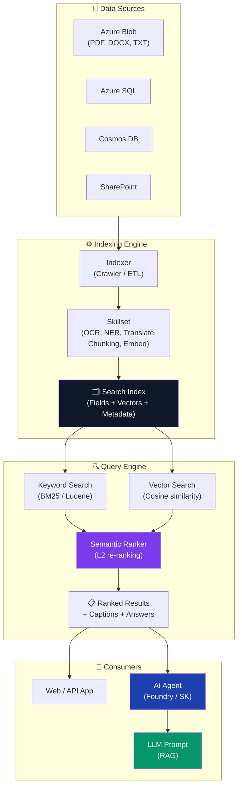

### Why Use Azure AI Search?

- **Any data type:** Images, audio, text, multilingual content
- **AI-enhanced results:** Results ranked and refined by language models
- **RAG Supercharger:** Gives AI agents and LLMs the specific knowledge they need to respond accurately to queries
- **Scalable & managed:** Fully managed cloud service — no infrastructure management

### When to Use It?

> Use Azure AI Search **any time you need to quickly retrieve specific knowledge from a large, complex dataset** — especially when powering AI agents, chatbots, or enterprise Q&A systems.

---

## 2. Creating an Azure AI Search Resource

### Steps (Azure Portal)

1. Go to **Azure Portal → Create a resource → Search for "Azure AI Search"**
2. Provide: Subscription, Resource Group, **Name** (e.g., `ais-east-us2-demo`), **Region**
3. Select **Pricing Tier**
4. Configure **Scale** (Replicas + Partitions)
5. Configure **Networking** (Public or Private)
6. Review & Create

#### Resource Creation Flow

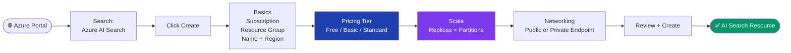

---

### 2.1 Pricing Tiers & SKUs

| Tier | Storage per Partition | Vector Quota | Search Units | Notes |
|---|---|---|---|---|
| **Free** | 50 MB | Limited | 1 | Evaluation only. Not for production. |
| **Basic** | 2 GB | Limited | Up to 3 | ~$75/month. Good for small workloads. |
| **Standard (S1)** | 25 GB | ~35 GB vector/partition | Up to 36 | Most common production tier |
| **Standard S2/S3** | 100–200 GB | Higher | Up to 36–120 | Large enterprise use |
| **Storage Optimized (L1/L2)** | 1–2 TB | Very high | High | Massive index sizes |

> **Key insight:** Vector quota ≤ total storage per partition. E.g., Standard gives 25 GB/partition of which up to 35 GB can be vector storage. Adding partitions multiplies capacity.

#### Search Units = Replicas × Partitions

```
Search Units (SU) = Replicas × Partitions
Max SU for Standard = 36
Example: 3 replicas × 3 partitions = 9 SUs
```

- **Replicas** = Copies of the index (for concurrent query throughput / HA)
- **Partitions** = Shards of the index (for storage and indexing throughput)

> **Confidential Computing (optional):** Encrypts data even *during processing* — not just at rest and in transit. Only needed for highly regulated/sensitive workloads.

---

### 2.2 Scaling — Replicas & Partitions

| Dimension | What It Does | When to Increase |
|---|---|---|
| **Replicas** | Adds copies of the index for concurrent query handling | When response time degrades under load |
| **Partitions** | Shards index data for larger storage & indexing throughput | When index size exceeds partition limits |

> **Best Practice:** Start with **1 replica, 1 partition**. Establish a baseline. Add replicas only once you have measured concurrent request load. Adding replicas also improves **SLA guarantees**.

**SLA Requirements:**
- **3+ replicas** → 99.9% read SLA + write SLA
- **2 replicas** → 99.9% read SLA only
- **1 replica** → No SLA

#### Replica × Partition — Capacity & SLA Grid

```mermaid
quadrantChart
    title Replicas vs Partitions Trade-offs
    x-axis Low Storage --> High Storage
    y-axis Low Throughput --> High Throughput
    quadrant-1 Scale-Out (More Queries + Data)
    quadrant-2 Query Optimized (Many Replicas)
    quadrant-3 Minimal (Dev / Test)
    quadrant-4 Storage Optimized (Large Index)
    "1R × 1P (No SLA)": [0.1, 0.1]
    "2R × 1P (Read SLA)": [0.15, 0.45]
    "3R × 1P (Read+Write SLA)": [0.15, 0.7]
    "1R × 3P (More Storage)": [0.55, 0.1]
    "3R × 3P (Balanced)": [0.55, 0.7]
    "6R × 6P (Enterprise)": [0.85, 0.85]
```

#### SLA Ladder

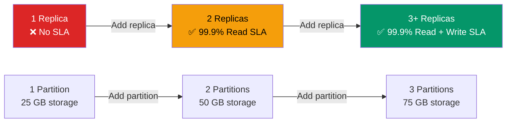

---

### 2.3 Networking

| Mode | Description | Use Case |
|---|---|---|
| **Public** | Accessible from the internet (default) | Dev/test environments |
| **Private Endpoint** | Traffic goes through Azure VNet only | Production enterprise deployments |
| **IP Firewall Rules** | Restrict to specific IP ranges | Partial restriction |

> For **enterprise production**, always use **Private Endpoints** to keep all traffic within your VNet and away from public internet.

#### Public vs Private Endpoint Topology

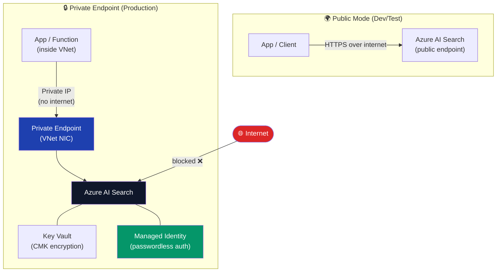

---

## 3. Core Concepts — Index, Indexer, Data Source, Skillset

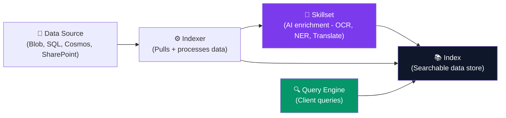

### Key Concepts Explained

| Concept | Description | Analogy |
|---|---|---|
| **Index** | The searchable database — stores all fields including vectors | Like a database table with rows & columns |
| **Indexer** | A crawler/pipeline that reads from a data source and populates the index | Like an ETL pipeline |
| **Data Source** | Connection definition to your raw data (Blob, SQL, Cosmos DB, etc.) | Like a connection string |
| **Skillset** | A pipeline of AI skills (OCR, translation, NER) applied during indexing | Like a data transformation layer |

### Index Fields

Each field in an index has attributes:

| Attribute | Meaning |
|---|---|
| `Retrievable` | Field is returned in search results |
| `Searchable` | Field can be searched with text queries |
| `Filterable` | Field can be used in `$filter` expressions |
| `Sortable` | Field can sort results |
| `Facetable` | Field can be used for faceted navigation |

#### Typical Index Field Attribute Matrix

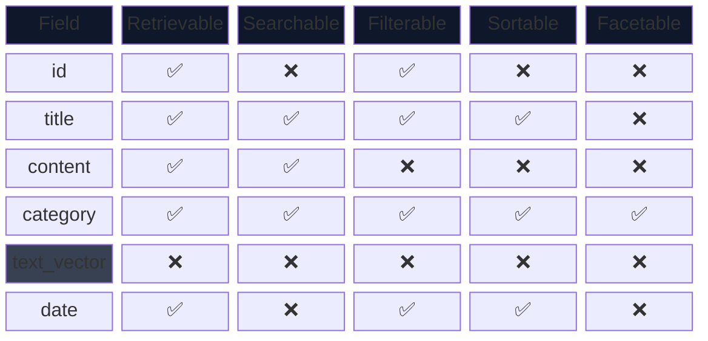

> **Note:** `text_vector` is typically set to **not retrievable** in query results (to hide the raw embedding array), but is still used internally for vector similarity search.

---

## 4. Simple Search — REST API & SDK

### REST API Example

```http
GET https://<search-name>.search.windows.net/indexes/<index-name>/docs?api-version=2024-07-01
    &search=*
    &$top=10
Authorization: api-key <your-api-key>
```

### Python SDK Example

```python
from azure.search.documents import SearchClient
from azure.core.credentials import AzureKeyCredential

client = SearchClient(
    endpoint="https://<name>.search.windows.net",
    index_name="<index>",
    credential=AzureKeyCredential("<api-key>")
)

# Search everything
results = client.search(search_text="*", top=10)
for r in results:
    print(r)
```

### Authentication Options

| Method | How | Recommended |
|---|---|---|
| **API Key** | Header: `api-key: <key>` | Dev/simple integrations |
| **Managed Identity** | Azure Entra ID (passwordless) | ✅ Production |
| **RBAC Roles** | Assign roles via Azure portal | ✅ Production |

> Use **Managed Identity** in production — no secrets in code, no rotation burden.

#### API Key vs Managed Identity Auth Flow

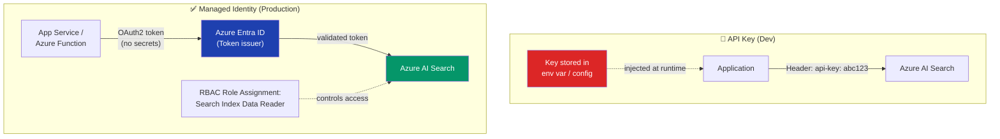

---

## 5. Full-Text Search (BM25 / Lucene)

Azure AI Search uses **Apache Lucene** for full-text indexing with **BM25** ranking (same algorithm as Elasticsearch, Solr).

### BM25 Query Pipeline

```mermaid
flowchart LR
    Q["🔤 Query Text\n'azure machine learning'"] --> Analyze["Text Analyzer\n(Tokenize, Lowercase,\nRemove Stopwords, Stem)"]
    Analyze --> Tokens["Tokens\n['azure', 'machin', 'learn']"] 
    Tokens --> Lookup["Inverted Index Lookup\n(Which docs contain each token?)"]
    Lookup --> BM25["BM25 Scoring\nScore = TF × IDF × doc-length-norm"]
    BM25 --> Ranked["Ranked Doc List\n(by relevance score)"]
    Ranked --> Filter["Apply Filters\n($filter, $select, $top)"]
    Filter --> Results["📋 Search Results"]

    style BM25 fill:#1e40af,color:#fff
    style Results fill:#059669,color:#fff
```

> **BM25 Formula intuition:** A term gets a higher score if it appears **frequently in the document** (TF) but **rarely across all documents** (IDF). Short documents are boosted because the same term frequency in a short doc signals higher relevance.

### 5.1 Simple Query Syntax

The default query syntax. Best for basic keyword search.

| Operator | Example | Meaning |
|---|---|---|
| `word` | `azure search` | Match any of these words (OR) |
| `"phrase"` | `"azure ai search"` | Exact phrase match |
| `+word` | `+azure +search` | Must contain both (AND) |
| `-word` | `azure -storage` | Exclude word |
| `word*` | `azure*` | Prefix/wildcard |
| `word~` | `azure~` | Fuzzy match (typo tolerance) |

```python
# Simple query
results = client.search(
    search_text="azure ai search",
    query_type="simple",
    search_fields=["title", "content"]
)
```

---

### 5.2 Full Lucene Query Syntax

More powerful. Use `query_type="full"` to enable.

| Feature | Syntax | Example |
|---|---|---|
| **Field-scoped** | `field:value` | `title:azure` |
| **Fuzzy** | `term~N` | `azure~1` (1 edit distance) |
| **Proximity** | `"term1 term2"~N` | `"azure search"~3` |
| **Regex** | `/pattern/` | `/az.*search/` |
| **Boosting** | `term^N` | `azure^2 search` |
| **Range** | `[min TO max]` | `date:[2024 TO 2025]` |

```python
results = client.search(
    search_text="title:azure AND content:search~1",
    query_type="full"
)
```

---

### 5.3 Search Fields & Filters

```python
results = client.search(
    search_text="machine learning",
    # Limit which fields to search
    search_fields=["title", "description"],
    # OData filter expression
    filter="category eq 'AI' and date ge 2024-01-01",
    # Which fields to return
    select=["title", "category", "date"],
    # Sort order
    order_by=["date desc"],
    # Pagination
    top=10,
    skip=0
)
```

#### OData Filter Operators

| Operator | Meaning | Example |
|---|---|---|
| `eq` | Equals | `category eq 'AI'` |
| `ne` | Not equals | `status ne 'draft'` |
| `gt / ge` | Greater than / or equal | `score ge 0.8` |
| `lt / le` | Less than / or equal | `price le 100` |
| `and / or / not` | Logical operators | `a eq 1 and b eq 2` |

#### Facets

Facets enable **drill-down navigation** (like Amazon's filter sidebar):

```python
results = client.search(
    search_text="*",
    facets=["category,count:5", "year,count:10"]
)
# Returns: facets["category"] = [{"value": "AI", "count": 42}, ...]
```

---

## 6. Semantic Search

**Semantic Search** uses a deep-learning model to **re-rank** the top BM25 results by understanding the *intent* of the query — not just keyword overlap.

### How It Works

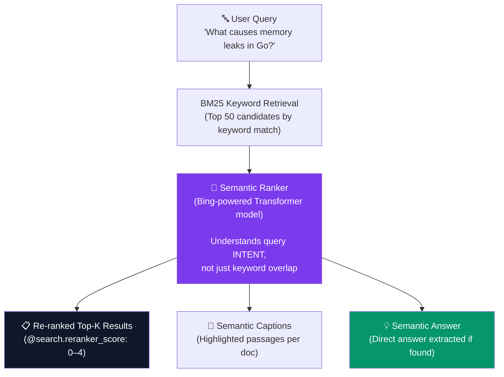

> **Key distinction:** Semantic Ranker does NOT search new documents — it only **re-ranks** the top-50 candidates already retrieved by BM25. This is why BM25 recall quality still matters even when using semantic search.

```
1. BM25 retrieves top-50 keyword candidates
2. Semantic Ranker (Bing-powered L2 model) re-ranks the top 50
3. Returns top-K results with semantic relevance scores
4. Optionally: generates a "semantic caption" and "semantic answer"
```

### Enabling Semantic Search

1. **Portal:** Enable "Semantic Ranker" in your AI Search index configuration (free tier available for limited queries/month)
2. **Code:**

```python
from azure.search.documents.models import QueryType, SemanticConfiguration

results = client.search(
    search_text="what are the benefits of hybrid search?",
    query_type=QueryType.SEMANTIC,
    semantic_configuration_name="my-semantic-config",
    query_caption="extractive",    # Extract relevant captions from docs
    query_answer="extractive",     # Extract a direct answer if found
    top=5
)

for r in results:
    print(r["@search.score"])        # BM25 score
    print(r["@search.reranker_score"])  # Semantic reranker score (0-4)
    if r.get("@search.captions"):
        print(r["@search.captions"][0]["text"])
```

### Semantic Answer vs Caption

| Feature | Description |
|---|---|
| **Semantic Caption** | Highlighted passage from a doc that best answers the query |
| **Semantic Answer** | Direct synthesized answer if one is clearly present in results |

> **Interview Note:** Semantic search is **NOT** vector search. It's L2 re-ranking of BM25 keyword results using a language model. No embeddings are stored.

---

## 7. Vector Search

**Vector Search** finds documents by **semantic similarity** using embeddings (dense numerical vectors). Instead of keyword matching, it finds the *closest vectors* in high-dimensional space.

### 7.1 How Embeddings Work

```
Text → Embedding Model → [0.12, -0.87, 0.45, ... 1536 dims] (Vector)

Query: "What is machine learning?"
Doc 1: "ML is a subset of AI"         → Vector A
Doc 2: "Pizza delivery in New York"   → Vector B

Cosine similarity(Query, A) = 0.92  ← High match
Cosine similarity(Query, B) = 0.11  ← Low match
```

#### Embedding Pipeline — From Text to Vector

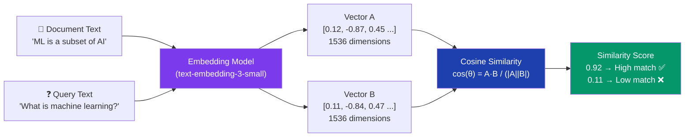

#### Vector Space Concept

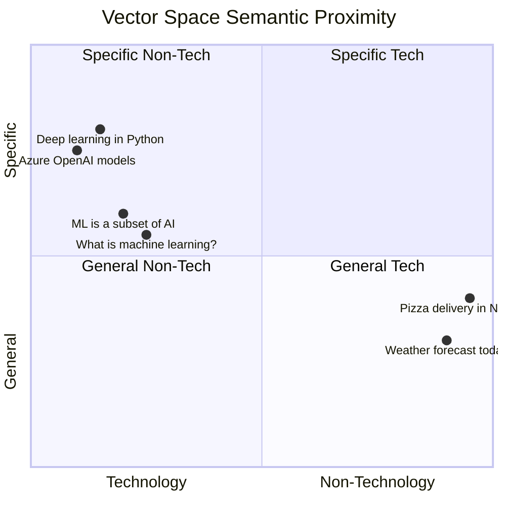

> Semantically similar texts cluster near each other in vector space. The query *"What is machine learning?"* sits close to *"ML is a subset of AI"* — far from *"Pizza delivery"*.

### Embedding Models

| Model | Provider | Dimensions | Notes |
|---|---|---|---|
| `text-embedding-3-small` | Azure OpenAI | 1536 | Cost-efficient, good quality |
| `text-embedding-3-large` | Azure OpenAI | 3072 | Highest quality |
| `text-embedding-ada-002` | Azure OpenAI | 1536 | Older, still widely used |

> **Best Practice:** Use `text-embedding-3-small` for balanced cost/quality. Use `text-embedding-3-large` when retrieval precision is critical.

---

### 7.2 Integrated Vectorization

With **Integrated Vectorization**, Azure AI Search automatically generates embeddings during both **indexing** AND **querying** — no separate pipeline needed.

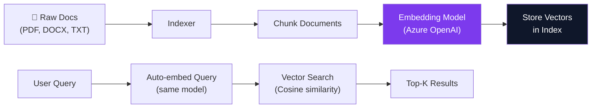

#### Setting Up Integrated Vectorization (Portal: Import & Vectorize Data Wizard)

1. Choose data source (Blob, SharePoint, etc.)
2. Select embedding model (Azure OpenAI `text-embedding-3-small`)
3. Enable **integrated vectorization**
4. Configure chunking strategy (size, overlap)
5. Enable **Semantic Ranker** (optional but recommended)
6. Run the indexer

#### Chunking Strategy

| Parameter | Meaning | Recommended |
|---|---|---|
| `tokenOverlapCount` | Tokens shared between adjacent chunks | 20–100 tokens |
| `maximumPageLength` | Max tokens per chunk | 512–2048 |
| `defaultBehavior` | How to split | `preserveWhitespace` |

> **Why chunking matters:** LLMs and embedding models have token limits. Large documents must be split into chunks so each chunk's semantic meaning can be captured independently.

#### Chunking with Overlap — Visual

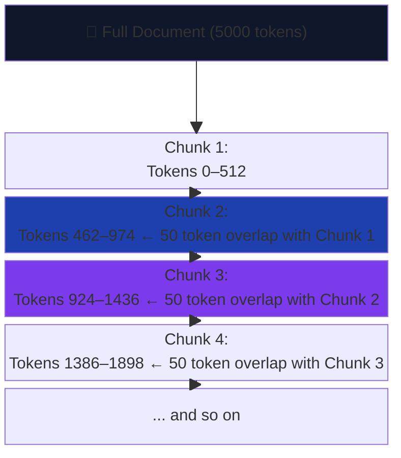

> **Overlap ensures** that sentences split across chunk boundaries are not lost — both neighboring chunks contain the boundary text, so relevant context is always retrievable.

---

### 7.3 Querying with Vectors

```python
from azure.search.documents.models import VectorizedQuery

# 1. Embed the query
query_embedding = openai_client.embeddings.create(
    model="text-embedding-3-small",
    input="What is machine learning?"
).data[0].embedding

# 2. Execute vector query
vector_query = VectorizedQuery(
    vector=query_embedding,
    k_nearest_neighbors=5,
    fields="text_vector"    # The vector field in your index
)

results = client.search(
    search_text=None,
    vector_queries=[vector_query],
    top=5
)
```

#### With Integrated Vectorization (auto-embed query)

```python
from azure.search.documents.models import VectorizableTextQuery

# No need to embed the query manually!
vector_query = VectorizableTextQuery(
    text="What is machine learning?",
    k_nearest_neighbors=5,
    fields="text_vector"
)

results = client.search(
    search_text=None,
    vector_queries=[vector_query],
    top=5
)
```

---

## 8. Hybrid Search

**Hybrid Search** combines **BM25 keyword search + Vector search** using **Reciprocal Rank Fusion (RRF)** to merge the two result sets into a single ranked list.

### Why Hybrid is Best for RAG

| Search Type | Good At | Weak At |
|---|---|---|
| **BM25 (Keyword)** | Exact terms, product names, codes | Synonyms, paraphrasing, concept queries |
| **Vector** | Semantic similarity, intent matching | Exact keyword lookup, very specific terms |
| **Hybrid (BM25 + Vector)** | ✅ Best of both worlds | — |

### Reciprocal Rank Fusion (RRF)

```
RRF score = Σ (1 / (rank_from_list_i + k))
```

- Merges ranked lists from BM25 and vector search
- Doesn't require score normalization
- Documents appearing high in both lists get boosted

#### RRF Merge — Visual Flow

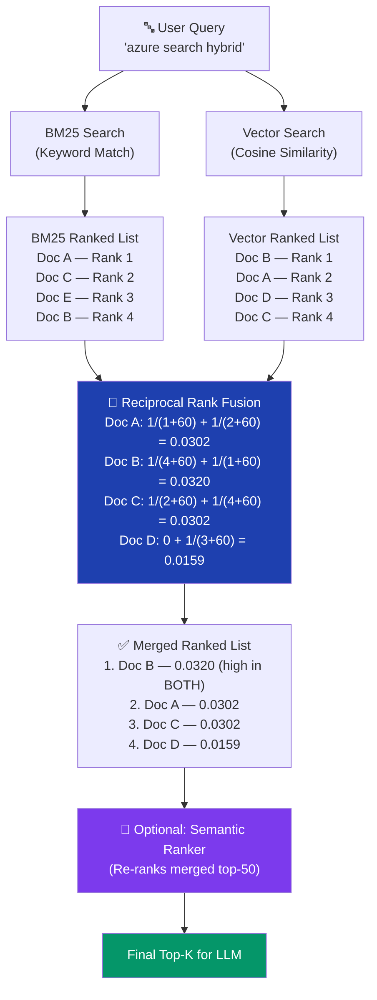

> **Why Doc B wins:** It ranked **#1 in vector** and **#4 in BM25** — high combined RRF score. Doc A ranked **#1 in BM25** but only **#2 in vector**. RRF rewards documents that are relevant from multiple signals.

### Code Example

```python
from azure.search.documents.models import VectorizableTextQuery

vector_query = VectorizableTextQuery(
    text="azure machine learning pipeline",
    k_nearest_neighbors=50,
    fields="text_vector"
)

results = client.search(
    search_text="azure machine learning pipeline",  # BM25 text
    vector_queries=[vector_query],                  # Vector query
    query_type="semantic",                          # + Semantic reranking on top
    semantic_configuration_name="my-config",
    top=5
)
```

### Recommended RAG Stack: Hybrid + Semantic Ranker

```mermaid
flowchart TB
    UQ(["👤 User Query"])

    subgraph L1["Layer 1 — Retrieval"]
        BM25L["BM25 Keyword Search\n(Inverted Index)"]
        VECL["Vector Search\n(HNSW Index — Cosine Similarity)"]
    end

    subgraph L2["Layer 2 — Fusion"]
        RRF2["Reciprocal Rank Fusion\n(RRF)\nMerge + re-rank by combined score"]
    end

    subgraph L3["Layer 3 — Re-ranking (Optional)"]
        SEMR["Semantic Ranker\n(Bing Transformer model)\nUnderstand query intent"]
    end

    subgraph L4["Layer 4 — Generation"]
        PROMPT["Prompt Construction\nSystem + Top-K Chunks + Query"]
        LLM2["GPT-4.1 / GPT-4o\n(Grounded response with citations)"]
    end

    UQ --> BM25L
    UQ --> VECL
    BM25L --> RRF2
    VECL --> RRF2
    RRF2 --> SEMR
    SEMR --> PROMPT
    PROMPT --> LLM2

    style RRF2 fill:#1e40af,color:#fff
    style SEMR fill:#7c3aed,color:#fff
    style LLM2 fill:#059669,color:#fff
    style L1 fill:#1e1e2e
    style L2 fill:#1e293b
    style L3 fill:#1a1a2e
    style L4 fill:#0f172a
```

> **Interview Answer:** "For RAG, we use **hybrid search** — combining keyword (BM25) and vector (cosine similarity) results via **Reciprocal Rank Fusion (RRF)**. We then layer on the **Semantic Ranker** as an L2 re-ranker to maximize precision of the top results fed into the LLM."

---

## 9. AI Enrichment & Skillsets

**Skillsets** are AI transformation pipelines applied to raw content **during indexing**. They enrich documents before storing them in the index.

### Built-in Cognitive Skills

| Skill | What It Does | Output |
|---|---|---|
| **OCR** | Extracts text from images/PDFs | Text content |
| **Text Merge** | Combines OCR text with original | Merged text field |
| **Language Detection** | Detects document language | Language code |
| **Entity Recognition (NER)** | Extracts people, places, orgs, dates | Structured entities |
| **Key Phrase Extraction** | Identifies key topics | Tag list |
| **Sentiment Analysis** | Positive/neutral/negative per doc | Sentiment score |
| **Image Analysis** | Describes image content | Tags, captions |
| **Translation** | Translates to target language | Translated text |
| **PII Detection** | Finds/redacts personal data | Clean text |
| **Document Splitting** | Chunks large documents | Multiple sub-documents |

### Skillset Pipeline Flow

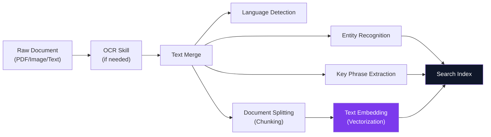

### Custom Skills (Azure Functions)

You can write **custom skills** as Azure Functions to handle domain-specific processing:

```python
# Custom skill endpoint (Azure Function)
@app.route("/api/custom-skill")
def custom_skill(req):
    values = req.get_json()["values"]
    results = []
    for v in values:
        text = v["data"]["text"]
        # Your custom processing here
        custom_tags = extract_domain_tags(text)
        results.append({
            "recordId": v["recordId"],
            "data": {"customTags": custom_tags}
        })
    return {"values": results}
```

### Knowledge Store

A **Knowledge Store** saves enriched data to **Azure Blob Storage or Azure Table Storage** — useful for analytics, Power BI dashboards, or downstream pipelines.

#### Knowledge Store Data Flow

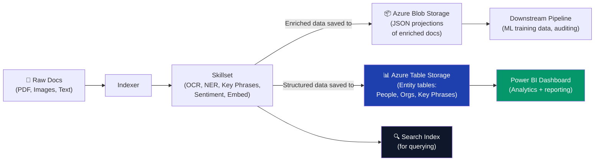

---

## 10. Agentic RAG — AI Agents + Azure AI Search

**Agentic RAG** integrates Azure AI Search as a **grounding knowledge tool** for AI agents running in **Azure AI Foundry (Microsoft Foundry)**.

### Architecture

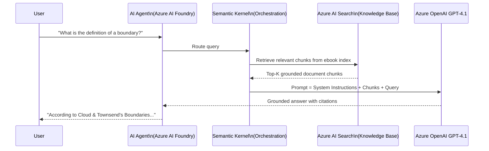

### End-to-End Setup Steps (Portal Demo)

#### Setup Flow Overview

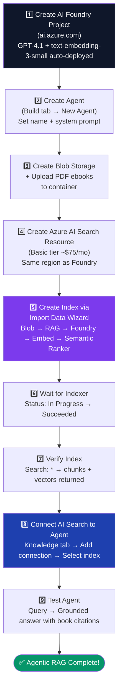

#### Step 1 — Create AI Foundry Project

1. Go to **Azure AI Foundry (ai.azure.com)**
2. Create a **new project** (e.g., `agentic-rag-project`)
3. GPT-4.1 and `text-embedding-3-small` are auto-deployed

#### Step 2 — Create an Agent

1. In Foundry → **Build tab → Create Agent**
2. Name the agent (e.g., `ebook-agent`)
3. Leave model as **GPT 4.1** (default)
4. Use GPT to **generate a system prompt** that instructs the agent to only answer from the knowledge base

> **Example System Prompt (AI-generated):**
> *"You are a specialized assistant that only answers questions using the provided knowledge base. Do not use general training knowledge. Always cite the source document when answering."*

#### Step 3 — Upload Documents to Storage

1. Create **Azure Blob Storage** account
2. Create a container (e.g., `ebook-container`)
3. Upload PDF ebooks (or any documents)

#### Step 4 — Create Azure AI Search Resource

- Choose **Basic tier** (~$75/month) for demos
- Select same region as Foundry project

#### Step 5 — Create Index via Import Data Wizard

1. **Import data → Azure Blob Storage**
2. Select scenario: **RAG**
3. Choose storage account & container
4. Vectorization kind: **Azure AI Foundry** (Microsoft Foundry)
5. Select project and `text-embedding-3-small` model
6. Enable **Semantic Ranker**
7. Preview index fields:
   - `parent_id` — ID of source document
   - `chunk` — The actual text chunk
   - `text_vector` — Vector embeddings of the chunk
   - `title` — Document title
8. Run indexer (once or scheduled)

#### Step 6 — Wait for Indexer to Complete

```
Search → Indexers → Status: In Progress → Succeeded
```

#### Step 7 — Verify Index Data

```
Search → Indexes → Run search: *
→ Should return document chunks + vector embeddings
```

> **Tip:** Uncheck "Retrievable" on `text_vector` field to hide embeddings in results and make output readable.

#### Step 8 — Connect AI Search to Agent

1. In Foundry Agent → **Knowledge tab**
2. Click **Connect → Add**
3. Create new connection to your Azure AI Search resource
4. Select your index
5. Save → Agentic RAG is complete!

#### Step 9 — Test the Agent

```
Query: "What is the definition of a boundary according to John Townsend and Henry Cloud?"
→ Response cites the "Boundaries" book with grounded content
→ Debug panel shows the AI Search tool was called
```

### Index Schema for Agentic RAG

| Field | Type | Purpose |
|---|---|---|
| `parent_id` | String | Links chunk to source document |
| `chunk` | String (Searchable, Retrievable) | Text content of the chunk |
| `text_vector` | Collection(Single) | 1536-dim embedding vector |
| `title` | String (Retrievable) | Source document title |

### Deployment Options

Once the agent is working, you can:

| Option | How |
|---|---|
| **Code Integration** | Copy Python / JavaScript / C# code from Foundry |
| **Preview Link** | Share a test link with org members |
| **Microsoft Teams** | Publish agent directly to Teams |
| **Microsoft 365 Copilot** | Publish as a Copilot plugin |

---

## 11. Architecture Patterns

### Pattern 1: Standard RAG Pipeline

```mermaid
graph LR
    User["👤 User Query"] --> App["Application"]
    App --> AOAI["Azure OpenAI\n(Embed query)"]
    AOAI --> AIS["Azure AI Search\n(Hybrid Search)"]
    AIS --> Blob["Azure Blob Storage\n(Source documents)"]
    AIS --> App2["Top-K Chunks → App"]
    App2 --> Prompt["Construct Prompt\n(System + Chunks + Query)"]
    Prompt --> GPT["GPT-4o / GPT-4.1"]
    GPT --> Answer["Grounded Answer"]

    style GPT fill:#0f172a,color:#fff
    style AIS fill:#1e40af,color:#fff
```

### Pattern 2: Agentic RAG (Multi-Agent)

```mermaid
graph TD
    User["👤 User"] --> Orch["Orchestrator Agent\n(Semantic Kernel)"]
    Orch --> SearchAgent["Search Agent\n(Azure AI Search Tool)"]
    Orch --> CodeAgent["Code Execution Agent"]
    Orch --> MailAgent["Communication Agent"]
    SearchAgent --> AIS["Azure AI Search\n(Ebook Index)"]
    AIS --> Chunks["Grounded Chunks"]
    Chunks --> Orch
    Orch --> Answer["Final Grounded Response"]

    style AIS fill:#1e40af,color:#fff
    style Orch fill:#0f172a,color:#fff
```

### Pattern 3: Intelligent Document Processing

```mermaid
graph LR
    Upload["📄 Document Upload"] --> Blob2["Azure Blob Storage"]
    Blob2 --> Indexer["AI Search Indexer"]
    Indexer --> Skills["Skillset\n(OCR, NER, Chunking)"]
    Skills --> Embed2["Integrated Vectorization"]
    Embed2 --> Index["Search Index\n(Chunks + Vectors)"]
    Index --> Agent["AI Agent\n(RAG)"]

    style Index fill:#0f172a,color:#fff
    style Skills fill:#7c3aed,color:#fff
```

### Pattern 4: Enterprise Security Architecture

```mermaid
flowchart TB
    subgraph Client["👤 Client Layer"]
        WebApp["Web App\n(App Service)"]
        Func["Azure Function\n(Managed Identity)"]
    end

    subgraph Security["🔐 Security Layer"]
        APIM["Azure API Management\n(Rate limiting, JWT validation)"]
        Entra2["Azure Entra ID\n(Auth + RBAC)"]
        KV2["Azure Key Vault\n(CMK encryption keys)"]
    end

    subgraph Search["🔍 Azure AI Search"]
        PE2["Private Endpoint"]
        AIS2["Search Service\n(Private)"]
        Idx2["Index\n(Encrypted at rest)"]
    end

    subgraph Data["🗄️ Data Layer"]
        Blob3["Azure Blob\n(Private)"]  
        SQL2["Azure SQL\n(Private)"]
    end

    WebApp -->|"Bearer token"| APIM
    Func -->|"Managed Identity token"| APIM
    APIM --> Entra2
    Entra2 -->|"validated"| PE2
    PE2 --> AIS2
    AIS2 --> Idx2
    KV2 -.->|"encryption keys"| AIS2
    Blob3 --> AIS2
    SQL2 --> AIS2

    style AIS2 fill:#0f172a,color:#fff
    style Entra2 fill:#1e40af,color:#fff
    style KV2 fill:#dc2626,color:#fff
    style PE2 fill:#7c3aed,color:#fff
```

---

## 12. Interview Quick Reference

### Search Method Decision Tree

```mermaid
flowchart TD
    START(["🤔 Choose Search Strategy"])
    Q1{"Need semantic\nunderstanding?"}
    Q2{"Have stored\nvectors in index?"}
    Q3{"Need exact keyword\nor code matches too?"}
    Q4{"Need to maximise\nprecision of top results?"}

    BM25_OUT["✅ BM25 Full-Text Search\nFast, no embeddings needed"]
    VEC_OUT["✅ Pure Vector Search\nSemantic similarity only"]
    HYB_OUT["✅ Hybrid Search\nBM25 + Vector via RRF"]
    SEM_OUT["✅ Hybrid + Semantic Ranker\nBest precision for RAG"]
    FAQ_OUT["✅ BM25 + Filters\nSimple FAQ / structured lookup"]

    START --> Q1
    Q1 -->|"No — just keywords"| FAQ_OUT
    Q1 -->|"Yes"| Q2
    Q2 -->|"No"| BM25_OUT
    Q2 -->|"Yes"| Q3
    Q3 -->|"No — semantic only"| VEC_OUT
    Q3 -->|"Yes — both"| Q4
    Q4 -->|"No"| HYB_OUT
    Q4 -->|"Yes — RAG / Agent"| SEM_OUT

    style SEM_OUT fill:#059669,color:#fff
    style HYB_OUT fill:#1e40af,color:#fff
    style VEC_OUT fill:#7c3aed,color:#fff
    style BM25_OUT fill:#374151,color:#fff
    style FAQ_OUT fill:#374151,color:#fff
```

### Key Comparisons

| Dimension | BM25 | Vector Search | Hybrid | Semantic Ranker |
|---|---|---|---|---|
| **Based on** | Keyword frequency (TF-IDF) | Embedding similarity | RRF merge of both | L2 LLM re-ranking |
| **Good for** | Exact terms, codes | Intent, paraphrasing | Both | Precision of top results |
| **Index type** | Inverted index | Vector (HNSW) | Both | Re-ranking layer |
| **Requires embeddings** | No | Yes | Yes | No (reranks BM25/RRF results) |

### Recommended Configurations

| Use Case | Configuration |
|---|---|
| Enterprise RAG | Hybrid Search + Semantic Ranker |
| Simple FAQ lookup | BM25 only with filters |
| Semantic product search | Vector-only or hybrid |
| Multi-language corpus | BM25 with language analyzers |
| Agentic knowledge base | Integrated vectorization + Hybrid + Semantic Ranker |

### Critical Interview Answers

**Q: What is Reciprocal Rank Fusion?**
> RRF is the merging algorithm used in hybrid search. It combines ranked results from BM25 and vector search into a single list by scoring each document as `Σ 1/(rank_i + k)`. Documents appearing high in *both* lists get the highest combined score.

**Q: How does Semantic Ranker differ from vector search?**
> Semantic Ranker is a *post-retrieval re-ranking* step — it takes the top-50 BM25/hybrid results and re-ranks them using a language model (Bing-based) that understands query intent. It does NOT use stored embeddings. Vector search finds similar documents via cosine similarity on stored embedding vectors.

**Q: What is Integrated Vectorization?**
> A feature where Azure AI Search automatically generates embeddings for both documents (at index time) and queries (at query time) using a connected Azure OpenAI embedding model — eliminating the need for a separate embedding pipeline.

**Q: What's the difference between a Replica and a Partition?**
> A **Replica** is a copy of the index for concurrent query throughput and HA. A **Partition** is a shard of the index for increased storage capacity and indexing speed. Search Units = Replicas × Partitions.

**Q: What is Agentic RAG?**
> Agentic RAG connects an AI agent (running in Azure AI Foundry) to Azure AI Search as a knowledge tool. When the agent receives a query, it automatically calls the AI Search tool to retrieve relevant grounded document chunks from the index, then uses those chunks as context for the LLM response — ensuring answers are factual and cited.

**Q: How do you secure Azure AI Search in production?**
> Use: (1) **Private Endpoints** to restrict traffic to Azure VNet only, (2) **Managed Identity** for passwordless auth (no API keys in code), (3) **RBAC roles** for access control, (4) **Document-level security trimming** via OData filter expressions based on user identity, (5) **Customer-managed encryption keys** via Azure Key Vault.

---

## Appendix: Key Pricing Considerations

| Item | Cost Driver |
|---|---|
| AI Search Resource | Per Search Unit per hour (replicas × partitions) |
| Semantic Ranker | Free tier: 1,000 queries/month. Billed above that |
| Embedding generation | Azure OpenAI tokens (input-only, per 1K tokens) |
| Storage | Per GB in index per month |
| Indexer runs | Included but skillset AI enrichment billed separately |

#### Cost Components Breakdown

```mermaid
flowchart LR
    subgraph Compute["💻 Compute Cost\n(Biggest driver)"]
        SU2["Search Units\n= Replicas × Partitions\nBilled per hour"]
        Tier["Tier governs\nmax SU + storage:\nFree → Basic → S1 → S2"]
    end

    subgraph AI["🧠 AI Cost (Variable)"]
        Embed3["Embedding tokens\n(Azure OpenAI)\nPer 1K input tokens"]
        SemR2["Semantic Ranker\n1,000 free queries/mo\nBilled above threshold"]
        Skills3["Skillset enrichment\n(OCR, NER, Translate)\nPer 1K records"]
    end

    subgraph Storage["🗄️ Storage Cost"]
        IdxSize["Index storage\nPer GB/month"]
        KnowStore["Knowledge Store\n(Blob/Table)\nStandard storage rates"]
    end

    Total(["💰 Total Monthly Cost"])

    Compute --> Total
    AI --> Total
    Storage --> Total

    style Total fill:#059669,color:#fff
    style Compute fill:#0f172a,color:#fff
    style AI fill:#7c3aed,color:#fff
    style Storage fill:#1e40af,color:#fff
```

> **Cost tip from video:** Basic tier ~$75/month is sufficient for demos and small workloads. Standard tier starts around $250/month/SU. **Always delete resources after demos** to avoid unexpected charges.

---

*Last updated: June 2026 | Based on Azure AI Search API version 2024-07-01*
