# Microsoft Azure AI Stack — Complete Reference Guide

> A comprehensive, enterprise-grade reference for every service in the Azure AI ecosystem. Covers architecture, key features, use cases, and interview-ready knowledge.

---

## Table of Contents

1. [Azure AI Ecosystem Overview](#1-azure-ai-ecosystem-overview)
2. [Azure AI Foundry — The Central Platform](#2-azure-ai-foundry--the-central-platform)
   - [Foundry Models & Catalog](#21-foundry-models--catalog)
   - [Azure OpenAI Service](#22-azure-openai-service)
   - [Foundry Agent Service](#23-foundry-agent-service)
   - [Foundry Tools](#24-foundry-tools)
3. [Specialized Cognitive Services](#3-specialized-cognitive-services)
   - [Azure AI Search](#31-azure-ai-search-foundry-iq)
   - [Azure AI Language](#32-azure-ai-language)
   - [Azure AI Vision & Speech](#33-azure-ai-vision--speech)
4. [Infrastructure & Operations](#4-infrastructure--operations)
   - [Azure Machine Learning](#41-azure-machine-learning-azure-ml)
   - [Azure AI Bot Service](#42-azure-ai-bot-service)
5. [End-to-End Architecture Patterns](#5-end-to-end-architecture-patterns)
6. [Service Comparison & When to Use What](#6-service-comparison--when-to-use-what)
7. [Security, Governance & Responsible AI](#7-security-governance--responsible-ai)
8. [Pricing Model Overview](#8-pricing-model-overview)
9. [Interview Quick Reference](#9-interview-quick-reference)

---

## 1. Azure AI Ecosystem Overview

Microsoft Azure provides a **comprehensive, enterprise-grade AI ecosystem** built around **Azure AI Foundry** as its unified control plane. All AI services are interconnected — models, retrieval, agents, safety, and observability work together as a single production system.

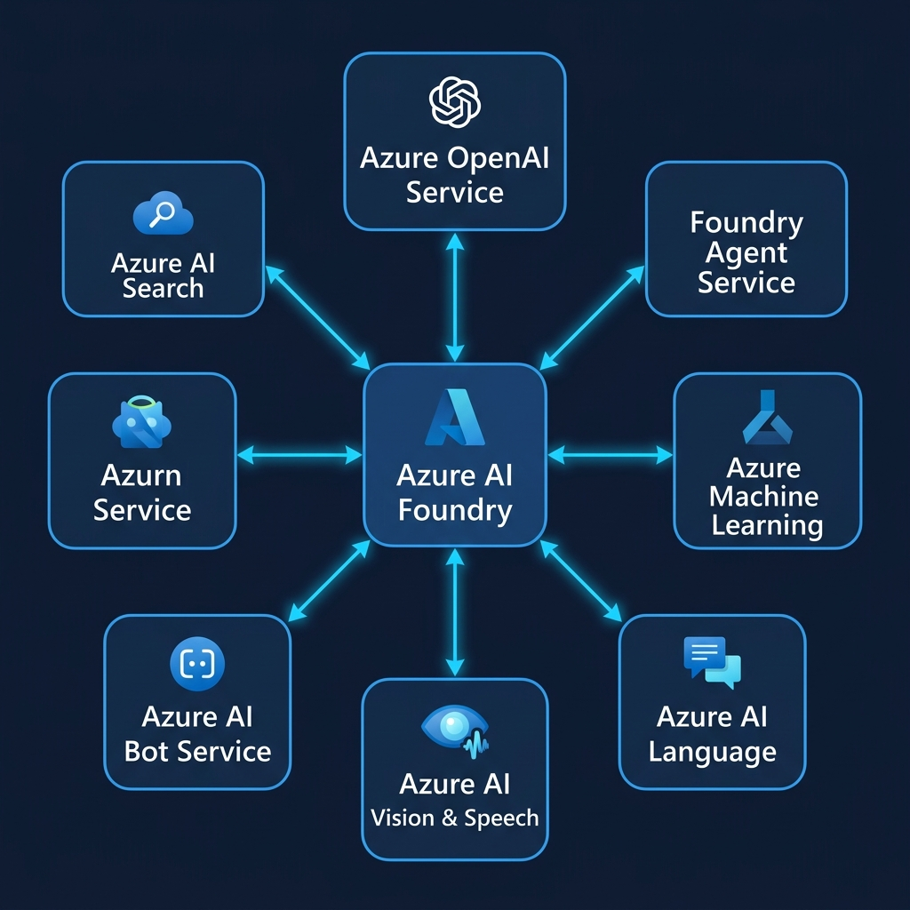

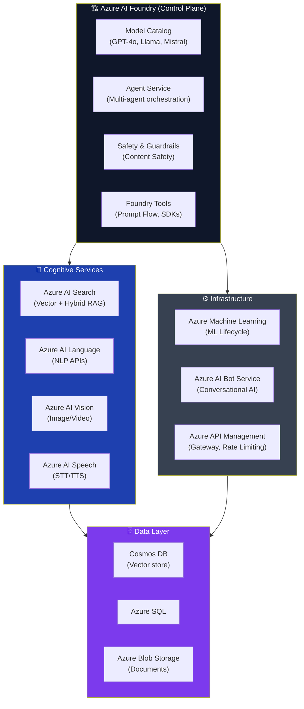
```mermaid
graph TB
    subgraph Foundry["🏗️ Azure AI Foundry (Control Plane)"]
        Models["Model Catalog\n(GPT-4o, Llama, Mistral)"]
        Agents["Agent Service\n(Multi-agent orchestration)"]
        Safety["Safety & Guardrails\n(Content Safety)"]
        Tools["Foundry Tools\n(Prompt Flow, SDKs)"]
    end

    subgraph Cognitive["🧠 Cognitive Services"]
        Search["Azure AI Search\n(Vector + Hybrid RAG)"]
        Lang["Azure AI Language\n(NLP APIs)"]
        Vision["Azure AI Vision\n(Image/Video)"]
        Speech["Azure AI Speech\n(STT/TTS)"]
    end

    subgraph Infra["⚙️ Infrastructure"]
        AML["Azure Machine Learning\n(ML Lifecycle)"]
        Bot["Azure AI Bot Service\n(Conversational AI)"]
        APIM["Azure API Management\n(Gateway, Rate Limiting)"]
    end

    subgraph Data["🗄️ Data Layer"]
        Cosmos["Cosmos DB\n(Vector store)"]
        SQL["Azure SQL"]
        Blob["Azure Blob Storage\n(Documents)"]
    end

    Foundry --> Cognitive
    Foundry --> Infra
    Cognitive --> Data
    Infra --> Data

    style Foundry fill:#0f172a,color:#fff
    style Cognitive fill:#1e40af,color:#fff
    style Infra fill:#374151,color:#fff
    style Data fill:#7c3aed,color:#fff
```

### Three-Layer Architecture

| Layer | Services | Purpose |
|---|---|---|
| **Foundation** | Azure AI Foundry, Azure OpenAI | Model access, orchestration, safety |
| **Cognitive** | AI Search, Language, Vision, Speech | Domain-specific AI capabilities |
| **Infrastructure** | Azure ML, Bot Service, API Management | Training, hosting, operations |

---

## 2. Azure AI Foundry — The Central Platform

**Azure AI Foundry** is the unified development platform that ties the entire Azure AI ecosystem together. It is the single place where teams can discover models, build agents, evaluate outputs, enforce safety, and deploy AI applications to production.

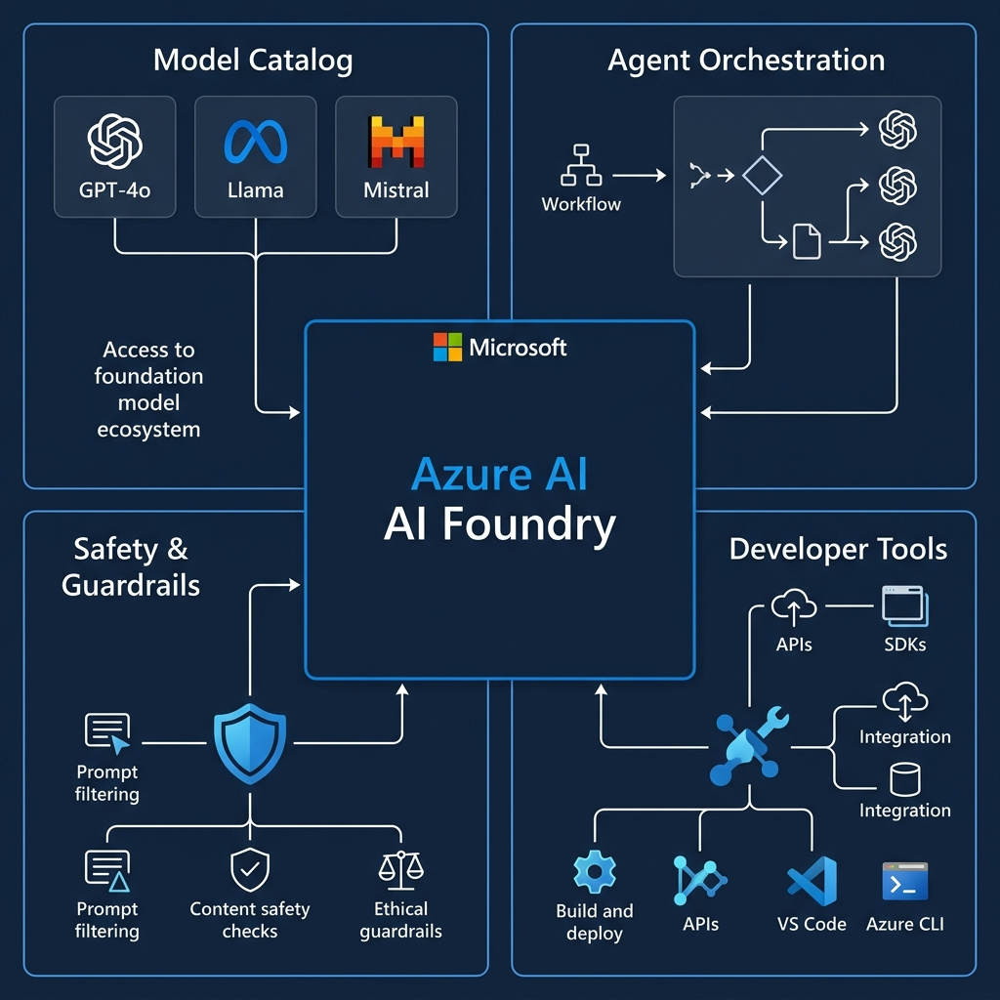

### Foundry Four Pillars

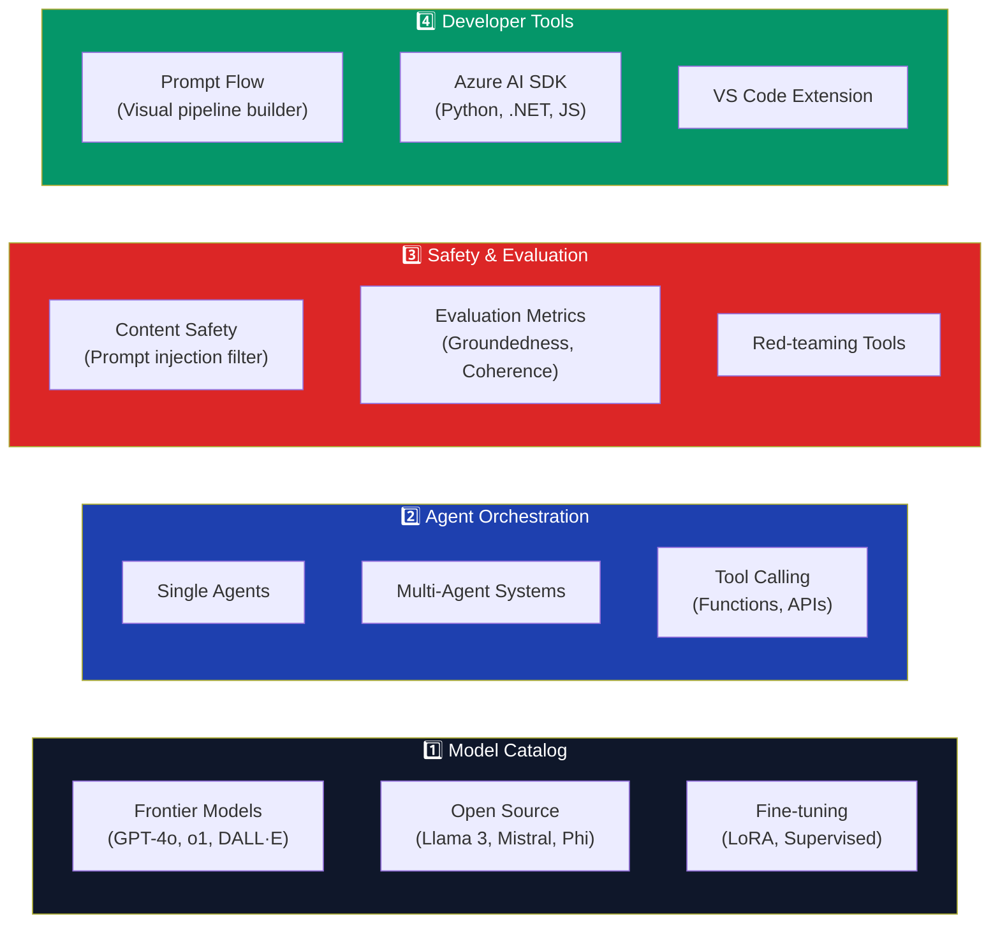
```mermaid
graph LR
    subgraph P1["1️⃣ Model Catalog"]
        M1["Frontier Models\n(GPT-4o, o1, DALL·E)"]
        M2["Open Source\n(Llama 3, Mistral, Phi)"]
        M3["Fine-tuning\n(LoRA, Supervised)"]
    end

    subgraph P2["2️⃣ Agent Orchestration"]
        A1["Single Agents"]
        A2["Multi-Agent Systems"]
        A3["Tool Calling\n(Functions, APIs)"]
    end

    subgraph P3["3️⃣ Safety & Evaluation"]
        S1["Content Safety\n(Prompt injection filter)"]
        S2["Evaluation Metrics\n(Groundedness, Coherence)"]
        S3["Red-teaming Tools"]
    end

    subgraph P4["4️⃣ Developer Tools"]
        D1["Prompt Flow\n(Visual pipeline builder)"]
        D2["Azure AI SDK\n(Python, .NET, JS)"]
        D3["VS Code Extension"]
    end

    style P1 fill:#0f172a,color:#fff
    style P2 fill:#1e40af,color:#fff
    style P3 fill:#dc2626,color:#fff
    style P4 fill:#059669,color:#fff
```

---

### 2.1 Foundry Models & Catalog

The **Foundry Model Catalog** is a curated marketplace of AI models from Microsoft, OpenAI, Meta, Mistral, and the open-source community — all available for evaluation, fine-tuning, and deployment within your Azure tenant.

#### Model Categories

| Category | Models | Best For |
|---|---|---|
| **Frontier (OpenAI)** | GPT-4o, GPT-4o mini, o1, o3 | Complex reasoning, coding, multimodal |
| **Embedding** | text-embedding-3-large, ada-002 | Vector search, RAG, semantic similarity |
| **Image Generation** | DALL·E 3 | Image creation from text |
| **Open Source — Text** | Llama 3.1 405B, Mistral Large, Phi-3 | Cost-effective generation, on-prem |
| **Open Source — Code** | CodeLlama, DeepSeek-Coder | Coding assistance, code generation |
| **Small/Edge** | Phi-3 Mini, Phi-3.5 | Low-latency, on-device inference |

#### Model Lifecycle in Foundry

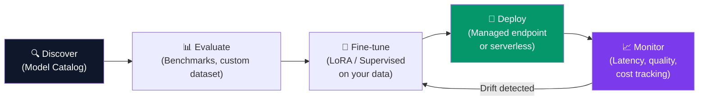
```mermaid
flowchart LR
    Discover["🔍 Discover\n(Model Catalog)"] --> Evaluate["📊 Evaluate\n(Benchmarks, custom dataset)"]
    Evaluate --> FineTune["🎯 Fine-tune\n(LoRA / Supervised\non your data)"]
    FineTune --> Deploy["🚀 Deploy\n(Managed endpoint\nor serverless)"]
    Deploy --> Monitor["📈 Monitor\n(Latency, quality,\ncost tracking)"]
    Monitor -->|"Drift detected"| FineTune

    style Discover fill:#0f172a,color:#fff
    style Deploy fill:#059669,color:#fff
    style Monitor fill:#7c3aed,color:#fff
```

#### Key Features
- **Serverless API deployments** — pay per token, no infrastructure management
- **Managed compute deployments** — dedicated GPU VMs for consistent latency
- **Model benchmarks** — compare quality, latency, and cost before committing
- **Fine-tuning** — supervised fine-tuning and reinforcement learning from human feedback (RLHF)
- **Private network** — models deployed within your Azure VNet for data privacy

> **Interview Language:** "In Foundry's Model Catalog, we can choose between **frontier models** (like GPT-4o for complex reasoning) and **open-source alternatives** (like Llama for cost efficiency). We evaluate them on our specific task using custom datasets before fine-tuning and deploying to a **managed endpoint with private networking**."

---

### 2.2 Azure OpenAI Service

**Azure OpenAI Service** provides enterprise-grade access to OpenAI's frontier models — the same models as OpenAI.com but with Azure's **security, compliance, private networking, and SLAs**.

#### Available Models

| Model | Capability | Token Limit | Key Use Case |
|---|---|---|---|
| **GPT-4o** | Text + Vision (multimodal) | 128K context | Complex reasoning, image analysis |
| **GPT-4o mini** | Fast, cost-efficient text | 128K context | High-volume, lower-cost tasks |
| **o1 / o3** | Extended thinking, math/code | 128K context | STEM problems, logical reasoning |
| **text-embedding-3-large** | Vector embeddings | 8K input | Semantic search, RAG |
| **DALL·E 3** | Text-to-image | — | Image generation |
| **Whisper** | Speech-to-text | — | Audio transcription |

#### API Interaction Pattern

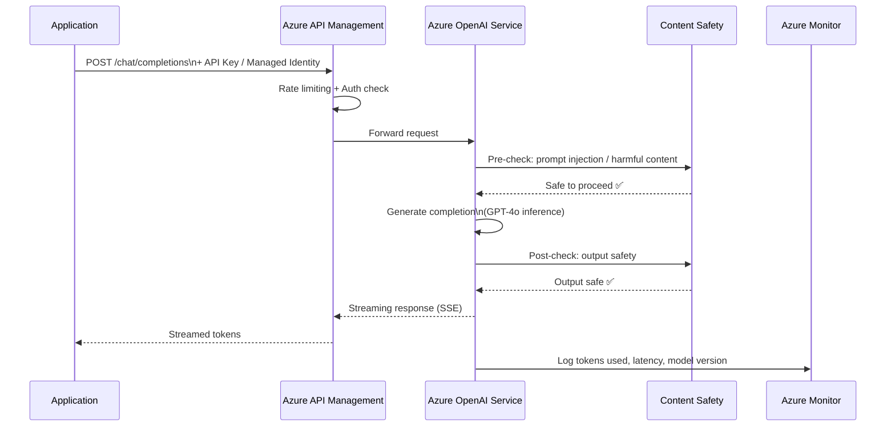
```mermaid
sequenceDiagram
    participant App as Application
    participant APIM as Azure API Management
    participant AOI as Azure OpenAI Service
    participant CS as Content Safety
    participant Log as Azure Monitor

    App->>APIM: POST /chat/completions\n+ API Key / Managed Identity
    APIM->>APIM: Rate limiting + Auth check
    APIM->>AOI: Forward request
    AOI->>CS: Pre-check: prompt injection / harmful content
    CS-->>AOI: Safe to proceed ✅
    AOI->>AOI: Generate completion\n(GPT-4o inference)
    AOI->>CS: Post-check: output safety
    CS-->>AOI: Output safe ✅
    AOI-->>APIM: Streaming response (SSE)
    APIM-->>App: Streamed tokens
    AOI->>Log: Log tokens used, latency, model version
```

#### Enterprise-Specific Features

| Feature | Description |
|---|---|
| **Private Endpoints** | Route all traffic through Azure VNet — no public internet |
| **Managed Identity** | Passwordless auth using Azure Entra ID — no API keys in code |
| **Content Filtering** | Built-in category filters (hate, violence, sexual, self-harm) with configurable thresholds |
| **Customer-Managed Keys** | Encrypt data at rest with your own keys in Azure Key Vault |
| **PTU (Provisioned Throughput Units)** | Reserved capacity for consistent low-latency at scale |
| **Data Residency** | Choose region to keep data within geographic boundaries |
| **No training on your data** | Microsoft commits that your data is NOT used to train models |

#### Pricing
- **Pay-as-you-go:** Per 1,000 tokens (input and output priced separately)
- **Provisioned Throughput (PTU):** Fixed hourly cost, guaranteed throughput, best at scale

> **Interview Language:** "Azure OpenAI Service gives us all the power of GPT-4o with Azure's **enterprise security guarantees** — private endpoints, managed identity, no data used for training. For high-volume workloads, we use **Provisioned Throughput Units (PTU)** to get predictable latency at a fixed cost."

---

### 2.3 Foundry Agent Service

**Azure AI Foundry Agent Service** is the managed platform for building, deploying, and governing **intelligent AI agents** — both single-agent and complex multi-agent workflows.

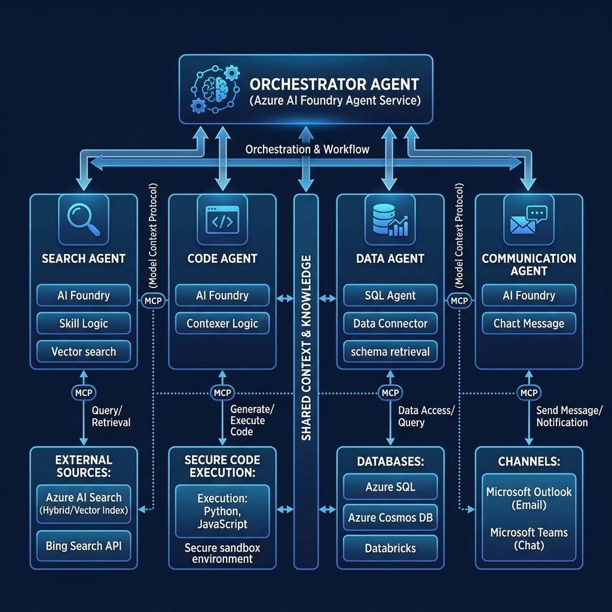

#### Single Agent vs Multi-Agent

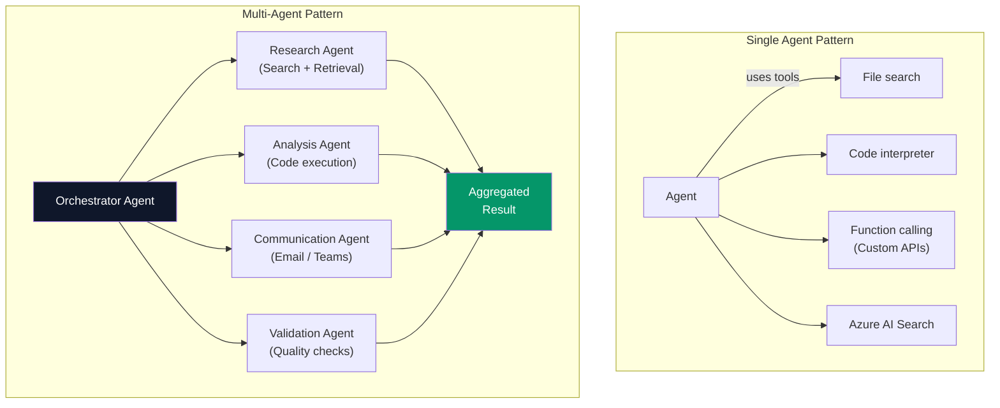
```mermaid
graph TD
    subgraph Single["Single Agent Pattern"]
        SA["Agent"] -->|"uses tools"| T1["File search"]
        SA --> T2["Code interpreter"]
        SA --> T3["Function calling\n(Custom APIs)"]
        SA --> T4["Azure AI Search"]
    end

    subgraph Multi["Multi-Agent Pattern"]
        Orch2["Orchestrator Agent"] --> Agent1["Research Agent\n(Search + Retrieval)"]
        Orch2 --> Agent2["Analysis Agent\n(Code execution)"]
        Orch2 --> Agent3["Communication Agent\n(Email / Teams)"]
        Orch2 --> Agent4["Validation Agent\n(Quality checks)"]
        Agent1 & Agent2 & Agent3 & Agent4 --> Result["Aggregated\nResult"]
    end

    style Orch2 fill:#0f172a,color:#fff
    style Result fill:#059669,color:#fff
```

#### Built-in Agent Tools

| Tool | What It Does | Example Use Case |
|---|---|---|
| **File Search** | Retrieves from uploaded documents (PDF, DOCX, TXT) | Policy Q&A bot |
| **Code Interpreter** | Executes Python in a sandboxed container | Data analysis, charting |
| **Function Calling** | Calls your custom APIs/functions | Order lookup, CRM update |
| **Azure AI Search** | Semantic/vector search over knowledge bases | Enterprise knowledge bot |
| **Bing Search** | Real-time web search | News, live data queries |
| **Azure Logic Apps** | Workflow automation integration | Approval workflows |

#### Agent Lifecycle

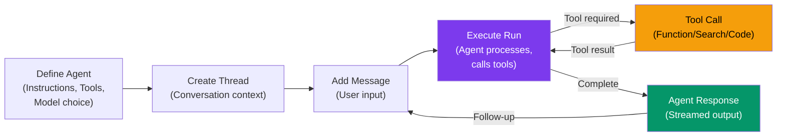
```mermaid
flowchart LR
    Define["Define Agent\n(Instructions, Tools,\nModel choice)"] --> Thread["Create Thread\n(Conversation context)"]
    Thread --> Message["Add Message\n(User input)"]
    Message --> Run["Execute Run\n(Agent processes,\ncalls tools)"]
    Run -->|"Tool required"| ToolCall["Tool Call\n(Function/Search/Code)"]
    ToolCall -->|"Tool result"| Run
    Run -->|"Complete"| Response["Agent Response\n(Streamed output)"]
    Response -->|"Follow-up"| Message

    style Run fill:#7c3aed,color:#fff
    style ToolCall fill:#f59e0b,color:#000
    style Response fill:#059669,color:#fff
```

#### Multi-Agent Protocols
- **MCP (Model Context Protocol):** Anthropic's open standard — agents expose tools/resources in a standardized way
- **A2A (Agent-to-Agent):** Google's protocol for agent interoperability
- **AutoGen / Semantic Kernel:** Microsoft's frameworks for agent orchestration

> **Interview Language:** "With Foundry Agent Service, we build agents declaratively — define the model, tools, and instructions. Agents maintain **thread-based conversation history**, call tools autonomously, and return results. For complex workflows, we use **multi-agent patterns** where an orchestrator delegates to specialized sub-agents."

---

### 2.4 Foundry Tools

**Foundry Tools** provides the developer experience layer — APIs, SDKs, and visual tools for building, testing, and deploying AI applications responsibly.

#### Core Tools

| Tool | Type | Purpose |
|---|---|---|
| **Prompt Flow** | Visual | Build and test LLM pipelines visually (DAG-based) |
| **Azure AI SDK** | Code | Python, .NET, JavaScript SDKs for all services |
| **Evaluation SDK** | Code | Measure groundedness, relevance, fluency, coherence |
| **Tracing** | Observability | Trace every LLM call, tool invocation, latency |
| **Content Safety API** | Safety | Filter prompts/outputs for harmful categories |
| **AI Studio** | Web UI | Unified portal for model exploration and deployment |

#### Prompt Flow Pipeline Example


```mermaid
graph LR
    Input["User Query"] --> Embed["Embed Query\n(text-embedding-3-large)"]
    Embed --> Search["Search Index\n(Azure AI Search)"]
    Search --> Context["Build Context\n(Top-K chunks)"]
    Context --> Prompt["Construct Prompt\n(System + Context + Query)"]
    Prompt --> LLM["LLM Call\n(GPT-4o)"]
    LLM --> Safety["Safety Check\n(Content Safety)"]
    Safety --> Output["Final Answer"]

    style LLM fill:#0f172a,color:#fff
    style Safety fill:#dc2626,color:#fff
    style Output fill:#059669,color:#fff
```

---

## 3. Specialized Cognitive Services

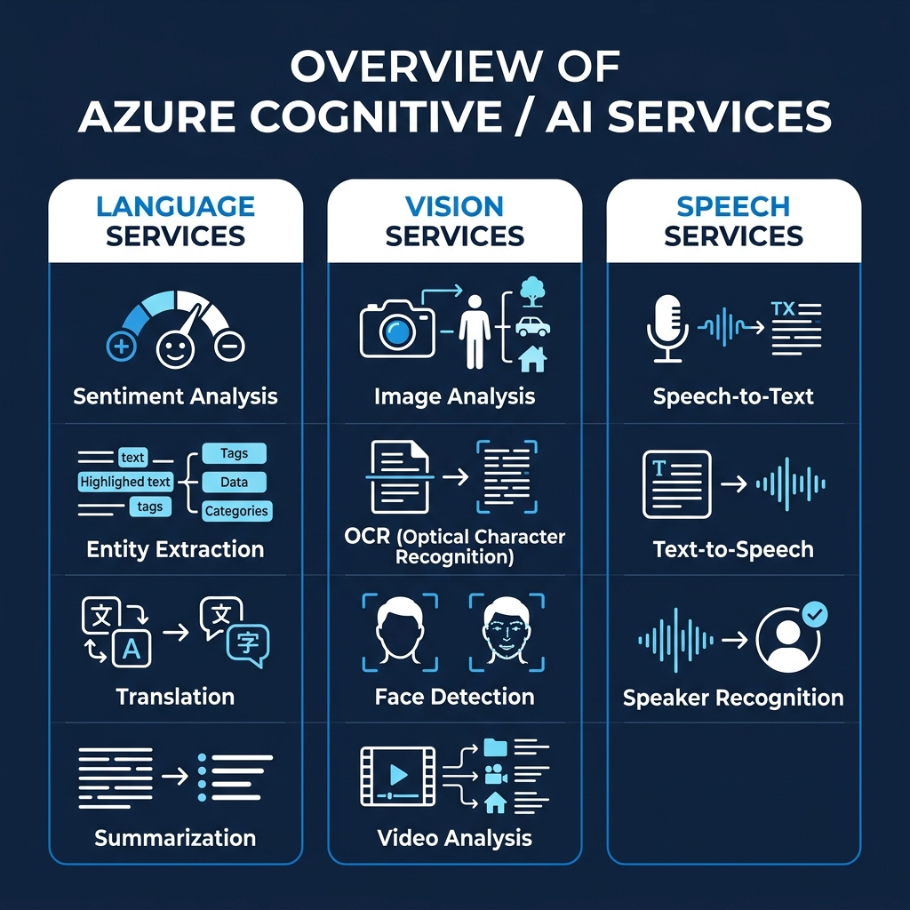

---

### 3.1 Azure AI Search (Foundry IQ)

**Azure AI Search** (formerly Azure Cognitive Search) is the enterprise **search and retrieval engine** at the heart of every RAG (Retrieval-Augmented Generation) solution on Azure.

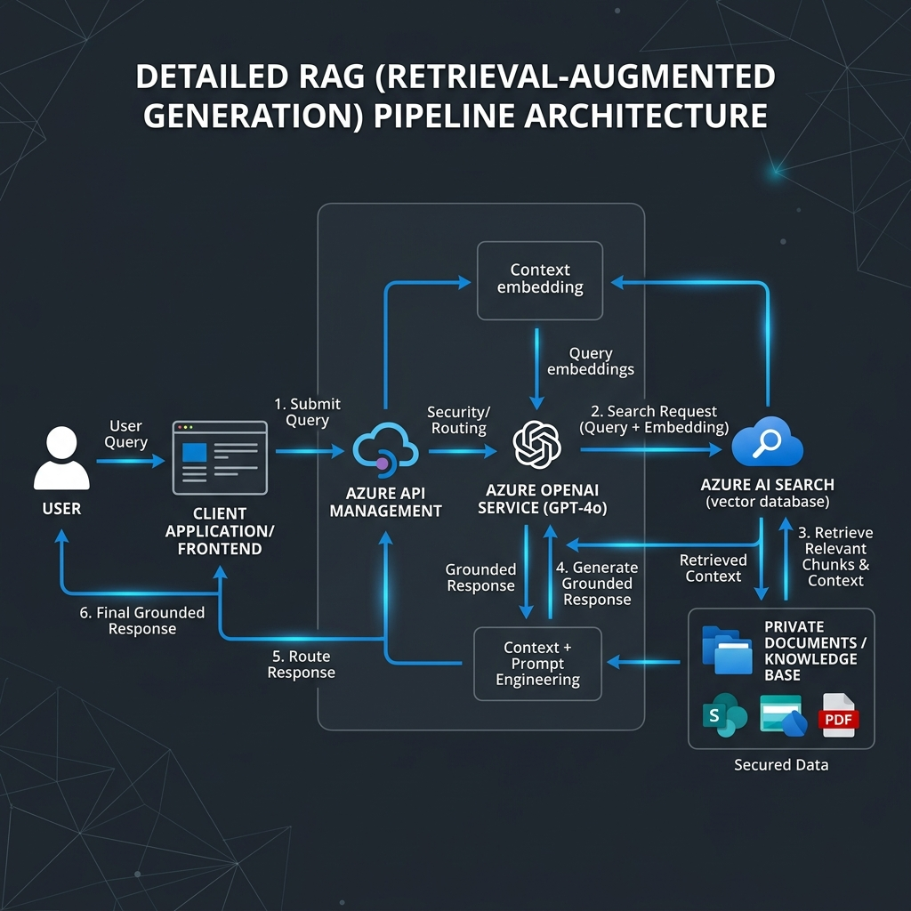

#### Index Types

| Index Type | How It Works | Best For |
|---|---|---|
| **Full-text (BM25)** | Keyword-based inverted index ranking | Exact keyword search, filters |
| **Vector** | Store embeddings; cosine/dot-product similarity | Semantic similarity, concept search |
| **Hybrid** | Combine BM25 + vector with Reciprocal Rank Fusion | Best of both — recommended for RAG |
| **Semantic Ranker** | Re-rank results using an LLM | Improve top-K precision |

#### RAG Architecture with Azure AI Search

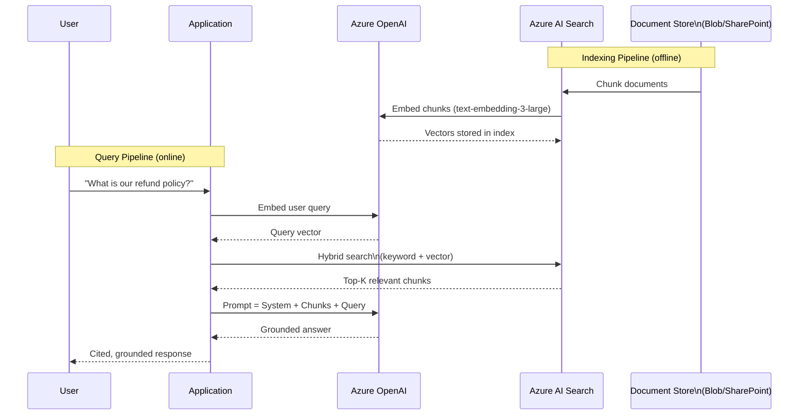
```mermaid
sequenceDiagram
    participant User
    participant App as Application
    participant AOI as Azure OpenAI
    participant AIS as Azure AI Search
    participant Docs as Document Store\n(Blob/SharePoint)

    Note over Docs,AIS: Indexing Pipeline (offline)
    Docs->>AIS: Chunk documents
    AIS->>AOI: Embed chunks (text-embedding-3-large)
    AOI-->>AIS: Vectors stored in index

    Note over User,App: Query Pipeline (online)
    User->>App: "What is our refund policy?"
    App->>AOI: Embed user query
    AOI-->>App: Query vector
    App->>AIS: Hybrid search\n(keyword + vector)
    AIS-->>App: Top-K relevant chunks
    App->>AOI: Prompt = System + Chunks + Query
    AOI-->>App: Grounded answer
    App-->>User: Cited, grounded response
```

#### Key Features

| Feature | Description |
|---|---|
| **Integrated Vectorization** | Auto-embed documents during indexing (no separate pipeline) |
| **Semantic Ranker** | L2 reranking using language understanding |
| **Skillsets** | AI-enrichment pipeline (OCR, entity extraction, translation) during indexing |
| **Filters + Facets** | Structured metadata filtering on top of semantic results |
| **Private Endpoint** | Index over private data sources securely |
| **RBAC** | Document-level security trimming |
| **Geo-distributed** | Multi-region index replicas for low-latency global access |

#### Indexers — Supported Data Sources

| Source | Indexer |
|---|---|
| Azure Blob Storage | Blob Indexer (PDF, DOCX, TXT, HTML) |
| Azure SQL Database | SQL Indexer |
| Cosmos DB | Cosmos DB Indexer |
| SharePoint Online | SharePoint Indexer |
| Azure Data Lake | ADLS Gen2 Indexer |
| Custom API | Push API (any source) |

> **Interview Language:** "Azure AI Search is our RAG backbone. We use **hybrid search** (BM25 + vector) with **Semantic Ranker** for the best retrieval quality. Documents are indexed with **integrated vectorization** using Azure OpenAI embeddings. At query time, top-K chunks are injected into the GPT-4o prompt to produce **grounded, cited answers**."

---

### 3.2 Azure AI Language

**Azure AI Language** provides pre-built, cloud-hosted NLP APIs that allow applications to understand and process human language — without training a custom model.

#### Available Capabilities

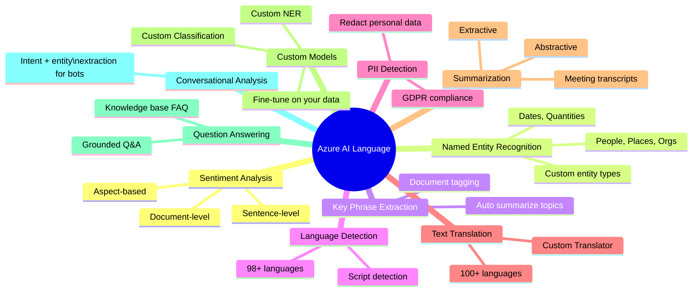
```mermaid
mindmap
  root((Azure AI Language))
    Sentiment Analysis
      Document-level
      Sentence-level
      Aspect-based
    Named Entity Recognition
      People, Places, Orgs
      Dates, Quantities
      Custom entity types
    Key Phrase Extraction
      Auto summarize topics
      Document tagging
    Language Detection
      98+ languages
      Script detection
    PII Detection
      Redact personal data
      GDPR compliance
    Text Translation
      100+ languages
      Custom Translator
    Summarization
      Abstractive
      Extractive
      Meeting transcripts
    Custom Models
      Custom Classification
      Custom NER
      Fine-tune on your data
    Question Answering
      Grounded Q&A
      Knowledge base FAQ
    Conversational Analysis
      Intent + entity\nextraction for bots
```

#### API Quick Reference

```python
# Sentiment Analysis
from azure.ai.textanalytics import TextAnalyticsClient

client = TextAnalyticsClient(endpoint, credential)

documents = ["The service was excellent but the wait was too long."]
result = client.analyze_sentiment(documents, show_opinion_mining=True)

# Result: Overall=Mixed, Sentence[0]=Positive(service), Negative(wait)
```

#### Use Cases by Industry

| Industry | Use Case | APIs Used |
|---|---|---|
| **Finance** | Earnings call sentiment | Sentiment + Key Phrase |
| **Healthcare** | Clinical notes → structured data | Custom NER + PII Redaction |
| **E-commerce** | Review aspect analysis | Aspect-based Sentiment |
| **HR** | Resume entity extraction | NER + Custom Entities |
| **Legal** | Contract clause summarization | Summarization + Classification |
| **Retail** | Multilingual customer support | Language Detection + Translation |

> **Pricing:** Per 1,000 text records (characters). Free tier: 5,000 records/month.

---

### 3.3 Azure AI Vision & Speech

Two services that give applications the ability to **see** (images and video) and **hear/speak** (audio).

#### Azure AI Vision — Capabilities

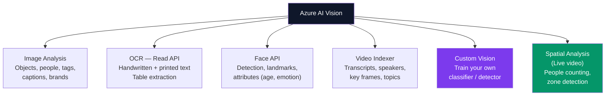
```mermaid
graph TD
    VisionService["Azure AI Vision"] --> ImageAnalysis["Image Analysis\nObjects, people, tags,\ncaptions, brands"]
    VisionService --> OCR["OCR — Read API\nHandwritten + printed text\nTable extraction"]
    VisionService --> Face["Face API\nDetection, landmarks,\nattributes (age, emotion)"]
    VisionService --> VideoIndexer["Video Indexer\nTranscripts, speakers,\nkey frames, topics"]
    VisionService --> CustomVision["Custom Vision\nTrain your own\nclassifier / detector"]
    VisionService --> SpatialAnalysis["Spatial Analysis\n(Live video)\nPeople counting,\nzone detection"]

    style VisionService fill:#0f172a,color:#fff
    style CustomVision fill:#7c3aed,color:#fff
    style SpatialAnalysis fill:#059669,color:#fff
```

#### OCR — Read API Example

```
Input: Scanned invoice PDF
Output:
{
  "pages": [{
    "lines": [
      { "text": "Invoice #INV-20240628", "boundingBox": [...] },
      { "text": "Total: $1,250.00",       "boundingBox": [...] }
    ],
    "tables": [{ "cells": [["Item", "Qty", "Price"], ["Widget A", "5", "$250.00"]] }]
  }]
}
```

#### Azure AI Speech — Capabilities

| Capability | Description | Use Case |
|---|---|---|
| **Speech-to-Text (STT)** | Real-time + batch transcription, 100+ languages | Call center transcription, meeting notes |
| **Text-to-Speech (TTS)** | Neural voices, custom voice cloning | Accessibility, IVR, audiobooks |
| **Speaker Recognition** | Verify/identify speakers by voice | Authentication, speaker diarization |
| **Speech Translation** | Real-time speech → speech in another language | Live conference translation |
| **Custom Speech** | Fine-tune STT on domain-specific vocabulary | Medical/legal terminology |
| **Custom Neural Voice** | Clone a brand voice with ~1hr of audio | Brand-consistent TTS |

#### Speech Pipeline Architecture

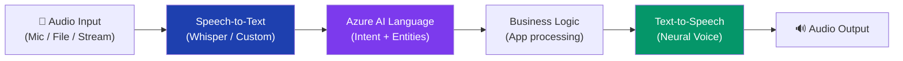
```mermaid
graph LR
    Audio["🎤 Audio Input\n(Mic / File / Stream)"] --> STT["Speech-to-Text\n(Whisper / Custom)"]
    STT --> Lang2["Azure AI Language\n(Intent + Entities)"]
    Lang2 --> Logic["Business Logic\n(App processing)"]
    Logic --> TTS["Text-to-Speech\n(Neural Voice)"]
    TTS --> Speaker["🔊 Audio Output"]

    style STT fill:#1e40af,color:#fff
    style TTS fill:#059669,color:#fff
    style Lang2 fill:#7c3aed,color:#fff
```

> **Interview Language:** "Azure AI Vision's **Read API** extracts text from images and PDFs with high accuracy, including tables. Azure AI Speech's **neural TTS** produces natural-sounding voice output. Combined with Azure AI Language, we build a full **speech-enabled conversational interface** — mic input → intent extraction → business logic → voice response."

---

## 4. Infrastructure & Operations

### 4.1 Azure Machine Learning (Azure ML)

**Azure Machine Learning** is the foundational platform for **data scientists and ML engineers** to manage the full machine learning lifecycle — from data preparation through production monitoring.

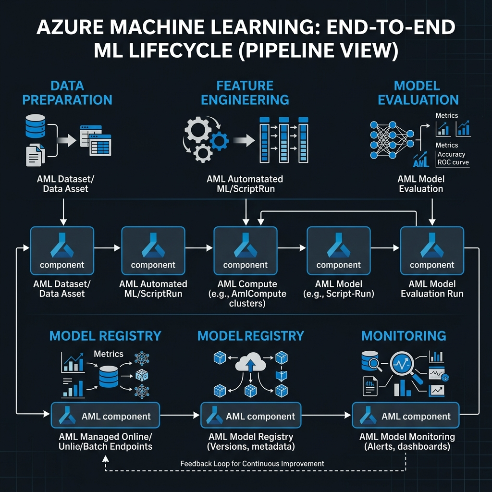

#### Core Concepts

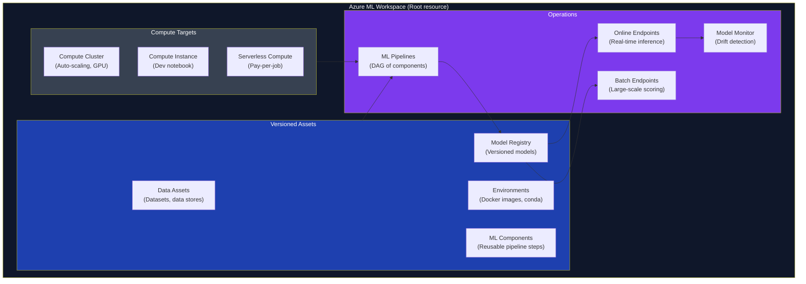
```mermaid
graph TB
    subgraph Workspace["Azure ML Workspace (Root resource)"]
        subgraph Assets["Versioned Assets"]
            Data["Data Assets\n(Datasets, data stores)"]
            Envs["Environments\n(Docker images, conda)"]
            Models["Model Registry\n(Versioned models)"]
            Components["ML Components\n(Reusable pipeline steps)"]
        end

        subgraph Compute["Compute Targets"]
            CCluster["Compute Cluster\n(Auto-scaling, GPU)"]
            CInstance["Compute Instance\n(Dev notebook)"]
            ServerlessComp["Serverless Compute\n(Pay-per-job)"]
        end

        subgraph Ops["Operations"]
            Pipelines["ML Pipelines\n(DAG of components)"]
            Endpoints["Online Endpoints\n(Real-time inference)"]
            BatchEP["Batch Endpoints\n(Large-scale scoring)"]
            Monitor["Model Monitor\n(Drift detection)"]
        end
    end

    Assets --> Pipelines
    Compute --> Pipelines
    Pipelines --> Models
    Models --> Endpoints
    Models --> BatchEP
    Endpoints --> Monitor

    style Workspace fill:#0f172a,color:#fff
    style Assets fill:#1e40af,color:#fff
    style Compute fill:#374151,color:#fff
    style Ops fill:#7c3aed,color:#fff
```

#### ML Components — Reusable Pipeline Building Blocks

ML **Components** are the atomic units of Azure ML pipelines — self-contained, versioned pieces of code that perform a specific task.

```yaml
# Example ML Component Definition
$schema: https://azuremlschemas.azureedge.net/latest/commandComponent.schema.json
name: data_preprocessing
version: 1.2.0
display_name: "Data Preprocessing"
inputs:
  raw_data:
    type: uri_folder
  target_column:
    type: string
outputs:
  processed_data:
    type: uri_folder
code: ./src
environment: azureml:sklearn-env:1
command: python preprocess.py --input ${{inputs.raw_data}} --output ${{outputs.processed_data}}
```

#### Compute Options Comparison

| Compute Type | When to Use | Auto-scale | Cost |
|---|---|---|---|
| **Compute Cluster** | Training, parallel jobs | ✅ Scale to 0 | Pay per second |
| **Compute Instance** | Development, notebooks | ❌ (manual) | Pay per hour |
| **Serverless Compute** | Quick experiments | ✅ Managed | Pay per job |
| **Kubernetes (AKS)** | Production inference | ✅ | Dedicated nodes |

#### MLflow Integration

Azure ML natively integrates with **MLflow** for:
- **Experiment tracking** — log metrics, parameters, artifacts per run
- **Model registry** — stage models (Staging → Production)
- **Model serving** — deploy any MLflow model to Azure endpoints

```python
import mlflow
import mlflow.sklearn

with mlflow.start_run():
    mlflow.log_param("max_depth", 5)
    mlflow.log_metric("accuracy", 0.94)
    mlflow.sklearn.log_model(model, "random-forest-model")
```

#### AutoML
Automatically trains and tunes ML models across classification, regression, time-series forecasting, and NLP — without writing model training code.

> **Interview Language:** "Azure ML's key abstraction is the **ML Pipeline** composed of reusable **Components** — each a versioned, containerized step. We use **Compute Clusters** that scale to zero between jobs to control cost. **MLflow** tracks every experiment, and the **Model Registry** gates promotion from staging to production."

---

### 4.2 Azure AI Bot Service

**Azure AI Bot Service** is the managed platform for building, hosting, and connecting **conversational AI bots** across multiple channels — without managing the underlying infrastructure.

#### Bot Architecture

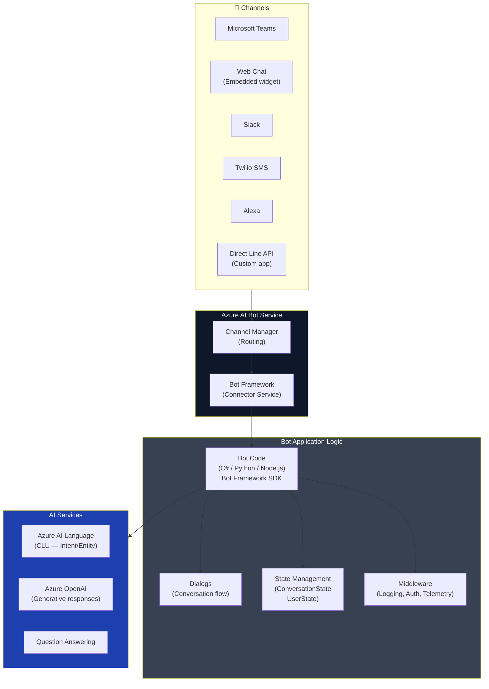
```mermaid
graph TD
    subgraph Channels["💬 Channels"]
        Teams["Microsoft Teams"]
        WebChat["Web Chat\n(Embedded widget)"]
        Slack["Slack"]
        Twilio["Twilio SMS"]
        Alexa["Alexa"]
        DirectLine["Direct Line API\n(Custom app)"]
    end

    subgraph BotService["Azure AI Bot Service"]
        ChannelMgr["Channel Manager\n(Routing)"]
        BotFW["Bot Framework\n(Connector Service)"]
    end

    subgraph BotLogic["Bot Application Logic"]
        BotCode["Bot Code\n(C# / Python / Node.js)\nBot Framework SDK"]
        Dialogs["Dialogs\n(Conversation flow)"]
        State["State Management\n(ConversationState\nUserState)"]
        Middleware["Middleware\n(Logging, Auth, Telemetry)"]
    end

    subgraph AI["AI Services"]
        CLUL["Azure AI Language\n(CLU — Intent/Entity)"]
        OpenAI2["Azure OpenAI\n(Generative responses)"]
        QnA["Question Answering"]
    end

    Channels --> ChannelMgr
    ChannelMgr --> BotFW
    BotFW --> BotCode
    BotCode --> Dialogs
    BotCode --> State
    BotCode --> Middleware
    BotCode --> AI

    style BotService fill:#0f172a,color:#fff
    style AI fill:#1e40af,color:#fff
    style BotLogic fill:#374151,color:#fff
```

#### Bot Building Approaches

| Approach | Tools | Best For |
|---|---|---|
| **Code-first** | Bot Framework SDK (C# / Python / Node.js) | Complex custom logic, enterprise |
| **Declarative** | Power Virtual Agents (Copilot Studio) | Low-code, business users |
| **Generative AI Bot** | Bot Service + Azure OpenAI | Open-domain Q&A, conversational |
| **RAG Bot** | Bot Service + AI Search + OpenAI | Knowledge base bots, document Q&A |

#### Supported Channels (50+)

Microsoft Teams, Slack, Facebook Messenger, WhatsApp (via Twilio), SMS, Alexa, Google Assistant, Web Chat, Direct Line, Email, Skype, Kik, Line, GroupMe.

#### Copilot Studio (Low-Code)
Microsoft's low-code bot platform built on Bot Service — enables business users to build bots with drag-and-drop topics, without code.

> **Interview Language:** "Azure AI Bot Service abstracts the **channel complexity** — the same bot code works across Teams, Slack, and Web Chat. For enterprise bots, we combine Bot Service with **Azure OpenAI for generation** and **Azure AI Search for retrieval**, creating a grounded, enterprise knowledge bot."

---

## 5. End-to-End Architecture Patterns

### Pattern 1: Enterprise Knowledge Bot (RAG)

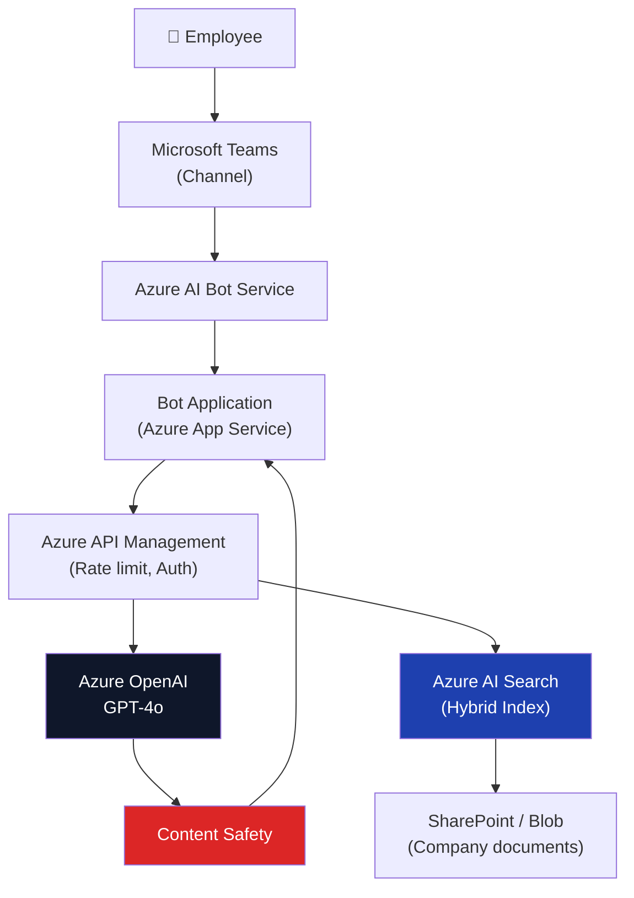
```mermaid
graph TB
    User2["👤 Employee"] --> Teams["Microsoft Teams\n(Channel)"]
    Teams --> BotSvc["Azure AI Bot Service"]
    BotSvc --> AppLogic["Bot Application\n(Azure App Service)"]
    AppLogic --> APIM2["Azure API Management\n(Rate limit, Auth)"]
    APIM2 --> AOAI["Azure OpenAI\nGPT-4o"]
    APIM2 --> AIS2["Azure AI Search\n(Hybrid Index)"]
    AIS2 --> Docs2["SharePoint / Blob\n(Company documents)"]
    AOAI --> Safety2["Content Safety"]
    Safety2 --> AppLogic

    style AOAI fill:#0f172a,color:#fff
    style AIS2 fill:#1e40af,color:#fff
    style Safety2 fill:#dc2626,color:#fff
```

### Pattern 2: Intelligent Document Processing

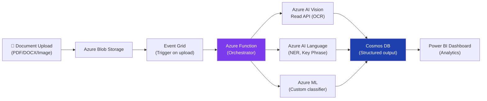
```mermaid
graph LR
    Upload["📄 Document Upload\n(PDF/DOCX/Image)"] --> Blob2["Azure Blob Storage"]
    Blob2 --> EventGrid["Event Grid\n(Trigger on upload)"]
    EventGrid --> Function["Azure Function\n(Orchestrator)"]
    Function --> OCR2["Azure AI Vision\nRead API (OCR)"]
    Function --> Lang3["Azure AI Language\n(NER, Key Phrase)"]
    Function --> Custom2["Azure ML\n(Custom classifier)"]
    OCR2 & Lang3 & Custom2 --> Cosmos2["Cosmos DB\n(Structured output)"]
    Cosmos2 --> Dashboard["Power BI Dashboard\n(Analytics)"]

    style Function fill:#7c3aed,color:#fff
    style Cosmos2 fill:#1e40af,color:#fff
```

### Pattern 3: Multi-Agent AI Workflow

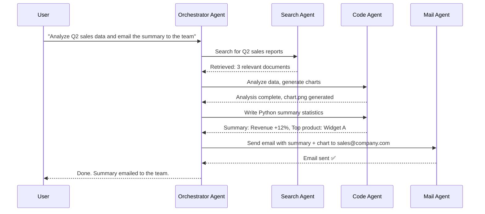
```mermaid
sequenceDiagram
    participant User3 as User
    participant Orch as Orchestrator Agent
    participant SA as Search Agent
    participant CA as Code Agent
    participant MA as Mail Agent

    User3->>Orch: "Analyze Q2 sales data and email the summary to the team"
    Orch->>SA: Search for Q2 sales reports
    SA-->>Orch: Retrieved: 3 relevant documents
    Orch->>CA: Analyze data, generate charts
    CA-->>Orch: Analysis complete, chart.png generated
    Orch->>CA: Write Python summary statistics
    CA-->>Orch: Summary: Revenue +12%, Top product: Widget A
    Orch->>MA: Send email with summary + chart to sales@company.com
    MA-->>Orch: Email sent ✅
    Orch-->>User3: Done. Summary emailed to the team.
```

---

## 6. Service Comparison & When to Use What

### Choosing the Right Model Access Path

| Scenario | Service | Why |
|---|---|---|
| Chat/text generation | Azure OpenAI (GPT-4o) | Best quality, enterprise safety |
| High-volume, cost-sensitive | Azure OpenAI (GPT-4o mini) | 15x cheaper than GPT-4o |
| On-premises / no-cloud | Foundry Catalog (Llama, Phi) | Open source, self-hostable |
| Embeddings for RAG | text-embedding-3-large | Best semantic accuracy |
| Image generation | Azure OpenAI (DALL·E 3) | Highest quality |
| Custom domain NLP | Azure AI Language (Custom) | Fine-tuned on your taxonomy |

### Choosing the Right Search/Retrieval

| Scenario | Service | Why |
|---|---|---|
| Enterprise RAG | Azure AI Search (Hybrid) | Best precision + recall |
| Simple FAQ | Azure AI Language (Q&A) | No indexing pipeline needed |
| Real-time web data | Bing Search API | Live web index |
| Structured data | Azure SQL + Full-text | Filter + keyword |
| Product catalog | Azure AI Search + Vector | Semantic + attribute filter |

### Agent vs Direct API

| Scenario | Use Agent | Use Direct API |
|---|---|---|
| Multi-step reasoning | ✅ | ❌ |
| Autonomous tool use | ✅ | ❌ |
| Single-turn Q&A | ❌ | ✅ |
| Latency < 1s required | ❌ | ✅ |
| Complex workflow | ✅ | ❌ |
| Simple generation | ❌ | ✅ |

---

## 7. Security, Governance & Responsible AI

### Azure AI Safety Architecture

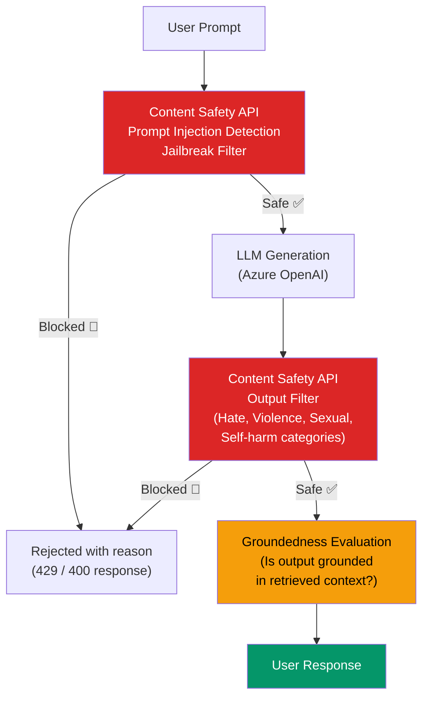
```mermaid
graph TD
    Input["User Prompt"] --> PromptFilter["Content Safety API\nPrompt Injection Detection\nJailbreak Filter"]
    PromptFilter -->|"Blocked 🚫"| Rejected["Rejected with reason\n(429 / 400 response)"]
    PromptFilter -->|"Safe ✅"| LLMCall["LLM Generation\n(Azure OpenAI)"]
    LLMCall --> OutputFilter["Content Safety API\nOutput Filter\n(Hate, Violence, Sexual,\nSelf-harm categories)"]
    OutputFilter -->|"Blocked 🚫"| Rejected
    OutputFilter -->|"Safe ✅"| Eval2["Groundedness Evaluation\n(Is output grounded\nin retrieved context?)"]
    Eval2 --> User4["User Response"]

    style PromptFilter fill:#dc2626,color:#fff
    style OutputFilter fill:#dc2626,color:#fff
    style Eval2 fill:#f59e0b,color:#000
    style User4 fill:#059669,color:#fff
```

### Responsible AI Principles (Microsoft)

| Principle | What It Means | Azure Implementation |
|---|---|---|
| **Fairness** | AI doesn't discriminate | Fairlearn, evaluation metrics |
| **Reliability & Safety** | AI behaves as expected | Content Safety, testing frameworks |
| **Privacy & Security** | Data is protected | Private endpoints, CMK, no training |
| **Inclusiveness** | AI works for everyone | Accessibility, multilingual |
| **Transparency** | Decisions are explainable | Azure ML Explain, Prompt Flow tracing |
| **Accountability** | Humans remain in control | Human-in-loop, audit logs, guardrails |

### Data Protection

| Protection | How |
|---|---|
| **Data in transit** | TLS 1.2+ encryption |
| **Data at rest** | AES-256, Customer-Managed Keys (CMK) via Key Vault |
| **Network isolation** | Azure Private Endpoint, VNet injection |
| **Identity** | Azure Entra ID, Managed Identity (no secrets) |
| **Audit** | Azure Monitor, Diagnostic logs, Microsoft Sentinel |
| **No model training** | Contractual guarantee — your data is NOT used to train OpenAI models |

---

## 8. Pricing Model Overview

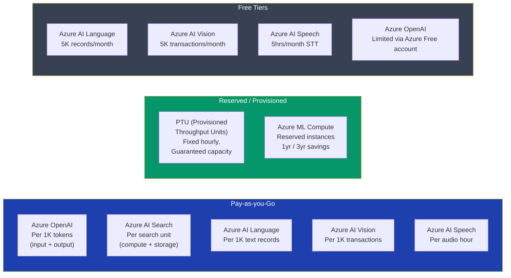
```mermaid
graph LR
    subgraph PayPerUse["Pay-as-you-Go"]
        T1["Azure OpenAI\nPer 1K tokens\n(input + output)"]
        T2["Azure AI Search\nPer search unit\n(compute + storage)"]
        T3["Azure AI Language\nPer 1K text records"]
        T4["Azure AI Vision\nPer 1K transactions"]
        T5["Azure AI Speech\nPer audio hour"]
    end

    subgraph Reserved["Reserved / Provisioned"]
        R1["PTU (Provisioned\nThroughput Units)\nFixed hourly,\nGuaranteed capacity"]
        R2["Azure ML Compute\nReserved instances\n1yr / 3yr savings"]
    end

    subgraph Free["Free Tiers"]
        F1["Azure AI Language\n5K records/month"]
        F2["Azure AI Vision\n5K transactions/month"]
        F3["Azure AI Speech\n5hrs/month STT"]
        F4["Azure OpenAI\nLimited via Azure Free account"]
    end

    style PayPerUse fill:#1e40af,color:#fff
    style Reserved fill:#059669,color:#fff
    style Free fill:#374151,color:#fff
```

### Cost Optimization Tips

| Tip | Savings |
|---|---|
| Use GPT-4o mini instead of GPT-4o for simple tasks | ~15x cheaper per token |
| Enable caching for repeated identical prompts | Up to 50% token savings |
| Use batch endpoints for non-real-time workloads | Up to 50% compute savings |
| Use Provisioned Throughput Units at scale | Predictable cost, no throttling |
| Right-size Azure ML compute clusters | Auto-scale to zero saves 100% idle cost |
| Use Llama/Phi for high-volume, lower-stakes tasks | Open-source, no token cost |

---

## 9. Interview Quick Reference

### Core Service Summary Table

| Service | Category | What It Does | Key Differentiator |
|---|---|---|---|
| **Azure AI Foundry** | Platform | Unified AI development hub | Model catalog + agent + safety in one place |
| **Azure OpenAI Service** | Foundation | Enterprise GPT-4o, embeddings, DALL·E | Enterprise SLA, private network, no training |
| **Foundry Agent Service** | Agents | Build multi-agent AI systems | MCP tools, thread management, governance |
| **Azure AI Search** | Retrieval | Enterprise vector + keyword search | Best RAG retrieval, hybrid search + ranker |
| **Azure AI Language** | NLP | Sentiment, NER, translation, summarization | 100+ languages, custom entity training |
| **Azure AI Vision** | Vision | OCR, object detection, image analysis | Read API table extraction, Video Indexer |
| **Azure AI Speech** | Audio | STT, TTS, speaker recognition | Neural voice cloning, 100+ languages |
| **Azure Machine Learning** | ML Ops | Full ML lifecycle, pipeline, monitoring | ML Components, MLflow, model registry |
| **Azure AI Bot Service** | Conversational | Multi-channel bot hosting | 50+ channels, integrates all AI services |

### Common Interview Questions

**Q: What is Azure AI Foundry?**
> Azure AI Foundry is Microsoft's unified AI development platform — a single hub for discovering models from the catalog (GPT-4o, Llama, Mistral), building and deploying agents, enforcing safety guardrails through Content Safety, and monitoring production AI applications.

**Q: How does RAG work on Azure?**
> RAG (Retrieval-Augmented Generation) on Azure combines **Azure AI Search** (for retrieval) with **Azure OpenAI** (for generation). Documents are chunked, embedded using text-embedding-3-large, and stored in an AI Search vector index. At query time, the user's question is embedded, hybrid search retrieves top-K relevant chunks, those chunks are injected into the GPT-4o prompt as context, and the model generates a grounded, cited answer.

**Q: When do you use Azure ML vs Azure AI Foundry?**
> Use **Azure ML** when you need to train custom models, manage ML pipelines, track experiments with MLflow, or deploy traditional ML models (scikit-learn, PyTorch). Use **Azure AI Foundry** when you're working with foundation models (LLMs), building generative AI applications, fine-tuning LLMs, or building agents. They complement each other — Azure ML trains the specialized models that Azure AI Foundry then deploys and orchestrates.

**Q: How do you secure Azure AI services?**
> Four layers: (1) **Network** — Private Endpoints keep traffic off public internet; (2) **Identity** — Managed Identity + Entra ID, no API keys; (3) **Data** — Customer-Managed Keys for encryption, contractual no-training guarantee; (4) **Content** — Content Safety API filters prompts and outputs for harmful categories.

**Q: What is the difference between Azure AI Search and Cosmos DB vector search?**
> Azure AI Search is purpose-built for search with hybrid BM25+vector, semantic ranker, skillsets, and multi-source indexers. Cosmos DB vector search is good when your data is already in Cosmos DB and you want vector search alongside your transactional data. For RAG-focused workloads, Azure AI Search gives better retrieval quality.

---

*Azure AI Stack Reference v1.0 | June 2026 | Based on Azure AI Foundry GA*
