# Microsoft Azure AI — The 4-Pillar Production Stack

> **Enterprise-grade reference** for building autonomous, data-grounded, multi-agent applications using **Agentic AI**, **Azure AI Foundry**, **Semantic Kernel**, and **Azure AI Search**.

---

## Table of Contents

1. [What Is the 4-Pillar Stack?](#1-what-is-the-4-pillar-stack)
2. [Pillar 1 — Agentic AI (The Paradigm)](#2-pillar-1--agentic-ai-the-paradigm)
3. [Pillar 2 — Azure AI Foundry (The Platform)](#3-pillar-2--azure-ai-foundry-the-platform)
4. [Pillar 3 — Semantic Kernel (The Orchestration SDK)](#4-pillar-3--semantic-kernel-the-orchestration-sdk)
5. [Pillar 4 — Azure AI Search (The Knowledge Engine)](#5-pillar-4--azure-ai-search-the-knowledge-engine)
6. [How They Work Together (End-to-End Flow)](#6-how-they-work-together-end-to-end-flow)
7. [Production Architecture Patterns](#7-production-architecture-patterns)
8. [Comparison Table](#8-comparison-table)
9. [Getting Started](#9-getting-started)
10. [Interview Quick Reference](#10-interview-quick-reference)

---

## 1. What Is the 4-Pillar Stack?


**Agentic AI**, **Azure AI Foundry**, **Semantic Kernel**, and **Azure AI Search** form Microsoft's unified, production-grade enterprise stack for building autonomous, data-grounded multi-agent applications.

Rather than building simple chatbots, this modern ecosystem allows developers to construct **independent AI microservices** that can:

- 🧠 **Plan** and break down complex goals autonomously
- 🔍 **Reason** over enterprise data with verified citations
- 🛠️ **Access external tools** (APIs, databases, code execution)
- 🔒 **Operate securely** inside your Azure tenant with governance

Each technology plays a distinct, non-overlapping role:

| Pillar | Role | Layer |
|---|---|---|
| **Agentic AI** | The paradigm/design philosophy | Conceptual |
| **Azure AI Foundry** | The managed platform & control plane | Infrastructure |
| **Semantic Kernel** | The code-first orchestration SDK | Development |
| **Azure AI Search** | The knowledge & grounding engine | Data |

---

## 2. Pillar 1 — Agentic AI (The Paradigm)

### What Is Agentic AI?

**Agentic AI** is a fundamental paradigm shift from **reactive AI** (respond to a prompt) to **proactive, goal-oriented systems** (plan and act autonomously until a problem is solved).

| Traditional AI | Agentic AI |
|---|---|
| Single prompt → single response | Goal → multi-step autonomous plan |
| Stateless (no memory between calls) | Stateful (maintains context across many steps) |
| No tool access | Uses external tools, APIs, code execution |
| Deterministic flow | Dynamic, adaptive reasoning loop |
| Human-in-the-loop at every step | Human sets goal; agent iterates independently |

### The Agentic Reasoning Loop

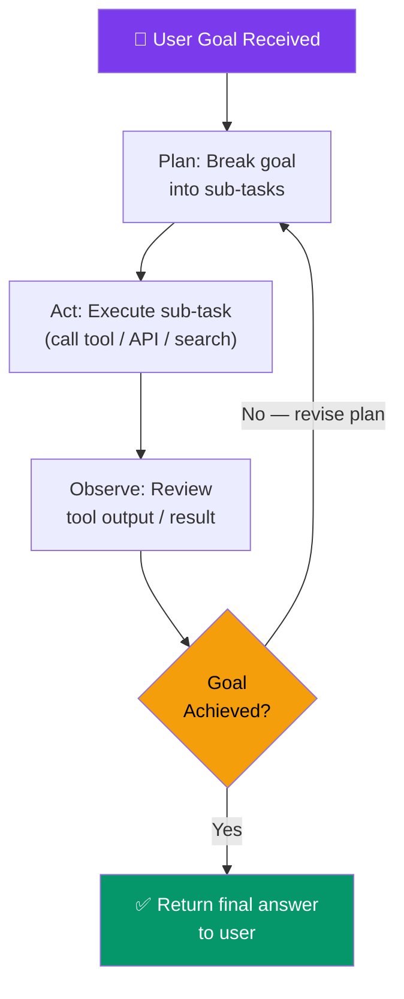

### Agentic Design Patterns


#### Pattern 1: Sequential Pipeline

Agents execute in a fixed, ordered sequence. Each agent's output feeds the next.

```
[ Triage Agent ] → [ Research Agent ] → [ Analysis Agent ] → [ Report Agent ]
```

**Best for:** Document processing, report generation, ETL workflows.

#### Pattern 2: Group Chat / Hub-and-Spoke

An **Orchestrator agent** manages a group of specialized agents. It delegates tasks based on capability.

```
                    ┌─────────────────────┐
                    │  Orchestrator Agent  │
                    └─────────────────────┘
                   /         |              \
          Research      Analysis          Comms
           Agent         Agent            Agent
```

**Best for:** Complex enterprise workflows where tasks span multiple domains.

#### Pattern 3: Magentic-One (Self-Healing / Resilient)

Microsoft's multi-agent orchestration framework designed for robustness. If a sub-agent fails, the orchestrator retries, reassigns, or recovers without human intervention.

**Core principle:** Autonomous error recovery and task re-planning.

### Key Capabilities

| Capability | Description |
|---|---|
| **Goal decomposition** | Automatically breaks a high-level goal into actionable sub-tasks |
| **Tool use** | Calls external APIs, runs code, searches databases |
| **Memory** | Maintains conversation history and task state across steps |
| **Self-correction** | Reviews its own outputs and tries again if the result is wrong |
| **Multi-agent collaboration** | Delegates sub-tasks to specialized agents |

> **Interview Language:** "Agentic AI is the paradigm shift from chatbots to autonomous goal-solving systems. An agent evaluates goals, creates a plan, executes tools iteratively, and self-corrects until the objective is met — without human intervention at each step."

---

## 3. Pillar 2 — Azure AI Foundry (The Platform)

### What Is Azure AI Foundry?

**Azure AI Foundry** is Microsoft's **unified enterprise hub and managed platform** for generative AI. It is the single control plane where teams access models, build agents, enforce safety, and deploy AI applications to production.

Think of it as the **"Azure Portal for AI"** — everything lives here.

### Foundry's Four Capabilities

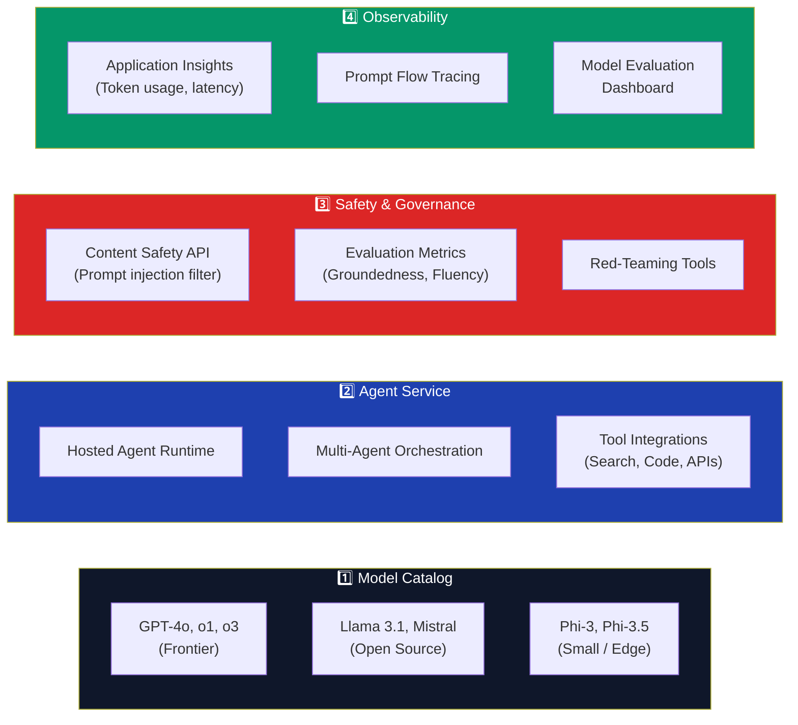

### 3.1 Model Catalog — Supported Models

| Category | Models | Best For |
|---|---|---|
| **Frontier (OpenAI)** | GPT-4o, GPT-4o mini, o1, o3 | Complex reasoning, multimodal tasks |
| **Embedding** | text-embedding-3-large, ada-002 | Vector search, RAG, semantic similarity |
| **Image Generation** | DALL·E 3 | Image creation from text prompts |
| **Open Source — Text** | Llama 3.1 405B, Mistral Large | Cost-effective generation, on-prem |
| **Small / Edge** | Phi-3 Mini, Phi-3.5 | Low-latency, mobile / edge inference |
| **Code** | CodeLlama, DeepSeek-Coder | Code generation, coding assistance |

### 3.2 Foundry Agent Service — Managed Agents

**Azure AI Foundry Agent Service** is the managed runtime for deploying **secure, governed AI agents** without managing infrastructure.

#### Agent Lifecycle (Foundry)

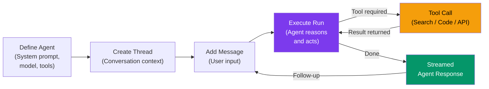

#### Built-in Agent Tools

| Tool | What It Does | Example Use Case |
|---|---|---|
| **File Search** | Retrieves answers from uploaded PDFs, DOCX, TXT | Policy Q&A bot |
| **Code Interpreter** | Executes Python in a sandboxed container | Data analysis, charting |
| **Function Calling** | Calls your custom APIs/functions | Order lookup, CRM update |
| **Azure AI Search** | Semantic/vector search over enterprise knowledge | Knowledge management bot |
| **Bing Search** | Live real-time web search | News queries, live data |
| **Azure Logic Apps** | Connects to workflow automation | Approval workflows |

### 3.3 Safety & Evaluation

Foundry has **built-in responsible AI guardrails**:

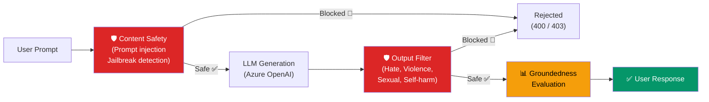

#### Evaluation Metrics

| Metric | What It Measures |
|---|---|
| **Groundedness** | Is the answer supported by the retrieved context? |
| **Relevance** | Does the answer address the user's question? |
| **Coherence** | Is the text well-structured and logical? |
| **Fluency** | Is the language natural and grammatically correct? |
| **Similarity** | How close is the output to a reference answer? |

### 3.4 Enterprise Security Features

| Feature | Description |
|---|---|
| **Private Endpoints** | All traffic stays within Azure VNet — no public internet |
| **Managed Identity** | Passwordless auth via Azure Entra ID |
| **Customer-Managed Keys** | Your own encryption keys via Azure Key Vault |
| **RBAC** | Role-based access control on every resource |
| **No model training on your data** | Contractual guarantee from Microsoft |
| **Data Residency** | Choose region to keep data within geographic boundaries |

> **Interview Language:** "Azure AI Foundry is the control plane for enterprise AI. It unifies model access (GPT-4o to Llama), provides a managed agent runtime with built-in safety, and gives us full observability via Application Insights — all within our Azure tenant's security boundary."

---

## 4. Pillar 3 — Semantic Kernel (The Orchestration SDK)

### What Is Semantic Kernel?

**Semantic Kernel (SK)** is Microsoft's open-source, code-first SDK for building, managing, and programmatically orchestrating AI agents and workflows. It's the **programming bridge** between LLMs and your application logic.


### Language Support

| Language | SDK Package | Status |
|---|---|---|
| **C# (.NET)** | `Microsoft.SemanticKernel` | GA — production ready |
| **Python** | `semantic-kernel` | GA — production ready |
| **Java** | `semantic-kernel-java` | Preview |

### Core Concepts

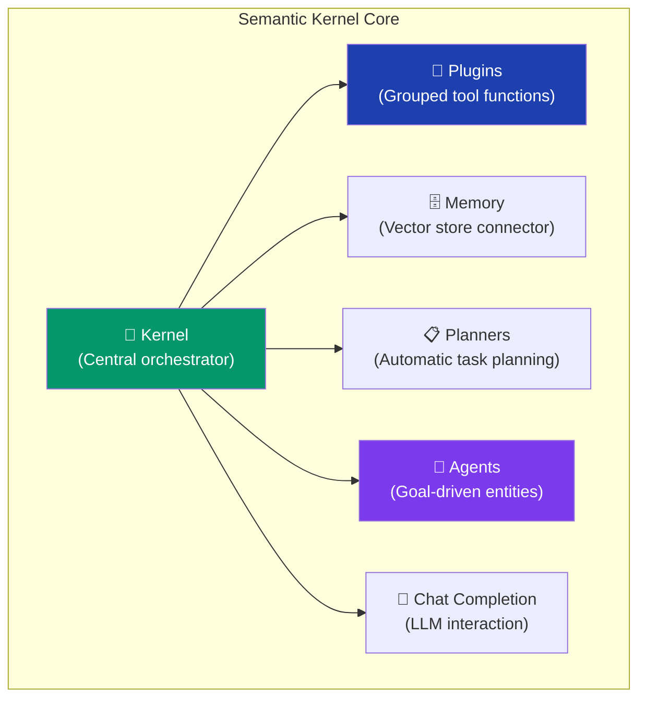

### 4.1 Plugins — The Building Blocks

**Plugins** are collections of **functions** that the AI can call. They convert your existing code into tools that agents can use.

```csharp
// C# — Define a plugin
public class EmailPlugin
{
    [KernelFunction, Description("Send an email to a recipient")]
    public async Task SendEmail(
        [Description("Recipient's email address")] string to,
        [Description("Email subject line")] string subject,
        [Description("Email body content")] string body)
    {
        await _emailClient.SendAsync(to, subject, body);
    }

    [KernelFunction, Description("Get all unread emails from inbox")]
    public async Task<List<Email>> GetUnreadEmails()
    {
        return await _emailClient.GetUnreadAsync();
    }
}
```

```python
# Python — Define a plugin
from semantic_kernel.functions import kernel_function

class EmailPlugin:
    @kernel_function(description="Send an email to a recipient")
    async def send_email(self, to: str, subject: str, body: str) -> str:
        await email_client.send(to, subject, body)
        return f"Email sent to {to}"
```

### 4.2 Planners — Automatic Task Orchestration

**Planners** allow the kernel to automatically determine the sequence of plugin calls needed to achieve a goal.

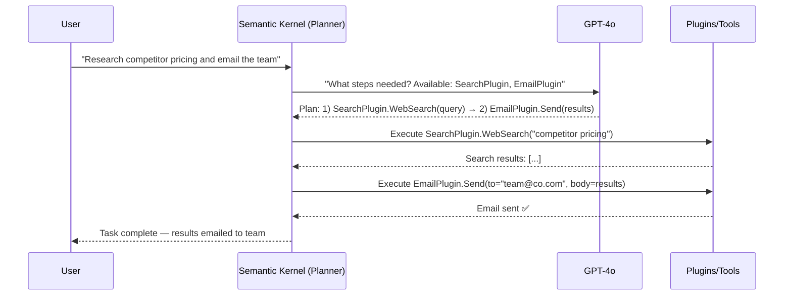

### 4.3 Agent Framework

SK's Agent Framework supports two primary agent types:

| Agent Type | Description | Best For |
|---|---|---|
| **ChatCompletionAgent** | Uses chat history + plugins for multi-turn conversations | Conversational assistants |
| **OpenAIAssistantAgent** | Wraps Azure OpenAI Assistant API (threads, runs, tools) | Complex tool-using agents |

#### Multi-Agent Orchestration with SK

```python
from semantic_kernel.agents import AgentGroupChat, ChatCompletionAgent
from semantic_kernel.agents.strategies import TerminationStrategy

# Define specialized agents
research_agent = ChatCompletionAgent(
    service_id="azure_openai",
    name="ResearchAgent",
    instructions="You are a research expert. Search for information and summarize findings."
)

analysis_agent = ChatCompletionAgent(
    service_id="azure_openai",
    name="AnalysisAgent",
    instructions="You analyze data provided by the Research Agent and produce insights."
)

# Create multi-agent group chat
group_chat = AgentGroupChat(
    agents=[research_agent, analysis_agent],
    termination_strategy=TerminationStrategy(max_iterations=10)
)

# Invoke with a goal
async for message in group_chat.invoke("Analyze Q3 sales trends"):
    print(f"{message.name}: {message.content}")
```

### 4.4 Memory & Vector Store Connectors

SK connects to multiple vector stores for semantic memory:

| Store | Package |
|---|---|
| **Azure AI Search** | `Microsoft.SemanticKernel.Connectors.AzureAISearch` |
| **Qdrant** | `Microsoft.SemanticKernel.Connectors.Qdrant` |
| **Chroma** | `semantic-kernel[chroma]` |
| **Pinecone** | `semantic-kernel[pinecone]` |
| **Cosmos DB (DiskANN)** | `Microsoft.SemanticKernel.Connectors.CosmosDB` |

### 4.5 Framework Convergence

SK is the **programmatic layer** of the Microsoft Agent Framework — you can convert code-defined SK plugins directly into Foundry Agent tools, enabling seamless transition from local development to cloud-hosted agents.

```
SK Plugin  →  Foundry Agent Tool  →  Production Agent Service
```

> **Interview Language:** "Semantic Kernel is the code-first SDK that connects LLMs to application logic. We define **plugins** (functions the AI can call), use **planners** for automatic task decomposition, and orchestrate **multi-agent group chats** where specialized agents collaborate. It supports both C# and Python and integrates natively with Azure AI Foundry."

---

## 5. Pillar 4 — Azure AI Search (The Knowledge Engine)

### What Is Azure AI Search?

**Azure AI Search** (formerly Azure Cognitive Search) is the enterprise **search and retrieval engine** purpose-built for **Retrieval-Augmented Generation (RAG)**. It goes far beyond keyword search — it's an intelligent knowledge retrieval system.


### 5.1 The Search Stack

Azure AI Search uses a **three-layer hybrid stack**:

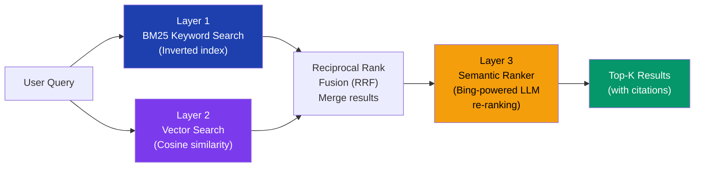

### 5.2 Index Types

| Index Type | How It Works | Best For |
|---|---|---|
| **Full-text (BM25)** | Keyword-based inverted index ranking | Exact keyword search, filters |
| **Vector** | Store embeddings; cosine similarity | Semantic / concept search |
| **Hybrid** | BM25 + Vector with Reciprocal Rank Fusion | Best of both — **recommended for RAG** |
| **Semantic Ranker** | Re-rank top results using an LLM | Improve Top-K precision |

### 5.3 Agentic Retrieval — The Game Changer

**Agentic Retrieval** is Azure AI Search's most powerful feature for complex RAG workloads. Instead of a simple single lookup, it uses an **integrated LLM** to intelligently plan and execute retrieval:

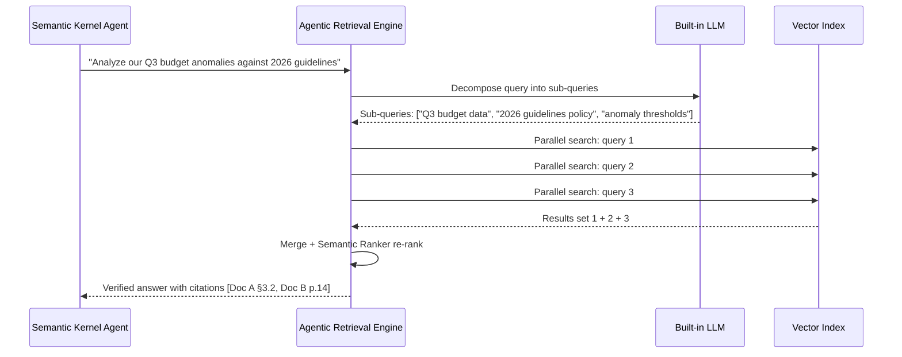

**Why it matters:** Traditional search uses one lookup → one result. Agentic Retrieval uses LLM-driven multi-query planning → parallel retrieval → ranked, cited answers.

### 5.4 Supported Data Sources (Indexers)

| Source | Indexer | Supported File Types |
|---|---|---|
| **Azure Blob Storage** | Blob Indexer | PDF, DOCX, TXT, HTML, CSV, JSON |
| **Azure SQL Database** | SQL Indexer | SQL rows → searchable documents |
| **Cosmos DB** | Cosmos Indexer | JSON documents |
| **SharePoint Online** | SharePoint Indexer | Office files, PDFs |
| **Azure Data Lake Gen2** | ADLS Indexer | Any file type |
| **OneLake (Fabric)** | OneLake Indexer | Lakehouse data |
| **Custom / Any Source** | Push API | Any format via REST push |

### 5.5 AI Enrichment Skillsets

During indexing, you can apply **AI Skillsets** to enrich documents before storing them in the index:

| Skill | What It Does |
|---|---|
| **OCR Skill** | Extracts text from images and scanned PDFs |
| **Language Detection** | Identifies the language of each document |
| **Entity Recognition** | Extracts people, places, organizations, dates |
| **Key Phrase Extraction** | Generates searchable tags from document content |
| **Custom Skill (Azure Function)** | Call your own ML model during indexing |
| **Vectorize Text** | Auto-embed chunks using Azure OpenAI |

### 5.6 Key Features at a Glance

| Feature | Description |
|---|---|
| **Integrated Vectorization** | Auto-embed documents during indexing — no separate pipeline needed |
| **Semantic Ranker** | L2 re-ranking using language understanding for precision |
| **Filters + Facets** | Apply structured metadata filters on top of semantic results |
| **RBAC / Document-Level Security** | Trim results based on user's access permissions |
| **Private Endpoint** | Index over private data sources securely |
| **Geo-distributed Replicas** | Multi-region index for low-latency global access |

> **Interview Language:** "Azure AI Search is our RAG backbone. We use **hybrid search** (BM25 + vector) with a **Semantic Ranker** for best retrieval quality. Its **Agentic Retrieval** feature goes further — it uses an integrated LLM to decompose complex questions into parallel sub-queries, retrieve from multiple index shards, and return verified, cited answers."

---

## 6. How They Work Together (End-to-End Flow)


### The Production Flow

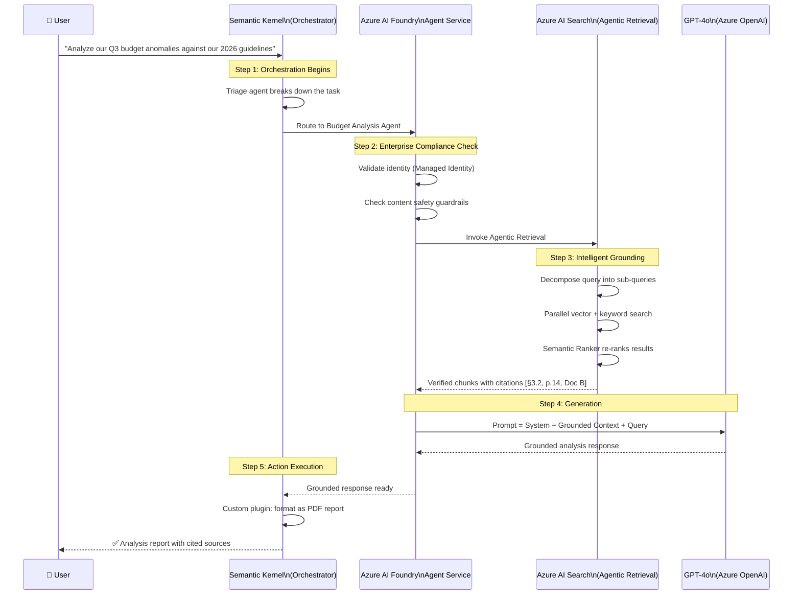

### Layer-by-Layer Breakdown

| Step | Layer | Technology | What Happens |
|---|---|---|---|
| **1** | Orchestration | Semantic Kernel | User request received; triage agent decomposes the task |
| **2** | Control Plane | Azure AI Foundry | Identity validated, safety check passed, agent routed |
| **3** | Grounding | Azure AI Search | Agentic multi-turn retrieval; returns verified, cited chunks |
| **4** | Generation | Azure OpenAI (GPT-4o) | LLM generates answer grounded in retrieved context |
| **5** | Action | Semantic Kernel (Plugin) | Post-processing: format, store, email, or display results |

---

## 7. Production Architecture Patterns

### Pattern 1: Enterprise Knowledge Bot (RAG)

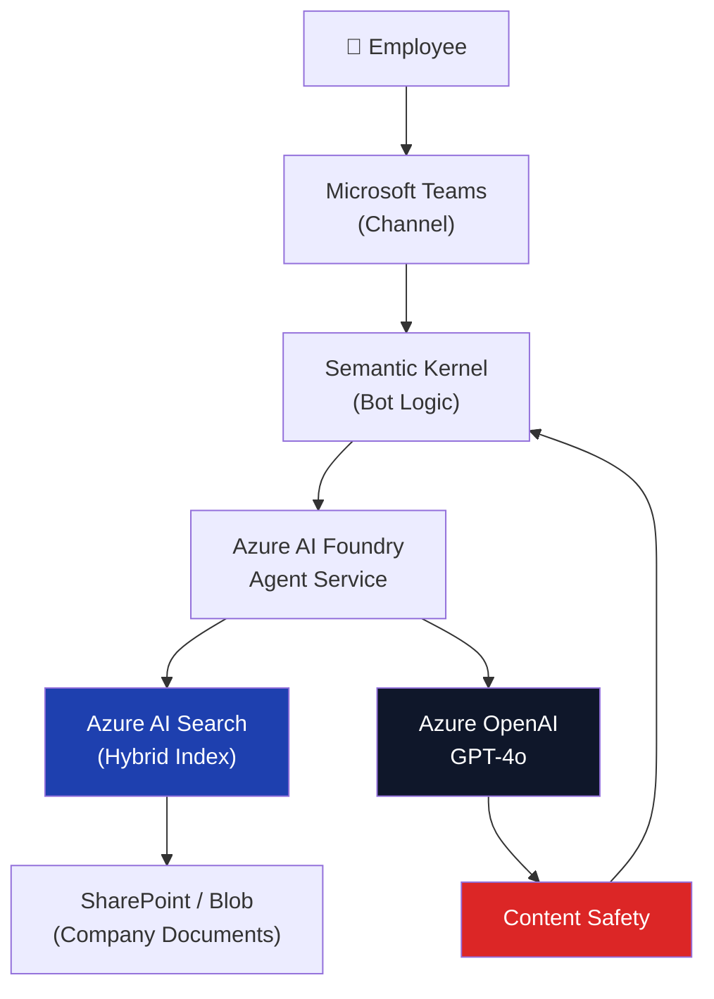

**Stack:** Teams → Semantic Kernel → Foundry Agent → AI Search + OpenAI

### Pattern 2: Multi-Agent Enterprise Workflow

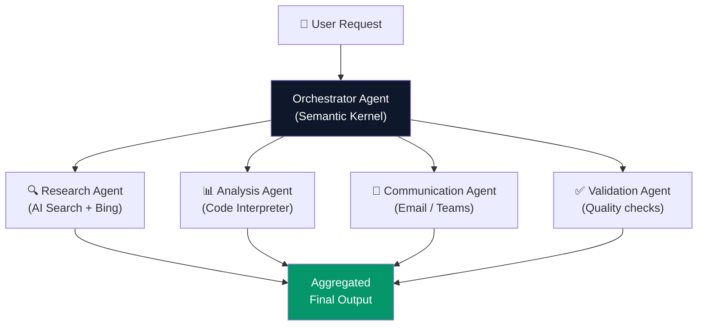

### Pattern 3: Intelligent Document Processing

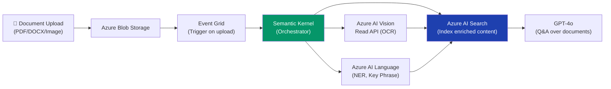

---

## 8. Comparison Table

### Feature Comparison: The 3 Services

| Feature | Semantic Kernel | Azure AI Foundry | Azure AI Search |
|---|---|---|---|
| **Primary Role** | Pro-code SDK & agent router | Managed cloud host & governance | Knowledge retriever & data source |
| **What You Write** | C# or Python code | Configuration & policies | Index schema & skillsets |
| **Execution** | Local or cloud runtime | Enterprise SaaS / Azure cloud | Fully managed cloud index |
| **Key Capability** | Multi-agent workflows, plugins, planners | Security, model evaluation, telemetry | Agentic multi-turn retrieval, hybrid ranking |
| **When to Use** | Building agent logic, orchestrating workflows | Deploying & governing agents in production | Grounding LLM answers in enterprise data |
| **Open Source?** | ✅ Yes (MIT License) | ❌ No (Azure PaaS) | ❌ No (Azure PaaS) |
| **Language** | C# / Python / Java | Portal / REST / SDK | REST / SDK |

### Choosing the Right Retrieval Approach

| Scenario | Best Choice | Why |
|---|---|---|
| Enterprise RAG over documents | **Azure AI Search (Hybrid)** | Best precision + recall |
| Simple FAQ bot | **Azure AI Language (Q&A)** | No indexing pipeline needed |
| Real-time web data | **Bing Search API** | Live web index |
| Structured database queries | **Azure SQL + Full-text** | Filter + keyword |
| Product catalog search | **AI Search + Vector** | Semantic + attribute filter |

---

## 9. Getting Started

### Prerequisites

```bash
# Install Azure CLI
brew install azure-cli

# Login to Azure
az login

# Install Semantic Kernel (Python)
pip install semantic-kernel

# Or for .NET
dotnet add package Microsoft.SemanticKernel
```

### Quickstart: Connect SK to Azure AI Foundry

```python
import asyncio
from semantic_kernel import Kernel
from semantic_kernel.connectors.ai.open_ai import AzureChatCompletion
from semantic_kernel.agents import ChatCompletionAgent

# Initialize Kernel
kernel = Kernel()

# Add Azure OpenAI via Foundry endpoint
kernel.add_service(
    AzureChatCompletion(
        service_id="azure_openai",
        deployment_name="gpt-4o",
        endpoint="https://<your-foundry-endpoint>.openai.azure.com/",
        api_key="<your-api-key>"   # Or use Managed Identity
    )
)

# Create an agent
agent = ChatCompletionAgent(
    service_id="azure_openai",
    kernel=kernel,
    name="EnterpriseAssistant",
    instructions="You are a helpful enterprise assistant. Always cite your sources."
)

# Chat with the agent
async def chat():
    response = await agent.get_response("Summarize our Q3 performance")
    print(response.content)

asyncio.run(chat())
```

### Quickstart: Azure AI Search RAG Pipeline

```python
from azure.search.documents import SearchClient
from azure.search.documents.models import VectorizedQuery
from azure.core.credentials import AzureKeyCredential
from openai import AzureOpenAI

# Initialize clients
search_client = SearchClient(
    endpoint="https://<your-search>.search.windows.net",
    index_name="enterprise-docs",
    credential=AzureKeyCredential("<search-key>")
)

openai_client = AzureOpenAI(
    azure_endpoint="https://<your-openai>.openai.azure.com/",
    api_key="<openai-key>",
    api_version="2024-05-01-preview"
)

def rag_query(user_question: str) -> str:
    # 1. Embed the user's question
    embedding = openai_client.embeddings.create(
        model="text-embedding-3-large",
        input=user_question
    ).data[0].embedding

    # 2. Hybrid search (keyword + vector)
    vector_query = VectorizedQuery(
        vector=embedding,
        k_nearest_neighbors=5,
        fields="content_vector"
    )
    results = search_client.search(
        search_text=user_question,        # BM25 keyword component
        vector_queries=[vector_query],    # Vector component
        query_type="semantic",
        semantic_configuration_name="default",
        top=5
    )

    # 3. Build context from retrieved chunks
    context = "\n\n".join([doc["content"] for doc in results])

    # 4. Generate grounded answer
    response = openai_client.chat.completions.create(
        model="gpt-4o",
        messages=[
            {"role": "system", "content": f"Answer based only on this context:\n{context}"},
            {"role": "user", "content": user_question}
        ]
    )
    return response.choices[0].message.content

# Run the RAG pipeline
answer = rag_query("What is our refund policy for enterprise customers?")
print(answer)
```

### Official Resources

| Resource | Link |
|---|---|
| Azure AI Foundry | https://ai.azure.com |
| Semantic Kernel GitHub | https://github.com/microsoft/semantic-kernel |
| Azure AI Search Docs | https://learn.microsoft.com/azure/search |
| Multi-Agent .NET Sample | https://github.com/Azure-Samples/azureai-samples |
| Azure App Service Agentic Tutorial | https://learn.microsoft.com/azure/ai-services/agents |

---

## 10. Interview Quick Reference

### Key Concepts Cheat Sheet

| Term | One-Line Definition |
|---|---|
| **Agentic AI** | AI that autonomously plans, acts, and iterates to achieve a goal |
| **Azure AI Foundry** | Microsoft's unified managed platform (control plane) for enterprise generative AI |
| **Semantic Kernel** | Open-source SDK (C# / Python) for orchestrating LLMs, agents, and plugins |
| **Azure AI Search** | Enterprise search engine with hybrid retrieval + agentic RAG capabilities |
| **RAG** | Retrieval-Augmented Generation — grounding LLM answers in retrieved enterprise data |
| **Agentic Retrieval** | AI Search's LLM-driven multi-query decomposition for complex retrieval |
| **Semantic Ranker** | Bing-powered LLM re-ranking of search results for precision |
| **Plugin (SK)** | A collection of annotated functions the AI can call as tools |
| **Planner (SK)** | SK component that auto-generates a plan (sequence of plugins) to achieve a goal |
| **Thread (Foundry)** | A persistent conversation context for a Foundry Agent run |
| **Hybrid Search** | Combining BM25 keyword + vector search with Reciprocal Rank Fusion |
| **PTU** | Provisioned Throughput Units — reserved Azure OpenAI capacity for consistent latency |

### Top Interview Questions

**Q1: What is the role of Semantic Kernel vs Azure AI Foundry?**
> **Semantic Kernel** is the developer SDK — you write code in C# or Python to define agent logic, plugins, and orchestration. **Azure AI Foundry** is the managed cloud platform — it hosts the agents, provides governance, safety, telemetry, and model access. SK is how you build; Foundry is where you deploy and operate.

**Q2: How does Azure AI Search's Agentic Retrieval differ from traditional search?**
> Traditional search: one query → one set of results. Agentic Retrieval: a complex question is analyzed by an integrated LLM → decomposed into parallel sub-queries → each sub-query hits the index → results are merged and re-ranked by the Semantic Ranker → a verified, cited answer is returned. This is critical for complex enterprise Q&A.

**Q3: Why use Semantic Kernel instead of calling Azure OpenAI directly?**
> Direct API calls give you a single LLM response. Semantic Kernel gives you: (1) **Plugin management** — clean abstraction for tool calling, (2) **Planners** — automatic task decomposition without prompt engineering, (3) **Multi-agent orchestration** — coordinate multiple specialized agents, (4) **Memory connectors** — semantic memory from vector stores, (5) **Native Foundry integration** — seamlessly promote local agents to cloud-hosted production agents.

**Q4: How does this stack handle enterprise security?**
> Four layers: (1) **Network** — Private Endpoints keep all traffic within the Azure VNet; (2) **Identity** — Managed Identity + Azure Entra ID (no API keys in code); (3) **Data** — Customer-Managed Keys for encryption, contractual no-training guarantee; (4) **Content** — Content Safety API filters both prompts and model outputs for harmful categories.

**Q5: When would you use the full 4-pillar stack vs just Azure OpenAI?**
> Use just Azure OpenAI for simple, stateless chat completions or embeddings. Use the full stack when you need: multi-step autonomous reasoning, access to enterprise data sources (RAG), multiple specialized agents collaborating, production governance (safety, tracing, evaluation), or complex tool use across APIs and databases. The full stack turns a single LLM call into a production-grade enterprise AI system.

---

*Azure AI Stack2 Reference | June 2026 | Based on Azure AI Foundry GA + Semantic Kernel v1.x*
