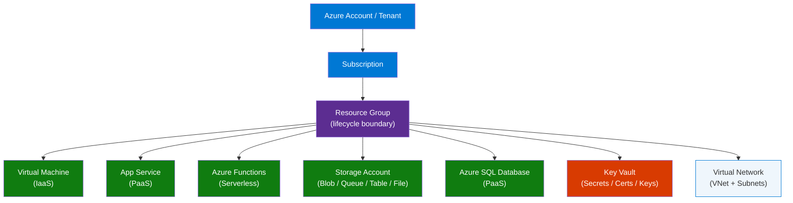
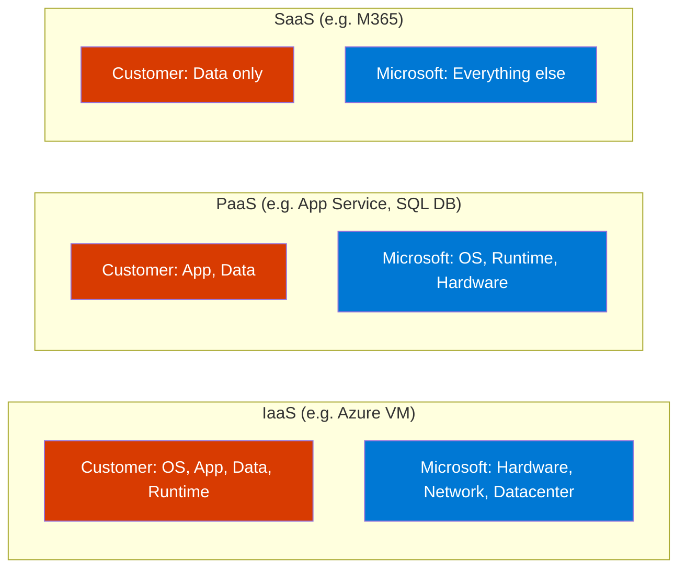
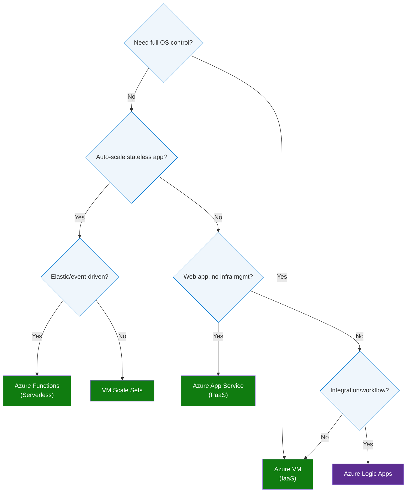
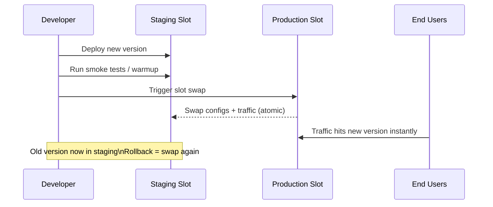
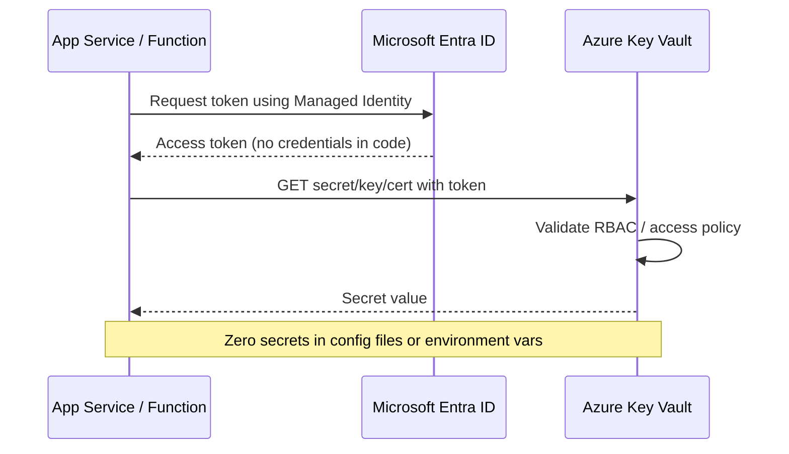

# Top 25 Azure Interview Questions — Master These for Any Job!

> **Source:** [Top 25 Azure Interview Questions – Master These for Any Job!](https://www.youtube.com/watch?v=xxDRrZPahR8)  
> **Channel:** Interview Happy  
> **Topic:** Azure core services, cloud models, resource management, networking, compute, storage, security

---

## 1. Overview

This video walks through the 25 most-asked Azure interview questions across cloud fundamentals, compute, networking, storage, and security — structured with project-level answers, not just textbook definitions. Essential for Azure Developer, Azure Solutions Architect, and Azure Engineer roles.

### Classic Approach Pain Points
| Problem | Impact |
|---|---|
| Answering with definitions only ("IaaS is infrastructure") | Screened out — interviewers want project examples |
| Confusing Resource vs. Service | Signals shallow Azure exposure |
| Not knowing when to choose VM vs App Service vs Functions | Fails the architecture design round |
| Ignoring RBAC and Key Vault in project context | Red flag for senior roles |

> **Key Insight:** "The question is never just 'what is X?' — it's always 'when would you use X in YOUR project?' Anchor every answer in a real scenario."

---

## 2. Problem Statement

Azure interviews test breadth across the full core services stack — from cloud model choice and resource hierarchy to compute options, storage types, networking, and security. Candidates who can only recite definitions fail; those who map each service to a real project decision pass.

---

## 3. Core Concepts

### IaaS / PaaS / SaaS
Three cloud delivery models that determine how much infrastructure the customer manages vs. Microsoft. IaaS = you manage OS up. PaaS = you manage app + data only. SaaS = fully managed, just use it.

### Resource vs. Service
A **Service** is an Azure capability (e.g., "Azure Blob Storage" the product). A **Resource** is a deployed instance of that service in your subscription (e.g., `mystorageaccount` of type `Microsoft.Storage/storageAccounts`).

### Resource Group
A logical container for Azure resources that share a lifecycle, permissions, and billing scope. Deleting a Resource Group deletes all resources inside it.

### Availability Zones
Physically separate datacenters within an Azure region, each with independent power, cooling, and networking. Used for high-availability deployments that survive datacenter-level failures.

### VM Scale Sets
Azure's auto-scaling compute primitive — a group of identical VMs that scale in/out based on load metrics, with built-in load balancing. Use when you need elastic horizontal scaling of stateless workloads.

### Azure Functions
Serverless compute where you deploy a function (not a server). Triggered by events (HTTP, timer, queue, blob). Scales to zero when idle; billed per execution. Ideal for short-lived, event-driven tasks.

### Azure Logic Apps
Low-code workflow automation that connects 400+ services via pre-built connectors. No custom code needed for integration workflows (approval flows, data sync, notifications).

### Deployment Slots
Named staging environments within an App Service plan (e.g., `production`, `staging`). Support swap operations for zero-downtime deployments with instant rollback.

---

## 4. Architecture

### Azure Resource Hierarchy



### Cloud Service Model — Shared Responsibility



### Compute Decision Flow



---

## 5. Key Components

| Service | Type | When to Use |
|---|---|---|
| Azure Virtual Machines | IaaS | Legacy apps, custom OS config, lift-and-shift |
| VM Scale Sets | IaaS | Elastic horizontal scaling of stateless VMs |
| Azure App Service | PaaS | Web apps, APIs, mobile backends — no OS management |
| Deployment Slots | App Service feature | Zero-downtime deploy with swap + instant rollback |
| Azure Functions | Serverless | Event-driven, short-lived tasks, scale-to-zero |
| Azure Logic Apps | Low-code PaaS | Integration workflows with 400+ connectors |
| Azure Blob Storage | Storage | Unstructured data: images, videos, backups, logs |
| Azure SQL Database | PaaS | Relational data, fully managed, no patching |
| Azure SQL Managed Instance | PaaS | SQL Server lift-and-shift — full SQL Server compatibility |
| Virtual Network (VNet) | Networking | Isolate resources, connect to on-premises, private endpoints |
| Azure CDN | Networking | Cache static content at edge nodes for low-latency delivery |
| Azure Key Vault | Security | Secrets, API keys, certs, encryption keys — zero secrets in code |
| Azure RBAC | Governance | Least-privilege access control at resource/group/subscription level |

---

## 6. How It Works — Step by Step

### Zero-Downtime Deployment with Slots



**Steps:**
1. Deploy new app version to the `staging` slot (not production)
2. Run automated tests and warm-up the staging slot
3. Trigger slot swap — Azure atomically reroutes traffic to the new version
4. Users are now on the new version with zero downtime
5. If issues arise, swap back immediately — old version is still in the staging slot

### Key Vault + Managed Identity Flow



---

## 7. Comparison Table

### Azure Compute Options

| Dimension | Azure VM | VM Scale Sets | App Service | Azure Functions |
|---|---|---|---|---|
| Model | IaaS | IaaS | PaaS | Serverless |
| OS control | Full | Full | None | None |
| Auto-scale | Manual | Built-in | Built-in | Built-in (to zero) |
| State | Stateful OK | Stateless preferred | Stateless preferred | Stateless |
| Pricing | Per hour (running) | Per hour (running) | Per plan (flat) | Per execution |
| Best for | Legacy apps, custom OS | Elastic web/API fleets | Web apps, APIs | Event handlers, timers |

### Azure SQL Database vs SQL Managed Instance

| Dimension | Azure SQL Database | Azure SQL Managed Instance |
|---|---|---|
| Compatibility | Latest SQL Server features (subset) | Near-100% SQL Server compatibility |
| Migration | Requires app changes for legacy SQL | Lift-and-shift from on-premises SQL Server |
| Cross-database queries | Not supported | Supported |
| VNet deployment | Public endpoint (or private link) | Always in VNet |
| Use case | New cloud-native apps | Legacy SQL Server migration |

### Storage Account Types

| Service | Data Type | Access Pattern |
|---|---|---|
| Blob Storage | Unstructured (images, video, backups) | Object storage, HTTP access |
| File Storage | File shares (SMB/NFS) | Shared drives for VMs |
| Queue Storage | Messages | Async task queues between services |
| Table Storage | NoSQL key-value | Semi-structured data, cheap reads |

---

## 8. Code Examples

### ARM / Bicep — Resource Group + Storage Account

```bicep
resource rg 'Microsoft.Resources/resourceGroups@2021-04-01' = {
  name: 'myapp-prod-rg'
  location: 'eastus'
}

resource storageAccount 'Microsoft.Storage/storageAccounts@2023-01-01' = {
  name: 'myappstorageacct'
  location: rg.location
  sku: { name: 'Standard_LRS' }
  kind: 'StorageV2'
  properties: {
    accessTier: 'Hot'
    supportsHttpsTrafficOnly: true
  }
}
```

### Azure CLI — RBAC Assignment (Least Privilege)

```bash
# Grant Contributor on one Resource Group only (not whole subscription)
az role assignment create \
  --assignee "user@company.com" \
  --role "Contributor" \
  --scope "/subscriptions/<sub-id>/resourceGroups/myapp-prod-rg"

# Verify the assignment
az role assignment list \
  --scope "/subscriptions/<sub-id>/resourceGroups/myapp-prod-rg" \
  --output table
```

### Azure Functions — HTTP Trigger (C#)

```csharp
[Function("ProcessOrder")]
public HttpResponseData Run(
    [HttpTrigger(AuthorizationLevel.Function, "post")] HttpRequestData req,
    FunctionContext executionContext)
{
    var logger = executionContext.GetLogger("ProcessOrder");
    var body = req.ReadAsString();
    logger.LogInformation($"Processing order: {body}");
    
    var response = req.CreateResponse(HttpStatusCode.OK);
    response.WriteString("Order processed");
    return response;
}
```

### Key Vault — Read Secret with Managed Identity

```csharp
using Azure.Identity;
using Azure.Security.KeyVault.Secrets;

var client = new SecretClient(
    new Uri("https://mykeyvault.vault.azure.net/"),
    new DefaultAzureCredential()  // Uses Managed Identity in Azure, dev credential locally
);

KeyVaultSecret secret = await client.GetSecretAsync("ConnectionString");
string connectionString = secret.Value;
```

### App Service — Deployment Slot Swap

```bash
# Deploy to staging slot
az webapp deployment source config-zip \
  --resource-group myapp-prod-rg \
  --name mywebapp \
  --slot staging \
  --src ./app.zip

# Swap staging → production (zero downtime)
az webapp deployment slot swap \
  --resource-group myapp-prod-rg \
  --name mywebapp \
  --slot staging \
  --target-slot production
```

---

## 9. Configuration Reference

| Parameter | Service | Description |
|---|---|---|
| `sku: Standard_LRS` | Storage | Locally-redundant storage (3 copies in one datacenter) |
| `sku: Standard_GRS` | Storage | Geo-redundant (6 copies across 2 regions) |
| `kind: StorageV2` | Storage | General-purpose v2 — all storage types supported |
| `accessTier: Hot/Cool/Archive` | Blob Storage | Tradeoff: Hot = fast + expensive, Archive = cheap + slow |
| `AuthorizationLevel.Function` | Azure Functions | Requires function key in request header |
| `AuthorizationLevel.Anonymous` | Azure Functions | No auth — use only behind API Management |
| `alwaysOn: true` | App Service | Keeps app warm; required for WebJobs and reliable startup |
| `minTlsVersion: '1.2'` | App Service | Enforce TLS 1.2 minimum |

---

## 10. Best Practices

### Resource Group Design
- ✅ Group resources by lifecycle — deploy and delete together as a unit
- ✅ Use consistent naming: `{app}-{env}-{region}-rg` (e.g., `payments-prod-eastus-rg`)
- ❌ Don't put all resources in one RG — you can't delete a subset without disruption
- ❌ Don't use the default RG — it obscures ownership and billing

### Compute Choice
- ✅ Default to App Service for web apps; only use VMs when you need OS-level control
- ✅ Use Azure Functions for event-driven tasks under 10 minutes execution time
- ✅ Use VM Scale Sets with max instance limits and scale-in policies to control costs
- ❌ Don't run always-on background jobs in Azure Functions (use WebJobs or Container Apps)

### Security
- ✅ Always use Managed Identity for app-to-service auth — never put secrets in code or config
- ✅ Reference Key Vault secrets in App Service via `@Microsoft.KeyVault(...)` app settings
- ✅ Assign RBAC at Resource Group scope, not subscription scope, for least privilege
- ❌ Don't use access keys for Storage in production — use Managed Identity + RBAC
- ❌ Don't store connection strings in appsettings.json — use Key Vault references

### Networking
- ✅ Put all production resources in a VNet and use Private Endpoints for PaaS services
- ✅ Use NSGs (Network Security Groups) on subnets, not individual NICs
- ❌ Don't expose Azure SQL Database or Storage publicly — enable firewall rules + private link
- ❌ Don't put all resources in one subnet — segment by tier (web, app, data)

---

## 11. Interview Talking Points

### "What is the difference between a Resource and a Service in Azure?"

> A **Service** is the Azure capability — "Azure Blob Storage" is the service offering. A **Resource** is a deployed, billable instance of that service inside your subscription with a specific name, region, SKU, and Resource Group. For example, when I provision a storage account named `myappfiles` in East US with LRS redundancy, that's a resource of type `Microsoft.Storage/storageAccounts`. This distinction matters because RBAC, Azure Policy, and tagging operate on resources, not services.

### "What happens if someone accidentally deletes a Resource Group?"

> All resources inside the Resource Group are permanently deleted — VMs, databases, storage accounts, everything — because the Resource Group is the lifecycle boundary. This is why in production I always enable **Resource Locks** (`CanNotDelete` or `ReadOnly`) on critical Resource Groups. Beyond that, I ensure recovery mechanisms are in place at the resource level: geo-redundant backups for SQL, soft-delete for Key Vault and Blob Storage, and point-in-time restore for databases. RBAC should also follow least privilege — delete permissions on Resource Groups should be restricted to infrastructure engineers, not developers.

### "When would you choose Azure Functions over Azure App Service?"

> I use Azure Functions for **event-driven, short-lived, stateless** tasks — processing a queue message, triggering on a blob upload, running a nightly timer job. Functions scale to zero when idle, so the cost is essentially zero when unused. For **web apps and APIs that need to be always-on**, receive consistent HTTP traffic, and require features like deployment slots, custom domains, or session affinity, App Service is the right choice. The practical rule: if the workload is triggered by an event and completes in under 10 minutes, Functions. If it's a long-running web process serving users, App Service.

### "How do you use Azure Key Vault in a project?"

> In every project I work on, Key Vault is the single source of truth for secrets, API keys, and connection strings — nothing sensitive goes into appsettings.json or environment variables. I enable **Managed Identity** on the App Service or Function, then grant it the `Key Vault Secrets User` role on the Key Vault. In App Service, I reference secrets as `@Microsoft.KeyVault(VaultName=mykeyvault;SecretName=DbConnectionString)` in the app settings — Azure resolves these at runtime without my code touching them. For certificates, Key Vault handles auto-rotation with DigiCert or Let's Encrypt. This pattern means even I as the developer often can't read the production secrets.

### "What is the difference between Azure SQL Database and Azure SQL Managed Instance?"

> Both are PaaS SQL offerings where Microsoft manages patching, backups, and high availability. The key difference is **compatibility scope**: Azure SQL Database supports a modern subset of SQL Server features and is designed for new cloud-native apps. Azure SQL Managed Instance provides near-100% SQL Server compatibility — it supports cross-database queries, SQL Server Agent, CLR, linked servers — making it the right choice for **lift-and-shift migrations** from on-premises SQL Server. I've used Managed Instance when migrating a legacy system that relied on cross-database joins and SQL Agent jobs; trying to rewrite those for SQL Database would have been a multi-month effort.

### "How do you allow a user to manage only one Resource Group without touching others?"

> I assign an Azure RBAC role scoped to that specific Resource Group — not the subscription. The command is `az role assignment create --role Contributor --assignee user@company.com --scope /subscriptions/<id>/resourceGroups/<rg-name>`. The `Contributor` role allows creating and managing resources but not changing RBAC assignments. If the user only needs to deploy (not manage), I use a custom role or `Website Contributor` for App Service. The principle is always least privilege: scope to the narrowest boundary that satisfies the requirement.

### "What are Availability Zones and when do you use them?"

> Availability Zones are physically separate datacenters within an Azure region — each with independent power, cooling, and networking. Deploying across zones means a single datacenter failure doesn't take down your app. I use zone-redundant deployments for any production workload with an SLA above 99.9%. For VMs, I pin each instance to a different zone. For App Service, I enable zone redundancy in the plan settings. For Azure SQL, zone-redundant configuration keeps the secondary replica in a different zone from the primary. The trade-off is slightly higher cost (cross-zone bandwidth) and some regions don't have 3 zones yet.

---

## 12. Learning Resources

| Resource | Link | Type |
|---|---|---|
| Azure Architecture Center | https://learn.microsoft.com/azure/architecture/ | Official Docs |
| What is Azure App Service? | https://learn.microsoft.com/azure/app-service/overview | Official Docs |
| Azure Functions Overview | https://learn.microsoft.com/azure/azure-functions/functions-overview | Official Docs |
| Azure Key Vault Concepts | https://learn.microsoft.com/azure/key-vault/general/basic-concepts | Official Docs |
| Azure Virtual Network | https://learn.microsoft.com/azure/virtual-network/virtual-networks-overview | Official Docs |
| Azure RBAC Overview | https://learn.microsoft.com/azure/role-based-access-control/overview | Official Docs |
| Azure Storage Overview | https://learn.microsoft.com/azure/storage/common/storage-introduction | Official Docs |
| Azure SQL Database vs MI | https://learn.microsoft.com/azure/azure-sql/database/features-comparison | Official Docs |
| Source Video | https://www.youtube.com/watch?v=xxDRrZPahR8 | Video |

---

## Appendix — All 25 Questions Quick Reference

| # | Question | Key Answer Anchor |
|---|---|---|
| 1 | What is cloud computing / Azure? | On-demand compute/storage/networking over internet, pay-as-you-go |
| 2 | Main cloud service models? IaaS vs PaaS vs SaaS? | Shared responsibility model — customer manages less as you go up |
| 3 | What is Hybrid Cloud? | Combination of on-premises + public cloud with connectivity between them |
| 4 | What cloud model fits best? | Depends on: control needed, migration complexity, team skill set |
| 5 | Resource vs Service in Azure? | Service = product; Resource = deployed instance with name/SKU/RG |
| 6 | What are Resource Groups? | Lifecycle boundary for related resources; RBAC and billing scope |
| 7 | Azure Regions and Availability Zones? | Region = geography; AZ = physically separate datacenter within region |
| 8 | Team deletes Resource Group — what happens? | All resources inside are deleted permanently |
| 9 | Allow user to manage one project only? | RBAC role assignment scoped to that Resource Group |
| 10 | What are Azure Virtual Machines? When to use? | IaaS; use for legacy apps, custom OS, lift-and-shift |
| 11 | What are VM Scale Sets? When to use? | Auto-scaling group of identical VMs for elastic stateless workloads |
| 12 | What is Azure App Service? | PaaS for web apps/APIs; no OS management; built-in scaling |
| 13 | Azure VMs vs Azure App Services? | VM = full OS control; App Service = no OS, just deploy your app |
| 14 | What are Deployment Slots? | Named environments for zero-downtime deploy via slot swap |
| 15 | Host web app quickly, minimum infra? | Azure App Service (PaaS) — deploy code, not servers |
| 16 | What are Azure Functions? | Serverless; event-triggered; scales to zero; billed per execution |
| 17 | What are Azure Logic Apps? | Low-code integration workflows; 400+ connectors; no custom code |
| 18 | What is Azure Storage? Types? | Blob, File, Queue, Table — different data types and access patterns |
| 19 | What is Azure Blob Storage? When to use? | Unstructured object storage: images, videos, backups, logs |
| 20 | SQL Managed Instance vs SQL Database? | MI = lift-and-shift SQL Server; DB = cloud-native PaaS SQL |
| 21 | What is a VNet? Why do we need it? | Logical network isolation; private connectivity; subnets + NSGs |
| 22 | What is Azure CDN? When to use? | Cache static content at edge PoPs; reduces latency for global users |
| 23 | What is Azure Key Vault? Project example? | Secrets/certs/keys store; Managed Identity access; zero secrets in code |
| 24 | What is a CI/CD pipeline? How used in your project? | Automate build → test → deploy; GitHub Actions / Azure DevOps |
| 25 | (Implied) How do you choose the right compute? | Decision: OS control? → VM; Stateless elastic? → VMSS/Functions; Web? → App Service |

---

*Last Updated: June 2026 | Source: Interview Happy — Top 25 Azure Interview Questions*
