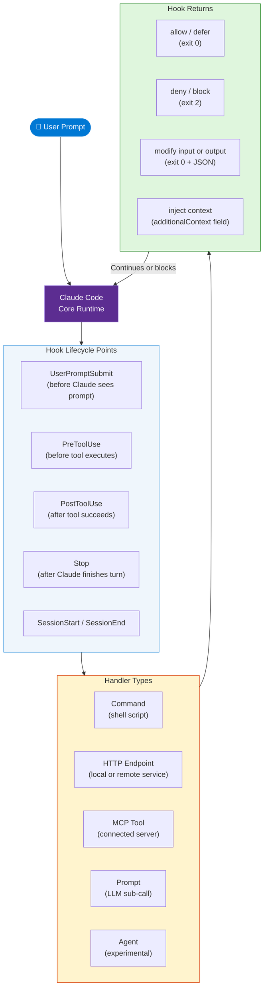
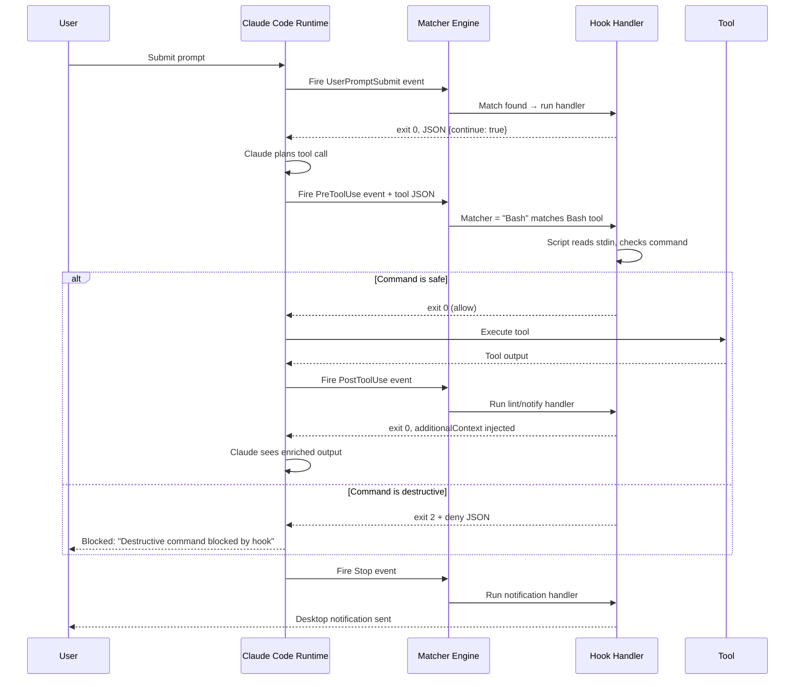

# Claude Code Hooks — Explained & Demoed

> **Source:** [YouTube — Claude Code Hooks — Explained & Demoed](https://www.youtube.com/watch?v=3Y4XQ2obPIo)
> **Channel/Event:** Claude Code / Anthropic
> **Topic:** Claude Code, Hooks, Lifecycle Automation, PreToolUse, PostToolUse, Shell Scripting, AI Safety
> **Key Claim:** Hooks give you deterministic, user-controlled guardrails that execute at every lifecycle point — blocking, modifying, or augmenting Claude's actions before they happen.

---

## Table of Contents

1. [Overview](#1-overview)
2. [Problem Statement](#2-problem-statement)
3. [Core Concepts](#3-core-concepts)
4. [Architecture](#4-architecture)
5. [Key Components](#5-key-components)
6. [How It Works — Step by Step](#6-how-it-works--step-by-step)
7. [Comparison Table](#7-comparison-table)
8. [Code Examples](#8-code-examples)
9. [Configuration Reference](#9-configuration-reference)
10. [Best Practices](#10-best-practices)
11. [Interview Talking Points](#11-interview-talking-points)
12. [Learning Resources](#12-learning-resources)

---

## 1. Overview

Claude Code Hooks are user-defined shell commands, HTTP endpoints, LLM prompts, or MCP tool calls that fire automatically at specific lifecycle points during a Claude Code session. They allow you to intercept Claude's actions before or after they execute — blocking dangerous commands, running linters, sending notifications, injecting context, or enforcing policies. Unlike permissions (which only say yes/no), hooks can read full tool input, modify it, and return structured decisions back to Claude. Hooks make AI-assisted development auditable, repeatable, and safe at scale.

---

## 2. Problem Statement

### Classic Approach Pain Points

| Problem | Impact |
|---|---|
| Claude runs `rm -rf` or destructive shell commands | Data loss, unrecoverable state |
| No automatic lint/format after file edits | Style drift, broken CI gates |
| No context about active branch or open issues at session start | Claude makes suggestions misaligned with current work |
| No visibility into what Claude is doing in real-time | No audit trail, no desktop notifications |
| Permissions say yes/no but can't modify tool inputs | Blunt instrument — must fully allow or fully deny |
| Manual copy-paste of environment variables each session | Friction; forgotten config causes bugs |

> **Key Insight:** "Permissions control access. Hooks control behavior. You need both."

---

## 3. Core Concepts

### Hook Event
A named lifecycle point in Claude Code's execution loop (e.g., `PreToolUse`, `Stop`, `SessionStart`). Each event type carries a specific JSON payload describing what is about to happen or just happened.

### Matcher Group
A filter that determines which specific tool or condition triggers a hook handler within an event. `"Bash"` fires only on Bash tool calls; `"Edit|Write"` fires on either; `"*"` fires on everything.

### Hook Handler
The actual unit of work: a shell command, HTTP endpoint, MCP tool invocation, LLM prompt, or experimental agent. Handlers receive event context via stdin (commands) or POST body (HTTP) and communicate decisions back via exit codes and stdout JSON.

### `if` Condition
An optional fine-grained filter using permission rule syntax (e.g., `"Bash(rm *)"`) applied after the matcher. Enables sub-tool granularity without complex script logic.

### Blocking vs Non-Blocking Events
Events marked **Blockable** respect exit code `2` + a JSON deny decision. Non-blockable events still run their hooks but cannot veto the action — they're for side-effects (notifications, logging).

### Exit Code Protocol
- `0` → Success; parse stdout for JSON decisions
- `2` → Hard block; stderr is shown as error message
- Any other non-zero → Soft error; logs notice, execution continues

---

## 4. Architecture



---

## 5. Key Components

| Component | Type | Role |
|---|---|---|
| `PreToolUse` | Event | Fires before any tool call — primary control point for blocking/modifying |
| `PostToolUse` | Event | Fires after tool success — for linting, auditing, enriching Claude's view |
| `UserPromptSubmit` | Event | Fires when user submits prompt — can expand, rewrite, or block prompts |
| `SessionStart` | Event | Fires once per session — inject branch info, set env vars, set window title |
| `Stop` | Event | Fires when Claude finishes a turn — can trigger CI runs or notifications |
| `Matcher` | Config | Filters which tool names trigger a handler group |
| `if` condition | Config | Sub-filter using permission rule syntax for fine-grained control |
| `command` handler | Handler | Shell script receiving JSON on stdin |
| `http` handler | Handler | HTTP POST to a local/remote service |
| `mcp_tool` handler | Handler | Call a tool on a connected MCP server |
| `prompt` handler | Handler | Delegate decision to a lightweight Claude model |
| `agent` handler | Handler | Spawn a subagent (experimental) |
| `updatedInput` | Output field | Modify the tool's inputs before execution |
| `updatedToolOutput` | Output field | Replace what Claude sees as the tool's result |
| `additionalContext` | Output field | Inject text into Claude's context without showing in tool output |

### Event Cadence Groups

| Cadence | Events |
|---|---|
| Once per session | `SessionStart`, `SessionEnd`, `Setup` |
| Once per turn | `UserPromptSubmit`, `Stop`, `StopFailure` |
| Every tool call | `PreToolUse`, `PostToolUse`, `PostToolUseFailure` |
| Batch-level | `PostToolBatch` |
| System-level | `ConfigChange`, `CwdChanged`, `FileChanged`, `PreCompact`, `PostCompact` |
| Agent-level | `SubagentStart`, `SubagentStop`, `TaskCreated`, `TaskCompleted`, `TeammateIdle` |
| MCP-level | `Elicitation`, `ElicitationResult` |
| UI-level | `Notification`, `MessageDisplay`, `InstructionsLoaded` |
| Worktree-level | `WorktreeCreate`, `WorktreeRemove` |

---

## 6. How It Works — Step by Step



**Step-by-step:**
1. **Event fires** — Claude Code serializes the event context into JSON and pipes it to the matched handler via stdin (command) or HTTP POST body.
2. **Matcher evaluated** — The runtime filters handlers by `matcher` value (exact string, pipe-separated list, or regex). The `if` field applies an additional permission-rule filter.
3. **Handler runs** — Shell script, HTTP server, MCP tool, or prompt model executes. It has full access to tool name, tool input, session metadata, and transcript path.
4. **Decision returned** — Handler exits with code `0` (pass JSON on stdout), `2` (block with stderr), or other (non-blocking warning).
5. **Claude Code acts** — On block, the tool call is cancelled and the reason is surfaced. On allow with `updatedInput`, the modified input is used. On `updatedToolOutput`, Claude sees the replacement instead of the real output.
6. **Non-blocking side effects** — `PostToolUse`, `Notification`, `MessageDisplay` handlers run for auditing, linting, or UI enrichment without affecting Claude's next step.

---

## 7. Comparison Table

| Dimension | Without Hooks | With Hooks |
|---|---|---|
| Destructive command guard | Manual review of each AI suggestion | Automatic block via `PreToolUse` + exit code `2` |
| Lint / format after edits | Must remember to run manually | Auto-triggers on every `Edit\|Write` via `PostToolUse` |
| Session context | Claude starts cold each time | `SessionStart` injects branch, issue, team context |
| Notifications | Check terminal constantly | Desktop push via `Notification` hook |
| Tool input modification | Impossible — accept or deny only | `updatedInput` field rewrites inputs before execution |
| Output sanitization | Claude sees raw tool output | `updatedToolOutput` replaces what Claude reads |
| Permission granularity | Tool-level only (`Bash` allowed/denied) | Sub-command level via `if: "Bash(rm *)"` |
| Policy scope | Per-user config only | User / project / org-wide managed policy layers |
| Handler diversity | Shell scripts only | Command, HTTP, MCP tool, LLM prompt, Agent |
| Audit trail | None built-in | Transcript path available in every hook's stdin |

---

## 8. Code Examples

### Bash — Block Destructive `rm -rf` (PreToolUse)

```bash
#!/bin/bash
# Receives PreToolUse JSON on stdin
COMMAND=$(jq -r '.tool_input.command // empty' < /dev/stdin)

if echo "$COMMAND" | grep -qE 'rm\s+-[a-z]*r[a-z]*f|rm\s+--force'; then
  jq -n '{
    hookSpecificOutput: {
      hookEventName: "PreToolUse",
      permissionDecision: "deny",
      permissionDecisionReason: "Destructive rm -rf blocked by safety hook"
    }
  }'
  exit 0
fi
exit 0
```

### JSON Config — Auto-Lint After File Edits (PostToolUse)

```json
{
  "hooks": {
    "PostToolUse": [
      {
        "matcher": "Edit|Write",
        "hooks": [
          {
            "type": "command",
            "command": "${CLAUDE_PROJECT_DIR}/.claude/hooks/lint-check.sh",
            "statusMessage": "Running linter..."
          }
        ]
      }
    ]
  }
}
```

### Bash — Modify Tool Input Before Execution (PreToolUse)

```bash
#!/bin/bash
INPUT=$(cat)
TOOL=$(echo "$INPUT" | jq -r '.tool_name')

if [ "$TOOL" = "Bash" ]; then
  ORIGINAL=$(echo "$INPUT" | jq -r '.tool_input.command')
  # Prepend timeout to all shell commands
  SAFE_CMD="timeout 30 $ORIGINAL"
  jq -n --arg cmd "$SAFE_CMD" '{
    hookSpecificOutput: {
      hookEventName: "PreToolUse",
      permissionDecision: "allow",
      updatedInput: { command: $cmd }
    }
  }'
fi
exit 0
```

### Bash — Inject Branch Context at Session Start (SessionStart)

```bash
#!/bin/bash
BRANCH=$(git rev-parse --abbrev-ref HEAD 2>/dev/null || echo "unknown")
ISSUE=$(git log -1 --format="%s" 2>/dev/null | grep -oE '#[0-9]+' | head -1)

jq -n --arg branch "$BRANCH" --arg issue "$ISSUE" '{
  hookSpecificOutput: {
    hookEventName: "SessionStart",
    additionalContext: ("Active branch: " + $branch + "\nLinked issue: " + $issue),
    sessionTitle: $branch
  }
}'
exit 0
```

### Bash — Desktop Notification When Claude Stops (Stop)

```bash
#!/bin/bash
INPUT=$(cat)
REASON=$(echo "$INPUT" | jq -r '.stop_reason // "Done"')
SEQ=$(printf '\033]777;notify;Claude Code;%s\007' "$REASON")
jq -n --arg seq "$SEQ" '{terminalSequence: $seq}'
exit 0
```

### JSON Config — HTTP Hook with Auth Header

```json
{
  "hooks": {
    "PreToolUse": [
      {
        "matcher": "*",
        "hooks": [
          {
            "type": "http",
            "url": "http://localhost:9000/hooks/pre-tool-use",
            "timeout": 10,
            "headers": { "Authorization": "Bearer $HOOK_SECRET" },
            "allowedEnvVars": ["HOOK_SECRET"],
            "statusMessage": "Checking policy server..."
          }
        ]
      }
    ]
  }
}
```

### JSON Config — LLM Prompt Hook for Code Safety Review

```json
{
  "hooks": {
    "PreToolUse": [
      {
        "matcher": "Bash",
        "hooks": [
          {
            "type": "prompt",
            "prompt": "Review this bash command for safety issues. If dangerous, respond with DENY: <reason>. Command: $ARGUMENTS",
            "model": "claude-haiku-4-5",
            "timeout": 15,
            "statusMessage": "AI safety check..."
          }
        ]
      }
    ]
  }
}
```

### Skill Frontmatter Hooks (active only while skill is loaded)

```yaml
---
name: secure-operations
description: Perform file operations with security checks
hooks:
  PreToolUse:
    - matcher: "Edit|Write|Bash"
      hooks:
        - type: command
          command: "./scripts/security-gate.sh"
          statusMessage: "Security check..."
---
Perform the requested operation with extra care...
```

### Install / Setup

```bash
# Place hook scripts in project
mkdir -p .claude/hooks
chmod +x .claude/hooks/*.sh

# Reference in project settings
cat .claude/settings.json
# { "hooks": { "PreToolUse": [...] } }

# Or in global user settings
cat ~/.claude/settings.json
# { "hooks": { "SessionStart": [...] } }

# Test a hook manually
echo '{"tool_name":"Bash","tool_input":{"command":"rm -rf /tmp/test"}}' | .claude/hooks/block-rm.sh
```

---

## 9. Configuration Reference

### Hook Handler Fields

| Field | Type | Default | Description |
|---|---|---|---|
| `type` | string | — | `"command"`, `"http"`, `"mcp_tool"`, `"prompt"`, `"agent"` |
| `command` | string | — | Shell command or script path (for `command` type) |
| `args` | array | `[]` | Explicit args (exec form — no shell expansion) |
| `url` | string | — | HTTP endpoint URL (for `http` type) |
| `server` + `tool` | string | — | MCP server name and tool name (for `mcp_tool` type) |
| `prompt` | string | — | LLM prompt text; `$ARGUMENTS` = full stdin JSON (for `prompt` type) |
| `model` | string | haiku | Model for prompt hooks |
| `if` | string | — | Permission rule syntax filter: `"Bash(git *)"`, `"Edit(*.ts)"` |
| `timeout` | int | 600 | Seconds before cancellation (30 for prompt, 60 for agent) |
| `async` | bool | `false` | Fire and forget — don't wait for exit code |
| `statusMessage` | string | — | Custom spinner text while hook runs |
| `once` | bool | `false` | Run once per session then deregister (skills) |
| `headers` | object | — | HTTP headers; env var expansion supported |
| `allowedEnvVars` | array | — | Env vars passed to HTTP hook handler |
| `input` | object | — | Static input merged into MCP tool call |

### Hook Locations (precedence: highest to lowest)

| Location | Scope | Git-tracked |
|---|---|---|
| Managed policy settings (admin) | Organization-wide | N/A |
| `~/.claude/settings.json` | All projects for user | No |
| `.claude/settings.json` | This project | Yes |
| `.claude/settings.local.json` | This project (personal) | No (gitignored) |
| Plugin `hooks/hooks.json` | When plugin enabled | Yes |
| Skill/agent frontmatter | While component active | Yes |

### Path Placeholders

| Placeholder | Value |
|---|---|
| `${CLAUDE_PROJECT_DIR}` | Absolute path to the project root |
| `${CLAUDE_PLUGIN_ROOT}` | Plugin's installation directory |
| `${CLAUDE_PLUGIN_DATA}` | Plugin's persistent writable data directory |

---

## 10. Best Practices

### Script Safety
- ✅ Always `exit 0` for the allow path — only use `exit 2` for true blocks
- ✅ Use exec form (`args` array) when paths may contain spaces
- ✅ Set timeouts appropriate to the operation — don't block Claude indefinitely
- ❌ Don't use `exit 1` expecting a block — only `exit 2` blocks; `exit 1` is a soft warning

### Matcher Design
- ✅ Be as specific as possible — `"Bash(rm *)"` beats `"Bash"` for rm guards
- ✅ Use `"Edit|Write"` to catch all file-writing tools in one handler
- ✅ Use regex matchers for MCP tools: `"mcp__memory__.*"` for all memory server tools
- ❌ Don't use `"*"` as matcher for expensive operations — every tool call will invoke it

### Policy Layering
- ✅ Put security-critical hooks in `~/.claude/settings.json` (user-wide) so they can't be overridden per-project
- ✅ Put project-specific linting hooks in `.claude/settings.json` (shared with team)
- ✅ Put personal preferences in `.claude/settings.local.json` (gitignored)
- ❌ Don't put secrets in `settings.json` — use `allowedEnvVars` with env references

### Input Modification (`updatedInput`)
- ✅ Use `updatedInput` for adding safety wrappers (`timeout 30 <cmd>`) or normalizing paths
- ✅ Always return `permissionDecision: "allow"` alongside `updatedInput`
- ❌ Don't silently alter inputs without returning a `systemMessage` so Claude knows

### Performance
- ✅ Use `async: true` for pure side-effects (logging, notifications) that shouldn't block flow
- ✅ Use lightweight prompt models (`claude-haiku-4-5`) for LLM-based hook decisions
- ❌ Don't perform heavy network calls synchronously in `PreToolUse` — it blocks every tool call

---

## 11. Interview Talking Points

### "What are Claude Code hooks and when would you use them?"

> Claude Code hooks are user-defined handlers — shell scripts, HTTP endpoints, or LLM prompts — that fire automatically at lifecycle points like before/after tool calls, session start, and when Claude stops. You'd use them for guardrails (blocking destructive commands), automation (auto-lint after file edits), context injection (adding branch/issue context at session start), and notifications (desktop pings when Claude finishes long tasks). The key distinction from permissions is that hooks can read full tool input, modify it, and return structured JSON decisions — not just yes/no.

### "How does a PreToolUse hook block an action, and what's the exit code protocol?"

> A `PreToolUse` hook receives the tool name and full input JSON on stdin. To block, the script exits with code `2` (not `1` — that's a common mistake) and writes a deny reason to stderr. To allow, it exits `0`. To allow with modifications, it exits `0` and writes JSON to stdout containing `updatedInput` with the modified tool arguments. Exit code `1` or any non-zero other than `2` is treated as a non-blocking soft error — execution continues with just a warning shown.

### "How do you implement a policy that applies to all developers on a team?"

> Project-level hooks go in `.claude/settings.json` which is git-tracked and shared with the whole team — everyone who clones the repo gets the same hooks. For personal overrides (e.g., quieter notifications), use `.claude/settings.local.json` which is gitignored. For organization-wide non-overridable policies (e.g., security mandates), managed policy settings at the admin level take the highest precedence and cannot be disabled by user or project settings.

### "Can hooks modify what Claude sees as the output of a tool call?"

> Yes, via `PostToolUse` and the `updatedToolOutput` field. If a hook returns `{"hookSpecificOutput": {"hookEventName": "PostToolUse", "updatedToolOutput": "<replacement>"}}`, Claude reads the replacement text instead of the real tool output. The actual output is preserved in the transcript. You can also add `additionalContext` which Claude sees but which doesn't replace the output — useful for injecting metadata like "this file is auto-generated, edit the source instead."

### "What's the difference between `matcher` and the `if` condition?"

> The `matcher` selects which tool name triggers the handler group — it's coarse-grained (tool-level). The `if` field uses permission rule syntax for sub-tool filtering: `"Bash(git *)"` fires only for bash commands that start with `git`, while `"Edit(*.ts)"` fires only when editing TypeScript files. Matcher is required and evaluated first; `if` is optional and evaluated after the matcher matches. Together they avoid running expensive hooks on every single tool call.

---

## 12. Learning Resources

| Resource | Link | Type |
|---|---|---|
| Claude Code Hooks — Explained & Demoed | [YouTube](https://www.youtube.com/watch?v=3Y4XQ2obPIo) | Video |
| Claude Code Hooks Official Docs | [code.claude.com/docs/en/hooks](https://code.claude.com/docs/en/hooks) | Official Docs |
| Claude Code Settings Reference | [code.claude.com/docs/en/settings](https://code.claude.com/docs/en/settings) | Official Docs |
| Claude Code Skills vs Hooks vs Commands vs Plugins | Local: `Claude-Code-Skills-vs-Hooks-vs-Commands-vs-Plugins.md` | Internal Reference |

---

*Last Updated: July 2026 | Source: Claude Code / Anthropic — Claude Code Hooks Explained & Demoed*
