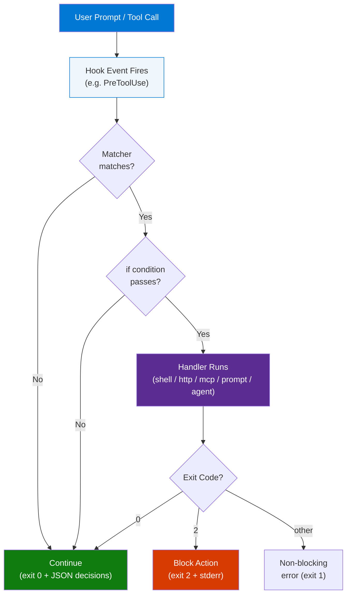
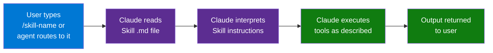
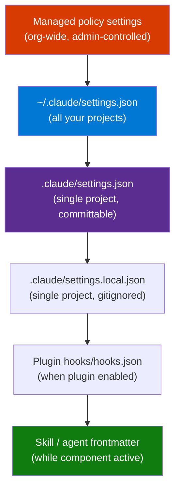
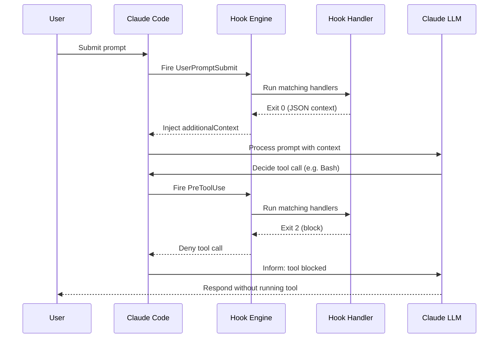
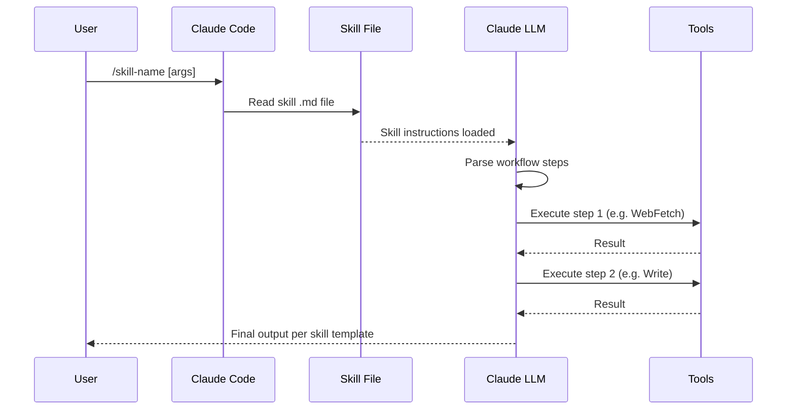

# Hooks vs Skills in Claude Code

> **Source:** [YouTube — Hooks vs Skills in Claude Code](https://www.youtube.com/shorts/PZ_r1svrP1g)
> **Channel/Event:** Claude Code Shorts
> **Topic:** Claude Code, Hooks, Skills, Automation, Extension Mechanisms, Lifecycle Events
> **Key Claim:** Hooks react automatically to lifecycle events; Skills are invoked on-demand — use each for what it's designed for.

---

## Table of Contents

1. [Overview](#1-overview)
2. [Problem Statement](#2-problem-statement)
3. [Core Concepts](#3-core-concepts)
4. [Architecture](#4-architecture)
5. [Key Components](#5-key-components)
6. [How It Works — Step by Step](#6-how-it-works--step-by-step)
7. [Comparison Table](#7-comparison-table)
8. [Code Examples](#8-code-examples)
9. [Configuration Reference](#9-configuration-reference)
10. [Best Practices](#10-best-practices)
11. [Interview Talking Points](#11-interview-talking-points)
12. [Learning Resources](#12-learning-resources)

---

## 1. Overview

Claude Code provides two complementary extension mechanisms — **Hooks** and **Skills** — that are often confused because both allow you to extend what Claude does. Hooks are shell commands, HTTP endpoints, or LLM prompts that fire *automatically* at defined lifecycle points (e.g., before a tool runs, when a session starts). Skills are reusable agent capabilities bundled as Markdown files that Claude reads and executes when *invoked* via a slash command or agent call. Choosing between them comes down to one question: should this happen automatically, or on demand?

---

## 2. Problem Statement

### Why the Confusion Exists

Without a clear mental model, developers wire automation in the wrong layer — adding `PostToolUse` hooks for things that should be slash commands, or writing Skills for policies that should be enforced automatically.

| Symptom | Root Cause |
|---|---|
| Policy not enforced — Claude forgets to run the check | Put it in a Skill (invoked), should be a Hook (automatic) |
| Slash command doing too much logic via shell | Should be split into a Hook for side effects + Skill for reasoning |
| Skill runs on every turn uninvited | Put it in a Hook if it needs to be always-on |
| Hook runs too broadly, slowing all tool calls | Need a matcher/`if` filter, or move to a Skill |

> **Key Insight:** "Hooks enforce policy. Skills extend capability. CLAUDE.md provides context. Plugins distribute everything."

---

## 3. Core Concepts

### Hook

A **Hook** is a user-defined handler registered in `settings.json` that Claude Code invokes automatically at a specific lifecycle event. It can block an action (exit 2), inject context, or trigger side effects — all without Claude deciding to run it.

### Skill

A **Skill** is a Markdown file (often with YAML frontmatter) stored in a skills directory that teaches Claude *how* to perform a reusable task. Claude reads the Skill when it matches a slash command or agent routing rule, then executes the described workflow.

### Hook Event

A **Hook Event** is a named lifecycle moment in Claude Code's execution (e.g., `PreToolUse`, `SessionStart`, `Stop`). Hooks are registered per-event.

### Matcher

A **Matcher** is a filter string inside a hook group that controls which tool names (or MCP tool patterns) activate the hook group. Example: `"Bash"` matches only Bash tool calls; `"mcp__.*__write.*"` matches all MCP write tools.

### Exit Code 2

The special exit code that tells Claude Code: *"Block this action entirely."* Any other non-zero exit is a non-blocking error.

---

## 4. Architecture

### Hook Execution Flow



### Skill Invocation Flow



### Hook Scoping Hierarchy



---

## 5. Key Components

| Component | Lives In | Role |
|---|---|---|
| Hook Event | `settings.json` | Named lifecycle trigger point |
| Matcher Group | `settings.json` hooks array | Filters which tool names activate the hook |
| `if` Field | Per-handler | Fine-grained filter using permission rule syntax |
| Handler | `settings.json` | Actual executable — shell command, HTTP, MCP, prompt, or agent |
| Exit Code 2 | Handler stdout/exit | Signals "block this action" |
| `hookSpecificOutput` | JSON stdout | Structured decisions injected back to Claude |
| Skill File | `skills/` directory | Markdown with YAML frontmatter describing the reusable task |
| Skill Frontmatter | Skill `.md` file | Metadata: name, description, trigger conditions, optional embedded hooks |
| Plugin | `.claude/plugins/` | Bundles hooks + skills + config for distribution |

### Hook Handler Types

| Type | Config Field | Use Case |
|---|---|---|
| `command` | `command`, `args` | Shell script; receives JSON via stdin |
| `http` | `url`, `headers` | POST to local/remote service; response = decisions |
| `mcp_tool` | `server`, `tool`, `input` | Call an MCP server tool |
| `prompt` | `prompt`, `model` | Single-turn Claude evaluation returning yes/no |
| `agent` | `prompt`, `model` | Spawns a subagent with Read/Grep/Glob tools |

### Hook Events Reference

| Event | Fires When | Can Block? |
|---|---|---|
| `SessionStart` | Session begins or resumes | No |
| `UserPromptSubmit` | Prompt submitted, before Claude processes | **Yes** |
| `PreToolUse` | Before any tool call executes | **Yes** |
| `PostToolUse` | After tool call succeeds | No |
| `PostToolBatch` | After a parallel tool batch resolves | **Yes** |
| `PermissionRequest` | Permission dialog appears | **Yes** |
| `Stop` | Claude finishes responding | **Yes** |
| `TaskCreated` | Task created | **Yes** |
| `TaskCompleted` | Task marked complete | **Yes** |
| `SubagentStart` | Subagent spawned | No |
| `SubagentStop` | Subagent finished | **Yes** |
| `PreCompact` | Before context compaction | **Yes** |
| `FileChanged` | Watched file changes on disk | No |
| `CwdChanged` | Working directory changes | No |
| `SessionEnd` | Session terminates | No |

---

## 6. How It Works — Step by Step

### Hooks — Lifecycle Sequence



### Skills — Invocation Sequence



### Key Behavioral Difference

1. **Hooks** run whether Claude "thinks to" or not — they're outside Claude's reasoning loop.
2. **Skills** run because Claude *reads* them and follows instructions — they're inside Claude's reasoning loop.
3. This means hooks are the right place for **policy enforcement** (you can't rely on Claude to always follow a rule).
4. Skills are the right place for **complex multi-step workflows** where Claude needs to reason across steps.

---

## 7. Comparison Table

| Dimension | Hooks | Skills |
|---|---|---|
| **Trigger** | Automatic — lifecycle events | On-demand — slash command or agent routing |
| **Runs without Claude deciding** | Yes | No |
| **Can block tool execution** | Yes (exit 2) | No |
| **Access to tool I/O** | Yes (JSON via stdin) | No direct access |
| **Lives in** | `settings.json` | `skills/*.md` files |
| **Best for** | Policy enforcement, side effects, automation | Reusable workflows, complex multi-step tasks |
| **Scope control** | User / project / local / org / plugin / skill | User / project / plugin |
| **Can embed hooks** | N/A | Yes (YAML frontmatter) |
| **Parallel execution** | All matching hooks run in parallel | Sequential steps per skill instructions |
| **Dynamic context injection** | Yes (`additionalContext` in JSON output) | Via tool calls within the skill |
| **Distribution** | Via plugins or settings.json | Via skills directory or plugins |

### Extended: All Four Extension Mechanisms

| Mechanism | Trigger | Blocks? | Context Access | Best For |
|---|---|---|---|---|
| **Hooks** | Automatic lifecycle events | Yes | Full tool I/O via JSON | Policy, automation, CI integration |
| **Skills** | User invocation (`/cmd`) | No | Via tool calls | Reusable complex tasks |
| **CLAUDE.md** | Loaded at session start | No | Static only | Conventions, project rules |
| **Plugins** | When plugin enabled | Via bundled hooks | Via bundled hooks | Team distribution of all above |

---

## 8. Code Examples

### Hook — Block Destructive Commands (PreToolUse + command handler)

```json
{
  "hooks": {
    "PreToolUse": [
      {
        "matcher": "Bash",
        "hooks": [
          {
            "type": "command",
            "if": "Bash(rm *)",
            "command": ".claude/hooks/block-rm.sh"
          }
        ]
      }
    ]
  }
}
```

```bash
#!/bin/bash
# block-rm.sh — blocks rm -rf via exit 2
COMMAND=$(jq -r '.tool_input.command' < /dev/stdin)
if echo "$COMMAND" | grep -qE 'rm\s+-rf'; then
  jq -n '{
    hookSpecificOutput: {
      hookEventName: "PreToolUse",
      permissionDecision: "deny",
      permissionDecisionReason: "Destructive rm -rf blocked by policy"
    }
  }'
  exit 2
fi
exit 0
```

### Hook — Inject Git Context at Session Start

```bash
#!/bin/bash
# session-context.sh — injects branch + dirty state
BRANCH=$(git rev-parse --abbrev-ref HEAD 2>/dev/null || echo "unknown")
DIRTY=$(git status --porcelain 2>/dev/null | wc -l | tr -d ' ')
jq -n \
  --arg ctx "Branch: $BRANCH | Uncommitted files: $DIRTY" \
  '{hookSpecificOutput: {hookEventName: "SessionStart", additionalContext: $ctx}}'
```

```json
{
  "hooks": {
    "SessionStart": [
      {
        "hooks": [{ "type": "command", "command": ".claude/hooks/session-context.sh" }]
      }
    ]
  }
}
```

### Hook — HTTP Endpoint (Security Scan on Write)

```json
{
  "hooks": {
    "PostToolUse": [
      {
        "matcher": "Write|Edit",
        "hooks": [
          {
            "type": "http",
            "url": "http://localhost:8080/hooks/security-scan",
            "timeout": 30,
            "headers": { "Authorization": "Bearer $SCAN_TOKEN" },
            "allowedEnvVars": ["SCAN_TOKEN"]
          }
        ]
      }
    ]
  }
}
```

### Hook — MCP Tool on File Change

```json
{
  "hooks": {
    "PostToolUse": [
      {
        "matcher": "Write",
        "hooks": [
          {
            "type": "mcp_tool",
            "server": "my_linter",
            "tool": "lint_file",
            "input": { "path": "${tool_input.file_path}" }
          }
        ]
      }
    ]
  }
}
```

### Skill — Frontmatter with Embedded Hook

```yaml
---
name: secure-deploy
description: Deploy with pre-flight security checks
hooks:
  PreToolUse:
    - matcher: "Bash"
      hooks:
        - type: command
          command: "./scripts/pre-deploy-check.sh"
---

# Skill: Secure Deploy

When invoked, perform these steps:
1. Run `git status` to confirm clean working tree
2. Run tests: `npm test`
3. Build: `npm run build`
4. Deploy: `./scripts/deploy.sh`
5. Verify: curl the health endpoint and confirm 200
```

### Hook JSON Output Patterns

```json
// Block everything and stop the turn
{ "continue": false, "stopReason": "Tests must pass before proceeding" }

// Deny a specific tool call (PreToolUse)
{
  "hookSpecificOutput": {
    "hookEventName": "PreToolUse",
    "permissionDecision": "deny",
    "permissionDecisionReason": "Direct DB writes not allowed in production"
  }
}

// Inject context after a tool call (PostToolUse)
{
  "hookSpecificOutput": {
    "hookEventName": "PostToolUse",
    "additionalContext": "This is auto-generated. Edit src/schema.ts, not the output."
  }
}

// Block the Stop event (force re-run)
{
  "hookSpecificOutput": {
    "hookEventName": "Stop",
    "decision": "block",
    "reason": "Lint errors found. Fix before finishing."
  }
}
```

---

## 9. Configuration Reference

### Hook Handler Fields

| Field | Type | Required | Description |
|---|---|---|---|
| `type` | string | Yes | `command`, `http`, `mcp_tool`, `prompt`, `agent` |
| `command` | string | For `command` | Shell command to run |
| `args` | string[] | No | Explicit args (exec form — no shell) |
| `url` | string | For `http` | HTTP endpoint URL |
| `headers` | object | No | HTTP headers (supports env var substitution) |
| `timeout` | number | No | Timeout in seconds (default varies) |
| `if` | string | No | Permission rule filter (e.g., `"Bash(git *)"`) |
| `server` | string | For `mcp_tool` | MCP server name |
| `tool` | string | For `mcp_tool` | MCP tool name |
| `input` | object | For `mcp_tool` | Tool input (supports `${tool_input.*}` vars) |
| `prompt` | string | For `prompt`/`agent` | Instruction for Claude evaluation |
| `model` | string | No | Model override for prompt/agent handlers |
| `allowedEnvVars` | string[] | No | Env vars the handler is allowed to access |

### Matcher Patterns

| Pattern | Matches |
|---|---|
| `"Bash"` | Only the Bash tool |
| `"Write\|Edit"` | Write or Edit tool |
| `"mcp__memory__.*"` | All memory MCP tools |
| `"mcp__.*__write.*"` | All MCP tools with "write" in the name |
| `""` (empty) | All tools (no filter) |

---

## 10. Best Practices

### When to Use Hooks
- ✅ Enforce policy that must run even if Claude "forgets" (blocking `rm -rf`, enforcing tests before commit)
- ✅ Inject dynamic context at session start (branch name, CI status, environment)
- ✅ Trigger side effects after tool calls (logging, notifications, security scans)
- ✅ Validate state before the turn ends (`Stop` hook for lint/test gate)
- ❌ Don't use hooks for multi-step reasoning workflows — that's what Skills are for
- ❌ Don't write broad matchers without `if` guards — hooks with `matcher: ""` hit every tool call

### When to Use Skills
- ✅ Complex multi-step workflows where Claude needs to reason (e.g., "generate a report from this video URL")
- ✅ Reusable tasks invoked explicitly by the user or agent routing
- ✅ Tasks that need Claude's judgment across steps (not just mechanical execution)
- ❌ Don't use Skills for always-on behavior — it won't run unless invoked
- ❌ Don't put policy enforcement in Skills — Claude might not invoke the skill every time

### Scoping
- ✅ Put team-wide policies in `.claude/settings.json` (committed) or managed org settings
- ✅ Put personal preferences in `~/.claude/settings.json`
- ✅ Put local secrets/tokens in `.claude/settings.local.json` (gitignored)
- ❌ Don't put secrets in committed settings files

### Mermaid & Diagram Safety (for Skills producing diagrams)
- ✅ Quote all node labels with `()`, `&`, `/`, `:`, `%` — use `node["Label (detail)"]`
- ✅ Keep diagrams under 20 nodes — split into sub-diagrams if needed
- ❌ Don't use bare parentheses in node labels — causes render failures

---

## 11. Interview Talking Points

### "What's the difference between a Hook and a Skill in Claude Code?"

> A Hook is registered in `settings.json` and fires automatically at a lifecycle event — like `PreToolUse` or `Stop` — whether Claude decides to run it or not. A Skill is a Markdown instruction file that Claude reads and follows when invoked via a slash command or agent routing. The core distinction is **reactive vs. on-demand**: hooks enforce policy outside Claude's reasoning loop; skills extend Claude's capabilities inside it. Use hooks when you cannot rely on Claude always remembering to do something.

### "When would you use a Hook vs. a CLAUDE.md rule?"

> CLAUDE.md is static text loaded at session start — it gives Claude instructions, but Claude might not follow them 100% of the time, especially under context pressure. A Hook is deterministic: if the event fires and the matcher matches, the hook runs. For rules like "never run `rm -rf`" or "tests must pass before committing," a `PreToolUse` hook with exit code 2 is the right choice because it enforces the rule programmatically, not through Claude's attention. Use CLAUDE.md for conventions and context; use hooks for policy.

### "Can a Skill contain a Hook?"

> Yes. A Skill's YAML frontmatter can declare hooks that are active while the skill is loaded. For example, a `secure-deploy` skill might embed a `PreToolUse` hook that blocks unsafe shell commands. This is useful when a skill brings its own safety constraints — the hook only applies when that skill is active, keeping the default environment clean. Plugins take this further by bundling hooks + skills + config into a distributable unit.

### "How do you block a tool call from a Hook?"

> Exit with code 2 from the hook handler and write a JSON object to stdout with `hookSpecificOutput.permissionDecision: "deny"` and a `permissionDecisionReason`. Claude Code reads this and presents the denial reason to Claude, which then informs the user why the action was blocked. Any other non-zero exit code is a non-blocking error — the tool call still proceeds.

### "How do parallel hooks work?"

> All matching hooks for a given event fire in parallel. If multiple hooks match the same event and tool, they all run concurrently, and their results are merged. Identical handlers are deduplicated automatically. If any hook returns exit code 2 (block), the action is blocked regardless of what other hooks returned. This makes it safe to compose multiple policy hooks without them interfering with each other.

---

## 12. Learning Resources

| Resource | Link | Type |
|---|---|---|
| Claude Code Hooks Docs | [code.claude.com/docs/en/hooks](https://code.claude.com/docs/en/hooks) | Official Docs |
| Hooks vs Skills in Claude Code | [youtube.com/shorts/PZ_r1svrP1g](https://www.youtube.com/shorts/PZ_r1svrP1g) | Video (Short) |
| Skills vs Hooks vs Commands vs Plugins | [youtube.com/shorts/1G3uw6lgt8o](https://www.youtube.com/shorts/1G3uw6lgt8o) | Video (Short) |
| Claude Code Commands vs MCP vs Skills | [Local Reference](./Claude-Code-Commands-vs-MCP-vs-Skills.md) | Local MD |
| Skills vs Hooks vs Commands vs Plugins | [Local Reference](./Claude-Code-Skills-vs-Hooks-vs-Commands-vs-Plugins.md) | Local MD |

---

*Last Updated: July 2026 | Source: Claude Code Shorts — Hooks vs Skills in Claude Code*
