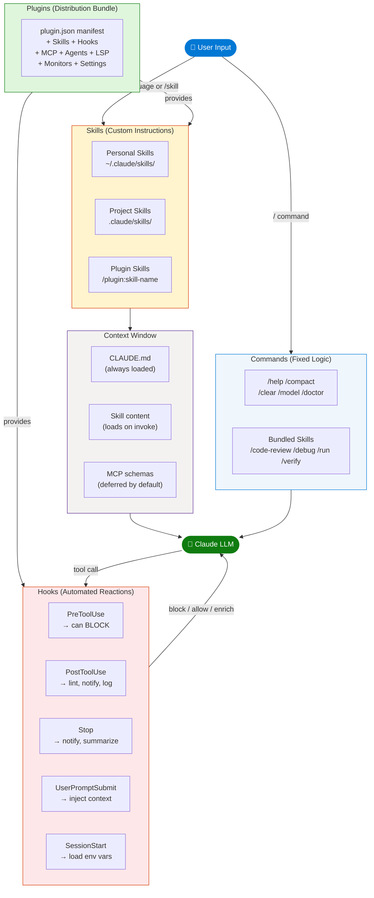
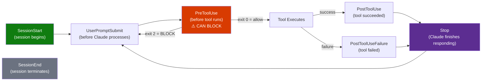
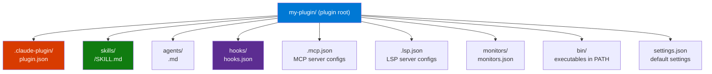
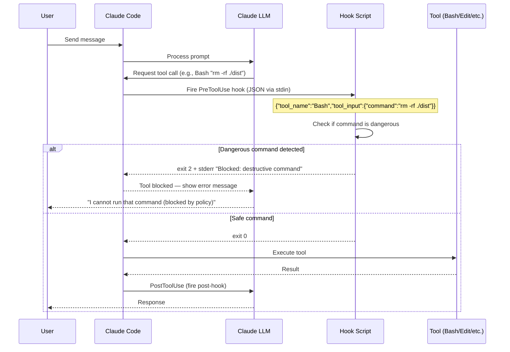
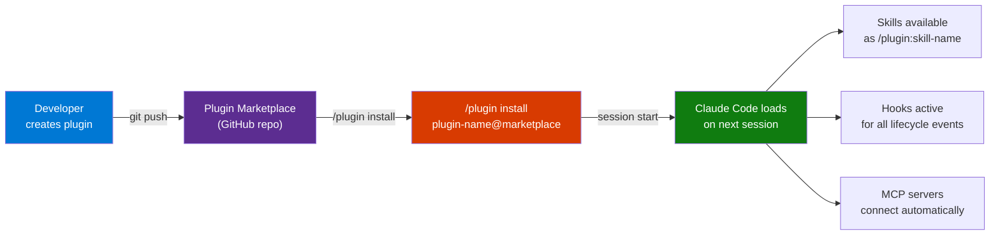
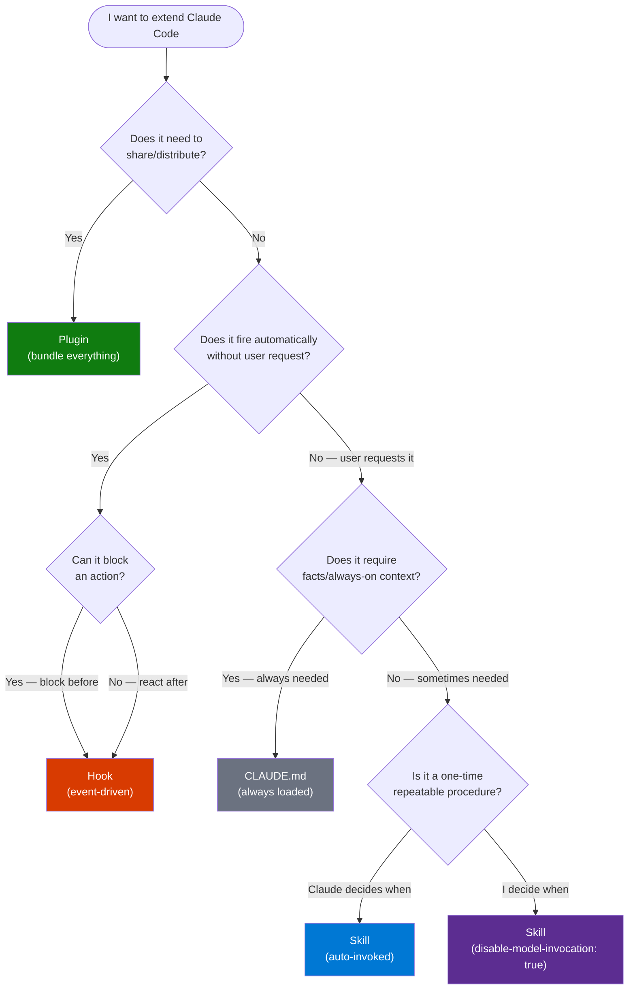

# Skills vs Hooks vs Commands vs Plugins — Claude Code

> **Source:** [YouTube — Skills vs Hooks vs Commands vs Plugins](https://www.youtube.com/shorts/1G3uw6lgt8o)
> **Channel/Event:** Claude Code
> **Topic:** Claude Code, Skills, Hooks, Commands, Plugins, Extension Mechanisms, Automation
> **Key Claim:** Four distinct extension mechanisms each serve a different purpose — Commands expose behaviors, Skills extend knowledge, Hooks automate reactions, Plugins bundle everything for sharing

---

## Table of Contents

1. [Overview](#1-overview)
2. [Problem Statement](#2-problem-statement)
3. [Core Concepts](#3-core-concepts)
4. [Architecture](#4-architecture)
5. [Key Components](#5-key-components)
6. [How It Works — Step by Step](#6-how-it-works--step-by-step)
7. [Comparison Table](#7-comparison-table)
8. [Code Examples](#8-code-examples)
9. [Configuration Reference](#9-configuration-reference)
10. [Best Practices](#10-best-practices)
11. [Interview Talking Points](#11-interview-talking-points)
12. [Learning Resources](#12-learning-resources)

---

## 1. Overview

Claude Code provides four mechanisms to extend and automate its behavior: **Commands**, **Skills**, **Hooks**, and **Plugins**. Commands are fixed built-in behaviors (`/help`, `/compact`) that cannot be customized. Skills are `SKILL.md` instruction files that extend what Claude knows and how it responds — invoked by typing `/skill-name` or auto-triggered by context. Hooks are shell commands, HTTP endpoints, or LLM prompts that fire automatically at lifecycle events like before a tool runs or after Claude finishes — they can enforce policies, add context, and even block actions. Plugins are self-contained bundles that package Skills, Hooks, MCP servers, and Agents together for distribution across projects and teams. This video clarifies when to reach for each mechanism and how they compose together.

> **Related:** See also `Claude-Code-Commands-vs-MCP-vs-Skills.md` for the MCP dimension of this ecosystem.

---

## 2. Problem Statement

Without understanding these four mechanisms, users manually repeat work that should be automated, miss enforcement opportunities, or build complex MCP servers when a simple hook would suffice.

### Classic Approach Pain Points

| Problem | Impact |
|---|---|
| Manually running linters/formatters after every edit | Slow feedback; easy to forget; inconsistent |
| No way to block dangerous commands before they run | `rm -rf` accidents, destructive operations in production |
| Repeating the same multi-step instructions every session | Token waste; cognitive overhead; inconsistency |
| Can't share workflows with teammates easily | Every team member rebuilds from scratch |
| Procedural content in CLAUDE.md always loads | Wastes context window on unused procedures |
| No notifications when Claude finishes long tasks | Must watch terminal instead of doing other work |

> **Key Insight:** "Skills change what Claude knows. Hooks change what Claude is allowed to do and what happens around its actions. Plugins are how you ship both to your team."

---

## 3. Core Concepts

### Commands (Built-in)
Fixed behaviors hardcoded into Claude Code. Invoked with `/` but execute deterministic logic — not Claude-driven. Examples: `/help`, `/compact`, `/clear`, `/model`, `/mcp`, `/doctor`, `/status`. Cannot be created or modified by users.

### Commands (Bundled Skills)
Prompt-driven skills that ship with Claude Code, listed alongside built-in commands. Unlike true built-ins, these are instruction-based and Claude orchestrates the work. Examples: `/code-review`, `/debug`, `/run`, `/verify`, `/loop`. Marked **Skill** in the commands reference.

### Skills (Custom)
User-defined `SKILL.md` files that add Claude knowledge, reference material, or step-by-step procedures. A skill's content only loads when invoked — unlike CLAUDE.md which always loads. Can be auto-invoked by Claude when description matches, or user-invoked with `/skill-name`. Scoped to enterprise, personal, project, or plugin level.

### Hooks
Shell commands, HTTP endpoints, MCP tool calls, LLM prompts, or subagents that fire automatically at specific lifecycle events — not on user request. Hooks can intercept tool execution before it happens (`PreToolUse`), react after (`PostToolUse`), enforce policies (exit code 2 = block), inject context into Claude's awareness, or trigger external notifications. Hooks cannot be invoked manually — they are always event-driven.

### Plugins
Self-contained directories that bundle any combination of Skills, Agents, Hooks, MCP servers, LSP servers, background monitors, and default settings under a single name. Plugins are namespaced (`/plugin-name:skill-name`) to prevent conflicts. Distributed through marketplaces; installed with `/plugin install`. The shareable, versionable packaging layer over standalone `.claude/` configuration.

### CLAUDE.md
Always-loaded memory file for facts, conventions, and preferences. Not for procedures (use Skills) and not for automation (use Hooks).

---

## 4. Architecture

### All Four Mechanisms in Context



### Hook Lifecycle — When Each Event Fires



### Plugin Directory Structure



---

## 5. Key Components

### Hook Event Types

| Event | When It Fires | Can Block? | Common Use |
|---|---|---|---|
| `SessionStart` | Session begins or resumes | No | Load env vars, greet, set context |
| `UserPromptSubmit` | Before Claude processes your message | Yes (exit 2) | Inject context, filter prompts |
| `PreToolUse` | Before any tool executes | **Yes (exit 2)** | Block dangerous commands, enforce policy |
| `PostToolUse` | After a tool succeeds | No | Run linter, log changes, notify |
| `PostToolUseFailure` | After a tool fails | No | Alert, retry logic, diagnostics |
| `Stop` | Claude finishes responding | No | Desktop notification, log session output |
| `FileChanged` | Watched file changes on disk | No | Reload config, trigger rebuild |
| `CwdChanged` | Working directory changes | No | Adjust context for new project |
| `SessionEnd` | Session terminates | No | Cleanup, summary, audit log |
| `PermissionRequest` | Permission dialog appears | Yes | Auto-allow/deny specific tools |
| `WorktreeCreate` | Worktree being created | No | Setup worktree environment |

### Hook Handler Types

| Type | Description | Best For |
|---|---|---|
| `command` | Shell script receives JSON on stdin | Most use cases — flexible, powerful |
| `http` | HTTP POST to an endpoint | Integration with external services |
| `mcp_tool` | Calls a tool on connected MCP server | Leverage existing MCP integrations |
| `prompt` | LLM evaluates yes/no decision | Nuanced policy decisions needing reasoning |
| `agent` | Spawns subagent with tools (experimental) | Complex multi-step automation |

### Hook Exit Codes

| Exit Code | Meaning | Claude Behavior |
|---|---|---|
| `0` | Success — stdout parsed for JSON decisions | Continues; reads JSON response if present |
| `2` | **Blocking error** — stderr shown to Claude | **Action blocked**; Claude sees error message |
| Other (1, 3+) | Non-blocking error | Continues; error logged but not surfaced |

### Plugin Components

| Directory / File | Purpose |
|---|---|
| `.claude-plugin/plugin.json` | Manifest — name, version, description, author |
| `skills/<name>/SKILL.md` | Custom skills (namespaced `/plugin:skill`) |
| `commands/<name>.md` | Legacy skills (use `skills/` for new plugins) |
| `agents/<name>.md` | Custom subagent definitions |
| `hooks/hooks.json` | Event hooks (same format as settings.json hooks) |
| `.mcp.json` | MCP server configurations |
| `.lsp.json` | LSP server configs for code intelligence |
| `monitors/monitors.json` | Background monitors (log watchers, etc.) |
| `bin/` | Executables added to Bash tool's PATH |
| `settings.json` | Default settings applied when plugin is enabled |

### Standalone vs Plugin Decision

| Condition | Use Standalone `.claude/` | Use Plugin |
|---|---|---|
| Single project customization | ✅ | — |
| Personal, not shared | ✅ | — |
| Quick experiment / prototype | ✅ | — |
| Want short names `/deploy` | ✅ | — |
| Share with teammates | — | ✅ |
| Distribute to community | — | ✅ |
| Same skills across multiple projects | — | ✅ |
| Versioned releases | — | ✅ |
| Bundle MCP + Skills + Hooks together | — | ✅ |
| Okay with namespaced `/plugin:skill` | — | ✅ |

---

## 6. How It Works — Step by Step

### Hook Execution Flow (PreToolUse)



### Plugin Install & Load Flow



### Decision Tree — Which Mechanism to Use



---

## 7. Comparison Table

| Dimension | Commands (Built-in) | Skills | Hooks | Plugins |
|---|---|---|---|---|
| **What it is** | Fixed Claude Code behavior | Custom instruction file | Automated event handler | Distribution bundle |
| **Created by** | Anthropic only | You | You | You (or community) |
| **Triggered by** | User types `/command` | User or Claude (auto) | Lifecycle events | N/A — contains Skills/Hooks |
| **Can block actions** | No | No | **Yes** (`exit 2`) | Via bundled hooks |
| **Modifiable** | No | Yes | Yes | Yes |
| **Loaded when** | Always available | Description in context; body on invoke | Always active (event-driven) | At session start when installed |
| **Token cost** | Zero | Near-zero until invoked | Zero (runs outside context) | Depends on bundled components |
| **Scoping** | Global | Enterprise/Personal/Project/Plugin | Settings file scope | Marketplace → project/user |
| **External access** | None | None (uses Claude's tools) | Yes (runs shell, HTTP calls) | Via bundled MCP servers |
| **Team-shareable** | N/A | Via `.claude/skills/` in VCS | Via `.claude/settings.json` in VCS | Via marketplace install |
| **Versioned releases** | N/A | No | No | **Yes** (`version` in plugin.json) |
| **Namespaced** | No | No | No | **Yes** (`/plugin:skill`) |
| **Contains** | — | Instructions | Shell/HTTP/LLM logic | Skills+Hooks+MCP+Agents+LSP |
| **Examples** | `/help`, `/compact`, `/model` | `/deploy`, `/pr-summary` | Post-edit linter, rm-rf blocker | `skill-creator`, `mcp-server-dev` |

---

## 8. Code Examples

### Hook — Block Dangerous Bash Commands (PreToolUse)

```bash
#!/bin/bash
# .claude/hooks/block-dangerous.sh
input=$(cat)
command=$(echo "$input" | jq -r '.tool_input.command // ""')

# Block rm -rf with no specific target
if echo "$command" | grep -qE 'rm\s+-rf\s+(/|~|\$HOME|\.)'; then
  echo "Blocked: destructive rm -rf command detected. Use specific paths." >&2
  exit 2
fi

# Block force push to main/master
if echo "$command" | grep -qE 'git push.*--force.*(main|master)'; then
  echo "Blocked: force push to protected branch." >&2
  exit 2
fi

exit 0
```

```json
// .claude/settings.json — wire up the hook
{
  "hooks": {
    "PreToolUse": [
      {
        "matcher": "Bash",
        "hooks": [
          {
            "type": "command",
            "command": "${CLAUDE_PROJECT_DIR}/.claude/hooks/block-dangerous.sh"
          }
        ]
      }
    ]
  }
}
```

### Hook — Auto-Lint After File Edits (PostToolUse)

```json
{
  "hooks": {
    "PostToolUse": [
      {
        "matcher": "Edit|Write",
        "hooks": [
          {
            "type": "command",
            "command": "${CLAUDE_PROJECT_DIR}/.claude/hooks/lint-on-save.sh"
          }
        ]
      }
    ]
  }
}
```

```bash
#!/bin/bash
# .claude/hooks/lint-on-save.sh
input=$(cat)
file=$(echo "$input" | jq -r '.tool_input.file_path // ""')

# Only lint TypeScript/JavaScript files
if echo "$file" | grep -qE '\.(ts|tsx|js|jsx)$'; then
  npx eslint --fix "$file" 2>/dev/null
fi
exit 0
```

### Hook — Desktop Notification on Stop

```bash
#!/bin/bash
# .claude/hooks/notify-done.sh
input=$(cat)
# macOS notification
osascript -e 'display notification "Claude has finished." with title "Claude Code"'
exit 0
```

```json
{
  "hooks": {
    "Stop": [
      {
        "matcher": "*",
        "hooks": [{ "type": "command", "command": "~/.claude/hooks/notify-done.sh" }]
      }
    ]
  }
}
```

### Hook — Load Environment Variables at Session Start

```bash
#!/bin/bash
# .claude/hooks/load-env.sh
if [ -n "$CLAUDE_ENV_FILE" ] && [ -f ".env.claude" ]; then
  while IFS='=' read -r key value; do
    [[ "$key" =~ ^#.*$ ]] && continue   # skip comments
    [[ -z "$key" ]] && continue
    echo "export $key=$value" >> "$CLAUDE_ENV_FILE"
  done < ".env.claude"
fi
exit 0
```

```json
{
  "hooks": {
    "SessionStart": [
      {
        "matcher": "*",
        "hooks": [{ "type": "command", "command": "${CLAUDE_PROJECT_DIR}/.claude/hooks/load-env.sh" }]
      }
    ]
  }
}
```

### Hook — HTTP Endpoint (Audit Log)

```json
{
  "hooks": {
    "PostToolUse": [
      {
        "matcher": "Bash|Edit|Write",
        "hooks": [
          {
            "type": "http",
            "url": "https://audit.internal.example.com/claude-actions",
            "headers": { "Authorization": "Bearer $AUDIT_TOKEN" },
            "allowedEnvVars": ["AUDIT_TOKEN"]
          }
        ]
      }
    ]
  }
}
```

### Hook — Scoped to a Skill (Frontmatter)

```yaml
---
name: secure-deploy
description: Deploy with security checks enforced
disable-model-invocation: true
hooks:
  PreToolUse:
    - matcher: "Bash"
      hooks:
        - type: command
          command: "${CLAUDE_PROJECT_DIR}/.claude/hooks/prod-guard.sh"
  Stop:
    - matcher: "*"
      hooks:
        - type: command
          command: "${CLAUDE_PROJECT_DIR}/.claude/hooks/notify-done.sh"
---

Deploy $ARGUMENTS to production following the standard checklist...
```

### Plugin — Minimal Structure

```bash
# Create plugin
mkdir -p my-team-plugin/.claude-plugin
mkdir -p my-team-plugin/skills/pr-summary
mkdir -p my-team-plugin/hooks
```

```json
// my-team-plugin/.claude-plugin/plugin.json
{
  "name": "my-team-plugin",
  "description": "Team workflow tools for our project",
  "version": "1.0.0",
  "author": { "name": "Engineering Team" }
}
```

```yaml
# my-team-plugin/skills/pr-summary/SKILL.md
---
description: Summarize the current PR for review. Use when asked about PR changes.
context: fork
agent: Explore
allowed-tools: Bash(gh *)
---

## PR Context
- Diff: !`gh pr diff`
- Files: !`gh pr diff --name-only`
- Comments: !`gh pr view --comments`

Summarize for PR description: what changed, why, risks, test plan.
```

```json
// my-team-plugin/hooks/hooks.json
{
  "hooks": {
    "PostToolUse": [
      {
        "matcher": "Edit|Write",
        "hooks": [
          { "type": "command", "command": "${CLAUDE_PROJECT_DIR}/.claude/hooks/lint.sh" }
        ]
      }
    ]
  }
}
```

```bash
# Test locally
claude --plugin-dir ./my-team-plugin

# Install from marketplace
# /plugin install my-team-plugin@my-org-marketplace

# Reload after changes (no restart needed)
# /reload-plugins
```

### Plugin — With MCP Server Bundled

```json
// my-team-plugin/.mcp.json
{
  "mcpServers": {
    "internal-api": {
      "type": "http",
      "url": "${INTERNAL_API_URL}/mcp",
      "headers": {
        "Authorization": "Bearer ${INTERNAL_API_KEY}"
      }
    }
  }
}
```

### Migrate Standalone Config to Plugin

```bash
# Step 1: Create plugin structure
mkdir -p my-plugin/.claude-plugin

# Step 2: Write manifest
cat > my-plugin/.claude-plugin/plugin.json << 'EOF'
{
  "name": "my-plugin",
  "description": "Migrated from standalone .claude/",
  "version": "1.0.0"
}
EOF

# Step 3: Copy existing files
cp -r .claude/skills my-plugin/ 2>/dev/null || true
cp -r .claude/commands my-plugin/ 2>/dev/null || true
cp -r .claude/agents my-plugin/ 2>/dev/null || true

# Step 4: Migrate hooks from settings.json to hooks/hooks.json
mkdir -p my-plugin/hooks
# Copy the "hooks" key from .claude/settings.json → my-plugin/hooks/hooks.json

# Step 5: Test
claude --plugin-dir ./my-plugin
```

---

## 9. Configuration Reference

### Hook Configuration Schema

```json
{
  "hooks": {
    "<EventName>": [
      {
        "matcher": "<tool-name or regex>",
        "hooks": [
          {
            "type": "command",
            "command": "<shell command or script path>"
          }
        ]
      }
    ]
  }
}
```

### Hook JSON Response Fields (stdout, exit 0)

| Field | Type | Purpose |
|---|---|---|
| `continue` | bool | Set `false` to stop Claude entirely (with `stopReason`) |
| `stopReason` | string | Message shown when `continue: false` |
| `decision` | string | `"block"` or `"allow"` (for permission hooks) |
| `reason` | string | Explanation for `decision` |
| `systemMessage` | string | Warning/context shown to Claude |
| `additionalContext` | string | Extra context injected into Claude's awareness |
| `terminalSequence` | string | Terminal escape sequence (e.g., desktop notification) |
| `hookSpecificOutput.hookEventName` | string | Identifies which event this output is for |
| `hookSpecificOutput.permissionDecision` | string | `"allow"` or `"deny"` for PreToolUse |
| `hookSpecificOutput.permissionDecisionReason` | string | Reason shown to Claude on deny |

### Plugin Manifest Schema (plugin.json)

| Field | Required | Description |
|---|---|---|
| `name` | Yes | Unique identifier; becomes skill namespace `/name:skill` |
| `description` | Recommended | Shown in marketplace browser |
| `version` | No | If set, users only get updates on version bump; omit for git-SHA versioning |
| `author.name` | No | Attribution |
| `homepage` | No | URL to plugin documentation |
| `repository` | No | Source code URL |
| `license` | No | License identifier (e.g., `"MIT"`) |

### Hook Settings Scopes

| File | Scope | Committed to VCS |
|---|---|---|
| `~/.claude/settings.json` | All your projects | No |
| `.claude/settings.json` | This project | Yes |
| `.claude/settings.local.json` | This project, private | No (gitignored) |
| Managed policy | Organization-wide | Admin-deployed |
| Skill/agent frontmatter `hooks:` | While that skill/agent is active | With the skill file |
| Plugin `hooks/hooks.json` | While plugin is enabled | With plugin |

---

## 10. Best Practices

### Hooks
- ✅ Use `exit 2` (not `exit 1`) to block — exit 1 is non-blocking
- ✅ Write stderr messages that are useful to Claude: it sees them as context
- ✅ Use `${CLAUDE_PROJECT_DIR}` to reference scripts — survives directory changes
- ✅ Use `args: []` exec form for scripts with paths that may contain spaces
- ✅ Scope hooks to specific matchers — don't run expensive scripts on every tool call
- ❌ Don't do heavy computation in `PreToolUse` — it blocks every matching tool call
- ❌ Don't write to stdout on exit 2 — stderr is what Claude sees; stdout is parsed as JSON

### Skills
- ✅ Keep `SKILL.md` under 500 lines — move detail to supporting files
- ✅ Put `disable-model-invocation: true` on anything with side effects
- ✅ Use dynamic context injection `` !`cmd` `` to give Claude live data at invoke time
- ✅ Embed hooks in skill frontmatter to scope enforcement to that workflow only
- ❌ Don't put procedures in CLAUDE.md — they always load; use Skills instead

### Plugins
- ✅ Start with standalone `.claude/` for rapid iteration — convert to plugin when ready to share
- ✅ Set a `version` field when distributing — users only get updates on version bumps
- ✅ Use `${CLAUDE_PLUGIN_ROOT}` for bundled file paths — resolves correctly regardless of install location
- ✅ Keep plugin skills namespaced (`/plugin:skill`) to prevent team conflicts
- ❌ Don't put `skills/`, `agents/`, `hooks/` inside `.claude-plugin/` — only `plugin.json` goes there
- ❌ Don't bundle a plugin if you only need it in one project — standalone config is simpler

### Choosing the Right Mechanism
- ✅ **Hook** when something should happen automatically without user request
- ✅ **Hook** when you need to block an action before it runs
- ✅ **Skill** when you keep pasting the same instructions into chat
- ✅ **Plugin** when you want to share or reuse across projects/teams
- ✅ **CLAUDE.md** only for facts and conventions — never procedures
- ❌ Don't use a Skill where a Hook should enforce — Skills are advice, Hooks are enforcement

---

## 11. Interview Talking Points

### "What is a Hook in Claude Code and how does it differ from a Skill?"

> A Hook is a shell command, HTTP endpoint, or LLM prompt that fires automatically at specific lifecycle events — before a tool runs, after a file is edited, when Claude finishes responding. Hooks don't require user invocation; they're always active for the events they're registered on. A Skill, by contrast, is a `SKILL.md` instruction file that extends what Claude knows and how it responds — it loads when invoked (by user or Claude auto-detection) and injects instructions into the conversation. The critical difference is that **Hooks can block actions** (exit code 2 prevents tool execution), while Skills only influence Claude's behavior by giving it instructions. Use Hooks for enforcement and automation; use Skills for extending knowledge and behavior.

### "How would you prevent Claude Code from running destructive commands like `rm -rf`?"

> You'd implement a `PreToolUse` hook matching the `Bash` tool. The hook receives the full tool input as JSON on stdin, extracts the command field with `jq`, checks it against a blocklist of dangerous patterns (e.g., `rm -rf /`, force push to main), and exits with code `2` if the check fails. Exit code 2 is the blocking exit code — Claude Code surfaces the stderr message to Claude, which then informs the user the command was blocked by policy. Exit code 1 is non-blocking, which is a common mistake. The hook script is referenced in `.claude/settings.json` under the `hooks.PreToolUse` key, scoped to the `Bash` matcher so it doesn't fire for unrelated tool calls.

### "What is a Plugin and when would you create one instead of using standalone `.claude/` configuration?"

> A Plugin is a self-contained directory that bundles Skills, Hooks, MCP servers, Agents, LSP servers, and background monitors together under a single versioned, namespaced package. You use standalone `.claude/` configuration when you're customizing a single project for personal use — you get short skill names like `/deploy` and quick iteration. You create a Plugin when you want to share functionality with teammates or distribute to the community, when you need the same skills across multiple projects, or when you want versioned releases so teammates only receive updates when you bump the version number. The tradeoff is that Plugin skills are namespaced (`/my-plugin:deploy` instead of `/deploy`), which prevents conflicts but adds more typing.

### "How do Hooks in Skill frontmatter differ from Hooks in settings.json?"

> Hooks in `settings.json` are always active for the duration of the session, firing on every matching event regardless of what you're doing. Hooks embedded in Skill or Agent frontmatter are scoped to that component's lifetime — they activate when the Skill or Agent becomes active and clear when it's no longer in context. This scoping is useful for workflows where enforcement should only apply during specific operations. For example, a `/deploy` skill might have a `PreToolUse` hook that enforces production safeguards — you only want those checks running when deploying, not during normal development. Placing the hook in the skill's frontmatter ensures it activates exactly when the skill is invoked and doesn't interfere with other workflows.

### "Walk me through the Plugin distribution flow — how does a developer share a plugin with their team?"

> The developer creates a plugin directory with a `.claude-plugin/plugin.json` manifest and the relevant components — skills in `skills/`, hooks in `hooks/hooks.json`, MCP servers in `.mcp.json`. They test locally with `claude --plugin-dir ./my-plugin`, then commit the directory to a Git repository. To share with the team, they set up a plugin marketplace — a Git repository with a `marketplace.json` index. Team members add the marketplace with `/plugin marketplace add org/repo-name` and install the plugin with `/plugin install plugin-name@marketplace-name`. On the next session, Claude Code fetches the plugin, loads all bundled components, and the team's `/plugin:skill` commands become available. The developer bumps the `version` field in `plugin.json` to push updates that users receive when they run `/plugin update`.

---

## 12. Learning Resources

| Resource | Link | Type |
|---|---|---|
| Skills vs Hooks vs Commands vs Plugins (Video) | [YouTube Shorts](https://www.youtube.com/shorts/1G3uw6lgt8o) | Video |
| Claude Code Hooks Reference | [code.claude.com/docs/en/hooks](https://code.claude.com/docs/en/hooks) | Official Docs |
| Claude Code Plugins Guide | [code.claude.com/docs/en/plugins](https://code.claude.com/docs/en/plugins) | Official Docs |
| Plugins Reference (full spec) | [code.claude.com/docs/en/plugins-reference](https://code.claude.com/docs/en/plugins-reference) | Reference |
| Skills Docs | [code.claude.com/docs/en/slash-commands](https://code.claude.com/docs/en/slash-commands) | Official Docs |
| Commands Reference | [code.claude.com/docs/en/commands](https://code.claude.com/docs/en/commands) | Reference |
| Discover & Install Plugins | [code.claude.com/docs/en/discover-plugins](https://code.claude.com/docs/en/discover-plugins) | Guide |
| Plugin Marketplaces | [code.claude.com/docs/en/plugin-marketplaces](https://code.claude.com/docs/en/plugin-marketplaces) | Guide |
| Subagents | [code.claude.com/docs/en/sub-agents](https://code.claude.com/docs/en/sub-agents) | Official Docs |
| MCP Integration | [code.claude.com/docs/en/mcp](https://code.claude.com/docs/en/mcp) | Official Docs |
| skill-creator Plugin | [github.com/anthropics/claude-plugins-official](https://github.com/anthropics/claude-plugins-official) | GitHub |
| Agent Skills Open Standard | [agentskills.io](https://agentskills.io) | Standard |
| Commands vs MCP vs Skills (companion guide) | `Claude-Code-Commands-vs-MCP-vs-Skills.md` | Local Reference |

---

*Last Updated: July 2026 | Source: Claude Code — Skills vs Hooks vs Commands vs Plugins*
