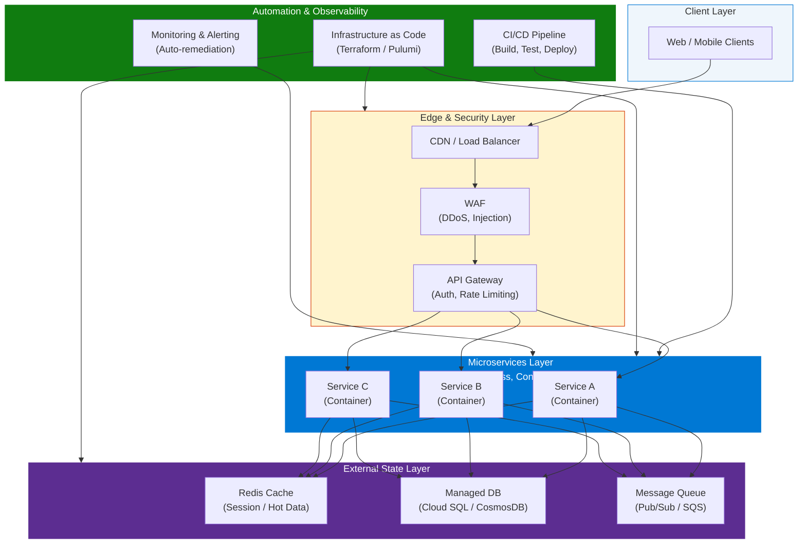
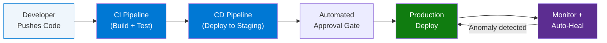
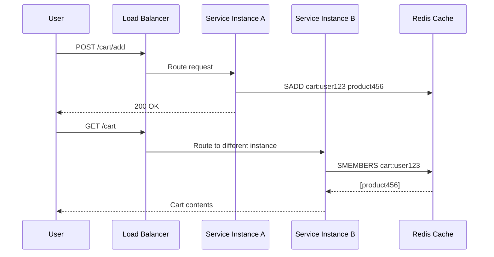
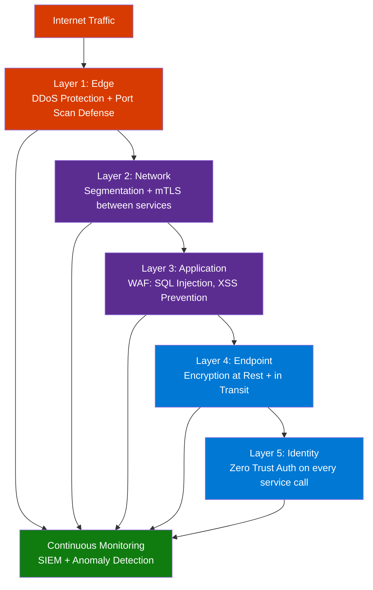

# Cloud-Native Architecture Explained: 5 Key Principles

> **Source:** [YouTube — Cloud-Native Architecture Explained: 5 Key Principles | Cloud-Native Concepts | Architecture Design](https://www.youtube.com/watch?v=pgzUqkC6QZM)
> **Channel/Event:** Architecture Design · Published August 2023
> **Topic:** Cloud Native, Microservices, Stateless Design, IaC, Zero Trust, Managed Services, CI/CD
> **Key Claim:** Organizations that fail to adopt cloud-native architecture risk stagnation and inability to respond to market threats — survival requires constant adaptation

---

## Table of Contents

1. [Overview](#1-overview)
2. [Problem Statement](#2-problem-statement)
3. [Core Concepts](#3-core-concepts)
4. [Architecture](#4-architecture)
5. [Key Components](#5-key-components)
6. [The 5 Principles — Deep Dive](#6-the-5-principles--deep-dive)
7. [Comparison Table](#7-comparison-table)
8. [Code Examples](#8-code-examples)
9. [Configuration Reference](#9-configuration-reference)
10. [Best Practices](#10-best-practices)
11. [Interview Talking Points](#11-interview-talking-points)
12. [Learning Resources](#12-learning-resources)

---

## 1. Overview

Cloud-native architecture is an approach to designing, building, and running applications that fully exploits the advantages of the cloud computing model. Unlike "cloud-based" systems that merely run on cloud infrastructure, cloud-native systems are architected from the ground up to be scalable, resilient, automated, and continuously delivered. This video introduces 5 foundational principles that govern every design decision in a cloud-native system: automate your environments, design stateless components, favor managed services, practice defense in depth, and always be architecting. Mastering these 5 principles is the difference between a system that struggles under cloud constraints versus one that is self-healing, cost-efficient, and easy to maintain.

---

## 2. Problem Statement

Cloud-native architecture exists to solve the fundamental mismatch between how traditional enterprise applications were designed and how the cloud actually works.

### Classic Approach Pain Points

| Problem | Impact |
|---|---|
| Fixed, hardware-bound infrastructure | Can't respond to traffic spikes; over-provisioning wastes money |
| Vertical scaling only ("bigger servers") | Hard ceiling on scale; single points of failure |
| Session state stored in application memory | Server failure loses user sessions; no horizontal scaling possible |
| Manual deployment and configuration | Slow releases, human error, inconsistent environments |
| Perimeter-based security ("castle and moat") | One breach compromises everything inside the perimeter |
| Architecture as a one-time design activity | Systems become stale, fragile, and expensive to maintain |

> **Key Insight:** "If architects fail to adapt their approach to cloud constraints, the systems they architect are often fragile, expensive, and hard to maintain. A well-architected cloud-native system should be largely self-healing, cost efficient, and easily updated through CI/CD."

---

## 3. Core Concepts

### Cloud-Native Architecture
An approach to application design emphasizing scalability, portability, and maintainability by leveraging cloud platform capabilities across private, public, or hybrid environments. It optimizes for usage-based pricing, easy automation, and rapid provisioning.

### Stateless Components
A design pattern where each service instance holds no user session data between requests. All state is externalized to a dedicated storage layer (Redis, databases). Any instance can handle any request — enabling true horizontal scaling.

### Infrastructure as Code (IaC)
The practice of managing and provisioning infrastructure through machine-readable configuration files (Terraform, Pulumi, AWS CloudFormation) rather than manual processes. Enables repeatable, automated, version-controlled environments.

### Defense in Depth
A multi-layered security strategy that assumes no single control is sufficient. Every component — even "internal" ones — must authenticate, authorize, and validate every request. Based on the Zero Trust model: "never trust, always verify."

### Managed Services
Cloud provider-operated services (databases, message queues, ML runtimes, caches) where the provider handles infrastructure, patching, availability, and scaling. Teams consume the capability, not the operational burden.

### Always Be Architecting
A mindset shift treating architecture as an ongoing process rather than a one-time design event. As organizational needs, IT landscapes, and cloud capabilities evolve, so must the architecture.

---

## 4. Architecture



---

## 5. Key Components

| Component | Service / Tool | Role |
|---|---|---|
| API Gateway | AWS API GW / Azure APIM / Kong | Single entry point; handles auth, routing, rate limiting |
| Container Runtime | Docker | Packages stateless microservices consistently across environments |
| Container Orchestration | Kubernetes / GKE / AKS / EKS | Schedules, scales, and heals containerized services |
| CI/CD Pipeline | GitHub Actions / Cloud Build / Jenkins | Automates build → test → deploy lifecycle |
| Infrastructure as Code | Terraform / Pulumi / ARM Templates | Version-controlled, reproducible environment provisioning |
| External State Store | Redis / Memcached | Hot data cache; offloads session state from services |
| Managed Database | Cloud SQL / CosmosDB / Aurora | Fully managed persistence; no DBA overhead |
| Message Queue | Pub/Sub / SQS / Service Bus | Async communication; decouples producers from consumers |
| WAF / Security | Cloud Armor / Cloudflare / Azure WAF | Edge-level DDoS and injection protection |
| Observability | Prometheus + Grafana / Datadog / Azure Monitor | Metrics, logs, traces — feeds auto-remediation |

---

## 6. The 5 Principles — Deep Dive

### Principle 1: Design for Automation

Manual processes cannot match the speed and reliability of automation at cloud scale. Every repeatable operation should be automated.



**What to automate:**
- **Infrastructure provisioning** — Terraform/Pulumi instead of clicking consoles
- **Build and test** — every commit triggers automated test suites
- **Deployment** — canary releases, blue-green deployments via CI/CD
- **Auto-scaling** — scale up/down based on CPU, memory, request rate (scale to zero for intermittent workloads)
- **Recovery** — monitoring triggers automated remediation (disk resize, pod restart, failover)

---

### Principle 2: Be Smart with State

State management is the hardest aspect of distributed cloud-native systems. Stateless services unlock horizontal scaling, simplified load balancing, and instant recovery.



**Rules for stateless design:**
- Never store user session in application memory
- Externalize all state to Redis, databases, or distributed caches
- Any instance handles any request — load balancer has no affinity requirements
- Failed instances: terminate and relaunch (no state to recover)

---

### Principle 3: Favor Managed Services

Managed services reduce operational overhead so teams focus on business logic, not infrastructure management.

**Three-tier evaluation framework:**

| Category | Examples | Decision |
|---|---|---|
| Managed open-source equivalents | Cloud SQL, Cloud Bigtable, Azure Cache for Redis | Always adopt — low migration risk, high operational benefit |
| High operational savings services | BigQuery, Cosmos DB, Athena | Adopt — worth potential migration effort |
| Everything else | Niche or proprietary services | Evaluate: strategic value vs. migration effort vs. vendor lock-in |

---

### Principle 4: Practice Defense in Depth

Replace the perimeter security model ("castle and moat") with layered, zero-trust controls at every boundary.



**Zero Trust in practice:**
- Every service-to-service call requires mutual TLS (mTLS) authentication
- No implicit trust based on network location ("internal" means nothing)
- Rate limiting enforced at every layer, not just the edge
- Principle of least privilege for all service identities

---

### Principle 5: Always Be Architecting

Architecture is not a one-time design activity — it is an ongoing process of continuous refinement.

**Drivers of architectural evolution:**
- Organizational needs change (new teams, new products, M&A)
- Cloud provider capabilities expand (new managed services, better pricing tiers)
- Technology landscape shifts (new container runtimes, new observability tools)
- Traffic patterns change (geographic expansion, usage spikes)

**Practices:**
- Schedule regular architecture review sessions (quarterly minimum)
- Treat architecture decisions as ADRs (Architecture Decision Records) in version control
- Measure and act on architectural fitness functions (latency budgets, error rate thresholds)
- Continuously simplify — remove components that no longer earn their complexity cost

---

## 7. Comparison Table

| Dimension | Traditional Architecture | Cloud-Native Architecture |
|---|---|---|
| Infrastructure | Fixed, hardware-bound, manually provisioned | Elastic, on-demand, IaC-managed |
| Scaling | Vertical ("bigger servers") — manual | Horizontal ("more instances") — automatic |
| State Management | Session state in application memory | Externalized to Redis / managed database |
| Security Model | Perimeter-based ("castle and moat") | Zero-trust, defense in depth |
| Deployment | Infrequent, manual, risky | Continuous CI/CD with automated rollbacks |
| Operations | Manual configuration and patching | Managed services + automation |
| Resilience | Robust individual components | Horizontal redundancy + self-healing |
| Architecture Lifecycle | One-time design | Ongoing, continuously refined |
| Provisioning Time | Days to weeks | Seconds to minutes |
| Cost Model | Fixed CapEx (buy capacity for peak) | Variable OpEx (pay for actual usage) |

---

## 8. Code Examples

### Terraform — Infrastructure as Code (Principle 1)

```hcl
# Provision a stateless compute instance via IaC
resource "aws_instance" "app_server" {
  ami           = "ami-0c55b159cbfafe1f0"
  instance_type = "t3.medium"

  user_data = <<-EOF
    #!/bin/bash
    echo "No local state stored here" > /var/log/init.log
  EOF

  tags = {
    Name        = "cloud-native-app-server"
    Environment = "production"
  }
}

# Auto-scaling group for horizontal scaling (Principle 1 + stateless)
resource "aws_autoscaling_group" "app_asg" {
  min_size         = 2
  max_size         = 20
  desired_capacity = 3
  launch_template {
    id      = aws_launch_template.app.id
    version = "$Latest"
  }
}
```

### Python + Redis — Stateless Session Management (Principle 2)

```python
import redis
from flask import Flask, request, jsonify

app = Flask(__name__)
r = redis.Redis(host='redis-managed.cache.amazonaws.com', port=6379, decode_responses=True)

@app.route('/cart/add', methods=['POST'])
def add_to_cart():
    user_id = request.json['user_id']
    product_id = request.json['product_id']
    # State stored externally — any service instance can serve this user
    r.sadd(f'cart:{user_id}', product_id)
    return jsonify({"status": "added"})

@app.route('/cart', methods=['GET'])
def get_cart():
    user_id = request.args.get('user_id')
    # Retrieve from Redis — not from this instance's memory
    cart_items = list(r.smembers(f'cart:{user_id}'))
    return jsonify({"cart": cart_items})
```

### Kubernetes — Zero-Trust mTLS via Service Mesh (Principle 4)

```yaml
# Istio PeerAuthentication — enforce mTLS between all services
apiVersion: security.istio.io/v1beta1
kind: PeerAuthentication
metadata:
  name: default
  namespace: production
spec:
  mtls:
    mode: STRICT  # Reject any non-mTLS traffic, even from inside the cluster

---
# AuthorizationPolicy — Zero Trust: explicit allow only
apiVersion: security.istio.io/v1beta1
kind: AuthorizationPolicy
metadata:
  name: allow-cart-service
  namespace: production
spec:
  selector:
    matchLabels:
      app: cart-service
  rules:
  - from:
    - source:
        principals: ["cluster.local/ns/production/sa/order-service"]
```

### GitHub Actions — CI/CD Automation (Principle 1)

```yaml
name: Cloud-Native CI/CD Pipeline

on:
  push:
    branches: [main]

jobs:
  build-test-deploy:
    runs-on: ubuntu-latest
    steps:
      - uses: actions/checkout@v3

      - name: Run unit tests
        run: pytest tests/ --cov=app --cov-fail-under=80

      - name: Build Docker image
        run: docker build -t myapp:${{ github.sha }} .

      - name: Push to registry
        run: docker push myregistry.azurecr.io/myapp:${{ github.sha }}

      - name: Deploy to Kubernetes (canary)
        run: |
          kubectl set image deployment/myapp \
            app=myregistry.azurecr.io/myapp:${{ github.sha }} \
            --record
```

### Install / Setup

```bash
# Install Terraform
brew install terraform

# Initialize Terraform project
terraform init && terraform plan && terraform apply

# Install kubectl + Helm for Kubernetes management
brew install kubectl helm

# Install Istio service mesh (for mTLS / defense in depth)
curl -L https://istio.io/downloadIstio | sh -
istioctl install --set profile=production

# Enable mTLS namespace-wide
kubectl label namespace production istio-injection=enabled
```

---

## 9. Configuration Reference

### Auto-Scaling Policy (Kubernetes HPA)

| Parameter | Type | Default | Description |
|---|---|---|---|
| `minReplicas` | int | 1 | Minimum pod count — never scale below this |
| `maxReplicas` | int | 10 | Maximum pod count for the deployment |
| `targetCPUUtilizationPercentage` | int | 80 | CPU % that triggers scale-out |
| `scaleDown.stabilizationWindowSeconds` | int | 300 | Wait before scaling down (avoids thrash) |

### Redis External State Config

| Parameter | Type | Example | Description |
|---|---|---|---|
| `host` | string | `redis.cache.windows.net` | Managed Redis endpoint |
| `port` | int | 6379 | Default Redis port (use 6380 for TLS) |
| `ssl` | bool | `true` | Always true in production |
| `maxmemory-policy` | string | `allkeys-lru` | Eviction policy for cache saturation |

---

## 10. Best Practices

### Automation (Principle 1)

- ✅ Version-control all infrastructure definitions alongside application code
- ✅ Run automated integration tests in CI before any deployment
- ✅ Use canary or blue-green deployments to minimize blast radius
- ✅ Scale to zero for batch/event-driven workloads to eliminate idle cost
- ❌ Don't click through cloud consoles to provision infrastructure
- ❌ Don't skip automated tests to speed up a release

### State Management (Principle 2)

- ✅ Externalize all session, user, and application state to Redis or a managed DB
- ✅ Design every service so restarting it loses zero user data
- ✅ Use connection pooling when accessing external state stores
- ❌ Don't store authentication tokens or session data in application memory
- ❌ Don't assume sticky sessions — any instance must handle any request

### Managed Services (Principle 3)

- ✅ Use managed databases (Cloud SQL, Aurora, CosmosDB) instead of self-hosted
- ✅ Evaluate managed open-source equivalents first — lowest lock-in risk
- ✅ Factor in operational savings when calculating TCO of managed vs. self-hosted
- ❌ Don't default to self-hosting without calculating the true operational overhead cost
- ❌ Don't adopt a proprietary service without a documented migration exit strategy

### Security — Defense in Depth (Principle 4)

- ✅ Enable mTLS between all microservices (use a service mesh like Istio or Linkerd)
- ✅ Apply least-privilege service identities (each service gets only the permissions it needs)
- ✅ Enable SIEM and continuous anomaly detection
- ❌ Don't assume internal network traffic is safe — treat it as untrusted
- ❌ Don't put all security controls only at the perimeter edge

### Architecture Evolution (Principle 5)

- ✅ Document architecture decisions as ADRs (Architecture Decision Records) in Git
- ✅ Conduct quarterly architecture review sessions
- ✅ Define measurable fitness functions (p99 latency < 200ms, error rate < 0.1%)
- ❌ Don't treat the initial architecture document as final
- ❌ Don't let complexity accumulate — actively remove components that no longer earn their cost

---

## 11. Interview Talking Points

### "What does cloud-native architecture mean to you?"

> Cloud-native means designing systems that are optimized for how the cloud actually works — not just running old monoliths on cloud VMs. Specifically, it means embracing five principles: automating everything through IaC and CI/CD, designing stateless services that can scale horizontally, leveraging managed services to reduce operational burden, implementing zero-trust security at every layer, and treating architecture as an ongoing refinement process. The result is a system that is self-healing, cost-efficient, and continuously deliverable.

---

### "How do you handle state in a cloud-native microservices system?"

> Stateless services are a core cloud-native principle. The rule is: no service instance ever stores user session data in its own memory. Instead, all state is externalized to a dedicated layer — typically Redis for hot session data and a managed database for durable state. This means any instance can handle any request, load balancers need no affinity rules, and a failed pod can be replaced in seconds with zero data loss. In practice, I've used Redis with Flask apps to store cart and session data, ensuring the service layer remained fully stateless.

---

### "What is defense in depth and how does it differ from traditional perimeter security?"

> Traditional security relied on a perimeter model — a strong firewall kept threats out, and everything inside was implicitly trusted. Cloud-native systems reject this entirely. Defense in depth means layering security controls at every boundary: edge DDoS protection, network segmentation with mTLS between services, application-layer WAF rules, endpoint encryption, and zero-trust identity verification on every inter-service call. The key shift is from "trust by location" to "trust by verified identity." If one layer is breached, the attacker still faces every other layer — nothing is implicitly trusted, even internal traffic.

---

### "Why should we favor managed services and when shouldn't we?"

> Managed services — Cloud SQL, Cosmos DB, Azure Cache for Redis — eliminate entire categories of operational work: patching, availability management, backups, scaling. Teams can focus purely on product logic. The evaluation framework I use has three tiers: (1) managed open-source equivalents get adopted almost always — low lock-in risk, high benefit; (2) high operational savings services like BigQuery are worth migration effort; (3) everything else needs a case-by-case evaluation of strategic value versus vendor lock-in risk. The one scenario where I'd self-host is if we need portability guarantees that no managed service can provide.

---

### "What does 'always be architecting' mean in practice?"

> It means rejecting the idea that architecture is something you design once at project start and then implement. Cloud-native systems live in an environment that continuously changes — new cloud capabilities appear, team structure evolves, traffic patterns shift. In practice, this means holding quarterly architecture reviews, documenting decisions as ADRs in version control, defining measurable fitness functions for the system, and actively refactoring components that no longer earn their complexity cost. Architecture is a living practice, not a deliverable.

---

### "How would you explain cloud-native vs. cloud-based to a non-technical stakeholder?"

> Cloud-based means you moved your existing system to run on cloud servers — like moving from a house you own to a rented apartment. Cloud-native means you redesigned for the rental model from scratch — no unnecessary furniture that won't fit, a layout optimized for the space, and the flexibility to move efficiently if needed. Cloud-native systems are designed to automatically scale when demand spikes, recover when components fail, and be updated continuously without downtime — none of which traditional cloud-based migrations guarantee.

---

## 12. Learning Resources

| Resource | Link | Type |
|---|---|---|
| 5 Principles for Cloud-Native Architecture | [Google Cloud Blog](https://cloud.google.com/blog/products/application-development/5-principles-for-cloud-native-architecture-what-it-is-and-how-to-master-it) | Official Docs |
| Cloud-Native Architecture: 5 Key Principles Explained | [KodeKloud Blog](https://kodekloud.com/blog/cloud-native-principles-explained/) | Article |
| CNCF Cloud Native Definition | [github.com/cncf/toc](https://github.com/cncf/toc/blob/main/DEFINITION.md) | Official Spec |
| 12-Factor App Methodology | [12factor.net](https://12factor.net) | Reference |
| Istio Service Mesh Docs | [istio.io/docs](https://istio.io/latest/docs/) | Official Docs |
| Terraform Getting Started | [developer.hashicorp.com/terraform](https://developer.hashicorp.com/terraform/tutorials) | Tutorial |
| YouTube Video | [Cloud-Native Architecture Explained: 5 Key Principles](https://www.youtube.com/watch?v=pgzUqkC6QZM) | Video |

---

*Last Updated: June 2026 | Source: Architecture Design — Cloud-Native Architecture Explained: 5 Key Principles*
