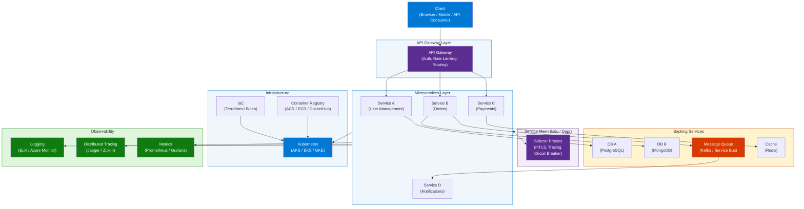
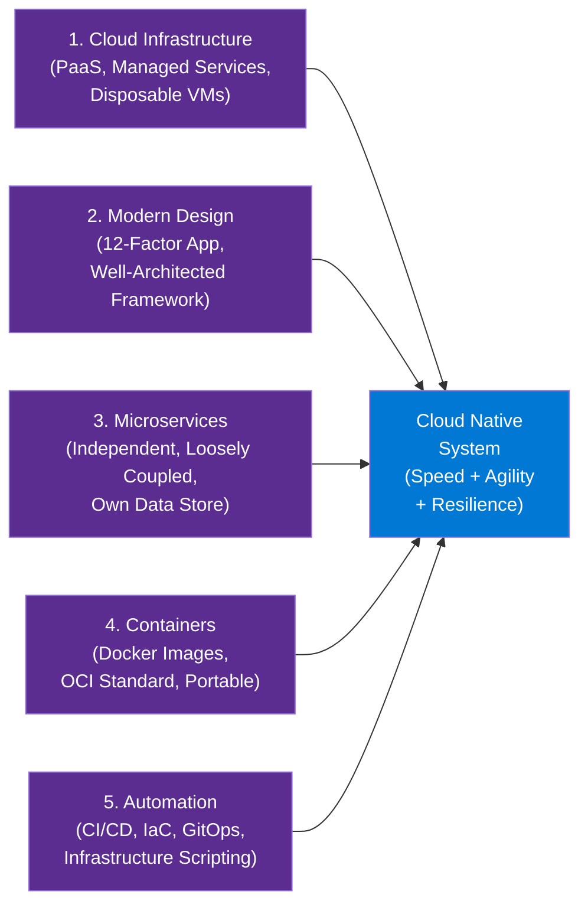
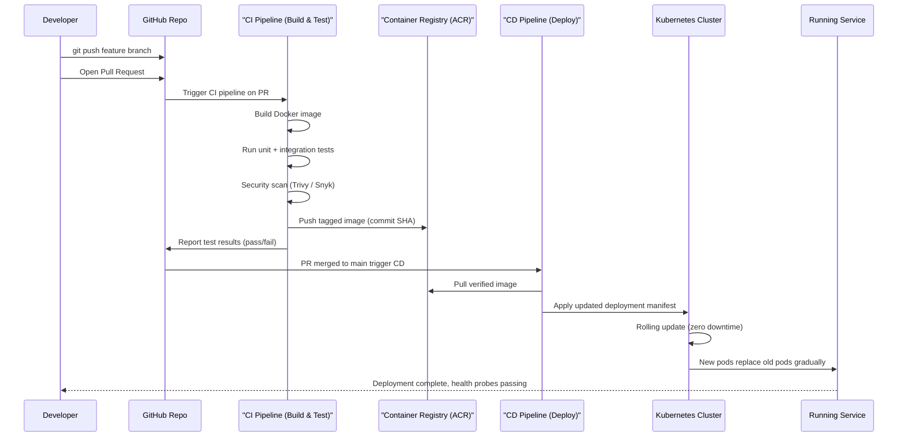
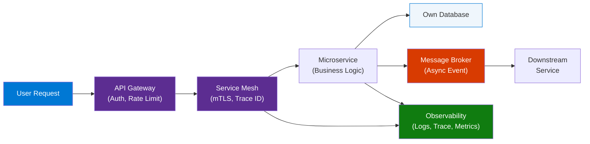

# But What Is Cloud Native Really All About?

> **Source:** [YouTube — But What Is Cloud Native Really All About?](https://www.youtube.com/watch?v=p-88GN1WVs8)
> **Channel/Event:** ByteByteGo · Published March 2023
> **Topic:** Cloud Native, Microservices, Containers, Kubernetes, DevOps, CI/CD, 12-Factor App
> **Key Claim:** Netflix deploys 100 times/day, Uber runs 1,000+ services deploying thousands of times/week — enabled entirely by cloud-native architecture

---

## Table of Contents

1. [Overview](#1-overview)
2. [Problem Statement](#2-problem-statement)
3. [Core Concepts](#3-core-concepts)
4. [Architecture](#4-architecture)
5. [Key Components](#5-key-components)
6. [How It Works — Step by Step](#6-how-it-works--step-by-step)
7. [Comparison Table](#7-comparison-table)
8. [Code Examples](#8-code-examples)
9. [Configuration Reference](#9-configuration-reference)
10. [Best Practices](#10-best-practices)
11. [Interview Talking Points](#11-interview-talking-points)
12. [Learning Resources](#12-learning-resources)

---

## 1. Overview

Cloud Native is an architectural approach to designing, building, and running applications that take full advantage of the cloud computing model — not just hosting existing apps in the cloud, but rethinking how software is structured from the ground up. The CNCF defines it as: *"technologies that empower organizations to build and run scalable applications in modern, dynamic environments such as public, private, and hybrid clouds."* The five foundational pillars are: cloud infrastructure, modern design (12-Factor App), microservices, containers, and automation/CI-CD. Companies like Netflix (100 deploys/day, 600+ services), Uber (1,000+ services), and WeChat (3,000+ services, 1,000 deploys/day) prove what this architecture enables at scale. The core promise is **speed** and **agility** — getting new ideas to market fast while maintaining resilience.

---

## 2. Problem Statement

Traditional monolithic applications force the entire codebase to be built, tested, and deployed as a single unit — a constraint that creates compounding problems as systems grow.

### Classic Approach Pain Points

| Problem | Impact |
|---|---|
| Monolithic deployment | A bug fix in the payment module requires redeploying the entire application |
| Scaling bottlenecks | Must scale the entire application even if only one feature is under load |
| Long release cycles | Quarterly or monthly releases; enormous coordination overhead |
| Single point of failure | One bad deploy can take down the entire system |
| Technology lock-in | Entire stack must use the same language, framework, and runtime |
| Environment drift | "Works on my machine" bugs from inconsistent environments across dev/staging/prod |
| Tight coupling | A change in the data layer can unexpectedly break the UI layer |
| Slow team velocity | All teams are blocked by the same release train |

> **Key Insight:** *"Cloud-native systems are designed to embrace rapid change, large scale, and resilience."* — Microsoft .NET Architecture Guide

---

## 3. Core Concepts

### Cloud Native
An approach where applications are designed to reside in the cloud from the start, leveraging containers, microservices, declarative APIs, immutable infrastructure, and service meshes to achieve resilience, scalability, and agility. The key shift: infrastructure is treated as **disposable commodity** (cattle), not as precious servers to maintain (pets).

### Microservices
A distributed architectural style where an application is decomposed into small, independently deployable services. Each owns its business capability, its codebase, and its own data store — communicating via HTTP/REST, gRPC, WebSockets, or async messaging (AMQP/Kafka).

### Containers
Lightweight, portable execution units that package code + dependencies + runtime into a single binary (container image). Containers share the host OS kernel but are fully isolated from each other, making them far more efficient than VMs. Docker is the de facto standard.

### Container Orchestration
Software that automates the scheduling, scaling, health monitoring, networking, and lifecycle management of containerized workloads across a cluster of machines. **Kubernetes** is the de facto standard; managed as AKS (Azure), EKS (AWS), GKE (Google).

### Service Mesh
An infrastructure layer (e.g., Istio, Linkerd, Dapr) that manages service-to-service communication — providing traffic control, mutual TLS encryption, observability, and circuit breaking **without changing application code**. Implemented as sidecar proxies next to each service.

### Infrastructure as Code (IaC)
The practice of defining cloud infrastructure (VMs, networks, databases, clusters) in versioned, declarative scripts (Terraform, Azure Bicep, ARM) so environments are provisioned automatically, consistently, and repeatably.

### The 12-Factor App
A methodology for building portable, scalable SaaS applications, defining 15 principles around configuration, dependencies, logging, statelessness, and strict CI/CD pipeline separation.

### Immutable Infrastructure
Servers and containers are never modified after deployment. Instead of patching in place, a new image is built and the old instance is replaced. This eliminates configuration drift and makes rollbacks trivially safe.

---

## 4. Architecture

### Cloud Native System — Full Architecture



### The Five Pillars of Cloud Native



---

## 5. Key Components

| Component | Service / Tool | Role |
|---|---|---|
| API Gateway | Kong, Azure APIM, AWS API GW | Single entry point — auth, routing, rate limiting, SSL termination |
| Container Runtime | Docker, containerd, CRI-O | Builds and runs container images on host machines |
| Container Orchestrator | Kubernetes (AKS, EKS, GKE) | Schedules, scales, heals, and manages containerized workloads |
| Service Mesh | Istio, Linkerd, Dapr | Service-to-service communication, mTLS, observability, circuit breaking |
| CI/CD Pipeline | GitHub Actions, Azure DevOps, Jenkins | Automates build → test → push → deploy lifecycle |
| Infrastructure as Code | Terraform, Azure Bicep, ARM | Declarative, repeatable, versioned environment provisioning |
| Container Registry | Docker Hub, ACR, ECR | Stores and versions container images |
| Message Broker | Kafka, RabbitMQ, Azure Service Bus | Async communication between microservices |
| Distributed Cache | Redis, Memcached | Externalized state store for stateless services |
| Observability Stack | Prometheus + Grafana + Jaeger | Metrics, distributed tracing, and log aggregation across all services |
| Secrets Manager | Azure Key Vault, AWS Secrets Manager | Secure storage and injection of credentials |

### Kubernetes Core Capabilities

| Task | What Kubernetes Does |
|---|---|
| Scheduling | Places containers on nodes with available CPU/memory resources |
| Self-healing | Restarts failed containers; replaces unhealthy nodes automatically |
| Horizontal scaling | Auto-scales pods via HPA based on CPU, memory, or custom metrics |
| Rolling upgrades | Zero-downtime deployments with automatic rollback on failure |
| Service discovery | DNS-based routing within the cluster between services |
| Load balancing | Distributes traffic across all replicas of a pod |
| Config management | ConfigMaps and Secrets injected into pods at runtime |

### Service Mesh Capabilities (Dapr / Istio)

A service mesh handles cross-cutting concerns between microservices without requiring any code changes — using **sidecar proxies** (Envoy) injected alongside each service:

- **Traffic management:** Canary releases, A/B testing, fault injection, circuit breaking
- **Security:** Mutual TLS (mTLS) between all services — zero-trust by default
- **Observability:** Distributed tracing via Zipkin/Jaeger, golden signals (latency, traffic, errors, saturation)
- **Resilience:** Retries, timeouts, and bulkheads configured at the mesh level

---

## 6. How It Works — Step by Step

### CI/CD Deploy-to-Kubernetes Flow



### Runtime Request Flow Through a Cloud-Native App



**Step-by-step:**

1. **Client request** arrives at the API Gateway — authentication and rate limiting applied.
2. **Gateway routes** the request to the appropriate microservice based on path/headers.
3. **Service Mesh sidecar** intercepts the call: applies mTLS, injects a Trace ID, records the span.
4. **Microservice** processes the request; reads and writes from its own dedicated database.
5. **Async events** are published to a message broker (e.g., `OrderPlaced` → Kafka topic).
6. **Downstream services** (Notifications, Analytics) consume the event independently and asynchronously.
7. **Observability** tools automatically capture the full distributed trace, latency metrics, and structured logs.

---

## 7. Comparison Table

| Dimension | Monolithic Architecture | Cloud Native / Microservices |
|---|---|---|
| Deployment unit | Entire application deployed at once | Individual services deployed independently |
| Scaling | Scale entire application (expensive, coarse) | Scale only hot services (efficient, granular) |
| Failure blast radius | One failure can bring down the entire system | Failures are isolated to a single service |
| Tech stack | Uniform across the entire codebase | Polyglot — each service chooses its own stack |
| Team autonomy | All teams share one codebase and release cycle | Teams own individual services end-to-end |
| Release cadence | Quarterly or monthly | Multiple times per day (Netflix: 100 deploys/day) |
| Data storage | Single shared monolithic database | Each service owns and manages its own data store |
| Testing | Long end-to-end test cycles across the whole app | Isolated unit + contract tests per service |
| Observability | Single log stream from one process | Distributed tracing required (Jaeger, Zipkin) |
| Infrastructure model | Pet servers — cared for, named, maintained | Cattle — disposable, replaced, not repaired |
| Configuration | Baked into code or a shared config file | Externalized via environment variables or ConfigMaps |
| Resilience | Single point of failure | Circuit breakers, retries, bulkheads by design |
| Developer onboarding | Must understand the entire codebase | Only need to understand one service boundary |

---

## 8. Code Examples

### Dockerfile — Multi-Stage Build for a Microservice

```dockerfile
# Stage 1: Build
FROM node:20-alpine AS builder
WORKDIR /app
COPY package*.json ./
RUN npm ci --only=production
COPY . .
RUN npm run build

# Stage 2: Minimal runtime image
FROM node:20-alpine
WORKDIR /app
COPY --from=builder /app/dist ./dist
COPY --from=builder /app/node_modules ./node_modules
EXPOSE 3000
ENV NODE_ENV=production
USER node
CMD ["node", "dist/index.js"]
```

### Kubernetes Deployment + Service Manifest

```yaml
apiVersion: apps/v1
kind: Deployment
metadata:
  name: orders-service
  labels:
    app: orders-service
spec:
  replicas: 3
  selector:
    matchLabels:
      app: orders-service
  template:
    metadata:
      labels:
        app: orders-service
    spec:
      containers:
        - name: orders-service
          image: myregistry.azurecr.io/orders-service:v1.2.3
          ports:
            - containerPort: 3000
          env:
            - name: DATABASE_URL
              valueFrom:
                secretKeyRef:
                  name: orders-db-secret
                  key: connection-string
            - name: NODE_ENV
              value: production
          resources:
            requests:
              cpu: "100m"
              memory: "128Mi"
            limits:
              cpu: "500m"
              memory: "512Mi"
          livenessProbe:
            httpGet:
              path: /health
              port: 3000
            initialDelaySeconds: 10
            periodSeconds: 30
          readinessProbe:
            httpGet:
              path: /ready
              port: 3000
            initialDelaySeconds: 5
            periodSeconds: 10
---
apiVersion: v1
kind: Service
metadata:
  name: orders-service
spec:
  selector:
    app: orders-service
  ports:
    - port: 80
      targetPort: 3000
  type: ClusterIP
```

### GitHub Actions CI/CD Pipeline (Build → Push → Deploy)

```yaml
name: Build and Deploy

on:
  push:
    branches: [main]

env:
  REGISTRY: myregistry.azurecr.io
  IMAGE_NAME: orders-service

jobs:
  build-and-push:
    runs-on: ubuntu-latest
    steps:
      - uses: actions/checkout@v4

      - name: Log in to Azure Container Registry
        uses: azure/docker-login@v1
        with:
          login-server: ${{ env.REGISTRY }}
          username: ${{ secrets.ACR_USERNAME }}
          password: ${{ secrets.ACR_PASSWORD }}

      - name: Build and push Docker image
        run: |
          docker build -t ${{ env.REGISTRY }}/${{ env.IMAGE_NAME }}:${{ github.sha }} .
          docker push ${{ env.REGISTRY }}/${{ env.IMAGE_NAME }}:${{ github.sha }}

  deploy:
    runs-on: ubuntu-latest
    needs: build-and-push
    steps:
      - uses: azure/aks-set-context@v3
        with:
          resource-group: my-rg
          cluster-name: my-aks-cluster
          creds: ${{ secrets.AZURE_CREDENTIALS }}

      - name: Rolling deploy to AKS
        run: |
          kubectl set image deployment/orders-service \
            orders-service=${{ env.REGISTRY }}/${{ env.IMAGE_NAME }}:${{ github.sha }}
          kubectl rollout status deployment/orders-service --timeout=300s
```

### Horizontal Pod Autoscaler

```yaml
apiVersion: autoscaling/v2
kind: HorizontalPodAutoscaler
metadata:
  name: orders-service-hpa
spec:
  scaleTargetRef:
    apiVersion: apps/v1
    kind: Deployment
    name: orders-service
  minReplicas: 2
  maxReplicas: 20
  metrics:
    - type: Resource
      resource:
        name: cpu
        target:
          type: Utilization
          averageUtilization: 70
```

---

## 9. Configuration Reference

### The 15-Factor App Methodology

| Factor | Name | Cloud-Native Rule |
|---|---|---|
| 1 | Codebase | One codebase per service in its own repo; one code → many deploys |
| 2 | Dependencies | Explicitly declare all dependencies; never rely on system-wide packages |
| 3 | Config | Store all config in environment variables; never bake into code |
| 4 | Backing Services | Treat databases, queues, caches as attached resources accessed via URL |
| 5 | Build, Release, Run | Strict separation: build artifact → add config → run; each release immutable |
| 6 | Processes | Execute as stateless processes; persist all state in backing services |
| 7 | Port Binding | Export services via port binding; each service is self-contained |
| 8 | Concurrency | Scale out via the process model (horizontal) not vertical |
| 9 | Disposability | Fast startup (< 30s), graceful shutdown; containers satisfy this natively |
| 10 | Dev/Prod Parity | Keep dev, staging, and prod as similar as possible; containers help greatly |
| 11 | Logs | Treat logs as event streams; never manage log files; aggregate externally |
| 12 | Admin Processes | Run admin tasks as one-off processes, not baked into the app |
| 13 | API First | Every service exposes an API; design for external consumption from day one |
| 14 | Telemetry | Collect monitoring, domain, and health data — you have no direct visibility in cloud |
| 15 | Auth/AuthZ | Implement identity and RBAC from the start; zero-trust by default |

### Microsoft Well-Architected Framework — Cloud Native Mapping

| Pillar | Cloud Native Implementation |
|---|---|
| Cost Optimization | Pay-per-use PaaS, scale to zero, right-size pod resource requests/limits |
| Operational Excellence | IaC for all infra, GitOps with ArgoCD/Flux, automated rollbacks via kubectl |
| Performance Efficiency | HPA for auto-scaling, Redis caching, async messaging to decouple hot paths |
| Reliability | Health probes (liveness/readiness), circuit breakers, multi-AZ deployment |
| Security | mTLS via service mesh, RBAC, secrets in Key Vault, image scanning in CI pipeline |

---

## 10. Best Practices

### Microservice Design
- ✅ Apply the Single Responsibility Principle — one service, one bounded context from Domain-Driven Design
- ✅ Design for failure — assume any downstream call can fail; implement retries with exponential backoff + circuit breakers
- ✅ Use async messaging (Kafka, Service Bus) for cross-service workflows to eliminate tight temporal coupling
- ✅ Apply the Saga pattern for distributed transactions across microservices (no shared DB transactions)
- ❌ Don't create distributed monoliths — tightly coupled services deployed separately is the worst of both worlds
- ❌ Don't share databases between microservices — this breaks service autonomy and creates hidden coupling

### Containerization
- ✅ Use multi-stage builds to minimize final image size (builder image vs runtime image)
- ✅ Run containers as non-root users — reduces attack surface
- ✅ Set CPU and memory resource requests and limits on every pod
- ✅ Implement liveness and readiness probes on every container
- ❌ Don't use `latest` tag in production — pin to specific image digests or semantic versions
- ❌ Don't store secrets in container images or env vars directly — use a secrets manager (Key Vault, AWS SSM)

### Kubernetes Operations
- ✅ Use Horizontal Pod Autoscaler (HPA) for demand-driven scaling
- ✅ Define PodDisruptionBudgets to ensure availability during node maintenance/upgrades
- ✅ Use namespaces to isolate environments (dev, staging, prod) or teams
- ✅ Apply network policies to restrict east-west traffic between namespaces
- ❌ Don't run stateful databases directly in Kubernetes unless you have deep expertise — prefer managed services (Azure SQL, CosmosDB, RDS)

### CI/CD Pipeline
- ✅ Never deploy an artifact that hasn't passed automated tests — tests must be a gate
- ✅ Use immutable image tags (commit SHA or semantic version) — never rebuild what you've already tested
- ✅ Implement progressive delivery (canary / blue-green) for high-risk or high-traffic changes
- ❌ Don't deploy directly to production from a developer's local machine — always go through the pipeline
- ❌ Don't skip rollback automation — every deploy must have a tested rollback path

### Observability
- ✅ Implement the three pillars from day one: Logs, Metrics, Traces
- ✅ Correlate all telemetry with a Trace ID that spans the full request path across services
- ✅ Use structured logging (JSON) so logs are machine-queryable
- ❌ Don't rely solely on pod logs as your observability mechanism — logs are ephemeral; pods restart

---

## 11. Interview Talking Points

### "What is the difference between cloud-enabled and cloud-native?"

> A cloud-enabled application is a traditional monolith that's been moved to the cloud — it runs on cloud infrastructure but doesn't take advantage of cloud elasticity, resilience patterns, or microservice decomposition. A cloud-native application is designed from the ground up for the cloud: decomposed into microservices, containerized, orchestrated by Kubernetes, and delivered via CI/CD pipelines. Cloud-native applications can scale individual components independently, deploy multiple times a day, and survive partial failures gracefully — cloud-enabled applications cannot.

### "Why do we decompose applications into microservices?"

> Microservices enable team autonomy, independent deployment, and granular scaling. Each service can be developed, tested, and deployed without coordinating with other teams. A bug in the notifications service doesn't require redeploying the payments service. Netflix runs 600+ services and deploys 100 times per day — that velocity is only possible because each service is independently deployable. The trade-off is operational complexity: you now need service discovery, distributed tracing, and a container orchestrator that a monolith doesn't require. The right time to adopt microservices is when team coordination costs outweigh the operational overhead.

### "What role do containers play in cloud-native architecture?"

> Containers solve the "works on my machine" problem by packaging the application code, its dependencies, and its runtime into a single portable image. A container image built once can run identically on a developer laptop, CI system, staging environment, or production Kubernetes cluster. They're also far more efficient than VMs because they share the host OS kernel — enabling much higher deployment density. The CNCF identifies containerization as the first step in every organization's cloud-native journey. Immutability is the key property: containers are replaced, never modified in place.

### "How does Kubernetes support cloud-native workloads?"

> Kubernetes is the orchestration layer that manages containers at scale. It handles scheduling (placing containers on nodes with available resources), self-healing (restarting failed pods, replacing unhealthy nodes), horizontal auto-scaling (adding replicas under CPU/memory load via HPA), rolling deployments (zero-downtime updates with automatic rollback on failure), and service discovery (DNS-based routing between services). Without Kubernetes, running hundreds of interdependent microservices across a fleet of machines would require enormous manual operational effort. Managed offerings like AKS, EKS, and GKE remove the overhead of maintaining the Kubernetes control plane itself.

### "What is the 12-Factor App and why does it matter for cloud-native systems?"

> The 12-Factor App is a methodology developed by engineers at Heroku that defines best practices for building portable, scalable, cloud-ready services. The most critical factors for cloud-native are: Factor 3 (Config) — store config in environment variables so the same container image can run in any environment; Factor 4 (Backing Services) — treat databases and caches as attached resources to enable service portability; Factor 6 (Processes) — run stateless processes so services can be horizontally scaled by simply starting more instances; and Factor 9 (Disposability) — fast startup and graceful shutdown, which Kubernetes probes enforce. A service that violates these principles will fight against cloud infrastructure rather than leverage it.

### "How does a CI/CD pipeline enable cloud-native velocity?"

> A cloud-native CI/CD pipeline enforces the 12-Factor principle of strict separation between build, release, and run stages. When code is pushed, CI automatically builds the Docker image, runs unit and integration tests, performs security scanning, and pushes a tagged image to the container registry. The CD pipeline then applies the updated Kubernetes manifest using a rolling deployment — replacing pods gradually while health probes confirm the new version is healthy before retiring old pods. If anything fails, kubectl rolls back automatically. This pipeline is what allows teams like Netflix to deploy 100 times per day safely — the automation makes every deploy low-risk and repeatable.

---

## 12. Learning Resources

| Resource | Link | Type |
|---|---|---|
| YouTube — But What Is Cloud Native Really All About? | [youtube.com/watch?v=p-88GN1WVs8](https://www.youtube.com/watch?v=p-88GN1WVs8) | Video |
| Microsoft .NET Cloud Native Architecture Guide | [learn.microsoft.com — Cloud Native Definition](https://learn.microsoft.com/en-us/dotnet/architecture/cloud-native/definition) | Official Docs |
| CNCF — Official Cloud Native Definition | [github.com/cncf/toc — DEFINITION.md](https://github.com/cncf/toc/blob/main/DEFINITION.md) | Official Spec |
| ByteByteGo — What is Cloud Native? | [bytebytego.com/guides/what-is-cloud-native](https://bytebytego.com/guides/what-is-cloud-native/) | Guide |
| Kubernetes Official Docs | [kubernetes.io/docs](https://kubernetes.io/docs/concepts/overview/what-is-kubernetes/) | Official Docs |
| Azure Kubernetes Service (AKS) | [azure.microsoft.com — AKS](https://azure.microsoft.com/services/kubernetes-service/) | Azure Docs |
| The Twelve-Factor App | [12factor.net](https://12factor.net/) | Methodology |
| Microsoft Well-Architected Framework | [learn.microsoft.com — WAF](https://learn.microsoft.com/en-us/azure/architecture/framework/) | Official Docs |
| .NET Microservices Architecture eBook | [dotnet.microsoft.com](https://dotnet.microsoft.com/download/thank-you/microservices-architecture-ebook) | eBook (Free) |

---

*Last Updated: June 2026 | Source: ByteByteGo — But What Is Cloud Native Really All About?*
