# Company-Specific System Design Interview Questions

System design questions asked at top tech companies with architecture answers and diagrams.

---

## Meta

### 1. Design News Feed

**Key Requirements:**
- Generate personalized feed for ~3B users
- Posts from friends, groups, pages
- Support text, images, videos
- Real-time updates, pagination
- Read-heavy (100:1 read/write ratio)

**Core Design Decisions:**
- **Fan-out on write** (push model) for users with <500 friends
- **Fan-out on read** (pull model) for celebrities with millions of followers
- **Hybrid**: pre-compute feed for regular users, merge celebrity posts at read time

**Architecture:**

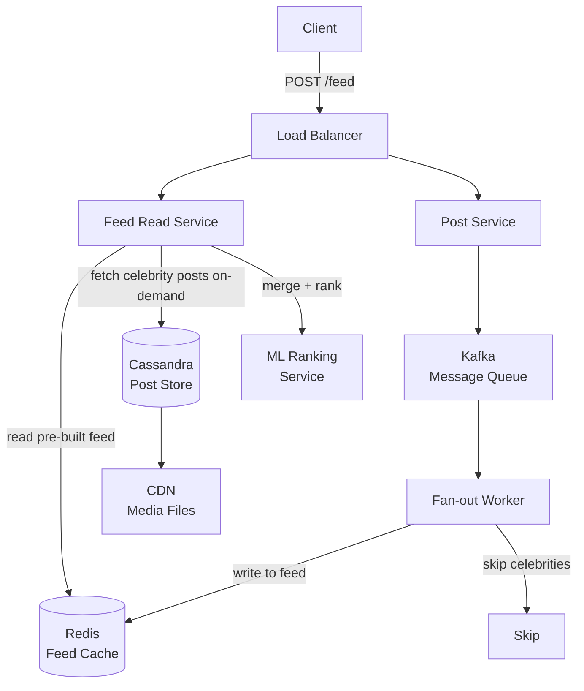
```mermaid
flowchart TD
    Client -->|POST /feed| LB[Load Balancer]
    LB --> PostService[Post Service]
    LB --> FeedService[Feed Read Service]

    PostService --> MQ[Kafka\nMessage Queue]
    MQ --> FanoutWorker[Fan-out Worker]
    FanoutWorker -->|write to feed| FeedCache[(Redis\nFeed Cache)]
    FanoutWorker -->|skip celebrities| Skip

    FeedService -->|read pre-built feed| FeedCache
    FeedService -->|fetch celebrity posts on-demand| PostDB[(Cassandra\nPost Store)]
    FeedService -->|merge + rank| RankingService[ML Ranking\nService]

    PostDB --> CDN[CDN\nMedia Files]
```

**Data Model (Cassandra):**
```
posts: (user_id, post_id, content, media_urls, created_at)
feed:  (user_id, post_id, score, seen)  — partition by user_id
```

**Scale Numbers:**
- 500M DAU, 100M posts/day
- Feed cache: Redis cluster, TTL 24h
- Ranking: offline ML model refreshed every 15 min

---

### 2. Design Messenger / WhatsApp

**Key Requirements:**
- 1:1 and group messaging (up to 256 members)
- Message delivery guarantees (at-least-once)
- Online presence indicators
- End-to-end encryption
- Message history sync across devices

**Architecture:**

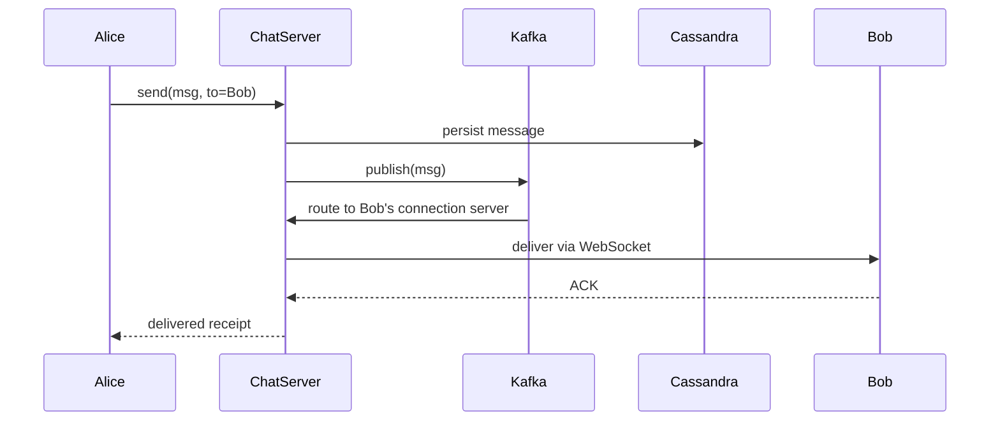
```mermaid
sequenceDiagram
    participant Alice
    participant ChatServer
    participant MQ as Kafka
    participant DB as Cassandra
    participant Bob

    Alice->>ChatServer: send(msg, to=Bob)
    ChatServer->>DB: persist message
    ChatServer->>MQ: publish(msg)
    MQ->>ChatServer: route to Bob's connection server
    ChatServer->>Bob: deliver via WebSocket
    Bob-->>ChatServer: ACK
    ChatServer-->>Alice: delivered receipt
```

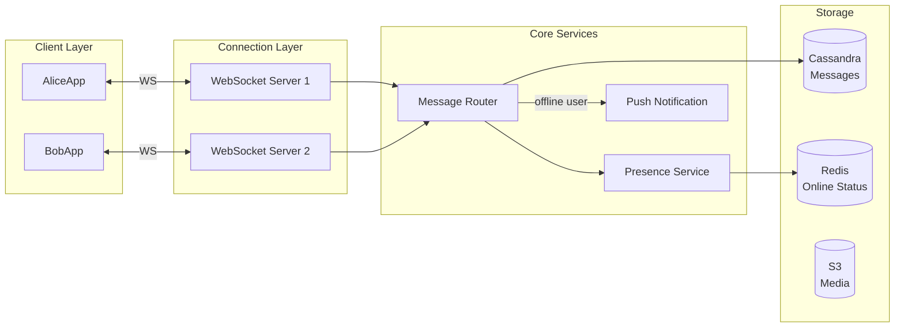
```mermaid
flowchart LR
    subgraph Client Layer
        AliceApp
        BobApp
    end
    subgraph Connection Layer
        WS1[WebSocket Server 1]
        WS2[WebSocket Server 2]
    end
    subgraph Core Services
        MsgRouter[Message Router]
        PresenceSvc[Presence Service]
        PushSvc[Push Notification]
    end
    subgraph Storage
        MsgDB[(Cassandra\nMessages)]
        PresenceCache[(Redis\nOnline Status)]
        MediaStore[(S3\nMedia)]
    end

    AliceApp <-->|WS| WS1
    BobApp <-->|WS| WS2
    WS1 --> MsgRouter
    WS2 --> MsgRouter
    MsgRouter --> MsgDB
    MsgRouter --> PresenceSvc
    PresenceSvc --> PresenceCache
    MsgRouter -->|offline user| PushSvc
```

**Key Design Points:**
- WebSocket for persistent connections; HTTP long-poll fallback
- Message ID = Snowflake (time-ordered, globally unique)
- Group messages: fanout per member at router level
- Offline delivery: push notification + pull on reconnect

---

### 3. Design Instagram Stories

**Key Requirements:**
- Stories expire after 24 hours
- Viewed-by list per story
- Sequential playback, multiple media per story
- ~500M stories/day

**Architecture:**

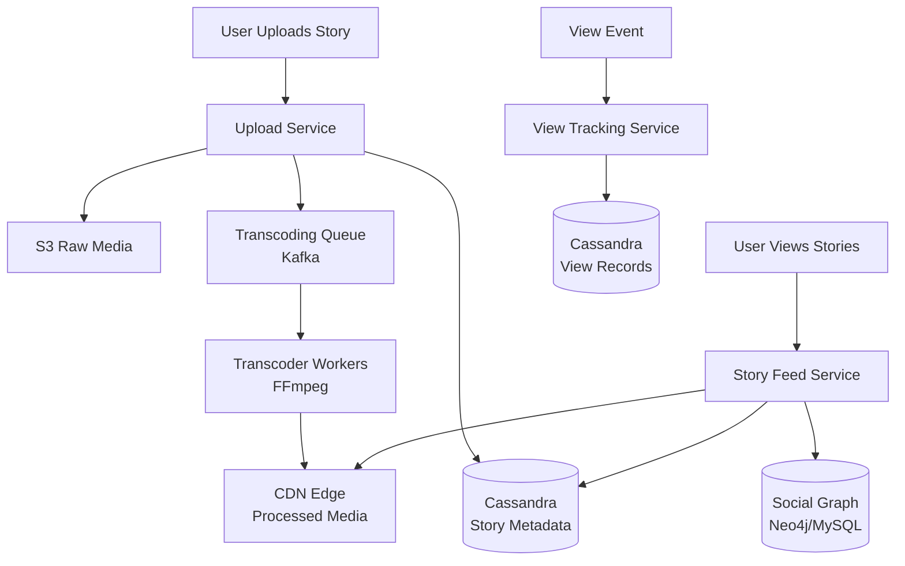
```mermaid
flowchart TD
    Upload[User Uploads Story] --> UploadSvc[Upload Service]
    UploadSvc --> S3[S3 Raw Media]
    UploadSvc --> TranscodeQ[Transcoding Queue\nKafka]
    TranscodeQ --> Transcoder[Transcoder Workers\nFFmpeg]
    Transcoder --> CDN[CDN Edge\nProcessed Media]
    UploadSvc --> StoryDB[(Cassandra\nStory Metadata)]

    ViewRequest[User Views Stories] --> FeedSvc[Story Feed Service]
    FeedSvc --> FollowGraph[(Social Graph\nNeo4j/MySQL)]
    FeedSvc --> StoryDB
    FeedSvc --> CDN

    ViewEvent[View Event] --> ViewTracker[View Tracking Service]
    ViewTracker --> ViewDB[(Cassandra\nView Records)]
```

**Expiry Strategy:**
- TTL column in Cassandra (86400s)
- Background job sweeps S3 + CDN purge after 24h
- Story IDs stored in Redis sorted set by expiry timestamp

---

### 4. Design Like / Comment System

**Key Requirements:**
- Like/unlike on posts, comments, reels
- Like count display (approximate ok)
- Comment threads (nested replies)
- Notifications on like/comment

**Architecture:**

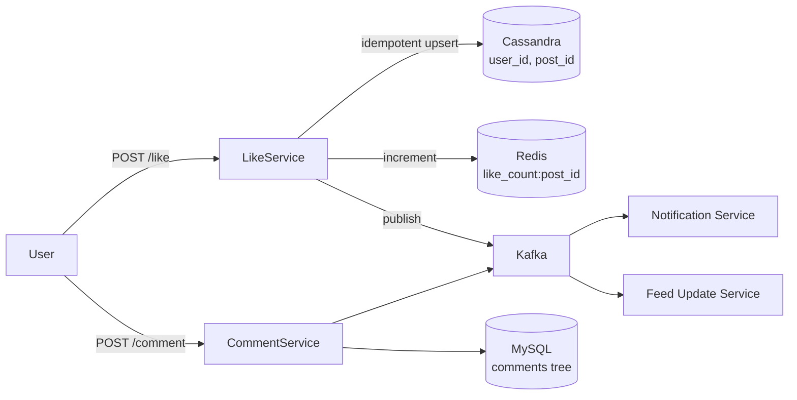
```mermaid
flowchart LR
    User -->|POST /like| LikeService
    User -->|POST /comment| CommentService

    LikeService -->|idempotent upsert| LikeDB[(Cassandra\nuser_id, post_id)]
    LikeService -->|increment| CountCache[(Redis\nlike_count:post_id)]
    LikeService -->|publish| EventBus[Kafka]

    CommentService --> CommentDB[(MySQL\ncomments tree)]
    CommentService --> EventBus

    EventBus --> NotifService[Notification Service]
    EventBus --> FeedService[Feed Update Service]
```

**Like Count at Scale:**
- Redis `INCR like_count:{post_id}` — O(1), ~99% reads served from cache
- Async write-back to Cassandra every 5 min
- HyperLogLog for unique likers count approximation

**Comment Data Model:**
```
comments(
  comment_id UUID PK,
  post_id    UUID,
  parent_id  UUID NULL,   -- NULL = top-level
  author_id  UUID,
  content    TEXT,
  created_at TIMESTAMP
)
index on (post_id, parent_id, created_at)
```

---

### 5. Design Live Streaming System

**Key Requirements:**
- Streamer broadcasts; millions watch concurrently
- Low latency (<5s), adaptive bitrate
- Chat alongside stream
- Recording/VOD after stream ends

**Architecture:**

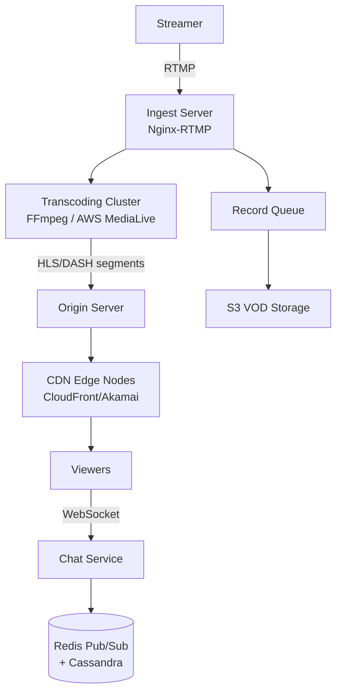
```mermaid
flowchart TD
    Streamer -->|RTMP| IngestServer[Ingest Server\nNginx-RTMP]
    IngestServer --> Transcoder[Transcoding Cluster\nFFmpeg / AWS MediaLive]
    Transcoder -->|HLS/DASH segments| OriginServer[Origin Server]
    OriginServer --> CDN[CDN Edge Nodes\nCloudFront/Akamai]
    CDN --> Viewers

    IngestServer --> RecordQ[Record Queue]
    RecordQ --> S3[S3 VOD Storage]

    Viewers -->|WebSocket| ChatService[Chat Service]
    ChatService --> ChatDB[(Redis Pub/Sub\n+ Cassandra)]
```

**Key Points:**
- Streamer pushes RTMP → ingest transcodes to multiple bitrates (360p/720p/1080p)
- HLS chunked into 2s segments, pushed to CDN
- Chat: Redis Pub/Sub per room, fan-out to WebSocket connections
- Viewer count: approximate with HyperLogLog in Redis

---

## Microsoft

### 6. Design Microsoft Teams / Chat System

**Key Requirements:**
- 1:1 and group channels (org-wide)
- Threaded messages, reactions, @mentions
- Real-time presence, typing indicators
- File sharing integration (OneDrive)
- Video/audio calls

**Architecture:**

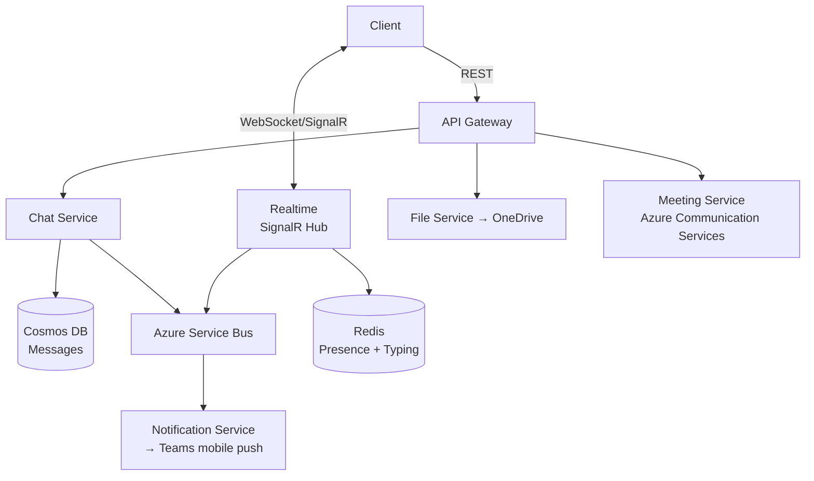
```mermaid
flowchart TD
    Client <-->|WebSocket/SignalR| RealtimeSvc[Realtime\nSignalR Hub]
    Client -->|REST| APISvc[API Gateway]

    APISvc --> ChatSvc[Chat Service]
    APISvc --> FileSvc[File Service → OneDrive]
    APISvc --> MeetingSvc[Meeting Service\nAzure Communication Services]

    ChatSvc --> MsgDB[(Cosmos DB\nMessages)]
    ChatSvc --> MQ[Azure Service Bus]
    MQ --> NotifSvc[Notification Service\n→ Teams mobile push]

    RealtimeSvc --> PresenceDB[(Redis\nPresence + Typing)]
    RealtimeSvc --> MQ
```

**Scale Decisions:**
- Azure Cosmos DB (multi-region, 99.999% SLA) for messages
- SignalR Service (managed) for WebSocket fan-out at scale
- Channel messages partitioned by `(team_id, channel_id)`
- Typing indicator: ephemeral, TTL 3s in Redis, never persisted

---

### 7. Design File Sharing System (OneDrive)

**Key Requirements:**
- Upload/download large files (up to 250GB)
- Sync across devices
- Version history
- Share with specific users or public link
- Conflict resolution on simultaneous edits

**Architecture:**

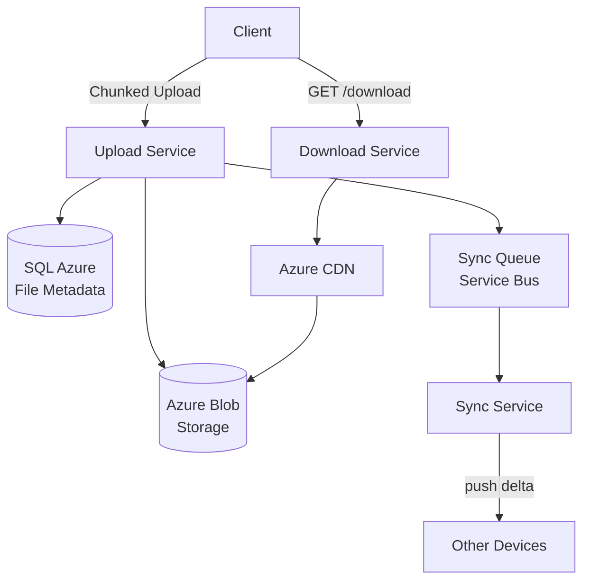
```mermaid
flowchart TD
    Client -->|Chunked Upload| UploadSvc[Upload Service]
    UploadSvc --> ChunkStore[(Azure Blob\nStorage)]
    UploadSvc --> MetaDB[(SQL Azure\nFile Metadata)]
    UploadSvc --> SyncQ[Sync Queue\nService Bus]

    SyncQ --> SyncSvc[Sync Service]
    SyncSvc -->|push delta| Client2[Other Devices]

    Client -->|GET /download| DownloadSvc[Download Service]
    DownloadSvc --> CDN[Azure CDN]
    CDN --> ChunkStore
```

**Chunking Strategy:**
- Client splits file into 4MB chunks, uploads in parallel
- Each chunk identified by SHA-256 hash (dedup)
- Server assembles chunks after all received
- Delta sync: only changed chunks retransmitted

**Conflict Resolution:**
- Last-write-wins with version vector
- Conflict file kept as `filename (conflicted copy).ext`

---

### 8. Design Parking Lot System (LLD-Heavy)

**Key Requirements:**
- Multiple floors, multiple spot types (compact, large, motorcycle)
- Entry/exit gates with ticket
- Fee calculation based on duration
- Spot availability tracking

**Class Design:**

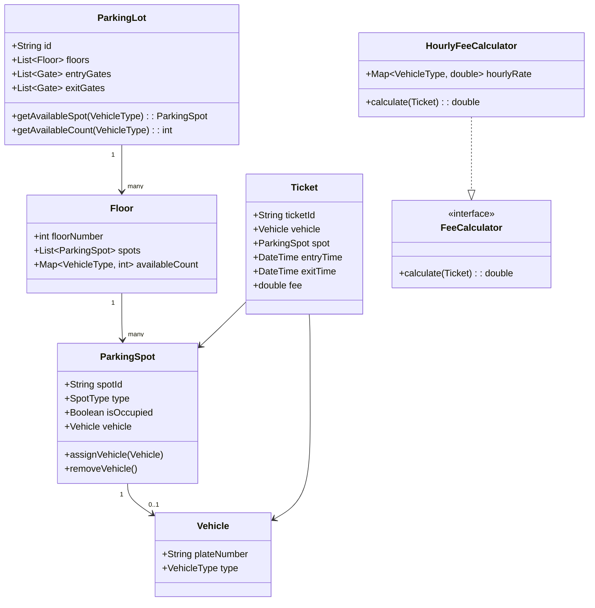
```mermaid
classDiagram
    class ParkingLot {
        +String id
        +List~Floor~ floors
        +List~Gate~ entryGates
        +List~Gate~ exitGates
        +getAvailableSpot(VehicleType): ParkingSpot
        +getAvailableCount(VehicleType): int
    }

    class Floor {
        +int floorNumber
        +List~ParkingSpot~ spots
        +Map~VehicleType, int~ availableCount
    }

    class ParkingSpot {
        +String spotId
        +SpotType type
        +Boolean isOccupied
        +Vehicle vehicle
        +assignVehicle(Vehicle)
        +removeVehicle()
    }

    class Ticket {
        +String ticketId
        +Vehicle vehicle
        +ParkingSpot spot
        +DateTime entryTime
        +DateTime exitTime
        +double fee
    }

    class FeeCalculator {
        <<interface>>
        +calculate(Ticket): double
    }

    class HourlyFeeCalculator {
        +Map~VehicleType, double~ hourlyRate
        +calculate(Ticket): double
    }

    class Vehicle {
        +String plateNumber
        +VehicleType type
    }

    ParkingLot "1" --> "many" Floor
    Floor "1" --> "many" ParkingSpot
    ParkingSpot "1" --> "0..1" Vehicle
    Ticket --> Vehicle
    Ticket --> ParkingSpot
    HourlyFeeCalculator ..|> FeeCalculator
```

**Key Design Patterns:**
- **Strategy** for fee calculation (hourly, flat-rate, special events)
- **Factory** for creating vehicle-type-appropriate spots
- **Observer** to notify display boards when spots change

---

### 9. Design Online Code Editor (VS Code Web)

**Key Requirements:**
- Real-time collaborative editing
- Syntax highlighting, IntelliSense
- Run/execute code in sandbox
- Git integration
- Terminal access

**Architecture:**

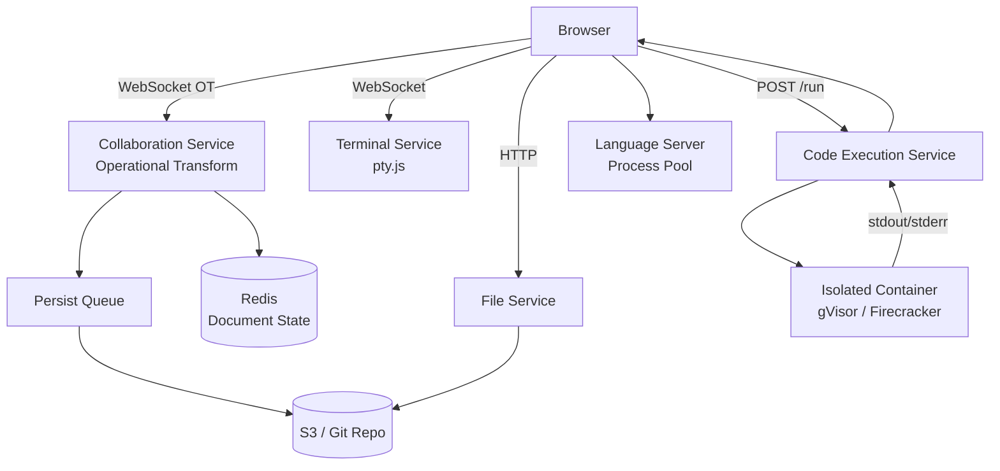
```mermaid
flowchart TD
    Browser -->|WebSocket OT| CollabSvc[Collaboration Service\nOperational Transform]
    Browser -->|HTTP| FileSvc[File Service]
    Browser -->|WebSocket| TermSvc[Terminal Service\npty.js]

    CollabSvc --> DocDB[(Redis\nDocument State)]
    CollabSvc --> PersistQ[Persist Queue]
    PersistQ --> FileStorage[(S3 / Git Repo)]

    FileSvc --> FileStorage

    Browser -->|POST /run| ExecutionSvc[Code Execution Service]
    ExecutionSvc --> Container[Isolated Container\ngVisor / Firecracker]
    Container -->|stdout/stderr| ExecutionSvc
    ExecutionSvc --> Browser

    Browser --> LSP[Language Server\nProcess Pool]
```

**Collaboration (CRDT / OT):**
- Yjs (CRDT) preferred over OT for simpler conflict-free merges
- Each keystroke = operation; ops broadcast via WebSocket
- Document state materialized from op log

**Execution Sandbox:**
- gVisor or Firecracker microVM for isolation
- 30s timeout, memory cap 512MB
- Ephemeral container per run, destroyed after

---

### 10. Design Distributed Logging System

**Key Requirements:**
- Ingest logs from thousands of services
- Real-time search and alerting
- Long-term retention (90 days hot, 1yr cold)
- Structured + unstructured logs

**Architecture:**

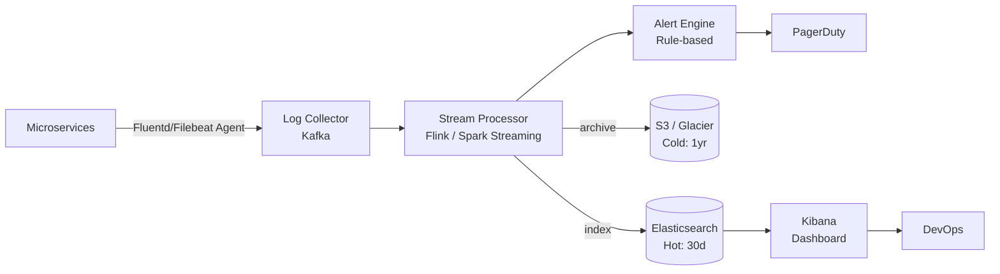
```mermaid
flowchart LR
    Services[Microservices] -->|Fluentd/Filebeat Agent| Collector[Log Collector\nKafka]
    Collector --> Processor[Stream Processor\nFlink / Spark Streaming]
    Processor -->|index| SearchStore[(Elasticsearch\nHot: 30d)]
    Processor -->|archive| ColdStore[(S3 / Glacier\nCold: 1yr)]
    Processor --> AlertEngine[Alert Engine\nRule-based]
    AlertEngine --> PagerDuty

    SearchStore --> Kibana[Kibana\nDashboard]
    Kibana --> DevOps
```

**Schema:**
```json
{
  "timestamp": "2026-07-06T10:00:00Z",
  "service": "payment-svc",
  "level": "ERROR",
  "trace_id": "abc123",
  "message": "Payment failed",
  "metadata": { "user_id": "u1", "amount": 99.99 }
}
```

**Key Decisions:**
- Kafka as durable buffer between agents and indexers
- Elasticsearch sharded by date (daily indices for easy TTL)
- Cold storage: Parquet on S3 + Athena for ad-hoc queries

---

## Amazon

### 11. Design Amazon Shopping Cart

**Key Requirements:**
- Add/remove/update items
- Persist across sessions and devices
- Pricing + promotions applied at checkout
- Handle inventory reservation

**Architecture:**

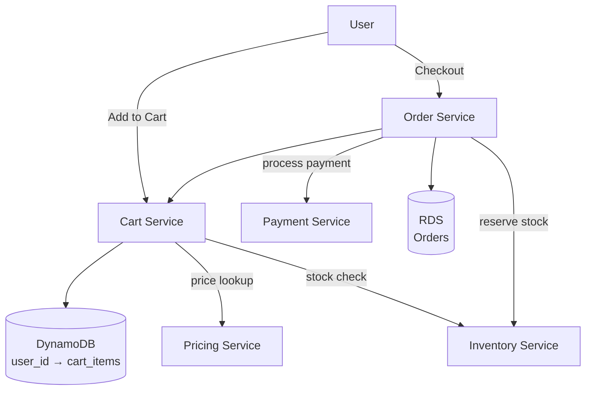
```mermaid
flowchart TD
    User -->|Add to Cart| CartSvc[Cart Service]
    CartSvc --> CartDB[(DynamoDB\nuser_id → cart_items)]
    CartSvc -->|price lookup| PricingSvc[Pricing Service]
    CartSvc -->|stock check| InventorySvc[Inventory Service]

    User -->|Checkout| OrderSvc[Order Service]
    OrderSvc --> CartSvc
    OrderSvc -->|reserve stock| InventorySvc
    OrderSvc -->|process payment| PaymentSvc[Payment Service]
    OrderSvc --> OrderDB[(RDS\nOrders)]
```

**Data Model (DynamoDB):**
```
PK: user_id
SK: item_id
Attributes: quantity, price_snapshot, added_at, seller_id
```

**Important Decisions:**
- Price is snapshotted at add-to-cart time, reconciled at checkout
- Cart is a soft reservation; hard reservation only at order placement
- Abandoned cart: TTL 30 days, triggers remarketing event via EventBridge

---

### 12. Design Amazon Order Management System

**Key Requirements:**
- Order lifecycle: placed → confirmed → shipped → delivered → returned
- Multiple sellers per order (split shipment)
- Inventory decrement on order, increment on return
- Order history, tracking

**Architecture:**

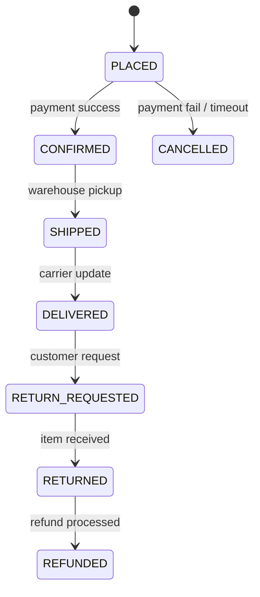
```mermaid
stateDiagram-v2
    [*] --> PLACED
    PLACED --> CONFIRMED : payment success
    PLACED --> CANCELLED : payment fail / timeout
    CONFIRMED --> SHIPPED : warehouse pickup
    SHIPPED --> DELIVERED : carrier update
    DELIVERED --> RETURN_REQUESTED : customer request
    RETURN_REQUESTED --> RETURNED : item received
    RETURNED --> REFUNDED : refund processed
```

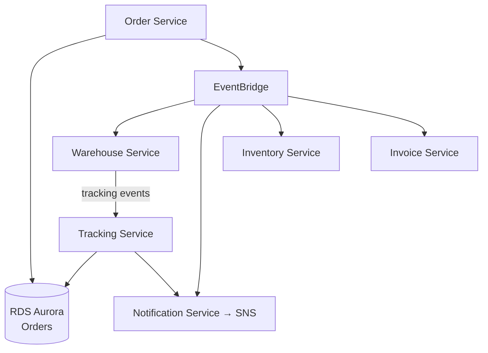
```mermaid
flowchart TD
    OrderSvc[Order Service] --> OrderDB[(RDS Aurora\nOrders)]
    OrderSvc --> EventBus[EventBridge]

    EventBus --> WarehouseSvc[Warehouse Service]
    EventBus --> NotifSvc[Notification Service → SNS]
    EventBus --> InventorySvc[Inventory Service]
    EventBus --> InvoiceSvc[Invoice Service]

    WarehouseSvc -->|tracking events| TrackingSvc[Tracking Service]
    TrackingSvc --> OrderDB
    TrackingSvc --> NotifSvc
```

---

### 13. Design Rate Limiter

**Key Requirements:**
- Limit requests per user/IP per time window
- Distributed (multiple API gateway nodes)
- Support multiple algorithms
- Low latency (<1ms overhead)

**Algorithms:**

| Algorithm | Pros | Cons |
|-----------|------|------|
| Fixed Window | Simple | Burst at window boundary |
| Sliding Window Log | Accurate | High memory |
| Sliding Window Counter | Memory efficient, smooth | Slight approximation |
| Token Bucket | Allows bursts | Complex distributed state |
| Leaky Bucket | Smooth output | No burst allowed |

**Architecture (Sliding Window Counter):**

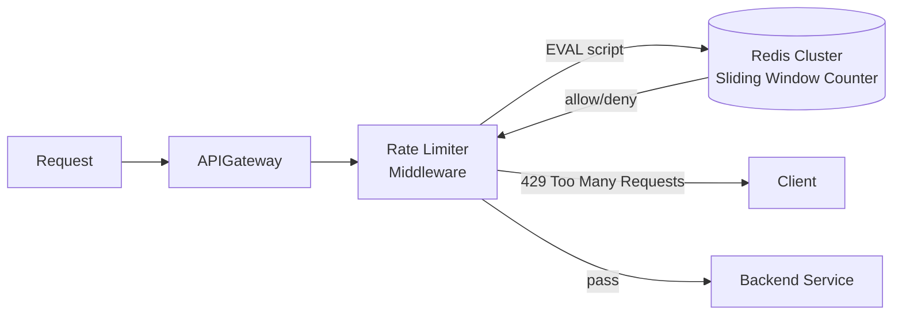
```mermaid
flowchart LR
    Request --> APIGateway
    APIGateway --> RateLimiter[Rate Limiter\nMiddleware]
    RateLimiter -->|EVAL script| Redis[(Redis Cluster\nSliding Window Counter)]
    Redis -->|allow/deny| RateLimiter
    RateLimiter -->|429 Too Many Requests| Client
    RateLimiter -->|pass| Upstream[Backend Service]
```

**Redis Lua Script (Atomic):**
```lua
local key = KEYS[1]
local now = tonumber(ARGV[1])
local window = tonumber(ARGV[2])
local limit = tonumber(ARGV[3])

-- Remove old entries
redis.call('ZREMRANGEBYSCORE', key, 0, now - window)
local count = redis.call('ZCARD', key)

if count < limit then
  redis.call('ZADD', key, now, now)
  redis.call('EXPIRE', key, window)
  return 1  -- allowed
else
  return 0  -- denied
end
```

---

### 14. Design Notification System (SMS / Email)

**Key Requirements:**
- Multi-channel: SMS, Email, Push, In-app
- Priority queues (OTP vs marketing)
- Retry with backoff on failures
- Template management
- Delivery tracking

**Architecture:**

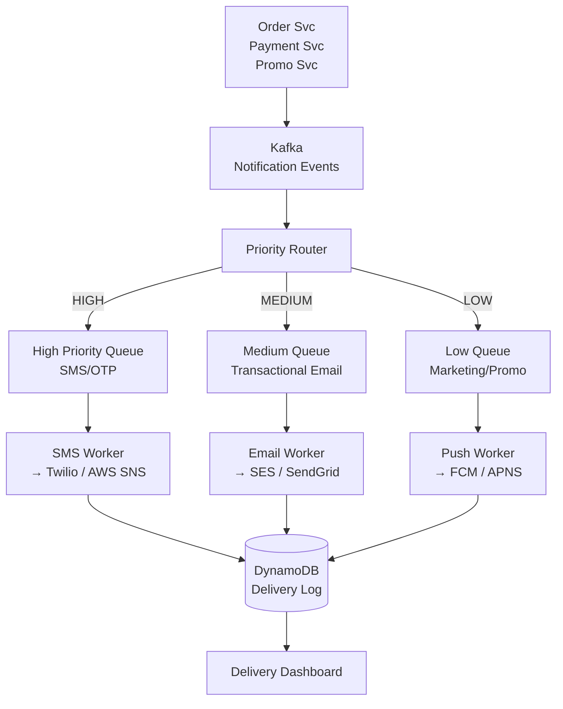
```mermaid
flowchart TD
    Publishers[Order Svc\nPayment Svc\nPromo Svc] --> EventBus[Kafka\nNotification Events]

    EventBus --> PriorityRouter[Priority Router]
    PriorityRouter -->|HIGH| HighQ[High Priority Queue\nSMS/OTP]
    PriorityRouter -->|MEDIUM| MedQ[Medium Queue\nTransactional Email]
    PriorityRouter -->|LOW| LowQ[Low Queue\nMarketing/Promo]

    HighQ --> SMSWorker[SMS Worker\n→ Twilio / AWS SNS]
    MedQ --> EmailWorker[Email Worker\n→ SES / SendGrid]
    LowQ --> PushWorker[Push Worker\n→ FCM / APNS]

    SMSWorker --> DeliveryDB[(DynamoDB\nDelivery Log)]
    EmailWorker --> DeliveryDB
    PushWorker --> DeliveryDB

    DeliveryDB --> Dashboard[Delivery Dashboard]
```

**Retry Strategy:**
- Exponential backoff: 1s → 2s → 4s → 8s (max 5 retries)
- Dead Letter Queue after max retries
- Idempotency key prevents duplicate sends

---

### 15. Design Amazon Locker System

**Key Requirements:**
- Assign lockers to orders at delivery
- Generate access code, send to customer
- Locker sizes: small, medium, large
- Auto-expire if not picked up in 3 days
- Integration with delivery agents

**LLD Class Design:**

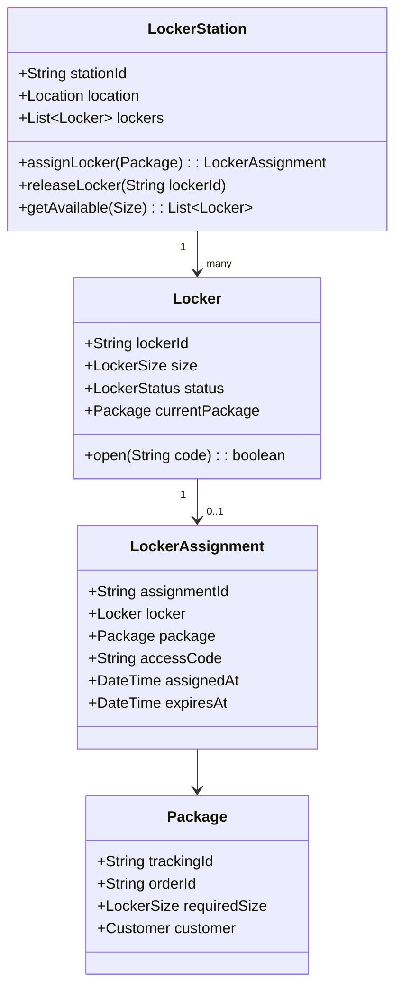
```mermaid
classDiagram
    class LockerStation {
        +String stationId
        +Location location
        +List~Locker~ lockers
        +assignLocker(Package): LockerAssignment
        +releaseLocker(String lockerId)
        +getAvailable(Size): List~Locker~
    }

    class Locker {
        +String lockerId
        +LockerSize size
        +LockerStatus status
        +Package currentPackage
        +open(String code): boolean
    }

    class LockerAssignment {
        +String assignmentId
        +Locker locker
        +Package package
        +String accessCode
        +DateTime assignedAt
        +DateTime expiresAt
    }

    class Package {
        +String trackingId
        +String orderId
        +LockerSize requiredSize
        +Customer customer
    }

    LockerStation "1" --> "many" Locker
    Locker "1" --> "0..1" LockerAssignment
    LockerAssignment --> Package
```

**System Flow:**

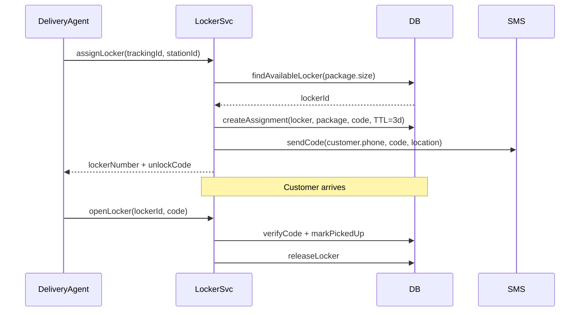
```mermaid
sequenceDiagram
    participant DeliveryAgent
    participant LockerSvc
    participant DB
    participant SMS

    DeliveryAgent->>LockerSvc: assignLocker(trackingId, stationId)
    LockerSvc->>DB: findAvailableLocker(package.size)
    DB-->>LockerSvc: lockerId
    LockerSvc->>DB: createAssignment(locker, package, code, TTL=3d)
    LockerSvc->>SMS: sendCode(customer.phone, code, location)
    LockerSvc-->>DeliveryAgent: lockerNumber + unlockCode

    Note over LockerSvc,DB: Customer arrives
    DeliveryAgent->>LockerSvc: openLocker(lockerId, code)
    LockerSvc->>DB: verifyCode + markPickedUp
    LockerSvc->>DB: releaseLocker
```

---

## Google

### 16. Design Google Drive

**Key Requirements:**
- Store/sync files and folders up to 15GB free
- Share with permissions (viewer/editor/owner)
- Offline access, conflict resolution
- File versioning

**Architecture:**

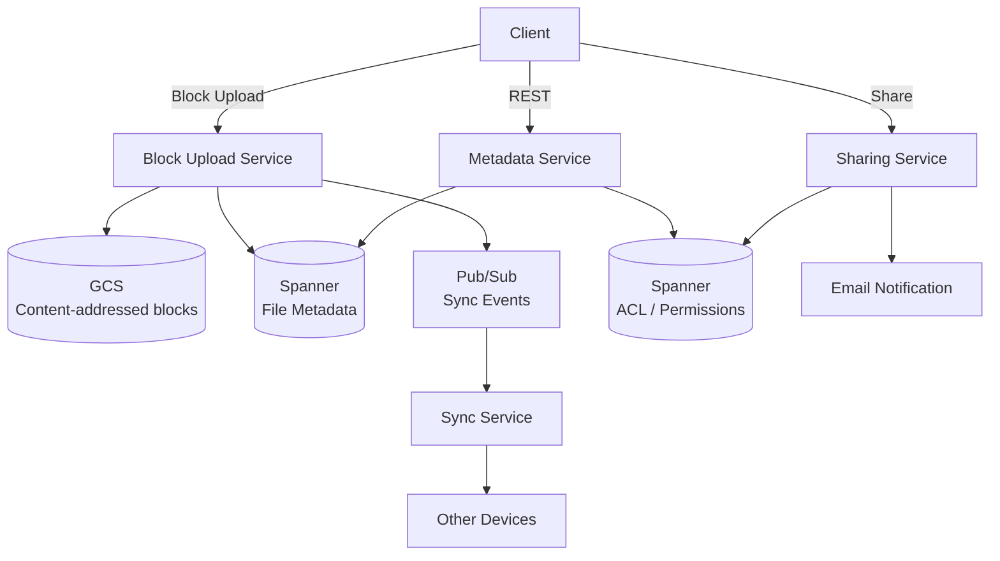
```mermaid
flowchart TD
    Client -->|Block Upload| BlockSvc[Block Upload Service]
    BlockSvc --> BlockStore[(GCS\nContent-addressed blocks)]
    BlockSvc --> MetaDB[(Spanner\nFile Metadata)]
    BlockSvc --> SyncQ[Pub/Sub\nSync Events]

    SyncQ --> SyncSvc[Sync Service]
    SyncSvc --> Client2[Other Devices]

    Client -->|REST| MetaSvc[Metadata Service]
    MetaSvc --> MetaDB
    MetaSvc --> PermDB[(Spanner\nACL / Permissions)]

    Client -->|Share| ShareSvc[Sharing Service]
    ShareSvc --> PermDB
    ShareSvc --> EmailSvc[Email Notification]
```

**Block-based Storage:**
- Files split into 256KB blocks, hashed (SHA-256)
- Only changed blocks uploaded on update (dedup + bandwidth savings)
- Metadata tree: folder hierarchy stored in Spanner

**Permissions Model:**
```
permissions(file_id, user_id, role: OWNER|EDITOR|VIEWER, inherited: bool)
```

---

### 17. Design YouTube Video Streaming System

**Key Requirements:**
- Upload videos (up to 128GB)
- Transcode to multiple resolutions
- Adaptive bitrate streaming (ABR)
- Recommendations, search
- Comments, likes

**Architecture:**

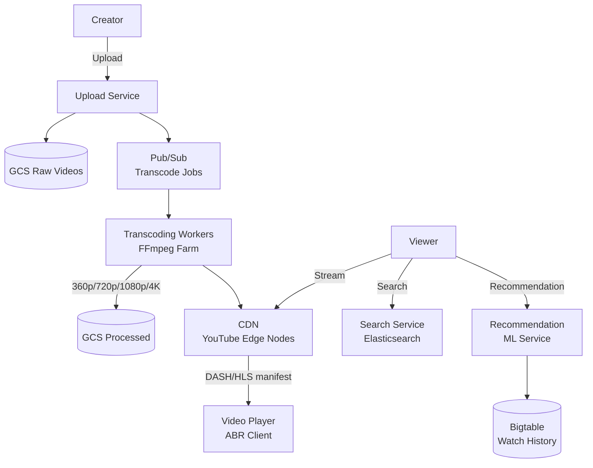
```mermaid
flowchart TD
    Creator -->|Upload| UploadSvc[Upload Service]
    UploadSvc --> RawStore[(GCS Raw Videos)]
    UploadSvc --> TranscodeQ[Pub/Sub\nTranscode Jobs]

    TranscodeQ --> TranscodeWorkers[Transcoding Workers\nFFmpeg Farm]
    TranscodeWorkers -->|360p/720p/1080p/4K| ProcessedStore[(GCS Processed)]
    TranscodeWorkers --> CDN[CDN\nYouTube Edge Nodes]

    Viewer -->|Search| SearchSvc[Search Service\nElasticsearch]
    Viewer -->|Stream| CDN
    CDN -->|DASH/HLS manifest| Player[Video Player\nABR Client]

    Viewer -->|Recommendation| RecoSvc[Recommendation\nML Service]
    RecoSvc --> WatchHistory[(Bigtable\nWatch History)]
```

**Adaptive Bitrate:**
- Player monitors bandwidth, requests appropriate quality segment
- DASH manifest lists all available resolutions + chunk URLs
- CDN serves pre-transcoded chunks, no server-side computation

---

### 18. Design Google Maps (Navigation + Routing)

**Key Requirements:**
- Map tile serving
- Shortest path routing (ETA)
- Real-time traffic
- Turn-by-turn navigation
- POI search

**Architecture:**

```mermaid
flowchart TD
    MobileApp -->|tile request| TileSvc[Tile Service]
    TileSvc --> TileCache[(CDN + Redis\nTile Cache)]
    TileCache --> TileStore[(GCS\nPre-rendered Tiles)]

    MobileApp -->|GET /route| RouteSvc[Routing Service]
    RouteSvc --> GraphDB[(Road Graph\nCustom Graph Store)]
    RouteSvc --> TrafficSvc[Traffic Service]
    TrafficSvc --> TrafficDB[(Bigtable\nReal-time Traffic)]

    DriversPhones -->|GPS probes| TrafficIngestion[Traffic Ingestion\nKafka]
    TrafficIngestion --> TrafficProcessor[Stream Processor\nFlink]
    TrafficProcessor --> TrafficDB
```

**Routing Algorithm:**
- Road network = weighted directed graph (edge weight = travel time)
- Dijkstra too slow for continent-scale → use **A\*** with heuristic
- **Contraction Hierarchies** for real-world scale (pre-process graph, query in ms)
- Traffic adjusts edge weights dynamically

**Map Tiles:**
- World divided into tiles at zoom levels 0–22
- Pre-rendered as PNG/WebP, cached aggressively at CDN
- Vector tiles (Mapbox format) allow client-side rendering and theming

---

### 19. Design Search Autocomplete (Google Suggest)

**Key Requirements:**
- Return top-K suggestions as user types
- Low latency (<100ms)
- Personalized + global trending
- Handle 100K QPS

**Architecture:**

```mermaid
flowchart LR
    User -->|keystroke| Client
    Client -->|GET /suggest?q=abc| AutocompleteSvc

    AutocompleteSvc --> Cache[(Redis\nPrefix Cache)]
    Cache -->|miss| TrieService[Trie Service]
    TrieService --> TrieStore[(In-memory Trie\nper prefix shard)]

    SearchLogs[Search Logs\nKafka] --> AggJob[Aggregation Job\nSpark - hourly]
    AggJob --> FreqDB[(MySQL\nquery frequency)]
    FreqDB --> TrieService

    AutocompleteSvc --> PersonalSvc[Personalization\nService]
    PersonalSvc --> UserHistory[(Bigtable\nSearch History)]
```

**Trie Design:**
- Trie node stores top-K (e.g., 10) completions by frequency
- Sharded by first 2 chars of prefix
- Rebuilt from aggregated search logs every 1h
- Redis caches results for hot prefixes (TTL 60s)

---

### 20. Design Distributed Cache (Memcached / Redis)

**Key Requirements:**
- Key-value store, sub-millisecond reads
- Horizontal scaling (consistent hashing)
- Eviction policies (LRU, LFU)
- Cache-aside, write-through, write-back patterns

**Architecture:**

```mermaid
flowchart TD
    App[Application] -->|GET key| CacheCluster[Cache Cluster\nConsistent Hash Ring]
    CacheCluster -->|hit| App
    CacheCluster -->|miss| App
    App -->|miss: read| DB[(Database)]
    DB --> App
    App -->|SET key, value, TTL| CacheCluster

    subgraph Cache Cluster
        Node1[Node 1\n0–90°]
        Node2[Node 2\n90–180°]
        Node3[Node 3\n180–270°]
        Node4[Node 4\n270–360°]
    end
```

**Consistent Hashing:**
- Hash ring 0–2^32; each node owns a range
- Virtual nodes (150+ per physical node) for even distribution
- On node add/remove: only 1/N keys remapped

**Eviction Policies:**
| Policy | When to Use |
|--------|-------------|
| LRU | General workloads |
| LFU | Skewed access (viral content) |
| TTL-based | Session data, rate limit counters |

**Cache Patterns:**
- **Cache-aside**: app reads cache, on miss reads DB + populates cache
- **Write-through**: write to cache + DB synchronously (consistency)
- **Write-back**: write to cache, async flush to DB (performance, risk of loss)
- **Read-through**: cache fetches from DB on miss transparently

---

## Quick Reference: System Design Framework

```
1. Clarify Requirements (5 min)
   - Functional: what must it do?
   - Non-functional: scale, latency, availability, consistency

2. Estimate Scale (2 min)
   - DAU, QPS (read/write ratio), data size/day, storage

3. High-Level Design (10 min)
   - Client → LB → Services → DB
   - Identify main flows

4. Deep Dive (15 min)
   - Bottlenecks, DB schema, algorithms
   - Caching strategy, async processing

5. Wrap-up (3 min)
   - Failure modes, monitoring, future scale
```
