# 8 Fundamental AI Engineering Topics (Python)

---

## Table of Contents

1. [LLM APIs and Prompt Design](#1-llm-apis-and-prompt-design)
2. [RAG — Retrieval Augmented Generation](#2-rag--retrieval-augmented-generation)
3. [Embedding and Vector DB](#3-embedding-and-vector-db)
4. [Agent Orchestration](#4-agent-orchestration)
5. [Evaluation and Observability](#5-evaluation-and-observability)
6. [Guardrails and Output Validation](#6-guardrails-and-output-validation)
7. [Context Window Management](#7-context-window-management)
8. [Fine-tune vs Prompt Trade-off](#8-fine-tune-vs-prompt-trade-off)

---

## 1. LLM APIs and Prompt Design

### Overview

LLM APIs expose large language models as HTTP services accepting structured message arrays and returning generated text. Effective prompt design shapes model behavior through system instructions, few-shot examples, and message role orchestration. Production systems must handle token budgets, rate limits, retry logic, caching, and cost optimization to operate reliably at scale.

### Architecture Diagram

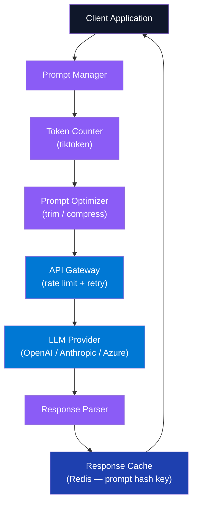

### Request Flow — Cache + Retry

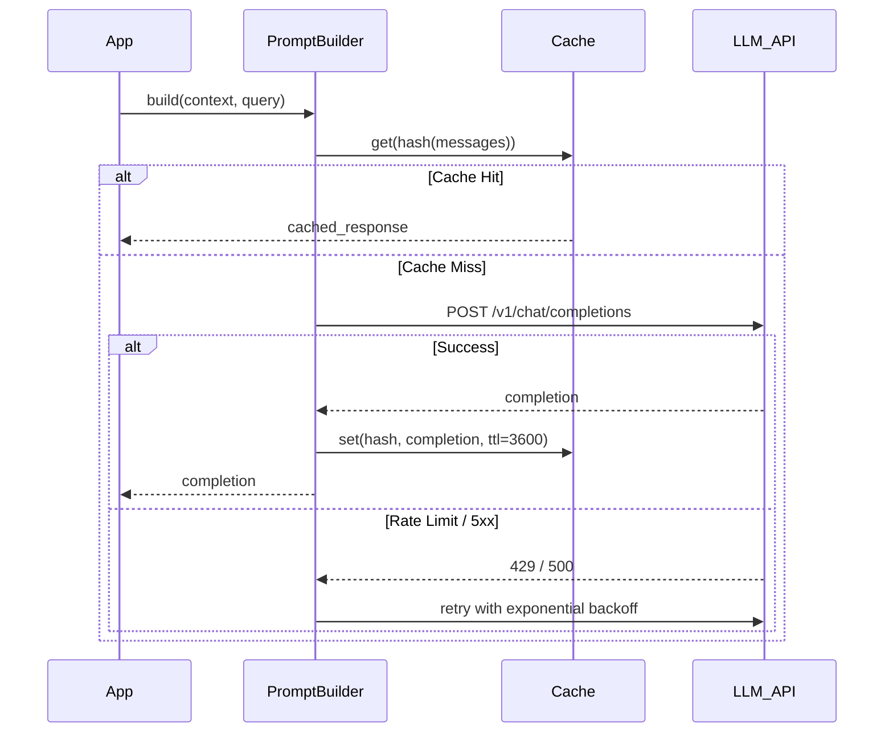

### Component 1 — Prompt Builder

```python
from dataclasses import dataclass, field
from typing import Literal
import tiktoken
import openai

MessageRole = Literal["system", "user", "assistant"]

@dataclass
class Message:
    role: MessageRole
    content: str

@dataclass
class PromptBuilder:
    model: str = "gpt-4o"
    max_context_tokens: int = 8192
    _messages: list[Message] = field(default_factory=list)

    def system(self, content: str) -> "PromptBuilder":
        self._messages = [m for m in self._messages if m.role != "system"]
        self._messages.insert(0, Message("system", content))
        return self

    def user(self, content: str) -> "PromptBuilder":
        self._messages.append(Message("user", content))
        return self

    def assistant(self, content: str) -> "PromptBuilder":
        self._messages.append(Message("assistant", content))
        return self

    def count_tokens(self) -> int:
        enc = tiktoken.encoding_for_model(self.model)
        return sum(len(enc.encode(m.content)) + 4 for m in self._messages)

    def fits_context(self) -> bool:
        return self.count_tokens() <= self.max_context_tokens

    def build(self) -> list[dict]:
        return [{"role": m.role, "content": m.content} for m in self._messages]


async def call_llm(builder: PromptBuilder, temperature: float = 0.0) -> str:
    client = openai.AsyncOpenAI()
    response = await client.chat.completions.create(
        model=builder.model,
        messages=builder.build(),
        temperature=temperature,
    )
    return response.choices[0].message.content
```

### Component 2 — Prompt Patterns

```python
# Chain-of-thought
COT_SYSTEM = """Think step-by-step before answering.
Format:
<thinking>reasoning here</thinking>
<answer>final answer here</answer>"""

# Few-shot example injection
def build_few_shot_prompt(examples: list[dict], query: str) -> str:
    shots = "\n".join(f"Q: {ex['q']}\nA: {ex['a']}" for ex in examples)
    return f"{shots}\nQ: {query}\nA:"

# Structured output via JSON mode
async def extract_structured(text: str) -> dict:
    import json
    client = openai.AsyncOpenAI()
    resp = await client.chat.completions.create(
        model="gpt-4o",
        messages=[
            {"role": "system", "content": "Extract entities as JSON: {name, type, date}"},
            {"role": "user", "content": text}
        ],
        response_format={"type": "json_object"}
    )
    return json.loads(resp.choices[0].message.content)
```

### Component 3 — Retry with Tenacity

```python
from tenacity import retry, stop_after_attempt, wait_exponential, retry_if_exception_type
import openai

@retry(
    retry=retry_if_exception_type((openai.RateLimitError, openai.APIStatusError)),
    wait=wait_exponential(multiplier=1, min=2, max=60),
    stop=stop_after_attempt(5)
)
async def resilient_llm_call(messages: list[dict], model: str = "gpt-4o") -> str:
    client = openai.AsyncOpenAI()
    response = await client.chat.completions.create(
        model=model, messages=messages, temperature=0
    )
    return response.choices[0].message.content
```

### Interview Talking Points

| Question | Answer |
|---|---|
| What is the difference between system, user, and assistant roles? | System sets behavioral constraints (persona, format, rules). User is the human turn. Assistant is a prior model response — used to inject few-shot examples or continue multi-turn dialogue. |
| How do you reduce hallucination in LLM responses? | Use grounding (RAG), lower temperature (0.0–0.3), request citations, enable JSON mode for structured output, validate claims against retrieved context. |
| What is temperature and when do you set it to 0? | Temperature controls randomness in token sampling. 0 = greedy/deterministic — best for fact retrieval, classification, code generation. 0.7–1.0 for creative tasks. |
| How do you handle token limits in production? | Count tokens before the API call with tiktoken, truncate older context, compress with summarization, split long documents into chunks, cache repeated system prompts. |
| What is prompt injection and how do you defend against it? | Attacker embeds adversarial instructions in user input. Defenses: regex pattern detection, instructional separation (wrap user input in XML tags), output validation. |
| What is the difference between zero-shot, one-shot, and few-shot prompting? | Zero-shot: no examples, relies on pre-training. One-shot: 1 example to steer format. Few-shot: 2–10 examples — strongest signal for output style and task-specific reasoning. |
| When should you use streaming vs. non-streaming? | Streaming for chat UIs (perceived responsiveness via token-by-token display). Non-streaming for batch processing where you need the full response before acting on it. |

---

## 2. RAG — Retrieval Augmented Generation

### Overview

RAG augments LLM generation by retrieving relevant documents from a knowledge base and injecting them as grounding context before the model answers. This eliminates hallucinations on domain-specific facts without expensive fine-tuning. Production RAG has two distinct phases: offline indexing (chunk → embed → store) and online retrieval (query → embed → ANN search → re-rank → generate).

### Architecture Diagram

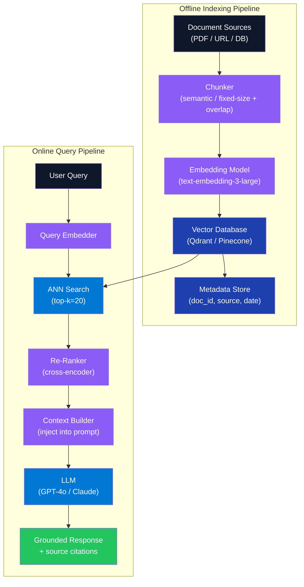

### Query Flow Sequence

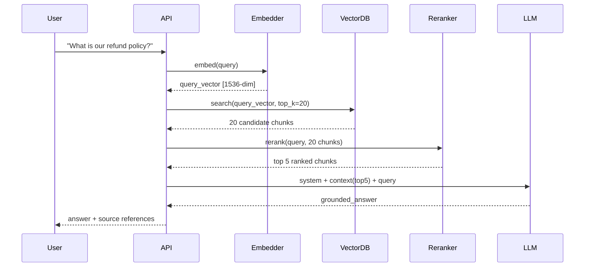

### Component 1 — Indexing Pipeline

```python
from langchain.text_splitter import RecursiveCharacterTextSplitter
from langchain_openai import OpenAIEmbeddings
from qdrant_client import QdrantClient
from qdrant_client.models import Distance, VectorParams, PointStruct
import uuid

def index_documents(texts: list[str], metadata: list[dict], collection: str) -> None:
    splitter = RecursiveCharacterTextSplitter(
        chunk_size=512,
        chunk_overlap=64,
        separators=["\n\n", "\n", ".", " "]
    )
    embedder = OpenAIEmbeddings(model="text-embedding-3-large")
    client = QdrantClient(url="http://localhost:6333")

    client.recreate_collection(
        collection_name=collection,
        vectors_config=VectorParams(size=3072, distance=Distance.COSINE)
    )

    for i, text in enumerate(texts):
        chunks = splitter.split_text(text)
        vectors = embedder.embed_documents(chunks)
        points = [
            PointStruct(
                id=str(uuid.uuid4()),
                vector=v,
                payload={"text": c, "chunk_index": j, **metadata[i]}
            )
            for j, (c, v) in enumerate(zip(chunks, vectors))
        ]
        client.upsert(collection_name=collection, points=points)
```

### Component 2 — RAG Query Chain

```python
from langchain_openai import ChatOpenAI
from langchain.prompts import ChatPromptTemplate
from langchain.schema.runnable import RunnablePassthrough
from langchain.schema.output_parser import StrOutputParser
from langchain_community.vectorstores import Qdrant

RAG_PROMPT = ChatPromptTemplate.from_template("""
You are a helpful assistant. Answer based ONLY on the context below.
If the answer is not in the context, say "I don't have that information."

Context:
{context}

Question: {question}
""")

def build_rag_chain(vectorstore: Qdrant):
    retriever = vectorstore.as_retriever(
        search_type="mmr",        # Maximal Marginal Relevance — avoids duplicate chunks
        search_kwargs={"k": 5, "fetch_k": 20}
    )
    llm = ChatOpenAI(model="gpt-4o", temperature=0)

    return (
        {"context": retriever, "question": RunnablePassthrough()}
        | RAG_PROMPT
        | llm
        | StrOutputParser()
    )
```

### Component 3 — Hybrid Search (Dense + Sparse)

```python
from qdrant_client.models import SparseVector, Prefetch, FusionQuery, Fusion

def hybrid_search(
    client: QdrantClient,
    collection: str,
    dense_vec: list[float],
    sparse_indices: list[int],
    sparse_values: list[float],
    top_k: int = 5,
) -> list:
    return client.query_points(
        collection_name=collection,
        prefetch=[
            Prefetch(query=dense_vec, using="dense", limit=20),
            Prefetch(
                query=SparseVector(indices=sparse_indices, values=sparse_values),
                using="sparse",
                limit=20
            ),
        ],
        query=FusionQuery(fusion=Fusion.RRF),  # Reciprocal Rank Fusion
        limit=top_k,
    ).points
```

### Interview Talking Points

| Question | Answer |
|---|---|
| What is the difference between RAG and fine-tuning? | RAG injects external knowledge at inference time — no training cost, always fresh. Fine-tuning bakes knowledge into weights — faster inference but stale after training cutoff and expensive to update. |
| What chunk size do you recommend? | 256–512 tokens for precision tasks, 512–1024 for broader context. Always overlap by 10–15% (64–128 tokens). Smaller chunks improve retrieval precision; larger chunks preserve more surrounding context. |
| What is MMR (Maximal Marginal Relevance)? | Retrieval strategy balancing relevance to the query against diversity among retrieved chunks. Prevents returning five near-identical paragraphs by penalizing similarity to already-selected chunks. |
| How does hybrid search improve RAG? | Combines dense (semantic, embedding-based) with sparse (keyword, BM25) search. RRF fusion merges ranked lists. Catches exact-keyword matches — product codes, names, acronyms — that semantic search misses. |
| What is the "lost in the middle" problem? | LLMs recall information better from the start and end of context than the middle. Mitigation: reorder retrieved chunks so the most relevant appear first and last. |
| How do you evaluate a RAG pipeline? | RAGAS metrics: Faithfulness (answer grounded in context?), Answer Relevancy, Context Precision, Context Recall. Track latency, cost per query, and retrieval hit rate. |
| How do you handle multi-hop questions? | Agentic RAG: LLM generates sub-queries iteratively, retrieves for each, then synthesizes. LangGraph supports this as a stateful retrieval loop. |

---

## 3. Embedding and Vector DB

### Overview

Embeddings are dense numerical vectors encoding semantic meaning, enabling similarity search on unstructured text. Vector databases store and index these high-dimensional vectors using approximate nearest neighbor (ANN) algorithms — HNSW, IVF-PQ — trading exact recall for sub-millisecond query latency. Choosing embedding model dimensions, distance metric, and index configuration directly determines RAG retrieval quality and cost.

### Architecture Diagram

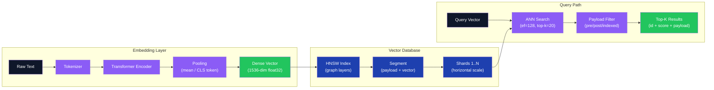

### HNSW Index Lifecycle

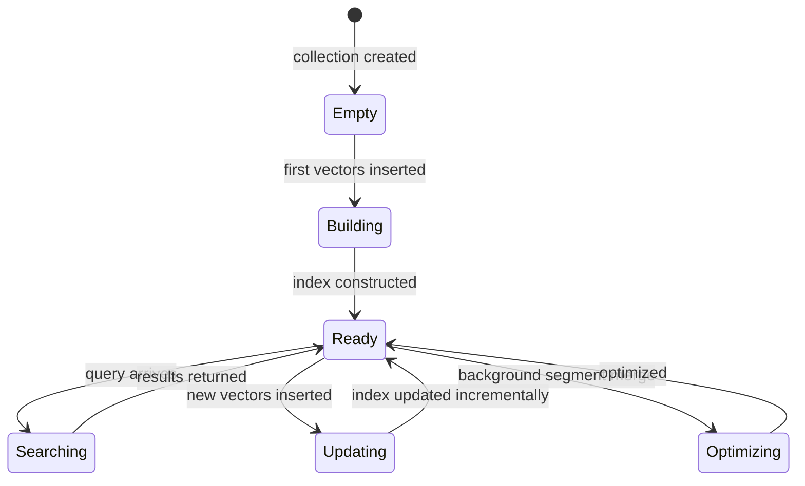

### Component 1 — Embedding Generation

```python
from openai import AsyncOpenAI
import numpy as np

async def embed_texts(
    texts: list[str],
    model: str = "text-embedding-3-large",
    dimensions: int = 1536,
) -> np.ndarray:
    client = AsyncOpenAI()
    response = await client.embeddings.create(
        input=texts,
        model=model,
        dimensions=dimensions,   # Matryoshka: 256/512/1024/1536/3072
    )
    return np.array([item.embedding for item in response.data], dtype=np.float32)


def cosine_similarity(a: np.ndarray, b: np.ndarray) -> float:
    return float(np.dot(a, b) / (np.linalg.norm(a) * np.linalg.norm(b)))
```

### Component 2 — Vector DB CRUD (Qdrant)

```python
from qdrant_client import AsyncQdrantClient
from qdrant_client.models import (
    Distance, VectorParams, PointStruct, Filter, FieldCondition, MatchValue
)
import uuid

client = AsyncQdrantClient(url="http://localhost:6333")

async def upsert_vectors(
    collection: str,
    texts: list[str],
    vectors: np.ndarray,
    metadata: list[dict],
) -> None:
    points = [
        PointStruct(
            id=str(uuid.uuid4()),
            vector=vectors[i].tolist(),
            payload={"text": texts[i], **metadata[i]},
        )
        for i in range(len(texts))
    ]
    await client.upsert(collection_name=collection, points=points)


async def filtered_search(
    collection: str,
    query_vec: list[float],
    filter_key: str,
    filter_val: str,
    top_k: int = 5,
) -> list:
    return await client.search(
        collection_name=collection,
        query_vector=query_vec,
        query_filter=Filter(
            must=[FieldCondition(key=filter_key, match=MatchValue(value=filter_val))]
        ),
        limit=top_k,
        with_payload=True,
    )
```

### Component 3 — Embedding Model Comparison

```python
# Matryoshka embeddings — truncate dimensions without retraining
from openai import OpenAI

def get_matryoshka_embedding(text: str, dimensions: int = 256) -> list[float]:
    """text-embedding-3-* supports Matryoshka: smaller dims = faster, cheaper storage"""
    client = OpenAI()
    return client.embeddings.create(
        input=text,
        model="text-embedding-3-large",
        dimensions=dimensions,  # 256 for speed, 3072 for max quality
    ).data[0].embedding
```

| Model | Dims | MTEB Score | Cost / 1M tokens |
|---|---|---|---|
| `text-embedding-3-large` | 3072 | 64.6 | $0.13 |
| `text-embedding-3-small` | 1536 | 62.3 | $0.02 |
| `text-embedding-ada-002` | 1536 | 61.0 | $0.10 |
| `multilingual-e5-large` | 1024 | 58.9 | self-hosted |

### Interview Talking Points

| Question | Answer |
|---|---|
| What is HNSW and why is it used in vector DBs? | Hierarchical Navigable Small World — graph-based ANN index navigating from sparse (long-range) to dense (short-range) layers. O(log n) search. Default in Qdrant, Weaviate, Pinecone. |
| How do you choose embedding dimensions? | Larger = more semantic capacity but slower and costlier storage. Use Matryoshka embeddings to downscale to 256–512 for speed with minimal quality loss on your specific domain. |
| What is the difference between cosine similarity and dot product? | Cosine normalizes magnitude — good for text where length varies. Dot product rewards high-magnitude vectors — useful when magnitude encodes confidence. Cosine is standard for RAG. |
| How do you scale a vector DB to billions of vectors? | Horizontal sharding across nodes, IVF coarse quantization, Product Quantization (PQ) for memory compression. Qdrant and Weaviate support distributed mode natively. |
| What metadata filtering strategies exist? | Pre-filtering (filter before ANN — fast but can hurt recall), post-filtering (accurate but wasteful), payload-indexed (Qdrant native — filter during graph traversal, best balance). |
| How do you handle multilingual content? | Use multilingual models like `multilingual-e5-large` or `paraphrase-multilingual-mpnet` that produce a language-neutral embedding space. Query and documents need not match language. |
| What is semantic drift in embeddings? | Over time, domain language evolves and older embeddings become less accurate. Mitigate with periodic re-embedding, model versioning, and keeping collection version metadata. |

---

## 4. Agent Orchestration

### Overview

Agent orchestration coordinates multiple LLM calls, tool invocations, and memory operations to complete multi-step tasks autonomously. An orchestrator decomposes goals into sub-tasks, routes to specialized agents, manages shared state, and handles failures through retry and replanning. Production systems use LangGraph (stateful graphs with branching), AutoGen (multi-agent conversation), or Semantic Kernel (enterprise Python/.NET) to enforce reliable execution.

### Architecture Diagram

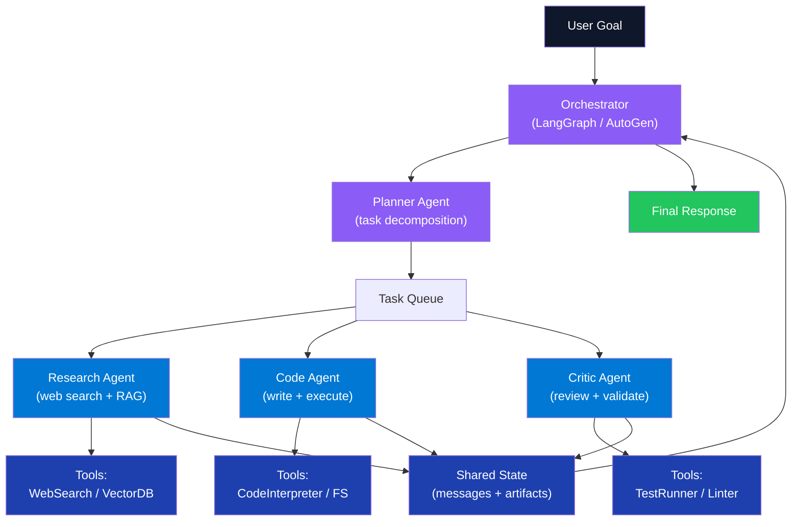

### Agent State Machine

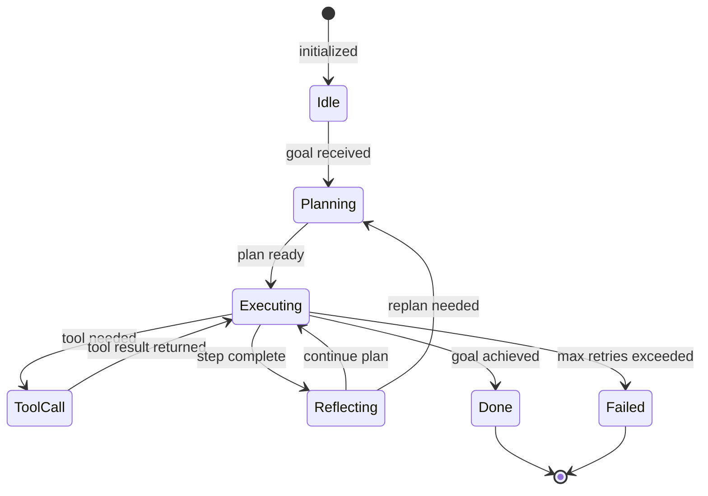

### Component 1 — LangGraph ReAct Agent

```python
from typing import TypedDict, Annotated
from langgraph.graph import StateGraph, END
from langgraph.prebuilt import ToolNode
from langchain_openai import ChatOpenAI
from langchain_core.messages import BaseMessage
import operator

class AgentState(TypedDict):
    messages: Annotated[list[BaseMessage], operator.add]
    iteration: int

def build_react_agent(tools: list):
    llm = ChatOpenAI(model="gpt-4o", temperature=0).bind_tools(tools)
    tool_node = ToolNode(tools)

    def should_continue(state: AgentState) -> str:
        if state["messages"][-1].tool_calls:
            return "tools"
        return END

    def call_model(state: AgentState) -> AgentState:
        response = llm.invoke(state["messages"])
        return {"messages": [response], "iteration": state["iteration"] + 1}

    graph = StateGraph(AgentState)
    graph.add_node("agent", call_model)
    graph.add_node("tools", tool_node)
    graph.set_entry_point("agent")
    graph.add_conditional_edges("agent", should_continue)
    graph.add_edge("tools", "agent")

    return graph.compile(checkpointer=None)  # add MemorySaver for persistence
```

### Component 2 — Tool Definition

```python
from langchain.tools import tool
import httpx, io, contextlib

@tool
async def web_search(query: str) -> str:
    """Search the web for current information. Use for recent events or facts."""
    from langchain_community.tools import DuckDuckGoSearchRun
    return DuckDuckGoSearchRun().run(query)

@tool
async def call_rest_api(url: str, method: str = "GET", payload: dict = None) -> str:
    """Call an external REST API and return the response body (max 2000 chars)."""
    async with httpx.AsyncClient(timeout=10) as client:
        response = await client.request(method, url, json=payload)
        response.raise_for_status()
        return response.text[:2000]

@tool
def python_repl(code: str) -> str:
    """Execute Python code and return stdout. Use for calculations and data processing."""
    stdout = io.StringIO()
    with contextlib.redirect_stdout(stdout):
        exec(code, {})
    return stdout.getvalue()
```

### Component 3 — Multi-Agent Handoff (AutoGen)

```python
from autogen import ConversableAgent, GroupChat, GroupChatManager

def build_team(api_key: str):
    cfg = {"config_list": [{"model": "gpt-4o", "api_key": api_key}]}

    planner = ConversableAgent(
        "Planner",
        system_message="Decompose the user goal into concrete numbered sub-tasks.",
        llm_config=cfg,
    )
    researcher = ConversableAgent(
        "Researcher",
        system_message="Execute research sub-tasks. Cite sources. Be concise.",
        llm_config=cfg,
    )
    critic = ConversableAgent(
        "Critic",
        system_message="Review output. Identify gaps. Say TERMINATE when satisfied.",
        llm_config=cfg,
    )

    gc = GroupChat(
        agents=[planner, researcher, critic],
        messages=[],
        max_round=12,
        speaker_selection_method="auto",
    )
    return planner, GroupChatManager(groupchat=gc, llm_config=cfg)
```

### Interview Talking Points

| Question | Answer |
|---|---|
| What is ReAct and how does it work? | Reasoning + Acting — the LLM interleaves Thought (reasoning), Action (tool call), and Observation (result) in a loop until goal is reached. Standard pattern for tool-using agents. |
| What is the difference between LangGraph and LangChain? | LangChain is a toolkit for chains and retrieval. LangGraph adds stateful, cyclical computation graphs — essential for agents that loop, branch, or replan based on intermediate results. |
| How do you prevent agent infinite loops? | Set `max_iterations` or `max_round`. Track iteration count in state. Add a Supervisor agent that checks termination conditions. Force END after threshold. |
| What is the difference between tool use and function calling? | Function calling (OpenAI) outputs structured JSON targeting a named function. Tool use is the broader pattern: any external capability (API, DB, code interpreter). Functionally equivalent. |
| How do you handle failures in multi-agent pipelines? | Wrap each step with tenacity retry. Failed steps write to a dead-letter state node. Supervisor detects stalled pipelines and re-routes or escalates to human. |
| What is agent memory? | Short-term: in-context message history. Long-term: vector DB retrieval of past interactions (LangMem, Mem0). Episodic: compressed summaries of prior sessions stored externally. |
| When would you choose AutoGen vs LangGraph? | AutoGen for conversational multi-agent debates/reviews with emergent behavior. LangGraph for deterministic, flow-controlled pipelines with explicit branching and human-in-the-loop checkpoints. |

---

## 5. Evaluation and Observability

### Overview

AI systems require continuous evaluation because traditional unit tests cannot verify semantic correctness or factual accuracy. Production observability means tracing every LLM call, capturing inputs/outputs and latency, measuring quality metrics (faithfulness, answer relevancy, context precision), and detecting regressions across model upgrades or prompt changes. RAGAS, LangSmith, and Phoenix provide the tooling; LLM-as-judge enables scalable automated quality scoring without expensive human labeling.

### Architecture Diagram

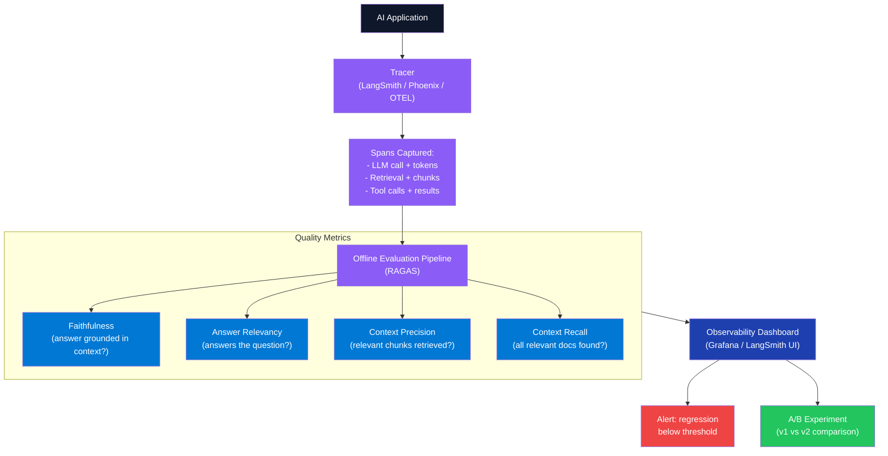

### Component 1 — RAGAS Evaluation

```python
from ragas import evaluate
from ragas.metrics import (
    faithfulness,
    answer_relevancy,
    context_precision,
    context_recall,
)
from datasets import Dataset

def evaluate_rag_pipeline(
    questions: list[str],
    answers: list[str],
    contexts: list[list[str]],
    ground_truths: list[str],
) -> dict:
    dataset = Dataset.from_dict({
        "question": questions,
        "answer": answers,
        "contexts": contexts,
        "ground_truth": ground_truths,
    })

    result = evaluate(
        dataset=dataset,
        metrics=[faithfulness, answer_relevancy, context_precision, context_recall],
    )
    return result.to_pandas().mean().to_dict()

# Example output:
# {"faithfulness": 0.87, "answer_relevancy": 0.91, "context_precision": 0.84, "context_recall": 0.78}
```

### Component 2 — LLM-as-Judge

```python
from pydantic import BaseModel, Field
from openai import OpenAI

class QualityScore(BaseModel):
    score: int = Field(ge=1, le=5, description="1=poor, 5=excellent")
    reasoning: str
    is_faithful: bool

def llm_judge(question: str, context: str, answer: str) -> QualityScore:
    """GPT-4o as judge — correlates ~0.8 with human scores, scales cheaply"""
    client = OpenAI()
    response = client.beta.chat.completions.parse(
        model="gpt-4o",
        messages=[
            {"role": "system", "content": (
                "You are an impartial judge. Score the answer 1–5 and determine "
                "if every claim is supported by the provided context."
            )},
            {"role": "user", "content": (
                f"Question: {question}\n\nContext: {context}\n\nAnswer: {answer}"
            )},
        ],
        response_format=QualityScore,
    )
    return response.choices[0].message.parsed
```

### Component 3 — Tracing with LangSmith

```python
from langsmith import traceable, Client
from langchain_openai import ChatOpenAI

@traceable(name="rag_query", tags=["production"])
def rag_query(question: str, retriever, llm: ChatOpenAI) -> str:
    """LangSmith auto-captures: inputs, outputs, latency, token usage, cost"""
    docs = retriever.invoke(question)
    context = "\n\n".join(d.page_content for d in docs)
    return llm.invoke(f"Context: {context}\n\nQuestion: {question}").content


def run_experiment(run_ids: list[str], dataset_name: str, prefix: str):
    client = Client()
    return client.evaluate(
        run_ids,
        data=dataset_name,
        evaluators=["qa", "context_qa"],
        experiment_prefix=prefix,
    )
```

### Component 4 — Online Hallucination Monitor

```python
import random

async def online_quality_monitor(
    question: str,
    context: str,
    answer: str,
    sample_rate: float = 0.05,  # score 5% of production traffic
) -> None:
    if random.random() > sample_rate:
        return
    score = llm_judge(question, context, answer)
    # push to metrics store (Prometheus, Datadog, etc.)
    metrics.gauge("llm.faithfulness", 1 if score.is_faithful else 0)
    metrics.histogram("llm.quality_score", score.score)
```

### Interview Talking Points

| Question | Answer |
|---|---|
| What is faithfulness in RAGAS? | Measures what fraction of claims in the answer are supported by retrieved context. Score = supported_claims / total_claims. Faithfulness = 1.0 means zero hallucination. |
| What is the LLM-as-judge pattern and its limits? | Use a stronger LLM (GPT-4o, Claude 3.5) to score another model's output on rubrics. Fast, scalable, cheap. Limits: positional bias (favors first response), verbosity bias, inherits the judge's blind spots. |
| How do you trace a multi-step LLM pipeline? | Use OTEL-compatible tracers (Phoenix) or framework-native (LangSmith). Capture: span name, input, output, latency, token count, model name, cost per call. |
| What is an evals dataset and how do you build one? | Curated set of (question, expected_answer, context) tuples. Seed with 50–200 real-world queries. Grow with production feedback loops. Use GPT-4o to generate synthetic examples cheaply. |
| How do you detect prompt regression after a model upgrade? | Run the evals dataset through old and new model, compare RAGAS metric distributions, flag any drop > 5%. Use LangSmith experiments for side-by-side comparison. |
| What is the difference between online and offline evaluation? | Offline: evaluate on a fixed dataset before deployment. Online: score a sample of production traces continuously. Online catches distribution shift that offline datasets miss. |
| How do you measure hallucination rate at scale? | Sample N production answers (5% sampling), score with LLM-as-judge faithfulness, track rolling average. Alert if faithfulness drops below threshold (e.g., < 0.80). |

---

## 6. Guardrails and Output Validation

### Overview

Guardrails enforce safety, format correctness, and policy compliance on LLM inputs and outputs. Input guardrails detect prompt injection, PII, and toxic content before the LLM call — blocking cost and risk before any tokens are spent. Output guardrails validate schema conformance, filter harmful content, and enforce business rules before returning responses to users. Pydantic structured outputs, Microsoft Presidio, and Guardrails AI are the standard production tools.

### Architecture Diagram

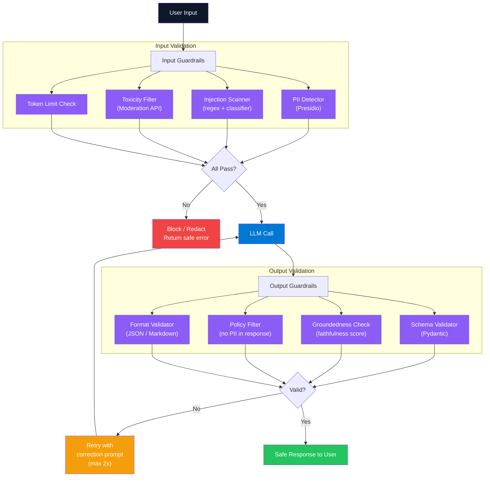

### Component 1 — Input Guardrails

```python
from presidio_analyzer import AnalyzerEngine
from presidio_anonymizer import AnonymizerEngine
import re

_analyzer = AnalyzerEngine()
_anonymizer = AnonymizerEngine()

INJECTION_PATTERNS = [
    r"ignore (all )?(previous|prior) instructions",
    r"you are now",
    r"pretend (you are|to be)",
    r"system prompt:",
    r"<\|im_start\|>",
]

def sanitize_input(text: str) -> tuple[bool, str]:
    # Strip PII before sending to external LLM
    pii_results = _analyzer.analyze(text=text, language="en")
    if pii_results:
        text = _anonymizer.anonymize(text=text, analyzer_results=pii_results).text

    for pattern in INJECTION_PATTERNS:
        if re.search(pattern, text, re.IGNORECASE):
            return False, "Potential prompt injection detected"

    if len(text.split()) > 2000:
        return False, "Input exceeds maximum length"

    return True, text


async def moderation_check(text: str) -> bool:
    from openai import AsyncOpenAI
    result = await AsyncOpenAI().moderations.create(input=text)
    return not result.results[0].flagged
```

### Component 2 — Structured Output with Pydantic

```python
from pydantic import BaseModel, Field, field_validator
from typing import Literal
from openai import OpenAI

class ExtractedEntity(BaseModel):
    entity_type: Literal["person", "organization", "location", "date"]
    value: str
    confidence: float = Field(ge=0.0, le=1.0)

class ExtractionResult(BaseModel):
    entities: list[ExtractedEntity]
    summary: str = Field(max_length=500)
    language: str

    @field_validator("language")
    @classmethod
    def validate_language(cls, v: str) -> str:
        allowed = {"en", "es", "fr", "de", "pt"}
        if v.lower() not in allowed:
            raise ValueError(f"Unsupported language: {v}")
        return v.lower()

def extract_entities(text: str) -> ExtractionResult:
    client = OpenAI()
    response = client.beta.chat.completions.parse(
        model="gpt-4o",
        messages=[
            {"role": "system", "content": "Extract entities and summarize the text."},
            {"role": "user", "content": text},
        ],
        response_format=ExtractionResult,
    )
    return response.choices[0].message.parsed
```

### Component 3 — Output Retry Loop

```python
from pydantic import ValidationError

async def validated_generation(
    prompt: str,
    response_model: type[BaseModel],
    max_retries: int = 2,
) -> BaseModel:
    from openai import AsyncOpenAI
    client = AsyncOpenAI()
    last_error = None

    for attempt in range(max_retries + 1):
        correction = ""
        if last_error:
            correction = f"\n\nYour previous response failed validation: {last_error}. Fix it."

        response = await client.beta.chat.completions.parse(
            model="gpt-4o",
            messages=[{"role": "user", "content": prompt + correction}],
            response_format=response_model,
        )
        parsed = response.choices[0].message.parsed
        if parsed is not None:
            return parsed

        last_error = "Returned null response"

    raise RuntimeError(f"Validation failed after {max_retries} retries")
```

### Interview Talking Points

| Question | Answer |
|---|---|
| What is prompt injection and how do you detect it? | Attacker embeds adversarial instructions in user input to hijack LLM behavior. Detect with regex pattern matching, fine-tuned classifiers (DeBERTa on injection examples), or OpenAI Moderation API. |
| What is the difference between input and output guardrails? | Input guardrails run before the LLM call — cheaper, blocks wasted API cost. Output guardrails run after — more expensive but catch model-generated issues like hallucinations and PII leakage in responses. |
| How do you enforce structured output reliably? | Use `response_format={"type":"json_object"}` or Pydantic `parse()` with `beta.chat.completions.parse`. Add a retry loop with a correction prompt on ValidationError. |
| How do you handle PII in LLM pipelines? | Detect with Microsoft Presidio, anonymize before the LLM call, optionally de-anonymize in the response using a mapping table. Never send raw SSN, credit card, or medical data to external APIs. |
| What is content moderation vs. policy enforcement? | Moderation filters universally harmful content (violence, sexual, hate) — use OpenAI Moderation API or Azure Content Safety. Policy enforcement is business-specific (e.g., "never mention competitors"). Implement both layers. |
| How many retries should output validation allow? | Cap at 2–3 retries. Each retry = latency + cost. After max retries, return a safe fallback or escalate to a human review queue. Structured output models (GPT-4o, Claude 3.5) rarely need > 1 retry. |
| How does Guardrails AI work? | Define a Guard with validator chains. On generate(), it calls the LLM, validates output, and on failure auto-reprompts with a correction instruction (`on_fail="reask"`). |

---

## 7. Context Window Management

### Overview

Context windows cap the maximum tokens an LLM processes per call. Production systems must manage this boundary to avoid silent truncation, control per-call cost (which scales linearly with tokens), and preserve conversation coherence. Strategies include sliding window (keep last N turns), hierarchical summarization (compress older turns), and semantic memory retrieval (vector DB lookup of relevant history) — each with different latency, cost, and fidelity tradeoffs.

### Architecture Diagram

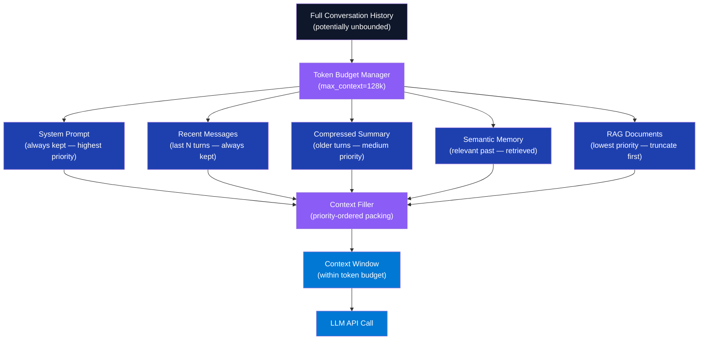

### Component 1 — Token Budget Manager

```python
import tiktoken
from dataclasses import dataclass

@dataclass
class TokenBudget:
    model: str
    max_total: int
    reserved_output: int = 1024

    def __post_init__(self):
        self._enc = tiktoken.encoding_for_model(self.model)

    @property
    def available(self) -> int:
        return self.max_total - self.reserved_output

    def count(self, text: str) -> int:
        return len(self._enc.encode(text))

    def fits(self, messages: list[dict]) -> bool:
        total = sum(self.count(m["content"]) + 4 for m in messages)
        return total <= self.available


def pack_context(
    system: str,
    recent: list[dict],
    summary: str,
    docs: list[str],
    budget: TokenBudget,
) -> list[dict]:
    messages = [{"role": "system", "content": system}]

    if summary:
        messages.append({"role": "system", "content": f"[Summary of prior context]\n{summary}"})

    # Add RAG docs while budget allows
    for doc in docs:
        candidate = {"role": "system", "content": f"[Reference]\n{doc}"}
        if budget.fits(messages + [candidate] + recent):
            messages.append(candidate)

    messages.extend(recent)
    return messages
```

### Component 2 — Sliding Window with Summarization

```python
from openai import AsyncOpenAI

async def summarize_turns(messages: list[dict], max_tokens: int = 300) -> str:
    client = AsyncOpenAI()
    transcript = "\n".join(f"{m['role'].upper()}: {m['content']}" for m in messages)
    response = await client.chat.completions.create(
        model="gpt-4o-mini",
        messages=[
            {"role": "system", "content": (
                f"Summarize this conversation in under {max_tokens} tokens. "
                "Preserve key facts, decisions, and user preferences."
            )},
            {"role": "user", "content": transcript},
        ],
        max_tokens=max_tokens,
    )
    return response.choices[0].message.content


class SlidingWindowMemory:
    def __init__(self, window_size: int = 10):
        self.window_size = window_size
        self._messages: list[dict] = []
        self._summary: str = ""

    async def add(self, role: str, content: str) -> None:
        self._messages.append({"role": role, "content": content})
        if len(self._messages) > self.window_size:
            to_archive = self._messages[:-self.window_size]
            self._summary = await summarize_turns(to_archive)
            self._messages = self._messages[-self.window_size:]

    def context(self) -> tuple[str, list[dict]]:
        return self._summary, self._messages
```

### Component 3 — Semantic Long-Term Memory

```python
from qdrant_client import QdrantClient
from qdrant_client.models import PointStruct
from openai import OpenAI
import uuid, time

class SemanticMemory:
    def __init__(self, collection: str = "conversation_memory"):
        self.collection = collection
        self.qdrant = QdrantClient(url="http://localhost:6333")
        self.openai = OpenAI()

    def _embed(self, text: str) -> list[float]:
        return self.openai.embeddings.create(
            input=text, model="text-embedding-3-small"
        ).data[0].embedding

    def store(self, role: str, content: str, session_id: str) -> None:
        self.qdrant.upsert(
            collection_name=self.collection,
            points=[PointStruct(
                id=str(uuid.uuid4()),
                vector=self._embed(content),
                payload={"role": role, "content": content,
                         "session_id": session_id, "ts": time.time()},
            )],
        )

    def recall(self, query: str, top_k: int = 3) -> list[dict]:
        hits = self.qdrant.search(
            collection_name=self.collection,
            query_vector=self._embed(query),
            limit=top_k,
            with_payload=True,
        )
        return [h.payload for h in hits]
```

### Interview Talking Points

| Question | Answer |
|---|---|
| What happens when a conversation exceeds the context window? | Without management: oldest tokens are silently truncated. With management: summarize, compress, or archive old turns to a vector store, always preserving system prompt and most recent turns. |
| What is the "lost in the middle" problem? | LLMs have higher recall for content at the start and end of context; middle content is often missed. Mitigation: reorder retrieved chunks so most relevant appear first and last. |
| How do you choose between sliding window and summarization? | Sliding window preserves exact phrasing — good for code and quotes. Summarization compresses more aggressively — good for long narrative conversations. Combine for best results. |
| What is context caching and how does it reduce cost? | Anthropic and Google support prompt caching: the same prefix costs ~10% of full price on subsequent calls. Cache system prompts and static RAG context. Can reduce inference cost 60–90% for prompt-heavy workloads. |
| How do you handle a 1M token context window model? | Even with 1M tokens, cost scales linearly. Use selective retrieval, cache static prefixes, and monitor actual token usage per request. Don't stuff the window simply because capacity exists. |
| What is KV-cache in inference? | Key-value attention cache stores attention computations for prefix tokens. Reusing KV-cache avoids recomputing attention for unchanged prefixes — critical for latency and throughput in batch inference. |
| What priority order do you use when packing context? | System prompt → task instructions → recent messages → semantic memory → retrieved documents. Pack from highest priority down until budget is exhausted. |

---

## 8. Fine-tune vs Prompt Trade-off

### Overview

Fine-tuning adapts model weights to a specific task by training on labeled examples, improving consistency, reducing prompt verbosity, and enabling smaller model deployment. Prompt engineering achieves similar ends by crafting system instructions and few-shot examples without training. The decision hinges on quality delta after prompting plateaus, labeled data availability, inference latency targets, and total cost at scale — fine-tuning is justified when prompting cannot meet quality thresholds or when per-request inference cost at scale makes a smaller fine-tuned model economically necessary.

### Decision Flowchart

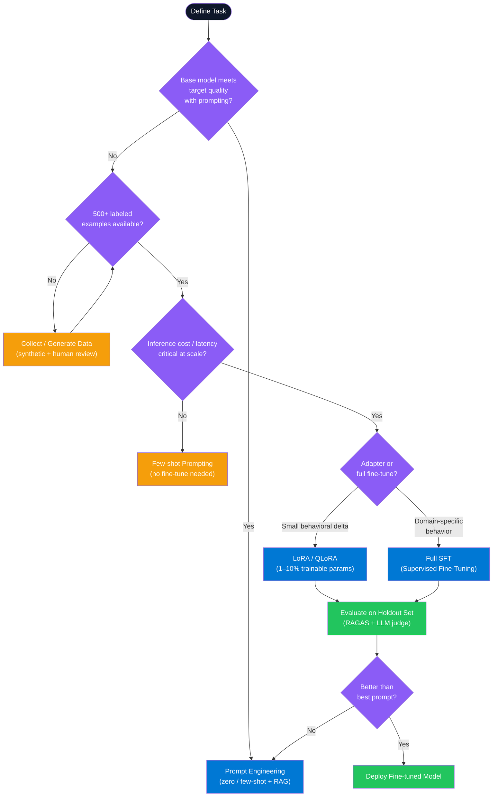

### Component 1 — LoRA Fine-tuning with PEFT

```python
from transformers import AutoModelForCausalLM, AutoTokenizer, TrainingArguments
from peft import LoraConfig, get_peft_model, TaskType
from trl import SFTTrainer
from datasets import Dataset

def prepare_lora_model(base_model_id: str):
    model = AutoModelForCausalLM.from_pretrained(
        base_model_id,
        load_in_4bit=True,       # QLoRA: quantize base to 4-bit
        device_map="auto",
    )
    tokenizer = AutoTokenizer.from_pretrained(base_model_id)

    lora_config = LoraConfig(
        r=16,                    # rank — higher = more capacity, more params
        lora_alpha=32,           # scaling factor (typically 2x rank)
        target_modules=["q_proj", "v_proj"],
        lora_dropout=0.05,
        bias="none",
        task_type=TaskType.CAUSAL_LM,
    )
    model = get_peft_model(model, lora_config)
    model.print_trainable_parameters()   # ~0.5% of total
    return model, tokenizer


def fine_tune(model, tokenizer, dataset: Dataset) -> None:
    args = TrainingArguments(
        output_dir="./lora-output",
        num_train_epochs=3,
        per_device_train_batch_size=4,
        gradient_accumulation_steps=4,
        learning_rate=2e-4,
        bf16=True,
        save_strategy="epoch",
        logging_steps=50,
    )
    SFTTrainer(
        model=model, tokenizer=tokenizer,
        train_dataset=dataset,
        dataset_text_field="text",
        max_seq_length=2048,
        args=args,
    ).train()
```

### Component 2 — OpenAI Fine-tuning API

```python
import openai, json, time

def prepare_jsonl(examples: list[dict], output_path: str) -> None:
    with open(output_path, "w") as f:
        for ex in examples:
            f.write(json.dumps({
                "messages": [
                    {"role": "system",    "content": ex["system"]},
                    {"role": "user",      "content": ex["user"]},
                    {"role": "assistant", "content": ex["assistant"]},
                ]
            }) + "\n")


def run_finetune(jsonl_path: str, base_model: str = "gpt-4o-mini-2024-07-18") -> str:
    client = openai.OpenAI()

    with open(jsonl_path, "rb") as f:
        file_obj = client.files.create(file=f, purpose="fine-tune")

    job = client.fine_tuning.jobs.create(
        training_file=file_obj.id,
        model=base_model,
        hyperparameters={"n_epochs": 3},
    )

    while job.status not in ("succeeded", "failed"):
        time.sleep(60)
        job = client.fine_tuning.jobs.retrieve(job.id)
        print(f"Status: {job.status}")

    return job.fine_tuned_model  # use this model ID for inference
```

### Component 3 — Cost-Benefit Analysis

```python
from dataclasses import dataclass

@dataclass
class InferenceCost:
    model: str
    input_cost_per_1m: float
    output_cost_per_1m: float
    avg_input_tokens: int
    avg_output_tokens: int
    daily_requests: int

    def daily_cost_usd(self) -> float:
        return (
            self.avg_input_tokens * self.daily_requests / 1_000_000 * self.input_cost_per_1m
            + self.avg_output_tokens * self.daily_requests / 1_000_000 * self.output_cost_per_1m
        )

# gpt-4o + 5 few-shot examples in prompt (2000 input tokens)
gpt4o_few_shot   = InferenceCost("gpt-4o",             2.50, 10.00, 2000, 200, 100_000)
# gpt-4o-mini fine-tuned — no few-shot needed (300 input tokens)
mini_finetuned   = InferenceCost("gpt-4o-mini (ft)",   0.30,  1.20,  300, 200, 100_000)

# gpt-4o: ~$700/day   vs   gpt-4o-mini ft: ~$33/day = ~21x savings at scale
# Break-even at ~$1500 fine-tuning cost ≈ 3 days of gpt-4o savings
```

### Interview Talking Points

| Question | Answer |
|---|---|
| When should you fine-tune instead of prompt engineer? | When prompting plateaus below quality threshold, you have 500+ labeled examples, inference cost at scale is prohibitive with large models, or you need consistent output format without verbose system prompts. |
| What is LoRA and how does it reduce training cost? | Low-Rank Adaptation: freezes base weights, trains two small matrices A∈R^{d×r} and B∈R^{r×k} that approximate the weight delta. Rank 8–64 typical. Trains 0.1–1% of parameters vs. full fine-tuning. |
| What is QLoRA and how is it different from LoRA? | QLoRA adds 4-bit quantization of the frozen base model weights. Reduces GPU memory 4x vs. full-precision LoRA, enabling fine-tuning of 7B+ models on a single A100 or consumer 4090. |
| What is catastrophic forgetting? | Fine-tuning on a narrow dataset can overwrite general knowledge baked into the base model. Mitigate with data mixing (include general examples), low learning rate, and fewer epochs. |
| How many examples do you need for OpenAI fine-tuning? | 50–100 for format/style changes. 500–1000+ for task-specific behavior. Use synthetic generation (GPT-4o generates, human validates) to scale cheaply to the required volume. |
| What is the difference between SFT and RLHF? | SFT (Supervised Fine-Tuning) trains on labeled (input, ideal-output) pairs. RLHF additionally trains a reward model on human preference pairs, then uses PPO to maximize reward. SFT first; add RLHF if you need safety or preference alignment at scale. |
| How do you evaluate whether fine-tuning was worth it? | Compare quality (RAGAS / LLM-as-judge), inference cost per 1M tokens, p50/p99 latency, and total training cost vs. projected savings at expected request volume. Break-even analysis determines ROI. |

---

## Cross-Cutting Themes

### Pattern Selection Guide

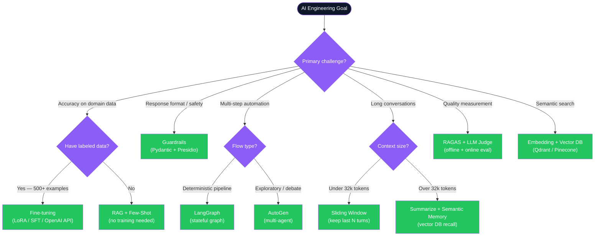

### Common Interview Red Flags to Avoid

| Red Flag | Why It's Wrong | Correct Answer |
|---|---|---|
| "We just stuff the entire document into the context" | Burns tokens on irrelevant content, hits context limits at scale, expensive. Works on small docs but fails in production. | Chunk → embed → retrieve only relevant sections with RAG. |
| "We retry on hallucination in a tight loop" | Same prompt produces same hallucination. Wastes API budget. Risks rate limiting. | Check groundedness first. On failure, reformulate with an explicit grounding correction prompt. |
| "We fine-tune for every new use case" | Training cost, data collection, and model maintenance rarely justify it vs. few-shot prompting. | Fine-tune only when prompting plateaus OR inference cost at scale demands a smaller model. |
| "We send raw user data to the LLM" | PII leakage risk. Violates GDPR / HIPAA for sensitive domains. | Run Presidio PII detection and anonymization before every external LLM API call. |
| "We don't need evals — we test manually" | Manual testing is not reproducible and cannot catch regressions at CI/CD speed. | Build an evals dataset of 100+ (question, expected_answer) pairs. Run RAGAS on every deployment. |
| "Temperature 0 gives deterministic results" | Greedy decoding is maximally deterministic but can still vary by batch size, hardware, and framework version. | For true reproducibility: fix seed AND temperature=0 AND disable batching on the inference server. |
| "Vector search always returns the right chunks" | Dense-only search misses exact keyword matches — product codes, names, acronyms. | Use hybrid search (dense + sparse BM25) with RRF fusion for best retrieval coverage. |
| "We only need output guardrails" | Input guardrails are cheaper — block before spending any API tokens. Output-only leaves the model exposed to injection. | Always run input guardrails first, output guardrails second. |

---

*ConceptToMD Agent v1.0 | Source: DOC_1.2.txt | 8 Fundamental AI Engineering Topics*
