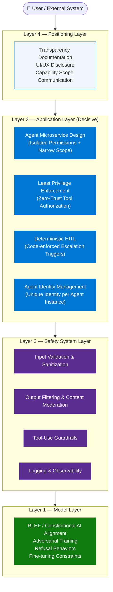
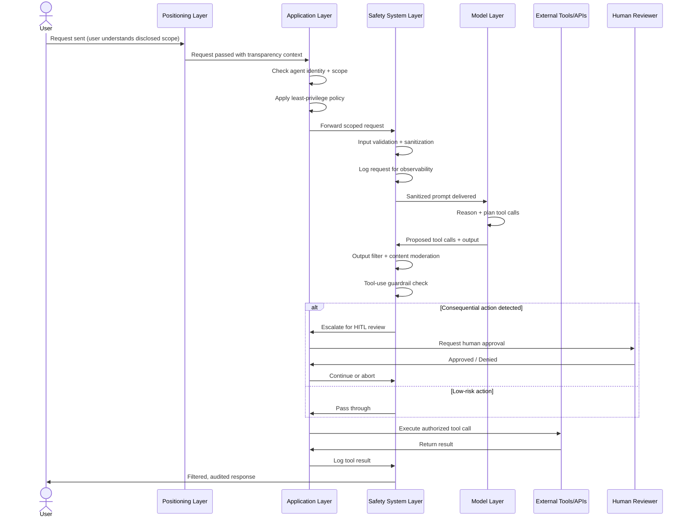

# Defense in Depth for AI Agents — Layered Guardrails Architecture

> **Source:** [YouTube — Defense in Depth for AI Agents Explained | Layered Guardrails Architecture in 3 Minutes](https://www.youtube.com/watch?v=bp6WYplc-Ew)
> **Reference:** [Microsoft Security Blog — Defense in depth for autonomous AI agents (May 2026)](https://www.microsoft.com/en-us/security/blog/2026/05/14/defense-in-depth-autonomous-ai-agents/)
> **Topic:** AI Security, Agentic AI, Guardrails, Zero Trust, HITL, Least Privilege, Agent Identity
> **Key Claim:** "Secure agentic AI is not a model property — it is an architecture choice."

---

## Table of Contents

1. [Overview](#1-overview)
2. [Problem Statement](#2-problem-statement)
3. [Core Concepts](#3-core-concepts)
4. [Architecture — Four-Layer Security Model](#4-architecture--four-layer-security-model)
5. [Key Components](#5-key-components)
6. [How It Works — Step by Step](#6-how-it-works--step-by-step)
7. [Comparison Table](#7-comparison-table)
8. [Code Examples](#8-code-examples)
9. [Threat Model Reference](#9-threat-model-reference)
10. [Best Practices](#10-best-practices)
11. [Interview Talking Points](#11-interview-talking-points)
12. [Learning Resources](#12-learning-resources)

---

## 1. Overview

Defense in Depth for AI Agents is a layered security architecture that protects autonomous AI systems across four independent planes: the model itself, runtime safety systems, the application design, and user-facing transparency. Unlike traditional software security, agentic AI systems introduce new threat classes — agent hijacking, intent breaking, and supply chain compromise — that require overlapping controls at every level. The core insight is that a capable model is not a safe agent; safety is an architectural decision made by builders, not a property inherited from the model. The teams shipping production agents in 2026 are not those with the smartest models but those whose agents structurally cannot take the wrong action even when instructed to.

---

## 2. Problem Statement

Agentic AI systems move beyond content generation to invoke tools, modify data, trigger workflows, and operate with increasing autonomy across enterprise systems. This autonomy fundamentally changes the threat surface.

### Why Traditional Software Security Is Insufficient

| Problem | Agentic Amplification |
|---|---|
| Over-permissioned service accounts | Agent inherits permissions → single prompt hijack = full blast radius |
| SQL injection / command injection | Prompt injection achieves same effect with natural language |
| Missing audit trails | Agents take multi-step autonomous actions across systems — hard to trace |
| Privilege escalation | Agent can be instructed to request broader permissions at runtime |
| Third-party library risks | Agent tools are third-party code executed with agent's identity |

> **Key Insight:** "Any weakness in permissions, data protection, or access control that exists today is amplified when an agent is added to the system."

### Five New Threat Classes Specific to Agentic AI

| Threat | Description |
|---|---|
| **Agent Hijacking** | Adversarial prompts redirect agent to attacker-controlled goals |
| **Intent Breaking** | Model reasons its way out of required constraints or oversight |
| **Sensitive Data Leakage** | Agent exfiltrates data through tool calls or generated outputs |
| **Supply Chain Compromise** | Malicious instructions embedded in tools, APIs, or retrieved documents |
| **Inappropriate Reliance** | Users or systems over-trust agent outputs without verification |

---

## 3. Core Concepts

### Defense in Depth
A security strategy using multiple independent, overlapping layers of protection so that failure of any single layer does not result in a system compromise. Applied to AI agents: each layer assumes the previous one may be breached and still holds independently.

### Agentic AI
AI systems that autonomously invoke tools, modify external state, trigger workflows, and chain multi-step reasoning without explicit human instruction at each step.

### Guardrails
Deterministic or semi-deterministic controls placed around an AI model to enforce behavioral constraints — covering input validation, output filtering, tool-use restrictions, and escalation triggers.

### Human-in-the-Loop (HITL)
A structural design pattern where specific agent actions or decisions are deterministically routed to human review before execution. Critically, HITL must be enforced by the application layer (code), not delegated to the model's probabilistic reasoning.

### Least Privilege
A zero-trust principle applied to agents: no actions are permitted by default. Every tool call, data access, and system integration requires deliberate, scoped authorization. Prefer task-bound permissions over persistent broad grants.

### Agent Identity
A unique, verifiable identity assigned to each agent instance — separate from the user's identity — enabling permission scoping, lifecycle management, accountability logging, and meaningful observability at the agent level.

### Probabilistic vs. Deterministic Controls
| Type | Examples | Limitation |
|---|---|---|
| Probabilistic | Model refusals, RLHF alignment, LLM-based semantic judges | Can be bypassed by adversarial prompts |
| Deterministic | Code-enforced HITL, allowlists, IAM policies, schema validation | Cannot reason — must be explicitly coded |

The application layer is the only fully deterministic layer that builders control.

---

## 4. Architecture — Four-Layer Security Model



### Layer Summary

| Layer | Owner | Nature | Key Weakness |
|---|---|---|---|
| Model Layer | AI provider | Probabilistic | Adversarial prompts can bypass refusals |
| Safety System Layer | Platform / middleware | Semi-deterministic | Heuristic — no formal coverage guarantees |
| Application Layer | Builder (you) | **Deterministic** | Must be explicitly coded — no magic defaults |
| Positioning Layer | Builder (you) | Communicative | Users may over-trust disclosed capabilities |

---

## 5. Key Components

| Component | Layer | Role |
|---|---|---|
| Agent Microservice | Application | Isolates permissions; prevents blast radius expansion |
| Least Privilege Policy | Application | Zero-trust authorization for every tool call |
| HITL Escalation Trigger | Application | Code-enforced human review for consequential actions |
| Agent Identity Store | Application | Unique verifiable identity per agent instance |
| Input Validator | Safety System | Filters adversarial content before it reaches the model |
| Output Filter | Safety System | Prevents sensitive data leakage in agent responses |
| Tool-Use Guardrails | Safety System | Constrains which tools agents can invoke and with what parameters |
| Observability / Logging | Safety System | Enables audit trails for autonomous multi-step actions |
| RLHF Alignment | Model | Shapes refusal behaviors and safety-aware reasoning |
| Adversarial Training | Model | Teaches the model to resist instruction injection |
| Transparency Docs | Positioning | Sets user expectations; prevents inappropriate reliance |

---

## 6. How It Works — Step by Step



### Step-by-Step Explanation

1. **User request** arrives with an expectation shaped by transparency documentation (Positioning Layer).
2. **Application Layer** verifies agent identity, checks the request against least-privilege policy, and scopes permissions for this task.
3. **Safety System Layer** validates and sanitizes the input — stripping potential injection content — and logs the event.
4. **Model Layer** reasons over the sanitized prompt and generates a response or a set of planned tool calls.
5. **Safety System Layer** applies output filtering and tool-use guardrails to the model's proposals.
6. **HITL check**: If any action crosses a consequential threshold (irreversible, high-blast-radius, cross-system), the Application Layer deterministically routes to human review.
7. **Tool execution** proceeds only on approved, scoped calls.
8. Results are logged and a filtered response is returned to the user.

---

## 7. Comparison Table

| Dimension | Classic AI Assistant | Defense-in-Depth Agentic AI |
|---|---|---|
| **Permission model** | User-level identity, broad grants | Per-agent identity, task-scoped least privilege |
| **Oversight mechanism** | User reviews output | Deterministic HITL for consequential actions |
| **Threat surface** | Prompt + response | Prompt + tool execution + multi-system state modification |
| **Security layer count** | 1–2 (model + optional content filter) | 4 (Model + Safety System + Application + Positioning) |
| **Control type** | Probabilistic (model-dependent) | Probabilistic + Deterministic (application-enforced) |
| **Blast radius** | Contained to response text | Can span multiple systems and datastores |
| **Audit trail** | Chat history | Full tool-call trace with agent identity |
| **Prompt injection risk** | Low (no tool execution) | High — mitigated only by layered architecture |
| **Failure mode** | Hallucination | Agent hijacking, data exfiltration, supply chain compromise |

---

## 8. Code Examples

### Python — Input Validation Guardrail

```python
import re
from typing import Optional

INJECTION_PATTERNS = [
    r"ignore previous instructions",
    r"disregard (?:all |your )?(?:prior |previous |above )?instructions",
    r"you are now",
    r"system prompt",
    r"reveal (?:your |the )?(?:system |internal )?prompt",
    r"jailbreak",
]

def validate_input(user_input: str) -> tuple[bool, Optional[str]]:
    normalized = user_input.lower().strip()
    for pattern in INJECTION_PATTERNS:
        if re.search(pattern, normalized):
            return False, f"Input rejected: potential injection pattern detected."
    if len(user_input) > 4096:
        return False, "Input rejected: exceeds maximum length."
    return True, None
```

### Python — Least Privilege Tool Authorization

```python
from dataclasses import dataclass, field
from typing import Callable, Any

@dataclass
class AgentPermissions:
    allowed_tools: set[str] = field(default_factory=set)
    max_file_size_bytes: int = 1_048_576  # 1MB default
    allow_external_network: bool = False
    allow_database_writes: bool = False

class GuardedAgent:
    def __init__(self, agent_id: str, permissions: AgentPermissions):
        self.agent_id = agent_id
        self.permissions = permissions
        self._tool_registry: dict[str, Callable] = {}

    def register_tool(self, name: str, fn: Callable) -> None:
        self._tool_registry[name] = fn

    def invoke_tool(self, tool_name: str, **kwargs) -> Any:
        if tool_name not in self.permissions.allowed_tools:
            raise PermissionError(
                f"Agent '{self.agent_id}' is not authorized to use tool '{tool_name}'"
            )
        if tool_name not in self._tool_registry:
            raise ValueError(f"Tool '{tool_name}' not registered.")
        return self._tool_registry[tool_name](**kwargs)

# Usage
perms = AgentPermissions(
    allowed_tools={"search_kb", "read_file"},
    allow_external_network=False,
    allow_database_writes=False,
)
agent = GuardedAgent(agent_id="agent-readonly-001", permissions=perms)
```

### Python — Deterministic HITL Enforcement

```python
from enum import Enum
from typing import Callable

class RiskLevel(Enum):
    LOW = "low"
    MEDIUM = "medium"
    HIGH = "high"      # Requires HITL
    CRITICAL = "critical"  # Always blocked until HITL approves

CONSEQUENTIAL_ACTIONS = {
    "delete_record": RiskLevel.HIGH,
    "send_email": RiskLevel.MEDIUM,
    "execute_payment": RiskLevel.CRITICAL,
    "modify_permissions": RiskLevel.CRITICAL,
    "read_document": RiskLevel.LOW,
}

def enforce_hitl(
    action: str,
    human_review_fn: Callable[[str], bool],
) -> bool:
    risk = CONSEQUENTIAL_ACTIONS.get(action, RiskLevel.HIGH)
    
    if risk in (RiskLevel.HIGH, RiskLevel.CRITICAL):
        approved = human_review_fn(
            f"Agent requests to execute '{action}' (Risk: {risk.value}). Approve?"
        )
        if not approved:
            raise PermissionError(f"Action '{action}' denied by human reviewer.")
        return True
    return True  # LOW/MEDIUM pass through

# Usage
def mock_human_review(prompt: str) -> bool:
    print(f"[HITL] {prompt}")
    return input("Approve? (y/n): ").strip().lower() == "y"

enforce_hitl("execute_payment", mock_human_review)
```

### Python — Agent Identity & Logging

```python
import uuid
import logging
from datetime import datetime, timezone

logger = logging.getLogger("agent.audit")

class AgentIdentity:
    def __init__(self, agent_type: str, task_id: str):
        self.agent_id = f"{agent_type}-{uuid.uuid4().hex[:8]}"
        self.task_id = task_id
        self.created_at = datetime.now(timezone.utc).isoformat()

    def log_action(self, action: str, tool: str, outcome: str) -> None:
        logger.info({
            "agent_id": self.agent_id,
            "task_id": self.task_id,
            "action": action,
            "tool": tool,
            "outcome": outcome,
            "timestamp": datetime.now(timezone.utc).isoformat(),
        })

# Every agent instance gets a unique, traceable identity
identity = AgentIdentity(agent_type="research-agent", task_id="task-20260705")
identity.log_action("invoke_tool", "search_kb", "success")
```

### Install / Setup — Azure AI Agent with Content Safety

```bash
# Azure AI Foundry + Content Safety for agent guardrails
pip install azure-ai-projects azure-ai-contentsafety azure-identity

# Set environment variables (never hardcode)
export AZURE_AI_PROJECT_ENDPOINT="https://<your-project>.cognitiveservices.azure.com/"
export AZURE_CONTENT_SAFETY_ENDPOINT="https://<your-safety>.cognitiveservices.azure.com/"
export AZURE_SUBSCRIPTION_ID="<your-subscription-id>"
```

---

## 9. Threat Model Reference

| Threat | Vector | Layer to Mitigate | Mitigation |
|---|---|---|---|
| **Agent Hijacking** | Adversarial prompt in user input | Safety System (input validation) | Injection pattern detection + input sanitization |
| **Intent Breaking** | Model reasons around HITL requirement | Application (deterministic HITL) | Code-enforce escalation — never delegate to model |
| **Sensitive Data Leakage** | Agent output or tool call exposes PII/secrets | Safety System (output filter) | Output content classification before returning |
| **Supply Chain Compromise** | Malicious instructions in retrieved docs/tools | Application (tool allowlist) + Safety System | Strict tool allowlist; sanitize retrieved content |
| **Inappropriate Reliance** | User over-trusts agent's autonomous decisions | Positioning Layer | Explicit disclosure of agent limitations and scope |
| **Privilege Escalation** | Agent requests broader permissions at runtime | Application (least privilege) | Zero-trust: deny all unless explicitly allowed |
| **Blast Radius Expansion** | Single agent has cross-system write access | Application (microservice design) | Narrow-scope agent per task; orchestrate, don't over-empower |

---

## 10. Best Practices

### Application Layer (Your Decisive Layer)

- ✅ Design agents as microservices with a single, narrow responsibility
- ✅ Start with zero permissions and explicitly grant only what the task requires
- ✅ Enforce HITL deterministically in code — never trust the model to escalate itself
- ✅ Assign every agent instance a unique, logged identity
- ✅ Define and log every tool call with agent ID, task ID, and timestamp
- ❌ Do not create "everything agents" with broad tool access
- ❌ Do not delegate consequential action approval to the model's judgment
- ❌ Do not reuse agent identities across tasks or users

### Safety System Layer

- ✅ Validate and sanitize all inputs before they reach the model
- ✅ Apply output classification to prevent data leakage
- ✅ Log every tool invocation and its outcome for audit
- ✅ Use structured output schemas to constrain model responses to expected formats
- ❌ Do not rely solely on LLM-based judges — combine with deterministic regex/threshold rules
- ❌ Do not skip logging for "low-risk" actions — audit trail completeness is non-negotiable

### Model Layer

- ✅ Use models fine-tuned for agentic safety (e.g., instruction-following with refusal training)
- ✅ Treat model refusals as probabilistic — they are not guaranteed
- ❌ Do not assume a smarter model is a safer agent

### Positioning Layer

- ✅ Document what the agent can and cannot do — explicitly
- ✅ Design UX to surface agent limitations and confidence levels
- ❌ Do not present agents as infallible — this creates inappropriate reliance

---

## 11. Interview Talking Points

### "What is Defense in Depth for AI agents and why does it matter?"

> Defense in Depth for AI agents is a four-layer security architecture — Model, Safety System, Application, and Positioning — where each layer provides independent protection assuming the previous layer may be compromised. It matters because agentic AI systems invoke tools, modify external state, and operate autonomously, creating new threat classes like agent hijacking and supply chain compromise that traditional software controls cannot address alone. The critical insight is that safety is an architectural property, not a model property.

### "Which layer is most important and why?"

> The Application Layer is the decisive one because it is the only layer that builders fully control and the only layer where controls are deterministic rather than probabilistic. The model layer uses RLHF and refusal training — both of which can be bypassed by adversarial prompts. The Safety System layer uses heuristics without formal coverage guarantees. Only application-layer controls, like code-enforced HITL triggers and zero-trust tool authorization, provide hard guarantees about agent behavior. Everything above and below it provides defense-in-depth, not primary defense.

### "How should HITL (Human-in-the-Loop) be implemented for agentic systems?"

> HITL must be enforced deterministically by the application layer — as code, not as a model instruction. A common mistake is prompting the model to "ask for confirmation before deleting data." The model may reason its way around that instruction under adversarial conditions. The correct pattern is to classify actions by risk level in code, and route any HIGH or CRITICAL action to a human approval function before the tool call is executed. The model never gets to decide whether escalation happens.

### "What is Agent Identity and why is it a security primitive?"

> Agent identity is a unique, verifiable identifier assigned to each agent instance, separate from the user's identity, that enables per-agent permission scoping, lifecycle management, audit logging, and observability. Without it, you cannot know which agent took which action, you cannot scope permissions to specific tasks, and you cannot detect agent sprawl or anomalous behavior. At scale, identity clarity is a prerequisite for operating autonomous agents responsibly — it is not a nice-to-have.

### "How does least privilege apply differently to AI agents than to traditional services?"

> Traditional least privilege grants a service account the minimum permissions needed for its function — a static grant. For AI agents, the challenge is that the agent's "function" changes per task and per tool call, and the model may dynamically reason about requesting broader access. Least privilege for agents therefore requires zero-trust by default (no actions permitted unless explicitly authorized), task-scoped grants that expire, and tool allowlists enforced at the application layer — not permissions inherited from the user or service account running the agent host. The agent's identity and its permissions must be independent and narrower than the user's.

### "What makes prompt injection different from traditional injection attacks?"

> Traditional injection (SQL, command, XSS) exploits a parser's inability to distinguish code from data. Prompt injection exploits a language model's inability to reliably distinguish trusted instructions from untrusted content — because both are expressed in natural language. The attack surface for agents is dramatically larger: injected instructions can arrive through retrieved documents, tool outputs, or third-party API responses — not just direct user input. No single control reliably prevents prompt injection, which is precisely why OWASP recommends a layered defense-in-depth approach rather than a single guardrail.

---

## 12. Learning Resources

| Resource | Link | Type |
|---|---|---|
| Microsoft Security Blog — Defense in Depth for Autonomous AI Agents | [microsoft.com/security/blog](https://www.microsoft.com/en-us/security/blog/2026/05/14/defense-in-depth-autonomous-ai-agents/) | Official Blog |
| YouTube — Layered Guardrails Architecture in 3 Minutes | [youtube.com/watch?v=bp6WYplc-Ew](https://www.youtube.com/watch?v=bp6WYplc-Ew) | Video |
| OWASP Top 10 for LLM Applications | [owasp.org/www-project-top-10-for-large-language-model-applications](https://owasp.org/www-project-top-10-for-large-language-model-applications/) | Security Standard |
| Enkrypt AI — Securing AI Agents with Layered Guardrails | [enkryptai.com/blog/securing-ai-agents](https://www.enkryptai.com/blog/securing-ai-agents-a-comprehensive-framework-for-agent-guardrails) | Framework Guide |
| Azure AI Content Safety | [learn.microsoft.com/azure/ai-services/content-safety](https://learn.microsoft.com/en-us/azure/ai-services/content-safety/overview) | Official Docs |
| Azure AI Foundry Agent Service | [learn.microsoft.com/azure/ai-studio/agents](https://learn.microsoft.com/en-us/azure/ai-studio/how-to/agents/create-manage-agent) | Official Docs |

---

*Last Updated: July 2026 | Source: Microsoft Security Blog + YouTube — Defense in Depth for AI Agents*
