# Architecture & System Design — Complete Reference (.NET)

> Quick-reference guide covering authentication, distributed systems, microservices patterns, frontend architecture, and database design — with .NET code examples and Mermaid diagrams.

---

## Table of Contents

1. [Authentication & Authorization](#1-authentication--authorization)
2. [Cookies vs Cache](#2-cookies-vs-cache)
3. [LLD vs HLD — Topic Guide](#3-lld-vs-hld--topic-guide)
4. [Database Deletion, GDPR & Storage Reclamation](#4-database-deletion-gdpr--storage-reclamation)
5. [Data Deduplication](#5-data-deduplication)
6. [VM vs Docker vs Kubernetes](#6-vm-vs-docker-vs-kubernetes)
7. [System Scaling Patterns](#7-system-scaling-patterns)
8. [Tesla's Trillion-Row Data Architecture](#8-teslas-trillion-row-data-architecture)
9. [Webhook vs WebSocket](#9-webhook-vs-websocket)
10. [JavaScript — Async/Await, Promise, Call/Apply/Bind](#10-javascript--asyncawait-promise-callapplybind)
11. [Username Availability at Scale](#11-username-availability-at-scale)
12. [CAP Theorem & Distributed Systems Concepts](#12-cap-theorem--distributed-systems-concepts)
13. [Microservices Database Patterns](#13-microservices-database-patterns)
14. [API Gateway](#14-api-gateway)
15. [Backend for Frontend (BFF)](#15-backend-for-frontend-bff)
16. [Database Multi-Tenancy](#16-database-multi-tenancy)
17. [Frontend Architecture — MFE, React Patterns & System Design](#17-frontend-architecture--mfe-react-patterns--system-design)
18. [TypeScript Key Concepts & Event Storming](#18-typescript-key-concepts--event-storming)
19. [Cross-Cutting Themes](#19-cross-cutting-themes)

---

## 1. Authentication & Authorization

### Overview

**Authentication** confirms *who you are*. **Authorization** determines *what you can do*. They are sequential — you authenticate first, then the system authorizes your actions.

### Authentication Flow

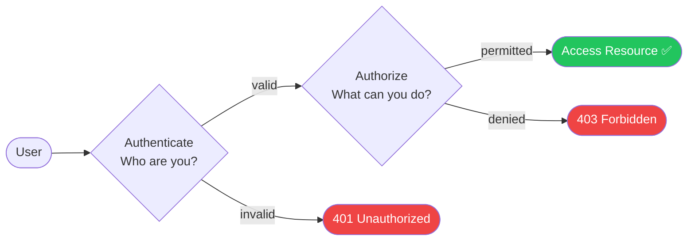

---

### Authentication Methods

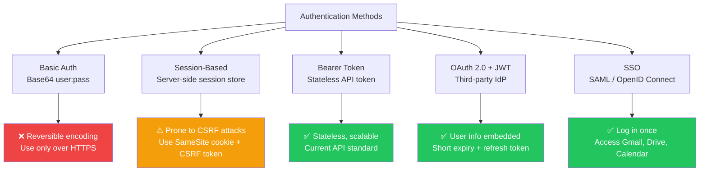

#### Session-Based (CSRF risk)

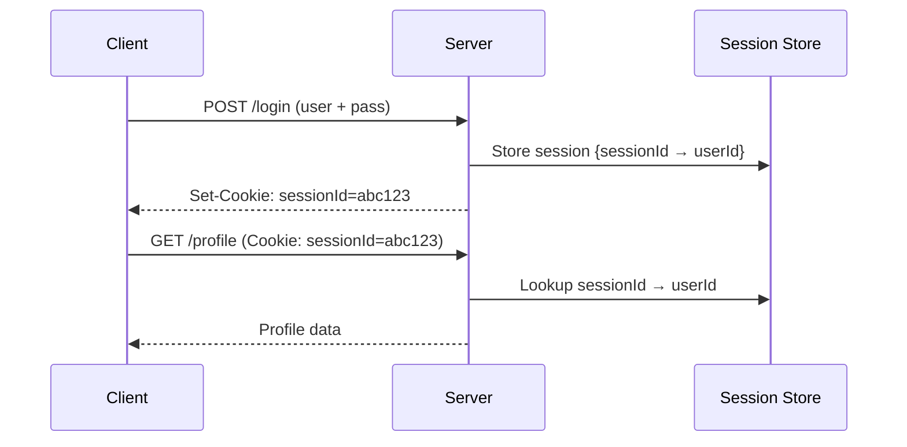

#### JWT / Bearer Token (stateless)

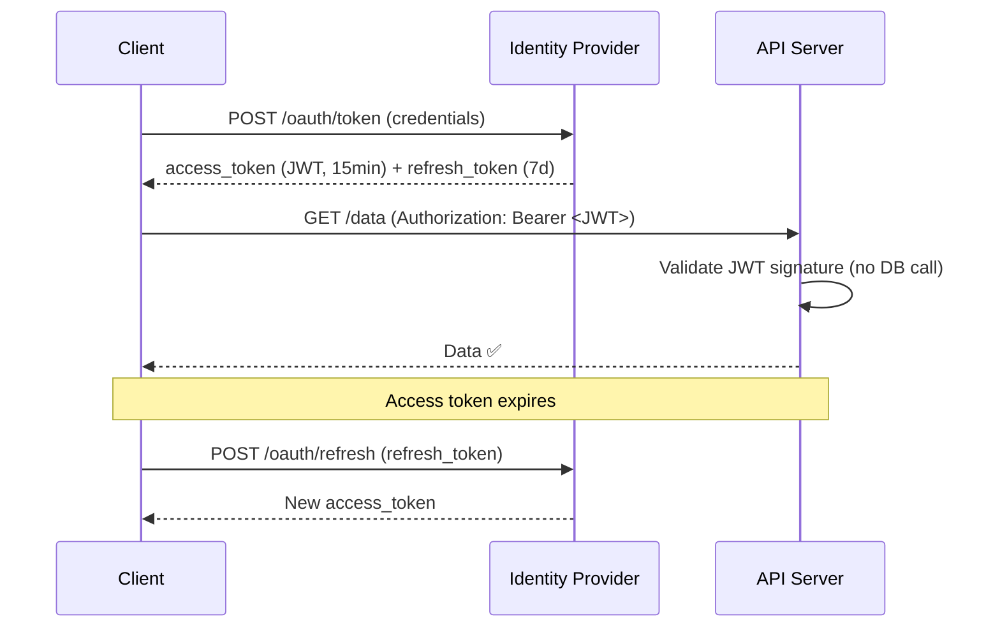

**.NET — JWT Setup (ASP.NET Core):**

```csharp
// Program.cs
builder.Services
    .AddAuthentication(JwtBearerDefaults.AuthenticationScheme)
    .AddJwtBearer(options =>
    {
        options.TokenValidationParameters = new TokenValidationParameters
        {
            ValidateIssuer = true,
            ValidateAudience = true,
            ValidateLifetime = true,
            ValidateIssuerSigningKey = true,
            ValidIssuer = builder.Configuration["Jwt:Issuer"],
            ValidAudience = builder.Configuration["Jwt:Audience"],
            IssuerSigningKey = new SymmetricSecurityKey(
                Encoding.UTF8.GetBytes(builder.Configuration["Jwt:Key"]!))
        };
    });

app.UseAuthentication();
app.UseAuthorization();
```

```csharp
// JWT best practices
public record JwtClaims(string UserId, string Role);  // never store PII (email, SSN)

// ✅ Use opaque tokens externally, JWT internally (behind API Gateway)
// ✅ Short access token TTL: 15 min
// ✅ Refresh tokens: server-side storage + rotation on use
// ❌ Never store PII (email, SSN, credit card) in JWT payload
// ❌ Never use alg:none
```

---

### Authorization Models

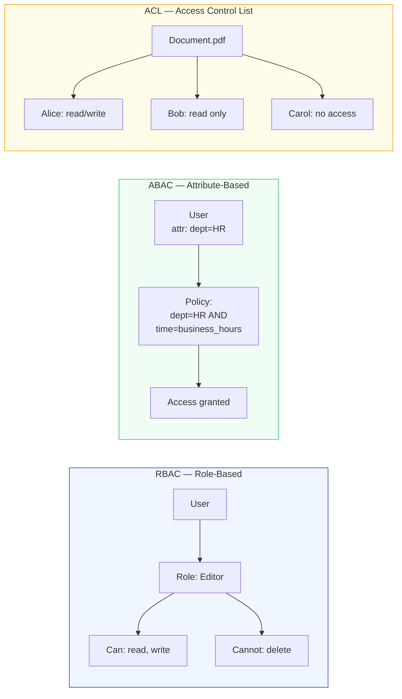

**.NET — Policy-based authorization (covers RBAC + ABAC):**

```csharp
// Program.cs
builder.Services.AddAuthorization(options =>
{
    // RBAC: role-based
    options.AddPolicy("AdminOnly", p => p.RequireRole("Admin"));

    // ABAC: attribute-based (custom requirement)
    options.AddPolicy("HRBusinessHours", p =>
        p.RequireClaim("department", "HR")
         .AddRequirements(new BusinessHoursRequirement()));
});

// Endpoint
app.MapDelete("/users/{id}", [Authorize(Policy = "AdminOnly")] async (string id) => { ... });
```

### Interview Talking Points

| Question | Answer |
|---|---|
| Session vs Token auth? | Session: server stores state, CSRF-vulnerable. Token (JWT): stateless, scales horizontally |
| Why JWT over opaque tokens internally? | JWT: no DB lookup for validation — just verify signature. Faster at scale |
| What to store in JWT? | User ID, role, expiry. Never PII (email, SSN). Minimize payload size |
| Access + Refresh token pattern? | Access token: short-lived (15 min) for API calls. Refresh token: long-lived (7d), stored server-side, rotated on use |
| RBAC vs ABAC? | RBAC: role → permissions (simple, most common). ABAC: fine-grained rules on attributes (flexible, complex) |
| OAuth 2.0 vs SSO? | OAuth 2.0 is delegated authorization protocol. SSO is the user experience (single login, multiple services) — often implemented via OAuth 2.0 / OIDC |

---

## 2. Cookies vs Cache

### Overview

Cookies and cache solve different problems. Cookies persist **user-specific state** across sessions; cache stores **frequently accessed shared data** for performance.

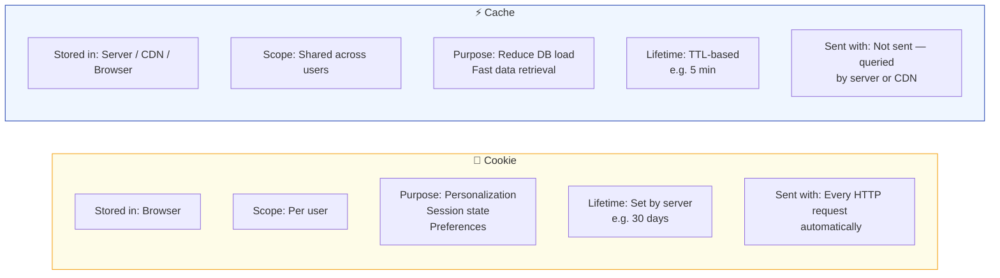

| Feature | Cookie | Cache |
|---|---|---|
| **Stored at** | Browser (client-side) | Server, Redis, CDN |
| **Scope** | Per user, per browser | Shared across all users |
| **Purpose** | User state, personalization, session | Performance, reduce DB load |
| **Expires** | Server-set expiry or session end | TTL (e.g., 5 min, 1 hour) |
| **Sent automatically?** | Yes — with every HTTP request | No — queried explicitly |
| **Examples** | Login sessions, shopping cart, theme | Product listings, search results |

> **Interview Language:** "Cookies store *user-specific, long-lived* data like session identifiers and preferences — they travel with every request. Cache stores *frequently accessed, shared* data server-side to avoid repeated DB queries."

---

## 3. LLD vs HLD — Topic Guide

### Overview

**Low-Level Design (LLD)** focuses on code-level structure and patterns. **High-Level Design (HLD)** focuses on distributed system topology and data flow.

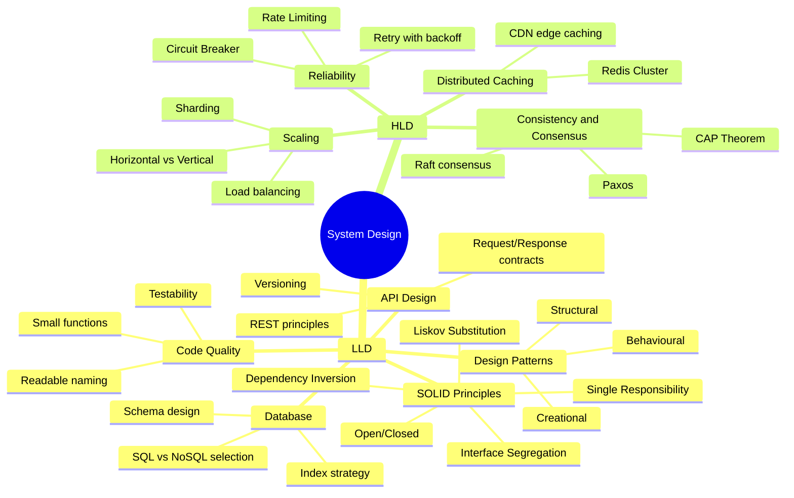

| LLD Focus | HLD Focus |
|---|---|
| Class diagrams, API contracts | System topology, data flow |
| SOLID principles | CAP theorem, consensus |
| Design patterns (Factory, Observer) | Caching, CDN, replication |
| SQL schema, indexes | Sharding, partitioning |
| Unit-testable code | SLA, availability, latency targets |

---

## 4. Database Deletion, GDPR & Storage Reclamation

### Overview

Data deletion has three layers: logical (soft delete), physical (hard delete), and storage disc. GDPR requires the ability to permanently erase personal data on request.

### Deletion Architecture

```mermaid
flowchart TD
    CMD[DELETE Command] --> LYR{Layer}

    LYR --> L1[Logical Layer\nSoft Delete]
    LYR --> L2[Physical Layer\nHard Delete]
    LYR --> L3[Storage Disc\nActual deallocation]

    L1 --> SD[UPDATE table\nSET deleted_at = NOW()\nWHERE id = 12\nSpace NOT reclaimed ❌]
    L2 --> HD[DELETE FROM table\nWHERE id = 12\nPage marked free ✅]
    L3 --> RECLAIM[OS reallocates pages\nVACUUM / REINDEX]

    style SD fill:#f59e0b,color:#fff
    style HD fill:#22c55e,color:#fff
```

### Soft Delete vs Hard Delete

| Feature | Soft Delete | Hard Delete |
|---|---|---|
| SQL | `UPDATE SET deleted_at = NOW()` | `DELETE FROM table WHERE id = ?` |
| Space reclaimed? | ❌ No | ✅ Yes (after VACUUM) |
| Auditable? | ✅ Full history | ❌ Data gone |
| GDPR compliant? | ❌ Not alone — need erasure step | ✅ With VACUUM |
| Recovery? | ✅ Easy — set deleted_at = NULL | ❌ Requires backup |

**.NET — Soft Delete with EF Core global query filter:**

```csharp
// Base entity
public abstract class SoftDeletableEntity
{
    public DateTimeOffset? DeletedAt { get; set; }
    public bool IsDeleted => DeletedAt.HasValue;
}

// DbContext — auto-filter deleted rows from all queries
public class AppDbContext : DbContext
{
    protected override void OnModelCreating(ModelBuilder builder)
    {
        // Apply global filter to every ISoftDeletable entity
        foreach (var entityType in builder.Model.GetEntityTypes()
            .Where(t => typeof(SoftDeletableEntity).IsAssignableFrom(t.ClrType)))
        {
            builder.Entity(entityType.ClrType)
                .HasQueryFilter(BuildSoftDeleteFilter(entityType.ClrType));
        }
    }

    private static LambdaExpression BuildSoftDeleteFilter(Type type)
    {
        var param = Expression.Parameter(type, "e");
        var prop = Expression.Property(param, nameof(SoftDeletableEntity.DeletedAt));
        var body = Expression.Equal(prop, Expression.Constant(null, typeof(DateTimeOffset?)));
        return Expression.Lambda(body, param);
    }
}

// GDPR erasure — hard delete personal data on right-to-erasure request
public async Task EraseUserDataAsync(Guid userId)
{
    await _db.Database.ExecuteSqlRawAsync(
        "DELETE FROM users WHERE id = {0}", userId);
    await _db.Database.ExecuteSqlRawAsync(
        "DELETE FROM user_orders WHERE user_id = {0}", userId);
    // Trigger VACUUM ANALYZE on PostgreSQL via scheduled job
}
```

### Storage Reclamation (DBA Tasks)

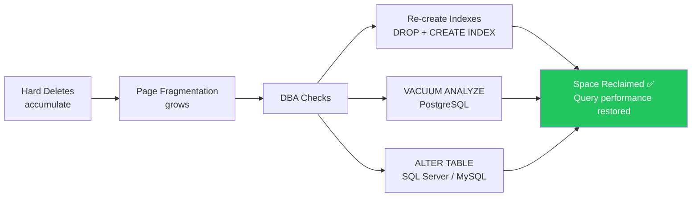

**DBA monitoring targets:**

| Metric | Threshold | Action |
|---|---|---|
| Transaction log growth | > 80% of allocated size | Shrink / archive log |
| Page fragmentation | > 30% | Rebuild index |
| Dead tuple % (PostgreSQL) | > 20% | Run VACUUM |
| Auto-vacuum frequency | Rarely running | Tune `autovacuum_vacuum_cost_delay` |

### Interview Talking Points

| Question | Answer |
|---|---|
| Soft delete vs hard delete? | Soft: marks row deleted, keeps data for audit/recovery. Hard: removes row, space reclaimed after VACUUM |
| How to achieve GDPR right-to-erasure? | Hard delete personal data + cascade to related tables + log the erasure event |
| Why doesn't DELETE free disk space immediately? | DB marks pages as logically free but physical deallocation requires VACUUM (Postgres) or DBCC SHRINKDATABASE (SQL Server) |
| EF Core soft delete pattern? | Global query filter on `DeletedAt IS NULL` applied at `DbContext` level — transparent to all queries |

---

## 5. Data Deduplication

### Overview

Deduplication stores a file **once** at a canonical location. All other references point to that single copy — saving storage while maintaining the illusion of separate files.

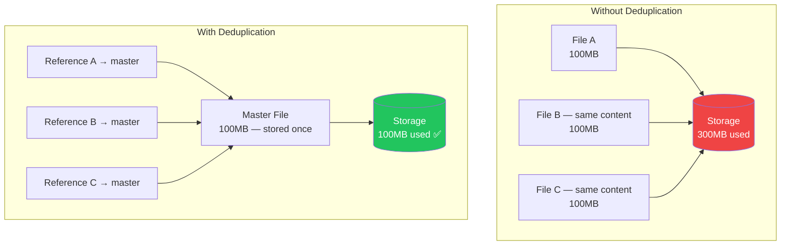

**How it works:** Content-addressable storage — hash the file (SHA-256), store the hash as the key, the content as the value. If the hash already exists, store only a reference (pointer) instead of the content.

```csharp
// Content-addressable storage pattern
public class DeduplicatingBlobService
{
    private readonly IBlobStorage _storage;
    private readonly IHashIndex _index;

    public async Task<string> StoreAsync(Stream content)
    {
        var hash = await ComputeSha256Async(content);

        if (await _index.ExistsAsync(hash))
            return hash;  // already stored — return reference

        content.Position = 0;
        await _storage.UploadAsync(hash, content);
        await _index.RegisterAsync(hash);
        return hash;
    }

    private static async Task<string> ComputeSha256Async(Stream stream)
    {
        using var sha256 = SHA256.Create();
        var hashBytes = await sha256.ComputeHashAsync(stream);
        return Convert.ToHexString(hashBytes).ToLower();
    }
}
```

> **Real-world use:** Dropbox, OneDrive, and git all use content-addressable storage for deduplication. Git blobs are identified by SHA-1 of their content.

---

## 6. VM vs Docker vs Kubernetes

### Overview

VMs provide full OS isolation via a hypervisor. Docker containers share the host OS kernel for lightweight isolation. Kubernetes orchestrates containers across many machines.

### Architecture Comparison

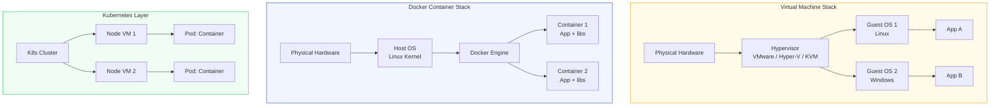

### Comparison Table

| Feature | VM | Docker Container |
|---|---|---|
| **Isolation** | Full OS isolation | Process isolation (shared kernel) |
| **Startup time** | Minutes | Seconds |
| **Size** | GBs (full OS) | MBs (app + libs only) |
| **Overhead** | High (hypervisor + guest OS) | Low (no guest OS) |
| **Security** | Stronger boundary | Weaker (shared kernel) |
| **Use when** | Need OS isolation / different OS | Lightweight, fast-start services |

### Docker Internals

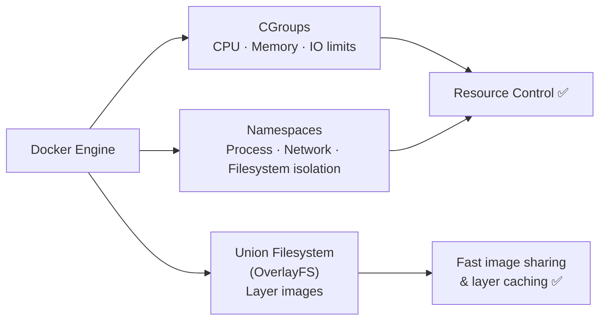

### Kubernetes Role

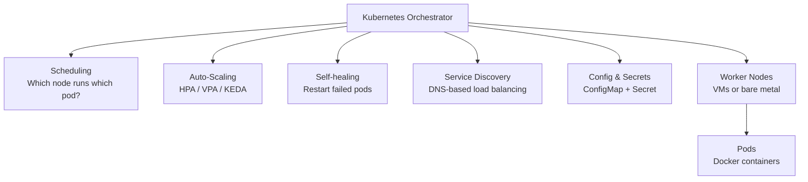

### Interview Talking Points

| Question | Answer |
|---|---|
| VM vs container? | VM: full OS, strong isolation, heavy. Container: shared kernel, lightweight, fast startup |
| What does Docker use internally? | CGroups (resource limits), Namespaces (isolation), OverlayFS (layered images) |
| What does Kubernetes add over Docker? | Orchestration: scheduling, scaling, self-healing, service discovery across many nodes |
| Can you run Docker on a VM? | Yes — and that's the standard production setup. Docker runs inside VMs on cloud nodes |
| What is a Pod? | K8s smallest deployable unit — one or more containers sharing network + storage |

---

## 7. System Scaling Patterns

### Overview

As user base grows, a system must scale across multiple dimensions: compute, data, and content delivery.

### Scaling Decision Tree

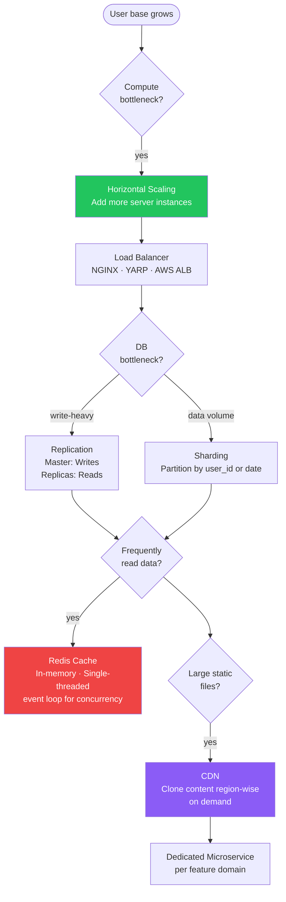

### Key Scaling Techniques

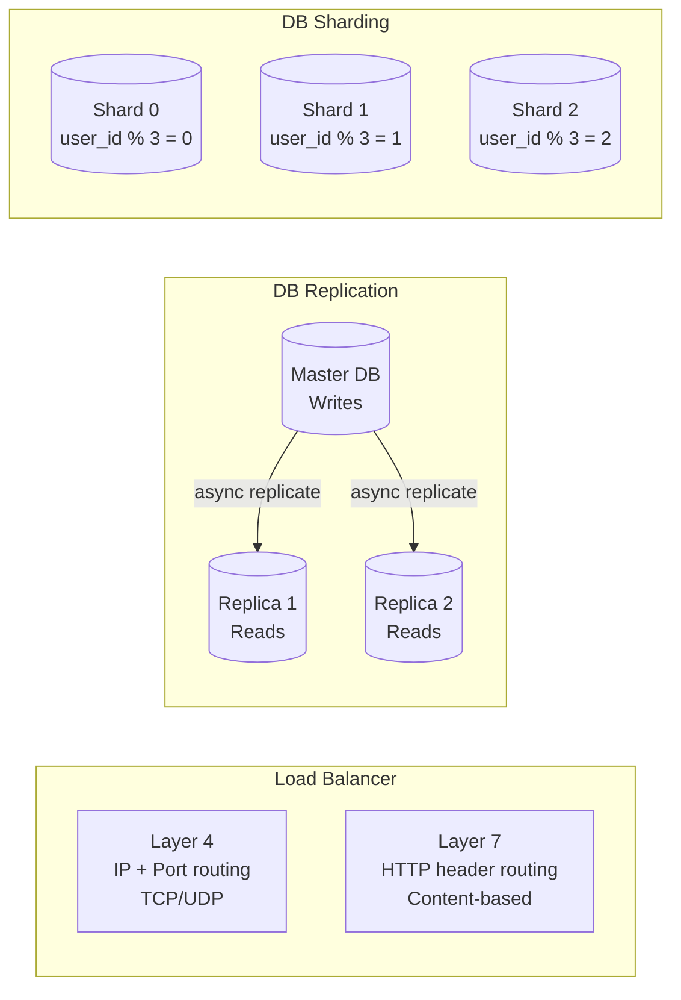

**.NET — Redis cache with StackExchange.Redis:**

```csharp
// Caching pattern with IDistributedCache
public class ProductService : IProductService
{
    private readonly IDistributedCache _cache;
    private readonly IProductRepository _repo;

    public async Task<Product?> GetAsync(string id, CancellationToken ct)
    {
        var key = $"product:{id}";
        var cached = await _cache.GetStringAsync(key, ct);
        if (cached is not null)
            return JsonSerializer.Deserialize<Product>(cached);

        var product = await _repo.FindAsync(id, ct);
        if (product is not null)
            await _cache.SetStringAsync(key, JsonSerializer.Serialize(product),
                new DistributedCacheEntryOptions { AbsoluteExpirationRelativeToNow = TimeSpan.FromMinutes(5) }, ct);

        return product;
    }
}
```

> **Redis — why single-threaded?** Redis uses a single-threaded event loop (like Node.js) for command processing. This eliminates lock contention. It handles 100k+ ops/sec because I/O is the bottleneck, not CPU.

### Interview Talking Points

| Question | Answer |
|---|---|
| Horizontal vs vertical scaling? | Horizontal (scale-out): add more instances. Vertical (scale-up): bigger machine. Horizontal preferred for resilience |
| When to introduce a load balancer? | As soon as you have more than 1 server instance |
| When to shard? | When a single DB node can't hold all data or single-node write throughput is saturated |
| Why Redis for caching? | In-memory (μs latency), single-threaded event loop (no locks), rich data structures, TTL-based expiry |
| Why CDN? | Serve static content (images, JS, CSS, video) from edge nodes geographically close to users — reduces origin load |

---

## 8. Tesla's Trillion-Row Data Architecture

### Overview

Tesla ingests time-series metrics from cars, factories, and energy systems at massive scale. The evolution went from off-the-shelf monitoring (Prometheus) to a purpose-built OLAP wrapper (COMET over ClickHouse).

### Evolution Timeline

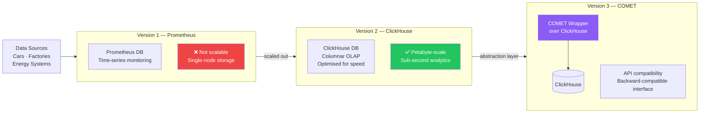

### Why ClickHouse?

| Feature | OLTP (Postgres, MySQL) | OLAP — ClickHouse |
|---|---|---|
| **Optimised for** | Transactional reads/writes | Analytical aggregations |
| **Storage** | Row-oriented | Columnar |
| **Best query** | `SELECT * WHERE id=?` | `SELECT AVG(speed) GROUP BY hour` |
| **Compression** | Moderate | Very high (same-type data per column) |
| **Scale** | Tens of TBs | Petabytes |

> **Why a wrapper (COMET)?** Abstracting ClickHouse behind an API ensures backward compatibility — existing consumers don't break when the underlying storage engine changes.

---

## 9. Webhook vs WebSocket

### Overview

Webhooks are server-initiated HTTP notifications (one-way push). WebSockets create a persistent bidirectional tunnel between client and server. They solve different problems and can be used together.

### Architecture Comparison

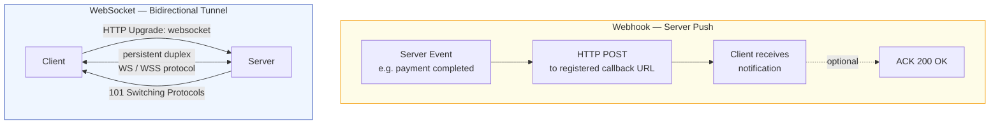

### Feature Comparison

| Feature | Webhook | WebSocket |
|---|---|---|
| **Triggered by** | Server event | Continuous connection |
| **Communication** | One-way (Server → Client) | Two-way (Client ↔ Server) |
| **Connection** | Stateless (HTTP) | Persistent / always open |
| **Real-time** | Near real-time | True real-time |
| **Protocol** | HTTP/HTTPS (POST) | WS / WSS |
| **Use case** | Payment alerts, CI/CD notifications, email triggers | Chat, live dashboards, multiplayer games |
| **Overhead** | Low (fire-and-forget) | Higher (persistent connection maintained) |

**.NET — WebSocket with SignalR (real-time hub):**

```csharp
// Hub
public class ChatHub : Hub
{
    public async Task SendMessage(string user, string message)
        => await Clients.All.SendAsync("ReceiveMessage", user, message);
}

// Program.cs
builder.Services.AddSignalR();
app.MapHub<ChatHub>("/hubs/chat");
```

**.NET — Webhook receiver endpoint:**

```csharp
// Webhook receiver (validates signature, processes event)
app.MapPost("/webhooks/payment", async (
    HttpRequest req,
    [FromHeader(Name = "X-Signature-SHA256")] string signature,
    IWebhookProcessor processor) =>
{
    var body = await req.Body.ReadToEndAsync();

    if (!WebhookSignatureValidator.IsValid(body, signature, config["Webhook:Secret"]))
        return Results.Unauthorized();

    var evt = JsonSerializer.Deserialize<PaymentEvent>(body);
    await processor.HandleAsync(evt!);
    return Results.Ok();
});
```

### Interview Talking Points

| Question | Answer |
|---|---|
| When webhook over WebSocket? | Webhook: server notifies on discrete events (payment done). No persistent connection needed |
| When WebSocket over polling? | Real-time, high-frequency updates (chat, live scores) — polling wastes bandwidth and adds latency |
| Can you use both together? | Yes — webhook for async system events, WebSocket for real-time UI updates |
| Webhook failure handling? | Retry with exponential backoff; queue webhook deliveries; DLQ for failed deliveries |

---

## 10. JavaScript — Async/Await, Promise, Call/Apply/Bind

### Promise & Async/Await

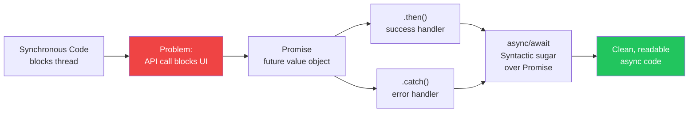

```javascript
// Promise style
fetch('/api/user/1')
  .then(response => response.json())
  .then(user => console.log(user.name))
  .catch(error => console.error('Failed:', error));

// async/await style (same thing, cleaner)
async function loadUser(id) {
  try {
    const response = await fetch(`/api/user/${id}`);
    const user = await response.json();
    console.log(user.name);
  } catch (error) {
    console.error('Failed:', error);
  }
}
```

### Call, Apply, Bind

All three explicitly set `this` context for a function. The difference is in how arguments are passed.

```javascript
const user = { name: 'Raja' };

function greet(greeting, punct) {
  return `${greeting}, ${this.name}${punct}`;
}

// call — args passed individually, invokes immediately
greet.call(user, 'Hello', '!');        // "Hello, Raja!"

// apply — args passed as array, invokes immediately
greet.apply(user, ['Hi', '?']);        // "Hi, Raja?"

// bind — returns NEW function with `this` bound, does not invoke
const boundGreet = greet.bind(user);
boundGreet('Hey', '.');                // "Hey, Raja."
```

| Method | Invokes immediately? | Args format |
|---|---|---|
| `call` | Yes | Individual args |
| `apply` | Yes | Array of args |
| `bind` | No (returns new fn) | Individual args (at bind or call time) |

### Debounce vs Throttle

```javascript
// Debounce — delay execution until N ms after last call
// Use case: search-as-you-type (don't fire API on every keystroke)
function debounce(fn, delay) {
  let timer;
  return (...args) => {
    clearTimeout(timer);
    timer = setTimeout(() => fn(...args), delay);
  };
}

const search = debounce((query) => fetchResults(query), 300);
input.addEventListener('input', (e) => search(e.target.value));
```

### Memory Leaks in JS

Common causes:

| Cause | Example | Fix |
|---|---|---|
| Detached DOM nodes | Store ref to element, remove from DOM but ref persists | Set variable to `null` |
| Forgotten event listeners | Add listener but never remove | `removeEventListener` in cleanup |
| Closures holding large data | Inner fn references outer large array | Release when done |
| Unreleased timers | `setInterval` never cleared | `clearInterval` in cleanup / useEffect return |

---

## 11. Username Availability at Scale

### Overview

At Google/Amazon scale, checking username availability must be near-instantaneous without hitting the main database on every keystroke. Multiple data structures are layered to achieve this.

### Request Flow

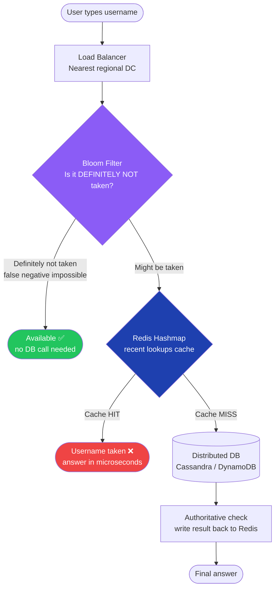

### Data Structures Explained

```mermaid
flowchart LR
    subgraph BF2["Bloom Filter"]
        BFN[Probabilistic\nspace-efficient\nNo false negatives\nPossible false positives]
    end

    subgraph REDIS2["Redis Hashmap"]
        RN["HSET usernames raja 1\nHGET usernames raja\nO(1) microsecond lookup"]
    end

    subgraph TRIE["Trie / Prefix Tree"]
        TN[Shared-prefix tree\nraj → raja, rajesh\nEnables autocomplete]
    end

    subgraph BTREE["B+ Tree (DB Index)"]
        BTN[Sorted index in DB\nLog(n) lookup\nRange queries]
    end
```

**.NET — Username check with Bloom Filter + Redis:**

```csharp
// Redis Hashmap check
public class UsernameAvailabilityService
{
    private readonly IDatabase _redis;
    private readonly IBloomFilter _bloomFilter;  // e.g. StackExchange.Redis + Redisbloom module
    private readonly IUserRepository _repo;

    public async Task<AvailabilityResult> CheckAsync(string username)
    {
        var normalised = username.ToLowerInvariant();

        // Layer 1: Bloom Filter — fastest, no false negatives
        // If bloom says "not present" → definitely available (skip Redis + DB)
        if (!await _bloomFilter.ExistsAsync("usernames", normalised))
            return AvailabilityResult.Available;

        // Layer 2: Redis Hashmap — microsecond in-memory check
        var cached = await _redis.HashGetAsync("usernames", normalised);
        if (cached.HasValue)
            return AvailabilityResult.Taken;

        // Layer 3: Authoritative DB check
        var exists = await _repo.ExistsByUsernameAsync(normalised);
        if (exists)
            await _redis.HashSetAsync("usernames", normalised, 1,
                When.NotExists);

        return exists ? AvailabilityResult.Taken : AvailabilityResult.Available;
    }
}
```

### Interview Talking Points

| Question | Answer |
|---|---|
| Why Bloom Filter first? | Zero false negatives — if it says "not present", definitely not in DB. Skip all other lookups |
| Bloom Filter false positives? | Acceptable — just means an extra Redis/DB check. Doesn't incorrectly block a valid username |
| Why Redis Hashmap not just String? | `HSET usernames raja 1` groups all usernames under one key — memory efficient, batch operations possible |
| Why Trie? | Autocomplete and prefix search (suggest "raja", "rajesh" when user types "raj") |
| Why Cassandra/DynamoDB? | Linear scale, eventual consistency fine for reads — worst case: two users simultaneously claim same name, resolved by DB unique constraint |

---

## 12. CAP Theorem & Distributed Systems Concepts

### 1. CAP Theorem

A distributed system can guarantee at most **two** of: Consistency, Availability, Partition Tolerance.

```mermaid
flowchart TD
    CAP((CAP Theorem)) --> C[Consistency\nAll nodes see\nsame data at same time]
    CAP --> A[Availability\nEvery request gets\na response]
    CAP --> P[Partition Tolerance\nSystem works despite\nnetwork failures]

    P --> MUST[Network partitions\nare unavoidable\nP is always required]
    MUST --> CHOOSE{Choose one to sacrifice}
    CHOOSE --> CP[CP Systems\nConsistency + Partition\ne.g. Google Spanner\nHBase · Zookeeper]
    CHOOSE --> AP[AP Systems\nAvailability + Partition\ne.g. DynamoDB · Cassandra\nCouchDB]

    style MUST fill:#f59e0b,color:#fff
    style CP fill:#1e40af,color:#fff
    style AP fill:#22c55e,color:#fff
```

### 2. Eventual Consistency

```mermaid
sequenceDiagram
    participant W as Writer
    participant N1 as Node 1 (Primary)
    participant N2 as Node 2 (Replica)
    participant R as Reader

    W->>N1: Write: username=raja
    N1-->>W: ACK (write complete)
    Note over N1,N2: Async replication in progress
    R->>N2: Read username
    N2-->>R: Old value (stale read ⚠️)
    Note over N2: Replication completes
    R->>N2: Read username again
    N2-->>R: raja ✅ (eventually consistent)
```

**Conflict resolution strategies:**
- **Last Write Wins (LWW):** timestamp-based, simple but can lose updates
- **CRDTs (Conflict-free Replicated Data Types):** mathematically merge concurrent edits (used in collaborative editors)

### 3. Load Balancing — L4 vs L7

| Feature | L4 (Transport Layer) | L7 (Application Layer) |
|---|---|---|
| Routes on | IP + Port | HTTP headers, URL path, cookies |
| Sees content? | No | Yes |
| Speed | Faster (less processing) | Slightly slower (parses HTTP) |
| Routing logic | IP hash, round-robin | Path-based, header-based, sticky sessions |
| Example | AWS NLB, HAProxy TCP | AWS ALB, NGINX, YARP |

### 4. Consistent Hashing

```mermaid
flowchart LR
    subgraph RING["Hash Ring (360°)"]
        N1((Node 1\n0°–120°))
        N2((Node 2\n120°–240°))
        N3((Node 3\n240°–360°))
        K1[Key A → 50°\nroutes to Node 1]
        K2[Key B → 200°\nroutes to Node 2]
    end

    ADD[Add Node 4\nat 180°] --> MINIMAL[Only keys\n180°–240°\nremapped ✅\nNot all keys]

    style MINIMAL fill:#22c55e,color:#fff
```

> Without consistent hashing: adding a node remaps `N % (nodes+1)` keys — catastrophic cache invalidation. With consistent hashing: only `K/N` keys move.

### 5. Circuit Breaker States

```mermaid
stateDiagram-v2
    [*] --> Closed

    Closed --> Open : failure rate > threshold\n(e.g. 50% in last 10 calls)
    Open --> HalfOpen : after waitDuration (30s)
    HalfOpen --> Closed : test call succeeds ✅
    HalfOpen --> Open : test call fails ❌

    Closed : CLOSED\nNormal operation — requests flow
    Open : OPEN\nAll calls fail fast → fallback()
    HalfOpen : HALF-OPEN\nOne test request allowed
```

### 6. Rate Limiting Algorithms

```mermaid
flowchart LR
    subgraph TB["Token Bucket"]
        TBB[Bucket: N tokens\nRefills at rate R/sec]
        TBB -->|each request\nconsumes 1 token| TBR{tokens > 0?}
        TBR -->|yes| TBA[Allow ✅]
        TBR -->|no| TBD[Reject 429 ❌]
    end

    subgraph LB2["Leaky Bucket"]
        LBQ[Queue: fixed size\nprocesses at constant rate]
        LBQ -->|if queue full| LBD[Reject ❌]
        LBQ -->|steady rate| LBA[Allow ✅]
    end
```

### 7. Monitoring & Observability — Four Signals

```mermaid
flowchart TD
    OBS[Observability] --> MET[Metrics\nPrometheus · Datadog\nnumeric, aggregatable]
    OBS --> LOG[Logs\nSerilog · ELK Stack\nstructured events]
    OBS --> TRC[Traces\nOpenTelemetry · Jaeger\ndistributed request path]
    OBS --> EVT[Events\nApplication Insights\ndiscrete occurrences]

    MET & LOG & TRC & EVT --> DASH[Dashboard\nGrafana]
    DASH --> ALERT[Alerting\nAlertmanager → Slack\nPagerDuty]
```

**.NET — OpenTelemetry setup:**

```csharp
builder.Services.AddOpenTelemetry()
    .WithTracing(tracing => tracing
        .AddAspNetCoreInstrumentation()
        .AddHttpClientInstrumentation()
        .AddSqlClientInstrumentation()
        .AddOtlpExporter())
    .WithMetrics(metrics => metrics
        .AddAspNetCoreInstrumentation()
        .AddPrometheusExporter());
```

---

## 13. Microservices Database Patterns

### Overview

Each microservice should own its data. When transactions span services, use distributed transaction patterns.

### Pattern Overview

```mermaid
flowchart TD
    ANTI[Anti-Pattern\nShared Database ❌] --> PROB[Deadlocks · Tight coupling\nCan't scale independently]
    GOOD[Recommended:\nSeparate DB per Service ✅] --> DIST{Cross-service\ntransaction?}

    DIST --> TPC[Two-Phase Commit\n2PC]
    DIST --> SAGA[Saga Pattern\nevent-driven]
    DIST --> COMPOSE[API Composition\nread-only aggregation]
    DIST --> CQRS2[CQRS\nseparate read/write DB]
    DIST --> ES[Event Sourcing\nimmutable event log]

    style ANTI fill:#ef4444,color:#fff
    style GOOD fill:#22c55e,color:#fff
```

### Saga Pattern

```mermaid
sequenceDiagram
    participant O as Order Service
    participant P as Payment Service
    participant I as Inventory Service
    participant MQ as Kafka

    O->>MQ: order-placed event
    MQ->>P: consume order-placed
    P->>P: Charge payment
    P->>MQ: payment-done event

    alt Payment succeeds
        MQ->>I: consume payment-done
        I->>I: Deduct stock
        I->>MQ: stock-deducted event
    else Payment fails
        P->>MQ: payment-failed event
        MQ->>O: consume payment-failed
        O->>O: Compensating tx:\nCancel order ↩️
    end
```

### CQRS — Command Query Responsibility Segregation

```mermaid
flowchart LR
    CLIENT[Client] -->|Write Command| WRITE_DB[(Write DB\nPostgreSQL\nstrongly consistent)]
    CLIENT -->|Read Query| READ_DB[(Read DB\nMongoDB / Elasticsearch\noptimised for queries)]

    WRITE_DB -->|event: data changed| SYNC[Event / CDC\nSync to Read DB]
    SYNC --> READ_DB

    style WRITE_DB fill:#1e40af,color:#fff
    style READ_DB fill:#8b5cf6,color:#fff
```

**.NET — CQRS with MediatR:**

```csharp
// Command (Write side)
public record CreateOrderCommand(string UserId, List<OrderItem> Items) : IRequest<Guid>;

public class CreateOrderHandler : IRequestHandler<CreateOrderCommand, Guid>
{
    private readonly IOrderWriteRepository _repo;
    private readonly IPublisher _publisher;

    public async Task<Guid> Handle(CreateOrderCommand cmd, CancellationToken ct)
    {
        var order = Order.Create(cmd.UserId, cmd.Items);
        await _repo.SaveAsync(order, ct);
        await _publisher.Publish(new OrderCreatedEvent(order.Id), ct);
        return order.Id;
    }
}

// Query (Read side — separate read model)
public record GetOrderQuery(Guid OrderId) : IRequest<OrderReadModel>;

public class GetOrderHandler : IRequestHandler<GetOrderQuery, OrderReadModel>
{
    private readonly IOrderReadRepository _readRepo;  // MongoDB or denormalised view

    public async Task<OrderReadModel> Handle(GetOrderQuery q, CancellationToken ct)
        => await _readRepo.FindAsync(q.OrderId, ct);
}
```

### Event Sourcing

```mermaid
flowchart LR
    CMD[Command:\nAddItemToCart] --> EVT[Event:\nItemAddedToCart\n{productId, qty, timestamp}]
    EVT --> LOG[(Event Log\nImmutable append-only)]

    LOG -->|replay all events| STATE[Current State\nCart = [item1, item2]]
    LOG -->|audit| HIST[Full history\nfor compliance]
    LOG -->|snapshot| SNAP[Snapshot\nevery N events\nfaster replay]

    style LOG fill:#1e40af,color:#fff
    style HIST fill:#22c55e,color:#fff
```

### Interview Talking Points

| Question | Answer |
|---|---|
| Why separate databases per service? | Independent scaling, tech choice per service, no cross-service coupling or deadlocks |
| 2PC vs Saga? | 2PC: synchronous, all-or-nothing but blocks. Saga: async, eventual consistency, compensating transactions on failure |
| CQRS benefit? | Read and write DBs optimised independently — ElasticSearch for reads, Postgres for writes |
| Event Sourcing benefit? | Full audit log, time-travel queries, rebuild state by replaying events, natural fit for CQRS |
| Shared DB anti-pattern problem? | Service A's schema change breaks Service B; can't scale them independently; teams block each other |

---

## 14. API Gateway

### Overview

An API Gateway is a thin layer introduced in 2013–2014 to act as the single entry point for all microservice clients. It handles cross-cutting concerns so individual services don't have to.

### Architecture

```mermaid
flowchart TD
    WEB[Web Client] --> GW
    MOB[Mobile Client] --> GW
    IOT[IoT Device] --> GW

    GW["API Gateway\nYARP / Ocelot / Kong\nAWS API GW / Azure APIM"]

    GW --> F1[Request Validation\nFormat · Headers]
    GW --> F2[Middleware\nAuth · Rate Limit · Cache]
    GW --> F3[Routing\nPath → Service map]
    GW --> F4[Response Transform\ngRPC → JSON · Protocol bridge]

    F3 --> SVC1[Order Service]
    F3 --> SVC2[Product Service]
    F3 --> SVC3[User Service]

    style GW fill:#0f172a,color:#fff
```

### Key Functions

| Function | What it does | Example |
|---|---|---|
| **Request Validation** | Check headers, format, required fields | Reject missing `Content-Type` |
| **Authentication** | Validate JWT — services don't do this individually | Verify Bearer token before routing |
| **Rate Limiting** | Throttle per API key / IP | 1000 req/min per client |
| **Routing** | Map `/orders/*` → Order Service | Path-based, header-based, weight-based |
| **Response Transform** | Convert protocol or shape | gRPC → JSON, trim fields |
| **Caching** | Cache GET responses | Cache product catalog at gateway |

**.NET — YARP (Yet Another Reverse Proxy) gateway:**

```csharp
// Program.cs
builder.Services.AddReverseProxy()
    .LoadFromConfig(builder.Configuration.GetSection("ReverseProxy"));

// appsettings.json
{
  "ReverseProxy": {
    "Routes": {
      "order-route": {
        "ClusterId": "order-cluster",
        "Match": { "Path": "/api/orders/{**catch-all}" },
        "Transforms": [{ "PathPattern": "/api/orders/{**catch-all}" }]
      }
    },
    "Clusters": {
      "order-cluster": {
        "Destinations": {
          "order-svc": { "Address": "http://order-service:8080" }
        }
      }
    }
  }
}
```

### Popular API Gateways

| Type | Product |
|---|---|
| Managed (cloud) | AWS API Gateway, Azure API Management |
| Open-source self-hosted | Kong, Tyk, Express Gateway |
| .NET-native | YARP (Microsoft), Ocelot |

### Interview Talking Points

| Question | Answer |
|---|---|
| API Gateway vs Load Balancer? | LB distributes traffic across identical instances. Gateway routes to different services and handles cross-cutting concerns |
| Why mention API Gateway in interviews? | It's expected in any microservices design — interviewers look for it as the standard entry-point pattern |
| What not to put in a gateway? | Business logic — gateway is infra, not domain |
| Gateway as single point of failure? | Run multiple gateway instances behind a load balancer with health checks |

---

## 15. Backend for Frontend (BFF)

### Overview

The BFF pattern creates a **dedicated backend per client type** (web, mobile, IoT). Each BFF aggregates data from multiple microservices and returns exactly what its client needs — no over-fetching, no under-fetching.

### Problem → Solution

```mermaid
flowchart TD
    subgraph PROBLEM["Problem — Single API Gateway"]
        W[Web App\nneeds 20 fields] --> GW1[Generic API Gateway]
        M[Mobile App\nneeds 5 fields] --> GW1
        A[Alexa\nneeds speech text] --> GW1
        GW1 -->|returns all 20 fields to everyone| BLOAT[❌ Over-fetching\nBloated responses\nHard to maintain]
    end

    subgraph SOLUTION["Solution — BFF Pattern"]
        W2[Web App] --> WBFF[Web BFF\nfull product + reviews\n+ seller + pricing]
        M2[Mobile App] --> MBFF[Mobile BFF\ncompact product\n+ AR service\nno reviews]
        A2[Alexa] --> ABFF[Voice BFF\nspeech-optimised\ntext only]

        WBFF & MBFF & ABFF --> SVCS[Core Microservices\nProduct · Seller · Review\nAR · Inventory]
    end

    style BLOAT fill:#ef4444,color:#fff
    style WBFF fill:#22c55e,color:#fff
    style MBFF fill:#22c55e,color:#fff
    style ABFF fill:#22c55e,color:#fff
```

### BFF vs API Gateway

| Feature | API Gateway | BFF |
|---|---|---|
| **Client specificity** | Generic — same response to all | Tailored per client type |
| **Code** | Thin routing + middleware | Client-specific aggregation logic |
| **Maintained by** | Platform / infra team | Client-owning team (ideally) |
| **Data filtering** | Minimal | Yes — sends only what client needs |

### BFF Data Aggregation (.NET)

```csharp
// Mobile BFF — aggregates product + seller, skips reviews
[ApiController, Route("mobile/v1")]
public class MobileProductController : ControllerBase
{
    private readonly IProductClient _product;
    private readonly ISellerClient _seller;
    private readonly IArClient _ar;

    [HttpGet("products/{id}")]
    public async Task<MobileProductResponse> Get(string id)
    {
        // Parallel fan-out to microservices
        var (product, seller, arAsset) = await (
            _product.GetCompactAsync(id),
            _seller.GetAsync(id),
            _ar.GetAssetAsync(id)
        );

        return new MobileProductResponse(
            product.Id, product.Name, product.ThumbnailUrl,   // compact — no full description
            seller.Name, seller.Rating,
            arAsset.ModelUrl
            // reviews deliberately excluded — saves bandwidth on mobile
        );
    }
}
```

### Advantages & Disadvantages

| ✅ Advantages | ❌ Disadvantages |
|---|---|
| Client gets exactly what it needs | More components to deploy and monitor |
| Client-specific tweaks deploy independently | Risk of duplicated logic across BFFs |
| Sensitive data filtered at BFF layer | Extra network hop → slight latency increase |
| Different protocols per client (REST vs gRPC) | Team ownership must be clear |
| Request aggregation reduces client calls | Not worth it if clients have similar needs |

> **Netflix uses BFF:** separate backends for Android, iOS, TV, and web — each optimised (e.g., TV gets 4K assets, mobile gets compressed images).

---

## 16. Database Multi-Tenancy

### Overview

Multi-tenancy means one application serves multiple tenants (customers). Single-tenancy means each customer gets their own dedicated application and database.

### Three Models

```mermaid
flowchart TD
    MT[Multi-Tenancy\nApproaches] --> SD[Shared Database\nShared Schema]
    MT --> SS[Shared Database\nSeparate Schema]
    MT --> DD[Dedicated Database\nper Tenant]

    SD --> SD_PRO["✅ Easy to deploy\n✅ Cheapest\n✅ Easy to scale"]
    SD --> SD_CON["❌ Row-level isolation only\n❌ Noisy neighbour risk\n❌ Compliance harder"]

    SS --> SS_PRO["✅ Stronger isolation\n✅ Per-tenant backups\n✅ Custom schema possible"]
    SS --> SS_CON["❌ Schema migrations complex\n❌ Performance with many schemas"]

    DD --> DD_PRO["✅ Maximum isolation\n✅ No noisy neighbour\n✅ Per-tenant scaling"]
    DD --> DD_CON["❌ Most expensive\n❌ Complex provisioning\n❌ Migration overhead"]

    style SD_CON fill:#f59e0b,color:#fff
    style SS_CON fill:#f59e0b,color:#fff
    style DD_PRO fill:#22c55e,color:#fff
```

### Model Comparison

| Feature | Shared DB + Schema | Shared DB + Schema-per-tenant | Dedicated DB |
|---|---|---|---|
| **Isolation** | Row-level (`tenant_id`) | Schema-level | Full DB isolation |
| **Cost** | Lowest | Medium | Highest |
| **Data leak risk** | Medium (query bug) | Low | Minimal |
| **Compliance (GDPR, HIPAA)** | Harder | Easier | Easiest |
| **Migration complexity** | Simple | Complex | Very complex |
| **Noisy neighbour** | Yes | Partial | No |

**.NET EF Core — Shared DB with global tenant filter:**

```csharp
// Tenant context
public interface ITenantContext { Guid TenantId { get; } }

// Base entity
public abstract class TenantEntity
{
    public Guid TenantId { get; set; }
}

// DbContext — auto-filter by tenant
public class AppDbContext : DbContext
{
    private readonly ITenantContext _tenant;

    protected override void OnModelCreating(ModelBuilder builder)
    {
        // Apply global query filter — every query auto-scoped to current tenant
        builder.Entity<Order>()
            .HasQueryFilter(o => o.TenantId == _tenant.TenantId);

        builder.Entity<Product>()
            .HasQueryFilter(p => p.TenantId == _tenant.TenantId);
    }
}

// Schema-per-tenant: set search_path at connection level (PostgreSQL)
public class TenantSchemaInterceptor : DbConnectionInterceptor
{
    public override async ValueTask<InterceptionResult> ConnectionOpeningAsync(
        DbConnection connection, ConnectionEventData eventData, InterceptionResult result, CancellationToken ct)
    {
        await connection.OpenAsync(ct);
        var schemaName = $"tenant_{_tenant.TenantId:N}";
        using var cmd = connection.CreateCommand();
        cmd.CommandText = $"SET search_path = '{schemaName}', public;";
        await cmd.ExecuteNonQueryAsync(ct);
        return InterceptionResult.Suppress();
    }
}
```

### Interview Talking Points

| Question | Answer |
|---|---|
| Which model for a startup SaaS? | Shared DB + tenant_id — cheapest, easiest to operate. Add isolation later as needed |
| When to move to dedicated DB? | When compliance (HIPAA, GDPR), SLA isolation, or enterprise contract requires it |
| Noisy neighbour problem? | One tenant's heavy query degrades others. Mitigate: query limits, connection pooling per tenant, dedicated DB |
| EF Core tenant isolation? | Global query filter on `TenantId` property — transparent to all queries, prevents cross-tenant data leaks |

---

## 17. Frontend Architecture — MFE, React Patterns & System Design

### Micro-Frontend (MFE)

MFE applies microservices thinking to the frontend — each team owns an independent slice of the UI.

```mermaid
flowchart TD
    SHELL[Shell / Container App\nRouting · Auth · Layout] --> PROD_MFE[Product MFE\nTeam A · React]
    SHELL --> CART_MFE[Cart MFE\nTeam B · Vue]
    SHELL --> REC_MFE[Recommendations MFE\nTeam C · React]

    PROD_MFE -->|API| PROD_BFF[Product BFF]
    CART_MFE -->|API| CART_BFF[Cart BFF]
    REC_MFE -->|API| ML_SVC[ML Service]

    style SHELL fill:#0f172a,color:#fff
    style PROD_MFE fill:#1e40af,color:#fff
    style CART_MFE fill:#8b5cf6,color:#fff
    style REC_MFE fill:#22c55e,color:#fff
```

**MFE Pros & Cons:**

| ✅ Pros | ❌ Cons |
|---|---|
| Independent deployments per team | Increased infrastructure complexity |
| Tech flexibility (React + Vue in same page) | Potential style/UX inconsistency |
| Isolated failures (cart down ≠ product page down) | Duplication risk across MFEs |
| Separate CI/CD pipelines | Bundle size management harder |

---

### Frontend System Design Framework

```mermaid
mindmap
  root((Frontend\nSystem Design))
    Features
      MVP scope
      Core functionality
      High-level estimation
    Non-Functional
      Performance
        CDN
        Lazy loading
        Code splitting
        Caching
      Security
        XSS prevention
        CSRF tokens
        CSP headers
      Offline mode
        localStorage
        IndexedDB
        Service Workers
      High Availability
        Load balancers
        Health checks
    User Experience
      Accessibility
        Screen readers
        Color contrast
        Keyboard nav
      Perceived performance
        Loading indicators
        Skeleton screens
        Partial rendering
    Backend API
      Style
        REST
        GraphQL
        gRPC
      Data
        Pagination
        Sorting
        Error handling
      Security
        API keys
        HTTPS only
```

---

### React Design Patterns

```mermaid
flowchart LR
    PATTERNS[React\nDesign Patterns] --> CP[Container /\nPresentational]
    PATTERNS --> CH[Custom Hooks]
    PATTERNS --> HOC[Higher-Order\nComponents]

    CP --> CP_USE[Separation:\nLogic vs UI]
    CH --> CH_USE[Reuse stateful\nlogic across components]
    HOC --> HOC_USE[Wrap component\nwith shared behaviour]
```

**a. Container / Presentational Pattern:**

```tsx
// Container — owns logic and state
const UserListContainer = () => {
  const [users, setUsers] = useState<User[]>([]);
  const [loading, setLoading] = useState(true);

  useEffect(() => {
    fetchUsers().then(setUsers).finally(() => setLoading(false));
  }, []);

  return <UserList users={users} loading={loading} />;
};

// Presentational — pure UI, no side effects, easily testable
const UserList = ({ users, loading }: { users: User[]; loading: boolean }) => (
  loading ? <Spinner /> : <ul>{users.map(u => <li key={u.id}>{u.name}</li>)}</ul>
);
```

**b. Custom Hook:**

```tsx
// Reusable stateful logic — extracted from any component
function useUsers() {
  const [users, setUsers] = useState<User[]>([]);
  const [loading, setLoading] = useState(true);

  useEffect(() => {
    fetchUsers().then(setUsers).finally(() => setLoading(false));
  }, []);

  return { users, loading };
}

// Usage in any component
const MyComponent = () => {
  const { users, loading } = useUsers();
  return loading ? <Spinner /> : <UserList users={users} />;
};
```

**c. Higher-Order Component (HOC):**

```tsx
// HOC — wraps a component with additional behaviour
function withAuth<P extends object>(WrappedComponent: React.ComponentType<P>) {
  return (props: P) => {
    const { isAuthenticated } = useAuth();
    if (!isAuthenticated) return <Navigate to="/login" />;
    return <WrappedComponent {...props} />;
  };
}

// Usage
const ProtectedDashboard = withAuth(Dashboard);
```

| Pattern | Best for | Watch out for |
|---|---|---|
| Container/Presentational | Clear logic-UI separation, testable UI | Extra boilerplate; hooks often replace this |
| Custom Hooks | Reusing side effects, API calls, subscriptions | Over-abstraction; hard to debug deeply nested hooks |
| HOC | Cross-cutting: auth, logging, theming | "Wrapper hell"; prop collision; prefer hooks when possible |

---

## 18. TypeScript Key Concepts & Event Storming

### TypeScript Key Concepts

```mermaid
flowchart LR
    TS[TypeScript] --> GEN[Generic Functions\ntype-safe for any T]
    TS --> CONST[as const\nimmutable deep object]
    TS --> PRIV[Private Modifier\nencapsulation]
    TS --> DEC[Decorators\ncode reuse wrapper]
    TS --> TVI[Type vs Interface\ndomain vs shape]
    TS --> TG[Type Guard\nnarrow union types]
    TS --> STRUCT[Structural Typing\nduck typing]
```

```typescript
// 1. Generic Function
function identity<T>(value: T): T { return value; }
const name = identity<string>("Raja");   // type-safe

// 2. as const — deep immutable
const config = { theme: "dark", lang: "en" } as const;
// config.theme = "light"  ← TypeScript ERROR

// 3. Type vs Interface
type User = { id: number; name: string };          // use for domain entities
interface Serializable { serialize(): string; }    // use for structural contracts (extendable)

// Interfaces merge at build time (declaration merging):
interface Window { myPlugin: () => void; }  // extends global Window

// 4. Type Guard
type Cat = { meow: () => void };
type Dog = { bark: () => void };

function isCat(pet: Cat | Dog): pet is Cat {
  return (pet as Cat).meow !== undefined;
}

// 5. Decorator (NestJS style)
function Log(target: any, key: string, descriptor: PropertyDescriptor) {
  const original = descriptor.value;
  descriptor.value = function(...args: any[]) {
    console.log(`Calling ${key} with`, args);
    return original.apply(this, args);
  };
}
```

### Structural vs Nominal Typing

```typescript
// TypeScript: STRUCTURAL — compatible if shape matches
type Point2D = { x: number; y: number };
type Coordinate = { x: number; y: number };

const p: Point2D = { x: 1, y: 2 };
const c: Coordinate = p;  // ✅ TypeScript allows — same shape

// Nominal (Java/C#): types must explicitly match declaration
// C#: Point2D and Coordinate are incompatible even with same fields
```

---

### Event Storming

Event Storming is a DDD workshop technique to model complex business domains collaboratively — using coloured sticky notes on a timeline.

```mermaid
flowchart LR
    subgraph MATERIAL["Materials"]
        OR[🟠 Orange\nDomain Events\npast tense]
        BL[🔵 Blue\nCommands\nactions]
        YE[🟡 Yellow\nActors\nperson/system]
        PU[🟣 Purple\nPolicies\nbusiness rules]
        RE[🔴 Red\nHotspots\nrisks/questions]
        GR[🟢 Green\nRead Models\ndata needed]
    end

    subgraph FLOW["E-Commerce Example Flow"]
        direction LR
        CMD1[Add to Cart\nCommand] --> EVT1[Item Added\nEvent]
        EVT1 --> POL1[Policy:\nCheck stock] --> CMD2[Reserve Stock\nCommand]
        CMD2 --> EVT2[Stock Reserved\nEvent]
        EVT2 --> CMD3[Proceed to\nCheckout Command]
        CMD3 --> EVT3[Order Placed\nEvent]
        EVT3 --> AGG[Aggregate:\nCart / Order]
    end
```

**Event Storming process steps:**

1. **Events** — identify all key domain events (past tense: "Order Placed", "Payment Failed")
2. **Commands** — what actions trigger each event ("Place Order", "Process Payment")
3. **Actors** — who/what issues the command (User, Scheduler, External System)
4. **Policies** — business rules that must be checked ("if stock > 0, then reserve")
5. **Hotspots** — red notes for uncertainties, risks, disputed logic
6. **Aggregates** — cluster related events/commands (Cart aggregate, Order aggregate)
7. **Read Models** — data views needed by actors (Order summary, Stock level)
8. **External Systems** — third-party APIs (payment gateway, logistics API)

> **Why Event Storming?** Bridges business and technical teams. Moves directly from domain understanding to database modeling and bounded contexts — without code.

---

## 19. Cross-Cutting Themes

### Architecture Pattern Selection Guide

```mermaid
flowchart TD
    START([Architecture Decision]) --> Q1{Read-heavy\nor Write-heavy?}

    Q1 -->|Read-heavy| CACHE[Redis Cache + CDN\nfor static content]
    Q1 -->|Write-heavy| CQRS3[CQRS\nseparate write DB]

    CACHE --> Q2{Real-time\nupdate needed?}
    Q2 -->|Server push\ndiscrete events| WEBHOOK2[Webhook]
    Q2 -->|Bidirectional\ncontinuous| WS2[WebSocket\nSignalR]

    Q3{Cross-service\ntransaction?} --> Q4{Can tolerate\neventual consistency?}
    Q4 -->|yes| SAGA2[Saga Pattern\nevent-driven]
    Q4 -->|no| TPC2[2PC\nsynchronous]

    Q5{Multiple client\ntypes?} -->|yes| BFF2[BFF per client\ntype]
    Q5 -->|no| GW2[Single API Gateway]

    Q6{Failure in\ndownstream service?} --> Q7{Transient\nor systemic?}
    Q7 -->|Transient| POL[Polly Retry\nexponential backoff]
    Q7 -->|Systemic| CB2[Circuit Breaker\nPolly]

    style CACHE fill:#1e40af,color:#fff
    style SAGA2 fill:#22c55e,color:#fff
    style CB2 fill:#ef4444,color:#fff
    style BFF2 fill:#8b5cf6,color:#fff
```

### Common Interview Red Flags to Avoid

| Red Flag | Why It's Wrong | Correct Answer |
|---|---|---|
| "Store JWT in localStorage" | XSS vulnerability — any script can read it | Use `HttpOnly` cookie for refresh token, memory for access token |
| "Use shared DB across microservices" | Coupling, deadlocks, can't scale independently | Separate DB per service + Saga for distributed transactions |
| "Sync call from Order → Payment → Inventory" | Cascading failures, tight coupling | Async via Kafka events, Saga pattern |
| "Single API Gateway handles all client differences" | Bloated, hard to maintain, over-fetching | BFF pattern — dedicated backend per client type |
| "Store PII in JWT payload" | JWT decoded by anyone — PII exposed | Store only userId and role; fetch PII server-side |
| "Soft delete is enough for GDPR" | Soft-deleted data is still stored | Hard delete + cascade on right-to-erasure request |
| "Add more servers and the DB will be fine" | DB becomes bottleneck | Read replicas + sharding + caching + CQRS |
| "Use `call` when I need `bind`" | `call` invokes immediately; `bind` returns a function | Understand JS function context binding correctly |
| "One Bloom Filter false positive means username is taken" | False positives → just do the Redis/DB check | Bloom says NOT present → definitely free; if unsure → check cache/DB |
| "Monolith frontend scales fine" | Single team bottleneck, one deployment for all | MFE: independent deployments, tech flexibility per team |
