# Mobile System Design — Complete Reference (Swift / Kotlin)

---

## Table of Contents

1. [Data Storage](#1-data-storage)
2. [UI Frameworks](#2-ui-frameworks)
3. [Observability & Testing](#3-observability--testing)
4. [Privacy & Security](#4-privacy--security)
5. [Cross-Cutting Themes](#5-cross-cutting-themes)

---

## 1. Data Storage

### Overview
Choosing the right storage mechanism directly impacts performance, security, and maintainability. The decision flows from data size and sensitivity: tiny settings → key-value; structured relational data → embedded DB; sensitive credentials → OS-protected secure storage; blobs/media → file system; typed complex objects → binary/proto store.

### Storage Selection Architecture

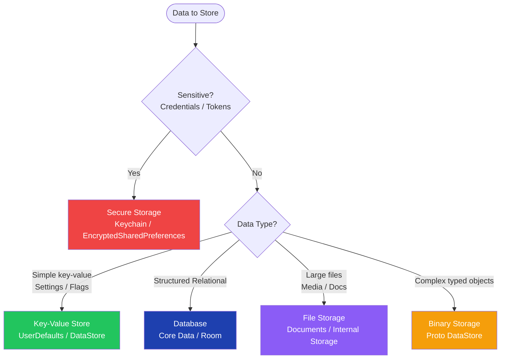

---

### 1.1 Key-Value Storage

**Overview:** Lightweight persistence for user preferences, settings flags, and small primitives. Not suited for complex objects or queries. iOS uses `UserDefaults`; Android's modern equivalent is `Preferences DataStore` — async, coroutine-based, and crash-safe.

```swift
// iOS — UserDefaults
class SettingsStore {
    private let defaults = UserDefaults.standard

    var isDarkModeEnabled: Bool {
        get { defaults.bool(forKey: "darkMode") }
        set { defaults.set(newValue, forKey: "darkMode") }
    }

    func reset() { defaults.removeObject(forKey: "darkMode") }
}
```

```kotlin
// Android — Preferences DataStore (Jetpack)
val Context.dataStore: DataStore<Preferences> by preferencesDataStore(name = "settings")

class SettingsRepository(private val dataStore: DataStore<Preferences>) {
    private val DARK_MODE = booleanPreferencesKey("darkMode")

    val isDarkModeEnabled: Flow<Boolean> = dataStore.data
        .map { prefs -> prefs[DARK_MODE] ?: false }

    suspend fun setDarkMode(enabled: Boolean) {
        dataStore.edit { prefs -> prefs[DARK_MODE] = enabled }
    }
}
```

**Interview Talking Points:**

| Question | Answer |
|---|---|
| Why prefer DataStore over SharedPreferences on Android? | SharedPreferences is synchronous and can cause ANRs on the main thread; DataStore is fully async via Kotlin Flow and handles exceptions without crashing |
| Can UserDefaults store complex objects? | Only NSData, NSString, NSNumber, NSDate, NSArray, NSDictionary natively; for custom types use `Codable` + `Data` serialization |
| What happens to UserDefaults on app delete? | iOS clears it; but iCloud-synced keys persist in iCloud — always explicit-clear sensitive data before logout |

---

### 1.2 Database Storage

**Overview:** Use an embedded database for structured data requiring queries, sorting, and relational integrity. Room (Android) and Core Data (iOS) are the platform ORMs; both sit on top of SQLite.

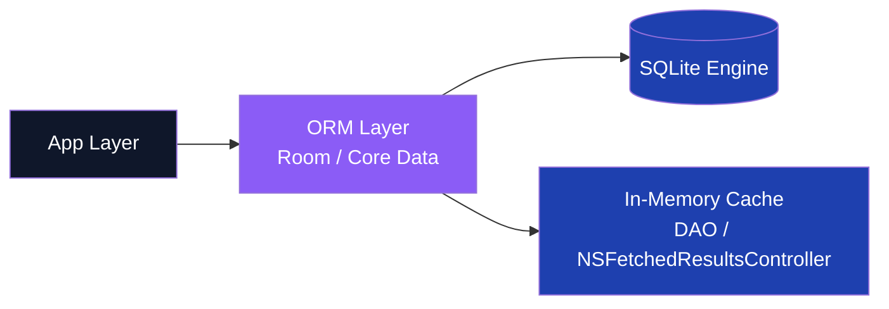

```swift
// iOS — Core Data stack
import CoreData

class PersistenceController {
    static let shared = PersistenceController()
    let container: NSPersistentContainer

    init() {
        container = NSPersistentContainer(name: "Model")
        container.loadPersistentStores { _, error in
            if let error { fatalError("CoreData load failed: \(error)") }
        }
        container.viewContext.automaticallyMergesChangesFromParent = true
    }

    func save() throws {
        let ctx = container.viewContext
        guard ctx.hasChanges else { return }
        try ctx.save()
    }
}
```

```kotlin
// Android — Room Database
@Entity(tableName = "users")
data class UserEntity(
    @PrimaryKey val id: String,
    val name: String,
    val email: String
)

@Dao
interface UserDao {
    @Query("SELECT * FROM users WHERE id = :id")
    suspend fun findById(id: String): UserEntity?

    @Insert(onConflict = OnConflictStrategy.REPLACE)
    suspend fun upsert(user: UserEntity)
}

@Database(entities = [UserEntity::class], version = 1)
abstract class AppDatabase : RoomDatabase() {
    abstract fun userDao(): UserDao

    companion object {
        fun build(context: Context) = Room
            .databaseBuilder(context, AppDatabase::class.java, "app-db")
            .build()
    }
}
```

**Interview Talking Points:**

| Question | Answer |
|---|---|
| When would you choose Room over raw SQLite? | Room provides compile-time SQL verification, typed DAOs, Flow/LiveData integration, and migration helpers — eliminating boilerplate and catching errors at build time |
| What is Core Data's biggest thread-safety risk? | NSManagedObjectContext is not thread-safe; always use `perform` / `performAndWait` or a dedicated background context for off-main-thread work |
| How do you handle schema migrations in Room? | Provide `Migration(from, to)` objects with SQL; Room validates the schema hash on open and applies migrations in order; use `fallbackToDestructiveMigration()` only in dev |
| Realm vs Room — when to prefer Realm? | Realm excels at object-graph traversals and cross-platform shared logic (KMM); Room has better Jetpack ecosystem integration and compile-time SQL safety |
| How do you test DAOs? | Use `Room.inMemoryDatabaseBuilder()` in instrumented tests — fast, no disk I/O, auto-cleaned after each test run |

---

### 1.3 Secure Storage

**Overview:** Auth tokens, passwords, and cryptographic keys must live in OS-managed encrypted containers — never in plain `UserDefaults` or `SharedPreferences`.

```swift
// iOS — Keychain wrapper
import Security

struct KeychainHelper {
    static func save(_ data: Data, service: String, account: String) throws {
        let query: [String: Any] = [
            kSecClass as String:       kSecClassGenericPassword,
            kSecAttrService as String: service,
            kSecAttrAccount as String: account,
            kSecValueData as String:   data
        ]
        SecItemDelete(query as CFDictionary)
        let status = SecItemAdd(query as CFDictionary, nil)
        guard status == errSecSuccess else { throw KeychainError.saveFailed(status) }
    }

    static func load(service: String, account: String) throws -> Data {
        let query: [String: Any] = [
            kSecClass as String:       kSecClassGenericPassword,
            kSecAttrService as String: service,
            kSecAttrAccount as String: account,
            kSecReturnData as String:  true
        ]
        var result: AnyObject?
        let status = SecItemCopyMatching(query as CFDictionary, &result)
        guard status == errSecSuccess, let data = result as? Data else {
            throw KeychainError.notFound
        }
        return data
    }
}

enum KeychainError: Error { case saveFailed(OSStatus), notFound }
```

```kotlin
// Android — EncryptedSharedPreferences
import androidx.security.crypto.EncryptedSharedPreferences
import androidx.security.crypto.MasterKey

class SecurePreferences(context: Context) {
    private val masterKey = MasterKey.Builder(context)
        .setKeyScheme(MasterKey.KeyScheme.AES256_GCM)
        .build()

    private val prefs = EncryptedSharedPreferences.create(
        context, "secure_prefs", masterKey,
        EncryptedSharedPreferences.PrefKeyEncryptionScheme.AES256_SIV,
        EncryptedSharedPreferences.PrefValueEncryptionScheme.AES256_GCM
    )

    fun saveToken(token: String) = prefs.edit().putString("auth_token", token).apply()
    fun getToken(): String? = prefs.getString("auth_token", null)
    fun clearToken() = prefs.edit().remove("auth_token").apply()
}
```

**Interview Talking Points:**

| Question | Answer |
|---|---|
| Why not store tokens in UserDefaults / SharedPreferences? | Both are plain-text files readable from device backups or with physical access; Keychain / EncryptedSharedPreferences use hardware-backed encryption |
| What is the Android Keystore system? | Hardware-backed key store (TEE / StrongBox) that keeps key material inside a secure enclave — key extraction is impossible even with root |
| How does iOS Keychain accessibility affect UX? | `kSecAttrAccessibleWhenUnlockedThisDeviceOnly` is most secure (no iCloud sync, device-only), but breaks cross-device scenarios; balance with sensitivity |
| Does Keychain data survive app reinstall on iOS? | Yes by default — Keychain items persist unless explicitly deleted. Android `EncryptedSharedPreferences` does NOT survive reinstall (key is app-bound) |

---

### 1.4 File Storage

**Overview:** Large unstructured data (images, audio, documents) belongs on the file system. iOS and Android each provide organized directory hierarchies with different backup and eviction behaviors.

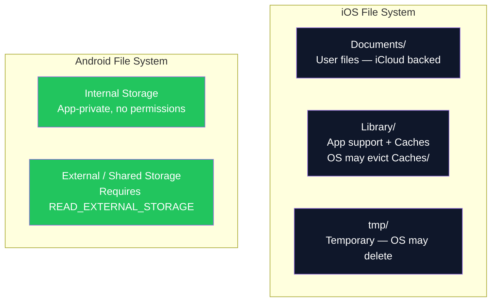

```swift
// iOS — Documents directory read/write
func saveDocument(data: Data, filename: String) throws -> URL {
    let docURL = FileManager.default
        .urls(for: .documentDirectory, in: .userDomainMask).first!
    let fileURL = docURL.appendingPathComponent(filename)
    try data.write(to: fileURL, options: .atomic)
    return fileURL
}

func readDocument(filename: String) throws -> Data {
    let docURL = FileManager.default
        .urls(for: .documentDirectory, in: .userDomainMask).first!
    return try Data(contentsOf: docURL.appendingPathComponent(filename))
}
```

```kotlin
// Android — internal file storage
class FileRepository(private val context: Context) {
    fun saveFile(filename: String, content: ByteArray) {
        context.openFileOutput(filename, Context.MODE_PRIVATE).use { it.write(content) }
    }

    fun readFile(filename: String): ByteArray =
        context.openFileInput(filename).use { it.readBytes() }

    fun deleteFile(filename: String): Boolean = context.deleteFile(filename)
}
```

---

### 1.5 Binary Storage — Proto DataStore (Android)

**Overview:** Proto DataStore stores structured, type-safe objects as Protocol Buffers — eliminating string-key typos, providing schema evolution, and offering better type safety than Preferences DataStore.

```kotlin
// Proto DataStore setup
// 1. Define .proto schema (user_prefs.proto)
// syntax = "proto3";
// message UserPrefs { bool dark_mode = 1; string locale = 2; }

object UserPrefsSerializer : Serializer<UserPrefs> {
    override val defaultValue: UserPrefs = UserPrefs.getDefaultInstance()
    override suspend fun readFrom(input: InputStream): UserPrefs = UserPrefs.parseFrom(input)
    override suspend fun writeTo(t: UserPrefs, output: OutputStream) = t.writeTo(output)
}

val Context.userPrefsStore by dataStore("user_prefs.pb", UserPrefsSerializer)

class UserPrefsRepository(private val dataStore: DataStore<UserPrefs>) {
    val prefs: Flow<UserPrefs> = dataStore.data

    suspend fun setDarkMode(enabled: Boolean) {
        dataStore.updateData { current -> current.toBuilder().setDarkMode(enabled).build() }
    }
}
```

**Interview Talking Points:**

| Question | Answer |
|---|---|
| Proto DataStore vs Preferences DataStore? | Proto DataStore uses a Protobuf schema for strong typing and schema evolution; Preferences DataStore uses string keys with no compile-time safety |
| How does Proto DataStore handle schema migration? | Add new fields with new field numbers; old data deserializes with default values for new fields — backward-compatible by design |
| What is ObjectBox and when to prefer it? | ObjectBox is a NoSQL object-persistence engine with very fast object graph traversal; prefer over Room when you have deeply nested object graphs or need cross-platform Kotlin support |

---

### 1.6 Performance & Optimization

**Overview:** App performance spans memory management, CPU/battery efficiency, rendering smoothness, startup speed, and download footprint. Each axis has distinct tooling and trade-offs.

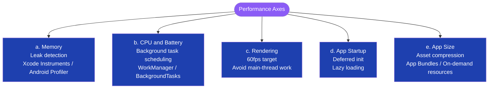

```swift
// iOS — Background task scheduling (BackgroundTasks framework)
import BackgroundTasks

func registerBackgroundTask() {
    BGTaskScheduler.shared.register(
        forTaskWithIdentifier: "com.app.refresh", using: nil
    ) { task in handleRefresh(task: task as! BGAppRefreshTask) }
}

func scheduleRefresh() {
    let request = BGAppRefreshTaskRequest(identifier: "com.app.refresh")
    request.earliestBeginDate = Date(timeIntervalSinceNow: 15 * 60)
    try? BGTaskScheduler.shared.submit(request)
}

private func handleRefresh(task: BGAppRefreshTask) {
    scheduleRefresh() // reschedule
    task.expirationHandler = { task.setTaskCompleted(success: false) }
    // perform sync work...
    task.setTaskCompleted(success: true)
}
```

```kotlin
// Android — WorkManager for deferred background work
class SyncWorker(context: Context, params: WorkerParameters) : CoroutineWorker(context, params) {
    override suspend fun doWork(): Result = try {
        // perform sync
        Result.success()
    } catch (e: Exception) {
        if (runAttemptCount < 3) Result.retry() else Result.failure()
    }
}

fun schedulePeriodic(context: Context) {
    val request = PeriodicWorkRequestBuilder<SyncWorker>(15, TimeUnit.MINUTES)
        .setConstraints(
            Constraints.Builder().setRequiredNetworkType(NetworkType.CONNECTED).build()
        ).build()
    WorkManager.getInstance(context).enqueueUniquePeriodicWork(
        "sync", ExistingPeriodicWorkPolicy.KEEP, request
    )
}
```

**Interview Talking Points — Performance:**

| Question | Answer |
|---|---|
| What causes memory leaks in iOS Swift? | Strong reference cycles: delegates / closures capturing `self` strongly. Fix with `[weak self]` or `[unowned self]` in closures |
| What causes memory leaks in Android? | Holding an `Activity` or `Context` reference in a static field or long-lived singleton; use `WeakReference<Activity>` or `applicationContext` instead |
| How does Doze Mode affect your app? | Doze defers alarms, network, and jobs. Use `WorkManager` with constraints — not exact `AlarmManager` timers — for deferred background work |
| What is jank and how do you fix it? | Jank = dropped frames below 60 fps caused by main-thread work. Move heavy operations to background threads / coroutines; use `RecyclerView` recycling; eliminate overdraw |
| How do App Bundles reduce download size? | Play generates split APKs per ABI, screen density, and language — users download only slices matching their device |

---

## 2. UI Frameworks

### Overview
Mobile UI frameworks split into **declarative** (describe desired state, framework diffs and updates) and **imperative** (explicitly mutate the view hierarchy). Both platforms have shifted to declarative as the modern default — SwiftUI and Jetpack Compose — while UIKit and the XML View System remain production-scale.

### Framework Taxonomy

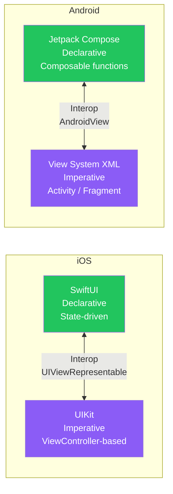

---

### 2.1 Declarative UI

```swift
// iOS — SwiftUI reactive counter
struct CounterView: View {
    @State private var count = 0

    var body: some View {
        VStack(spacing: 16) {
            Text("Count: \(count)").font(.largeTitle)
            Button("Increment") { count += 1 }.buttonStyle(.borderedProminent)
        }
    }
}
```

```kotlin
// Android — Jetpack Compose reactive counter
@Composable
fun CounterScreen(vm: CounterViewModel = viewModel()) {
    val count by vm.count.collectAsState()
    Column(
        horizontalAlignment = Alignment.CenterHorizontally,
        verticalArrangement = Arrangement.spacedBy(16.dp)
    ) {
        Text("Count: $count", style = MaterialTheme.typography.headlineLarge)
        Button(onClick = vm::increment) { Text("Increment") }
    }
}

class CounterViewModel : ViewModel() {
    private val _count = MutableStateFlow(0)
    val count: StateFlow<Int> = _count.asStateFlow()
    fun increment() { _count.update { it + 1 } }
}
```

**Interview Talking Points:**

| Question | Answer |
|---|---|
| What is recomposition in Jetpack Compose? | When state changes, Compose re-executes only the composable functions that read that state — not the entire tree |
| How does SwiftUI know when to re-render? | It observes `@State`, `@ObservedObject`, and `@EnvironmentObject` properties; when they change, only the affected `View.body` is recomputed |
| When should you still use UIKit over SwiftUI? | Complex custom gesture recognizers, performance-critical lists with heterogeneous cells, or targeting iOS < 14 |

---

### 2.2 Lifecycle Management

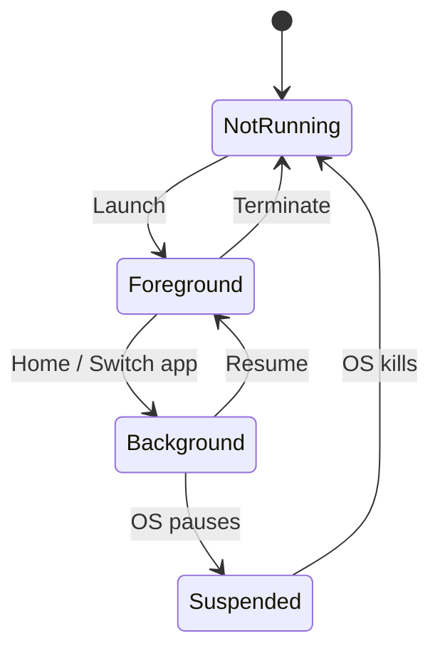

```swift
// iOS — SwiftUI scene phase lifecycle
struct MyApp: App {
    @Environment(\.scenePhase) private var scenePhase

    var body: some Scene {
        WindowGroup { ContentView() }
            .onChange(of: scenePhase) { phase in
                switch phase {
                case .active:     print("active")
                case .inactive:   print("inactive")
                case .background: print("background — save state")
                @unknown default: break
                }
            }
    }
}
```

```kotlin
// Android — ProcessLifecycleOwner observer
class AppLifecycleObserver : DefaultLifecycleObserver {
    override fun onStart(owner: LifecycleOwner) = println("foregrounded")
    override fun onStop(owner: LifecycleOwner)  = println("backgrounded — save state")
}

// In Application.onCreate()
ProcessLifecycleOwner.get().lifecycle.addObserver(AppLifecycleObserver())
```

**Interview Talking Points:**

| Question | Answer |
|---|---|
| What is `onSaveInstanceState` for? | Persists transient UI state (scroll position, text input) across process death or configuration changes; not for large objects — use ViewModel for those |
| What is the difference between onStop and onDestroy in Android? | `onStop` = app backgrounded but alive; `onDestroy` = activity finishing (back press) or system recreation (rotation) |
| How does SceneDelegate differ from AppDelegate in iOS? | AppDelegate handles app-level events; SceneDelegate handles scene (window) lifecycle — enabling multiple-window support on iPad |

---

### 2.3 Threading & Concurrency

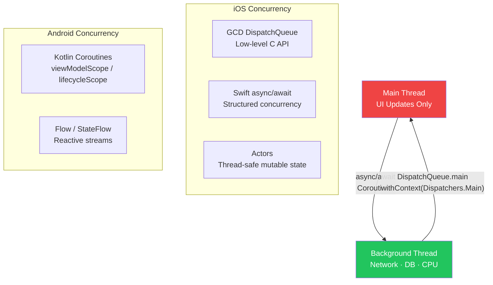

```swift
// iOS — Swift Actor for thread-safe cache
actor UserCache {
    private var cache: [String: User] = [:]
    func get(id: String) -> User? { cache[id] }
    func set(id: String, user: User) { cache[id] = user }
}

// Fetching with async/await
func fetchUser(id: String) async throws -> User {
    let url = URL(string: "https://api.example.com/users/\(id)")!
    let (data, _) = try await URLSession.shared.data(from: url)
    return try JSONDecoder().decode(User.self, from: data)
}
```

```kotlin
// Android — Coroutines with StateFlow
class UserViewModel(private val repo: UserRepository) : ViewModel() {
    val user: StateFlow<User?> = repo.userFlow
        .stateIn(viewModelScope, SharingStarted.WhileSubscribed(5000), null)

    fun loadUser(id: String) {
        viewModelScope.launch {
            runCatching { withContext(Dispatchers.IO) { repo.fetchUser(id) } }
                .onFailure { /* handle error */ }
        }
    }
}
```

**Interview Talking Points:**

| Question | Answer |
|---|---|
| What is a Swift Actor? | A reference type with compiler-enforced mutual exclusion; mutable state can only be accessed from within the actor's executor, eliminating data races at compile time |
| What is `viewModelScope`? | A `CoroutineScope` tied to the ViewModel lifecycle that auto-cancels all coroutines when the ViewModel is cleared — preventing memory leaks |
| GCD vs Swift async/await? | GCD is callback-based and error-prone for complex flows; async/await provides structured concurrency with propagated cancellation and linear, readable code |
| How does `Dispatchers.IO` differ from `Dispatchers.Default`? | IO is for blocking I/O (up to 64 threads); Default is for CPU-bound work (threads = CPU cores). Never block on `Dispatchers.Main` |

---

### 2.4 Navigation

```swift
// iOS — SwiftUI NavigationStack with type-safe routing
struct RootView: View {
    var body: some View {
        NavigationStack {
            HomeView()
                .navigationTitle("Home")
                .navigationDestination(for: User.self) { UserDetailView(user: $0) }
        }
    }
}

// Coordinator pattern for UIKit
protocol Coordinator: AnyObject {
    var navigationController: UINavigationController { get }
    func start()
}

class AppCoordinator: Coordinator {
    let navigationController: UINavigationController
    init(nav: UINavigationController) { navigationController = nav }

    func start() {
        let vc = HomeViewController()
        vc.coordinator = self
        navigationController.pushViewController(vc, animated: false)
    }
}
```

```kotlin
// Android — Navigation Component in Compose
@Composable
fun AppNavigation() {
    val navController = rememberNavController()
    NavHost(navController, startDestination = "home") {
        composable("home") {
            HomeScreen(onUserClick = { id -> navController.navigate("user/$id") })
        }
        composable(
            "user/{id}",
            arguments = listOf(navArgument("id") { type = NavType.StringType })
        ) { entry ->
            UserDetailScreen(userId = entry.arguments?.getString("id")!!)
        }
    }
}
```

**Interview Talking Points:**

| Question | Answer |
|---|---|
| What is the Coordinator pattern? | Decouples navigation logic from view controllers; VCs delegate routing decisions to a Coordinator, making them independently testable |
| What is a deep link? | A URL that navigates directly to specific in-app content. iOS handles via `onOpenURL`; Android via `<intent-filter>` with `ACTION_VIEW` |
| How does Navigation Component handle back stack on Android? | It manages a `NavBackStack` automatically; `popUpTo` with `inclusive = true` clears destinations to prevent stacking on re-navigation |

---

### 2.5 Data Binding

```swift
// iOS — Combine + ObservableObject
class LoginViewModel: ObservableObject {
    @Published var email = ""
    @Published var password = ""

    var isLoginEnabled: AnyPublisher<Bool, Never> {
        Publishers.CombineLatest($email, $password)
            .map { !$0.isEmpty && $1.count >= 6 }
            .eraseToAnyPublisher()
    }
}

struct LoginView: View {
    @StateObject private var vm = LoginViewModel()
    @State private var canLogin = false

    var body: some View {
        Form {
            TextField("Email", text: $vm.email)
            SecureField("Password", text: $vm.password)
            Button("Login") { /* login */ }.disabled(!canLogin)
        }
        .onReceive(vm.isLoginEnabled) { canLogin = $0 }
    }
}
```

```kotlin
// Android — Compose state + derivedStateOf
class LoginViewModel : ViewModel() {
    var email    by mutableStateOf("")
    var password by mutableStateOf("")
    val isLoginEnabled by derivedStateOf { email.isNotBlank() && password.length >= 6 }
}

@Composable
fun LoginScreen(vm: LoginViewModel = viewModel()) {
    Column {
        TextField(value = vm.email,    onValueChange = { vm.email = it },    label = { Text("Email") })
        TextField(value = vm.password, onValueChange = { vm.password = it }, label = { Text("Password") })
        Button(onClick = { /* login */ }, enabled = vm.isLoginEnabled) { Text("Login") }
    }
}
```

**Interview Talking Points:**

| Question | Answer |
|---|---|
| LiveData vs StateFlow? | StateFlow has no Activity/Fragment dependency, works in any coroutine scope, and has `value` as a non-null property. LiveData is lifecycle-aware but tightly coupled to Android architecture |
| What is KVO? | Key-Value Observing — Objective-C runtime mechanism to observe property changes via `addObserver`; replaced by Combine / `@Published` in modern Swift |
| What does `derivedStateOf` do in Compose? | Creates a state that only triggers recomposition when its computed value changes, not every time its inputs change — important for expensive derivations |

---

### 2.6 Runtime

**Overview:** iOS compiles Swift to native ARM64 machine code via LLVM, giving deterministic performance. Android compiles to DEX bytecode; ART applies AOT + JIT compilation at runtime with profile-guided optimization.

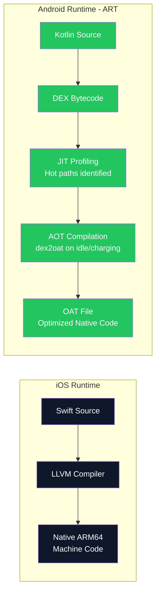

**Interview Talking Points:**

| Question | Answer |
|---|---|
| What is ART vs Dalvik? | Dalvik used JIT-only compilation; ART (Android 5.0+) combines AOT at install + JIT profiling at runtime for progressive optimization |
| How does Swift's dispatch differ from Objective-C? | Obj-C uses dynamic message dispatch (slow but flexible); Swift uses static dispatch by default (faster, inlinable). Use `@objc dynamic` to opt back into dynamic dispatch |
| What is whole-module optimization in Swift? | `SWIFT_COMPILATION_MODE = wholemodule` lets LLVM analyze all Swift files together, enabling cross-file inlining and dead code elimination for smaller, faster binaries |

---

## 3. Observability & Testing

### Overview
A robust testing strategy forms a pyramid: many fast unit tests at the base, fewer integration tests in the middle, and a small E2E suite at the top. Production observability (crash reporting, metrics, logging) closes the feedback loop between deployment and debugging.

### Testing Pyramid

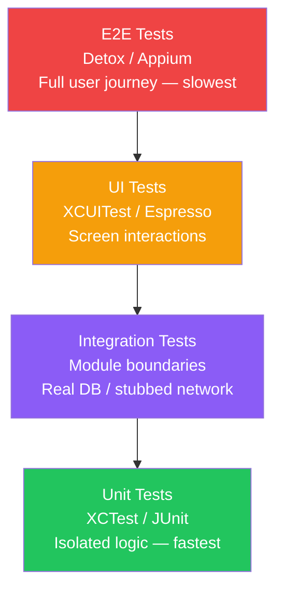

---

### 3.1 Unit Testing

```swift
// iOS — XCTest
import XCTest
@testable import MyApp

final class LoginViewModelTests: XCTestCase {
    var sut: LoginViewModel!
    override func setUp() { sut = LoginViewModel(authService: MockAuthService()) }

    func test_loginEnabled_withValidCredentials() {
        sut.email = "test@example.com"; sut.password = "secret123"
        XCTAssertTrue(sut.isLoginEnabled)
    }

    func test_loginDisabled_withShortPassword() {
        sut.email = "test@example.com"; sut.password = "abc"
        XCTAssertFalse(sut.isLoginEnabled)
    }
}
```

```kotlin
// Android — JUnit + coroutines test
class LoginViewModelTest {
    @get:Rule val mainDispatcherRule = MainDispatcherRule()

    private val mockAuthService: AuthService = mockk()
    private lateinit var sut: LoginViewModel

    @Before fun setUp() { sut = LoginViewModel(mockAuthService) }

    @Test fun `login enabled with valid credentials`() {
        sut.email = "test@example.com"; sut.password = "secret123"
        assertTrue(sut.isLoginEnabled)
    }

    @Test fun `login disabled with short password`() {
        sut.email = "test@example.com"; sut.password = "abc"
        assertFalse(sut.isLoginEnabled)
    }
}
```

---

### 3.2 Mocking Frameworks

```swift
// iOS — protocol-based manual mock (Mockingbird for codegen)
protocol AuthService {
    func login(email: String, password: String) async throws -> AuthToken
}

final class MockAuthService: AuthService {
    var stubbedResult: Result<AuthToken, Error> = .failure(AuthError.unknown)
    var callCount = 0

    func login(email: String, password: String) async throws -> AuthToken {
        callCount += 1
        return try stubbedResult.get()
    }
}
```

```kotlin
// Android — MockK
@Test fun `login calls service with correct credentials`() = runTest {
    val mockService: AuthService = mockk()
    coEvery { mockService.login("a@b.com", "pass123") } returns AuthToken("token")

    LoginViewModel(mockService).login("a@b.com", "pass123")

    coVerify(exactly = 1) { mockService.login("a@b.com", "pass123") }
}
```

---

### 3.3 UI Testing

```swift
// iOS — XCUITest
final class LoginUITests: XCTestCase {
    let app = XCUIApplication()
    override func setUpWithError() throws {
        continueAfterFailure = false
        app.launch()
    }

    func test_loginFlow_navigatesToHome() {
        app.textFields["emailField"].tap()
        app.textFields["emailField"].typeText("user@example.com")
        app.secureTextFields["passwordField"].typeText("password123")
        app.buttons["loginButton"].tap()
        XCTAssertTrue(app.otherElements["homeScreen"].waitForExistence(timeout: 5))
    }
}
```

```kotlin
// Android — Espresso
@RunWith(AndroidJUnit4::class)
class LoginScreenTest {
    @get:Rule val activityRule = ActivityScenarioRule(LoginActivity::class.java)

    @Test fun loginFlow_displaysHome_onSuccess() {
        onView(withId(R.id.emailField))
            .perform(typeText("user@example.com"), closeSoftKeyboard())
        onView(withId(R.id.passwordField))
            .perform(typeText("password123"), closeSoftKeyboard())
        onView(withId(R.id.loginButton)).perform(click())
        onView(withId(R.id.homeScreen)).check(matches(isDisplayed()))
    }
}
```

---

### 3.4 CI/CD Pipeline

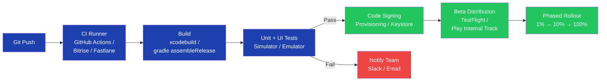

---

### 3.5 E2E Testing

```javascript
// Detox (React Native or native)
describe('Login flow', () => {
  beforeAll(async () => { await device.launchApp(); });

  it('logs in with valid credentials', async () => {
    await element(by.id('emailField')).typeText('user@example.com');
    await element(by.id('passwordField')).typeText('password123');
    await element(by.id('loginButton')).tap();
    await expect(element(by.id('homeScreen'))).toBeVisible();
  });
});
```

---

### 3.6 Beta Distribution & Phased Rollouts

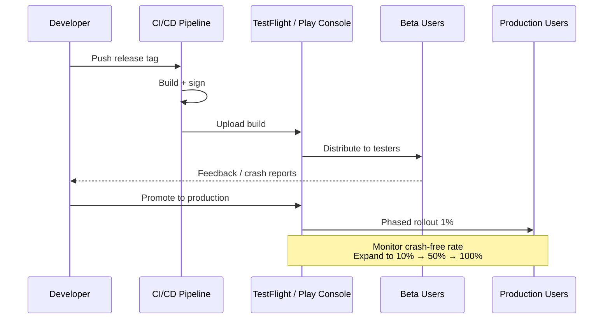

---

### 3.7 Logging, Monitoring & Crash Reporting

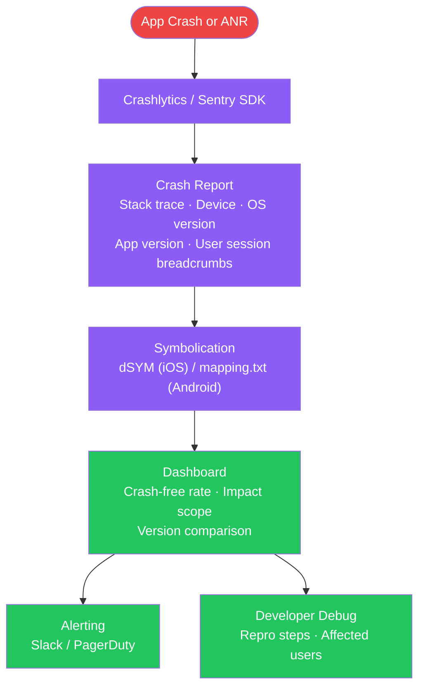

**Interview Talking Points — Observability & Testing:**

| Question | Answer |
|---|---|
| What is the test pyramid and why does it matter for mobile? | Unit tests are fast and cheap; UI tests are slow and brittle on simulators/emulators. Inverting the pyramid leads to slow CI and fragile suites |
| How do you test coroutines? | Replace `Dispatchers.Main` with `TestCoroutineDispatcher` via a test rule; use `runTest` to execute coroutines synchronously under test |
| What is symbolication? | Maps crash addresses in stripped release builds back to source file + line number using dSYM (iOS) or ProGuard mapping.txt (Android) — critical for debugging production crashes |
| How do phased rollouts reduce risk? | Release to 1–5% of users first; if crash-free rate drops below threshold (e.g., 99.5%), halt before reaching all users |
| What is ANR in Android? | Application Not Responding — triggered when the main thread is blocked for >5 s (activity) or >10 s (broadcast). Detect with `StrictMode` in dev; visible in Play Console |
| What is EarlGrey 2.0? | Google's open-source iOS UI testing framework built on XCUITest; offers synchronization with app thread states, reducing flakiness compared to vanilla XCUITest |

---

## 4. Privacy & Security

### Overview
Privacy and security span four layers: **data in transit** (TLS), **data at rest** (encryption, secure storage), **runtime protection** (code integrity, obfuscation), and **regulatory compliance** (GDPR, CCPA). Defense-in-depth means all four layers must be addressed simultaneously.

### Security Layers

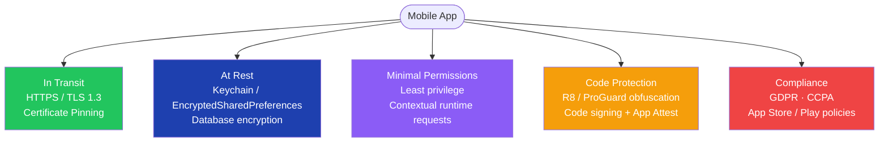

---

### 4.1 Data Encryption — In Transit & At Rest

```swift
// iOS — CryptoKit AES-GCM (at rest)
import CryptoKit

struct EncryptionService {
    private let key = SymmetricKey(size: .bits256)

    func encrypt(_ data: Data) throws -> Data {
        try AES.GCM.seal(data, using: key).combined!
    }

    func decrypt(_ sealed: Data) throws -> Data {
        let box = try AES.GCM.SealedBox(combined: sealed)
        return try AES.GCM.open(box, using: key)
    }
}
```

```kotlin
// Android — AES-GCM with Android Keystore
object EncryptionService {
    private const val KEY_ALIAS = "app_master_key"
    private const val TRANSFORMATION = "AES/GCM/NoPadding"

    private fun getOrCreateKey(): SecretKey {
        val ks = java.security.KeyStore.getInstance("AndroidKeyStore").apply { load(null) }
        ks.getKey(KEY_ALIAS, null)?.let { return it as SecretKey }
        val spec = KeyGenParameterSpec.Builder(
            KEY_ALIAS, KeyProperties.PURPOSE_ENCRYPT or KeyProperties.PURPOSE_DECRYPT
        ).setBlockModes(KeyProperties.BLOCK_MODE_GCM)
         .setEncryptionPaddings(KeyProperties.ENCRYPTION_PADDING_NONE)
         .build()
        return KeyGenerator.getInstance(KeyProperties.KEY_ALGORITHM_AES, "AndroidKeyStore")
            .apply { init(spec) }.generateKey()
    }

    fun encrypt(data: ByteArray): Pair<ByteArray, ByteArray> {
        val cipher = Cipher.getInstance(TRANSFORMATION).apply { init(Cipher.ENCRYPT_MODE, getOrCreateKey()) }
        return Pair(cipher.doFinal(data), cipher.iv)
    }

    fun decrypt(data: ByteArray, iv: ByteArray): ByteArray {
        val cipher = Cipher.getInstance(TRANSFORMATION).apply {
            init(Cipher.DECRYPT_MODE, getOrCreateKey(), GCMParameterSpec(128, iv))
        }
        return cipher.doFinal(data)
    }
}
```

---

### 4.2 Certificate Pinning

```swift
// iOS — URLSession delegate for certificate pinning
class PinnedSessionDelegate: NSObject, URLSessionDelegate {
    private let pinnedKeyHash = "sha256/BASE64_ENCODED_PUBLIC_KEY_HASH=="

    func urlSession(
        _ session: URLSession,
        didReceive challenge: URLAuthenticationChallenge,
        completionHandler: @escaping (URLSession.AuthChallengeDisposition, URLCredential?) -> Void
    ) {
        guard let serverTrust = challenge.protectionSpace.serverTrust,
              let cert = SecTrustGetCertificateAtIndex(serverTrust, 0),
              publicKeyHash(for: cert) == pinnedKeyHash else {
            completionHandler(.cancelAuthenticationChallenge, nil)
            return
        }
        completionHandler(.useCredential, URLCredential(trust: serverTrust))
    }
}
```

```kotlin
// Android — OkHttp certificate pinning
val client = OkHttpClient.Builder()
    .certificatePinner(
        CertificatePinner.Builder()
            .add("api.example.com", "sha256/AAAAAAAAAAAAAAAAAAAAAAAAAAAAAAAAAAAAAAAAAAA=")
            .build()
    )
    .build()
```

---

### 4.3 Minimize Permission Usage

```swift
// iOS — request coarse location only
import CoreLocation

class LocationManager: NSObject, CLLocationManagerDelegate {
    private let manager = CLLocationManager()

    func requestApproximateLocation() {
        manager.delegate = self
        manager.desiredAccuracy = kCLLocationAccuracyKilometer
        manager.requestWhenInUseAuthorization()
        manager.requestLocation()
    }
}
```

```kotlin
// Android — contextual runtime permission
class LocationPermissionHandler(private val activity: ComponentActivity) {
    private val launcher = activity.registerForActivityResult(
        ActivityResultContracts.RequestPermission()
    ) { granted ->
        if (granted) startLocationUpdates() else showPermissionRationale()
    }

    fun requestCoarseLocation() {
        launcher.launch(Manifest.permission.ACCESS_COARSE_LOCATION)
    }
}
```

---

### 4.4 Code Security, Integrity & Obfuscation

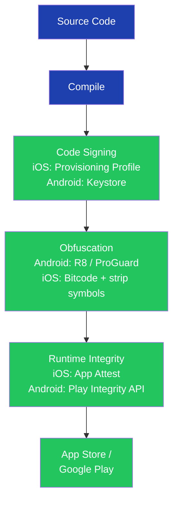

```kotlin
// Android — R8 in build.gradle (ProGuard rules)
// buildTypes { release { minifyEnabled true; shrinkResources true
//   proguardFiles getDefaultProguardFile('proguard-android-optimize.txt'), 'proguard-rules.pro' } }

// proguard-rules.pro — keep model classes used in JSON deserialization
// -keep class com.app.model.** { *; }
// -keepattributes Signature
```

---

### 4.5 Data Retention & Deletion

```kotlin
// Android — account deletion (GDPR right to erasure)
class AccountDeletionService(
    private val db: AppDatabase,
    private val prefs: SecurePreferences,
    private val api: ApiService
) {
    suspend fun deleteAccount(userId: String) {
        withContext(Dispatchers.IO) {
            api.requestAccountDeletion(userId)     // backend purge
            db.userDao().deleteAll()               // local DB
            prefs.clearToken()                     // secure prefs
            File(context.filesDir, userId).deleteRecursively() // files
        }
    }
}
```

---

### 4.6 Privacy Compliance

**Overview:** GDPR (EU), CCPA (California), and platform policies (App Store, Google Play) all impose requirements on data collection, consent, and user rights.

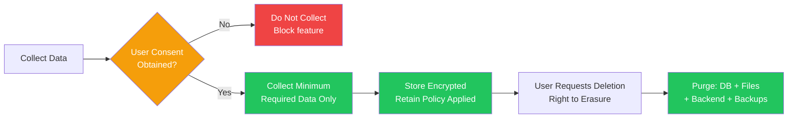

**Interview Talking Points — Privacy & Security:**

| Question | Answer |
|---|---|
| What is certificate pinning and when to use it? | Ensures server cert/public key matches a known-good value, preventing MITM even if a CA is compromised. Use for high-value apps (banking, health) — but plan a key rotation strategy |
| GDPR vs CCPA — key differences? | GDPR covers all EU residents globally with strict consent + right to erasure; CCPA covers California residents with opt-out rights for data sale — less prescriptive on consent |
| What is App Attest / Play Integrity? | Hardware-backed attestation verifying the app is genuine, unmodified, and on a real device — used to protect sensitive API endpoints from emulator abuse |
| Why is R8 not a security mechanism? | Obfuscation makes reverse-engineering harder but not impossible; decompilers can rename symbols back. Security must come from server-side validation, not code secrecy |
| How do you implement right-to-erasure? | In-app delete flow → propagate to all backends → purge local DB, files, Keychain/EncryptedPrefs → confirm to user; document in privacy policy |

---

## 5. Cross-Cutting Themes

### Pattern Selection Guide

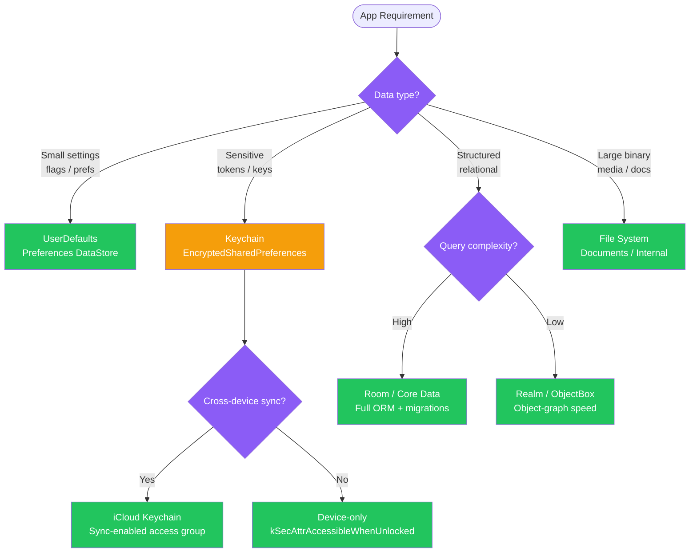

---

### Common Interview Red Flags to Avoid

| Red Flag | Why It's Wrong | Correct Answer |
|---|---|---|
| "Store auth tokens in UserDefaults" | Plain-text file; readable from backups | Keychain (iOS) / EncryptedSharedPreferences (Android) with Keystore-backed key |
| "Run DB queries on the main thread" | Blocks UI; causes ANR / frozen frames | `Dispatchers.IO` + coroutines; Core Data background context |
| "Request all permissions at app launch" | Users deny upfront permission blasts | Request permissions contextually, just before the feature that needs them |
| "Retry in a tight loop" | Thundering herd — hammers a recovering service | Exponential backoff with jitter and a max attempt cap |
| "Disable ProGuard to fix crashes" | Leaves code exposed to reverse engineering | Fix the crash; add `-keep` rules for the specific class causing issues |
| "Ignore certificate errors in debug builds" | Debug flags can ship to production via misconfigured builds | Gate on `BuildConfig.DEBUG`; never disable validation unconditionally |
| "Put secrets in source code or BuildConfig" | Decompilable; visible with `strings` on the binary | Fetch secrets at runtime from a secure backend; use Android Keystore / iOS Keychain |
| "SharedPreferences for offline access tokens" | Readable without root on older Android devices | EncryptedSharedPreferences backed by Android Keystore |
| "SwiftUI everywhere in an existing UIKit app" | Interop overhead; SwiftUI lifecycle bugs in mixed contexts | Introduce SwiftUI screen by screen via `UIHostingController`; keep complex gesture/animation code in UIKit |
| "Store images in the database as BLOBs" | Bloats DB, degrades query performance | Store images on the file system; persist only the file path in the DB |

---

*Generated from `Description-mobile.txt` · ConceptToMD Agent v1.0 · July 2026*
