# Mobile System Design — Complete Reference Guide

> Consolidates: Mobile System Design · UI Frameworks · API & Networking · Storage · Testing · Privacy · Advanced Topics · Design Patterns · Interview Strategy

---

## Table of Contents

1. [UI Frameworks](#1-ui-frameworks)
2. [Lifecycle Management](#2-lifecycle-management)
3. [Threading & Concurrency](#3-threading--concurrency)
4. [Navigation](#4-navigation)
5. [Data Binding](#5-data-binding)
6. [Data Storage](#6-data-storage)
7. [API Communication Protocols](#7-api-communication-protocols)
8. [Real-Time Updates](#8-real-time-updates)
9. [Pagination Strategies](#9-pagination-strategies)
10. [Caching Strategies](#10-caching-strategies)
11. [Authentication](#11-authentication)
12. [Retry Policies & Resilience](#12-retry-policies--resilience)
13. [Performance & Optimization](#13-performance--optimization)
14. [Observability & Testing](#14-observability--testing)
15. [Privacy & Security](#15-privacy--security)
16. [App-Wide Architecture Patterns](#16-app-wide-architecture-patterns)
17. [GoF Design Patterns](#17-gof-design-patterns)
18. [SOLID Principles for Mobile](#18-solid-principles-for-mobile)
19. [Advanced Topics](#19-advanced-topics)
20. [Interview Strategy](#20-interview-strategy)

---

## 1. UI Frameworks

### Overview
Mobile UI frameworks define how the user interface is constructed and updated. The industry has shifted from **imperative** (tell the system *how* to change the UI step by step) to **declarative** frameworks (describe *what* the UI should look like for a given state, and the framework handles the rest).

### Declarative vs Imperative

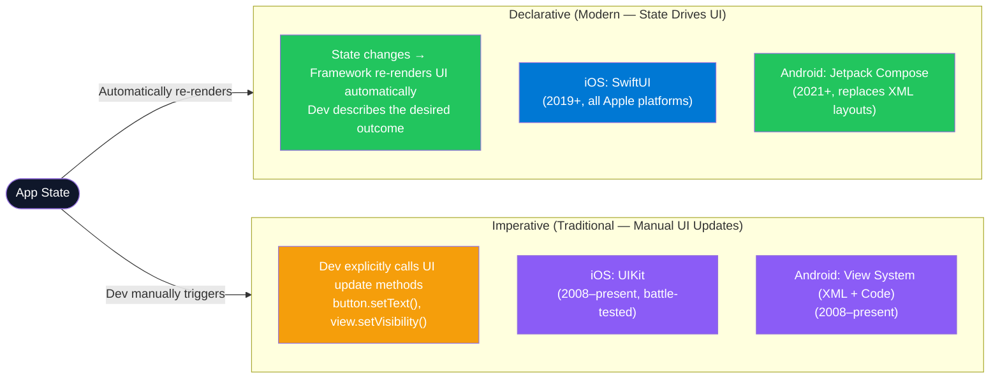

### Framework Comparison

| Aspect | SwiftUI (iOS) | Jetpack Compose (Android) | UIKit (iOS) | View System (Android) |
|---|---|---|---|---|
| **Paradigm** | Declarative | Declarative | Imperative | Imperative |
| **Language** | Swift | Kotlin | Swift / Obj-C | Kotlin / Java / XML |
| **State management** | `@State`, `@ObservedObject`, `@EnvironmentObject` | `remember`, `mutableStateOf`, `ViewModel` | Manual / KVO / Combine | LiveData / Flow / ViewModel |
| **Performance** | Good — diff algorithm | Good — smart recomposition | Excellent — battle-tested | Excellent — very mature |
| **Learning curve** | Medium | Medium | High (Obj-C roots) | High (XML + Java) |
| **Best for** | Greenfield iOS apps | Greenfield Android apps | Complex legacy iOS | Complex legacy Android |

### Interview Talking Points

| Question | Answer |
|---|---|
| What is the key benefit of declarative UI? | The UI is a pure function of state — when state changes, the framework computes the minimal set of UI updates needed. Developers stop thinking about *how* to update (add this view, remove that button) and start thinking about *what* the UI should look like in each state. |
| When would you still use UIKit over SwiftUI? | For apps targeting iOS < 13, for complex custom animations where UIKit APIs are richer, for very performance-sensitive custom views, or when integrating with existing UIKit codebases. SwiftUI and UIKit can interoperate via `UIViewRepresentable`. |
| What is Jetpack Compose recomposition? | When state observed by a composable function changes, Compose automatically re-executes (recomposes) only the affected composable subtrees. It skips functions whose inputs haven't changed (smart recomposition). |

---

## 2. Lifecycle Management

### Overview
Lifecycle management refers to how apps and their UI components respond to state changes — foreground, background, termination — triggered by the OS or user actions.

### iOS Lifecycle

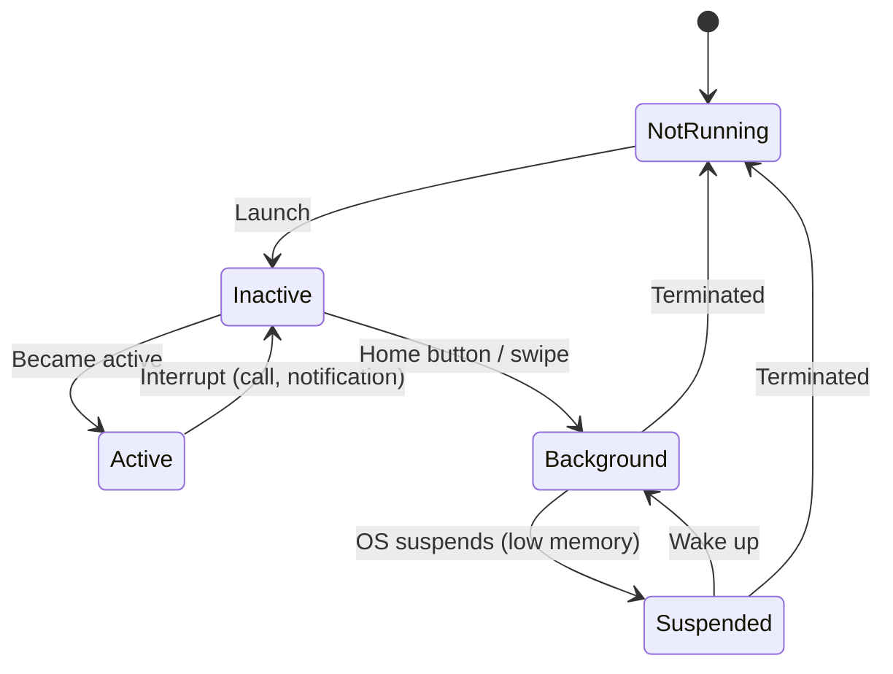

| iOS Component | Responsibility |
|---|---|
| `AppDelegate` | App-level lifecycle (launch, terminate, push token registration) |
| `SceneDelegate` | Per-window/scene lifecycle (multiple windows on iPad) |
| `UIViewController` | Individual screen lifecycle (`viewDidLoad`, `viewWillAppear`, `viewDidDisappear`) |
| `SwiftUI View` | Lifecycle managed by state; use `onAppear` / `onDisappear` modifiers |

### Android Lifecycle

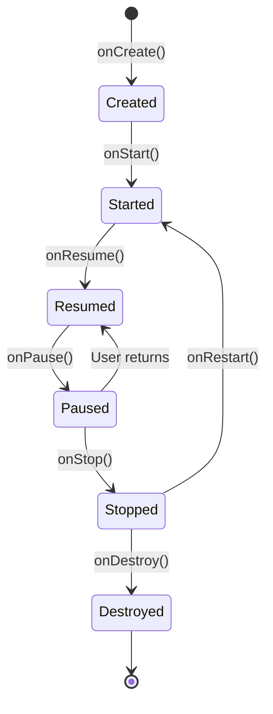

| Android Component | Responsibility |
|---|---|
| `Application` | App-level init; singleton for app-wide state |
| `Activity` | Single full-screen UI; has `onCreate/onStart/onResume/onPause/onStop/onDestroy` |
| `Fragment` | Reusable UI component nested inside Activity; has its own lifecycle |
| `ViewModel` | Survives configuration changes (rotation); stores UI-related data |
| `Jetpack Compose` | Composables managed via `LaunchedEffect`, `DisposableEffect` |

---

## 3. Threading & Concurrency

### Overview
All UI updates must happen on the main thread. Any heavy work (network, disk I/O, computation) must be offloaded to background threads. Violating this causes ANR (App Not Responding) on Android and UI freeze on iOS.

### Threading Model Comparison

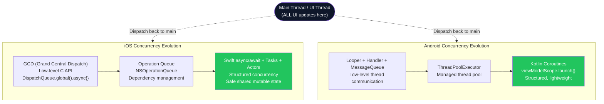

### ANR vs Crash

| | ANR (App Not Responding) | Crash |
|---|---|---|
| **Cause** | Main thread blocked > 5s (Android) | Unhandled exception or fatal error |
| **User sees** | "App not responding" dialog | App closes abruptly |
| **Fix** | Move work off main thread | Fix the exception / add error handling |
| **Detection** | Android Studio + StrictMode | Crashlytics, Sentry |

---

## 4. Navigation

### Overview
Navigation manages how users move between screens. Modern approaches use a navigation stack (push/pop) and support deep links — URLs that open specific screens within an app.

### Navigation Architecture

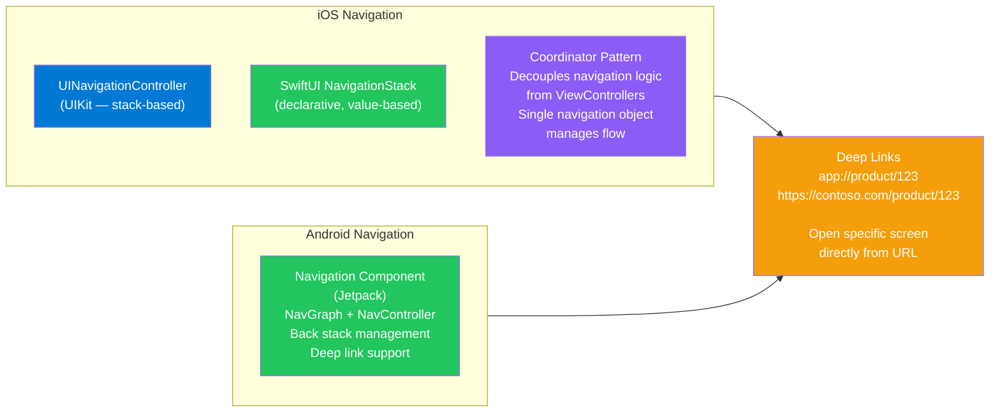

### Coordinator Pattern (iOS)

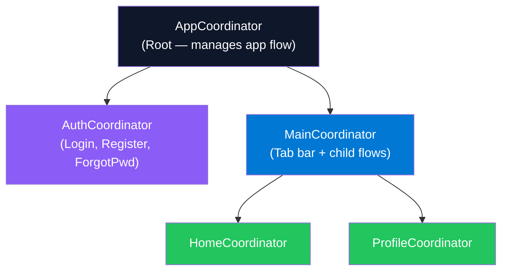

---

## 5. Data Binding

### Overview
Data binding synchronizes UI state with underlying data models — when the model changes, the UI updates automatically, and vice versa.

### Binding Approaches

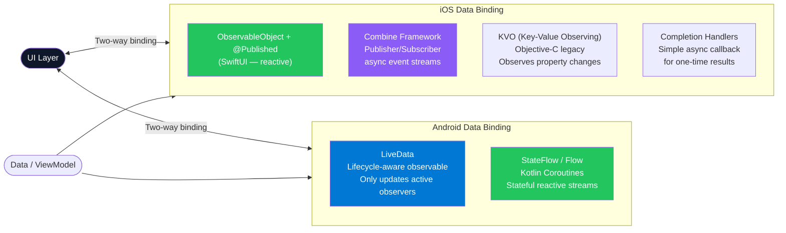

---

## 6. Data Storage

### Storage Type Decision Tree

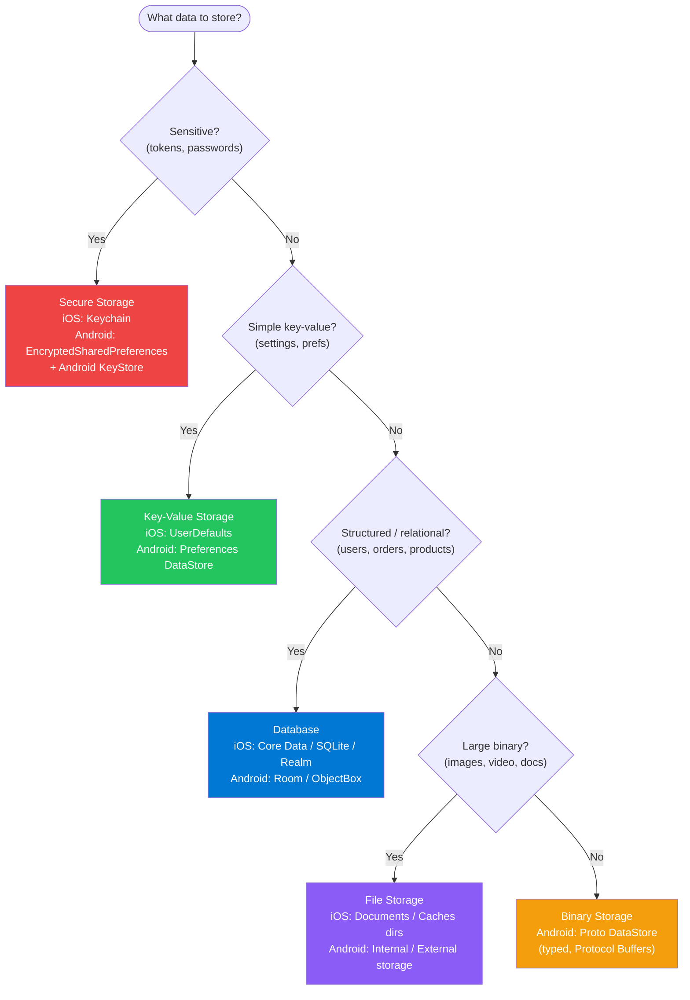

### Storage Options Comparison

| Type | iOS | Android | Use Case | Limit |
|---|---|---|---|---|
| **Key-Value** | `UserDefaults` | `SharedPreferences` / `Preferences DataStore` | Settings, toggles, small preferences | Small (< 1MB) |
| **Database** | `Core Data`, `SQLite`, `Realm` | `Room`, `SQLite`, `ObjectBox` | Relational/structured data with queries | GB (device storage) |
| **Secure** | `Keychain` | `EncryptedSharedPreferences` + `KeyStore` | Auth tokens, passwords, crypto keys | Small |
| **File** | Documents / Caches dirs | Internal / External storage | Images, video, large documents | Device storage |
| **Binary** | — | `Proto DataStore` | Type-safe structured binary data | Device storage |

---

## 7. API Communication Protocols

### Overview
Mobile apps communicate with backends via several protocols, each with different trade-offs in performance, complexity, and use case fit.

### Protocol Comparison

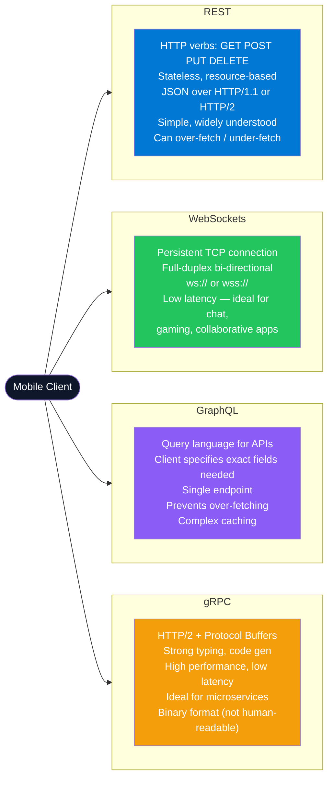

### When to Use Each

| Protocol | Best For | Avoid When |
|---|---|---|
| **REST** | Standard CRUD, public APIs, simple request-response | Real-time needs, high-frequency updates |
| **WebSockets** | Live chat, multiplayer games, collaborative editing, live feeds | Infrequent updates (overkill), server simplicity required |
| **GraphQL** | Complex UIs needing flexible data shapes, BFF pattern | Simple data models, teams unfamiliar with GraphQL tooling |
| **gRPC** | Internal microservice-to-service communication, IoT | Public APIs (binary format hard to debug), browser support (limited) |

---

## 8. Real-Time Updates

### Update Strategy Comparison

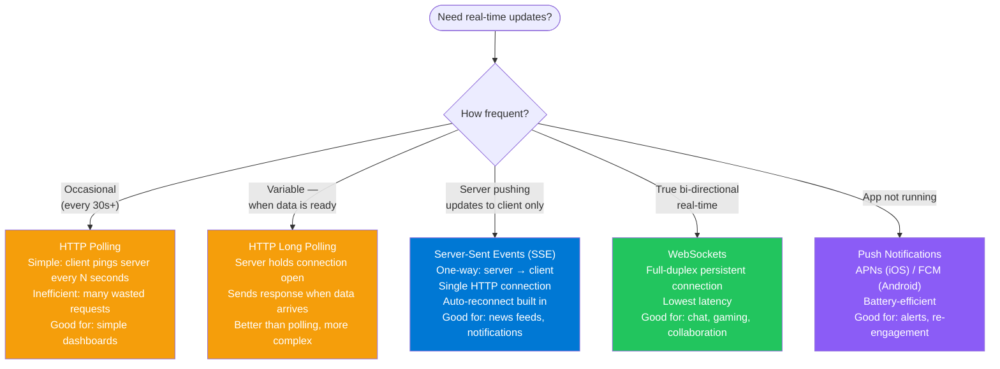

| Strategy | Latency | Battery | Complexity | Direction |
|---|---|---|---|---|
| HTTP Polling | High | Draining | Low | Client → Server |
| Long Polling | Medium | Medium | Medium | Client → Server (held open) |
| SSE | Low | Good | Low-Medium | Server → Client only |
| WebSockets | Lowest | Medium | High | Bidirectional |
| Push Notifications | Low (delivery varies) | Excellent | Medium | Server → Device OS |

---

## 9. Pagination Strategies

### Overview
Pagination splits large datasets into smaller chunks to avoid loading everything at once — essential for performance and bandwidth.

### Strategy Comparison

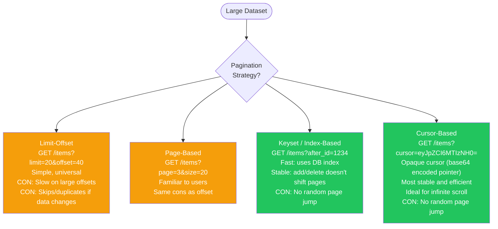

### Offset vs Cursor — The Key Difference

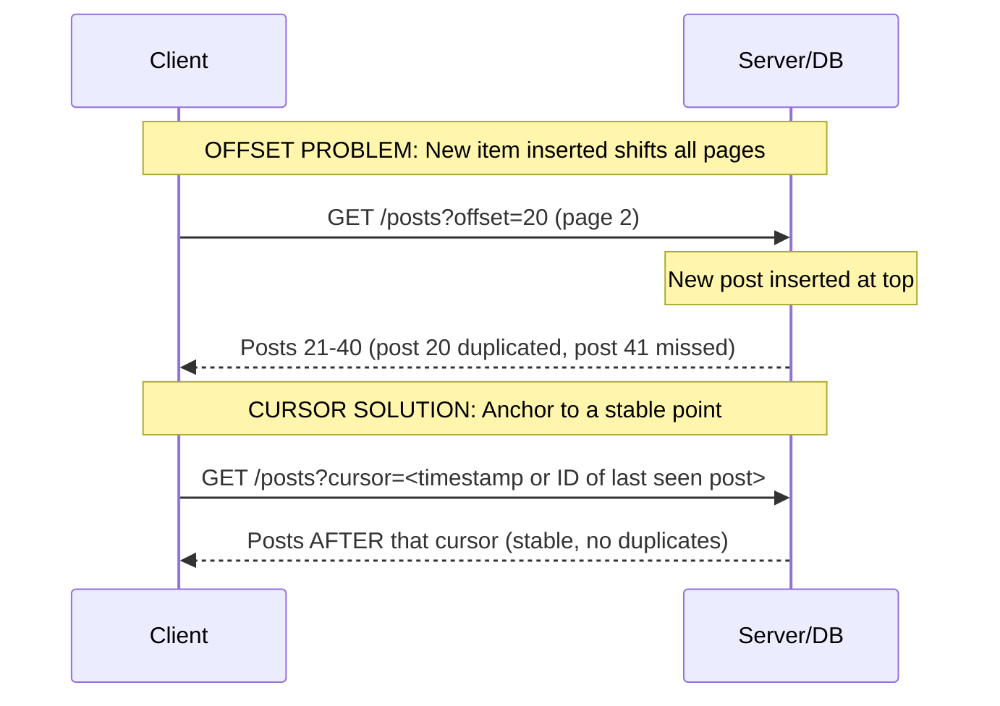

### Interview Talking Points — Pagination

| Question | Answer |
|---|---|
| Why is offset pagination problematic for social feeds? | Social feeds have frequent inserts at the top. Offset-based pagination shifts all records — a new post at position 0 pushes everything down, causing page 2 to duplicate the last item from page 1 or skip items. Cursor pagination anchors to a stable point in the dataset. |
| How does cursor pagination work? | The server returns a cursor (opaque token — usually a base64-encoded timestamp or ID of the last item). The client sends this cursor on the next request. The server queries `WHERE created_at < cursor_timestamp LIMIT 20` — always returns the next stable page regardless of inserts/deletes. |
| When is offset pagination acceptable? | For datasets that rarely change (product catalogs, archived documents), or when users need to jump to arbitrary pages (page 50 of 200). |

---

## 10. Caching Strategies

### Cache Layers in Mobile

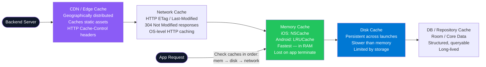

### Cache Invalidation Strategies

| Strategy | How it works | Use case |
|---|---|---|
| **Time-based (TTL)** | Cache expires after N seconds/minutes | Weather data, news feeds |
| **ETag** | Server returns ETag header; client sends `If-None-Match`; server returns 304 if unchanged | Static assets, API responses |
| **Last-Modified** | Server returns `Last-Modified`; client sends `If-Modified-Since`; 304 if unchanged | Documents, images |
| **Manual invalidation** | App explicitly clears cache on user action or event | After user logs out, after write operation |
| **Write-through** | Update cache and backend simultaneously on write | Inventory, account balance |

---

## 11. Authentication

### Auth Flow Overview

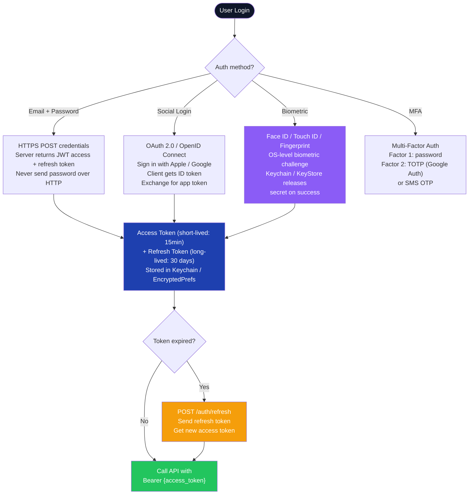

### Token Storage Best Practices

| Token | Storage | Why |
|---|---|---|
| Access Token (short-lived) | In-memory (variable) | Least exposure; lost on app termination |
| Refresh Token (long-lived) | iOS Keychain / Android EncryptedSharedPreferences | Encrypted by OS; protected from other apps |
| **Never store in** | UserDefaults / SharedPreferences (unencrypted) | Accessible in device backups, unprotected |

---

## 12. Retry Policies & Resilience

### Retry Decision Flow

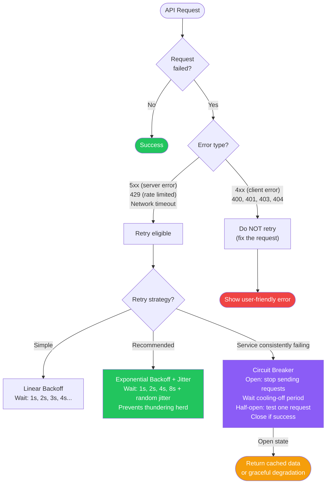

### OAuth Token Refresh Retry

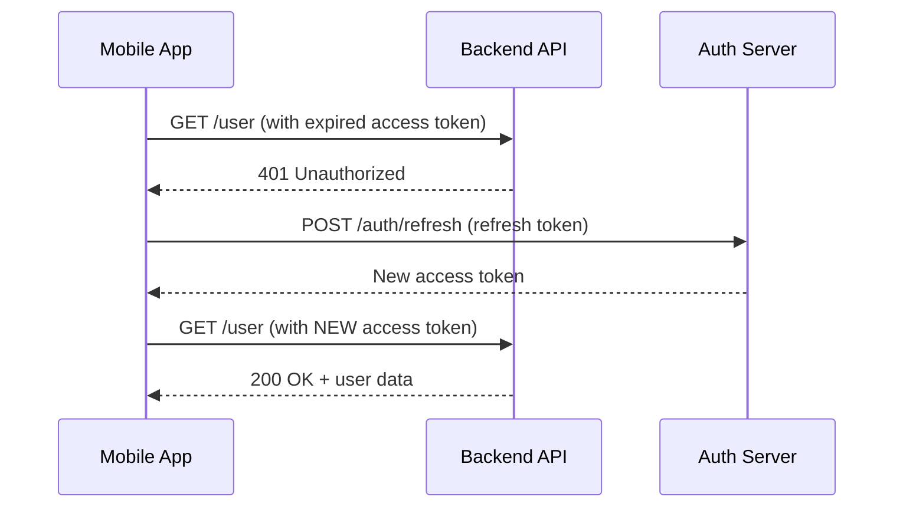

---

## 13. Performance & Optimization

### Memory Management

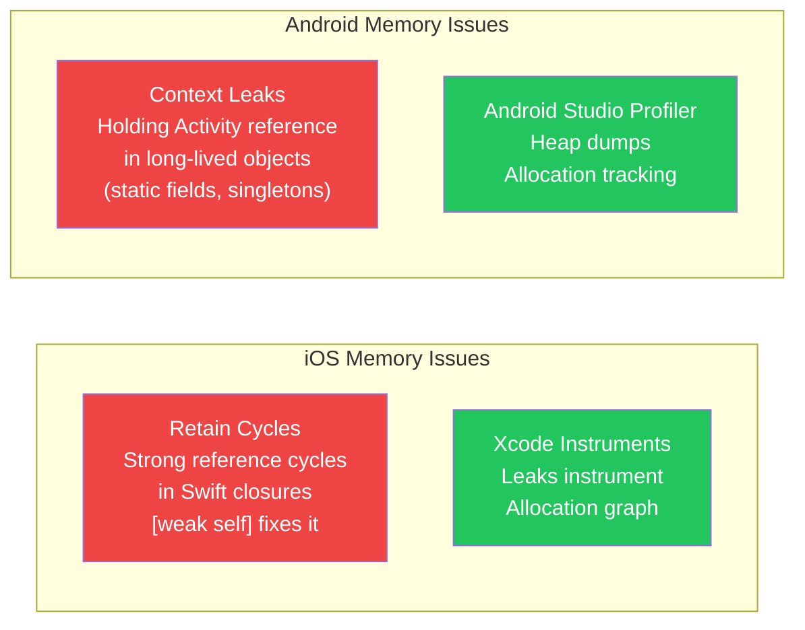

### CPU & Battery Optimization

| Area | iOS | Android |
|---|---|---|
| **Background tasks** | `BackgroundTasks` framework (`BGTaskScheduler`) | `WorkManager` (guaranteed deferred work) |
| **Power-saving mode** | **App Nap** — reduces background app power | **Doze Mode** — deep sleep when stationary; defers most app activity |
| **Location** | Use `kCLLocationAccuracyReduced` when precision not needed | Use `PRIORITY_BALANCED_POWER_ACCURACY` over `HIGH_ACCURACY` |
| **Target FPS** | 60fps (or 120fps ProMotion) | 60fps; use `RecyclerView` for smooth lists |

### App Startup Optimization

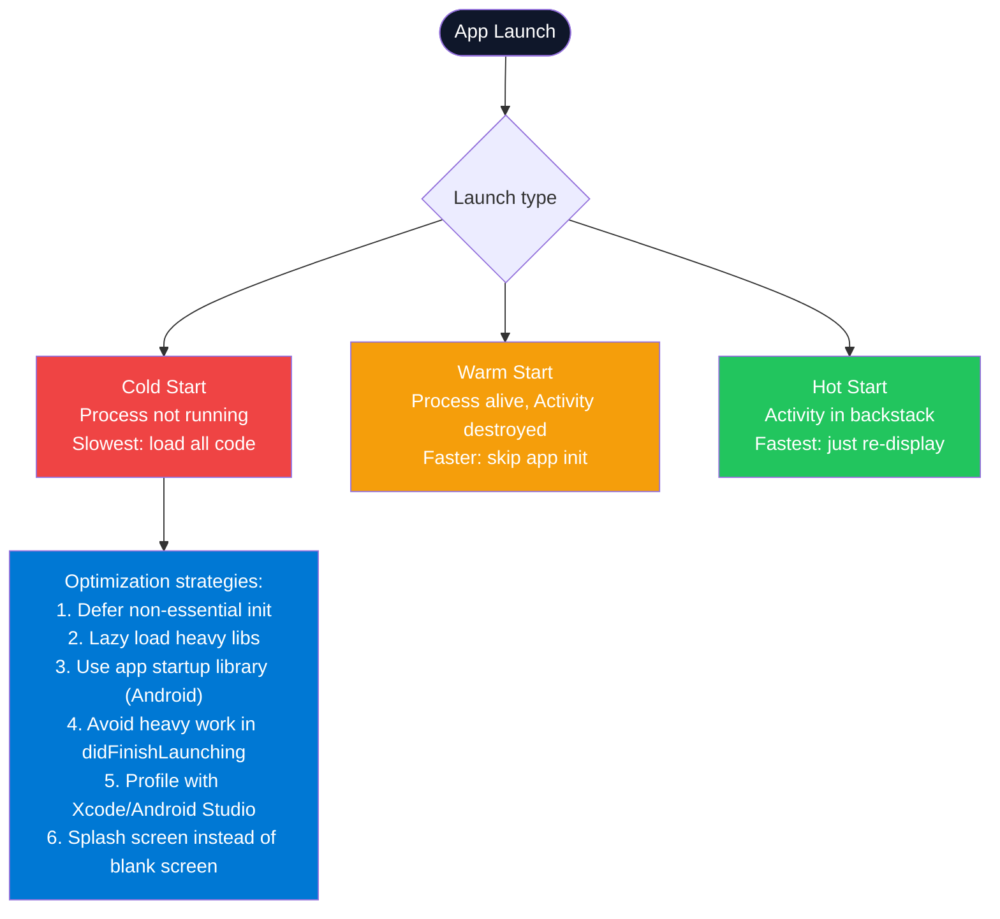

### Rendering & Animation
- **Target 60fps** — each frame budget = 16ms (1000ms ÷ 60)
- **Never do heavy work on the main thread** — I/O, networking, large computation must be async
- **Avoid overdraw** — multiple overlapping views painting the same pixels unnecessarily
- **iOS tools**: Xcode View Debugger, Instruments (Core Animation)
- **Android tools**: Android Studio Layout Inspector, GPU Overdraw visualization

---

## 14. Observability & Testing

### Testing Pyramid for Mobile

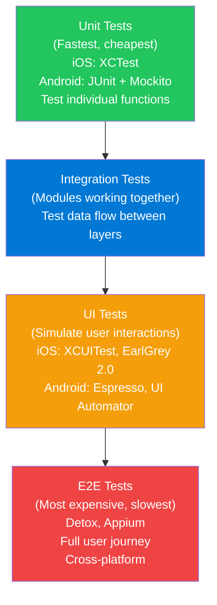

### Beta Distribution & Rollout Strategy

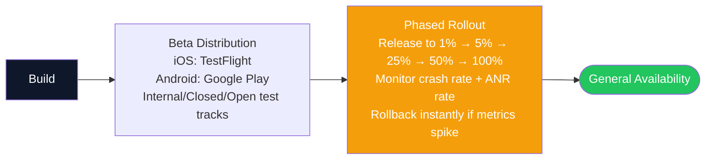

### Crash Reporting & Monitoring

| Tool | Use Case |
|---|---|
| **Firebase Crashlytics** | Crash reporting + stack traces + user impact |
| **Sentry** | Crashes + performance monitoring + error tracking |
| **Datadog / New Relic** | APM + mobile performance metrics |
| **Xcode Instruments** | On-device profiling (memory, CPU, network) |
| **Android Studio Profiler** | CPU, memory, network, energy profiling |

---

## 15. Privacy & Security

### Security Layers

```mermaid
flowchart TD
    subgraph DataInTransit ["Data In Transit"]
        TLS["HTTPS / TLS 1.3\nEncrypts all network traffic\nPrevents man-in-the-middle\nCertificate pinning for extra security"]
    end

    subgraph DataAtRest ["Data At Rest"]
        ENC["Device Encryption\n(enabled by default on modern iOS/Android)\nKeychain / EncryptedSharedPreferences\nfor sensitive app data"]
    end

    subgraph CodeSec ["Code Security"]
        OBF["Obfuscation\nAndroid: R8 / ProGuard\niOS: Swift native (less needed)\nMakes reverse engineering harder"]
        INT["Code Integrity\nCode signing (both platforms)\nApp Store / Play Store verification"]
    end

    subgraph Compliance ["Privacy Compliance"]
        GDPR["GDPR (EU)\nUser consent, data access rights\nRight to be forgotten\nData portability"]
        CCPA["CCPA (California)\nOpt-out of data sale\nDisclosure of data collected"]
        STORE["App Store / Play Store Policies\nPrivacy manifests (iOS 17+)\nData safety section (Android)"]
    end

    style TLS fill:#22c55e,color:#fff
    style ENC fill:#0078D4,color:#fff
    style OBF fill:#8b5cf6,color:#fff
    style GDPR fill:#ef4444,color:#fff
    style CCPA fill:#ef4444,color:#fff
```

### Privacy Best Practices

| Practice | Why it matters |
|---|---|
| **Minimize data collection** | Less data = less breach risk + easier GDPR compliance |
| **Minimum permissions** | Request only permissions needed for core function. Camera app shouldn't need contacts. |
| **Clear data retention policy** | Define how long you keep data; delete on user request |
| **Certificate pinning** | Prevents MITM even if a CA is compromised — pin the server's cert in the app |
| **Jailbreak/root detection** | Compromised devices bypass OS-level security; detect and warn/restrict |

---

## 16. App-Wide Architecture Patterns

### Pattern Evolution

```mermaid
flowchart LR
    MVC["MVC\n(1979 — original)\nModel-View-Controller\nFat controller problem"] -->
    MVP["MVP\n(1990s)\nModel-View-Presenter\nPassive view, testable"] -->
    MVVM["MVVM\n(2005)\nModel-View-ViewModel\nTwo-way binding,\nUI / business logic split"] -->
    MVI["MVI\n(2016)\nModel-View-Intent\nUnidirectional data flow\nImmutable state"] -->
    CLEAN["Clean Architecture\n(Robert Martin)\nConcentric layers\nDependency rule:\nouter depends on inner"]

    style MVC fill:#ef4444,color:#fff
    style MVP fill:#f59e0b,color:#fff
    style MVVM fill:#0078D4,color:#fff
    style MVI fill:#8b5cf6,color:#fff
    style CLEAN fill:#22c55e,color:#fff
```

### VIPER Architecture (Mobile)

```mermaid
flowchart LR
    V["View\nDisplays UI\nPassive — no logic\nDelegates user events\nto Presenter"] <--> P["Presenter\nPrepares data for View\nReceives View events\nCalls Interactor\nHandles presentation logic"]
    P <--> I["Interactor\nBusiness logic\nFetches / processes data\nCalls entities\nUse case layer"]
    I <--> E["Entity\nData models only\nNo business logic\nPure data structures"]
    P <--> R["Router\nNavigation logic\nCreates next screen\nInjects dependencies"]

    style V fill:#0078D4,color:#fff
    style P fill:#8b5cf6,color:#fff
    style I fill:#22c55e,color:#fff
    style E fill:#1e40af,color:#fff
    style R fill:#f59e0b,color:#fff
```

### Clean Architecture Layers

```mermaid
flowchart TD
    subgraph Outer ["Outer Layer — Infrastructure"]
        UI["UI / Views\n(React, SwiftUI, Compose)"]
        DB["Database\n(Room, Core Data, SQLite)"]
        NET["Network\n(Retrofit, URLSession)"]
    end

    subgraph Middle ["Interface Adapters"]
        CTRL["Controllers / Presenters / ViewModels"]
        REPO["Repository Implementations"]
        MAP["Data Mappers (DTO → Domain)"]
    end

    subgraph Inner ["Application Business Logic"]
        UC["Use Cases\n(app-specific business rules)"]
    end

    subgraph Core ["Core — Domain"]
        ENT["Entities\n(enterprise business rules)\nRarely change"]
    end

    Outer --> Middle --> Inner --> Core
    Note["Dependency Rule:\nouter depends on inner\nINNER NEVER knows about outer"]

    style UI fill:#ef4444,color:#fff
    style ENT fill:#22c55e,color:#fff
    style UC fill:#0078D4,color:#fff
    style Note fill:#f59e0b,color:#fff
```

### Pattern Comparison

| Pattern | Best For | Key Benefit | Key Con |
|---|---|---|---|
| **MVC** | Small apps, rapid prototyping | Simple, well-known | Fat controller; View+Model coupling |
| **MVP** | Medium apps, high testability | Pure passive View | Fat Presenter risk |
| **MVVM** | Apps with complex UI state, reactive data | Two-way binding; ViewModel survives rotation | Overkill for simple screens |
| **MVI** | Predictable state machines, Redux-style | Immutable state; easy to debug/test | More boilerplate; learning curve |
| **VIPER** | Large iOS apps with multiple teams | Maximum separation of concerns | Heavy boilerplate |
| **Clean Architecture** | Enterprise apps, long-lived codebases | Framework-agnostic core; highly testable | High initial complexity |

---

## 17. GoF Design Patterns

### Pattern Taxonomy

```mermaid
flowchart TD
    GOF["Gang of Four\nDesign Patterns (23)"] --> CREAT["Creational\n(Object Creation)"]
    GOF --> STRUCT["Structural\n(Composition)"]
    GOF --> BEHAV["Behavioral\n(Communication)"]

    CREAT --> S["Singleton\nFactory Method\nAbstract Factory\nBuilder\nPrototype"]
    STRUCT --> ST["Facade\nAdapter\nDecorator\nProxy\nComposite\nBridge\nFlyweight"]
    BEHAV --> B["Observer\nStrategy\nCommand\nChain of Responsibility\nMediator\nMemento\nInterpreter\nVisitor\nTemplate Method\nIterator\nState"]

    style GOF fill:#0f172a,color:#fff
    style CREAT fill:#0078D4,color:#fff
    style STRUCT fill:#8b5cf6,color:#fff
    style BEHAV fill:#22c55e,color:#fff
```

### Most Common Mobile Patterns

| Pattern | Category | Mobile Use Case | Example |
|---|---|---|---|
| **Singleton** | Creational | Network manager, Logger, Analytics | `NetworkManager.shared`, `Logger.instance` |
| **Builder** | Creational | Complex object construction with optional params | `URLRequest.Builder`, `AlertDialog.Builder` (Android) |
| **Factory** | Creational | Create objects based on type without specifying class | `ViewControllerFactory.make(type:)` |
| **Observer** | Behavioral | Data binding, event handling | `NotificationCenter`, `LiveData`, SwiftUI `@Published` |
| **Strategy** | Behavioral | Swappable algorithm at runtime | Payment strategy (card/PayPal/Apple Pay) |
| **Facade** | Structural | Simplify complex subsystem | `NetworkLayer` hiding URLSession details |
| **Adapter** | Structural | Bridge incompatible interfaces | Wrapping third-party SDK in your own protocol |
| **Decorator** | Structural | Add behavior without subclassing | `UIView` layer decorators, middleware chains |

---

## 18. SOLID Principles for Mobile

### SOLID Quick Reference

```mermaid
flowchart TD
    SOLID["SOLID Principles"] --> SRP["S — Single Responsibility\nA class should have only ONE reason to change\nProblem: Massive ViewController (iOS)\nSolution: Separate networking, parsing, UI logic"]
    SOLID --> OCP["O — Open/Closed\nOpen for extension, closed for modification\nProblem: Endless if/else for cell types\nSolution: Protocol-based configurable cells"]
    SOLID --> LSP["L — Liskov Substitution\nSubtypes must be substitutable for their base\nProblem: Subclass that breaks parent contract\nSolution: Proper protocol conformance"]
    SOLID --> ISP["I — Interface Segregation\nDon't force classes to implement unused methods\nProblem: Huge ChatProtocol\nSolution: Split into smaller focused protocols"]
    SOLID --> DIP["D — Dependency Inversion\nHigh-level modules depend on abstractions\nProblem: ViewController directly imports CoreData\nSolution: FeedProvider protocol — both depend on abstraction"]

    style SRP fill:#0078D4,color:#fff
    style OCP fill:#22c55e,color:#fff
    style LSP fill:#8b5cf6,color:#fff
    style ISP fill:#f59e0b,color:#fff
    style DIP fill:#22c55e,color:#fff
```

### Dependency Injection

```mermaid
flowchart LR
    subgraph Without_DI ["Without DI (Tight Coupling)"]
        VC1["ViewController"] -->|"Creates directly"| CD["CoreData\n(specific implementation)"]
    end

    subgraph With_DI ["With DI (Loose Coupling)"]
        VC2["ViewController"] -->|"Depends on abstraction"| FP["FeedProvider\n(protocol/interface)"]
        FP -->|"Concrete impl injected"| CD2["CoreDataFeedProvider"]
        FP -->|"Test impl injected"| MOCK["MockFeedProvider"]
    end

    style CD fill:#ef4444,color:#fff
    style FP fill:#22c55e,color:#fff
    style CD2 fill:#0078D4,color:#fff
    style MOCK fill:#8b5cf6,color:#fff
```

| DI Tool | Platform | Notes |
|---|---|---|
| Manual DI (constructor injection) | iOS / Android | Best for small apps; explicit, no magic |
| **Swinject** | iOS | Type-safe DI container for Swift |
| **Hilt** | Android | Official Jetpack DI; Dagger under the hood |
| **Dagger** | Android | Compile-time, powerful, steeper learning curve |

---

## 19. Advanced Topics

### On-Device Machine Learning

```mermaid
flowchart LR
    subgraph OnDevice ["On-Device ML"]
        IOS_ML["iOS: Core ML\nPre-trained model .mlmodel\nObjective-C / Swift API\nOptimized for Apple Silicon"]
        AND_ML["Android: TensorFlow Lite\n.tflite model\nKotlin / Java API\nGPU / NPU acceleration"]
    end

    subgraph Benefits ["Benefits vs Cloud ML"]
        PRIV["Privacy: data never leaves device"]
        SPEED["Speed: no network round-trip"]
        OFFLINE["Offline: works without internet"]
    end

    style IOS_ML fill:#0078D4,color:#fff
    style AND_ML fill:#22c55e,color:#fff
    style PRIV fill:#22c55e,color:#fff
    style SPEED fill:#22c55e,color:#fff
    style OFFLINE fill:#22c55e,color:#fff
```

### Advanced Topics Summary

| Topic | iOS | Android | Key Consideration |
|---|---|---|---|
| **On-Device ML** | Core ML | TensorFlow Lite | Model size vs accuracy trade-off |
| **AR** | ARKit | ARCore | Plane detection, anchors, lighting |
| **VR** | Vision Pro (RealityKit) | Cardboard / standalone HMDs | Comfort, motion sickness |
| **Wearables** | WatchKit (watchOS) | Wear OS | Limited display, battery, input |
| **Foldables** | iPad multi-window | WindowSizeClass (Compose) | Seamless layout transitions |
| **Server-Driven UI** | Codable-driven rendering | JSON-driven component tree | Update UI without app update |
| **Cross-Platform** | React Native / Flutter / Xamarin | Same | Trade-off: dev speed vs native feel |
| **i18n** | Localizable.strings, RTL layouts | strings.xml, RTL support | Date/currency/text direction |

---

## 20. Interview Strategy

### RADIO Framework for System Design Interviews

```mermaid
flowchart TD
    R["R — Requirements\n• Functional: What the app does\n• Non-Functional: offline, bandwidth,\n  battery, 60fps, consistency, scale"] --> A
    A["A — Architecture\n• High-level component diagram\n• MVC/MVVM/Clean as starting point\n• Client, API, Controller, Model, View"] --> D
    D["D — Data Model & API\n• Define key data types\n• Choose: REST / GraphQL / WebSocket\n• Design API contracts"] --> I
    I["I — Interface / Optimizations\n• Network: caching, batching, HTTP/2\n• Rendering: lazy load, virtualization\n• App: offline support, pagination"] --> O
    O["O — Observability & Security\n• Logging, crash reporting, metrics\n• Auth, CORS, XSS prevention\n• Privacy compliance"]

    style R fill:#0078D4,color:#fff
    style A fill:#8b5cf6,color:#fff
    style D fill:#22c55e,color:#fff
    style I fill:#f59e0b,color:#fff
    style O fill:#ef4444,color:#fff
```

### Non-Functional Requirements Checklist

| NFR | Questions to ask | Mobile implication |
|---|---|---|
| **Offline mode** | Which features must work offline? What data to cache? | SQLite + sync queue; WorkManager / URLSession background |
| **Bandwidth** | Mobile data costs; slow networks (2G/3G) | Delta updates, image compression, pagination |
| **Battery** | Background location? Push vs polling? | WorkManager batch jobs; avoid wake locks |
| **Scroll performance** | FPS = 60; Long lists? | RecyclerView / LazyColumn; avoid heavy main-thread work |
| **Data consistency** | Strong (chat) or eventual (feed)? | WebSockets for strong; polling/SSE for eventual |
| **Scale** | DAU? Peak load? | Server concerns, but affects caching strategy |
| **Authentication** | Which login methods? Token refresh? | Keychain + refresh token flow |

### Interview Talking Point — Common Red Flags

| Red Flag | Correct Approach |
|---|---|
| "We call the API on the main thread" | Always async; use coroutines / async-await / GCD background queue |
| "We store auth tokens in UserDefaults" | Use Keychain (iOS) or EncryptedSharedPreferences (Android) |
| "We reload all data on every app open" | Cache aggressively; use ETag / TTL; only fetch delta |
| "We request all permissions at launch" | Request permissions just-in-time, when the feature is first used |
| "We use offset pagination for the news feed" | Use cursor pagination for dynamic, frequently-updated datasets |
| "We do heavy computation in cellForRow / onBindViewHolder" | Pre-compute off-screen; main thread for display only |
