# AI & Architecture Concepts: Complete Reference — Part 1 (.NET)

> Covers: Redundancy vs Replication · TOGAF · Transformers · RAG · RLHF · Diffusion Models

---

## Table of Contents

1. [Redundancy vs Replication](#1-redundancy-vs-replication)
2. [TOGAF & Enterprise Architecture Frameworks](#2-togaf--enterprise-architecture-frameworks)
3. [Transformers — LLM Foundation](#3-transformers--llm-foundation)
4. [RAG — Retrieval-Augmented Generation](#4-rag--retrieval-augmented-generation)
5. [RLHF — Reinforcement Learning from Human Feedback](#5-rlhf--reinforcement-learning-from-human-feedback)
6. [Diffusion Models](#6-diffusion-models)

---

## 1. Redundancy vs Replication

### Overview

**Redundancy** means having backup components that activate only when the primary fails — it is purely about availability. **Replication** means copying data or services across multiple nodes that all serve live traffic simultaneously — it delivers both availability and horizontal scale. The two are orthogonal concerns that are often combined: a replicated database cluster is also redundant, but a cold-standby failover server is redundant without replication. Confusing them in an interview signals a gap in distributed-systems fundamentals.

---

### Redundancy vs Replication Comparison

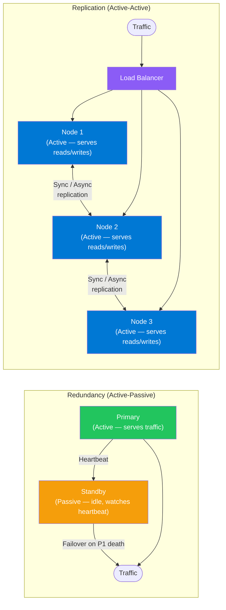

---

### Replication Modes

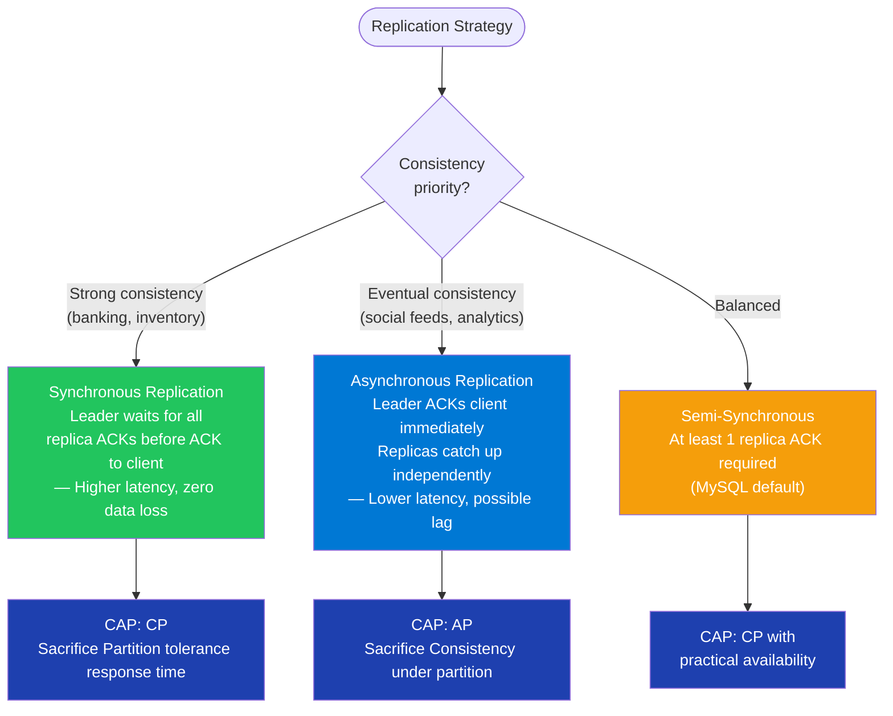

---

### Failover Sequence (Active-Passive Redundancy)

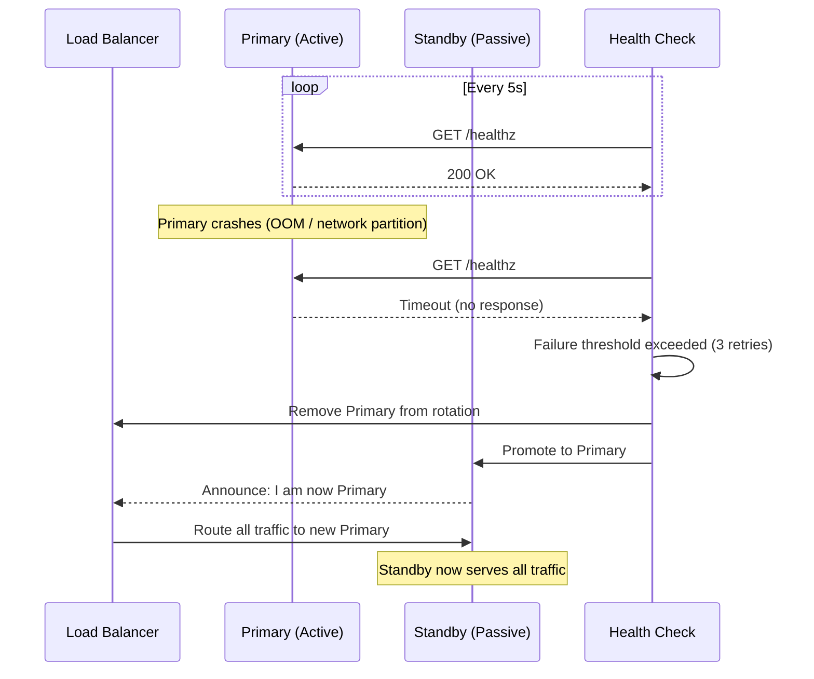

---

### Component — Health Checks + Failover-Ready API (ASP.NET Core)

**Tech Stack:** `Microsoft.AspNetCore.Diagnostics.HealthChecks`, `Polly`, `StackExchange.Redis`

```csharp
// Program.cs — health check registration
builder.Services.AddHealthChecks()
    .AddSqlServer(
        connectionString: config.GetConnectionString("Primary")!,
        name: "sql-primary",
        tags: ["db", "critical"])
    .AddRedis(
        redisConnectionString: config["Redis:ConnectionString"]!,
        name: "redis",
        tags: ["cache"])
    .AddAzureServiceBusTopic(
        connectionString: config["ServiceBus:ConnectionString"]!,
        topicName: "orders",
        name: "servicebus",
        tags: ["messaging"]);

// Expose health endpoints
app.MapHealthChecks("/healthz/live", new HealthCheckOptions
{
    Predicate = _ => false   // liveness: always healthy if process is up
});

app.MapHealthChecks("/healthz/ready", new HealthCheckOptions
{
    Predicate = check => check.Tags.Contains("critical"),
    ResponseWriter = UIResponseWriter.WriteHealthCheckUIResponse
});

// Polly retry policy for resilient DB calls
public class OrderRepository(IDbConnectionFactory factory, ResiliencePipeline pipeline)
{
    public async Task<Order?> GetByIdAsync(string id, CancellationToken ct = default)
        => await pipeline.ExecuteAsync(async token =>
        {
            await using var conn = await factory.OpenAsync(token);
            return await conn.QuerySingleOrDefaultAsync<Order>(
                "SELECT * FROM Orders WHERE Id = @Id", new { Id = id });
        }, ct);
}

// Polly pipeline (exponential backoff + circuit breaker)
builder.Services.AddResiliencePipeline("db", pipelineBuilder =>
{
    pipelineBuilder
        .AddRetry(new RetryStrategyOptions
        {
            MaxRetryAttempts = 3,
            Delay = TimeSpan.FromMilliseconds(200),
            BackoffType = DelayBackoffType.Exponential,
            UseJitter = true
        })
        .AddCircuitBreaker(new CircuitBreakerStrategyOptions
        {
            FailureRatio = 0.5,
            SamplingDuration = TimeSpan.FromSeconds(10),
            MinimumThroughput = 5,
            BreakDuration = TimeSpan.FromSeconds(30)
        });
});
```

---

### Interview Talking Points — Redundancy vs Replication

| Question | Answer |
|---|---|
| Core difference? | Redundancy = backup on failure (availability). Replication = copies serving live traffic (availability + scale). You can have redundancy without replication (cold standby) and replication without redundancy if all replicas are required to serve. |
| What is active-active vs active-passive? | **Active-active**: all nodes serve traffic simultaneously (replication). **Active-passive**: one node serves traffic; standby takes over only on failure (redundancy). Active-active is harder to keep consistent; active-passive wastes resources. |
| What database replication mode does Azure SQL use? | Azure SQL uses synchronous replication within a region (via Always On Availability Groups) and asynchronous geo-replication across regions. The primary ACKs the client only after at least one secondary confirms the log record. |
| When does replication cause data loss? | In async replication — if the primary crashes before the replication lag is flushed, committed transactions are lost. Mitigation: use semi-sync replication or set RPO (Recovery Point Objective) expectations explicitly. |
| How do you achieve zero RPO? | Synchronous replication with at least one secondary ACK before client ACK. Zero RPO + zero RTO simultaneously is impossible under network partitions (CAP theorem). |
| What's the difference between RPO and RTO? | **RPO** (Recovery Point Objective): maximum acceptable data loss — answered by replication lag. **RTO** (Recovery Time Objective): maximum acceptable downtime — answered by failover speed. |

---

## 2. TOGAF & Enterprise Architecture Frameworks

### Overview

TOGAF (The Open Group Architecture Framework) is the industry-standard framework for enterprise architecture. Its core is the **Architecture Development Method (ADM)** — a phased, iterative cycle that guides how an organization plans, designs, implements, and governs its IT systems in alignment with business strategy. TOGAF is not a technical specification; it is a methodology for *how to think and communicate* about large-scale system change across an organization.

---

### TOGAF ADM Cycle

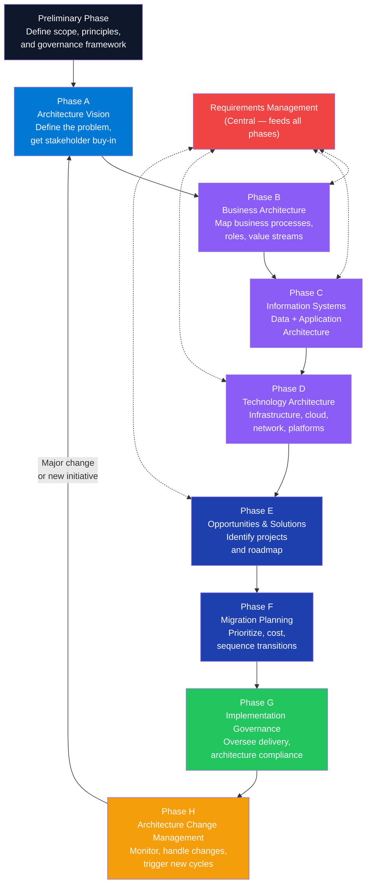

---

### EA Framework Comparison

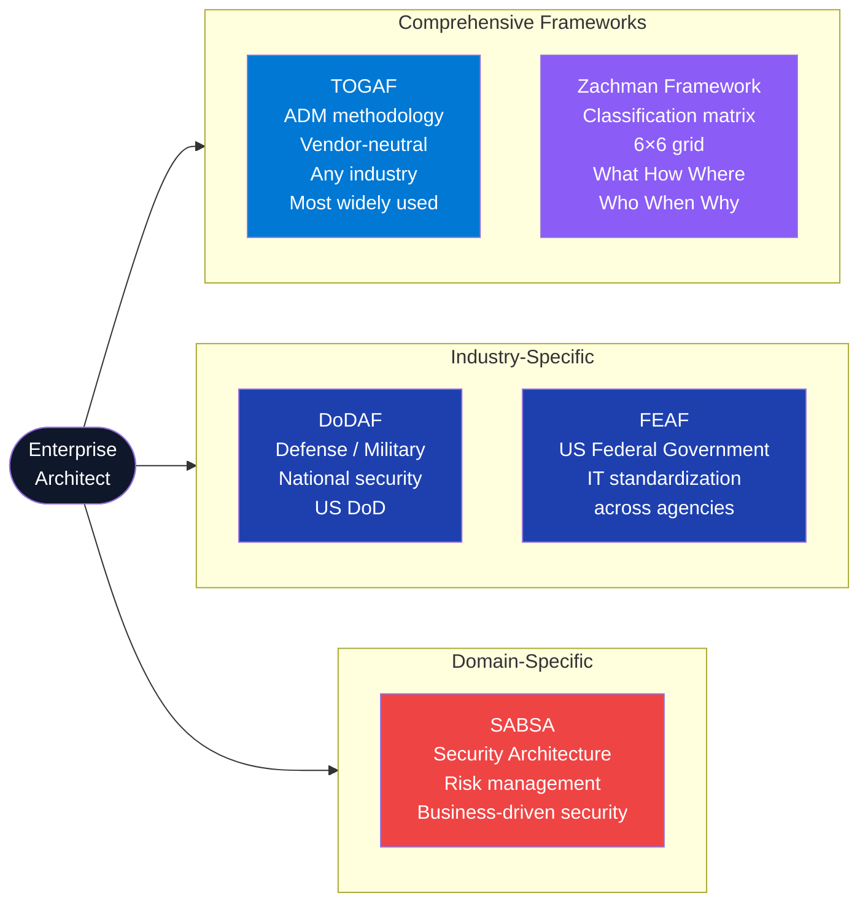

---

### TOGAF Deliverables per Phase

| Phase | Key Deliverable | Purpose |
|---|---|---|
| Preliminary | Architecture Principles Document | Non-negotiable constraints (e.g., "cloud-first", "API-first") |
| A — Vision | Architecture Vision, Statement of Architecture Work | Agree scope and win stakeholder commitment |
| B — Business | Business Architecture Document | Current → target business process maps, capabilities |
| C — Info Systems | Data Architecture + Application Architecture | Which apps, which data, integration map |
| D — Technology | Technology Architecture | Infrastructure, cloud services, security controls |
| E — Solutions | Architecture Roadmap, Transition Architectures | Phased migration path from current to target state |
| F — Migration | Implementation and Migration Plan | Sequenced project list with cost/benefit |
| G — Governance | Architecture Contracts, Compliance Assessments | Ensure delivery matches architecture intent |
| H — Change Mgmt | Architecture Compliance Reports, Change Requests | Handle drift, new requirements, tech refresh |

---

### Interview Talking Points — TOGAF

| Question | Answer |
|---|---|
| What problem does TOGAF solve? | It prevents "accidental architecture" — where systems grow organically without alignment to business goals, creating silos, duplication, and technical debt. TOGAF provides a repeatable governance process for making system-change decisions deliberately and traceably. |
| What is the ADM? | Architecture Development Method — an iterative, phase-by-phase cycle (Prelim → A through H) that governs how architecture is created, approved, implemented, and changed. The center of the wheel is Requirements Management, which feeds all phases. |
| How does TOGAF differ from Zachman? | TOGAF is a *process* (step-by-step methodology). Zachman is a *classification schema* (a 6×6 matrix of viewpoints). Zachman tells you *what to document*; TOGAF tells you *how to run the architecture process*. Many organizations use both. |
| What is an Architecture Building Block (ABB) vs Solution Building Block (SBB)? | **ABB**: a vendor-agnostic capability (e.g., "authentication service"). **SBB**: the concrete implementation of an ABB (e.g., "Azure Active Directory B2C"). ABBs live in Phase C/D; SBBs are chosen in Phase E. |
| When would you skip TOGAF? | For startups or teams < 50 engineers. TOGAF adds governance overhead that slows small teams. Use lightweight alternatives (C4 Model, ADRs — Architecture Decision Records) until organizational complexity justifies formal EA governance. |
| What is the Architecture Repository in TOGAF? | A structured store for all architecture artifacts: architecture landscape (current state), standards information base (approved tech), reference library, governance log, and metamodel. In practice, this is often Confluence + draw.io or LeanIX. |

---

## 3. Transformers — LLM Foundation

### Overview

The Transformer architecture (Vaswani et al., "Attention Is All You Need", 2017) is the foundation of every modern LLM. Unlike RNNs/LSTMs that process tokens sequentially, Transformers process all tokens in parallel using **self-attention** — each token simultaneously attends to every other token in the sequence, weighting their importance. This parallelism enables training on massive datasets via GPU/TPU clusters and produces models that understand long-range context. GPT, Claude, Gemini, and Llama are all decoder-only Transformer variants.

---

### Transformer Architecture

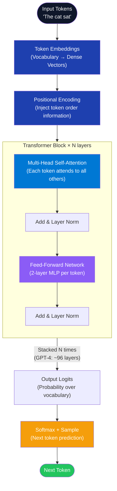

---

### Self-Attention Mechanism

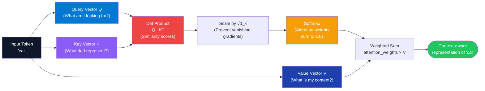

---

### Decoder-Only vs Encoder-Decoder

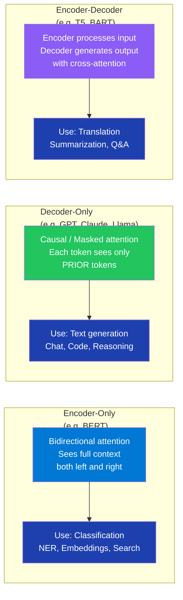

---

### Calling Transformers from .NET (Azure OpenAI)

**Tech Stack:** `Azure.AI.OpenAI`, `Microsoft.SemanticKernel`

```csharp
using Azure;
using Azure.AI.OpenAI;
using Azure.Identity;

// Direct Azure OpenAI SDK — full control over sampling params
public class TransformerInferenceService(IConfiguration config)
{
    private readonly AzureOpenAIClient _client = new(
        endpoint: new Uri(config["AzureOpenAI:Endpoint"]!),
        credential: new DefaultAzureCredential()
    );

    public async Task<string> GenerateAsync(
        string systemPrompt,
        string userMessage,
        float temperature = 0.7f,
        float topP = 0.95f,
        int maxTokens = 1000,
        CancellationToken ct = default)
    {
        var chatClient = _client.GetChatClient(config["AzureOpenAI:DeploymentName"]!);

        var completion = await chatClient.CompleteChatAsync(
            messages:
            [
                new SystemChatMessage(systemPrompt),
                new UserChatMessage(userMessage)
            ],
            options: new ChatCompletionOptions
            {
                Temperature = temperature,   // 0 = deterministic, 1 = creative
                TopP = topP,                 // nucleus sampling cutoff
                MaxOutputTokenCount = maxTokens
            },
            cancellationToken: ct
        );

        return completion.Value.Content[0].Text;
    }
}
```

---

### Key Sampling Parameters Explained

| Parameter | Range | Effect | Production Default |
|---|---|---|---|
| `temperature` | 0.0–2.0 | Controls randomness. 0 = greedy (most likely token always). High = creative/diverse. | 0.2–0.7 for factual; 0.8–1.2 for creative |
| `top_p` | 0.0–1.0 | Nucleus sampling. Consider only tokens whose cumulative probability ≤ top_p. 0.1 = very conservative. | 0.9–0.95 |
| `top_k` | integer | Consider only top-k most probable tokens at each step. Anthropic Claude exposes this. | 40–100 |
| `max_tokens` | integer | Hard cap on output length. Model stops here even mid-sentence. | Set per use-case |
| `frequency_penalty` | -2.0–2.0 | Penalises tokens that have appeared frequently. Reduces repetition. | 0.0–0.3 |
| `presence_penalty` | -2.0–2.0 | Penalises any token that has appeared at all. Encourages topic diversity. | 0.0–0.5 |
| `seed` | integer | Makes sampling deterministic (same seed + same prompt = same output). | Set in testing |

---

### Interview Talking Points — Transformers

| Question | Answer |
|---|---|
| What problem did the Transformer solve that RNNs could not? | RNNs process tokens sequentially — they can't parallelize and suffer from vanishing gradients over long sequences. Transformers process all tokens in parallel via self-attention, enabling GPU-scale training and long-range context without gradient degradation. |
| Explain self-attention in one sentence. | Each token projects itself into three vectors (Query, Key, Value); it then computes a similarity score against every other token's Key, converts to probabilities (softmax), and uses those probabilities to produce a weighted sum of all tokens' Values — a context-aware representation. |
| Why scale the attention scores by √d_k? | Dot products grow large as the key dimension d_k increases, pushing softmax into regions with near-zero gradients. Dividing by √d_k keeps scores in a stable range for training. |
| What is multi-head attention? | Running the Q/K/V attention computation H times in parallel with different learned projection matrices. Each "head" specializes in a different relationship (syntax, coreference, etc.). Outputs are concatenated and linearly projected. |
| What is the context window? | The maximum number of tokens the model can attend to in one forward pass. Tokens beyond the window are simply not visible. Modern models range from 8K (older GPT-4) to 1M+ tokens (Gemini 1.5). |
| What is positional encoding and why is it needed? | Self-attention is inherently order-agnostic — swapping "dog bit man" and "man bit dog" produces identical attention matrices. Positional encodings (sinusoidal or learned) inject token position information into embeddings before attention. |
| What is causal (masked) attention in decoder-only models? | A triangular mask zeroes out attention weights for future tokens — token at position i can only attend to positions ≤ i. This enables autoregressive generation: predict one token, append it, predict the next. |

---

## 4. RAG — Retrieval-Augmented Generation

### Overview

RAG (Lewis et al., 2020) augments a frozen LLM with a retrieval system. Before generation, a query is embedded into a dense vector and used to search an external knowledge store. The most relevant documents are retrieved and injected into the prompt context, grounding the LLM's response in current, domain-specific facts. RAG separates *knowledge* (in the index) from *reasoning* (in the model), allowing knowledge to be updated independently without retraining. It is the dominant pattern for enterprise AI grounded on private data.

---

### RAG Pipeline Architecture

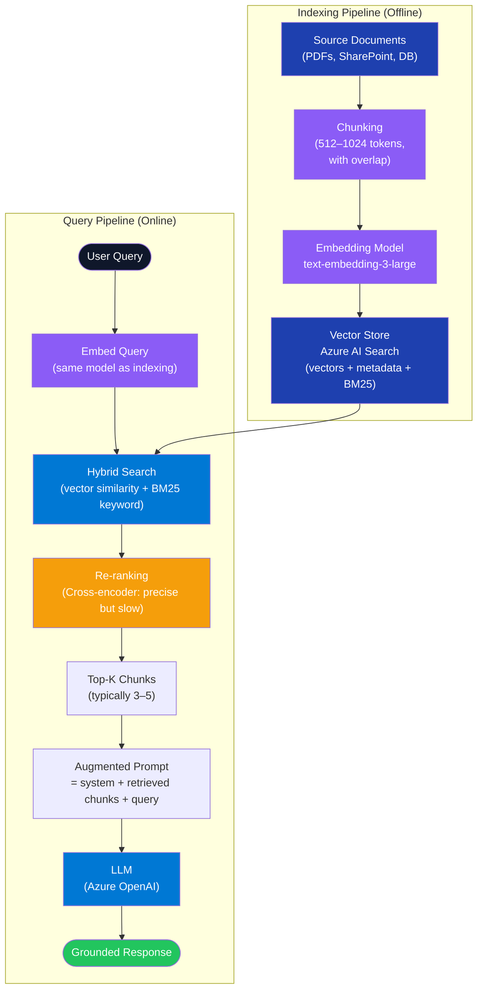

---

### Chunking Strategies

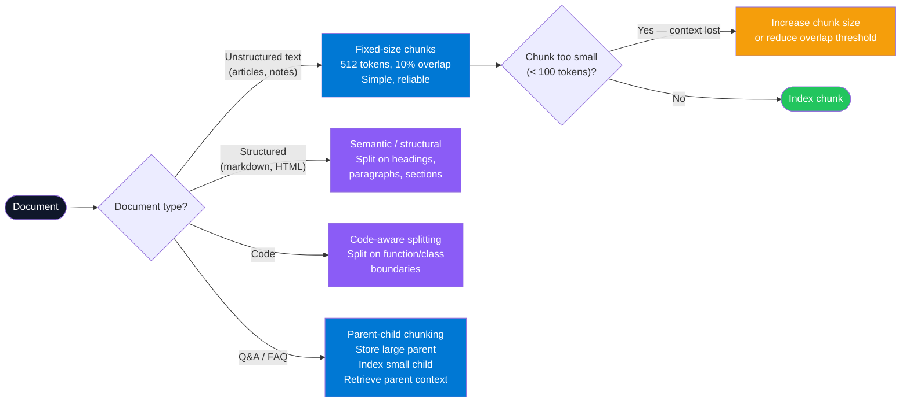

---

### Component — RAG Indexing Pipeline

**Tech Stack:** `Azure.AI.OpenAI`, `Azure.Search.Documents`, `Azure.Identity`

```csharp
public record DocumentChunk(string Id, string Content, string SourceFile, int ChunkIndex);

public class RagIndexingService(
    AzureOpenAIClient openAiClient,
    SearchClient searchClient,
    IConfiguration config)
{
    private readonly EmbeddingClient _embedder =
        openAiClient.GetEmbeddingClient("text-embedding-3-large");

    public async Task IndexDocumentAsync(string content, string sourceFile, CancellationToken ct = default)
    {
        var chunks = ChunkText(content, maxTokens: 512, overlapTokens: 50);
        var documents = new List<SearchDocument>();

        // Batch embedding (up to 2048 items per call)
        var embeddings = await _embedder.GenerateEmbeddingsAsync(
            chunks.Select(c => c.Content).ToList(), cancellationToken: ct);

        for (int i = 0; i < chunks.Count; i++)
        {
            documents.Add(new SearchDocument
            {
                ["id"]          = chunks[i].Id,
                ["content"]     = chunks[i].Content,
                ["source"]      = sourceFile,
                ["chunkIndex"]  = i,
                ["contentVector"] = embeddings.Value[i].ToFloats().ToArray()
            });
        }

        await searchClient.MergeOrUploadDocumentsAsync(documents, cancellationToken: ct);
    }

    private static List<DocumentChunk> ChunkText(string text, int maxTokens, int overlapTokens)
    {
        // Simple word-based chunking — production uses a tokenizer like SharpToken
        var words = text.Split(' ', StringSplitOptions.RemoveEmptyEntries);
        var chunks = new List<DocumentChunk>();
        int step = maxTokens - overlapTokens;

        for (int i = 0; i < words.Length; i += step)
        {
            var slice = words.Skip(i).Take(maxTokens);
            var content = string.Join(' ', slice);
            chunks.Add(new DocumentChunk(
                Id: $"chunk-{i}",
                Content: content,
                SourceFile: string.Empty,
                ChunkIndex: i));
        }
        return chunks;
    }
}
```

---

### Component — RAG Query Pipeline

```csharp
public class RagQueryService(
    AzureOpenAIClient openAiClient,
    SearchClient searchClient,
    IConfiguration config)
{
    private readonly EmbeddingClient _embedder =
        openAiClient.GetEmbeddingClient("text-embedding-3-large");
    private readonly ChatClient _chat =
        openAiClient.GetChatClient(config["AzureOpenAI:ChatDeployment"]!);

    public async Task<string> AnswerAsync(string userQuery, CancellationToken ct = default)
    {
        // 1. Embed query
        var queryEmbedding = await _embedder.GenerateEmbeddingAsync(userQuery, cancellationToken: ct);

        // 2. Hybrid search (vector + keyword)
        var searchOptions = new SearchOptions
        {
            VectorSearch = new VectorSearchOptions
            {
                Queries = { new VectorizedQuery(queryEmbedding.Value.ToFloats())
                    { KNearestNeighborsCount = 5, Fields = { "contentVector" } } }
            },
            Select = { "content", "source" },
            Size = 5,
            QueryType = SearchQueryType.Semantic,
            SemanticSearch = new SemanticSearchOptions
            {
                SemanticConfigurationName = "my-semantic-config"
            }
        };

        var searchResults = searchClient.SearchAsync<SearchDocument>(userQuery, searchOptions, ct);

        // 3. Collect retrieved chunks
        var contextParts = new List<string>();
        await foreach (var result in await searchResults)
            contextParts.Add($"[Source: {result.Document["source"]}]\n{result.Document["content"]}");

        // 4. Build augmented prompt
        var context = string.Join("\n\n---\n\n", contextParts);
        var systemPrompt = $"""
            You are a helpful assistant. Answer using ONLY the following context.
            If the context does not contain the answer, say "I don't know."
            
            CONTEXT:
            {context}
            """;

        // 5. Generate
        var completion = await _chat.CompleteChatAsync(
            [new SystemChatMessage(systemPrompt), new UserChatMessage(userQuery)],
            cancellationToken: ct);

        return completion.Value.Content[0].Text;
    }
}
```

---

### Interview Talking Points — RAG

| Question | Answer |
|---|---|
| Why RAG instead of fine-tuning? | RAG separates knowledge from model. You can update the index in minutes; fine-tuning takes hours and risks hallucinating over stale weights. RAG also provides citations. Fine-tune for *style/format* only. |
| What is hybrid search and why is it better than pure vector search? | Hybrid combines dense vector similarity (semantic meaning) with BM25 keyword search (exact term matching). Vectors catch synonyms and paraphrase; BM25 catches exact product codes, names, IDs that embeddings may obscure. Azure AI Search handles both in one query. |
| What is the "lost in the middle" problem? | LLMs attend poorly to content in the middle of a long prompt. Retrieved chunks at position 3-7 are often ignored. Mitigations: re-rank before injection, put most relevant chunks at the start and end, and limit total retrieved context. |
| What is re-ranking and when do you use it? | A cross-encoder model (e.g. `ms-marco-MiniLM`) re-scores candidate chunks by jointly encoding query+chunk — much more accurate than embedding similarity alone. Use it when precision matters; it adds 100-300ms latency. |
| How do you evaluate RAG quality? | Use RAGAS metrics: **Faithfulness** (does the answer come from the retrieved context?), **Answer Relevance** (does the answer address the question?), **Context Precision** (are retrieved chunks relevant?), **Context Recall** (were all needed chunks retrieved?). |
| What is parent-child chunking? | Index small child chunks (e.g., 128 tokens) for precise retrieval but return the larger parent chunk (e.g., 512 tokens) for context. Solves the precision-context trade-off: small chunks match better; large chunks give the LLM enough surrounding information. |

---

## 5. RLHF — Reinforcement Learning from Human Feedback

### Overview

RLHF is the training technique that transforms a raw pre-trained LLM (which predicts likely tokens) into an instruction-following, helpful, safe assistant. It has three stages: **Supervised Fine-Tuning (SFT)** teaches the model the format of good responses; **Reward Model Training** trains a separate model to predict human preference scores; and **PPO (Proximal Policy Optimization)** uses the reward model to push the LLM toward responses humans prefer, while preventing it from drifting too far from the SFT baseline. GPT-4, Claude, Llama-3-Instruct, and Gemini are all RLHF-trained.

---

### RLHF Three-Stage Pipeline

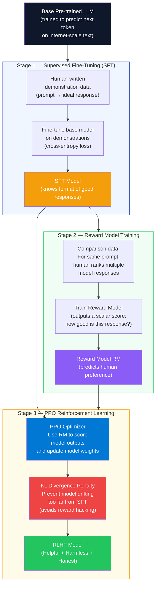

---

### Constitutional AI (Extension of RLHF)

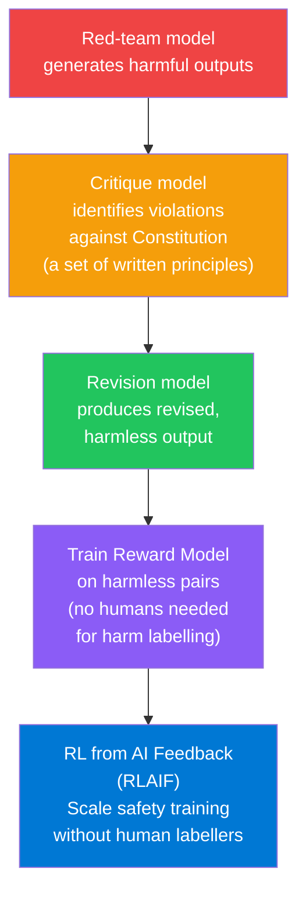

---

### Interview Talking Points — RLHF

| Question | Answer |
|---|---|
| What is the core problem RLHF solves? | A base pre-trained model optimizes for token probability, not human helpfulness or safety. It will cheerfully complete harmful prompts if that's the statistically likely next token. RLHF steers the model to optimize for human preference instead. |
| What is the Reward Model? | A separate LLM (typically the SFT model with a linear head replacing the language model head) trained on human comparison data: given prompt + two responses, which is better? It learns to output a scalar "preference score" for any response. |
| What is PPO and why is it used for RLHF? | Proximal Policy Optimization is a policy gradient RL algorithm. It maximizes the reward model score but clips the policy update to prevent the model from making large steps that "hack" the reward (e.g., outputting gibberish that tricks the RM). The KL penalty further anchors the model to the SFT baseline. |
| What is reward hacking? | The model finds outputs that score high on the reward model but are actually unhelpful — e.g., excessively verbose sycophantic praise that gets high human approval scores. Mitigation: KL divergence penalty + red-teaming + diverse reward signals. |
| What is Constitutional AI (CAI) / RLAIF? | Anthropic's extension of RLHF: a "Constitution" of written principles is used by a separate AI to critique and revise harmful outputs, generating synthetic human-preference data. This reduces dependence on expensive human labellers for safety training. |
| Does fine-tuning with RLHF change factual knowledge? | No — RLHF modifies *behavior* (helpfulness, safety, format) not *knowledge*. Knowledge comes from pretraining. A model can still hallucinate facts post-RLHF; only the way it behaves and frames responses changes. |

---

## 6. Diffusion Models

### Overview

Diffusion models (Ho et al., "Denoising Diffusion Probabilistic Models", 2020) are the architecture behind DALL-E 3, Stable Diffusion, Midjourney, and Azure AI Image Generation. They work by learning to *reverse* a corruption process: during training, Gaussian noise is progressively added to images over T steps until the image is pure noise. The model learns to predict and remove that noise step-by-step. At inference, starting from random noise and iteratively denoising T times (guided by a text prompt via cross-attention) produces a coherent image. The key insight is that this is more stable than GAN training and produces higher-quality diverse outputs.

---

### Diffusion Forward and Reverse Process

```mermaid
flowchart LR
    subgraph Forward ["Forward Process (Training — fixed, not learned)"]
        I0["Original Image x₀\n(clean)"] -->|"Add noise\nstep 1"| I1["x₁\n(slight noise)"]
        I1 -->|"Add noise\nstep 2"| I2["x₂\n(more noise)"]
        I2 -->|"... T steps ..."| IT["xₜ\n(pure Gaussian noise)"]
    end

    subgraph Reverse ["Reverse Process (Inference — model predicts noise to remove)"]
        N0["Pure Noise xₜ\n+ text prompt embedding"] -->|"Denoise\nstep T"| N1["xₜ₋₁"]
        N1 -->|"Denoise\nstep T-1"| N2["xₜ₋₂"]
        N2 -->|"... T steps ..."| OUT["Generated Image x₀\n(matches text prompt)"]
    end

    IT -.->|"Training objective:\nlearn to predict\nthe noise added"| N0

    style I0 fill:#22c55e,color:#fff
    style IT fill:#ef4444,color:#fff
    style N0 fill:#ef4444,color:#fff
    style OUT fill:#22c55e,color:#fff
    style Forward fill:#eff6ff,stroke:#1e40af
    style Reverse fill:#f0fdf4,stroke:#22c55e
```

---

### Text-to-Image Pipeline (Latent Diffusion)

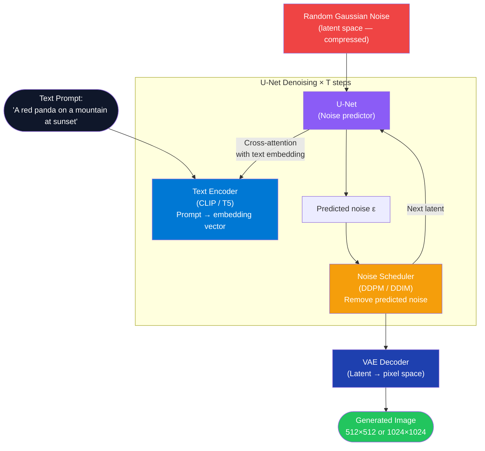

---

### Calling Azure AI Image Generation from .NET

**Tech Stack:** `Azure.AI.OpenAI`, `Azure.Identity`

```csharp
public class ImageGenerationService(AzureOpenAIClient client, IConfiguration config)
{
    private readonly ImageClient _imageClient =
        client.GetImageClient(config["AzureOpenAI:DalleDeployment"]!);

    public async Task<Uri> GenerateImageAsync(
        string prompt,
        ImageSize size = default,        // defaults to 1024x1024
        ImageQuality quality = default,  // defaults to Standard
        CancellationToken ct = default)
    {
        var options = new ImageGenerationOptions
        {
            Size = size == default ? GeneratedImageSize.W1024xH1024 : size,
            Quality = quality == default ? GeneratedImageQuality.Standard : quality,
            Style = GeneratedImageStyle.Natural,
            ResponseFormat = GeneratedImageFormat.Uri
        };

        var response = await _imageClient.GenerateImageAsync(prompt, options, ct);
        return response.Value.ImageUri;
    }
}

// Minimal API endpoint
app.MapPost("/generate-image", async (
    ImageGenerationRequest req,
    ImageGenerationService svc,
    CancellationToken ct) =>
{
    var imageUri = await svc.GenerateImageAsync(req.Prompt, cancellationToken: ct);
    return Results.Ok(new { imageUrl = imageUri });
});

public record ImageGenerationRequest(string Prompt);
```

---

### Interview Talking Points — Diffusion Models

| Question | Answer |
|---|---|
| How does a diffusion model differ from a GAN? | GANs use a generator-discriminator adversarial game — unstable training, mode collapse. Diffusion models learn a stable denoising objective (predict the noise added at each step). Diffusion produces more diverse, higher-quality outputs and trains reliably at scale. |
| What is the role of the text encoder in text-to-image models? | The text prompt is encoded into a dense vector (CLIP or T5). At each U-Net denoising step, cross-attention layers attend to the prompt embedding, steering the noise-removal process toward the described content. |
| What is classifier-free guidance (CFG)? | A technique to amplify the influence of the prompt. The U-Net is run twice: once conditioned on the prompt, once unconditioned. The final prediction is `unconditioned + guidance_scale × (conditioned − unconditioned)`. Higher guidance scale = more prompt-adherent but less diverse images. |
| What is the difference between DDPM and DDIM schedulers? | **DDPM**: stochastic denoising — adds noise in each reverse step. Requires 1000 steps for quality. **DDIM**: deterministic denoising — allows 20-50 step quality with a deterministic trajectory. DDIM is what most production image generation uses for speed. |
| What are latent diffusion models (LDM)? | Instead of denoising in pixel space (1024×1024 = 1M pixels), LDMs compress images into a lower-dimensional latent space via a VAE encoder first, denoise in that compressed space (much cheaper), then decode back to pixels. Stable Diffusion is a latent diffusion model. |
| What content safety controls exist for image generation? | Azure DALL-E includes a built-in content filter that blocks harmful prompts. Production applications should add: prompt validation layer before calling the API, output image moderation (Azure Content Safety), watermarking generated images, and audit logging of all generation requests. |

---

*Part 1 of 3 | Continues in Part 2: LoRA · A2A Protocol · AutoGen vs Semantic Kernel · RICEFWID · Agent 4-Part Loop · Error Regression Metrics*
