# AI & Architecture Concepts: Complete Reference — Part 2 (.NET)

> Covers: LoRA · A2A Protocol & Agent Cards · AutoGen vs Semantic Kernel · RICEFWID · AI Agent 4-Part Loop · MAE vs MSE vs RMSE · Multi-Step LLM Workflows

---

## Table of Contents

7. [LoRA — Low-Rank Adaptation](#7-lora--low-rank-adaptation)
8. [A2A Protocol & Agent Cards](#8-a2a-protocol--agent-cards)
9. [AutoGen vs Semantic Kernel](#9-autogen-vs-semantic-kernel)
10. [RICEFWID Framework](#10-ricefwid-framework)
11. [AI Agent 4-Part Loop](#11-ai-agent-4-part-loop)
12. [MAE vs MSE vs RMSE — Error Regression Metrics](#12-mae-vs-mse-vs-rmse--error-regression-metrics)
13. [Multi-Step LLM Workflows](#13-multi-step-llm-workflows)

---

## 7. LoRA — Low-Rank Adaptation

### Overview

LoRA (Hu et al., 2021) solves the cost problem of full fine-tuning. Fine-tuning a 70B parameter model requires updating all 70B weights — this demands enormous GPU memory and compute. LoRA freezes all original model weights and injects small trainable **adapter matrices** into specific layers. The update to a weight matrix W is approximated as `ΔW = B × A`, where B (d×r) and A (r×k) are low-rank matrices with rank r ≪ min(d, k). Only A and B are trained — millions of parameters instead of billions. At inference, LoRA adapters can be merged into the base model (zero latency overhead) or swapped dynamically for multi-tenant serving.

---

### LoRA Architecture

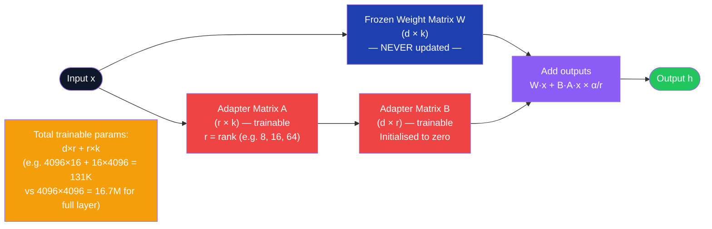

---

### LoRA vs Full Fine-Tuning vs Prompt Tuning

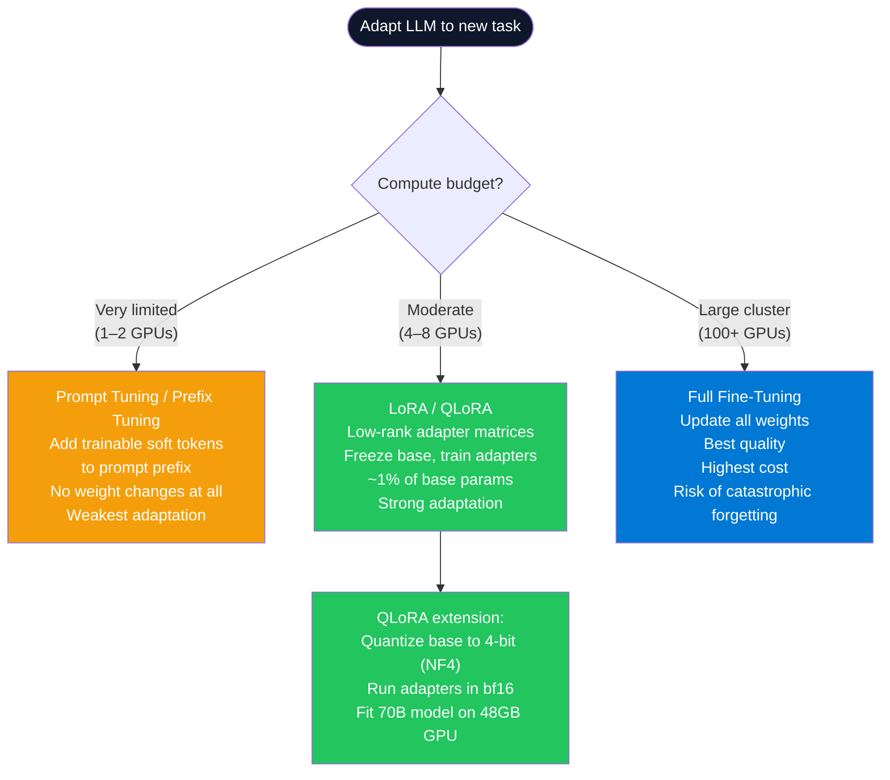

---

### LoRA Fine-Tuning Pipeline

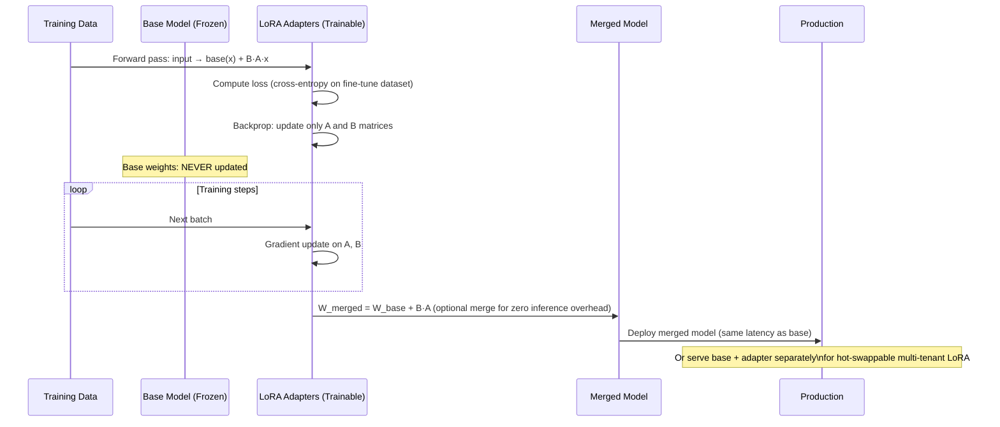

---

### Calling Azure AI Foundry Fine-Tuned Model from .NET

```csharp
// Azure AI Foundry hosts fine-tuned models (including LoRA-adapted) as deployments
// Once deployed, they are called identically to base models

public class FineTunedModelService(IConfiguration config)
{
    private readonly ChatClient _client = new AzureOpenAIClient(
        endpoint: new Uri(config["AzureOpenAI:Endpoint"]!),
        credential: new DefaultAzureCredential()
    ).GetChatClient(
        deploymentName: config["AzureOpenAI:FineTunedDeployment"]!  // e.g. "contoso-gpt4o-lora-v2"
    );

    public async Task<string> ClassifyAsync(string text, CancellationToken ct = default)
    {
        // Fine-tuned model has been LoRA-adapted to output a specific JSON schema
        var completion = await _client.CompleteChatAsync(
            messages: [new UserChatMessage(text)],
            options: new ChatCompletionOptions
            {
                Temperature = 0.0f,    // deterministic for classification tasks
                MaxOutputTokenCount = 100,
                ResponseFormat = ChatResponseFormat.CreateJsonObjectFormat()
            },
            cancellationToken: ct
        );
        return completion.Value.Content[0].Text;
    }
}
```

---

### Interview Talking Points — LoRA

| Question | Answer |
|---|---|
| Why does LoRA work? | The hypothesis (supported empirically) is that fine-tuning changes in weight matrices have a low intrinsic rank — the meaningful adaptation lives in a low-dimensional subspace. LoRA constrains updates to that subspace explicitly, discarding the rest with minimal quality loss. |
| What is the rank hyperparameter r? | The rank of the adapter matrices. Low r (4–8): very few parameters, fast training, less capacity. High r (64–128): more parameters, slower training, higher quality adaptation. Common default is r=16. There is no universal optimal; tune on a validation set. |
| What is QLoRA? | LoRA applied to a 4-bit quantized (NF4) base model. Quantization reduces VRAM by 4x (float32 → 4-bit int), enabling 70B models to fit on a 48GB A100. Adapters still run in bf16. Combined with paged optimizers for memory efficiency. |
| When does LoRA underperform full fine-tuning? | On tasks requiring dramatic behavior change (e.g., adapting an English-only model for fluent Chinese generation). LoRA adapts efficiently within the model's existing representational space — it cannot teach capabilities the base model entirely lacks. |
| Can multiple LoRA adapters be combined? | Yes — LoRA-Merge and LoRAHub allow linear combination of multiple adapter sets. You can blend a "coding" adapter and a "formal-tone" adapter. The merged model inherits both adaptations proportionally. |
| What is catastrophic forgetting and does LoRA prevent it? | Catastrophic forgetting is when fine-tuning overwrites previously learned capabilities. LoRA significantly reduces this risk because the frozen base weights retain all pretraining knowledge — only the small adapters change. |

---

## 8. A2A Protocol & Agent Cards

### Overview

A2A (Agent-to-Agent) is an open protocol specification (Google, 2025) for how AI agents discover, authenticate, and communicate with each other. As multi-agent systems proliferate, agents from different vendors and frameworks need a standard contract. A2A defines the **Agent Card** — a JSON metadata file (served at `/.well-known/agent.json`) that describes an agent's identity, capabilities, input/output schemas, and endpoint URL. Agents use Agent Cards to decide if another agent can help with a sub-task, then use the A2A protocol to delegate work, stream responses, and exchange structured results.

---

### A2A Discovery and Communication Flow

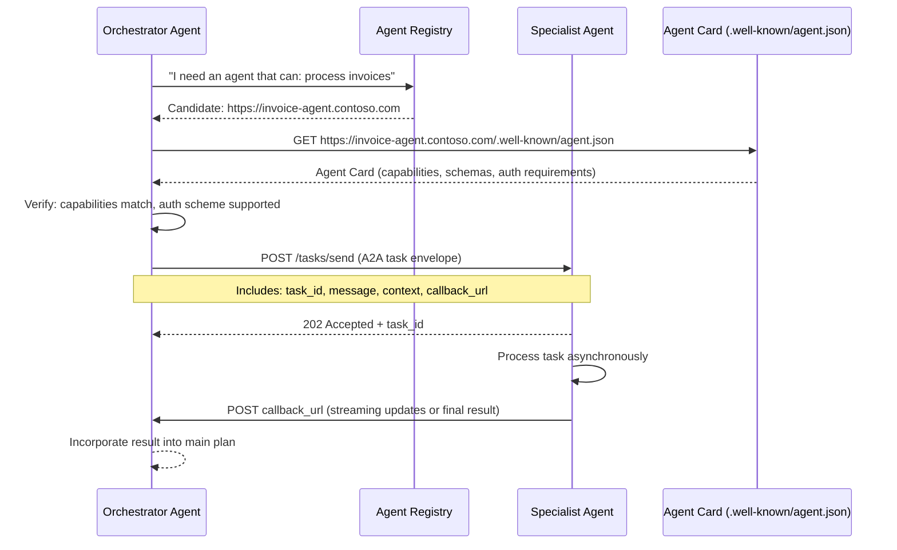

---

### Agent Card Structure

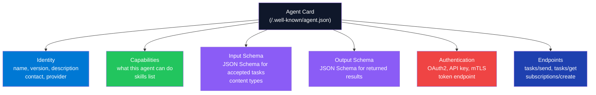

---

### Component — Exposing an A2A-Compatible Agent in ASP.NET Core

```csharp
// Agent Card model
public record AgentCard(
    string Name,
    string Version,
    string Description,
    string[] Capabilities,
    AgentEndpoints Endpoints,
    AgentAuth Auth
);

public record AgentEndpoints(string TasksSend, string TasksGet);
public record AgentAuth(string Scheme, string TokenEndpoint);

// Expose the agent card at the well-known URL
app.MapGet("/.well-known/agent.json", (IConfiguration config) =>
    Results.Ok(new AgentCard(
        Name: "InvoiceProcessingAgent",
        Version: "2.1.0",
        Description: "Extracts, validates, and routes invoice data from PDF, image, or structured text.",
        Capabilities: ["extract-invoice", "validate-invoice", "route-for-approval"],
        Endpoints: new AgentEndpoints(
            TasksSend: $"{config["BaseUrl"]}/tasks/send",
            TasksGet:  $"{config["BaseUrl"]}/tasks/{{taskId}}"
        ),
        Auth: new AgentAuth("oauth2", $"{config["Auth:TokenEndpoint"]}")
    ))
);

// A2A task envelope
public record A2ATaskEnvelope(
    string TaskId,
    string Skill,
    string Message,
    Dictionary<string, object>? Context,
    string? CallbackUrl
);

public record A2ATaskResult(
    string TaskId,
    string Status,   // "completed" | "failed" | "in_progress"
    object? Result,
    string? Error
);

// Task handler endpoint
app.MapPost("/tasks/send", async (
    A2ATaskEnvelope task,
    IInvoiceAgentService agent,
    ITaskStore taskStore,
    CancellationToken ct) =>
{
    await taskStore.CreateAsync(task.TaskId, "in_progress", ct);

    // Process asynchronously; callback when done
    _ = Task.Run(async () =>
    {
        try
        {
            var result = await agent.ProcessAsync(task.Message, task.Skill, ct);
            await taskStore.UpdateAsync(task.TaskId, "completed", result, ct);

            if (task.CallbackUrl is not null)
                await NotifyCallbackAsync(task.CallbackUrl,
                    new A2ATaskResult(task.TaskId, "completed", result, null), ct);
        }
        catch (Exception ex)
        {
            await taskStore.UpdateAsync(task.TaskId, "failed", null, ct);
            if (task.CallbackUrl is not null)
                await NotifyCallbackAsync(task.CallbackUrl,
                    new A2ATaskResult(task.TaskId, "failed", null, ex.Message), ct);
        }
    }, ct);

    return Results.Accepted($"/tasks/{task.TaskId}", new { taskId = task.TaskId });
});
```

---

### Component — Orchestrator Discovering and Calling an A2A Agent

```csharp
public class A2AAgentClient(HttpClient http, ILogger<A2AAgentClient> logger)
{
    public async Task<AgentCard> DiscoverAsync(string agentBaseUrl, CancellationToken ct = default)
    {
        var card = await http.GetFromJsonAsync<AgentCard>(
            $"{agentBaseUrl}/.well-known/agent.json", ct)
            ?? throw new InvalidOperationException("Agent card not found");

        logger.LogInformation("Discovered agent {Name} v{Version} with {Count} capabilities",
            card.Name, card.Version, card.Capabilities.Length);
        return card;
    }

    public async Task<string> DelegateTaskAsync(
        AgentCard card,
        string skill,
        string message,
        string callbackUrl,
        CancellationToken ct = default)
    {
        var taskId = Guid.NewGuid().ToString("N");
        var envelope = new A2ATaskEnvelope(taskId, skill, message, null, callbackUrl);

        var response = await http.PostAsJsonAsync(card.Endpoints.TasksSend, envelope, ct);
        response.EnsureSuccessStatusCode();

        logger.LogInformation("Delegated task {TaskId} to {Agent}", taskId, card.Name);
        return taskId;
    }
}
```

---

### Interview Talking Points — A2A

| Question | Answer |
|---|---|
| What problem does A2A solve? | Interoperability between agents from different vendors. Without A2A, a Semantic Kernel agent cannot easily delegate work to a LangGraph agent or a CrewAI agent. A2A provides a common discovery and communication contract — like REST for APIs but for agents. |
| What is an Agent Card and what must it contain? | A JSON file at `/.well-known/agent.json` describing: agent identity (name, version), capabilities (skill list), input/output schemas, endpoint URLs, and authentication requirements. Think of it as an OpenAPI spec for an agent. |
| How does A2A handle authentication between agents? | The Agent Card declares the auth scheme (OAuth2, API key, mTLS). The orchestrator fetches a bearer token from the declared token endpoint before calling `tasks/send`. In Azure, Managed Identity + Entra ID federated tokens is the preferred pattern. |
| What is the difference between A2A and MCP? | **MCP** (Model Context Protocol) is about connecting a *single agent to tools/resources* (databases, APIs, file systems). **A2A** is about *agent-to-agent delegation* — one agent orchestrating another agent. MCP is vertical (agent→tool); A2A is horizontal (agent→agent). |
| How does A2A support long-running tasks? | The `tasks/send` call returns 202 Accepted immediately. The orchestrator provides a `callbackUrl`. When the specialist agent completes, it POSTs the result to the callback URL. The orchestrator can also poll `tasks/{taskId}` for status. |

---

## 9. AutoGen vs Semantic Kernel

### Overview

Both are Microsoft frameworks for building multi-agent AI systems in .NET, but they solve different problems. **AutoGen** is a conversation-centric framework — agents are defined by their role and system prompt, communicate via chat messages in a shared conversation thread, and collaborate through natural language. It excels at flexible, exploratory, and research-style multi-agent workflows. **Semantic Kernel** is a plugin/tool-centric framework built for structured enterprise workflows — agents are equipped with typed plugins (functions with schemas), plan and invoke them via a kernel, and integrate deeply with Azure services. Most production enterprise AI in .NET uses Semantic Kernel.

---

### Architecture Comparison

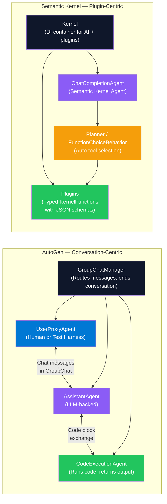

---

### When to Use Each

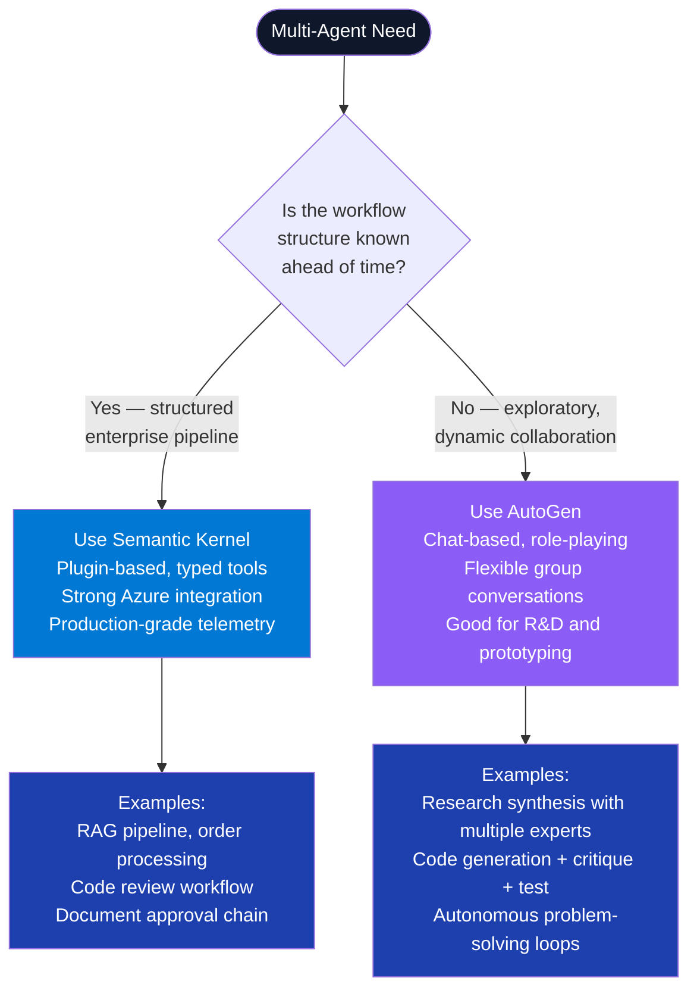

---

### Feature Comparison Table

| Feature | AutoGen | Semantic Kernel |
|---|---|---|
| **Agent communication** | Chat message exchange (GroupChat) | Kernel function calls, typed plugins |
| **Planning** | Conversation-driven, ad-hoc | Planner (sequential, stepwise, auto) |
| **Tool/function integration** | Code execution, custom agent functions | `[KernelFunction]` with JSON schema |
| **Azure integration** | Basic | Deep (AI Foundry, AI Search, App Config) |
| **Memory** | Simple in-conversation history | Semantic Kernel Memory, external stores |
| **Human-in-loop** | `UserProxyAgent` with `human_input_mode` | `IAutoFunctionInvocationFilter` approval gate |
| **Primary language** | Python-first; .NET port available | .NET-first; Python port available |
| **Best for** | Research, exploration, code-gen + test | Enterprise workflows, production agents |
| **Telemetry** | Basic logging | Full OpenTelemetry + Azure Monitor |

---

### Semantic Kernel — Multi-Agent GroupChat (.NET)

```csharp
using Microsoft.SemanticKernel;
using Microsoft.SemanticKernel.Agents;
using Microsoft.SemanticKernel.Agents.Chat;

public class CodeReviewOrchestrator(Kernel kernel)
{
    public async Task<string> ReviewCodeAsync(string code, CancellationToken ct = default)
    {
        var author = new ChatCompletionAgent
        {
            Name = "CodeAuthor",
            Instructions = "You are a .NET developer. Write clean, production-ready C# code.",
            Kernel = kernel.Clone()
        };

        var reviewer = new ChatCompletionAgent
        {
            Name = "CodeReviewer",
            Instructions = """
                You are a senior .NET architect. Review code for:
                - Security vulnerabilities
                - Performance issues
                - Missing CancellationToken propagation
                - Poor naming or missing null checks
                Reply with "APPROVED" when satisfied, otherwise list issues.
                """,
            Kernel = kernel.Clone()
        };

        var chat = new AgentGroupChat(author, reviewer)
        {
            ExecutionSettings = new AgentGroupChatSettings
            {
                TerminationStrategy = new ApprovalTerminationStrategy(),
                SelectionStrategy = new SequentialSelectionStrategy()
            }
        };

        chat.AddChatMessage(new ChatMessageContent(AuthorRole.User,
            $"Review this code:\n```csharp\n{code}\n```"));

        var result = new List<string>();
        await foreach (var response in chat.InvokeAsync(ct))
            result.Add($"[{response.AuthorName}]: {response.Content}");

        return string.Join("\n\n", result);
    }
}

// Terminate when reviewer says APPROVED
public class ApprovalTerminationStrategy : TerminationStrategy
{
    protected override Task<bool> ShouldAgentTerminateAsync(
        Agent agent, IReadOnlyList<ChatMessageContent> history, CancellationToken ct)
    {
        var last = history.LastOrDefault()?.Content ?? string.Empty;
        return Task.FromResult(last.Contains("APPROVED", StringComparison.OrdinalIgnoreCase));
    }
}
```

---

### Interview Talking Points — AutoGen vs Semantic Kernel

| Question | Answer |
|---|---|
| Core architectural difference? | AutoGen: agents collaborate via chat messages in a shared conversation — it's communication-first. Semantic Kernel: agents invoke typed plugin functions via a kernel — it's function-calling-first. Choose based on whether your workflow is dynamic conversation or structured execution. |
| Can they be used together? | Yes. A Semantic Kernel agent can be one participant in an AutoGen GroupChat. Alternatively, AutoGen agents can be wrapped as Semantic Kernel plugins. Microsoft is converging both under the Agent SDK umbrella. |
| How does Semantic Kernel handle agent termination? | Via `TerminationStrategy` — a custom class that inspects conversation history and returns `true` to stop. Common triggers: a specific keyword ("APPROVED"), a function call completing, a max turn limit, or a condition on the last message's content. |
| What is the Semantic Kernel Planner? | A system that takes a user goal and automatically selects and sequences the right kernel functions to achieve it. `FunctionChoiceBehavior.Auto()` is the most common setting — lets the LLM decide which tools to call in which order via OpenAI's function calling protocol. |
| What is an `AgentGroupChat` in Semantic Kernel? | A coordination primitive that manages multiple `ChatCompletionAgent` instances in a shared conversation. Agents take turns responding (based on `SelectionStrategy`) until `TerminationStrategy` signals completion. |

---

## 10. RICEFWID Framework

### Overview

RICEFWID is a structured evaluation framework for assessing whether an AI agent has what it needs to execute a given task autonomously. It stands for **Resources, Intent, Capabilities, Experience, Features, Workflows, Inputs, Data**. Originally a mental model for product managers evaluating AI automation feasibility, it is now used by AI architects to design agents and identify gaps — what does the agent have, and what is missing before it can reliably perform at production scale?

---

### RICEFWID Components

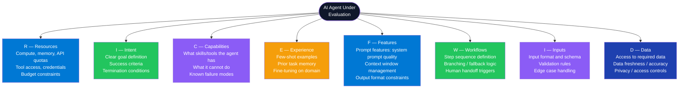

---

### RICEFWID Evaluation Checklist

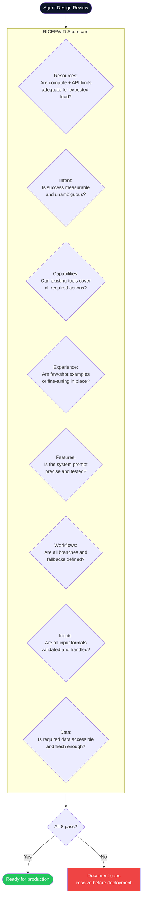

---

### Applying RICEFWID — Example: Invoice Processing Agent

| Dimension | Question | Example Gap | Resolution |
|---|---|---|---|
| **Resources** | Does the agent have API quota for peak load? | Azure OpenAI TPM limit too low for month-end invoice surge | Request quota increase; implement queue + rate limiter |
| **Intent** | Is "process invoice" clearly defined? | "Process" could mean extract, validate, route, or pay | Write explicit success criteria: extracted fields pass schema validation, routed to correct approver |
| **Capabilities** | Can the agent read scanned PDFs? | No OCR tool registered | Add `extractTextFromPdf` tool backed by Azure Document Intelligence |
| **Experience** | Does the agent know invoice schema formats? | No few-shot examples in system prompt | Add 3-5 annotated examples of correct JSON extraction |
| **Features** | Is the output format constrained? | Agent returns free text instead of JSON | Add `ResponseFormat = JSON` + schema validation in filter |
| **Workflows** | What happens if approval fails? | No fallback defined | Add escalation path: auto-route to finance manager after 48h |
| **Inputs** | Can the agent handle multi-page invoices? | Chunking not implemented for multi-page | Implement page-by-page chunking + aggregation step |
| **Data** | Is the vendor database accessible? | Vendor lookup returns stale cached data | Connect to live ERP API; add cache invalidation on vendor update |

---

### Interview Talking Points — RICEFWID

| Question | Answer |
|---|---|
| What is RICEFWID used for? | Structured pre-deployment checklist for AI agents. It forces explicit answers to: does this agent have what it needs (resources, data, capabilities) and is the task well-defined enough (intent, workflows) for autonomous execution? |
| Which dimension is most commonly missed? | **Intent** — teams build capable agents but forget to define measurable success criteria and termination conditions. An agent without a clear "done" state may loop indefinitely or stop prematurely. |
| How does RICEFWID differ from regular sprint planning? | RICEFWID is agent-centric, not feature-centric. It evaluates the *agent's readiness* for a task rather than the team's plan to build features. It is applied at agent design time, not project planning time. |
| How would you use it in a production agent design review? | Create an 8-row scorecard (one per dimension), assign red/amber/green, require all rows green before production deployment. For each amber/red, document the gap, the owner, and the resolution date. |

---

## 11. AI Agent 4-Part Loop

### Overview

The AI Agent 4-Part Loop (Perception → Reasoning → Action → Memory) is the fundamental control cycle that all autonomous AI agents implement, regardless of the framework. It mirrors the classic sense-plan-act cycle from robotics. Each iteration of the loop: the agent **perceives** its environment (reads inputs, tool outputs, user messages), **reasons** about what to do next (LLM planning step), **acts** by executing tools or producing output, and **stores** results in memory to inform the next iteration. LangGraph implements this as a stateful directed graph; Semantic Kernel's `AgentGroupChat` implements it implicitly through the conversation loop.

---

### The 4-Part Loop

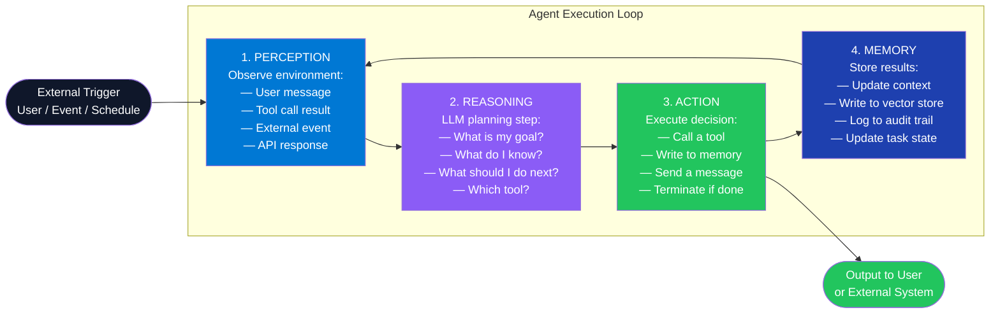

---

### Agent Loop with Guardrails

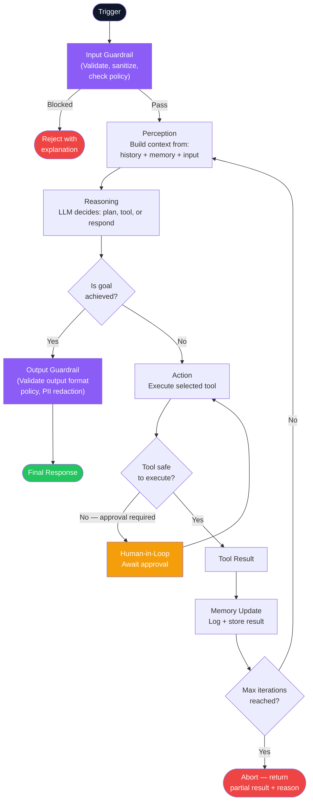

---

### Component — Agent Loop in Semantic Kernel

```csharp
public class AgentLoopService(Kernel kernel, IMemoryStore memoryStore, ILogger<AgentLoopService> logger)
{
    private const int MaxIterations = 10;

    public async Task<string> RunAsync(string userGoal, string userId, CancellationToken ct = default)
    {
        // MEMORY: Load prior context
        var priorContext = await memoryStore.GetRecentAsync(userId, maxItems: 5, ct);
        var history = new ChatHistory();
        history.AddSystemMessage($"""
            You are an autonomous agent. Complete the user's goal step-by-step using available tools.
            When the goal is fully achieved, respond with "TASK COMPLETE: " followed by a summary.
            Prior context: {string.Join('\n', priorContext)}
            """);
        history.AddUserMessage(userGoal);

        var settings = new AzureOpenAIPromptExecutionSettings
        {
            FunctionChoiceBehavior = FunctionChoiceBehavior.Auto(),
            MaxTokens = 2000
        };

        for (int iteration = 0; iteration < MaxIterations; iteration++)
        {
            logger.LogInformation("Agent loop iteration {I}/{Max}", iteration + 1, MaxIterations);

            // REASONING: LLM decides what to do
            var chatService = kernel.GetRequiredService<IChatCompletionService>();
            var response = await chatService.GetChatMessageContentAsync(
                history, settings, kernel, ct);

            var content = response.Content ?? string.Empty;
            history.AddAssistantMessage(content);

            // MEMORY: Log each iteration
            await memoryStore.SaveAsync(userId, $"iteration-{iteration}", content, ct);

            // TERMINATION: Check if done
            if (content.Contains("TASK COMPLETE:", StringComparison.OrdinalIgnoreCase))
            {
                logger.LogInformation("Goal achieved in {I} iterations", iteration + 1);
                return content;
            }

            // PERCEPTION: Tool results are automatically injected by Semantic Kernel
            // via FunctionChoiceBehavior.Auto() — no manual handling needed
        }

        return "Max iterations reached. Partial result logged.";
    }
}
```

---

### Interview Talking Points — Agent 4-Part Loop

| Question | Answer |
|---|---|
| What is the purpose of the Perception step? | Aggregating all available information into the agent's current context: the user's original goal, conversation history, results from prior tool calls, retrieved memory, and any external events. This is what the LLM sees when it reasons. |
| What happens if the Reasoning step produces an incorrect tool call? | The tool returns an error or unexpected result, which becomes input to the next Perception step. A well-designed agent incorporates the error into its context and reasons about retrying differently or escalating to a human. This self-correction is what distinguishes agentic from simple chatbot behavior. |
| What is the max iteration limit and why is it critical? | An upper bound on how many times the loop runs. Without it, a confused agent loops indefinitely consuming tokens and API budget. Production agents must log when this limit is hit, return a partial result, and alert the operator — not silently fail. |
| How is memory different from context in the loop? | **Context** is what's in the current prompt (in-context, ephemeral per session). **Memory** is what persists across sessions (external store). The loop reads from memory during Perception (to build context) and writes to memory after Action (to persist results). |
| How does LangGraph implement the 4-part loop? | As a directed graph where each node is a step (perceive, reason, act, memory). Edges are conditional transitions. The graph is stateful — the shared `AgentState` object persists between nodes within and across loop iterations. Cycles implement the loop; conditional edges implement branching and termination. |

---

## 12. MAE vs MSE vs RMSE — Error Regression Metrics

### Overview

Regression error metrics measure how far model predictions deviate from actual values. The choice of metric affects what the model optimizes for and how outliers are penalized. **MAE** (Mean Absolute Error) is the average absolute difference — interpretable, outlier-tolerant. **MSE** (Mean Squared Error) squares errors — amplifies outliers, useful when large errors are disproportionately costly. **RMSE** (Root MSE) returns MSE to original units for interpretability while retaining the outlier-sensitivity of MSE. In AI systems, these metrics evaluate regression components: response latency prediction, cost estimation, RAG relevance scores, and time-series forecasting.

---

### Metric Comparison

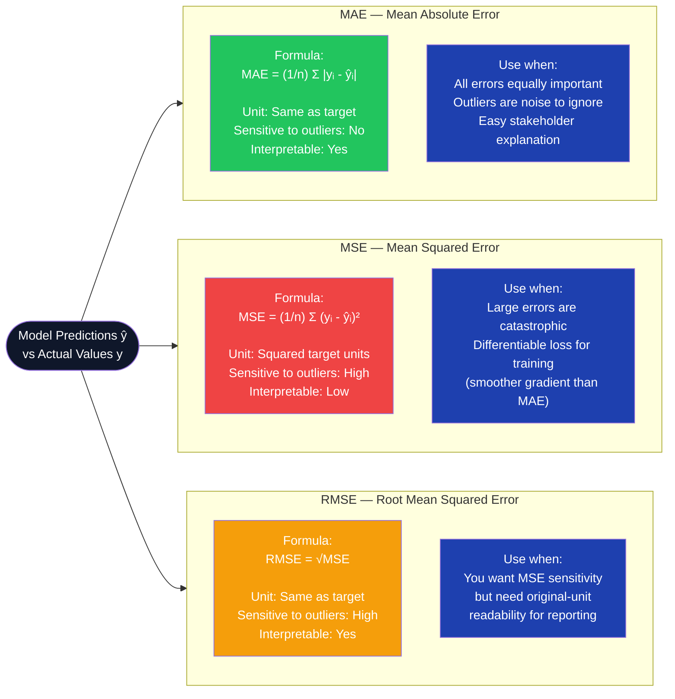

---

### Metric Selection Decision Tree

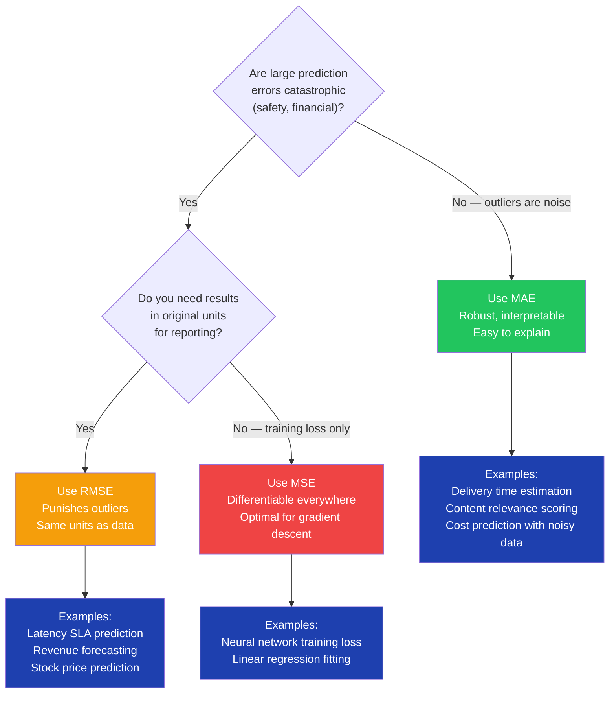

---

### Computing Metrics in C#

```csharp
public static class RegressionMetrics
{
    public static double Mae(IReadOnlyList<double> actual, IReadOnlyList<double> predicted)
    {
        if (actual.Count != predicted.Count) throw new ArgumentException("Length mismatch");
        return actual.Zip(predicted, (a, p) => Math.Abs(a - p)).Average();
    }

    public static double Mse(IReadOnlyList<double> actual, IReadOnlyList<double> predicted)
    {
        if (actual.Count != predicted.Count) throw new ArgumentException("Length mismatch");
        return actual.Zip(predicted, (a, p) => Math.Pow(a - p, 2)).Average();
    }

    public static double Rmse(IReadOnlyList<double> actual, IReadOnlyList<double> predicted)
        => Math.Sqrt(Mse(actual, predicted));

    // R² — proportion of variance explained (bonus metric)
    public static double R2(IReadOnlyList<double> actual, IReadOnlyList<double> predicted)
    {
        var mean = actual.Average();
        var ssTot = actual.Sum(a => Math.Pow(a - mean, 2));
        var ssRes = actual.Zip(predicted, (a, p) => Math.Pow(a - p, 2)).Sum();
        return 1.0 - ssRes / ssTot;
    }
}

// Usage in a latency prediction evaluation
var actual    = new[] { 120.0, 350.0, 1800.0, 95.0, 210.0 }; // ms
var predicted = new[] { 130.0, 340.0,  900.0, 100.0, 220.0 };

Console.WriteLine($"MAE:  {RegressionMetrics.Mae(actual, predicted):F1} ms");
Console.WriteLine($"MSE:  {RegressionMetrics.Mse(actual, predicted):F1} ms²");
Console.WriteLine($"RMSE: {RegressionMetrics.Rmse(actual, predicted):F1} ms");
Console.WriteLine($"R²:   {RegressionMetrics.R2(actual, predicted):F3}");
// MAE:  271.0 ms  (influenced by the 900ms miss)
// RMSE: 404.8 ms  (the 900ms outlier is punished harder)
```

---

### Interview Talking Points — MAE vs MSE vs RMSE

| Question | Answer |
|---|---|
| Why does squaring errors in MSE matter? | Squaring amplifies large errors disproportionately. An error of 10 contributes 100 to MSE; an error of 100 contributes 10,000. This makes MSE ideal when large errors are costly (a model that is rarely very wrong is preferred over one that is often a little wrong). |
| Why is RMSE often preferred over MSE for reporting? | MSE is in squared units (ms², dollars²) which is uninterpretable to stakeholders. RMSE returns the metric to original units (ms, dollars) while preserving MSE's outlier sensitivity. |
| When would you use MAE over RMSE? | When outliers are genuine noise you want to ignore (sensor glitches, corrupted data), or when the cost of all errors is equal regardless of magnitude. Median-based models align naturally with MAE; mean-based models align with MSE/RMSE. |
| What is R² (coefficient of determination)? | R² measures the proportion of variance in the target explained by the model. R²=1.0 means perfect prediction; R²=0 means the model is no better than predicting the mean; negative means worse than predicting the mean. |
| Which metric should you use for LLM response quality evaluation? | LLM output quality is not a regression problem — use classification-style metrics (ROUGE, BLEU for text overlap) or LLM-as-judge (score 1-5 on helpfulness, faithfulness). MAE/MSE are used for numeric outputs like latency, cost, or confidence score prediction. |

---

## 13. Multi-Step LLM Workflows

### Overview

A single LLM call ("zero-shot") fails on complex tasks requiring multiple reasoning steps, diverse data sources, or specialized subtask handling. Multi-step workflows decompose these tasks into a sequence of LLM calls, tool invocations, and conditional branches. The four canonical patterns are: **Prompt Chaining** (output of step N feeds step N+1), **Routing** (a classifier directs input to a specialist), **Orchestrator-Workers** (a planner delegates to independent sub-agents), and **Human-in-the-Loop** (a human reviewer gates or corrects LLM output mid-workflow).

---

### Pattern 1 — Prompt Chaining

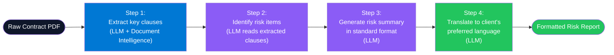

---

### Pattern 2 — Routing

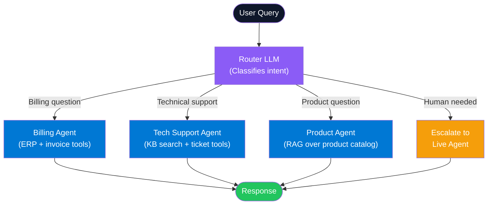

---

### Pattern 3 — Orchestrator-Workers

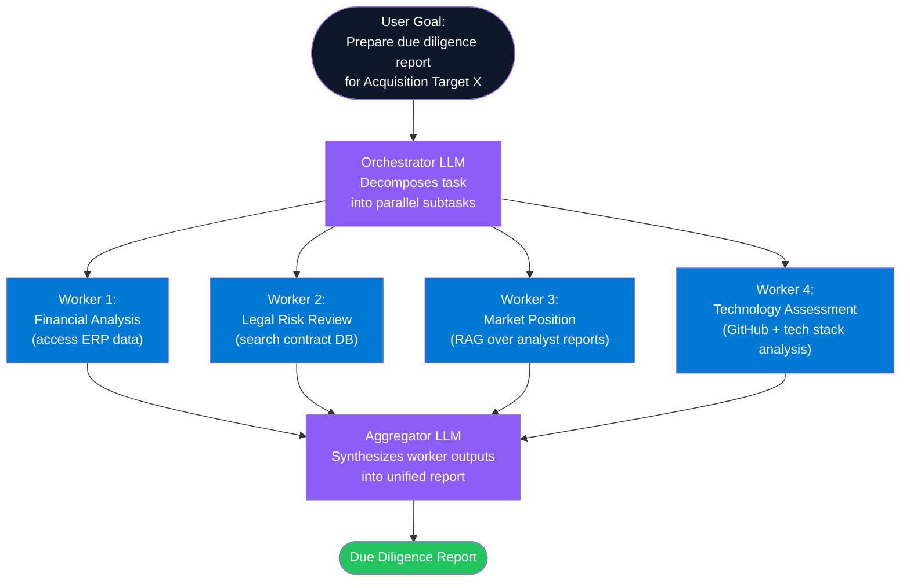

---

### Pattern 4 — Human-in-the-Loop (Evaluator-Optimizer)

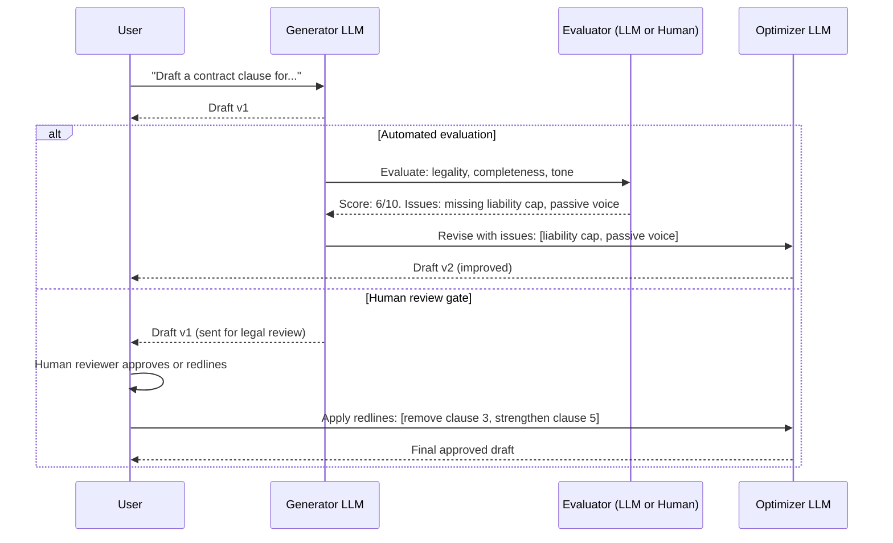

---

### Component — Prompt Chaining in Semantic Kernel

```csharp
public class ContractReviewPipeline(IChatCompletionService chat)
{
    public async Task<string> RunAsync(string contractText, CancellationToken ct = default)
    {
        // Step 1: Extract clauses
        var clauses = await StepAsync(
            system: "Extract all legally significant clauses from the contract. Return as numbered list.",
            user: contractText, ct);

        // Step 2: Identify risks (feeds on Step 1 output)
        var risks = await StepAsync(
            system: "Identify risk items in these clauses. For each risk: state the clause, the risk type, and severity (High/Medium/Low).",
            user: clauses, ct);

        // Step 3: Generate structured summary (feeds on Step 2 output)
        var summary = await StepAsync(
            system: "Produce a JSON risk summary with fields: riskCount, highRisks[], mediumRisks[], lowRisks[], recommendation.",
            user: risks, ct);

        return summary;
    }

    private async Task<string> StepAsync(string system, string user, CancellationToken ct)
    {
        var history = new ChatHistory(system);
        history.AddUserMessage(user);
        var result = await chat.GetChatMessageContentAsync(history, cancellationToken: ct);
        return result.Content ?? string.Empty;
    }
}
```

---

### Interview Talking Points — Multi-Step LLM Workflows

| Question | Answer |
|---|---|
| Why not just use a single large prompt? | Single prompts fail on tasks requiring diverse tools, parallel data access, or conditional branching. Token limits constrain how much context a single call can hold. Multi-step workflows break the problem, handle failures per step, and enable partial result recovery. |
| What is "prompt chaining" and when does it fail? | Output of step N feeds step N+1. Fails when an early step produces incorrect output — errors compound. Mitigation: validate each step's output (schema check, confidence threshold) before passing downstream; implement retry per step. |
| What is the difference between routing and orchestration? | **Routing**: static classification — send input to one specialist (no planning). **Orchestration**: dynamic planning — an orchestrator decomposes a goal, assigns multiple workers in parallel, then synthesizes. Routing is fast and cheap; orchestration is flexible but expensive. |
| When is human-in-the-loop essential? | For irreversible actions (financial transactions, legal document signing, sending external communications), compliance-regulated decisions, and any case where LLM hallucination would cause measurable harm. The human gate should be inserted before, not after, the irreversible action. |
| How do you handle failures in a multi-step pipeline? | Per-step retry with Polly, step-level circuit breaker, fallback to a simpler model, partial result return with status, and dead-letter queue for async pipelines. Log every step's input + output for audit and debugging. |
| What frameworks support multi-step LLM workflows natively? | **LangGraph**: stateful graph-based (Python/JS). **Semantic Kernel**: `AgentGroupChat` + sequential planner (.NET-first). **CrewAI**: role-based multi-agent with task assignment. **Azure AI Foundry**: visual workflow designer for Azure-hosted agents. |

---

*Part 2 of 3 | Continues in Part 3: Tools vs Skills vs Hooks vs Agents vs MCP · GuardRails · LLMOps / MLOps · Context Rot · Tokenization · AI Deployment Patterns*
