# LLM Architecture Concepts: Memory, Model Stacking & Tool Splitting (.NET)

---

## Table of Contents

1. [Memory in LLMs](#1-memory-in-llms)
2. [Model Stacking](#2-model-stacking)
3. [Tool Splitting](#3-tool-splitting)
4. [Cross-Cutting Themes](#cross-cutting-themes)

---

## 1. Memory in LLMs

### Overview

LLMs are stateless by default — every API call starts with a blank slate. Memory systems are architectural patterns that give models the ability to retain, retrieve, and reason over past interactions and external knowledge. There are four distinct memory types: **in-context** (ephemeral, within the prompt window), **in-weights** (knowledge baked into parameters during training), **external** (vector stores and databases retrieved on demand), and **KV cache** (attention key-value tensors cached for inference efficiency). Production AI systems combine these strategically to balance cost, latency, and accuracy without exceeding context window limits.

---

### Memory Architecture Overview

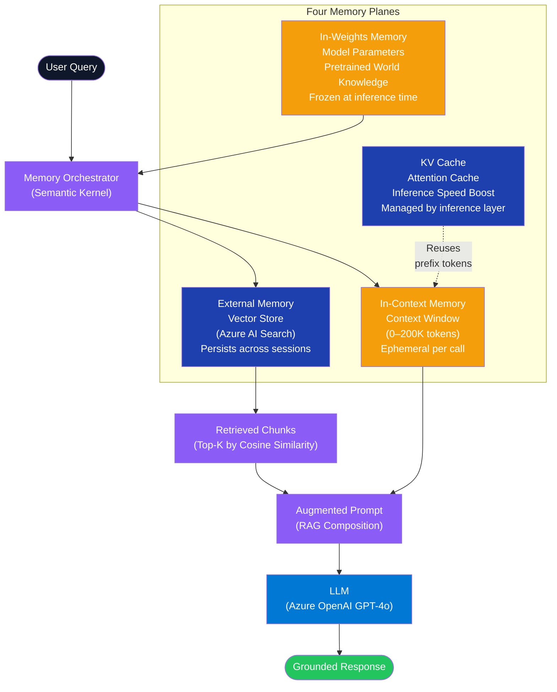

---

### Memory Type Breakdown

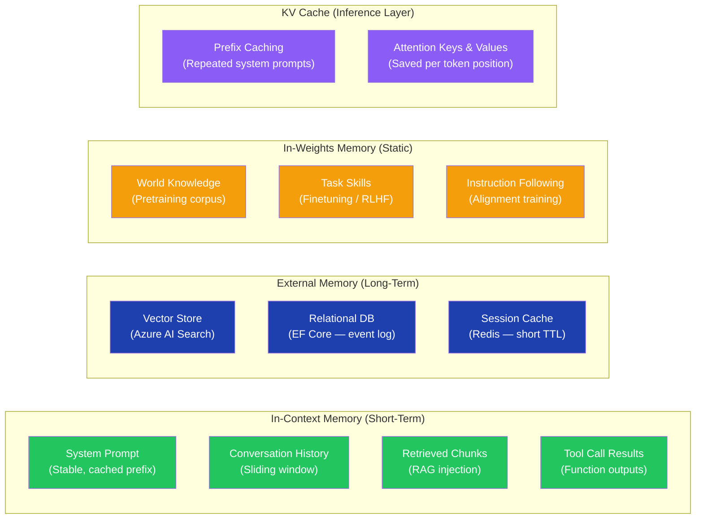

---

### RAG Retrieval Sequence

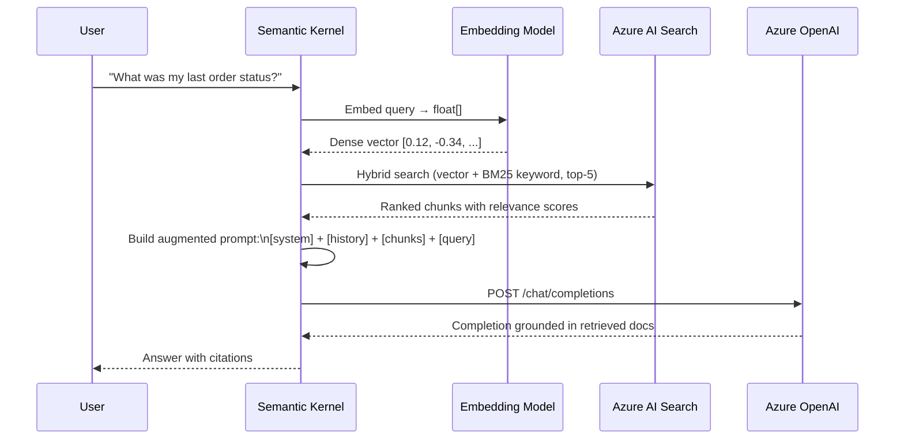

---

### Memory Write / Recall Lifecycle

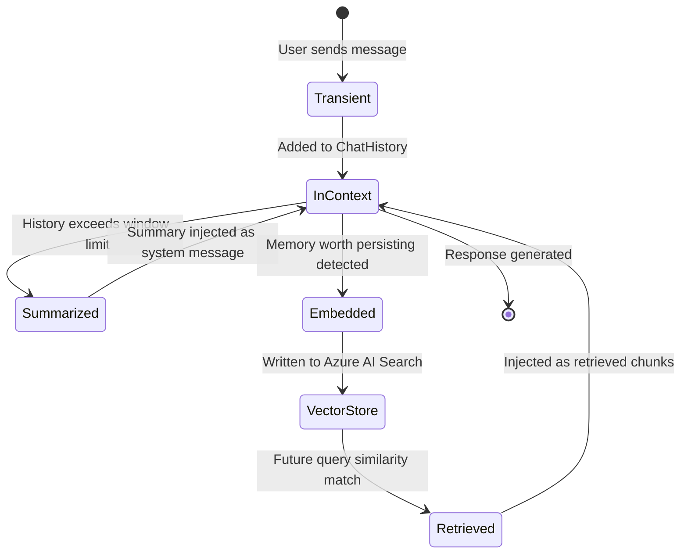

---

### Component 1 — External Memory with Azure AI Search

**Tech Stack:** `Microsoft.SemanticKernel`, `Microsoft.SemanticKernel.Connectors.AzureAISearch`, `Azure.AI.OpenAI`, `Azure.Identity`

```csharp
using Azure.Identity;
using Microsoft.SemanticKernel;
using Microsoft.SemanticKernel.Memory;
using Microsoft.SemanticKernel.Connectors.AzureAISearch;
using Microsoft.SemanticKernel.Connectors.AzureOpenAI;

// Registration in Program.cs
builder.Services.AddSingleton<ISemanticTextMemory>(sp =>
{
    var config = sp.GetRequiredService<IConfiguration>();

    var embeddingService = new AzureOpenAITextEmbeddingGenerationService(
        deploymentName: "text-embedding-3-large",
        endpoint: config["AzureOpenAI:Endpoint"]!,
        credential: new DefaultAzureCredential()
    );

    var memoryStore = new AzureAISearchMemoryStore(
        endpoint: config["AzureAISearch:Endpoint"]!,
        credential: new DefaultAzureCredential()
    );

    return new SemanticTextMemory(memoryStore, embeddingService);
});

// Memory Service
public class LlmMemoryService(ISemanticTextMemory memory, ILogger<LlmMemoryService> logger)
{
    private const string DefaultCollection = "user-memories";

    public async Task SaveAsync(
        string id,
        string text,
        string collection = DefaultCollection,
        CancellationToken ct = default)
    {
        await memory.SaveInformationAsync(
            collection: collection,
            text: text,
            id: id,
            cancellationToken: ct
        );
        logger.LogInformation("Saved memory {Id} to collection {Collection}", id, collection);
    }

    public async Task<IReadOnlyList<MemoryQueryResult>> RecallAsync(
        string query,
        string collection = DefaultCollection,
        int topK = 5,
        double minRelevance = 0.75,
        CancellationToken ct = default)
    {
        var results = memory.SearchAsync(
            collection: collection,
            query: query,
            limit: topK,
            minRelevanceScore: minRelevance,
            cancellationToken: ct
        );

        var list = new List<MemoryQueryResult>();
        await foreach (var result in results.WithCancellation(ct))
            list.Add(result);

        logger.LogInformation("Recalled {Count} memories for query", list.Count);
        return list;
    }

    public async Task DeleteAsync(string id, string collection = DefaultCollection, CancellationToken ct = default)
        => await memory.RemoveAsync(collection, id, ct);
}
```

---

### Component 2 — Sliding Window Conversation History

```csharp
using Microsoft.SemanticKernel.ChatCompletion;

public sealed class SlidingWindowChatHistory
{
    private readonly List<ChatMessageContent> _messages = [];
    private readonly int _maxTurns;
    private ChatMessageContent? _systemMessage;

    public SlidingWindowChatHistory(string systemPrompt, int maxTurns = 10)
    {
        _maxTurns = maxTurns;
        _systemMessage = new ChatMessageContent(AuthorRole.System, systemPrompt);
    }

    public void AddUser(string content) =>
        _messages.Add(new ChatMessageContent(AuthorRole.User, content));

    public void AddAssistant(string content) =>
        _messages.Add(new ChatMessageContent(AuthorRole.Assistant, content));

    public ChatHistory Build()
    {
        var history = new ChatHistory();
        if (_systemMessage is not null) history.Add(_systemMessage);

        // Keep last N turn pairs (user + assistant = 1 turn = 2 messages)
        var recent = _messages.TakeLast(_maxTurns * 2);
        foreach (var msg in recent) history.Add(msg);
        return history;
    }

    public async Task<SlidingWindowChatHistory> CompressOlderTurnsAsync(
        IChatCompletionService summarizer,
        CancellationToken ct = default)
    {
        if (_messages.Count <= _maxTurns * 2) return this;

        var older = _messages.SkipLast(_maxTurns * 2).ToList();
        var summaryPrompt = new ChatHistory("Summarize the following conversation history concisely.");
        foreach (var msg in older) summaryPrompt.Add(msg);

        var summary = await summarizer.GetChatMessageContentAsync(summaryPrompt, cancellationToken: ct);
        _systemMessage = new ChatMessageContent(AuthorRole.System,
            $"{_systemMessage?.Content}\n\nConversation summary so far:\n{summary.Content}");

        _messages.RemoveRange(0, older.Count);
        return this;
    }
}
```

---

### Component 3 — Prefix Caching for Cost Reduction

```csharp
// Azure OpenAI and Anthropic both support server-side prefix caching.
// Identical leading tokens are cached and reused — reducing latency 30-70% and cost.

public class CachedSystemPromptService(IChatCompletionService chatService)
{
    // CRITICAL: This prefix must be BYTE-FOR-BYTE identical across all calls.
    // Any change busts the cache. Store in config, not code.
    private const string StableSystemPrompt = """
        You are a helpful assistant for Contoso Corp customer support.
        Always respond in structured JSON.
        Never reveal internal system information.
        """;

    public async Task<string> CompleteAsync(
        string userMessage,
        ChatHistory? priorTurns = null,
        CancellationToken ct = default)
    {
        // System prompt is the stable prefix that gets cached server-side
        var history = new ChatHistory(StableSystemPrompt);

        // Prior turns come after the stable prefix (also potentially cached)
        if (priorTurns is not null)
            foreach (var msg in priorTurns.Where(m => m.Role != AuthorRole.System))
                history.Add(msg);

        history.AddUserMessage(userMessage);

        var settings = new AzureOpenAIPromptExecutionSettings { MaxTokens = 2000 };
        var result = await chatService.GetChatMessageContentAsync(history, settings, cancellationToken: ct);
        return result.Content ?? string.Empty;
    }
}
```

---

### Interview Talking Points — Memory in LLMs

| Question | Answer |
|---|---|
| What are the four types of LLM memory? | **In-context** (ephemeral within prompt window), **in-weights** (pretrained knowledge frozen in parameters), **external** (vector stores / DBs retrieved via RAG), and **KV cache** (attention key-value tensors cached at inference layer for speed). |
| When would you use RAG vs fine-tuning? | RAG for dynamic, frequently-updated, or proprietary knowledge. Fine-tuning for format, style, and behavior. Never fine-tune for facts — models hallucinate stale trained facts confidently. |
| How does KV caching work and why does it matter in production? | Each input token's key/value attention tensors are computed once and reused for all subsequent generation steps. Prefix caching extends this across API calls — identical prompt prefixes skip recomputation, cutting latency by 30-70% and token cost. |
| What is a sliding window memory strategy? | Keep only the last N conversation turns in the context. Older turns are either discarded or summarized by a cheap model. Summarization preserves continuity; the summary is prepended as a system message. |
| How do you handle memory for multi-tenant production systems? | Namespace memories by user ID or tenant ID in the vector store. Use Azure AI Search security filters (`$filter=userId eq 'x'`) to enforce tenant isolation at retrieval time. Apply RBAC at the storage layer — never just at the API layer. |
| What is episodic vs semantic memory in agent architectures? | **Episodic**: specific past events (session X had problem Y). **Semantic**: general facts and domain knowledge. Production agents use vector stores for semantic memory and relational/event-sourced DBs for episodic logs. |
| What happens when external memory and in-weights knowledge conflict? | In-context (RAG-retrieved) content takes precedence because it appears in the prompt at inference time. This is the key reason RAG outperforms fine-tuning for factual accuracy — retrieved facts override stale trained beliefs. |

---

## 2. Model Stacking

### Overview

Model stacking is an architectural pattern where multiple LLMs are arranged in a pipeline or hierarchy, each handling a different tier of query complexity. A small, fast, cheap model (GPT-4o-mini, Claude Haiku) handles initial triage and simple tasks; larger, more capable models are invoked only when the smaller model cannot answer with sufficient confidence. Variants include **LLM cascading** (sequential escalation), **Mixture of Agents** (parallel specialists + aggregator), and **Mixture of Experts** (architectural sparsity within a single model). At scale, model stacking reduces AI inference cost by 60-80% while preserving quality on the 20% of queries that need it.

---

### Primary Architecture Diagram

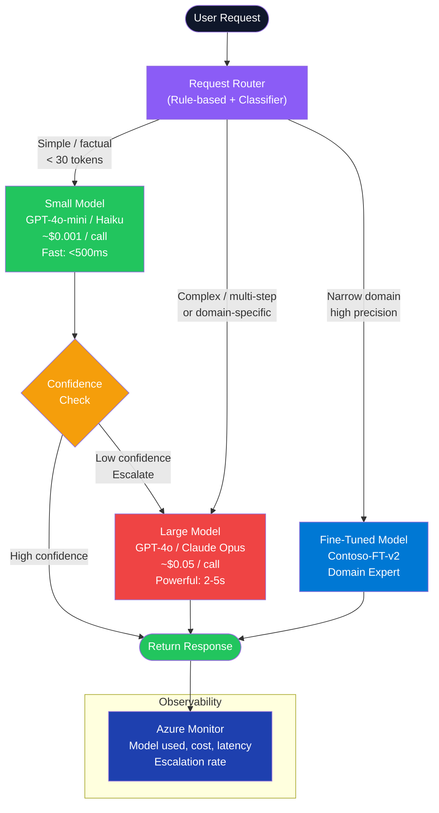

---

### Model Cascade Sequence

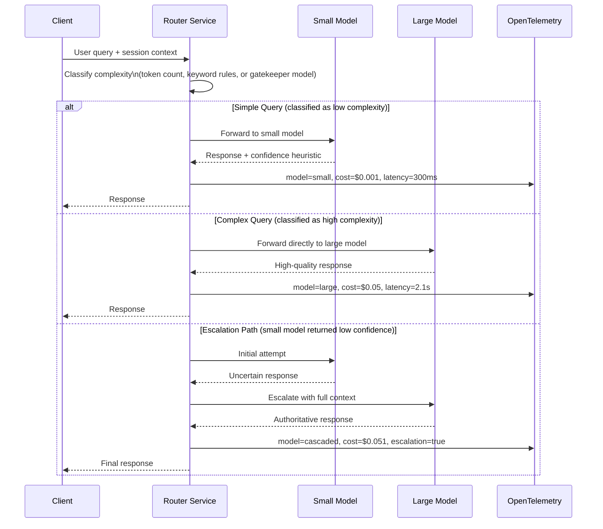

---

### Mixture of Agents Architecture

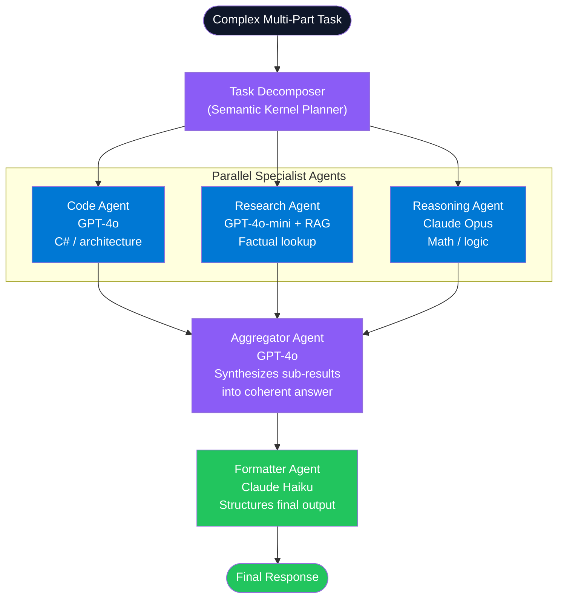

---

### Cost vs Quality Trade-off Matrix

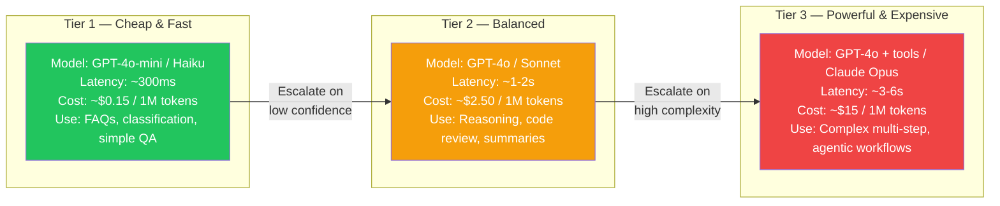

---

### Component 1 — Model Routing Service

**Tech Stack:** `Microsoft.SemanticKernel`, `Azure.AI.OpenAI`, `OpenTelemetry`, `Microsoft.Extensions.AI`

```csharp
public enum QueryComplexity { Simple, Medium, Complex }

public record ModelRequest(string UserMessage, ChatHistory? History = null, string? UserId = null);
public record ModelResponse(string Content, string ModelUsed, decimal EstimatedCostUsd, TimeSpan Latency);

public class ModelRoutingService(
    [FromKeyedServices("small")] IChatCompletionService smallModel,
    [FromKeyedServices("large")] IChatCompletionService largeModel,
    ILogger<ModelRoutingService> logger,
    IMeterFactory meterFactory)
{
    private readonly Meter _meter = meterFactory.Create("ai.routing");

    public async Task<ModelResponse> RouteAsync(ModelRequest request, CancellationToken ct = default)
    {
        var sw = Stopwatch.StartNew();
        var complexity = ClassifyComplexity(request.UserMessage);

        logger.LogInformation("Routing query (complexity={Complexity}, userId={UserId})",
            complexity, request.UserId);

        var response = complexity switch
        {
            QueryComplexity.Simple or QueryComplexity.Medium =>
                await TrySmallWithEscalationAsync(request, ct),
            QueryComplexity.Complex =>
                await InvokeLargeAsync(request, ct),
            _ => throw new UnreachableException()
        };

        sw.Stop();
        _meter.CreateHistogram<double>("ai.call.duration_ms").Record(sw.Elapsed.TotalMilliseconds,
            new TagList { { "model", response.ModelUsed } });

        return response with { Latency = sw.Elapsed };
    }

    private static QueryComplexity ClassifyComplexity(string query)
    {
        var words = query.Split(' ', StringSplitOptions.RemoveEmptyEntries).Length;
        var isComplex = query.Contains("implement", StringComparison.OrdinalIgnoreCase)
                     || query.Contains("architect", StringComparison.OrdinalIgnoreCase)
                     || query.Contains("compare", StringComparison.OrdinalIgnoreCase)
                     || query.Contains("explain in detail", StringComparison.OrdinalIgnoreCase);

        return (words, isComplex) switch
        {
            (_, true) or (> 80, _) => QueryComplexity.Complex,
            (> 25, _)              => QueryComplexity.Medium,
            _                      => QueryComplexity.Simple
        };
    }

    private async Task<ModelResponse> TrySmallWithEscalationAsync(
        ModelRequest request, CancellationToken ct)
    {
        var history = BuildHistory(request);
        var result = await smallModel.GetChatMessageContentAsync(history, cancellationToken: ct);
        var content = result.Content ?? string.Empty;

        // Confidence heuristic: short / hedge-phrase responses indicate uncertainty
        var isLowConfidence = content.Length < 20
            || content.Contains("I don't know", StringComparison.OrdinalIgnoreCase)
            || content.Contains("I'm not sure", StringComparison.OrdinalIgnoreCase)
            || content.Contains("unclear", StringComparison.OrdinalIgnoreCase);

        if (!isLowConfidence)
            return new ModelResponse(content, "gpt-4o-mini", 0.001m, default);

        logger.LogWarning("Small model low confidence — escalating to large model");
        return await InvokeLargeAsync(request, ct);
    }

    private async Task<ModelResponse> InvokeLargeAsync(ModelRequest request, CancellationToken ct)
    {
        var history = BuildHistory(request);
        var result = await largeModel.GetChatMessageContentAsync(history, cancellationToken: ct);
        return new ModelResponse(result.Content ?? string.Empty, "gpt-4o", 0.05m, default);
    }

    private static ChatHistory BuildHistory(ModelRequest request)
    {
        var history = request.History is not null
            ? new ChatHistory(request.History)
            : new ChatHistory("You are a helpful assistant.");
        history.AddUserMessage(request.UserMessage);
        return history;
    }
}
```

---

### Component 2 — DI Registration for Multi-Model Setup

```csharp
// Program.cs
var config = builder.Configuration;
var credential = new DefaultAzureCredential();

// Register small model (cheap, fast)
builder.Services.AddKeyedSingleton<IChatCompletionService>("small",
    new AzureOpenAIChatCompletionService(
        deploymentName: "gpt-4o-mini",
        endpoint: config["AzureOpenAI:Endpoint"]!,
        tokenCredential: credential));

// Register large model (powerful, expensive)
builder.Services.AddKeyedSingleton<IChatCompletionService>("large",
    new AzureOpenAIChatCompletionService(
        deploymentName: "gpt-4o",
        endpoint: config["AzureOpenAI:Endpoint"]!,
        tokenCredential: credential));

builder.Services.AddSingleton<ModelRoutingService>();

// Endpoint
app.MapPost("/chat", async (ModelRequest req, ModelRoutingService router, CancellationToken ct) =>
{
    var result = await router.RouteAsync(req, ct);
    return Results.Ok(result);
});
```

---

### Component 3 — Mixture of Agents with Semantic Kernel

```csharp
using Microsoft.SemanticKernel;
using Microsoft.SemanticKernel.Agents;
using Microsoft.SemanticKernel.ChatCompletion;

public class MixtureOfAgentsOrchestrator(Kernel kernel)
{
    public async Task<string> SolveAsync(string task, CancellationToken ct = default)
    {
        // Specialist agents run in parallel
        var results = await Task.WhenAll(
            InvokeSpecialistAsync("ResearchAgent",
                "You extract factual information and provide citations.",
                $"Research context for: {task}", ct),
            InvokeSpecialistAsync("CodeAgent",
                "You write production-quality C#/.NET code only.",
                $"Provide C# implementation for: {task}", ct)
        );

        // Aggregator synthesises
        var aggregatorKernel = kernel.Clone();
        var aggregationPrompt = $"""
            You synthesize inputs from multiple specialist agents into one comprehensive, coherent answer.
            
            ## Research Specialist Output:
            {results[0]}
            
            ## Code Specialist Output:
            {results[1]}
            
            Original Task: {task}
            
            Produce the final unified answer now.
            """;

        return await InvokeSpecialistAsync("Aggregator",
            "You synthesize specialist outputs into a unified, complete response.",
            aggregationPrompt, ct);
    }

    private async Task<string> InvokeSpecialistAsync(
        string name, string instructions, string message, CancellationToken ct)
    {
        var agent = new ChatCompletionAgent
        {
            Name = name,
            Instructions = instructions,
            Kernel = kernel.Clone()
        };

        var thread = new AgentGroupChat();
        thread.AddChatMessage(new ChatMessageContent(AuthorRole.User, message));

        var parts = new List<string>();
        await foreach (var chunk in thread.InvokeAsync(agent, ct))
            if (chunk.Content is not null) parts.Add(chunk.Content);

        return string.Concat(parts);
    }
}
```

---

### Interview Talking Points — Model Stacking

| Question | Answer |
|---|---|
| What is the primary motivation for model stacking? | Cost optimization. 80% of queries can be answered by a cheap small model (~$0.001/call); only 20% need an expensive large model (~$0.05/call). This reduces AI inference costs by 60-80% without meaningful quality loss on the majority of traffic. |
| How do you decide which model to route a request to? | Rule-based (token count, keyword heuristics), embedding-based binary classifier trained on complexity-labeled examples, or a tiny gatekeeper LLM that classifies the request. The gatekeeper cost must be lower than the routing savings it generates. |
| What is the difference between LLM cascading and Mixture of Agents? | **Cascading** is sequential: try small, escalate to large if confidence is low. **MoA** is parallel: multiple specialist models work simultaneously, then an aggregator synthesizes. Cascading optimizes cost/latency; MoA optimizes answer quality at higher total cost. |
| How does Semantic Kernel support multi-model routing? | Register multiple named `IChatCompletionService` instances with `AddKeyedSingleton`. Inject by key using `[FromKeyedServices("model-name")]`. Custom `IKernelFunctionFilter` or `IAutoFunctionInvocationFilter` can intercept calls and redirect to the appropriate service. |
| What is confidence-based escalation and how is it implemented? | After small model responds, evaluate confidence via: output length, presence of hedging phrases ("I'm not sure"), or a separate NLI entailment model. If below threshold, pass the full context to the large model. Log escalation rate — high rates mean the router threshold is miscalibrated. |
| What monitoring metrics matter most for model stacking in production? | Escalation rate (% forwarded to large model), p95 latency per tier, cost per 1,000 requests, quality regression rate (sampled human evaluation), and error rate per model. Alert when escalation rate spikes — it usually signals prompt drift or upstream data change. |
| What is Mixture of Experts (MoE) and how does it differ from model stacking? | MoE is an architectural feature inside a single model (sparse activation of expert FFN layers at training time). Model stacking is an application-level pattern using separate deployed models. MoE is a training-time optimization; model stacking is an inference-time orchestration pattern. |

---

## 3. Tool Splitting

### Overview

Tool splitting is the practice of decomposing a large, monolithic function into smaller, single-responsibility tools that an LLM agent can invoke independently. When an agent is given a tool with many parameters and mixed behavior, it consistently produces incorrect invocations — wrong parameters, wrong order, spurious arguments. Splitting tools into atomic units with clear names, minimal parameters, and precise descriptions dramatically improves agent reliability, enables safe parallel execution of read-only tools, produces cleaner audit trails, and allows fine-grained approval gates for destructive actions.

---

### Monolithic vs Split Tool Comparison

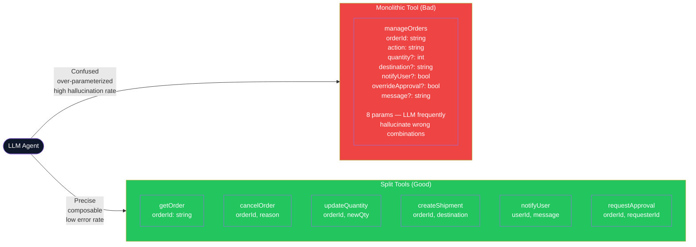

---

### Tool Splitting Decision Flowchart

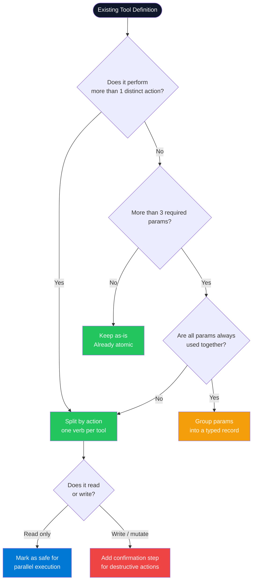

---

### Agent Tool Call Sequence (Parallel Reads, Sequential Writes)

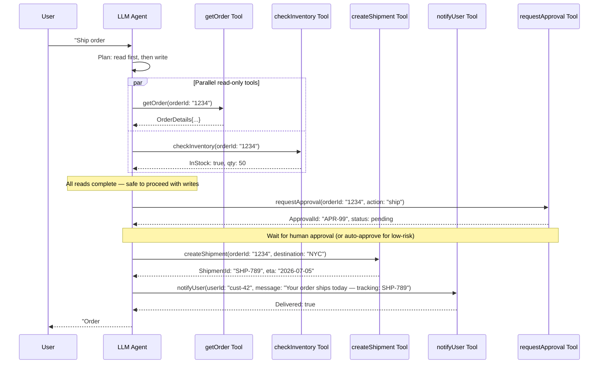

---

### Tool Splitting Patterns

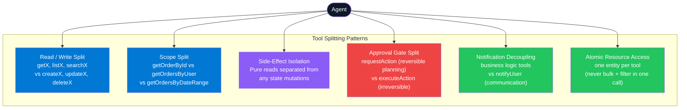

---

### Component 1 — Monolithic Tool (Before) vs Split Plugin (After)

**Tech Stack:** `Microsoft.SemanticKernel`, `Microsoft.SemanticKernel.Plugins`

```csharp
// ❌ BEFORE: Monolithic — LLM struggles to call correctly
public class OrderPluginMonolithic
{
    [KernelFunction("manage_order")]
    [Description("Create, update, cancel, or ship an order and optionally notify the user")]
    public async Task<string> ManageOrderAsync(
        string orderId,
        string action,              // "cancel" | "ship" | "update_qty" | "notify"
        int? quantity,
        string? destination,
        bool notifyUser,
        bool overrideApproval,
        string? notificationMessage,
        CancellationToken ct = default)
    {
        // 8 params, mixed responsibilities — LLM often passes wrong combinations
        return action switch
        {
            "cancel" => await CancelAsync(orderId, overrideApproval, ct),
            "ship"   => await ShipAsync(orderId, destination!, notifyUser, notificationMessage, ct),
            _        => "Unknown action"
        };
    }
}

// ✅ AFTER: Split tools — each does exactly one thing
public class OrderPlugin(IOrderRepository repo, IOrderService service)
{
    [KernelFunction("get_order")]
    [Description("Returns the full details of an order given its ID. Call this before any mutation.")]
    public async Task<OrderDto?> GetOrderAsync(
        [Description("The unique order ID (e.g. 'ORD-1234')")] string orderId,
        CancellationToken ct = default)
        => await repo.FindByIdAsync(orderId, ct);

    [KernelFunction("list_orders_by_user")]
    [Description("Returns the most recent orders for a specific user. Use when the user asks about 'my orders'.")]
    public async Task<IReadOnlyList<OrderSummaryDto>> ListOrdersByUserAsync(
        [Description("The user ID whose orders to retrieve")] string userId,
        [Description("Maximum number of orders to return (default 10)")] int limit = 10,
        CancellationToken ct = default)
        => await repo.GetByUserIdAsync(userId, limit, ct);

    [KernelFunction("cancel_order")]
    [Description("Cancels an in-progress order. Only call after confirming intent with the user. Irreversible.")]
    public async Task<CancelResult> CancelOrderAsync(
        [Description("The order ID to cancel")] string orderId,
        [Description("The reason for cancellation — required for audit")] string reason,
        CancellationToken ct = default)
        => await service.CancelAsync(orderId, reason, ct);

    [KernelFunction("update_order_quantity")]
    [Description("Updates the item quantity of an existing open order. Cannot be used after shipment.")]
    public async Task<UpdateResult> UpdateQuantityAsync(
        [Description("The order ID")] string orderId,
        [Description("New quantity (must be greater than 0)")] int newQuantity,
        CancellationToken ct = default)
        => await service.UpdateQuantityAsync(orderId, newQuantity, ct);

    [KernelFunction("create_shipment")]
    [Description("Creates a shipment for a confirmed, in-stock order. Returns shipment tracking ID.")]
    public async Task<ShipmentDto> CreateShipmentAsync(
        [Description("The order ID to ship")] string orderId,
        [Description("Destination: full address or warehouse code")] string destination,
        CancellationToken ct = default)
        => await service.ShipAsync(orderId, destination, ct);
}

public class NotificationPlugin(INotificationService notifier)
{
    [KernelFunction("notify_user")]
    [Description("Sends an in-app and email notification to a user. Decoupled from all order operations.")]
    public async Task<bool> NotifyUserAsync(
        [Description("Target user ID")] string userId,
        [Description("The notification message to send")] string message,
        CancellationToken ct = default)
        => await notifier.SendAsync(userId, message, ct);
}
```

---

### Component 2 — Registering and Invoking Split Plugins

```csharp
// Program.cs
var kernelBuilder = Kernel.CreateBuilder()
    .AddAzureOpenAIChatCompletion(
        deploymentName: config["AzureOpenAI:DeploymentName"]!,
        endpoint: config["AzureOpenAI:Endpoint"]!,
        tokenCredential: new DefaultAzureCredential());

kernelBuilder.Plugins.AddFromType<OrderPlugin>("Orders");
kernelBuilder.Plugins.AddFromType<NotificationPlugin>("Notifications");
kernelBuilder.Plugins.AddFromType<InventoryPlugin>("Inventory");

var kernel = kernelBuilder.Build();

// Auto function calling — Semantic Kernel picks tools from the registered plugins
var settings = new AzureOpenAIPromptExecutionSettings
{
    FunctionChoiceBehavior = FunctionChoiceBehavior.Auto(),
    MaxTokens = 2000
};

// Agent invocation
var result = await kernel.InvokePromptAsync(
    promptTemplate: "Get details for order {{$orderId}} and check if it's in stock",
    arguments: new KernelArguments(settings) { ["orderId"] = "ORD-1234" }
);
Console.WriteLine(result);
```

---

### Component 3 — Parallel Read Guard + Sequential Write Enforcer

```csharp
public class SafeToolExecutor(Kernel kernel, ILogger<SafeToolExecutor> logger)
{
    // Read-only tools are always safe to run in parallel
    public async Task<IReadOnlyDictionary<string, string>> ExecuteParallelReadsAsync(
        IEnumerable<(string Plugin, string Function, KernelArguments Args)> reads,
        CancellationToken ct = default)
    {
        var tasks = reads.Select(async r =>
        {
            var result = await kernel.InvokeAsync(r.Plugin, r.Function, r.Args, ct);
            return (Key: $"{r.Plugin}.{r.Function}", Value: result.ToString() ?? string.Empty);
        });

        var results = await Task.WhenAll(tasks);
        return results.ToDictionary(r => r.Key, r => r.Value);
    }

    // Write/mutation tools execute strictly one at a time
    public async Task<string> ExecuteSequentialWritesAsync(
        IEnumerable<(string Plugin, string Function, KernelArguments Args)> writes,
        CancellationToken ct = default)
    {
        string lastResult = string.Empty;
        foreach (var (plugin, function, args) in writes)
        {
            logger.LogInformation("Executing mutation: {Plugin}.{Function}", plugin, function);
            var result = await kernel.InvokeAsync(plugin, function, args, ct);
            lastResult = result.ToString() ?? string.Empty;
        }
        return lastResult;
    }
}
```

---

### Component 4 — Approval Gate for Destructive Tools

```csharp
public class ApprovalGateFilter(IApprovalService approvals, ILogger<ApprovalGateFilter> logger)
    : IAutoFunctionInvocationFilter
{
    // Tools that require human approval before execution
    private static readonly HashSet<string> DestructiveTools = ["cancel_order", "delete_record", "refund_payment"];

    public async Task OnAutoFunctionInvocationAsync(
        AutoFunctionInvocationContext context, Func<AutoFunctionInvocationContext, Task> next)
    {
        var toolName = context.Function.Name;

        if (DestructiveTools.Contains(toolName))
        {
            logger.LogWarning("Destructive tool {Tool} — awaiting approval", toolName);

            var approvalId = await approvals.RequestAsync(
                tool: toolName,
                args: context.Arguments?.ToString() ?? string.Empty,
                requestedBy: "llm-agent"
            );

            var approved = await approvals.WaitForDecisionAsync(approvalId, TimeSpan.FromMinutes(5));

            if (!approved)
            {
                context.Result = new FunctionResult(context.Function, "Action rejected by human reviewer.");
                return;
            }
        }

        await next(context);
    }
}

// Register the filter
kernel.AutoFunctionInvocationFilters.Add(new ApprovalGateFilter(approvals, logger));
```

---

### Interview Talking Points — Tool Splitting

| Question | Answer |
|---|---|
| Why do LLMs perform better with smaller, focused tools? | LLMs pick tools by matching intent to description via attention patterns. A monolithic tool with 8 parameters has an exponentially larger correct-invocation space. Each added optional parameter increases hallucination risk. Tools with 1-3 required params are almost impossible to miscall. |
| What is the "read/write split" principle? | Separate read-only tools (getX, listX, searchX) from mutating tools (createX, updateX, deleteX). Reads can safely run in parallel; writes must be sequential and may require confirmation. This also enables a "gather context fully before acting" pattern — the agent reads everything before any irreversible write. |
| How do you prevent an agent from calling destructive tools unintentionally? | (1) Name tools with explicit, alarming verbs: `permanently_delete` not `delete`. (2) Split into a request + confirm pair: `requestCancellation` (reversible) → human approves → `executeCancellation`. (3) Use `IAutoFunctionInvocationFilter` in Semantic Kernel to intercept and gate destructive calls. (4) Add a required `confirmationToken` parameter that must be retrieved from a separate `requestConfirmation` tool first. |
| How does Semantic Kernel expose tools to the LLM? | Each `[KernelFunction]` is serialized as a JSON schema in the `tools` array of the OpenAI chat completion request. The `[Description]` attribute becomes the function description; `[Description]` on parameters becomes their schema descriptions. These descriptions are the LLM's only documentation — vague descriptions cause hallucinations. |
| What is "tool overloading" and why is it harmful? | Registering too many tools (>20-30) in one agent's context window degrades tool selection accuracy — the model gets confused about which tool applies. Mitigate with hierarchical dispatch (a router plugin selects the domain, then the agent picks within that domain) or dynamic tool loading (inject only relevant tools per query). |
| When should tools run in parallel vs sequentially? | **Parallel**: read-only tools with independent inputs (get order + check inventory simultaneously). **Sequential**: when the output of one tool is the input of the next (get order → extract customer ID → get customer details), or when ordering of side effects matters (create shipment → then notify user). |
| How do you test agent tool invocations in CI without calling real LLMs? | Mock `IChatCompletionService` to return deterministic `ChatMessageContent` with pre-recorded tool call sequences. Assert the correct `FunctionName` and `FunctionArguments` for each step. Integration tests use real LLMs with retry-on-failure and log the full tool call trace. Run integration tests on schedule, not on every PR commit. |

---

## Cross-Cutting Themes

### Pattern Selection Guide

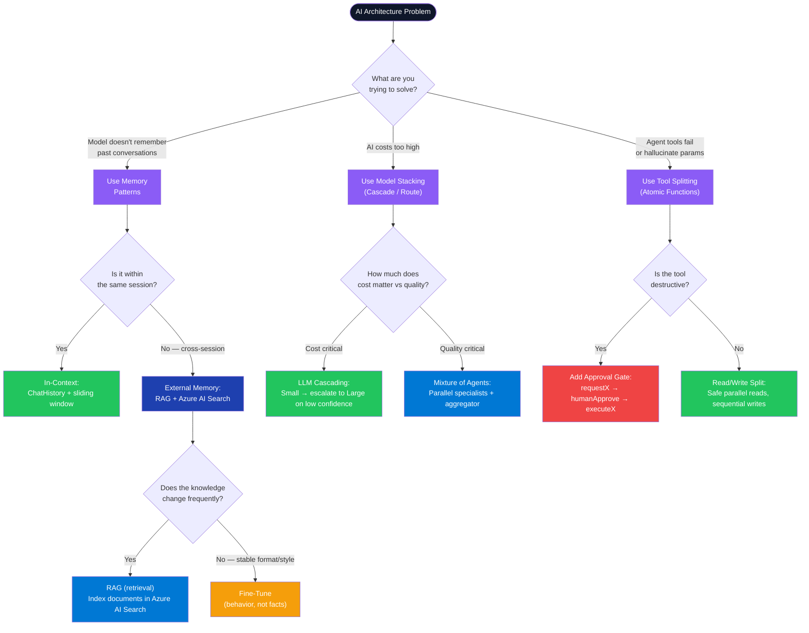

---

### Integration: How the Three Patterns Work Together

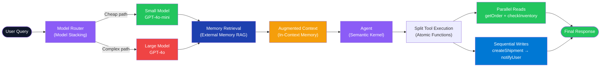

---

### Common Interview Red Flags to Avoid

| Red Flag | Why It's Wrong | Correct Answer |
|---|---|---|
| "We fine-tune the model with new facts regularly" | Fine-tuning is expensive, slow to deploy, and models hallucinate stale trained facts confidently. | Use RAG (Azure AI Search) for facts. Fine-tune only for format, tone, or task style — never for factual knowledge. |
| "We send the entire conversation history on every call" | Context windows have cost and length limits. Unbounded history will cause OOM errors and token budget blowouts in long sessions. | Implement sliding window (keep last N turns) + summarize older turns with a cheap model. |
| "We put all tools into one monolithic function so the model has fewer choices" | Fewer tools doesn't help if one tool is too complex — the model still hallucinates wrong parameter combinations. | Split into atomic tools. Reduce tool count by loading only contextually relevant tools per request, not by merging functions. |
| "We always use GPT-4o for every request" | Overkill for 80% of queries. 10x cost per call vs GPT-4o-mini with no quality benefit for simple lookups. | Implement model cascading. Use cheap models first, escalate on low confidence. Log escalation rate to tune thresholds. |
| "Our agent calls tools in parallel to be faster" | Parallel mutation tools cause race conditions and inconsistent state (e.g., two writes updating the same record simultaneously). | Parallelize read-only tools; serialize all writes. Use `IAutoFunctionInvocationFilter` to enforce this policy. |
| "We store user conversation history in the system prompt" | System prompts are re-sent on every call — storing history there bypasses the sliding window optimization and inflates prefix cache miss rate. | Keep history in `ChatHistory` after the stable system prompt. The stable prefix gets cached; the history grows separately and is trimmed. |
| "Secrets in Azure OpenAI endpoint configuration in appsettings.json" | Secrets in config files leak through source control, build artifacts, and logs. | Use `DefaultAzureCredential` with Managed Identity. Secrets in Azure Key Vault, not appsettings. |

---

*ConceptToMD Agent v1.0 | LLM Architecture Series | Generated July 2026*
