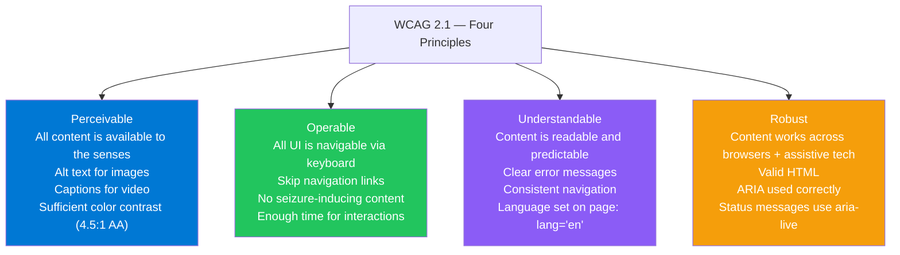
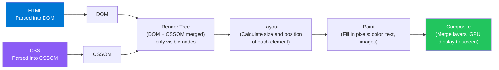

# Frontend Interview MCQ — Complete Reference Guide

> Covers: CSS · Responsive Design · Accessibility · SPA vs MPA · PWA · CI/CD · Performance · CDN · Caching · API Patterns · System Design HLD Concepts

---

## Table of Contents

1. [CSS & Responsive Design](#1-css--responsive-design)
2. [Accessibility (WCAG / ARIA)](#2-accessibility-wcag--aria)
3. [SPA vs MPA](#3-spa-vs-mpa)
4. [PWA & Service Workers](#4-pwa--service-workers)
5. [CI/CD for Frontend](#5-cicd-for-frontend)
6. [Performance Optimization](#6-performance-optimization)
7. [API Design & Caching](#7-api-design--caching)
8. [System Design HLD Concepts](#8-system-design-hld-concepts)
9. [Critical Rendering Path](#9-critical-rendering-path)
10. [State Management](#10-state-management)

---

## 1. CSS & Responsive Design

### CSS Specificity — MCQ Set

**Q1: What is the output of the following CSS? Two rules target the same `<p>` element. Which color wins?**
```css
p.text { color: red; }         /* class + element */
#content p { color: blue; }    /* id + element */
```
- A) red — class selector has higher specificity
- B) **blue — ID selector (0,1,0,0) beats class+element (0,0,1,1)**
- C) Whichever is declared last
- D) It's indeterminate

**Answer: B**
Specificity is calculated as (inline, id, class, element) = (0,0,0,0). `#content p` = (0,1,0,1); `p.text` = (0,0,1,1). ID specificity (column 2) > class specificity (column 3). Blue wins.

---

**Q2: In CSS Flexbox, which property controls the alignment of flex items along the CROSS axis?**
- A) `justify-content`
- B) `flex-direction`
- C) **`align-items`**
- D) `flex-wrap`

**Answer: C**
`justify-content` aligns along the MAIN axis. `align-items` aligns along the CROSS axis (perpendicular to main). The main axis is set by `flex-direction` (default: row = horizontal).

---

**Q3: What does `box-sizing: border-box` change about the box model?**
- A) Removes the border from rendering
- B) Adds margin to the width calculation
- C) **Width and height include padding and border; margin is still outside**
- D) Makes the element position: absolute

**Answer: C**
Default (`content-box`): `width` = content only; padding and border are added on top. `border-box`: `width` and `height` INCLUDE padding and border. Makes layout math intuitive — a `width: 200px` box stays 200px wide even with padding.

---

**Q4: Which CSS property enables CSS Grid layout?**
- A) `display: flex`
- B) **`display: grid`**
- C) `position: grid`
- D) `grid-template: auto`

**Answer: B**
CSS Grid is enabled with `display: grid` on the container. Children become grid items automatically.

---

**Q5: What is the correct media query for a mobile-first approach targeting screens wider than 768px?**
- A) `@media (max-width: 768px) { ... }`
- B) `@media screen and (width: 768px) { ... }`
- C) **`@media (min-width: 768px) { ... }`**
- D) `@media (device-width: 768px) { ... }`

**Answer: C**
Mobile-first means base styles target mobile (no media query), then `min-width` breakpoints progressively add styles for larger screens. `max-width` is desktop-first (start from large, add restrictions for small).

---

**Q6: Which unit is relative to the root element's font size?**
- A) `em` (relative to parent element's font size)
- B) **`rem` (relative to `:root` / `html` element font size)**
- C) `vw` (relative to viewport width)
- D) `px` (absolute)

**Answer: B**
`rem` = root em. If `html { font-size: 16px }`, then `1.5rem = 24px` everywhere. `em` is relative to the immediate parent — can cascade unexpectedly. Use `rem` for consistent, scalable typography.

---

**Q7: What is CSS containment (`contain: layout style`)?**
- A) Prevents CSS animations on the element
- B) **Tells the browser the element's layout is independent from the rest of the page — enabling paint/layout optimizations**
- C) Applies container queries
- D) Isolates the element into a new stacking context

**Answer: B**
`contain: layout` tells the browser changes inside this element don't affect anything outside. The browser can skip re-laying out the whole page when only this component changes. Key performance optimization for large widget-heavy pages.

---

**Q8: What does the `will-change: transform` property do?**
- A) Prevents the transform property from working
- B) **Hints to the browser to promote the element to its own compositor layer, enabling GPU-accelerated transforms**
- C) Forces hardware rendering
- D) Disables CSS transitions

**Answer: B**
`will-change` hints to the browser that this property will change soon, allowing it to set up optimizations (GPU layer promotion) in advance. Use sparingly — each GPU layer uses memory.

---

### Responsive Design Concept Q&A

| Concept | Explanation |
|---|---|
| **Mobile-first** | Write base CSS for mobile; use `min-width` breakpoints to enhance for larger screens |
| **Fluid layouts** | Use `%`, `vw`, `fr` units instead of `px` so layout scales with viewport |
| **Responsive images** | `srcset` + `sizes` attributes let browser choose optimal image resolution for DPR and viewport |
| **Container Queries** | Style based on PARENT container width, not viewport — solves component-level responsiveness |
| **Viewport meta tag** | `<meta name="viewport" content="width=device-width, initial-scale=1">` — prevents mobile browser from zooming out to show desktop layout |

---

## 2. Accessibility (WCAG / ARIA)

### WCAG 2.1 Principles — POUR



**Q9: What ARIA attribute announces dynamic content changes to screen readers?**
- A) `aria-label`
- B) `aria-described-by`
- C) **`aria-live`**
- D) `role="alert"`

**Answer: C**
`aria-live="polite"` announces content changes to screen readers after the current statement finishes. `aria-live="assertive"` interrupts the current announcement immediately (use for critical errors only). `role="alert"` implies `aria-live="assertive"` automatically.

---

**Q10: Which color contrast ratio does WCAG 2.1 AA require for normal body text?**
- A) 2:1
- B) 3:1
- C) **4.5:1**
- D) 7:1

**Answer: C**
WCAG 2.1 AA requires 4.5:1 for normal text. Large text (18pt+ or 14pt bold) requires 3:1. AAA level requires 7:1 for normal text. Tools: Colour Contrast Analyser, axe DevTools.

---

**Q11: When should you NOT add an `alt` attribute to an image?**
- A) When the image is decorative and provides no information — use `alt=""`
- B) When the image is an icon
- C) When the image has a caption
- D) Never — `alt` is always required

**Answer: A (with nuance)**
`alt` attribute is ALWAYS required (omitting it is invalid HTML). For decorative images, use `alt=""` — screen readers will skip it. For informative images, `alt` must describe the content. For icon buttons, `alt` or `aria-label` should describe the action, not "icon".

---

### ARIA Best Practices Table

| ARIA Usage | Correct | Incorrect |
|---|---|---|
| `aria-label` | Use when visible label is absent (`<button aria-label="Close dialog">X</button>`) | Use to replace visible text (creates confusion) |
| `aria-describedby` | Point to helper text ID (`aria-describedby="hint-1"`) | Used where `aria-labelledby` is needed |
| `aria-labelledby` | Composed label from multiple elements | Used for description (secondary info) |
| `role="button"` | Use ONLY when a non-button element must behave as button | Never add to `<button>` — it already has role |
| `aria-hidden` | Hide decorative elements from AT (`aria-hidden="true"`) | Applied to focusable elements |

---

## 3. SPA vs MPA

**Q12: A company's marketing site has 200 static pages (no personalization). Which rendering approach is most appropriate?**
- A) SPA (React with client-side routing)
- B) **SSG (Static Site Generation) — pre-built HTML served from CDN**
- C) SSR (Server-Side Rendering) with database queries per request
- D) MPA with server-side templates (PHP/EJS)

**Answer: B**
200 pages, no personalization = identical output for every user. SSG pre-builds all pages at deploy time; served from CDN. Ultra-fast, excellent SEO, zero server cost. SPA requires JS to build DOM (poor SEO), SSR wastes CPU regenerating identical pages.

---

**Q13: What is the main trade-off when choosing a Single Page Application over a Multi-Page Application?**
- A) SPAs can't handle complex UIs
- B) SPAs can't use REST APIs
- C) **SPAs have faster subsequent page transitions but slower initial load and poorer SEO without SSR**
- D) MPAs are always better for SEO

**Answer: C**
SPAs load a large JS bundle upfront — navigation then is instant (no server round-trip). MPAs do a server request per page — slower transition, but each page arrives as complete HTML (excellent SEO, no JS required). Hybrid (Next.js) combines both.

---

## 4. PWA & Service Workers

**Q14: What is the purpose of a Service Worker in a Progressive Web App?**
- A) To replace the app's JavaScript logic
- B) **To act as a network proxy, enabling offline caching, push notifications, and background sync**
- C) To improve CSS animation performance
- D) To handle server-side rendering

**Answer: B**
A Service Worker is a background script (separate thread, no DOM access) that intercepts all network requests. It can serve from cache when offline, push notifications to the device even when the app isn't open, and queue sync tasks for when connectivity returns.

---

**Q15: What is required in a `manifest.json` for a PWA to be installable (Add to Home Screen)?**
- A) `version` and `scripts` keys
- B) **`name`, `icons`, `start_url`, and `display: "standalone"`**
- C) `description` and `theme_color` only
- D) Nothing — any web app is installable

**Answer: B**
The minimum viable Web App Manifest needs: `name`, `icons` (minimum 192x192 + 512x512 PNG), `start_url`, and `display: "standalone"` (or `"fullscreen"`). `theme_color` and `background_color` are recommended but not required.

---

**Q16: Which Service Worker caching strategy is best for an app's JavaScript bundle files?**
- A) Network First — always fetch fresh JS
- B) **Cache First — JS bundles are content-hashed (fingerprinted); safe to serve forever from cache**
- C) Network Only — never cache JS
- D) Stale-While-Revalidate — serve stale and update in background

**Answer: B**
JS bundles from modern build tools are content-hashed (`app.a3f9d2.js`). If the hash matches, the file is identical — safe to serve from cache indefinitely. The hash in the filename changes when content changes, prompting a fresh download. Cache First gives maximum performance for static assets.

---

## 5. CI/CD for Frontend

```mermaid
flowchart LR
    PR["Pull Request\n(Code pushed)"] --> LINT["Lint + Format\n(ESLint, Prettier)\nFail fast on style issues"] --> TEST["Test Suite\n(Jest, Vitest, RTL, Playwright)"] --> BUILD["Build\n(Webpack, Vite, Turbopack)\nBundle + optimize"] --> DEPLOY_PREV["Preview Deploy\n(Vercel/Netlify PR preview)\nReviewer tests live branch"] --> MERGE["Merge to Main"] --> DEPLOY_PROD["Production Deploy\n(CDN flush + blue-green swap)"]

    style LINT fill:#f59e0b,color:#fff
    style TEST fill:#0078D4,color:#fff
    style BUILD fill:#8b5cf6,color:#fff
    style DEPLOY_PREV fill:#22c55e,color:#fff
    style DEPLOY_PROD fill:#22c55e,color:#fff
```



**Q17: What is the purpose of a "preview deployment" in a frontend CI/CD pipeline?**
- A) Deploy to production without approval
- B) **Deploy a temporary live environment for each pull request so reviewers can test the feature in a browser before merge**
- C) Build the app without minification for debugging
- D) Deploy only to mobile devices

**Answer: B**
Preview (per-PR) deployments (Vercel, Netlify, Cloudflare Pages) give each branch a unique URL. Reviewers test the actual rendered feature without needing to run the project locally. Dramatically speeds up code review feedback loops.

---

**Q18: Why should environment variables containing secrets never be embedded in a frontend JavaScript bundle?**
- A) JavaScript can't read environment variables
- B) **Browser JS is sent to the client — anyone can open DevTools and read any value embedded in the bundle**
- C) It slows down the build
- D) Frontend frameworks don't support env vars

**Answer: B**
Frontend bundles are public. Any `REACT_APP_API_KEY` embedded in the bundle is visible to anyone who views source. Secrets should only exist on the server (API routes, BFF, cloud function). Frontend should only have non-secret configuration (public API URLs, feature flag keys).

---

## 6. Performance Optimization

**Q19: What is the difference between debouncing and throttling?**
- A) They are the same thing
- B) **Debounce delays execution until events stop for N ms; throttle allows at most one execution per N ms regardless**
- C) Debounce is for clicks; throttle is for scroll events
- D) Throttle fires once total; debounce fires repeatedly

**Answer: B**
Debounce: "wait for calm." Good for search input — don't call API until user pauses typing 300ms.
Throttle: "rate limit." Good for scroll handlers — allow max one call per 100ms even if scroll fires 1000x.

---

**Q20: What is the benefit of code splitting in web applications?**
- A) It makes the application code easier to read
- B) **It splits the JavaScript bundle into smaller chunks, loading only the code needed for the current route — reducing initial page load time**
- C) It removes dead code from the bundle
- D) It compresses HTML for faster TTFB

**Answer: B**
Code splitting (via dynamic `import()`, React.lazy, or route-level splitting in Next.js) allows the browser to load only the JS needed to render the current view. Route `/dashboard` doesn't need to download the admin settings code until the user navigates there.

---

**Q21: What is tree shaking and what module format is required?**
- A) Removing unused CSS classes — works with any format
- B) **Removing unused JavaScript exports at build time — requires ES Modules (`import/export`) syntax**
- C) Minifying code by renaming variables
- D) Splitting large components into smaller ones

**Answer: B**
Tree shaking relies on static analysis of ES Module import/export statements. If `utils.js` exports 50 functions but only `formatDate` is imported anywhere, a bundler (Rollup, Webpack, esbuild) eliminates the other 49. CommonJS `require()` is dynamic — bundler can't know what's used at compile time.

---

**Q22: What is a CDN and why does it improve web performance?**
- A) A Content Delivery Network that rewrites JavaScript code for optimization
- B) **A globally distributed network of servers that cache and serve static assets from the location closest to the user, reducing latency**
- C) A type of browser cache
- D) A server-side caching layer for databases

**Answer: B**
Without CDN: all users fetch from your origin server in one region — users in Tokyo wait for a round-trip to your US datacenter. With CDN: Tokyo users fetch from a Tokyo CDN edge node (cached copy) — milliseconds instead of hundreds of milliseconds.

---

**Q23: What HTTP cache headers control how long browsers and CDNs cache a response?**
- A) `X-Cache-Control` and `X-Expires`
- B) **`Cache-Control` (e.g., `max-age=3600, public`) and `ETag` for validation**
- C) `Content-Type` and `Last-Modified` only
- D) `Authorization` and `Vary`

**Answer: B**
`Cache-Control: max-age=31536000, immutable` — cache for 1 year, never revalidate (for fingerprinted assets).
`Cache-Control: no-cache` — revalidate with server every time (use ETag/Last-Modified for 304 responses).
`ETag` — server fingerprint; client sends `If-None-Match` header; server returns 304 if unchanged.

---

**Q24: What is Lazy Loading in the context of images?**
- A) Loading all images in a low-resolution format first
- B) **Deferring the loading of off-screen images until they're about to enter the viewport**
- C) Compressing images during load
- D) Pre-loading images before the user sees the page

**Answer: B**
Browser-native: ``. Images below the fold don't load until the user scrolls near them. Reduces initial page payload and network usage significantly. `IntersectionObserver` API enables JavaScript-based lazy loading.

---

**Q25: What is the "Lighthouse" tool used for?**
- A) Deploying web applications to the cloud
- B) Managing CDN cache invalidation
- C) **Auditing web page performance, accessibility, SEO, and PWA compliance — built into Chrome DevTools**
- D) A/B testing framework

**Answer: C**
Lighthouse produces scores (0–100) for: Performance (Core Web Vitals), Accessibility (WCAG), Best Practices, SEO, and PWA checklist. Run via Chrome DevTools (Lighthouse tab) or `npm install -g lighthouse`. Essential for identifying performance regressions.

---

## 7. API Design & Caching

**Q26: What is the purpose of the HTTP `ETag` response header?**
- A) Encrypts the HTTP response
- B) Sets the response MIME type
- C) **Provides a unique version identifier for the resource; used for conditional requests (304 Not Modified) to avoid re-downloading unchanged content**
- D) Limits request rate

**Answer: C**
Server response: `ETag: "abc123"`. Next client request: `If-None-Match: "abc123"`. If content unchanged, server returns `304 Not Modified` with no body — saving bandwidth. Client uses its cached copy.

---

**Q27: What differentiates REST from GraphQL?**
- A) GraphQL only works with JavaScript; REST works with any language
- B) REST is always faster than GraphQL
- C) **REST has multiple endpoints (one per resource); GraphQL has a single endpoint where clients specify the exact fields needed in the query**
- D) REST requires JWT auth; GraphQL uses OAuth

**Answer: C**
REST: `GET /user/1` + `GET /orders?userId=1` — two requests, fixed response shape. May over-fetch (response includes unused fields) or under-fetch (need another request for related data). GraphQL: single `POST /graphql` where the client specifies exactly which fields to return — eliminates both over-fetch and under-fetch.

---

**Q28: What is the "stale-while-revalidate" cache strategy?**
- A) Return cached data only if it's not stale
- B) Always fetch fresh data; never use cache
- C) **Return cached (stale) data immediately for fast response, then fetch updated data in the background and update the cache for the next request**
- D) Cache data indefinitely with no revalidation

**Answer: C**
Best of both worlds: user gets instant response (even if slightly stale), while fresh data is fetched silently. Used by HTTP `Cache-Control: stale-while-revalidate=60`, React Query, SWR. Users see correct data on the next interaction.

---

**Q29: What are the main limitations of offset-based pagination?**
- A) It doesn't work with SQL databases
- B) **It becomes slow on large datasets (DB must scan N rows to reach offset) and produces duplicate/skipped rows when new items are inserted while paging**
- C) It doesn't support filtering
- D) It can't return the total count

**Answer: B**
`LIMIT 20 OFFSET 10000` — DB scans and discards 10,000 rows. Cursor pagination uses a WHERE clause on an indexed column: `WHERE id > 10000 LIMIT 20` — O(log N) via index. Also: if a new record is inserted at position 9,999, all subsequent pages shift by 1.

---

**Q30: What is rate limiting and why is it applied to frontend APIs?**
- A) Limits the file size of API responses
- B) **Limits the number of requests a client can make in a time window to prevent abuse, ensure fair use, and protect server resources**
- C) Limits the response time of API calls
- D) Restricts which HTTP methods an API can use

**Answer: B**
Without rate limiting, a malicious client (or bot) could call your API millions of times per second — exhausting server resources (DoS). Rate limiting returns `429 Too Many Requests` when the limit is exceeded. Frontend should implement retry with exponential backoff when it receives 429.

---

## 8. System Design HLD Concepts

### DNS — Domain Name System


**Q31: What is DNS caching and how does TTL affect it?**
- A) DNS cache stores HTML content
- B) **DNS responses are cached at resolver/OS/browser levels for TTL (Time-To-Live) seconds. Lower TTL = faster propagation of DNS changes; higher TTL = faster lookups (fewer DNS queries)**
- C) TTL is an HTTP header
- D) DNS cache is permanent until manually cleared

**Answer: B**
When you change your DNS A record, the old IP propagates through cached copies worldwide. TTL=300s means the old IP is cached for up to 5 minutes before resolvers re-query. Production DNS uses TTL=300-3600. Before planned infrastructure migration, lower TTL to 60s first.

---

### Proxy vs Reverse Proxy

**Q32: What is the difference between a forward proxy and a reverse proxy?**
- A) They are the same — just terminology differences
- B) **Forward proxy sits in front of clients (hides clients from the internet). Reverse proxy sits in front of servers (hides servers from clients, handles load balancing, SSL termination, caching)**
- C) Forward proxy is for HTTP; reverse proxy is for HTTPS
- D) Reverse proxy requires authentication; forward proxy doesn't

**Answer: B**
- Forward proxy: client → proxy → internet. Client's IP is hidden from destination. Use: corporate filtering, VPNs, geo-restriction bypass.
- Reverse proxy: internet → proxy → servers. Server's real address is hidden. Use: load balancing (nginx), SSL termination, DDoS mitigation, caching (Varnish).

---

### Load Balancers

**Q33: What is the difference between Layer 4 and Layer 7 load balancing?**
- A) Layer 4 is faster; Layer 7 is more secure
- B) **Layer 4 (transport) routes based on IP/port — no content inspection. Layer 7 (application) routes based on HTTP headers, URL path, cookies — enabling content-aware routing**
- C) Layer 7 is only for WebSockets
- D) Layer 4 supports HTTPS; Layer 7 supports HTTP only

**Answer: B**
L4: Fast, low overhead, routes TCP/UDP by IP+port. Can't route `/api` differently from `/static`.
L7: Inspects HTTP content — can route `/api/*` to API servers and `/images/*` to CDN. Enables canary routing, A/B testing by header, sticky sessions by cookie.

---

**Q34: What is a "sticky session" in load balancing and why is it sometimes needed?**
- A) A session that cannot expire
- B) **A load balancer configuration that routes subsequent requests from the same client to the same server — needed when server-side session state is stored in memory (not shared)**
- C) A distributed session shared across all servers
- D) An encrypted session cookie

**Answer: B**
If `Server A` has user 1's session in memory, routing user 1's next request to `Server B` (no session) causes a login failure. Sticky sessions prevent this — but make horizontal scaling harder. Modern solution: externalize session to shared Redis store — then all servers can serve any request.

---

### Caching

**Q35: What is the difference between a cache hit and a cache miss, and how does a CDN use these concepts?**
- A) Hit means the cache is full; miss means empty
- B) **Hit: requested data found in cache — served immediately. Miss: not in cache — fetched from origin server, then stored in cache for future hits**
- C) Hit is a positive A/B test result; miss is neutral
- D) Miss triggers a database query; hit serves from memory only

**Answer: B**
CDN Cache Hit Ratio = hits / (hits + misses). Target 90%+ for static assets. First request after cache eviction is a miss (cache cold start) — origin serves it and CDN caches the response. Subsequent requests from anywhere near that CDN PoP are hits.

---

**Q36: What is the difference between Redis and Memcached?**
- A) Memcached supports persistence; Redis doesn't
- B) **Redis supports richer data structures (lists, sets, hashes, sorted sets, streams), optional persistence, pub/sub, scripting. Memcached is simpler key-value store optimized purely for in-memory caching**
- C) Redis is only for caching; Memcached supports SQL queries
- D) They are identical in capability

**Answer: B**
Memcached: Fast, simple, multi-threaded. Best for: pure caching of serialized objects.
Redis: Supports strings, hashes, lists, sets, sorted sets, streams, pub/sub. Supports persistence (RDB/AOF). Used for: caching, session store, distributed locks, leaderboards (sorted set), real-time messaging, rate limiting.

---

### Message Queues

**Q37: What is the role of a message queue (e.g., Kafka, RabbitMQ) in a distributed system?**
- A) It stores relational data between services
- B) **It decouples producers from consumers — producers publish messages without knowing consumers. Consumers process messages at their own pace. Enables async processing, load leveling, and retry.**
- C) It replaces the need for a database
- D) It handles HTTP load balancing

**Answer: B**
Without queue: Order Service calls Email Service synchronously — if Email Service is down, order fails. With queue: Order Service publishes `order.placed` event; Email Service consumes when ready. Queue absorbs traffic spikes (load leveling) — prevents cascading failures.

---

**Q38: What is the difference between Kafka and RabbitMQ?**
- A) Kafka is only for web apps; RabbitMQ is for mobile apps
- B) **Kafka is a distributed log — messages are retained for days/weeks and can be replayed. RabbitMQ is a traditional message broker — messages are removed from queue once consumed (task queue model)**
- C) RabbitMQ is faster for high-throughput streaming
- D) Kafka requires a database; RabbitMQ doesn't

**Answer: B**
Kafka: Consumer groups track offset in the log. Multiple consumers can replay the same messages independently. High throughput (millions of events/sec). Best for: event sourcing, data pipelines, audit logs, stream processing.
RabbitMQ: Flexible routing (exchanges), message acknowledgment, dead-letter queues. Best for: task queues, work distribution, reliable message delivery.

---

### Monolith vs Microservices

**Q39: When should you choose a monolithic architecture over microservices?**
- A) Never — microservices are always better
- B) **When the team is small, the domain is not well-understood, and the cost of distributed system complexity (network calls, service discovery, distributed tracing) outweighs the benefits**
- C) When the application handles more than 1,000 users
- D) Only for mobile applications

**Answer: B**
Martin Fowler: "Don't start with microservices." Begin as a modular monolith — understand the domain. Extract services when: independent deployment is needed, one part has different scaling needs, or team ownership boundaries are clear. Microservices add significant operational complexity (service mesh, distributed tracing, sagas, consistency).

---

**Q40: What is the CAP theorem and what does it mean for distributed database design?**
- A) A performance model for CPUs
- B) **A theorem stating a distributed system can guarantee at most two of three properties: Consistency (all nodes see same data), Availability (every request gets a response), Partition Tolerance (system continues despite network partitions)**
- C) A caching strategy
- D) A front-end architecture pattern

**Answer: B**
Since network partitions happen (P is unavoidable in distributed systems), you must choose: CP (Consistency + Partition tolerance — some requests fail during partition) or AP (Availability + Partition tolerance — stale data may be served during partition).

Examples: Zookeeper = CP; Cassandra = AP; traditional RDBMS in single node = CA (no partition tolerance).

---

## 9. Critical Rendering Path

**Q41: What is the Critical Rendering Path?**
- A) The set of JavaScript modules loaded at startup
- B) **The sequence of steps a browser takes to convert HTML, CSS, and JavaScript into pixels on screen: HTML parsing → DOM → CSSOM → Render Tree → Layout → Paint → Composite**
- C) The HTTP pipeline used by HTTP/2
- D) The algorithm Next.js uses for Static Site Generation

**Answer: B**



---

**Q42: What does "render-blocking" mean and what resources are render-blocking by default?**
- A) Resources that prevent JavaScript from running
- B) **Resources that pause the browser's rendering pipeline until they are downloaded and processed. CSS is render-blocking by default; JavaScript (without `async`/`defer`) is also render-blocking.**
- C) Images that slow down layout
- D) Third-party scripts that block API calls

**Answer: B**
- `<link rel="stylesheet">` — browser must download + parse CSS before building Render Tree. Move critical CSS inline; load non-critical CSS with `media="print"` + JS swap.
- `<script>` without `async`/`defer` — pauses HTML parsing. Solution: `async` (execute as soon as downloaded), `defer` (execute after DOM parsed), or move scripts to end of `<body>`.

---

## 10. State Management

**Q43: What problem does a state management library like Redux solve?**
- A) It makes API calls faster
- B) **It provides a centralized, predictable state store — solving "prop drilling" (passing state through many component layers) and enabling any component to access shared state directly**
- C) It replaces the need for a backend
- D) It manages CSS transitions

**Answer: B**
In a component tree 8 levels deep, passing data from root to a leaf through every intermediate component (even ones that don't need it) is "prop drilling." Redux/Zustand/Context + useReducer allows any component to subscribe to global state directly.

---

**Q44: What is the difference between React Context and Redux/Zustand for state management?**
- A) Context is for global state; Redux is for local state
- B) **Context is built-in and simpler — best for low-frequency global state (theme, auth). Redux/Zustand are better for high-frequency updates across many components — they avoid unnecessary re-renders through selective subscriptions.**
- C) Context causes XSS; Redux is secure
- D) They are identical in performance

**Answer: B**
Context re-renders ALL consumers when value changes — acceptable for auth or theme (changes rarely). For cart state that updates on every keystroke or a filter that changes on scroll, a selector-based store (Redux's `useSelector`, Zustand's auto-subscription) re-renders only components whose selected slice changed.

---

**Q45: What is "optimistic UI" and when is it appropriate?**
- A) A UI that assumes the server will fail and shows error states early
- B) **Updating the UI immediately as if the operation succeeded, before the server responds — then rolling back if the operation fails**
- C) Pre-fetching data before the user requests it
- D) Caching API responses indefinitely

**Answer: B**
Instagram "likes" turn red immediately when tapped — no waiting for server confirmation. If the API call fails, the heart color reverts. Best for: likes, follows, form submissions, reordering. Poor fit for: payments, data deletion, anything requiring strong consistency confirmation.

---

### Summary: Anti-patterns and Correct Approaches

| Anti-pattern | Correct Approach |
|---|---|
| Storing sensitive data in `localStorage` | Use `HttpOnly` cookies for tokens; `sessionStorage` for ephemeral, non-sensitive state |
| `SELECT *` in GraphQL equivalent (fetch all fields) | Define exact fields needed per query; use fragments |
| Polling every second for real-time data | Use WebSockets or SSE for true real-time updates |
| Inline styles for all component styling | CSS Modules, Styled Components, or utility classes (Tailwind) for maintainability |
| No error boundaries in React apps | Wrap sections in `<ErrorBoundary>` to prevent full app crash from component errors |
| Re-fetching all data on every render | Cache with React Query / SWR; use stale-while-revalidate |
| All state in Redux/global store | Prefer local component state; elevate only genuinely shared state |
