# Frontend & Android Interview Q&A — Complete Reference Guide

> Covers: Android Deep-Dive · System Design HLD · Frontend Architecture Patterns · TypeScript · BFF Pattern · RADIO Framework · SOLID Principles · Design Patterns · Observability

---

## Table of Contents

1. [Android Deep-Dive Q&A](#1-android-deep-dive-qa)
2. [System Design HLD Q&A](#2-system-design-hld-qa)
3. [Frontend Architecture Patterns](#3-frontend-architecture-patterns)
4. [TypeScript Advanced Q&A](#4-typescript-advanced-qa)
5. [BFF Pattern Deep-Dive](#5-bff-pattern-deep-dive)
6. [RADIO Framework Worked Example](#6-radio-framework-worked-example)
7. [SOLID Principles Q&A](#7-solid-principles-qa)
8. [Design Patterns Q&A](#8-design-patterns-qa)
9. [Observability & Monitoring](#9-observability--monitoring)
10. [Security Q&A](#10-security-qa)

---

## 1. Android Deep-Dive Q&A

### AIDL — Android Interface Definition Language

**Q1: What is AIDL and when do you need it?**

**Answer:**
AIDL (Android Interface Definition Language) defines the programming interface for Inter-Process Communication (IPC) between Android apps or between an app and a Service running in a different process. When you need two processes to communicate (e.g., a bound Service in a separate process serving multiple apps), AIDL auto-generates the Binder/Proxy boilerplate code that handles marshalling and unmarshalling of data across process boundaries.

Use AIDL when:
- Your Service runs in a separate process from the client (`android:process=":remote"`)
- Multiple apps need to communicate with your Service
- You need to expose a typed API (not just simple messages)

Don't use AIDL when:
- Service is in the same process → use standard Kotlin interfaces
- Only one-way data (no return value) → use Intent + `startService()`
- Simple IPC → use Messenger (wraps AIDL)

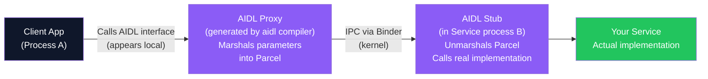

---

**Q2: What is ANR (Application Not Responding) and how do you prevent it?**

**Answer:**
ANR occurs when the main (UI) thread is blocked for more than:
- **5 seconds** for user input events (button tap waiting for response)
- **10 seconds** for BroadcastReceiver's `onReceive()` method

The OS shows "App not responding" dialog with options to Wait or Close App.

**Causes:**
- Network call on main thread
- File I/O on main thread  
- Long computation on main thread
- Waiting on a locked resource

**Prevention:**
- Move all I/O, network, heavy computation to background threads (Coroutines, WorkManager, ExecutorService)
- Use `StrictMode` during development — it detects main-thread violations
- Monitor ANR rate in Google Play Console
- Profile with Android Studio CPU Profiler

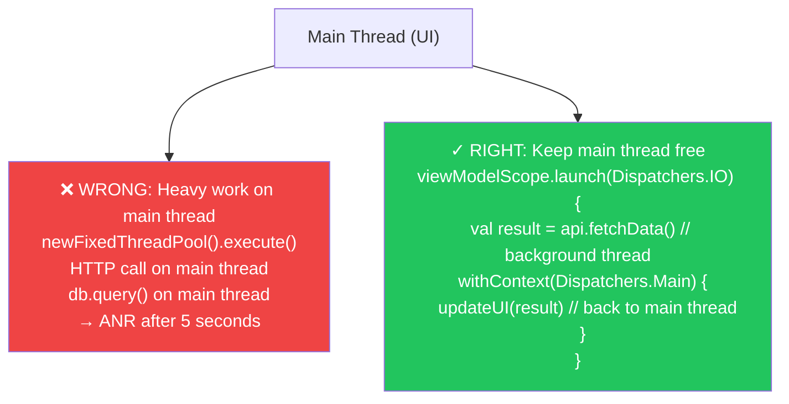

---

**Q3: What is the Looper/Handler/MessageQueue architecture in Android?**

**Answer:**
Android's threading model is built around the Looper pattern:

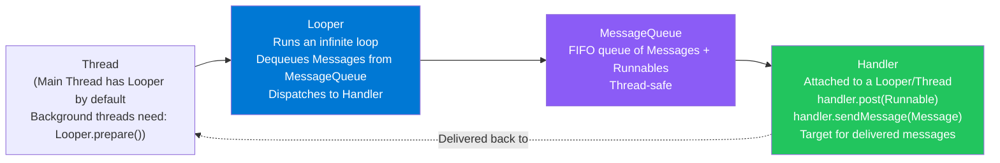

**Why it matters:**
- `Handler(Looper.getMainLooper()).post { /* runs on UI thread */ }` — the classic way to update UI from a background thread
- `HandlerThread` — a convenience class that sets up a background thread with its own Looper
- Kotlin Coroutines (`withContext(Dispatchers.Main)`) internally use this mechanism

---

**Q4: What is the difference between `Serializable` and `Parcelable` in Android?**

| | Serializable | Parcelable |
|---|---|---|
| **Source** | Java standard library | Android-specific |
| **How it works** | Reflection-based — auto-discovers all fields | Manual implementation — you write `writeToParcel` and CREATOR |
| **Performance** | Slow (uses reflection, creates many temp objects) | Fast (no reflection, optimized for Android IPC) |
| **Ease of use** | Just add `implements Serializable` — zero code | `@Parcelize` annotation (Kotlin Android Extensions) — very easy now |
| **Best for** | Persistent storage (files, database), Java compatibility | Passing data between Activities via Intent, IPC between processes |
| **GC pressure** | High (reflection creates many temporary objects) | Low (writes directly to Parcel buffer) |

**Modern recommendation:** Use `@Parcelize` annotation — Kotlin compiler generates Parcelable implementation automatically.

---

**Q5: What is the ViewHolder pattern in RecyclerView and why is it important?**

**Answer:**
RecyclerView displays potentially thousands of items, but only ~10-20 are visible at once. The ViewHolder pattern eliminates repeated calls to `findViewById()` — one of the most expensive operations in Android (traverses the view tree).

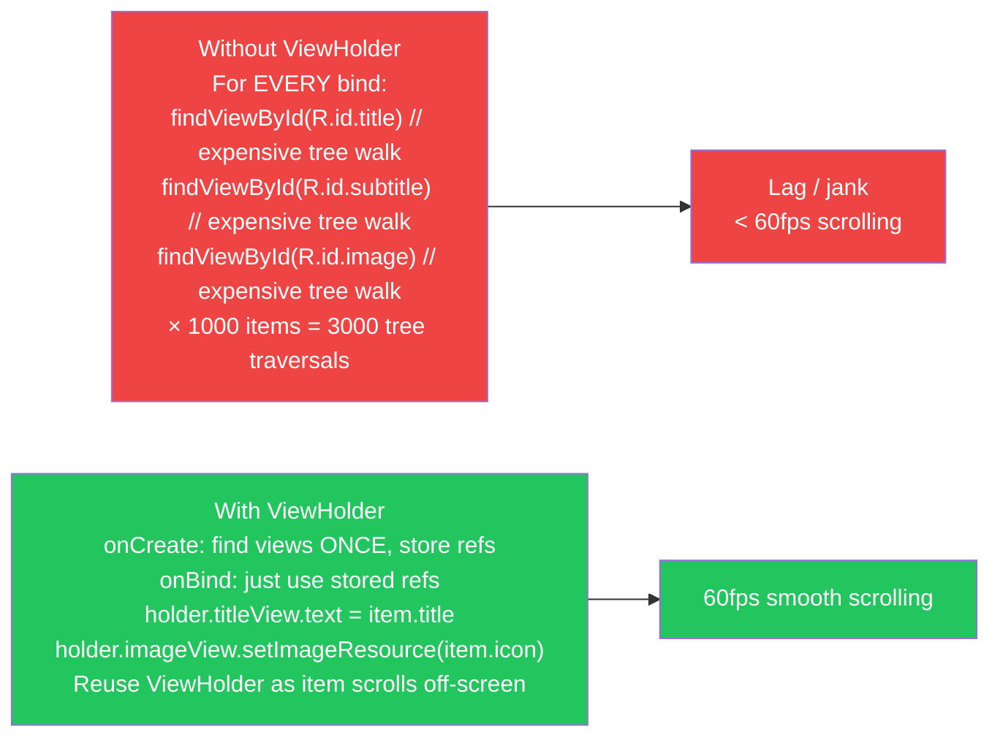

---

**Q6: What are the differences between `Activity`, `Fragment`, and `ViewModel` in Android?**

| | Activity | Fragment | ViewModel |
|---|---|---|---|
| **What is it** | A single focused user action; entry point for UI | Reusable UI component; nested inside Activity | Stores and manages UI-related data |
| **Owns** | UI lifecycle, window | Portion of UI within Activity | Data that should survive config changes |
| **Survives rotation** | No — recreated on rotation | No — recreated (unless retain state) | **Yes** — survives orientation change |
| **Has UI** | Yes | Yes | No — no UI; holds data and logic |
| **Use case** | Each screen or major entry point | Reusable UI sections (tabs, dialogs, lists) | Fetch/cache data; expose to Fragment/Activity |
| **Lifecycle** | `onCreate` → `onStart` → `onResume` → `onPause` → `onStop` → `onDestroy` | Mirrors Activity lifecycle + `onAttach`/`onDetach` | Created on first access; cleared on Activity/Fragment finish |

---

## 2. System Design HLD Q&A

### Data Centers & Servers

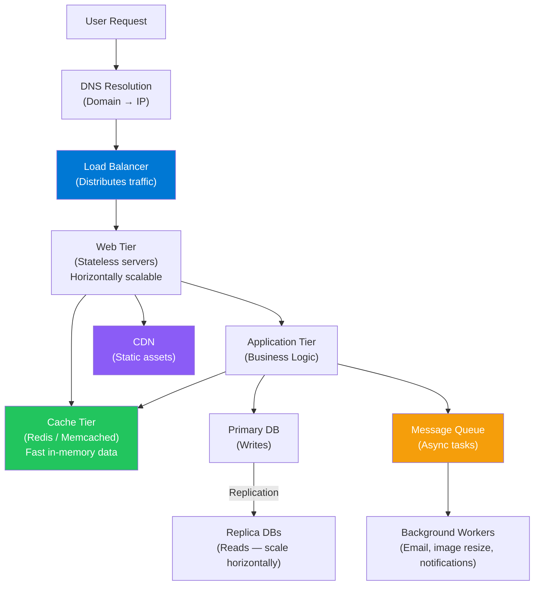

**Q7: Explain vertical scaling vs horizontal scaling.**

| | Vertical Scaling (Scale Up) | Horizontal Scaling (Scale Out) |
|---|---|---|
| **What** | Upgrade to bigger server (more CPU, RAM) | Add more servers |
| **Limit** | Physical hardware ceiling | Virtually unlimited |
| **Downtime** | Usually requires downtime | No downtime (rolling deploy) |
| **Cost** | Expensive at large scale | Commodity hardware |
| **Failure** | Single point of failure | Redundant — one server down = others serve |
| **Statefulness** | Easy — one box holds state | Hard — must externalize state (Redis, DB) |
| **Best for** | Databases (until sharding needed) | Web servers, API servers, workers |

---

**Q8: What is database sharding and when is it needed?**

**Answer:**
Sharding is horizontal partitioning of a database — distributing data across multiple database servers (shards), each holding a subset of the total data.

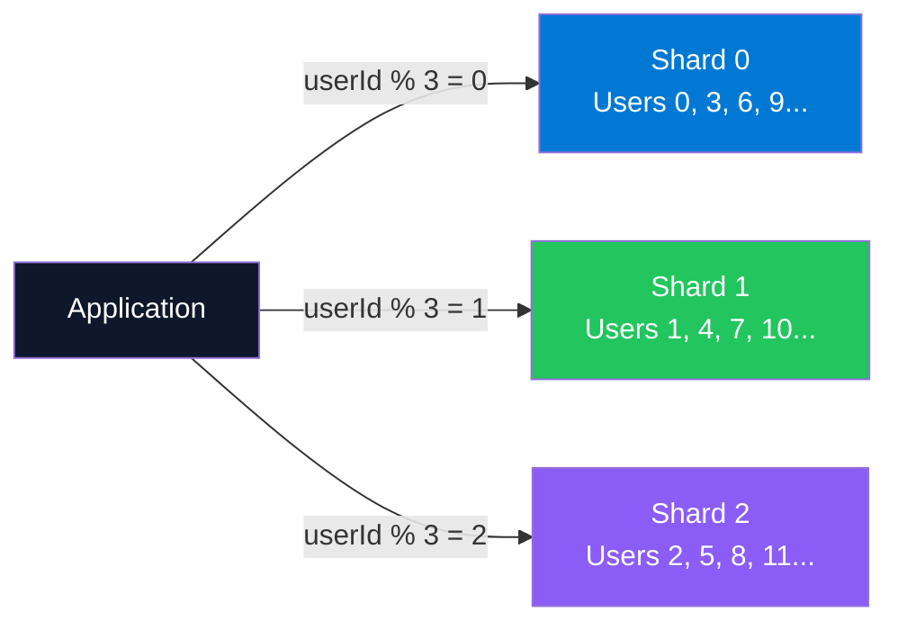

**Sharding strategies:**
- **Range-based**: users A-M on shard 1; N-Z on shard 2. Simple but may create "hot" shards.
- **Hash-based**: `hash(userId) % N`. Uniform distribution; hard to re-shard.
- **Directory-based**: Lookup table maps key → shard. Flexible; lookup table is a bottleneck.

**Challenges:** Cross-shard joins are complex; shard key must be chosen wisely; rebalancing shards requires data migration.

---

**Q9: What is the N+1 query problem and how is it resolved?**

**Answer:**
N+1 occurs when fetching a list of N items, then making one additional query per item to fetch related data — totaling N+1 queries.

Example: Fetch 100 posts (1 query), then for each post fetch its author (100 queries) = 101 queries instead of 2.

**Solutions:**
1. **Eager loading** (JOINs or DataLoader) — fetch posts and authors in 2 queries; join in application
2. **GraphQL DataLoader** — batches all author requests into one query per request cycle
3. **ORM include/join**: `db.posts.findMany({ include: { author: true } })` — generates efficient JOIN

---

**Q10: What is eventual consistency and when is it acceptable?**

**Answer:**
In distributed systems, **strong consistency** guarantees all nodes see the same data simultaneously after a write. **Eventual consistency** allows nodes to temporarily diverge — they will converge to the same state *eventually* (in seconds/milliseconds after replication).

**Eventual consistency is acceptable when:**
- Social feeds (seeing a post 1 second late is fine)
- Product reviews (review appearing after 5 seconds is acceptable)
- Profile updates (avatar change propagating with small delay is fine)

**Strong consistency is required when:**
- Bank account balance (you should never see a stale balance after a transfer)
- Inventory reservation (two users can't buy the last item simultaneously)
- Authentication token validation (must be valid/revoked in real-time)

---

**Q11: What is an ElasticSearch / ELK stack and when would you use it?**

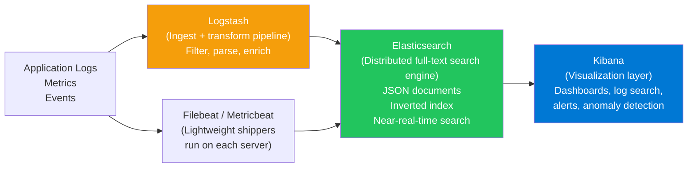

**When to use ElasticSearch:**
- Full-text search with relevance scoring (not possible with SQL LIKE)
- Log aggregation and analysis (ELK/EFK stack)
- Autocomplete / typeahead with fuzzy matching
- Analytics over large datasets in near-real-time

**When NOT to use ElasticSearch:**
- Primary database (no ACID transactions, no referential integrity)
- Simple CRUD — SQL is simpler
- Very small datasets — overhead not worth it

---

## 3. Frontend Architecture Patterns

**Q12: What is the key difference between MVVM and MVI?**

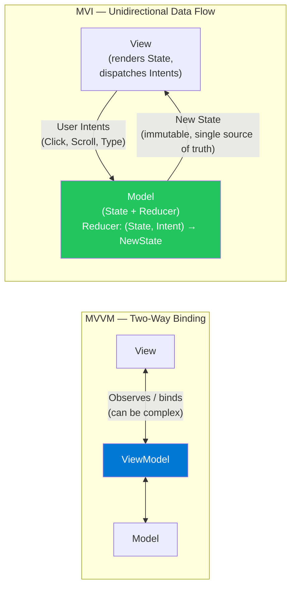

**Key difference:** MVVM allows ViewModel to modify View's state in multiple places (imperative updates). MVI enforces that all state changes go through a single Reducer function — making state transitions predictable and testable. MVI is essentially Redux for mobile.

---

**Q13: How does Clean Architecture enforce the Dependency Rule?**

**Answer:**

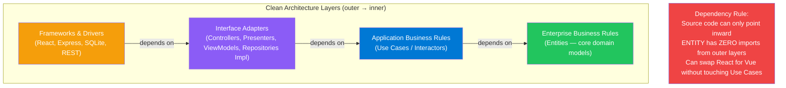

**In practice:** A `PlaceOrderUseCase` class imports only `OrderRepository` interface (defined in the same inner ring). The actual `SQLiteOrderRepository` implementation (outer ring) depends on that interface — not vice versa. You can swap SQLite for PostgreSQL without touching `PlaceOrderUseCase`.

---

**Q14: What is the Facade pattern and how is it used in frontend?**

**Answer:**
Facade provides a simplified interface to a complex subsystem. The caller doesn't need to know about all the moving parts inside.

**Frontend example:**
```typescript
// WITHOUT FACADE: caller must know internals
const response = await fetch('/api/users', {
  method: 'GET',
  headers: { 'Authorization': `Bearer ${getToken()}`, 'Content-Type': 'application/json' },
  signal: AbortSignal.timeout(5000)
})
if (!response.ok) { /* retry logic ... */ }
const data = await response.json()

// WITH FACADE: simple interface hiding complexity
const data = await apiClient.get<User[]>('/users')
// apiClient.get() internally handles: auth headers, retry, timeout, error handling, JSON parsing
```

The `apiClient` Facade hides `fetch`, token refresh, retry logic, error normalization — callers just call `.get()` / `.post()`.

---

## 4. TypeScript Advanced Q&A

**Q15: What is the difference between `unknown` and `any` in TypeScript?**

| | `any` | `unknown` |
|---|---|---|
| **Assignment** | Assignable to/from anything | Can receive any value, but can't be assigned without narrowing |
| **Operations** | No type checking — you can call any method | Must narrow type before use |
| **Safety** | Opt out of type system — unsafe | Safe — forces you to check the type first |
| **When to use** | Legacy JS migration, truly dynamic values (escape hatch) | API responses, user input — you get *something* but must handle all types |

```typescript
// any — unsafe, no errors (type checking disabled)
let x: any = "hello"
x.toFixed(2) // TypeScript is fine with this — runtime error!

// unknown — safe, must narrow before use
let y: unknown = "hello"
if (typeof y === "string") {
  y.toUpperCase() // OK — narrowed to string
}
y.toUpperCase() // Error: Object is of type 'unknown'
```

---

**Q16: What are TypeScript Generics and why are they useful?**

**Answer:**
Generics allow writing type-safe code that works with multiple types without losing type information.

```typescript
// Without generics — loses type info
function getFirst(arr: any[]): any {
  return arr[0]
}
const name = getFirst(["Alice", "Bob"]) // name is 'any' — no autocomplete, no safety

// With generics — type flows through
function getFirst<T>(arr: T[]): T {
  return arr[0]
}
const name = getFirst(["Alice", "Bob"]) // name is 'string' — type inference works!
const num = getFirst([1, 2, 3])         // num is 'number'

// Real-world: typed API response
async function fetchData<T>(url: string): Promise<T> {
  const response = await fetch(url)
  return response.json() as T
}
const users = await fetchData<User[]>('/api/users') // users is User[]
```

---

**Q17: What are TypeScript Decorators and where are they used?**

**Answer:**
Decorators are a stage-3 TC39 proposal (stable in TypeScript 5+) and experimental feature for adding metadata or transforming classes, methods, properties, or parameters.

```typescript
// Class decorator — adds logging to all method calls
function WithLogging(constructor: Function) {
  console.log(`Class ${constructor.name} instantiated`)
}

@WithLogging
class UserService {
  getUser(id: string) { /* ... */ }
}

// Method decorator — measures execution time
function Trace(target: any, key: string, descriptor: PropertyDescriptor) {
  const original = descriptor.value
  descriptor.value = async function(...args: any[]) {
    const start = Date.now()
    const result = await original.apply(this, args)
    console.log(`${key} took ${Date.now() - start}ms`)
    return result
  }
}
```

**Common usage:** NestJS (`@Controller`, `@Get`, `@Injectable`), Angular (`@Component`, `@Input`), TypeORM (`@Entity`, `@Column`), class-validator (`@IsEmail`, `@MinLength`).

---

**Q18: What is the difference between `interface` and `type` for defining function signatures?**

```typescript
// Both can define function types
interface Formatter {
  (value: string): string
}

type Formatter = (value: string) => string

// IMPORTANT DIFFERENCE: interface can be extended/merged
interface Animal {
  name: string
}
interface Animal {  // Declaration merging — adds to same interface
  age: number
}
// Animal now has both name and age

// type cannot be redeclared
type Animal = { name: string }
type Animal = { age: number } // Error: Duplicate identifier 'Animal'
```

**Rule of thumb:** Use `interface` for object shapes that may be extended (especially in library code). Use `type` for unions, intersections, computed types, and function types.

---

**Q19: What are TypeScript `keyof` and `typeof` operators?**

```typescript
// keyof — produces a union of all keys of a type
interface User {
  id: number
  name: string
  email: string
}
type UserKeys = keyof User // "id" | "name" | "email"

function getProperty<T, K extends keyof T>(obj: T, key: K): T[K] {
  return obj[key]
}
getProperty(user, "name")  // TypeScript knows return type is string
getProperty(user, "age")   // Error: "age" is not a key of User

// typeof — gets the type of a value (inferred from runtime value)
const defaultConfig = { theme: "dark", lang: "en", fontSize: 14 }
type Config = typeof defaultConfig
// Config is: { theme: string; lang: string; fontSize: number }
```

---

## 5. BFF Pattern Deep-Dive

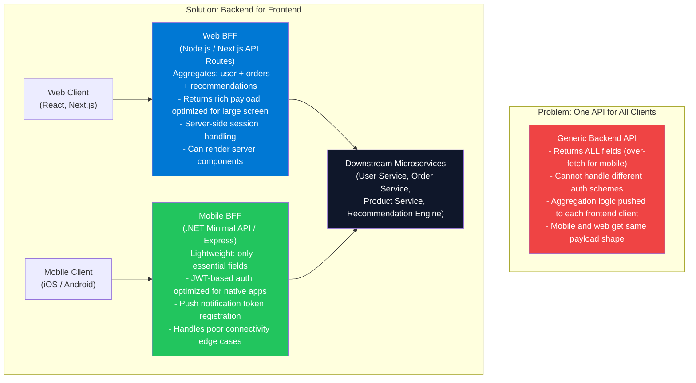

**Q20: What are the main responsibilities of a BFF?**

| Responsibility | Example |
|---|---|
| **Request aggregation** | Merge `/users/{id}` + `/orders?userId={id}` + `/recommendations/{userId}` into one response |
| **Response transformation** | Convert ISO date strings to user's local timezone; format prices to locale currency |
| **Authentication** | Handle OAuth token exchange; manage session cookies; inject auth headers to downstream calls |
| **Protocol translation** | Accept REST from client → call gRPC downstream services |
| **Client-specific optimization** | Mobile BFF compresses images; web BFF includes additional metadata for SEO |
| **Error handling** | Translate downstream errors to client-friendly messages; implement retry for downstream |
| **Rate limiting** | Protect downstream services from frontend load spikes |

---

## 6. RADIO Framework Worked Example

### Design: "Twitter/X-like News Feed"

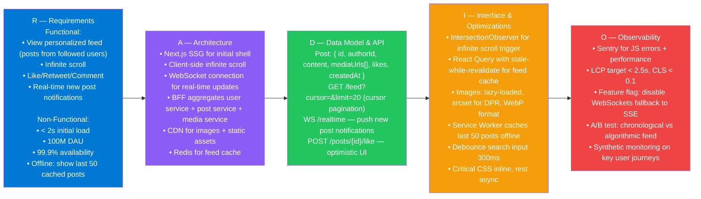

---

## 7. SOLID Principles Q&A

**Q21: Give a real frontend/mobile example of violating and fixing the Single Responsibility Principle.**

**Violation:**
```typescript
// GOD COMPONENT — does everything
const ProductPage = () => {
  const [products, setProducts] = useState([])
  const [loading, setLoading] = useState(false)
  const [user, setUser] = useState(null)

  useEffect(() => {
    fetch('/api/products').then(r => r.json()).then(setProducts)  // fetching
    fetch('/api/user').then(r => r.json()).then(setUser)           // fetching
  }, [])

  const formatPrice = (p) => `$${(p / 100).toFixed(2)}`           // formatting
  const validateAuth = () => user?.role === 'admin'                // auth logic
  const trackView = () => analytics.track('product_view')         // analytics

  return ( /* rendering */ )
}
```

**Fix:**
```typescript
// Separate responsibilities
const useProducts = () => { /* fetching only */ }
const useAuth = () => { /* auth only */ }
const formatPrice = (cents: number) => `$${(cents / 100).toFixed(2)}` // utility
const ProductCard = ({ product }) => { /* rendering only */ }
const ProductPage = () => { /* orchestrates, renders */ }
```

---

**Q22: What does the Open/Closed Principle look like in a TypeScript UI pattern?**

**Violation:** Adding a new chart type requires modifying existing code:
```typescript
function renderChart(type: string, data: any[]) {
  if (type === 'bar') { renderBarChart(data) }
  else if (type === 'line') { renderLineChart(data) }
  else if (type === 'pie') { /* add more if/else to ADD a new type */ }
}
```

**Fix:** Open for extension (add new type), closed for modification:
```typescript
interface Chart {
  render(data: any[]): JSX.Element
}

class BarChart implements Chart {
  render(data: any[]) { return <BarChartComponent data={data} /> }
}
class LineChart implements Chart {
  render(data: any[]) { return <LineChartComponent data={data} /> }
}
// To add PieChart: new class PieChart implements Chart — no existing code changes
class ChartFactory {
  static create(type: string): Chart { /* map type to class */ }
}
```

---

**Q23: Explain the Dependency Inversion Principle in an iOS/Android context.**

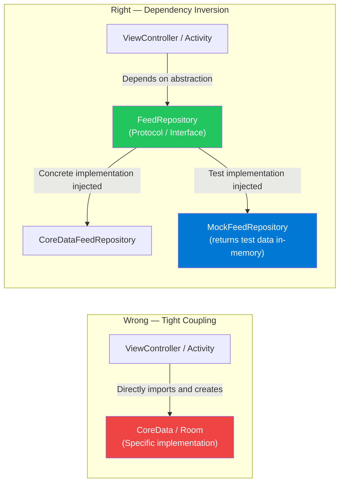

High-level modules (ViewController, ViewModel) define what they need via abstractions (protocols/interfaces). Low-level modules (CoreData, Room, network layer) implement those abstractions. The DI container wires them together at runtime.

---

## 8. Design Patterns Q&A

**Q24: What is the Observer pattern and how is it used in modern frameworks?**

**Answer:**
Observer defines a one-to-many relationship: when the Subject (Observable) state changes, all registered Observers are notified automatically.

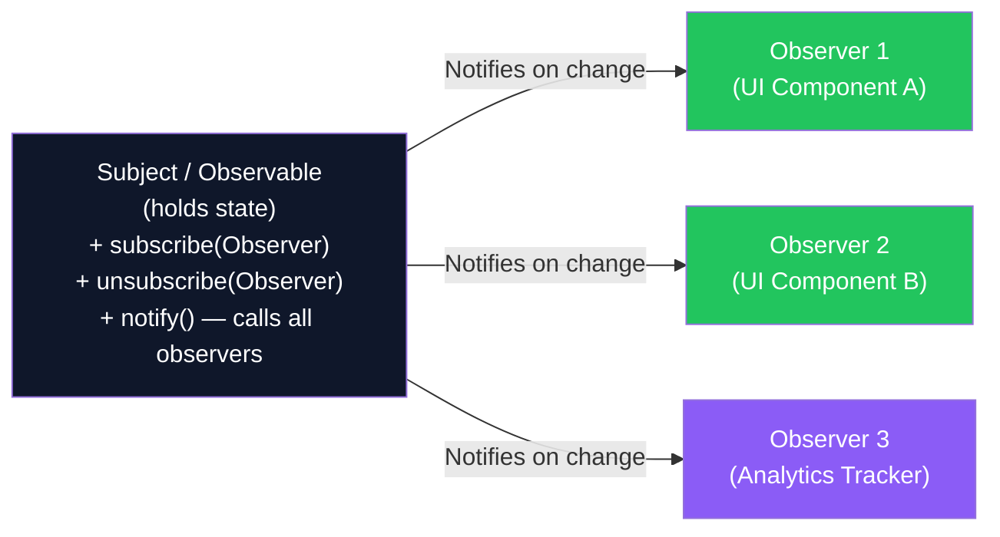

**Framework implementations:**
- React: `useState` (Zustand store) + component re-renders on state change
- SwiftUI: `@ObservableObject` + `@Published` properties
- Android: `LiveData.observe(lifecycleOwner, observer)`
- RxJS: `Observable.subscribe(observer)`
- DOM: `addEventListener('click', handler)`

---

**Q25: What is the Strategy pattern and when should you use it on the frontend?**

**Answer:**
Strategy defines a family of algorithms, encapsulates each one, and makes them interchangeable. The client selects the strategy at runtime.

```typescript
// Strategy interface
interface SortStrategy<T> {
  sort(items: T[]): T[]
}

// Concrete strategies
class PriceAscending implements SortStrategy<Product> {
  sort(items: Product[]) { return [...items].sort((a, b) => a.price - b.price) }
}
class RatingDescending implements SortStrategy<Product> {
  sort(items: Product[]) { return [...items].sort((a, b) => b.rating - a.rating) }
}
class Newest implements SortStrategy<Product> {
  sort(items: Product[]) { return [...items].sort((a, b) => b.createdAt - a.createdAt) }
}

// Context: user selects sort strategy
const productList = new ProductList(new PriceAscending()) // inject at runtime
productList.setStrategy(new RatingDescending()) // swap strategy without changing ProductList
```

---

**Q26: What is the Singleton pattern, when is it useful, and when is it an anti-pattern?**

**Answer:**

| | Appropriate Singleton | Anti-pattern Singleton |
|---|---|---|
| **Example** | Logger, Analytics, EventBus | NetworkManager, DataRepository |
| **Why OK** | True single instance needed (one logger per app) | Creates hidden global state — hard to test |
| **Why problematic for the bad example** | NetworkManager as singleton makes unit testing impossible (can't inject mock) | — |
| **Solution for anti-pattern** | Use DI container — inject `NetworkService` protocol, not a concrete singleton | — |

---

## 9. Observability & Monitoring

### Monitoring Stack

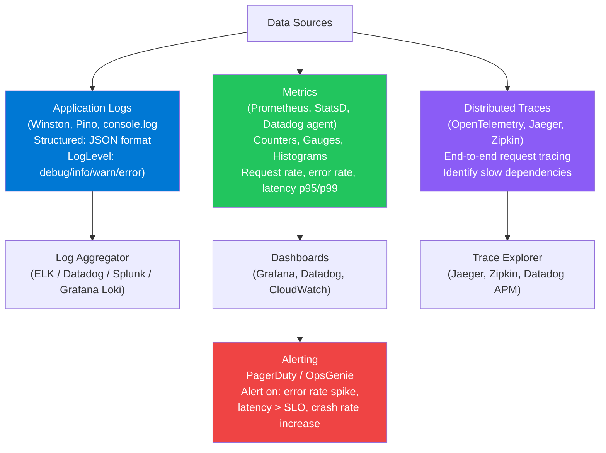

**Q27: What is the difference between logging, metrics, and traces?**

| | Logs | Metrics | Traces |
|---|---|---|---|
| **What** | Timestamped events with context | Numeric measurements over time | End-to-end path of a single request |
| **Format** | Text / JSON records | Number + labels (Prometheus format) | Spans with parent/child relationships |
| **Best for** | Debugging specific errors; audit trails | Alerting; dashboards; SLOs | Performance bottleneck identification; dependency mapping |
| **Cardinality** | High (every event) | Low-Medium (label combos) | High (one trace per request) |
| **Storage cost** | High | Low | Medium |

---

**Q28: What is an SLO (Service Level Objective)?**

**Answer:**
An SLO is a target measurement for a service's reliability:
- **SLA** (Service Level Agreement) — contractual commitment to customers
- **SLO** (Service Level Objective) — internal target that's stricter than SLA
- **SLI** (Service Level Indicator) — the actual measured metric

Example:
- SLA: 99.9% uptime (8.7 hours downtime/year permitted — if breached, refund customers)
- SLO: 99.95% uptime (target to stay well within SLA)
- SLI: `successful_requests / total_requests` measured over 30 days

**Error Budget:** Time (or request percentage) you can afford to be below SLO before breaching SLA. If SLO = 99.95%, error budget = 0.05% = ~26 minutes/month. Burn through the error budget = no more risky deployments until next month.

---

## 10. Security Q&A

**Q29: What is XSS (Cross-Site Scripting) and how do you prevent it?**

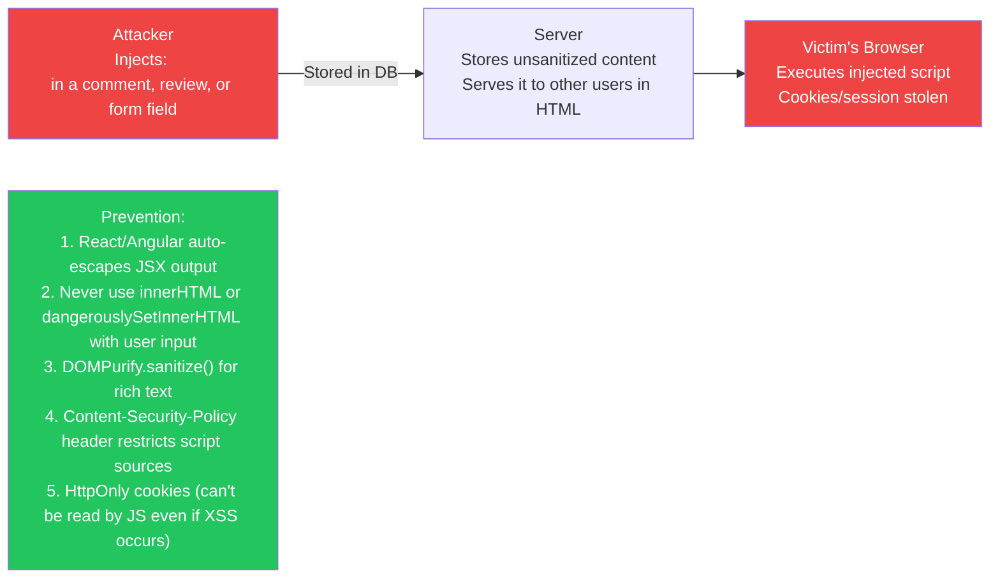

---

**Q30: What is CSRF (Cross-Site Request Forgery) and how is it prevented?**

**Answer:**
CSRF tricks a logged-in user's browser into making an unintended request to your server (because the browser automatically sends cookies).

**Example attack:**
1. User is logged into bank.com (session cookie is active)
2. User visits evil.com — malicious page has `` 
3. Browser fetches that URL with the user's bank.com cookies — transfer executed!

**Prevention:**
- **`SameSite=Strict` or `SameSite=Lax` cookies** — browser won't send cookies on cross-site requests
- **CSRF Token** — hidden form field with a random token; server validates it matches the session token
- **Double Submit Cookie** — JS reads a non-HttpOnly cookie and submits it as a header; cross-site JS can't read cookies

**Modern standard:** `SameSite=Lax` cookies (default in modern browsers) + CSRF token for sensitive mutations (bank transfers, password change).
