# Description Questions 2 — Complete Interview Guide (.NET)

---

## Table of Contents

1. [Android Development Concepts](#1-android-development-concepts)
2. [Frontend Architecture Patterns](#2-frontend-architecture-patterns)
3. [API Communication Patterns](#3-api-communication-patterns)
4. [UI Concepts & Performance](#4-ui-concepts--performance)
5. [Security for Frontend](#5-security-for-frontend)
6. [HLD Fundamentals](#6-hld-fundamentals)
7. [Database Concepts](#7-database-concepts)
8. [Caching](#8-caching)
9. [Load Balancers & Rate Limiting](#9-load-balancers--rate-limiting)
10. [Networking](#10-networking)
11. [Microservices vs Monolith](#11-microservices-vs-monolith)
12. [Message Queues](#12-message-queues)
13. [Retry Policies & API Evolution](#13-retry-policies--api-evolution)
14. [Testing](#14-testing)
15. [General Concepts](#15-general-concepts)
16. [Cross-Cutting Themes](#16-cross-cutting-themes)

---

## 1. Android Development Concepts

### Overview
Android is a Linux-based mobile OS. Its component model (Activity, Service, BroadcastReceiver, ContentProvider) and threading rules (main thread for UI only) are central interview topics. Mastering lifecycle, IPC (AIDL), and memory management separates senior candidates.

### Memory Leaks — Android, iOS, and UI Applications

**Root causes:** holding references to Context/Activity after it is destroyed, static fields, uncancelled callbacks, Handler messages, inner classes.

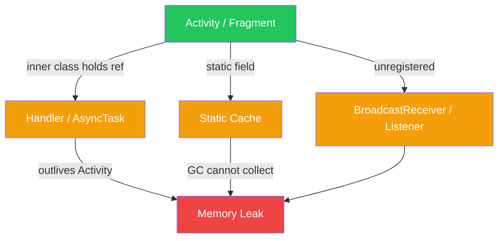

**Fixes:**
- Use `WeakReference<Context>` for background workers.
- Call `unregisterReceiver()` in `onStop/onDestroy`.
- Prefer `ViewModelScope` / `lifecycleScope` (auto-cancelled coroutines).
- Use LeakCanary for detection.

### BroadcastReceiver

A component that responds to system-wide or app broadcast intents. Can be static (manifest) or dynamic (registered in code).

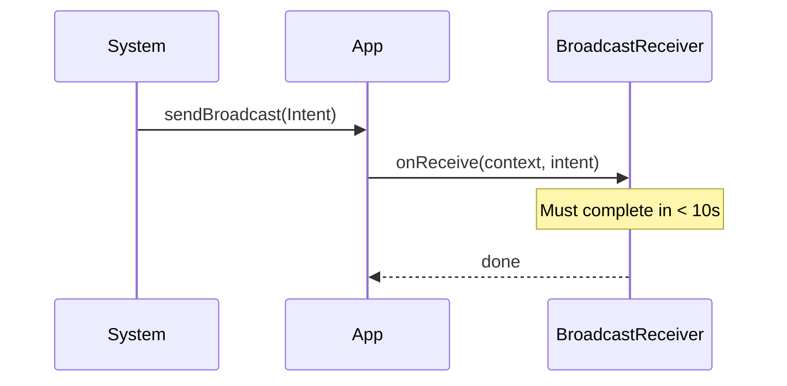

| Question | Answer |
|---|---|
| Static vs dynamic receiver? | Static = manifest, always active; Dynamic = registered in code, lifecycle-bound |
| Can a receiver start a long task? | No — `onReceive` runs on main thread, max ~10s; use `goAsync()` or start a Service |
| Ordered vs normal broadcast? | Ordered: receivers get it in priority order, can abort; Normal: delivered to all simultaneously |
| Security concern? | Use `LocalBroadcastManager` or permission restrictions to prevent external apps from sending |
| Difference from Service? | Receiver is event-driven and short-lived; Service runs in background for longer operations |

### Service vs IntentService

| Aspect | Service | IntentService |
|---|---|---|
| Thread | Main thread (must manage own) | Dedicated worker thread |
| Queue | No built-in queue | Queues intents sequentially |
| Lifecycle | Runs until stopped | Stops itself after last intent |
| Use case | Music player, ongoing tasks | One-shot background work |

### AIDL (Android Interface Definition Language)

AIDL enables IPC between processes. It generates a `Binder` stub/proxy pair allowing a client app to call methods in a remote service as if they were local.


### Fragment vs Activity

| Aspect | Activity | Fragment |
|---|---|---|
| Lifecycle | Independent | Tied to host Activity |
| Reuse | Not reusable | Reusable across Activities |
| Back stack | Activity back stack | Fragment manager back stack |
| Communication | Intents | ViewModel / interface callbacks |

### Looper, Handler, MessageQueue

Android's threading model: each thread can have a `Looper` that runs a `MessageQueue`. The main thread has one by default.

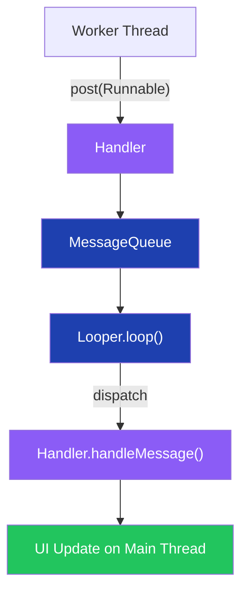

### Android NDK (Native Development Kit)

Allows writing performance-critical code in C/C++ and calling it from Java/Kotlin via JNI. Used for game engines, signal processing, and crypto.

### SQLite in Android

Lightweight relational DB bundled with Android. Accessed via `SQLiteOpenHelper`. Modern approach uses **Room** (an ORM abstraction over SQLite).

### Serializable vs Parcelable

| Aspect | Serializable | Parcelable |
|---|---|---|
| Implementation | Java reflection (automatic) | Manual `writeToParcel` |
| Performance | Slower (reflection overhead) | 10x faster |
| Use case | Simple/legacy | Passing objects between Activities |

### View vs ViewGroup

- **View**: Leaf UI element (Button, TextView, ImageView).
- **ViewGroup**: Container that holds other Views (LinearLayout, ConstraintLayout).

### ViewModel vs LiveData

- **ViewModel**: Survives configuration changes (rotation). Holds UI state.
- **LiveData**: Observable data holder. Notifies active observers (lifecycle-aware). No memory leak risk.

---

## 2. Frontend Architecture Patterns

### Overview
Frontend architecture defines how UI code is organized for testability, scalability, and maintainability. Patterns range from the foundational MVC to mobile-specific VIPER and modern feature-based Vertical Slices.

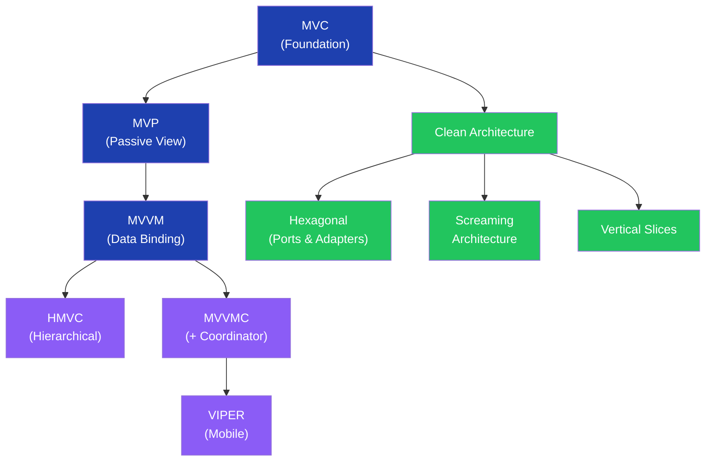

### MVC (Model-View-Controller)

Separates data (Model), UI (View), and coordination (Controller). Problem: "fat controller" as logic accumulates.

```
Web MVC Mapping:
  Model      → Redux / Vuex / Pinia (data store)
  View       → React / Vue Components (UI)
  Controller → Hooks / Composables
```

### MVP (Model-View-Presenter)

Presenter handles all logic; View is a passive interface. Improves testability because Presenter has no Android/DOM dependencies.

### MVVM (Model-View-ViewModel)

ViewModel exposes observable state; View binds to it. Two-way data binding reduces boilerplate.


### HMVC (Hierarchical MVC)

Breaks large apps into self-contained MVC units that can call each other. Each feature module has its own Model/View/Controller.

### MVVMC (+ Coordinator)

Adds a Coordinator layer to MVVM to manage navigation and screen transitions, keeping ViewModel navigation-free.

### VIPER

**V**iew · **I**nteractor · **P**resenter · **E**ntity · **R**outer — each has a single responsibility. Primarily iOS/mobile.

| Component | Responsibility |
|---|---|
| View | Display only, delegates to Presenter |
| Interactor | Business logic, data fetching |
| Presenter | Formats data for View |
| Entity | Plain data models |
| Router | Navigation between screens |

### Clean Architecture

Concentric layers with dependencies pointing inward. Core business logic knows nothing about frameworks or databases.

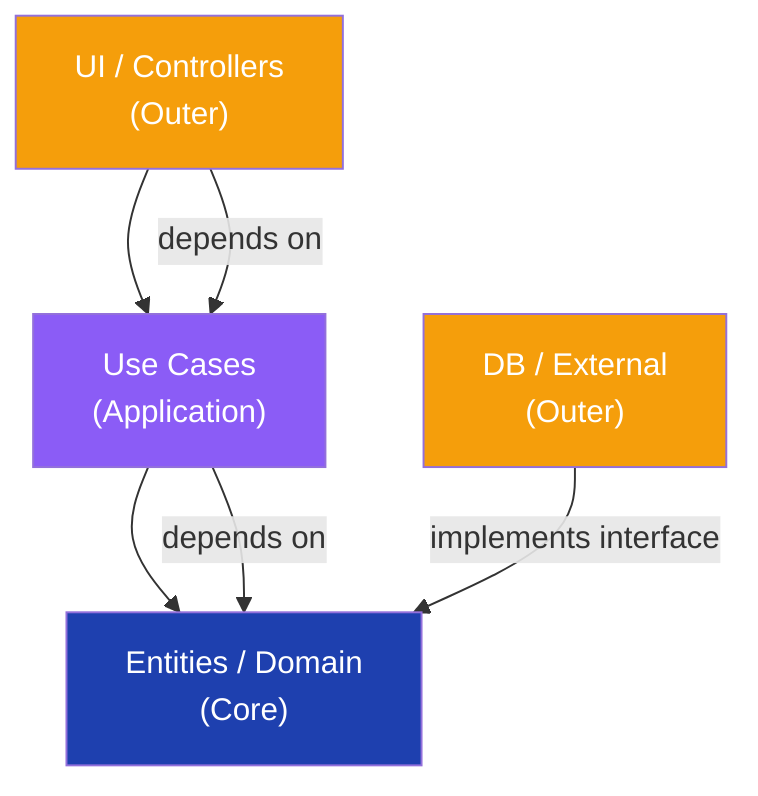

### Hexagonal Architecture (Ports & Adapters)

Core domain defines Ports (interfaces). Adapters implement them (REST, DB, Kafka). Makes the core fully testable without infrastructure.

### Screaming Architecture

Folder structure screams business domain, not technical layers. `/Orders/`, `/Payments/` not `/Controllers/`, `/Repositories/`.

### Vertical Slices

Each feature is a self-contained slice: own handler, query, command, UI. No shared layers that couple unrelated features.

| Question | Answer |
|---|---|
| MVC vs MVP key difference? | MVP: View is a passive interface; Presenter tested without UI framework |
| When to use VIPER? | Complex mobile apps needing strict separation; overkill for small screens |
| Clean Architecture's Dependency Rule? | Source code dependencies only point inward; outer layers depend on inner |
| Vertical Slices vs Clean Architecture? | Slices organize by feature; Clean by layers — they can be combined |
| Fat Controller problem? | Too much logic in Controller; fix by moving to Service/Use Case layer |

---

## 3. API Communication Patterns

### Overview
Modern apps use a mix of REST, GraphQL, gRPC, WebSockets, and SSE depending on communication style (request/response vs streaming), payload efficiency, and tooling.

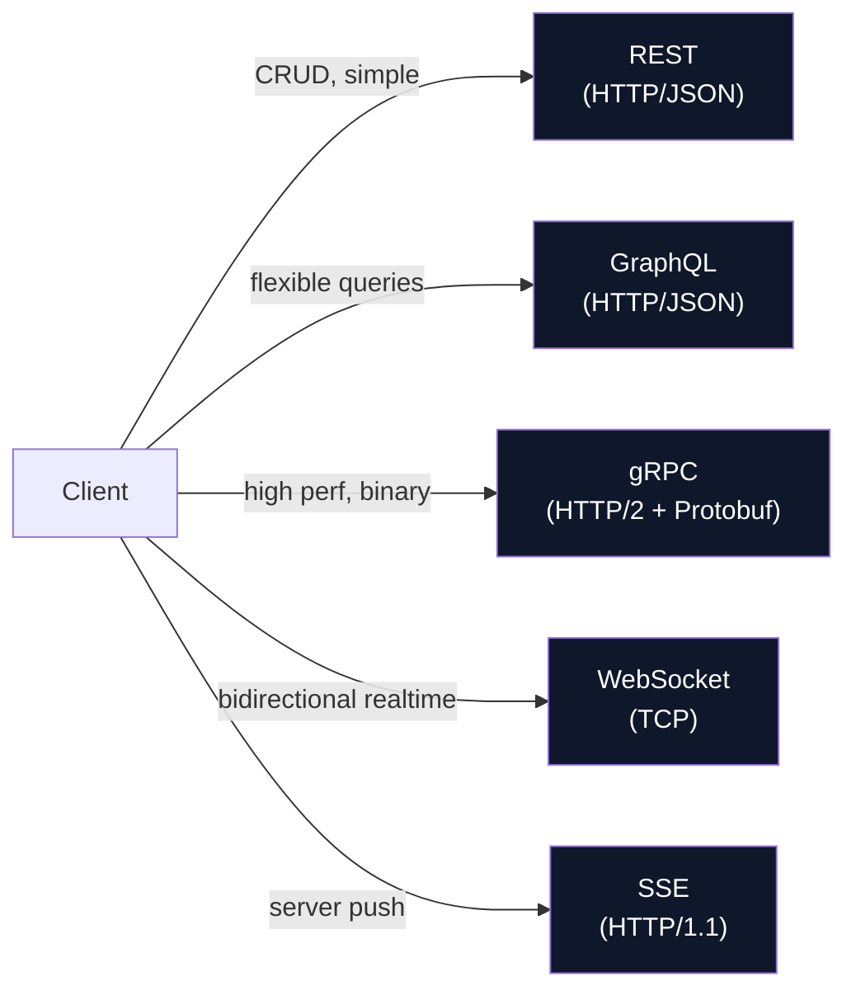

### REST vs GraphQL vs gRPC

| Aspect | REST | GraphQL | gRPC |
|---|---|---|---|
| Protocol | HTTP/1.1+ | HTTP/1.1+ | HTTP/2 |
| Payload | JSON | JSON | Protobuf (binary) |
| Fetching | Fixed endpoints | Query exactly what you need | Defined in `.proto` |
| Over/Under-fetch | Yes | No | No |
| Streaming | No (polling) | Subscriptions | Bidirectional streaming |
| Use case | Public APIs | Complex UIs (news feed) | Internal microservices |

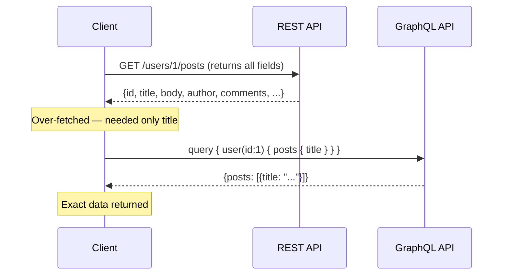

### HTTP/1.1 vs HTTP/2

| Feature | HTTP/1.1 | HTTP/2 |
|---|---|---|
| Multiplexing | No (one request per connection) | Yes (multiple streams) |
| Header compression | No | HPACK compression |
| Server push | No | Yes |
| Binary framing | No (text) | Yes |
| Head-of-line blocking | Yes | Solved at HTTP layer |

### WebSockets vs Webhooks

| Aspect | WebSocket | Webhook |
|---|---|---|
| Direction | Bidirectional | Server → Client (push) |
| Connection | Persistent TCP | One HTTP POST per event |
| Use case | Chat, live games | GitHub events, payment callbacks |
| Client initiated? | Yes | No (server pushes) |

### Server-Sent Events (SSE)

One-way server-to-client streaming over HTTP. Simpler than WebSockets for push-only use cases (live scores, notifications).

```csharp
// ASP.NET Core SSE endpoint
app.MapGet("/events", async (HttpContext ctx, CancellationToken ct) =>
{
    ctx.Response.Headers["Content-Type"] = "text/event-stream";
    ctx.Response.Headers["Cache-Control"] = "no-cache";

    while (!ct.IsCancellationRequested)
    {
        await ctx.Response.WriteAsync($"data: {DateTime.UtcNow}\n\n", ct);
        await ctx.Response.Body.FlushAsync(ct);
        await Task.Delay(1000, ct);
    }
});
```

### Polling vs Long-Polling

| Technique | How | Trade-off |
|---|---|---|
| Polling | Client asks every N seconds | Simple; wastes bandwidth |
| Long-Polling | Server holds request until data available | Fewer requests; complex server |
| SSE | Server streams events | Efficient; one-directional only |
| WebSocket | Full-duplex persistent | Best for chat; stateful |

| Question | Answer |
|---|---|
| When GraphQL over REST? | Multiple resource types on one screen; mobile bandwidth-sensitive apps |
| gRPC vs REST for microservices? | gRPC: typed contracts, binary efficiency, streaming; REST: human-readable, broad tooling |
| SSE vs WebSocket? | SSE for server-push only; WebSocket for bidirectional communication |
| HTTP/2 multiplexing benefit? | Eliminates head-of-line blocking; reduces latency on multiple parallel requests |
| WebSocket connection limit? | Stateful; harder to load-balance; use sticky sessions or pub/sub broker |

---

## 4. UI Concepts & Performance

### Overview
Modern UI engineering demands efficient data loading (pagination, infinite scroll), responsiveness (debouncing, throttling), and scalable code organization (MFE, module federation, BFF).

### Infinite Scroll vs Pagination

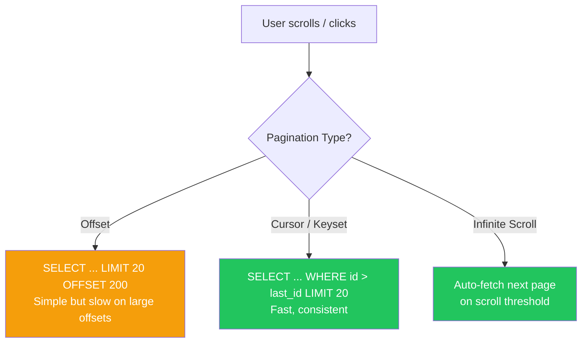

**Offset-based:** Simple SQL `LIMIT/OFFSET`. Problem: slow on deep pages (DB must scan skipped rows) and inconsistent if rows are inserted/deleted.

**Cursor/Keyset-based:** Uses a stable column (e.g. `id` or `created_at`) as cursor. Consistent and O(log n) with an index.

### Debouncing vs Throttling

| Concept | Behaviour | Use Case |
|---|---|---|
| **Debouncing** | Fire after N ms of inactivity | Search-as-you-type autocomplete |
| **Throttling** | Fire at most once every N ms | Window resize, scroll events |

```csharp
// Debounce in .NET (RxNET / System.Reactive)
Observable.FromEventPattern<string>(searchBox, "TextChanged")
    .Select(e => e.EventArgs)
    .Debounce(TimeSpan.FromMilliseconds(300))
    .Subscribe(query => SearchApi(query));
```

### Tree Shaking

Dead code elimination at bundle time. Bundlers (webpack, Rollup, esbuild) statically analyse ES module imports and drop unused exports. Requires ES modules (not CommonJS).

### MFE (Micro Frontend)

Extends microservice thinking to the frontend. Each team owns an independently deployable UI slice.

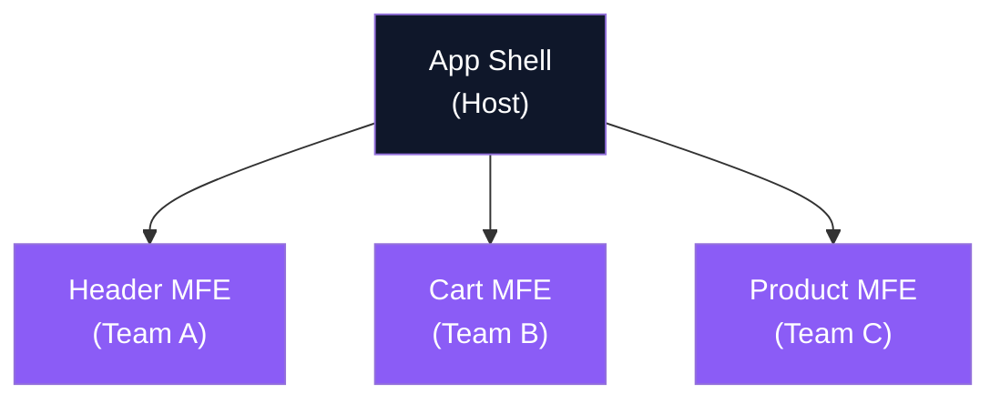

### Module Federation (Webpack 5)

Allows multiple independent webpack builds to share code at runtime. A host app dynamically loads remote modules without bundling them at build time.

### BFF (Backend For Frontend)

A dedicated backend layer tailored to a specific frontend client (mobile vs web). Aggregates multiple microservice calls and returns the exact shape the UI needs.

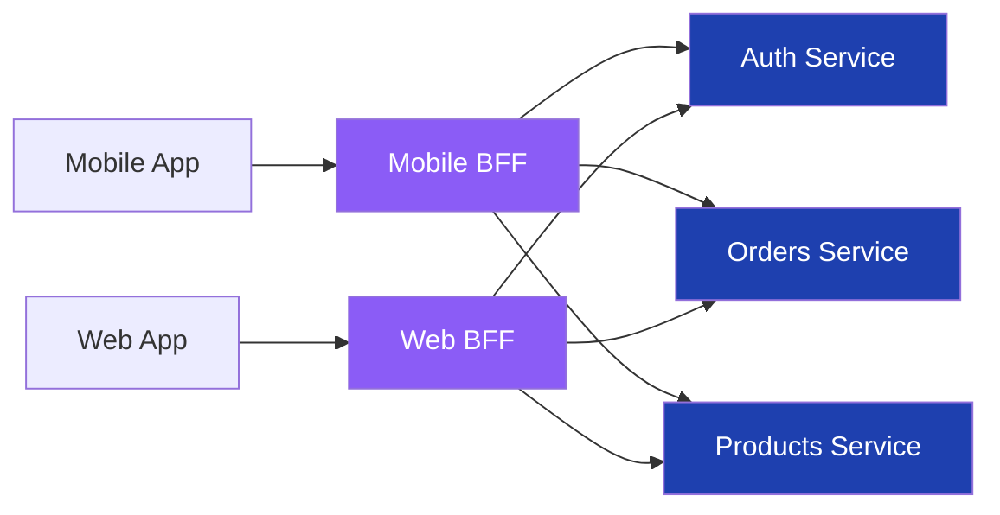

### Virtualization (Windowing)

Render only the visible list items in the DOM. Libraries: `react-window`, `@angular/cdk/scrolling`. Critical for lists of 10k+ items.

| Question | Answer |
|---|---|
| Cursor vs offset pagination? | Cursor: stable and O(log n); Offset: simple but O(n) scan, breaks under concurrent inserts |
| Debounce vs throttle for scroll? | Throttle — you want periodic updates, not silence until scrolling stops |
| Tree shaking prerequisite? | ES module syntax (`import/export`); CommonJS (`require`) prevents static analysis |
| MFE communication pattern? | Custom events, shared state via URL, or pub/sub (EventBus) — avoid tight coupling |
| BFF trade-off? | Extra network hop; gains: tailored responses, reduced over-fetch, client-specific auth |

---

## 5. Security for Frontend

### Overview
Frontend security spans network-layer threats (MITM, DDOS), injection attacks (XSS), policy controls (CORS, CSP), and authentication. A single XSS vulnerability can expose all user sessions.

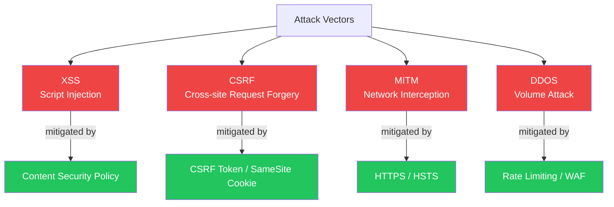

### XSS (Cross-Site Scripting)

Attacker injects malicious scripts that execute in the victim's browser. Types: Reflected, Stored, DOM-based.

**Prevention:**
- Sanitise and escape all user input before rendering.
- Set `Content-Security-Policy` header.
- Use `HttpOnly` cookies (JS cannot access).
- Avoid `innerHTML`; use `textContent`.

### CORS (Cross-Origin Resource Sharing)

Browser security policy that blocks cross-origin requests unless the server explicitly allows them via response headers.

```csharp
// ASP.NET Core CORS
builder.Services.AddCors(o => o.AddPolicy("AllowFrontend", p =>
    p.WithOrigins("https://myapp.com")
     .AllowAnyMethod()
     .AllowAnyHeader()));

app.UseCors("AllowFrontend");
```

### CSP (Content Security Policy)

HTTP response header that declares approved sources for scripts, styles, images, etc. Blocks inline scripts and untrusted origins.

```
Content-Security-Policy: default-src 'self'; script-src 'self' https://cdn.trusted.com; object-src 'none'
```

### DDOS (Distributed Denial of Service)

Overwhelm a server with traffic. **Mitigations:** CDN with edge filtering (Cloudflare), rate limiting, WAF (Web Application Firewall), auto-scaling.

### Authentication & Authorization

| Concept | Description |
|---|---|
| Authentication | Verify identity (who are you?) |
| Authorization | Verify permissions (what can you do?) |
| JWT | Stateless token; carries claims; verify with secret/public key |
| OAuth 2.0 | Delegated authorization framework |
| OIDC | Authentication layer on top of OAuth 2.0 |

```csharp
// ASP.NET Core JWT Authentication
builder.Services.AddAuthentication(JwtBearerDefaults.AuthenticationScheme)
    .AddJwtBearer(o =>
    {
        o.TokenValidationParameters = new TokenValidationParameters
        {
            ValidateIssuer = true,
            ValidateAudience = true,
            ValidateLifetime = true,
            ValidIssuer = "https://auth.myapp.com",
            ValidAudience = "myapp-api",
            IssuerSigningKey = new SymmetricSecurityKey(Encoding.UTF8.GetBytes(secret))
        };
    });
```

### Performance & Optimization

| Technique | Description |
|---|---|
| Asset optimization | Minify JS/CSS, compress images (WebP), lazy load |
| CDN | Serve static assets from edge nodes near users |
| SSR | Render HTML on server; faster FCP, better SEO |
| Service Worker | Cache assets/API responses offline; background sync |
| Web Vitals | LCP, FID/INP, CLS — Google's Core Web Vitals metrics |
| Perceived performance | Skeleton screens, optimistic UI, progressive loading |

| Question | Answer |
|---|---|
| Stored vs Reflected XSS? | Stored: persists in DB, affects all visitors; Reflected: in URL, affects one request |
| Why HttpOnly cookie? | JS cannot read it — prevents token theft via XSS |
| CORS preflight? | Browser sends OPTIONS first for non-simple requests; server must respond with Allow headers |
| CSP `unsafe-inline` risk? | Defeats CSP's XSS protection — never use in production |
| SameSite cookie attribute? | `Strict/Lax` prevents CSRF by blocking cross-site cookie sends |

---

## 6. HLD Fundamentals

### Overview
High-Level Design (HLD) covers system topology without implementation code. Interviewers evaluate your ability to decompose requirements into servers, storage, networking, and scaling decisions.

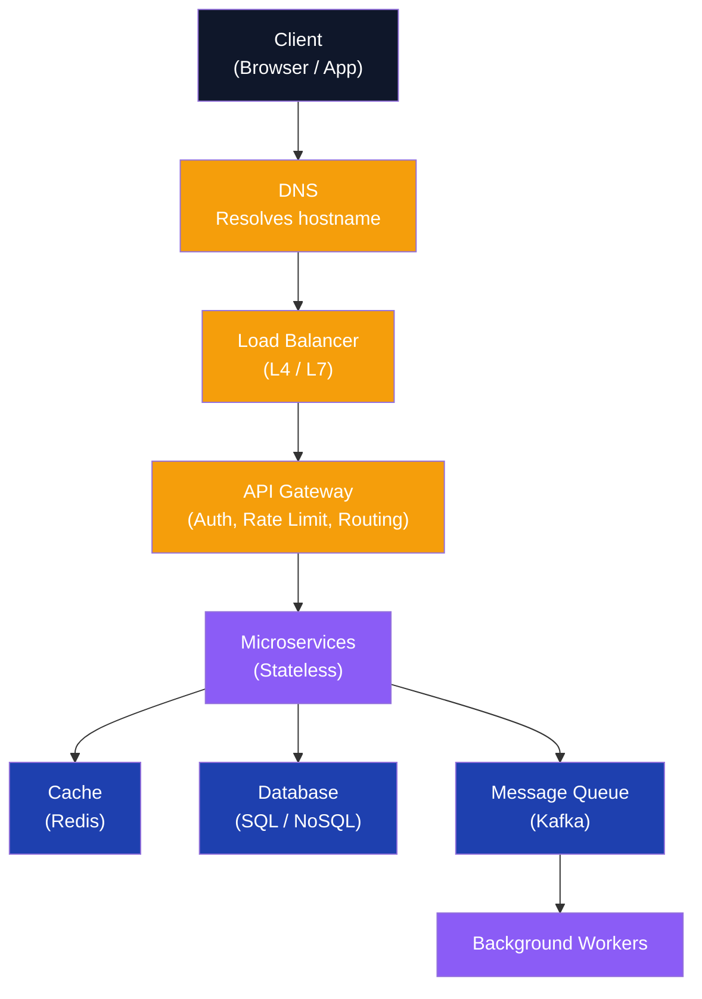

### DNS (Domain Name System)

Resolves human-readable hostnames to IP addresses. Hierarchy: Root → TLD (`.com`) → Authoritative nameserver → A/CNAME record.

**TTL:** Lower TTL = faster propagation of changes; higher TTL = fewer DNS queries (better performance).

### Proxy vs Reverse Proxy

| Type | Direction | Use Case |
|---|---|---|
| Forward Proxy | Client → Internet | Anonymity, content filtering |
| Reverse Proxy | Internet → Servers | Load balancing, SSL termination, caching |

**Examples:** Nginx, HAProxy (reverse proxy). YARP (.NET reverse proxy toolkit).

### Serverless

Functions-as-a-Service (FaaS). Code runs on demand; no server management. Examples: Azure Functions, AWS Lambda.

**Trade-offs:** Cold start latency; no persistent state; great for event-driven, infrequent workloads.

### API Gateway

Single entry point for all client requests. Handles: routing, authentication, rate limiting, request transformation, SSL termination, logging.

**Examples:** Azure API Management, AWS API Gateway, Kong.

### Tier Architecture

| Tier | 2-Tier | 3-Tier | N-Tier |
|---|---|---|---|
| Layers | Client + DB | Client + App Server + DB | Many layers (presentation, business, data, cache) |
| Use | Simple apps | Most web apps | Enterprise systems |

### Horizontal vs Vertical Scaling

| Aspect | Vertical (Scale Up) | Horizontal (Scale Out) |
|---|---|---|
| Method | Bigger machine (more CPU/RAM) | More machines |
| Limit | Physical hardware ceiling | Near-infinite |
| Cost | Expensive | Commodity hardware |
| Fault tolerance | Single point of failure | Redundant |
| Stateful apps | Easier | Requires session sharing (sticky sessions / Redis) |

| Question | Answer |
|---|---|
| DNS TTL trade-off? | Low TTL = fast failover, more DNS traffic; High TTL = better caching, slow failover |
| API Gateway vs Load Balancer? | LB distributes traffic; API GW adds auth/rate-limit/transform/routing intelligence |
| Serverless cold start? | First invocation spins up container — latency spike; use provisioned concurrency for latency-sensitive paths |
| When vertical scaling fails? | Hardware limit reached; cost-prohibitive; no redundancy — switch to horizontal |
| Reverse proxy benefits? | Hides internal topology, SSL termination, caching, A/B routing |

---

## 7. Database Concepts

### Overview
Database design decisions — SQL vs NoSQL, indexing, sharding, replication — determine system scalability and consistency characteristics. The CAP theorem frames all distributed database trade-offs.

### CAP Theorem

A distributed system can guarantee only **two of three**: Consistency, Availability, Partition Tolerance. Since network partitions are unavoidable, you choose CP or AP.

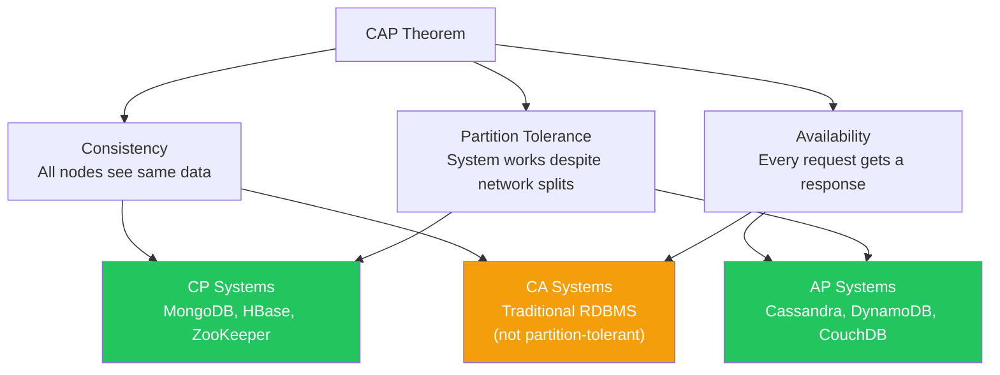

### Indexes

Indexes speed up reads at the cost of write overhead and storage.

| Type | Description | Use Case |
|---|---|---|
| B-Tree | Default; supports range queries | Most queries |
| Hash | Exact match only | Equality lookups |
| Composite | Multi-column | Queries filtering on multiple columns |
| Covering | Index includes all query columns | Avoid table scan |
| Full-text | Word tokenisation | Search by keyword |

### Data Replication

Copies data across nodes for fault tolerance and read scaling.

| Strategy | Description |
|---|---|
| Master-Slave (Primary-Replica) | Writes go to primary; replicas serve reads |
| Multi-Master | Multiple write nodes; conflict resolution needed |
| Synchronous | Primary waits for replica ACK — strong consistency, slower writes |
| Asynchronous | Primary doesn't wait — faster writes, possible data loss on failover |

### Sharding (Horizontal Partitioning)

Split a large table across multiple DB nodes. Each shard holds a subset of rows.

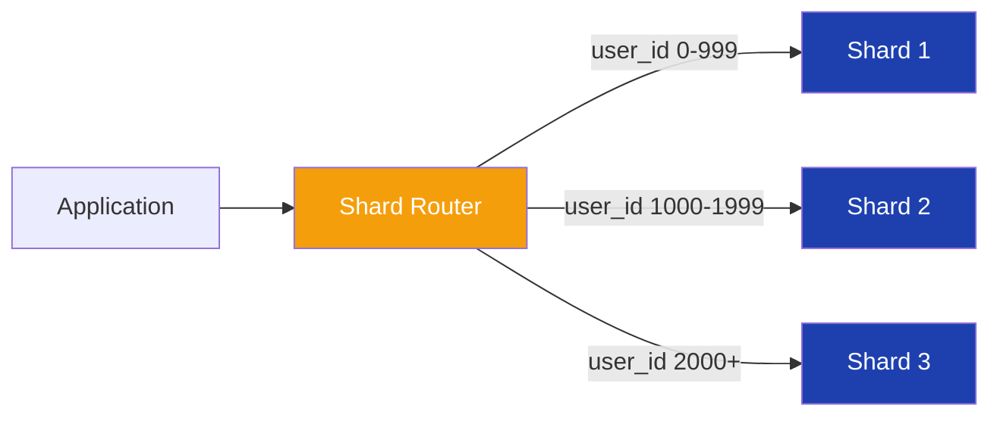

**Shard key choice is critical** — poor key causes hot spots (one shard overwhelmed).

### SQL vs NoSQL

| Aspect | SQL (RDBMS) | NoSQL |
|---|---|---|
| Schema | Fixed, enforced | Flexible, schema-less |
| ACID | Yes | Eventual consistency (usually) |
| Joins | Yes | No (denormalise data) |
| Scaling | Vertical (primarily) | Horizontal |
| Examples | PostgreSQL, MySQL, SQL Server | MongoDB, Cassandra, DynamoDB, Redis |
| Use case | Transactions, reporting | High write throughput, flexible schema, massive scale |

| Question | Answer |
|---|---|
| CAP: Cassandra choice? | AP — highly available, eventually consistent; suitable for time-series, IoT |
| Why avoid SELECT * in production? | Reads unnecessary columns; breaks covering index optimisation; network overhead |
| Sharding vs partitioning? | Sharding = horizontal partition across separate DB servers; Partitioning = within one server |
| Read replica lag risk? | Stale reads; for critical reads use primary; use sync replication if lag unacceptable |
| ACID vs BASE? | ACID: transactional guarantees; BASE: Basically Available, Soft state, Eventual consistency |

---

## 8. Caching

### Overview
Caching reduces database load, improves latency, and increases throughput. The key challenges are cache invalidation and consistency.

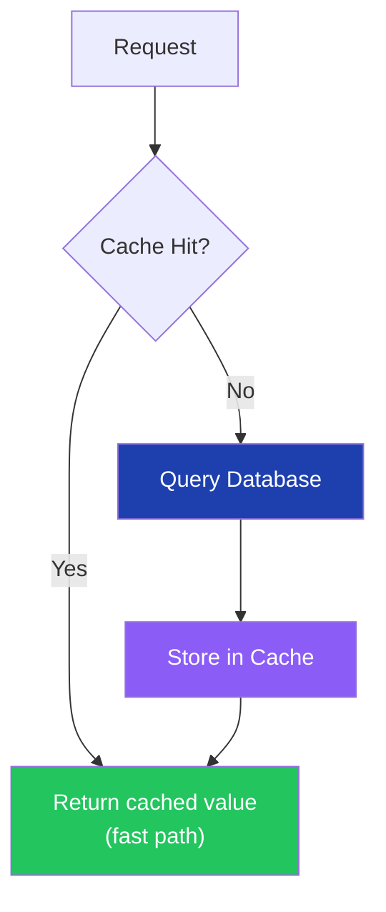

### Redis vs Memcached

| Aspect | Redis | Memcached |
|---|---|---|
| Data structures | Strings, Lists, Sets, Hashes, Sorted Sets, Streams | Strings only |
| Persistence | RDB snapshots + AOF | No persistence |
| Clustering | Redis Cluster (built-in) | Client-side sharding |
| Pub/Sub | Yes | No |
| Atomic operations | Yes (MULTI/EXEC, Lua scripts) | Limited |
| Use case | Sessions, leaderboards, queues, rate limiting | Simple key-value cache |

```csharp
// StackExchange.Redis
var redis = ConnectionMultiplexer.Connect("localhost:6379");
IDatabase db = redis.GetDatabase();

// Set with TTL
await db.StringSetAsync("user:1", JsonSerializer.Serialize(user), TimeSpan.FromMinutes(10));

// Get
var cached = await db.StringGetAsync("user:1");
```

### Cache Invalidation Strategies

| Strategy | Description | Consistency | Write Perf |
|---|---|---|---|
| **Write-through** | Write to cache AND DB simultaneously | Strong | Slower (dual write) |
| **Write-back** | Write to cache first, async flush to DB | Eventual | Fast (risk of loss) |
| **Write-around** | Write to DB only; cache populated on read miss | Strong | Fast; cold cache on new writes |
| **Time-based (TTL)** | Cache expires after fixed duration | Eventual | No extra writes |
| **Manual invalidation** | Explicit `cache.Delete(key)` on update | Strong | Add invalidation code |

### Cache Eviction Policies

| Policy | Description | Best For |
|---|---|---|
| **LRU** (Least Recently Used) | Evict least recently accessed | General-purpose |
| **LFU** (Least Frequently Used) | Evict least often accessed | Skewed access patterns |
| **FIFO** | Evict oldest inserted | Simple queues |
| **TTL** | Evict expired entries | Time-sensitive data |

### Cache Placement

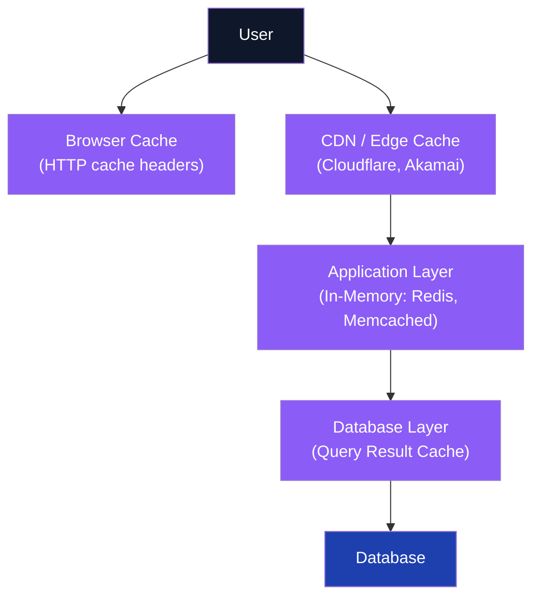

| Question | Answer |
|---|---|
| Cache stampede? | Many requests hit DB simultaneously on cache expiry; fix: probabilistic early expiry or mutex lock |
| Write-through vs write-back risk? | Write-back risks data loss if cache crashes before flush; write-through is safer |
| Redis persistence options? | RDB (point-in-time snapshots); AOF (append-only log, stronger durability) |
| When LFU over LRU? | When access patterns are skewed — frequently accessed items are more valuable than recently accessed |
| Cache key design? | Include version/tenant in key: `v1:user:{id}:profile`; avoids stale data after schema changes |

---

## 9. Load Balancers & Rate Limiting

### Overview
Load balancers distribute traffic across server pools for availability and performance. Rate limiting protects services from abuse and ensures fair resource allocation.

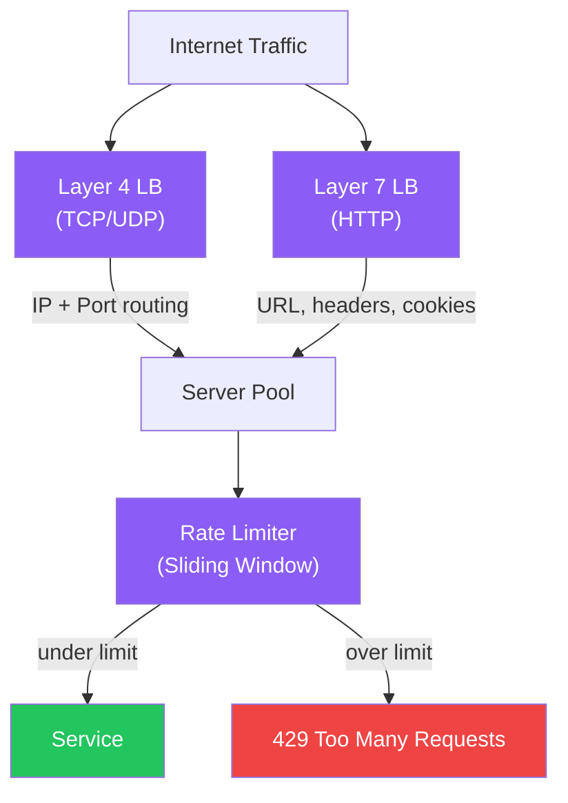

### Layer 4 vs Layer 7 Load Balancer

| Aspect | Layer 4 (Transport) | Layer 7 (Application) |
|---|---|---|
| Routing basis | IP, TCP/UDP port | HTTP URL, headers, cookies, body |
| Speed | Faster (no HTTP parsing) | Slightly slower |
| SSL | Passthrough | Termination possible |
| Content-aware? | No | Yes |
| Examples | AWS NLB, HAProxy L4 | AWS ALB, Nginx, YARP |

### Load Balancing Algorithms

| Algorithm | Description | Use Case |
|---|---|---|
| Round Robin | Rotate through servers sequentially | Equal-capacity servers |
| Weighted Round Robin | Servers with higher weight get more requests | Mixed-capacity servers |
| Least Connections | Route to server with fewest active connections | Long-lived connections |
| IP Hash | Hash client IP to server | Session stickiness |
| Random | Random selection | Stateless services at scale |

### Consistent Hashing

Maps both servers and keys onto a hash ring. Adding/removing a server only remaps `K/N` keys (not all). Used in Cassandra, Redis Cluster, CDNs.

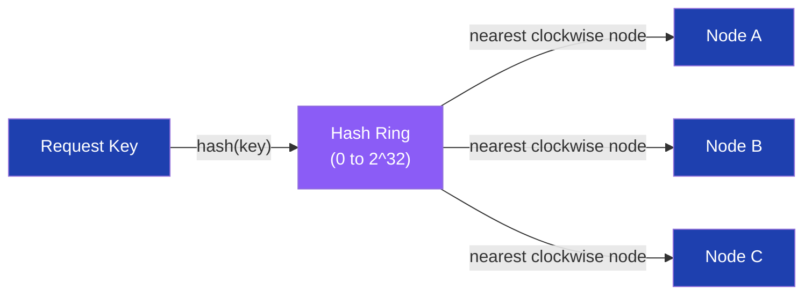

### Rate Limiting

```csharp
// .NET 7+ Rate Limiting
builder.Services.AddRateLimiter(o =>
    o.AddSlidingWindowLimiter("api", opts =>
    {
        opts.PermitLimit = 100;
        opts.Window = TimeSpan.FromMinutes(1);
        opts.SegmentsPerWindow = 6;
        opts.QueueProcessingOrder = QueueProcessingOrder.OldestFirst;
        opts.QueueLimit = 10;
    }));
```

| Question | Answer |
|---|---|
| Consistent hashing advantage? | Adding/removing nodes only remaps 1/N of keys, not full redistribution |
| Sticky sessions trade-off? | Breaks even distribution; problematic if a node fails — sessions lost |
| Rate limit algorithms? | Token bucket (burst-friendly), leaky bucket (smooth), sliding window (accurate), fixed window (simple) |
| Layer 7 LB for microservices? | Yes — can route `/api/users` to User service, `/api/orders` to Order service |
| Health check in LB? | LB periodically probes `/healthz`; removes unhealthy nodes from rotation |

---

## 10. Networking

### Overview
Core networking underpins everything. TCP guarantees delivery and order; UDP sacrifices both for speed. HTTP sits on top; WebRTC enables peer-to-peer media.

### TCP vs UDP vs IP

| Protocol | Layer | Reliable? | Ordered? | Use Case |
|---|---|---|---|---|
| IP | Network (L3) | No | No | Routing packets |
| TCP | Transport (L4) | Yes | Yes | HTTP, databases, file transfer |
| UDP | Transport (L4) | No | No | Video streaming, DNS, gaming, WebRTC |

### HTTP vs HTTPS

- **HTTP:** Plain text; man-in-the-middle can read/modify traffic.
- **HTTPS:** TLS layer encrypts data. Certificate (issued by CA) proves server identity.
- **HSTS:** Browser enforces HTTPS for a domain for a set duration.

### WebSockets

Full-duplex communication over a single TCP connection. Starts as HTTP, upgrades via `101 Switching Protocols`.

```mermaid
sequenceDiagram
    participant C as Client
    participant S as Server
    C->>S: HTTP GET /chat (Upgrade: websocket)
    S-->>C: 101 Switching Protocols
    Note over C,S: TCP connection stays open
    C->>S: send message
    S-->>C: broadcast to all clients
    S-->>C: push notifications
```

### WebRTC (Web Real-Time Communication)

Peer-to-peer protocol for audio/video/data. Used in Zoom, Google Meet, browser-based video calls.

```mermaid
flowchart LR
    P1["Peer 1\n(Browser)"] -->|"SDP offer"| Signal["Signalling Server\n(WebSocket)"]
    Signal -->|"SDP answer"| P2["Peer 2\n(Browser)"]
    P1 <-->|"ICE candidates"| STUN["STUN/TURN Server"]
    P2 <-->|"ICE candidates"| STUN
    P1 <-->|"Direct P2P\n(audio/video/data)"| P2

    classDef peer fill:#22c55e,color:#fff
    classDef infra fill:#8b5cf6,color:#fff
    class P1,P2 peer
    class Signal,STUN infra
```

**STUN:** Discovers public IP. **TURN:** Relay when direct P2P fails (NAT/firewall).

| Question | Answer |
|---|---|
| TCP 3-way handshake? | SYN → SYN-ACK → ACK; establishes connection before data transfer |
| Why UDP for video streaming? | Dropped frames are acceptable; retransmission latency is not; UDP is lower overhead |
| WebSocket vs HTTP long-poll? | WebSocket: single persistent connection, lower overhead; Long-poll: repeated HTTP requests |
| TLS handshake? | Client hello → Server cert → Key exchange → Symmetric encryption for session |
| WebRTC TURN server cost? | TURN relays all media traffic — expensive at scale; optimise ICE to prefer direct P2P |

---

## 11. Microservices vs Monolith

### Overview
Microservices decompose applications into independently deployable services. The trade-off is operational complexity versus team autonomy and scalability.

```mermaid
flowchart LR
    subgraph Monolith
        M_UI["UI"] --- M_BL["Business Logic"] --- M_DB["Database"]
    end
    subgraph Microservices
        S1["User Service"] --> DB1["Users DB"]
        S2["Order Service"] --> DB2["Orders DB"]
        S3["Payment Service"] --> DB3["Payments DB"]
        S1 & S2 & S3 --> MQ["Message Bus"]
    end

    classDef mono fill:#f59e0b,color:#fff
    classDef svc fill:#8b5cf6,color:#fff
    classDef data fill:#1e40af,color:#fff
    class M_UI,M_BL,M_DB mono
    class S1,S2,S3 svc
    class DB1,DB2,DB3,MQ data
```

### Microservices Trade-offs

| Benefit | Cost |
|---|---|
| Independent deployment | Network latency between services |
| Independent scaling | Distributed tracing complexity |
| Team autonomy | Data consistency (no shared DB) |
| Tech stack flexibility | Operational overhead (k8s, service mesh) |
| Fault isolation | Testing complexity |

### Containerisation

Docker packages service + dependencies into an image. Kubernetes orchestrates containers at scale: scheduling, scaling, self-healing.

```mermaid
flowchart TD
    Code["Source Code"] --> Docker["Docker Build\n(Dockerfile)"]
    Docker --> Image["Container Image\n(Registry)"]
    Image --> K8s["Kubernetes\n(Pod)"]
    K8s --> Node1["Node 1\n(3 replicas)"]
    K8s --> Node2["Node 2\n(3 replicas)"]

    classDef build fill:#f59e0b,color:#fff
    classDef deploy fill:#22c55e,color:#fff
    class Docker,Image build
    class K8s,Node1,Node2 deploy
```

| Question | Answer |
|---|---|
| When to use monolith? | Small team, early-stage product, low traffic — simpler to develop and deploy |
| Saga pattern for distributed TX? | Choreography (events) or orchestration (central coordinator) for multi-service transactions |
| Service mesh? | Sidecar proxies (Envoy/Istio) handle retries, mTLS, observability without app-code changes |
| Database-per-service? | Yes — prevents tight coupling; cross-service queries via API or events |
| Circuit breaker in microservices? | Polly circuit breaker prevents cascade failures when a downstream service is unhealthy |

---

## 12. Message Queues

### Overview
Message queues decouple producers from consumers, enabling async processing, load levelling, and fault tolerance. Kafka and RabbitMQ are the dominant choices.

```mermaid
flowchart LR
    Producer["Producer\n(API / Service)"] -->|"publish event"| MQ["Message Broker\n(Kafka / RabbitMQ)"]
    MQ -->|"consume"| C1["Consumer 1\n(Email Service)"]
    MQ -->|"consume"| C2["Consumer 2\n(Analytics)"]
    MQ -->|"dead letter"| DLQ["DLQ\n(Failed Messages)"]

    classDef prod fill:#0f172a,color:#fff
    classDef mq fill:#8b5cf6,color:#fff
    classDef consumer fill:#22c55e,color:#fff
    classDef bad fill:#ef4444,color:#fff
    class Producer prod
    class MQ mq
    class C1,C2 consumer
    class DLQ bad
```

### Kafka vs RabbitMQ vs SQS/SNS

| Aspect | Kafka | RabbitMQ | SQS/SNS (AWS) |
|---|---|---|---|
| Model | Log-based (pull) | Queue/Exchange (push) | Queue (SQS) / Topic (SNS) |
| Retention | Long-term replay | Consumed = deleted | Configurable (up to 14 days) |
| Throughput | Millions/sec | High | High (managed) |
| Ordering | Per-partition | Per-queue | SQS FIFO only |
| Use case | Event sourcing, streaming, audit log | Task queues, RPC | AWS-native apps |

### Kafka Internals

```mermaid
flowchart TD
    Producer["Producer"] -->|"key hash → partition"| T["Topic\n(3 Partitions)"]
    T --> P0["Partition 0\n(Leader + 2 Replicas)"]
    T --> P1["Partition 1"]
    T --> P2["Partition 2"]
    P0 --> CG["Consumer Group"]
    CG --> C0["Consumer 0 → P0"]
    CG --> C1["Consumer 1 → P1"]
    CG --> C2["Consumer 2 → P2"]

    classDef topic fill:#8b5cf6,color:#fff
    classDef part fill:#1e40af,color:#fff
    classDef cg fill:#22c55e,color:#fff
    class T topic
    class P0,P1,P2 part
    class CG,C0,C1,C2 cg
```

```csharp
// Confluent.Kafka Consumer (.NET)
public class OrderConsumer(ILogger<OrderConsumer> log) : BackgroundService
{
    protected override async Task ExecuteAsync(CancellationToken ct)
    {
        var config = new ConsumerConfig { BootstrapServers = "kafka:9092", GroupId = "order-svc" };
        using var consumer = new ConsumerBuilder<string, string>(config).Build();
        consumer.Subscribe("orders");

        while (!ct.IsCancellationRequested)
        {
            var result = consumer.Consume(ct);
            log.LogInformation("Received: {Key}", result.Message.Key);
            consumer.Commit(result);
        }
    }
}
```

### Pub/Sub, Retry, DLQ, Idempotency

| Concept | Description |
|---|---|
| **Pub/Sub** | Publisher sends to topic; all subscribers receive a copy |
| **Acknowledgement** | Consumer sends ACK after successful processing; unACKed messages are redelivered |
| **Dead Letter Queue** | Messages that fail N retries go to DLQ for manual inspection |
| **Idempotency** | Processing the same message twice produces the same result (use deduplication IDs) |

| Question | Answer |
|---|---|
| Kafka vs RabbitMQ for audit log? | Kafka — long retention, replay capability, exactly-once semantics |
| How to guarantee order? | Kafka: same partition key → same partition → ordered; RabbitMQ: single consumer per queue |
| Consumer group semantics? | Each partition assigned to exactly one consumer in a group; add consumers to scale |
| At-least-once vs exactly-once? | At-least-once: may reprocess; exactly-once: Kafka transactional API + idempotent consumers |
| DLQ monitoring? | Alert on DLQ depth; inspect messages for root cause; replay after fix |

---

## 13. Retry Policies & API Evolution

### Overview
Transient failures are inevitable in distributed systems. Retry policies with backoff prevent thundering-herd storms. API versioning enables evolution without breaking existing clients.

### Retry Strategies

```mermaid
stateDiagram-v2
    [*] --> Attempt
    Attempt --> Success: Response 200
    Attempt --> Retry: Transient Error "503/timeout"
    Retry --> Wait: Exponential Backoff + Jitter
    Wait --> Attempt: retry
    Retry --> DLQ: Max retries exceeded
    DLQ --> [*]
    Success --> [*]
```

```csharp
// Polly v8 — Retry + Circuit Breaker
builder.Services.AddHttpClient<IOrderClient, OrderClient>()
    .AddResilienceHandler("order-pipeline", pipeline =>
    {
        pipeline.AddRetry(new HttpRetryStrategyOptions
        {
            MaxRetryAttempts = 3,
            Delay = TimeSpan.FromSeconds(1),
            BackoffType = DelayBackoffType.Exponential,
            UseJitter = true,
            ShouldHandle = new PredicateBuilder<HttpResponseMessage>()
                .Handle<HttpRequestException>()
                .HandleResult(r => r.StatusCode == HttpStatusCode.ServiceUnavailable)
        });

        pipeline.AddCircuitBreaker(new HttpCircuitBreakerStrategyOptions
        {
            FailureRatio = 0.5,
            SamplingDuration = TimeSpan.FromSeconds(10),
            MinimumThroughput = 5,
            BreakDuration = TimeSpan.FromSeconds(30)
        });
    });
```

### Exponential Backoff vs Linear Backoff

| Strategy | Formula | Risk |
|---|---|---|
| **Linear** | `wait = n * base` | Predictable; still floods if many clients |
| **Exponential** | `wait = base^n` | Grows fast; good for preventing overload |
| **Exponential + Jitter** | `wait = base^n + random(0, base)` | Spreads retries; **best practice** |

### Circuit Breaker

```mermaid
stateDiagram-v2
    [*] --> Closed: Normal operation
    Closed --> Open: Failure threshold exceeded
    Open --> HalfOpen: After break duration
    HalfOpen --> Closed: Test request succeeds
    HalfOpen --> Open: Test request fails
```

### API Evolution & Backward Compatibility

| Technique | Description |
|---|---|
| URI Versioning | `/api/v1/users`, `/api/v2/users` — explicit, cacheable |
| Header Versioning | `Accept: application/vnd.myapp.v2+json` — clean URLs |
| Additive changes | Adding optional fields is non-breaking |
| Removing fields | Breaking — use deprecation period + sunset header |
| Semantic versioning | Major.Minor.Patch — major = breaking, minor = additive, patch = bug fix |

### OAuth Token Refresh Retry

```csharp
// DelegatingHandler that retries once after token refresh
protected override async Task<HttpResponseMessage> SendAsync(
    HttpRequestMessage request, CancellationToken ct)
{
    var response = await base.SendAsync(request, ct);
    if (response.StatusCode == HttpStatusCode.Unauthorized)
    {
        var newToken = await _tokenService.RefreshAsync(ct);
        request.Headers.Authorization = new AuthenticationHeaderValue("Bearer", newToken);
        response = await base.SendAsync(request, ct);
    }
    return response;
}
```

| Question | Answer |
|---|---|
| Why jitter in backoff? | Without jitter, all clients retry simultaneously — thundering herd; jitter spreads load |
| Circuit breaker states? | Closed (normal) → Open (blocking) → Half-Open (testing) → Closed (recovered) |
| Backward-compatible API change? | Adding optional fields, new endpoints, new enum values (if client ignores unknown) |
| Breaking API change? | Removing/renaming fields, changing types, removing endpoints |
| Retry on POST safe? | Only if idempotent — add `Idempotency-Key` header; server deduplicates |

---

## 14. Testing

### Overview
A layered testing strategy (unit → integration → e2e) catches bugs at the appropriate level. Unit tests are fast and numerous; e2e tests are slow and catch real-user flows.

```mermaid
flowchart TD
    E2E["E2E Tests\n(Playwright, Cypress, Selenium)\nFew, slow, high confidence"] --> Int["Integration Tests\n(API + DB)\nModerate count"] --> Unit["Unit Tests\n(Jest, xUnit)\nMany, fast, isolated"]

    classDef slow fill:#ef4444,color:#fff
    classDef med fill:#f59e0b,color:#fff
    classDef fast fill:#22c55e,color:#fff
    class E2E slow
    class Int med
    class Unit fast
```

### Testing Types

| Type | Scope | Tools |
|---|---|---|
| **Unit** | Single function/class in isolation | Jest, Mocha/Chai, xUnit |
| **Integration** | Multiple components/APIs together | Jest + Supertest, xUnit + TestServer |
| **Behavioural (BDD)** | User behaviour specs | Cucumber, SpecFlow |
| **E2E** | Full browser automation | Playwright, Cypress, Selenium |

### Frontend Testing Frameworks

| Framework | Type | Notes |
|---|---|---|
| **Jest** | Unit / Integration | Default for React; fast, snapshot testing |
| **Mocha** | Unit | Flexible; pairs with Chai for assertions |
| **Chai** | Assertion library | BDD (`expect/should`) or TDD (`assert`) style |
| **Cypress** | E2E | Browser-based; real-time dashboard; JS-only |
| **Selenium** | E2E | Multi-browser; WebDriver standard; older |
| **Protractor** | E2E | Angular-specific; deprecated |
| **Playwright** | E2E | Microsoft; multi-browser; fast; recommended |

### Playwright Example (.NET)

```csharp
// Playwright .NET E2E
using var playwright = await Playwright.CreateAsync();
await using var browser = await playwright.Chromium.LaunchAsync();
var page = await browser.NewPageAsync();

await page.GotoAsync("https://myapp.com/login");
await page.FillAsync("[name=email]", "user@example.com");
await page.FillAsync("[name=password]", "secret");
await page.ClickAsync("[type=submit]");

await page.WaitForURLAsync("**/dashboard");
await Assertions.Expect(page.Locator("h1")).ToHaveTextAsync("Dashboard");
```

### Test Pyramid Ratios

```
E2E:          ~10%  — golden paths only
Integration:  ~20%  — API contracts, DB interactions
Unit:         ~70%  — business logic, edge cases
```

| Question | Answer |
|---|---|
| Why avoid too many E2E tests? | Slow, flaky, expensive to maintain; move logic to unit tests |
| Cypress vs Playwright? | Playwright: multi-browser, faster, .NET support; Cypress: better DX for JS devs, real-time preview |
| Test doubles: mock vs stub vs spy? | Stub: returns fixed value; Mock: verifies interactions; Spy: wraps real object, records calls |
| Testing pyramid vs testing trophy? | Pyramid: more unit; Trophy (Kent C. Dodds): emphasises integration tests over unit |
| BDD advantage? | Specs written in plain language; bridges business and dev; living documentation |

---

## 15. General Concepts

### Eventual Consistency

In distributed systems, updates propagate to all nodes eventually — not immediately. Reads may return stale data until convergence. Accepted trade-off in AP systems (Cassandra, DynamoDB).

**Example:** After a write to region A, region B may serve the old value for milliseconds/seconds until replication catches up.

### Event Sourcing

Store every change to application state as an immutable event, not the current state. Current state is derived by replaying events.

```mermaid
flowchart LR
    CMD["Command\n(PlaceOrder)"] --> Handler["Command Handler"]
    Handler -->|"append"| ES["Event Store\n(append-only log)"]
    ES --> Proj["Projections\n(read models)"]
    ES -->|"replay"| State["Current State"]

    classDef cmd fill:#0f172a,color:#fff
    classDef store fill:#1e40af,color:#fff
    classDef proj fill:#8b5cf6,color:#fff
    class CMD cmd
    class ES store
    class Proj,State proj
```

**Benefits:** Full audit trail, temporal queries, easy replay. **Cost:** Complexity, event schema migration.

### Elasticsearch & ELK Stack

**Elasticsearch:** Distributed search and analytics engine. Indexes documents as JSON; supports full-text search with inverted indexes.

```mermaid
flowchart LR
    Logs["Application Logs"] --> Logstash["Logstash\n(ingest + transform)"]
    Logstash --> ES["Elasticsearch\n(index + search)"]
    ES --> Kibana["Kibana\n(visualise + dashboard)"]
    Beats["Filebeat / Metricbeat"] --> ES

    classDef ingest fill:#f59e0b,color:#fff
    classDef store fill:#1e40af,color:#fff
    classDef viz fill:#22c55e,color:#fff
    class Logstash,Beats ingest
    class ES store
    class Kibana viz
```

**ELK Stack:** Elasticsearch + Logstash + Kibana. Modern variant: **Elastic Stack** adds Beats for lightweight data shipping.

```csharp
// Elastic.Clients.Elasticsearch (.NET)
var client = new ElasticsearchClient(new Uri("http://localhost:9200"));

// Index document
await client.IndexAsync(new { Title = "Hello", Body = "World" }, i => i.Index("articles"));

// Search
var response = await client.SearchAsync<Article>(s => s
    .Index("articles")
    .Query(q => q.Match(m => m.Field(f => f.Title).Query("Hello"))));
```

### Redis Cache (Deep Dive)

Redis supports rich data structures making it more than a cache:
- **Sorted Sets** → leaderboards (`ZADD`, `ZRANGEBYSCORE`)
- **Streams** → lightweight message queue
- **Pub/Sub** → real-time notifications
- **HyperLogLog** → approximate distinct count at low memory

### AWS Elasticsearch / OpenSearch

AWS managed Elasticsearch (now OpenSearch Service). Use cases: log analytics, full-text search, application metrics.

### Resilience4j → Polly (.NET)

Resilience4j is Java's fault-tolerance library. .NET equivalent is **Polly v8** with `AddResilienceHandler`:

| Resilience4j | Polly v8 |
|---|---|
| `@CircuitBreaker` | `AddCircuitBreaker` |
| `@Retry` | `AddRetry` |
| `@RateLimiter` | `AddRateLimiter` |
| `@Bulkhead` | `AddConcurrencyLimiter` |
| `@TimeLimiter` | `AddTimeout` |

### AutoScaler & Load Balancers

**AutoScaler:** Automatically adjusts the number of running instances based on metrics (CPU, request rate, queue depth). Azure VMSS, AWS Auto Scaling Groups, Kubernetes HPA.

```mermaid
flowchart TD
    Metric["Metric Alarm\nCPU > 70%"] --> AS["Auto Scaler"]
    AS -->|"scale out"| New["Spawn New Instances"]
    AS -->|"register"| LB["Load Balancer\n(add to pool)"]
    NewDown["CPU < 30%"] -->|"scale in"| AS2["Auto Scaler"]
    AS2 -->|"deregister + terminate"| Kill["Remove Instance"]

    classDef trigger fill:#f59e0b,color:#fff
    classDef action fill:#22c55e,color:#fff
    classDef remove fill:#ef4444,color:#fff
    class Metric,NewDown trigger
    class New,LB action
    class Kill remove
```

### Boilerplate

Repetitive code required by a framework or convention with little unique logic (e.g., DI registration, entity configurations, CRUD controllers). Modern frameworks reduce boilerplate via source generators, conventions, and code-first approaches.

### Domain Driven Design (DDD)

Structures software around business domains. Key concepts: Bounded Contexts, Aggregates, Entities, Value Objects, Domain Events, Ubiquitous Language.

```mermaid
flowchart TD
    BC1["Bounded Context: Orders"] --> Agg1["Order Aggregate\n(Order, OrderItem)"]
    BC2["Bounded Context: Payments"] --> Agg2["Payment Aggregate"]
    BC1 <-->|"Domain Events"| BC2

    classDef bc fill:#8b5cf6,color:#fff
    classDef agg fill:#1e40af,color:#fff
    class BC1,BC2 bc
    class Agg1,Agg2 agg
```

### Deep Link vs Back Link

| Concept | Description |
|---|---|
| **Deep Link** | URL that opens a specific screen in a mobile app (`myapp://product/123`) |
| **Universal Link (iOS) / App Link (Android)** | HTTP URL that opens the app if installed, falls back to browser |
| **Back Link** | Navigation back in history stack (browser back button / `popstate`) |

| Question | Answer |
|---|---|
| Eventual consistency example? | DNS propagation; shopping cart across regions; social media like counts |
| Event sourcing vs CRUD? | Event sourcing: append-only, full history, temporal queries; CRUD: simpler, in-place updates |
| ELK vs Grafana stack? | ELK: log analytics + full-text search; Grafana + Loki: metrics + logs, lighter weight |
| Elasticsearch inverted index? | Maps terms to document IDs — enables O(1) full-text lookup regardless of corpus size |
| AutoScaler cooldown period? | Prevents rapid scale-in/out oscillation; wait N seconds after last scaling event |

---

## 16. Cross-Cutting Themes

### Pattern Selection Guide

```mermaid
flowchart TD
    Problem["System Design Problem"] --> Scale{High Traffic?}
    Scale -->|"Yes"| HScaling["Horizontal Scaling\n+ Load Balancer"]
    Scale -->|"No"| VScaling["Vertical Scaling OK"]

    HScaling --> State{Stateful?}
    State -->|"Yes"| Session["Sticky Sessions\nor Redis Session"]
    State -->|"No"| Stateless["Pure Stateless\n(Easy scaling)"]

    Problem --> Consistency{Strong Consistency\nNeeded?}
    Consistency -->|"Yes"| CP["CP Database\n(PostgreSQL, MongoDB)"]
    Consistency -->|"No"| AP["AP Database\n(Cassandra, DynamoDB)"]

    Problem --> Comms{Communication Style?}
    Comms -->|"Request/Response"| REST2["REST or gRPC"]
    Comms -->|"Realtime bidirectional"| WS2["WebSocket"]
    Comms -->|"Server push only"| SSE2["SSE"]
    Comms -->|"Async decoupled"| MQ2["Message Queue\n(Kafka / RabbitMQ)"]

    classDef decision fill:#f59e0b,color:#fff
    classDef good fill:#22c55e,color:#fff
    classDef neutral fill:#8b5cf6,color:#fff
    class Scale,State,Consistency,Comms decision
    class Stateless,CP,REST2 good
    class HScaling,AP,WS2,SSE2,MQ2 neutral
```

### Common Interview Red Flags to Avoid

| Red Flag | Why It's Wrong | Correct Answer |
|---|---|---|
| "We retry in a tight loop" | Thundering herd — floods a recovering service | Exponential backoff with jitter (Polly) |
| "Just add more RAM to the server" | Vertical scaling has a ceiling; single point of failure | Horizontal scaling behind a load balancer |
| "Store JWT secret in source code" | Leaked in git history, CI logs | Azure Key Vault / AWS Secrets Manager + Managed Identity |
| "Use SELECT * in production" | Over-fetches; breaks covering index; adds network overhead | Select only needed columns; use covering indexes |
| "All microservices share one database" | Tight coupling defeats microservice independence | Database-per-service; cross-service via API or events |
| "No cache invalidation strategy" | Stale data served indefinitely | Write-through or TTL + manual invalidation on mutations |
| "Offset pagination for large tables" | O(n) scan; inconsistent under concurrent writes | Cursor/keyset pagination with indexed column |
| "No rate limiting on public APIs" | Enables DDOS and credential stuffing | Sliding window rate limiter at API Gateway |
| "Synchronous calls across all microservices" | Cascading failures; high latency | Use async messaging (Kafka) for non-critical paths; circuit breaker for sync calls |
| "CSP with unsafe-inline" | Defeats XSS protection | Strict CSP with nonce-based script allowlist |

---

*Document generated by ConceptToMD Agent | Description-Questions2-Complete.md | July 2026*
