# UI & Web Architecture — Complete Reference Guide

> Consolidates: Web Rendering Strategies · Micro-frontends · Performance Optimization · Frontend Architecture Patterns · PWA · Headless · EDA · CQRS · BFF · TypeScript · SOLID · Design Patterns · RADIO Framework

---

## Table of Contents

1. [Web Rendering Strategies](#1-web-rendering-strategies)
2. [Micro-frontends & Module Federation](#2-micro-frontends--module-federation)
3. [React Performance Optimization](#3-react-performance-optimization)
4. [Pagination & Rate Limiting](#4-pagination--rate-limiting)
5. [Communication Protocols](#5-communication-protocols)
6. [Frontend Architecture Patterns](#6-frontend-architecture-patterns)
7. [Thick vs Thin Clients](#7-thick-vs-thin-clients)
8. [BFF (Backend for Frontend) Pattern](#8-bff-backend-for-frontend-pattern)
9. [Progressive Web Apps (PWA)](#9-progressive-web-apps-pwa)
10. [Headless Architecture](#10-headless-architecture)
11. [Event-Driven Architecture (EDA)](#11-event-driven-architecture-eda)
12. [CQRS & Event Sourcing](#12-cqrs--event-sourcing)
13. [GoF Design Patterns for Frontend](#13-gof-design-patterns-for-frontend)
14. [SOLID Principles for Web](#14-solid-principles-for-web)
15. [TypeScript Advanced Concepts](#15-typescript-advanced-concepts)
16. [RADIO Interview Framework](#16-radio-interview-framework)
17. [Core Web Vitals & Accessibility](#17-core-web-vitals--accessibility)

---

## 1. Web Rendering Strategies

### Overview
Rendering strategy defines where and when HTML is generated — the decision has major implications for SEO, Time to First Byte (TTFB), interactivity, and server cost.

### Rendering Strategy Taxonomy

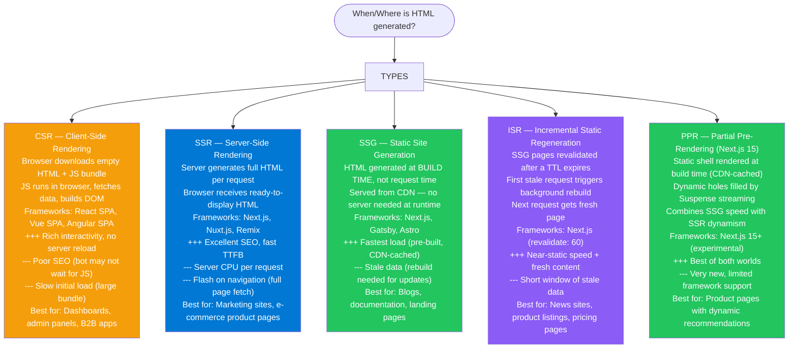

### Rendering Performance Comparison

| Strategy | TTFB | FCP | SEO | Hosting cost | Stale risk |
|---|---|---|---|---|---|
| CSR | Fast | Slow (bundle download + JS run) | Poor | Low (static files) | None |
| SSR | Medium | Fast | Excellent | High (server per req) | None |
| SSG | Fast (CDN) | Fast (pre-built) | Excellent | Very low (CDN) | High (rebuild required) |
| ISR | Fast (CDN) | Fast | Excellent | Low | Low (TTL-bounded) |
| PPR | Fast (static shell) | Fast (streaming) | Excellent | Low | Very low |

### Interview Talking Points

| Question | Answer |
|---|---|
| Why does CSR hurt SEO? | Search engine crawlers may not execute JavaScript or may time out before JS builds the DOM. The crawler sees an empty `<div id="root">` instead of real content. SSR or SSG sends complete HTML immediately. |
| When would you choose SSG over SSR? | When content doesn't change per user or per minute. A marketing page, blog post, or documentation site is identical for all users — build it once, cache it at the edge forever. SSR for the same content wastes server CPU on identical work. |
| What problem does ISR solve? | SSG gets stale when data changes. ISR adds a TTL so that after N seconds, the next request triggers a background regeneration — the stale page still serves immediately (no user waits for rebuild), and fresh content is ready on the next subsequent request. |

---

## 2. Micro-frontends & Module Federation

### Overview
Micro-frontends apply microservices principles to the frontend — splitting a monolithic frontend into independently deployable UI applications owned by different teams.

### Micro-frontend Architecture

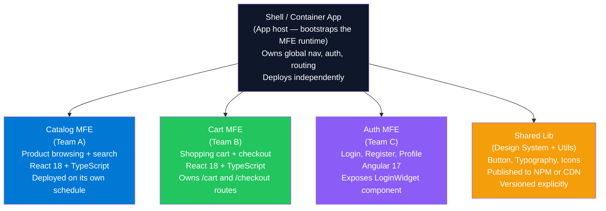

### Module Federation (Webpack 5)

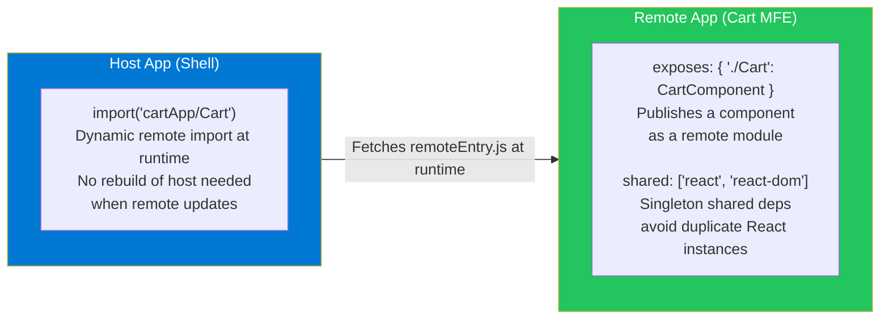

### MFE Communication Patterns

| Method | How | Best For |
|---|---|---|
| **Custom Events** | `document.dispatchEvent(new CustomEvent('cart:updated', {detail}))` | Decoupled cross-MFE events |
| **Shared State** | Redux store in shared lib + MFEs subscribe | Complex shared state (prefer to minimize) |
| **URL / Query Params** | Each MFE reads URL; navigation triggers updates | Deep-linkable state, shallow integration |
| **Props / Callbacks** | Shell passes down to MFE components | Simple parent→child data passing |
| **Event Bus** | Pub/sub singleton (`mitt`, `RxJS Subject`) | Type-safe event routing |

### MFE Trade-offs

| Pro | Con |
|---|---|
| Teams deploy independently — no release train | Multiple React instances if shared deps not configured correctly |
| Each team owns their tech stack | Consistent UX harder across teams (use design system) |
| Fault isolation — one MFE crash doesn't kill shell | Higher complexity: CI/CD, versioning, contract testing |
| Scale teams horizontally | Increased initial bundle load (multiple entry points) |

---

## 3. React Performance Optimization

### Re-render Prevention

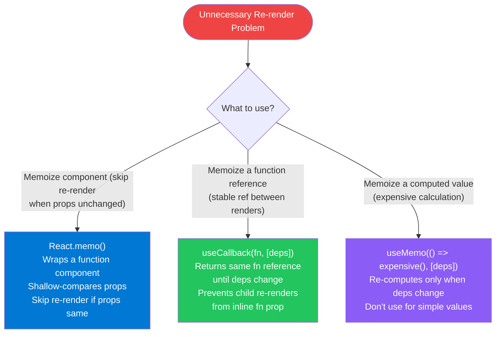

### Code Splitting & Lazy Loading

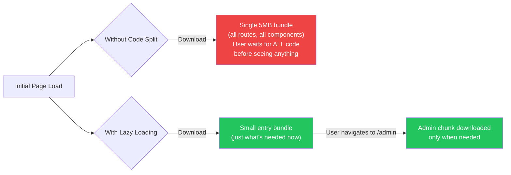

### Tree Shaking
Tree shaking eliminates dead code from JavaScript bundles at build time.

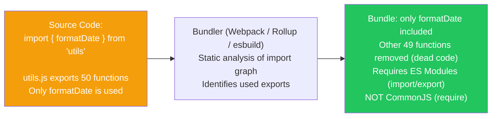

### API Caching

| Tool | Approach | Best For |
|---|---|---|
| **React Query (TanStack Query)** | `useQuery` — automatic stale-while-revalidate, retry, background refetch | REST APIs with cache invalidation |
| **SWR** | `useSWR` — stale-while-revalidate pattern, lightweight | Simple data fetching with auto-revalidation |
| **Apollo Client** | GraphQL-specific; normalized in-memory cache | GraphQL APIs; complex data dependencies |
| **RTK Query** | Redux Toolkit's built-in data fetching + caching | Apps already using Redux |

---

## 4. Pagination & Rate Limiting

### Pagination Strategies

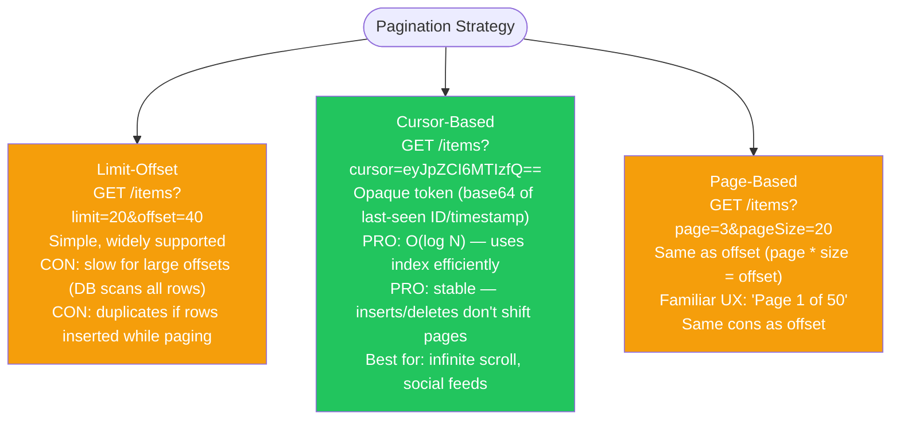

### Debounce vs Throttle

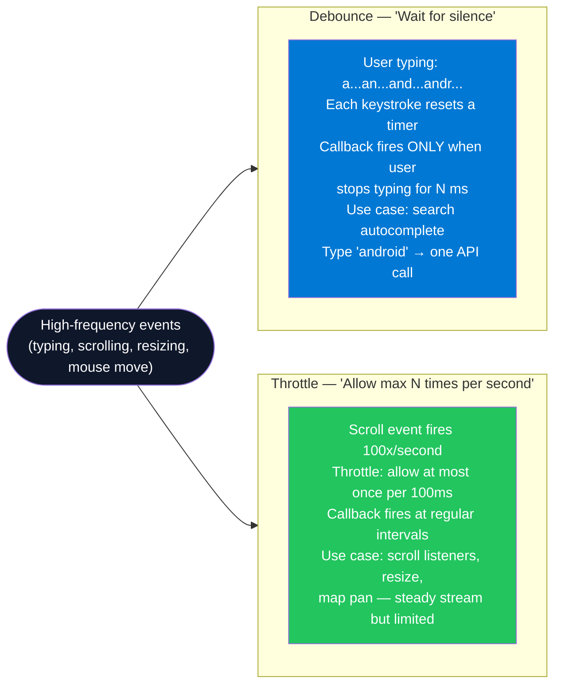

### Rate Limiting (Server-Side)

| Algorithm | How it works | Best for |
|---|---|---|
| **Fixed Window** | Counter resets every N seconds; reject if limit exceeded | Simple APIs; cheap to implement |
| **Sliding Window** | Count requests in a rolling time window | More accurate; prevents boundary bursts |
| **Token Bucket** | Tokens refill at rate R; each request consumes one | Burst-friendly; AWS API Gateway uses this |
| **Leaky Bucket** | Requests processed at fixed rate; excess queued/dropped | Smooth, predictable output rate |

---

## 5. Communication Protocols

### Protocol Decision Tree

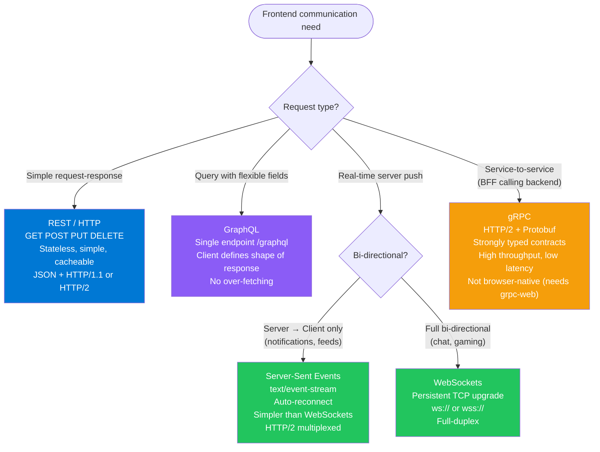

### Long Polling vs WebSockets vs SSE

| | Long Polling | SSE | WebSockets |
|---|---|---|---|
| **Connection** | New HTTP request per message | One persistent HTTP connection | One persistent TCP connection |
| **Direction** | Client pulls (simulated push) | Server → Client only | Bidirectional |
| **Overhead** | High (new request per update) | Low (one connection, stream) | Low (persistent) |
| **Auto-reconnect** | Client must implement | Built into EventSource API | Client must implement |
| **Complexity** | Low | Low | High |
| **Use case** | Legacy support, simple fallback | Live ticker, notifications, feeds | Chat, games, collaborative editing |

---

## 6. Frontend Architecture Patterns

### Pattern Taxonomy

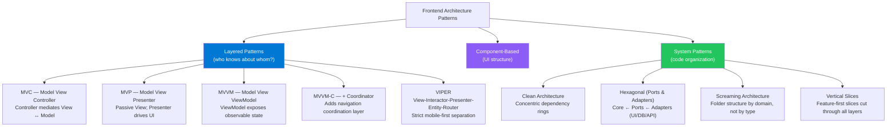

### MVC vs MVP vs MVVM

```mermaid
flowchart TD
    subgraph MVC ["MVC (Original)"]
        M1["Model\n(data + business logic)"]
        V1["View\n(may update Model directly)"]
        C1["Controller\n(handles events, updates Model)"]
        V1 <-->|"View knows Model"| M1
        C1 --> M1
        C1 --> V1
    end

    subgraph MVP ["MVP (Testable)"]
        M2["Model\n(data + business logic)"]
        V2["View (Passive)\n(implements interface, no logic)"]
        P2["Presenter\n(all UI logic + updates View via interface)"]
        P2 --> M2
        P2 <-->|"Only via interface"| V2
    end

    subgraph MVVM ["MVVM (Reactive)"]
        M3["Model\n(data + business logic)"]
        V3["View\n(data-binds to ViewModel)"]
        VM3["ViewModel\n(exposes observable state\nno reference to View)"]
        V3 <-->|"Two-way binding\nobservable/reactive"| VM3
        VM3 --> M3
    end

    style M1 fill:#0f172a,color:#fff
    style V1 fill:#ef4444,color:#fff
    style C1 fill:#f59e0b,color:#fff
    style M2 fill:#0f172a,color:#fff
    style V2 fill:#0078D4,color:#fff
    style P2 fill:#22c55e,color:#fff
    style M3 fill:#0f172a,color:#fff
    style V3 fill:#0078D4,color:#fff
    style VM3 fill:#22c55e,color:#fff
```

### Hexagonal Architecture (Ports & Adapters)

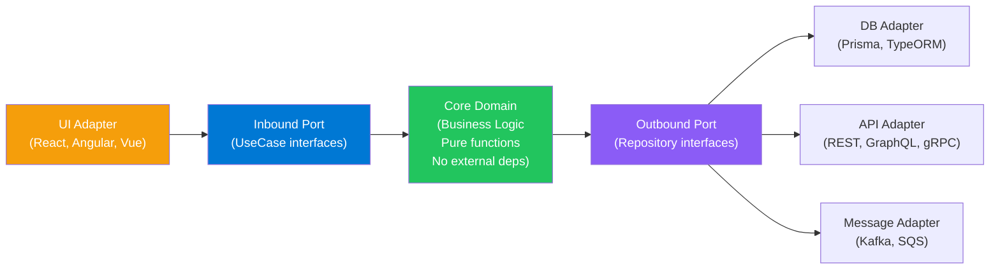

### Screaming Architecture vs Vertical Slices

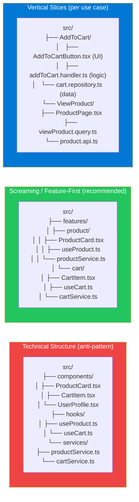

### Architecture Pattern Interview Q&A

| Question | Answer |
|---|---|
| Why is Screaming Architecture preferred over technical folder structure? | When you open the codebase, the folder structure should "scream" the domain. `src/features/checkout` tells you more than `src/components`. Grouping by feature co-locates all related code (UI, logic, tests, types) — reducing cognitive load and cross-folder jumps. |
| What is the key invariant of Clean Architecture? | The dependency rule: source code dependencies must point inward only. The domain/entity layer has zero knowledge of the UI framework, database, or network. Outer layers (UI, DB adapters) depend on inner layers, never the reverse. |
| How does Hexagonal Architecture differ from Clean? | Both share the "ports and adapters" intuition, but Hexagonal makes the port-as-interface concept explicit: inbound ports (APIs into the app) and outbound ports (interfaces the app calls out through). Clean Architecture adds the concentric-ring visual metaphor and names layers more specifically. |

---

## 7. Thick vs Thin Clients

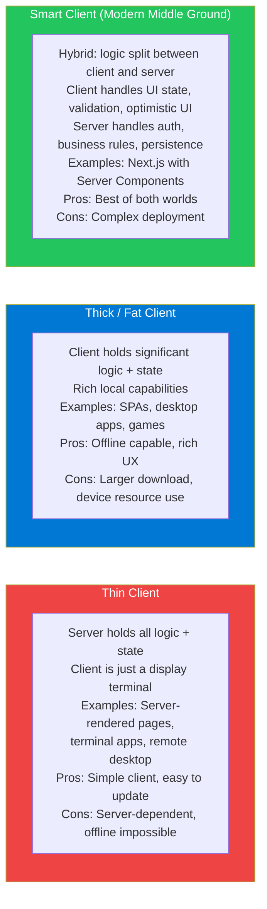

---

## 8. BFF (Backend for Frontend) Pattern

### Overview
A Backend for Frontend is a dedicated server-side layer — thin API gateway — tailored to the needs of a specific frontend client (web, mobile, TV). Instead of one general-purpose API serving all clients differently, each client gets its own BFF that aggregates, shapes, and transforms data specifically for it.

### BFF Architecture

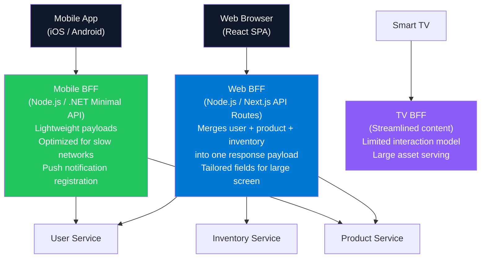

### BFF Interview Q&A

| Question | Answer |
|---|---|
| Why not just have the frontend call microservices directly? | Frontend would need to orchestrate multiple API calls, aggregate responses, handle partial failures, and format data — putting complex logic in the client. The BFF moves this to the server side where it's closer to services, can run parallel requests efficiently, and can be tested independently. |
| What's the difference between BFF and API Gateway? | An API Gateway is a generic cross-cutting infrastructure layer (auth, rate limiting, routing). A BFF is application-specific — it contains business logic tailored to a specific client. You may have a BFF behind an API Gateway. |
| When does BFF become an anti-pattern? | When BFF teams become bottlenecks for frontend teams (they must wait for BFF changes). Solution: frontend teams own their BFF. Also when BFF accumulates too much business logic that should live in domain services. |

---

## 9. Progressive Web Apps (PWA)

### PWA Capabilities

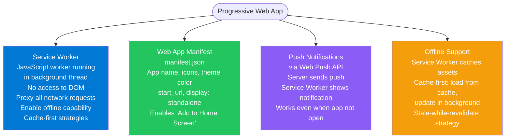

### Service Worker Caching Strategies

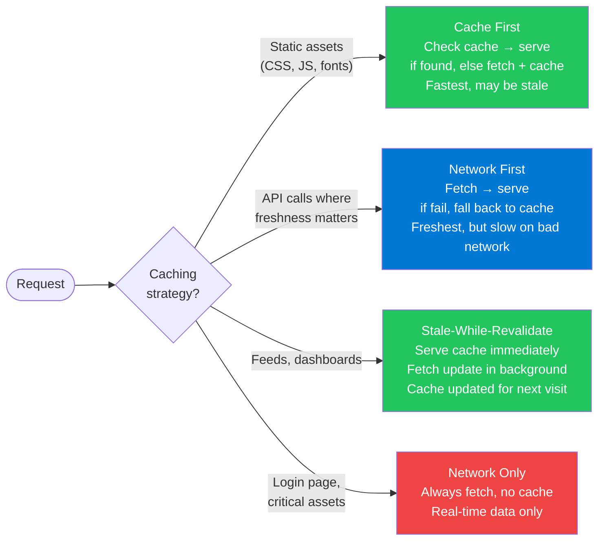

---

## 10. Headless Architecture

### Headless vs Traditional CMS

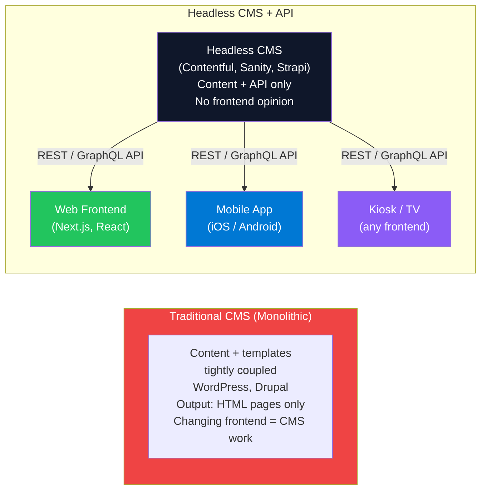

### Headless Commerce Architecture

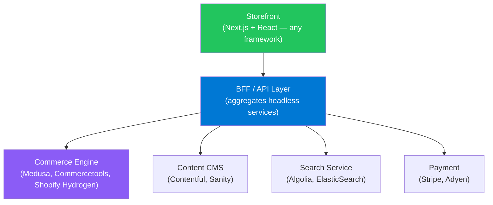

---

## 11. Event-Driven Architecture (EDA)

### EDA Overview

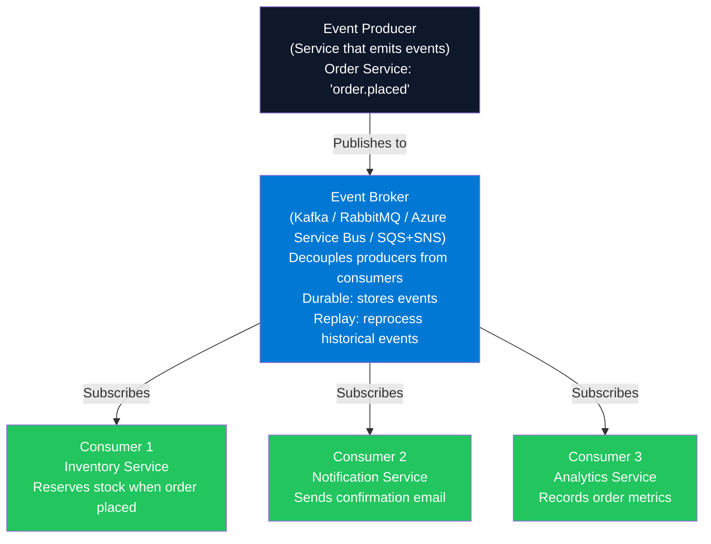

### EDA vs Request-Response

| | Request-Response (REST) | Event-Driven |
|---|---|---|
| **Coupling** | Tight: caller knows callee's address | Loose: producer publishes; consumers self-register |
| **Availability** | Both services must be up simultaneously | Consumer can be down; events wait in broker |
| **Scalability** | Caller waits; fan-out = N sequential calls | Broker fans out to N consumers in parallel |
| **Complexity** | Low | High: eventual consistency, ordering guarantees, idempotency |
| **Best for** | Simple CRUD, queries, synchronous workflows | Complex workflows, high fan-out, audit trails |

### Event Brokers Comparison

| Broker | Best For | Key Feature |
|---|---|---|
| **Apache Kafka** | High-throughput event streaming, event sourcing, data pipelines | Durable log; consumer groups; replay; very high throughput |
| **RabbitMQ** | Task queues, microservice messaging, fan-out | Flexible routing (exchanges/bindings); low latency |
| **Azure Service Bus** | Enterprise Azure messaging; sessions; dead-letter queue | Managed; sessions for ordered processing; guaranteed delivery |
| **AWS SQS + SNS** | AWS-native; fan-out with SNS + SQS fanout pattern | Serverless-friendly; SQS for queue, SNS for pub/sub |
| **Redis Pub/Sub** | In-memory; very low latency | Fire-and-forget; not durable; at-most-once |

---

## 12. CQRS & Event Sourcing

### CQRS (Command Query Responsibility Segregation)

```mermaid
flowchart LR
    CLIENT(["Client Request"]) --> Q_TYPE{"Command or\nQuery?"}

    Q_TYPE -->|"Write / Change state"| COMMAND["Command Side\nCreate/Update/Delete\nWrite DB (normalized)\nReturns: void or success/fail\nOptimized for writes"]

    Q_TYPE -->|"Read data"| QUERY["Query Side\nRead-only\nRead DB / Read Model\n(denormalized for reads)\nReturns: data\nOptimized for reads"]

    COMMAND -->|"Publishes domain events"| EVENT_BUS["Event Bus\n(Kafka / Service Bus)"]
    EVENT_BUS -->|"Updates"| READ_MODEL["Read Model (Projection)\nMaterialized view, pre-aggregated\nOptimized for specific queries"]
    READ_MODEL --> QUERY

    style COMMAND fill:#ef4444,color:#fff
    style QUERY fill:#22c55e,color:#fff
    style EVENT_BUS fill:#0078D4,color:#fff
    style READ_MODEL fill:#8b5cf6,color:#fff
```

### Event Sourcing

```mermaid
flowchart LR
    EVENTS["Event Store (Append-Only)\n─────────────────────\nOrderCreated {id:1, ...}\nItemAdded {id:1, item:'shirt'}\nCouponApplied {id:1, code:'SAVE10'}\nOrderPaid {id:1, amount:90}\n─────────────────────\nNever updates/deletes\nSource of truth = the event log"]

    EVENTS -->|"Replay events to build"| CURRENT["Current State\n(order #1 is paid, contains shirt)\nRebuilt from events on demand"]

    EVENTS -->|"Project events to"| VIEWS["Read Views / Projections\nOrder summary view\nCustomer order history\nAnalytics dashboard"]

    style EVENTS fill:#0f172a,color:#fff
    style CURRENT fill:#22c55e,color:#fff
    style VIEWS fill:#0078D4,color:#fff
```

### CQRS + Event Sourcing — Interview Q&A

| Question | Answer |
|---|---|
| What problem does CQRS solve? | Traditional CRUD mixes reads and writes on the same model. Reads and writes have different scaling needs (reads are often 10x more frequent), different data shapes (reads need aggregated views, writes need normalized tables), and different optimization strategies. CQRS separates them cleanly. |
| What is a projection in Event Sourcing? | An event-driven materialized view. As new events are appended to the event store, a projector processes them and updates a read-optimized data store (e.g., a denormalized table or Elasticsearch index). Different projections can represent the same events in different ways for different use cases. |
| What are the trade-offs of Event Sourcing? | Benefits: complete audit log, time travel/replay, decoupled read models. Costs: query complexity (can't just SELECT), eventual consistency (projections lag behind events), and schema evolution (old events must still be processable after business logic changes). |

---

## 13. GoF Design Patterns for Frontend

### Most Relevant Patterns for Web/Mobile

```mermaid
flowchart TD
    GOF_FE["GoF Patterns in Frontend Context"] --> OBS["Observer\n(Event Listeners, Pub/Sub, Store subscriptions)\nSubject notifies observers of state changes\nReact useState + useEffect\nRxJS, EventEmitter, document.addEventListener"]

    GOF_FE --> STRAT_P["Strategy\n(Swappable algorithm)\nPayment strategy (Stripe/PayPal/Apple Pay)\nSorting strategy (by price/date/rating)\nRendering strategy (SSR/CSR/SSG)"]

    GOF_FE --> FAC["Factory\nCreate objects without knowing exact class\nReact.createElement — Factory for DOM elements\nViewControllerFactory.make(route:)\nLoggerFactory.create(level:)"]

    GOF_FE --> DEC["Decorator\nAdd behavior without modifying original class\nHigher-Order Components (HOC) in React\nwithAuth(Component) wraps + adds auth check\nwithLogging(Component)"]

    GOF_FE --> FAC2["Facade\nSimple interface to complex subsystem\nAPIClient hiding fetch + retry + token refresh\nNavigator hiding platform routing details"]

    GOF_FE --> CMD["Command\nEncapsulate action as object\nUndo/Redo in rich editors\nNetwork request queue\nForm submission history"]

    style OBS fill:#0078D4,color:#fff
    style STRAT_P fill:#22c55e,color:#fff
    style FAC fill:#8b5cf6,color:#fff
    style DEC fill:#f59e0b,color:#fff
    style FAC2 fill:#22c55e,color:#fff
    style CMD fill:#0f172a,color:#fff
```

---

## 14. SOLID Principles for Web

### SOLID Applied to Web Development

| Principle | Web Example | Anti-pattern |
|---|---|---|
| **S — Single Responsibility** | `ProductCard` displays a product; `ProductService` fetches products; never mixed | One God Component that fetches, formats, validates, displays, and logs |
| **O — Open/Closed** | Add new payment provider by creating `PayPalProvider implements PaymentProvider` — don't modify existing code | Adding `if (type === 'paypal')` to a monster switch statement |
| **L — Liskov Substitution** | `AdminUser` and `GuestUser` both implement `User` interface; code using `User` works with either | `AdminUser` extends `User` but throws on `logout()` because admins can't log out — breaks callers |
| **I — Interface Segregation** | `LoggingService` only requires `log(message)`, not the full `MonitoringService` interface | Implementing a 20-method interface where only 2 are used |
| **D — Dependency Inversion** | `ReportGenerator` depends on `DataSource` interface, not `MySQLDataSource` class | `ReportGenerator` directly imports `MySQLDataSource` — can't test or swap |

---

## 15. TypeScript Advanced Concepts

### Type System Features

```mermaid
flowchart TD
    TS_TYPES["TypeScript Advanced Types"] --> GENERIC["Generics\nType-safe containers + functions\nfunction getById<T>(id: string): Promise<T>\nUsed for: API response wrappers, collections, utilities"]

    TS_TYPES --> UNION["Union Types\ntype Status = 'loading' | 'success' | 'error'\nMakes impossible states unrepresentable"]

    TS_TYPES --> INTERSECT["Intersection Types\ntype AdminUser = User & Admin\nCombines multiple types"]

    TS_TYPES --> MAPPED["Mapped Types\ntype Partial<T> = { [K in keyof T]?: T[K] }\nGenerate new types from existing types"]

    TS_TYPES --> CONDITIONAL["Conditional Types\ntype IsArray<T> = T extends any[] ? true : false\nType-level if/else"]

    TS_TYPES --> GUARD["Type Guards\nfunction isUser(x: unknown): x is User\nNarrow union types safely"]

    TS_TYPES --> TYPEOF_T["Typeof / Keyof\ntype Keys = keyof User → 'id' | 'name' | 'email'\ntype Config = typeof defaultConfig"]

    style GENERIC fill:#0078D4,color:#fff
    style UNION fill:#22c55e,color:#fff
    style MAPPED fill:#8b5cf6,color:#fff
    style CONDITIONAL fill:#f59e0b,color:#fff
    style GUARD fill:#22c55e,color:#fff
```

### Type vs Interface

| | `type` | `interface` |
|---|---|---|
| **Object shapes** | `type User = { id: number }` | `interface User { id: number }` |
| **Extends** | Uses `&` intersection | Uses `extends` keyword |
| **Declaration merging** | No — can't redeclare | Yes — multiple declarations merge |
| **Union / Intersection** | Yes — `type Result = A | B` | No — interfaces can't do unions |
| **Compute types** | Yes — conditional, mapped, template literal | No |
| **When to use** | Complex computed types, unions, tuples | Object shapes, APIs, classes |

---

## 16. RADIO Interview Framework

### Structured System Design Response

```mermaid
flowchart TD
    R["R — Requirements\n3-5 mins\nFunctional: What the system does (user stories)\nNon-Functional: Scale, latency, availability,\noffline, accessibility, SEO, security"] --> A

    A["A — Architecture Overview\n5 mins\nHigh-level diagram\nList major components\nChoose rendering strategy and justify\nClient ↔ API ↔ Services ↔ DB"] --> D

    D["D — Data Model & APIs\n5-10 mins\nKey entities: User, Post, Order, Cart\nAPI contracts: endpoints, request/response shapes\nData flow diagrams\nState management approach"] --> I

    I["I — Interface & Optimizations\n5-10 mins\nUI component structure\nPerformance: lazy loading, pagination, caching\nNetwork: debounce, retry, offline support\nBundle: code splitting, tree shaking"] --> O

    O["O — Observability & Edge Cases\n5 mins\nLogging, error reporting (Sentry, Datadog)\nAnalytics, A/B testing\nEdge cases: empty state, error state, loading state\nSecurity: XSS, CSRF, auth flows"]

    style R fill:#0078D4,color:#fff
    style A fill:#8b5cf6,color:#fff
    style D fill:#22c55e,color:#fff
    style I fill:#f59e0b,color:#fff
    style O fill:#ef4444,color:#fff
```

### Design a Feature Walk-through Example — "News Feed"

| RADIO Step | Decisions |
|---|---|
| **Requirements** | Users see personalized posts; infinite scroll; offline support; < 2s initial load; millions of DAU |
| **Architecture** | Next.js (ISR for initial page, client-side infinite scroll). BFF aggregates user service + post service + ad service. CDN for assets. |
| **Data Model** | `Post { id, authorId, content, media[], timestamp, likeCount }`. `GET /feed?cursor=<timestamp>&limit=20`. Cursor pagination. |
| **Interface & Opt** | `IntersectionObserver` for infinite scroll trigger. React Query for caching posts (stale-while-revalidate). Images lazy-loaded. Service Worker caches last 50 posts for offline. |
| **Observability** | Sentry for JS errors. Core Web Vitals (LCP, FID, CLS) tracked. Rollback plan: feature flag kills infinite scroll. |

---

## 17. Core Web Vitals & Accessibility

### Core Web Vitals

```mermaid
flowchart TD
    CWV["Core Web Vitals\n(Google ranking signals)"] --> LCP["LCP — Largest Contentful Paint\nTime to render largest visible element\nTarget: < 2.5s\nFix: optimize images, SSR, CDN, preload LCP image"]

    CWV --> FID["FID — First Input Delay (→ INP in 2024)\nTime from first interaction to browser response\nTarget: < 100ms\nFix: break long tasks, defer non-critical JS"]

    CWV --> CLS["CLS — Cumulative Layout Shift\nSum of unexpected layout shifts\nTarget: < 0.1\nFix: reserve space for images/ads\n(width + height attributes)\nAvoid injecting content above fold"]

    style LCP fill:#22c55e,color:#fff
    style FID fill:#0078D4,color:#fff
    style CLS fill:#8b5cf6,color:#fff
    style CWV fill:#0f172a,color:#fff
```

### Accessibility (a11y) Essentials

| Area | Rule | Implementation |
|---|---|---|
| **Semantic HTML** | Use `<button>`, `<nav>`, `<main>`, `<article>` — not `<div>` everywhere | Correct element roles convey meaning to screen readers |
| **ARIA** | Use ARIA only when semantic HTML is insufficient | `aria-label`, `aria-describedby`, `aria-live`, `role` attributes |
| **Color contrast** | WCAG 2.1 AA: 4.5:1 ratio for normal text | Use contrast checker tool |
| **Keyboard navigation** | All interactive elements reachable via Tab; visible focus ring | Never `outline: none` without alternative |
| **Alt text** | All `` with `alt` attribute | Decorative images: `alt=""` (screen reader skips) |
| **Form labels** | Every input has associated `<label>` or `aria-label` | Click label → focuses input |
| **Focus management** | After modal opens, move focus into it; on close, return focus | Trap focus within modal (`aria-modal`) |

### Security Headers & XSS Prevention

| Threat | Prevention |
|---|---|
| **XSS (Cross-Site Scripting)** | Never use `dangerouslySetInnerHTML` with unsanitized input. Use DOMPurify for sanitization. React auto-escapes JSX. |
| **CSRF** | `SameSite=Strict` cookies. CSRF token in forms. |
| **Content Injection** | Content Security Policy (CSP) header: restrict which scripts/styles can load |
| **Clickjacking** | `X-Frame-Options: DENY` or CSP `frame-ancestors 'none'` |
| **CORS** | Server whitelists allowed origins. Never `Access-Control-Allow-Origin: *` for auth endpoints. |
