# UI & Architecture Interview Concepts

> Clean, lightweight reference guide with all concepts and diagrams.

---

## Table of Contents

1. [Sharding](#1-sharding)
2. [Auto Scaler & Load Balancers](#2-auto-scaler--load-balancers)
3. [Redis Cache](#3-redis-cache)
4. [AWS Elasticsearch & ELK Stack](#4-aws-elasticsearch--elk-stack)
5. [Resilience4j & Circuit Breaker](#5-resilience4j--circuit-breaker)
6. [High-Level Design (HLD) Concepts](#6-high-level-design-hld-concepts)
7. [Database In-Depth](#7-database-in-depth)
8. [Cache](#8-cache)
9. [Load Balancers – Deep Dive](#9-load-balancers--deep-dive)
10. [Networks](#10-networks)
11. [Monolith vs. Microservice](#11-monolith-vs-microservice)
12. [Message Queue](#12-message-queue)
13. [Security (Backend)](#13-security-backend)
14. [API Evolution & Backward Compatibility](#14-api-evolution--backward-compatibility)
15. [Retry Policies](#15-retry-policies)
16. [Swift (iOS)](#16-swift-ios)
17. [Security Best Practices for UI/Frontend](#17-security-best-practices-for-uifrontend)
18. [Performance & Optimization](#18-performance--optimization)
19. [Testing](#19-testing)
20. [Frontend Architecture Patterns](#20-frontend-architecture-patterns)
21. [Modern Architectural Styles](#21-modern-architectural-styles)
22. [UI Design Concepts](#22-ui-design-concepts)
23. [Data Model & API Model](#23-data-model--api-model)
24. [API Models & Communication Styles](#24-api-models--communication-styles)
25. [Module Federation & MFE](#25-module-federation--mfe)
26. [BFF – Backend for Frontend](#26-bff--backend-for-frontend)
27. [GraphQL](#27-graphql)
28. [gRPC](#28-grpc)
29. [Domain-Driven Architecture](#29-domain-driven-architecture)
30. [Pagination (Offset vs. Cursor)](#30-pagination-offset-vs-cursor)
31. [Debouncing & Throttling](#31-debouncing--throttling)
32. [SSE & Infinite Scroll](#32-sse--infinite-scroll)
33. [Design Patterns & Anti-Patterns](#33-design-patterns--anti-patterns)
34. [Clean Architecture](#34-clean-architecture)
35. [Composable Architecture (TCA)](#35-composable-architecture-tca)
36. [Android Concepts](#36-android-concepts)
37. [Eventual Consistency & Event Sourcing](#37-eventual-consistency--event-sourcing)
38. [Tree Shaking & Lightweight Injection Token](#38-tree-shaking--lightweight-injection-token)
39. [Elasticsearch & ELK Stack](#39-elasticsearch--elk-stack)
40. [ANR vs. Crash (Android)](#40-anr-vs-crash-android)

---

## 1. Sharding

**Sharding** is a **database partitioning technique** that splits very large databases into smaller, faster, more easily managed parts called **shards**. Each shard contains a subset of the total data and operates independently on its own hardware.

### Diagram

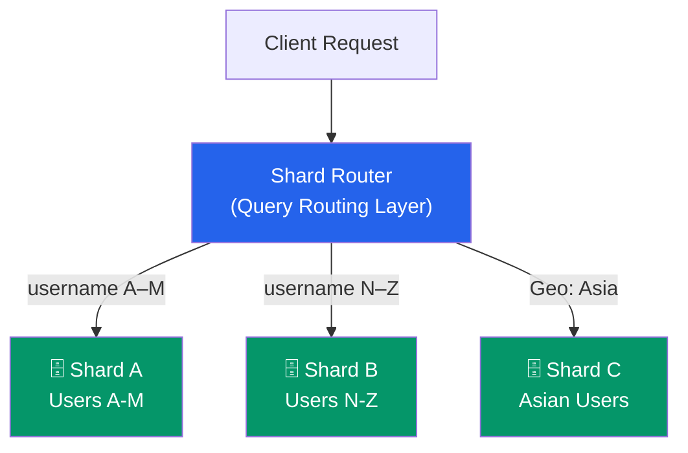

### Why Use Sharding?
- **Improved Performance:** Querying smaller datasets is faster.
- **Increased Scalability:** Add more shards as data grows.
- **Higher Availability:** If one shard goes down, others remain operational.
- **Easier Management:** Smaller databases are easier to back up and restore.

### Sharding Strategies

| Strategy | How it works | Best for |
|---|---|---|
| **Range-based** | Split by value range (e.g., A–M, N–Z) | Sequential data |
| **Hash-based** | Hash the key, assign to shard by modulo | Even distribution |
| **Directory-based** | Lookup table maps key → shard | Flexible routing |

### Key Considerations
- **Sharding Key:** Critical choice — poor key leads to hot spots.
- **Query Routing:** Must know which shard(s) to query.
- **Data Consistency:** Cross-shard transactions are complex (two-phase commit).
- **Rebalancing:** Adding/removing shards requires data movement.

> **Interview Language:** "Sharding is a **horizontal partitioning** technique. We split a large database into independent databases called **shards**. The **sharding key** is critical — a bad choice leads to **hot spots**. Strategies include range-based, hash-based, and directory-based sharding, each with tradeoffs."

---

## 2. Auto Scaler & Load Balancers

### Auto Scaler

An **Auto Scaler** automatically adjusts the number of running instances based on real-time metrics (CPU, memory, custom metrics).

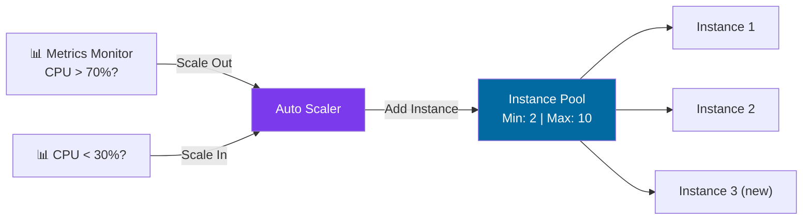

**Scaling Policy Example:**
- Minimum instances: **2**
- Maximum instances: **10**
- Scale up: CPU > 70% for 5 minutes → add 1 instance
- Scale down: CPU < 30% for 5 minutes → remove 1 instance

### Load Balancer

A **Load Balancer** acts as a traffic director, distributing incoming requests across multiple backend servers.

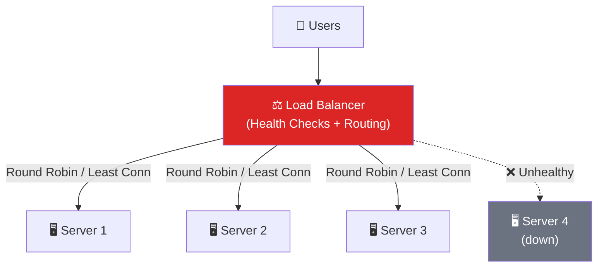

### Load Balancing Algorithms

| Algorithm | How it works | Use case |
|---|---|---|
| **Round Robin** | Sequential distribution | Equal-capacity servers |
| **Least Connections** | Route to server with fewest active connections | Variable request duration |
| **Weighted Round Robin** | Weight by server capacity | Mixed-capacity servers |
| **IP Hash** | Hash client IP → always same server | Session persistence |

### Auto Scaler + Load Balancer Together

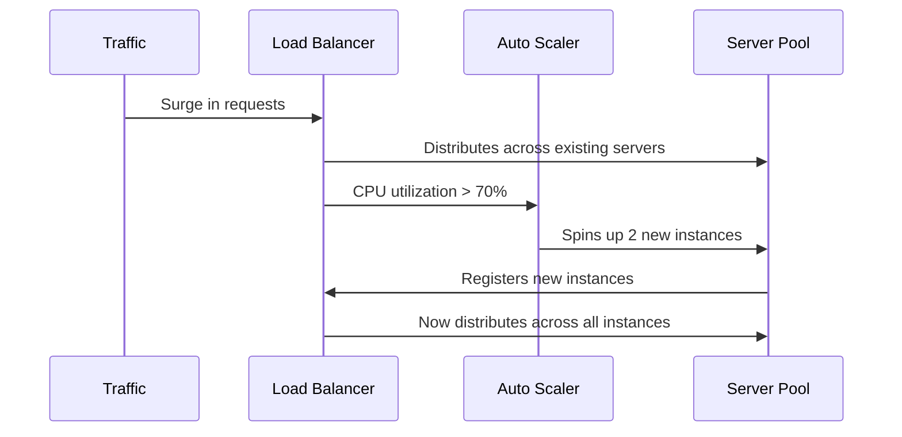

> **Interview Language:** "Auto Scalers and Load Balancers work together. The Load Balancer **distributes traffic** to healthy instances, and the Auto Scaler **adjusts the pool size** based on demand. Together they provide **elastic, highly available** applications."

---

## 3. Redis Cache

**Redis** is an **in-memory data store** used as a high-performance cache. It stores frequently accessed data in RAM to reduce database load and latency.

### Cache-Aside Pattern

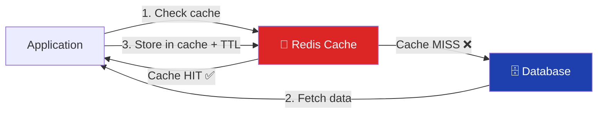

- **Cache Hit:** Data found in Redis → returned instantly.
- **Cache Miss:** Fetch from DB, serve user, store in Redis with TTL.
- **TTL (Time to Live):** Auto-expires stale data.

> **Interview Language:** "Redis is an **in-memory key-value store** for caching. We implement a **cache-aside pattern**: check cache first, on a miss retrieve from the database and populate the cache. We set **TTL** to prevent stale data."

---

## 4. AWS Elasticsearch & ELK Stack

### AWS Elasticsearch (OpenSearch)
A managed, distributed **RESTful search and analytics engine** built on Apache Lucene. Uses an **inverted index** for fast full-text search.

**Use cases:** Product search, log analysis, monitoring, autocomplete.

### ELK Stack Architecture

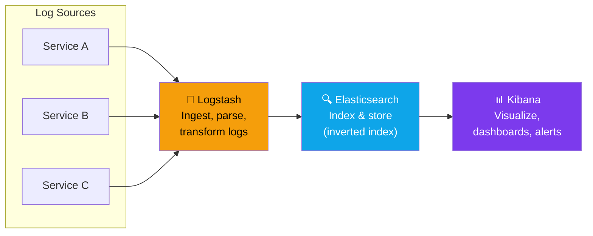

| Component | Role |
|---|---|
| **Elasticsearch** | Distributed search & storage engine |
| **Logstash** | Data pipeline — ingest, parse, transform |
| **Kibana** | Visualization, dashboards, querying |

> **Interview Language:** "The ELK stack provides **centralized logging**. Logstash is the **data pipeline**, Elasticsearch is the **search & storage engine**, and Kibana is the **visualization tool**. It gives observability across a distributed system."

---

## 5. Resilience4j & Circuit Breaker

**Resilience4j** is a lightweight **fault tolerance library** for Java that prevents cascading failures in microservices.

### Circuit Breaker State Machine

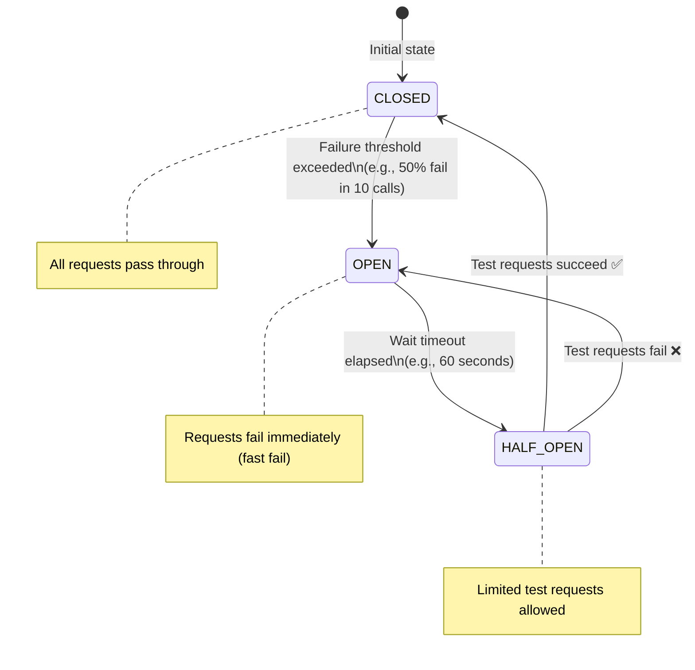

### Resilience4j Modules

| Module | Purpose |
|---|---|
| **Circuit Breaker** | Stop calling a failing dependency (fast fail) |
| **Retry** | Automatically retry transient failures |
| **Rate Limiter** | Limit calls per time period |
| **Bulkhead** | Isolate resources (thread pool per service) |
| **Time Limiter** | Set timeout on calls |

> **Interview Language:** "Resilience4j prevents **cascading failures**. The **Circuit Breaker** trips when failures exceed a threshold, **fails fast** instead of waiting for timeout, and then **re-tests** in HALF-OPEN state. **Retry** handles transient failures. **Bulkhead** isolates resources."

---

## 6. High-Level Design (HLD) Concepts

### System Components Overview

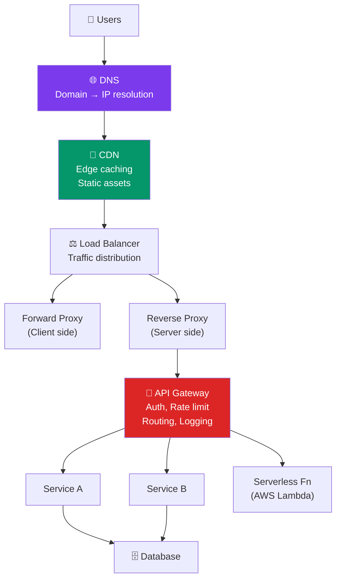

### Key HLD Concepts

**Servers** – Process client requests; return responses (HTML, JSON, files).

**DNS** – Internet's phonebook. Maps domain names → IP addresses. Hierarchical & distributed.

**Proxy vs Reverse Proxy**
- **Forward Proxy:** Sits in front of clients. Hides client identity (VPNs, corporate proxies).
- **Reverse Proxy:** Sits in front of servers. Provides load balancing, SSL termination, security. (Nginx, Cloudflare)

**Serverless** – Cloud provider manages infrastructure. Code runs on-demand. Pay per execution. (AWS Lambda, Azure Functions)

**API Gateway** – Single entry point for all API calls. Handles auth, rate limiting, routing, logging.

**Tier Architecture**

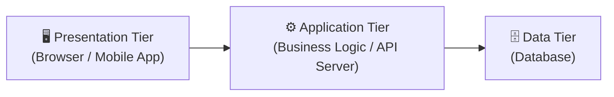

**Horizontal vs Vertical Scaling**

| | Vertical (Scale Up) | Horizontal (Scale Out) |
|---|---|---|
| **Approach** | Add more CPU/RAM to 1 machine | Add more machines |
| **Limit** | Hard ceiling on hardware | Virtually unlimited |
| **Failure** | Single point of failure | Fault tolerant |
| **Cost** | Expensive at scale | Cost effective |
| **Complexity** | Simple | Requires LB + coordination |

> **Interview Language:** "We prefer **horizontal scaling** — it avoids a single point of failure and allows virtually unlimited traffic via adding more machines behind a load balancer."

---

## 7. Database In-Depth

### CAP Theorem

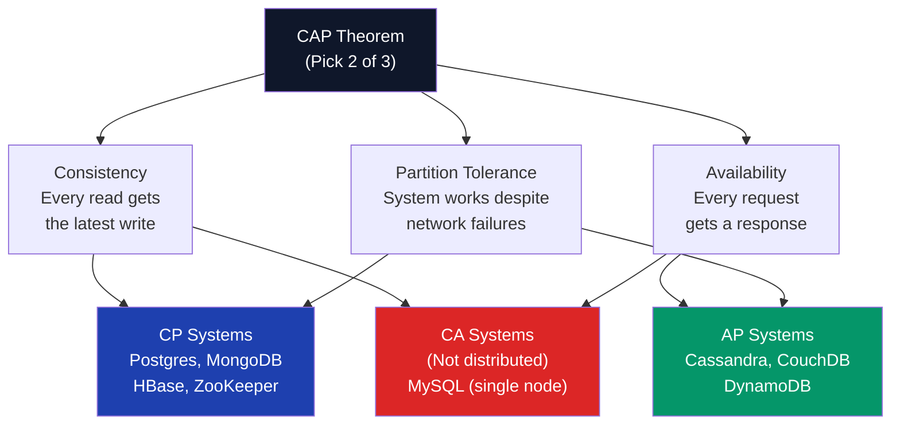

> In a distributed system, **Partition Tolerance is mandatory** → you must choose between **CP** or **AP**.

### Database Index
A data structure (B-tree, hash) that allows **fast lookups** — like a book's index. Speeds up reads but adds overhead on writes (index must also be updated).

### Data Replication

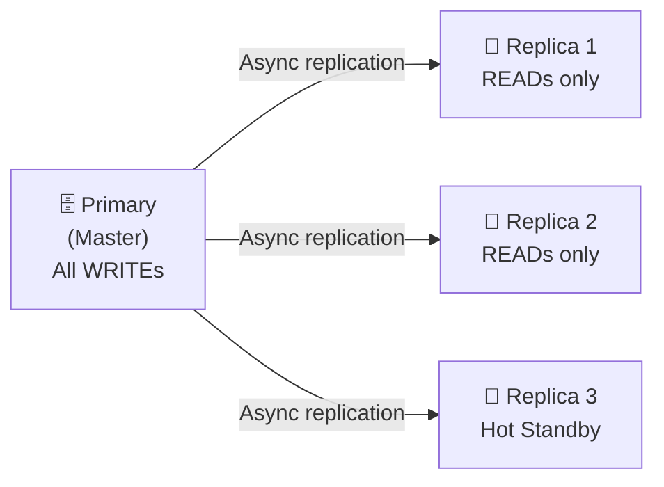

- **Read replicas** – Distribute read load.
- **Hot standby** – Instant failover if primary fails.

### SQL vs NoSQL

| Feature | SQL | NoSQL |
|---|---|---|
| **Schema** | Fixed, relational | Flexible, dynamic |
| **Consistency** | Strong (ACID) | Eventual (BASE) |
| **Scale** | Vertical (mainly) | Horizontal |
| **Joins** | Native | Manual / denormalized |
| **Examples** | PostgreSQL, MySQL | MongoDB, Cassandra, Redis |
| **Best for** | Banking, ERP, complex queries | Social feeds, logs, real-time |

---

## 8. Cache

### Cache Placement Layers

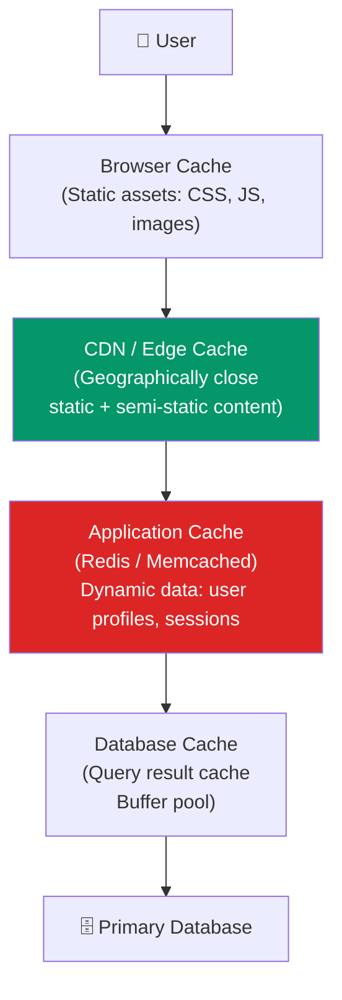

### Redis vs Memcached

| Feature | Redis | Memcached |
|---|---|---|
| **Data types** | Strings, Lists, Sets, Hashes, Sorted Sets | Strings only |
| **Persistence** | ✅ RDB / AOF snapshots | ❌ |
| **Replication** | ✅ | ❌ |
| **Cluster** | ✅ | ✅ (simple) |
| **Use case** | Advanced caching, sessions, queues, pub-sub | Simple high-speed caching |

### Cache Invalidation Strategies

| Strategy | How it works | Risk |
|---|---|---|
| **TTL (Time-based)** | Auto-expire after N seconds | Stale data during TTL window |
| **Write-through** | Write to cache AND DB simultaneously | Slightly slower writes |
| **Write-back** | Write to cache; DB updated async | Data loss if cache fails |
| **Manual invalidation** | App explicitly deletes cache on write | Developer overhead |

### Cache Eviction Policies
- **LRU (Least Recently Used):** Evict the item not accessed for the longest time. Most common.
- **LFU (Least Frequently Used):** Evict the item with lowest access count.

---

## 9. Load Balancers – Deep Dive

### Layer 4 vs Layer 7

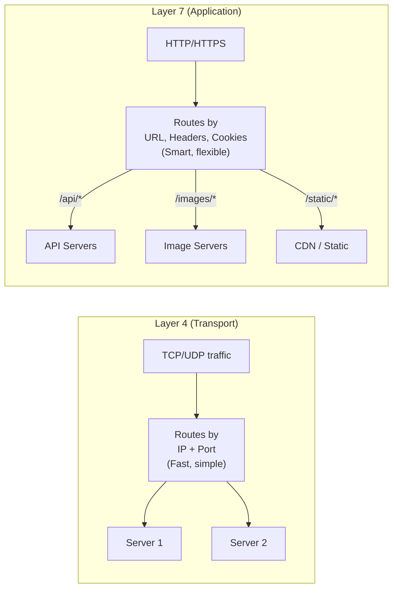

### Consistent Hashing

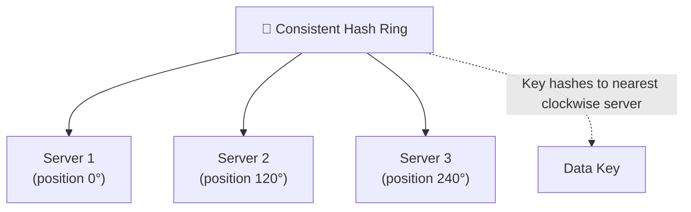

**Key benefit:** When a server is added/removed, only keys near that server are remapped (not all keys). Minimizes cache invalidation.

### Rate Limiting
Controls how many requests a client can make in a time window. Returns **429 Too Many Requests** when exceeded. Prevents DDoS and abuse.

---

## 10. Networks

### TCP vs UDP

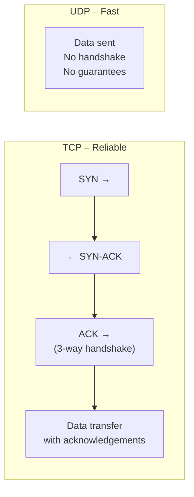

| Protocol | Type | Speed | Reliability | Use Cases |
|---|---|---|---|---|
| **TCP** | Connection-oriented | Slower | ✅ Reliable, ordered | HTTP, email, file transfer |
| **UDP** | Connectionless | Faster | ❌ No guarantee | Video streaming, gaming, VoIP |

### HTTP vs HTTPS
- **HTTP** – Plain text. Vulnerable to eavesdropping.
- **HTTPS** – HTTP + TLS/SSL encryption. Prevents MITM attacks. Required for all production services.

### WebSockets vs SSE vs Long Polling

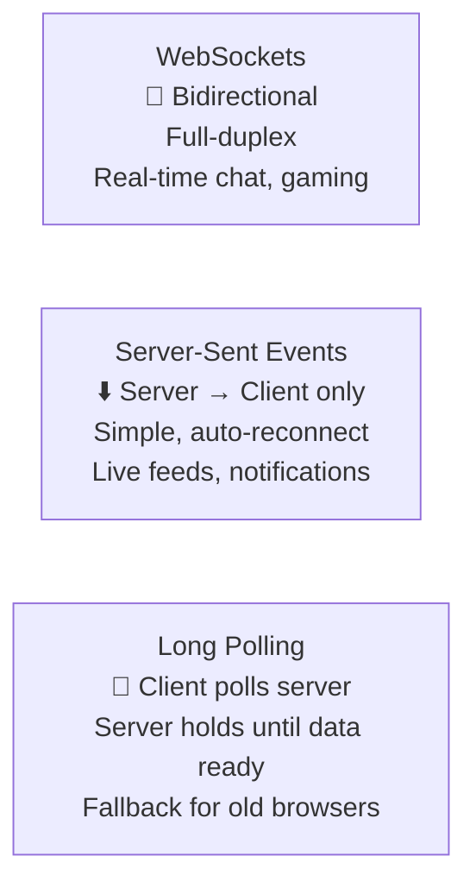

---

## 11. Monolith vs. Microservice

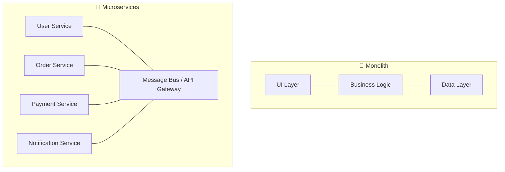

### Trade-offs

| | Monolith | Microservices |
|---|---|---|
| **Deployment** | Single deploy unit | Independent per service |
| **Scaling** | Scale the whole app | Scale individual services |
| **Complexity** | Simple to start | High operational overhead |
| **Technology** | Single stack | Polyglot (each service can differ) |
| **Failures** | One failure = whole app | Isolated failure |
| **Transactions** | ACID | Eventual consistency, sagas |

### Containerization (Docker)
Packages application + all dependencies into a portable **container**. Eliminates "works on my machine" issues. Core to CI/CD pipelines.

---

## 12. Message Queue

### Sync vs Async

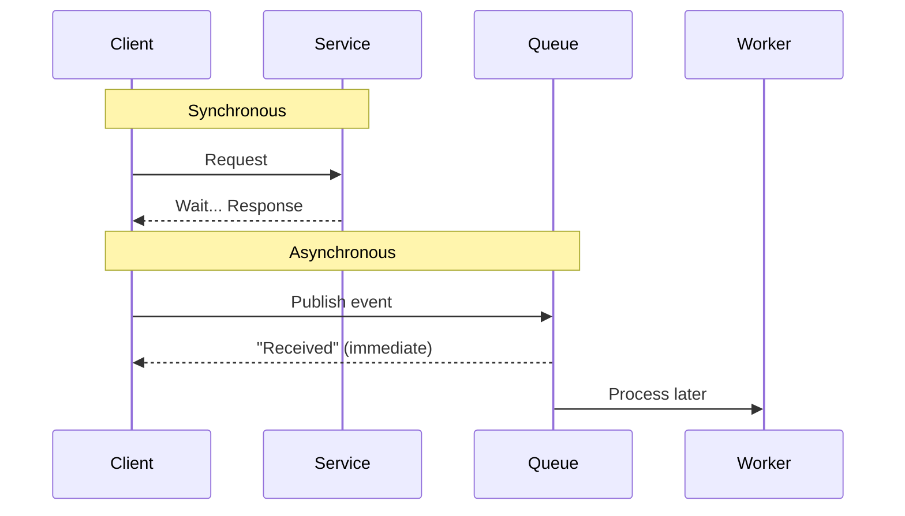

### Pub-Sub Model

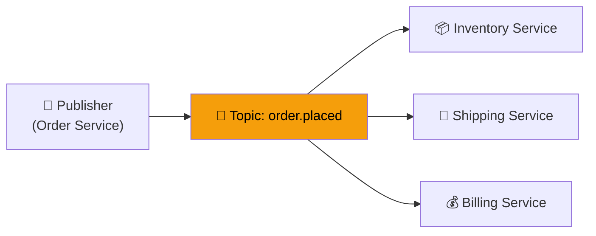

### Reliable Messaging: Retry + DLQ

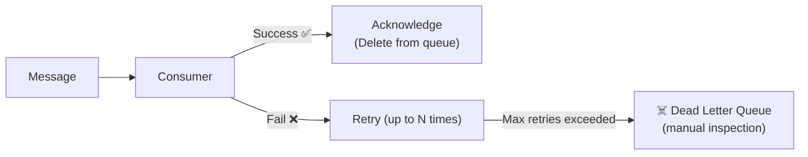

### Message Broker Comparison

| Tool | Type | Model | Best for |
|---|---|---|---|
| **Kafka** | Streaming platform | Pull, log-based | High-throughput pipelines, event streaming |
| **RabbitMQ** | Message broker | Push, AMQP | Complex routing, guaranteed delivery |
| **AWS SQS** | Managed queue | Pull | Decoupling microservices (1-to-1) |
| **AWS SNS** | Managed pub-sub | Push | Fan-out notifications (1-to-many) |

### Idempotency
An operation that can be performed multiple times with the **same result** as once. Critical for retry safety.
> Example: Payment API with a unique `transaction_id` — duplicate requests are ignored.

---

## 13. Security (Backend)

### Authentication vs Authorization

```mermaid
graph LR
    Login["Login Request"] --> AuthN["Authentication\n'Who are you?'\nVerify credentials"]
    AuthN -->|"Valid"| Token["Issue JWT Token"]
    Token --> Request["API Request + Token"]
    Request --> AuthZ["Authorization\n'What can you do?'\nCheck permissions"]
    AuthZ -->|"Allowed"| Resource["Access Resource"]
    AuthZ -->|"Denied"| Forbidden["403 Forbidden"]

    style AuthN fill:#0369a1,color:#fff
    style AuthZ fill:#7c3aed,color:#fff
```

### JWT Structure
```
Header.Payload.Signature

Header:  { "alg": "HS256", "typ": "JWT" }
Payload: { "sub": "user123", "role": "admin", "exp": 1719000000 }
Signature: HMACSHA256(base64(header) + "." + base64(payload), secret)
```

### OAuth 2.0 Flow
See the [AI Architect concepts guide](./AI_Architect_Interview_Concepts.md#14-security--oauth-jwt-iam) for the full OAuth sequence diagram.

---

## 14. API Evolution & Backward Compatibility

**Backward Compatibility** means a new API version must not break existing clients.

### Strategies

| Strategy | How | Example |
|---|---|---|
| **URI versioning** | Version in path | `/api/v1/users` → `/api/v2/users` |
| **Header versioning** | Custom header | `Accept: application/vnd.myapi.v2+json` |
| **Query param** | Version as param | `/users?version=2` |
| **Additive changes** | Only add new fields | Safe — old clients ignore new fields |

> **Rules:** Never remove/rename fields in a live version. Deprecate first, remove in a major version bump.

---

## 15. Retry Policies

### Retry with Exponential Backoff

```mermaid
graph LR
    Req["Request"] --> Try1["Attempt 1"]
    Try1 -->|"Fail"| Wait1["Wait 1s"]
    Wait1 --> Try2["Attempt 2"]
    Try2 -->|"Fail"| Wait2["Wait 2s"]
    Wait2 --> Try3["Attempt 3"]
    Try3 -->|"Fail"| Wait3["Wait 4s (+ jitter)"]
    Wait3 --> Try4["Attempt 4"]
    Try4 -->|"Max retries"| DLQ2["Dead Letter / Error"]
    Try4 -->|"Success ✅"| Done["Response"]

    style Done fill:#059669,color:#fff
    style DLQ2 fill:#dc2626,color:#fff
```

**Best practices:**
- Use **exponential backoff** to avoid overwhelming a failing service.
- Add **jitter** (random delay) to prevent thundering herd.
- Set a **max retry limit** to avoid infinite loops.
- Only retry **idempotent** operations.

---

## 16. Swift (iOS)

Swift is Apple's modern, open-source programming language for **iOS, macOS, watchOS, and tvOS** development.

**Key features:**
- **Type safety** — strong typing prevents runtime errors
- **Optionals** — explicit nil handling prevents null pointer crashes
- **Protocol-oriented** — composition over inheritance
- **Memory safety** — ARC (Automatic Reference Counting)
- **Swift concurrency** — `async/await`, structured concurrency (Swift 5.5+)
- **Interoperability** — works with Objective-C code

> **Interview Language:** "Swift is Apple's modern, safe, and performant language. Its **optional chaining** and **strong type system** prevent common crashes. For UI, I use **SwiftUI** for declarative interfaces and **UIKit** for complex, custom views."

---

## 17. Security Best Practices for UI/Frontend

### Threat Landscape

```mermaid
mindmap
  root((Frontend Security))
    XSS
      Inject malicious scripts
      Steal cookies/tokens
      Sanitize all user input
      Use CSP headers
    CSRF
      Cross-site forged requests
      Use CSRF tokens
      SameSite cookies
    CORS
      Cross-origin requests
      Whitelist trusted origins
      Preflight OPTIONS check
    MITM
      Intercept traffic
      Enforce HTTPS
      HSTS header
    DDoS
      Flood with requests
      CDN + Rate limiting
    Auth Issues
      JWT storage
      Never in localStorage
      Use httpOnly cookies
```

### XSS Prevention
- **Sanitize** all user input before rendering in DOM.
- Use **`textContent`** not `innerHTML` for user-generated content.
- Set **Content Security Policy (CSP)** header.

### CSP (Content Security Policy)
HTTP response header defining which sources are trusted:
```
Content-Security-Policy: default-src 'self'; script-src 'self' cdn.example.com
```
Prevents loading scripts from untrusted domains — neutralizes most XSS.

### CORS
Browser security feature. Server declares which origins are allowed via `Access-Control-Allow-Origin` header. Browser blocks requests from non-whitelisted origins.

### Authentication & Authorization in UI
- **Authentication** → handled by backend; frontend just captures and sends credentials.
- **Authorization** → UI hides/shows elements by role, but **backend always re-verifies** — never trust frontend-only checks.

---

## 18. Performance & Optimization

### Core Web Vitals

| Metric | What it measures | Target |
|---|---|---|
| **LCP** (Largest Contentful Paint) | Loading performance | < 2.5s |
| **FID / INP** (Interaction to Next Paint) | Responsiveness | < 200ms |
| **CLS** (Cumulative Layout Shift) | Visual stability | < 0.1 |

### Optimization Techniques

```mermaid
mindmap
  root((Frontend Performance))
    Code Splitting
      Lazy load routes
      Dynamic imports
      Reduce initial bundle
    Tree Shaking
      Remove dead code
      Webpack / Vite / Rollup
    Caching
      Browser cache headers
      Service Worker
      CDN caching
    Images
      WebP / AVIF format
      Lazy loading
      Responsive images srcset
    Network
      HTTP/2 multiplexing
      Preload critical assets
      Prefetch next page
    Rendering
      SSR for first paint
      CSR for interactions
      Streaming SSR
```

### Rendering Strategies

| Strategy | When rendered | SEO | TTFB | Use case |
|---|---|---|---|---|
| **CSR** (Client-Side Rendering) | Browser | ❌ Poor | Fast | Dashboards, apps |
| **SSR** (Server-Side Rendering) | Server per request | ✅ | Slower | Marketing pages |
| **SSG** (Static Site Generation) | Build time | ✅ | Fastest | Blogs, docs |
| **ISR** (Incremental Static Regeneration) | Build + on-demand | ✅ | Fast | Next.js, e-commerce |

---

## 19. Testing

### Testing Pyramid

```mermaid
graph TD
    E2E["🔺 E2E Tests\n(Cypress, Playwright)\nFew, Slow, High confidence"]
    Integration["🔷 Integration Tests\nComponent interactions\nAPI + UI together"]
    Unit["🔷 Unit Tests\n(Jest, Vitest)\nMany, Fast, Isolated"]

    Unit --> Integration --> E2E
```

| Type | Scope | Speed | Confidence |
|---|---|---|---|
| **Unit** | Single function/component | ⚡ Fast | Low (isolated) |
| **Integration** | Multiple units together | Medium | Medium |
| **E2E** | Full user flow | 🐢 Slow | High (real behavior) |
| **Visual regression** | UI snapshots | Medium | UI-specific |

> **Interview Language:** "We follow the **testing pyramid** — many fast unit tests at the base, fewer integration tests in the middle, and a small number of E2E tests at the top. Each layer catches different categories of bugs."

---

## 20. Frontend Architecture Patterns

### MVC / MVP / MVVM

```mermaid
graph LR
    subgraph MVC["MVC"]
        M1["Model"] <--> C1["Controller"]
        C1 --> V1["View"]
        V1 -.->|"User action"| C1
    end
    subgraph MVVM["MVVM"]
        M2["Model"] <--> VM["ViewModel\n(Observable state)"]
        VM <-->|"Data binding"| V2["View"]
    end
```

| Pattern | Controller/VM role | Best for |
|---|---|---|
| **MVC** | Controller mediates | Traditional web apps |
| **MVP** | Presenter handles logic | Android (older) |
| **MVVM** | ViewModel holds state | React, Vue, SwiftUI, Angular |
| **Flux/Redux** | Unidirectional data flow | Complex state, React |

### State Management

```mermaid
graph LR
    Action["User Action"] --> Dispatcher["Dispatcher"]
    Dispatcher --> Store["Store\n(Single source of truth)"]
    Store --> View["View re-renders"]
    View -->|"Triggers"| Action
```

---

## 21. Modern Architectural Styles

### Clean Architecture

```mermaid
graph TD
    subgraph CA["Clean Architecture (Concentric)"]
        E["Entities\n(Business Rules)"]
        UC["Use Cases\n(Application Logic)"]
        A["Adapters\n(Controllers, Presenters)"]
        F["Frameworks & Drivers\n(UI, DB, Web)"]
    end
    F --> A --> UC --> E
    style E fill:#dc2626,color:#fff
    style UC fill:#f59e0b,color:#000
    style A fill:#0369a1,color:#fff
    style F fill:#374151,color:#fff
```

**Dependency Rule:** Dependencies always point **inward**. Inner layers know nothing about outer layers.

### Micro-Frontends (MFE)

```mermaid
graph TB
    Shell["Shell / Host App\n(App Router)"] --> Team1["Team 1 MFE\n(Checkout)"]
    Shell --> Team2["Team 2 MFE\n(Product Listing)"]
    Shell --> Team3["Team 3 MFE\n(User Profile)"]

    Team1 --> SharedLib["Shared Libraries\n(Design System, Auth)"]
    Team2 --> SharedLib
    Team3 --> SharedLib

    style Shell fill:#7c3aed,color:#fff
```

**MFE Benefits:** Independent deployment, technology diversity, team autonomy.
**MFE Challenges:** Shared state, CSS isolation, performance (duplicate dependencies).

### BFF – Backend for Frontend

```mermaid
graph LR
    MobileApp["📱 Mobile App"] --> BFF_Mobile["BFF Mobile\n(Optimized payloads)"]
    WebApp2["🖥️ Web App"] --> BFF_Web["BFF Web\n(Full payloads)"]
    BFF_Mobile --> Microservices["Backend Microservices"]
    BFF_Web --> Microservices

    style BFF_Mobile fill:#059669,color:#fff
    style BFF_Web fill:#0369a1,color:#fff
```

Each client has its own backend layer. BFF aggregates, transforms, and optimizes API responses specifically for each client type.

---

## 22. UI Design Concepts

### Rendering in the Browser

```mermaid
graph LR
    HTML["HTML"] --> DOM["DOM Tree"]
    CSS["CSS"] --> CSSOM["CSSOM Tree"]
    DOM & CSSOM --> Render["Render Tree"]
    Render --> Layout["Layout\n(Calculate positions)"]
    Layout --> Paint["Paint\n(Draw pixels)"]
    Paint --> Composite["Composite\n(GPU layers)"]
```

**Critical path optimization:** Minimize render-blocking resources (inline critical CSS, defer non-critical JS).

### Accessibility (a11y)

| Principle | What it means | Example |
|---|---|---|
| **Proper Contrast** | WCAG 4.5:1 ratio for text | Dark text on white bg |
| **ARIA roles** | Semantic meaning for screen readers | `role="button"`, `aria-expanded` |
| **Keyboard navigation** | All interactions via keyboard | Tab order, focus indicators |
| **Alt text** | Describe images for screen readers | `alt="Profile photo of John"` |

---

## 23. Data Model & API Model

### Client-Side Data Models (Social Feed Example)

```
User {
  id: string
  username: string
  profilePictureUrl: string
}

Post {
  id: string
  author: User
  content: string
  likes: number
  comments: Comment[]
  createdAt: timestamp
}
```

### Choosing an API Style

| Style | Protocol | Best for | Tradeoffs |
|---|---|---|---|
| **REST** | HTTP | Standard CRUD, public APIs | Over/under fetching |
| **GraphQL** | HTTP | Flexible queries, mobile | Complex caching |
| **gRPC** | HTTP/2 | Microservices, low latency | Not browser-native |
| **WebSocket** | TCP | Real-time bidirectional | Server resources |
| **SSE** | HTTP | Server push, notifications | One-direction only |

---

## 24. API Models & Communication Styles

### Long Polling vs WebSocket vs SSE

```mermaid
sequenceDiagram
    participant C as Client
    participant S as Server

    Note over C,S: Long Polling
    C->>S: Request (hold until data)
    S-->>C: Response (new data available)
    C->>S: Immediately re-polls

    Note over C,S: WebSocket
    C->>S: Upgrade: websocket
    S-->>C: 101 Switching Protocols
    S-->>C: Push data anytime
    C-->>S: Send data anytime

    Note over C,S: SSE
    C->>S: GET /events (EventSource)
    S-->>C: data: event1
    S-->>C: data: event2 (push only)
```

---

## 25. Module Federation & MFE

**Module Federation** (Webpack 5) allows multiple independent builds to share code at runtime.

```mermaid
graph TB
    Host["Host App\n(Shell)"] -->|"Loads at runtime"| Remote1["Remote 1\n(Checkout MFE)"]
    Host -->|"Loads at runtime"| Remote2["Remote 2\n(Product MFE)"]
    Remote1 & Remote2 -->|"Shared"| Shared["react@18\nreact-dom@18\nDesign System"]

    style Host fill:#7c3aed,color:#fff
    style Shared fill:#059669,color:#fff
```

**Key benefit:** Each remote team deploys independently. Host loads the latest version at runtime without rebuilding.

---

## 26. BFF – Backend for Frontend

A dedicated backend layer per frontend client (mobile, web, TV). Aggregates multiple microservice calls into a single optimized response.

**Problem it solves:** Mobile needs a lightweight payload; web needs rich data — the same backend can't efficiently serve both.

```mermaid
graph LR
    Mobile["📱 Mobile"] --> BFF_M["BFF Mobile"] --> UserSvc2["User Service"]
    Web["🖥️ Web"] --> BFF_W["BFF Web"] --> UserSvc2
    BFF_M --> OrderSvc2["Order Service"]
    BFF_W --> OrderSvc2
    BFF_W --> RecoSvc["Recommendation Service"]
```

---

## 27. GraphQL

**GraphQL** is a query language for APIs that lets clients request **exactly the data they need** — no more, no less.

```mermaid
graph LR
    Client2["Client"] -->|"Single query"| GQL["GraphQL\n/graphql"]
    GQL --> R1["User Resolver"]
    GQL --> R2["Orders Resolver"]
    GQL --> R3["Products Resolver"]
    R1 & R2 & R3 --> Response["Single aggregated\nJSON response"]

    style GQL fill:#e535ab,color:#fff
```

| Feature | REST | GraphQL |
|---|---|---|
| **Endpoint** | Multiple (`/users`, `/orders`) | Single (`/graphql`) |
| **Fetching** | Fixed response shape | Client-defined shape |
| **Over-fetching** | ✅ Common | ❌ Eliminated |
| **Under-fetching** | ✅ Requires multiple calls | ❌ Eliminated |
| **Caching** | HTTP cache (simple) | Client-side (complex) |
| **Type system** | Optional | ✅ Schema-first |

> **Interview Language:** "GraphQL solves the **over-fetching and under-fetching** problems of REST. The client specifies exactly what fields it needs in a single query, which is especially valuable for **mobile clients** where bandwidth is constrained."

---

## 28. gRPC

**gRPC** is a high-performance, open-source **Remote Procedure Call** framework from Google. Uses **HTTP/2** and **Protocol Buffers (protobuf)** for binary serialization.

```mermaid
graph LR
    Client3["Client Service"] -->|"Protobuf binary\nHTTP/2"| gRPC_Server["gRPC Server"]
    gRPC_Server --> Handler["Service Handler\n(auto-generated stubs)"]

    style gRPC_Server fill:#4285F4,color:#fff
```

| Feature | REST | gRPC |
|---|---|---|
| **Protocol** | HTTP/1.1 | HTTP/2 |
| **Format** | JSON (text) | Protobuf (binary) |
| **Speed** | Slower | 7–10x faster |
| **Streaming** | Limited | ✅ Bidirectional |
| **Browser support** | ✅ Native | ❌ Needs grpc-web |
| **Best for** | Public APIs | Microservice-to-microservice |

> **Interview Language:** "gRPC is our choice for **internal microservice communication**. It's significantly faster than REST due to **HTTP/2 multiplexing** and **protobuf binary encoding**. It also supports **bidirectional streaming**, which is ideal for real-time data pipelines."

---

## 29. Domain-Driven Architecture

**Domain-Driven Design (DDD)** is an approach to structuring software around the **business domain** rather than technical concerns.

```mermaid
graph TB
    BC1["Bounded Context:\nOrdering"]
    BC2["Bounded Context:\nInventory"]
    BC3["Bounded Context:\nShipping"]

    BC1 <-->|"Domain Events\nAnti-Corruption Layer"| BC2
    BC2 <-->|"Domain Events"| BC3

    subgraph BC1["Ordering Bounded Context"]
        Order["Order Aggregate"]
        OrderItem["OrderItem Entity"]
        OrderRepo["Order Repository"]
    end
```

**Key DDD Concepts:**

| Concept | Definition |
|---|---|
| **Domain** | The business problem space |
| **Bounded Context** | A defined boundary where a domain model is valid |
| **Aggregate** | A cluster of entities treated as a unit (with one root) |
| **Entity** | An object with a unique identity |
| **Value Object** | An object defined only by its attributes (no identity) |
| **Domain Event** | Something that happened in the domain (e.g., `OrderPlaced`) |
| **Repository** | Interface for persisting and retrieving aggregates |

---

## 30. Pagination (Offset vs. Cursor)

```mermaid
graph LR
    subgraph Offset["Offset Pagination"]
        O1["GET /posts?page=3&limit=10\n→ SKIP 20 ROWS TAKE 10\nProblem: Inconsistent on insert/delete\nSlow on large OFFSET"]
    end
    subgraph Cursor["Cursor / Keyset Pagination"]
        C1["GET /posts?cursor=id_xyz&limit=10\n→ WHERE id > 'xyz' LIMIT 10\nStable, fast, works with inserts\nNo skipping rows in DB"]
    end
```

| | Offset | Cursor/Keyset |
|---|---|---|
| **Performance** | Slow at large pages (OFFSET scan) | Fast (index seek) |
| **Stability** | ❌ Rows shift on insert/delete | ✅ Stable |
| **Random access** | ✅ Jump to any page | ❌ Sequential only |
| **Implementation** | Simple | Slightly more complex |
| **Best for** | Admin panels, small datasets | Infinite scroll, large datasets |

---

## 31. Debouncing & Throttling

Both control how often a function executes in response to frequent events.

```mermaid
graph LR
    Events["Rapid Events\n(typing, scrolling, resize)"] --> Debounce["Debounce\nWait N ms after\nlast event\nExample: search input"]
    Events --> Throttle["Throttle\nExecute at most\nevery N ms\nExample: scroll handler"]

    style Debounce fill:#0369a1,color:#fff
    style Throttle fill:#059669,color:#fff
```

| | Debounce | Throttle |
|---|---|---|
| **Fires when** | After N ms of inactivity | At most once per N ms |
| **Use case** | Search autocomplete, form validation | Scroll events, resize, API polling |
| **Pattern** | Delay + cancel | Rate limiting |

---

## 32. SSE & Infinite Scroll

### Server-Sent Events (SSE)
One-way server → client streaming over HTTP. Browser auto-reconnects. Simple to implement.

```javascript
// Client
const es = new EventSource('/events');
es.onmessage = (e) => console.log(e.data);

// Server sends:
// data: {"type": "notification", "message": "New order placed"}
```

### Infinite Scroll Implementation

```mermaid
graph LR
    Scroll["User scrolls near bottom\n(Intersection Observer)"] --> Trigger["Trigger load more"]
    Trigger --> API["Fetch next page\n(cursor-based)"]
    API --> Append["Append items to DOM"]
    Append --> Virtualize["Virtualize DOM\n(only render visible rows)\nReact Virtual / TanStack Virtual"]
```

**Key concern:** Without **DOM virtualization**, rendering thousands of items causes memory/performance issues.

---

## 33. Design Patterns & Anti-Patterns

### Common Design Patterns

```mermaid
mindmap
  root((Design Patterns))
    Creational
      Singleton
        One instance only
      Factory
        Create objects without specifying class
      Builder
        Step-by-step construction
    Structural
      Adapter
        Incompatible interfaces
      Decorator
        Add behavior dynamically
      Facade
        Simplified interface
    Behavioral
      Observer
        Event subscription
      Strategy
        Interchangeable algorithms
      Command
        Encapsulate requests
```

### Common Anti-Patterns

| Anti-Pattern | Problem | Solution |
|---|---|---|
| **God Object** | One class does everything | Single Responsibility Principle |
| **Spaghetti Code** | Tangled, unstructured code | Modular architecture |
| **Prop Drilling** | Passing props through many layers | Context / state management |
| **N+1 Query** | 1 query + N more for related data | JOINs, DataLoader, batching |
| **Magic Numbers** | Unnamed constants in code | Named constants / enums |

---

## 34. Clean Architecture

```mermaid
graph TD
    subgraph Layers["Clean Architecture Layers (inside → out)"]
        E2["🔴 Entities\nCore business rules\nNo dependencies"]
        UC2["🟡 Use Cases\nApplication business logic\nDepends on Entities"]
        A2["🔵 Interface Adapters\nControllers, Presenters, Gateways\nDepends on Use Cases"]
        F2["⚫ Frameworks & Drivers\nUI, DB, Web, External APIs\nDepends on Adapters"]
    end
    F2 --> A2 --> UC2 --> E2
```

**The Dependency Rule:** Source code dependencies only point **inward**. Nothing in an inner circle knows anything about the outer circles.

**Benefits:** Testable (entities require no framework), flexible (swap UI or DB without changing business logic), maintainable.

---

## 35. Composable Architecture (TCA)

**The Composable Architecture (TCA)** is a library for building applications in Swift in a consistent, understandable, and testable way. Created by Point-Free.

```mermaid
graph LR
    View3["SwiftUI View"] -->|"send action"| Store["Store\n(State + Reducer)"]
    Store -->|"new state"| View3
    Store --> Reducer["Reducer\n(State, Action) → State + Effect"]
    Reducer -->|"side effect"| Effect["Effect\n(async work, API calls)"]
    Effect -->|"action"| Store

    style Store fill:#f97316,color:#fff
    style Reducer fill:#7c3aed,color:#fff
```

**Core concepts:** `State`, `Action`, `Reducer`, `Store`, `Effect`.
**Benefits:** Unidirectional data flow, easy unit testing, composable feature modules.

---

## 36. Android Concepts

### ViewModel vs LiveData

| Feature | ViewModel | LiveData |
|---|---|---|
| **Purpose** | Store & manage UI-related data | Observable data holder |
| **Lifecycle aware** | Survives configuration changes | Observes lifecycle, auto-unsubscribes |
| **Modern alternative** | Still used | **StateFlow / SharedFlow** (Kotlin) |

### Fragment vs Activity

```mermaid
graph TD
    Activity2["Activity\n(Full screen, independent lifecycle)"] --> FragA["Fragment A\n(Left panel)"]
    Activity2 --> FragB["Fragment B\n(Right panel)"]
    FragA -.->|"Reuse in"| Activity3["Another Activity"]
```

### Service vs BroadcastReceiver

| Component | Purpose | Runs in |
|---|---|---|
| **Service** | Long-running background task | Main thread (manage threading yourself) |
| **IntentService** *(deprecated)* | Sequential background tasks | Worker thread (auto) |
| **BroadcastReceiver** | System/app-wide event listener | Main thread, short-lived |

### Looper, Handler, MessageQueue

```mermaid
graph LR
    Thread["Worker Thread"] -->|"post message"| MQ["MessageQueue"]
    MQ --> Looper2["Looper\n(infinite loop)"]
    Looper2 --> Handler["Handler\n(dispatches messages)"]
    Handler --> MainThread["Main Thread\n(UI updates)"]
```

### Memory Leaks in Android
- **Common causes:** Static references to Context, unregistered listeners, inner class holding outer reference.
- **Prevention:** Use `WeakReference`, unregister in `onDestroy`, use `lifecycleScope` for coroutines.
- **Tools:** LeakCanary, Android Profiler.

### AIDL (Android Interface Definition Language)
Enables **Inter-Process Communication (IPC)** between apps in separate processes. Define interface in `.aidl` file; build tools generate Java/Kotlin stubs.

### SQLite in Android
Embedded relational database. Access via `SQLiteOpenHelper` or **Room** (recommended ORM that provides compile-time SQL verification).

### Parcelable vs Serializable

| | Serializable | Parcelable |
|---|---|---|
| **Language** | Java | Android-specific |
| **Performance** | Slow (reflection) | Fast (manual, no reflection) |
| **Implementation** | Easy (just implement interface) | Verbose (manual implementation) |
| **Modern** | Avoid | ✅ Use (or `@Parcelize` annotation) |

---

## 37. Eventual Consistency & Event Sourcing

### Eventual Consistency
In a distributed system, after a write, all replicas will **eventually** converge to the same value — but not immediately.

```mermaid
sequenceDiagram
    participant Client4
    participant Primary2 as Primary DB
    participant Replica1 as Replica 1
    participant Replica2 as Replica 2

    Client4->>Primary2: Write: user.name = "Alice"
    Primary2-->>Client4: ACK (success)
    Note over Replica1,Replica2: Replication lag (50ms)
    Client4->>Replica1: Read: user.name
    Replica1-->>Client4: "Bob" (stale data!)
    Primary2->>Replica1: Replicate
    Primary2->>Replica2: Replicate
    Note over Replica1,Replica2: Now consistent: "Alice"
```

### Event Sourcing
Instead of storing current state, store a **sequence of events** that led to the current state.

```mermaid
graph LR
    E1["OrderCreated"] --> E2["ItemAdded"]
    E2 --> E3["PaymentApplied"]
    E3 --> E4["OrderShipped"]
    E4 --> CurrentState["Current State:\nOrder #123 - Shipped"]

    style CurrentState fill:#059669,color:#fff
```

**Benefits:** Full audit trail, replay to any point in time, temporal queries.
**Use cases:** Banking, e-commerce orders, CQRS systems.

---

## 38. Tree Shaking & Lightweight Injection Token

### Tree Shaking
**Dead code elimination** at build time. Bundlers (Webpack, Vite, Rollup) analyze imports and only include code actually used.

```
// Only debounce and throttle used:
import { debounce, throttle } from 'lodash-es'

// Tree shaker removes all other lodash functions from bundle ✅
```

### Lightweight Injection Token (Angular)
An `InjectionToken` that doesn't carry its type at runtime, keeping bundle size small. Used for optional or interface-typed dependencies.

```typescript
export const MY_CONFIG = new InjectionToken<AppConfig>('my-config');
```

---

## 39. Elasticsearch & ELK Stack

*(See [Section 4](#4-aws-elasticsearch--elk-stack) for the full ELK Stack diagram)*

### Elasticsearch Core Concepts

| Concept | Description |
|---|---|
| **Index** | Like a database table; stores documents |
| **Document** | A JSON object stored in an index |
| **Inverted Index** | Maps terms → documents (enables fast full-text search) |
| **Shard** | A horizontal partition of an index (enables distribution) |
| **Replica** | A copy of a shard (for availability and read scaling) |
| **Mapping** | Schema definition for an index |
| **Query DSL** | JSON-based query language |

### ViewModel vs LiveData in Android (Modern Approach)

```mermaid
graph LR
    VM["ViewModel\n(StateFlow<UiState>)"] -->|"collects in"| View4["Composable / Fragment"]
    View4 -->|"events"| VM
    VM --> Repo["Repository"]
    Repo --> Network["Network / DB"]

    style VM fill:#4285F4,color:#fff
```

---

## 40. ANR vs. Crash (Android)

```mermaid
graph TD
    Problem["App Failure"] --> Crash2["💥 Crash\nUnhandled exception\n(NullPointerException)\nApp closes immediately\nStack trace generated"]
    Problem --> ANR2["🥶 ANR\nUI thread blocked > 5s\nApp freezes\nUser sees 'Wait / Force Close' dialog\nThread dump generated"]

    Crash2 --> Fix1["Fix: Handle exceptions\nTry-catch, null checks"]
    ANR2 --> Fix2["Fix: Move work off main thread\nasync/await, coroutines\nRoom async queries"]

    style Crash2 fill:#dc2626,color:#fff
    style ANR2 fill:#f59e0b,color:#000
    style Fix1 fill:#059669,color:#fff
    style Fix2 fill:#059669,color:#fff
```

### ANR vs Crash Comparison

| Feature | Crash | ANR |
|---|---|---|
| **Cause** | Unhandled exception | UI thread blocked > 5 seconds |
| **User experience** | App closes abruptly | App freezes, dialog shown |
| **Debug artifact** | Stack trace | Thread dump |
| **Ease of debugging** | Easier (clear stack trace) | Harder (state snapshot) |
| **Prevention** | Null checks, try-catch | Move work to background thread |

> **ANR Example:** Performing a database query directly on the main thread causes the UI to freeze for the duration of the query. **Fix:** Use Kotlin coroutines (`viewModelScope.launch { withContext(Dispatchers.IO) { ... } }`) to move the query to a background thread.

---

*Last updated: June 2026 | Clean version of Description-UI Questions*
