# 00 — Introduction: Enterprise Agentic AI Tutorial Series

> **Series Goal:** Equip Senior Engineers, Solution Architects, and AI Engineers to design, build, secure, deploy, and govern production-grade multi-agent AI systems on Azure AI Foundry — and to ace senior/staff/principal interviews.

---

## What This Series Is

This tutorial series is a long-term, living reference guide modelled on Microsoft Learn, the Azure Architecture Center, and Martin Fowler's architecture catalog. Every module is:

- **Hands-on** — complete, runnable code, not pseudocode stubs
- **Azure-first** — every architecture decision references real Azure services
- **Diagram-rich** — Mermaid diagrams for every architectural concept
- **Interview-ready** — every module closes with graded Q&A (beginner → architecture-level)

Source material is grounded in real enterprise engineering requirements for Software Engineer – AI Agents (Azure AI Foundry) roles.

---

## Who This Is For

| Role | What You Will Get |
|---|---|
| Senior / Staff Software Engineer | Depth on frameworks, coding patterns, async, streaming |
| AI / ML Engineer | Agent internals, RAG pipelines, evaluation, fine-tuning |
| Cloud / Solutions Architect | Reference architectures, service selection, scalability |
| Enterprise Architect | Governance, compliance, cost, multi-team AI platforms |
| Technical Lead | End-to-end project blueprints, CI/CD, team workflows |
| Interview Candidate | Role-specific Q&A banks with model answers |

**Prerequisites:** Python proficiency, basic Azure familiarity (AZ-900 level), REST API experience.

---

## Series Module Map

```mermaid
graph TD
    subgraph Foundation["🟦 Foundation"]
        M00[00 Introduction]
        M01[01 Agentic AI Fundamentals]
        M02[02 LLMs & Foundation Models]
    end

    subgraph AzurePlatform["🟧 Azure AI Platform"]
        M03[03 Azure AI Foundry]
        M04[04 Azure OpenAI]
        M28[28 Azure Services]
    end

    subgraph Frameworks["🟩 Agent Frameworks"]
        M05[05 Semantic Kernel]
        M06[06 LangChain]
        M07[07 LangGraph]
        M08[08 AutoGen]
        M09[09 OpenAI Agent SDK]
    end

    subgraph MultiAgent["🟥 Multi-Agent Systems"]
        M10[10 Multi-Agent Systems]
        M11[11 Agent Orchestration]
        M12[12 Agent-to-Agent Comms]
        M13[13 MCP Protocol]
    end

    subgraph Knowledge["🟨 Knowledge & Reasoning"]
        M14[14 RAG]
        M15[15 Enterprise RAG]
        M16[16 GraphRAG]
        M17[17 Vector Databases]
        M18[18 Prompt Engineering]
        M19[19 Tool Calling]
        M20[20 Function Calling]
        M21[21 Memory]
        M22[22 Planning & Reasoning]
    end

    subgraph Automation["🟪 Automation & Design"]
        M23[23 Workflow Automation]
        M24[24 Business Use Cases]
        M25[25 System Design]
        M26[26 Microservices]
    end

    subgraph CloudNative["☁️ Cloud Native"]
        M27[27 Cloud Native AI]
        M29[29 Deployment]
        M30[30 Kubernetes]
        M31[31 DevOps]
    end

    subgraph Operations["⚙️ Operations"]
        M32[32 Observability]
        M33[33 Security]
        M34[34 Responsible AI]
        M35[35 AI Governance]
        M36[36 Performance Tuning]
        M37[37 Cost Optimization]
    end

    subgraph Capstone["🏆 Capstone"]
        M38[38 Reference Architecture]
        M39[39 End-to-End Projects]
        M40[40 Interview Preparation]
        MA[Appendix]
    end

    Foundation --> AzurePlatform
    AzurePlatform --> Frameworks
    Frameworks --> MultiAgent
    MultiAgent --> Knowledge
    Knowledge --> Automation
    Automation --> CloudNative
    CloudNative --> Operations
    Operations --> Capstone

    classDef primary   fill:#0078d4,color:#fff,stroke:#005a9e
    classDef secondary fill:#7b2d8b,color:#fff,stroke:#5a1a6b
    classDef storage   fill:#2d7d4a,color:#fff,stroke:#1f5c35
    classDef security  fill:#c7372f,color:#fff,stroke:#a02020
    classDef monitor   fill:#e67300,color:#fff,stroke:#b35500
    classDef success   fill:#27ae60,color:#fff,stroke:#1e8449
    classDef warning   fill:#f39c12,color:#333,stroke:#d68910
    classDef neutral   fill:#f3f3f3,color:#333,stroke:#999
    classDef user      fill:#cce5ff,color:#004085,stroke:#004085
    classDef decision  fill:#fff3cd,color:#856404,stroke:#856404
    classDef highlight fill:#e74c3c,color:#fff,stroke:#c0392b

    class M00,M01,M02 neutral
    class M03,M04,M28 primary
    class M05,M06,M07,M08,M09 secondary
    class M10,M11,M12,M13 secondary
    class M14,M15,M16,M17,M18,M19,M20,M21,M22 storage
    class M23,M24,M25,M26 neutral
    class M27,M29,M30,M31 primary
    class M32,M33,M34,M35,M36,M37 monitor
    class M38,M39,M40,MA highlight
```



---

## Recommended Learning Paths

```mermaid
graph TB
    subgraph PATHA["Path A — AI Engineer (12 weeks)"]
        W1A["Wks 1-2\n00 Intro · 01 ReAct · 02 LLMs · 03 SK · 04 AOAI"]
        W2A["Wks 3-5\n05 LangChain · 06 AutoGen · 07 LangGraph · 08-09 SDKs"]
        W3A["Wks 6-8\n10-17 Multi-Agent · RAG · GraphRAG · Vectors"]
        W4A["Wks 9-10\n18-22 Prompts · Tools · Memory · Planning"]
        W5A["Wks 11-12\n32-35 Observability · Security · RAI · Governance\n39 Projects · 40 Interview"]
        W1A --> W2A --> W3A --> W4A --> W5A
    end

    subgraph PATHB["Path B — Cloud / Solution Architect (8 weeks)"]
        W1B["Wks 1-2\n00 · 01 · 03 · 04"]
        W2B["Wks 3-4\n10-11 Multi-Agent · 14-15 RAG · 25 System Design"]
        W3B["Wks 5-6\n27 Cloud-Native · 29-31 Deploy/K8s/DevOps · 32 Observability"]
        W4B["Wks 7-8\n33 Security · 35 Governance · 38 Ref Arch · 40 Interview"]
        W1B --> W2B --> W3B --> W4B
    end

    subgraph PATHC["Path C — Interview Fast Track (3 weeks)"]
        W1C["Week 1\n00 · 01 · 03 · 05 · 10"]
        W2C["Week 2\n14 · 22 · 25 · 33 · 35"]
        W3C["Week 3\n38 · 39 · 40 · Appendix"]
        W1C --> W2C --> W3C
    end

    classDef primary   fill:#0078d4,color:#fff,stroke:#005a9e
    classDef secondary fill:#7b2d8b,color:#fff,stroke:#5a1a6b
    classDef storage   fill:#2d7d4a,color:#fff,stroke:#1f5c35
    classDef security  fill:#c7372f,color:#fff,stroke:#a02020
    classDef monitor   fill:#e67300,color:#fff,stroke:#b35500
    classDef success   fill:#27ae60,color:#fff,stroke:#1e8449
    classDef warning   fill:#f39c12,color:#333,stroke:#d68910
    classDef neutral   fill:#f3f3f3,color:#333,stroke:#999
    classDef user      fill:#cce5ff,color:#004085,stroke:#004085
    classDef decision  fill:#fff3cd,color:#856404,stroke:#856404
    classDef highlight fill:#e74c3c,color:#fff,stroke:#c0392b

    class W1A,W2A,W3A,W4A,W5A primary
    class W1B,W2B,W3B,W4B secondary
    class W1C,W2C,W3C highlight
```



### Path A — AI Engineer (12 weeks)
```
Weeks 1–2:  00, 01, 02, 03, 04
Weeks 3–5:  05, 06, 07, 08, 09
Weeks 6–8:  10, 11, 12, 13, 14, 15, 16, 17
Weeks 9–10: 18, 19, 20, 21, 22, 32
Weeks 11–12: 33, 34, 35, 39, 40
```

### Path B — Cloud / Solution Architect (8 weeks)
```
Weeks 1–2:  00, 01, 03, 04
Weeks 3–4:  10, 11, 14, 15, 25
Weeks 5–6:  27, 29, 30, 31, 32
Weeks 7–8:  33, 35, 38, 40
```

### Path C — Interview Fast Track (3 weeks)
```
Week 1: 00, 01, 03, 05, 10
Week 2: 14, 22, 25, 33, 35
Week 3: 38, 39, 40, Appendix
```

---

## Azure Environment Setup

### 1 — Prerequisites

```bash
# Install Azure CLI
curl -sL https://aka.ms/InstallAzureCLIDeb | sudo bash

# Install Python 3.11+
python --version  # 3.11 minimum

# Create a virtual environment
python -m venv .venv && source .venv/bin/activate

# Core packages used throughout this series
pip install azure-ai-projects azure-ai-inference azure-identity \
            openai semantic-kernel langchain langchain-openai \
            langgraph autogen-agentchat fastapi uvicorn \
            azure-search-documents python-dotenv pydantic \
            opentelemetry-sdk opentelemetry-exporter-otlp
```

### 2 — Login and Set Subscription

```bash
az login
az account set --subscription "<YOUR_SUBSCRIPTION_ID>"
az account show
```

### 3 — Environment Variables Template

Create `.env` in your project root — never commit this file.

```dotenv
# Azure Identity
AZURE_SUBSCRIPTION_ID=<your-subscription-id>
AZURE_TENANT_ID=<your-tenant-id>
AZURE_CLIENT_ID=<your-client-id>          # Only for Service Principal auth
AZURE_CLIENT_SECRET=<your-client-secret>  # Only for Service Principal auth

# Azure AI Foundry
AZURE_AI_PROJECT_ENDPOINT=https://<hub>.api.azureml.ms
AZURE_AI_PROJECT_NAME=<project-name>
AZURE_AI_RESOURCE_GROUP=<resource-group>

# Azure OpenAI
AZURE_OPENAI_ENDPOINT=https://<resource>.openai.azure.com/
AZURE_OPENAI_API_KEY=<api-key>
AZURE_OPENAI_DEPLOYMENT_NAME=gpt-4o
AZURE_OPENAI_API_VERSION=2024-10-21

# Azure AI Search
AZURE_SEARCH_ENDPOINT=https://<search-resource>.search.windows.net
AZURE_SEARCH_ADMIN_KEY=<admin-key>
AZURE_SEARCH_INDEX_NAME=enterprise-kb

# Application Insights
APPLICATIONINSIGHTS_CONNECTION_STRING=InstrumentationKey=<key>
```

### 4 — Managed Identity (Preferred for Production)

```python
# auth.py — use this pattern in all modules
from azure.identity import DefaultAzureCredential, ManagedIdentityCredential
from azure.identity import get_bearer_token_provider

def get_credential():
    """
    Automatically selects the right credential:
    - Local dev: uses az login token or env vars
    - Azure hosted: uses Managed Identity
    """
    return DefaultAzureCredential()

def get_openai_token_provider():
    credential = get_credential()
    return get_bearer_token_provider(
        credential,
        "https://cognitiveservices.azure.com/.default"
    )
```

---

## How Each Module Is Structured

Every module follows this template (sections applied proportionally — not every section needs equal weight for every topic):

| # | Section | Purpose |
|---|---|---|
| 1 | **Overview** | What it is, enterprise relevance, when to use/avoid |
| 2 | **Business Problem** | The real-world pain it solves, ROI, trade-offs |
| 3 | **Core Concepts** | Definitions, architecture, lifecycle, Mermaid diagram |
| 4 | **Deep Technical Detail** | Protocols, SDKs, APIs, scalability, failure modes |
| 5 | **Azure AI Foundry Implementation** | Setup, auth, deployment, evaluation |
| 6 | **Working Code Example** | Complete, runnable Python (TypeScript only when genuinely needed) |
| 7 | **Enterprise Pattern Notes** | ReAct, Planner, Supervisor, Swarm etc. |
| 8 | **Production Checklist** | Security, monitoring, cost — only items relevant to the module |
| 9 | **Interview Q&A** | 5–8 questions, beginner to architecture-level, with answers |

---

## Source Material

This series is grounded in two primary source documents:

- **AI Agent Development Guide.md** — Technology stack breakdown for enterprise AI engineer roles covering 22 skill domains from LLM fundamentals to AI governance
- **Description-NewConcepts2.md** — Learning roadmap with prioritized technology stack (25 categories), certification paths, and phase-based skill progression

Where source material is silent, content is drawn from official Microsoft, OpenAI, LangChain, and Semantic Kernel documentation.

---

## Key Conventions

- All code targets **Python 3.11+** with async-first design
- Azure SDK versions used: `azure-ai-projects>=1.0`, `azure-identity>=1.7`, `openai>=1.50`
- **No placeholder code** — every snippet is self-contained and runnable given the `.env` above
- Mermaid diagrams render in GitHub, VS Code with the Markdown Preview Mermaid extension, and JetBrains IDEs
- Relative cross-links use `[Module Name](../XX-Name.md)` format

---

## Cross-links

- Next: [01 — Agentic AI Fundamentals](./01-Agentic-AI-Fundamentals.md)
- [40 — Interview Preparation](./40-Interview-Preparation.md) — if you're on the fast track

---

*Series current as of: June 2026 | Azure AI Foundry SDK: 1.0 GA | Semantic Kernel: 1.x | LangChain: 0.3.x*
