# 01 — Agentic AI Fundamentals

> **Level:** Beginner → Intermediate | **Time to complete:** 3–4 hours | **Azure services touched:** Azure OpenAI, Azure AI Foundry Agent Service

---

## 1. Overview

### What Is Agentic AI?

An **AI Agent** is a software system that uses a Large Language Model (LLM) as its reasoning engine to autonomously perceive its environment, plan a course of action, execute tools, and iterate toward a goal — without requiring a human to direct every step.

The shift from *chat AI* to *agentic AI* is one of the most significant architectural transitions in enterprise software since the move to microservices. Where a chatbot responds once to a single user turn, an agent:

1. **Perceives** — reads context (user input, documents, databases, APIs)
2. **Plans** — decides what actions to take and in what order
3. **Acts** — calls tools, writes files, queries APIs, triggers workflows
4. **Observes** — reads the results of its actions
5. **Iterates** — decides whether the goal is met or another action is needed

### Why It Matters Enterprise-Wide

| Traditional Software | Agentic AI |
|---|---|
| Pre-defined logic flows | Dynamic, goal-directed reasoning |
| Human operators for exceptions | Autonomous exception handling |
| Point-to-point integrations | Tool ecosystem via function calling |
| Hours/days for process automation | Minutes to wire up multi-step workflows |
| Hard to generalize across domains | One agent can span HR, Finance, IT |

### When to Use Agentic AI

**Use when:**
- The task requires multi-step reasoning that cannot be predetermined
- Inputs are unstructured (documents, emails, voice, code)
- The workflow involves conditional branching based on data retrieved at runtime
- You need natural-language interfaces to complex enterprise systems
- Automation of knowledge work tasks (research, summarization, drafting, analysis)

**Avoid when:**
- The task is fully deterministic and well-defined (use a standard API or script)
- Latency SLAs are under 200ms (agent loops add overhead)
- Every decision requires full human review (regulatory/legal contexts — use human-in-the-loop patterns with tight guardrails instead of full autonomy)
- Your source data is too sensitive to pass to an LLM (air-gapped, HIPAA PHI without proper contracts)

---

## 2. Business Problem

### What Business Problem Does Agentic AI Solve?

Enterprise knowledge work is the largest untapped automation opportunity. McKinsey estimates 60–70% of employee time is spent on tasks that are partially or fully automatable with generative AI: reading documents, synthesizing information, drafting outputs, coordinating systems.

Traditional RPA (Robotic Process Automation) handles *structured* workflows — screen scraping, form filling, rule-based routing. It breaks the moment the format changes. Agentic AI handles *unstructured* workflows because the LLM's reasoning adapts to variation.

### Enterprise Scenarios

| Domain | Agent Capability | Business Value |
|---|---|---|
| Customer Support | Triage tickets, look up orders, draft responses, escalate | 60% deflection rate, 24/7 coverage |
| HR | Answer policy questions, process onboarding, screen resumes | 4 hours/week per HR FTE saved |
| Finance | Reconcile invoices, flag anomalies, draft variance reports | 80% reduction in manual reconciliation |
| Software Engineering | Code review, PR summarization, test generation, incident triage | 30% developer velocity gain |
| Legal | Contract review, clause extraction, risk flagging | 75% faster first-pass review |
| IT Operations | Alert triage, runbook execution, capacity planning | MTTR reduction 40–60% |

### ROI Framework

```
ROI = (Hours Automated × Hourly Cost × Accuracy Rate) - (Infra Cost + Governance Overhead)
```

For a 100-agent enterprise deployment processing 10,000 tasks/day at $0.05/task infra cost vs. $25/hour human cost at 3 minutes/task:
- Human cost: 10,000 × 0.05 hours × $25 = **$12,500/day**
- AI cost: 10,000 × $0.05 = **$500/day**
- Gross saving: **$12,000/day** before governance overhead

---

## 3. Core Concepts

### 3.1 The Four Pillars of an Agent

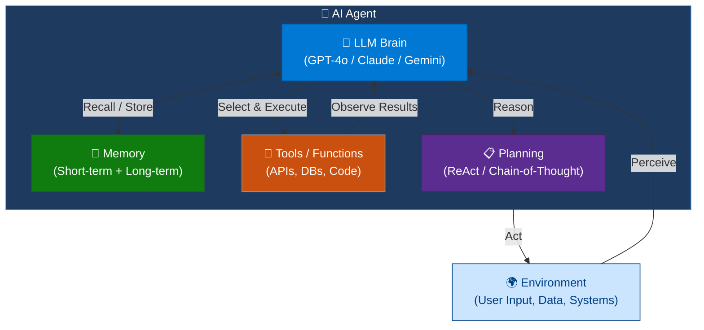

| Pillar | Role | Azure Implementation |
|---|---|---|
| **LLM Brain** | Reasoning, language understanding, decision-making | Azure OpenAI GPT-4o / o1 |
| **Memory** | Context across turns and sessions | Azure Cosmos DB, Azure AI Search, Redis Cache |
| **Tools** | Actions the agent can take | Azure Functions, custom plugins, MCP servers |
| **Planning** | Deciding what to do next | ReAct loop, Planner patterns, Semantic Kernel |

### 3.2 Agent vs. Chatbot vs. Copilot

```mermaid
graph LR
    subgraph Chatbot["💬 Chatbot"]
        direction TB
        CB_IN[User Input] --> CB_LLM[Single LLM Call]
        CB_LLM --> CB_OUT[Single Response]
    end

    subgraph Copilot["🤝 Copilot"]
        direction TB
        CP_IN[User Input] --> CP_LLM[LLM + Context]
        CP_LLM --> CP_TOOL[Optional Tool Call]
        CP_TOOL --> CP_OUT[Augmented Response]
    end

    subgraph Agent["🤖 Agent"]
        direction TB
        AG_IN[Goal / Task] --> AG_PLAN[LLM Plans Steps]
        AG_PLAN --> AG_TOOL1[Tool Call 1]
        AG_TOOL1 --> AG_OBS1[Observe Result]
        AG_OBS1 --> AG_PLAN2[Re-plan if needed]
        AG_PLAN2 --> AG_TOOL2[Tool Call N]
        AG_TOOL2 --> AG_OBS2[Goal Met?]
        AG_OBS2 -->|No| AG_PLAN
        AG_OBS2 -->|Yes| AG_OUT[Final Answer]
    end

    style Chatbot fill:#f3f2f1,stroke:#8a8886
    style Copilot fill:#deecf9,stroke:#0078d4
    style Agent fill:#dff6dd,stroke:#107c10

    classDef primary   fill:#0078d4,color:#fff,stroke:#005a9e
    classDef secondary fill:#7b2d8b,color:#fff,stroke:#5a1a6b
    classDef storage   fill:#2d7d4a,color:#fff,stroke:#1f5c35
    classDef security  fill:#c7372f,color:#fff,stroke:#a02020
    classDef monitor   fill:#e67300,color:#fff,stroke:#b35500
    classDef success   fill:#27ae60,color:#fff,stroke:#1e8449
    classDef warning   fill:#f39c12,color:#333,stroke:#d68910
    classDef neutral   fill:#f3f3f3,color:#333,stroke:#999
    classDef user      fill:#cce5ff,color:#004085,stroke:#004085
    classDef decision  fill:#fff3cd,color:#856404,stroke:#856404
    classDef highlight fill:#e74c3c,color:#fff,stroke:#c0392b

    class CB_IN,CP_IN,AG_IN user
    class CB_LLM,CP_LLM,AG_PLAN,AG_PLAN2 secondary
    class CB_OUT,CP_OUT,AG_OUT success
    class CP_TOOL,AG_TOOL1,AG_TOOL2 neutral
    class AG_OBS1,AG_OBS2 monitor
```

**The key distinction:** An agent maintains a *loop* that continues until the goal is achieved, rather than making a single LLM call.

### 3.3 The ReAct Loop (Reason + Act)

ReAct (Yao et al., 2022) is the foundational pattern behind most production agents. The LLM alternates between **Thought** (reasoning about what to do) and **Action** (calling a tool), observing results after each action.

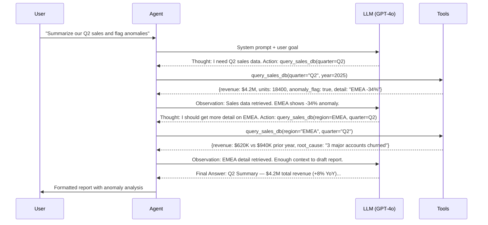

### 3.4 Agent Lifecycle

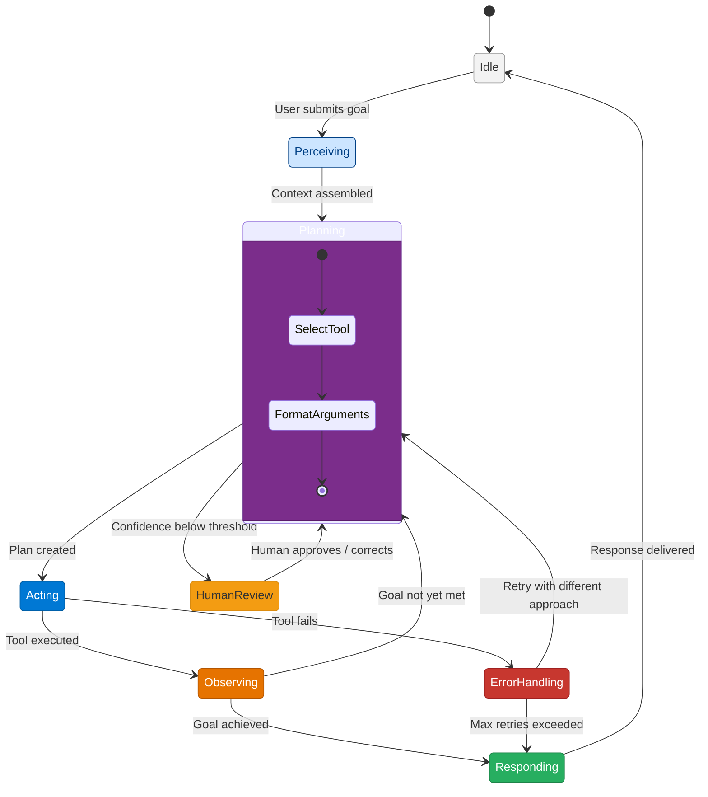

### 3.5 Memory Architecture

Agents need different types of memory for different timescales:

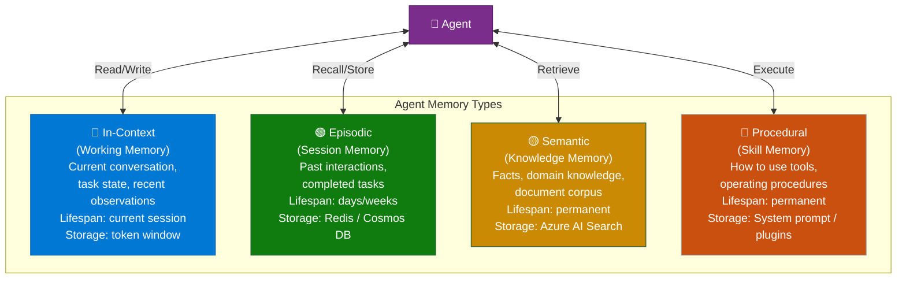

### 3.6 Tool / Function Calling

Tools are the actuators of an agent — the way it interacts with the outside world. The LLM is told what tools exist (name, description, input schema) and decides when and how to call them.

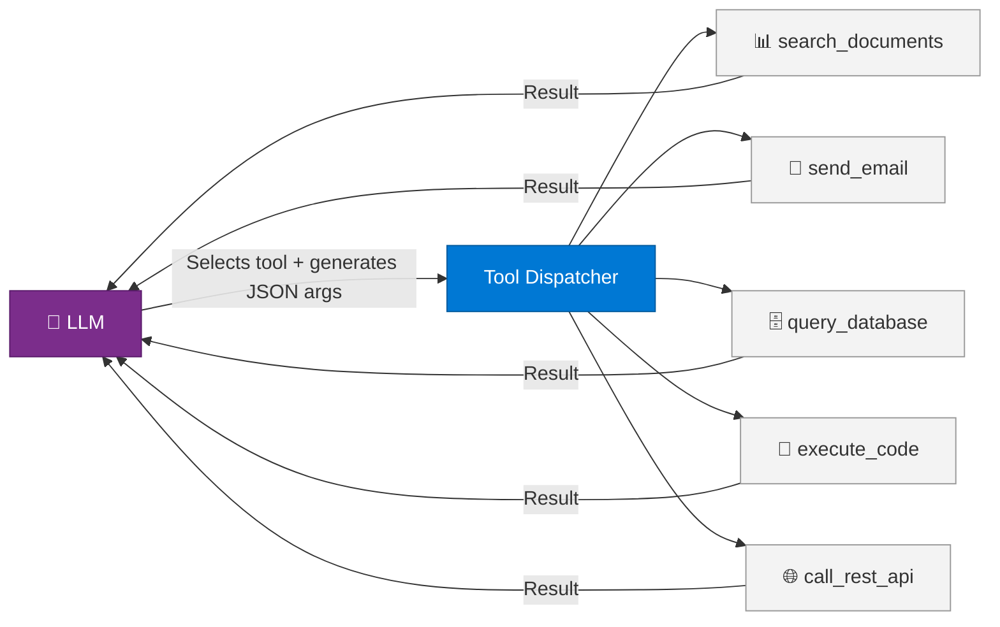

---

## 4. Deep Technical Detail

### 4.1 How the LLM Reasons

Modern LLMs used for agents (GPT-4o, o1, Claude 3.5 Sonnet) process a **context window** containing:

```
[System Prompt]
  → Agent persona, capabilities, constraints, tool definitions (JSON Schema)

[Conversation History]
  → Prior turns (user messages, assistant thoughts, tool results)

[Current Turn]
  → User goal or the result of the last tool call
```

The LLM produces either:
- A **tool call** response: structured JSON specifying `tool_name` + `arguments`
- A **final answer**: natural language response to the user

The hosting framework (Semantic Kernel, LangChain, AutoGen) intercepts tool calls, executes them against real backends, and feeds results back into the context.

### 4.2 Token Budget Management

Every agent interaction consumes tokens. Poor token management is the #1 source of production agent failures.

```mermaid
graph LR
    TOTAL["Context Window\n128K tokens (GPT-4o)"]
    TOTAL --> SYS["System Prompt\n~2–5K tokens"]
    TOTAL --> HIST["Conversation History\n(grows unbounded ⚠️)"]
    TOTAL --> TOOLS["Tool Definitions\n~1–3K tokens"]
    TOTAL --> RES["Tool Results\n(can be large ⚠️)"]
    TOTAL --> GEN["Generation Budget\n~4K tokens"]

    HIST -->|Must manage| TRUNC["Truncation / Summarization"]
    RES -->|Must manage| FILTER["Result Filtering / Chunking"]

    classDef primary   fill:#0078d4,color:#fff,stroke:#005a9e
    classDef secondary fill:#7b2d8b,color:#fff,stroke:#5a1a6b
    classDef storage   fill:#2d7d4a,color:#fff,stroke:#1f5c35
    classDef security  fill:#c7372f,color:#fff,stroke:#a02020
    classDef monitor   fill:#e67300,color:#fff,stroke:#b35500
    classDef success   fill:#27ae60,color:#fff,stroke:#1e8449
    classDef warning   fill:#f39c12,color:#333,stroke:#d68910
    classDef neutral   fill:#f3f3f3,color:#333,stroke:#999
    classDef user      fill:#cce5ff,color:#004085,stroke:#004085
    classDef decision  fill:#fff3cd,color:#856404,stroke:#856404
    classDef highlight fill:#e74c3c,color:#fff,stroke:#c0392b

    class TOTAL primary
    class SYS neutral
    class HIST warning
    class TOOLS neutral
    class RES warning
    class GEN secondary
    class TRUNC monitor
    class FILTER monitor
```

**Enterprise rule:** Implement a `ContextManager` that summarizes old turns and truncates tool outputs beyond a configurable byte limit.

### 4.3 Failure Modes

| Failure Mode | Description | Mitigation |
|---|---|---|
| **Hallucination** | LLM fabricates tool arguments or facts | Validate outputs with JSON Schema; use structured outputs |
| **Infinite loop** | Agent keeps re-planning without making progress | Max iteration limit (default: 10 steps) |
| **Tool failure cascade** | One tool error causes all downstream steps to fail | Retry with exponential backoff; fallback tools |
| **Context overflow** | History exceeds context window | Rolling summary + token budget enforcement |
| **Prompt injection** | Malicious content in tool results hijacks reasoning | Sanitize tool outputs; use content safety |
| **Goal drift** | Agent pursues a sub-goal and forgets the original | Include original goal in every LLM call |

### 4.4 Agent Autonomy Spectrum

```mermaid
graph LR
    A["Fully Guided\n(Human approves\nevery action)"] -->|More automation| B["Supervised\n(Human approves\nhigh-risk actions)"] -->|More automation| C["Semi-autonomous\n(Human reviews\nfinal output)"] -->|More automation| D["Fully Autonomous\n(Human monitors\nvia dashboards)"]

    style A fill:#ca5010,color:#ffffff
    style B fill:#ca8a04,color:#ffffff
    style C fill:#107c10,color:#ffffff
    style D fill:#0078d4,color:#ffffff

    classDef primary   fill:#0078d4,color:#fff,stroke:#005a9e
    classDef secondary fill:#7b2d8b,color:#fff,stroke:#5a1a6b
    classDef storage   fill:#2d7d4a,color:#fff,stroke:#1f5c35
    classDef security  fill:#c7372f,color:#fff,stroke:#a02020
    classDef monitor   fill:#e67300,color:#fff,stroke:#b35500
    classDef success   fill:#27ae60,color:#fff,stroke:#1e8449
    classDef warning   fill:#f39c12,color:#333,stroke:#d68910
    classDef neutral   fill:#f3f3f3,color:#333,stroke:#999
    classDef user      fill:#cce5ff,color:#004085,stroke:#004085
    classDef decision  fill:#fff3cd,color:#856404,stroke:#856404
    classDef highlight fill:#e74c3c,color:#fff,stroke:#c0392b

    class A security
    class B warning
    class C success
    class D primary
```

**Enterprise guidance:** Start at Supervised. Move to Semi-autonomous only after 30 days of production data showing accuracy ≥ 95% on your task category.

---

## 5. Azure AI Foundry Implementation

### 5.1 Azure AI Foundry Agent Service

Azure AI Foundry's Agent Service provides a managed runtime for agents with built-in threading, tool execution, file handling, and evaluation — no custom framework needed for straightforward use cases.

**Architecture:**

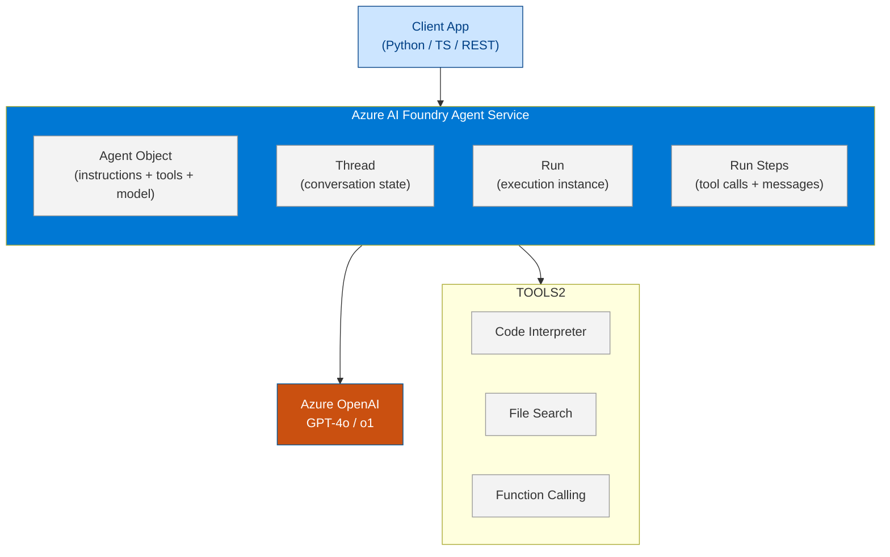

### 5.2 Create a Foundry Project (CLI)

```bash
# Create resource group
az group create --name rg-agents-prod --location eastus2

# Create Azure AI Hub (the organizational container)
az ml workspace create \
    --kind hub \
    --name aih-enterprise-prod \
    --resource-group rg-agents-prod \
    --location eastus2

# Create AI Project under the hub
az ml workspace create \
    --kind project \
    --name aip-support-agent \
    --resource-group rg-agents-prod \
    --hub-id /subscriptions/<sub>/resourceGroups/rg-agents-prod/providers/Microsoft.MachineLearningServices/workspaces/aih-enterprise-prod

# Assign Cognitive Services OpenAI User to project's Managed Identity
az role assignment create \
    --role "Cognitive Services OpenAI User" \
    --assignee <managed-identity-principal-id> \
    --scope /subscriptions/<sub>/resourceGroups/rg-agents-prod
```

---

## 6. Working Code Example

A complete, runnable agent that takes a user goal and autonomously uses tools to research and respond.

### Project Structure

```
agentic-fundamentals/
├── .env
├── requirements.txt
├── agent.py          ← main agent
├── tools.py          ← tool definitions
└── run.py            ← entry point
```

### tools.py

```python
import json
import random
from datetime import datetime, timedelta


def get_sales_data(quarter: str, year: int, region: str = "ALL") -> dict:
    """
    Simulates a database query for sales data.
    In production this would call Azure SQL or Cosmos DB.
    """
    mock_data = {
        ("Q2", 2025, "ALL"): {
            "revenue": 4_200_000,
            "units": 18_400,
            "yoy_growth": 8.2,
            "anomalies": [{"region": "EMEA", "delta_pct": -34.0}],
        },
        ("Q2", 2025, "EMEA"): {
            "revenue": 620_000,
            "prior_year_revenue": 940_000,
            "delta_pct": -34.0,
            "root_cause": "3 major accounts churned in April",
            "churned_accounts": ["Acme Corp", "GlobalTech", "EuroRetail"],
        },
    }
    key = (quarter.upper(), year, region.upper())
    result = mock_data.get(key, {"error": f"No data found for {quarter} {year} {region}"})
    return result


def send_report_email(to: str, subject: str, body: str) -> dict:
    """Simulates sending an email report. In production: Microsoft Graph API."""
    print(f"\n[EMAIL SENT] To: {to} | Subject: {subject}")
    return {"status": "sent", "message_id": f"msg_{random.randint(10000, 99999)}", "timestamp": datetime.utcnow().isoformat()}


def get_current_date() -> dict:
    """Returns current date context."""
    return {"date": datetime.utcnow().strftime("%Y-%m-%d"), "quarter": "Q2"}


# Tool definitions in OpenAI function-calling format
TOOL_DEFINITIONS = [
    {
        "type": "function",
        "function": {
            "name": "get_sales_data",
            "description": "Query sales data for a given quarter, year, and optional region. Use this to retrieve revenue, unit counts, YoY growth, and anomalies.",
            "parameters": {
                "type": "object",
                "properties": {
                    "quarter": {"type": "string", "description": "Quarter in format Q1, Q2, Q3, Q4"},
                    "year": {"type": "integer", "description": "4-digit year"},
                    "region": {
                        "type": "string",
                        "description": "Region filter. Use 'ALL' for global, or specify: EMEA, APAC, AMER",
                        "default": "ALL",
                    },
                },
                "required": ["quarter", "year"],
            },
        },
    },
    {
        "type": "function",
        "function": {
            "name": "send_report_email",
            "description": "Send a formatted report via email to a recipient.",
            "parameters": {
                "type": "object",
                "properties": {
                    "to": {"type": "string", "description": "Recipient email address"},
                    "subject": {"type": "string", "description": "Email subject line"},
                    "body": {"type": "string", "description": "Email body in plain text or Markdown"},
                },
                "required": ["to", "subject", "body"],
            },
        },
    },
    {
        "type": "function",
        "function": {
            "name": "get_current_date",
            "description": "Get today's date and current quarter. Use this when you need temporal context.",
            "parameters": {"type": "object", "properties": {}},
        },
    },
]

TOOL_DISPATCH = {
    "get_sales_data": get_sales_data,
    "send_report_email": send_report_email,
    "get_current_date": get_current_date,
}
```

### agent.py

```python
import json
import os
from openai import AzureOpenAI
from dotenv import load_dotenv
from tools import TOOL_DEFINITIONS, TOOL_DISPATCH

load_dotenv()

client = AzureOpenAI(
    azure_endpoint=os.environ["AZURE_OPENAI_ENDPOINT"],
    api_key=os.environ["AZURE_OPENAI_API_KEY"],
    api_version=os.environ.get("AZURE_OPENAI_API_VERSION", "2024-10-21"),
)

DEPLOYMENT = os.environ.get("AZURE_OPENAI_DEPLOYMENT_NAME", "gpt-4o")

SYSTEM_PROMPT = """You are an Enterprise Sales Analysis Agent. 
Your job is to help business stakeholders understand sales performance and anomalies.

You have access to tools to query sales data and send email reports.

When analyzing data:
1. Always retrieve global data first, then drill into anomalies
2. Be specific about numbers — never say "significantly" without a percentage
3. Suggest root causes when data supports them
4. Only send emails when explicitly asked by the user

Respond in a professional, executive-ready tone."""


def run_agent(user_goal: str, max_iterations: int = 10) -> str:
    """
    Core ReAct agent loop.
    Continues until the LLM produces a final text response (no more tool calls)
    or the max iteration limit is reached.
    """
    messages = [
        {"role": "system", "content": SYSTEM_PROMPT},
        {"role": "user", "content": user_goal},
    ]

    print(f"\n{'='*60}")
    print(f"AGENT GOAL: {user_goal}")
    print(f"{'='*60}")

    for iteration in range(max_iterations):
        print(f"\n--- Iteration {iteration + 1} ---")

        response = client.chat.completions.create(
            model=DEPLOYMENT,
            messages=messages,
            tools=TOOL_DEFINITIONS,
            tool_choice="auto",
        )

        message = response.choices[0].message

        # No tool calls → agent is done
        if not message.tool_calls:
            print(f"\nFINAL ANSWER:\n{message.content}")
            return message.content

        # Process each tool call in the response
        messages.append({"role": "assistant", "content": message.content, "tool_calls": [
            {
                "id": tc.id,
                "type": "function",
                "function": {"name": tc.function.name, "arguments": tc.function.arguments},
            }
            for tc in message.tool_calls
        ]})

        for tool_call in message.tool_calls:
            fn_name = tool_call.function.name
            fn_args = json.loads(tool_call.function.arguments)

            print(f"  TOOL CALL: {fn_name}({json.dumps(fn_args, indent=2)})")

            if fn_name not in TOOL_DISPATCH:
                result = {"error": f"Unknown tool: {fn_name}"}
            else:
                try:
                    result = TOOL_DISPATCH[fn_name](**fn_args)
                except Exception as e:
                    result = {"error": str(e)}

            print(f"  TOOL RESULT: {json.dumps(result, indent=2)}")

            messages.append({
                "role": "tool",
                "tool_call_id": tool_call.id,
                "content": json.dumps(result),
            })

    return "Max iterations reached. Task incomplete."
```

### run.py

```python
from agent import run_agent

if __name__ == "__main__":
    # Example 1: Analysis only
    result = run_agent(
        "Summarize our Q2 2025 global sales performance and explain any anomalies in detail."
    )

    # Example 2: Analysis + action
    # result = run_agent(
    #     "Summarize our Q2 2025 sales performance and email the report to cfo@company.com"
    # )
```

### Expected Output

```
============================================================
AGENT GOAL: Summarize our Q2 2025 global sales performance and explain any anomalies in detail.
============================================================

--- Iteration 1 ---
  TOOL CALL: get_sales_data({
    "quarter": "Q2",
    "year": 2025
  })
  TOOL RESULT: {
    "revenue": 4200000,
    "units": 18400,
    "yoy_growth": 8.2,
    "anomalies": [{"region": "EMEA", "delta_pct": -34.0}]
  }

--- Iteration 2 ---
  TOOL CALL: get_sales_data({
    "quarter": "Q2",
    "year": 2025,
    "region": "EMEA"
  })
  TOOL RESULT: {
    "revenue": 620000,
    "prior_year_revenue": 940000,
    "delta_pct": -34.0,
    "root_cause": "3 major accounts churned in April",
    "churned_accounts": ["Acme Corp", "GlobalTech", "EuroRetail"]
  }

--- Iteration 3 ---

FINAL ANSWER:
## Q2 2025 Sales Performance Summary

**Global Performance**
- Total Revenue: $4.2M (+8.2% YoY)
- Units Sold: 18,400

**Anomaly: EMEA Region — ⚠️ -34% YoY**
- Q2 2025: $620K vs. Q2 2024: $940K (−$320K)
- Root Cause: Three major accounts (Acme Corp, GlobalTech, EuroRetail) churned in April 2025

**Recommendation:** Immediate retention analysis on remaining EMEA accounts; initiate win-back campaign for churned accounts.
```

---

## 7. Enterprise Pattern Notes

### Pattern 1: ReAct (Reason + Act)
The foundational loop demonstrated in the code above. Best for: task completion agents, research agents, data analysis.

### Pattern 2: Reflection
The agent reviews its own output before returning it to the user, catching errors and improving quality.

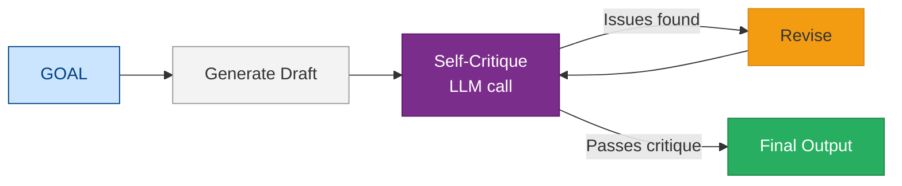

### Pattern 3: Supervisor–Worker
One LLM supervises multiple specialized worker agents, delegating sub-tasks and aggregating results. Covered in depth in [10 — Multi-Agent Systems](./10-Multi-Agent-Systems.md).

### Pattern 4: Human-in-the-Loop (HITL)
Agent pauses at critical decision points and waits for human approval before proceeding. Required for high-stakes actions (payments, emails to customers, infrastructure changes).

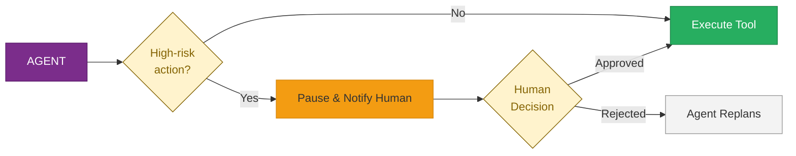

---

## 7.1 The AI Agent 4-Part Loop

Every autonomous AI agent — regardless of framework — executes the same fundamental loop:

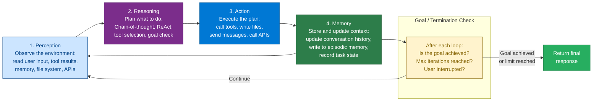

**Loop implementation in LangGraph:**

```python
# four_part_loop.py — the agent loop made explicit
from typing import TypedDict, Annotated
from langgraph.graph import StateGraph, END
from langgraph.graph.message import add_messages

class AgentState(TypedDict):
    messages: Annotated[list, add_messages]  # Conversation + tool results (Perception + Memory)
    iteration: int                            # Loop counter
    goal_achieved: bool

def perception_node(state: AgentState) -> AgentState:
    """Observe: current messages already contain perception — return unchanged."""
    return {"iteration": state["iteration"] + 1}

def reasoning_node(state: AgentState) -> AgentState:
    """Reason: LLM decides next action (tool call or final answer)."""
    response = llm_with_tools.invoke(state["messages"])
    return {"messages": [response]}

def action_node(state: AgentState) -> AgentState:
    """Act: execute tool calls from the LLM's reasoning step."""
    last_message = state["messages"][-1]
    tool_results = execute_tool_calls(last_message.tool_calls)
    return {"messages": tool_results}

def memory_node(state: AgentState) -> AgentState:
    """Remember: persist anything needed across future iterations."""
    save_to_episodic_memory(state["messages"][-1])
    return {}

def should_continue(state: AgentState) -> str:
    last = state["messages"][-1]
    if state["iteration"] >= 10:         # Hard iteration cap
        return "end"
    if not hasattr(last, "tool_calls") or not last.tool_calls:
        return "end"                     # No more tool calls → LLM is done
    return "action"

graph = StateGraph(AgentState)
graph.add_node("reasoning", reasoning_node)
graph.add_node("action", action_node)
graph.add_node("memory", memory_node)
graph.set_entry_point("reasoning")
graph.add_conditional_edges("reasoning", should_continue, {"action": "action", "end": END})
graph.add_edge("action", "memory")
graph.add_edge("memory", "reasoning")
agent = graph.compile()
```

---

## 7.2 RICEFWID — Agent Capability Assessment Framework

**RICEFWID** is a structured framework for evaluating whether an agent has the prerequisites to complete a task. Use it at design time (do we have everything the agent needs?) and at runtime (why did the agent fail?).

| Letter | Stands for | Question to ask |
|---|---|---|
| **R** | Resources | Does the agent have sufficient compute, memory, and token budget? |
| **I** | Intent | Is the agent's goal clearly specified and unambiguous? |
| **C** | Capabilities | Does the agent have the right tools and skills for this task? |
| **E** | Experience | Has the agent (or its prompt) been grounded with relevant examples? |
| **F** | Features | Are all required model features available (tool calling, structured output)? |
| **W** | Workflows | Is the orchestration pattern right for this task's complexity? |
| **I** | Inputs | Are all required inputs available and in the right format? |
| **D** | Data | Does the agent have access to accurate, up-to-date data via RAG or tools? |

```python
# ricefwid_checklist.py — use before deploying a new agent use case
from dataclasses import dataclass

@dataclass
class RICEFWIDAssessment:
    use_case: str
    resources:    str   # Token budget, compute, latency budget
    intent:       str   # Goal statement — is it specific and measurable?
    capabilities: list[str]  # List of tools the agent has
    experience:   str   # Few-shot examples or grounding data
    features:     list[str]  # Model features needed (tool_calling, vision, structured_output)
    workflows:    str   # Orchestration pattern (ReAct, Plan-and-Execute, Supervisor)
    inputs:       list[str]  # Required input fields
    data:         str   # RAG knowledge base, APIs, or databases available

# Example assessment for an HR Policy Agent
hr_assessment = RICEFWIDAssessment(
    use_case="HR Policy Q&A Copilot",
    resources="GPT-4o, 30s latency budget, 4096 token context window for response",
    intent="Answer employee questions about HR policies accurately and within 30 seconds",
    capabilities=["azure_ai_search", "get_employee_profile", "escalate_to_hr_team"],
    experience="10 few-shot Q&A pairs from HR team, grounded in policy doc v3.2",
    features=["tool_calling", "structured_output"],
    workflows="ReAct (search → answer, 3 max iterations)",
    inputs=["employee_id", "question", "locale"],
    data="Azure AI Search index of all HR policy documents (updated weekly)",
)
```

---

## 7.3 Claude Agentic Harness

The **Claude Agentic Harness** is Anthropic's reference architecture for building agents with Claude. It defines how Claude's tool use, context management, and multi-turn reasoning loop fits together — and is the basis for Claude Code, Claude Desktop, and any custom Claude-powered agent.

> Source: [Anthropic Concepts & Architecture](https://platform.claude.com/docs/concepts-and-architecture)

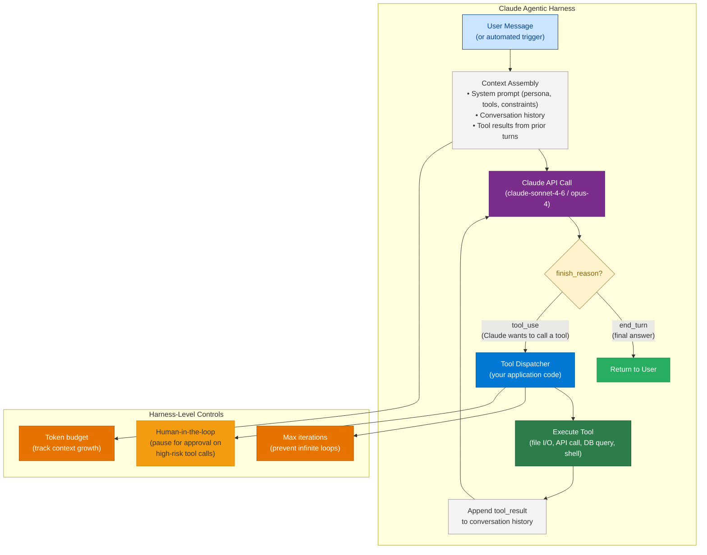

### Key Harness Concepts

**1. `stop_reason` drives the loop**

Claude signals its intent through `stop_reason` in the API response:

| `stop_reason` | Meaning | Harness action |
|---|---|---|
| `end_turn` | Claude has finished its response | Return to user — loop ends |
| `tool_use` | Claude wants to call one or more tools | Execute tools, append results, call Claude again |
| `max_tokens` | Output was cut off at the token limit | Increase `max_tokens` or simplify the task |
| `stop_sequence` | A custom stop sequence was triggered | Application-defined — inspect and handle |

**2. The `tool_result` message format**

After executing a tool, the harness appends the result as a `user`-role message containing a `tool_result` block:

```python
# claude_harness.py — minimal agentic loop with Claude
import asyncio
import anthropic

client = anthropic.AsyncAnthropic()

TOOLS = [
    {
        "name": "read_file",
        "description": "Read the contents of a file from the local filesystem.",
        "input_schema": {
            "type": "object",
            "properties": {
                "path": {"type": "string", "description": "Absolute path to the file"}
            },
            "required": ["path"],
        },
    },
    {
        "name": "write_file",
        "description": "Write content to a file. Creates the file if it does not exist.",
        "input_schema": {
            "type": "object",
            "properties": {
                "path": {"type": "string"},
                "content": {"type": "string"},
            },
            "required": ["path", "content"],
        },
    },
]


async def execute_tool(name: str, inputs: dict) -> str:
    if name == "read_file":
        with open(inputs["path"]) as f:
            return f.read()
    if name == "write_file":
        with open(inputs["path"], "w") as f:
            f.write(inputs["content"])
        return f"Written {len(inputs['content'])} chars to {inputs['path']}"
    return f"Unknown tool: {name}"


async def run_agent(user_message: str, max_iterations: int = 10) -> str:
    messages = [{"role": "user", "content": user_message}]

    for iteration in range(max_iterations):
        response = await client.messages.create(
            model="claude-sonnet-4-6",
            max_tokens=4096,
            system="You are a helpful coding assistant. Use tools to read and write files as needed.",
            tools=TOOLS,
            messages=messages,
        )

        # Append Claude's response to history
        messages.append({"role": "assistant", "content": response.content})

        if response.stop_reason == "end_turn":
            # Extract text from response content blocks
            return next(
                (block.text for block in response.content if hasattr(block, "text")),
                "",
            )

        if response.stop_reason == "tool_use":
            tool_results = []
            for block in response.content:
                if block.type == "tool_use":
                    result = await execute_tool(block.name, block.input)
                    tool_results.append({
                        "type": "tool_result",
                        "tool_use_id": block.id,
                        "content": result,
                    })
            # Append all tool results as a single user message
            messages.append({"role": "user", "content": tool_results})

    return "Max iterations reached without a final answer."
```

**3. Token budget management — `betas=["token-efficient-tools-2025-02-19"]`**

Claude's harness tracks how many tokens the conversation history consumes. As context grows through multiple tool calls, the harness must:
- Monitor `usage.input_tokens` in each response
- Summarize or truncate older tool results when approaching 80% of the model's context limit
- Use Claude's `cache_control` breakpoints to cache the system prompt and reduce cost on repeated calls

**4. Extended Thinking**

For complex reasoning tasks, enable `thinking` blocks (`betas=["interleaved-thinking-2025-05-14"]`). Claude reasons through a problem step-by-step in a `thinking` content block before generating tool calls or a final answer. This is particularly useful for multi-step planning tasks where the correct sequence of tool calls is non-obvious.

### Claude Harness vs Generic Agent Frameworks

| Dimension | Claude Harness (direct API) | LangGraph / CrewAI |
|---|---|---|
| **Control** | Full — you own the loop | Framework-managed — less flexible |
| **Transparency** | Every message visible | Abstracted — harder to debug |
| **Latency** | Minimal overhead | Framework adds overhead |
| **Features** | Must implement memory/state yourself | Built-in memory, persistence, branching |
| **Best for** | Production systems needing precise control | Rapid prototyping, complex multi-agent graphs |

---

## 8. Production Checklist

### Security
- [ ] System prompt hardened against prompt injection (see [33 — Security](./33-Security.md))
- [ ] Tool outputs sanitized before injecting into LLM context
- [ ] Tool permissions follow least-privilege (agent can only read, not write, unless required)
- [ ] Secrets stored in Azure Key Vault, not `.env` in production
- [ ] Managed Identity used for all Azure service authentication

### Monitoring
- [ ] Every LLM call logged with: prompt tokens, completion tokens, latency, model version
- [ ] Tool call results logged (with PII redaction)
- [ ] Iteration count per run tracked (alert if > 7 iterations consistently)
- [ ] Final answer logged for quality review sampling
- [ ] Azure Application Insights connected for distributed tracing

### Cost
- [ ] Max iteration limit enforced (prevents runaway billing)
- [ ] Tool results truncated to a maximum byte length before injecting
- [ ] Use `gpt-4o-mini` for classification/routing sub-tasks; `gpt-4o` for reasoning
- [ ] Enable Azure OpenAI token quota alerts at 80% threshold

### Testing
- [ ] Unit tests for each tool function (separate from the agent)
- [ ] Integration test suite with recorded tool responses (deterministic replay)
- [ ] Adversarial test cases for prompt injection scenarios
- [ ] Evaluation dataset with 50+ golden (input, expected_output) pairs

---

## 9. Interview Q&A

### Q1 (Beginner): What is the difference between a chatbot and an AI agent?

**Answer:** A chatbot makes a single LLM call per user turn and returns a response. An AI agent runs a loop: it can call tools, observe results, re-plan, and call more tools — iterating until a goal is achieved. The key architectural difference is the *agentic loop* with tool execution capability. A chatbot has no memory beyond the conversation window and no ability to take actions in external systems.

---

### Q2 (Beginner): What are the four core components of an AI agent?

**Answer:**
1. **LLM (Brain)** — the reasoning engine that interprets goals and decides what to do
2. **Tools** — functions the agent can call to interact with the outside world (APIs, databases, code execution)
3. **Memory** — context persistence across turns (in-context) and sessions (external stores)
4. **Planning** — the mechanism (often ReAct) by which the agent decides the sequence of actions to achieve a goal

---

### Q3 (Intermediate): What is the ReAct pattern and why is it important?

**Answer:** ReAct (Reason + Act) is an LLM prompting and execution pattern where the model alternates between generating a *Thought* (reasoning about the current state and what to do next) and an *Action* (calling a specific tool with specific arguments). After each action, the result is fed back as an *Observation*. This cycle continues until the goal is achieved. ReAct is important because it makes the agent's reasoning transparent and debuggable — you can inspect the thought-action-observation chain to understand why the agent made decisions, which is critical for production systems.

---

### Q4 (Intermediate): What are the main failure modes of production AI agents and how do you mitigate them?

**Answer:** Key failure modes:
- **Infinite loops** → enforce a max iteration limit (typically 10–15 steps)
- **Context overflow** → implement rolling summarization and truncate tool outputs
- **Hallucinated tool arguments** → use structured outputs (JSON Schema validation) and validate before executing
- **Prompt injection via tool results** → sanitize external content before injecting into LLM context
- **Goal drift** → include the original user goal in every LLM call, not just the first one
- **Tool failure cascades** → wrap every tool call in try/except with retry logic and graceful degradation

---

### Q5 (Advanced): How do you decide between agentic AI and traditional automation (RPA, workflow engines)?

**Answer:** The decision turns on *structure vs. variability*:
- **Traditional automation (RPA, BPM)** excels when: inputs are structured/predictable, the workflow is deterministic, latency is critical (<100ms), and auditability requires deterministic traces
- **Agentic AI** excels when: inputs are unstructured (documents, emails, voice), the workflow requires reasoning about context to determine next steps, the process has high variability, or you need natural-language interfaces

In practice, the enterprise pattern is a hybrid: workflow engines (Azure Logic Apps, Power Automate) handle the structured orchestration layer and invoke agents for the reasoning-intensive sub-tasks. This gives you the reliability of a state machine with the flexibility of an LLM reasoner.

---

### Q6 (Architecture): How would you design an agent system to handle 10,000 concurrent agent runs for an enterprise customer support platform?

**Answer:** Key architectural decisions:

1. **Stateless agent workers** — each agent run is a stateless compute unit (Azure Container Apps or AKS pods), pulling conversation state from Azure Cosmos DB at the start of each iteration
2. **Async tool execution** — all tool calls are async; use `asyncio.gather()` for parallel tool calls where possible
3. **Message-driven orchestration** — incoming tasks land in Azure Service Bus; workers pull and process independently (fan-out pattern)
4. **Token quota management** — Azure OpenAI PTU (Provisioned Throughput Unit) deployments for predictable throughput; per-tenant quota enforcement
5. **Circuit breaker** — if Azure OpenAI returns 429s, fall back to a queue with exponential backoff; never fail silently
6. **Horizontal scaling** — KEDA (Kubernetes Event-Driven Autoscaling) scales worker pods based on Service Bus queue depth
7. **Observability** — OpenTelemetry traces correlated across the entire run (agent → tool → LLM → tool result)
8. **Human escalation path** — runs that exceed iteration limits or hit low-confidence thresholds are routed to a human review queue

---

### Q7 (Scenario): A production agent keeps generating incorrect JSON arguments for a tool call, causing tool failures. How do you fix this?

**Answer:**
1. **Immediate fix:** Enable **structured outputs** (OpenAI's `response_format: {type: "json_schema"}`) to force the model to produce schema-valid JSON for tool arguments. This moves validation to the model inference layer.
2. **Better tool descriptions:** Rewrite the tool's `description` and parameter `description` fields to be more explicit — include examples of valid values.
3. **Validate before executing:** Add a Pydantic model validation step between argument generation and tool execution; return validation errors back to the LLM as an `Observation` so it can self-correct.
4. **Few-shot examples:** Add 2–3 example tool calls (correct arguments) to the system prompt.
5. **Upgrade the model:** Switch from a smaller model to GPT-4o for the planning step if the task requires complex argument construction.
6. **Log and analyze:** Capture every failed tool call with the generated arguments; analyze patterns to identify whether the issue is in the tool schema or the system prompt.

---

## Cross-links

- Previous: [00 — Introduction](./00-Introduction.md)
- Next: [02 — LLMs and Foundation Models](./02-LLMs-and-Foundation-Models.md)
- Related: [05 — Semantic Kernel](./05-Semantic-Kernel.md) | [06 — LangChain](./06-LangChain.md) | [10 — Multi-Agent Systems](./10-Multi-Agent-Systems.md)
- Advanced: [22 — Planning and Reasoning](./22-Planning-and-Reasoning.md) | [21 — Memory](./21-Memory.md)

---

*Module 01 | Series: Enterprise Agentic AI Tutorial | Last updated: June 2026*
