# 02 — LLMs and Foundation Models

> **Level:** Beginner → Advanced | **Time to complete:** 4–5 hours | **Azure services touched:** Azure OpenAI, Azure AI Foundry Model Catalog

---

## 1. Overview

### What Is a Large Language Model?

A **Large Language Model (LLM)** is a neural network trained on vast corpora of text to predict the next token in a sequence. Through this deceptively simple objective — learned at massive scale — LLMs develop emergent capabilities: reasoning, code generation, translation, summarization, and instruction following.

The term "foundation model" is broader: it refers to any large pre-trained model (text, image, audio, multi-modal) that can be adapted to downstream tasks via prompting or fine-tuning. LLMs are the text-centric subset of foundation models.

### Why It Matters Enterprise-Wide

Every AI agent, RAG pipeline, and copilot in this series is built on top of an LLM. Understanding how LLMs work — their strengths, failure modes, and operational characteristics — is prerequisite knowledge for every other module. Getting the wrong model for the wrong task is the #1 source of wasted Azure OpenAI spend.

### When to Use / Avoid

| Use LLMs when | Avoid LLMs when |
|---|---|
| Unstructured input requires interpretation | Task is fully deterministic (use code) |
| Natural language I/O is the interface | Sub-millisecond latency required |
| Task requires generalization across domains | Exact numerical computation needed |
| Reasoning across disconnected information | Data must never leave your network boundary |

---

## 2. Business Problem

Enterprise data is 80% unstructured: emails, contracts, support tickets, engineering docs, meeting transcripts. Traditional software cannot interpret these at scale. LLMs unlock:

- **Semantic search** — find intent, not just keywords
- **Automated drafting** — policy documents, responses, code, reports
- **Classification at scale** — route tickets, flag risk, categorize contracts
- **Structured extraction** — pull entities, dates, amounts from free text
- **Conversational interfaces** — natural language APIs over any backend

---

## 3. Core Concepts

### 3.1 The Transformer Architecture

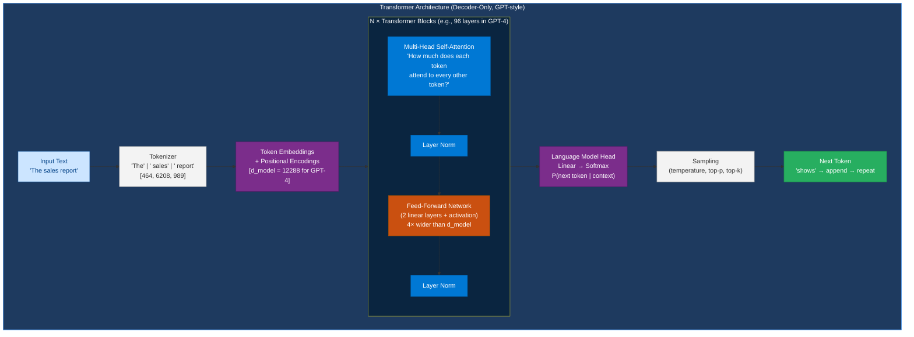

**Key insight for engineers:** The model produces a *probability distribution* over the entire vocabulary at every step. Sampling from this distribution is where non-determinism comes from — and why temperature controls creativity vs. precision.

### 3.2 Attention Mechanism

Attention answers: *"For the token I'm currently processing, which other tokens in the context are most relevant?"*

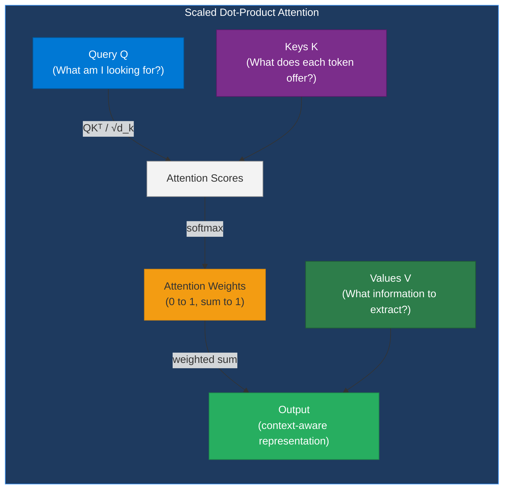

**Multi-head attention** runs this in parallel across `H` independent "heads" (e.g., H=96 for GPT-4), each learning to attend to different relationship types (syntax, semantics, co-reference, etc.).

---

### 3.2.1 Self-Attention: Full Intuition and Math

The core insight of the Transformer is that *every token attends to every other token simultaneously* — not left-to-right like an RNN. This is what makes it parallelizable and what lets it model long-range dependencies.

**Analogy:** Imagine you're at a party (the context window). For every word you hear ("bank"), you mentally ask: *"Which other words in this conversation tell me what 'bank' means here?"* Self-attention is the mechanism that scores every other word's relevance to the current one.

**The three matrices — Q, K, V:**

| Matrix | Stands for | Role | Analogy |
|---|---|---|---|
| **Q** (Query) | "What am I looking for?" | The current token asking a question of all others | A search query |
| **K** (Key) | "What do I offer?" | Every other token advertising its content | A database index key |
| **V** (Value) | "What information do I carry?" | The actual content to extract from matched tokens | The database row value |

**Math (step by step):**

```
1. Compute raw scores:     scores = Q · Kᵀ          (shape: [seq_len, seq_len])
2. Scale to stabilise:     scores = scores / √d_k    (d_k = key dimension)
3. Mask future tokens:     apply causal mask          (decoder-only models only)
4. Normalise:              weights = softmax(scores)  (each row sums to 1)
5. Extract content:        output = weights · V       (weighted sum of values)
```

**Why `/ √d_k`?** Without scaling, dot products grow large as dimension increases, pushing softmax into a saturated regime where gradients vanish. Dividing by √d_k keeps the scale stable regardless of model size.

**Multi-Head Attention — why multiple heads?**

Each head projects Q, K, V through different learned weight matrices, then attends in parallel. The outputs are concatenated and projected. Result: different heads specialize in different relationship types:
- Head 1 might learn syntactic dependencies (verb → subject agreement)
- Head 2 might learn co-reference ("it" → what noun "it" refers to)
- Head 3 might learn positional proximity patterns

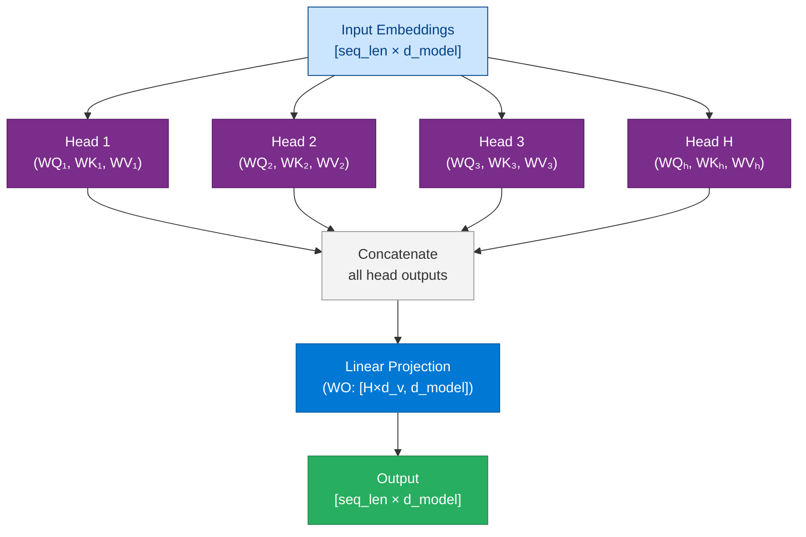

---

### 3.2.2 Positional Encoding

Self-attention is **permutation-invariant** — if you shuffle the tokens, the attention scores change but the mechanism has no built-in sense of order. Positional encodings inject position information into the token embeddings so the model knows token 1 comes before token 2.

| Approach | Used in | How it works |
|---|---|---|
| **Sinusoidal (absolute)** | Original "Attention is All You Need" (2017) | Fixed sine/cosine functions of position — not learned |
| **Learned absolute** | BERT, early GPT models | A trainable embedding per position up to max sequence length |
| **Relative position bias** | T5, Transformer-XL | Attention score modified by relative distance between tokens |
| **RoPE** (Rotary Position Embedding) | Llama, GPT-NeoX, Mistral, modern GPT-4 | Rotates Q and K vectors by their position angle — naturally extends to longer sequences |

**Why RoPE dominates modern LLMs:** It encodes relative position directly in the attention score computation, generalizes better to sequence lengths longer than seen during training, and enables context length extension techniques (YaRN, LongRoPE).

```
RoPE intuition: rotate the Query and Key vectors by an angle proportional to position.
A token at position 5 is rotated by 5θ; at position 10 by 10θ.
The dot product Q·K then naturally captures relative distance (10-5=5 rotations apart)
without the model needing to learn absolute position tables.
```

---

### 3.2.3 Transformer Families — Encoder, Decoder, Encoder-Decoder

All LLMs are built on the transformer, but they differ in which parts of the architecture they use:

```mermaid
graph TB
    subgraph ENC["Encoder-Only (BERT family)"]
        E1["Bidirectional attention\n(sees all tokens at once)"]
        E2["Task: Understand / classify\nNLU, embeddings, classification"]
        E3["Examples: BERT, RoBERTa,\ntext-embedding-ada-002"]
        E1 --> E2 --> E3
    end

    subgraph DEC["Decoder-Only (GPT family)"]
        D1["Causal / autoregressive attention\n(sees only left context)"]
        D2["Task: Generate\nCompletion, chat, agents"]
        D3["Examples: GPT-4o, Llama 3,\nMistral, Claude, Gemini"]
        D1 --> D2 --> D3
    end

    subgraph ENCDEC["Encoder-Decoder (T5 family)"]
        ED1["Encoder: bidirectional\nDecoder: autoregressive"]
        ED2["Task: Seq-to-seq\nTranslation, summarisation, Q&A"]
        ED3["Examples: T5, BART,\nGoogle mT5, Flan-T5"]
        ED1 --> ED2 --> ED3
    end

    classDef primary   fill:#0078d4,color:#fff,stroke:#005a9e
    classDef secondary fill:#7b2d8b,color:#fff,stroke:#5a1a6b
    classDef storage   fill:#2d7d4a,color:#fff,stroke:#1f5c35
    classDef security  fill:#c7372f,color:#fff,stroke:#a02020
    classDef monitor   fill:#e67300,color:#fff,stroke:#b35500
    classDef success   fill:#27ae60,color:#fff,stroke:#1e8449
    classDef warning   fill:#f39c12,color:#333,stroke:#d68910
    classDef neutral   fill:#f3f3f3,color:#333,stroke:#999
    classDef user      fill:#cce5ff,color:#004085,stroke:#004085
    classDef decision  fill:#fff3cd,color:#856404,stroke:#856404
    classDef highlight fill:#e74c3c,color:#fff,stroke:#c0392b

    class E1,E2 primary
    class E3 neutral
    class D1,D2 secondary
    class D3 neutral
    class ED1,ED2 storage
    class ED3 neutral
```

**Why decoder-only dominates agentic AI:** Causal masking means each token only attends to previous tokens — training is highly parallelizable (every token position is a training example simultaneously). Encoder-only models can't generate; encoder-decoder models are more complex to prompt. Decoder-only + scale = GPT-4o.

| If the task is... | Use family | Typical model |
|---|---|---|
| Generate text, code, plans, tool calls | Decoder-only | GPT-4o, Claude, Llama 3 |
| Embed text for semantic search (RAG) | Encoder-only | `text-embedding-3-large` |
| Translate / summarise fixed input → output | Encoder-decoder | T5, BART |

---

### 3.2.4 Pre-Training: How a Transformer Becomes an LLM

A raw transformer with random weights knows nothing. Pre-training teaches it language by having it predict text at massive scale.

```mermaid
graph LR
    subgraph PRETRAIN["Pre-Training (Self-Supervised)"]
        DATA["Web-scale text\n(trillions of tokens)"] --> CLM["Causal Language Modelling\nPredict next token given all previous"]
        CLM --> LOSS["Cross-entropy loss\nbackpropagated through all layers"]
        LOSS --> WEIGHTS["Learned weights\n(billions of parameters)"]
    end

    subgraph ALIGN["Alignment (Post-Training)"]
        WEIGHTS --> SFT["Supervised Fine-Tuning\n(SFT): teach instruction following"]
        SFT --> RLHF["RLHF: teach helpfulness,\nharmlessness, honesty"]
        RLHF --> FINAL["Production LLM\n(GPT-4o, Claude, Llama-Instruct)"]
    end

    classDef primary   fill:#0078d4,color:#fff,stroke:#005a9e
    classDef secondary fill:#7b2d8b,color:#fff,stroke:#5a1a6b
    classDef storage   fill:#2d7d4a,color:#fff,stroke:#1f5c35
    classDef security  fill:#c7372f,color:#fff,stroke:#a02020
    classDef monitor   fill:#e67300,color:#fff,stroke:#b35500
    classDef success   fill:#27ae60,color:#fff,stroke:#1e8449
    classDef warning   fill:#f39c12,color:#333,stroke:#d68910
    classDef neutral   fill:#f3f3f3,color:#333,stroke:#999
    classDef user      fill:#cce5ff,color:#004085,stroke:#004085
    classDef decision  fill:#fff3cd,color:#856404,stroke:#856404
    classDef highlight fill:#e74c3c,color:#fff,stroke:#c0392b

    class DATA neutral
    class CLM primary
    class LOSS monitor
    class WEIGHTS secondary
    class SFT primary
    class RLHF secondary
    class FINAL success
```

**What the model learns during pre-training:** The model never sees a label like "this is a noun" or "this is a positive review." By predicting the next token billions of times across diverse text, it implicitly learns grammar, facts, reasoning patterns, coding syntax, and world knowledge — all as a side effect of getting better at next-token prediction.

**Pre-training vs Fine-tuning vs RAG:**

| Technique | Changes model weights? | Adds new knowledge? | Cost | When to use |
|---|---|---|---|---|
| Pre-training | Yes (trains from scratch) | Yes — all knowledge | Extremely high ($millions) | Only model providers do this |
| Fine-tuning (SFT/LoRA) | Yes (updates subset) | Style/format only, not new facts | High ($100s–$1000s) | Consistent tone, domain-specific format |
| RAG | No | Yes — at query time | Low (retrieval cost only) | Current facts, private documents |
| Prompt engineering | No | No — uses existing knowledge | Free | Always the first approach |

---

### 3.3 Tokenization

LLMs do not process words — they process **tokens** (sub-word units). Understanding tokenization is essential for:
- Estimating cost (pricing is per token)
- Understanding context limits
- Explaining LLM failures on names, numbers, and rare words

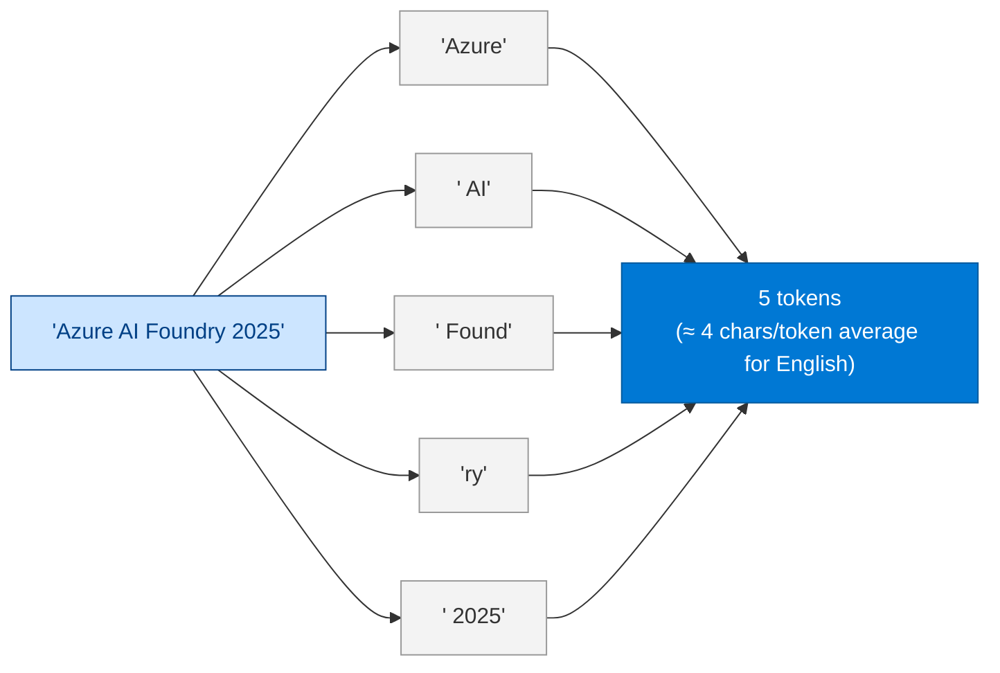

**Practical rules:**
- 1 token ≈ 4 characters of English text
- 100 tokens ≈ 75 words
- GPT-4o context: 128K tokens ≈ ~96,000 words ≈ a full novel
- Numbers are often split into individual digit tokens: `2025` → `['20', '25']` — which is why LLMs struggle with arithmetic

### 3.4 Embeddings

An **embedding** is a dense vector representation of a token, sentence, or document in a high-dimensional space where semantic similarity corresponds to geometric proximity.

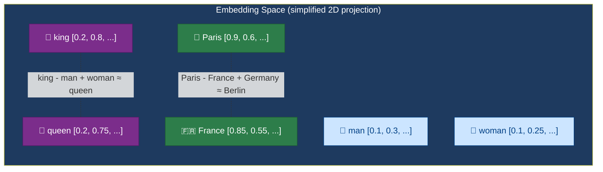

**Enterprise use:** Embeddings power semantic search in RAG pipelines. You embed documents and queries, then find the nearest-neighbor documents to a query using cosine similarity.

### 3.5 Context Window

The context window is the maximum number of tokens the model can "see" in one call — its working memory.

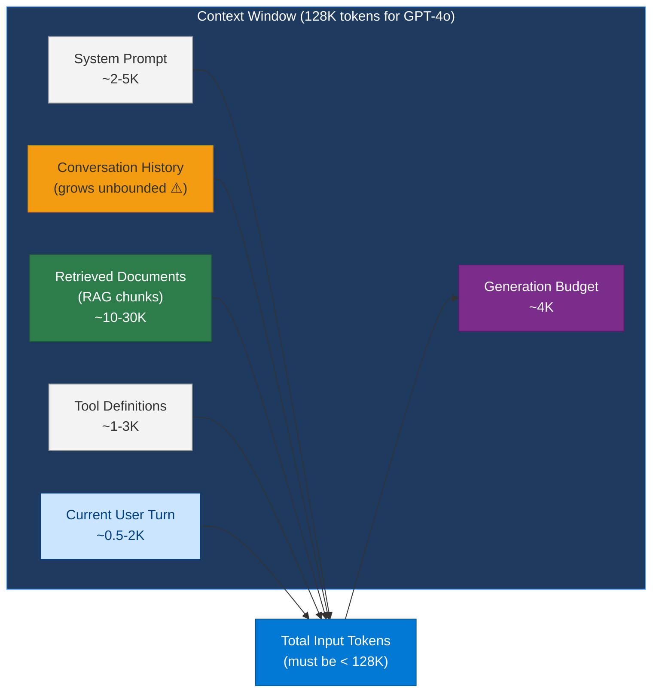

**"Lost in the middle" problem:** Research (Liu et al., 2023) shows LLM recall degrades for information in the *middle* of long contexts. For production RAG: put the most relevant chunks at the beginning or end of the context, not in the middle.

### 3.6 Generation Parameters

| Parameter | Range | Effect | Enterprise Default |
|---|---|---|---|
| `temperature` | 0.0–2.0 | Controls randomness. 0 = deterministic greedy | 0.1 for analysis/extraction, 0.7 for creative |
| `top_p` | 0.0–1.0 | Nucleus sampling — consider tokens in top-p probability mass | 0.95 |
| `max_tokens` | 1–4096 | Max generation length | Task-specific; cap at 2048 for most agents |
| `frequency_penalty` | -2 to 2 | Penalizes tokens proportional to their frequency | 0.1 for repetition-prone tasks |
| `presence_penalty` | -2 to 2 | Penalizes tokens that have appeared at all | 0 (rarely needed) |
| `seed` | integer | Makes outputs deterministic for testing | Set in CI/CD test suites |

---

## 4. Deep Technical Detail

### 4.1 Model Families — Enterprise Comparison

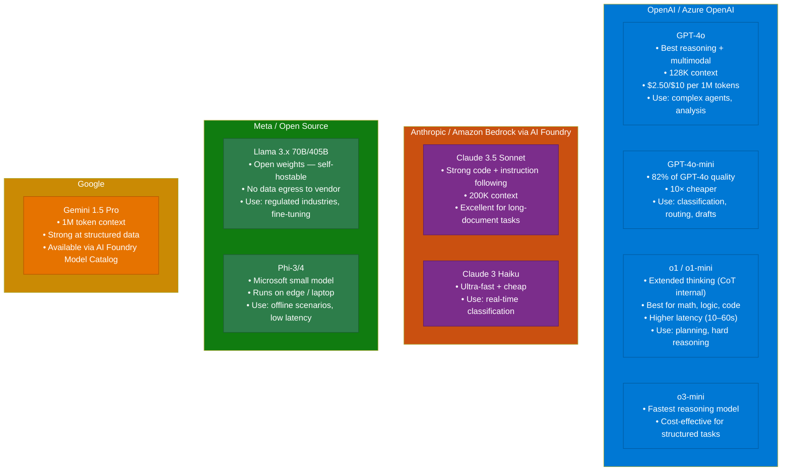

### 4.2 Model Selection Decision Tree

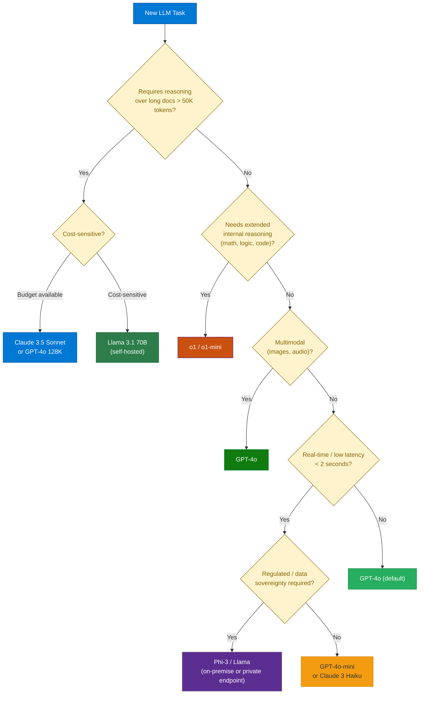

### 4.3 Fine-Tuning vs. Prompt Engineering vs. RAG

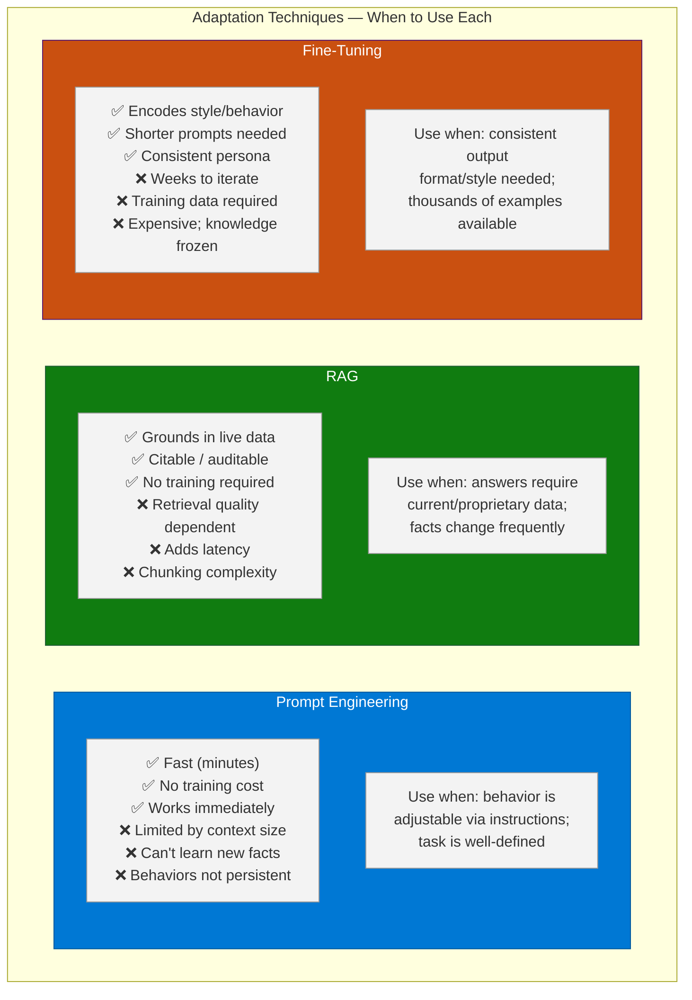

**Enterprise Rule:** Default to **Prompt Engineering first**, add **RAG** when factual grounding is needed, consider **Fine-Tuning** only when you have 1,000+ curated examples and consistent style/format is non-negotiable.

### 4.4 Structured Outputs

Forcing the model to produce a specific JSON schema — critical for agents that parse LLM output programmatically.

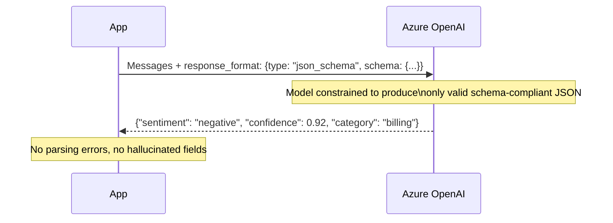

### 4.5 Streaming Responses

For user-facing applications, stream tokens as they are generated rather than waiting for the full completion. This reduces **perceived latency** dramatically (time-to-first-token typically < 500ms even for long responses).

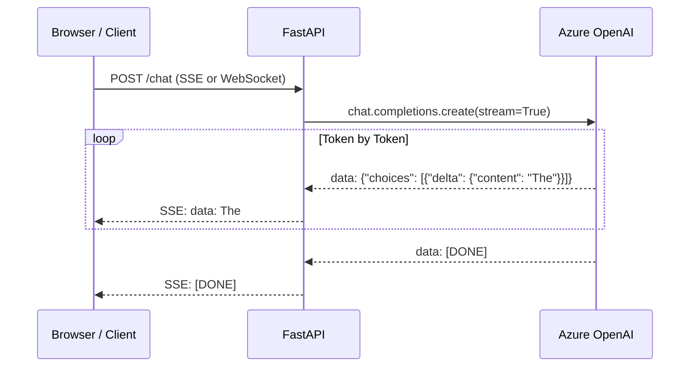

---

## 5. Azure AI Foundry Implementation

### 5.1 Deploying Models in Azure AI Foundry

```bash
# Deploy GPT-4o to your AI Project
az cognitiveservices account deployment create \
    --resource-group rg-agents-prod \
    --name <your-aoai-resource> \
    --deployment-name gpt-4o \
    --model-name gpt-4o \
    --model-version "2024-11-20" \
    --model-format OpenAI \
    --sku-capacity 100 \
    --sku-name "GlobalStandard"

# Deploy a catalog model (Llama 3.1 70B via Serverless Endpoint)
az ml online-endpoint create \
    --name llama-31-70b-endpoint \
    --resource-group rg-agents-prod \
    --workspace-name aip-support-agent
```

### 5.2 Comparing Models Programmatically

```python
# model_eval.py — evaluate multiple models on the same prompt
import asyncio
import os
from openai import AsyncAzureOpenAI
from dotenv import load_dotenv

load_dotenv()

client = AsyncAzureOpenAI(
    azure_endpoint=os.environ["AZURE_OPENAI_ENDPOINT"],
    api_key=os.environ["AZURE_OPENAI_API_KEY"],
    api_version="2024-10-21",
)

TEST_PROMPTS = [
    {
        "name": "Complex Reasoning",
        "messages": [
            {"role": "user", "content": "A company has 3 warehouses. Warehouse A has 400 units, B has 250, C has 180. Orders pending: 300 from A, 200 from B, 150 from C. If A runs out, divert to B then C. Calculate the fulfillment plan and remaining inventory."}
        ]
    },
    {
        "name": "JSON Extraction",
        "messages": [
            {"role": "system", "content": "Extract invoice data as JSON: {invoice_number, date, vendor, total_amount, line_items: [{description, qty, unit_price}]}"},
            {"role": "user", "content": "Invoice #INV-2025-441 dated June 15 2025 from TechSupply Co. 5x Laptop Stands @ $45.00 = $225.00. 3x USB-C Hubs @ $29.99 = $89.97. Total: $314.97"}
        ],
        "response_format": {"type": "json_object"}
    }
]

MODELS = ["gpt-4o", "gpt-4o-mini"]


async def evaluate_model(model: str, test: dict) -> dict:
    kwargs = {
        "model": model,
        "messages": test["messages"],
        "max_tokens": 1024,
    }
    if "response_format" in test:
        kwargs["response_format"] = test["response_format"]

    import time
    start = time.perf_counter()
    response = await client.chat.completions.create(**kwargs)
    latency_ms = (time.perf_counter() - start) * 1000

    return {
        "model": model,
        "test": test["name"],
        "latency_ms": round(latency_ms, 1),
        "prompt_tokens": response.usage.prompt_tokens,
        "completion_tokens": response.usage.completion_tokens,
        "total_tokens": response.usage.total_tokens,
        "content": response.choices[0].message.content[:200] + "...",
    }


async def main():
    tasks = [
        evaluate_model(model, test)
        for model in MODELS
        for test in TEST_PROMPTS
    ]
    results = await asyncio.gather(*tasks)

    print(f"\n{'Model':<15} {'Test':<25} {'Latency':>10} {'Tokens':>8}")
    print("-" * 65)
    for r in results:
        print(f"{r['model']:<15} {r['test']:<25} {r['latency_ms']:>9.0f}ms {r['total_tokens']:>8}")
        print(f"  Preview: {r['content'][:80]}\n")


if __name__ == "__main__":
    asyncio.run(main())
```

---

## 6. Working Code Examples

### 6.1 Structured Output Extraction

```python
# structured_extraction.py
import os
import json
from openai import AzureOpenAI
from pydantic import BaseModel, Field
from typing import Optional
from dotenv import load_dotenv

load_dotenv()

client = AzureOpenAI(
    azure_endpoint=os.environ["AZURE_OPENAI_ENDPOINT"],
    api_key=os.environ["AZURE_OPENAI_API_KEY"],
    api_version="2024-10-21",
)


class LineItem(BaseModel):
    description: str
    quantity: int
    unit_price: float
    total: float


class Invoice(BaseModel):
    invoice_number: str
    date: str
    vendor_name: str
    total_amount: float
    currency: str = "USD"
    line_items: list[LineItem]
    payment_terms: Optional[str] = None


def extract_invoice(raw_text: str) -> Invoice:
    response = client.beta.chat.completions.parse(
        model=os.environ["AZURE_OPENAI_DEPLOYMENT_NAME"],
        messages=[
            {
                "role": "system",
                "content": "You are an invoice parsing assistant. Extract all invoice data precisely. Compute totals if not explicitly stated.",
            },
            {"role": "user", "content": f"Extract invoice data from:\n\n{raw_text}"},
        ],
        response_format=Invoice,
    )
    return response.choices[0].message.parsed


if __name__ == "__main__":
    sample = """
    INVOICE
    Invoice Number: INV-2025-8841
    Date: June 28, 2025
    
    From: CloudTech Solutions Ltd.
    
    Services Rendered:
    - Azure Architecture Review (8 hours @ $250/hr)     $2,000.00
    - AI Agent Development (20 hours @ $300/hr)         $6,000.00
    - DevOps Pipeline Setup (5 hours @ $200/hr)         $1,000.00
    
    Subtotal: $9,000.00
    Tax (10%): $900.00
    TOTAL DUE: $9,900.00
    
    Payment Terms: Net 30
    """

    invoice = extract_invoice(sample)
    print(invoice.model_dump_json(indent=2))
```

### 6.2 Streaming Response with FastAPI

```python
# streaming_api.py
import os
from fastapi import FastAPI
from fastapi.responses import StreamingResponse
from pydantic import BaseModel
from openai import AsyncAzureOpenAI
from dotenv import load_dotenv

load_dotenv()

app = FastAPI()
client = AsyncAzureOpenAI(
    azure_endpoint=os.environ["AZURE_OPENAI_ENDPOINT"],
    api_key=os.environ["AZURE_OPENAI_API_KEY"],
    api_version="2024-10-21",
)


class ChatRequest(BaseModel):
    message: str
    system_prompt: str = "You are a helpful enterprise AI assistant."


async def token_stream(request: ChatRequest):
    async with client.chat.completions.stream(
        model=os.environ["AZURE_OPENAI_DEPLOYMENT_NAME"],
        messages=[
            {"role": "system", "content": request.system_prompt},
            {"role": "user", "content": request.message},
        ],
        max_tokens=2048,
    ) as stream:
        async for text in stream.text_stream:
            yield f"data: {text}\n\n"
    yield "data: [DONE]\n\n"


@app.post("/chat/stream")
async def stream_chat(request: ChatRequest):
    return StreamingResponse(
        token_stream(request),
        media_type="text/event-stream",
        headers={"Cache-Control": "no-cache", "X-Accel-Buffering": "no"},
    )


# Run: uvicorn streaming_api:app --reload
# Test: curl -N -X POST http://localhost:8000/chat/stream \
#   -H "Content-Type: application/json" \
#   -d '{"message": "Explain transformer attention in 3 sentences"}'
```

### 6.3 Embeddings for Semantic Similarity

```python
# embeddings_demo.py
import os
import math
from openai import AzureOpenAI
from dotenv import load_dotenv

load_dotenv()

client = AzureOpenAI(
    azure_endpoint=os.environ["AZURE_OPENAI_ENDPOINT"],
    api_key=os.environ["AZURE_OPENAI_API_KEY"],
    api_version="2024-10-21",
)

EMBED_MODEL = "text-embedding-3-large"  # Deploy this in Azure OpenAI


def embed(texts: list[str]) -> list[list[float]]:
    response = client.embeddings.create(model=EMBED_MODEL, input=texts)
    return [item.embedding for item in response.data]


def cosine_similarity(a: list[float], b: list[float]) -> float:
    dot = sum(x * y for x, y in zip(a, b))
    norm_a = math.sqrt(sum(x ** 2 for x in a))
    norm_b = math.sqrt(sum(x ** 2 for x in b))
    return dot / (norm_a * norm_b) if norm_a and norm_b else 0.0


def semantic_search(query: str, documents: list[str], top_k: int = 3) -> list[dict]:
    all_texts = [query] + documents
    all_embeddings = embed(all_texts)
    query_emb = all_embeddings[0]
    doc_embs = all_embeddings[1:]

    scores = [
        {"document": doc, "score": cosine_similarity(query_emb, emb), "index": i}
        for i, (doc, emb) in enumerate(zip(documents, doc_embs))
    ]
    return sorted(scores, key=lambda x: x["score"], reverse=True)[:top_k]


if __name__ == "__main__":
    corpus = [
        "Azure AI Foundry provides a unified platform for building enterprise AI agents.",
        "The Kubernetes cluster autoscaler adjusts node count based on pending pod demand.",
        "Retrieval-Augmented Generation combines search with language model generation.",
        "Azure Key Vault stores secrets, certificates, and cryptographic keys securely.",
        "GPT-4o is a multimodal model supporting text, image, and audio inputs.",
        "The ReAct pattern interleaves reasoning steps with tool calls in an agent loop.",
        "Container Apps provide serverless hosting for microservices and event-driven workloads.",
    ]

    query = "How do AI agents use retrieval to answer questions?"
    results = semantic_search(query, corpus, top_k=3)

    print(f"Query: {query}\n")
    for r in results:
        print(f"Score: {r['score']:.4f} | {r['document']}")
```

---

## 7. Enterprise Pattern Notes

### Pattern: Model Router

Use a cheap, fast model to classify incoming requests, then route to the appropriate specialist model. Reduces cost by 60–80% for mixed workloads.

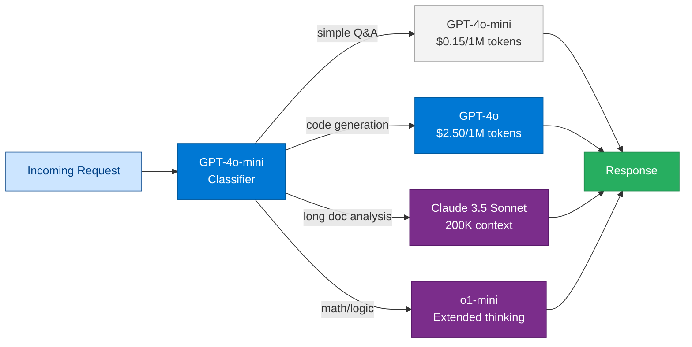

```python
# model_router.py
from enum import Enum
from openai import AzureOpenAI
import json

class TaskType(str, Enum):
    SIMPLE_QA = "simple_qa"
    CODE = "code"
    LONG_DOC = "long_document"
    REASONING = "reasoning"

MODEL_MAP = {
    TaskType.SIMPLE_QA: "gpt-4o-mini",
    TaskType.CODE: "gpt-4o",
    TaskType.LONG_DOC: "gpt-4o",        # or Claude via AI Foundry
    TaskType.REASONING: "o1-mini",
}

def classify_task(client: AzureOpenAI, user_message: str) -> TaskType:
    response = client.chat.completions.create(
        model="gpt-4o-mini",
        messages=[
            {
                "role": "system",
                "content": (
                    'Classify the user request into exactly one category. '
                    'Return JSON: {"task_type": "<simple_qa|code|long_document|reasoning>"}. '
                    'simple_qa: factual questions, summaries under 1000 words. '
                    'code: writing, reviewing, or debugging code. '
                    'long_document: analyzing documents over 5000 words. '
                    'reasoning: math problems, logic puzzles, multi-step analysis.'
                ),
            },
            {"role": "user", "content": user_message},
        ],
        response_format={"type": "json_object"},
        max_tokens=50,
    )
    result = json.loads(response.choices[0].message.content)
    return TaskType(result["task_type"])


def route_and_respond(client: AzureOpenAI, user_message: str) -> dict:
    task_type = classify_task(client, user_message)
    model = MODEL_MAP[task_type]

    response = client.chat.completions.create(
        model=model,
        messages=[{"role": "user", "content": user_message}],
        max_tokens=2048,
    )

    return {
        "task_type": task_type,
        "model_used": model,
        "response": response.choices[0].message.content,
        "tokens": response.usage.total_tokens,
    }
```

---

## 7.1 Fine-Tuning Techniques — LoRA and RLHF

### LoRA (Low-Rank Adaptation)

Full fine-tuning rewrites every weight in a model — expensive and slow. **LoRA** freezes the original model weights and injects small, trainable **adapter matrices** (rank-decomposed weight updates) at specific layers. Only the adapters are trained — the base model is unchanged.

```
ΔW = B × A   where B ∈ ℝ^(d×r), A ∈ ℝ^(r×k), rank r ≪ d

Example: GPT-4 weight matrix W is 4096 × 4096 = 16M parameters
LoRA adapters: r=8 → 4096×8 + 8×4096 = 65,536 parameters (0.4% of original)
```

**When to use LoRA:**
- You need to adapt a large model to a narrow domain (legal, medical, proprietary code style)
- You cannot afford to fine-tune the full model (compute cost, time)
- You want to maintain multiple domain adapters on the same base model (swap adapters per request)

**Azure AI Foundry**: LoRA fine-tuning is available for GPT-4o via the Foundry fine-tuning UI or API. Training data must be JSONL format (prompt/completion pairs or chat format).

### RLHF (Reinforcement Learning from Human Feedback)

RLHF is the training process that turns a raw pre-trained LLM (which predicts tokens) into a helpful, safe assistant (which follows instructions and avoids harmful outputs). It has three stages:

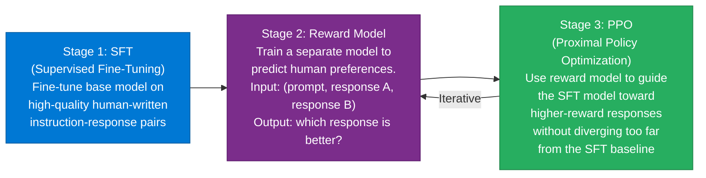

**Why it matters for you as an engineer:** RLHF is why GPT-4o follows your instructions reliably, refuses harmful requests, and stays on topic. Understanding it helps you diagnose model behaviour: if GPT-4o is overly cautious or refuses reasonable requests, it is the RLHF safety tuning; if it is too verbose, it is the reward model preferring longer responses.

### Temperature and Sampling Parameters

```python
# sampling_params.py — understanding temperature, top_p, top_k
from openai import AsyncAzureOpenAI
import os

aoai = AsyncAzureOpenAI(
    azure_endpoint=os.environ["AZURE_OPENAI_ENDPOINT"],
    api_key=os.environ["AZURE_OPENAI_API_KEY"],
    api_version="2024-10-21",
)

async def generate_with_params(prompt: str) -> dict[str, str]:
    """Demonstrate effect of different sampling parameters."""
    base_messages = [{"role": "user", "content": prompt}]

    # Deterministic — always the same output (for structured extraction, evaluation)
    deterministic = await aoai.chat.completions.create(
        model="gpt-4o",
        messages=base_messages,
        temperature=0,          # No randomness — always picks highest-prob token
        max_tokens=200,
    )

    # Creative — varied, exploratory output (for brainstorming, content generation)
    creative = await aoai.chat.completions.create(
        model="gpt-4o",
        messages=base_messages,
        temperature=1.0,        # High randomness — samples from full distribution
        top_p=0.9,              # Nucleus sampling: only consider tokens in top 90% probability mass
        max_tokens=200,
    )

    # Balanced — slight variation, still coherent (for Q&A, chat)
    balanced = await aoai.chat.completions.create(
        model="gpt-4o",
        messages=base_messages,
        temperature=0.3,
        max_tokens=200,
    )

    return {
        "deterministic": deterministic.choices[0].message.content,
        "creative": creative.choices[0].message.content,
        "balanced": balanced.choices[0].message.content,
    }

# Parameter guide:
# temperature=0    → Extraction, classification, structured output, evaluation judges
# temperature=0.3  → Q&A, RAG responses, tool argument generation
# temperature=0.7  → Conversational responses, explanations
# temperature=1.0+ → Creative writing, brainstorming, self-consistency sampling
#
# top_p (nucleus sampling):
#   Restricts the token pool to the smallest set whose cumulative probability ≥ top_p
#   top_p=1.0 (default) = full vocabulary; top_p=0.9 = most probable 90% of mass
#   Use top_p instead of temperature when you want controlled creativity without instability
#
# max_tokens:
#   Hard cap on output length — ALWAYS set this in production to prevent cost surprises
#   Typical values: 200 (classification), 500 (Q&A), 2000 (long-form), 4096 (code generation)
```

---

## 7.2 Diffusion Models — Image Generation

**Analogy:** Sculpting from noise. You start with random static and iteratively remove noise step-by-step until a coherent image emerges, guided by a text prompt.

### How Diffusion Works

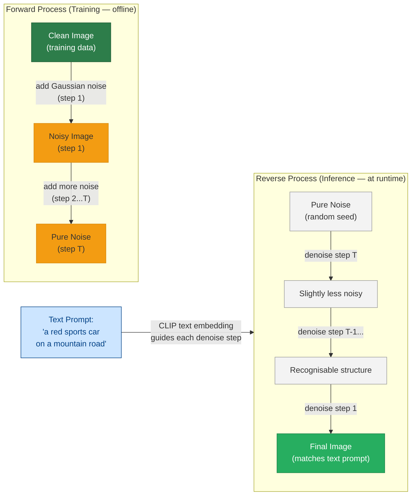

**The key insight:** The neural network (U-Net) learns to predict and remove the noise added at each step during training. At inference time, it starts from random noise and runs the learned denoising process in reverse, guided by the text embedding.

### Diffusion Models on Azure

| Model | Azure Service | Best For |
|---|---|---|
| DALL-E 3 | Azure OpenAI | Enterprise image generation with content filtering, no separate setup |
| Stable Diffusion | Azure ML / Container Apps | Self-hosted, fine-tunable on custom datasets, open source |
| Adobe Firefly | Adobe + Azure integration | Commercially safe, stock-photo training data |

```python
# dalle3_generation.py — DALL-E 3 via Azure OpenAI
import os
from openai import AzureOpenAI

client = AzureOpenAI(
    azure_endpoint=os.environ["AZURE_OPENAI_ENDPOINT"],
    api_key=os.environ["AZURE_OPENAI_API_KEY"],
    api_version="2024-10-21",
)


def generate_image(prompt: str, size: str = "1024x1024") -> str:
    """Generate an image and return the URL. URL expires after 24 hours."""
    response = client.images.generate(
        model="dall-e-3",        # Azure deployment name for DALL-E 3
        prompt=prompt,
        size=size,               # "1024x1024", "1792x1024", "1024x1792"
        quality="standard",      # "standard" or "hd" (2× cost)
        n=1,
    )
    return response.data[0].url


def generate_with_revised_prompt(prompt: str) -> tuple[str, str]:
    """DALL-E 3 rewrites prompts for quality — return both image URL and revised prompt."""
    response = client.images.generate(
        model="dall-e-3",
        prompt=prompt,
        size="1024x1024",
        quality="standard",
        n=1,
    )
    return response.data[0].url, response.data[0].revised_prompt


# Diffusion vs LLM: key conceptual differences
# LLMs:         text tokens as input/output, autoregressive (left-to-right token prediction)
# Diffusion:    continuous pixel values, iterative denoising over ~20-50 inference steps
# Multimodal:   GPT-4o bridges both — accepts image input + text, outputs text (not images)
```

**Enterprise use cases for diffusion models:**
- Marketing asset generation (product shots, social media images) at scale
- Document / report visualisation (generate diagrams from descriptions)
- Training data augmentation (synthetic images for computer vision models)
- Accessibility (generate visual aids for text-heavy content)

---

## 7.3 AGI — Artificial General Intelligence

**AGI (Artificial General Intelligence)** refers to a hypothetical AI system with the ability to understand, learn, and apply knowledge across *any* intellectual task at human level or above — as opposed to today's **Narrow AI**, which excels at specific tasks but fails outside its training distribution.

```mermaid
graph LR
    subgraph NARROW["Narrow AI (Today — ANI)"]
        C1["GPT-4o\n→ Text/code generation"]
        C2["DALL-E\n→ Image generation"]
        C3["AlphaFold\n→ Protein structure"]
        C4["AlphaGo\n→ Go only"]
    end

    subgraph AGI["AGI (Hypothetical)"]
        G1["Single system\n→ All of the above\n+ any new task\nwithout retraining"]
    end

    subgraph ASI["ASI — Artificial Super Intelligence"]
        S1["Exceeds human\ncognition in all domains\n(speculative)"]
    end

    NARROW -->|"scaling + alignment\nresearch"| AGI
    AGI -->|"recursive\nself-improvement?"| ASI

    classDef primary   fill:#0078d4,color:#fff,stroke:#005a9e
    classDef secondary fill:#7b2d8b,color:#fff,stroke:#5a1a6b
    classDef storage   fill:#2d7d4a,color:#fff,stroke:#1f5c35
    classDef security  fill:#c7372f,color:#fff,stroke:#a02020
    classDef monitor   fill:#e67300,color:#fff,stroke:#b35500
    classDef success   fill:#27ae60,color:#fff,stroke:#1e8449
    classDef warning   fill:#f39c12,color:#333,stroke:#d68910
    classDef neutral   fill:#f3f3f3,color:#333,stroke:#999
    classDef user      fill:#cce5ff,color:#004085,stroke:#004085
    classDef decision  fill:#fff3cd,color:#856404,stroke:#856404
    classDef highlight fill:#e74c3c,color:#fff,stroke:#c0392b

    class C1,C2,C3,C4 primary
    class G1 secondary
    class S1 highlight
```

### ANI vs AGI vs ASI

| Level | Name | Definition | Status |
|---|---|---|---|
| **ANI** | Artificial Narrow Intelligence | Superhuman at one specific task; fails outside it | **Here now** — GPT-4o, AlphaGo, image classifiers |
| **AGI** | Artificial General Intelligence | Human-level performance across all cognitive tasks | **Not yet achieved** — active research goal |
| **ASI** | Artificial Super Intelligence | Exceeds human intelligence in every domain | **Speculative** — no consensus on timeline or feasibility |

### Why AGI is Hard — The Key Gaps

Current LLMs like GPT-4o are extraordinarily capable but still fall short of AGI for specific reasons:

| Capability | LLMs today | AGI requirement |
|---|---|---|
| **Generalisation** | Trained distribution; struggles with true out-of-distribution tasks | Zero-shot generalisation to any task |
| **Common sense / world model** | Implicit, unreliable; can fail on simple physical reasoning | Robust grounded model of how the world works |
| **Causal reasoning** | Pattern correlation, not causation | Understands cause → effect, can counterfactual reason |
| **Continuous learning** | Static weights after training (no online learning) | Learns and updates from new experience without retraining |
| **Embodiment** | Text/image only; no physical interaction | Can interact with and learn from physical environments |
| **Goal-directed planning** | Reactive, prompt-driven | Autonomous long-horizon goal pursuit |

### Relevance to Enterprise AI Engineers

AGI is not a product you will ship in 2026 — but understanding the concept matters for two practical reasons:

1. **Managing expectations:** Clients often conflate current LLMs with AGI. The difference — "it's very good at tasks similar to its training data, but it's not reasoning from first principles" — is a critical framing for responsible AI deployment.

2. **Agentic AI as a stepping stone:** The agent loop (Plan → Act → Observe → Reflect) that powers today's multi-agent systems is explicitly inspired by theories of what AGI would need. Long-horizon task completion, tool use, and memory are all AGI sub-problems being actively worked on in production AI today.

> **Interview answer:** *"AGI is a hypothetical AI with human-level general intelligence across all tasks. We don't have it yet — current systems are ANI (Narrow AI), highly capable within their training distribution but brittle outside it. The practical significance for engineers is: never over-claim what your AI system can do, design for failure modes, and recognise that agentic patterns (planning, tool use, memory) are incremental steps toward more general AI — not AGI itself."*

---

## 8. Production Checklist

### Model Management
- [ ] Pin model versions in deployment (`model-version: "2024-11-20"`) — auto-updates can break agent behavior
- [ ] Test every new model version against a golden evaluation set before promoting
- [ ] Implement a model version header in API responses for debugging

### Cost Controls
- [ ] Set token quota limits per deployment in Azure OpenAI (Portal → Deployments → Edit)
- [ ] Alert at 80% of monthly quota via Azure Monitor
- [ ] Log `total_tokens` per request; set alerts for runaway requests (> 10K tokens)
- [ ] Use `gpt-4o-mini` for classification, routing, and low-complexity tasks
- [ ] Enable Azure OpenAI PTU (Provisioned Throughput) for predictable high-volume workloads

### Reliability
- [ ] Implement retry with exponential backoff for 429 (rate limit) and 503 responses
- [ ] Set `timeout` on all LLM calls (default: 30s for completions, 120s for o1)
- [ ] Configure fallback deployment (e.g., East US 2 fails → fall back to Sweden Central)
- [ ] Use circuit breaker pattern for sustained outage protection

### Security
- [ ] Use Managed Identity + token provider — no API keys in code
- [ ] Enable Azure OpenAI Content Safety filters (Hate, Violence, Sexual, Self-harm)
- [ ] Redact PII from prompts before sending to model (use Azure AI Language PII detection)
- [ ] Audit log all LLM calls to Azure Monitor (includes prompt hash, not raw prompt)

---

## 9. Interview Q&A

### Q1 (Beginner): What is a token, and why does it matter for enterprise AI?

**Answer:** A token is the basic unit of text that an LLM processes — roughly 4 characters of English, or ¾ of a word. Tokens matter for three enterprise reasons: (1) **Cost** — Azure OpenAI pricing is per 1,000 tokens, so token efficiency directly impacts spend; (2) **Context limits** — models can only process a fixed number of tokens per call (128K for GPT-4o), so long documents must be chunked; (3) **Performance** — more tokens in = more computation = higher latency. An enterprise AI engineer must track token usage per request in monitoring dashboards.

---

### Q2 (Beginner): What is the difference between temperature 0 and temperature 1?

**Answer:** Temperature controls how the model samples from its probability distribution over next tokens. At temperature 0, the model always picks the highest-probability token (greedy decoding) — outputs are deterministic and consistent. At temperature 1, sampling is proportional to raw probabilities — outputs are more varied and creative. Enterprise guidance: use temperature 0.1 for extraction, classification, and analysis tasks where consistency matters; use 0.5–0.7 for drafting and summarization where natural variation is acceptable.

---

### Q3 (Intermediate): When would you choose fine-tuning over RAG, and what are the risks of each?

**Answer:** Choose fine-tuning when: you need consistent output *style/format* (not facts), you have 1,000+ high-quality training examples, and you want shorter prompts (lower latency/cost). Choose RAG when: you need access to current or proprietary factual data, answers must be citable, and facts change frequently.

Risks: Fine-tuning has *knowledge cutoff* — the model cannot access data not in training data, and retraining is expensive when data changes. Fine-tuned models can also *catastrophically forget* general capabilities if training data is narrow. RAG risks *retrieval failure* — if the relevant chunk isn't retrieved, the model hallucinates an answer. In practice, most enterprise systems use RAG + prompt engineering first, then consider fine-tuning only for style consistency.

---

### Q4 (Intermediate): Explain the "lost in the middle" problem and how you mitigate it.

**Answer:** Research (Liu et al., 2023) demonstrated that LLMs recall information from the *beginning and end* of long contexts much better than from the *middle*. In a 100-page document context, facts buried in pages 40–60 are significantly less likely to be recalled than facts on pages 1–5 or 95–100.

Mitigations: (1) **Reranker models** — after retrieval, use a cross-encoder reranker to identify the single most relevant chunk and place it *first* in the context; (2) **Map-reduce patterns** — split long documents into chunks, summarize each independently, then synthesize summaries; (3) **Query-specific chunking** — dynamically select and order chunks based on the query, placing highest-relevance chunks at context boundaries; (4) **Use long-context models carefully** — don't rely on 128K context to solve retrieval; structured retrieval is more reliable.

---

### Q5 (Advanced): How does Azure OpenAI's Provisioned Throughput (PTU) differ from pay-as-you-go, and when should you use each?

**Answer:** 
- **Pay-as-you-go (PAYG):** Billed per token. Capacity is shared and subject to throttling (429s) during high-demand periods. Best for: development, unpredictable or low-volume workloads.
- **Provisioned Throughput (PTU):** You purchase a fixed number of Tokens-Per-Minute (TPM) capacity units. No per-token billing — cost is flat regardless of usage. Best for: production workloads with predictable, sustained volume; latency-sensitive applications; SLA requirements.

**Decision rule:** Break-even is typically ~40–60% PTU utilization vs. PAYG at scale. Run 30 days of PAYG usage data, calculate average TPM, then size PTU units at 110% of average peak. Use PTU for the baseline load; overflow to PAYG during spikes.

---

### Q6 (Architecture): A client's legal department requires that no document content ever leaves their Azure tenant when processed by the LLM. How do you architect this?

**Answer:** Three options in order of enterprise practicality:

1. **Azure OpenAI (preferred):** Deploy GPT-4o within the client's Azure subscription. Azure OpenAI is a first-party Azure service — data is processed within the tenant and Microsoft contractually guarantees it's not used for training. This satisfies most legal requirements with the least engineering effort. Add a private endpoint and VNet integration to eliminate public internet exposure.

2. **Self-hosted open-source model:** Deploy Llama 3.1 70B on Azure ML managed online endpoints or AKS with GPU nodes. Data never leaves the cluster. Tradeoff: significantly higher infra cost (A100 GPU VMs), model management overhead, and typically lower benchmark performance than GPT-4o.

3. **Azure AI Foundry with private networking:** Configure AI Hub with managed VNet, outbound rules allowing only approved endpoints, and private endpoints for all dependencies (storage, key vault, ACR). Combine with Azure Policy to deny any public internet egress from the resource group.

Always pair with: Azure Private Endpoints for all storage/service dependencies, Microsoft Purview audit logs for data lineage, and Data Loss Prevention (DLP) policies scanning all inputs.

---

### Q7 (Beginner): What is a Transformer and why did it replace RNNs for language tasks?

**Answer:** A Transformer is a neural network architecture introduced in the 2017 paper "Attention is All You Need." It processes all tokens in the input *simultaneously* using self-attention, rather than sequentially like RNNs (Recurrent Neural Networks). This matters for three reasons: (1) **Parallelism** — the whole sequence is processed in one pass, so training on GPUs is orders of magnitude faster; (2) **Long-range dependencies** — RNNs struggle to connect information separated by hundreds of tokens (the vanishing gradient problem); attention directly connects any two tokens regardless of distance; (3) **Scalability** — Transformers scale predictably with more data, compute, and parameters (the "scaling laws"), which led to GPT-4-class models. RNNs (LSTM, GRU) hit a performance ceiling that Transformers don't.

---

### Q8 (Intermediate): Explain self-attention. What are Q, K, and V, and why do we scale by √d_k?

**Answer:** Self-attention lets each token in a sequence ask: *"Which other tokens are most relevant to understanding me?"* It does this via three learned projections of the input embeddings: **Q (Query)** — what the current token is looking for; **K (Key)** — what each token offers; **V (Value)** — the content to extract from matched tokens. The attention score between two tokens is `Q · Kᵀ`, scaled by `1/√d_k` and passed through softmax to get weights that sum to 1. The output is the weighted sum of all V vectors. We divide by `√d_k` because as the key dimension grows large, dot products grow in magnitude and push softmax into a near-saturated regime (near-zero gradients). Scaling by `√d_k` keeps the variance stable during training regardless of model size.

---

### Q9 (Advanced): Why do all major production LLMs (GPT-4, Claude, Llama) use decoder-only architecture? What is the trade-off vs encoder-decoder?

**Answer:** Decoder-only (autoregressive) models use a **causal mask** — each token can only attend to preceding tokens. This has two critical advantages: (1) **Training efficiency**: during pre-training on a sequence of N tokens, every position from 1 to N is a valid prediction target simultaneously. This means a single forward pass yields N training examples, making GPU utilization near-perfect; (2) **Generality**: generation (completing text) subsumes all NLP tasks — classification is just generation with a constrained output format, translation is generation in another language, embedding can be extracted from the last token. Encoder-decoder (T5, BART) has a natural advantage for fixed-input → fixed-output tasks (translation, summarization of a known document) because the encoder can attend bidirectionally. But this architecture is harder to prompt, requires two forward passes per generation step, and doesn't scale as cleanly. The industry bet that decoder-only + scale + instruction tuning would dominate all tasks — and that bet proved correct with GPT-3 onward. The one case where encoder-only still wins is **embedding** (semantic search/RAG): bidirectional attention produces richer token representations, which is why `text-embedding-3-large` is an encoder, not a decoder.

---

### Q10 (Scenario): Your GPT-4o deployment is returning inconsistent JSON in tool call arguments — sometimes valid, sometimes malformed. How do you diagnose and fix this?

**Answer:** 
1. **Diagnose:** Log the raw API response including `finish_reason`. If `finish_reason = "length"`, the model hit `max_tokens` mid-generation — the JSON was truncated. If `finish_reason = "stop"`, the model generated invalid JSON voluntarily.

2. **Fix for truncation:** Increase `max_tokens` or reduce the complexity of the schema being generated. Add validation: if `finish_reason == "length"`, retry with a simplified schema or explicitly tell the model to be more concise.

3. **Fix for invalid JSON:** Switch to **structured outputs** (`response_format: {type: "json_schema"}`). This uses constrained decoding — the model can only generate tokens that produce valid JSON conforming to your schema, making malformed output structurally impossible.

4. **Schema hygiene:** Simplify the JSON schema — deeply nested schemas with many optional fields confuse smaller models. Flatten where possible. Use `"additionalProperties": false` to prevent hallucinated fields.

5. **Model upgrade:** If using `gpt-4o-mini` for function calling with complex schemas, switch to `gpt-4o` — function calling quality differs significantly between model tiers.

---

## Cross-links

- Previous: [01 — Agentic AI Fundamentals](./01-Agentic-AI-Fundamentals.md)
- Next: [03 — Azure AI Foundry](./03-Azure-AI-Foundry.md)
- Related: [18 — Prompt Engineering](./18-Prompt-Engineering.md) | [14 — RAG](./14-RAG.md) | [19 — Tool Calling](./19-Tool-Calling.md)
- Advanced: [36 — Performance Tuning](./36-Performance-Tuning.md) | [37 — Cost Optimization](./37-Cost-Optimization.md)

---

*Module 02 | Series: Enterprise Agentic AI Tutorial | Last updated: June 2026*
