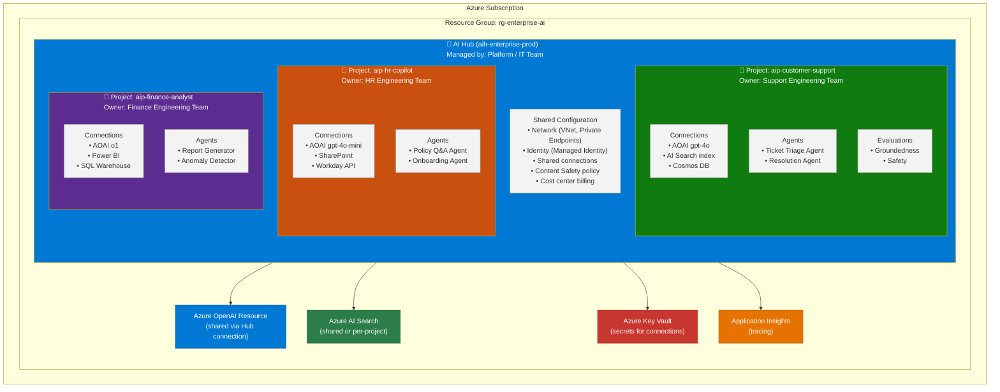
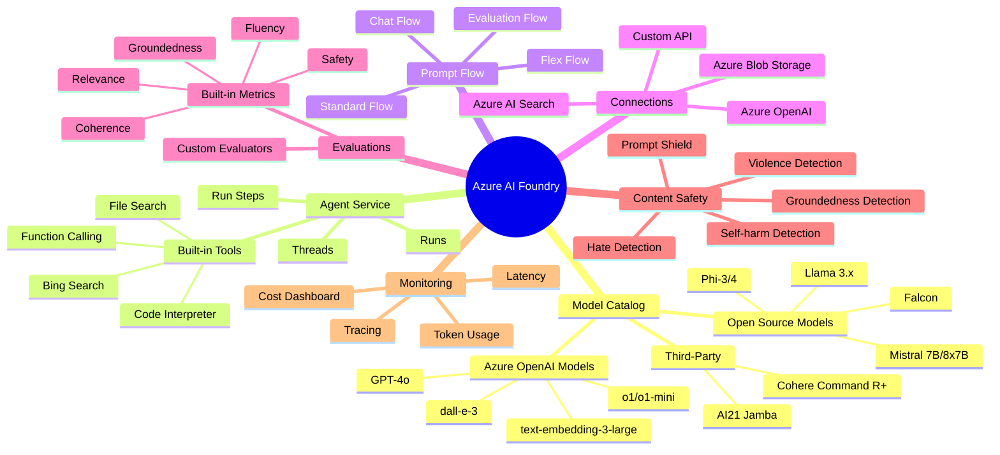
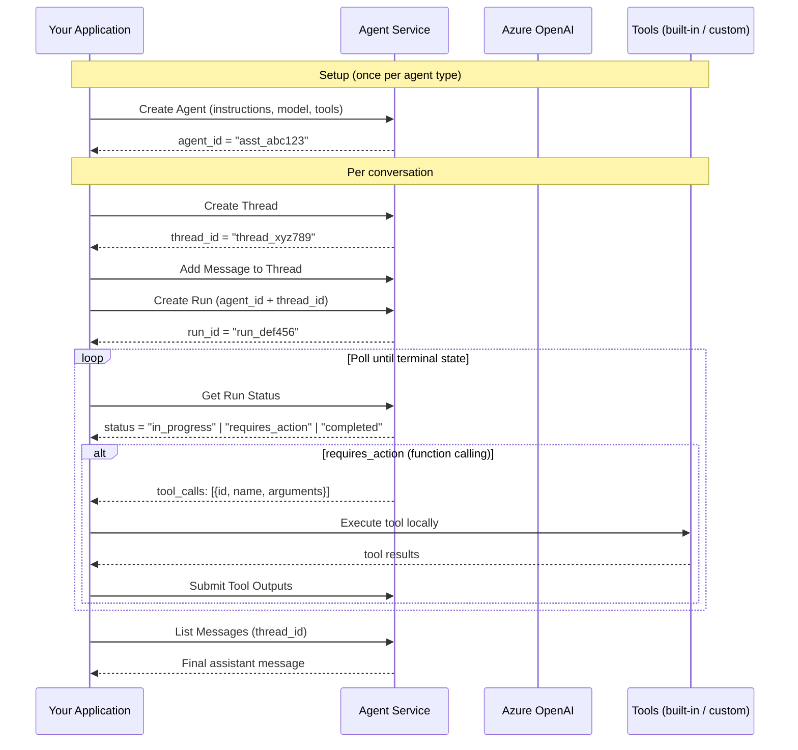
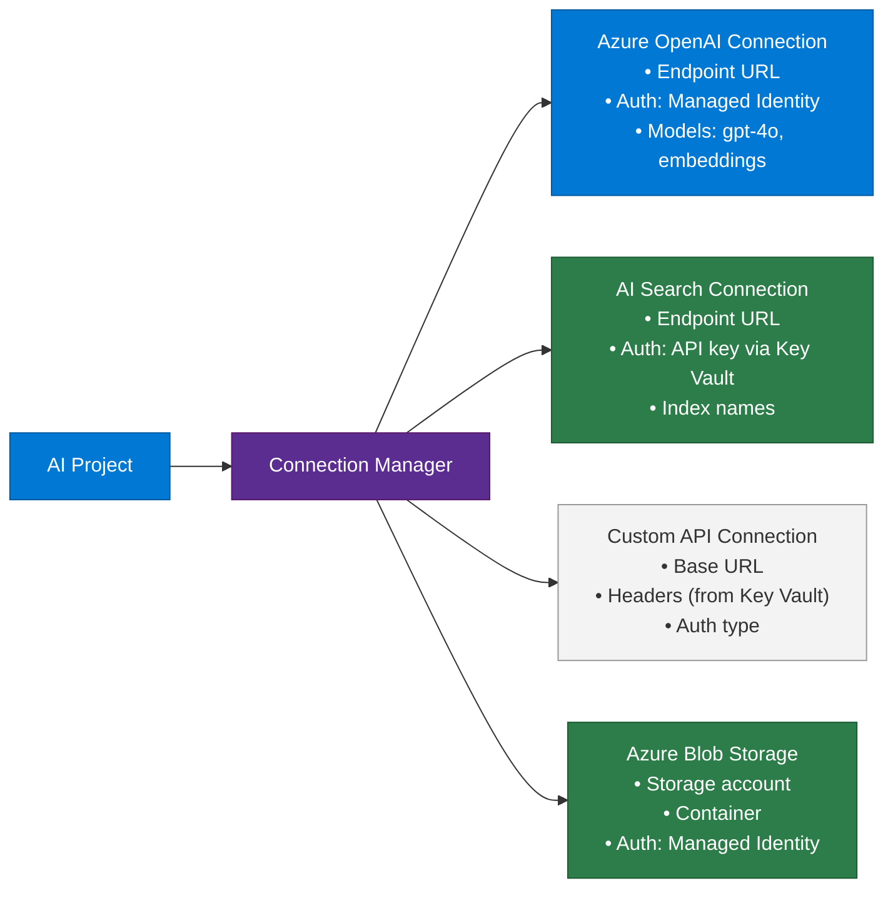
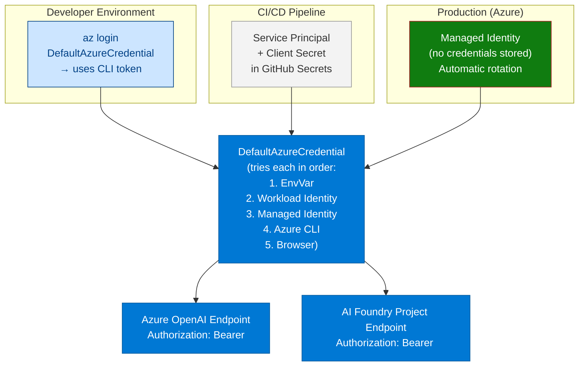
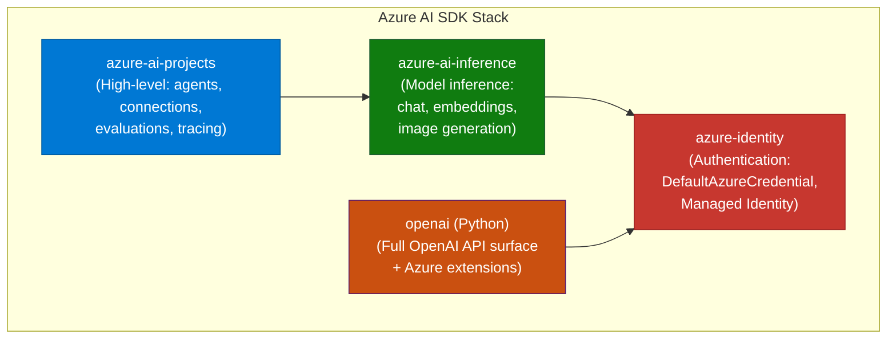
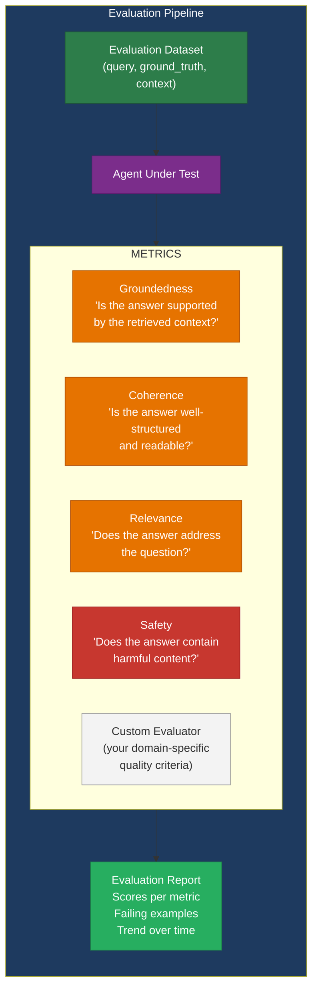
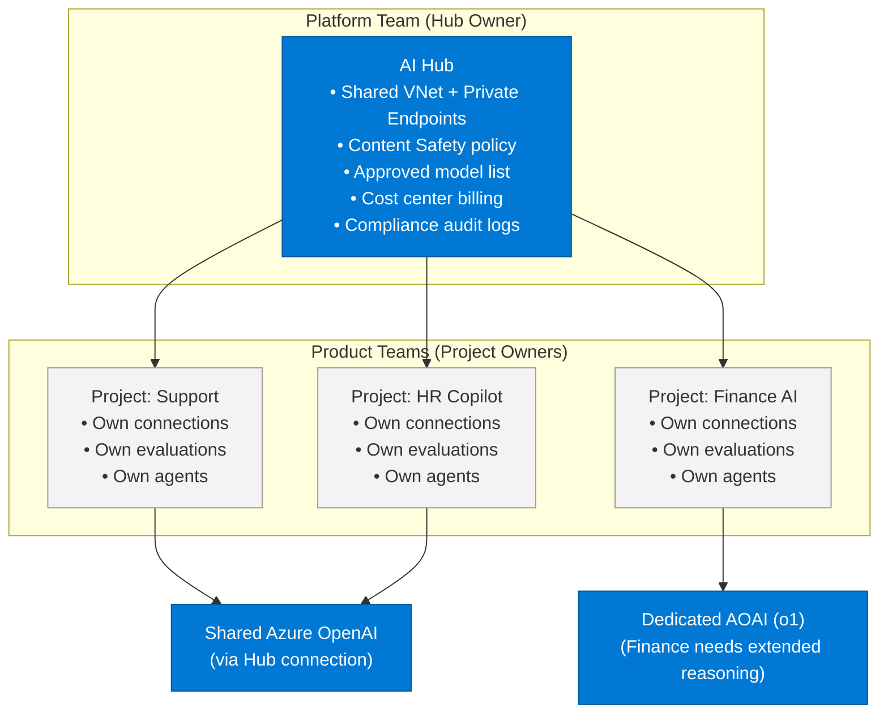
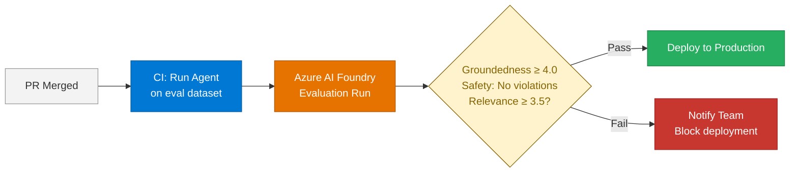

# 03 — Azure AI Foundry

> **Level:** Intermediate → Advanced | **Time to complete:** 5–6 hours | **Azure services:** Azure AI Foundry (Hub + Project), Azure OpenAI, Azure AI Search, Azure ML, Content Safety

---

## 1. Overview

### What Is Azure AI Foundry?

**Azure AI Foundry** (formerly Azure AI Studio) is Microsoft's unified enterprise platform for building, deploying, evaluating, and governing production AI applications and agents. It provides a single pane of glass across:

- **Model access** — 1,700+ models from Microsoft, OpenAI, Meta, Mistral, and others
- **Agent development** — built-in Agent Service with threading, tool execution, and memory
- **RAG pipelines** — Prompt Flow for orchestrating retrieval-augmented generation
- **Evaluation** — built-in metrics (groundedness, coherence, relevance, safety) + custom evaluators
- **Governance** — content safety, responsible AI dashboards, audit logs
- **Operations** — tracing, monitoring, cost tracking per project

### Why It Matters Enterprise-Wide

Before Azure AI Foundry, enterprise teams had to stitch together Azure OpenAI, Azure ML, Azure AI Search, and custom orchestration code from scratch — each with separate authentication, monitoring, and governance models. Foundry unifies these into a single SDK and management plane with:

- **Centralized governance** — one place for content policies, access control, and compliance audit
- **Team collaboration** — Hub (IT/platform team) → Projects (individual teams) hierarchy
- **Reproducible experiments** — connection management, prompt versioning, evaluation datasets

### When to Use / Avoid

| Use Azure AI Foundry when | Consider alternatives when |
|---|---|
| Building on Azure with enterprise governance requirements | Pure OpenAI API (no Azure) is acceptable |
| Multiple teams sharing a common AI platform | Single-developer prototype |
| Need built-in evaluation and responsible AI tooling | Full custom orchestration (e.g., pure LangChain on GCP) |
| Agent Service handles your use case (no custom loop needed) | You need an agent loop Foundry doesn't support yet |

---

## 2. Business Problem

Enterprise AI adoption fails at governance, not technology. Teams build AI prototypes that cannot pass security review, cannot be audited, and have no cost controls — leading to shadow AI. Azure AI Foundry solves:

- **Governance gap:** Centralized content safety, RBAC, and responsible AI policies per project
- **Integration gap:** Pre-built connections to Azure AI Search, Azure Storage, Key Vault, and 100+ third-party services
- **Evaluation gap:** Built-in evaluation pipelines prevent shipping AI that hallucinates or generates harmful content
- **Cost gap:** Per-project cost tracking and quota enforcement prevent runaway spend

---

## 3. Core Concepts

### 3.1 Hub and Project Hierarchy



**Hub** = the organizational container managed by the platform team. It holds shared infrastructure (networking, identity, billing, shared model connections).

**Project** = an isolated workspace for a product team. It has its own connections, agents, datasets, evaluations, and cost tracking — but inherits Hub-level security policies.

### 3.2 Key Components



### 3.3 Agent Service Deep Dive

The Azure AI Foundry Agent Service provides a stateful, managed runtime for agents — similar to the OpenAI Assistants API but running within your Azure tenant.



### 3.4 Connections

Connections are secure, versioned references to external services. The Agent Service and Prompt Flow use connections to access Azure OpenAI, AI Search, and custom APIs without embedding credentials in code.



---

## 4. Deep Technical Detail

### 4.1 Authentication Architecture



### 4.2 SDK Architecture



### 4.3 Evaluation Framework



### 4.4 Prompt Flow (Visual Orchestration)

Prompt Flow is Azure AI Foundry's low-code/pro-code orchestration engine for building RAG pipelines and agentic flows as directed acyclic graphs (DAGs).

```mermaid
graph LR
    INPUT["📥 Input\n{query: string}"] --> EMBED["🔢 Embed Query\n(text-embedding-3-large)"]
    EMBED --> SEARCH["🔍 Vector Search\n(Azure AI Search)"]
    SEARCH --> RERANK["📊 Rerank Results\n(cross-encoder)"]
    RERANK --> FORMAT["📄 Format Context\n(template node)"]
    FORMAT --> LLM["🧠 LLM Completion\n(GPT-4o)"]
    LLM --> SAFE["🛡️ Safety Check\n(Content Safety)"]
    SAFE --> OUTPUT["📤 Output\n{answer: string, citations: []}"]

    style INPUT fill:#0078d4,color:#ffffff
    style LLM fill:#ca5010,color:#ffffff
    style SAFE fill:#107c10,color:#ffffff
    style OUTPUT fill:#5c2d91,color:#ffffff

    classDef primary   fill:#0078d4,color:#fff,stroke:#005a9e
    classDef secondary fill:#7b2d8b,color:#fff,stroke:#5a1a6b
    classDef storage   fill:#2d7d4a,color:#fff,stroke:#1f5c35
    classDef security  fill:#c7372f,color:#fff,stroke:#a02020
    classDef monitor   fill:#e67300,color:#fff,stroke:#b35500
    classDef success   fill:#27ae60,color:#fff,stroke:#1e8449
    classDef warning   fill:#f39c12,color:#333,stroke:#d68910
    classDef neutral   fill:#f3f3f3,color:#333,stroke:#999
    classDef user      fill:#cce5ff,color:#004085,stroke:#004085
    classDef decision  fill:#fff3cd,color:#856404,stroke:#856404
    classDef highlight fill:#e74c3c,color:#fff,stroke:#c0392b

    class INPUT user
    class EMBED primary
    class SEARCH storage
    class RERANK monitor
    class FORMAT neutral
    class LLM secondary
    class SAFE security
    class OUTPUT success
```



---

## 5. Azure AI Foundry Implementation

### 5.1 Complete Infrastructure Setup (Bicep)

```bicep
// main.bicep — deploys Hub + Project + AOAI + AI Search
@description('Base name for all resources')
param baseName string = 'aienterprise'
param location string = resourceGroup().location
param openAiModelName string = 'gpt-4o'
param openAiModelVersion string = '2024-11-20'

// Azure OpenAI
resource openAi 'Microsoft.CognitiveServices/accounts@2024-04-01-preview' = {
  name: 'aoai-${baseName}'
  location: location
  kind: 'OpenAI'
  sku: { name: 'S0' }
  properties: {
    customSubDomainName: 'aoai-${baseName}'
    publicNetworkAccess: 'Enabled'  // Set to Disabled + private endpoint in prod
  }
}

resource gpt4oDeployment 'Microsoft.CognitiveServices/accounts/deployments@2024-04-01-preview' = {
  parent: openAi
  name: openAiModelName
  sku: { name: 'GlobalStandard', capacity: 100 }
  properties: {
    model: {
      format: 'OpenAI'
      name: openAiModelName
      version: openAiModelVersion
    }
  }
}

resource embeddingDeployment 'Microsoft.CognitiveServices/accounts/deployments@2024-04-01-preview' = {
  parent: openAi
  name: 'text-embedding-3-large'
  dependsOn: [gpt4oDeployment]
  sku: { name: 'Standard', capacity: 50 }
  properties: {
    model: {
      format: 'OpenAI'
      name: 'text-embedding-3-large'
      version: '1'
    }
  }
}

// Azure AI Search
resource aiSearch 'Microsoft.Search/searchServices@2024-03-01-Preview' = {
  name: 'aisearch-${baseName}'
  location: location
  sku: { name: 'standard' }
  properties: {
    replicaCount: 1
    partitionCount: 1
    semanticSearch: 'standard'
  }
}

// Key Vault
resource keyVault 'Microsoft.KeyVault/vaults@2023-07-01' = {
  name: 'kv-${baseName}'
  location: location
  properties: {
    sku: { family: 'A', name: 'standard' }
    tenantId: tenant().tenantId
    enableRbacAuthorization: true
    enableSoftDelete: true
    softDeleteRetentionInDays: 90
  }
}

// Application Insights
resource logAnalytics 'Microsoft.OperationalInsights/workspaces@2023-09-01' = {
  name: 'law-${baseName}'
  location: location
  properties: { sku: { name: 'PerGB2018' }, retentionInDays: 90 }
}

resource appInsights 'Microsoft.Insights/components@2020-02-02' = {
  name: 'appi-${baseName}'
  location: location
  kind: 'web'
  properties: {
    Application_Type: 'web'
    WorkspaceResourceId: logAnalytics.id
  }
}

// Storage Account (required by AI Hub)
resource storage 'Microsoft.Storage/storageAccounts@2023-04-01' = {
  name: 'st${replace(baseName, '-', '')}'
  location: location
  kind: 'StorageV2'
  sku: { name: 'Standard_LRS' }
}

// AI Hub
resource aiHub 'Microsoft.MachineLearningServices/workspaces@2024-04-01' = {
  name: 'aih-${baseName}'
  location: location
  kind: 'Hub'
  identity: { type: 'SystemAssigned' }
  properties: {
    storageAccount: storage.id
    keyVault: keyVault.id
    applicationInsights: appInsights.id
    hbiWorkspace: false
  }
}

// AI Project (child of Hub)
resource aiProject 'Microsoft.MachineLearningServices/workspaces@2024-04-01' = {
  name: 'aip-${baseName}-support'
  location: location
  kind: 'Project'
  identity: { type: 'SystemAssigned' }
  properties: {
    hubResourceId: aiHub.id
  }
}

// RBAC: Give AI Hub Managed Identity access to AOAI
resource aoaiRoleAssignment 'Microsoft.Authorization/roleAssignments@2022-04-01' = {
  scope: openAi
  name: guid(openAi.id, aiHub.id, 'CognitiveServicesOpenAIUser')
  properties: {
    roleDefinitionId: subscriptionResourceId('Microsoft.Authorization/roleDefinitions', '5e0bd9bd-7b93-4f28-af87-19fc36ad61bd')
    principalId: aiHub.identity.principalId
    principalType: 'ServicePrincipal'
  }
}

output hubName string = aiHub.name
output projectName string = aiProject.name
output openAiEndpoint string = openAi.properties.endpoint
output projectEndpoint string = 'https://${location}.api.azureml.ms'
```

Deploy:
```bash
az deployment group create \
  --resource-group rg-agents-prod \
  --template-file main.bicep \
  --parameters baseName=myenterprise
```

### 5.2 Creating Connections in AI Project (Python SDK)

```python
# setup_connections.py
import os
from azure.identity import DefaultAzureCredential
from azure.ai.projects import AIProjectClient
from azure.ai.projects.models import (
    AzureOpenAIConnection,
    AzureAISearchConnection,
    ConnectionAuthType,
)
from dotenv import load_dotenv

load_dotenv()

credential = DefaultAzureCredential()
project_client = AIProjectClient.from_connection_string(
    credential=credential,
    conn_str=os.environ["AZURE_AI_PROJECT_ENDPOINT"],
)


def create_aoai_connection():
    connection = AzureOpenAIConnection(
        name="aoai-gpt4o-connection",
        endpoint=os.environ["AZURE_OPENAI_ENDPOINT"],
        api_key=os.environ.get("AZURE_OPENAI_API_KEY"),  # None = use Managed Identity
    )
    result = project_client.connections.create_or_update(connection)
    print(f"Created AOAI connection: {result.name}")
    return result


def create_search_connection():
    connection = AzureAISearchConnection(
        name="aisearch-enterprise-kb",
        endpoint=os.environ["AZURE_SEARCH_ENDPOINT"],
        api_key=os.environ["AZURE_SEARCH_ADMIN_KEY"],
    )
    result = project_client.connections.create_or_update(connection)
    print(f"Created AI Search connection: {result.name}")
    return result


def list_connections():
    connections = list(project_client.connections.list())
    for conn in connections:
        print(f"  {conn.name} ({conn.connection_type}) — {conn.target}")


if __name__ == "__main__":
    create_aoai_connection()
    create_search_connection()
    print("\nAll connections:")
    list_connections()
```

---

## 6. Working Code Example — Full Foundry Agent

A complete production-pattern agent using Azure AI Foundry Agent Service with function calling, tracing, and evaluation.

### Project Structure

```
foundry-agent/
├── .env
├── requirements.txt
├── agent_setup.py       ← create/reuse agent
├── agent_runner.py      ← run agent with a task
├── tools.py             ← tool implementations
├── evaluator.py         ← run evaluation
└── main.py              ← entry point
```

### agent_setup.py

```python
# agent_setup.py
import os
from azure.identity import DefaultAzureCredential
from azure.ai.projects import AIProjectClient
from azure.ai.projects.models import (
    FunctionTool,
    ToolSet,
    BingGroundingTool,
)
from tools import TOOL_FUNCTIONS
from dotenv import load_dotenv

load_dotenv()

credential = DefaultAzureCredential()
project_client = AIProjectClient.from_connection_string(
    credential=credential,
    conn_str=os.environ["AZURE_AI_PROJECT_ENDPOINT"],
)

AGENT_NAME = "enterprise-support-agent-v1"
MODEL = os.environ.get("AZURE_OPENAI_DEPLOYMENT_NAME", "gpt-4o")

SYSTEM_INSTRUCTIONS = """You are an Enterprise Customer Support Agent.

Your responsibilities:
1. Look up customer accounts and order history using available tools
2. Resolve support issues or create escalation tickets when needed
3. Always verify customer identity before sharing account details
4. Maintain a professional, empathetic tone
5. Document resolution steps in the ticket

Never:
- Share one customer's data with another customer's inquiry
- Promise refunds or credits without following the approval policy (orders < $100: auto-approve; > $100: requires manager)
- Fabricate order IDs or status information
"""


def get_or_create_agent():
    """Returns existing agent by name or creates a new one."""
    existing = list(project_client.agents.list_agents())
    for agent in existing:
        if agent.name == AGENT_NAME:
            print(f"Reusing existing agent: {agent.id}")
            return agent

    toolset = ToolSet()
    toolset.add(FunctionTool(functions=TOOL_FUNCTIONS))

    agent = project_client.agents.create_agent(
        model=MODEL,
        name=AGENT_NAME,
        instructions=SYSTEM_INSTRUCTIONS,
        toolset=toolset,
        temperature=0.1,
        headers={"x-ms-enable-preview": "true"},
    )
    print(f"Created new agent: {agent.id}")
    return agent
```

### tools.py

```python
# tools.py
import json
from datetime import datetime, timedelta
import random


def lookup_customer(customer_id: str) -> dict:
    """Look up customer account information by ID."""
    mock_customers = {
        "CUS-001": {
            "id": "CUS-001",
            "name": "Sarah Chen",
            "email": "s.chen@acmecorp.com",
            "tier": "Enterprise",
            "since": "2021-03-15",
            "account_balance": 0.00,
        },
        "CUS-002": {
            "id": "CUS-002",
            "name": "James Okafor",
            "email": "j.okafor@techstart.io",
            "tier": "Professional",
            "since": "2023-08-01",
            "account_balance": 45.00,
        },
    }
    return mock_customers.get(customer_id, {"error": f"Customer {customer_id} not found"})


def get_order_history(customer_id: str, limit: int = 5) -> dict:
    """Retrieve recent order history for a customer."""
    if customer_id == "CUS-001":
        return {
            "customer_id": customer_id,
            "orders": [
                {"order_id": "ORD-88441", "date": "2025-06-20", "amount": 249.99, "status": "Delivered", "items": ["Azure AI Accelerator Pack"]},
                {"order_id": "ORD-88102", "date": "2025-05-14", "amount": 89.99, "status": "Delivered", "items": ["Semantic Kernel Workshop"]},
                {"order_id": "ORD-87801", "date": "2025-04-02", "amount": 499.00, "status": "Refunded", "items": ["Enterprise License Q1"]},
            ][:limit],
        }
    return {"customer_id": customer_id, "orders": [], "note": "No orders found"}


def create_support_ticket(
    customer_id: str,
    issue_type: str,
    description: str,
    priority: str = "medium",
) -> dict:
    """Create a support ticket in the ticketing system."""
    ticket_id = f"TKT-{random.randint(10000, 99999)}"
    return {
        "ticket_id": ticket_id,
        "customer_id": customer_id,
        "issue_type": issue_type,
        "description": description,
        "priority": priority,
        "status": "open",
        "created_at": datetime.utcnow().isoformat(),
        "estimated_resolution": (datetime.utcnow() + timedelta(hours=4 if priority == "high" else 24)).isoformat(),
    }


def process_refund(order_id: str, reason: str, amount: float) -> dict:
    """Process a refund for an order. Amounts > $100 require manager approval."""
    if amount > 100:
        return {
            "status": "pending_approval",
            "order_id": order_id,
            "amount": amount,
            "message": "Refund amount exceeds auto-approval threshold ($100). Manager approval required.",
            "approval_ticket": f"APR-{random.randint(1000, 9999)}",
        }
    return {
        "status": "approved",
        "order_id": order_id,
        "amount": amount,
        "refund_id": f"REF-{random.randint(10000, 99999)}",
        "processing_days": 3,
        "message": f"Refund of ${amount:.2f} approved. Will appear in 3-5 business days.",
    }


# Register functions for the Foundry Agent Service
TOOL_FUNCTIONS = {lookup_customer, get_order_history, create_support_ticket, process_refund}
```

### agent_runner.py

```python
# agent_runner.py
import time
import json
from azure.ai.projects import AIProjectClient
from azure.ai.projects.models import (
    RequiredFunctionToolCall,
    SubmitToolOutputsAction,
    MessageRole,
    RunStatus,
)
from tools import lookup_customer, get_order_history, create_support_ticket, process_refund

TOOL_DISPATCH = {
    "lookup_customer": lookup_customer,
    "get_order_history": get_order_history,
    "create_support_ticket": create_support_ticket,
    "process_refund": process_refund,
}


def execute_tool_call(tool_call: RequiredFunctionToolCall) -> str:
    fn_name = tool_call.function.name
    fn_args = json.loads(tool_call.function.arguments)
    print(f"  [TOOL] {fn_name}({fn_args})")

    if fn_name not in TOOL_DISPATCH:
        return json.dumps({"error": f"Unknown function: {fn_name}"})

    try:
        result = TOOL_DISPATCH[fn_name](**fn_args)
        return json.dumps(result)
    except Exception as e:
        return json.dumps({"error": str(e)})


def run_support_agent(
    project_client: AIProjectClient,
    agent_id: str,
    user_message: str,
    thread_id: str | None = None,
) -> dict:
    """
    Run the support agent for a user message.
    Optionally continue an existing thread (multi-turn conversation).
    """
    # Create or reuse thread
    if thread_id is None:
        thread = project_client.agents.create_thread()
        thread_id = thread.id
        print(f"Created thread: {thread_id}")

    # Add user message
    project_client.agents.create_message(
        thread_id=thread_id,
        role=MessageRole.USER,
        content=user_message,
    )

    # Start a run
    run = project_client.agents.create_run(
        thread_id=thread_id,
        assistant_id=agent_id,
    )
    print(f"Started run: {run.id}")

    # Poll until terminal state
    iteration = 0
    max_iterations = 15

    while run.status in (RunStatus.QUEUED, RunStatus.IN_PROGRESS, RunStatus.REQUIRES_ACTION):
        iteration += 1
        if iteration > max_iterations:
            print("Max iterations reached, cancelling run.")
            project_client.agents.cancel_run(thread_id=thread_id, run_id=run.id)
            break

        time.sleep(1)
        run = project_client.agents.get_run(thread_id=thread_id, run_id=run.id)
        print(f"  Run status: {run.status} (iteration {iteration})")

        if run.status == RunStatus.REQUIRES_ACTION:
            action: SubmitToolOutputsAction = run.required_action
            tool_outputs = []

            for tool_call in action.submit_tool_outputs.tool_calls:
                output = execute_tool_call(tool_call)
                tool_outputs.append({"tool_call_id": tool_call.id, "output": output})

            run = project_client.agents.submit_tool_outputs_to_run(
                thread_id=thread_id,
                run_id=run.id,
                tool_outputs=tool_outputs,
            )

    # Get final response
    messages = project_client.agents.list_messages(thread_id=thread_id)
    last_message = messages.get_last_text_message_by_role(MessageRole.ASSISTANT)

    return {
        "thread_id": thread_id,
        "run_id": run.id,
        "status": run.status,
        "response": last_message.text.value if last_message else "No response generated",
    }
```

### evaluator.py

```python
# evaluator.py — run Azure AI Foundry evaluation on agent responses
import os
from azure.identity import DefaultAzureCredential
from azure.ai.projects import AIProjectClient
from azure.ai.projects.models import (
    Evaluation,
    Dataset,
    EvaluatorConfiguration,
    ConnectionType,
)
from dotenv import load_dotenv

load_dotenv()

credential = DefaultAzureCredential()
project_client = AIProjectClient.from_connection_string(
    credential=credential,
    conn_str=os.environ["AZURE_AI_PROJECT_ENDPOINT"],
)

EVAL_DATASET = [
    {
        "query": "I need to check the status of order ORD-88441 for customer CUS-001",
        "ground_truth": "Order ORD-88441 for Sarah Chen was delivered on June 20, 2025",
        "context": "Customer CUS-001 is Sarah Chen, Enterprise tier",
    },
    {
        "query": "Customer CUS-002 wants a refund for $45 on their last purchase",
        "ground_truth": "Refund of $45 is within auto-approval threshold, should be processed automatically",
        "context": "Orders under $100 are auto-approved for refunds",
    },
]


def run_evaluation(agent_responses: list[dict]) -> dict:
    """
    Upload responses and run Foundry built-in evaluators.
    agent_responses: [{"query": ..., "response": ..., "context": ...}]
    """
    # Get the default Azure OpenAI connection for the evaluator LLM
    default_connection = project_client.connections.get_default(
        connection_type=ConnectionType.AZURE_OPEN_AI
    )

    evaluation = Evaluation(
        display_name="Support Agent Evaluation",
        description="Evaluating groundedness, relevance, and safety",
        data=Dataset(id="agent-eval-dataset-v1"),
        evaluators={
            "groundedness": EvaluatorConfiguration(
                id="azureml://registries/model-evaluation/models/Groundedness-Evaluator/versions/4",
                init_params={"model_config": default_connection.to_evaluator_model_config()},
            ),
            "relevance": EvaluatorConfiguration(
                id="azureml://registries/model-evaluation/models/Relevance-Evaluator/versions/4",
                init_params={"model_config": default_connection.to_evaluator_model_config()},
            ),
            "violence": EvaluatorConfiguration(
                id="azureml://registries/model-evaluation/models/Violence-Evaluator/versions/4",
                init_params={"azure_ai_project": project_client.scope},
            ),
        },
    )

    result = project_client.evaluations.create(evaluation)
    print(f"Evaluation started: {result.id}")
    print(f"View results: {project_client.get_portal_url()}/evaluations/{result.id}")
    return {"evaluation_id": result.id, "status": result.status}
```

### main.py

```python
# main.py
import os
from azure.identity import DefaultAzureCredential
from azure.ai.projects import AIProjectClient
from agent_setup import get_or_create_agent, project_client
from agent_runner import run_support_agent
from dotenv import load_dotenv

load_dotenv()


def main():
    agent = get_or_create_agent()

    # Test conversation — single turn
    print("\n=== Support Agent Demo ===\n")
    result = run_support_agent(
        project_client=project_client,
        agent_id=agent.id,
        user_message="Hi, I'm calling about customer CUS-001. Can you check their recent orders and let me know if there are any issues?",
    )
    print(f"\nRESPONSE:\n{result['response']}")

    # Multi-turn continuation
    print("\n=== Follow-up Turn ===\n")
    result2 = run_support_agent(
        project_client=project_client,
        agent_id=agent.id,
        user_message="Great. The customer is asking for a refund on order ORD-88441 for $249.99. Can you process that?",
        thread_id=result["thread_id"],  # Continue same thread
    )
    print(f"\nRESPONSE:\n{result2['response']}")


if __name__ == "__main__":
    main()
```

---

## 7. Enterprise Pattern Notes

### Pattern: Hub-and-Spoke AI Platform



**Key governance rules:**
- Platform team controls Hub: network policy, content safety settings, approved model versions
- Project teams control their Project: connections, agents, evaluation datasets
- Billing is split per-project using Azure cost management tags

### Pattern: Evaluation-Gated Deployment

Never deploy an agent update without running evaluations. Use this pipeline:



---

## 8. Production Checklist

### Security
- [ ] AI Hub deployed with Managed VNet (`managed_network: AllowOnlyApprovedOutbound`)
- [ ] All connections use Managed Identity, not API keys where possible
- [ ] API keys for connections stored in Azure Key Vault, not in connection plaintext
- [ ] Content Safety filters enabled at Hub level for all projects
- [ ] RBAC: developers have `Azure AI Developer` role (not `Owner`) on projects
- [ ] Prompt Shield enabled to detect prompt injection in user inputs

### Monitoring
- [ ] Application Insights connected to Hub (all traces flow automatically)
- [ ] Azure Monitor alerts on: token quota > 80%, evaluation score degradation, run failure rate > 2%
- [ ] Per-project cost budgets set in Azure Cost Management
- [ ] Tracing enabled for all agent runs (view in Foundry portal → Tracing)

### Governance
- [ ] Evaluation dataset maintained with 50+ golden examples per agent
- [ ] Evaluation run as part of CI/CD before any agent configuration change
- [ ] Agent instructions version-controlled in Git
- [ ] Monthly responsible AI review using Foundry dashboards
- [ ] Model version pinned (never use floating "latest")

### High Availability
- [ ] Multi-region deployment for critical agents (East US 2 + West Europe)
- [ ] Azure OpenAI PTU for production load; PAYG as overflow
- [ ] Agent Service run timeout configured (default 10 min; adjust per use case)
- [ ] Thread expiry policy set (clean up threads older than 30 days)

---

## 9. Interview Q&A

### Q1 (Beginner): What is the difference between an AI Hub and an AI Project in Azure AI Foundry?

**Answer:** An **AI Hub** is the organizational container managed by the platform or IT team. It holds shared infrastructure: the Azure VNet configuration, shared connections (e.g., the company's Azure OpenAI resource), content safety policies, and billing configuration. Think of it as the "enterprise platform."

An **AI Project** is a workspace for a specific product team within that Hub. It inherits Hub security policies but has its own agents, connections, evaluation datasets, and cost tracking. Teams work within Projects; they don't have access to the Hub configuration. This two-level hierarchy enables central governance (Hub) with team-level autonomy (Project).

---

### Q2 (Beginner): What is a Connection in Azure AI Foundry and why is it preferred over hardcoding credentials?

**Answer:** A Connection is a named, versioned reference to an external service (Azure OpenAI, AI Search, custom API) stored securely in the AI Project. Credentials (API keys) in connections are stored in Azure Key Vault and accessed only at runtime via Managed Identity — they're never exposed in code or environment variables.

Benefits: (1) **Security** — credentials rotate in Key Vault without code changes; (2) **Reuse** — multiple agents and flows share one connection definition; (3) **Portability** — code references connections by name (`"aoai-gpt4o-connection"`), so the same code works across dev/staging/prod by swapping connection targets; (4) **Auditability** — connection usage is logged for compliance.

---

### Q3 (Intermediate): Explain the Agent Service's Thread → Run → Run Step model and why it's designed this way.

**Answer:** The design maps a conversational execution model:

- **Thread** represents a conversation. It holds all messages (user, assistant, tool results) in order. Threads persist indefinitely, enabling multi-session continuity.
- **Run** is a single execution instance: "apply this agent to this thread right now." One thread can have many sequential runs (e.g., one per user message in a multi-turn chat).
- **Run Step** is a single atomic action within a run — either a `message_creation` (LLM generated text) or a `tool_calls` step (the agent invoked a function).

This separation enables: (1) **Observability** — inspect every tool call and LLM response in a run for debugging; (2) **Cost tracking** — token usage is tracked per run; (3) **Human-in-the-loop** — a run can be paused at `requires_action` status until the host application submits tool outputs; (4) **Statelessness** — the host application doesn't need to manage conversation state; the Thread holds it.

---

### Q4 (Intermediate): How do you run an evaluation in Azure AI Foundry and what metrics are available?

**Answer:** Evaluation in Foundry works by running an evaluation dataset (jsonl file with query/response/context/ground_truth fields) through LLM-powered judge models. Steps: (1) Upload your dataset to the project; (2) Create an `Evaluation` object with your chosen evaluator configurations; (3) Submit via `project_client.evaluations.create()`; (4) View results in the Foundry portal under Evaluations.

Built-in metrics: **Groundedness** (is the answer supported by retrieved context — critical for RAG), **Relevance** (does the answer address the question), **Coherence** (is it readable and well-structured), **Fluency** (grammatical quality), and **Safety** evaluators for violence, hate, sexual content, and self-harm detection. Custom evaluators can be built as Python functions or Prompt Flow flows for domain-specific quality criteria.

---

### Q5 (Advanced): How would you implement evaluation-gated deployment for an AI agent using GitHub Actions and Azure AI Foundry?

**Answer:** The pipeline has three stages:

**Stage 1 — Evaluation:** On PR merge to main, trigger a GitHub Actions workflow that: (1) runs the agent against a fixed evaluation dataset using `azure-ai-projects`; (2) submits the evaluation to Foundry using built-in groundedness + safety evaluators; (3) polls `project_client.evaluations.get()` until status is terminal; (4) reads the evaluation metrics and compares against thresholds (groundedness ≥ 4.0, safety = 0 violations).

**Stage 2 — Gate:** If metrics pass, proceed. If not, post failing metrics as a PR comment and set the workflow status to `failure` (blocks the deployment job).

**Stage 3 — Deploy:** Run `az ml online-deployment create` or update the agent configuration in the project. Use environment-specific connections (staging vs. prod) configured as GitHub Secrets pointing to different AI Projects.

Key detail: keep the evaluation dataset version-controlled in the repo (`eval-dataset.jsonl`). Bump the dataset version and re-evaluate when agent instructions change substantially.

---

### Q6 (Architecture): An enterprise has 12 product teams all wanting to build AI agents. How do you design the Azure AI Foundry governance model?

**Answer:** Use a **Hub-and-Spoke** model:

**One AI Hub per environment** (dev, staging, prod). The Hub is owned by a Platform AI team and contains:
- Shared Azure OpenAI connection (the company's AOAI resource with quota per deployment)
- Content Safety policy at the strictest required level
- Managed VNet with private endpoints to prevent data exfiltration
- Application Insights for cross-project tracing
- Azure Policy to enforce: no public endpoints, required tags, approved model list

**One AI Project per product team × environment** (12 teams × 3 environments = 36 projects). Each project has:
- Team-specific connections (e.g., the HR team has SharePoint; Finance has SQL Warehouse)
- RBAC: team lead = `Azure AI Developer` on the project; platform team = `Owner`
- Evaluation datasets maintained by the team
- Cost budget alert at 80% of monthly allocation

**Governance controls:**
- An Azure Policy denies creation of AI Hubs outside the approved resource groups (prevents shadow AI)
- Model versions are managed as an approved list at Hub level — teams cannot use unapproved models
- All evaluation results are exported to a central Log Analytics workspace for compliance reporting
- Quarterly responsible AI review uses Foundry's safety dashboard across all projects

---

### Q7 (Scenario): Your Foundry agent is hitting `run status: failed` with error "The run was cancelled due to the assistant exceeding its allowed run time." How do you diagnose and fix this?

**Answer:**
1. **Diagnose:** Retrieve run steps via `project_client.agents.list_run_steps(thread_id, run_id)`. Identify which step was running when the timeout occurred — it's usually a long tool call or the agent in an iteration loop.

2. **Tool call timeout:** If a tool call is hanging, the host application must implement a `timeout` on the tool execution itself. Wrap every tool call in `asyncio.wait_for(coro, timeout=30)`. Return `{"error": "timeout"}` to the agent, which can then retry with a different approach.

3. **Iteration limit / loop:** If the agent is re-planning indefinitely, your system instructions may be ambiguous. Add explicit termination conditions: "If you cannot resolve the issue within 3 tool calls, create a support ticket and stop."

4. **Increase run timeout:** The default run timeout is 10 minutes. For complex analytical agents, set `additional_instructions` on the run to limit scope, or contact Microsoft to increase the project-level run timeout.

5. **Monitor proactively:** Set an Azure Monitor alert on `run_status = failed` and log run step counts per run. Establish a baseline (e.g., median 3 steps) and alert when a run exceeds 8 steps — that's your early warning for a looping agent.

---

## Cross-links

- Previous: [02 — LLMs and Foundation Models](./02-LLMs-and-Foundation-Models.md)
- Next: [04 — Azure OpenAI](./04-Azure-OpenAI.md)
- Related: [05 — Semantic Kernel](./05-Semantic-Kernel.md) | [14 — RAG](./14-RAG.md) | [32 — Observability](./32-Observability.md)
- Infrastructure: [29 — Deployment](./29-Deployment.md) | [33 — Security](./33-Security.md) | [35 — AI Governance](./35-AI-Governance.md)

---

*Module 03 | Series: Enterprise Agentic AI Tutorial | Last updated: June 2026*
