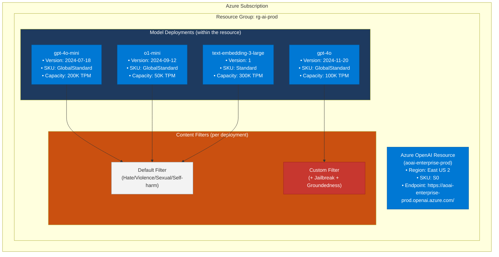
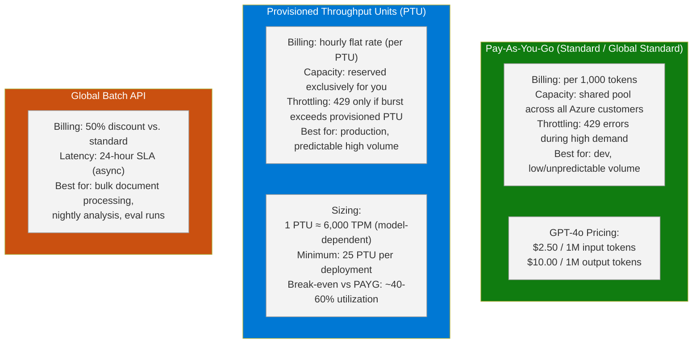
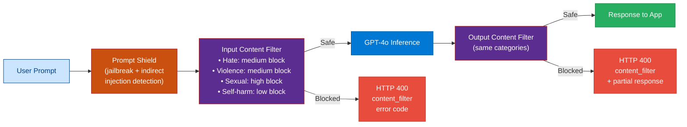
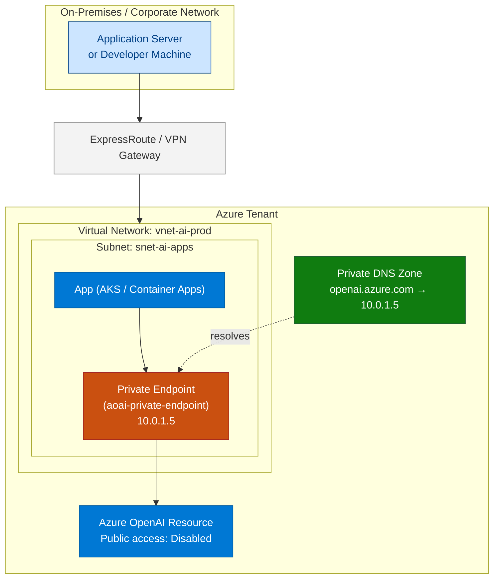
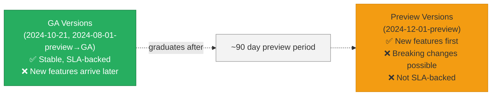
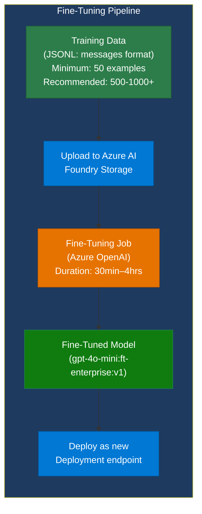
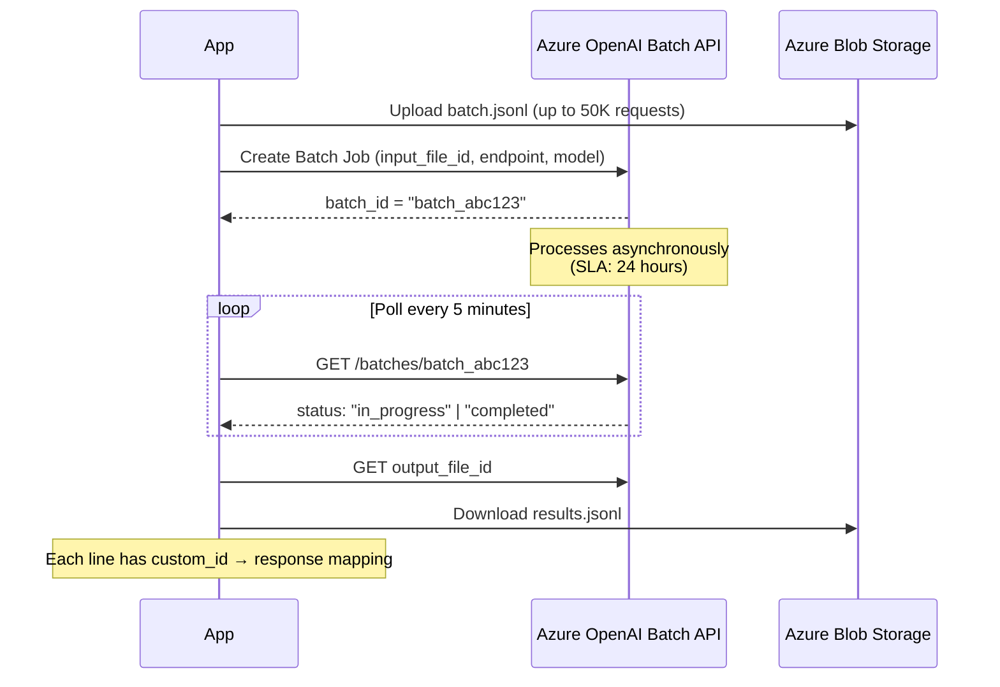
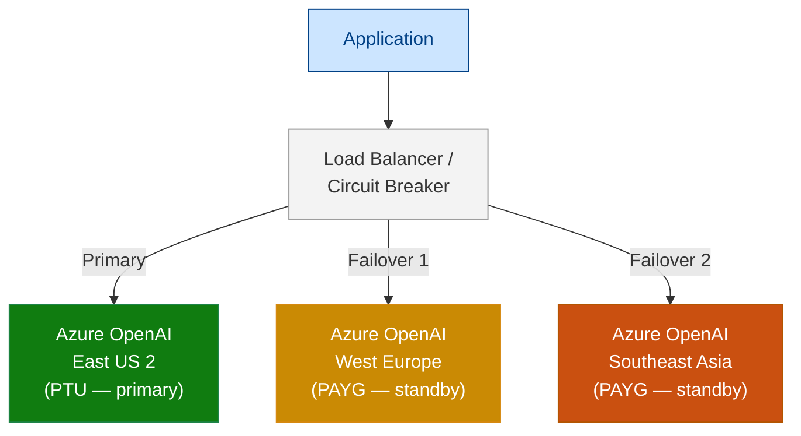

# 04 — Azure OpenAI Service

> **Level:** Intermediate → Advanced | **Time to complete:** 4–5 hours | **Azure services:** Azure OpenAI, Azure Monitor, Key Vault, VNet/Private Endpoints, Azure Policy

---

## 1. Overview

### What Is Azure OpenAI Service?

**Azure OpenAI Service** is Microsoft's enterprise-grade hosting of OpenAI's model family (GPT-4o, o1, DALL-E, Whisper, Embeddings) within Azure's global infrastructure. It is a first-party Azure cognitive service — not a proxy to api.openai.com — meaning:

- Data is **processed within your Azure tenant** (not sent to openai.com)
- Covered by **Microsoft's data privacy commitments** and enterprise SLAs
- Integrated with **Azure Active Directory / Entra ID**, Key Vault, Private Endpoints, and Azure Monitor
- Subject to **Azure compliance** certifications (SOC 2, ISO 27001, HIPAA, FedRAMP)
- Microsoft contractually guarantees your prompts and completions are **not used for model training**

### Azure OpenAI vs. OpenAI API

| Dimension | Azure OpenAI | OpenAI API (api.openai.com) |
|---|---|---|
| Data residency | Azure region (your tenant) | OpenAI's infrastructure |
| Auth | Entra ID + Managed Identity | API key only |
| Network | Private Endpoints, VNet | Public internet only |
| Compliance | Azure certifications | OpenAI's own certifications |
| SLA | 99.9% uptime SLA | Best-effort |
| Pricing | Per-token + PTU option | Per-token only |
| Model access | Subset of OpenAI models | Full OpenAI model catalog |
| Fine-tuning | Supported (GPT-4o-mini, GPT-3.5) | Supported (more model options) |

### When to Use / Avoid

**Use Azure OpenAI when:**
- Enterprise or regulated workloads (financial, healthcare, government)
- Data sovereignty requirements (data must stay in Azure region)
- Need integration with Azure networking (private endpoint, VNet)
- Need Azure-native RBAC and audit logging

**Stick with OpenAI API when:**
- Rapid prototyping without Azure subscription
- Need models not yet available in Azure (e.g., latest GPT-5 on day one)
- Non-enterprise hobby projects

---

## 2. Business Problem

Enterprises blocked from adopting cloud AI cite three reasons: **data privacy** (where does my prompt go?), **compliance** (is this service certified?), and **security** (who has access to API keys?). Azure OpenAI resolves all three:

- Prompts stay in your Azure tenant — satisfies legal's data residency requirement
- Azure compliance umbrella — reduces procurement and infosec review time from months to weeks
- Managed Identity removes the API key sprawl problem that creates credential theft risk

---

## 3. Core Concepts

### 3.1 Resource Hierarchy



### 3.2 Throughput Models: PAYG vs. PTU



**Decision rule:**
```
if avg_daily_tokens > 5M AND utilization_predictable:
    use PTU  # cheaper at scale
elif bulk_processing AND latency_ok_24h:
    use Global Batch  # 50% cost reduction
else:
    use PAYG Standard
```

### 3.3 Content Filtering Architecture



**Severity levels:** Low (0-2), Medium (3-4), High (5-6) — configurable per category per deployment. Enterprise default: block at medium for all categories, low for self-harm.

### 3.4 Private Networking



With private endpoint enabled and public access disabled: **zero internet exposure** — the AOAI endpoint is only reachable from within the VNet or via ExpressRoute/VPN.

---

## 4. Deep Technical Detail

### 4.1 API Versions and Stability

Azure OpenAI uses dated API versions (`2024-10-21`, `2024-12-01-preview`). **Always pin the API version in production** — never use a floating "latest."



**Enterprise rule:** Use GA versions in production. Allow preview in staging/development only. Subscribe to the [Azure OpenAI release notes](https://learn.microsoft.com/azure/ai-services/openai/whats-new) and schedule quarterly API version reviews.

### 4.2 Rate Limiting and Retry Strategy

Azure OpenAI rate limits operate at two levels:

| Limit Type | Scope | Common Values |
|---|---|---|
| **TPM** (tokens per minute) | Per deployment | 100K–10M TPM |
| **RPM** (requests per minute) | Per deployment | ~600 RPM per 100K TPM |
| **Quota** (monthly) | Per subscription per region | Configurable via portal request |

When limits are hit: HTTP `429` with `Retry-After` header (seconds to wait).

```python
# retry.py — production retry strategy
import asyncio
import time
from openai import AzureOpenAI, RateLimitError, APIStatusError
from typing import TypeVar, Callable, Any

T = TypeVar("T")

async def with_retry(
    fn: Callable[..., T],
    *args,
    max_retries: int = 5,
    base_delay: float = 1.0,
    max_delay: float = 60.0,
    **kwargs,
) -> T:
    """
    Exponential backoff with jitter for Azure OpenAI calls.
    Handles 429 (rate limit) and 503 (service unavailable).
    """
    for attempt in range(max_retries):
        try:
            return await fn(*args, **kwargs)
        except RateLimitError as e:
            retry_after = float(e.response.headers.get("Retry-After", base_delay * (2 ** attempt)))
            wait = min(retry_after + (0.1 * attempt), max_delay)  # add small jitter
            if attempt < max_retries - 1:
                print(f"Rate limited. Waiting {wait:.1f}s (attempt {attempt+1}/{max_retries})")
                await asyncio.sleep(wait)
            else:
                raise
        except APIStatusError as e:
            if e.status_code in (500, 502, 503) and attempt < max_retries - 1:
                wait = min(base_delay * (2 ** attempt), max_delay)
                print(f"Service error {e.status_code}. Retrying in {wait:.1f}s")
                await asyncio.sleep(wait)
            else:
                raise
    raise RuntimeError("Max retries exceeded")
```

### 4.3 Fine-Tuning on Azure OpenAI

Fine-tuning adapts a base model (GPT-4o-mini, GPT-3.5-turbo) to your specific style, format, or domain without changing what it knows.



**Training data format (JSONL):**
```jsonl
{"messages": [{"role": "system", "content": "You extract structured data from support tickets."}, {"role": "user", "content": "Ticket: My laptop screen is flickering since the last update. Priority: High"}, {"role": "assistant", "content": "{\"category\": \"hardware\", \"subcategory\": \"display\", \"priority\": \"high\", \"trigger\": \"software_update\"}"}]}
{"messages": [{"role": "system", "content": "You extract structured data from support tickets."}, {"role": "user", "content": "Can't login to VPN since password reset. Need urgent help."}, {"role": "assistant", "content": "{\"category\": \"access\", \"subcategory\": \"vpn\", \"priority\": \"urgent\", \"trigger\": \"password_change\"}"}]}
```

### 4.4 Batch API

For large-scale asynchronous workloads (nightly document processing, bulk evaluation, data enrichment), the Batch API offers a **50% cost reduction** with a 24-hour completion SLA.



---

## 5. Azure AI Foundry Implementation

### 5.1 Deploy Resources via CLI

```bash
# Create Azure OpenAI resource
az cognitiveservices account create \
    --name aoai-enterprise-prod \
    --resource-group rg-ai-prod \
    --location eastus2 \
    --kind OpenAI \
    --sku S0 \
    --custom-domain aoai-enterprise-prod

# Deploy GPT-4o (Global Standard — uses Microsoft's capacity pool globally)
az cognitiveservices account deployment create \
    --resource-group rg-ai-prod \
    --name aoai-enterprise-prod \
    --deployment-name gpt-4o \
    --model-name gpt-4o \
    --model-version "2024-11-20" \
    --model-format OpenAI \
    --sku-capacity 100 \
    --sku-name "GlobalStandard"

# Deploy text-embedding-3-large
az cognitiveservices account deployment create \
    --resource-group rg-ai-prod \
    --name aoai-enterprise-prod \
    --deployment-name text-embedding-3-large \
    --model-name text-embedding-3-large \
    --model-version "1" \
    --model-format OpenAI \
    --sku-capacity 300 \
    --sku-name "Standard"

# Create private endpoint (production hardening)
az network private-endpoint create \
    --name pe-aoai-prod \
    --resource-group rg-ai-prod \
    --vnet-name vnet-ai-prod \
    --subnet snet-ai-apps \
    --private-connection-resource-id $(az cognitiveservices account show \
        --name aoai-enterprise-prod --resource-group rg-ai-prod --query id -o tsv) \
    --group-id account \
    --connection-name aoai-private-connection

# Disable public access after private endpoint is active
az cognitiveservices account update \
    --name aoai-enterprise-prod \
    --resource-group rg-ai-prod \
    --custom-domain aoai-enterprise-prod \
    --public-network-access Disabled
```

### 5.2 Content Filter Configuration

```python
# content_filter_setup.py
# Configure a custom content filter via Azure OpenAI Management API
import os
import requests
from azure.identity import DefaultAzureCredential

credential = DefaultAzureCredential()
token = credential.get_token("https://management.azure.com/.default").token

subscription_id = os.environ["AZURE_SUBSCRIPTION_ID"]
resource_group = "rg-ai-prod"
aoai_name = "aoai-enterprise-prod"

BASE_URL = (
    f"https://management.azure.com/subscriptions/{subscription_id}"
    f"/resourceGroups/{resource_group}"
    f"/providers/Microsoft.CognitiveServices/accounts/{aoai_name}"
)

# Create custom content filter policy
filter_policy = {
    "properties": {
        "mode": "Default",
        "contentFilters": [
            {"name": "hate", "allowedContentLevel": "Low", "blocking": True, "enabled": True, "source": "Prompt"},
            {"name": "hate", "allowedContentLevel": "Low", "blocking": True, "enabled": True, "source": "Completion"},
            {"name": "violence", "allowedContentLevel": "Medium", "blocking": True, "enabled": True, "source": "Prompt"},
            {"name": "violence", "allowedContentLevel": "Medium", "blocking": True, "enabled": True, "source": "Completion"},
            {"name": "sexual", "allowedContentLevel": "Low", "blocking": True, "enabled": True, "source": "Prompt"},
            {"name": "sexual", "allowedContentLevel": "Low", "blocking": True, "enabled": True, "source": "Completion"},
            {"name": "selfharm", "allowedContentLevel": "Low", "blocking": True, "enabled": True, "source": "Prompt"},
            {"name": "selfharm", "allowedContentLevel": "Low", "blocking": True, "enabled": True, "source": "Completion"},
            # Prompt Shield — detect jailbreak attempts
            {"name": "jailbreak", "blocking": True, "enabled": True, "source": "Prompt"},
            # Indirect prompt injection detection (from documents/tool results)
            {"name": "indirect_attack", "blocking": True, "enabled": True, "source": "Prompt"},
        ],
    }
}

resp = requests.put(
    f"{BASE_URL}/raiPolicies/enterprise-strict-policy?api-version=2024-04-01-preview",
    headers={"Authorization": f"Bearer {token}", "Content-Type": "application/json"},
    json=filter_policy,
)
print(f"Content filter policy: {resp.status_code} — {resp.json().get('name', resp.text)}")
```

---

## 6. Working Code Examples

### 6.1 Production-Grade Azure OpenAI Client

```python
# aoai_client.py — enterprise client with retry, token tracking, content filter handling
import asyncio
import os
import time
import logging
from dataclasses import dataclass, field
from openai import AsyncAzureOpenAI, RateLimitError, BadRequestError
from azure.identity.aio import DefaultAzureCredential
from azure.identity import get_bearer_token_provider
from dotenv import load_dotenv

load_dotenv()
logger = logging.getLogger(__name__)


@dataclass
class UsageStats:
    prompt_tokens: int = 0
    completion_tokens: int = 0
    total_tokens: int = 0
    request_count: int = 0
    error_count: int = 0
    total_latency_ms: float = 0.0

    @property
    def avg_latency_ms(self) -> float:
        return self.total_latency_ms / self.request_count if self.request_count else 0.0

    def add(self, usage, latency_ms: float):
        self.prompt_tokens += usage.prompt_tokens
        self.completion_tokens += usage.completion_tokens
        self.total_tokens += usage.total_tokens
        self.request_count += 1
        self.total_latency_ms += latency_ms


class EnterpriseAOAIClient:
    """
    Production Azure OpenAI client with:
    - Managed Identity auth (no API keys in prod)
    - Automatic retry with exponential backoff
    - Token usage tracking
    - Content filter error handling
    - Request logging
    """

    def __init__(
        self,
        endpoint: str | None = None,
        deployment: str | None = None,
        use_managed_identity: bool = True,
    ):
        self.endpoint = endpoint or os.environ["AZURE_OPENAI_ENDPOINT"]
        self.deployment = deployment or os.environ["AZURE_OPENAI_DEPLOYMENT_NAME"]
        self.stats = UsageStats()

        if use_managed_identity:
            credential = DefaultAzureCredential()
            token_provider = get_bearer_token_provider(
                credential, "https://cognitiveservices.azure.com/.default"
            )
            self._client = AsyncAzureOpenAI(
                azure_endpoint=self.endpoint,
                azure_ad_token_provider=token_provider,
                api_version=os.environ.get("AZURE_OPENAI_API_VERSION", "2024-10-21"),
            )
        else:
            self._client = AsyncAzureOpenAI(
                azure_endpoint=self.endpoint,
                api_key=os.environ["AZURE_OPENAI_API_KEY"],
                api_version=os.environ.get("AZURE_OPENAI_API_VERSION", "2024-10-21"),
            )

    async def chat(
        self,
        messages: list[dict],
        max_tokens: int = 2048,
        temperature: float = 0.1,
        max_retries: int = 5,
        **kwargs,
    ) -> dict:
        last_error = None
        for attempt in range(max_retries):
            try:
                start = time.perf_counter()
                response = await self._client.chat.completions.create(
                    model=self.deployment,
                    messages=messages,
                    max_tokens=max_tokens,
                    temperature=temperature,
                    **kwargs,
                )
                latency_ms = (time.perf_counter() - start) * 1000
                self.stats.add(response.usage, latency_ms)

                logger.info(
                    "AOAI call",
                    extra={
                        "tokens": response.usage.total_tokens,
                        "latency_ms": round(latency_ms, 1),
                        "model": response.model,
                        "finish_reason": response.choices[0].finish_reason,
                    },
                )

                return {
                    "content": response.choices[0].message.content,
                    "tool_calls": response.choices[0].message.tool_calls,
                    "finish_reason": response.choices[0].finish_reason,
                    "usage": {
                        "prompt_tokens": response.usage.prompt_tokens,
                        "completion_tokens": response.usage.completion_tokens,
                        "total_tokens": response.usage.total_tokens,
                    },
                    "latency_ms": round(latency_ms, 1),
                }

            except BadRequestError as e:
                if "content_filter" in str(e):
                    self.stats.error_count += 1
                    logger.warning(f"Content filter triggered: {e.body}")
                    raise ContentFilterError(str(e.body)) from e
                raise

            except RateLimitError as e:
                self.stats.error_count += 1
                retry_after = float(e.response.headers.get("Retry-After", 2 ** attempt))
                wait = min(retry_after, 60.0)
                if attempt < max_retries - 1:
                    logger.warning(f"Rate limited. Retrying in {wait:.1f}s (attempt {attempt+1})")
                    await asyncio.sleep(wait)
                    last_error = e
                else:
                    raise

        raise last_error

    def print_stats(self):
        print(f"\nSession Stats:")
        print(f"  Requests: {self.stats.request_count}")
        print(f"  Total tokens: {self.stats.total_tokens:,}")
        print(f"  Avg latency: {self.stats.avg_latency_ms:.0f}ms")
        print(f"  Errors: {self.stats.error_count}")


class ContentFilterError(Exception):
    """Raised when Azure OpenAI content filters block a request."""
    pass
```

### 6.2 Batch API — Nightly Document Processing

```python
# batch_processor.py — process 1000 documents overnight at 50% cost
import asyncio
import json
import os
import time
from pathlib import Path
from openai import AzureOpenAI
from dotenv import load_dotenv

load_dotenv()

client = AzureOpenAI(
    azure_endpoint=os.environ["AZURE_OPENAI_ENDPOINT"],
    api_key=os.environ["AZURE_OPENAI_API_KEY"],
    api_version="2024-10-21",
)

DEPLOYMENT = os.environ["AZURE_OPENAI_DEPLOYMENT_NAME"]


def create_batch_file(documents: list[dict], output_path: str = "batch_input.jsonl") -> str:
    """
    Creates a JSONL batch input file.
    Each document becomes one completion request with a unique custom_id.
    """
    with open(output_path, "w") as f:
        for doc in documents:
            request = {
                "custom_id": doc["id"],
                "method": "POST",
                "url": "/chat/completions",
                "body": {
                    "model": DEPLOYMENT,
                    "messages": [
                        {
                            "role": "system",
                            "content": "Extract key entities from the document. Return JSON: {entities: [{type, value, confidence}], summary: string, sentiment: positive|neutral|negative}",
                        },
                        {"role": "user", "content": doc["content"]},
                    ],
                    "max_tokens": 500,
                    "response_format": {"type": "json_object"},
                },
            }
            f.write(json.dumps(request) + "\n")
    return output_path


def submit_batch(input_file_path: str) -> str:
    """Upload file and create batch job. Returns batch_id."""
    print(f"Uploading {input_file_path}...")
    with open(input_file_path, "rb") as f:
        file_response = client.files.create(file=f, purpose="batch")
    file_id = file_response.id
    print(f"File uploaded: {file_id}")

    batch = client.batches.create(
        input_file_id=file_id,
        endpoint="/chat/completions",
        completion_window="24h",
        metadata={"job_name": "nightly-doc-processing", "date": time.strftime("%Y-%m-%d")},
    )
    print(f"Batch submitted: {batch.id} (status: {batch.status})")
    return batch.id


def poll_batch(batch_id: str, poll_interval_seconds: int = 300) -> dict:
    """Poll until batch completes. Returns completed batch object."""
    print(f"Polling batch {batch_id} every {poll_interval_seconds}s...")
    while True:
        batch = client.batches.retrieve(batch_id)
        print(f"  Status: {batch.status} | Completed: {batch.request_counts.completed}/{batch.request_counts.total}")

        if batch.status in ("completed", "failed", "cancelled", "expired"):
            return batch

        time.sleep(poll_interval_seconds)


def download_results(batch: dict, output_path: str = "batch_results.jsonl") -> list[dict]:
    """Download and parse batch results."""
    if batch.status != "completed":
        print(f"Batch did not complete: {batch.status}")
        if batch.error_file_id:
            errors = client.files.content(batch.error_file_id)
            print(f"Errors: {errors.text}")
        return []

    content = client.files.content(batch.output_file_id)
    results = []
    with open(output_path, "w") as f:
        for line in content.text.strip().split("\n"):
            if line:
                result = json.loads(line)
                f.write(line + "\n")
                results.append(result)

    print(f"Downloaded {len(results)} results to {output_path}")
    return results


def run_nightly_batch():
    # Sample documents — in production, load from Azure Blob or database
    documents = [
        {"id": f"doc-{i:04d}", "content": f"Customer complaint #{i}: Product arrived damaged. Order placed 2025-06-{i%28+1:02d}. Customer very unhappy."}
        for i in range(100)  # 100 docs in this example; Batch API supports up to 50K
    ]

    batch_file = create_batch_file(documents)
    batch_id = submit_batch(batch_file)

    # In production: save batch_id to database and poll asynchronously
    # For demo: poll synchronously
    batch = poll_batch(batch_id, poll_interval_seconds=10)
    results = download_results(batch)

    # Process results
    for r in results[:3]:  # show first 3
        response_body = r["response"]["body"]
        if response_body["choices"]:
            content = json.loads(response_body["choices"][0]["message"]["content"])
            print(f"Doc {r['custom_id']}: {content.get('sentiment')} | {content.get('summary', '')[:60]}")

    return results


if __name__ == "__main__":
    run_nightly_batch()
```

### 6.3 Fine-Tuning Job

```python
# fine_tune.py — submit and monitor a fine-tuning job
import os
import time
from openai import AzureOpenAI
from dotenv import load_dotenv

load_dotenv()

client = AzureOpenAI(
    azure_endpoint=os.environ["AZURE_OPENAI_ENDPOINT"],
    api_key=os.environ["AZURE_OPENAI_API_KEY"],
    api_version="2024-10-21",
)


def create_training_file(data: list[dict], path: str = "training.jsonl") -> str:
    import json
    with open(path, "w") as f:
        for example in data:
            f.write(json.dumps(example) + "\n")
    return path


def run_fine_tuning(
    training_file_path: str,
    base_model: str = "gpt-4o-mini-2024-07-18",
    suffix: str = "ticket-classifier",
    n_epochs: int = 3,
) -> str:
    # Upload training file
    with open(training_file_path, "rb") as f:
        file_resp = client.files.create(file=f, purpose="fine-tune")
    print(f"Training file uploaded: {file_resp.id}")

    # Create fine-tuning job
    job = client.fine_tuning.jobs.create(
        training_file=file_resp.id,
        model=base_model,
        suffix=suffix,
        hyperparameters={"n_epochs": n_epochs},
    )
    print(f"Fine-tuning job created: {job.id}")

    # Poll until complete
    while job.status not in ("succeeded", "failed", "cancelled"):
        time.sleep(30)
        job = client.fine_tuning.jobs.retrieve(job.id)

        # Stream events for visibility
        events = list(client.fine_tuning.jobs.list_events(job.id, limit=5))
        for event in reversed(events):
            print(f"  [{event.created_at}] {event.message}")

    if job.status == "succeeded":
        print(f"Fine-tuned model: {job.fine_tuned_model}")
        return job.fine_tuned_model
    else:
        raise RuntimeError(f"Fine-tuning failed: {job.status}")


TRAINING_DATA = [
    {"messages": [
        {"role": "system", "content": "Classify the support ticket category."},
        {"role": "user", "content": "My laptop won't turn on after the update."},
        {"role": "assistant", "content": '{"category": "hardware", "priority": "high"}'},
    ]},
    {"messages": [
        {"role": "system", "content": "Classify the support ticket category."},
        {"role": "user", "content": "I can't access my email since this morning."},
        {"role": "assistant", "content": '{"category": "access", "priority": "urgent"}'},
    ]},
    # Add 50+ examples for production quality
]

if __name__ == "__main__":
    training_file = create_training_file(TRAINING_DATA)
    model_id = run_fine_tuning(training_file)
    print(f"Deploy this model ID in Azure AI Foundry: {model_id}")
```

### 6.4 Monitoring with Azure Monitor

```python
# monitoring.py — emit custom metrics to Application Insights
import os
from azure.monitor.opentelemetry import configure_azure_monitor
from opentelemetry import trace
from opentelemetry.metrics import get_meter
from dotenv import load_dotenv

load_dotenv()

# Configure Azure Monitor (call once at app startup)
configure_azure_monitor(
    connection_string=os.environ["APPLICATIONINSIGHTS_CONNECTION_STRING"]
)

tracer = trace.get_tracer(__name__)
meter = get_meter(__name__)

# Custom metrics
token_counter = meter.create_counter(
    "aoai.tokens.total",
    description="Total tokens consumed by Azure OpenAI",
    unit="tokens",
)
latency_histogram = meter.create_histogram(
    "aoai.request.duration",
    description="Azure OpenAI request latency",
    unit="ms",
)
error_counter = meter.create_counter(
    "aoai.errors",
    description="Azure OpenAI API errors",
)


def tracked_aoai_call(client, messages: list[dict], deployment: str, **kwargs) -> dict:
    """Wrapper that emits traces and metrics for every AOAI call."""
    with tracer.start_as_current_span("aoai.chat.completion") as span:
        span.set_attribute("deployment", deployment)
        span.set_attribute("message_count", len(messages))

        import time
        start = time.perf_counter()
        try:
            response = client.chat.completions.create(
                model=deployment,
                messages=messages,
                **kwargs,
            )
            latency_ms = (time.perf_counter() - start) * 1000

            # Record metrics
            attrs = {"deployment": deployment, "model": response.model}
            token_counter.add(response.usage.total_tokens, attrs)
            latency_histogram.record(latency_ms, attrs)

            # Enrich span
            span.set_attribute("prompt_tokens", response.usage.prompt_tokens)
            span.set_attribute("completion_tokens", response.usage.completion_tokens)
            span.set_attribute("finish_reason", response.choices[0].finish_reason)
            span.set_attribute("latency_ms", round(latency_ms, 1))

            return {"content": response.choices[0].message.content, "usage": response.usage}

        except Exception as e:
            error_counter.add(1, {"deployment": deployment, "error_type": type(e).__name__})
            span.record_exception(e)
            span.set_status(trace.StatusCode.ERROR, str(e))
            raise
```

---

## 7. Enterprise Pattern Notes

### Pattern: Multi-Region Failover



```python
# multi_region_client.py
from openai import AzureOpenAI
import os

ENDPOINTS = [
    {"endpoint": os.environ["AZURE_OPENAI_ENDPOINT_PRIMARY"], "region": "eastus2"},
    {"endpoint": os.environ.get("AZURE_OPENAI_ENDPOINT_SECONDARY", ""), "region": "westeurope"},
]

def get_client_with_failover(messages: list[dict], **kwargs) -> dict:
    last_error = None
    for config in ENDPOINTS:
        if not config["endpoint"]:
            continue
        try:
            client = AzureOpenAI(
                azure_endpoint=config["endpoint"],
                api_key=os.environ["AZURE_OPENAI_API_KEY"],
                api_version="2024-10-21",
                timeout=30,
            )
            response = client.chat.completions.create(
                model=os.environ["AZURE_OPENAI_DEPLOYMENT_NAME"],
                messages=messages,
                **kwargs,
            )
            return {"content": response.choices[0].message.content, "region": config["region"]}
        except Exception as e:
            print(f"Failed on {config['region']}: {e}. Trying next...")
            last_error = e
    raise last_error
```

---

## 8. Production Checklist

### Deployment
- [ ] Model version pinned (not floating); model version change requires re-evaluation
- [ ] Content Safety filter set to at least Medium for all categories
- [ ] Prompt Shield enabled (jailbreak + indirect attack detection)
- [ ] Quota set per deployment in Azure portal (prevents one workload starving others)
- [ ] PTU sized for production baseline; PAYG overflow configured

### Networking
- [ ] Private endpoint deployed for AOAI resource
- [ ] Public network access disabled after private endpoint confirmed working
- [ ] Private DNS Zone configured for `openai.azure.com`
- [ ] NSG rules restrict outbound from app subnets to AOAI private endpoint only

### Authentication
- [ ] Managed Identity used — no API keys in code or environment variables in production
- [ ] API keys (for dev/staging) stored in Azure Key Vault; rotated quarterly
- [ ] `Cognitive Services OpenAI User` role assigned to app's Managed Identity (not `Owner`)

### Monitoring
- [ ] Application Insights connected; `APPLICATIONINSIGHTS_CONNECTION_STRING` in app settings
- [ ] Azure Monitor alert: TPM quota > 80%
- [ ] Azure Monitor alert: error rate (4xx/5xx) > 1% on 5-minute window
- [ ] Content filter trigger rate logged and reviewed weekly
- [ ] Monthly cost report by deployment via Azure Cost Management

### Fine-Tuning
- [ ] Training data reviewed for PII before uploading
- [ ] Fine-tuned model evaluated against baseline model before deployment
- [ ] Training data versioned in Azure Blob Storage with immutable policy

---

## 9. Interview Q&A

### Q1 (Beginner): What is the difference between Azure OpenAI and the OpenAI API?

**Answer:** Both expose OpenAI's models (GPT-4o, o1, etc.) but differ in where and how they operate. The OpenAI API sends data to OpenAI's infrastructure and is billed per token. Azure OpenAI Service runs within your Azure subscription — your prompts and responses stay within your tenant, covered by Microsoft's data privacy commitments and enterprise SLAs. Azure OpenAI integrates with Azure Active Directory (Managed Identity), Private Endpoints, Key Vault, and Azure Monitor. It also supports PTU (Provisioned Throughput) for reserved capacity. For enterprise workloads with data sovereignty or compliance requirements, Azure OpenAI is the standard choice.

---

### Q2 (Beginner): What is TPM and why does it matter?

**Answer:** TPM = Tokens Per Minute. It's the rate limit applied to each model deployment — the maximum number of tokens (input + output combined) the deployment can process in any 60-second window. When you exceed the TPM limit, the API returns HTTP `429 Too Many Requests` with a `Retry-After` header. TPM matters for capacity planning: if your agent processes 10 requests/minute and each request uses 5,000 tokens, you need at least 50,000 TPM. You also need headroom for burst traffic — a common rule is to size at 2× average load. TPM quota can be increased by submitting a quota increase request in the Azure portal.

---

### Q3 (Intermediate): Explain the difference between Standard (PAYG) and Provisioned Throughput (PTU) deployments.

**Answer:** Standard (PAYG) deployments use a shared capacity pool — you pay per token consumed but are subject to throttling during high demand across all Azure customers. PTU deployments give you exclusive, reserved capacity measured in PTU units (each unit = ~6,000 TPM, model-dependent). PTU is billed hourly regardless of usage.

Cost comparison: at low utilization, PAYG is cheaper. At ~40–60%+ utilization, PTU becomes more cost-effective. PTU also provides lower and more consistent latency (no contention). For production workloads with predictable load patterns, use PTU for the baseline and add PAYG as overflow. PTU minimum is 25 units per deployment, so it's only practical at scale.

---

### Q4 (Intermediate): How do Azure OpenAI content filters work, and how do you tune them for an enterprise use case?

**Answer:** Content filters run on every prompt (input) and every completion (output) before they're returned to your application. They evaluate four harm categories — Hate, Violence, Sexual content, and Self-harm — each with three severity levels (Low/Medium/High). You configure the *block threshold* per category per direction: e.g., "block Hate at Medium severity on inputs, block at High on outputs."

Additionally, Prompt Shield detects jailbreak attempts and indirect prompt injection (malicious content injected via documents or tool results). For enterprise tuning: start with the default policy; after 2 weeks of production traffic, review the content filter logs in Azure Monitor to identify false positives. Submit a policy customization request to Microsoft if you need to adjust thresholds for legitimate enterprise use cases (e.g., a healthcare app discussing self-harm treatment needs lower sensitivity).

---

### Q5 (Advanced): Walk through designing Azure OpenAI capacity for a customer support agent handling 500 concurrent users at peak.

**Answer:** Capacity sizing process:

1. **Measure per-request token usage:** Average support interaction: ~800 input tokens (system prompt + history + user message) + ~400 output tokens = 1,200 tokens/request.

2. **Estimate peak RPM:** 500 concurrent users, each sending one message per 60 seconds (assumes they read responses) = 500 RPM peak.

3. **Calculate peak TPM:** 500 RPM × 1,200 tokens = 600,000 TPM peak.

4. **Add safety buffer:** 600K × 1.5 = **900,000 TPM needed.**

5. **PTU vs PAYG decision:** 900K TPM ÷ 6,000 TPM/PTU = ~150 PTU for GPT-4o. At ~$8/PTU/hour = $1,200/hour peak. If peak only lasts 4 hours/day: consider elastic approach — PTU for baseline (300K TPM = 50 PTU), PAYG overflow for burst.

6. **Multi-region:** Deploy 50 PTU in East US 2 + 50 PTU in West Europe for HA. Route by geography via Azure API Management.

7. **Embed model:** Add 300K TPM Standard deployment of `text-embedding-3-large` for any RAG lookups.

---

### Q6 (Architecture): A regulatory requirement mandates that no customer PII may be included in LLM prompts. How do you implement this while still providing personalized AI responses?

**Answer:** Three-layer approach:

**Layer 1 — PII Detection and Redaction:** Before sending any text to Azure OpenAI, run it through Azure AI Language's PII detection endpoint. Replace detected entities (names, emails, phone numbers, account numbers) with typed placeholders: `"John Smith" → "[PERSON-1]"`, `"account 4411-****" → "[ACCOUNT-1]"`. Maintain a redaction map server-side (session-scoped, never stored in the prompt).

**Layer 2 — Personalized Context via Reference Injection:** Instead of embedding `"Customer John Smith's account shows..."`, inject abstracted references: `"The customer's account (ACCT-REF-001) shows..."`. The LLM works with abstracted references; your application layer resolves `ACCT-REF-001` back to the real account data when displaying results to the support agent.

**Layer 3 — Response PII Scan:** After receiving the LLM response, run a second PII detection pass. If any PII leaked through (e.g., model hallucinated a realistic-looking name), block the response and return a safe fallback.

Infrastructure: use Azure API Management as the gateway between your application and Azure OpenAI — implement PII redaction as a custom policy in APIM so it applies uniformly to all services using the API.

---

## Cross-links

- Previous: [03 — Azure AI Foundry](./03-Azure-AI-Foundry.md)
- Next: [05 — Semantic Kernel](./05-Semantic-Kernel.md)
- Related: [33 — Security](./33-Security.md) | [32 — Observability](./32-Observability.md) | [37 — Cost Optimization](./37-Cost-Optimization.md)
- Advanced: [14 — RAG](./14-RAG.md) | [19 — Tool Calling](./19-Tool-Calling.md)

---

*Module 04 | Series: Enterprise Agentic AI Tutorial | Last updated: June 2026*
