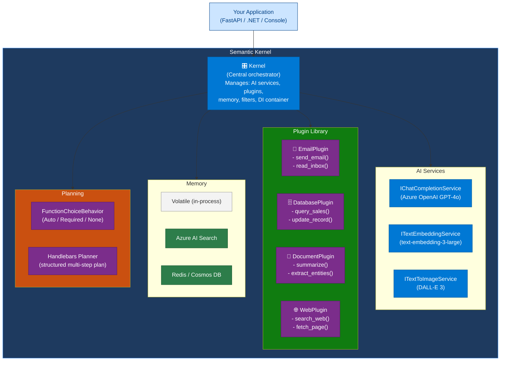
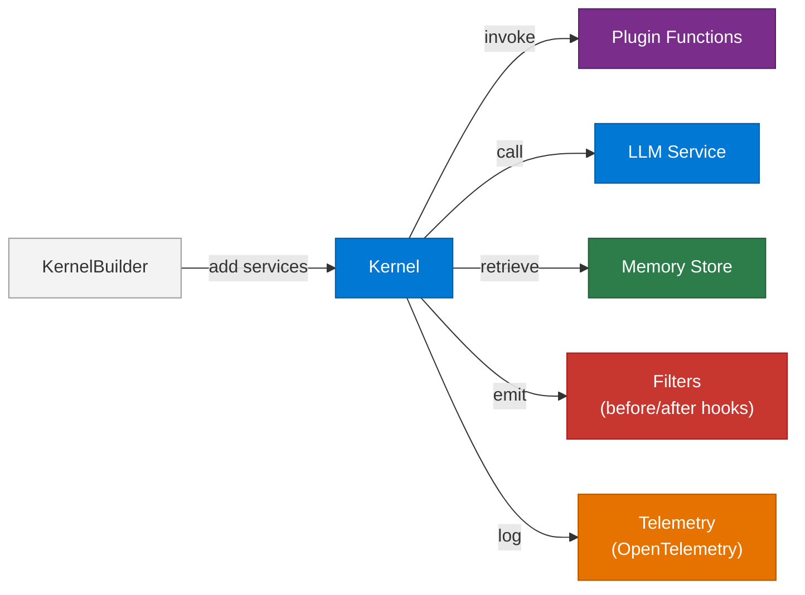
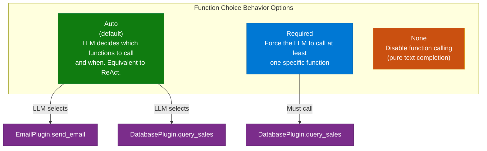
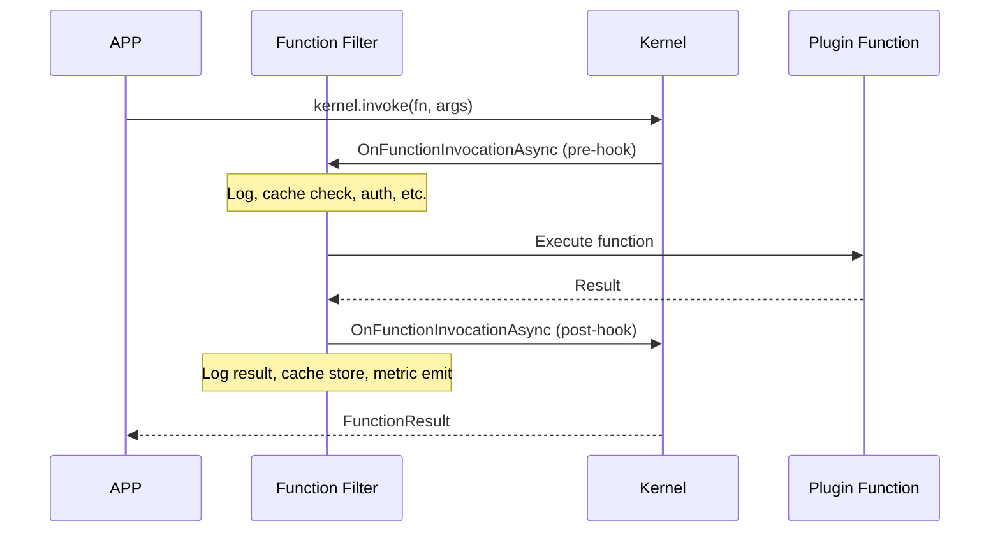
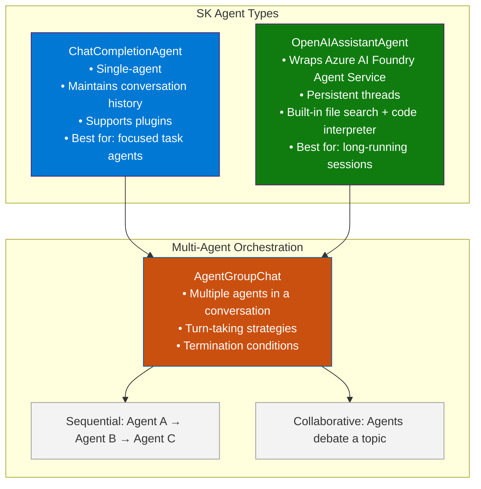
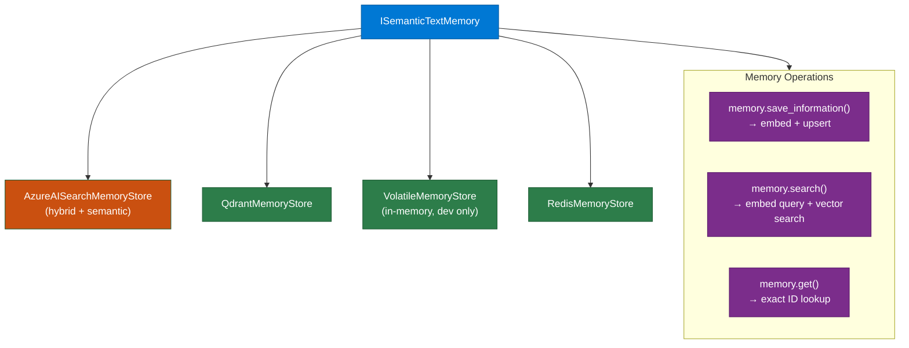
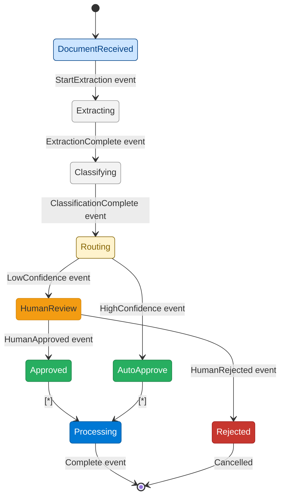
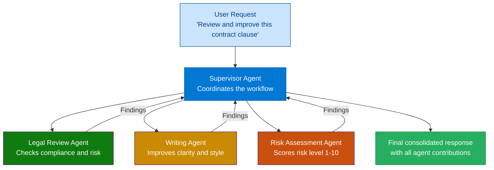

# 05 — Semantic Kernel

> **Level:** Intermediate → Advanced | **Time to complete:** 5–6 hours | **Azure services:** Azure OpenAI, Azure AI Foundry, Azure AI Search, Cosmos DB

---

## 1. Overview

### What Is Semantic Kernel?

**Semantic Kernel (SK)** is Microsoft's open-source AI orchestration SDK that connects LLMs to enterprise systems through a plugin architecture. It is the primary Microsoft-supported framework for building AI agents and copilots, positioned as the production-grade alternative to LangChain for teams operating in the Microsoft ecosystem.

SK provides:
- A **Kernel** that manages AI service connections, plugins, and execution
- **Plugins** (previously "Skills") — collections of native functions and prompt templates the LLM can call
- A **Planner** that automatically selects and sequences plugins to achieve a goal
- An **Agent Framework** for building ReAct, ChatCompletion, and multi-agent workflows
- **Memory connectors** for vector-backed semantic memory (Azure AI Search, Qdrant, etc.)
- **Process Framework** for long-running, event-driven business workflows

### Why It Matters Enterprise-Wide

Semantic Kernel is the framework of choice when:
- You're building on Azure and want first-class support from Microsoft
- Your AI system needs to integrate with Microsoft 365, Azure services, or enterprise backends
- You want strong typing, testability, and enterprise software engineering patterns (SOLID, DI)
- You need AI agents that fit into existing .NET or Python enterprise architectures

### When to Use / Avoid

| Use Semantic Kernel | Consider LangChain / Other |
|---|---|
| Azure-first, Microsoft ecosystem | Multi-cloud or OpenAI-first teams |
| Strong .NET requirement | Python-only stack with LangChain familiarity |
| Need built-in Azure AI Search memory | Need LangChain's broader third-party ecosystem |
| Enterprise plugin/skill reuse model | LangGraph's stateful graph execution needed |

> In practice, many enterprise teams use **SK for orchestration + LangChain for specific components** (document loaders, specialized chains). The frameworks are composable.

---

## 2. Business Problem

Enterprise teams struggle to connect LLMs to their systems in a governed, reusable way. Without a framework like SK:
- Teams write one-off prompt strings mixed into business logic (unmaintainable)
- No standard way to version, test, or share AI "skills" across teams
- Authentication, retry, and observability have to be re-implemented per project
- Multi-step AI workflows become spaghetti callback chains

Semantic Kernel provides a **plugin contract**: a standard interface for AI capabilities that can be discovered, tested, shared, and composed into complex workflows. Think of it as the "dependency injection container for AI."

---

## 3. Core Concepts

### 3.1 Architecture Overview



### 3.2 Kernel — The DI Container for AI

The Kernel is the central object. You build it once at startup, configure AI services and plugins, then inject it wherever AI capability is needed.



### 3.3 Plugins — The Building Blocks

A **Plugin** is a class decorated with SK attributes that exposes a set of related functions. Plugins can be:

| Plugin Type | Definition | Best For |
|---|---|---|
| **Native Function Plugin** | Python method decorated with `@kernel_function` | Calling APIs, databases, executing code |
| **Prompt Function Plugin** | `.prompty` or YAML file with a prompt template | Reusable prompt templates with variable injection |
| **OpenAPI Plugin** | Import from a Swagger/OpenAPI spec URL | Auto-wrapping any REST API |

### 3.4 Function Choice Behavior (Planning)

SK 1.x replaces the old Planner with **Function Choice Behavior** — the mechanism controlling how the LLM selects and calls plugin functions:



### 3.5 Filters (Middleware)

SK Filters are the middleware layer — they intercept function calls and prompt renders before and after execution. Use them for:
- **Logging** — record every function call
- **Safety** — block calls to dangerous functions
- **Caching** — cache expensive function results
- **Metrics** — emit OpenTelemetry spans



### 3.6 Agent Framework

SK's Agent Framework wraps the kernel in an agent abstraction with built-in support for conversation threads and multi-agent orchestration:



---

## 4. Deep Technical Detail

### 4.1 Kernel Invocation Pipeline

When you call `kernel.invoke_stream()` or the agent sends a message, the pipeline is:

```mermaid
graph LR
    INPUT["User Input / Goal"] --> PM["Prompt Manager\n(select prompt template,\ninject variables)"]
    PM --> RENDER["Template Renderer\n(Handlebars / F-string)"]
    RENDER --> PRE["Pre-Invocation\nFilters"]
    PRE --> LLM["LLM Call\n(AzureOpenAI)"]
    LLM -->|"tool_calls"| DISPATCH["Function Dispatcher\n(find plugin.function)"]
    DISPATCH --> FN["Plugin Function\n(native code)"]
    FN -->|"result"| INJECT["Inject result\nback into context"]
    INJECT --> LLM
    LLM -->|"final text"| POST["Post-Invocation\nFilters"]
    POST --> OUTPUT["Response"]

    classDef primary   fill:#0078d4,color:#fff,stroke:#005a9e
    classDef secondary fill:#7b2d8b,color:#fff,stroke:#5a1a6b
    classDef storage   fill:#2d7d4a,color:#fff,stroke:#1f5c35
    classDef security  fill:#c7372f,color:#fff,stroke:#a02020
    classDef monitor   fill:#e67300,color:#fff,stroke:#b35500
    classDef success   fill:#27ae60,color:#fff,stroke:#1e8449
    classDef warning   fill:#f39c12,color:#333,stroke:#d68910
    classDef neutral   fill:#f3f3f3,color:#333,stroke:#999
    classDef user      fill:#cce5ff,color:#004085,stroke:#004085
    classDef decision  fill:#fff3cd,color:#856404,stroke:#856404
    classDef highlight fill:#e74c3c,color:#fff,stroke:#c0392b

    class INPUT user
    class PM,RENDER neutral
    class PRE,POST monitor
    class LLM primary
    class DISPATCH,FN secondary
    class INJECT neutral
    class OUTPUT success
```



### 4.2 Memory Architecture

SK's memory connectors provide a unified interface over different vector stores:



### 4.3 Process Framework (SK 1.x)

The Process Framework enables **long-running, event-driven AI workflows** with durable state — think Azure Durable Functions but for AI:



### 4.4 Dependency Injection Integration

SK is built for DI-first architectures. In production Python apps, integrate with FastAPI's DI:

```python
# Dependencies that apply across the entire SK request pipeline:
# - Kernel is a singleton (expensive to build)
# - Plugins can be scoped (e.g., per-user plugins with different permissions)
# - Memory stores are typically singleton
```

---

## 5. Azure AI Foundry Implementation

### 5.1 Kernel Setup with Azure AI Foundry

```bash
# Install Semantic Kernel with Azure dependencies
pip install semantic-kernel[azure] \
            azure-identity \
            azure-search-documents \
            opentelemetry-sdk \
            opentelemetry-exporter-otlp
```

---

## 6. Working Code Example — Enterprise HR Copilot

A fully functional HR Copilot built with Semantic Kernel: answers policy questions, looks up employee data, and processes leave requests.

### Project Structure

```
sk-hr-copilot/
├── .env
├── requirements.txt
├── kernel_factory.py       ← Kernel builder (singleton)
├── plugins/
│   ├── hr_plugin.py        ← Native function plugin
│   ├── policy_plugin.py    ← Prompt-based plugin
│   └── leave_plugin.py     ← Leave management plugin
├── filters/
│   └── logging_filter.py   ← Audit logging filter
├── agent.py                ← HR Copilot agent
└── main.py                 ← FastAPI app
```

### kernel_factory.py

```python
# kernel_factory.py
import os
import logging
from semantic_kernel import Kernel
from semantic_kernel.connectors.ai.open_ai import (
    AzureChatCompletion,
    AzureTextEmbedding,
)
from semantic_kernel.connectors.memory.azure_cognitive_search import (
    AzureCognitiveSearchMemoryStore,
)
from semantic_kernel.memory import SemanticTextMemory
from azure.identity import DefaultAzureCredential
from azure.identity import get_bearer_token_provider
from dotenv import load_dotenv

from plugins.hr_plugin import HRPlugin
from plugins.policy_plugin import PolicyPlugin
from plugins.leave_plugin import LeavePlugin
from filters.logging_filter import AuditLoggingFilter

load_dotenv()

logger = logging.getLogger(__name__)

_kernel_instance: Kernel | None = None


def build_kernel() -> Kernel:
    """Build and configure the Semantic Kernel singleton."""
    global _kernel_instance
    if _kernel_instance is not None:
        return _kernel_instance

    credential = DefaultAzureCredential()

    kernel = Kernel()

    # Add Azure OpenAI Chat Completion service
    kernel.add_service(
        AzureChatCompletion(
            service_id="gpt-4o",
            deployment_name=os.environ["AZURE_OPENAI_DEPLOYMENT_NAME"],
            endpoint=os.environ["AZURE_OPENAI_ENDPOINT"],
            ad_token_provider=get_bearer_token_provider(
                credential, "https://cognitiveservices.azure.com/.default"
            ),
            api_version="2024-10-21",
        )
    )

    # Add Azure OpenAI Embedding service (for memory)
    kernel.add_service(
        AzureTextEmbedding(
            service_id="text-embedding-3-large",
            deployment_name="text-embedding-3-large",
            endpoint=os.environ["AZURE_OPENAI_ENDPOINT"],
            ad_token_provider=get_bearer_token_provider(
                credential, "https://cognitiveservices.azure.com/.default"
            ),
        )
    )

    # Register plugins
    kernel.add_plugin(HRPlugin(), plugin_name="HR")
    kernel.add_plugin(PolicyPlugin(kernel), plugin_name="Policy")
    kernel.add_plugin(LeavePlugin(), plugin_name="Leave")

    # Add audit logging filter
    kernel.add_filter("function_invocation", AuditLoggingFilter())

    _kernel_instance = kernel
    logger.info("Semantic Kernel initialized with %d plugins", len(list(kernel.plugins)))
    return kernel
```

### plugins/hr_plugin.py

```python
# plugins/hr_plugin.py
from semantic_kernel.functions import kernel_function
from pydantic import BaseModel
import json


class Employee(BaseModel):
    employee_id: str
    name: str
    department: str
    manager: str
    hire_date: str
    leave_balance_days: int


MOCK_EMPLOYEES = {
    "EMP-001": Employee(
        employee_id="EMP-001",
        name="Priya Sharma",
        department="Engineering",
        manager="Alex Thompson",
        hire_date="2021-09-01",
        leave_balance_days=18,
    ),
    "EMP-002": Employee(
        employee_id="EMP-002",
        name="David Chen",
        department="Finance",
        manager="Sarah Williams",
        hire_date="2019-03-15",
        leave_balance_days=25,
    ),
}


class HRPlugin:
    """Plugin for accessing HR system data."""

    @kernel_function(
        name="get_employee",
        description="Look up employee information by employee ID. Returns name, department, manager, hire date, and leave balance.",
    )
    def get_employee(self, employee_id: str) -> str:
        emp = MOCK_EMPLOYEES.get(employee_id.upper())
        if not emp:
            return json.dumps({"error": f"Employee {employee_id} not found"})
        return emp.model_dump_json()

    @kernel_function(
        name="list_team_members",
        description="List all team members in a given department.",
    )
    def list_team_members(self, department: str) -> str:
        members = [
            e.model_dump() for e in MOCK_EMPLOYEES.values()
            if e.department.lower() == department.lower()
        ]
        return json.dumps({"department": department, "members": members, "count": len(members)})

    @kernel_function(
        name="get_leave_balance",
        description="Get the current annual leave balance for an employee.",
    )
    def get_leave_balance(self, employee_id: str) -> str:
        emp = MOCK_EMPLOYEES.get(employee_id.upper())
        if not emp:
            return json.dumps({"error": "Employee not found"})
        return json.dumps({
            "employee_id": employee_id,
            "employee_name": emp.name,
            "leave_balance_days": emp.leave_balance_days,
            "fiscal_year": "2025",
        })
```

### plugins/policy_plugin.py

```python
# plugins/policy_plugin.py
from semantic_kernel import Kernel
from semantic_kernel.functions import kernel_function
from semantic_kernel.connectors.ai.open_ai import AzureChatCompletion
from semantic_kernel.connectors.ai.function_choice_behavior import FunctionChoiceBehavior
from semantic_kernel.contents import ChatHistory
import json


HR_POLICY_KNOWLEDGE_BASE = {
    "annual_leave": """
    Annual Leave Policy (v3.2, effective Jan 2025):
    - Full-time employees accrue 1.67 days per month (20 days/year)
    - Leave must be approved by direct manager minimum 5 business days in advance
    - Maximum 15 consecutive days without VP approval
    - Unused leave can carry forward up to 5 days into next fiscal year
    - Leave during notice period requires HR Director approval
    """,
    "sick_leave": """
    Sick Leave Policy (v2.1):
    - 10 sick days per calendar year, non-accruing
    - Medical certificate required for absences > 3 consecutive days
    - Sick leave does not count toward performance attendance metrics
    - Unused sick days cannot be carried forward or encashed
    """,
    "remote_work": """
    Remote Work Policy (v4.0, effective March 2025):
    - Hybrid model: minimum 3 days/week in office for individual contributors
    - Managers: minimum 4 days/week in office
    - Fully remote requires VP + HR approval, reviewed annually
    - VPN required for all remote work; BYOD prohibited for sensitive data access
    """,
}


class PolicyPlugin:
    """Plugin for answering HR policy questions using RAG over the policy knowledge base."""

    def __init__(self, kernel: Kernel):
        self._kernel = kernel

    @kernel_function(
        name="answer_policy_question",
        description="Answer a question about HR policies: leave, remote work, benefits, compliance. Use this for any policy-related question.",
    )
    async def answer_policy_question(self, question: str) -> str:
        # Simple keyword-based retrieval (in production: use AzureAISearchMemoryStore)
        relevant_policies = []
        question_lower = question.lower()

        if any(word in question_lower for word in ["annual", "vacation", "leave", "holiday", "pto"]):
            relevant_policies.append(HR_POLICY_KNOWLEDGE_BASE["annual_leave"])
        if any(word in question_lower for word in ["sick", "medical", "illness", "doctor"]):
            relevant_policies.append(HR_POLICY_KNOWLEDGE_BASE["sick_leave"])
        if any(word in question_lower for word in ["remote", "wfh", "work from home", "hybrid", "office"]):
            relevant_policies.append(HR_POLICY_KNOWLEDGE_BASE["remote_work"])

        if not relevant_policies:
            relevant_policies = list(HR_POLICY_KNOWLEDGE_BASE.values())

        context = "\n\n---\n\n".join(relevant_policies)

        chat_service = self._kernel.get_service(type=AzureChatCompletion)
        history = ChatHistory()
        history.add_system_message(
            f"""You are an HR Policy Assistant. Answer questions based ONLY on the provided policy documents.
If the answer is not in the documents, say "I don't have information on that — please contact HR directly."
Always cite which policy you're referencing.

Policy Documents:
{context}"""
        )
        history.add_user_message(question)

        response = await chat_service.get_chat_message_contents(
            chat_history=history,
            settings=chat_service.get_prompt_execution_settings_class()(
                service_id="gpt-4o",
                max_tokens=1024,
                temperature=0.1,
            ),
            kernel=self._kernel,
        )
        return response[0].content
```

### plugins/leave_plugin.py

```python
# plugins/leave_plugin.py
from semantic_kernel.functions import kernel_function
from datetime import datetime, timedelta
import json
import random


class LeavePlugin:
    """Plugin for processing leave requests."""

    @kernel_function(
        name="submit_leave_request",
        description="Submit an annual leave request for an employee. Requires employee_id, start_date (YYYY-MM-DD), end_date (YYYY-MM-DD), and reason.",
    )
    def submit_leave_request(
        self,
        employee_id: str,
        start_date: str,
        end_date: str,
        reason: str = "Annual leave",
    ) -> str:
        # Validate dates
        try:
            start = datetime.strptime(start_date, "%Y-%m-%d")
            end = datetime.strptime(end_date, "%Y-%m-%d")
        except ValueError:
            return json.dumps({"error": "Invalid date format. Use YYYY-MM-DD."})

        if start > end:
            return json.dumps({"error": "Start date must be before end date."})

        days_requested = (end - start).days + 1
        business_days = sum(
            1 for i in range(days_requested)
            if (start + timedelta(days=i)).weekday() < 5
        )

        # Check advance notice (5 business days rule)
        today = datetime.now()
        notice_days = (start - today).days
        if notice_days < 5:
            return json.dumps({
                "error": f"Insufficient notice. Leave must be requested at least 5 business days in advance. You have {notice_days} days notice.",
                "policy": "Annual Leave Policy v3.2 — Section 3.1",
            })

        request_id = f"LR-{random.randint(100000, 999999)}"
        return json.dumps({
            "request_id": request_id,
            "employee_id": employee_id,
            "start_date": start_date,
            "end_date": end_date,
            "business_days_requested": business_days,
            "status": "pending_manager_approval",
            "submitted_at": datetime.utcnow().isoformat(),
            "expected_response": "Within 2 business days",
            "message": f"Leave request {request_id} submitted successfully. Your manager has been notified.",
        })

    @kernel_function(
        name="check_leave_request_status",
        description="Check the status of an existing leave request by request ID.",
    )
    def check_leave_request_status(self, request_id: str) -> str:
        # Mock status lookup
        return json.dumps({
            "request_id": request_id,
            "status": "approved",
            "approved_by": "Alex Thompson",
            "approved_at": "2025-06-28T09:30:00Z",
            "message": "Your leave request has been approved.",
        })
```

### filters/logging_filter.py

```python
# filters/logging_filter.py
import logging
import time
from semantic_kernel.filters.functions.function_invocation_context import FunctionInvocationContext

logger = logging.getLogger("sk.audit")


class AuditLoggingFilter:
    """
    Audit log every plugin function call.
    Records: function name, arguments (sanitized), result, latency.
    """

    async def __call__(self, context: FunctionInvocationContext, next):
        plugin_name = context.function.plugin_name
        fn_name = context.function.name
        args = {k: str(v)[:100] for k, v in context.arguments.items()}  # truncate long values

        start = time.perf_counter()
        try:
            await next(context)
            latency_ms = (time.perf_counter() - start) * 1000
            logger.info(
                "PLUGIN_CALL",
                extra={
                    "plugin": plugin_name,
                    "function": fn_name,
                    "args": args,
                    "latency_ms": round(latency_ms, 1),
                    "status": "success",
                },
            )
        except Exception as e:
            latency_ms = (time.perf_counter() - start) * 1000
            logger.error(
                "PLUGIN_ERROR",
                extra={
                    "plugin": plugin_name,
                    "function": fn_name,
                    "args": args,
                    "latency_ms": round(latency_ms, 1),
                    "error": str(e),
                },
            )
            raise
```

### agent.py

```python
# agent.py — HR Copilot using SK ChatCompletionAgent
import asyncio
from semantic_kernel.agents import ChatCompletionAgent
from semantic_kernel.connectors.ai.function_choice_behavior import FunctionChoiceBehavior
from semantic_kernel.connectors.ai.open_ai import AzureChatCompletion
from semantic_kernel.connectors.ai.prompt_execution_settings import PromptExecutionSettings
from semantic_kernel.contents import ChatHistory
from kernel_factory import build_kernel

HR_COPILOT_INSTRUCTIONS = """You are an intelligent HR Copilot for enterprise employees.

Your capabilities:
- Look up employee information and leave balances (HR plugin)
- Answer HR policy questions about leave, remote work, benefits (Policy plugin)  
- Submit and track leave requests (Leave plugin)

Guidelines:
1. Always look up the employee's leave balance BEFORE submitting a leave request
2. Check policy requirements before confirming any action
3. Never invent information — use only what the tools return
4. Be professional, empathetic, and concise
5. If you cannot complete a request, explain why and what the employee should do next

When an employee asks to submit leave:
- Confirm the dates and days requested
- Check their leave balance
- Verify policy compliance (notice period, consecutive days limit)
- Only then submit the request
"""


class HRCopilotAgent:
    def __init__(self):
        self.kernel = build_kernel()
        self.agent = ChatCompletionAgent(
            service_id="gpt-4o",
            kernel=self.kernel,
            name="HRCopilot",
            instructions=HR_COPILOT_INSTRUCTIONS,
            execution_settings=AzureChatCompletion.get_prompt_execution_settings_class()(
                service_id="gpt-4o",
                temperature=0.1,
                max_tokens=2048,
                function_choice_behavior=FunctionChoiceBehavior.Auto(),
            ),
        )
        self._history = ChatHistory()

    async def chat(self, user_message: str) -> str:
        self._history.add_user_message(user_message)

        response_content = ""
        async for content in self.agent.invoke_stream(history=self._history):
            response_content += str(content.content)

        self._history.add_assistant_message(response_content)
        return response_content

    def reset_conversation(self):
        self._history = ChatHistory()


async def demo():
    agent = HRCopilotAgent()

    conversations = [
        "Hi, I'm employee EMP-001. How many days of annual leave do I have left?",
        "I'd like to take leave from July 15 to July 25, 2025. Can you check if that's okay and submit the request?",
        "What's the remote work policy? How many days do I need to be in office?",
    ]

    for message in conversations:
        print(f"\nEmployee: {message}")
        response = await agent.chat(message)
        print(f"HR Copilot: {response}")
        print("-" * 60)


if __name__ == "__main__":
    asyncio.run(demo())
```

### main.py

```python
# main.py — FastAPI wrapper for the HR Copilot
import asyncio
from fastapi import FastAPI, HTTPException
from pydantic import BaseModel
from agent import HRCopilotAgent
from dotenv import load_dotenv

load_dotenv()

app = FastAPI(title="Enterprise HR Copilot", version="1.0.0")

# One agent per session in production; use session management for multi-user
_agents: dict[str, HRCopilotAgent] = {}


class ChatRequest(BaseModel):
    session_id: str
    employee_id: str
    message: str


class ChatResponse(BaseModel):
    session_id: str
    response: str


@app.post("/chat", response_model=ChatResponse)
async def chat(request: ChatRequest):
    if request.session_id not in _agents:
        _agents[request.session_id] = HRCopilotAgent()

    agent = _agents[request.session_id]

    # Prepend employee context if first message
    augmented_message = request.message
    if len(agent._history.messages) == 0:
        augmented_message = f"[Employee ID: {request.employee_id}] {request.message}"

    try:
        response = await agent.chat(augmented_message)
        return ChatResponse(session_id=request.session_id, response=response)
    except Exception as e:
        raise HTTPException(status_code=500, detail=str(e))


@app.delete("/chat/{session_id}")
async def reset_session(session_id: str):
    if session_id in _agents:
        del _agents[session_id]
    return {"status": "session cleared"}


# uvicorn main:app --reload
```

---

## 7. Enterprise Pattern Notes

### Pattern: Multi-Agent Group Chat (Supervisor → Workers)

Use SK's `AgentGroupChat` to build supervisor-worker architectures:



```python
# multi_agent_group_chat.py
import asyncio
from semantic_kernel.agents import ChatCompletionAgent, AgentGroupChat
from semantic_kernel.agents.strategies import (
    KernelFunctionTerminationStrategy,
    KernelFunctionSelectionStrategy,
)
from kernel_factory import build_kernel

kernel = build_kernel()


def create_specialist_agent(name: str, instructions: str) -> ChatCompletionAgent:
    return ChatCompletionAgent(
        service_id="gpt-4o",
        kernel=kernel,
        name=name,
        instructions=instructions,
    )


legal_agent = create_specialist_agent(
    "LegalReviewer",
    "You review contracts for legal compliance and risk. Flag any clauses that could expose the company to liability. Be specific and cite relevant laws where known.",
)

writing_agent = create_specialist_agent(
    "WritingEditor",
    "You improve the clarity and professional tone of contract language. Suggest cleaner phrasing that maintains legal intent while being easier to understand.",
)

risk_agent = create_specialist_agent(
    "RiskAssessor",
    "You assess contract risk on a scale of 1-10 and identify the top 3 risk factors. Respond with structured JSON: {risk_score: int, top_risks: [str], mitigation: [str]}",
)


async def review_contract_clause(clause: str) -> dict:
    chat = AgentGroupChat(
        agents=[legal_agent, writing_agent, risk_agent],
    )

    await chat.add_chat_message(
        role="user",
        content=f"Please review this contract clause:\n\n{clause}",
    )

    results = {"legal": "", "writing": "", "risk": ""}
    agent_map = {
        "LegalReviewer": "legal",
        "WritingEditor": "writing",
        "RiskAssessor": "risk",
    }

    # Each agent responds once in sequence
    async for message in chat.invoke():
        key = agent_map.get(message.name, "other")
        results[key] = message.content
        print(f"\n[{message.name}]:\n{message.content}")

    return results


if __name__ == "__main__":
    clause = """
    The Vendor shall not be liable for any indirect, incidental, or consequential damages
    arising from use of the software, including but not limited to loss of profits,
    data, or business interruption, even if advised of the possibility of such damages.
    """
    asyncio.run(review_contract_clause(clause))
```

### Pattern: Kernel as Service (Dependency Injection)

```python
# di_pattern.py — proper DI with FastAPI
from fastapi import FastAPI, Depends
from semantic_kernel import Kernel
from kernel_factory import build_kernel
from functools import lru_cache

@lru_cache(maxsize=1)
def get_kernel() -> Kernel:
    """Singleton kernel via FastAPI DI + lru_cache."""
    return build_kernel()

app = FastAPI()

@app.post("/analyze")
async def analyze(request: AnalysisRequest, kernel: Kernel = Depends(get_kernel)):
    # kernel is the singleton, injected automatically
    result = await kernel.invoke(
        plugin_name="HR",
        function_name="get_employee",
        employee_id=request.employee_id,
    )
    return {"result": str(result)}
```

---

## 8. Production Checklist

### Architecture
- [ ] Kernel built once at startup (it's expensive — contains HTTP clients, token providers)
- [ ] Plugin functions are stateless; state lives in memory stores or databases
- [ ] Audit logging filter registered on kernel (every function call logged)
- [ ] Token usage tracked per request via kernel telemetry hooks

### Security
- [ ] Plugin functions validate all inputs (employee can only view their own data)
- [ ] Sensitive operations (leave approval, salary data) require elevated scope check in plugin
- [ ] Prompt injection protection: plugin return values are treated as data, not instructions
- [ ] OpenTelemetry traces exported to Application Insights (includes token counts)

### Testing
- [ ] Every `@kernel_function` is unit-tested as a plain Python function (no kernel needed)
- [ ] Integration tests mock the `AzureChatCompletion` service using `MockChatCompletionService`
- [ ] Golden dataset of agent conversations evaluated against expected tool call sequences
- [ ] Adversarial tests: user tries to use employee lookup to access another employee's data

### Operations
- [ ] Kernel version pinned in `requirements.txt` (`semantic-kernel==1.x.x`)
- [ ] Plugin function docstrings (the `description` param) version-controlled and reviewed when updated — the LLM uses these to decide whether to call the function
- [ ] Max auto-invoke function call limit configured (default 5 — increase for complex agents)
- [ ] Agent conversation history pruned to prevent context overflow (max 20 turns retained)

---

## 9. Interview Q&A

### Q1 (Beginner): What is Semantic Kernel and how does it differ from calling the OpenAI API directly?

**Answer:** Semantic Kernel is an AI orchestration SDK that sits between your application and the LLM, providing: (1) **Plugin system** — register Python functions the LLM can call, with automatic JSON schema generation from type hints; (2) **Kernel** — manages AI service connections, retry, auth, and observability in one place; (3) **Agent framework** — built-in conversation history management and multi-agent orchestration; (4) **Memory** — vector store integration for semantic memory.

Calling the API directly requires you to manually build all of this: manage prompt templates, serialize/deserialize tool calls, implement retry, build conversation history, wire up observability. SK provides production-grade implementations of these patterns out of the box, aligned with Microsoft's enterprise SDK standards.

---

### Q2 (Beginner): What is a Plugin in Semantic Kernel?

**Answer:** A Plugin is a Python class containing one or more `@kernel_function` decorated methods that the LLM can call as tools. Each function has a `name` and `description` (used by the LLM to decide when to invoke it) and typed parameters (automatically converted to JSON Schema for the tool call API).

Plugins are the unit of AI capability in SK. Examples: `EmailPlugin` (send/read email), `DatabasePlugin` (query sales data), `DocumentPlugin` (summarize, extract). Plugins are registered on the Kernel (`kernel.add_plugin(EmailPlugin())`) and then automatically available to any agent or prompt that uses `FunctionChoiceBehavior.Auto()`.

---

### Q3 (Intermediate): Explain Function Choice Behavior in SK 1.x and the difference between Auto, Required, and None.

**Answer:** Function Choice Behavior controls how the LLM decides to call plugin functions in a given invocation:

- **Auto** (default): The LLM decides autonomously whether to call functions, which ones, and in what order — equivalent to the ReAct pattern. Use for general-purpose agents that need to reason about which tools to use.
- **Required**: Forces the LLM to invoke at least one specific function. Use when you need to guarantee a specific data retrieval happens regardless of the LLM's reasoning — e.g., "always call `get_employee()` at the start of an HR conversation."
- **None**: Disables function calling entirely for that invocation. Use when you want a pure text completion without any tool calls — e.g., a formatting or translation step in a pipeline where tool calls would be inappropriate.

---

### Q4 (Intermediate): How do SK Filters work and what are they used for in production?

**Answer:** SK Filters are middleware that intercept the kernel's execution pipeline at specific hook points: before and after function invocations (`function_invocation`) and before and after prompt renders (`prompt_render`). They follow the chain-of-responsibility pattern — each filter calls `await next(context)` to pass to the next filter or the actual execution.

Production uses: (1) **Audit logging** — record every plugin function call with arguments, result, and latency to Application Insights; (2) **Caching** — check a Redis cache before invoking expensive functions; return cached result and short-circuit `next()` if found; (3) **Authorization** — check if the current user has permission to call a specific function (e.g., salary data lookup requires HR role); (4) **PII scrubbing** — sanitize function arguments before logging; (5) **Metrics** — emit OpenTelemetry spans for distributed tracing.

---

### Q5 (Advanced): Design a multi-agent system using Semantic Kernel for an insurance claims processing workflow.

**Answer:** Architecture using SK's `AgentGroupChat` with a supervisor pattern:

**Agents:**
1. **IntakeAgent** — extracts claim details from submitted documents (policy number, incident date, damage description) using Document plugin
2. **ValidationAgent** — checks policy coverage, verifies claimant identity, flags duplicate claims using PolicyDatabase and ClaimsHistory plugins
3. **AssessmentAgent** — estimates damage value using historical claims data and external valuation APIs
4. **ComplianceAgent** — checks for fraud indicators and regulatory reporting requirements
5. **SupervisorAgent** — coordinates the workflow, decides which specialist to consult, makes final approve/reject/escalate decision

**Workflow:**
```
Claim Received → Supervisor.plan() 
  → IntakeAgent.extract()
  → ValidationAgent.validate()
  → AssessmentAgent.estimate() [parallel with ComplianceAgent.check()]
  → SupervisorAgent.decide()
  → If auto-approve (< $5K, clean history): approve + notify
  → If review needed: human queue + suspend
```

**SK Implementation:** Use `AgentGroupChat` with a custom `SelectionStrategy` that routes to the correct specialist based on the Supervisor's instructions. Use SK's Process Framework for durable state (claims processing can take days if human review is needed). Memory store (Azure AI Search) holds indexed policy documents for the ValidationAgent's RAG queries.

**Key design decisions:** Agents share no mutable state — all data flows through the Kernel's function call arguments and results. The Supervisor agent's system prompt includes the full workflow logic so the LLM can reason about exception paths (e.g., what to do if the valuation API is unavailable).

---

### Q6 (Architecture): When would you use Semantic Kernel's Process Framework instead of Azure Logic Apps for a business workflow?

**Answer:** The decision comes down to **intelligence density** — how much unstructured reasoning is required at each step.

**Use SK Process Framework when:**
- Steps require LLM reasoning over unstructured inputs (documents, emails, free-text)
- Step transitions are conditional on natural language interpretation (e.g., "if the claim description mentions water damage, route to flood specialist")
- You need agents to *generate* the next step's inputs dynamically (not just route between fixed states)
- The workflow is Python-native and you want code-first state machine definition

**Use Azure Logic Apps when:**
- Steps are purely structured data transformations (JSON → API → JSON)
- Workflow is defined by business analysts (low-code visual designer)
- Lots of pre-built connectors needed (SAP, Salesforce, 200+ SaaS apps)
- Strict SLA on durability (Logic Apps has first-class Azure guaranteed retry/resume)

**Hybrid pattern (common in enterprise):** Logic Apps orchestrates the outer workflow (receives webhook, calls REST endpoints, handles SaaS integrations), and calls an SK-powered FastAPI service for the intelligence-heavy steps. This gives you Logic Apps' connector ecosystem and SK's reasoning capability without trying to force one tool to do everything.

---

### Q7 (Scenario): An SK agent's `@kernel_function` is being called with incorrect arguments — the LLM is passing `employee_ID` instead of `employee_id`. How do you fix this?

**Answer:** This is a function schema / description quality issue. Three fixes:

1. **Improve the function description:** The `description` parameter in `@kernel_function` is what the LLM reads to understand the function. Add explicit parameter documentation: `"Requires: employee_id (string) — format 'EMP-XXX', e.g., 'EMP-001'"`. Include an example in the description.

2. **Validate and normalize in the function:** Add input normalization at the top of the function: `employee_id = employee_id.upper().strip()` — this handles case mismatches and whitespace. Never trust the LLM to produce exact-case parameter names.

3. **Use Pydantic for parameter types:** Define a Pydantic model as the function argument type instead of raw `str`. SK will generate a more precise JSON schema from the Pydantic model, and the model validator will normalize inputs automatically.

4. **Test the generated JSON schema:** Call `kernel.plugins["HR"]["get_employee"].metadata` to inspect the JSON schema SK generates for the function. If the schema is ambiguous, tighten the parameter descriptions.

5. **Switch to structured outputs:** For critical functions, enable `response_format: {type: "json_schema"}` with the exact schema of expected arguments — this prevents the LLM from inventing field names.

---

## Cross-links

- Previous: [04 — Azure OpenAI](./04-Azure-OpenAI.md)
- Next: [06 — LangChain](./06-LangChain.md)
- Related: [10 — Multi-Agent Systems](./10-Multi-Agent-Systems.md) | [11 — Agent Orchestration](./11-Agent-Orchestration.md)
- Advanced: [21 — Memory](./21-Memory.md) | [22 — Planning and Reasoning](./22-Planning-and-Reasoning.md)

---

*Module 05 | Series: Enterprise Agentic AI Tutorial | Last updated: June 2026*
