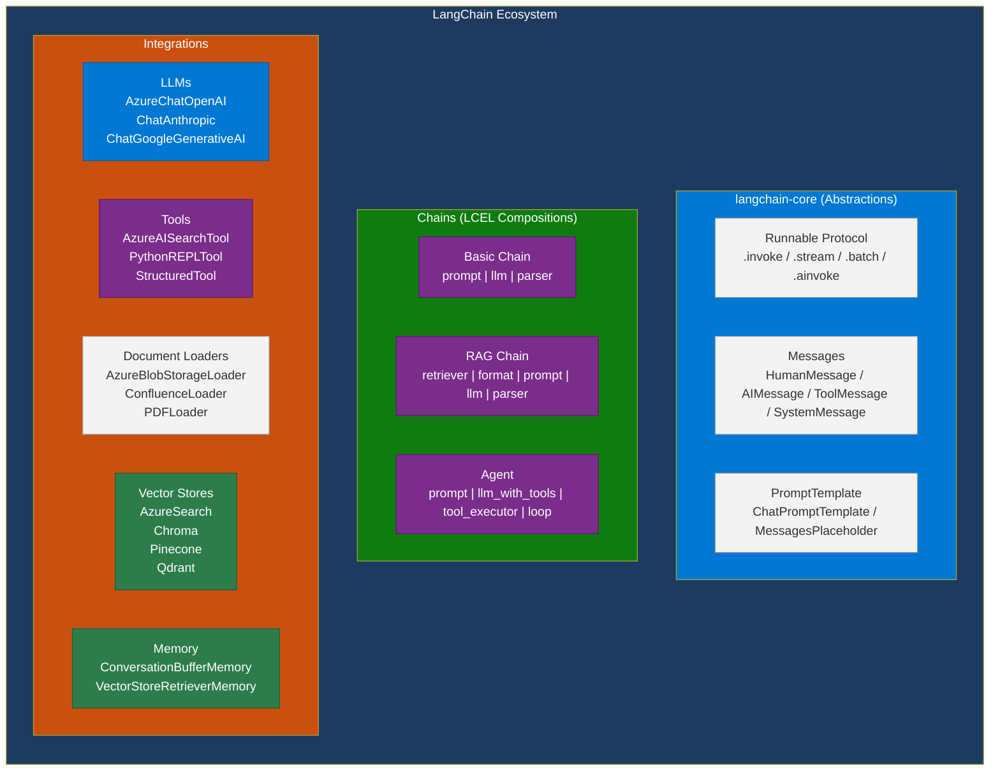
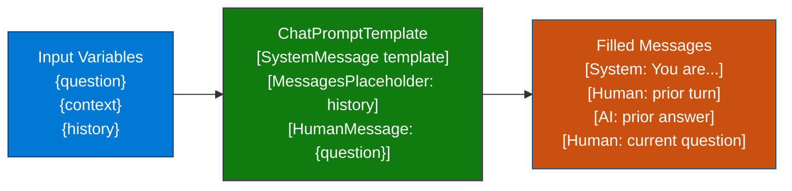
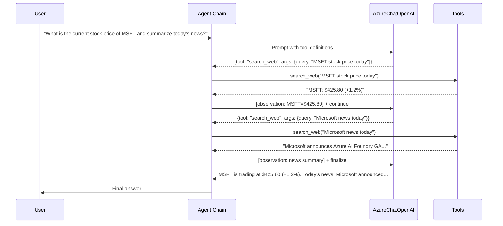
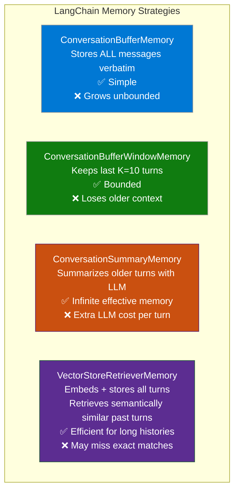
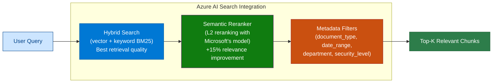
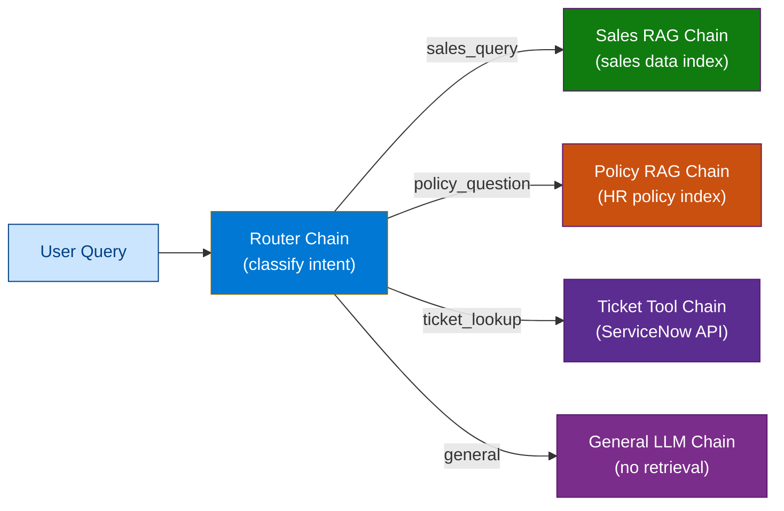

# 06 — LangChain

> **Level:** Intermediate → Advanced | **Time to complete:** 5–6 hours | **Azure services:** Azure OpenAI, Azure AI Search, Azure Cosmos DB, Azure Functions

---

## 1. Overview

### What Is LangChain?

**LangChain** is the most widely adopted open-source framework for building LLM-powered applications. It provides a composable, declarative architecture for wiring LLMs together with tools, memory, retrievers, and output parsers. Where Semantic Kernel is Microsoft's answer for the Azure ecosystem, LangChain is the community standard across all providers.

LangChain consists of several packages:
- **`langchain-core`** — base abstractions (Runnable, BaseMessage, PromptTemplate)
- **`langchain`** — chains, agents, memory, retrievers
- **`langchain-openai`** / **`langchain-azure-openai`** — Azure OpenAI integration
- **`langchain-community`** — third-party integrations (100+ tools, retrievers, vector stores)
- **`langgraph`** — stateful graph agent framework (covered in Module 07)
- **`langserve`** — deploy LangChain apps as REST APIs

### Why It Matters Enterprise-Wide

LangChain's value proposition is its **breadth**: it has the widest ecosystem of integrations (databases, APIs, document loaders, vector stores) and the largest community. For enterprise teams that need to connect AI to non-Microsoft systems (Salesforce, Confluence, JIRA, Snowflake), LangChain often provides a pre-built integration that would take weeks to build from scratch.

### When to Use / Avoid

| Use LangChain when | Consider alternatives when |
|---|---|
| Need broad third-party integrations | Microsoft-only stack (use Semantic Kernel) |
| Team has existing LangChain expertise | Need stateful graph workflows (use LangGraph directly) |
| Building RAG pipelines quickly | Production agents need tight governance (SK + Foundry) |
| Non-Azure providers (Anthropic, Cohere) | Need strong .NET support |

---

## 2. Business Problem

Enterprise developers need to connect AI to dozens of data sources and systems without writing custom integration code for each. LangChain's document loaders, retrievers, and tool ecosystem means:
- Load documents from SharePoint, Confluence, Google Drive, S3, PDFs in one line
- Query any vector store (Azure AI Search, Pinecone, Chroma) with the same API
- Chain operations together declaratively using LCEL — easy to test, debug, and modify

---

## 3. Core Concepts

### 3.1 The Runnable Interface (LCEL)

**LangChain Expression Language (LCEL)** is the composability layer. Everything in LangChain implements the `Runnable` interface with `.invoke()`, `.stream()`, `.batch()`, and `.ainvoke()`. You compose Runnables using the `|` pipe operator.

```mermaid
graph LR
    INPUT["Input\n{question, context}"] --> PROMPT["PromptTemplate\n|"] --> LLM["AzureChatOpenAI\n|"] --> PARSER["OutputParser\n|"] --> OUTPUT["Structured Output"]

    style INPUT fill:#0078d4,color:#ffffff
    style PROMPT fill:#107c10,color:#ffffff
    style LLM fill:#ca5010,color:#ffffff
    style PARSER fill:#5c2d91,color:#ffffff
    style OUTPUT fill:#ca8a04,color:#ffffff

    classDef primary   fill:#0078d4,color:#fff,stroke:#005a9e
    classDef secondary fill:#7b2d8b,color:#fff,stroke:#5a1a6b
    classDef storage   fill:#2d7d4a,color:#fff,stroke:#1f5c35
    classDef security  fill:#c7372f,color:#fff,stroke:#a02020
    classDef monitor   fill:#e67300,color:#fff,stroke:#b35500
    classDef success   fill:#27ae60,color:#fff,stroke:#1e8449
    classDef warning   fill:#f39c12,color:#333,stroke:#d68910
    classDef neutral   fill:#f3f3f3,color:#333,stroke:#999
    classDef user      fill:#cce5ff,color:#004085,stroke:#004085
    classDef decision  fill:#fff3cd,color:#856404,stroke:#856404
    classDef highlight fill:#e74c3c,color:#fff,stroke:#c0392b

    class INPUT user
    class PROMPT neutral
    class LLM primary
    class PARSER secondary
    class OUTPUT success
```



Every `|` creates a new Runnable chain. The output of one step is the input to the next.

### 3.2 Architecture Overview



### 3.3 Prompt Templates



### 3.4 Agents and Tools

A LangChain agent is a chain that uses the LLM to decide which tools to call and in what order, feeding tool results back until the goal is achieved.



### 3.5 Memory Types



### 3.6 RAG Architecture in LangChain

```mermaid
graph LR
    DOC["Documents\n(PDF, DOCX, HTML,\nBlob Storage, Confluence)"] --> LOADER["Document Loader"]
    LOADER --> SPLITTER["Text Splitter\n(RecursiveCharacterTextSplitter\nchunk_size=1000, overlap=200)"]
    SPLITTER --> EMBED["Embeddings\n(AzureOpenAIEmbeddings)"]
    EMBED --> VS["Vector Store\n(AzureSearch)"]

    QUERY["User Query"] --> Q_EMBED["Embed Query"]
    Q_EMBED --> RETRIEVER["Retriever\n.similarity_search(k=5)\nor hybrid search"]
    VS --> RETRIEVER
    RETRIEVER --> CHAIN["RAG Chain\ncontext + query → LLM → answer"]

    style DOC fill:#0078d4,color:#ffffff
    style VS fill:#107c10,color:#ffffff
    style CHAIN fill:#ca5010,color:#ffffff

    classDef primary   fill:#0078d4,color:#fff,stroke:#005a9e
    classDef secondary fill:#7b2d8b,color:#fff,stroke:#5a1a6b
    classDef storage   fill:#2d7d4a,color:#fff,stroke:#1f5c35
    classDef security  fill:#c7372f,color:#fff,stroke:#a02020
    classDef monitor   fill:#e67300,color:#fff,stroke:#b35500
    classDef success   fill:#27ae60,color:#fff,stroke:#1e8449
    classDef warning   fill:#f39c12,color:#333,stroke:#d68910
    classDef neutral   fill:#f3f3f3,color:#333,stroke:#999
    classDef user      fill:#cce5ff,color:#004085,stroke:#004085
    classDef decision  fill:#fff3cd,color:#856404,stroke:#856404
    classDef highlight fill:#e74c3c,color:#fff,stroke:#c0392b

    class DOC neutral
    class LOADER neutral
    class SPLITTER neutral
    class EMBED primary
    class VS storage
    class QUERY user
    class Q_EMBED primary
    class RETRIEVER secondary
    class CHAIN primary
```



---

## 4. Deep Technical Detail

### 4.1 LCEL — How Composition Works

LCEL chains are lazy — they describe a computation graph but don't execute until `.invoke()` is called. This enables:
- **Streaming** — `.stream()` returns an async generator of partial chunks
- **Batching** — `.batch([input1, input2])` runs in parallel with `asyncio.gather`
- **Tracing** — every step emits a LangSmith trace automatically if configured
- **Schema inspection** — `.input_schema` / `.output_schema` for type validation

```python
# LCEL composition is lazy and type-safe
chain = prompt | llm | parser

# These are all equivalent executions:
result = chain.invoke({"question": "What is RAG?"})
results = chain.batch([{"question": "What is RAG?"}, {"question": "What is an agent?"}])
async for chunk in chain.astream({"question": "Explain LangChain"}):
    print(chunk, end="", flush=True)
```

### 4.2 Custom Tools — Three Patterns

```python
from langchain_core.tools import tool, BaseTool, StructuredTool
from pydantic import BaseModel, Field

# Pattern 1: @tool decorator (simplest)
@tool
def get_weather(city: str) -> str:
    """Get current weather for a city. Use when user asks about weather."""
    return f"Weather in {city}: 22°C, partly cloudy"

# Pattern 2: StructuredTool with Pydantic schema (recommended for production)
class SalesQueryInput(BaseModel):
    quarter: str = Field(description="Quarter in format Q1-Q4")
    year: int = Field(description="4-digit year, e.g. 2025")
    region: str = Field(default="ALL", description="Region: ALL, EMEA, APAC, AMER")

def query_sales_data(quarter: str, year: int, region: str = "ALL") -> dict:
    # Implementation
    return {"revenue": 4_200_000, "region": region}

sales_tool = StructuredTool.from_function(
    func=query_sales_data,
    name="query_sales_data",
    description="Query quarterly sales data from the data warehouse. Use for any sales performance questions.",
    args_schema=SalesQueryInput,
)

# Pattern 3: BaseTool subclass (maximum control)
class DatabaseQueryTool(BaseTool):
    name: str = "query_database"
    description: str = "Execute a read-only SQL query against the enterprise database."

    def _run(self, query: str) -> str:
        # Validate it's read-only
        if any(kw in query.upper() for kw in ("INSERT", "UPDATE", "DELETE", "DROP")):
            return "Error: Only SELECT queries are permitted."
        return f"Query results: [mock data for '{query}']"

    async def _arun(self, query: str) -> str:
        return self._run(query)
```

### 4.3 Callbacks and Observability

```python
from langchain_core.callbacks import BaseCallbackHandler
import time

class ProductionCallbackHandler(BaseCallbackHandler):
    """Emits metrics and logs for every LangChain operation."""

    def __init__(self, logger, metrics_client):
        self.logger = logger
        self.metrics = metrics_client
        self._start_times = {}

    def on_llm_start(self, serialized, prompts, **kwargs):
        self._start_times["llm"] = time.perf_counter()
        self.logger.info("LLM call started", extra={"model": serialized.get("name")})

    def on_llm_end(self, response, **kwargs):
        latency = (time.perf_counter() - self._start_times.get("llm", 0)) * 1000
        usage = response.llm_output.get("token_usage", {})
        self.metrics.emit("llm.latency_ms", latency)
        self.metrics.emit("llm.tokens.total", usage.get("total_tokens", 0))
        self.logger.info("LLM call completed", extra={"latency_ms": latency, "tokens": usage})

    def on_tool_start(self, serialized, input_str, **kwargs):
        self._start_times["tool"] = time.perf_counter()
        self.logger.info("Tool called", extra={"tool": serialized.get("name"), "input": input_str[:200]})

    def on_tool_end(self, output, **kwargs):
        latency = (time.perf_counter() - self._start_times.get("tool", 0)) * 1000
        self.logger.info("Tool completed", extra={"latency_ms": latency, "output": str(output)[:200]})

    def on_tool_error(self, error, **kwargs):
        self.logger.error("Tool error", extra={"error": str(error)})

    def on_chain_error(self, error, **kwargs):
        self.logger.error("Chain error", extra={"error": str(error)})
```

### 4.4 Azure AI Search Integration



---

## 5. Azure AI Foundry Implementation

```bash
pip install langchain langchain-openai langchain-community \
            azure-search-documents azure-identity \
            tiktoken python-dotenv
```

---

## 6. Working Code Examples

### 6.1 Production RAG Pipeline

```python
# rag_pipeline.py — enterprise RAG with Azure AI Search + hybrid retrieval
import os
import asyncio
from langchain_openai import AzureChatOpenAI, AzureOpenAIEmbeddings
from langchain_community.vectorstores.azuresearch import AzureSearch
from langchain_core.prompts import ChatPromptTemplate
from langchain_core.output_parsers import StrOutputParser
from langchain_core.runnables import RunnablePassthrough, RunnableLambda
from langchain.text_splitter import RecursiveCharacterTextSplitter
from langchain_community.document_loaders import DirectoryLoader, PyPDFLoader
from dotenv import load_dotenv

load_dotenv()

# ── LLM and Embeddings ──────────────────────────────────────────────
llm = AzureChatOpenAI(
    azure_deployment=os.environ["AZURE_OPENAI_DEPLOYMENT_NAME"],
    azure_endpoint=os.environ["AZURE_OPENAI_ENDPOINT"],
    api_key=os.environ["AZURE_OPENAI_API_KEY"],
    api_version="2024-10-21",
    temperature=0.1,
    max_tokens=2048,
)

embeddings = AzureOpenAIEmbeddings(
    azure_deployment="text-embedding-3-large",
    azure_endpoint=os.environ["AZURE_OPENAI_ENDPOINT"],
    api_key=os.environ["AZURE_OPENAI_API_KEY"],
)

# ── Vector Store (Azure AI Search with hybrid + semantic) ────────────
vector_store = AzureSearch(
    azure_search_endpoint=os.environ["AZURE_SEARCH_ENDPOINT"],
    azure_search_key=os.environ["AZURE_SEARCH_ADMIN_KEY"],
    index_name=os.environ["AZURE_SEARCH_INDEX_NAME"],
    embedding_function=embeddings.embed_query,
    semantic_configuration_name="enterprise-semantic-config",  # Enable semantic reranker
)

# ── Document Ingestion ───────────────────────────────────────────────
def ingest_documents(docs_path: str) -> int:
    """Load, split, and index documents into Azure AI Search."""
    loader = DirectoryLoader(docs_path, glob="**/*.pdf", loader_cls=PyPDFLoader)
    raw_docs = loader.load()

    splitter = RecursiveCharacterTextSplitter(
        chunk_size=1000,
        chunk_overlap=200,
        separators=["\n\n", "\n", ". ", " ", ""],
        length_function=len,
    )
    chunks = splitter.split_documents(raw_docs)

    # Add metadata for filtering
    for i, chunk in enumerate(chunks):
        chunk.metadata["chunk_id"] = i
        chunk.metadata["ingested_at"] = "2025-06-30"

    vector_store.add_documents(chunks)
    print(f"Indexed {len(chunks)} chunks from {len(raw_docs)} documents")
    return len(chunks)


# ── RAG Chain ────────────────────────────────────────────────────────
RAG_PROMPT = ChatPromptTemplate.from_messages([
    ("system", """You are an enterprise knowledge assistant. Answer questions using ONLY the provided context.

Rules:
- If the answer is not in the context, say "I don't have information on that in our knowledge base."
- Always cite the document source (from metadata.source)
- Be concise and factual
- Never invent facts

Context:
{context}"""),
    ("human", "{question}"),
])


def format_docs(docs) -> str:
    """Format retrieved documents into a context string with citations."""
    formatted = []
    for doc in docs:
        source = doc.metadata.get("source", "Unknown")
        page = doc.metadata.get("page", "")
        citation = f"[{source}" + (f", p.{page}]" if page else "]")
        formatted.append(f"{citation}\n{doc.page_content}")
    return "\n\n---\n\n".join(formatted)


def build_retriever(search_type: str = "hybrid", k: int = 5):
    """Build a retriever with configurable search strategy."""
    return vector_store.as_retriever(
        search_type=search_type,  # "similarity", "hybrid", "semantic_hybrid"
        search_kwargs={
            "k": k,
            "score_threshold": 0.75,  # Filter low-relevance results
        },
    )


def build_rag_chain(retriever):
    """Compose the full RAG chain using LCEL."""
    return (
        {
            "context": retriever | RunnableLambda(format_docs),
            "question": RunnablePassthrough(),
        }
        | RAG_PROMPT
        | llm
        | StrOutputParser()
    )


# ── With Source Attribution ──────────────────────────────────────────
async def answer_with_sources(question: str) -> dict:
    """Return answer + source documents."""
    retriever = build_retriever(search_type="semantic_hybrid", k=5)
    docs = await retriever.ainvoke(question)

    chain = build_rag_chain(retriever)
    answer = await chain.ainvoke(question)

    sources = list({doc.metadata.get("source", "Unknown") for doc in docs})

    return {
        "answer": answer,
        "sources": sources,
        "chunk_count": len(docs),
    }


async def stream_answer(question: str):
    """Stream the answer token by token."""
    retriever = build_retriever()
    chain = build_rag_chain(retriever)
    async for chunk in chain.astream(question):
        print(chunk, end="", flush=True)
    print()


if __name__ == "__main__":
    asyncio.run(answer_with_sources("What is our remote work policy for managers?"))
```

### 6.2 Conversational Agent with Memory

```python
# conversational_agent.py — stateful agent with conversation memory
import os
import asyncio
from langchain_openai import AzureChatOpenAI
from langchain.agents import create_tool_calling_agent, AgentExecutor
from langchain_core.prompts import ChatPromptTemplate, MessagesPlaceholder
from langchain_core.messages import HumanMessage, AIMessage
from langchain_core.tools import tool
from langchain.memory import ConversationSummaryBufferMemory
from dotenv import load_dotenv

load_dotenv()

llm = AzureChatOpenAI(
    azure_deployment=os.environ["AZURE_OPENAI_DEPLOYMENT_NAME"],
    azure_endpoint=os.environ["AZURE_OPENAI_ENDPOINT"],
    api_key=os.environ["AZURE_OPENAI_API_KEY"],
    api_version="2024-10-21",
    temperature=0.1,
)


# ── Tool Definitions ─────────────────────────────────────────────────
@tool
def get_customer_info(customer_id: str) -> str:
    """Retrieve customer account information by customer ID (format: CUS-XXX)."""
    mock_data = {
        "CUS-001": {"name": "Acme Corp", "tier": "Enterprise", "mrr": 12500, "csat": 4.2},
        "CUS-002": {"name": "StartupXYZ", "tier": "Pro", "mrr": 899, "csat": 3.8},
    }
    result = mock_data.get(customer_id.upper(), {"error": "Customer not found"})
    import json
    return json.dumps(result)


@tool
def get_recent_tickets(customer_id: str, limit: int = 5) -> str:
    """Get recent support tickets for a customer."""
    import json
    tickets = [
        {"id": f"TKT-{i}", "subject": f"Issue #{i}", "status": "open" if i % 2 else "resolved", "created": f"2025-06-{i+20}"}
        for i in range(1, limit + 1)
    ]
    return json.dumps({"customer_id": customer_id, "tickets": tickets})


@tool
def create_escalation(customer_id: str, reason: str, priority: str = "high") -> str:
    """Create an escalation ticket for a customer with reason and priority (low/medium/high/critical)."""
    import json, random
    return json.dumps({
        "escalation_id": f"ESC-{random.randint(10000, 99999)}",
        "customer_id": customer_id,
        "reason": reason,
        "priority": priority,
        "assigned_to": "Senior Support Team",
        "sla_hours": 2 if priority == "critical" else 8,
    })


TOOLS = [get_customer_info, get_recent_tickets, create_escalation]

# ── Prompt with Memory Placeholder ──────────────────────────────────
AGENT_PROMPT = ChatPromptTemplate.from_messages([
    ("system", """You are an enterprise customer success agent.
Your goal: resolve customer issues efficiently while maintaining high CSAT scores.

Guidelines:
- Always look up customer info before discussing their account
- Check recent tickets to understand the customer's history
- Escalate only when self-service resolution is not possible
- Reference ticket IDs and case numbers in your responses
- Be professional and empathetic"""),
    MessagesPlaceholder(variable_name="chat_history"),
    ("human", "{input}"),
    MessagesPlaceholder(variable_name="agent_scratchpad"),
])

# ── Memory: Summary Buffer (best for long conversations) ─────────────
memory = ConversationSummaryBufferMemory(
    llm=llm,
    max_token_limit=2000,  # Summarize when history exceeds 2000 tokens
    memory_key="chat_history",
    return_messages=True,
)

# ── Agent ────────────────────────────────────────────────────────────
agent = create_tool_calling_agent(llm, TOOLS, AGENT_PROMPT)
agent_executor = AgentExecutor(
    agent=agent,
    tools=TOOLS,
    memory=memory,
    verbose=True,
    max_iterations=10,
    handle_parsing_errors=True,
    return_intermediate_steps=False,
)


async def chat(message: str) -> str:
    result = await agent_executor.ainvoke({"input": message})
    return result["output"]


async def demo():
    print("=== Customer Success Agent ===\n")

    turns = [
        "I'm reaching out about customer CUS-001. Can you pull up their account?",
        "They've been having persistent issues. What are their recent tickets?",
        "This is impacting their business. Please create a critical escalation for billing inconsistencies.",
    ]

    for turn in turns:
        print(f"Support Rep: {turn}")
        response = await chat(turn)
        print(f"Agent: {response}\n{'-'*60}\n")


if __name__ == "__main__":
    asyncio.run(demo())
```

### 6.3 Structured Output Chains

```python
# structured_chains.py — production-grade structured output patterns
import os
import asyncio
from typing import Optional
from pydantic import BaseModel, Field
from langchain_openai import AzureChatOpenAI
from langchain_core.prompts import ChatPromptTemplate
from langchain_core.output_parsers import JsonOutputParser
from dotenv import load_dotenv

load_dotenv()

llm = AzureChatOpenAI(
    azure_deployment=os.environ["AZURE_OPENAI_DEPLOYMENT_NAME"],
    azure_endpoint=os.environ["AZURE_OPENAI_ENDPOINT"],
    api_key=os.environ["AZURE_OPENAI_API_KEY"],
    api_version="2024-10-21",
    temperature=0,
)


# ── Schema Definitions ───────────────────────────────────────────────
class SentimentResult(BaseModel):
    sentiment: str = Field(description="positive, negative, or neutral")
    confidence: float = Field(description="0.0 to 1.0")
    key_phrases: list[str] = Field(description="Top 3 phrases driving the sentiment")
    action_required: bool = Field(description="True if this needs immediate attention")


class ContractClause(BaseModel):
    clause_type: str = Field(description="liability, payment, termination, IP, etc.")
    risk_level: str = Field(description="low, medium, high, critical")
    original_text: str = Field(description="The exact clause text")
    concern: Optional[str] = Field(default=None, description="The specific risk or concern")
    suggested_revision: Optional[str] = Field(default=None, description="Suggested safer alternative wording")


class ContractAnalysis(BaseModel):
    overall_risk: str = Field(description="low, medium, high, critical")
    clauses: list[ContractClause]
    recommended_action: str = Field(description="approve, negotiate, escalate_to_legal")
    summary: str


# ── Chain 1: Sentiment Analysis ──────────────────────────────────────
sentiment_chain = (
    ChatPromptTemplate.from_messages([
        ("system", "Analyze the sentiment of customer feedback. Respond with valid JSON matching this schema:\n{format_instructions}"),
        ("human", "{feedback}"),
    ]).partial(format_instructions=JsonOutputParser(pydantic_object=SentimentResult).get_format_instructions())
    | llm
    | JsonOutputParser(pydantic_object=SentimentResult)
)


# ── Chain 2: Contract Analysis (with .with_structured_output) ────────
contract_analyzer = llm.with_structured_output(ContractAnalysis)

contract_chain = (
    ChatPromptTemplate.from_messages([
        ("system", """You are a legal contract risk analyst. 
Analyze each clause in the provided contract text for risk.
Be specific about which clauses are problematic and why."""),
        ("human", "Analyze this contract:\n\n{contract_text}"),
    ])
    | contract_analyzer
)


# ── Chain 3: Parallel Execution ──────────────────────────────────────
from langchain_core.runnables import RunnableParallel

parallel_analyzer = RunnableParallel(
    sentiment=sentiment_chain,
    # Add more parallel branches here
)


async def analyze_feedback_batch(feedbacks: list[str]) -> list[SentimentResult]:
    """Analyze multiple feedback items in parallel."""
    results = await sentiment_chain.abatch(
        [{"feedback": fb} for fb in feedbacks],
        config={"max_concurrency": 5},  # Limit parallel requests
    )
    return results


async def analyze_contract(contract_text: str) -> ContractAnalysis:
    return await contract_chain.ainvoke({"contract_text": contract_text})


async def main():
    # Sentiment analysis batch
    feedbacks = [
        "The product is absolutely fantastic, saved us hours every week!",
        "Support took 3 days to respond. Very disappointed with service quality.",
        "It works fine, nothing special but gets the job done.",
    ]
    print("=== Sentiment Analysis ===")
    results = await analyze_feedback_batch(feedbacks)
    for fb, r in zip(feedbacks, results):
        print(f"  [{r['sentiment'].upper()} {r['confidence']:.0%}] {fb[:50]}...")

    # Contract analysis
    contract = """
    Limitation of Liability: In no event shall either party be liable for indirect,
    incidental, or consequential damages. Total liability shall not exceed $500.
    
    Payment Terms: Customer shall pay all invoices within 90 days.
    Late payment incurs 0.5% daily interest.
    
    IP Assignment: All work product created under this agreement shall become
    the sole property of the Client upon payment.
    """
    print("\n=== Contract Analysis ===")
    analysis = await analyze_contract(contract)
    print(f"Overall Risk: {analysis.overall_risk.upper()}")
    print(f"Action: {analysis.recommended_action}")
    for clause in analysis.clauses:
        print(f"  [{clause.risk_level.upper()}] {clause.clause_type}: {clause.concern}")


if __name__ == "__main__":
    asyncio.run(main())
```

### 6.4 Document Ingestion Pipeline with Azure Blob

```python
# ingestion_pipeline.py — load documents from Azure Blob Storage into Azure AI Search
import os
import asyncio
from langchain_community.document_loaders import AzureBlobStorageContainerLoader
from langchain.text_splitter import RecursiveCharacterTextSplitter
from langchain_openai import AzureOpenAIEmbeddings
from langchain_community.vectorstores.azuresearch import AzureSearch
from langchain_core.documents import Document
from azure.identity import DefaultAzureCredential
from dotenv import load_dotenv

load_dotenv()

embeddings = AzureOpenAIEmbeddings(
    azure_deployment="text-embedding-3-large",
    azure_endpoint=os.environ["AZURE_OPENAI_ENDPOINT"],
    api_key=os.environ["AZURE_OPENAI_API_KEY"],
)


def enrich_metadata(docs: list[Document], source_tag: str) -> list[Document]:
    """Add enterprise metadata for filtering and governance."""
    import hashlib, datetime
    for doc in docs:
        doc.metadata["source_tag"] = source_tag
        doc.metadata["ingested_at"] = datetime.datetime.utcnow().isoformat()
        doc.metadata["content_hash"] = hashlib.md5(doc.page_content.encode()).hexdigest()
        # Normalize source for consistent filtering
        doc.metadata["source"] = os.path.basename(doc.metadata.get("source", "unknown"))
    return docs


async def ingest_from_blob(
    container_name: str,
    source_tag: str,
    chunk_size: int = 1000,
    chunk_overlap: int = 200,
) -> dict:
    """
    Full ingestion pipeline: Blob Storage → Split → Embed → Azure AI Search
    """
    print(f"Loading documents from container: {container_name}")

    # Load from Azure Blob Storage
    loader = AzureBlobStorageContainerLoader(
        conn_str=os.environ["AZURE_STORAGE_CONNECTION_STRING"],
        container=container_name,
        prefix="documents/",  # Optional: filter by prefix
    )
    raw_docs = loader.load()
    print(f"Loaded {len(raw_docs)} raw documents")

    # Split into chunks
    splitter = RecursiveCharacterTextSplitter(
        chunk_size=chunk_size,
        chunk_overlap=chunk_overlap,
        separators=["\n\n", "\n", ". ", " "],
    )
    chunks = splitter.split_documents(raw_docs)
    chunks = enrich_metadata(chunks, source_tag)
    print(f"Split into {len(chunks)} chunks")

    # Index into Azure AI Search
    vector_store = AzureSearch(
        azure_search_endpoint=os.environ["AZURE_SEARCH_ENDPOINT"],
        azure_search_key=os.environ["AZURE_SEARCH_ADMIN_KEY"],
        index_name=os.environ["AZURE_SEARCH_INDEX_NAME"],
        embedding_function=embeddings.embed_query,
    )

    # Batch embed and index (batch_size=100 avoids embedding API limits)
    batch_size = 100
    for i in range(0, len(chunks), batch_size):
        batch = chunks[i:i + batch_size]
        vector_store.add_documents(batch)
        print(f"  Indexed batch {i//batch_size + 1}/{(len(chunks)-1)//batch_size + 1}")

    return {
        "source": container_name,
        "raw_documents": len(raw_docs),
        "chunks_indexed": len(chunks),
        "index": os.environ["AZURE_SEARCH_INDEX_NAME"],
    }


if __name__ == "__main__":
    result = asyncio.run(ingest_from_blob(
        container_name="enterprise-documents",
        source_tag="hr-policies",
    ))
    print(f"\nIngestion complete: {result}")
```

---

## 7. Enterprise Pattern Notes

### Pattern: Router Chain (Intent Classification → Specialized Chain)



```python
# router_chain.py
from langchain_core.runnables import RunnableBranch, RunnableLambda
from langchain_core.output_parsers import StrOutputParser

def classify_intent(input_dict: dict) -> str:
    """Classify user intent using a lightweight LLM call."""
    classifier = (
        ChatPromptTemplate.from_messages([
            ("system", 'Classify the query into one category. Return ONLY the category name: sales_query, policy_question, ticket_lookup, general'),
            ("human", "{question}"),
        ])
        | llm
        | StrOutputParser()
    )
    return classifier.invoke(input_dict).strip().lower()

router = RunnableBranch(
    (lambda x: classify_intent(x) == "sales_query", sales_chain),
    (lambda x: classify_intent(x) == "policy_question", policy_chain),
    (lambda x: classify_intent(x) == "ticket_lookup", ticket_chain),
    general_chain,  # default
)
```

### Pattern: Map-Reduce for Long Documents

```mermaid
graph LR
    LONG["Long Document\n(100 pages)"] --> CHUNKS["Split into\nN chunks"]
    CHUNKS --> MAP["MAP: Summarize\neach chunk in parallel"]
    MAP --> REDUCE["REDUCE: Synthesize\nall summaries into final answer"]
    REDUCE --> OUTPUT["Final Answer"]

    classDef primary   fill:#0078d4,color:#fff,stroke:#005a9e
    classDef secondary fill:#7b2d8b,color:#fff,stroke:#5a1a6b
    classDef storage   fill:#2d7d4a,color:#fff,stroke:#1f5c35
    classDef security  fill:#c7372f,color:#fff,stroke:#a02020
    classDef monitor   fill:#e67300,color:#fff,stroke:#b35500
    classDef success   fill:#27ae60,color:#fff,stroke:#1e8449
    classDef warning   fill:#f39c12,color:#333,stroke:#d68910
    classDef neutral   fill:#f3f3f3,color:#333,stroke:#999
    classDef user      fill:#cce5ff,color:#004085,stroke:#004085
    classDef decision  fill:#fff3cd,color:#856404,stroke:#856404
    classDef highlight fill:#e74c3c,color:#fff,stroke:#c0392b

    class LONG neutral
    class CHUNKS neutral
    class MAP secondary
    class REDUCE primary
    class OUTPUT success
```



```python
# map_reduce.py
from langchain.chains.combine_documents import create_stuff_documents_chain
from langchain.chains.mapreduce import MapReduceDocumentsChain
from langchain.chains.llm import LLMChain
from langchain_core.prompts import PromptTemplate

map_prompt = PromptTemplate.from_template(
    "Summarize the key points from this section:\n\n{context}\n\nKey points:"
)
reduce_prompt = PromptTemplate.from_template(
    "Combine these section summaries into a final comprehensive summary:\n\n{doc_summaries}\n\nFinal summary:"
)

map_chain = LLMChain(llm=llm, prompt=map_prompt)
reduce_chain = LLMChain(llm=llm, prompt=reduce_prompt)

map_reduce_chain = MapReduceDocumentsChain(
    llm_chain=map_chain,
    reduce_documents_chain=reduce_chain,
    document_variable_name="context",
    return_intermediate_steps=False,
)
```

---

## 8. Production Checklist

### Architecture
- [ ] Use LCEL (pipe syntax) — not legacy `LLMChain` / `ConversationalRetrievalChain`
- [ ] All chains use `async` methods (`ainvoke`, `astream`, `abatch`) in production
- [ ] `max_concurrency` set in `.abatch()` to prevent AOAI rate limit spikes
- [ ] Chain composition tested with `.input_schema` / `.output_schema` validation

### RAG Quality
- [ ] Chunk size validated for your domain (1000 chars for prose, 500 for dense technical)
- [ ] Chunk overlap ≥ 10% of chunk_size to prevent context loss at boundaries
- [ ] Retriever `score_threshold` tuned (start at 0.75; adjust based on precision/recall)
- [ ] Hybrid search enabled in Azure AI Search (BM25 + vector beats vector-only by 15–20%)
- [ ] Semantic reranker enabled (L2 reranking; adds ~100ms but significant quality gain)
- [ ] Evaluation dataset of 50+ (question, expected_answer, source_doc) tuples for offline eval

### Reliability
- [ ] `handle_parsing_errors=True` on AgentExecutor (prevents crashes on malformed tool calls)
- [ ] `max_iterations` set on AgentExecutor (default 15 — cap at 10 for most use cases)
- [ ] Retry logic at HTTP client level (set `max_retries=5` in `AzureChatOpenAI`)
- [ ] Callback handler registered for error logging and metrics

### Cost
- [ ] Memory strategy chosen based on conversation length: Buffer (< 10 turns), SummaryBuffer (> 10)
- [ ] `.abatch()` used instead of sequential `.ainvoke()` for multiple items
- [ ] Retrieved chunk count `k` tuned — more chunks = more tokens = higher cost
- [ ] LangSmith tracing enabled in staging to identify expensive chain paths

---

## 9. Interview Q&A

### Q1 (Beginner): What is LCEL and why does LangChain use the pipe `|` operator?

**Answer:** LCEL (LangChain Expression Language) is the composition system that makes every LangChain component (prompts, LLMs, parsers, retrievers) a `Runnable` — an object with `.invoke()`, `.stream()`, `.batch()`, and async variants. The `|` operator chains Runnables so that the output of one becomes the input of the next, creating a lazy computation graph.

The pipe syntax is chosen because it's declarative and composable: `prompt | llm | parser` reads left-to-right like a data pipeline and makes the structure of the chain obvious. The lazy evaluation means you can call `.stream()` and get tokens as they're generated, or `.batch()` to process multiple inputs in parallel — without changing the chain definition. This gives you streaming and parallelism "for free" on any chain.

---

### Q2 (Beginner): What is the difference between `invoke`, `stream`, and `batch` on a LangChain Runnable?

**Answer:**
- **`invoke(input)`** — synchronous, processes one input and returns the final result. Use for simple, one-off requests.
- **`stream(input)`** — returns a generator that yields partial outputs as they're produced (tokens for LLMs, intermediate values for chains). Use for user-facing chat where you want to show tokens as they appear.
- **`batch([input1, input2, ...])`** — processes multiple inputs in parallel (using `asyncio.gather` under the hood). Use when you need to process many items (e.g., classify 100 tickets) — significantly faster than sequential `invoke` calls.
- **`ainvoke` / `astream` / `abatch`** — async versions of the above. Always use async in production FastAPI or agent applications to avoid blocking the event loop.

---

### Q3 (Intermediate): How do you choose between the three memory strategies in LangChain for a production chatbot?

**Answer:**
- **`ConversationBufferMemory`** — stores all messages verbatim. Use only when conversations are guaranteed to be short (< 5–10 turns) and context window cost is not a concern. Risk: unlimited growth causing context overflow.
- **`ConversationBufferWindowMemory(k=10)`** — keeps only the last K turns. Use when you need simplicity and predictable token usage, and older context is not critical. Risk: important early-conversation context is lost.
- **`ConversationSummaryBufferMemory(max_token_limit=2000)`** — buffers recent messages verbatim up to a token limit, then uses an LLM call to summarize older messages. **Best default for production**: balances complete context, bounded token usage, and coherent long-term memory. The extra LLM summarization call costs a few cents per session and is worth it.
- **`VectorStoreRetrieverMemory`** — embeds and stores every turn; retrieves semantically similar past turns for each new message. Use for very long, complex sessions where specific past facts (not just recent context) matter.

---

### Q4 (Intermediate): Explain how LangChain's `create_tool_calling_agent` differs from the older `initialize_agent` with `ZERO_SHOT_REACT_DESCRIPTION`.

**Answer:** The older `initialize_agent` approach used text-based ReAct prompting — the agent would output `Action: tool_name\nAction Input: args` as raw text, and the framework parsed this text to extract tool calls. This was fragile: any deviation in formatting broke the agent.

`create_tool_calling_agent` (modern, LangChain ≥ 0.1.0) uses native **function calling** / **tool calling** built into the model's API. The LLM outputs structured JSON for tool calls (validated by the API), the framework deserializes it, and tool results are returned as `ToolMessage` objects. This is significantly more reliable because:
- The model produces schema-valid JSON (not free text to parse)
- Multi-tool calls in one turn are supported natively
- The conversation history is cleaner (tool calls are first-class messages)
- Error rates drop from ~10% to < 1% on complex tool schemas

Always use `create_tool_calling_agent` for production with GPT-4o or any modern model that supports function calling.

---

### Q5 (Advanced): Design a hybrid search retrieval system for an enterprise knowledge base with security trimming.

**Answer:** Security trimming means a user can only retrieve documents they're authorized to see based on their role/permissions.

**Architecture:**

1. **Indexing layer (Azure AI Search):** Each document chunk is indexed with metadata fields: `security_groups: ["HR", "Finance", "ALL"]`, `classification: "internal|confidential|public"`. These fields are marked as filterable in the index schema.

2. **Retriever with filter injection:** At query time, derive the user's security groups from their Azure AD token (via Microsoft Graph). Pass them as OData filters to the Azure AI Search query: `$filter=security_groups/any(g: g eq 'HR') or security_groups/any(g: g eq 'ALL')`.

3. **Hybrid search + semantic reranker:** Combine BM25 keyword search and vector search in a single query (Azure AI Search "hybrid" search type). Apply the semantic reranker (L2) to the combined results for precision.

4. **LangChain integration:**
```python
retriever = vector_store.as_retriever(
    search_type="semantic_hybrid",
    search_kwargs={
        "k": 10,
        "filters": f"security_groups/any(g: g eq '{user_group}')",
    },
)
```

5. **Audit logging:** Log every retrieval query with user ID, query, returned document IDs, and filter applied — essential for compliance.

---

### Q6 (Architecture): When would you use LangChain instead of Semantic Kernel for an enterprise Azure project?

**Answer:** The decision comes down to ecosystem fit and team background:

**Choose LangChain when:**
- Need a broad integration ecosystem: 100+ document loaders (Confluence, Notion, SharePoint, JIRA), 50+ vector stores, dozens of tool integrations
- Team has existing LangChain / Python AI expertise and tooling (LangSmith for tracing)
- Non-Microsoft LLM providers are in scope (Anthropic Claude, Cohere, local Llama)
- Need LangGraph for complex stateful agent workflows
- Rapid prototyping where ecosystem breadth matters more than enterprise governance

**Choose Semantic Kernel when:**
- Azure-first stack with strong Foundry/Microsoft 365 integration
- .NET backend (SK has first-class C# support; LangChain is Python-only)
- Need built-in Foundry evaluation integration
- Compliance teams need Microsoft-backed, supported framework
- Plugin reuse model across multiple enterprise teams matters

**Reality in enterprise:** Many teams use **both** — LangChain for document loading, text splitting, and some retrievers; SK for agent orchestration and Foundry integration. They compose because both implement compatible abstractions.

---

## Cross-links

- Previous: [05 — Semantic Kernel](./05-Semantic-Kernel.md)
- Next: [07 — LangGraph](./07-LangGraph.md)
- Related: [14 — RAG](./14-RAG.md) | [17 — Vector Databases](./17-Vector-Databases.md) | [21 — Memory](./21-Memory.md)
- Advanced: [10 — Multi-Agent Systems](./10-Multi-Agent-Systems.md) | [15 — Enterprise RAG](./15-Enterprise-RAG.md)

---

*Module 06 | Series: Enterprise Agentic AI Tutorial | Last updated: June 2026*
