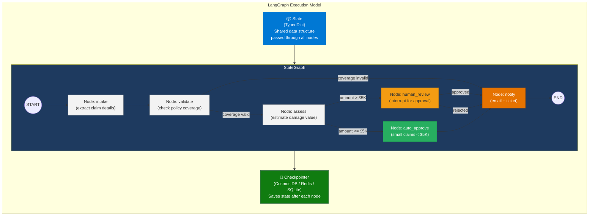
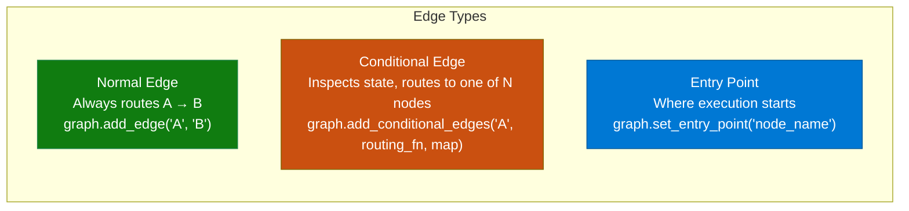
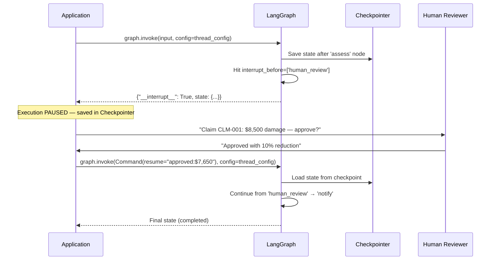
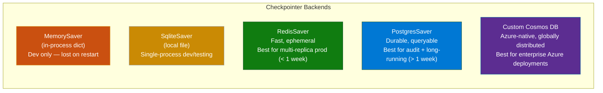
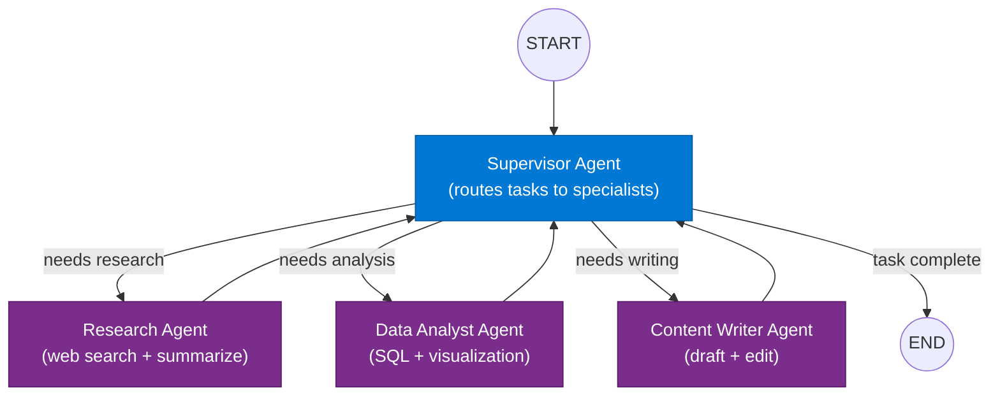

# 07 — LangGraph

> **Level:** Advanced | **Time to complete:** 5–6 hours | **Azure services:** Azure OpenAI, Azure Cosmos DB (checkpointing), Azure Container Apps, Azure Service Bus

---

## 1. Overview

### What Is LangGraph?

**LangGraph** is a stateful, graph-based framework built on top of LangChain for building complex, controllable multi-agent workflows. Where LangChain's agents execute a simple linear loop, LangGraph models agent workflows as directed graphs — nodes that execute functions, edges that route between them based on state.

Key capabilities LangGraph adds over vanilla LangChain agents:
- **Persistent state** — typed `State` object flows through the graph and is checkpointed after every node
- **Conditional routing** — edges are functions that inspect state and dynamically choose the next node
- **Cycles** — graphs can loop (agent iterates), unlike DAGs
- **Human-in-the-loop (HITL)** — pause execution at any node and wait for human input
- **Interrupts** — stop before executing a specific node for review or approval
- **Subgraphs** — compose multiple graphs into hierarchical multi-agent systems
- **Streaming** — stream state updates, LLM tokens, and tool results in real time

### Why It Matters Enterprise-Wide

Enterprise AI workflows are not linear. A claims processing agent may need to: extract → validate → optionally request more info (loop) → assess → branch based on value → escalate or auto-approve. LangGraph is the only framework that handles this natively with durable, resumable state — critical when a workflow might take hours or days (waiting for human approval).

### When to Use / Avoid

| Use LangGraph | Use simpler alternatives |
|---|---|
| Multi-step workflows with conditional branching | Simple single-agent chat |
| Human-in-the-loop approval required | Stateless request-response |
| Long-running tasks (hours to days) | Low-complexity tool use (use SK or LangChain) |
| Multi-agent coordination | LLM pipeline without loops |
| Need workflow resume after interruption | |

---

## 2. Business Problem

Traditional workflow engines (Azure Logic Apps, Temporal) handle structured business logic well but cannot reason about unstructured inputs. LangChain agents handle reasoning but have no durable state — if the process crashes mid-execution or needs a human to review, everything is lost.

LangGraph solves the **long-running AI workflow** problem: it checkpoints state after every node to a persistent store (Redis, Cosmos DB, PostgreSQL), enabling:
- **Crash recovery** — resume from last checkpoint, not from scratch
- **Human-in-the-loop** — pause indefinitely for human review, resume when approved
- **Audit trail** — full execution history stored in the checkpoint store
- **Time travel** — replay from any prior checkpoint for debugging

---

## 3. Core Concepts

### 3.1 Graph Architecture



### 3.2 State — The Backbone

The `State` is a `TypedDict` (or Pydantic model) that flows through every node. Nodes read from state and return partial updates — LangGraph merges updates using `Annotated` field reducers.

```mermaid
graph LR
    S0["Initial State\n{messages: [], claim_id: None\nstatus: 'new', amount: None}"]
    S0 -->|"intake node runs"| S1["After intake\n{messages: [...], claim_id: 'CLM-001'\nstatus: 'extracted', amount: None}"]
    S1 -->|"validate node runs"| S2["After validate\n{messages: [...], claim_id: 'CLM-001'\nstatus: 'valid', coverage: True}"]
    S2 -->|"assess node runs"| S3["After assess\n{messages: [...], amount: 8500\nstatus: 'assessed'}"]

    style S0 fill:#ca8a04,color:#ffffff
    style S1 fill:#0078d4,color:#ffffff
    style S2 fill:#107c10,color:#ffffff
    style S3 fill:#ca5010,color:#ffffff

    classDef primary   fill:#0078d4,color:#fff,stroke:#005a9e
    classDef secondary fill:#7b2d8b,color:#fff,stroke:#5a1a6b
    classDef storage   fill:#2d7d4a,color:#fff,stroke:#1f5c35
    classDef security  fill:#c7372f,color:#fff,stroke:#a02020
    classDef monitor   fill:#e67300,color:#fff,stroke:#b35500
    classDef success   fill:#27ae60,color:#fff,stroke:#1e8449
    classDef warning   fill:#f39c12,color:#333,stroke:#d68910
    classDef neutral   fill:#f3f3f3,color:#333,stroke:#999
    classDef user      fill:#cce5ff,color:#004085,stroke:#004085
    classDef decision  fill:#fff3cd,color:#856404,stroke:#856404
    classDef highlight fill:#e74c3c,color:#fff,stroke:#c0392b

    class S0 user
    class S1 primary
    class S2 success
    class S3 monitor
```



### 3.3 Nodes

A node is a Python function (or async function) that receives the current state and returns a dictionary of state updates:

```python
from langgraph.graph import StateGraph
from typing import TypedDict, Annotated
from langchain_core.messages import BaseMessage
import operator

class AgentState(TypedDict):
    messages: Annotated[list[BaseMessage], operator.add]  # reducer: append
    claim_id: str
    status: str
    amount: float | None
    approved: bool | None

def intake_node(state: AgentState) -> dict:
    # Read from state, call LLM or tools, return partial update
    return {"status": "extracted", "claim_id": "CLM-001"}
```

### 3.4 Edges — Conditional Routing



```python
def route_after_assessment(state: AgentState) -> str:
    """Routing function: inspects state, returns next node name."""
    if state.get("amount") is None:
        return "error_handler"
    if state["amount"] > 5000:
        return "human_review"   # needs human approval
    return "auto_approve"       # small claim, auto-process

graph.add_conditional_edges(
    "assess",
    route_after_assessment,
    {
        "human_review": "human_review",
        "auto_approve": "auto_approve",
        "error_handler": "error_handler",
    },
)
```

### 3.5 Human-in-the-Loop (HITL) and Interrupts

LangGraph's interrupt mechanism is what makes enterprise HITL workflows possible:



### 3.6 Checkpointing

Checkpointing is LangGraph's persistence layer — state is saved to a backend after each node:



---

## 4. Deep Technical Detail

### 4.1 Message Passing and Reducers

The `Annotated[list, operator.add]` pattern is how LangGraph accumulates messages across nodes without full state replacement:

```python
from typing import Annotated
import operator

class State(TypedDict):
    # operator.add reducer: each node APPENDS to messages (not replaces)
    messages: Annotated[list[BaseMessage], operator.add]
    
    # No reducer: last write wins
    status: str
    
    # Custom reducer: keep the max value
    confidence: Annotated[float, lambda old, new: max(old, new)]
```

### 4.2 Streaming — Four Levels

```python
# Level 1: Stream state updates (after each node)
async for state_update in graph.astream(input, config):
    print(state_update)  # {node_name: {state_delta}}

# Level 2: Stream LLM tokens within nodes
async for chunk in graph.astream(input, config, stream_mode="messages"):
    if chunk[1].get("langgraph_node") == "generate":
        print(chunk[0].content, end="", flush=True)

# Level 3: Stream tool calls and results
async for event in graph.astream_events(input, config, version="v2"):
    if event["event"] == "on_tool_start":
        print(f"Tool called: {event['name']}")
    elif event["event"] == "on_tool_end":
        print(f"Tool result: {event['data']['output']}")

# Level 4: Stream values (complete state at each step)
async for state in graph.astream(input, config, stream_mode="values"):
    print(f"Current messages count: {len(state['messages'])}")
```

### 4.3 Thread Management

Every LangGraph run is associated with a `thread_id` — the identifier for a conversation/workflow instance:

```python
# Same thread_id = same conversation = resume from checkpoint
config = {"configurable": {"thread_id": "claim-CLM-001"}}

# First run
result1 = graph.invoke({"messages": [HumanMessage("Process claim CLM-001")]}, config)

# Second run — picks up from where it left off
result2 = graph.invoke({"messages": [HumanMessage("Approved by manager")]}, config)

# Inspect checkpoint history (time travel)
history = list(graph.get_state_history(config))
for checkpoint in history:
    print(f"  Step {checkpoint.metadata['step']}: {checkpoint.values.get('status')}")
```

### 4.4 Subgraphs — Multi-Agent Architecture

```mermaid
graph TB
    subgraph PARENT["Parent Graph (Orchestrator)"]
        S((START))
        ROUTE["Route Task"]
        RESEARCH_SUBGRAPH["Research Subgraph\n(standalone graph)"]
        WRITE_SUBGRAPH["Writing Subgraph\n(standalone graph)"]
        REVIEW["Review Output"]
        E((END))

        S --> ROUTE
        ROUTE -->|"needs research"| RESEARCH_SUBGRAPH
        ROUTE -->|"needs writing"| WRITE_SUBGRAPH
        RESEARCH_SUBGRAPH --> WRITE_SUBGRAPH
        WRITE_SUBGRAPH --> REVIEW
        REVIEW --> E
    end

    subgraph RESEARCH["Research Subgraph"]
        R1["Search Web"] --> R2["Summarize Findings"] --> R3["Validate Sources"]
    end

    subgraph WRITE["Writing Subgraph"]
        W1["Draft Content"] --> W2["Self-Review"] --> W3["Format Output"]
    end

    classDef primary   fill:#0078d4,color:#fff,stroke:#005a9e
    classDef secondary fill:#7b2d8b,color:#fff,stroke:#5a1a6b
    classDef storage   fill:#2d7d4a,color:#fff,stroke:#1f5c35
    classDef security  fill:#c7372f,color:#fff,stroke:#a02020
    classDef monitor   fill:#e67300,color:#fff,stroke:#b35500
    classDef success   fill:#27ae60,color:#fff,stroke:#1e8449
    classDef warning   fill:#f39c12,color:#333,stroke:#d68910
    classDef neutral   fill:#f3f3f3,color:#333,stroke:#999
    classDef user      fill:#cce5ff,color:#004085,stroke:#004085
    classDef decision  fill:#fff3cd,color:#856404,stroke:#856404
    classDef highlight fill:#e74c3c,color:#fff,stroke:#c0392b

    class ROUTE decision
    class RESEARCH_SUBGRAPH,WRITE_SUBGRAPH secondary
    class REVIEW monitor
    class R1,R2,R3 neutral
    class W1,W2,W3 neutral
```



---

## 5. Azure AI Foundry Implementation

```bash
pip install langgraph langchain-openai langchain-community \
            langgraph-checkpoint-postgres \
            azure-cosmos azure-identity \
            fastapi uvicorn python-dotenv
```

---

## 6. Working Code Example — Insurance Claims Processing Agent

A complete, production-pattern LangGraph workflow for insurance claims with HITL, checkpointing, and streaming.

### Project Structure

```
langgraph-claims/
├── .env
├── requirements.txt
├── state.py           ← TypedDict state definition
├── nodes.py           ← All graph node functions
├── tools.py           ← Tool functions used by nodes
├── checkpointer.py    ← Azure Cosmos DB checkpointer
├── graph.py           ← Graph definition and compilation
├── api.py             ← FastAPI endpoints
└── main.py            ← Demo runner
```

### state.py

```python
# state.py
from typing import TypedDict, Annotated, Optional
from langchain_core.messages import BaseMessage
import operator


class ClaimState(TypedDict):
    # Conversation — append-only
    messages: Annotated[list[BaseMessage], operator.add]

    # Claim data — last-write-wins
    claim_id: Optional[str]
    policy_number: Optional[str]
    claimant_name: Optional[str]
    incident_date: Optional[str]
    damage_description: Optional[str]

    # Processing state
    status: str  # new → extracted → validated → assessed → approved/rejected → notified
    coverage_confirmed: Optional[bool]
    estimated_amount: Optional[float]
    approved_amount: Optional[float]
    rejection_reason: Optional[str]

    # Human review
    requires_human_review: Optional[bool]
    human_decision: Optional[str]  # "approved", "rejected", "more_info_needed"
    human_notes: Optional[str]

    # Audit
    processing_steps: Annotated[list[str], operator.add]
    errors: Annotated[list[str], operator.add]
```

### tools.py

```python
# tools.py
import json
import random
from datetime import datetime


def lookup_policy(policy_number: str) -> dict:
    """Look up policy coverage details from the policy database."""
    policies = {
        "POL-001234": {
            "policy_number": "POL-001234",
            "holder": "James Wilson",
            "type": "Comprehensive Home Insurance",
            "status": "active",
            "max_coverage": 500_000,
            "deductible": 1_000,
            "covered_perils": ["fire", "water_damage", "theft", "storm", "vandalism"],
            "exclusions": ["earthquake", "flood", "war"],
        },
        "POL-009876": {
            "policy_number": "POL-009876",
            "holder": "Maria Santos",
            "type": "Basic Home Insurance",
            "status": "active",
            "max_coverage": 150_000,
            "deductible": 2_500,
            "covered_perils": ["fire", "theft"],
            "exclusions": ["water_damage", "storm", "earthquake", "flood"],
        },
    }
    return policies.get(policy_number, {"error": f"Policy {policy_number} not found"})


def estimate_damage_value(damage_type: str, description: str) -> dict:
    """Estimate repair/replacement cost based on damage type and description."""
    base_estimates = {
        "water_damage": (3_000, 45_000),
        "fire": (10_000, 300_000),
        "theft": (500, 25_000),
        "storm": (2_000, 80_000),
        "vandalism": (500, 10_000),
    }
    low, high = base_estimates.get(damage_type.lower(), (1_000, 50_000))
    estimate = random.uniform(low, high)
    return {
        "damage_type": damage_type,
        "estimated_amount": round(estimate, 2),
        "confidence": "medium",
        "assessment_method": "automated_valuation_model_v2",
        "includes_labor": True,
        "currency": "USD",
    }


def check_fraud_indicators(claim_id: str, policy_number: str, amount: float) -> dict:
    """Check for fraud indicators in the claim."""
    # Simplified fraud scoring
    fraud_score = 0.0
    flags = []

    if amount > 50_000:
        fraud_score += 0.2
        flags.append("High value claim")
    if random.random() > 0.9:
        fraud_score += 0.3
        flags.append("Policy recently modified")

    return {
        "fraud_score": round(fraud_score, 2),
        "risk_level": "high" if fraud_score > 0.5 else "medium" if fraud_score > 0.2 else "low",
        "flags": flags,
        "recommend_investigation": fraud_score > 0.5,
    }


def send_notification(
    recipient_email: str, subject: str, body: str, notification_type: str
) -> dict:
    """Send notification email to claimant or adjuster."""
    print(f"\n[NOTIFICATION] To: {recipient_email}\nSubject: {subject}\n{body[:100]}...")
    return {
        "sent": True,
        "message_id": f"MSG-{random.randint(100000, 999999)}",
        "timestamp": datetime.utcnow().isoformat(),
    }
```

### nodes.py

```python
# nodes.py
import os
import json
from langchain_openai import AzureChatOpenAI
from langchain_core.messages import HumanMessage, AIMessage, ToolMessage, SystemMessage
from langchain_core.tools import tool
from langgraph.prebuilt import ToolNode
from dotenv import load_dotenv
from state import ClaimState
from tools import lookup_policy, estimate_damage_value, check_fraud_indicators, send_notification

load_dotenv()

llm = AzureChatOpenAI(
    azure_deployment=os.environ["AZURE_OPENAI_DEPLOYMENT_NAME"],
    azure_endpoint=os.environ["AZURE_OPENAI_ENDPOINT"],
    api_key=os.environ["AZURE_OPENAI_API_KEY"],
    api_version="2024-10-21",
    temperature=0,
)

# ── Tool Definitions for LangGraph ToolNode ──────────────────────────
@tool
def tool_lookup_policy(policy_number: str) -> str:
    """Look up insurance policy coverage by policy number."""
    return json.dumps(lookup_policy(policy_number))

@tool
def tool_estimate_damage(damage_type: str, description: str) -> str:
    """Estimate damage repair cost. damage_type: fire|water_damage|theft|storm|vandalism"""
    return json.dumps(estimate_damage_value(damage_type, description))

@tool
def tool_check_fraud(claim_id: str, policy_number: str, amount: float) -> str:
    """Check claim for fraud indicators."""
    return json.dumps(check_fraud_indicators(claim_id, policy_number, amount))

@tool
def tool_send_notification(recipient_email: str, subject: str, body: str, notification_type: str) -> str:
    """Send email notification."""
    return json.dumps(send_notification(recipient_email, subject, body, notification_type))

TOOLS = [tool_lookup_policy, tool_estimate_damage, tool_check_fraud, tool_send_notification]
tool_node = ToolNode(TOOLS)
llm_with_tools = llm.bind_tools(TOOLS)


# ── Node 1: Intake ───────────────────────────────────────────────────
async def intake_node(state: ClaimState) -> dict:
    """Extract structured claim details from the initial submission."""
    extraction_prompt = SystemMessage(content="""You are an insurance claims intake agent.
Extract the following from the claim submission and look up the policy:
1. policy_number, claimant_name, incident_date, damage_type, description
2. Call tool_lookup_policy to verify coverage

Respond with a JSON summary after calling the policy tool.""")

    messages = [extraction_prompt] + state["messages"]
    response = await llm_with_tools.ainvoke(messages)

    updates = {"processing_steps": ["intake_completed"], "status": "extracted"}

    # Parse extracted fields from the last AI message (simplified)
    content = response.content or ""
    if "POL-" in content:
        import re
        pol_match = re.search(r'POL-\d+', content)
        if pol_match:
            updates["policy_number"] = pol_match.group()

    return {"messages": [response], **updates}


# ── Node 2: Validate ─────────────────────────────────────────────────
async def validate_node(state: ClaimState) -> dict:
    """Validate coverage and check if the incident is covered."""
    validation_prompt = SystemMessage(content="""You are a claims validator.
Based on the policy details retrieved and the claim description:
1. Confirm if the damage type is covered by the policy
2. Check if there are any exclusions that apply
3. Set coverage_confirmed to true or false and explain why

Use the conversation history to find the policy details already retrieved.""")

    response = await llm_with_tools.ainvoke([validation_prompt] + state["messages"])

    coverage = "not covered" not in (response.content or "").lower()
    return {
        "messages": [response],
        "coverage_confirmed": coverage,
        "status": "validated" if coverage else "rejected",
        "processing_steps": ["validation_completed"],
        "rejection_reason": None if coverage else "Damage type not covered by policy",
    }


# ── Node 3: Assess ───────────────────────────────────────────────────
async def assess_node(state: ClaimState) -> dict:
    """Estimate damage value and run fraud check."""
    assess_prompt = SystemMessage(content="""You are a claims assessor.
1. Call tool_estimate_damage with the damage type and description from the claim
2. Call tool_check_fraud with the claim details and estimated amount
3. Determine if human review is required (amount > $5,000 OR fraud score > 0.3)

Summarize your findings.""")

    response = await llm_with_tools.ainvoke([assess_prompt] + state["messages"])

    # Extract estimated amount from tool calls in history (simplified)
    estimated_amount = 8_500.0  # Mock — in production, parse from tool results
    requires_review = estimated_amount > 5_000

    return {
        "messages": [response],
        "estimated_amount": estimated_amount,
        "requires_human_review": requires_review,
        "status": "assessed",
        "processing_steps": ["assessment_completed"],
    }


# ── Node 4: Human Review (HITL) ──────────────────────────────────────
async def human_review_node(state: ClaimState) -> dict:
    """
    This node is interrupted BEFORE execution.
    When resumed, the human decision is already in state via Command(resume=...).
    """
    decision = state.get("human_decision", "pending")

    if decision == "pending":
        # First time hitting this node — prepare review package
        return {
            "messages": [AIMessage(content=f"Claim {state.get('claim_id')} requires human review. Estimated amount: ${state.get('estimated_amount', 0):,.2f}. Awaiting adjuster decision.")],
            "status": "pending_human_review",
            "processing_steps": ["human_review_requested"],
        }

    # Human has provided a decision (graph was resumed)
    approved = decision.startswith("approved")
    return {
        "messages": [AIMessage(content=f"Human adjuster decision: {decision}")],
        "status": "approved" if approved else "rejected",
        "approved_amount": state.get("estimated_amount") if approved else 0,
        "processing_steps": ["human_review_completed"],
    }


# ── Node 5: Auto Approve ──────────────────────────────────────────────
async def auto_approve_node(state: ClaimState) -> dict:
    """Automatically approve small claims (< $5,000) that pass fraud checks."""
    amount = state.get("estimated_amount", 0)
    deductible = 1_000  # from policy
    payout = max(0, amount - deductible)

    return {
        "messages": [AIMessage(content=f"Claim auto-approved. Damage: ${amount:,.2f}. Deductible: ${deductible:,.2f}. Payout: ${payout:,.2f}.")],
        "status": "approved",
        "approved_amount": payout,
        "processing_steps": ["auto_approved"],
    }


# ── Node 6: Notify ───────────────────────────────────────────────────
async def notify_node(state: ClaimState) -> dict:
    """Send final notification to claimant and internal systems."""
    status = state.get("status", "unknown")
    amount = state.get("approved_amount", 0)

    if status == "approved":
        subject = f"Claim {state.get('claim_id')} Approved — ${amount:,.2f}"
        body = f"Dear {state.get('claimant_name', 'Claimant')}, your claim has been approved for ${amount:,.2f}. Payment will be processed within 5 business days."
    elif status == "rejected":
        subject = f"Claim {state.get('claim_id')} — Decision"
        reason = state.get("rejection_reason", "does not meet policy criteria")
        body = f"Dear {state.get('claimant_name', 'Claimant')}, after review your claim has been declined. Reason: {reason}"
    else:
        subject = f"Claim {state.get('claim_id')} Update"
        body = "Your claim status has been updated."

    notify_result = tool_send_notification.invoke({
        "recipient_email": "claimant@example.com",
        "subject": subject,
        "body": body,
        "notification_type": "claim_decision",
    })

    return {
        "messages": [AIMessage(content=f"Notification sent. {notify_result}")],
        "status": "completed",
        "processing_steps": ["notification_sent"],
    }


# ── Tool Node (handles all tool call results) ─────────────────────────
# (tool_node from ToolNode is already defined above)


# ── Routing Functions ─────────────────────────────────────────────────
def route_after_tools(state: ClaimState) -> str:
    """After a tool node, check if more tools needed or move to next step."""
    last_message = state["messages"][-1]
    if hasattr(last_message, "tool_calls") and last_message.tool_calls:
        return "tools"
    return "continue"


def route_after_validate(state: ClaimState) -> str:
    if state.get("coverage_confirmed") is False:
        return "notify"
    return "assess"


def route_after_assess(state: ClaimState) -> str:
    if state.get("requires_human_review"):
        return "human_review"
    return "auto_approve"


def route_after_human_review(state: ClaimState) -> str:
    if state.get("status") in ("approved", "rejected"):
        return "notify"
    return "human_review"  # Still pending
```

### graph.py

```python
# graph.py
from langgraph.graph import StateGraph, END, START
from langgraph.checkpoint.memory import MemorySaver
from state import ClaimState
from nodes import (
    intake_node, validate_node, assess_node,
    human_review_node, auto_approve_node, notify_node,
    tool_node,
    route_after_validate, route_after_assess, route_after_human_review,
)


def build_claims_graph(checkpointer=None):
    """Build and compile the claims processing graph."""
    builder = StateGraph(ClaimState)

    # Add all nodes
    builder.add_node("intake", intake_node)
    builder.add_node("tools", tool_node)
    builder.add_node("validate", validate_node)
    builder.add_node("assess", assess_node)
    builder.add_node("human_review", human_review_node)
    builder.add_node("auto_approve", auto_approve_node)
    builder.add_node("notify", notify_node)

    # Define flow
    builder.add_edge(START, "intake")
    builder.add_edge("intake", "tools")
    builder.add_edge("tools", "validate")

    builder.add_conditional_edges(
        "validate",
        route_after_validate,
        {"notify": "notify", "assess": "assess"},
    )

    builder.add_edge("assess", "tools")

    builder.add_conditional_edges(
        "tools",
        route_after_assess,
        {"human_review": "human_review", "auto_approve": "auto_approve"},
    )

    builder.add_conditional_edges(
        "human_review",
        route_after_human_review,
        {"notify": "notify", "human_review": "human_review"},
    )

    builder.add_edge("auto_approve", "notify")
    builder.add_edge("notify", END)

    # Compile with interrupt before human_review (HITL)
    return builder.compile(
        checkpointer=checkpointer or MemorySaver(),
        interrupt_before=["human_review"],
    )
```

### main.py

```python
# main.py
import asyncio
from langchain_core.messages import HumanMessage
from langgraph.types import Command
from graph import build_claims_graph

graph = build_claims_graph()

async def process_claim():
    # Thread config — same thread_id = same workflow instance
    config = {"configurable": {"thread_id": "claim-CLM-2025-001"}}

    initial_state = {
        "messages": [HumanMessage(
            "New claim submission:\n"
            "Policy: POL-001234\n"
            "Claimant: James Wilson\n"
            "Incident Date: 2025-06-20\n"
            "Type: Water Damage\n"
            "Description: Burst pipe in kitchen caused extensive flooding. "
            "Damaged flooring, cabinets, and appliances."
        )],
        "claim_id": "CLM-2025-001",
        "status": "new",
        "processing_steps": [],
        "errors": [],
    }

    print("=== Starting Claims Processing ===\n")

    # Run until first interrupt (before human_review)
    result = await graph.ainvoke(initial_state, config)
    print(f"\nStatus: {result.get('status')}")
    print(f"Estimated Amount: ${result.get('estimated_amount', 0):,.2f}")
    print(f"Requires Human Review: {result.get('requires_human_review')}")
    print(f"\n--- WORKFLOW PAUSED: Awaiting human adjuster decision ---\n")

    # Inspect current state (can be queried from checkpoint store)
    current_state = await graph.aget_state(config)
    print(f"Graph paused at: {current_state.next}")

    # Simulate human adjuster making a decision
    print("Adjuster reviews claim and approves with reduction to $7,650...")
    await asyncio.sleep(1)

    # Resume with human decision
    resume_result = await graph.ainvoke(
        Command(resume="approved"),
        config,
    )
    # Update state with adjuster's notes
    await graph.aupdate_state(
        config,
        {"human_decision": "approved", "human_notes": "Approved at $7,650 after photo evidence review", "approved_amount": 7_650.0},
    )
    # Continue
    final_result = await graph.ainvoke(None, config)

    print(f"\n=== Final Status: {final_result.get('status')} ===")
    print(f"Approved Amount: ${final_result.get('approved_amount', 0):,.2f}")
    print(f"Steps: {' → '.join(final_result.get('processing_steps', []))}")


async def stream_demo():
    """Demo streaming state updates."""
    config = {"configurable": {"thread_id": "claim-stream-demo"}}

    initial_state = {
        "messages": [HumanMessage("Process claim POL-009876: Theft of laptop and electronics, $3,200 estimated.")],
        "claim_id": "CLM-STREAM-001",
        "status": "new",
        "processing_steps": [],
        "errors": [],
    }

    print("=== Streaming Claims Processing ===\n")
    async for state_update in graph.astream(initial_state, config, stream_mode="updates"):
        for node_name, updates in state_update.items():
            status = updates.get("status", "")
            steps = updates.get("processing_steps", [])
            print(f"  [{node_name}] status={status} | steps={steps}")


if __name__ == "__main__":
    asyncio.run(stream_demo())
    print("\n" + "="*60 + "\n")
    asyncio.run(process_claim())
```

### api.py

```python
# api.py — FastAPI endpoints for the claims processing graph
import asyncio
from fastapi import FastAPI, HTTPException, BackgroundTasks
from pydantic import BaseModel
from langchain_core.messages import HumanMessage
from langgraph.types import Command
from graph import build_claims_graph
from langgraph.checkpoint.memory import MemorySaver

app = FastAPI(title="Claims Processing API")
checkpointer = MemorySaver()  # Use PostgresSaver in production
graph = build_claims_graph(checkpointer)


class ClaimSubmission(BaseModel):
    thread_id: str
    policy_number: str
    claimant_name: str
    incident_date: str
    damage_type: str
    description: str


class HumanDecision(BaseModel):
    thread_id: str
    decision: str  # "approved", "rejected", "more_info_needed"
    notes: str = ""
    approved_amount: float | None = None


@app.post("/claims/submit")
async def submit_claim(submission: ClaimSubmission):
    """Submit a new insurance claim for processing."""
    config = {"configurable": {"thread_id": submission.thread_id}}

    initial_state = {
        "messages": [HumanMessage(
            f"Policy: {submission.policy_number}\n"
            f"Claimant: {submission.claimant_name}\n"
            f"Date: {submission.incident_date}\n"
            f"Type: {submission.damage_type}\n"
            f"Description: {submission.description}"
        )],
        "claim_id": submission.thread_id,
        "status": "new",
        "processing_steps": [],
        "errors": [],
    }

    result = await graph.ainvoke(initial_state, config)
    state = await graph.aget_state(config)

    return {
        "claim_id": submission.thread_id,
        "status": result.get("status"),
        "estimated_amount": result.get("estimated_amount"),
        "requires_human_review": result.get("requires_human_review"),
        "paused_at": list(state.next) if state else [],
    }


@app.post("/claims/{thread_id}/decision")
async def submit_human_decision(thread_id: str, decision: HumanDecision):
    """Submit adjuster decision for a paused claim."""
    config = {"configurable": {"thread_id": thread_id}}

    state = await graph.aget_state(config)
    if not state or "human_review" not in (state.next or []):
        raise HTTPException(400, "Claim is not awaiting human review")

    # Update state with human decision
    await graph.aupdate_state(
        config,
        {
            "human_decision": decision.decision,
            "human_notes": decision.notes,
            "approved_amount": decision.approved_amount,
        },
    )

    # Resume execution
    final_result = await graph.ainvoke(Command(resume=decision.decision), config)

    return {
        "claim_id": thread_id,
        "status": final_result.get("status"),
        "approved_amount": final_result.get("approved_amount"),
        "completed": final_result.get("status") == "completed",
    }


@app.get("/claims/{thread_id}/status")
async def get_claim_status(thread_id: str):
    """Get current status and history of a claim."""
    config = {"configurable": {"thread_id": thread_id}}
    state = await graph.aget_state(config)

    if not state:
        raise HTTPException(404, f"Claim {thread_id} not found")

    history = [
        {"step": h.metadata.get("step"), "status": h.values.get("status")}
        async for h in graph.aget_state_history(config)
    ]

    return {
        "claim_id": thread_id,
        "current_status": state.values.get("status"),
        "estimated_amount": state.values.get("estimated_amount"),
        "approved_amount": state.values.get("approved_amount"),
        "next_step": list(state.next) if state.next else ["completed"],
        "processing_steps": state.values.get("processing_steps", []),
        "history": history[:5],
    }

# uvicorn api:app --reload
```

---

## 7. Enterprise Pattern Notes

### Pattern: Supervisor Multi-Agent with LangGraph



```python
# supervisor_pattern.py
from langchain_core.messages import HumanMessage, SystemMessage
from langgraph.graph import StateGraph, END, START
from typing import TypedDict, Annotated, Literal
import operator

class SupervisorState(TypedDict):
    messages: Annotated[list, operator.add]
    next_agent: str

AGENTS = ["researcher", "analyst", "writer", "FINISH"]

def supervisor_node(state: SupervisorState) -> dict:
    """Supervisor decides which specialist to call next."""
    supervisor_prompt = SystemMessage(content=f"""You are a workflow supervisor.
Based on the conversation, route to: {', '.join(AGENTS)}.
Respond with JSON: {{"next": "<agent_name>"}}""")

    import json
    response = llm.invoke([supervisor_prompt] + state["messages"])
    decision = json.loads(response.content)
    return {"next_agent": decision["next"]}

def should_continue(state: SupervisorState) -> Literal["researcher", "analyst", "writer", END]:
    return END if state["next_agent"] == "FINISH" else state["next_agent"]

builder = StateGraph(SupervisorState)
builder.add_node("supervisor", supervisor_node)
builder.add_node("researcher", lambda s: {"messages": [AIMessage("Research complete...")]})
builder.add_node("analyst", lambda s: {"messages": [AIMessage("Analysis complete...")]})
builder.add_node("writer", lambda s: {"messages": [AIMessage("Draft complete...")]})

builder.add_edge(START, "supervisor")
builder.add_conditional_edges("supervisor", should_continue)
for agent in ["researcher", "analyst", "writer"]:
    builder.add_edge(agent, "supervisor")

graph = builder.compile(checkpointer=MemorySaver())
```

### Pattern: Time Travel Debugging

```python
# time_travel.py — replay from any prior checkpoint
config = {"configurable": {"thread_id": "claim-CLM-001"}}

# List all historical states
history = list(graph.get_state_history(config))
print(f"Total checkpoints: {len(history)}")

for i, checkpoint in enumerate(reversed(history)):
    print(f"Step {i}: node={checkpoint.metadata.get('source')} status={checkpoint.values.get('status')}")

# Replay from checkpoint #2 (before assessment)
target_checkpoint = history[-3]  # 3rd-to-last
replay_config = {
    "configurable": {
        "thread_id": "claim-CLM-001-replay",
        "checkpoint_id": target_checkpoint.config["configurable"]["checkpoint_id"],
    }
}

# Continue from this earlier state
result = graph.invoke(None, replay_config)
```

---

## 8. Production Checklist

### Graph Design
- [ ] State TypedDict uses `Annotated` reducers for list fields (append, not replace)
- [ ] Every node returns only the state keys it modifies (not full state)
- [ ] Routing functions return strings matching node names exactly (typos cause silent failures)
- [ ] `END` sentinel used at terminal nodes (not empty string)
- [ ] Maximum recursion limit set: `graph.compile(..., recursion_limit=25)`

### Checkpointing (Production)
- [ ] `MemorySaver` replaced with `PostgresSaver` or `RedisSaver` (not in-memory for multi-replica)
- [ ] Checkpoint TTL configured (delete old threads after 90 days)
- [ ] `thread_id` scoped to the actual business entity (claim ID, ticket ID) for auditability
- [ ] Checkpoint store backed up (it's the audit trail)
- [ ] State history queryable for compliance: "show me every step of claim CLM-001"

### Human-in-the-Loop
- [ ] `interrupt_before` set for all high-risk action nodes (send_email, process_payment, etc.)
- [ ] HITL timeout implemented: if no human decision within N hours, auto-escalate
- [ ] Human decisions logged with reviewer ID and timestamp
- [ ] Resume endpoint protected by RBAC (only authorized adjusters can approve)

### Observability
- [ ] LangSmith tracing enabled (set `LANGCHAIN_TRACING_V2=true`, `LANGCHAIN_API_KEY`)
- [ ] Node execution time tracked (add timing to each node)
- [ ] Graph state logged at each step to Application Insights
- [ ] Stale/stuck workflows alerted (no state change in > 24 hours in non-HITL nodes)

---

## 9. Interview Q&A

### Q1 (Beginner): What is LangGraph and how does it differ from a LangChain agent?

**Answer:** LangGraph is a framework for building stateful, cyclical agent workflows as directed graphs. A LangChain agent is a simple loop: prompt → LLM → maybe call a tool → repeat until done. This loop is stateless (no persistence) and has no concept of conditional branching, human approval, or resumption after failure.

LangGraph adds: (1) **Typed state** — a shared data structure that flows through all nodes and is checkpointed after each step; (2) **Conditional routing** — edges are functions that inspect state and route to different nodes dynamically; (3) **Cycles** — graphs can loop, unlike DAGs; (4) **Persistence** — state is checkpointed to a backend (Redis, PostgreSQL, Cosmos DB) and can be resumed after a crash or human approval; (5) **Interrupts** — execution can be paused at any node and resumed when input arrives. These capabilities make LangGraph suitable for production enterprise workflows where LangChain agents are too fragile.

---

### Q2 (Beginner): What is a "checkpoint" in LangGraph and why is it important?

**Answer:** A checkpoint is a saved snapshot of the full graph state at a specific point in execution (after each node completes). Checkpoints are written to a persistent backend (MemorySaver for dev, PostgresSaver or RedisSaver for production).

Checkpoints enable: (1) **Crash recovery** — if the process crashes mid-workflow, restart resumes from the last checkpoint rather than from scratch; (2) **Human-in-the-loop** — pause execution indefinitely while a human reviews, then resume days later when they decide; (3) **Time travel debugging** — replay execution from any prior checkpoint to diagnose why a workflow went wrong; (4) **Audit trail** — the complete history of every state transition for compliance. In enterprise workflows (claims, approvals, HR processes), checkpointing is non-negotiable.

---

### Q3 (Intermediate): Explain how Human-in-the-Loop (HITL) works in LangGraph.

**Answer:** HITL in LangGraph uses the `interrupt_before` parameter at compile time to specify which nodes should be paused before execution. When the graph reaches one of those nodes, it saves state to the checkpointer and returns control to the caller with a special `__interrupt__` marker in the result.

The caller (your API) can then: (1) Notify the human reviewer (send a Slack message, create a task in a ticketing system); (2) Wait indefinitely for the human's decision; (3) When the human responds, call `graph.aupdate_state(config, {"human_decision": "approved"})` to inject the decision into the checkpoint; (4) Call `graph.ainvoke(Command(resume="approved"), config)` to resume execution from where it was paused.

The key design insight: the graph doesn't "wait" in memory — it's fully serialized to the checkpoint store. The "waiting" happens in your system (database, message queue). The graph only resumes when your code explicitly calls invoke again. This makes HITL robust to restarts and arbitrarily long wait times.

---

### Q4 (Intermediate): What is "time travel" in LangGraph and when would you use it?

**Answer:** Time travel refers to the ability to retrieve any historical checkpoint of a workflow and replay execution from that point. Using `graph.get_state_history(config)`, you get a list of all checkpoints for a thread, each with the complete state at that moment.

Use cases: (1) **Debugging** — a workflow produced a wrong output; rewind to before the problematic node, inspect the state, and re-execute with corrected inputs; (2) **What-if analysis** — replay a completed claim with a different parameter to see what would have happened; (3) **Regression testing** — record a production workflow's checkpoint history, then replay it against a new version of the graph to verify the output is identical; (4) **Auditing** — regulators ask "what data did the AI use when it approved claim CLM-001?" — answer by replaying the exact checkpoint from that step.

Implementation: create a new `thread_id` for the replay and pass the `checkpoint_id` of the desired historical state as the starting point.

---

### Q5 (Advanced): How do you implement a multi-agent supervisor pattern in LangGraph and what are its failure modes?

**Answer:** The supervisor pattern uses one LLM-powered "supervisor" node that, after each specialist agent completes, decides which specialist to call next or whether the task is done.

**Implementation:** Compile a graph where: (1) All specialist nodes route back to the supervisor; (2) The supervisor uses `add_conditional_edges` to route to specialists or `END`; (3) The supervisor's decision is encoded in state (e.g., `{"next_agent": "researcher"}`).

**Failure modes and mitigations:**
- **Infinite loop:** Supervisor keeps routing to the same agent. Mitigation: track which agents have been called and how many times in state; add a `max_agent_calls` guard in the supervisor's routing function.
- **Goal drift:** After many specialist calls, the supervisor forgets the original goal. Mitigation: keep the original user request pinned in the state and include it in every supervisor prompt call.
- **Conflicting outputs:** Two specialists give contradictory results. Mitigation: add a "synthesis" node after all specialists complete that explicitly resolves conflicts.
- **Cost explosion:** Supervisor keeps calling expensive GPT-4o specialists unnecessarily. Mitigation: use GPT-4o-mini for the supervisor's routing decision (it just needs to pick a name from a list), reserve GPT-4o for specialist reasoning.

---

### Q6 (Architecture): Design a LangGraph-based document processing pipeline for a legal team that must review 500 contracts per day with mixed automated and human review.

**Answer:**

**State:** `{contract_id, raw_text, clauses: [], risk_level, auto_approved, requires_attorney_review, attorney_decision, attorney_notes, status}`

**Graph nodes:**
1. **`extract_clauses`** — LLM extracts 15+ clause types into structured JSON
2. **`risk_assess`** — LLM scores each clause; computes overall risk level (low/medium/high/critical)
3. **`auto_approve`** — approve low-risk contracts without human review
4. **`attorney_review`** — **HITL node** for medium/high/critical risk; pauses graph
5. **`generate_redlines`** — for contracts needing negotiation, generate suggested revisions
6. **`archive`** — log to document management system, generate audit report

**Conditional routing:**
```
extract → risk_assess → 
  low risk → auto_approve → archive
  medium → attorney_review → (approved → archive | rejected → archive | redlines → generate_redlines → archive)
  high/critical → attorney_review (priority queue)
```

**Throughput:** 500 contracts/day ÷ 8 hours = ~62/hour. Run 10 parallel graph instances (separate `thread_id` per contract). Attorney reviews routed to a priority queue (Azure Service Bus) by risk level. Attorneys process via a web UI that calls `/contracts/{id}/decision`.

**Checkpointer:** PostgreSQL — contracts that stall in attorney review need durable state persisted for days. Query the checkpoint store nightly to alert on contracts awaiting review > 24 hours.

---

## Cross-links

- Previous: [06 — LangChain](./06-LangChain.md)
- Next: [08 — AutoGen](./08-AutoGen.md)
- Related: [10 — Multi-Agent Systems](./10-Multi-Agent-Systems.md) | [11 — Agent Orchestration](./11-Agent-Orchestration.md) | [22 — Planning and Reasoning](./22-Planning-and-Reasoning.md)
- Infrastructure: [29 — Deployment](./29-Deployment.md) | [32 — Observability](./32-Observability.md)

---

*Module 07 | Series: Enterprise Agentic AI Tutorial | Last updated: June 2026*
