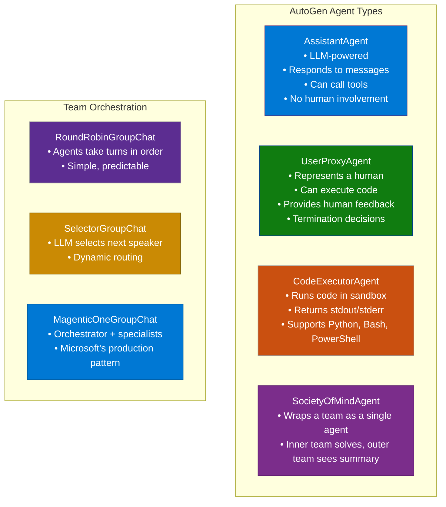
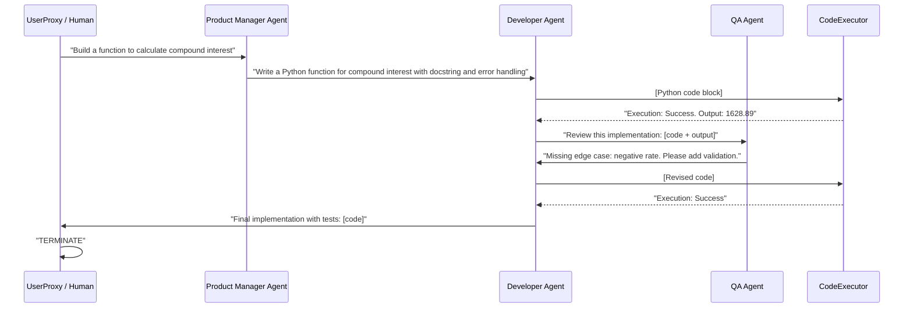
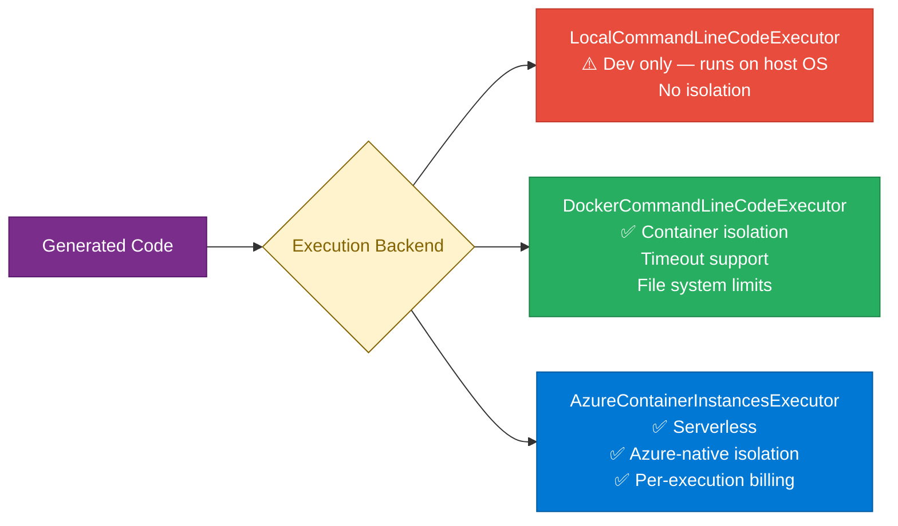
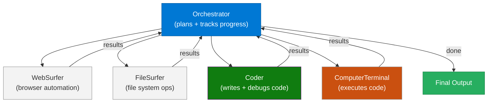

# 08 — AutoGen

> **Level:** Intermediate → Advanced | **Time to complete:** 4–5 hours | **Azure services:** Azure OpenAI, Azure Container Apps, Azure Service Bus

---

## 1. Overview

### What Is AutoGen?

**AutoGen** (Microsoft Research) is a framework for building multi-agent AI systems where multiple LLM-powered agents converse with each other to solve complex tasks. Unlike single-agent frameworks, AutoGen's core abstraction is the **conversation** — agents send messages to each other, each taking turns, until a task is complete or a termination condition is met.

AutoGen 0.4+ (the current major version, also called `autogen-agentchat`) introduces a completely redesigned architecture with:
- **Agent types**: `AssistantAgent`, `UserProxyAgent`, `CodeExecutorAgent`, `SocietyOfMindAgent`
- **Teams**: `RoundRobinGroupChat`, `SelectorGroupChat`, `MagenticOneGroupChat`
- **Structured messaging**: typed messages with metadata
- **Async-first**: fully `asyncio`-based
- **Streaming**: real-time output from any agent

### Why It Matters Enterprise-Wide

AutoGen excels at **tasks that benefit from multiple perspectives or specializations**: code review (one agent writes, another reviews), research (one searches, another synthesizes), debate-style evaluation (agents argue opposing positions). It's particularly strong for code generation workflows — the `CodeExecutorAgent` can actually run the code it writes and fix errors autonomously.

### When to Use / Avoid

| Use AutoGen | Consider alternatives |
|---|---|
| Multi-agent debate / peer review | Single-agent chat (use SK or LangChain) |
| Code generation + execution loops | Stateful graph workflows (use LangGraph) |
| Research workflows (search + synthesize) | Long-running HITL workflows (use LangGraph) |
| Teams of specialized agents | Azure-first governed deployment (use SK + Foundry) |

---

## 2. Core Concepts

### 2.1 Agent Architecture



### 2.2 Conversation Flow



### 2.3 Termination Conditions

```mermaid
graph LR
    subgraph TermConds["Termination Conditions (combinable with AND/OR)"]
        TEXT["TextMentionTermination\n'TERMINATE' appears in message"]
        MAX["MaxMessageTermination\nMax N messages exchanged"]
        TOKEN["TokenUsageTermination\nMax total tokens consumed"]
        HAND["HandoffTermination\nAgent hands off to human"]
        STOP["StopMessageTermination\nAgent returns StopMessage"]
    end

    style TEXT fill:#0078d4,color:#ffffff
    style MAX fill:#107c10,color:#ffffff
    style TOKEN fill:#ca5010,color:#ffffff

    classDef primary   fill:#0078d4,color:#fff,stroke:#005a9e
    classDef secondary fill:#7b2d8b,color:#fff,stroke:#5a1a6b
    classDef storage   fill:#2d7d4a,color:#fff,stroke:#1f5c35
    classDef security  fill:#c7372f,color:#fff,stroke:#a02020
    classDef monitor   fill:#e67300,color:#fff,stroke:#b35500
    classDef success   fill:#27ae60,color:#fff,stroke:#1e8449
    classDef warning   fill:#f39c12,color:#333,stroke:#d68910
    classDef neutral   fill:#f3f3f3,color:#333,stroke:#999
    classDef user      fill:#cce5ff,color:#004085,stroke:#004085
    classDef decision  fill:#fff3cd,color:#856404,stroke:#856404
    classDef highlight fill:#e74c3c,color:#fff,stroke:#c0392b

    class TEXT success
    class MAX warning
    class TOKEN monitor
    class HAND user
    class STOP neutral
```



---

## 3. Deep Technical Detail

### 3.1 Message Protocol

AutoGen 0.4 uses strongly typed messages:

| Message Type | When Used | Contains |
|---|---|---|
| `TextMessage` | Normal agent response | `content: str`, `source: str` |
| `ToolCallMessage` | Agent decides to call a tool | `tool_calls: list[FunctionCall]` |
| `ToolCallResultMessage` | Tool execution result | `content: list[FunctionExecutionResult]` |
| `HandoffMessage` | Transfer control to another agent/human | `target: str`, `content: str` |
| `StopMessage` | Signal conversation end | `content: str` (reason) |

### 3.2 Code Execution Safety

AutoGen's `CodeExecutorAgent` supports multiple execution backends:



**Enterprise rule:** Always use Docker or ACI executor in production. Never run agent-generated code on the host process without sandboxing.

---

## 4. Working Code Example

### Project Structure

```
autogen-enterprise/
├── .env
├── requirements.txt
├── agents.py          ← agent definitions
├── tools.py           ← tool implementations
├── teams.py           ← team configurations
└── main.py            ← demo runner
```

### agents.py

```python
# agents.py
import os
from autogen_agentchat.agents import AssistantAgent, CodeExecutorAgent
from autogen_agentchat.ui import Console
from autogen_ext.models.openai import AzureOpenAIChatCompletionClient
from autogen_ext.code_executors.docker import DockerCommandLineCodeExecutor
from azure.identity import DefaultAzureCredential
from azure.identity import get_bearer_token_provider
from dotenv import load_dotenv
from tools import TOOL_DEFINITIONS

load_dotenv()

credential = DefaultAzureCredential()
token_provider = get_bearer_token_provider(credential, "https://cognitiveservices.azure.com/.default")

model_client = AzureOpenAIChatCompletionClient(
    azure_deployment=os.environ["AZURE_OPENAI_DEPLOYMENT_NAME"],
    azure_endpoint=os.environ["AZURE_OPENAI_ENDPOINT"],
    azure_ad_token_provider=token_provider,
    api_version="2024-10-21",
    model="gpt-4o",
)

# ── Specialist Agents ────────────────────────────────────────────────

def create_product_manager():
    return AssistantAgent(
        name="ProductManager",
        model_client=model_client,
        system_message="""You are a product manager who translates business requirements into clear technical specifications.
When given a business problem:
1. Break it into concrete, testable requirements
2. Specify acceptance criteria
3. Hand off to the Developer with a clear spec
Be concise. When you're satisfied with the final output, say 'APPROVED'.""",
    )


def create_developer():
    return AssistantAgent(
        name="Developer",
        model_client=model_client,
        tools=TOOL_DEFINITIONS,
        system_message="""You are a senior Python developer. Write clean, production-ready code:
- Add type hints
- Include error handling
- Write docstrings
- Include usage examples
Always test your code by running it. Fix any errors before handing off to QA.""",
    )


def create_qa_engineer():
    return AssistantAgent(
        name="QAEngineer",
        model_client=model_client,
        system_message="""You are a QA engineer. Review code for:
- Correctness (edge cases, boundary conditions)
- Error handling completeness
- Security issues (injection, overflow)
- Performance concerns
Provide specific, actionable feedback. If code passes all checks, say 'QA APPROVED'.""",
    )


def create_code_executor():
    return CodeExecutorAgent(
        name="CodeExecutor",
        code_executor=DockerCommandLineCodeExecutor(timeout=30),
    )
```

### tools.py

```python
# tools.py
from autogen_core.tools import FunctionTool
import json


def query_database(sql_query: str) -> str:
    """Execute a read-only SQL query. Returns results as JSON."""
    if any(kw in sql_query.upper() for kw in ("INSERT", "UPDATE", "DELETE", "DROP", "ALTER")):
        return json.dumps({"error": "Only SELECT queries permitted"})
    # Mock results
    return json.dumps([
        {"month": "2025-01", "revenue": 420000, "units": 1840},
        {"month": "2025-02", "revenue": 385000, "units": 1720},
        {"month": "2025-03", "revenue": 510000, "units": 2100},
    ])


def search_documentation(query: str) -> str:
    """Search internal technical documentation."""
    return json.dumps({
        "results": [
            {"title": "Python Best Practices Guide", "relevance": 0.92, "excerpt": "Use type hints for all function signatures..."},
            {"title": "Code Review Checklist", "relevance": 0.87, "excerpt": "Always validate inputs at system boundaries..."},
        ]
    })


TOOL_DEFINITIONS = [
    FunctionTool(query_database, description="Execute read-only SQL query against enterprise database"),
    FunctionTool(search_documentation, description="Search internal technical documentation"),
]
```

### teams.py

```python
# teams.py
from autogen_agentchat.teams import RoundRobinGroupChat, SelectorGroupChat
from autogen_agentchat.conditions import (
    TextMentionTermination,
    MaxMessageTermination,
    TokenUsageTermination,
)
from agents import create_product_manager, create_developer, create_qa_engineer, create_code_executor


def build_code_review_team():
    """PM → Dev → QA → Dev (loop until approved)."""
    pm = create_product_manager()
    dev = create_developer()
    qa = create_qa_engineer()
    executor = create_code_executor()

    termination = (
        TextMentionTermination("APPROVED")
        | MaxMessageTermination(20)
        | TokenUsageTermination(max_total_token=50_000)
    )

    return RoundRobinGroupChat(
        participants=[pm, dev, executor, qa],
        termination_condition=termination,
    )


def build_selector_team():
    """Dynamic speaker selection — LLM picks who speaks next."""
    pm = create_product_manager()
    dev = create_developer()
    qa = create_qa_engineer()

    termination = TextMentionTermination("APPROVED") | MaxMessageTermination(15)

    return SelectorGroupChat(
        participants=[pm, dev, qa],
        model_client=None,  # Uses the same model client
        termination_condition=termination,
        selector_prompt="""Select the next speaker from {participants}.
Current conversation: {history}
Who should speak next to best advance the task? Return ONLY the agent name.""",
    )
```

### main.py

```python
# main.py
import asyncio
from autogen_agentchat.ui import Console
from autogen_agentchat.messages import TextMessage
from autogen_core import CancellationToken
from teams import build_code_review_team


async def run_code_review(task: str):
    team = build_code_review_team()

    print(f"=== AutoGen Code Review Team ===")
    print(f"Task: {task}\n")

    # Stream the conversation to console
    stream = team.run_stream(
        task=task,
        cancellation_token=CancellationToken(),
    )

    result = await Console(stream)
    print(f"\n=== Conversation complete ===")
    print(f"Messages exchanged: {len(result.messages)}")
    print(f"Stop reason: {result.stop_reason}")

    return result


async def run_data_analysis():
    """Example: multi-agent data analysis pipeline."""
    task = """
    Analyze monthly revenue data from the database.
    Create a Python function that:
    1. Queries the database for 2025 monthly revenue
    2. Calculates MoM growth rates
    3. Identifies months with growth > 20%
    4. Returns a formatted summary report
    Test the function and show the output.
    """
    return await run_code_review(task)


if __name__ == "__main__":
    asyncio.run(run_data_analysis())
```

---

## 5. Enterprise Pattern Notes

### Pattern: MagenticOne (Microsoft's Production Multi-Agent System)



MagenticOne is AutoGen's highest-capability configuration — an orchestrator agent that maintains a ledger of the task, tracks agent progress, and reassigns work when an agent gets stuck. Available as `MagenticOneGroupChat` in `autogen-agentchat`.

### Pattern: Human-in-the-Loop with UserProxyAgent

```python
from autogen_agentchat.agents import UserProxyAgent

human_proxy = UserProxyAgent(
    name="HumanReviewer",
    input_func=lambda prompt: input(f"\n[HUMAN NEEDED] {prompt}\nYour response: "),
)
# Add to any team — when it's the human's turn, blocks for terminal input
# In production: replace input_func with an async webhook/queue reader
```

---

## 6. Production Checklist

- [ ] Code executor uses Docker or ACI — never `LocalCommandLineCodeExecutor` in production
- [ ] `MaxMessageTermination` + `TokenUsageTermination` always set (prevents runaway conversations)
- [ ] Agents scoped to least-privilege tools (QA agent has no write tools)
- [ ] Conversation logs stored to Azure Blob Storage for audit
- [ ] Container executor has network egress restrictions (can't exfiltrate data)
- [ ] Timeout set on code executor (`timeout=30` seconds per execution)

---

## 7. Interview Q&A

### Q1 (Beginner): What is AutoGen and how does it differ from a single-agent framework?

**Answer:** AutoGen is a multi-agent conversation framework where multiple LLM-powered agents exchange messages to collaboratively solve tasks. Unlike single-agent frameworks (LangChain, Semantic Kernel) where one LLM calls tools and returns an answer, AutoGen enables a *team* of specialized agents — a product manager, developer, QA engineer — to interact in a structured conversation, each contributing their specialization. The output emerges from the collaboration, not from a single model's response.

### Q2 (Intermediate): Explain the difference between `RoundRobinGroupChat` and `SelectorGroupChat`.

**Answer:** `RoundRobinGroupChat` cycles through agents in a fixed order (A → B → C → A → B → C...) regardless of content. It's predictable and easy to reason about, but rigid — the next speaker is always predetermined. `SelectorGroupChat` uses an LLM to dynamically choose the next speaker based on the conversation so far. This is more flexible — the selector can route to the agent best positioned to respond — but adds LLM cost and latency for each turn and introduces non-determinism. Use RoundRobin when the workflow is well-defined; use Selector when you need dynamic routing based on content.

### Q3 (Advanced): How do you prevent AutoGen code executors from being used maliciously in an enterprise environment?

**Answer:** (1) **Use Docker executor** — code runs in a throwaway container with no persistent state; (2) **No network egress** — configure Docker with `--network none` or restrict to an allowlisted internal network; (3) **Read-only filesystem** — mount all data volumes as read-only; the container can only write to a designated temp directory; (4) **Execution timeout** — `timeout=30` seconds prevents infinite loops; (5) **Resource limits** — Docker CPU/memory limits prevent denial-of-service; (6) **Input sanitization** — system prompt instructs the coder agent that certain operations (file deletion, network calls to external IPs) are forbidden; (7) **Output scanning** — scan code before execution for dangerous patterns (subprocess calls with user data, `os.system`, `eval`); (8) **ACI executor** — in production, use Azure Container Instances for full isolation with per-execution billing.

---

## Cross-links

- Previous: [07 — LangGraph](./07-LangGraph.md)
- Next: [09 — OpenAI Agent SDK](./09-OpenAI-Agent-SDK.md)
- Related: [10 — Multi-Agent Systems](./10-Multi-Agent-Systems.md) | [11 — Agent Orchestration](./11-Agent-Orchestration.md)

---

*Module 08 | Series: Enterprise Agentic AI Tutorial | Last updated: June 2026*
